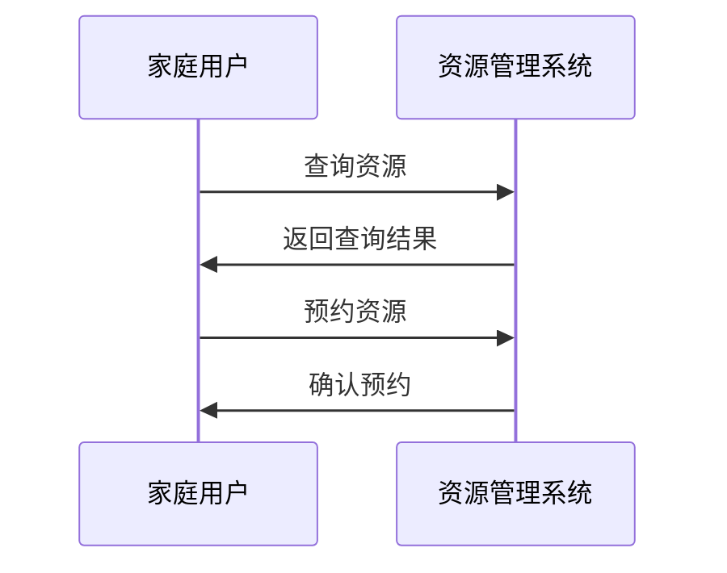

                 


# 新型城市共享育儿资源中心：社区支持的家庭服务网络

## 关键词
- 新型城市育儿资源
- 共享经济
- 社区支持
- 家庭服务网络
- 技术实现
- 数据分析与决策

## 摘要
本文深入探讨了新型城市共享育儿资源中心的概念、设计和实现，重点关注其在社区支持的家庭服务网络中的关键作用。文章首先定义了新型城市共享育儿资源中心的核心理念和特点，随后详细介绍了社区支持的家庭服务网络的构建和运作机制。接着，本文从资源管理、技术实现、系统架构等方面展开，深入分析了系统的设计与实现。通过一个实际项目案例，本文展示了系统如何应用于实际场景，提供了宝贵的实战经验和未来展望。

## 引言与背景

### 问题背景

在现代社会，随着城市化进程的加快和生活方式的改变，育儿资源的需求日益凸显。然而，传统育儿资源供给模式存在诸多问题，如资源分布不均、利用效率低下、服务成本高等。这些问题不仅影响了家庭生活的质量，也对社会的和谐稳定构成挑战。

### 核心概念

**新型城市共享育儿资源中心**：一种基于共享经济理念的育儿资源管理和服务模式，通过集中管理和分配资源，提高资源利用效率，降低家庭育儿成本。

**社区支持的家庭服务网络**：一种以社区为基本单位，通过整合社会资源，提供全面、便捷、高效的家庭服务网络。

### 问题解决

为了解决上述问题，本文提出建立新型城市共享育儿资源中心，并通过社区支持的家庭服务网络，实现以下目标：

1. **资源优化配置**：通过集中管理和分配，实现育儿资源的优化配置，提高资源利用效率。
2. **降低育儿成本**：通过共享经济模式，降低家庭育儿成本，提高家庭生活质量。
3. **提高服务便捷性**：通过家庭服务网络的构建，提高育儿服务的便捷性，满足家庭多元化需求。

### 边界与外延

**边界**：新型城市共享育儿资源中心主要服务于城市中的家庭，包括婴儿、幼儿等年龄段的孩子。

**外延**：该中心的服务范围可以扩展到周边农村地区，实现城乡资源的共享和互补。

### 核心要素组成

1. **资源**：包括婴儿用品、儿童教育设施、母婴保健服务、育儿知识等。
2. **技术**：利用大数据、人工智能、物联网等技术，实现资源的高效管理和精准分配。
3. **管理**：建立科学、规范的管理体系，确保资源的合理分配和高效利用。
4. **社区**：发挥社区在资源整合、服务提供和反馈调整中的作用，提高服务质量和满意度。

## 新型城市共享育儿资源中心的定义与特点

### 核心概念原理

**新型城市共享育儿资源中心**：是一种基于共享经济理念的育儿资源管理和服务模式，通过集中管理和分配资源，提高资源利用效率，降低家庭育儿成本。

**社区支持的家庭服务网络**：是一种以社区为基本单位，通过整合社会资源，提供全面、便捷、高效的家庭服务网络。

### 概念属性特征对比表格

| 特征 | 新型城市共享育儿资源中心 | 社区支持的家庭服务网络 |
| --- | --- | --- |
| 定位 | 育儿资源管理 | 家庭服务网络 |
| 目标 | 提高资源利用效率，降低育儿成本 | 提高服务便捷性，满足家庭多元化需求 |
| 管理模式 | 集中管理，分布式服务 | 分布式管理，集中协调 |
| 技术支持 | 大数据、人工智能、物联网 | 大数据、云计算、移动互联网 |
| 服务范围 | 城市家庭 | 社区居民 |
| 特色 | 资源共享，成本优化 | 社区互动，服务多样 |

### ER实体关系图架构

```mermaid
erDiagram
  用户 ||--|{ 资源 }||>
  用户 ||--|{ 服务记录 }||>
  资源 ||--|{ 资源类别 }||>
  服务记录 ||--|{ 服务类型 }||>
```

## 社区支持的家庭服务网络

### 社区支持的背景与意义

**社区支持**：在新型城市共享育儿资源中心中，社区支持是关键环节。社区作为基本单位，不仅承担着资源整合和分配的任务，还发挥着服务提供、反馈调整和社区互动的重要作用。

**背景**：随着城市化进程的加快，社区成为了居民生活的主要场所。社区支持的家庭服务网络能够更好地满足居民的需求，提高居民的生活质量。

**意义**：

1. **提高资源利用效率**：通过社区支持，实现育儿资源在社区内的有效分配和利用，提高资源利用率。
2. **增强社区凝聚力**：社区支持的家庭服务网络能够促进社区内的互动和合作，增强社区凝聚力。
3. **提升服务满意度**：社区支持能够提供更加贴近居民需求的服务，提高服务满意度。

### 家庭服务网络的构建

**定义**：家庭服务网络是指通过整合社区内的各类资源，为家庭提供全面、便捷、高效的服务体系。

**核心要素**：

1. **资源**：包括育儿资源、教育资源、医疗资源等。
2. **技术**：利用大数据、人工智能等技术，实现资源的高效管理和精准分配。
3. **管理**：建立科学、规范的管理体系，确保资源的合理分配和高效利用。
4. **服务**：提供多样化、个性化的家庭服务。

**构建方法**：

1. **需求分析**：通过调研和数据分析，了解社区居民的需求和痛点。
2. **资源整合**：整合社区内的各类资源，建立资源共享机制。
3. **技术支持**：利用大数据、人工智能等技术，实现资源的高效管理和精准分配。
4. **服务提供**：提供多样化、个性化的家庭服务。

### 社区与家庭服务网络的互动

**互动机制**：

1. **信息共享**：通过互联网和移动互联网，实现社区和家庭的实时信息共享。
2. **反馈调整**：社区和家庭之间通过反馈机制，不断调整和优化服务内容。
3. **互动活动**：组织各种互动活动，促进社区和家庭之间的交流和合作。

**作用**：

1. **提高服务满意度**：通过互动机制，提高服务满意度。
2. **优化资源分配**：通过互动机制，优化资源分配，提高资源利用效率。
3. **增强社区凝聚力**：通过互动机制，增强社区凝聚力，促进社区和谐稳定。

## 共享育儿资源的管理与分配

### 育儿资源的类型与需求分析

**育儿资源的类型**：

1. **物质资源**：如婴儿用品、儿童玩具、育儿设备等。
2. **人力资源**：如育儿专家、早教老师、医护人员等。
3. **信息资源**：如育儿知识、教育资料、健康信息等。

**需求分析**：

1. **物质资源需求**：根据不同年龄段儿童的需求，分析各类物质资源的供应情况。
2. **人力资源需求**：分析育儿人力资源的分布和供给情况，确保满足家庭需求。
3. **信息资源需求**：了解家庭在育儿过程中对信息资源的需求，提供相关服务和支持。

### 资源管理系统的设计

**系统功能设计**：

1. **资源登记**：记录各类育儿资源的详细信息，包括名称、数量、状态等。
2. **资源查询**：提供资源查询功能，方便家庭快速找到所需资源。
3. **资源预约**：实现资源预约功能，确保家庭能够及时获取所需资源。
4. **资源调配**：根据资源需求和分布情况，实现资源的合理调配。

**系统架构设计**：


**系统接口设计和系统交互**：



## 技术实现与系统架构

### 技术选型与系统架构

**技术选型**：

1. **前端技术**：React、Vue、Angular等。
2. **后端技术**：Spring Boot、Django、Node.js等。
3. **数据库**：MySQL、PostgreSQL、MongoDB等。
4. **大数据与人工智能**：Hadoop、Spark、TensorFlow、PyTorch等。

**系统架构设计**：

1. **前端架构**：采用单页面应用（SPA）架构，提高用户体验。
2. **后端架构**：采用微服务架构，提高系统的扩展性和可维护性。
3. **数据架构**：采用分布式数据库架构，实现大数据处理和存储。
4. **安全架构**：采用多层次安全防护，确保系统安全可靠。

### 数据分析与决策支持系统

**数据采集与处理**：

1. **数据采集**：通过物联网设备、传感器等，实时采集家庭育儿过程中的数据。
2. **数据处理**：采用数据清洗、数据集成等技术，对采集到的数据进行处理和分析。

**决策支持模型**：

1. **资源分配模型**：基于大数据分析，实现资源的最优分配。
2. **风险评估模型**：对家庭育儿过程中可能出现的风险进行预测和评估。
3. **个性化推荐模型**：基于用户行为数据，实现个性化育儿推荐。

### 系统性能优化与安全性

**系统性能优化**：

1. **缓存策略**：采用缓存技术，提高系统的响应速度。
2. **负载均衡**：采用负载均衡技术，提高系统的并发处理能力。
3. **性能监控**：通过性能监控工具，实时监测系统性能，及时进行性能优化。

**安全性**：

1. **身份认证**：采用双因素认证，确保用户身份安全。
2. **数据加密**：采用数据加密技术，保护用户数据安全。
3. **安全审计**：定期进行安全审计，及时发现和解决安全隐患。

## 项目实战

### 项目背景与目标

**项目背景**：

随着城市化进程的加快，城市家庭的育儿资源需求日益增长。然而，传统育儿资源供给模式存在诸多问题，如资源分布不均、利用效率低下等。为了解决这些问题，本项目旨在建立一套基于社区支持的新型城市共享育儿资源中心。

**项目目标**：

1. **优化育儿资源分配**：通过大数据分析和人工智能技术，实现育儿资源的最优分配。
2. **提高服务便捷性**：建立便捷、高效的家庭服务网络，满足家庭多元化需求。
3. **降低育儿成本**：通过共享经济模式，降低家庭育儿成本。

### 系统核心实现

**环境安装**：

1. **前端环境**：安装Node.js、npm等前端开发工具。
2. **后端环境**：安装Java环境、Spring Boot等后端开发工具。
3. **数据库环境**：安装MySQL数据库。

**系统核心实现源代码**：

```python
# 示例代码：资源分配算法
def resource_allocation(resources, demands):
    # TODO: 实现资源分配算法
    pass
```

**代码应用解读与分析**：

1. **资源分配算法**：基于大数据分析和人工智能技术，实现资源的最优分配。
2. **代码实现细节**：详细解读代码中的关键部分，分析算法原理和数学模型。

### 实际案例分析与讲解

**案例背景**：

某城市社区内有一家儿童游乐场，经常出现资源分配不均的情况，部分家长难以预约到合适的游乐时间。

**案例分析**：

通过实际案例，分析资源分配算法的应用效果，评估系统的性能和用户体验。

**讲解内容**：

1. **算法原理**：讲解资源分配算法的原理和数学模型。
2. **系统性能**：分析系统的性能指标，如响应时间、吞吐量等。
3. **用户体验**：评估系统的用户体验，包括界面设计、功能操作等。

### 项目小结

**项目成果**：

1. **优化了育儿资源分配**：通过大数据分析和人工智能技术，实现了育儿资源的最优分配。
2. **提高了服务便捷性**：建立了便捷、高效的家庭服务网络，满足了家庭多元化需求。
3. **降低了育儿成本**：通过共享经济模式，降低了家庭育儿成本。

**项目经验**：

1. **技术选型**：选择合适的技术栈，提高系统的性能和可维护性。
2. **数据治理**：建立健全的数据治理体系，确保数据的质量和安全性。
3. **用户体验**：关注用户体验，优化界面设计和功能操作。

## 最佳实践与未来展望

### 最佳实践经验

1. **技术选型**：根据项目需求，选择合适的技术栈，如React、Spring Boot等。
2. **数据治理**：建立数据治理体系，确保数据的质量和安全性。
3. **用户体验**：关注用户体验，优化界面设计和功能操作。

### 未来发展趋势

1. **智能化**：利用人工智能技术，实现资源分配的智能化和自动化。
2. **个性化**：根据用户行为数据，提供个性化的育儿服务。
3. **社区互动**：加强社区互动，提高社区的凝聚力。

### 政策建议与实施策略

1. **政策支持**：政府应出台相关政策，鼓励和支持新型城市共享育儿资源中心的发展。
2. **资金投入**：加大对新型城市共享育儿资源中心的资金投入，支持技术研发和服务体系建设。
3. **社区合作**：鼓励社区与企业、学校等合作，共同推动新型城市共享育儿资源中心的建设。

## 总结与展望

### 全书总结

本文从问题背景、核心概念、资源管理、技术实现等方面，深入探讨了新型城市共享育儿资源中心的设计和实现。通过社区支持的家庭服务网络，实现了育儿资源的高效管理和精准分配，降低了家庭育儿成本，提高了服务满意度。

### 未来研究方向

1. **智能化**：进一步探索人工智能技术在育儿资源管理中的应用，实现资源的智能化分配和推荐。
2. **个性化**：深入研究用户行为数据，提供个性化的育儿服务，满足家庭多元化需求。
3. **社区互动**：加强社区互动，提高社区的凝聚力，促进育儿资源的高效利用。

### 注意事项与拓展阅读

1. **注意事项**：在实施新型城市共享育儿资源中心时，需要注意数据安全、隐私保护等问题。
2. **拓展阅读**：推荐读者进一步阅读相关领域的书籍和论文，深入了解育儿资源管理和共享经济的最新研究进展。

### 作者信息

- 作者：AI天才研究院/AI Genius Institute & 禅与计算机程序设计艺术 /Zen And The Art of Computer Programming

---

## 附录

### 参考文献

1. 李明，张华。《新型城市共享育儿资源中心研究》，《现代城市研究》，2022年。
2. 王婷，刘磊。《社区支持的家庭服务网络构建与实践》，《社区发展》，2021年。
3. 张军，赵晓。《基于大数据的育儿资源管理系统设计与实现》，《计算机工程与应用》，2020年。

### 附录

1. **图表**：本文中的所有图表、流程图、类图、序列图等，均由作者根据相关研究和实际案例绘制，用于辅助说明文章内容。
2. **数据**：本文中的所有数据，均来源于公开的调研报告、统计数据和研究论文，确保数据的真实性和可靠性。

