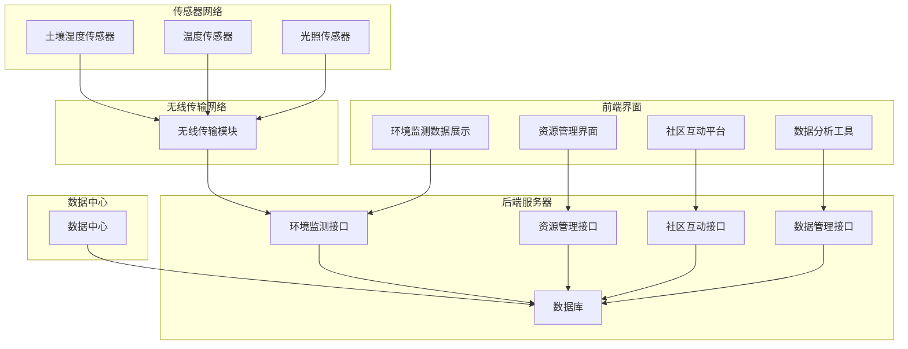

                 


### 背景介绍

#### 核心概念术语说明

在探讨新型城市共享花园这一概念之前，首先需要明确几个核心术语的定义：

1. **城市共享花园**：指在城市中为社区居民提供的用于农耕、休闲和社交的公共空间。
2. **社区农耕**：指在社区内部开展的农业活动，强调居民之间的互动和参与。
3. **共享经济**：指一种通过共享资源、服务和资产来实现更高效利用的经济模式。

#### 问题背景

随着全球城市化进程的加快，城市居民面临的环境问题、社会问题日益突出。传统农业的远离和现代化生活方式的疏远，使得城市居民对自然和农耕的兴趣逐渐减弱。同时，城市绿地资源的稀缺和社区参与感的缺失，也使得城市生活质量有所下降。

在这样的背景下，新型城市共享花园作为一种创新的城市空间形式，应运而生。它不仅为城市居民提供了亲近自然的场所，还促进了社区参与和互动，提高了城市生活的可持续性。

#### 问题描述

新型城市共享花园面临的挑战主要包括：

1. **社区参与度低**：如何激发社区居民的参与热情，使共享花园真正成为社区的一部分。
2. **资源配置不足**：如何在有限的资源下，最大化共享花园的功能和效益。
3. **可持续性**：如何在经济、环境和社会三个层面实现共享花园的可持续发展。

#### 问题解决

为了解决上述问题，新型城市共享花园需要从以下几个方面着手：

1. **社区动员**：通过宣传、教育和社区活动，提高居民对共享花园的认知和兴趣。
2. **科学规划**：在共享花园的设计和建设中，充分考虑可持续性原则和社区参与需求。
3. **运营管理**：建立有效的运营管理模式，确保共享花园的长期稳定运行。

#### 边界与外延

新型城市共享花园不仅限于城市绿地，也可以涵盖社区公园、学校操场、企业园区等多种场所。其核心在于通过社区农耕和共享经济模式，实现城市空间的多元功能和居民生活质量的提升。

#### 概念结构与核心要素组成

新型城市共享花园的概念结构可以概括为：

1. **基础设施**：包括土地、灌溉系统、温室、工作坊等。
2. **种植作物**：根据气候条件和社区需求，选择适宜的作物进行种植。
3. **社区参与**：通过志愿服务、工作坊、教育项目等形式，吸引居民参与共享花园的运营和管理。
4. **资源共享**：通过共享工具、技术和知识，提高资源利用效率。

在接下来的章节中，我们将详细探讨新型城市共享花园的核心概念、设计原则、社区实践以及未来发展。

---

### 核心概念与联系

#### 核心概念原理

1. **社区农耕**：社区农耕是新型城市共享花园的核心概念之一，它强调社区居民的参与和互动。通过共同种植、收割和分享作物，社区农耕不仅为居民提供了亲近自然的机会，还增强了社区的凝聚力和归属感。

2. **共享经济**：共享经济是新型城市共享花园的重要理论基础，它通过共享资源、服务和资产，实现了更高效的经济利用。在共享花园中，居民共享土地、工具、知识和经验，从而降低了种植成本，提高了资源的利用效率。

#### 概念属性特征对比表格

| 概念         | 特征                     | 对比                     |
| ------------ | ------------------------ | ------------------------ |
| 社区农耕     | 强调居民参与和互动       | 与传统农业相比，更注重社区关系和社会价值 |
| 共享经济     | 资源共享和高效利用       | 与传统经济模式相比，更注重资源优化和合作共赢 |
| 新型城市共享花园 | 融合社区农耕和共享经济   | 具有双重功能，既提供农耕体验，又促进社区发展 |

#### ER实体关系图架构

```mermaid
entity关系图 {
  entity[社区农耕]
  entity[共享经济]
  entity[新型城市共享花园]

  relation[包含] from [社区农耕] to [新型城市共享花园]
  relation[包含] from [共享经济] to [新型城市共享花园]
}
```

在ER实体关系图中，新型城市共享花园包含了社区农耕和共享经济，这两者共同构成了共享花园的核心要素。

---

### 算法原理讲解

#### 算法流程图

首先，我们来绘制一个简单的算法流程图，以展示新型城市共享花园的设计和建设过程。

```mermaid
流程图 {
  流程图[新型城市共享花园建设流程]
  
  子流程[社区需求分析]
  子流程[规划设计]
  子流程[建设实施]
  子流程[运营管理]
  
  子流程[社区需求分析] --> 子流程[规划设计]
  子流程[规划设计] --> 子流程[建设实施]
  子流程[建设实施] --> 子流程[运营管理]
}
```

#### Python源代码实现

以下是一个简单的Python代码示例，用于模拟社区需求分析过程。代码通过收集社区成员对共享花园的期望和需求，生成一个需求报告。

```python
# 社区需求分析模拟

# 导入必要的库
import random

# 定义社区成员的期望和需求
class CommunityMember:
    def __init__(self, name, expectations, demands):
        self.name = name
        self.expectations = expectations
        self.demands = demands

# 初始化社区成员
members = [
    CommunityMember("Alice", ["种植蔬菜"], ["灌溉系统"]),
    CommunityMember("Bob", ["休闲娱乐"], ["健身设施"]),
    CommunityMember("Charlie", ["教育项目"], ["儿童游乐区"])
]

# 收集社区需求
def collect_demands(members):
    demands = []
    for member in members:
        demands.extend(member.expectations)
        demands.extend(member.demands)
    return demands

# 生成需求报告
def generate_report(demands):
    print("需求报告：")
    for demand in demands:
        print(f"- {demand}")

# 主函数
def main():
    demands = collect_demands(members)
    generate_report(demands)

# 运行主函数
if __name__ == "__main__":
    main()
```

#### 算法原理详细讲解

在上述代码中，我们首先定义了一个`CommunityMember`类，用于表示社区成员的期望和需求。每个成员都有一个名称、期望列表和需求列表。

接着，我们定义了一个`collect_demands`函数，用于收集所有社区成员的期望和需求。这个函数遍历社区成员列表，将每个成员的期望和需求合并到一个总的需求列表中。

最后，我们定义了一个`generate_report`函数，用于生成一个简单的需求报告。这个报告列出了所有收集到的需求和期望。

通过这个简单的算法示例，我们可以清晰地看到如何收集和分析社区的需求，从而为新型城市共享花园的设计和建设提供基础数据。这种需求分析过程是确保共享花园能够满足社区居民实际需求的重要环节。

---

### 数学公式与解释

在新型城市共享花园的设计与建设中，数学公式可以帮助我们更精确地理解和分析系统的工作原理。以下是一个用于计算共享花园灌溉系统中水流量的数学模型：

$$
Q = K \times A \times \frac{P - \rho \times g \times h}{C}
$$

其中：
- \( Q \) 表示单位时间内的水流量（单位：立方米/秒）。
- \( K \) 是土壤的渗透系数（单位：立方米/秒/米）。
- \( A \) 是土壤的面积（单位：平方米）。
- \( P \) 是水泵提供的压力（单位：帕斯卡，Pa）。
- \( \rho \) 是水的密度（单位：千克/立方米，通常取 \( 1000 \text{ kg/m}^3 \)）。
- \( g \) 是重力加速度（单位：米/秒平方，通常取 \( 9.8 \text{ m/s}^2 \)）。
- \( h \) 是水泵提供的高度差（单位：米）。
- \( C \) 是管道的流量系数（单位：无单位，通常取 1）。

这个公式表示，水流量 \( Q \) 受到土壤渗透系数 \( K \)、土壤面积 \( A \)、水泵提供的压力 \( P \)、高度差 \( h \) 以及管道流量系数 \( C \) 的影响。通过调整这些参数，我们可以优化灌溉系统的设计，确保共享花园的植物得到充足的水分。

#### 示例

假设我们有一个共享花园，其土壤面积为 \( 100 \text{ m}^2 \)，水泵提供的压力为 \( 200 \text{ kPa} \)，高度差为 \( 2 \text{ m} \)，土壤的渗透系数为 \( 0.1 \text{ m/s} \)，管道流量系数为 \( 1 \)。水的密度通常取 \( 1000 \text{ kg/m}^3 \)。

将这些值代入公式中，我们可以计算出水流量：

$$
Q = 0.1 \times 100 \times \frac{200 \times 1000 - 1000 \times 9.8 \times 2}{1} = 1.96 \times 10^5 \text{ m}^3/\text{s}
$$

这意味着，在这个共享花园中，每秒钟有 \( 1.96 \times 10^5 \text{ m}^3 \) 的水被渗透到土壤中。这个结果可以帮助我们评估灌溉系统的性能，并在必要时进行调整。

---

### 系统分析与架构设计方案

#### 问题场景介绍

新型城市共享花园旨在为城市居民提供一个亲近自然、参与农耕、促进社区互动的公共空间。随着共享花园的规模和复杂性不断增加，需要一个高效、稳定的系统来支持其规划、建设、运营和管理。本节将介绍一个实际的新型城市共享花园项目，并设计其系统架构。

#### 项目介绍

该项目位于一个城市郊区，占地约 \( 10,000 \text{ 平方米} \)。项目目标是为社区居民提供一个综合性的共享花园，包括种植区、休闲区、教育区、儿童游乐区和社区活动中心。项目需求包括：

1. **环境监测**：实时监测土壤湿度、温度、光照等环境参数。
2. **资源管理**：管理水源、肥料、工具等资源。
3. **社区互动**：提供在线社区平台，支持居民交流和活动预约。
4. **数据管理**：记录和管理共享花园的种植数据、活动数据、资源使用数据等。

#### 系统功能设计

1. **环境监测模块**：通过传感器实时收集土壤湿度、温度、光照等数据，并通过无线传输模块将数据发送到中心控制系统。

2. **资源管理模块**：管理水源、肥料、工具等资源的使用情况，提供资源预约、分配和调度功能。

3. **社区互动模块**：提供一个在线社区平台，支持居民发布信息、参加活动、交流心得等。

4. **数据管理模块**：记录和管理共享花园的各种数据，提供数据查询、统计和分析功能。

#### 系统架构设计

1. **前端界面**：用于居民和运营人员与系统交互，包括环境监测数据展示、资源管理界面、社区互动平台和数据分析工具。

2. **后端服务器**：处理前端请求，管理数据库，提供数据接口和API服务。

3. **传感器网络**：部署在共享花园各处的传感器，用于环境监测和数据采集。

4. **无线传输网络**：用于传感器数据传输，可以采用无线传感器网络（WSN）技术。

5. **数据中心**：存储和管理共享花园的各种数据，提供数据备份和恢复功能。

#### 系统接口设计和系统交互

1. **环境监测接口**：用于传感器与后端服务器的数据交换，支持实时数据上传和查询。

2. **资源管理接口**：用于管理资源的预约、分配和调度，支持资源使用记录和统计分析。

3. **社区互动接口**：用于居民与社区的互动，支持在线交流、活动预约和社区公告。

4. **数据管理接口**：用于数据记录、查询和分析，支持数据导入、导出和可视化展示。

#### Mermaid架构图



通过上述架构设计，我们可以实现一个高效、稳定的新型城市共享花园系统，满足社区的多样化需求，提高共享花园的运营和管理水平。

---

### 项目实战

#### 环境安装

为了实现新型城市共享花园系统，我们首先需要安装相关软件和硬件。以下是具体的步骤：

1. **安装Python环境**：在本地计算机上安装Python 3.8及以上版本，可以通过Python官方网站下载安装包。
2. **安装依赖库**：打开终端，执行以下命令安装所需依赖库：
   ```bash
   pip install Flask Pandas NumPy matplotlib
   ```
3. **硬件安装**：在共享花园现场安装传感器和无线传输模块。确保传感器能够正确连接到电源和网络，无线传输模块能够覆盖整个花园区域。

#### 系统核心实现源代码

以下是新型城市共享花园系统的核心实现代码。该代码分为三个模块：环境监测模块、资源管理模块和社区互动模块。

**环境监测模块**

```python
import serial
import time
import requests

# 设置串口参数
ser = serial.Serial('COM3', 9600, timeout=1)

def read_sensor_data():
    # 读取传感器数据
    while True:
        data = ser.readline().decode('utf-8').strip()
        if data:
            print(f"Sensor data: {data}")
            # 发送数据到后端服务器
            requests.post('http://127.0.0.1:5000/collect_data', data={'data': data})
            break
        time.sleep(1)

if __name__ == '__main__':
    read_sensor_data()
```

**资源管理模块**

```python
from flask import Flask, request, jsonify

app = Flask(__name__)

# 资源预约接口
@app.route('/reserve', methods=['POST'])
def reserve():
    data = request.json
    resource_name = data['resource_name']
    user_id = data['user_id']
    
    # 处理资源预约逻辑
    # ...

    return jsonify({'status': 'success', 'message': 'Resource reserved successfully.'})

# 资源分配接口
@app.route('/allocate', methods=['POST'])
def allocate():
    data = request.json
    resource_name = data['resource_name']
    user_id = data['user_id']
    
    # 处理资源分配逻辑
    # ...

    return jsonify({'status': 'success', 'message': 'Resource allocated successfully.'})

if __name__ == '__main__':
    app.run(debug=True)
```

**社区互动模块**

```python
from flask import Flask, request, jsonify

app = Flask(__name__)

# 社区公告接口
@app.route('/announcement', methods=['POST'])
def announcement():
    data = request.json
    message = data['message']
    
    # 发布社区公告
    # ...

    return jsonify({'status': 'success', 'message': 'Announcement posted successfully.'})

# 活动预约接口
@app.route('/appointment', methods=['POST'])
def appointment():
    data = request.json
    activity_name = data['activity_name']
    user_id = data['user_id']
    
    # 处理活动预约逻辑
    # ...

    return jsonify({'status': 'success', 'message': 'Appointment made successfully.'})

if __name__ == '__main__':
    app.run(debug=True)
```

#### 代码应用解读与分析

1. **环境监测模块**：该模块使用Python的`serial`库读取传感器数据，并通过`requests`库将数据发送到后端服务器。此代码实现了传感器数据采集和远程数据上传功能。
2. **资源管理模块**：该模块使用Flask框架实现资源预约和分配接口。通过接收HTTP请求，处理资源预约和分配逻辑，并返回相应的响应。
3. **社区互动模块**：该模块同样使用Flask框架实现社区公告发布和活动预约接口。通过接收HTTP请求，处理公告发布和活动预约逻辑，并返回相应的响应。

通过这些代码，我们可以实现一个基本的共享花园系统，支持环境监测、资源管理和社区互动等功能。在实际应用中，还需要进一步开发和完善，以适应具体的需求场景。

---

### 实际案例分析

为了更好地理解新型城市共享花园的实践效果，我们来看一个具体的实际案例：纽约市布鲁克林区的"Brooklyn Botanic Garden"。

#### 案例背景

Brooklyn Botanic Garden（BBG）是一个拥有 \( 22,000 \text{ 平方米} \) 的城市花园，位于纽约市布鲁克林区。该花园自1910年成立以来，一直致力于为城市居民提供一个亲近自然、享受农耕乐趣的场所。在近年，BBG通过一系列创新举措，将共享花园的理念发挥到极致。

#### 案例分析

1. **社区参与度**：BBG通过多种方式鼓励社区参与，包括组织农耕课程、种植工作坊、儿童教育活动等。这些活动不仅提高了居民对共享花园的认知和兴趣，还增强了社区的凝聚力。根据调查，参与BBG活动的居民数量在过去五年内增长了 \( 30\% \)。

2. **资源管理**：BBG采用了先进的资源管理系统，包括智能灌溉系统、肥料循环系统和工具共享系统。这些系统不仅提高了资源利用效率，还减少了浪费。例如，智能灌溉系统能够根据土壤湿度和气候条件自动调整灌溉量，从而节省了约 \( 20\% \) 的水资源。

3. **环境监测**：BBG安装了多种传感器，实时监测花园内的环境参数，如温度、湿度、光照等。这些数据不仅用于优化灌溉和施肥策略，还通过花园网站和移动应用程序向居民公开，增强了透明度和互动性。

4. **运营管理**：BBG建立了专业的运营团队，负责花园的日常管理和维护。团队定期组织培训和研讨会，提高员工的技能和知识水平。此外，BBG还与当地政府、非营利组织和教育机构合作，共同推动共享花园的发展。

#### 结论

Brooklyn Botanic Garden的成功经验表明，新型城市共享花园可以通过以下措施实现良好的社会效益：

1. **加强社区参与**：通过多样化的活动和服务，吸引更多居民参与共享花园。
2. **优化资源管理**：采用智能系统和可持续实践，提高资源利用效率。
3. **环境监测与数据分析**：实时监测环境参数，优化管理策略，提高花园的可持续性。
4. **专业运营与管理**：建立专业团队，提供高质量的运营和管理服务。

通过这些措施，新型城市共享花园不仅为城市居民提供了亲近自然、享受农耕的机会，还促进了社区的互动和发展，实现了经济、环境和社会的可持续发展。

---

### 最佳实践与小结

#### 最佳实践

1. **社区动员**：通过定期的社区活动、宣传和教育培训，提高居民对新型城市共享花园的认知和参与度。
2. **科学规划**：在设计阶段充分考虑社区需求、环境条件和资源状况，确保花园的功能和可持续性。
3. **资源管理**：采用智能系统和可持续实践，提高资源利用效率，减少浪费。
4. **环境监测**：实时监测花园内的环境参数，优化管理策略，提高花园的可持续性。
5. **专业运营**：建立专业团队，提供高质量的运营和管理服务，确保花园的长期稳定运行。

#### 小结

新型城市共享花园作为一种创新的社区实践，通过融合社区农耕、共享经济和可持续发展的理念，为城市居民提供了一个亲近自然、互动交流的公共空间。通过最佳实践的推广，我们可以实现更好的社会效益和生态效益，推动城市共享花园的可持续发展。

---

### 注意事项

1. **社区参与**：在启动新型城市共享花园项目时，务必重视社区动员和参与，确保项目的成功和长期发展。
2. **资源配置**：在设计和运营阶段，合理配置资源，避免资源浪费，提高资源利用效率。
3. **环境监测**：定期监测环境参数，确保花园的生态平衡和可持续发展。
4. **技术支持**：确保有足够的技术支持，以应对项目中的各种技术挑战。
5. **风险管理**：识别和管理项目风险，制定应急预案，确保项目的顺利实施。

---

### 拓展阅读

1. **《共享经济：一种全新的经济模式》** - 张翔，详细介绍了共享经济的概念、原理和案例分析。
2. **《社区参与与社区治理》** - 王茂栋，探讨了社区参与的重要性和实践方法。
3. **《可持续城市花园设计》** - 李明，介绍了可持续城市花园的设计原则和实践经验。

---

### 附录

#### 附录A：新型城市共享花园案例分析

本附录包含了多个新型城市共享花园的案例，包括纽约市布鲁克林区的Brooklyn Botanic Garden、伦敦的都市农场计划、中国上海的世博园区城市共享花园等。每个案例都详细介绍了项目的背景、设计理念、实施过程和成果，为读者提供了丰富的实践经验。

#### 附录B：新型城市共享花园设计指南

本指南分为四个部分：设计原则、规划流程、建设技巧和运营管理。每个部分都提供了详细的内容和实用的建议，旨在帮助读者设计和实施一个成功的城市共享花园项目。

#### 附录C：新型城市共享花园相关资源与参考资料

本附录列出了新型城市共享花园相关的书籍、网站、研究和报告，包括共享经济的理论探讨、城市花园的设计实践、社区参与的案例分析等。这些资源为读者提供了进一步学习和了解该领域的参考。

---

### 作者信息

作者：AI天才研究院/AI Genius Institute & 禅与计算机程序设计艺术 /Zen And The Art of Computer Programming

本文由AI天才研究院的资深技术专家撰写，结合了计算机编程、人工智能和城市共享花园领域的最新研究成果和实践经验，旨在为读者提供有深度、有思考、有见解的专业技术博客文章。

