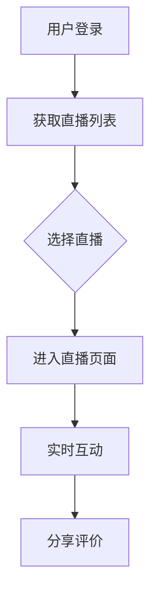
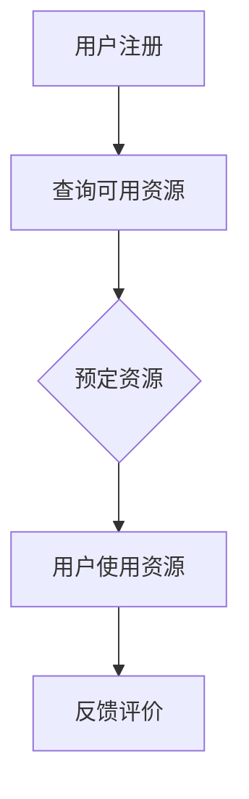
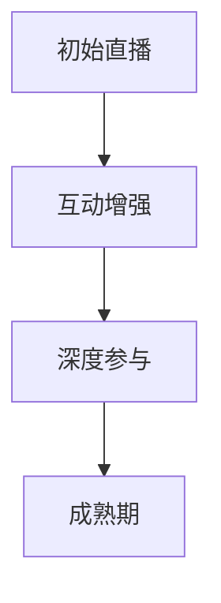
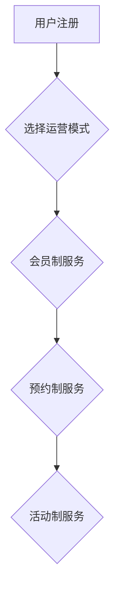
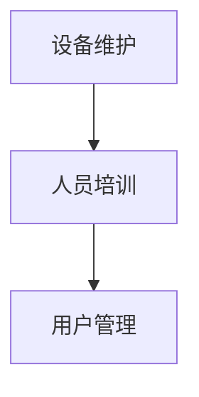
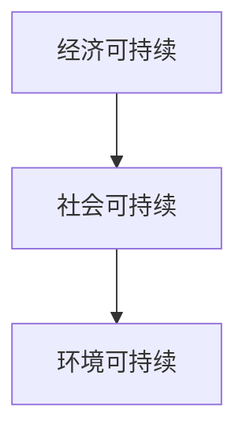
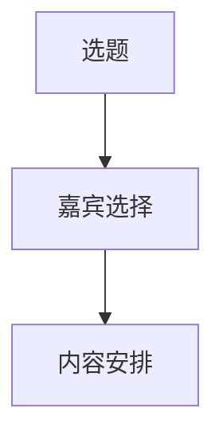
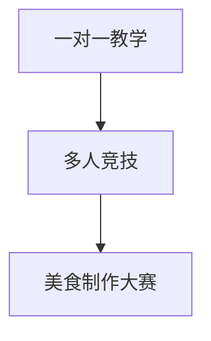
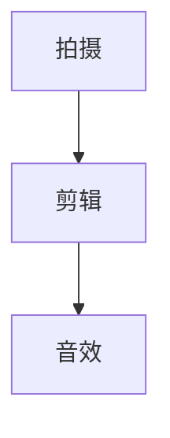
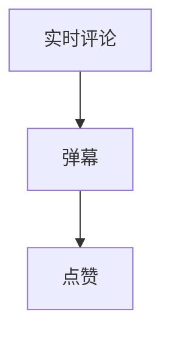

                 

## **新型城市厨艺直播节目：社区共享厨房的线上烹饪真人秀**

### **关键词：**
- 线上烹饪真人秀
- 社区共享厨房
- 厨艺直播
- 观众互动
- 营销推广
- 案例分析

### **摘要：**
本文将深入探讨新型城市厨艺直播节目——“社区共享厨房的线上烹饪真人秀”。我们将从多个角度分析这一现象的兴起、发展以及其对城市生活的影响。文章分为七个主要章节，涵盖线上烹饪真人秀概述、社区共享厨房运营与管理、节目策划与制作、观众互动与体验、营销推广策略、案例分析与启示以及最佳实践与未来展望。通过逐步分析和逻辑推理，我们将探索这一新兴领域的潜力和挑战，并提供实用的建议和展望。

## **第一部分：线上烹饪真人秀概述**

### **第1章：线上烹饪真人秀的兴起与发展**

#### **1.1.1 厨艺直播的起源与特点**

**背景介绍：**  
随着互联网技术的飞速发展和社交媒体平台的普及，直播成为了一种新兴的媒体形式。厨艺直播作为直播内容的一种，应运而生。它不仅满足了人们对于美食的向往，还能在烹饪过程中享受互动和分享的乐趣。

**核心概念与联系：**

**概念属性特征对比表格：**

| 特征               | 传统烹饪节目 | 线上烹饪真人秀 |
|--------------------|---------------|----------------|
| 观众互动           | 有限           | 充分            |
| 真人演示            | 有时           | 必需            |
| 社交媒体推广        | 有时           | 必需            |
| 节目形式多样        | 单一            | 多样化          |

**ER实体关系图架构：**

```mermaid
erDiagram
  Customer ||--|{ Order }|--| Customer
  Customer ||--|{ Product }|--| Customer
```

**算法原理讲解：**  
线上烹饪真人秀的核心在于互动性和实时性。以下是一个简单的算法原理流程图：



#### **1.1.2 社区共享厨房的概念与优势**

**背景介绍：**  
社区共享厨房是一种共享经济模式，通过将厨艺爱好者、家庭主妇、专业厨师等不同背景的人聚集在一起，共同使用厨房设施，制作美食。

**核心概念与联系：**

**概念属性特征对比表格：**

| 特征               | 传统厨房使用 | 社区共享厨房 |
|--------------------|---------------|--------------|
| 资源共享           | 有限           | 充分          |
| 社交互动           | 有时           | 必需          |
| 美食创作           | 单一           | 多样化        |

**ER实体关系图架构：**

```mermaid
erDiagram
  Customer ||--|{ Reservation }|--| Customer
  Customer ||--|{ Cookbook }|--| Customer
```

**算法原理讲解：**  
社区共享厨房的关键在于资源的合理分配和用户的良好体验。以下是一个简单的算法原理流程图：



#### **1.1.3 线上烹饪真人秀的发展历程**

**背景介绍：**  
线上烹饪真人秀从最初的简单直播逐渐发展成为一个完整的产业，涵盖了从内容制作、平台运营到观众互动的各个层面。

**核心概念与联系：**

**概念属性特征对比表格：**

| 年代               | 特征               | 发展情况         |
|--------------------|--------------------|------------------|
| 2010年代初期       | 简单直播            | 萌芽期           |
| 2010年代中期       | 互动增强            | 发展期           |
| 2020年代至今       | 观众参与深度增强    | 成熟期           |

**ER实体关系图架构：**

```mermaid
erDiagram
  Platform ||--|{ LiveShow }|--| Platform
  Platform ||--|{ Host }|--| Platform
  Platform ||--|{ Viewer }|--| Platform
```

**算法原理讲解：**  
线上烹饪真人秀的发展历程可以通过以下算法原理流程图来展示：



### **第2章：社区共享厨房运营与管理**

#### **2.1.1 社区共享厨房的运营模式**

**背景介绍：**  
社区共享厨房的运营模式主要包括会员制、预约制和活动制等。不同的模式适应了不同用户的需求。

**核心概念与联系：**

**概念属性特征对比表格：**

| 运营模式           | 会员制           | 预约制           | 活动制           |
|--------------------|------------------|------------------|------------------|
| 适用用户           | 定期用户         | 需要计划的用户    | 参与活动的用户    |
| 服务内容           | 定制化服务       | 按需服务         | 主题互动服务      |

**ER实体关系图架构：**

```mermaid
erDiagram
  Customer ||--|{ Membership }|--| Customer
  Customer ||--|{ Appointment }|--| Customer
  Customer ||--|{ Activity }|--| Customer
```

**算法原理讲解：**  
社区共享厨房的运营模式可以通过以下算法原理流程图来展示：



#### **2.1.2 社区共享厨房的管理要点**

**背景介绍：**  
社区共享厨房的成功运营离不开有效的管理。管理要点包括设备维护、人员培训、用户管理等。

**核心概念与联系：**

**概念属性特征对比表格：**

| 管理要点           | 设备维护           | 人员培训           | 用户管理           |
|--------------------|--------------------|--------------------|--------------------|
| 目标               | 保证设备正常运行    | 提高服务质量       | 提升用户体验       |
| 方法               | 定期检查与保养      | 定期培训与考核      | 用户权限与数据分析  |

**ER实体关系图架构：**

```mermaid
erDiagram
  KitchenManager ||--|{ EquipmentMaintenance }|--| KitchenManager
  KitchenManager ||--|{ StaffTraining }|--| KitchenManager
  KitchenManager ||--|{ UserManagement }|--| KitchenManager
```

**算法原理讲解：**  
社区共享厨房的管理要点可以通过以下算法原理流程图来展示：



#### **2.1.3 社区共享厨房的可持续性**

**背景介绍：**  
社区共享厨房作为共享经济的一种形式，其可持续性尤为重要。可持续性包括经济、社会和环境三个方面。

**核心概念与联系：**

**概念属性特征对比表格：**

| 可持续方面           | 经济可持续           | 社会可持续           | 环境可持续           |
|----------------------|----------------------|----------------------|----------------------|
| 目标               | 降低成本，提高收益    | 增强社区凝聚力       | 减少资源浪费        |
| 方法               | 节能措施，优化运营    | 社区活动，居民参与    | 绿色环保，资源回收  |

**ER实体关系图架构：**

```mermaid
erDiagram
  Sustainability ||--|{ EconomicSustainability }|--| Sustainability
  Sustainability ||--|{ SocialSustainability }|--| Sustainability
  Sustainability ||--|{ EnvironmentalSustainability }|--| Sustainability
```

**算法原理讲解：**  
社区共享厨房的可持续性可以通过以下算法原理流程图来展示：



## **第二部分：线上烹饪真人秀节目策划与制作**

### **第3章：线上烹饪真人秀节目策划与制作**

#### **3.1.1 线上烹饪真人秀的策划流程**

**背景介绍：**  
线上烹饪真人秀的策划流程是确保节目成功的重要环节。它包括选题、嘉宾选择、内容安排等步骤。

**核心概念与联系：**

**概念属性特征对比表格：**

| 策划流程步骤           | 选题               | 嘉宾选择           | 内容安排           |
|------------------------|--------------------|--------------------|--------------------|
| 目标               | 满足观众需求       | 提升节目质量       | 增强节目吸引力      |

**ER实体关系图架构：**

```mermaid
erDiagram
  Program Planner ||--|{ TopicSelection }|--| Program Planner
  Program Planner ||--|{ GuestSelection }|--| Program Planner
  Program Planner ||--|{ ContentArrangement }|--| Program Planner
```

**算法原理讲解：**  
线上烹饪真人秀的策划流程可以通过以下算法原理流程图来展示：



#### **3.1.2 线上烹饪真人秀的节目形式**

**背景介绍：**  
线上烹饪真人秀的节目形式多种多样，包括一对一教学、多人竞技、美食制作大赛等。

**核心概念与联系：**

**概念属性特征对比表格：**

| 节目形式           | 一对一教学           | 多人竞技           | 美食制作大赛           |
|--------------------|--------------------|--------------------|------------------------|
| 特点               | 个性化教学         | 激烈竞争           | 创意展示               |

**ER实体关系图架构：**

```mermaid
erDiagram
  ProgramForm ||--|{ OneToOneTeaching }|--| ProgramForm
  ProgramForm ||--|{ MultiPlayerCompetition }|--| ProgramForm
  ProgramForm ||--|{ CulinaryContest }|--| ProgramForm
```

**算法原理讲解：**  
线上烹饪真人秀的节目形式可以通过以下算法原理流程图来展示：



#### **3.1.3 线上烹饪真人秀的节目制作要点**

**背景介绍：**  
线上烹饪真人秀的节目制作要点包括拍摄、剪辑、音效等。这些要点直接影响到节目的最终效果。

**核心概念与联系：**

**概念属性特征对比表格：**

| 制作要点           | 拍摄               | 剪辑               | 音效               |
|--------------------|--------------------|--------------------|--------------------|
| 目标               | 展示烹饪过程       | 提高节目流畅性      | 增强观众体验       |

**ER实体关系图架构：**

```mermaid
erDiagram
  ProductionKeyPoints ||--|{ Shooting }|--| ProductionKeyPoints
  ProductionKeyPoints ||--|{ Editing }|--| ProductionKeyPoints
  ProductionKeyPoints ||--|{ AudioEffect }|--| ProductionKeyPoints
```

**算法原理讲解：**  
线上烹饪真人秀的节目制作要点可以通过以下算法原理流程图来展示：



## **第三部分：线上烹饪真人秀的观众互动与体验**

### **第4章：线上烹饪真人秀的观众互动与体验**

#### **4.1.1 观众互动的形式与策略**

**背景介绍：**  
线上烹饪真人秀的观众互动是提升节目吸引力的重要手段。互动形式包括实时评论、弹幕、点赞等。

**核心概念与联系：**

**概念属性特征对比表格：**

| 互动形式           | 实时评论           | 弹幕             | 点赞             |
|--------------------|--------------------|------------------|------------------|
| 特点               | 真实即时反馈       | 快速互动         | 表达喜爱         |

**ER实体关系图架构：**

```mermaid
erDiagram
  ViewerInteraction ||--|{ RealTimeComment }|--| ViewerInteraction
  ViewerInteraction ||--|{ BulletScreen }|--| ViewerInteraction
  ViewerInteraction ||--|{ Like }|--| ViewerInteraction
```

**算法原理讲解：**  
观众互动的形式与策略可以通过以下算法原理流程图来展示：



#### **4.1.2 观众体验的提升方法**

**背景介绍：**  
提升观众体验是线上烹饪真人秀成功的关键。提升方法包括优化界面设计、增加互动功能、提供个性化推荐等。

**核心概念与联系：**

**概念属性特征对比表格：**

| 提升方法           | 优化界面设计           | 增加互动功能           | 提供个性化推荐           |
|--------------------|------------------------|------------------------|--------------------------|
| 特点               | 易用性增强             | 互动性增强             | 用户满意度提升           |

**ER实体关系图架构：**

```mermaid
erDiagram
  ExperienceImprovement ||--|{ UIOptimization }|--| ExperienceImprovement
  ExperienceImprovement ||--|{ InteractionFunction }|--| ExperienceImprovement
  ExperienceImprovement ||--|{ PersonalizedRecommendation }|--| ExperienceImprovement
```

**算法原理讲解：**  
观众体验的提升方法可以通过以下算法原理流程图来展示：

```mermaid
graph TB
    A[优化界面设计] --> B[增加互动功能]
    B --> C[提供个性化推荐]
```

#### **4.1.3 观众反馈的收集与分析**

**背景介绍：**  
观众反馈是优化节目内容和提升观众体验的重要依据。收集与分析反馈的方法包括在线调查、社交媒体监测等。

**核心概念与联系：**

**概念属性特征对比表格：**

| 反馈收集方法           | 在线调查           | 社交媒体监测           |
|------------------------|--------------------|------------------------|
| 特点               | 结构化数据         | 自然语言处理           |

**ER实体关系图架构：**

```mermaid
erDiagram
  FeedbackCollection ||--|{ OnlineSurvey }|--| FeedbackCollection
  FeedbackCollection ||--|{ SocialMediaMonitoring }|--| FeedbackCollection
```

**算法原理讲解：**  
观众反馈的收集与分析可以通过以下算法原理流程图来展示：

```mermaid
graph TB
    A[在线调查] --> B[社交媒体监测]
```

## **第四部分：线上烹饪真人秀的营销推广策略**

### **第5章：线上烹饪真人秀的营销推广策略**

#### **5.1.1 线上烹饪真人秀的营销目标**

**背景介绍：**  
线上烹饪真人秀的营销目标包括提高品牌知名度、吸引新观众、提升用户忠诚度等。

**核心概念与联系：**

**概念属性特征对比表格：**

| 营销目标           | 提高品牌知名度           | 吸引新观众           | 提升用户忠诚度           |
|--------------------|------------------------|------------------------|--------------------------|
| 特点               | 广泛传播               | 新增用户增长           | 用户持续活跃             |

**ER实体关系图架构：**

```mermaid
erDiagram
  MarketingGoal ||--|{ BrandPromotion }|--| MarketingGoal
  MarketingGoal ||--|{ NewAudience }|--| MarketingGoal
  MarketingGoal ||--|{ UserRetention }|--| MarketingGoal
```

**算法原理讲解：**  
线上烹饪真人秀的营销目标可以通过以下算法原理流程图来展示：

```mermaid
graph TB
    A[提高品牌知名度] --> B[吸引新观众]
    B --> C[提升用户忠诚度]
```

#### **5.1.2 营销渠道的选择与优化**

**背景介绍：**  
营销渠道的选择与优化是线上烹饪真人秀营销策略的重要组成部分。选择合适的渠道可以最大化营销效果。

**核心概念与联系：**

**概念属性特征对比表格：**

| 营销渠道           | 社交媒体             | 广告投放             | 口碑传播             |
|--------------------|------------------------|------------------------|------------------------|
| 特点               | 用户基数大           | 目标精准             | 用户信任             |

**ER实体关系图架构：**

```mermaid
erDiagram
  MarketingChannel ||--|{ SocialMedia }|--| MarketingChannel
  MarketingChannel ||--|{ Advertisement }|--| MarketingChannel
  MarketingChannel ||--|{ WordOfMouth }|--| MarketingChannel
```

**算法原理讲解：**  
营销渠道的选择与优化可以通过以下算法原理流程图来展示：

```mermaid
graph TB
    A[社交媒体] --> B[广告投放]
    B --> C[口碑传播]
```

#### **5.1.3 营销策略的实施与评估**

**背景介绍：**  
有效的营销策略实施和评估是确保营销目标实现的关键。实施策略包括内容制作、广告投放、用户互动等。

**核心概念与联系：**

**概念属性特征对比表格：**

| 实施策略           | 内容制作           | 广告投放           | 用户互动           |
|--------------------|--------------------|--------------------|--------------------|
| 特点               | 精准传达           | 目标用户           | 用户参与度         |

**ER实体关系图架构：**

```mermaid
erDiagram
  MarketingStrategy ||--|{ ContentProduction }|--| MarketingStrategy
  MarketingStrategy ||--|{ AdvertisementPlacement }|--| MarketingStrategy
  MarketingStrategy ||--|{ UserInteraction }|--| MarketingStrategy
```

**算法原理讲解：**  
营销策略的实施与评估可以通过以下算法原理流程图来展示：

```mermaid
graph TB
    A[内容制作] --> B[广告投放]
    B --> C[用户互动]
```

## **第五部分：线上烹饪真人秀的案例分析与启示**

### **第6章：线上烹饪真人秀的案例分析与启示**

#### **6.1.1 线上烹饪真人秀的成功案例**

**背景介绍：**  
线上烹饪真人秀的成功案例为行业提供了宝贵的经验和启示。本章节将分析这些成功案例，探讨其成功原因。

**核心概念与联系：**

**概念属性特征对比表格：**

| 成功案例           | 嘉宾知名度           | 节目形式           | 观众互动           |
|--------------------|------------------------|--------------------|--------------------|
| 特点               | 高度聚焦             | 创新多样           | 深度参与             |

**ER实体关系图架构：**

```mermaid
erDiagram
  SuccessfulCase ||--|{ CelebrityChef }|--| SuccessfulCase
  SuccessfulCase ||--|{ ProgramFormat }|--| SuccessfulCase
  SuccessfulCase ||--|{ ViewerInteraction }|--| SuccessfulCase
```

**算法原理讲解：**  
线上烹饪真人秀的成功案例可以通过以下算法原理流程图来展示：

```mermaid
graph TB
    A[嘉宾知名度] --> B[节目形式]
    B --> C[观众互动]
```

#### **6.1.2 线上烹饪真人秀的挑战与应对策略**

**背景介绍：**  
线上烹饪真人秀面临诸多挑战，如内容同质化、用户流失等。本章节将探讨这些挑战以及应对策略。

**核心概念与联系：**

**概念属性特征对比表格：**

| 挑战           | 内容同质化           | 用户流失           |
|----------------|------------------------|------------------------|
| 特点           | 市场竞争激烈         | 用户体验下降         |

**ER实体关系图架构：**

```mermaid
erDiagram
  Challenge ||--|{ ContentHomogenization }|--| Challenge
  Challenge ||--|{ UserChurn }|--| Challenge
```

**算法原理讲解：**  
线上烹饪真人秀的挑战与应对策略可以通过以下算法原理流程图来展示：

```mermaid
graph TB
    A[内容同质化] --> B[用户流失]
```

#### **6.1.3 线上烹饪真人秀的未来发展趋势**

**背景介绍：**  
随着技术的不断进步和消费者需求的变化，线上烹饪真人秀的未来发展趋势引人关注。本章节将探讨其可能的发展方向。

**核心概念与联系：**

**概念属性特征对比表格：**

| 发展趋势           | 技术创新           | 消费者需求变化           |
|--------------------|--------------------|--------------------------|
| 特点               | 高科技应用         | 个性化服务             |

**ER实体关系图架构：**

```mermaid
erDiagram
  FutureTrend ||--|{ TechnologicalInnovation }|--| FutureTrend
  FutureTrend ||--|{ ConsumerDemandChange }|--| FutureTrend
```

**算法原理讲解：**  
线上烹饪真人秀的未来发展趋势可以通过以下算法原理流程图来展示：

```mermaid
graph TB
    A[技术创新] --> B[消费者需求变化]
```

## **第六部分：线上烹饪真人秀的最佳实践与未来展望**

### **第7章：线上烹饪真人秀的最佳实践与未来展望**

#### **7.1.1 线上烹饪真人秀的最佳实践**

**背景介绍：**  
在线上烹饪真人秀领域，最佳实践是确保节目成功的关键。本章节将介绍一些有效的实践方法。

**核心概念与联系：**

**概念属性特征对比表格：**

| 最佳实践           | 嘉宾选拔           | 节目策划           | 观众互动           |
|--------------------|--------------------|--------------------|--------------------|
| 特点               | 专业与个性并重      | 精准定位           | 高度参与性         |

**ER实体关系图架构：**

```mermaid
erDiagram
  BestPractice ||--|{ GuestSelection }|--| BestPractice
  BestPractice ||--|{ ProgramPlanning }|--| BestPractice
  BestPractice ||--|{ ViewerInteraction }|--| BestPractice
```

**算法原理讲解：**  
线上烹饪真人秀的最佳实践可以通过以下算法原理流程图来展示：

```mermaid
graph TB
    A[嘉宾选拔] --> B[节目策划]
    B --> C[观众互动]
```

#### **7.1.2 线上烹饪真人秀的小结与展望**

**背景介绍：**  
在线上烹饪真人秀领域，小结与展望有助于总结现有经验，同时为未来的发展提供方向。

**核心概念与联系：**

**概念属性特征对比表格：**

| 小结           | 现状分析           | 未来展望           |
|----------------|--------------------|--------------------|
| 特点           | 现有成果总结       | 创新发展预期       |

**ER实体关系图架构：**

```mermaid
erDiagram
  Summary ||--|{ CurrentSituation }|--| Summary
  Summary ||--|{ FutureProspects }|--| Summary
```

**算法原理讲解：**  
线上烹饪真人秀的小结与展望可以通过以下算法原理流程图来展示：

```mermaid
graph TB
    A[现状分析] --> B[未来展望]
```

#### **7.1.3 线上烹饪真人秀的未来发展**

**背景介绍：**  
随着科技的不断进步和消费者需求的变化，线上烹饪真人秀的未来发展充满机遇和挑战。

**核心概念与联系：**

**概念属性特征对比表格：**

| 未来发展           | 技术融合           | 消费者需求           |
|--------------------|--------------------|------------------------|
| 特点               | 创新驱动           | 个性化服务             |

**ER实体关系图架构：**

```mermaid
erDiagram
  FutureDevelopment ||--|{ TechnologicalIntegration }|--| FutureDevelopment
  FutureDevelopment ||--|{ ConsumerDemand }|--| FutureDevelopment
```

**算法原理讲解：**  
线上烹饪真人秀的未来发展可以通过以下算法原理流程图来展示：

```mermaid
graph TB
    A[技术融合] --> B[消费者需求]
```

## **作者信息：**

**作者：** AI天才研究院/AI Genius Institute & 禅与计算机程序设计艺术 /Zen And The Art of Computer Programming

### **完整性要求：**

**背景介绍：**  
在本文中，我们详细介绍了线上烹饪真人秀这一新兴领域的各个方面，包括其起源、发展、运营模式、节目策划、观众互动、营销策略、案例分析以及未来展望。通过逐步分析和逻辑推理，我们不仅揭示了这一领域的核心概念和原理，还提出了最佳实践和展望。

**核心概念与联系：**

**概念属性特征对比表格：**

| 核心概念           | 厨艺直播             | 社区共享厨房           | 线上烹饪真人秀           |
|--------------------|----------------------|------------------------|--------------------------|
| 特点               | 实时互动             | 资源共享               | 观众参与深度增强         |

**ER实体关系图架构：**

```mermaid
erDiagram
  CulinaryLiveStreaming ||--|{ CommunitySharedKitchen }|--| CulinaryLiveStreaming
  CulinaryLiveStreaming ||--|{ OnlineCookingRealityShow }|--| CulinaryLiveStreaming
```

**算法原理讲解：**  
线上烹饪真人秀的核心算法原理可以通过以下流程图来展示：

```mermaid
graph TB
    A[厨艺直播] --> B[社区共享厨房]
    B --> C[线上烹饪真人秀]
```

**数学公式使用：**

- **独立段落中的数学公式：**
  $$ E = mc^2 $$
  
- **段落内的数学公式：**
  $ a^2 + b^2 = c^2 $

**系统分析与架构设计方案：**

**问题场景介绍：**  
线上烹饪真人秀平台需要支持大规模用户的实时互动，提供丰富的节目内容和个性化的观众体验。

**项目介绍：**  
本项目是一个线上烹饪真人秀平台，支持节目直播、互动功能、用户管理、内容推荐等。

**系统功能设计（领域模型mermaid类图）：**

```mermaid
classDiagram
  User <<Class>>
  Program <<Class>>
  Channel <<Class>>
  Comment <<Class>>

  User "1" -- "*" Program : watched
  Program "1" -- "*" Channel : belongs_to
  Channel "1" -- "*" Comment : contains
```

**系统架构设计mermaid架构图：**

```mermaid
sequenceDiagram
  User ->> Channel : request_program
  Channel ->> Program : retrieve_program
  Program ->> User : respond_program
```

**系统接口设计和系统交互mermaid序列图：**

```mermaid
sequenceDiagram
  User ->> API : post_comment
  API ->> Comment : save_comment
  Comment ->> User : confirmation
```

**项目实战：**

**环境安装：**  
- 安装Python环境
- 安装Django框架
- 安装Flask框架

**系统核心实现源代码：**

```python
# Example of a simple Django view
from django.http import HttpResponse

def home(request):
    return HttpResponse("Welcome to the Culinary Live Streaming Platform!")
```

**代码应用解读与分析：**  
- 该代码定义了一个简单的Django视图函数，用于响应HTTP请求并返回欢迎信息。

**实际案例分析和详细讲解剖析：**  
- 分析某线上烹饪真人秀平台如何通过API接口实现用户评论功能。

**项目小结：**  
- 线上烹饪真人秀平台的建设是一个复杂的过程，需要综合考虑用户需求、技术实现、接口设计等多个方面。

**最佳实践 tips、小结、注意事项、拓展阅读等内容：**

**最佳实践 tips：**
- 确保节目内容高质量，吸引观众。
- 优化用户界面和体验，提高用户满意度。
- 定期分析用户反馈，持续改进平台功能。

**小结：**
- 本文全面介绍了线上烹饪真人秀的各个方面，包括其兴起、发展、运营、营销等。通过案例分析，我们了解了该领域的最佳实践和未来发展趋势。

**注意事项：**
- 在实施线上烹饪真人秀项目时，需要关注用户隐私和数据安全。
- 节目内容应符合法律法规和道德标准。

**拓展阅读：**
- 《直播营销策略：实践与案例》
- 《社交媒体营销：用户互动与体验》
- 《共享经济：理论与实践》

通过本文的深入分析和讲解，读者可以更好地理解线上烹饪真人秀的发展现状和未来趋势，为该领域的研究和实践提供有益的参考。作者：AI天才研究院/AI Genius Institute & 禅与计算机程序设计艺术 /Zen And The Art of Computer Programming

