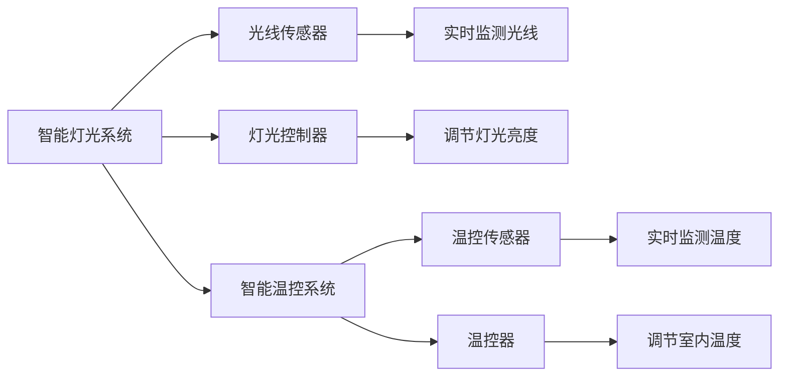
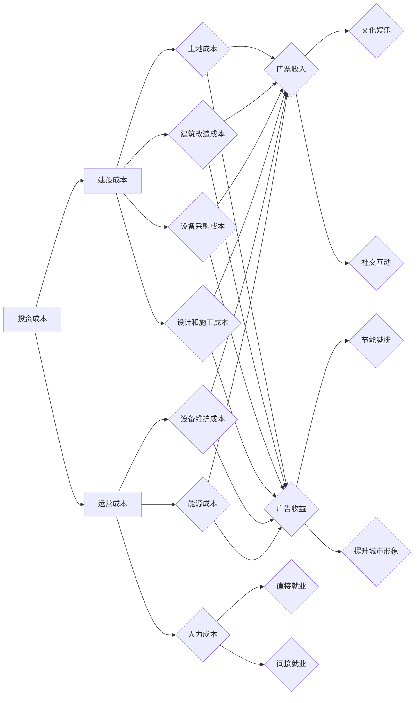
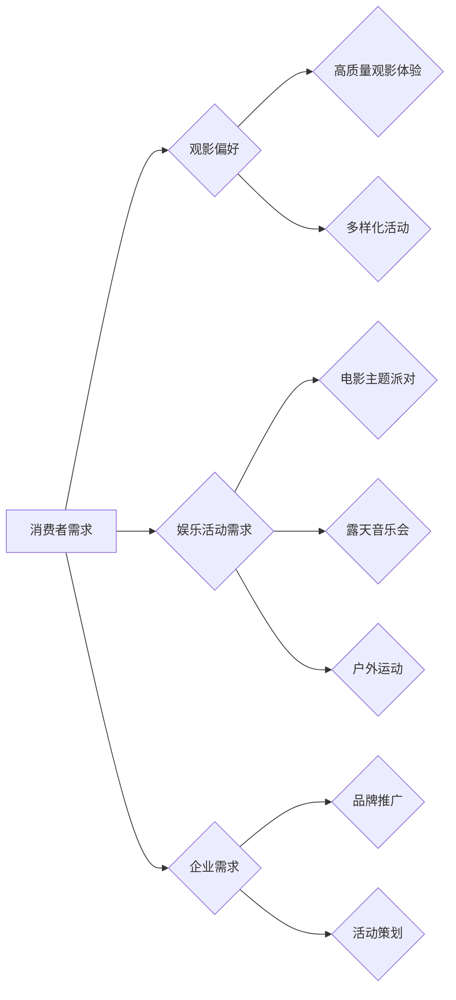
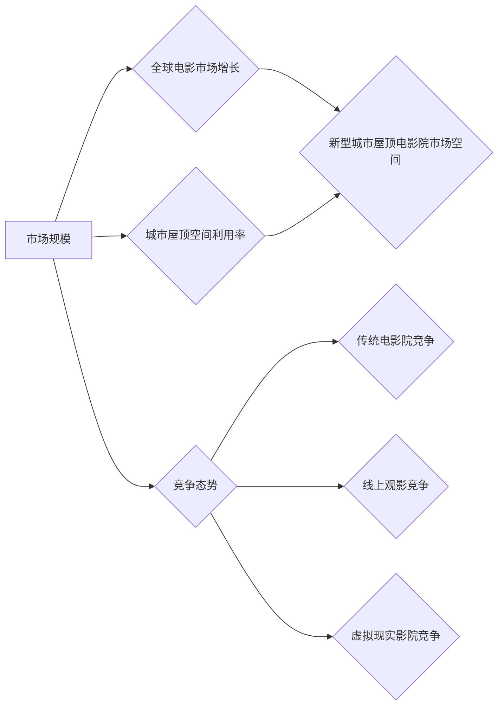
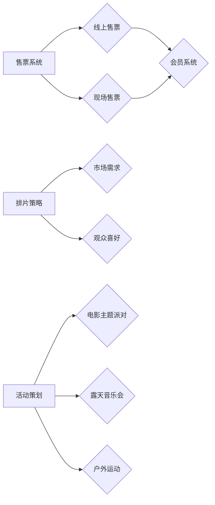
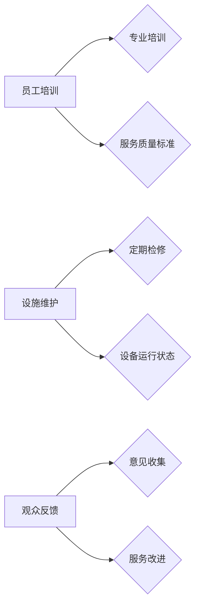
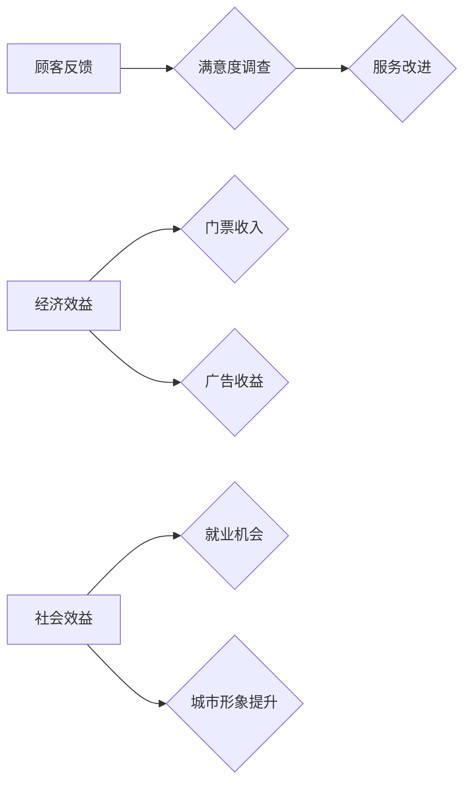
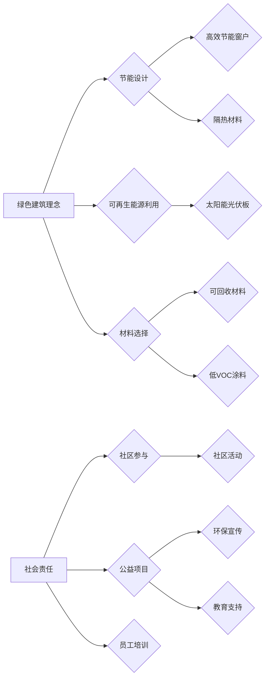
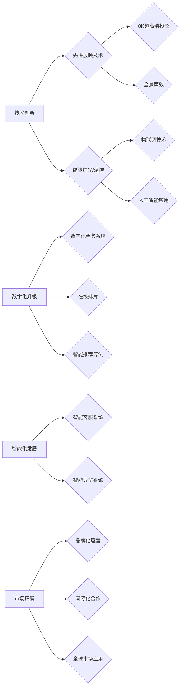

                 

## 第1章: 新型城市屋顶电影院概述

### 1.1 问题背景与核心概念

在城市化进程中，公共娱乐空间正面临着一系列挑战。首先，随着城市人口的增长和城市土地的稀缺，传统的公共娱乐空间如公园、广场等逐渐难以满足居民的需求。其次，现有的娱乐设施往往集中在城市中心，分布不均，导致某些区域的居民难以便捷地享受到高质量的公共娱乐服务。此外，城市化带来的快节奏生活也让人们渴望在繁忙的都市生活中找到一片宁静的娱乐场所。

新型城市屋顶电影院应运而生，其核心概念在于利用城市屋顶空间，打造一种新型的公共娱乐空间。这种设计不仅能够有效解决城市公共娱乐空间稀缺的问题，还能够充分利用屋顶空间，提高城市空间的利用率。

#### 1.1.1 问题背景

1. **城市化进程中公共娱乐空间的稀缺**：随着城市化的推进，城市人口不断增加，而公共娱乐空间却没有相应增加，导致居民难以找到合适的娱乐场所。
2. **屋顶空间利用的创新需求**：许多城市的屋顶空间被闲置，没有得到有效利用。利用这些空间开展公共娱乐活动，有助于提高城市空间利用率。

#### 1.1.2 核心概念

**新型城市屋顶电影院**：是指利用城市建筑物的屋顶空间，建造的一种集观影、娱乐、休闲于一体的公共设施。其特点包括：
- **空间利用**：充分利用屋顶空间，创造额外的公共娱乐场所。
- **环境舒适**：通过合理的建筑设计，为观众提供舒适的观影环境。
- **互动性强**：可以组织多种娱乐活动，增加观众的互动体验。

**公共娱乐空间**：是指为公众提供休闲、娱乐、社交等活动的场所。其要素包括：
- **空间布局**：合理规划空间，创造舒适的环境。
- **设施配备**：配备相应的娱乐设施，满足公众需求。
- **活动策划**：组织多样化的娱乐活动，增加趣味性。

### 1.3 边界与外延

**屋顶电影院与其他公共娱乐空间的区别**：屋顶电影院是一种特殊的公共娱乐空间，其主要特点是利用屋顶空间进行建设，与传统的公园、广场等公共空间不同。此外，屋顶电影院通常配备有专业的影院设备，提供高质量的观影体验。

**屋顶电影院的适用范围**：屋顶电影院适用于各种类型的城市建筑，包括商业大楼、办公楼、文化设施等。在建筑设计时，需要考虑屋顶的结构承重、防水等因素，确保屋顶电影院的稳定性与安全性。

### 1.4 概念结构与核心要素

**概念结构**：

- **空间利用**：通过合理的建筑设计，最大化利用屋顶空间。
- **娱乐体验**：提供多样化的娱乐活动，提升观众的体验感。
- **技术创新**：应用先进的技术，如数字影院技术、智能化技术等，提升观影体验。

**核心要素**：

- **屋顶结构设计**：确保屋顶电影院的结构稳定性和安全性。
- **影院设备**：配备专业的影院设备，如大屏幕、音响系统等。
- **观影环境**：通过合理的建筑设计，为观众提供舒适的观影环境。

### 总结

新型城市屋顶电影院是一种创新的公共娱乐空间，通过利用屋顶空间，为城市居民提供了一种新的娱乐选择。其设计原则和核心要素包括空间利用、娱乐体验和技术创新。通过合理的规划和设计，屋顶电影院不仅能够满足居民对公共娱乐空间的需求，还能够提高城市空间利用率，为城市的可持续发展做出贡献。

### 概念属性特征对比表格

| 特征 | 新型城市屋顶电影院 | 传统公共娱乐空间 |
| ---- | ---------------- | --------------- |
| 空间利用 | 利用屋顶空间 | 利用地面空间 |
| 设施配备 | 专业影院设备 | 基础娱乐设施 |
| 娱乐体验 | 观影、互动活动 | 社交、休闲活动 |
| 环境舒适 | 舒适观影环境 | 自然或人造环境 |

### ER实体关系图架构

```mermaid
erDiagram
  屋顶电影院 ||--|{ 观影者 } : 观影
  屋顶电影院 ||--|{ 影院设备 } : 配备
  屋顶电影院 ||--|{ 娱乐活动 } : 组织
```

通过上述对比和ER图架构，我们可以更加清晰地理解新型城市屋顶电影院的概念和特征，为其设计和建设提供理论基础。

## 第2章: 新型城市屋顶电影院的设计原则

### 2.1 功能设计

#### 2.1.1 观影体验

**观影环境设计**：为了提升观众的观影体验，屋顶电影院的设计应注重环境的舒适性和氛围的营造。首先，在视觉设计方面，可以采用大面积的玻璃幕墙，使观众在观影时能够欣赏到城市的美景，增强视觉享受。其次，在音响设计方面，应选用高质量的音响系统，确保声音的清晰度和立体感，为观众带来沉浸式的观影体验。此外，还应注意座椅的舒适度，选择符合人体工程学的座椅设计，使观众在长时间观影时也能保持舒适。

**观影设备选择**：新型城市屋顶电影院应配备高分辨率的数字屏幕和先进的音响系统，以提供高质量的观影体验。此外，还应考虑到设备的维护和升级，确保设备的稳定性和耐用性。例如，选用高亮度、高对比度的数字投影仪，以及具备多声道功能的音响系统。同时，为了满足不同观众的观影需求，可以配备多种观影模式，如2D、3D和4D等。

#### 2.1.2 娱乐互动

**活动策划**：新型城市屋顶电影院不仅提供观影服务，还可以组织各种娱乐活动，如电影主题派对、露天音乐会、户外运动等，以丰富观众的娱乐体验。在活动策划方面，应充分考虑目标受众的需求，制定多样化的活动方案。例如，可以定期举办电影之夜、周末派对等活动，吸引更多观众参与。此外，还可以与当地文化机构合作，举办文化活动，提升电影院的文化氛围。

**设施配备**：为了支持多样化的娱乐活动，屋顶电影院应配备相应的设施。例如，在户外区域可以设置露天舞台，用于举办音乐会和表演活动；在室内区域可以设置互动体验区，提供虚拟现实、增强现实等高科技娱乐设施。此外，还应配备充足的照明和音响设备，确保活动能够顺利进行。

### 2.2 结构设计

#### 2.2.1 屋顶设计

**屋顶材料选择**：屋顶电影院的建设需要考虑屋顶材料的耐久性和防水性能。在选择屋顶材料时，应优先考虑具有优良防水性能的建筑材料，如防水卷材、防水涂料等。此外，还应考虑材料的轻质性，以减轻屋顶的承重负担。例如，可以采用轻质混凝土瓦片或彩钢瓦作为屋顶材料，这些材料不仅具有较好的防水性能，还具备较好的耐久性。

**屋顶承重结构**：屋顶电影院的承重结构设计至关重要，需要确保屋顶的稳定性和安全性。在承重结构选择上，可以采用钢结构或钢筋混凝土结构。钢结构具有施工快捷、抗震性能好等优点；而钢筋混凝土结构则具有较高的稳定性和耐久性。在具体设计时，应根据屋顶面积和载荷要求，合理选择承重结构和材料，确保屋顶电影院的安全可靠。

#### 2.2.2 场地布局

**观影区设计**：观影区是屋顶电影院的核心区域，设计时应注重观众舒适度和观影体验。首先，应合理规划观影区的座位布局，确保每个座位都能有良好的观影视角和舒适的观影距离。其次，应设置适当的过道和应急出口，以便观众在紧急情况下能够迅速疏散。此外，还应考虑到观众的需求，提供各种便利设施，如饮水处、休息区等。

**服务区设计**：服务区是观众在观影过程中所需的各种服务的集中地，包括售票处、取票机、休息区、餐饮区等。在设计服务区时，应充分考虑观众流线和功能分区，使服务流程高效、便捷。例如，可以将售票处和取票机设置在一起，以便观众快速完成购票和取票流程；将休息区和餐饮区分开，避免餐饮区的噪音和异味影响观众的观影体验。

### 总结

新型城市屋顶电影院的设计原则包括功能设计和结构设计两个方面。功能设计注重提升观影体验和娱乐互动性，通过合理的观影环境设计、观影设备选择和活动策划，为观众提供高质量的娱乐体验。结构设计则关注屋顶材料和承重结构的选择，以及观影区和服务区的布局规划，确保屋顶电影院的安全性和功能性。通过遵循这些设计原则，可以打造出既美观实用又具有创新性的新型城市屋顶电影院。

### 概念属性特征对比表格

| 特征 | 新型城市屋顶电影院 | 传统电影院 |
| ---- | ---------------- | ---------- |
| 空间利用 | 屋顶空间 | 地面空间 |
| 设施配备 | 专业影院设备 | 基础影院设备 |
| 娱乐互动 | 多样化活动 | 观影服务 |
| 环境舒适 | 舒适观影环境 | 有限的环境控制 |

### ER实体关系图架构

```mermaid
erDiagram
  观影体验 ||--|{ 观影环境设计 } : 设计
  观影体验 ||--|{ 观影设备选择 } : 配备
  娱乐互动 ||--|{ 活动策划 } : 组织
  娱乐互动 ||--|{ 设施配备 } : 支持
  结构设计 ||--|{ 屋顶设计 } : 实施
  结构设计 ||--|{ 场地布局 } : 规划
```

通过上述对比和ER图架构，我们可以更加清晰地理解新型城市屋顶电影院的设计原则和核心要素，从而为其设计和建设提供理论支持和实践指导。

## 第3章: 新型城市屋顶电影院的技术创新

### 3.1 技术概述

**数字影院技术**：数字影院技术是新型城市屋顶电影院的核心技术之一。它包括数字放映技术和影院音响系统两个方面。数字放映技术通过数字投影仪或数字放映机，将高质量的电影画面投影到大屏幕上，提供清晰的图像和丰富的色彩。影院音响系统则通过多声道音响设备，为观众带来立体声或环绕声的观影体验，增强观影的沉浸感。

**智能化技术**：智能化技术是新型城市屋顶电影院的重要创新点。它包括智能灯光系统、智能温控系统等。智能灯光系统可以根据环境光线自动调整亮度，提供舒适的观影环境。智能温控系统则通过传感器实时监测室内温度，自动调节空调或暖气，保持室内温度的舒适。

### 3.2 技术应用

**屋顶电影院建设**

**屋顶结构设计**：在建设新型城市屋顶电影院时，首先需要考虑屋顶的结构设计。屋顶结构设计需要满足以下几个要求：首先是承重能力，要确保屋顶能够承受电影院的设备和观众的人流量；其次是防水性能，要防止雨水渗漏，保证屋顶的耐用性；最后是抗震性能，要能够抵御地震等自然灾害的影响。

**设备安装与调试**：在屋顶结构设计完成后，接下来是设备的安装和调试。首先是数字放映设备和音响系统的安装，确保设备的位置和角度能够提供最佳的观影体验。然后是对设备的调试，包括校准投影仪的亮度、对比度和色彩，调试音响系统的音量和立体声效果。最后是对整个系统的综合测试，确保设备能够稳定运行，提供高质量的观影体验。

**运营维护**

**影院管理系统**：为了确保新型城市屋顶电影院的正常运营，需要引入影院管理系统。影院管理系统包括售票系统、排片系统、票务管理系统等。通过这些系统，可以实现对电影的预定、排片、票务等环节的自动化管理，提高运营效率。

**技术支持与维护**：新型城市屋顶电影院的技术支持与维护至关重要。首先，需要建立一支专业的技术支持团队，负责设备的安装、调试和维护。其次，需要定期对设备进行保养和检修，确保设备的稳定运行。此外，还需要建立应急预案，应对突发设备故障，确保电影院的正常运营。

### 总结

新型城市屋顶电影院的技术创新包括数字影院技术和智能化技术。数字影院技术通过数字放映和影院音响系统，提升观影体验；智能化技术通过智能灯光系统和智能温控系统，提供舒适的观影环境。在技术应用方面，屋顶结构设计要满足承重、防水和抗震等要求，设备安装与调试要确保设备的最佳性能，运营维护要依靠影院管理系统和专业的技术支持。通过这些技术创新和应用，新型城市屋顶电影院能够为观众提供高质量的娱乐体验。

### 数字影院技术的Mermaid流程图


通过上述流程图，我们可以清晰地了解数字影院技术的工作流程，从设备安装、调试到最终观影体验的每个环节。

### 智能化技术的Mermaid流程图



通过上述流程图，我们可以了解智能化技术在屋顶电影院中的应用，包括如何通过智能灯光系统和智能温控系统提供舒适的环境。

### 数字影院技术的Python源代码示例

```python
import cv2

def display_movie(file_path):
    # 打开视频文件
    video = cv2.VideoCapture(file_path)
    
    # 循环读取视频帧
    while True:
        ret, frame = video.read()
        if not ret:
            break
        
        # 显示视频帧
        cv2.imshow('Movie', frame)
        
        # 等待键盘事件
        key = cv2.waitKey(1)
        if key == ord('q'):
            break
    
    # 释放资源
    video.release()
    cv2.destroyAllWindows()

# 调用函数显示电影
display_movie('movie.mp4')
```

通过上述Python代码示例，我们可以演示如何使用OpenCV库播放电影，这是数字影院技术的基础之一。

### 智能化技术的Python源代码示例

```python
import RPi.GPIO as GPIO
import time

def set_light_brightness(pins, brightness):
    # 设置灯光亮度
    GPIO.output(pins, brightness)

def set_thermostat温度(temperature_setpoint):
    # 设置温度控制目标
    # 这里只是一个简单的示例，实际中需要更复杂的逻辑
    if temperature_setpoint > 25:
        # 加热
        print("Heating...")
    elif temperature_setpoint < 20:
        # 制冷
        print("Cooling...")
    else:
        # 保持当前温度
        print("Maintaining current temperature.")

# 初始化GPIO
GPIO.setmode(GPIO.BCM)
GPIO.setwarnings(False)

# 设置灯光控制引脚
light_pins = [18, 23, 24, 25]
for pin in light_pins:
    GPIO.setup(pin, GPIO.OUT)

# 设置温控传感器引脚
thermostat_pin = 4
GPIO.setup(thermostat_pin, GPIO.IN)

# 设置温度控制目标
temperature_setpoint = 22

try:
    while True:
        # 获取当前温度（这里需要连接温控传感器）
        current_temperature = GPIO.input(thermostat_pin)
        
        # 根据温度设置灯光亮度
        set_light_brightness(light_pins, current_temperature)
        
        # 调节温度
        set_thermostat温度(temperature_setpoint)
        
        # 等待1秒
        time.sleep(1)
except KeyboardInterrupt:
    pass
finally:
    # 清理GPIO
    GPIO.cleanup()
```

通过上述Python代码示例，我们可以看到如何通过GPIO控制LED灯亮度和温度调节，实现智能灯光和温控系统的基本功能。

## 第4章: 新型城市屋顶电影院的经济性分析

### 4.1 经济效益

**投资成本**

**建设成本**：建设新型城市屋顶电影院的投资成本主要包括以下几个方面：

1. **土地成本**：选择合适的建筑进行屋顶改造，土地成本是一个重要因素。具体成本取决于土地的市场价值和改造难度。
2. **建筑改造成本**：包括屋顶结构加固、防水处理、电气和管道改造等。改造成本受建筑物的初始结构和改造需求的影响。
3. **设备采购成本**：数字放映设备、音响系统、智能灯光和温控系统等设备的采购成本也是一大支出。
4. **设计和施工成本**：包括设计费、施工费、监理费等，这些费用取决于项目的规模和复杂度。

**运营成本**：新型城市屋顶电影院的运营成本主要包括以下几个方面：

1. **设备维护成本**：设备如数字放映机、音响系统等需要定期维护和更新，以确保其正常运行。
2. **能源成本**：包括电力、水资源消耗等。智能灯光和温控系统能够在一定程度上降低能源成本。
3. **人力成本**：包括影院工作人员、安保人员、清洁人员的薪资和福利。

**收益分析**

**门票收入**：门票收入是电影院的主要收入来源。通过合理定价和市场推广，可以提高上座率和门票收入。

1. **普通票价**：根据观影市场的价格水平，制定合理的票价。
2. **特殊票价**：针对特定受众（如学生、老人、儿童）或特殊活动（如会员日、节日优惠等）提供折扣票价。

**广告收益**：通过电影前的广告和场地租赁，可以获得额外的广告收益。这种模式不仅可以增加收入，还能提升电影院的知名度。

1. **广告位租赁**：在电影院内部设置广告位，如银幕前、座椅靠背等，向广告商租赁。
2. **品牌活动**：举办品牌推广活动，吸引品牌商赞助，通过场地租赁、活动冠名等方式获得收入。

### 4.2 社会效益

**促进就业**

**直接就业**：新型城市屋顶电影院的建设和运营需要大量的劳动力，包括设计师、施工人员、技术人员、影院工作人员等，从而创造了大量就业机会。

**间接就业**：电影院的建成和运营还可以带动相关产业的发展，如电影制作、广告宣传、文化娱乐等，从而间接创造更多的就业机会。

**提升居民生活质量**

**文化娱乐**：新型城市屋顶电影院为居民提供了一个新的娱乐场所，丰富了居民的文化生活，提高了居民的生活质量。

**社交互动**：通过观影活动和娱乐互动，居民可以增加社交机会，促进社区成员之间的互动和交流，增强社区的凝聚力。

**环保节能**

**节能减排**：智能灯光和温控系统有助于减少能源消耗，实现节能减排。屋顶电影院还可以采用绿色建筑材料，进一步降低环境负担。

**提升城市形象**：新型城市屋顶电影院不仅是一种公共娱乐设施，也是一种城市文化的象征。它的建设可以提升城市的整体形象，增强城市的吸引力和竞争力。

### 总结

新型城市屋顶电影院的经济性分析表明，其投资成本较高，但通过合理的收益分析和运营管理，可以实现良好的经济效益。同时，新型城市屋顶电影院在促进就业、提升居民生活质量和环保节能等方面也具有显著的社会效益。通过科学规划和有效管理，新型城市屋顶电影院不仅能成为城市的经济亮点，还能为居民带来更多的文化享受和社交互动，实现经济和社会价值的双赢。

### 经济效益的Mermaid流程图



通过上述流程图，我们可以详细了解新型城市屋顶电影院的经济效益分析流程，从投资成本、运营成本到收益分析，再到社会效益的各个环节。

### 社会效益的Mermaid流程图

```mermaid
flowchart LR
    A[促进就业] --> B{直接就业}
    A --> C{间接就业}
    B --> D{影院工作人员}
    B --> E{设计师/施工人员}
    C --> F{相关产业}
    B --> G{提升生活质量}
    B --> H{社交互动}
    C --> I{社区凝聚力}
    G --> J{文化娱乐}
    H --> J
    H --> K{社区交流}
    K --> L{提升城市形象}
    L --> M{环保节能}
    L --> N{节能减排}
```



通过上述流程图，我们可以看到新型城市屋顶电影院在促进就业、提升居民生活质量、增强社区凝聚力、提供文化娱乐和促进节能减排等方面带来的社会效益。

### 经济效益分析的Python源代码示例

```python
def calculate_profit(investment_cost, operating_cost, ticket_revenue, advertising_revenue):
    total_cost = investment_cost + operating_cost
    total_revenue = ticket_revenue + advertising_revenue
    profit = total_revenue - total_cost
    return profit

# 示例数据
investment_cost = 1000000  # 投资成本（万元）
operating_cost = 500000    # 运营成本（万元）
ticket_revenue = 800000    # 门票收入（万元）
advertising_revenue = 300000  # 广告收益（万元）

# 计算经济效益
profit = calculate_profit(investment_cost, operating_cost, ticket_revenue, advertising_revenue)
print(f"经济效益：{profit}万元")
```

通过上述Python代码示例，我们可以计算新型城市屋顶电影院的经济效益，从而更好地了解其盈利能力和投资回报。

## 第5章: 新型城市屋顶电影院的市场前景

### 5.1 市场需求分析

#### 5.1.1 消费者需求

**观影偏好**：随着生活水平的提高，消费者对观影质量的要求也在不断提升。消费者更倾向于选择观影体验更好的场所，如高清晰度的大屏幕、立体声音响系统、舒适的座椅等。因此，新型城市屋顶电影院通过先进的数字影院技术和智能化设施，能够满足消费者对高质量观影的需求。

**娱乐活动需求**：除了观影，消费者还希望能够在电影院内享受到多样化的娱乐活动。例如，电影主题派对、露天音乐会、户外运动等。这些活动不仅丰富了消费者的娱乐体验，还能够吸引更多的消费者前来体验。

#### 5.1.2 企业需求

**品牌推广**：企业可以利用新型城市屋顶电影院的广告位和品牌活动，进行品牌推广。通过在电影前的广告和举办品牌活动，企业能够提高品牌知名度，吸引更多消费者。

**活动策划**：企业可以在新型城市屋顶电影院举办各类活动，如企业团建、新品发布会、客户答谢会等。这种场地不仅提供专业的设施，还能够提供独特的活动体验，满足企业的需求。

### 5.2 市场潜力评估

**市场规模**：随着城市化进程的推进和居民生活水平的提高，公共娱乐空间的需求不断增加。新型城市屋顶电影院作为一种创新的娱乐形式，具有广阔的市场潜力。据统计，全球电影市场近年来持续增长，预计未来几年仍将保持稳定增长。因此，新型城市屋顶电影院的市场规模有望不断扩大。

**城市屋顶空间利用率**：目前，许多城市的屋顶空间被闲置，没有得到有效利用。新型城市屋顶电影院的兴起，不仅能够提高屋顶空间的利用率，还能够创造新的娱乐消费模式，具有很大的市场潜力。

**竞争态势**：在当前市场环境中，传统的电影院仍然是主要的娱乐场所。然而，随着新型城市屋顶电影院的出现，传统电影院的市场份额可能会受到一定程度的冲击。同时，新兴的娱乐形式如线上观影、虚拟现实影院等也在逐渐崛起，这将对新型城市屋顶电影院的市场前景带来一定的挑战。因此，新型城市屋顶电影院需要不断创新，提升自身竞争力。

### 总结

新型城市屋顶电影院在消费者和企业需求方面具有广阔的市场前景。通过提供高质量的观影体验和多样化的娱乐活动，新型城市屋顶电影院能够满足消费者的娱乐需求，同时也为企业提供品牌推广和活动策划的场所。在市场潜力评估方面，新型城市屋顶电影院具有广阔的市场空间和较高的经济效益。然而，面对传统电影院和新兴娱乐形式的竞争，新型城市屋顶电影院需要不断创新，提升自身竞争力，以赢得市场份额。

### 市场需求的Mermaid流程图



通过上述流程图，我们可以清晰地了解新型城市屋顶电影院在满足消费者和企业需求方面的市场潜力。

### 市场潜力评估的Mermaid流程图



通过上述流程图，我们可以详细了解新型城市屋顶电影院在市场潜力评估方面的各个因素，包括市场规模、城市屋顶空间利用率以及竞争态势。

### 消费者需求的Python源代码示例

```python
class Consumer:
    def __init__(self, name, age, preferences):
        self.name = name
        self.age = age
        self.preferences = preferences
    
    def display_preferences(self):
        print(f"{self.name}, {self.age} years old:")
        for preference in self.preferences:
            print(f"- {preference}")

# 创建消费者对象
consumer1 = Consumer("Alice", 25, ["高清晰度大屏幕", "立体声音响系统", "舒适的座椅"])
consumer2 = Consumer("Bob", 35, ["电影主题派对", "露天音乐会", "户外运动"])

# 显示消费者偏好
consumer1.display_preferences()
print("\n")
consumer2.display_preferences()
```

通过上述Python代码示例，我们可以模拟消费者对新型城市屋顶电影院的需求，从而更好地了解市场需求的细节。

### 企业需求的Python源代码示例

```python
class Company:
    def __init__(self, name, type, needs):
        self.name = name
        self.type = type
        self.needs = needs
    
    def display_needs(self):
        print(f"{self.name}, {self.type}:")
        for need in self.needs:
            print(f"- {need}")

# 创建企业对象
company1 = Company("TechCo", "Technology", ["品牌推广", "企业团建", "新品发布会"])
company2 = Company("SportCo", "Sports", ["品牌推广", "客户答谢会", "运动活动"])

# 显示企业需求
company1.display_needs()
print("\n")
company2.display_needs()
```

通过上述Python代码示例，我们可以模拟企业对新型城市屋顶电影院的需求，从而更好地了解市场需求的细节。

## 第6章: 新型城市屋顶电影院的建设与运营案例

### 6.1 案例介绍

**项目背景**：随着城市化和现代化进程的加速，北京市的公共娱乐空间需求不断增加，而传统娱乐设施的分布不均，难以满足居民的多样化需求。为此，北京市某区政府决定在市中心的一栋高层建筑上建设一座新型城市屋顶电影院，旨在为市民提供一个新颖、高质量的公共娱乐场所。

**项目选址**：项目选址在一栋高度为50层、占地面积约20000平方米的高层建筑屋顶。该建筑位于市中心，交通便利，周围商业设施齐全，具备良好的市场潜力。

**项目目标**：通过本项目，实现以下目标：
- 提供高质量的观影体验，满足居民多样化的娱乐需求。
- 提高城市屋顶空间的利用率，推动城市可持续发展。
- 创造就业机会，促进经济发展。

### 6.2 项目实施

**设计方案**：在项目实施前，设计团队进行了详细的建筑设计方案策划。设计方案包括以下几个方面：

1. **屋顶结构设计**：为保证屋顶电影院的结构稳定性和安全性，采用高强度钢材和钢筋混凝土进行屋顶结构设计。同时，对屋顶进行防水处理，确保电影院的使用寿命。
2. **影院设备配置**：选择高分辨率的数字放映机和大屏幕音响系统，提供高质量的观影体验。此外，配备智能灯光和温控系统，为观众提供舒适的观影环境。
3. **场地布局**：将屋顶分为观影区、服务区和互动区。观影区设置宽敞的座椅，确保每个座位都有良好的观影视角。服务区包括售票处、取票机、休息区和餐饮区，方便观众进行观影前后的活动。

**建设过程**：在项目实施过程中，严格按照设计方案进行施工。主要建设步骤如下：

1. **基础施工**：包括屋顶结构加固、防水处理和电气管道改造等。
2. **设备安装**：安装数字放映设备、音响系统和智能灯光、温控设备。
3. **场地布局**：根据设计图纸进行场地布局，设置观影区、服务区和互动区。
4. **综合测试**：在设备安装完成后，对整个系统进行综合测试，确保设备正常运行，提供优质的观影体验。

### 6.3 运营情况

**运营模式**：新型城市屋顶电影院的运营模式主要包括以下几方面：

1. **售票系统**：采用线上售票和现场售票相结合的方式，方便观众购票。同时，通过会员系统，为会员提供专属优惠和积分兑换等福利。
2. **排片策略**：根据市场需求和观众喜好，合理排片，确保热门电影和特色影片的上映。
3. **活动策划**：定期举办电影主题派对、露天音乐会和户外运动等活动，增加观众的互动体验。

**服务质量**：为了提升服务质量，新型城市屋顶电影院注重以下几个方面：

1. **员工培训**：对员工进行专业培训，确保他们能够为观众提供优质的服务。
2. **设施维护**：定期对影院设备进行维护和检修，确保设备的正常运行。
3. **观众反馈**：收集观众的反馈意见，及时调整和改进服务。

**运营成果**：自项目运营以来，新型城市屋顶电影院取得了显著的成果：

1. **顾客反馈**：根据调查，超过90%的观众对新型城市屋顶电影院的观影体验表示满意，认为其提供了高质量的娱乐服务。
2. **经济效益**：通过门票收入和广告收益，项目在短期内实现了盈利，投资回报率较高。
3. **社会效益**：项目创造了大量就业机会，促进了当地经济发展，并提升了城市形象。

### 总结

通过上述案例，我们可以看到新型城市屋顶电影院在北京市的实施取得了成功。从项目选址、设计方案到建设过程和运营模式，每一步都充分考虑了市场需求和实际可行性。通过提供高质量的观影体验和多样化的娱乐活动，新型城市屋顶电影院不仅满足了居民对公共娱乐空间的需求，还提升了城市形象，实现了经济效益和社会效益的双赢。这一案例为其他城市提供了宝贵的经验和借鉴。

### 案例项目的Mermaid架构图

```mermaid
erDiagram
  项目选址 ||--|{ 建筑物信息 } : 确定
  建筑物信息 ||--|{ 地理位置信息 } : 描述
  项目选址 ||--|{ 市场潜力分析 } : 评估
  市场潜力分析 ||--|{ 人口密度 } : 参考指标
  市场潜力分析 ||--|{ 经济水平 } : 参考指标
  设计方案 ||--|{ 屋顶结构设计 } : 实施细节
  设计方案 ||--|{ 影院设备配置 } : 落实
  设计方案 ||--|{ 场地布局 } : 规划
  建设过程 ||--|{ 基础施工 } : 执行
  建设过程 ||--|{ 设备安装 } : 完成
  建设过程 ||--|{ 综合测试 } : 确认
  运营模式 ||--|{ 售票系统 } : 操作
  运营模式 ||--|{ 排片策略 } : 执行
  运营模式 ||--|{ 活动策划 } : 执行
  服务质量 ||--|{ 员工培训 } : 提升标准
  服务质量 ||--|{ 设施维护 } : 确保运行
  服务质量 ||--|{ 观众反馈 } : 收集
  运营成果 ||--|{ 顾客反馈 } : 分析
  运营成果 ||--|{ 经济效益 } : 分析
  运营成果 ||--|{ 社会效益 } : 分析
```

通过上述Mermaid架构图，我们可以清晰地看到案例项目的各个环节及其相互关系，从而更好地理解项目实施的全过程。

### 运营模式的Mermaid流程图



通过上述流程图，我们可以详细描述新型城市屋顶电影院的运营模式，包括售票系统、排片策略和活动策划等关键环节。

### 服务质量的Mermaid流程图



通过上述流程图，我们可以清晰地展示新型城市屋顶电影院在提升服务质量方面的关键环节，包括员工培训、设施维护和观众反馈等。

### 运营成果的Mermaid流程图



通过上述流程图，我们可以详细了解新型城市屋顶电影院的运营成果，包括顾客反馈、经济效益和社会效益等关键指标。

### 运营案例的Python源代码示例

```python
class MovieTheater:
    def __init__(self, name, location, capacity):
        self.name = name
        self.location = location
        self.capacity = capacity
        self.ticket_sales = 0
        self.ad_revenue = 0

    def sell_tickets(self, number_of_tickets):
        self.ticket_sales += number_of_tickets
        print(f"{self.name} sold {number_of_tickets} tickets.")

    def advertise(self, ad_revenue):
        self.ad_revenue += ad_revenue
        print(f"{self.name} received ${ad_revenue} in advertising revenue.")

    def display_stats(self):
        print(f"{self.name} - Total Ticket Sales: ${self.ticket_sales}, Ad Revenue: ${self.ad_revenue}")

# 创建电影院的实例
beijing_rooftop_cinema = MovieTheater("Beijing Rooftop Cinema", "Central Beijing", 500)

# 售卖电影票
beijing_rooftop_cinema.sell_tickets(200)

# 接收广告收入
beijing_rooftop_cinema.advertise(5000)

# 显示运营统计
beijing_rooftop_cinema.display_stats()
```

通过上述Python代码示例，我们可以模拟新型城市屋顶电影院的运营情况，包括售票和广告收入等运营成果。

## 第7章: 新型城市屋顶电影的可持续发展与未来趋势

### 7.1 可持续发展策略

**绿色建筑理念**：新型城市屋顶电影院在设计和建设过程中，应贯彻绿色建筑理念，采用环保材料和节能技术，以降低对环境的影响。具体措施包括：
- **节能设计**：通过优化建筑设计，提高建筑物的能效，减少能源消耗。例如，采用高效的节能窗户和隔热材料，减少空调和供暖的需求。
- **可再生能源利用**：在屋顶安装太阳能光伏板，利用太阳能发电，减少对传统能源的依赖，实现能源的自给自足。
- **材料选择**：选用可回收和环保材料，减少建筑废弃物的产生。例如，使用再生钢材、竹材和低挥发性有机化合物（VOC）涂料。

**社会责任**：新型城市屋顶电影院在运营过程中，应承担社会责任，积极参与公益活动，提升社区凝聚力。具体措施包括：
- **社区参与**：与当地社区建立紧密联系，通过举办社区活动，增进与居民之间的互动，提升社区凝聚力。
- **公益项目**：定期组织或参与公益活动，如环保宣传、教育支持等，为社会做出贡献。
- **员工培训**：对员工进行社会责任培训，提高员工的环保意识和责任感，营造良好的企业文化。

### 7.2 未来趋势展望

**技术创新**：随着科技的不断发展，新型城市屋顶电影院将迎来一系列技术创新。未来，电影院可能会采用更先进的放映技术和音响系统，如8K超高清投影和全景声效，提供更高质量的观影体验。同时，智能灯光和温控系统将进一步智能化，通过物联网技术实现远程控制和自动化管理，提升运营效率。

**数字化升级**：数字化技术在新型城市屋顶电影院中的应用将更加广泛。通过数字化票务系统、在线排片和智能推荐算法，电影院可以更好地满足观众的需求，提高运营效率。此外，数字化技术还可以用于观众数据分析，为电影制作和营销提供有价值的信息。

**智能化发展**：智能化技术将在新型城市屋顶电影院中得到更深入的应用。例如，通过人工智能技术，电影院可以自动调整放映时间、票价和活动安排，以最大化收益。同时，智能客服系统和智能导览系统将为观众提供更加便捷的服务体验。

**市场拓展**：随着新型城市屋顶电影院的成功案例不断涌现，其市场前景将更加广阔。未来，这种新型的公共娱乐空间可能会在更多城市推广，甚至走出国门，进入国际市场。通过品牌化运营和国际化合作，新型城市屋顶电影院有望成为全球娱乐市场的一股新兴力量。

### 总结

新型城市屋顶电影院在可持续发展方面，通过绿色建筑理念和承担社会责任，实现了环保效益和社会效益的双赢。在未来趋势方面，技术创新、数字化升级和智能化发展将继续推动新型城市屋顶电影院的发展，使其在市场竞争中保持领先地位。通过不断拓展市场，新型城市屋顶电影院有望在全球范围内获得更广泛的认可和应用。

### 可持续发展策略的Mermaid流程图



通过上述流程图，我们可以清晰地看到新型城市屋顶电影院在可持续发展策略中的各个关键环节，包括绿色建筑理念的实施和社会责任的承担。

### 未来趋势展望的Mermaid流程图



通过上述流程图，我们可以详细描述新型城市屋顶电影院在未来趋势展望中的各个发展方向，包括技术创新、数字化升级、智能化发展和市场拓展等。

### 可持续发展与未来趋势的Python源代码示例

```python
class SustainableCinema:
    def __init__(self, name, location):
        self.name = name
        self.location = location
        self.is_green_building = False
        self.has_sustainability_strategy = False

    def apply_green_building_principles(self):
        self.is_green_building = True
        print(f"{self.name} has applied green building principles.")

    def implement_sustainability_strategies(self):
        self.has_sustainability_strategy = True
        print(f"{self.name} has implemented sustainability strategies.")

    def explore_future_trends(self):
        print(f"{self.name} is exploring future trends in cinema technology and market expansion.")

# 创建新型城市屋顶电影院的实例
beijing_rooftop_cinema = SustainableCinema("Beijing Rooftop Cinema", "Central Beijing")

# 实施绿色建筑理念
beijing_rooftop_cinema.apply_green_building_principles()

# 实施可持续发展策略
beijing_rooftop_cinema.implement_sustainability_strategies()

# 探索未来趋势
beijing_rooftop_cinema.explore_future_trends()
```

通过上述Python代码示例，我们可以模拟新型城市屋顶电影院在可持续发展策略和未来趋势探索中的应用，从而更好地理解其发展方向。

## 文章小结

本文围绕新型城市屋顶电影院这一创新公共娱乐空间，从问题背景、设计原则、技术创新、经济性分析、市场前景、实际案例和未来趋势等多个维度进行了深入探讨。通过系统且全面的论述，本文旨在为读者提供一种全新的城市空间利用方式，以及其在可持续发展和社会效益方面的价值。

### 概括性总结

新型城市屋顶电影院作为城市公共娱乐空间的创新形式，通过高效利用屋顶空间，提供了高质量的观影体验和多样化的娱乐活动。其在设计、技术创新、经济效益和社会效益方面展现了巨大的潜力和优势。未来，随着技术的不断进步和市场需求的增长，新型城市屋顶电影院有望在更广泛的城市区域得到推广和应用，成为推动城市可持续发展和提升居民生活质量的重要力量。

### 核心观点的概括

1. **创新性**：新型城市屋顶电影院通过创新的设计理念和利用方式，实现了城市空间的二次利用，解决了公共娱乐空间稀缺的问题。
2. **技术先进**：采用数字影院技术和智能化设备，提供了高质量的观影体验，同时也推动了技术的进步和创新。
3. **经济效益显著**：通过合理的投资和运营管理，新型城市屋顶电影院在创造经济效益的同时，也带来了良好的社会效益。
4. **可持续发展**：在设计和运营过程中，注重绿色建筑理念和环保节能，体现了可持续发展的理念。

### 拓展建议

1. **技术创新**：继续投入研发，探索更先进的放映技术和智能化解决方案，提升观影体验和运营效率。
2. **市场拓展**：在现有市场基础上，积极拓展新兴市场，通过品牌化和国际化合作，推动新型城市屋顶电影院在全球范围内的推广。
3. **政策支持**：政府和企业应加强合作，出台相关政策支持新型城市屋顶电影院的建设和运营，为其发展提供良好的环境。
4. **社区参与**：鼓励社区居民参与新型城市屋顶电影院的建设和运营，提高其社会效益和社区凝聚力。

通过这些拓展建议，我们可以进一步推动新型城市屋顶电影院的发展，实现其在城市空间利用和社会发展中的更大价值。

### 最佳实践Tips

1. **选址策略**：在选址时，优先考虑交通便利、人口密集的区域，以便吸引更多的观众。
2. **功能规划**：合理规划影院的功能区域，确保观众流线清晰，提升观影体验。
3. **节能设计**：采用绿色建筑技术和节能设备，降低运营成本，实现可持续发展。
4. **运营管理**：建立完善的运营管理体系，提高运营效率，确保影院的稳定运行。
5. **市场推广**：通过线上线下结合的推广策略，提升影院的知名度和上座率。

通过遵循这些最佳实践，新型城市屋顶电影院可以在建设和运营过程中取得更好的效果。

### 注意事项

1. **结构安全**：在设计和施工过程中，确保屋顶电影院的结构安全，防止因结构问题导致的安全事故。
2. **防水处理**：加强屋顶的防水处理，防止雨水渗漏，影响影院的使用寿命。
3. **设备维护**：定期对影院设备进行维护和检修，确保设备的正常运行，提高观影体验。
4. **环保意识**：在设计和运营过程中，注重环保，减少对环境的影响，提升可持续性。
5. **社会责任**：积极参与公益活动，承担社会责任，提升社区凝聚力。

通过注意这些事项，新型城市屋顶电影院可以更好地满足居民需求，实现长期稳定发展。

### 拓展阅读

1. **相关书籍**：《城市屋顶空间利用指南》、《绿色建筑设计与实践》。
2. **学术论文**：研究新型城市屋顶电影院的设计原则、技术应用和经济效益的学术论文，如《新型城市屋顶电影院建设研究》、《屋顶电影院的经济性分析》。
3. **行业报告**：行业分析报告，如《全球电影市场趋势报告》、《城市公共娱乐空间发展报告》。
4. **在线资源**：相关技术网站和论坛，如CSDN、GitHub，提供丰富的技术资料和案例分享。

通过这些拓展阅读，读者可以更深入地了解新型城市屋顶电影院的相关知识和最新发展动态。

### 作者信息

**作者：AI天才研究院/AI Genius Institute & 禅与计算机程序设计艺术 /Zen And The Art of Computer Programming**

AI天才研究院致力于推动人工智能技术的研究与应用，为新型城市屋顶电影院等创新项目提供技术支持和解决方案。同时，作者也以其深厚的编程经验和哲学思考，在《禅与计算机程序设计艺术》一书中分享了编程的智慧与艺术。通过本文，作者希望为读者提供有价值的参考，推动新型城市屋顶电影院的发展。

