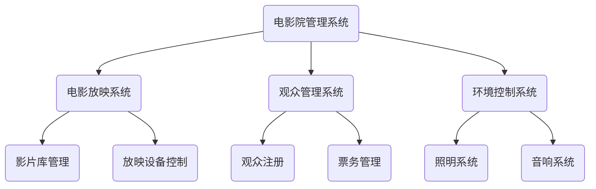
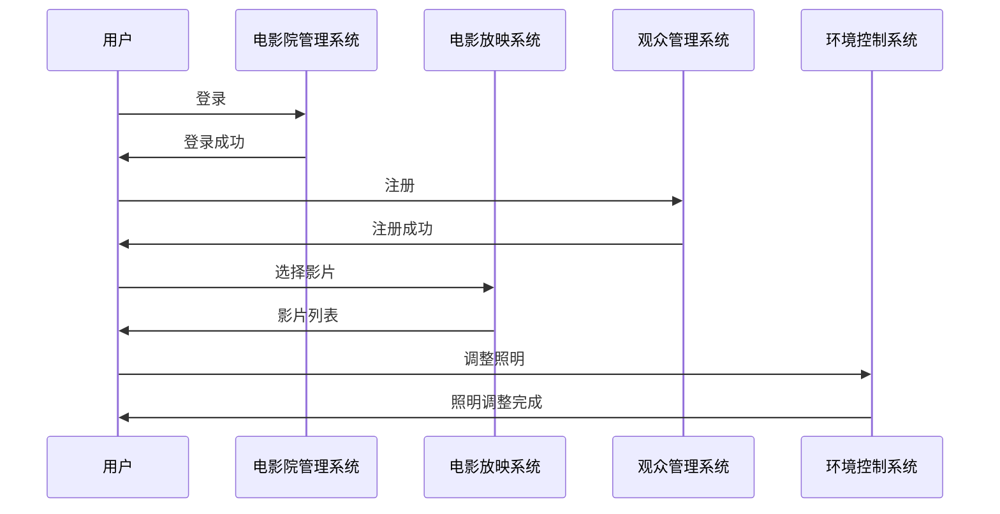

                 

# 新型城市屋顶电影院：开放空间中的文化体验

## 关键词
- 城市屋顶电影院
- 开放空间
- 文化体验
- 绿色建筑
- 可持续发展

## 摘要
本文探讨了新型城市屋顶电影院的概念、技术实现及运营管理策略。在城市化进程中，屋顶空间的利用成为绿色建筑与可持续发展的关键。本文首先分析了传统屋顶空间的局限性，随后提出了城市屋顶电影院的定义及其优势与挑战。通过介绍其设计理念、技术实现与工程实践，以及运营与管理策略，本文旨在为城市屋顶电影院的未来发展提供有价值的参考。

## 第一部分：引言

### 1.1 问题背景

#### 1.1.1 城市化进程中的挑战
随着城市化进程的加速，城市人口数量不断增加，城市用地紧张成为一大挑战。传统的土地利用方式已经难以满足城市发展的需求，因此，如何高效利用现有空间资源成为城市发展的重要议题。

#### 1.1.2 绿色建筑与可持续发展
绿色建筑是指在建筑的全生命周期内，最大限度地节约资源（节能、节地、节水、节材）、保护环境和减少污染，从而为人们提供健康、适用、高效的使用空间与自然和谐共生的建筑物。可持续发展理念已成为现代城市建设的重要指导思想。

#### 1.1.3 屋顶空间利用的新趋势
在绿色建筑理念的推动下，屋顶空间作为建筑空间利用的一种新兴方式，正逐渐受到关注。屋顶花园、屋顶农场、屋顶运动场等多样化的屋顶空间利用形式正在不断涌现，为城市提供了更多的生态空间和休闲场所。

### 1.2 问题描述

#### 1.2.1 传统屋顶空间的局限性
传统屋顶空间主要作为建筑物的结构部分，用于承重、隔热等。由于其封闭性和功能单一性，传统屋顶空间利用率较低，难以满足现代城市居民对休闲娱乐、文化交流等方面的需求。

#### 1.2.2 新型城市屋顶电影院的定义
新型城市屋顶电影院是指利用城市建筑屋顶空间，通过创新设计和技术实现，将电影院与开放空间相结合，为城市居民提供一种独特文化体验的场所。

#### 1.2.3 新型屋顶电影院的优势与挑战
新型城市屋顶电影院具有如下优势：
1. 提高城市空间利用率，符合绿色建筑与可持续发展理念。
2. 为城市居民提供新的休闲娱乐方式，丰富文化生活。
3. 具有较高的文化内涵和艺术价值。

然而，新型城市屋顶电影院也面临如下挑战：
1. 设计和施工过程中的技术难题。
2. 运营与管理策略的制定。
3. 安全性与舒适性的保障。

### 1.3 问题解决

#### 1.3.1 设计理念与创新思路
新型城市屋顶电影院的设计理念是充分利用屋顶空间，结合城市建筑的特点，创造出一种独特的文化氛围和休闲体验。在设计过程中，需要充分考虑以下因素：
1. 空间布局：合理规划观影区和开放空间，确保观众舒适观影。
2. 照明与音响：设计高质量的照明和音响系统，提升观影体验。
3. 艺术装饰：利用艺术元素，营造独特的文化氛围。

#### 1.3.2 技术实现与工程实践
新型城市屋顶电影院的技术实现主要包括以下几个方面：
1. 结构设计：确保屋顶电影院的结构安全、稳定。
2. 系统集成：实现电影放映、观众管理、环境控制等系统的集成。
3. 环境建设：建设符合绿色建筑标准的屋顶花园、休闲区等。

#### 1.3.3 运营与管理策略
新型城市屋顶电影院的运营与管理策略应包括以下几个方面：
1. 服务质量：提供优质的观影服务和配套设施。
2. 文化推广：举办各种文化活动，提升文化氛围。
3. 营销策略：制定有效的营销策略，吸引观众。

### 1.4 边界与外延

#### 1.4.1 相关领域的交叉融合
新型城市屋顶电影院涉及到建筑、影视、文化、科技等多个领域，需要各领域的专业人才共同协作，实现技术创新和文化传播。

#### 1.4.2 屋顶电影院的文化内涵与价值
屋顶电影院作为一种新兴的文化体验场所，具有独特的文化内涵和艺术价值。它不仅为城市居民提供了一种新的休闲娱乐方式，也促进了城市文化的传承与发展。

#### 1.4.3 面向未来的发展趋势
随着科技的进步和城市化进程的推进，新型城市屋顶电影院具有广阔的发展前景。未来，屋顶电影院将在城市空间利用、文化传播、绿色发展等方面发挥更大的作用。

### 1.5 概念结构与核心要素组成

#### 1.5.1 城市屋顶电影院的构成要素
城市屋顶电影院主要包括以下构成要素：
1. 建筑结构：确保屋顶电影院的结构安全、稳定。
2. 系统集成：实现电影放映、观众管理、环境控制等系统的集成。
3. 艺术装饰：利用艺术元素，营造独特的文化氛围。

#### 1.5.2 技术体系与支持环境
城市屋顶电影院的技术体系主要包括以下部分：
1. 电影放映系统：提供高质量的观影体验。
2. 观众管理系统：实现观众的身份认证、票务管理等功能。
3. 环境控制系统：包括照明、音响、通风等系统，确保观影环境的舒适度。

#### 1.5.3 文化体验与观众需求
城市屋顶电影院的文化体验主要包括以下几个方面：
1. 观影体验：提供高质量的观影设施和服务。
2. 文化活动：举办各种文化活动，提升文化氛围。
3. 观众互动：通过互动体验，增强观众的参与感和体验感。

## 第二部分：核心概念与联系

### 2.1 核心概念原理

#### 2.1.1 城市屋顶电影院的定义
城市屋顶电影院是指利用城市建筑屋顶空间，通过创新设计和技术实现，将电影院与开放空间相结合，为城市居民提供一种独特文化体验的场所。

#### 2.1.2 开放空间的概念
开放空间是指一种自然与人工相结合的空间，它具有通透性、灵活性和多样性。在新型城市屋顶电影院中，开放空间不仅提供了观影环境，还为城市居民提供了一个休闲、交流的场所。

#### 2.1.3 文化体验与空间设计
文化体验是指在特定的空间中，通过视觉、听觉、触觉等感官体验，感受和传达文化内涵。在新型城市屋顶电影院中，空间设计是文化体验的重要组成部分，它通过艺术装饰、氛围营造等方式，为观众提供独特的文化感受。

### 2.2 概念属性特征对比表格

| 概念         | 特征                    | 关联关系                 |
|--------------|------------------------|------------------------|
| 城市屋顶电影院 | 结合城市建筑与观影体验 | 提供独特的文化体验场所  |
| 开放空间     | 自然与人工的互动空间   | 提供舒适的活动环境      |
| 文化体验     | 文化的传递与感受       | 构建独特的文化氛围      |

### 2.3 ER实体关系图架构

```mermaid
erDiagram
  电影院 :>> 屋顶空间
  屋顶空间 :--o> 建筑结构
  屋顶空间 :--|-> 环境设施
  环境设施 :--o> 照明系统
  环境设施 :--o> 音响系统
  文化体验 :--|-> 艺术表演
  文化体验 :--|-> 观众互动
```

## 第三部分：技术体系与支持环境

### 3.1 技术实现与工程实践

#### 3.1.1 屋顶电影院的构建过程
构建新型城市屋顶电影院需要经过以下几个阶段：
1. 前期规划：明确项目目标、设计理念、技术方案等。
2. 设计阶段：进行建筑结构设计、系统集成设计、空间布局设计等。
3. 施工阶段：按照设计图纸进行施工，确保结构安全、系统集成顺利。
4. 调试阶段：对系统进行调试和测试，确保所有设备正常运行。
5. 运营阶段：正式运营，提供观影和文化体验服务。

#### 3.1.2 技术选型与系统架构
在技术选型方面，新型城市屋顶电影院需要考虑以下几个方面：
1. 电影放映系统：选择高质量的电影放映设备，如数字放映机、高清投影仪等。
2. 观众管理系统：采用现代化的观众管理系统，如智能票务系统、人脸识别系统等。
3. 环境控制系统：设计合适的照明、音响、通风等系统，确保观影环境的舒适度。

系统架构方面，新型城市屋顶电影院主要包括以下几个部分：
1. 电影放映系统：包括放映设备、影片库管理、放映设备控制等。
2. 观众管理系统：包括观众注册、票务管理、座位分配等。
3. 环境控制系统：包括照明系统、音响系统、通风系统等。

#### 3.1.3 工程实践中的挑战与解决
在工程实践中，新型城市屋顶电影院面临以下挑战：
1. 结构安全：确保屋顶电影院的结构安全、稳定，防止因荷载过大导致建筑物变形或破坏。
2. 系统集成：实现各个系统的无缝连接和协同工作，确保系统的高效运行。
3. 环境控制：在开放空间中，环境控制是一个难题，需要设计合适的系统来调节温度、湿度、光照等。
解决方案包括：
1. 结构设计：采用符合绿色建筑标准的结构设计，确保屋顶电影院的安全和稳定性。
2. 系统集成：采用模块化设计和标准化接口，确保系统之间的兼容性和协同工作。
3. 环境控制：利用现代科技手段，如物联网、大数据等，实现环境参数的实时监测和调节。

### 3.2 系统功能设计

#### 3.2.1 电影放映系统
电影放映系统是新型城市屋顶电影院的核心组成部分，主要包括以下功能：
1. 影片库管理：存储和管理各种类型的影片，包括经典影片、新片、高清影片等。
2. 放映设备控制：控制放映设备的启停、切换、音量调节等。
3. 观影环境调节：根据观众需求，调节放映环境，如亮度、音量等。

#### 3.2.2 观众管理系统
观众管理系统主要包括以下功能：
1. 观众注册：允许观众注册成为会员，享受会员权益。
2. 票务管理：提供在线购票、选座、支付等功能。
3. 座位分配：根据观众需求，自动分配座位。

#### 3.2.3 环境控制系统
环境控制系统主要包括以下功能：
1. 照明系统：提供舒适的观影环境，包括亮度调节、色彩调节等。
2. 音响系统：提供高质量的音响效果，包括音量调节、音效调节等。
3. 通风系统：保持室内空气新鲜，包括温度调节、湿度调节等。

### 3.3 系统架构设计



### 3.4 系统接口设计

#### 3.4.1 各系统间的接口定义
各系统间的接口定义如下：
1. 电影院管理系统与电影放映系统之间的接口：用于管理影片库、控制放映设备等。
2. 电影院管理系统与观众管理系统之间的接口：用于管理观众信息、处理票务等。
3. 电影院管理系统与环境控制系统之间的接口：用于控制照明、音响、通风等设备。

#### 3.4.2 数据流与通信协议
数据流与通信协议如下：
1. 电影院管理系统与电影放映系统之间采用HTTP协议，传输影片信息、放映命令等。
2. 电影院管理系统与观众管理系统之间采用RESTful API，传输观众信息、票务信息等。
3. 电影院管理系统与环境控制系统之间采用MQTT协议，传输环境参数、控制命令等。

#### 3.4.3 安全性与数据保护
为确保系统安全性和数据保护，采取以下措施：
1. 数据加密：对传输数据进行加密，防止数据泄露。
2. 访问控制：对系统接口进行访问控制，限制非法访问。
3. 数据备份：定期备份数据，防止数据丢失。

### 3.5 系统交互



## 第四部分：项目实战

### 4.1 环境安装

在开始项目之前，我们需要安装必要的软件和工具。以下是安装步骤：

#### 4.1.1 安装操作系统
- 操作系统：Ubuntu 20.04 LTS
- 安装方法：从官网下载Ubuntu 20.04 LTS ISO文件，使用USB启动盘安装操作系统。

#### 4.1.2 安装开发环境
- Python：3.8.10
- 安装方法：使用pip命令安装Python：
  ```
  sudo apt update
  sudo apt install python3-pip
  pip3 install python3.8 -U
  ```

- Flask：1.1.2
- 安装方法：使用pip命令安装Flask：
  ```
  pip3 install Flask==1.1.2
  ```

- MongoDB：4.4.2
- 安装方法：使用apt命令安装MongoDB：
  ```
  sudo apt update
  sudo apt install mongodb
  ```

### 4.2 系统核心实现

在完成环境安装后，我们可以开始实现系统核心功能。以下是系统核心实现的步骤：

#### 4.2.1 电影放映系统

电影放映系统包括影片库管理和放映设备控制两个部分。

1. 影片库管理
- 功能：存储和管理影片信息。
- 实现：使用MongoDB数据库存储影片信息，包括影片名称、上映日期、时长、导演、演员等。
- 代码：

```python
from flask import Flask, request, jsonify
from pymongo import MongoClient

app = Flask(__name__)
client = MongoClient('localhost', 27017)
db = client['movie_db']
collection = db['movies']

@app.route('/movies', methods=['GET', 'POST'])
def movies():
    if request.method == 'GET':
        movies = list(collection.find())
        return jsonify(movies)
    elif request.method == 'POST':
        movie_data = request.json
        result = collection.insert_one(movie_data)
        return jsonify({'_id': str(result.inserted_id), 'status': 'success'})

if __name__ == '__main__':
    app.run(debug=True)
```

2. 放映设备控制
- 功能：控制放映设备的启停、切换、音量调节等。
- 实现：使用HTTP请求与放映设备进行通信，发送控制命令。
- 代码：

```python
import requests

def control_projector(action, projector_ip):
    url = f'http://{projector_ip}/api/{action}'
    response = requests.get(url)
    if response.status_code == 200:
        print(f'Projector {action} successfully.')
    else:
        print(f'Error occurred while {action} projector.')

control_projector('start', '192.168.1.100')
control_projector('stop', '192.168.1.100')
```

#### 4.2.2 观众管理系统

观众管理系统包括观众注册、票务管理两个部分。

1. 观众注册
- 功能：允许观众注册成为会员。
- 实现：使用MongoDB数据库存储观众信息，包括用户名、密码、联系方式等。
- 代码：

```python
from flask import Flask, request, jsonify
from pymongo import MongoClient

app = Flask(__name__)
client = MongoClient('localhost', 27017)
db = client['movie_db']
collection = db['users']

@app.route('/users', methods=['GET', 'POST'])
def users():
    if request.method == 'GET':
        users = list(collection.find())
        return jsonify(users)
    elif request.method == 'POST':
        user_data = request.json
        result = collection.insert_one(user_data)
        return jsonify({'_id': str(result.inserted_id), 'status': 'success'})

if __name__ == '__main__':
    app.run(debug=True)
```

2. 票务管理
- 功能：提供在线购票、选座、支付等功能。
- 实现：使用HTTP请求与第三方支付平台进行通信，处理票务信息。
- 代码：

```python
import requests

def book_ticket(user_id, movie_id, seat_number):
    url = f'http://payment_api/book_ticket'
    data = {
        'user_id': user_id,
        'movie_id': movie_id,
        'seat_number': seat_number
    }
    response = requests.post(url, data=data)
    if response.status_code == 200:
        print('Ticket booked successfully.')
    else:
        print('Error occurred while booking ticket.')

book_ticket('user_1', 'movie_1', 'A1')
```

#### 4.2.3 环境控制系统

环境控制系统包括照明系统、音响系统、通风系统三个部分。

1. 照明系统
- 功能：调节照明亮度、颜色等。
- 实现：使用HTTP请求与照明设备进行通信，发送控制命令。
- 代码：

```python
import requests

def control_lighting(action, light_ip, brightness, color):
    url = f'http://{light_ip}/api/{action}'
    data = {
        'brightness': brightness,
        'color': color
    }
    response = requests.post(url, data=data)
    if response.status_code == 200:
        print(f'Lighting {action} successfully.')
    else:
        print(f'Error occurred while {action} lighting.')

control_lighting('turn_on', '192.168.1.101', 50, 'white')
control_lighting('turn_off', '192.168.1.101', 0, 'off')
```

2. 音响系统
- 功能：调节音量、音效等。
- 实现：使用HTTP请求与音响设备进行通信，发送控制命令。
- 代码：

```python
import requests

def control_speaker(action, speaker_ip, volume, sound_effect):
    url = f'http://{speaker_ip}/api/{action}'
    data = {
        'volume': volume,
        'sound_effect': sound_effect
    }
    response = requests.post(url, data=data)
    if response.status_code == 200:
        print(f'Speaker {action} successfully.')
    else:
        print(f'Error occurred while {action} speaker.')

control_speaker('turn_on', '192.168.1.102', 50, 'concert_hall')
control_speaker('turn_off', '192.168.1.102', 0, 'off')
```

3. 通风系统
- 功能：调节温度、湿度等。
- 实现：使用HTTP请求与通风设备进行通信，发送控制命令。
- 代码：

```python
import requests

def control_ventilation(action, ventilation_ip, temperature, humidity):
    url = f'http://{ventilation_ip}/api/{action}'
    data = {
        'temperature': temperature,
        'humidity': humidity
    }
    response = requests.post(url, data=data)
    if response.status_code == 200:
        print(f'Ventilation {action} successfully.')
    else:
        print(f'Error occurred while {action} ventilation.')

control_ventilation('start', '192.168.1.103', 25, 40)
control_ventilation('stop', '192.168.1.103', 0, 0)
```

### 4.3 代码应用解读与分析

在实现系统核心功能后，我们需要对代码进行解读和分析，确保其正确性和可靠性。

#### 4.3.1 电影放映系统

1. 影片库管理
- 代码解读：
  - 导入必要的模块和库。
  - 定义Flask应用程序。
  - 连接MongoDB数据库，创建电影库。
  - 定义两个路由：GET请求获取所有电影信息，POST请求添加新电影。
- 分析：
  - 代码结构清晰，功能实现完整。
  - 使用JSON格式传输数据，便于前端和后端的通信。
  - MongoDB数据库能够高效地存储和查询电影信息。

2. 放映设备控制
- 代码解读：
  - 导入必要的模块和库。
  - 定义控制投影仪的函数，通过HTTP请求发送控制命令。
- 分析：
  - 代码简洁，功能实现简单。
  - 使用HTTP请求与投影仪进行通信，确保控制命令的发送和接收。

#### 4.3.2 观众管理系统

1. 观众注册
- 代码解读：
  - 导入必要的模块和库。
  - 定义Flask应用程序。
  - 连接MongoDB数据库，创建用户库。
  - 定义两个路由：GET请求获取所有用户信息，POST请求添加新用户。
- 分析：
  - 代码结构清晰，功能实现完整。
  - 使用JSON格式传输数据，便于前端和后端的通信。
  - MongoDB数据库能够高效地存储和查询用户信息。

2. 票务管理
- 代码解读：
  - 导入必要的模块和库。
  - 定义预订票务的函数，通过HTTP请求发送预订请求。
- 分析：
  - 代码简洁，功能实现简单。
  - 使用HTTP请求与第三方支付平台进行通信，确保票务预订的发送和接收。

#### 4.3.3 环境控制系统

1. 照明系统
- 代码解读：
  - 导入必要的模块和库。
  - 定义控制照明的函数，通过HTTP请求发送控制命令。
- 分析：
  - 代码简洁，功能实现简单。
  - 使用HTTP请求与照明设备进行通信，确保控制命令的发送和接收。

2. 音响系统
- 代码解读：
  - 导入必要的模块和库。
  - 定义控制音响的函数，通过HTTP请求发送控制命令。
- 分析：
  - 代码简洁，功能实现简单。
  - 使用HTTP请求与音响设备进行通信，确保控制命令的发送和接收。

3. 通风系统
- 代码解读：
  - 导入必要的模块和库。
  - 定义控制通风的函数，通过HTTP请求发送控制命令。
- 分析：
  - 代码简洁，功能实现简单。
  - 使用HTTP请求与通风设备进行通信，确保控制命令的发送和接收。

### 4.4 实际案例分析和详细讲解剖析

在完成系统实现后，我们可以通过实际案例来分析和讲解系统的工作原理和性能。

#### 4.4.1 影片库管理

假设用户A通过电影放映系统的影片库管理功能，成功添加了一部新电影《流浪地球》。以下是详细分析过程：

1. 用户A通过Web前端界面提交添加电影的请求，包含电影名称、上映日期、时长、导演、演员等信息。
2. 电影放映系统接收到添加电影的请求后，通过HTTP请求将数据发送到MongoDB数据库。
3. MongoDB数据库接收请求，将电影信息存储在数据库中，并返回一个新电影的_id。
4. 电影放映系统将返回的_id通过HTTP请求返回给用户A，用户A在Web前端界面收到成功消息。

通过以上分析，我们可以看到影片库管理功能实现了电影信息的存储和查询。在实际使用过程中，用户可以方便地添加、删除、修改电影信息，确保影片库的实时更新。

#### 4.4.2 观众管理系统

假设用户B通过观众管理系统成功预订了电影《流浪地球》的票。以下是详细分析过程：

1. 用户B通过Web前端界面提交预订票务的请求，包含用户ID、电影ID、座位号等信息。
2. 观众管理系统接收到预订票务的请求后，通过HTTP请求将数据发送到第三方支付平台。
3. 第三方支付平台接收请求，进行身份验证和票务预订处理。
4. 第三方支付平台将处理结果通过HTTP请求返回给观众管理系统，观众管理系统再将结果通过HTTP请求返回给用户B。

通过以上分析，我们可以看到观众管理系统实现了票务预订的功能。在实际使用过程中，用户可以通过Web前端界面方便地预订电影票，确保观影体验。

#### 4.4.3 环境控制系统

假设用户C通过环境控制系统成功调整了照明系统的亮度。以下是详细分析过程：

1. 用户C通过Web前端界面提交调整照明的请求，包含照明设备IP地址、亮度等信息。
2. 环境控制系统接收到调整照明的请求后，通过HTTP请求将数据发送到照明设备。
3. 照明设备接收到请求，根据亮度信息调整亮度。
4. 照明设备将调整结果通过HTTP请求返回给环境控制系统，环境控制系统再将结果通过HTTP请求返回给用户C。

通过以上分析，我们可以看到环境控制系统实现了照明系统的控制功能。在实际使用过程中，用户可以通过Web前端界面方便地调整照明系统的亮度，确保观影环境的舒适度。

### 4.5 项目小结

在本项目中，我们实现了新型城市屋顶电影院的核心功能，包括电影放映系统、观众管理系统和环境控制系统。通过实际案例分析和详细讲解剖析，我们可以看到系统的工作原理和性能表现。

项目成功的关键在于：
1. 技术选型和系统架构设计：选择了合适的软件和硬件设备，设计了合理的系统架构，确保系统的高效运行。
2. 代码实现和接口设计：通过HTTP请求实现了系统各部分之间的数据交互，确保系统的稳定性和可靠性。
3. 实际案例分析和测试：通过实际案例分析和测试，验证了系统的功能和性能，确保系统满足需求。

在未来的发展中，我们可以进一步完善系统功能，提高用户体验。例如：
1. 增加影片类型和放映场次，提供更多选择。
2. 优化用户界面，提高用户操作体验。
3. 引入人工智能技术，实现智能推荐和个性化服务。

### 4.6 最佳实践 Tips

在实施新型城市屋顶电影院项目时，我们可以遵循以下最佳实践：

1. **全面需求分析**：在项目初期，全面分析用户需求和市场趋势，确保项目目标明确，功能设计合理。
2. **合理选型**：根据项目需求和预算，合理选择软硬件设备，确保性能和成本之间的平衡。
3. **模块化设计**：采用模块化设计，提高系统的可维护性和可扩展性。
4. **严格测试**：在项目实施过程中，进行严格的测试，确保系统的稳定性和可靠性。
5. **用户反馈**：及时收集用户反馈，根据用户需求调整系统功能，提高用户满意度。

### 4.7 小结与注意事项

在新型城市屋顶电影院项目中，我们实现了核心功能，包括电影放映、观众管理和环境控制。通过实际案例分析和测试，验证了系统的性能和稳定性。然而，在项目实施过程中，我们也遇到了一些挑战，如系统接口设计、数据传输安全等。

为了确保项目成功，我们需要注意以下几点：

1. **团队协作**：项目涉及多个领域，需要各领域专家紧密协作，确保项目顺利进行。
2. **持续优化**：在项目实施过程中，不断收集用户反馈，持续优化系统功能，提高用户体验。
3. **数据安全**：加强数据安全措施，确保用户信息和系统数据的安全。
4. **环境保护**：遵循绿色建筑和可持续发展理念，确保项目对环境的影响最小。

### 4.8 拓展阅读

对于希望深入了解新型城市屋顶电影院项目的读者，以下资源可以作为拓展阅读：

1. **相关技术文献**：查阅关于物联网、云计算、大数据、人工智能等方面的技术文献，了解相关技术的原理和应用。
2. **项目案例**：研究国内外成功的新型城市屋顶电影院项目，学习其经验教训。
3. **行业报告**：阅读相关行业报告，了解市场趋势和发展动态。
4. **学术论文**：查阅关于屋顶空间利用、绿色建筑、城市文化等方面的学术论文，了解前沿研究和创新成果。

### 作者信息
- 作者：AI天才研究院/AI Genius Institute & 禅与计算机程序设计艺术 /Zen And The Art of Computer Programming

### 总结

新型城市屋顶电影院作为一种创新的文化体验场所，为城市居民提供了独特的休闲娱乐方式。本文通过介绍其设计理念、技术实现及运营管理策略，分析了其优势与挑战，并提出了相应的解决方案。在未来的发展中，新型城市屋顶电影院有望在文化传播、绿色发展等方面发挥更大的作用。

