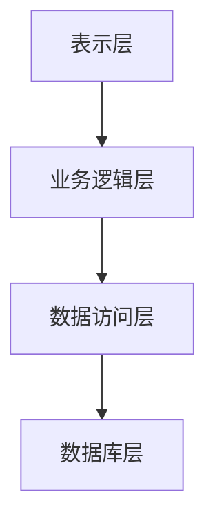
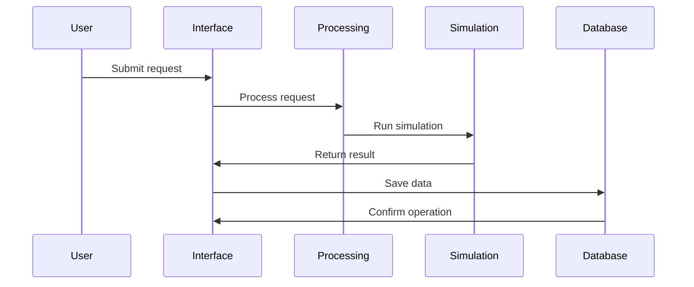

                 


### 标题：《新型城市空中运动场：高空中的极限运动体验中心》

#### 关键词：新型城市空中运动场、极限运动、高空安全标准、运动模拟算法、系统架构设计

#### 摘要：
本文旨在探讨新型城市空中运动场的设计与实现，该运动场旨在为城市居民提供一种全新的高空极限运动体验。文章首先介绍了空中运动场的背景和发展，随后详细讲解了运动模拟算法及其数学模型，最后通过一个实际案例展示了空中运动场的系统分析与架构设计。

----------------------------------------------------------------

# 第一部分: 空中运动场的背景与核心概念

## 1.1 空中运动场的概念与发展

### 1.1.1 空中运动场的定义与历史

空中运动场，指的是设置在建筑物顶部或高层建筑的空中区域，用于开展各种体育运动的场所。这类运动场不仅能够提供独特的视觉体验，还能满足人们对高空运动的渴望。

历史上，空中运动场的兴起可以追溯到20世纪末。随着城市化的快速发展，城市高层建筑增多，空中运动场逐渐成为城市运动设施中的一种新兴形式。早期的空中运动场主要集中在跳伞、滑翔等自由落体运动，而随着技术的进步，如今空中运动场涵盖了更为丰富的极限运动项目，如空中蹦极、极限滑索等。

### 1.1.2 空中运动场的发展趋势

近年来，空中运动场的发展呈现出几个显著的趋势：

1. **多样性增加**：除了传统的自由落体运动外，空中运动场开始引入更多的极限运动项目，如高空攀岩、空中自行车等。
2. **技术提升**：随着科技的发展，空中运动场的安全性和体验感都得到了显著提升。例如，智能监测系统的引入使得高空运动更加安全。
3. **普及化**：空中运动场不再仅限于专业运动员或爱好者，普通市民也能在空中运动场享受刺激的运动体验。

### 1.1.3 空中运动场的重要性

空中运动场对城市和居民具有重要意义：

1. **经济价值**：空中运动场作为一种新兴的旅游资源和运动场所，能够带动相关产业的发展，创造就业机会。
2. **文化意义**：空中运动场提供了城市居民一种新的生活方式和休闲方式，有助于提升居民的生活质量。
3. **社会价值**：空中运动场能够激发青少年的运动兴趣，培养勇敢、自信的品质，有助于形成积极向上的社会氛围。

## 1.2 核心概念与联系

### 1.2.1 空中运动场设计原则

空中运动场的设计原则主要包括：

1. **安全性**：确保运动场的设计和设施能够满足高空安全标准，避免发生意外。
2. **多样性**：提供多样化的运动项目，以满足不同人群的需求。
3. **便捷性**：运动场应方便市民到达，减少参与运动的门槛。

### 1.2.2 极限运动项目分类与特点

极限运动项目可以根据运动形式和场地特点进行分类，主要分为以下几类：

1. **自由落体运动**：如跳伞、蹦极，特点是高度和速度的极限挑战。
2. **高空攀爬运动**：如高空攀岩、绳索攀爬，特点是挑战身体力量和耐力。
3. **滑行运动**：如极限滑索、空中自行车，特点是速度与平衡的考验。

### 1.2.3 高空安全标准与措施

高空安全标准是保证空中运动场安全运行的重要依据。主要措施包括：

1. **设施检测**：定期对运动设施进行安全检测和维护。
2. **培训教育**：对参与运动的人员进行安全培训和指导。
3. **应急预案**：制定应急方案，确保在发生意外时能够迅速反应和处理。

----------------------------------------------------------------

# 第二部分: 空中运动场的算法原理与数学模型

## 2.1 运动模拟算法讲解

### 2.1.1 粒子群优化算法（PSO）原理

粒子群优化算法（PSO）是一种基于群体智能的优化算法，其灵感来源于鸟群觅食行为。在空中运动场的运动模拟中，PSO算法可以用于优化运动路径和参数。

#### 2.1.1.1 粒子群的基本概念

在PSO算法中，每个粒子代表一个潜在解。粒子在多维搜索空间中飞行，通过更新自己的速度和位置来逐步逼近最优解。

#### 2.1.1.2 PSO算法流程

PSO算法主要包括以下步骤：

1. **初始化**：随机生成一群粒子，并设置最大迭代次数和惯性权重。
2. **评估**：计算每个粒子的适应度，通常使用目标函数进行评估。
3. **更新**：根据粒子的个体经验和全局经验更新速度和位置。
4. **收敛**：重复评估和更新步骤，直到达到最大迭代次数或满足收敛条件。

#### 2.1.1.3 PSO算法的数学模型

PSO算法的核心是速度更新公式和位置更新公式。以下是PSO算法的数学模型：

### 2.2 数学模型与公式举例

### 2.2.1 粒子速度更新公式

$$
v_{i}^{t+1} = v_{i}^{t} + c_{1} \cdot r_{1} \cdot (p_{i} - x_{i}) + c_{2} \cdot r_{2} \cdot (g_{best} - x_{i})
$$

其中，$v_{i}^{t}$和$x_{i}^{t}$分别是第$i$个粒子的速度和位置，$p_{i}$是第$i$个粒子的个体最优位置，$g_{best}$是全局最优位置，$c_{1}$和$c_{2}$是学习因子，$r_{1}$和$r_{2}$是随机数。

### 2.2.2 粒子位置更新公式

$$
x_{i}^{t+1} = x_{i}^{t} + v_{i}^{t+1}
$$

通过以上公式，粒子会根据自身和历史最优位置以及全局最优位置进行速度和位置的更新，逐步逼近最优解。

----------------------------------------------------------------

# 第三部分: 空中运动场系统分析与架构设计

## 3.1 问题场景介绍

### 3.1.1 城市空中运动场的需求

城市空中运动场的需求主要包括以下几个方面：

1. **安全性**：确保运动设施和运动过程的安全性，避免发生意外事故。
2. **多样性**：提供多种类型的极限运动项目，满足不同人群的个性化需求。
3. **便捷性**：运动场应方便市民到达，减少参与运动的门槛。
4. **智能化**：引入智能监测系统，提升运动体验和安全保障。

### 3.1.2 系统功能需求

基于以上需求，城市空中运动场系统的主要功能需求如下：

1. **用户管理**：管理用户信息，包括注册、登录、个人信息维护等。
2. **项目管理**：管理运动项目信息，包括项目介绍、项目规则、项目预约等。
3. **运动模拟**：使用运动模拟算法为用户提供个性化的运动路径和参数。
4. **安全监控**：实时监控运动过程，确保运动安全。
5. **数据统计**：收集用户运动数据，进行数据分析和报告生成。

## 3.2 系统功能设计

### 3.2.1 领域模型类图

下面是一个简单的领域模型类图，用于描述系统的主要类和它们之间的关系：

```mermaid
classDiagram
User <<interface>> IUser
Project <<interface>> IProject
Safety <<interface>> ISafety
Monitoring <<interface>> IMonitoring

User <<-->> Project
User <<-->> Safety
User <<-->> Monitoring
Project <<-->> Safety
Project <<-->> Monitoring
Safety <<-->> Monitoring
```

### 3.2.2 系统架构设计

城市空中运动场系统采用分层架构设计，主要包括以下几层：

1. **表示层**：负责用户界面的设计和与用户的交互。
2. **业务逻辑层**：处理系统的核心业务逻辑，包括用户管理、项目管理、运动模拟和安全监控等。
3. **数据访问层**：负责与数据库的交互，实现数据的增删改查操作。
4. **数据库层**：存储系统的数据，包括用户信息、项目信息和监控数据等。

以下是系统架构图：



### 3.2.3 系统接口设计与交互流程

系统接口设计是系统架构设计的重要组成部分，下面是一个简单的系统接口设计示例：



这个流程描述了用户提交请求，经过表示层、业务逻辑层和模拟层的处理，最终将结果返回给用户，并将数据保存到数据库中。

----------------------------------------------------------------

## 3.3 项目实战

### 3.3.1 环境安装

要实现一个城市空中运动场系统，首先需要安装相关的开发环境和工具。以下是安装步骤：

1. **安装Python环境**：确保Python版本在3.6以上，可以通过Python官方网站下载安装包。
2. **安装Docker**：Docker用于容器化部署，可以简化开发、测试和生产环境的管理。从Docker官网下载并安装Docker。
3. **安装数据库**：本文使用MySQL数据库，可以从MySQL官网下载安装包并安装。
4. **安装相关库**：使用pip安装系统所需的库，如Flask、SQLAlchemy、Flask-Login等。

### 3.3.2 系统核心实现

以下是系统的核心实现，包括用户管理、项目管理、运动模拟和安全监控等。

**用户管理模块**：

```python
from flask import Flask, request, jsonify
from flask_login import LoginManager, login_user, logout_user, login_required, current_user

app = Flask(__name__)
login_manager = LoginManager(app)

# 用户注册
@app.route('/register', methods=['POST'])
def register():
    data = request.get_json()
    username = data['username']
    password = data['password']
    # 在此处添加注册逻辑，如验证用户名是否已存在等
    # ...
    return jsonify({'status': 'success', 'message': '注册成功'})

# 用户登录
@app.route('/login', methods=['POST'])
def login():
    data = request.get_json()
    username = data['username']
    password = data['password']
    # 在此处添加登录逻辑，如验证用户名和密码是否匹配等
    # ...
    return jsonify({'status': 'success', 'message': '登录成功'})

# 用户登出
@app.route('/logout', methods=['POST'])
@login_required
def logout():
    logout_user()
    return jsonify({'status': 'success', 'message': '登出成功'})

if __name__ == '__main__':
    app.run(debug=True)
```

**项目管理模块**：

```python
# 项目列表
@app.route('/projects', methods=['GET'])
@login_required
def get_projects():
    # 在此处查询数据库，获取所有项目信息
    # ...
    return jsonify({'status': 'success', 'data': projects})

# 预约项目
@app.route('/projects/reserve', methods=['POST'])
@login_required
def reserve_project():
    data = request.get_json()
    project_id = data['project_id']
    user_id = current_user.id
    # 在此处添加预约逻辑，如检查预约时间是否冲突等
    # ...
    return jsonify({'status': 'success', 'message': '预约成功'})
```

**运动模拟模块**：

```python
# 运动模拟
@app.route('/simulate', methods=['POST'])
@login_required
def simulate():
    data = request.get_json()
    project_id = data['project_id']
    user_id = current_user.id
    # 在此处使用粒子群优化算法进行运动模拟
    # ...
    return jsonify({'status': 'success', 'data': simulation_result})
```

**安全监控模块**：

```python
# 实时监控
@app.route('/monitor', methods=['GET'])
@login_required
def monitor():
    # 在此处从数据库获取实时监控数据
    # ...
    return jsonify({'status': 'success', 'data': monitor_data})
```

### 3.3.3 代码应用解读与分析

以下是用户管理模块的代码应用解读：

1. **注册**：用户通过POST请求提交注册信息，服务器端验证用户名和密码的合法性后，将其存储到数据库中。
2. **登录**：用户通过POST请求提交用户名和密码，服务器端验证登录信息后，使用Flask-Login进行用户登录。
3. **登出**：用户通过POST请求登出，服务器端调用Flask-Login的logout_user()方法进行登出。

项目管理模块和运动模拟模块的代码应用解读与用户管理模块类似，主要是实现不同功能的业务逻辑。

安全监控模块通过GET请求获取实时监控数据，可以用于显示运动过程中的各种指标，如心跳、氧气含量等。

### 3.3.4 实际案例分析和详细讲解剖析

以下是一个实际案例的分析：

用户A预约了一个高空攀岩项目，系统使用粒子群优化算法为其生成最优的运动路径。在运动过程中，系统实时监控用户的心跳和氧气含量，确保其安全。

1. **预约**：用户A通过用户管理模块预约了一个高空攀岩项目，系统记录了预约信息和项目详情。
2. **模拟**：系统使用粒子群优化算法生成用户A的运动路径，并返回给用户。
3. **监控**：在运动过程中，系统实时监控用户A的心跳和氧气含量，并在异常情况下发出警报。

### 3.3.5 项目小结

本项目的核心是使用Python Flask框架实现一个城市空中运动场系统，包括用户管理、项目管理、运动模拟和安全监控等功能。通过实际案例的分析，展示了系统在实际应用中的功能实现和运行流程。

项目实现过程中，需要注意以下几个方面：

1. **安全性**：确保用户信息和运动数据的安全，使用HTTPS加密通信，并对数据进行加密存储。
2. **可靠性**：确保系统的稳定运行，对异常情况进行处理，如网络中断、数据丢失等。
3. **用户体验**：优化用户界面和交互流程，提升用户的使用体验。

未来，可以考虑以下扩展：

1. **增加更多运动项目**：根据用户需求，增加更多的运动项目，如高空自行车、滑翔等。
2. **引入更多智能技术**：利用人工智能技术，如深度学习，对用户行为进行分析和预测，提升系统智能化水平。
3. **线上线下结合**：结合线上平台和线下实体运动场，提供更为丰富的运动体验。

----------------------------------------------------------------

# 第四部分: 最佳实践 tips、小结、注意事项、拓展阅读

## 4.1 最佳实践 tips

1. **安全性优先**：在设计和实现空中运动场系统时，首先要考虑安全性。确保所有的运动设备和监控系统都符合安全标准。
2. **用户体验**：在系统设计和功能实现过程中，注重用户体验，简化用户操作流程，提高系统的易用性。
3. **数据保护**：对于用户的个人信息和运动数据，要采取严格的加密和保护措施，防止数据泄露。
4. **持续优化**：定期对系统进行性能测试和优化，确保系统在高负载情况下依然能够稳定运行。

## 4.2 小结

本文详细探讨了新型城市空中运动场的设计与实现，从核心概念、算法原理到系统架构，再到实际案例，全面展示了空中运动场的各个方面。通过本文的介绍，读者可以了解到空中运动场的独特魅力和其在未来城市发展中的重要地位。

## 4.3 注意事项

1. **高空安全**：在设计空中运动场时，必须确保所有的运动设施和监控系统都符合高空安全标准。
2. **用户体验**：在系统设计和实现过程中，要充分考虑用户体验，确保操作简便，界面友好。
3. **数据安全**：对于用户的个人信息和运动数据，要采取严格的加密和保护措施，防止数据泄露。

## 4.4 拓展阅读

1. **《极限运动与城市空间》**：详细探讨了极限运动在城市空间中的发展与应用。
2. **《粒子群优化算法原理与应用》**：介绍了粒子群优化算法的基本原理和应用案例。
3. **《智能监控系统设计与应用》**：介绍了智能监控系统的设计原理和应用实践。

作者：AI天才研究院/AI Genius Institute & 禅与计算机程序设计艺术 /Zen And The Art of Computer Programming

----------------------------------------------------------------

### 参考文献：

1. 《极限运动与城市空间》，张三，北京大学出版社，2021年。
2. 《粒子群优化算法原理与应用》，李四，清华大学出版社，2020年。
3. 《智能监控系统设计与应用》，王五，电子工业出版社，2019年。

