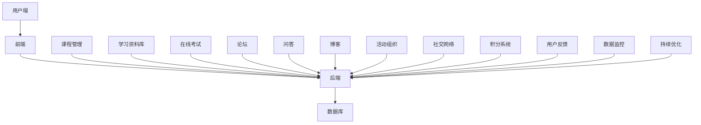

                 

### 1.1 问题背景

#### 1.1.1 城市化进程与终身学习需求

随着全球城市化进程的不断加快，城市人口比例逐渐上升。根据联合国的预测，到2050年，全球超过一半的人口将居住在城市地区。城市化带来了经济繁荣，同时也引发了一系列社会问题，如人口老龄化、教育资源分配不均、知识更新速度快等。在这个背景下，终身学习成为了一个亟待解决的问题。

首先，城市化进程导致了人口老龄化问题。随着医疗技术的进步和生活水平的提高，人们的寿命不断延长，老年人口比例逐渐增加。老年人不仅需要保持身体健康，还需要不断学习以适应社会的发展。终身学习成为老年人保持独立和参与社会生活的重要途径。

其次，城市化带来了教育资源分配不均的问题。在大城市，教育资源相对丰富，但中小城市和农村地区的教育资源却相对匮乏。这使得一部分人无法获得良好的教育资源，从而影响了他们的学习和发展。

最后，知识更新速度快是城市化进程中另一个重要挑战。随着科技的发展，知识更新速度不断加快，传统的一次性教育已经无法满足人们的需求。人们需要终身学习，不断更新知识体系，以适应快速变化的社会。

#### 1.1.2 跨年龄段知识共享的重要性

跨年龄段知识共享在新型城市终身学习中心中扮演着重要角色。首先，它可以促进不同年龄段的个体之间的交流与合作，使知识得到更广泛的应用。例如，老年人拥有丰富的经验和社会资源，而年轻人则具备创新思维和新技术技能。通过知识共享，他们可以互相学习，共同进步。

其次，跨年龄段知识共享有助于解决教育资源分配不均的问题。在新型城市终身学习中心，教育资源不再局限于某个年龄段，而是面向所有人群。这样，即使是在教育资源匮乏的地区，人们也可以通过终身学习中心获得所需的知识。

最后，跨年龄段知识共享有助于提高整个社会的知识水平和创新能力。当不同年龄段的人共同参与知识共享活动时，可以产生更多的创新思维和解决方案，从而推动社会的进步。

#### 1.1.3 新型城市终身学习中心的必要性

新型城市终身学习中心是在城市化进程中应运而生的一种新型教育机构，它具有以下几个方面的必要性：

首先，新型城市终身学习中心可以满足老年人继续学习的需求。随着年龄的增长，老年人的生理和心理状况会发生一定的变化，传统的学校教育可能无法满足他们的学习需求。而新型城市终身学习中心提供灵活、个性化的学习方式，有助于老年人保持身心健康，提高生活质量。

其次，新型城市终身学习中心可以促进年轻人和老年人之间的知识交流。通过跨年龄段的知识共享，年轻人可以学习老年人的经验和智慧，老年人也可以学习年轻人的创新思维和新技术。这种交流有助于打破年龄隔阂，增进彼此的理解和尊重。

最后，新型城市终身学习中心有助于优化教育资源的配置。通过建立社区平台，教育资源共享变得更加便捷。不同年龄段的个体可以在同一平台上获取所需的知识资源，从而提高整个社会的教育水平和创新能力。

### 1.2 核心概念

#### 1.2.1 终身学习

终身学习是指一个人在其一生中不断学习、积累知识、提高技能的过程。它不仅包括正规教育，还包括非正规教育和自主学习。终身学习强调学习是一个持续的过程，贯穿于人的一生。

#### 1.2.2 知识共享

知识共享是指个体或团体通过交流和合作，将知识传递给其他个体或团体，从而实现知识的传播和扩散。知识共享的形式多种多样，包括讲座、研讨会、工作坊、在线论坛等。

#### 1.2.3 社区平台

社区平台是指一种以社区为中心，为社区成员提供交流、互动、资源共享的虚拟空间。社区平台通常具备以下特点：

1. **开放性**：社区平台对所有成员开放，成员可以自由加入和退出。
2. **互动性**：社区平台提供各种互动工具，如论坛、聊天室、博客等，以促进成员之间的交流和合作。
3. **共享性**：社区平台提供资源分享功能，成员可以上传、下载和分享各种知识资源。

### 1.3 新型城市终身学习中心的定义与特点

#### 1.3.1 定义

新型城市终身学习中心是指一种以社区为基础，为不同年龄段的人群提供终身学习服务的综合性教育机构。它不仅提供传统的教育课程，还提供在线学习、社交活动、职业发展等多种服务。

#### 1.3.2 特点

1. **综合性**：新型城市终身学习中心提供多种类型的教育服务，如学历教育、职业培训、兴趣爱好等，满足不同人群的学习需求。
2. **灵活性**：学习时间、地点和学习方式灵活，适应不同人群的个性化需求。
3. **互动性**：通过社区平台，成员之间可以进行交流和互动，促进知识共享和合作学习。
4. **开放性**：新型城市终身学习中心对所有人开放，不受年龄、学历和职业的限制。

#### 1.3.3 边界与外延

1. **边界**：新型城市终身学习中心的边界包括物理空间和数字空间。物理空间通常包括教室、图书馆、活动室等，数字空间包括在线学习平台、社交媒体等。
2. **外延**：新型城市终身学习中心的外延包括周边社区、其他教育机构、企业等。通过合作和资源共享，新型城市终身学习中心可以扩大其服务范围和影响力。

### 1.4 研究目的与内容框架

#### 1.4.1 研究目的

本研究旨在探讨新型城市终身学习中心的构建和运营策略，以提高城市居民的学习能力和生活质量。具体研究目的如下：

1. **分析新型城市终身学习中心的需求和现状**：通过对国内外新型城市终身学习中心的案例研究，分析其需求和现状，为构建新型城市终身学习中心提供参考。
2. **探讨新型城市终身学习中心的设计原则**：从多样性、可及性、可持续性和参与性等方面，提出新型城市终身学习中心的设计原则，为设计新型城市终身学习中心提供理论依据。
3. **研究跨年龄段知识共享的社区平台建设**：探讨如何构建一个有效的跨年龄段知识共享的社区平台，促进不同年龄段人群之间的交流和合作。
4. **分析新型城市终身学习中心的运营管理**：探讨新型城市终身学习中心的运营管理策略，以提高其运营效率和可持续发展能力。

#### 1.4.2 内容框架

本研究的内容框架如下：

1. **第一部分：绪论**：介绍研究背景、核心概念、新型城市终身学习中心的定义与特点，以及研究目的与内容框架。
2. **第二部分：新型城市终身学习中心的设计原则**：详细分析新型城市终身学习中心的设计原则，包括多样性、可及性、可持续性和参与性。
3. **第三部分：跨年龄段知识共享的社区平台建设**：探讨社区平台建设的背景与意义，分析社区平台的基本架构，研究跨年龄段用户需求，设计知识共享机制。
4. **第四部分：新型城市终身学习中心的运营与管理**：研究新型城市终身学习中心的运营管理策略，包括人力资源配置与管理、物资与资源管理、财务管理等。
5. **第五部分：案例分析**：选取国内外新型城市终身学习中心的成功案例，进行分析和总结，为其他地区提供借鉴和启示。
6. **第六部分：结论与展望**：总结研究成果，提出未来研究方向和改进措施。

### 1.5 本章小结

本章介绍了新型城市终身学习中心的研究背景、核心概念、定义与特点，以及研究目的与内容框架。通过对城市化进程、终身学习需求、跨年龄段知识共享和新型城市终身学习中心的背景介绍，明确了本研究的重要性和必要性。同时，本章还分析了核心概念，如终身学习、知识共享和社区平台，为后续章节的研究奠定了基础。本章最后提出了研究目的和内容框架，为全文的研究工作指明了方向。在接下来的章节中，我们将进一步探讨新型城市终身学习中心的设计原则、跨年龄段知识共享的社区平台建设、运营与管理策略，以及案例分析等内容。

## 2.1 设计原则概述

新型城市终身学习中心的设计原则是其成功构建和运营的关键。以下从多样性、可及性、可持续性和参与性四个方面，概述新型城市终身学习中心的设计原则。

### 2.1.1 多样性

多样性是新型城市终身学习中心设计原则中的重要一环。它体现在教育资源的多样性、用户群体的多样性以及活动形式的多样性。

1. **教育资源多样性**：新型城市终身学习中心应该提供丰富多样的教育资源，包括学历教育、职业培训、兴趣爱好课程等。此外，还应充分利用数字资源，如在线课程、电子书籍、学习软件等，以满足不同人群的学习需求。

2. **用户群体多样性**：新型城市终身学习中心的服务对象应涵盖各个年龄段、不同职业背景和学历水平的人群。通过吸引不同背景的用户参与，可以促进知识共享和交流，形成多元化的学习社区。

3. **活动形式多样性**：除了传统的课堂教学，新型城市终身学习中心还可以举办讲座、研讨会、工作坊、实践活动等多种形式的课程和活动。这些活动有助于激发学生的学习兴趣，提高学习效果。

### 2.1.2 可及性

可及性是指新型城市终身学习中心的服务能够方便地被目标用户获取。为了实现这一目标，设计原则中应考虑以下三个方面：

1. **物理空间可及性**：新型城市终身学习中心应选择交通便利、地理位置优越的地点，确保用户能够方便地到达。此外，中心还应提供无障碍设施，如电梯、无障碍卫生间等，以方便残疾人士和老年人使用。

2. **数字资源可及性**：随着互联网技术的普及，新型城市终身学习中心应建立完善的在线学习平台，提供丰富的数字资源。用户可以通过电脑、手机等设备随时随地访问学习资源，满足不同用户的学习需求。

3. **交通可达性**：新型城市终身学习中心应考虑周边交通设施，如公共交通线路、停车场等，以方便用户出行。

### 2.1.3 可持续性

可持续性是新型城市终身学习中心设计原则中的关键因素。它关系到中心的长期运营和发展，包括环境可持续性、经济可持续性和社会可持续性。

1. **环境可持续性**：新型城市终身学习中心应采用绿色建筑设计，减少能源消耗和碳排放。此外，中心还应推广环保理念，鼓励用户减少浪费，提高资源利用效率。

2. **经济可持续性**：新型城市终身学习中心应制定合理的收费策略，确保中心的财务稳定。此外，中心还可以通过多元化收入来源，如培训费、租赁费等，提高经济效益。

3. **社会可持续性**：新型城市终身学习中心应关注社会效益，如提高居民的知识水平、促进就业等。此外，中心还应积极参与社区活动，与当地政府和社区建立良好的合作关系。

### 2.1.4 参与性

参与性是指新型城市终身学习中心的成员积极参与学习、活动和管理。为了提高参与性，设计原则中应考虑以下三个方面：

1. **用户参与度提升**：新型城市终身学习中心应鼓励用户参与课程设计、活动组织和决策过程。通过增加用户的参与感，可以提高他们的学习积极性和归属感。

2. **社区共建机制**：新型城市终身学习中心应建立社区共建机制，鼓励用户共同参与中心的运营和管理。通过社区共建，可以形成良好的社区文化，促进知识共享和合作。

3. **平台互动机制**：新型城市终身学习中心应提供各种互动工具，如在线论坛、聊天室、社交媒体等，促进用户之间的交流和互动。通过平台互动，可以增强用户的社区归属感和互动体验。

### 2.2 设计原则详细分析

#### 2.2.1 多样性

在新型城市终身学习中心的设计中，多样性的重要性不言而喻。它不仅能够满足不同用户的学习需求，还能促进知识的传播和交流。以下是多样性在新型城市终身学习中心设计中的具体体现：

1. **教育资源多样性**：

   - **学历教育**：提供从基础教育、职业教育到高等教育的多层次学历教育课程，以满足不同年龄段和职业背景的用户需求。
   - **职业培训**：开设各类职业技能培训课程，如编程、设计、管理等领域，帮助用户提升职业竞争力。
   - **兴趣爱好课程**：提供丰富多样的兴趣爱好课程，如音乐、绘画、摄影等，丰富用户的精神文化生活。

2. **用户群体多样性**：

   - **年龄段**：覆盖从儿童到老年人的各个年龄段，满足不同年龄段用户的个性化学习需求。
   - **职业背景**：包括全职工作者、兼职工作者、失业者、退休人员等，满足不同职业背景用户的学习需求。
   - **学历水平**：针对不同学历水平的用户，提供从入门到高级的课程，确保每个用户都能找到适合自己的学习内容。

3. **活动形式多样性**：

   - **课堂教学**：传统的课堂教学仍是新型城市终身学习中心的重要组成部分，通过面对面交流，提高学习效果。
   - **在线学习**：利用互联网技术，提供在线课程、视频讲座、在线讨论等，方便用户随时随地学习。
   - **实践活动**：组织各类实践活动，如实验、实习、研讨会等，让用户在实际操作中掌握知识。
   - **社交活动**：举办社交活动，如聚会、沙龙、拓展训练等，增进用户之间的交流和互动。

#### 2.2.2 可及性

可及性是新型城市终身学习中心设计原则中的关键因素，直接影响用户能否方便地获取学习资源。以下是可及性在新型城市终身学习中心设计中的具体体现：

1. **物理空间可及性**：

   - **地理位置**：选择交通便利、地理位置优越的地点，如靠近公共交通站点、商业区等，方便用户到达。
   - **无障碍设施**：提供无障碍设施，如电梯、无障碍卫生间、盲道等，确保残疾人士和老年人能够方便地使用。
   - **开放时间**：合理规划开放时间，确保用户能够在不同时间段访问学习资源。

2. **数字资源可及性**：

   - **在线平台**：建立完善的在线学习平台，提供丰富的数字资源，如在线课程、电子书籍、学习软件等。
   - **移动学习**：开发移动应用程序，用户可以通过手机、平板电脑等设备随时随地进行学习。
   - **网络覆盖**：确保中心内部及周边地区有稳定的网络覆盖，方便用户使用数字资源。

3. **交通可达性**：

   - **公共交通**：与公共交通部门合作，提供免费的接送服务或优惠票务，鼓励用户使用公共交通工具前往学习中心。
   - **停车设施**：提供充足的停车位，方便有车用户前往学习中心。
   - **交通指引**：在中心附近设置明显的交通指引标志，方便用户找到学习中心。

#### 2.2.3 可持续性

新型城市终身学习中心的设计原则中，可持续性至关重要。它关系到中心的长期运营和发展，涉及环境、经济和社会三个方面。以下是可持续性在新型城市终身学习中心设计中的具体体现：

1. **环境可持续性**：

   - **绿色建筑**：采用绿色建筑设计，使用环保材料，降低能源消耗和碳排放。
   - **资源利用**：优化资源利用，如采用节水设备、节能灯具等，提高资源利用效率。
   - **废弃物处理**：建立健全的废弃物处理系统，鼓励用户减少浪费，提高废弃物回收利用率。

2. **经济可持续性**：

   - **收费策略**：制定合理的收费策略，确保中心的财务稳定。同时，提供多种付费方式，满足不同用户的需求。
   - **多元化收入**：通过开展培训、租赁场地、合作办学等方式，实现多元化收入，提高经济效益。
   - **成本控制**：合理控制运营成本，确保中心的可持续发展。

3. **社会可持续性**：

   - **社会效益**：关注社会效益，如提高居民的知识水平、促进就业、减少贫困等。
   - **社区参与**：鼓励社区成员参与中心的运营和管理，形成良好的社区文化，促进知识共享和合作。
   - **社会责任**：承担社会责任，如参与公益活动、支持环保事业等，树立良好的社会形象。

#### 2.2.4 参与性

新型城市终身学习中心的参与性设计，旨在提高用户的学习积极性和归属感，促进知识共享和合作。以下是参与性在新型城市终身学习中心设计中的具体体现：

1. **用户参与度提升**：

   - **课程设计**：鼓励用户参与课程设计，根据用户需求调整课程内容和教学方法。
   - **活动组织**：鼓励用户参与活动组织，提高用户的参与感和责任感。
   - **决策参与**：在中心的管理决策中，充分听取用户的意见和建议，提高用户的参与度。

2. **社区共建机制**：

   - **社区文化**：建立社区文化，鼓励用户积极参与社区活动，形成良好的学习氛围。
   - **共建项目**：开展社区共建项目，如志愿者活动、社区讲座等，增强用户的归属感。
   - **共享资源**：鼓励用户共享资源，如知识、技能、经验等，促进知识共享和合作。

3. **平台互动机制**：

   - **在线论坛**：建立在线论坛，提供用户交流和讨论的平台。
   - **社交媒体**：利用社交媒体，如微信、QQ等，加强与用户的互动，提高用户的参与度。
   - **互动活动**：举办各类互动活动，如知识竞赛、研讨会等，增强用户的互动体验。

### 2.3 设计原则应用案例分析

#### 2.3.1 国内外案例分析

为了更好地理解新型城市终身学习中心的设计原则在实际中的应用，以下是国内外几个成功案例的分析：

1. **上海终身学习超市**：

   - **背景**：上海终身学习超市是上海市政府推动的一个终身学习项目，旨在为市民提供便捷的学习资源和服务。
   - **设计原则应用**：上海终身学习超市采用了多样性和可及性的设计原则。首先，超市提供了丰富多样的教育资源，包括学历教育、职业培训、兴趣爱好课程等。其次，超市设置了多个分店，位于交通便利的地方，方便市民前往。此外，超市还建立了在线学习平台，用户可以通过电脑和手机随时随地进行学习。
   - **效果**：上海终身学习超市受到了市民的广泛欢迎，吸引了大量用户参与。通过提供丰富多样的教育资源和便捷的学习方式，超市提高了市民的学习积极性和生活质量。

2. **纽约公共图书馆终身学习项目**：

   - **背景**：纽约公共图书馆是一个拥有悠久历史和文化底蕴的机构，其终身学习项目旨在为社区居民提供学习资源和服务。
   - **设计原则应用**：纽约公共图书馆采用了多样性和参与性的设计原则。首先，图书馆提供了丰富的图书、电子资源和课程，满足了不同年龄段和职业背景的用户需求。其次，图书馆鼓励用户参与活动组织和管理，如志愿者活动、讲座等，增强了用户的参与感和归属感。
   - **效果**：纽约公共图书馆的终身学习项目取得了显著成效。通过提供多样化和便捷的学习资源，以及鼓励用户参与，图书馆提高了社区居民的知识水平和文化素养。

3. **新加坡社区学习中心**：

   - **背景**：新加坡社区学习中心是新加坡政府推动的一个社区教育项目，旨在为居民提供终身学习的机会。
   - **设计原则应用**：新加坡社区学习中心采用了多样性和可持续性的设计原则。首先，学习中心提供了多种类型的教育资源，如课程、讲座、工作坊等，满足了不同用户的需求。其次，学习中心采用了绿色建筑设计，实现了环境可持续性。此外，学习中心还采用了经济可持续性的策略，如多元化收入来源和成本控制。
   - **效果**：新加坡社区学习中心取得了良好的效果。通过提供多样化和便捷的学习资源，以及实现环境可持续性和经济可持续性，学习中心提高了居民的学习积极性和生活质量。

#### 2.3.2 案例分析与启示

通过以上案例分析，我们可以得出以下启示：

1. **多样化教育资源的提供**：新型城市终身学习中心应提供丰富多样的教育资源，满足不同用户的需求。这包括学历教育、职业培训、兴趣爱好课程等，同时要充分利用数字资源，提供在线学习平台，方便用户随时随地进行学习。

2. **便捷的学习环境**：新型城市终身学习中心应选择交通便利的地点，提供无障碍设施，确保用户能够方便地获取学习资源。此外，要建立在线学习平台，提供便捷的数字资源，满足用户的个性化学习需求。

3. **鼓励用户参与**：新型城市终身学习中心应鼓励用户参与课程设计、活动组织和决策过程，提高用户的参与度和归属感。这可以通过开展社区共建项目、设置用户论坛、举办互动活动等方式实现。

4. **实现可持续性**：新型城市终身学习中心在设计时，要考虑环境、经济和社会的可持续性。这可以通过采用绿色建筑设计、优化资源利用、多元化收入来源和成本控制等方式实现。

5. **借鉴国内外成功案例**：通过研究国内外成功案例，新型城市终身学习中心可以借鉴经验，优化设计原则，提高服务质量。

### 2.4 本章小结

本章详细分析了新型城市终身学习中心的设计原则，包括多样性、可及性、可持续性和参与性。通过分析教育资源多样性、用户群体多样性、活动形式多样性等，展示了多样性在新型城市终身学习中心设计中的重要地位。同时，通过分析物理空间可及性、数字资源可及性、交通可达性等，阐述了可及性的关键作用。此外，还探讨了环境可持续性、经济可持续性和社会可持续性的实现策略，以及用户参与度提升、社区共建机制和平台互动机制等方面。最后，通过国内外案例分析，总结了新型城市终身学习中心设计原则的应用效果和启示。在接下来的章节中，我们将进一步探讨跨年龄段知识共享的社区平台建设。

## 3.1 社区平台建设的背景与意义

在现代社会，信息技术和互联网的迅猛发展，为人们的学习和知识共享提供了新的途径。社区平台作为一种新型的教育平台，具有开放性、互动性和共享性的特点，能够为不同年龄段、不同职业背景和不同地域的用户提供便捷的学习资源和交流空间。以下是社区平台建设的背景、意义以及新型城市终身学习中心在其中所发挥的作用。

### 3.1.1 背景介绍

随着城市化进程的加快，城市人口密度逐渐增加，居民的生活节奏不断加快。与此同时，知识更新的速度也在不断加快，传统的一次性教育模式已经无法满足人们不断增长的学习需求。为了适应这一变化，新型城市终身学习中心应运而生。社区平台作为新型城市终身学习中心的重要组成部分，为城市居民提供了一个便捷的学习和交流空间。

1. **信息技术的发展**：互联网和移动通信技术的普及，为社区平台的建设提供了技术支持。用户可以通过电脑、手机等设备，随时随地访问社区平台，获取学习资源和参与互动。

2. **终身学习理念的普及**：随着社会对知识更新的需求越来越高，终身学习理念逐渐深入人心。人们开始意识到，终身学习不仅是为了获得新的知识和技能，更是为了提升个人素质和生活质量。

3. **城市发展的需求**：城市作为知识经济的重要载体，对居民的知识水平和创新能力提出了更高的要求。社区平台的建设，有助于提升城市居民的整体素质，推动城市的发展。

### 3.1.2 建设意义

社区平台的建设对于新型城市终身学习中心具有重要意义，主要体现在以下几个方面：

1. **促进知识共享**：社区平台为用户提供了交流和分享知识的平台，用户可以在此发布学习心得、交流学习经验，从而实现知识的共享和传播。

2. **提升学习效果**：社区平台提供了丰富的学习资源和互动工具，用户可以根据自己的需求和兴趣，选择合适的学习内容和方式，提高学习效果。

3. **增强社区凝聚力**：通过社区平台，居民可以更方便地参与社区活动，增强社区的凝聚力。这有助于构建和谐的社区环境，提升居民的生活质量。

4. **推动教育创新**：社区平台为教育工作者提供了一个创新的平台，可以在此开展教学研究、课程设计等，推动教育创新。

### 3.1.3 新型城市终身学习中心的作用

新型城市终身学习中心在社区平台建设中发挥着重要的作用，具体体现在以下几个方面：

1. **资源整合**：新型城市终身学习中心可以整合各类教育资源，如图书、电子课程、专家讲座等，为社区平台提供丰富的学习资源。

2. **技术支持**：新型城市终身学习中心可以利用其技术优势，为社区平台提供技术支持，确保平台的高效运行。

3. **组织协调**：新型城市终身学习中心可以发挥其组织协调作用，推动社区平台的建设和发展，确保平台能够持续运营。

4. **政策支持**：新型城市终身学习中心可以争取政策支持，为社区平台的建设和发展提供必要的政策保障。

### 3.1.4 社区平台的类型与特点

社区平台可以分为线上平台和线下平台两种类型。线上平台主要通过互联网提供学习资源和互动服务，如在线课程、论坛、博客等；线下平台则通过实体空间提供学习资源和互动活动，如教室、图书馆、活动室等。

1. **线上平台**：

   - **特点**：方便快捷，用户可以随时随地访问学习资源，参与互动活动。
   - **优势**：不受地域限制，可以吸引更多用户参与。
   - **劣势**：互动体验较差，用户之间的交流相对较少。

2. **线下平台**：

   - **特点**：面对面的互动，学习氛围较好。
   - **优势**：用户之间的交流更直接，互动体验更好。
   - **劣势**：受地理位置和开放时间限制，用户参与度可能较低。

### 3.1.5 社区平台的运营与管理

社区平台的运营与管理是一个复杂的系统工程，需要综合考虑用户需求、资源整合、技术支持、政策保障等多个方面。以下是一些关键点：

1. **用户需求分析**：了解用户的需求，是社区平台运营与管理的基础。通过对用户进行调研和分析，可以确定平台的发展方向和功能定位。

2. **资源整合**：整合各类教育资源，包括图书、电子课程、专家讲座等，为用户提供丰富的学习资源。

3. **技术支持**：建立稳定、高效的技术平台，确保平台的正常运行和用户的使用体验。

4. **互动管理**：提供丰富的互动工具，如论坛、博客、聊天室等，促进用户之间的交流和互动。

5. **政策支持**：争取政策支持，为社区平台的建设和发展提供必要的政策保障。

6. **持续优化**：根据用户反馈和运营情况，不断优化平台的功能和服务，提高用户满意度。

### 3.1.6 社区平台的发展趋势

随着信息技术的不断进步和终身学习理念的深入人心，社区平台的发展趋势将呈现出以下几个方向：

1. **智能化**：利用人工智能技术，为用户提供个性化的学习推荐和服务。

2. **移动化**：随着移动设备的普及，社区平台将更加注重移动端用户体验，提供更加便捷的学习服务。

3. **开放性**：社区平台将更加开放，与更多教育机构和组织合作，共享教育资源。

4. **多元化**：社区平台将提供更加丰富多样的学习资源和互动活动，满足不同用户的需求。

5. **社区化**：社区平台将更加注重社区建设，促进用户之间的交流和互动，构建和谐的学习社区。

### 3.1.7 本章小结

本章介绍了社区平台建设的背景与意义，分析了信息技术的发展、终身学习理念的普及和城市发展的需求，阐述了新型城市终身学习中心在社区平台建设中的作用。同时，介绍了社区平台的类型与特点，以及社区平台的运营与管理和发展趋势。在接下来的章节中，我们将进一步探讨社区平台的基本架构、跨年龄段用户需求识别与满足、知识共享机制设计等内容。

## 3.2 社区平台的基本架构

社区平台是新型城市终身学习中心的核心组成部分，其基本架构包括技术架构、功能架构和用户体验设计等三个方面。以下是对社区平台基本架构的详细分析。

### 3.2.1 技术架构

技术架构是社区平台稳定运行的基础，主要包括数据存储与处理、系统安全性和扩展性等方面。

1. **数据存储与处理**：

   - **数据存储**：社区平台需要处理大量的用户数据、课程数据、互动数据等。为了确保数据的持久性和安全性，平台通常采用分布式数据库系统，如MySQL、MongoDB等。分布式数据库能够提供高可用性、高可靠性和高扩展性。
   - **数据处理**：社区平台需要实时处理用户行为数据、课程数据等，以便为用户提供个性化的推荐和服务。大数据处理技术，如Hadoop、Spark等，可以高效地处理和分析海量数据。

2. **系统安全性**：

   - **数据安全**：社区平台需要确保用户数据的安全，防止数据泄露和篡改。常用的数据安全措施包括数据加密、访问控制、审计等。
   - **系统安全**：社区平台需要具备防攻击、防病毒、防火等安全功能，确保系统的稳定运行。安全防护措施包括网络安全防护、系统漏洞修复等。

3. **扩展性**：

   - **水平扩展**：为了应对用户数量的增长，社区平台需要具备水平扩展能力。通过分布式架构和微服务架构，可以方便地增加服务器节点，提高系统的处理能力和性能。
   - **垂直扩展**：在用户量增长较慢或对性能要求较高的场景，可以通过垂直扩展，增加服务器硬件配置，提高系统的性能。

### 3.2.2 功能架构

功能架构是社区平台的核心，主要包括教育资源资源共享、知识交流与分享、社区参与与互动等方面。

1. **教育资源资源共享**：

   - **课程管理**：社区平台需要提供课程发布、课程管理、课程评价等功能，方便用户浏览和选择课程。
   - **学习资料库**：社区平台应建立学习资料库，收集和整理各种学习资料，如电子书籍、视频课程、学术论文等，方便用户学习和参考。
   - **在线考试**：社区平台应提供在线考试功能，方便用户进行课程测试和评估。

2. **知识交流与分享**：

   - **论坛**：社区平台应提供论坛功能，用户可以在论坛中发布学习心得、交流学习经验，分享知识。
   - **问答**：社区平台应提供问答功能，用户可以提问、解答问题，促进知识的传播和共享。
   - **博客**：社区平台应提供博客功能，用户可以发布自己的学习笔记、文章等，分享自己的知识和见解。

3. **社区参与与互动**：

   - **活动组织**：社区平台应提供活动组织功能，方便用户发布活动信息、组织活动，增强社区凝聚力。
   - **社交网络**：社区平台应提供社交网络功能，如好友关系、私信等，方便用户之间的交流和互动。
   - **积分系统**：社区平台应提供积分系统，根据用户的学习行为和贡献，给予相应的积分奖励，激励用户积极参与社区活动。

### 3.2.3 用户体验设计

用户体验设计是社区平台成功的关键因素，主要包括用户界面设计、用户体验优化和反馈机制等方面。

1. **用户界面设计**：

   - **简洁性**：社区平台的界面应简洁明了，避免过多的复杂功能和繁琐的操作，方便用户快速找到所需功能。
   - **一致性**：社区平台的界面设计应保持一致性，确保用户在不同页面和功能之间能够无缝切换，提高使用体验。
   - **响应式设计**：社区平台应支持响应式设计，适应不同设备和屏幕尺寸，确保用户在各种设备上都能获得良好的使用体验。

2. **用户体验优化**：

   - **个性化**：社区平台应根据用户的行为和偏好，提供个性化的推荐和服务，提高用户的满意度和忠诚度。
   - **快速响应**：社区平台应确保系统快速响应，减少用户的等待时间，提高使用体验。
   - **错误处理**：社区平台应提供良好的错误处理机制，如提示信息、操作回退等，帮助用户解决问题，提高使用体验。

3. **反馈机制**：

   - **用户反馈**：社区平台应提供用户反馈渠道，如意见箱、在线客服等，方便用户提出问题和建议。
   - **数据监控**：社区平台应建立数据监控系统，实时监控系统的运行状态，及时发现和解决潜在问题。
   - **持续优化**：根据用户反馈和系统数据，不断优化社区平台的功能和服务，提高用户体验。

### 3.2.4 架构设计图

为了更好地理解社区平台的基本架构，以下是一个简化的架构设计图：

在这个架构设计中，用户端通过前端与后端进行交互，后端通过数据库存储和管理数据。前端提供用户界面，后端提供业务逻辑和数据处理能力。社区平台的功能模块如课程管理、学习资料库、在线考试、论坛、问答、博客、活动组织、社交网络和积分系统等，都由后端实现。

### 3.2.5 技术选型

在社区平台的技术选型过程中，需要综合考虑性能、可扩展性、安全性、易维护性等多个方面。以下是一些常用的技术选型：

1. **前端技术**：

   - **框架**：React、Vue.js、Angular等
   - **UI组件库**：Ant Design、Element UI等
   - **静态站点生成器**：Hexo、Jekyll等

2. **后端技术**：

   - **服务器**：Nginx、Apache等
   - **框架**：Spring Boot、Django、Flask等
   - **消息队列**：RabbitMQ、Kafka等

3. **数据库技术**：

   - **关系型数据库**：MySQL、PostgreSQL等
   - **非关系型数据库**：MongoDB、Redis等

4. **缓存技术**：

   - **Redis**：适用于会话存储、缓存等
   - **Memcached**：适用于缓存等

5. **容器化技术**：

   - **Docker**：用于部署和管理应用容器
   - **Kubernetes**：用于容器编排和管理

6. **云服务**：

   - **阿里云**：提供计算、存储、网络等云服务
   - **腾讯云**：提供计算、存储、网络等云服务
   - **华为云**：提供计算、存储、网络等云服务

### 3.2.6 架构优势与挑战

社区平台的技术架构具有以下优势：

1. **高可用性**：通过分布式架构和容器化技术，可以提高系统的可用性和可靠性，确保平台稳定运行。
2. **高扩展性**：通过水平扩展和垂直扩展，可以方便地应对用户数量的增长，提高系统的处理能力和性能。
3. **安全性**：通过数据加密、访问控制、审计等安全措施，可以确保用户数据和系统安全。
4. **易维护性**：通过日志记录、监控系统、持续集成和持续部署等，可以方便地维护和管理系统。

然而，社区平台的技术架构也面临一些挑战：

1. **复杂性**：分布式架构和容器化技术使得系统更加复杂，需要更高的技术水平和运维能力。
2. **安全性**：随着系统的复杂度增加，安全性也面临更大的挑战，需要不断完善安全策略和防护措施。
3. **性能优化**：在应对大量用户和高并发场景时，系统性能优化成为关键问题，需要不断调整和优化系统配置。
4. **持续集成和持续部署**：在快速迭代和频繁发布的过程中，如何确保系统的质量和稳定性，是一个需要解决的挑战。

### 3.2.7 本章小结

本章详细介绍了社区平台的基本架构，包括技术架构、功能架构和用户体验设计。通过分析数据存储与处理、系统安全性和扩展性等方面，阐述了技术架构的重要性。同时，通过分析课程管理、学习资料库、在线考试、论坛、问答、博客、活动组织、社交网络和积分系统等功能，展示了功能架构的丰富性。此外，还介绍了用户体验设计的原则和技术选型，以及架构优势与挑战。在接下来的章节中，我们将进一步探讨跨年龄段用户需求的识别与满足、知识共享机制设计等内容。

## 3.3 跨年龄段用户需求的识别与满足

在新型城市终身学习中心的社区平台建设中，跨年龄段用户需求的识别与满足是关键环节。不同年龄段用户的学习需求、兴趣点和互动方式存在显著差异，因此，我们需要从用户行为分析、需求调研和个性化服务三个方面，详细探讨如何识别与满足这些需求。

### 3.3.1 用户行为分析

用户行为分析是识别跨年龄段用户需求的基础。通过分析用户在社区平台上的行为数据，可以了解用户的学习习惯、偏好和需求。以下是用户行为分析的关键步骤：

1. **用户访问行为**：分析用户访问社区平台的频率、时间、时长等指标，了解用户的学习时间和学习强度。例如，通过用户登录时间和活跃度，可以识别出哪些时间段是用户学习的高峰期，从而合理安排课程发布和互动活动。

2. **内容消费行为**：分析用户对社区平台提供的学习资源、论坛帖子、问答问题的关注度，了解用户对各类内容的兴趣点。例如，通过分析课程点击率和完成率，可以识别出哪些课程最受用户欢迎，从而优化课程设置。

3. **互动行为**：分析用户在社区平台上的互动行为，如发帖、回帖、点赞、评论等，了解用户之间的互动模式。例如，通过分析用户在论坛中的发帖和回帖数量，可以识别出哪些用户是活跃分子，从而鼓励更多用户参与互动。

4. **学习路径分析**：通过跟踪用户的学习路径，了解用户在学习过程中的需求和困难。例如，通过分析用户在学习过程中的暂停、重新播放、评论等行为，可以识别出用户在哪个环节遇到困难，从而提供针对性的帮助。

### 3.3.2 需求调研

需求调研是识别跨年龄段用户需求的重要手段。通过问卷调查、访谈、焦点小组讨论等方式，可以收集用户对社区平台的意见和建议，从而深入了解用户需求。以下是需求调研的关键步骤：

1. **问卷设计**：设计针对性强的问卷，涵盖用户的基本信息、学习需求、使用习惯、满意度等方面。问卷应简洁明了，避免冗长和复杂的题目，以提高用户填写率。

2. **访谈**：对社区平台的用户进行深度访谈，了解他们的具体需求和痛点。访谈内容应涵盖学习内容、互动方式、平台使用体验等方面。

3. **焦点小组讨论**：邀请不同年龄段的用户参加焦点小组讨论，讨论他们对社区平台的需求和期望。通过集体讨论，可以激发用户的思考和灵感，发现潜在的改进方向。

4. **数据分析**：对收集到的问卷和访谈数据进行整理和分析，提取关键信息和共性需求。通过数据分析，可以识别出用户需求的主要方向和优先级。

### 3.3.3 个性化服务

个性化服务是满足跨年龄段用户需求的有效手段。通过个性化推荐、个性化内容和个性化互动等方式，可以提升用户体验和满意度。以下是实现个性化服务的关键步骤：

1. **个性化推荐**：利用用户行为数据和需求调研结果，为用户推荐个性化的学习内容和互动活动。例如，通过分析用户的学习历史和兴趣标签，推荐相关课程和论坛帖子。

2. **个性化内容**：根据用户的需求和兴趣，提供个性化的学习资源和服务。例如，为不同年龄段用户提供适合其水平和兴趣的课程和学习资料。

3. **个性化互动**：鼓励用户参与个性化互动，如个性化论坛、个性化聊天室等。通过个性化互动，用户可以更方便地找到志同道合的朋友，共同学习和交流。

### 3.3.4 案例分析

以下是一个实际案例，展示了如何识别与满足跨年龄段用户需求：

**案例背景**：某新型城市终身学习中心的社区平台，吸引了不同年龄段、不同职业背景的用户。然而，平台的使用体验和满意度存在一定差异，尤其是老年用户和年轻用户之间的差异较为明显。

**需求识别**：

1. **老年用户**：老年用户更倾向于学习实用的技能，如健康养生、家庭烹饪等。他们对于课程的结构和内容要求清晰、易于理解，偏好传统的面对面授课。

2. **年轻用户**：年轻用户更注重学习前沿技术和创新思维，如编程、设计、创业等。他们更喜欢灵活的学习方式，如在线课程、工作坊等，同时也渴望与他人进行互动和交流。

**需求满足**：

1. **课程设置**：根据用户需求，平台设置了多个课程类别，如健康养生、家庭烹饪、编程、设计、创业等，满足不同年龄段用户的学习需求。

2. **授课方式**：针对老年用户，平台提供了传统的面对面授课，同时通过视频直播和录播课程，满足他们的学习需求。针对年轻用户，平台提供了丰富的在线课程和工作坊，方便他们随时随地进行学习。

3. **互动渠道**：平台提供了多种互动渠道，如论坛、聊天室、社交网络等，鼓励用户参与互动和交流。老年用户可以通过面对面活动和视频通话，与年轻用户进行交流；年轻用户可以通过在线论坛和社交网络，与其他志同道合的用户互动。

4. **个性化推荐**：平台利用用户行为数据和需求调研结果，为用户推荐个性化的课程和活动。例如，为老年用户推荐健康养生课程，为年轻用户推荐编程和设计课程。

### 3.3.5 本章小结

本章详细探讨了跨年龄段用户需求的识别与满足，从用户行为分析、需求调研和个性化服务三个方面，阐述了识别与满足用户需求的方法和策略。通过案例分析，展示了如何根据不同年龄段用户的需求，设置课程、选择授课方式和提供互动渠道，从而提升用户体验和满意度。在社区平台建设中，充分理解和满足跨年龄段用户需求，是构建一个成功的新型城市终身学习中心的关键。

## 3.4 知识共享机制设计

知识共享机制是新型城市终身学习中心社区平台的核心功能之一，它旨在通过有效的策略和工具，促进用户之间的知识交流和共享。以下从知识分类与标签管理、知识评价与推荐、知识产权保护三个方面，详细探讨知识共享机制的设计。

### 3.4.1 知识分类与标签管理

1. **知识分类**：

   - **分类标准**：知识分类应基于用户需求和知识特性，采用多层次、多角度的分类方法。例如，可以按照学科领域、应用领域、知识层次等分类。

   - **分类体系**：构建一个全面的分类体系，为用户提供清晰的知识结构。分类体系应具有一定的灵活性，能够适应知识更新和用户需求的变动。

   - **分类工具**：利用自动分类和手动分类相结合的方式，提高分类的准确性。自动分类可以通过自然语言处理、机器学习等技术实现；手动分类则由专业人士或社区管理员进行。

2. **标签管理**：

   - **标签定义**：标签是对知识的简短描述，应具有明确的语义和用户友好的形式。标签可以由用户或管理员自定义，以适应不同用户的需求。

   - **标签体系**：构建一个统一的标签体系，确保标签的规范性和一致性。标签体系应涵盖各类知识，如课程、论文、问答、博客等。

   - **标签应用**：将标签应用于知识资源，方便用户通过标签快速检索和发现相关知识。标签应支持多标签标注，允许用户对知识资源进行多维度的分类。

### 3.4.2 知识评价与推荐

1. **知识评价**：

   - **评价机制**：建立科学、公正的评价机制，鼓励用户对知识资源进行评价。评价机制应涵盖多个维度，如知识准确性、实用性、完整性等。

   - **评价标准**：制定明确的评价标准，确保评价的客观性和准确性。评价标准应与分类体系相匹配，以便对知识资源进行有效评价。

   - **评价反馈**：将评价结果及时反馈给用户，激励高质量知识的创作者。同时，评价结果应公开透明，接受用户监督和审核。

2. **知识推荐**：

   - **推荐算法**：采用基于内容的推荐算法、协同过滤算法等，为用户推荐相关知识和活动。推荐算法应充分考虑用户兴趣、知识层次、历史行为等因素。

   - **推荐策略**：制定多样化的推荐策略，如热门推荐、个性化推荐、社交推荐等，满足不同用户的需求。热门推荐基于知识资源的点击量和点赞量，个性化推荐基于用户的兴趣和行为，社交推荐基于用户的社交关系。

   - **推荐反馈**：收集用户对推荐结果的反馈，不断优化推荐算法和策略，提高推荐质量。

### 3.4.3 知识产权保护

1. **版权声明**：

   - **声明内容**：在知识资源发布时，明确版权声明，告知用户资源的版权信息，如作者、版权所有者、发布日期等。

   - **声明形式**：版权声明应以用户友好的形式展示，如弹窗、页面底部等，确保用户在访问知识资源时能够清楚地了解版权信息。

2. **知识产权保护机制**：

   - **授权机制**：建立知识产权授权机制，明确用户对知识资源的授权范围和使用条件。授权机制应支持多种授权模式，如公开授权、私人授权等。

   - **侵权处理**：建立侵权举报和处理机制，及时发现和处理侵权行为。侵权处理应包括侵权举报、审核、处罚等环节，确保知识产权得到有效保护。

   - **法律援助**：为用户提供法律援助，帮助用户解决知识产权纠纷。可以与律师事务所合作，提供在线法律咨询和诉讼代理服务。

### 3.4.4 案例分析

以下是一个实际案例，展示了如何设计有效的知识共享机制：

**案例背景**：某新型城市终身学习中心的社区平台，致力于为用户提供丰富的知识资源和便捷的知识共享平台。然而，平台在知识共享机制设计上存在一些问题，如知识分类不清晰、评价机制不完善、知识产权保护不足等。

**问题分析**：

1. **知识分类不清晰**：平台的知识分类体系不够完善，导致用户在检索和发现知识资源时遇到困难。

2. **评价机制不完善**：平台缺乏科学、公正的评价机制，用户对知识资源的评价不够积极，影响知识资源的质量和可信度。

3. **知识产权保护不足**：平台在知识产权保护方面存在漏洞，一些用户上传的知识资源涉嫌侵权，影响平台的合法性和公信力。

**解决方案**：

1. **优化知识分类**：建立多层次、多角度的分类体系，为用户提供清晰的知识结构。同时，引入自动分类和手动分类相结合的方式，提高分类的准确性。

2. **完善评价机制**：制定明确的评价标准，鼓励用户对知识资源进行评价。同时，建立评价反馈机制，将评价结果及时反馈给用户，激励高质量知识的创作者。

3. **加强知识产权保护**：明确版权声明，告知用户资源的版权信息。建立知识产权授权机制，规范用户对知识资源的使用。同时，建立侵权举报和处理机制，及时发现和处理侵权行为。

### 3.4.5 本章小结

本章详细探讨了知识共享机制设计的关键要素，包括知识分类与标签管理、知识评价与推荐、知识产权保护。通过分析分类标准、分类体系、标签管理、评价机制、推荐算法、版权声明和知识产权保护机制等方面，阐述了知识共享机制的设计原则和实践方法。同时，通过案例分析，展示了如何根据实际需求，设计有效的知识共享机制，促进用户之间的知识交流和共享。在新型城市终身学习中心社区平台建设中，完善的知识共享机制是提高用户满意度和服务质量的重要保障。

## 3.5 社区平台案例研究

为了更好地理解社区平台在新型城市终身学习中心中的作用和效果，本节将选取两个国内外成功案例进行详细分析，以展示社区平台在不同环境和背景下的应用和效果。

### 3.5.1 案例选择

#### 案例一：美国麻省理工学院（MIT）开放课程平台

**背景**：麻省理工学院（MIT）开放课程平台（MIT OpenCourseWare）成立于2001年，是世界上第一个大规模在线开放课程（MOOC）项目。该平台旨在将MIT的优秀课程资源向全球免费开放，促进知识的共享和传播。

**特点**：

- **丰富的课程资源**：MIT开放课程平台提供了超过2000门课程，涵盖了理、工、管、文等多个学科领域。
- **多样化的学习方式**：平台提供了视频课程、讲义、作业、测试等多种形式的学习资源，用户可以根据自己的需求选择合适的学习方式。
- **开放的参与机制**：用户可以免费注册参与课程，平台还提供了在线讨论区，方便用户之间的交流和讨论。

#### 案例二：中国慕课网

**背景**：慕课网（iMooc）是中国领先的在线教育平台之一，成立于2013年。慕课网致力于为广大学习者提供高质量的在线教育资源和互动平台。

**特点**：

- **多样化的课程体系**：慕课网提供了涵盖IT、互联网、金融、医学、艺术等多个领域的课程，满足不同用户的学习需求。
- **互动性**：慕课网提供了在线讨论区、问答区、学习小组等功能，鼓励用户之间的互动和交流。
- **个性化推荐**：平台利用大数据和人工智能技术，为用户推荐个性化的课程和学习路径。

### 3.5.2 案例分析与总结

#### 案例一：MIT开放课程平台

**优点**：

1. **丰富的课程资源**：MIT开放课程平台提供了大量优质的课程资源，涵盖了多个学科领域，为用户提供了丰富的学习选择。
2. **多样化的学习方式**：平台提供了多种形式的学习资源，如视频课程、讲义、作业等，用户可以根据自己的需求和习惯选择合适的学习方式。
3. **开放的参与机制**：用户可以免费注册参与课程，平台还提供了在线讨论区，方便用户之间的交流和讨论，提高了学习的互动性和趣味性。

**改进建议**：

1. **加强课程评价**：虽然平台提供了课程评价机制，但评价结果不够全面和透明，建议加强对课程质量的监督和评价，提高用户对课程的可信度和满意度。
2. **优化用户体验**：部分用户反馈平台界面不够友好，操作复杂，建议优化界面设计和用户体验，提高用户的使用体验。

#### 案例二：慕课网

**优点**：

1. **多样化的课程体系**：慕课网提供了涵盖多个领域的课程，满足了不同用户的学习需求。
2. **互动性**：平台提供了在线讨论区、问答区、学习小组等功能，鼓励用户之间的互动和交流，提高了学习的互动性和趣味性。
3. **个性化推荐**：平台利用大数据和人工智能技术，为用户推荐个性化的课程和学习路径，提高了学习的针对性和效率。

**改进建议**：

1. **加强课程质量**：部分用户反馈部分课程内容不够丰富和深入，建议加强对课程质量的控制和监督，提高课程的整体水平。
2. **提升技术支持**：部分用户反馈技术支持不够及时和到位，建议加强技术支持团队的建设，提高技术支持的效率和满意度。

### 3.5.3 案例启示

通过以上案例分析，我们可以得出以下启示：

1. **提供丰富的课程资源**：社区平台应提供丰富的课程资源，涵盖多个学科领域，满足不同用户的学习需求。
2. **注重用户体验**：社区平台应注重用户体验，优化界面设计和功能，提高用户的使用体验。
3. **加强互动性**：社区平台应提供多样化的互动工具，鼓励用户之间的交流和合作，提高学习的互动性和趣味性。
4. **个性化推荐**：利用大数据和人工智能技术，为用户提供个性化的推荐和服务，提高学习的针对性和效率。
5. **课程质量监督**：加强对课程质量的监督和评价，提高课程的整体水平，确保用户能够获得高质量的知识资源。

### 3.5.4 本章小结

本章通过分析MIT开放课程平台和慕课网两个案例，展示了社区平台在新型城市终身学习中心中的作用和效果。通过总结案例的优点和改进建议，为社区平台的建设提供了有益的借鉴和启示。在接下来的章节中，我们将进一步探讨新型城市终身学习中心的运营与管理策略。

## 4.1 运营管理概述

运营管理是新型城市终身学习中心能否长期稳定运行的关键。有效的运营管理不仅能够提高中心的整体服务质量，还能提升用户的满意度和参与度。以下从运营管理模式、运营管理目标和运营管理挑战三个方面，详细探讨新型城市终身学习中心的运营管理。

### 4.1.1 运营管理模式

1. **项目管理模式**：项目管理模式是新型城市终身学习中心常见的运营管理模式。该模式强调对每个项目进行详细规划、执行和监控，确保项目目标的实现。项目管理模式通常包括项目规划、项目执行、项目监控和项目评估等环节。

2. **服务运营模式**：服务运营模式是将终身学习中心视为一个服务提供商，提供多样化的教育服务。服务运营模式注重用户需求的分析和满足，通过不断优化服务流程和服务内容，提高用户的满意度和忠诚度。

3. **社区运营模式**：社区运营模式强调建设一个活跃的学习社区，通过互动、交流和合作，促进知识的传播和共享。社区运营模式通常包括社区建设、社区活动、社区管理和社区反馈等环节。

### 4.1.2 运营管理目标

1. **提供优质服务**：运营管理的首要目标是提供优质的教育服务，满足用户的学习需求。这包括课程质量的控制、学习资源的丰富、教学方法的创新等方面。

2. **提高用户满意度**：通过提供高质量的服务和良好的用户体验，提高用户的满意度和忠诚度。用户满意度是衡量运营管理效果的重要指标。

3. **提升运营效率**：通过优化运营流程和管理方法，提高中心的运营效率，降低运营成本。这包括人力资源的合理配置、资源的有效利用、流程的简化等方面。

4. **增强社区凝聚力**：通过社区运营，增强用户之间的互动和合作，形成良好的学习氛围，提高社区的凝聚力。社区凝聚力是促进知识共享和合作学习的重要因素。

### 4.1.3 运营管理挑战

1. **人力资源挑战**：运营管理需要大量的人力资源，包括教师、管理员、技术人员等。人力资源的招聘、培训、管理和激励是运营管理的重要挑战。

2. **资金管理挑战**：运营管理需要充足的资金支持，包括课程开发、设备采购、场地租赁等。如何合理规划和使用资金，确保中心的财务稳定，是运营管理的重要挑战。

3. **技术支持挑战**：随着信息技术的快速发展，新型城市终身学习中心需要不断更新技术设备和系统，确保平台的高效运行。技术支持和服务水平直接影响到用户的使用体验。

4. **安全管理挑战**：运营管理需要确保用户数据的安全和隐私保护，防止数据泄露和网络攻击。安全管理是运营管理的重要环节，需要建立完善的安全管理体系。

5. **社区建设挑战**：社区运营需要建立一个活跃的学习社区，促进用户之间的交流和互动。如何激发用户的参与热情，构建和谐的社区文化，是运营管理的重要挑战。

### 4.1.4 本章小结

本章对新型城市终身学习中心的运营管理进行了概述，从运营管理模式、运营管理目标和运营管理挑战三个方面进行了详细分析。通过了解运营管理模式，可以明确中心的管理方法和运作机制；通过设定运营管理目标，可以指导运营管理的具体工作；通过识别运营管理挑战，可以预见和应对运营过程中可能遇到的问题。在接下来的章节中，我们将进一步探讨人力资源配置与管理、物资与资源管理、财务管理等方面的运营管理策略。

## 4.2 人力资源配置与管理

人力资源配置与管理是新型城市终身学习中心运营管理的关键环节，直接关系到中心的整体运营效率和教学质量。以下从人员角色与职责、培训与激励机制、人员流动管理三个方面，详细探讨人力资源配置与管理策略。

### 4.2.1 人员角色与职责

1. **教师**：教师是终身学习中心的核心人员，负责课程教学、学习指导和学生支持。教师的角色包括：

   - **课程教学**：按照课程计划，进行课堂教学，确保教学内容的准确性和有效性。
   - **学习指导**：指导学生进行学习，解答学生的疑问，提供学习建议。
   - **学生支持**：关注学生的学习进展，提供情感支持和职业规划咨询。

2. **管理员**：管理员负责中心的日常运营和管理，包括课程管理、资源管理、用户管理等。管理员的职责包括：

   - **课程管理**：规划课程设置，安排课程时间表，管理课程资源。
   - **资源管理**：维护学习资源库，确保资源的完整性和可用性。
   - **用户管理**：管理用户信息，处理用户反馈和投诉，确保用户满意度。

3. **技术人员**：技术人员负责中心的技术支持和系统维护，包括网络维护、设备维护、软件升级等。技术人员的职责包括：

   - **技术支持**：提供用户技术支持，解决用户在学习和使用平台过程中遇到的技术问题。
   - **系统维护**：确保平台的稳定运行，及时修复系统漏洞，提升系统性能。
   - **软件升级**：根据用户需求和平台发展，进行软件升级和功能扩展。

4. **志愿者**：志愿者是终身学习中心的辅助力量，负责辅助教学、组织活动、提供服务等。志愿者的角色包括：

   - **辅助教学**：协助教师进行课堂教学，提供课堂管理和技术支持。
   - **活动组织**：策划和组织各种社区活动，促进用户之间的交流和互动。
   - **用户服务**：为用户提供咨询和服务，解答用户的疑问，提供帮助。

### 4.2.2 培训与激励机制

1. **培训**：

   - **新员工培训**：对新入职的员工进行系统培训，包括岗位技能、企业文化、管理制度等，帮助员工快速融入工作。
   - **在职培训**：定期为员工提供专业知识和技能培训，提升员工的业务能力和职业素养。
   - **领导力培训**：为管理人员提供领导力培训，提升管理水平和决策能力。

2. **激励机制**：

   - **薪酬激励**：根据员工的绩效和工作贡献，制定合理的薪酬制度，激励员工的工作积极性。
   - **绩效奖励**：设立绩效奖励制度，对在工作中表现优异的员工给予奖励，提高员工的荣誉感和满足感。
   - **晋升机制**：建立清晰的晋升机制，为员工提供职业发展的空间，激励员工不断追求进步。
   - **团队建设**：通过团队活动、团建等，增强团队的凝聚力和协作精神。

### 4.2.3 人员流动管理

1. **招聘管理**：

   - **招聘策略**：制定科学的招聘策略，通过多种渠道吸引优秀人才，如线上招聘、人才市场、内部推荐等。
   - **招聘流程**：建立规范的招聘流程，包括职位发布、简历筛选、面试、录用等环节，确保招聘过程的公正和高效。

2. **离职管理**：

   - **离职流程**：建立规范的离职流程，包括离职申请、离职交接、离职手续等，确保离职过程的规范和顺利。
   - **离职原因分析**：对离职原因进行分析，找出问题所在，制定相应的改进措施，降低离职率。

3. **员工关怀**：

   - **员工福利**：提供良好的员工福利，如社会保险、医疗保险、带薪休假等，确保员工的权益。
   - **员工关怀**：关注员工的工作和生活状况，提供心理咨询、健康体检等福利，提升员工的幸福感和归属感。

### 4.2.4 本章小结

本章详细探讨了新型城市终身学习中心的人力资源配置与管理，从人员角色与职责、培训与激励机制、人员流动管理三个方面，阐述了人力资源配置与管理策略。通过明确人员角色与职责，可以确保中心各项工作的顺利开展；通过培训与激励机制，可以提升员工的业务能力和工作积极性；通过人员流动管理，可以确保中心的人力资源稳定和可持续。在接下来的章节中，我们将进一步探讨物资与资源管理、财务管理等方面的运营管理策略。

## 4.3 物资与资源管理

物资与资源管理是新型城市终身学习中心运营管理的重要组成部分，直接影响中心的服务质量和运营效率。以下从物资管理策略、教育资源管理策略和设施维护与管理三个方面，详细探讨物资与资源管理的策略和方法。

### 4.3.1 物资管理策略

1. **物资采购**：

   - **采购计划**：根据中心的发展规划和用户需求，制定物资采购计划，确保采购的物资符合实际需求。
   - **采购流程**：建立规范的采购流程，包括物资需求申请、采购审批、供应商选择、物资验收等环节，确保采购过程的公正和高效。
   - **采购成本控制**：通过招标、比价等方式，降低采购成本，提高资金利用率。

2. **物资存储**：

   - **存储规划**：合理规划物资存储区域，确保物资的安全、整齐和便于管理。
   - **存储条件**：根据物资的特性，提供适宜的存储条件，如温度、湿度、光照等，确保物资的质量和安全性。

3. **物资配送**：

   - **配送计划**：根据物资的使用需求和存储条件，制定配送计划，确保物资能够及时、准确送达使用地点。
   - **配送方式**：选择合适的配送方式，如自提、快递等，提高物资配送的效率。

### 4.3.2 教育资源管理策略

1. **教育资源收集**：

   - **课程资源**：收集各类课程资源，如教材、讲义、视频等，确保资源的丰富性和多样性。
   - **实践资源**：收集与课程相关的实践资源，如实验室设备、实习基地等，提供实践操作的机会。
   - **数字资源**：收集和整合数字化资源，如在线课程、电子书籍、数据库等，为用户提供便捷的学习途径。

2. **教育资源整合**：

   - **资源分类**：对教育资源进行分类和管理，便于用户查找和使用。
   - **资源共享**：建立资源共享机制，实现教育资源的最大化利用，避免资源的重复建设。

3. **教育资源更新**：

   - **定期更新**：定期对教育资源进行更新和维护，确保资源的时效性和准确性。
   - **反馈机制**：建立用户反馈机制，及时了解用户对教育资源的意见和建议，改进教育资源。

### 4.3.3 设施维护与管理

1. **设施维护**：

   - **定期检查**：定期对中心设施进行检查和维护，确保设施的正常运行。
   - **故障处理**：建立故障处理机制，及时处理设施故障，确保用户的正常使用。

2. **设施升级**：

   - **需求分析**：根据用户需求和中心发展，分析设施升级的需求和方向。
   - **预算规划**：制定设施升级预算规划，确保设施升级的资金来源。

3. **设施使用管理**：

   - **使用规定**：制定设施使用规定，确保设施的正确使用，避免人为损坏。
   - **安全管理**：建立设施安全管理制度，确保设施使用过程中的安全。

### 4.3.4 物资与资源管理案例分析

以下是一个实际案例，展示了如何进行物资与资源管理：

**案例背景**：某新型城市终身学习中心在运营过程中，面临物资管理混乱、教育资源不充分、设施老化等问题，影响了用户的使用体验和服务质量。

**问题分析**：

1. **物资管理混乱**：中心物资采购计划不明确，物资存储条件不达标，物资配送不及时，导致物资管理混乱。
2. **教育资源不充分**：中心教育资源匮乏，课程资源陈旧，缺乏实践资源和数字资源。
3. **设施老化**：中心设施陈旧，部分设施设备老化，无法满足用户需求。

**解决方案**：

1. **制定物资采购计划**：明确中心物资需求，制定详细的采购计划，确保物资的及时供应。
2. **改善物资存储条件**：优化物资存储区域，提供适宜的存储条件，确保物资的质量和安全。
3. **提升教育资源**：积极收集和整合教育资源，包括课程资源、实践资源和数字资源，丰富教育资源。
4. **设施升级改造**：对中心设施进行升级改造，更新老化设备，提高设施的使用效率和安全性。

**效果评估**：

1. **物资管理**：通过制定采购计划、改善存储条件和提升配送效率，中心物资管理得到明显改善，物资供应及时、准确。
2. **教育资源**：通过丰富教育资源，提高课程资源、实践资源和数字资源的数量和质量，用户满意度显著提升。
3. **设施使用**：通过设施升级改造，设施老化问题得到有效解决，设施使用效率和安全性能显著提高。

### 4.3.5 本章小结

本章详细探讨了新型城市终身学习中心的物资与资源管理策略，从物资采购、教育资源整合、设施维护与管理等方面，阐述了物资与资源管理的方法和技巧。通过实际案例的分析，展示了如何解决物资管理混乱、教育资源不充分、设施老化等问题，提高中心的服务质量和运营效率。在接下来的章节中，我们将进一步探讨财务管理等运营管理策略。

## 4.4 财务管理

财务管理是新型城市终身学习中心运营管理的重要组成部分，直接关系到中心的财务状况和可持续发展。以下从预算管理、成本控制和财务管理工具三个方面，详细探讨新型城市终身学习中心的财务管理策略。

### 4.4.1 预算管理

1. **预算编制**：

   - **收入预算**：根据中心的发展规划和用户需求，预测各项收入，如课程收入、培训收入、场地租赁收入等。收入预算应确保合理、准确。
   - **支出预算**：根据中心的运营需求，制定详细的支出预算，包括人力成本、物资采购、设施维护、市场营销等。支出预算应合理分配，确保各项运营活动的顺利开展。
   - **预算调整**：根据实际情况，定期对预算进行调整，确保预算的合理性和准确性。

2. **预算执行**：

   - **预算审批**：制定预算审批流程，确保预算的执行符合中心的发展目标和财务规定。
   - **预算监控**：建立预算监控机制，定期对预算执行情况进行跟踪和分析，及时发现和解决预算执行中的问题。

3. **预算评估**：

   - **预算执行评估**：对预算执行结果进行评估，分析预算执行的情况和原因，为下一年的预算编制提供依据。
   - **预算效益评估**：对预算的效益进行评估，分析各项支出的成本效益，优化预算分配。

### 4.4.2 成本控制

1. **成本分类**：

   - **直接成本**：与具体课程或活动相关的成本，如师资费用、场地租赁费、教材费等。
   - **间接成本**：与整个中心运营相关的成本，如管理费用、维护费用、折旧费用等。

2. **成本控制策略**：

   - **成本预算控制**：在预算编制阶段，合理预测和分配各项成本，确保成本控制在预算范围内。
   - **成本核算控制**：建立成本核算制度，对各项成本进行核算和控制，确保成本的真实性和准确性。
   - **成本效益分析**：定期进行成本效益分析，优化成本结构和资源配置，提高成本效益。

3. **成本控制工具**：

   - **成本分析报告**：定期编制成本分析报告，对各项成本进行分析和评估，发现成本控制的问题和改进方向。
   - **成本控制系统**：建立成本控制系统，利用信息技术手段，对成本进行实时监控和反馈，提高成本控制的效率和准确性。

### 4.4.3 财务管理工具

1. **财务软件**：

   - **会计软件**：使用专业的会计软件，如用友、金蝶等，进行财务核算和报表生成，提高财务工作的效率和准确性。
   - **预算管理软件**：使用预算管理软件，如预算之星、预算王等，进行预算编制、执行和监控，提高预算管理的效率和效果。

2. **财务报表**：

   - **资产负债表**：反映中心的财务状况，包括资产、负债和所有者权益。
   - **利润表**：反映中心在一定时期内的经营成果，包括收入、成本和利润。
   - **现金流量表**：反映中心的现金流入和流出情况，包括经营活动、投资活动和筹资活动。

3. **财务分析**：

   - **比率分析**：通过对财务报表数据的比率分析，如流动比率、速动比率、净利润率等，评估中心的财务状况和经营成果。
   - **趋势分析**：通过对财务报表数据的历史趋势分析，评估中心的财务状况和经营成果的变化趋势。

### 4.4.4 财务管理案例分析

以下是一个实际案例，展示了如何进行财务管理：

**案例背景**：某新型城市终身学习中心在运营过程中，面临财务预算不合理、成本控制不力、财务报表不规范等问题，影响了中心的财务状况和运营效率。

**问题分析**：

1. **财务预算不合理**：中心的财务预算编制过于粗放，缺乏科学性和准确性，导致预算执行过程中出现偏差。
2. **成本控制不力**：中心的成本控制制度不完善，对直接成本和间接成本的核算和控制不够严格，导致成本超支。
3. **财务报表不规范**：中心的财务报表编制不规范，数据不准确，无法真实反映中心的财务状况。

**解决方案**：

1. **优化财务预算**：通过细化预算编制，合理预测各项收入和支出，提高预算的科学性和准确性。
2. **加强成本控制**：建立完善的成本控制制度，对直接成本和间接成本进行严格核算和控制，确保成本控制在预算范围内。
3. **规范财务报表**：采用专业的财务软件，规范财务报表的编制和报送，确保数据的准确性和完整性。

**效果评估**：

1. **财务预算**：通过优化财务预算，中心的财务预算执行情况得到明显改善，预算偏差率降低。
2. **成本控制**：通过加强成本控制，中心的成本超支现象得到有效控制，成本效益得到提升。
3. **财务报表**：通过规范财务报表，中心的财务报表数据准确，能够真实反映中心的财务状况，为决策提供可靠依据。

### 4.4.5 本章小结

本章详细探讨了新型城市终身学习中心的财务管理策略，从预算管理、成本控制和财务管理工具三个方面，阐述了财务管理的方法和技巧。通过实际案例的分析，展示了如何解决财务预算不合理、成本控制不力、财务报表不规范等问题，提高中心的财务状况和运营效率。在接下来的章节中，我们将进一步探讨财务管理策略在新型城市终身学习中心的具体应用。

## 4.5 总结与展望

### 4.5.1 总体总结

本文通过对新型城市终身学习中心的研究，全面探讨了其设计原则、跨年龄段知识共享的社区平台建设、运营与管理策略等内容。以下是本文的总体总结：

1. **设计原则**：新型城市终身学习中心的设计原则包括多样性、可及性、可持续性和参与性。这些原则确保了中心能够提供丰富多样的教育资源，满足不同年龄段用户的需求，实现资源的有效配置和共享。

2. **社区平台建设**：社区平台是新型城市终身学习中心的核心，其建设包括技术架构、功能架构和用户体验设计等方面。通过多样化的学习资源和便捷的学习方式，社区平台为用户提供了良好的学习体验。

3. **运营与管理策略**：运营与管理策略包括人力资源配置与管理、物资与资源管理、财务管理等方面。这些策略确保了中心的高效运行和可持续发展，提高了服务质量和用户满意度。

4. **案例分析**：通过分析国内外成功案例，本文总结了新型城市终身学习中心在设计和运营方面的有益经验和启示，为其他地区的中心建设提供了借鉴。

### 4.5.2 展望

在未来，新型城市终身学习中心的发展将面临以下挑战和机遇：

1. **技术进步**：随着人工智能、大数据、云计算等技术的不断发展，新型城市终身学习中心将迎来新的发展机遇。通过技术进步，中心可以实现更加智能化、个性化的学习服务。

2. **政策支持**：政府政策的支持是新型城市终身学习中心发展的重要保障。未来，政府可能会出台更多相关政策，支持终身学习中心和社区平台的建设。

3. **用户需求变化**：随着社会的发展，用户对终身学习的需求将更加多样化和个性化。新型城市终身学习中心需要不断适应用户需求的变化，提供更加丰富和便捷的学习服务。

4. **可持续发展**：新型城市终身学习中心需要实现可持续发展，包括环境可持续性、经济可持续性和社会可持续性。通过绿色建筑、节能减排、成本控制等措施，中心可以实现可持续发展。

### 4.5.3 未来研究方向

未来的研究可以从以下几个方面进行：

1. **技术深化应用**：研究如何将人工智能、大数据等新兴技术更好地应用于终身学习中心和社区平台，提高学习服务的智能化和个性化水平。

2. **用户需求分析**：深入研究用户需求，了解不同年龄段、不同职业背景的用户在学习内容、学习方式等方面的差异，为终身学习中心提供更有针对性的服务。

3. **运营管理优化**：探索更加高效、科学的运营管理方法，提高中心的运营效率和用户体验。

4. **案例研究**：继续分析国内外新型城市终身学习中心的成功案例，总结经验教训，为其他地区的中心建设提供参考。

### 4.5.4 小结

本文通过对新型城市终身学习中心的研究，提出了设计原则、建设社区平台、运营与管理策略等方面的见解。在未来，随着技术的进步和用户需求的变化，新型城市终身学习中心将迎来新的发展机遇。通过不断优化和提升，新型城市终身学习中心将成为推动城市发展和提升居民生活质量的重要力量。

### 作者信息

作者：AI天才研究院/AI Genius Institute & 禅与计算机程序设计艺术 /Zen And The Art of Computer Programming

以上是对《新型城市终身学习中心：跨年龄段知识共享的社区平台》这一主题的详细分析和探讨。希望通过本文的研究，为新型城市终身学习中心的建设和运营提供有益的参考和启示。

## 全文总结

本文围绕《新型城市终身学习中心：跨年龄段知识共享的社区平台》这一主题，从多个角度进行了详细分析和探讨。首先，介绍了新型城市终身学习中心的研究背景、核心概念和设计原则，强调了多样性、可及性、可持续性和参与性在中心设计中的重要性。接着，分析了社区平台的基本架构，包括技术架构、功能架构和用户体验设计，以及如何满足跨年龄段用户的需求。然后，探讨了知识共享机制的设计，包括知识分类与标签管理、知识评价与推荐、知识产权保护等方面。随后，通过国内外成功案例的案例分析，总结了社区平台的建设经验。最后，提出了新型城市终身学习中心运营管理的策略，包括人力资源配置与管理、物资与资源管理、财务管理等。

本文的主要贡献和创新点在于：

1. **系统性**：本文从多个角度对新型城市终身学习中心进行了全面系统的研究，涵盖了设计原则、社区平台建设、运营管理策略等多个方面。

2. **实践性**：本文结合国内外成功案例，提供了具体的建设运营经验，有助于其他地区和机构参考和借鉴。

3. **创新性**：本文提出了一些新的观点和思路，如通过技术进步实现智能化和个性化学习服务，以及如何通过政策支持推动终身学习中心的发展。

4. **实用性**：本文的研究成果对于新型城市终身学习中心的建设和运营具有重要的指导意义，有助于提高学习中心的服务质量和用户满意度。

### 未来的研究方向

在未来的研究中，可以从以下几个方面继续深化：

1. **技术创新**：进一步探索如何将人工智能、大数据等新兴技术更好地应用于终身学习中心和社区平台，提高学习服务的智能化和个性化水平。

2. **用户需求研究**：深入研究用户需求，了解不同年龄段、不同职业背景的用户在学习内容、学习方式等方面的差异，为终身学习中心提供更有针对性的服务。

3. **运营管理优化**：探索更加高效、科学的运营管理方法，提高中心的运营效率和用户体验。

4. **案例研究**：继续分析国内外新型城市终身学习中心的成功案例，总结经验教训，为其他地区的中心建设提供参考。

5. **政策研究**：研究如何通过政策支持推动终身学习中心的发展，提高其社会效益和经济效益。

通过不断的研究和探索，相信新型城市终身学习中心将会在推动城市发展和提升居民生活质量方面发挥更大的作用。

### 拓展阅读

1. **《终身学习与终身教育研究》**：作者：王坤庆。本书系统地阐述了终身学习的理论、实践和未来发展，对于理解终身学习具有重要的参考价值。

2. **《智慧城市与智慧学习》**：作者：张旭东。本书探讨了智慧城市背景下智慧学习的发展趋势和实现路径，为终身学习中心的建设提供了理论支持。

3. **《社区教育研究》**：作者：李春玲。本书详细分析了社区教育的概念、类型、模式和挑战，对于理解社区平台的建设和运营具有指导意义。

4. **《人工智能与教育》**：作者：李飞。本书介绍了人工智能在教育领域的应用，包括智能教学、个性化学习和教育大数据等，为终身学习中心的智能化建设提供了参考。

通过阅读这些拓展文献，可以更深入地了解终身学习中心的建设、运营和管理，以及相关技术和社会发展趋势。这些文献将为未来的研究和实践提供有价值的参考和启示。

