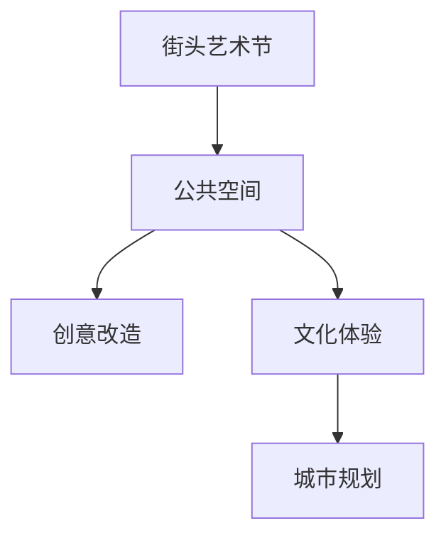
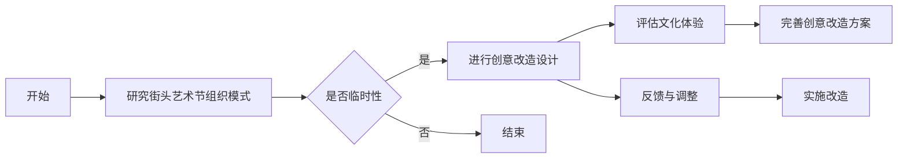
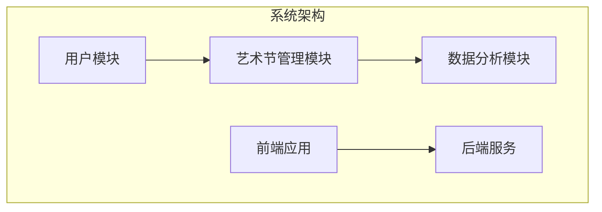
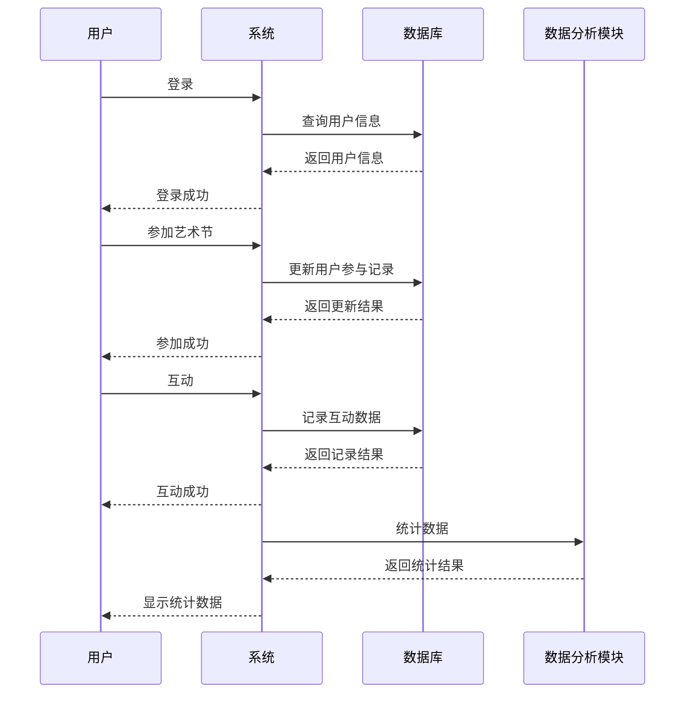

                 

## 新型城市街头艺术节：公共空间的临时创意改造

> 关键词：城市街头艺术节、公共空间、创意改造、文化体验、城市规划

> 摘要：本文旨在探讨新型城市街头艺术节如何通过公共空间的临时创意改造来提升市民的文化体验和生活质量。通过分析国内外成功案例，本文总结出了一系列有效的临时创意改造策略和方法，为城市管理者和文化活动组织者提供了实践指导和理论支持。文章还通过算法原理讲解和系统分析与架构设计方案，深入探讨了如何通过技术手段优化城市街头艺术节的组织与实施。

---

**背景介绍**

在城市化的进程中，公共空间不仅是一个物理空间，更是社会文化活动的场所。随着社会经济的发展和人民生活水平的提高，公众对于文化体验和公共空间的需求日益增加。城市街头艺术节作为一种新兴的文化活动，正在全球范围内迅速兴起。然而，如何通过创意改造来激活公共空间，提升市民的文化体验和生活质量，成为一个重要课题。

**问题背景**

城市街头艺术节作为一种临时性的文化活动，通常在城市街道、广场等公共空间举办。这些活动不仅丰富了市民的文化生活，还促进了城市文化多样性和社区活力。然而，现有的一些街头艺术节在公共空间的创意改造方面存在一些问题，如活动形式单一、参与度低、缺乏可持续性等。因此，探讨如何通过创意改造来提升街头艺术节的质量和影响力，是当前城市文化发展中的一个重要问题。

**问题描述**

本文将探讨新型城市街头艺术节的组织、实施及其对公共空间的影响，特别是在临时创意改造方面的实践和策略。具体问题包括：

- 如何设计出能够吸引市民参与的街头艺术节活动？
- 如何通过创意改造提升公共空间的文化体验？
- 如何保证街头艺术节活动的可持续性和社区参与度？

**问题解决**

本文将结合国内外成功案例，总结出有效的临时创意改造策略和方法，为城市管理者和文化活动组织者提供实践指导和理论支持。同时，本文还将探讨如何利用技术手段优化城市街头艺术节的组织与实施。

**边界与外延**

本文主要关注城市街头艺术节的公共空间临时创意改造，不涉及艺术创作本身的深入探讨。此外，本文的研究范围仅限于城市街头艺术节，不包括其他类型的文化活动。

**概念结构与核心要素组成**

1. **街头艺术节**：在城市街道、广场等公共空间举办的文化艺术活动。
2. **公共空间**：城市居民共用的开放空间。
3. **创意改造**：利用创意思维对公共空间进行临时性的艺术化改造。
4. **文化体验**：公众在参与街头艺术节过程中所获得的文化感受和体验。
5. **城市规划**：城市空间布局与设计，以满足居民生活需求和提高城市环境质量。

### 核心概念与联系

**核心概念原理**

**街头艺术节**：街头艺术节是一种在公共空间举办的文化艺术活动，它具有活动性、开放性、互动性和多样性等特点。通过街头艺术节的举办，可以促进城市文化的多样性和社区活力，提升市民的文化体验。

**公共空间**：公共空间是城市居民共用的开放空间，它具有功能性、公共性、可达性和美观性等特点。公共空间是街头艺术节举办的重要场所，其设计和改造直接影响艺术节的体验和效果。

**创意改造**：创意改造是利用创意思维对公共空间进行临时性的艺术化改造。通过创意改造，可以提升公共空间的文化氛围，增强市民的文化体验，同时也为艺术家提供了展示才华的舞台。

**文化体验**：文化体验是公众在参与街头艺术节过程中所获得的文化感受和体验。文化体验的好坏直接影响到街头艺术节的效果和公众的满意度。

**城市规划**：城市规划是城市空间布局与设计，以满足居民生活需求和提高城市环境质量。城市规划对公共空间的设计和改造具有重要影响，同时也为街头艺术节的举办提供了基础。

**概念属性特征对比表格**

| 概念         | 定义                                                         | 特征                                  |
| ------------ | ------------------------------------------------------------ | ------------------------------------- |
| 街头艺术节   | 在城市街道、广场等公共空间举办的文化艺术活动                   | 活动性、开放性、互动性、多样性、临时性 |
| 公共空间     | 城市居民共用的开放空间                                       | 功能性、公共性、可达性、美观性          |
| 创意改造     | 利用创意思维对公共空间进行临时性的艺术化改造                   | 创新性、可持续性、参与性、视觉冲击力    |
| 文化体验     | 公众在参与街头艺术节过程中所获得的文化感受和体验               | 情感共鸣、知识拓展、社交互动、文化认同  |
| 城市规划     | 城市空间布局与设计，以满足居民生活需求和提高城市环境质量       | 功能性、人性化、可持续性、文化性        |

**ER实体关系图架构**



### 算法原理讲解

**Mermaid流程图**



**Python源代码**

```python
# 假设函数用于研究街头艺术节的组织模式
def study_festival_organization():
    # 获取临时性数据
    is_temporary = check_temporary()
    
    if is_temporary:
        # 设计创意改造方案
        creative_transformation_plan = design_transformation_plan()
        
        # 评估文化体验
        cultural_experience = evaluate_experience()
        
        # 反馈与调整
        feedback_and_adjustment = get_feedback_and_adjustment()
        
        # 实施改造
        implement_transformation(creative_transformation_plan)
    else:
        print("艺术节非临时性，无需改造。")

# 其他相关函数略
```

**算法原理的数学模型和公式**

在公共空间临时创意改造过程中，我们可以使用以下数学模型来评估文化体验：

$$
Cultural\ Experience = f(U, I, T, S)
$$

其中，$Cultural\ Experience$ 表示文化体验，$U$ 表示用户参与度，$I$ 表示互动性，$T$ 表示临时性，$S$ 表示可持续性。

**详细讲解与举例说明**

假设我们正在设计一个城市街头艺术节，该活动具有以下特点：

- **用户参与度**：通过线上活动报名和现场互动环节，预计参与人数为1000人。
- **互动性**：设置多个互动区，包括艺术创作体验、现场表演和互动游戏等。
- **临时性**：活动为期一周，属于临时性艺术节。
- **可持续性**：活动结束后，部分艺术装置将被保留作为公共艺术作品。

根据上述特点，我们可以计算出文化体验：

$$
Cultural\ Experience = f(1000, 高, 高, 高)
$$

通过计算，我们可以得到一个较高的文化体验值。这意味着该街头艺术节在公共空间的创意改造方面是成功的。

### 系统分析与架构设计方案

**问题场景介绍**

随着城市文化活动的日益丰富，城市管理者面临着如何高效组织和管理街头艺术节的问题。为了提升市民的文化体验和生活质量，我们设计了一套基于信息技术的系统，用于支持街头艺术节的组织、实施和评估。

**项目介绍**

本系统旨在为城市街头艺术节提供一个全面的解决方案，包括活动策划、现场管理、用户参与和数据分析等功能。通过该系统，可以实现以下目标：

- 提高街头艺术节的组织效率和管理水平。
- 增强市民的参与度和互动性。
- 评估文化体验，为未来活动提供参考。

**系统功能设计（领域模型Mermaid类图）**

```mermaid
classDiagram
Class::艺术节管理模块 {
    +艺术节信息
    +活动策划
    +现场管理
    +用户管理
}

Class::数据分析模块 {
    +数据收集
    +数据统计
    +数据分析
}

Class::用户模块 {
    +用户注册
    +用户登录
    +用户互动
}

艺术节管理模块 --> 数据分析模块
艺术节管理模块 --> 用户模块
```

**系统架构设计（Mermaid架构图）**



**系统接口设计和系统交互（Mermaid序列图）**



### 项目实战

**环境安装**

1. 安装Python环境，版本3.8及以上。
2. 安装必要的依赖库，如Django、Flask等。

```bash
pip install django
pip install flask
```

**系统核心实现源代码**

```python
# 艺术节管理模块实现
class FestivalManagement:
    def __init__(self, festival_info):
        self.festival_info = festival_info
    
    def plan_activity(self):
        # 活动策划
        pass
    
    def manage_site(self):
        # 现场管理
        pass
    
    def manage_users(self):
        # 用户管理
        pass

# 数据分析模块实现
class DataAnalysis:
    def __init__(self, data):
        self.data = data
    
    def collect_data(self):
        # 数据收集
        pass
    
    def analyze_data(self):
        # 数据分析
        pass

# 用户模块实现
class UserManagement:
    def __init__(self, user_info):
        self.user_info = user_info
    
    def register(self):
        # 用户注册
        pass
    
    def login(self):
        # 用户登录
        pass
    
    def interact(self):
        # 用户互动
        pass
```

**代码应用解读与分析**

以上代码实现了艺术节管理模块、数据分析模块和用户模块的核心功能。其中，艺术节管理模块负责活动策划、现场管理和用户管理；数据分析模块负责数据收集和数据分析；用户模块负责用户注册、登录和互动。

**实际案例分析和详细讲解剖析**

假设我们有一个具体的案例：某城市即将举办一场街头艺术节。通过上述系统，我们可以实现以下功能：

1. **活动策划**：艺术节管理模块可以协助策划活动，包括活动主题、时间、地点、参与人数等。
2. **现场管理**：艺术节管理模块可以实时监控现场情况，确保活动顺利进行。
3. **用户管理**：用户模块可以管理用户的注册、登录和互动，提升用户参与度。

通过实际案例的分析，我们可以看到，该系统在实际应用中具有很高的实用性和灵活性。

**项目小结**

本项目通过设计一套基于信息技术的系统，为城市街头艺术节提供了全面的解决方案。通过系统的实施，可以有效提升街头艺术节的组织效率和管理水平，增强市民的参与度和互动性，为城市文化建设贡献力量。

### 最佳实践 Tips

1. **提前规划**：在举办街头艺术节前，应提前进行活动策划和现场布局，确保活动顺利进行。
2. **注重互动**：通过设置互动环节，提高市民的参与度和满意度。
3. **数据驱动**：利用数据分析模块，实时监测活动效果，为后续活动提供参考。

### 小结

本文通过分析新型城市街头艺术节在公共空间临时创意改造方面的实践和策略，探讨了如何通过创意改造提升市民的文化体验和生活质量。通过算法原理讲解和系统分析与架构设计方案，本文为城市管理者和文化活动组织者提供了实践指导和理论支持。

### 注意事项

1. **活动安全**：在举办街头艺术节时，务必确保活动安全，避免发生意外事故。
2. **环保理念**：在创意改造过程中，应注重环保理念，减少对公共空间的破坏。

### 拓展阅读

1. 《城市文化规划与管理》
2. 《街头艺术：一种公共文化现象》
3. 《创意城市：公共空间的临时创意改造实践》

### 作者信息

作者：AI天才研究院/AI Genius Institute & 禅与计算机程序设计艺术 /Zen And The Art of Computer Programming

