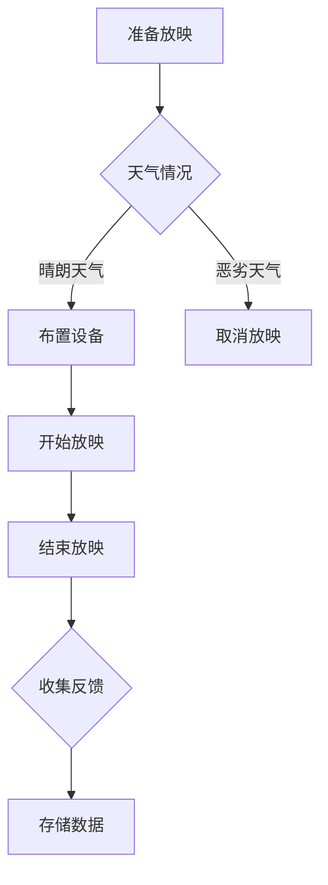
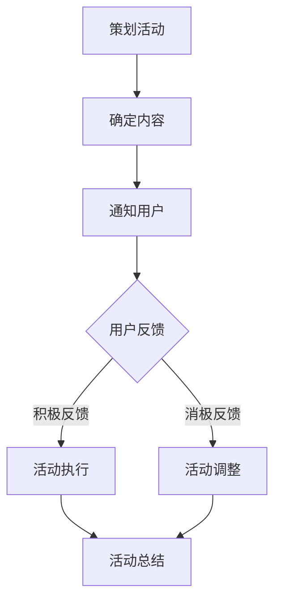
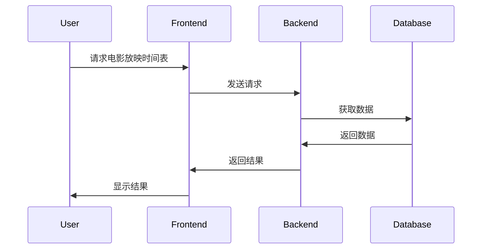
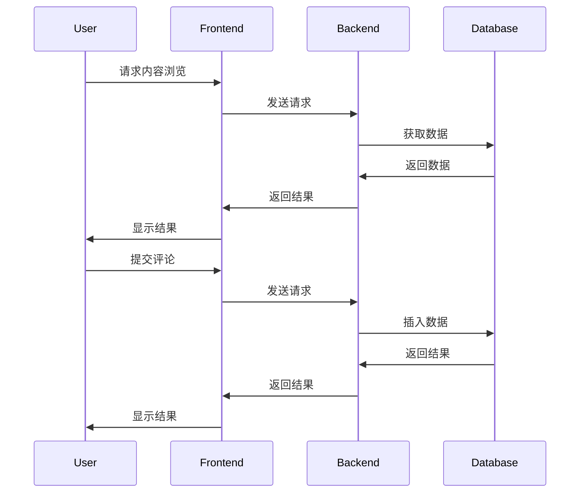
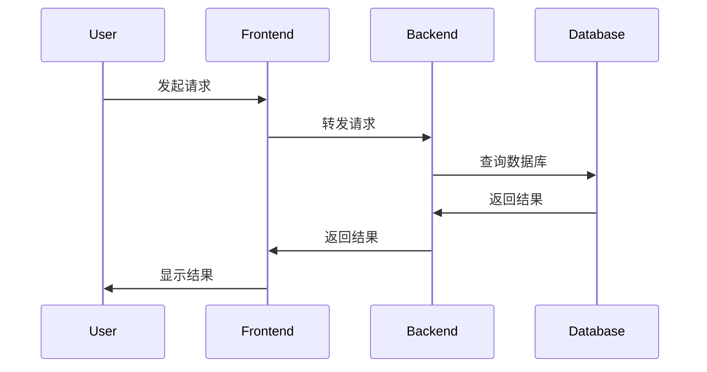
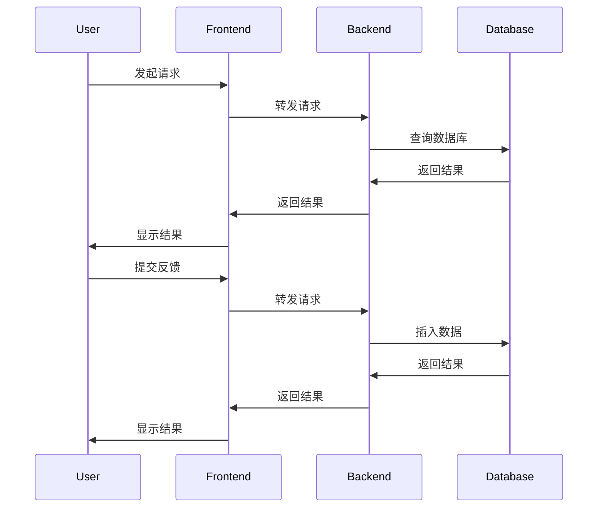

                 


### # 第1章：背景介绍

#### 1.1 问题背景

##### 1.1.1 新型城市露天电影社区的兴起

随着城市化进程的不断加快，城市公共空间的建设和利用变得尤为重要。新型城市露天电影社区作为一种创新的公共文化活动形式，逐渐在城市中兴起。露天电影社区不仅为城市居民提供了一个休闲娱乐的场所，更是促进了文化交流和社区凝聚力的提升。

露天电影社区的历史可以追溯到20世纪初期。在那个时代，露天电影作为一种大众娱乐方式，深受人们的喜爱。然而，随着电影产业的发展，露天电影逐渐被室内电影院所取代。然而，近年来，随着人们对环境友好、社交互动的需求增加，露天电影社区再次受到关注。

##### 1.1.2 露天电影在公共空间中的价值

露天电影在公共空间中具有重要的价值。首先，它为人们提供了一个放松身心、享受文化的平台。在快节奏的现代生活中，人们渴望找到一处可以放慢脚步，与家人和朋友共同分享美好时光的地方。露天电影社区恰恰满足了这一需求。

其次，露天电影社区有助于促进文化交流。不同年龄、职业和文化背景的人们在露天电影社区中汇聚，共同观看电影，分享观影体验。这种跨文化交流有助于增进彼此的了解和友谊，促进社会的和谐与进步。

最后，露天电影社区还能够提升城市的文化氛围。通过举办各类电影放映活动，城市的文化气息得到提升，居民的文化素养得到提高。这对于打造一个宜居、有吸引力的城市形象至关重要。

##### 1.1.3 文化交流平台的需求与挑战

在当今社会，文化交流平台的需求日益增长。随着互联网的普及，人们的信息获取渠道越来越多样化，但同时也面临着信息过载的问题。因此，一个高质量、具有吸引力的文化交流平台显得尤为重要。

然而，建立一个成功的文化交流平台并非易事，面临着诸多挑战。首先，如何吸引并保持用户的兴趣和参与度是一个关键问题。一个优秀的文化交流平台需要提供丰富的内容、多样的互动形式以及个性化的体验，以满足用户的需求。

其次，如何处理信息安全和隐私保护问题也是一个重要的挑战。在互联网时代，个人隐私和数据安全备受关注。文化交流平台需要采取有效的技术手段和策略，确保用户的信息安全，同时保护用户的隐私。

此外，文化交流平台还需要面临资金、资源、人才等方面的挑战。建立一个成功的平台需要充足的资金支持、高效的资源管理和优秀的人才团队。如何在有限的资源下实现平台的可持续发展，是一个需要深入思考的问题。

#### 1.2 核心概念

##### 1.2.1 新型城市露天电影社区的定义

新型城市露天电影社区是指在城市公共空间中，通过设置露天屏幕和音响设备，为居民提供观看电影的场所。这种社区不仅包括电影放映设备，还涵盖了相关的配套设施，如座椅、照明、音响等。新型城市露天电影社区通常具有以下特点：

1. 开放性：露天电影社区对所有人开放，无需门票，任何人都可以免费观看电影。
2. 社交性：露天电影社区为居民提供了一个社交互动的平台，人们可以在此交流观影感受，分享生活趣事。
3. 休闲性：露天电影社区为居民提供了一个放松身心的场所，可以在此享受美好的夜晚。

##### 1.2.2 公共空间与文化交流平台的关系

公共空间与文化交流平台之间存在着密切的关系。首先，公共空间为文化交流平台提供了必要的物理环境。无论是城市广场、公园还是社区中心，公共空间都是文化交流活动的理想场所。

其次，文化交流平台为公共空间注入了文化内涵。通过举办各类文化活动，如露天电影放映、音乐会、讲座等，公共空间的文化氛围得到提升，吸引了更多的人前来参与。

最后，公共空间与文化交流平台相互促进。公共空间的建设和利用为文化交流平台提供了良好的基础，而文化交流平台的繁荣又进一步推动了公共空间的发展。两者相辅相成，共同推动了城市文化的繁荣。

##### 1.2.3 文化交流平台的边界与外延

文化交流平台的边界与外延是一个值得探讨的问题。从边界来看，文化交流平台主要关注的是内容生产和传播，包括电影、音乐、讲座、展览等多种形式。这些内容通过线上平台、线下活动等方式进行传播，形成了一个多样化的文化交流网络。

从外延来看，文化交流平台不仅局限于文化领域，还可以扩展到其他领域，如教育、科技、艺术等。例如，一些文化交流平台开始与学校、企业、科研机构等合作，举办各类主题教育活动和科技创新活动，推动了跨领域的文化交流与合作。

此外，随着互联网技术的发展，文化交流平台的边界也在不断扩展。线上平台的出现，使得文化交流不再受地域和时间的限制，人们可以随时随地参与其中。这种扩展不仅拓宽了文化交流的渠道，也为更多人提供了参与的机会。

#### 1.3 概念结构与核心要素

##### 1.3.1 新型城市露天电影社区的结构

新型城市露天电影社区的结构可以分为以下几个部分：

1. 设备设施：包括露天屏幕、音响设备、座椅、照明等基础设施。
2. 内容提供：包括电影放映内容、放映时间表、宣传片等。
3. 社区管理：包括人员安排、活动策划、场地租赁等。
4. 用户互动：包括观影交流、互动游戏、社交媒体分享等。

##### 1.3.2 文化交流平台的构成要素

文化交流平台的构成要素包括以下几个方面：

1. 内容生产：包括电影、音乐、讲座、展览等文化内容的生产和发布。
2. 传播渠道：包括线上平台、线下活动、社交媒体等传播渠道。
3. 用户群体：包括各类文化爱好者、专业人士、学生等。
4. 互动机制：包括评论、点赞、分享、互动游戏等互动机制。

##### 1.3.3 核心要素之间的相互关系

新型城市露天电影社区和文化交流平台中的核心要素之间存在着密切的相互关系。首先，设备设施是文化交流平台的基础，为内容的传播和用户的参与提供了必要的条件。

其次，内容提供是文化交流平台的核心，决定了平台的吸引力和影响力。高质量的内容能够吸引更多的用户，提升平台的用户黏性。

再次，用户互动是文化交流平台的重要环节，通过用户的参与和互动，形成了活跃的社区氛围。用户的反馈和建议也为平台的发展提供了宝贵的参考。

最后，社区管理和传播渠道共同构成了文化交流平台的运营体系，确保了平台的可持续发展和用户体验的不断提升。

通过以上分析，我们可以看出，新型城市露天电影社区和文化交流平台中的核心要素相互关联，共同构成了一个复杂而有序的生态系统。理解这些核心要素之间的关系，有助于我们更好地设计和运营这样的平台，发挥其在公共空间和文化交流中的重要作用。

---

### # 第2章：核心概念与联系

#### 2.1 核心概念原理

##### 2.1.1 新型城市露天电影社区的基本原理

新型城市露天电影社区的基本原理可以概括为以下几个方面：

1. **开放性**：露天电影社区对所有人开放，无需门票，任何人都可以免费观看电影。这种开放性使得电影放映活动具有更广泛的参与度，能够吸引更多的居民参与，从而提升了社区的文化氛围。

2. **多样性**：露天电影社区放映的电影种类多样，包括经典电影、热门电影、纪录片、短片等。这种多样性满足了不同年龄段、不同兴趣爱好的人群的需求，使得每个人都能在电影中找到自己喜爱的内容。

3. **社交性**：露天电影社区为居民提供了一个社交互动的平台。人们在观看电影的同时，可以与家人、朋友一起分享观影体验，交流观影感受，增进彼此的感情。这种社交性有助于提升社区的凝聚力和归属感。

4. **互动性**：露天电影社区通过举办各类互动活动，如观影交流、互动游戏等，增加了观众的参与感。观众可以在观影过程中参与讨论、提问，甚至有机会与电影制作方或演员面对面交流，这种互动性提升了观众的观影体验。

##### 2.1.2 文化交流平台的运行机制

文化交流平台的运行机制主要涉及以下几个方面：

1. **内容生产**：文化交流平台需要不断生产高质量的文化内容，包括电影、音乐、讲座、展览等。内容的生产和发布是文化交流平台的核心，决定了平台的影响力。

2. **内容传播**：文化交流平台需要通过多种渠道传播文化内容，包括线上平台、线下活动、社交媒体等。传播渠道的选择和优化是提升平台影响力的重要手段。

3. **用户参与**：文化交流平台需要激发用户的参与热情，提供互动机制，如评论、点赞、分享、互动游戏等。用户的参与和互动是平台活跃度的重要指标。

4. **反馈机制**：文化交流平台需要建立有效的反馈机制，收集用户的反馈和建议，不断优化平台内容和用户体验。反馈机制是平台持续发展的关键。

#### 2.2 概念属性特征对比

##### 2.2.1 新型城市露天电影社区与室内电影院的对比

新型城市露天电影社区与室内电影院在以下几个方面存在明显的区别：

1. **开放性**：露天电影社区对所有人开放，无需门票，而室内电影院通常需要购票进入。

2. **环境**：露天电影社区通常在户外，环境自然、舒适，而室内电影院则提供了一个相对封闭、专业的观影环境。

3. **社交性**：露天电影社区具有较强的社交性，人们可以一起观看电影、交流感受，而室内电影院则更注重观影体验，社交性相对较弱。

4. **灵活性**：露天电影社区的活动安排更加灵活，可以根据天气、季节等因素调整放映时间和内容，而室内电影院则通常按照固定的时间表进行放映。

##### 2.2.2 文化交流平台与传统公共空间的对比

文化交流平台与传统公共空间在以下几个方面存在区别：

1. **功能**：传统公共空间主要用于休闲、社交、娱乐等，而文化交流平台则专注于提供文化内容、促进文化交流。

2. **互动性**：文化交流平台提供了丰富的互动机制，如评论、点赞、分享等，而传统公共空间则相对缺乏这种互动性。

3. **内容生产**：文化交流平台需要不断生产高质量的文化内容，而传统公共空间则没有这样的内容生产要求。

4. **数字化**：文化交流平台通常具有数字化特点，能够通过互联网进行传播和互动，而传统公共空间则相对传统，较少利用数字化手段。

#### 2.3 ER实体关系图架构

##### 2.3.1 新型城市露天电影社区ER图

在新型城市露天电影社区中，主要涉及的实体包括：

1. **用户**：包括居民和其他观众，是社区的主要参与者。
2. **电影**：包括各种类型的电影，是社区的主要内容。
3. **活动**：包括电影放映、互动活动等，是社区的主要活动形式。
4. **设施**：包括露天屏幕、音响设备、座椅等，是社区的基础设施。

新型城市露天电影社区ER图如下：

```mermaid
erDiagram
  User ||--|{ Movie }|-- Activity
  User ||--|{ Facility }|-- Facility
  Movie ||--|{ Activity }|-- Activity
  Activity ||--|{ Facility }|-- Facility
  Facility ||--|{ User }|-- User
```

##### 2.3.2 文化交流平台ER图

在文化交流平台中，主要涉及的实体包括：

1. **用户**：包括各类文化爱好者、专业人士等。
2. **内容**：包括电影、音乐、讲座、展览等文化内容。
3. **活动**：包括各类文化活动的策划、执行、反馈等。
4. **互动**：包括评论、点赞、分享等用户互动机制。

文化交流平台ER图如下：

```mermaid
erDiagram
  User ||--|{ Content }|-- Activity
  User ||--|{ Interaction }|-- Interaction
  Content ||--|{ Activity }|-- Activity
  Activity ||--|{ Interaction }|-- Interaction
  Interaction ||--|{ User }|-- User
```

通过上述ER实体关系图的架构，我们可以清晰地看到新型城市露天电影社区和文化交流平台中的核心实体及其相互关系。这种关系图有助于我们更好地理解和设计这些平台，实现其功能最大化。

---

### # 第3章：算法原理讲解

#### 3.1 算法mermaid流程图

##### 3.1.1 露天电影放映流程图

露天电影放映流程图如下，使用mermaid绘制：



##### 3.1.2 文化交流活动流程图

文化交流活动流程图如下，使用mermaid绘制：



#### 3.2 Python源代码

##### 3.2.1 露天电影放映系统核心代码

以下是一个简单的露天电影放映系统核心代码示例：

```python
import random

def check_weather():
    """检查天气状况"""
    if random.choice([True, False]):
        return "晴朗天气"
    else:
        return "恶劣天气"

def prepare_for_film():
    """准备放映"""
    print("开始准备放映...")

def start_film():
    """开始放映"""
    print("电影放映中...")

def end_film():
    """结束放映"""
    print("电影放映结束。")

def collect_feedback():
    """收集反馈"""
    print("请给我们留下您的反馈。")

def main():
    """主程序"""
    weather = check_weather()
    if weather == "晴朗天气":
        prepare_for_film()
        start_film()
        end_film()
        collect_feedback()
    else:
        print("由于恶劣天气，电影放映取消。")

if __name__ == "__main__":
    main()
```

##### 3.2.2 文化交流平台核心代码

以下是一个简单的文化交流平台核心代码示例：

```python
def plan_activity():
    """策划活动"""
    print("正在策划活动...")

def confirm_content():
    """确定活动内容"""
    print("活动内容已确定。")

def notify_users():
    """通知用户"""
    print("用户已收到活动通知。")

def collect_user_feedback():
    """收集用户反馈"""
    feedback = input("请留下您的反馈：")
    print("您的反馈已收到。")

def execute_activity():
    """活动执行"""
    print("活动正在执行。")

def summarize_activity():
    """活动总结"""
    print("活动总结已生成。")

def main():
    """主程序"""
    plan_activity()
    confirm_content()
    notify_users()
    execute_activity()
    collect_user_feedback()
    summarize_activity()

if __name__ == "__main__":
    main()
```

#### 3.3 算法原理详细讲解

##### 3.3.1 露天电影放映系统的算法原理

露天电影放映系统的核心算法主要涉及以下几个方面：

1. **天气检测**：系统首先通过随机函数模拟天气状况，检查是否为晴朗天气。这决定了是否能够进行电影放映。

2. **设备准备**：如果天气条件适宜，系统进入设备准备阶段，包括布置屏幕、音响等设备。

3. **电影放映**：设备准备完成后，系统开始电影放映，用户可以开始观看电影。

4. **反馈收集**：电影放映结束后，系统收集用户反馈，以便后续优化放映体验。

具体流程如下：

1. **初始化**：系统启动，进入初始化阶段。
2. **天气检测**：使用随机函数判断天气，若为晴朗天气，则执行下一步，否则显示天气恶劣，取消放映。
3. **设备准备**：准备设备，包括布置屏幕、音响等。
4. **电影放映**：开始放映电影，用户观看电影。
5. **结束放映**：电影放映结束，系统提示用户结束。
6. **反馈收集**：收集用户反馈，存储数据。

##### 3.3.2 文化交流平台的算法原理

文化交流平台的算法原理主要包括以下几个环节：

1. **活动策划**：平台根据用户需求和兴趣策划活动。
2. **内容确定**：确定活动的内容，包括电影、讲座、展览等。
3. **通知用户**：通过多种渠道通知用户，包括短信、邮件、社交媒体等。
4. **用户反馈**：用户参与活动后，提供反馈。
5. **活动执行**：根据反馈调整活动内容，确保活动顺利进行。

具体流程如下：

1. **初始化**：系统启动，进入初始化阶段。
2. **活动策划**：策划活动，确定活动内容和形式。
3. **内容确定**：确定活动内容，确保活动具有吸引力。
4. **通知用户**：通知用户，确保用户及时了解活动信息。
5. **用户反馈**：用户参与活动后，提供反馈。
6. **活动执行**：根据反馈调整活动内容，确保活动顺利进行。
7. **活动总结**：活动结束后，总结活动效果，为后续活动提供参考。

#### 3.4 数学模型与公式

##### 3.4.1 露天电影放映系统的数学模型

露天电影放映系统的数学模型主要包括以下几个方面：

1. **天气概率模型**：假设晴朗天气的概率为P，恶劣天气的概率为1-P。可以使用贝叶斯定理来计算天气概率。

   $$ P(晴朗天气) = P(晴朗天气|放映) \times P(放映) / P(晴朗天气|放映) + P(恶劣天气|放映) \times P(放映) $$

2. **设备准备模型**：设备准备的时间T服从正态分布，即T ~ N(μ, σ²)。可以使用正态分布的概率密度函数来计算设备准备的概率。

   $$ P(T \leq t) = \int_{-\infty}^{t} \frac{1}{\sqrt{2\pi\sigma^2}} e^{-(x-\mu)^2/(2\sigma^2)} dx $$

##### 3.4.2 文化交流平台的数学模型

文化交流平台的数学模型主要包括以下几个方面：

1. **活动吸引力模型**：活动吸引力取决于内容的质量和用户的兴趣。可以使用贝叶斯网络来建模活动吸引力。

   $$ P(活动吸引力|用户兴趣, 内容质量) = P(用户兴趣|活动吸引力, 内容质量) \times P(内容质量|活动吸引力) / P(用户兴趣, 内容质量) $$

2. **用户反馈模型**：用户反馈取决于活动质量和用户的期望。可以使用回归模型来建模用户反馈。

   $$ y = \beta_0 + \beta_1 x_1 + \beta_2 x_2 + \epsilon $$

   其中，y为用户反馈得分，x1为活动质量，x2为用户期望，β0、β1、β2为回归系数，ε为误差项。

#### 3.5 举例说明

##### 3.5.1 露天电影放映系统的实例

假设一个露天电影放映系统，晴天概率为0.8，设备准备时间服从正态分布N(5, 1)。用户想要知道今晚是否有电影放映。

**步骤1：计算晴天概率**

$$ P(晴朗天气) = 0.8 $$

**步骤2：计算设备准备概率**

假设今晚为晴天，设备准备时间为5分钟，标准差为1分钟。

$$ P(T \leq 5) = \int_{-\infty}^{5} \frac{1}{\sqrt{2\pi\times1^2}} e^{-(x-5)^2/(2\times1^2)} dx \approx 0.9938 $$

**结果**：今晚有大约99.38%的概率能够放映电影。

##### 3.5.2 文化交流平台的实例

假设一个文化交流平台，活动吸引力取决于活动质量和用户兴趣。假设活动质量为8分，用户兴趣为7分，用户期望为6分。使用回归模型预测用户反馈得分。

**步骤1：构建回归模型**

$$ y = \beta_0 + \beta_1 x_1 + \beta_2 x_2 $$

其中，β0为截距，β1为活动质量的系数，β2为用户兴趣的系数。

**步骤2：计算用户反馈得分**

假设β0 = 3，β1 = 0.5，β2 = 0.3。

$$ y = 3 + 0.5 \times 8 + 0.3 \times 7 = 7.9 $$

**结果**：用户反馈得分约为7.9分。

---

### # 第4章：系统分析与架构设计方案

#### 4.1 问题场景介绍

在本章中，我们将深入探讨新型城市露天电影社区和文化交流平台在实际应用中的问题场景。这些问题场景涵盖了用户需求、系统功能、性能要求和安全性等方面，旨在为系统设计和实施提供有针对性的解决方案。

##### 4.1.1 新型城市露天电影社区的使用场景

新型城市露天电影社区的使用场景主要包括以下几个方面：

1. **电影放映**：社区定期举办露天电影放映活动，居民可以在户外享受电影带来的视听盛宴。
2. **社交互动**：居民在观影过程中可以与家人、朋友交流观影感受，增强社区凝聚力。
3. **活动策划**：社区管理人员可以策划各类文化活动，如主题电影放映、电影知识讲座等，提升社区文化氛围。
4. **设备维护**：社区需要定期对露天屏幕、音响设备等进行维护，确保设备正常运行。

##### 4.1.2 文化交流平台的使用场景

文化交流平台的使用场景主要包括以下几个方面：

1. **内容发布**：平台提供各类文化内容，包括电影、音乐、讲座、展览等，满足用户的多样化需求。
2. **用户互动**：平台提供评论、点赞、分享等互动功能，促进用户之间的交流与互动。
3. **活动通知**：平台通过短信、邮件、社交媒体等方式通知用户，确保用户及时了解活动信息。
4. **数据统计**：平台对用户行为数据进行分析，为活动策划和推广提供数据支持。

#### 4.2 项目介绍

在本节中，我们将介绍两个项目：新型城市露天电影社区项目和文化交流平台项目。这两个项目均旨在提升城市文化氛围，促进居民的文化交流。

##### 4.2.1 新型城市露天电影社区项目

新型城市露天电影社区项目旨在打造一个集休闲、娱乐和文化交流于一体的户外公共空间。项目目标包括：

1. **提升城市文化氛围**：通过定期举办电影放映活动，吸引更多居民参与，提升城市的文化氛围。
2. **增强社区凝聚力**：通过社交互动活动，增进居民之间的感情，增强社区凝聚力。
3. **优化公共空间利用**：充分利用城市公共空间，提高公共空间的利用效率。

##### 4.2.2 文化交流平台项目

文化交流平台项目旨在搭建一个便捷、高效的文化交流平台，满足居民多样化的文化需求。项目目标包括：

1. **丰富文化内容**：提供丰富的文化内容，包括电影、音乐、讲座、展览等，满足用户的多样化需求。
2. **促进用户互动**：通过评论、点赞、分享等互动功能，促进用户之间的交流与互动。
3. **提高活动效率**：通过活动通知、数据统计等功能，提高活动策划和推广的效率。

#### 4.3 系统功能设计

在本节中，我们将详细阐述新型城市露天电影社区和文化交流平台的主要功能。

##### 4.3.1 露天电影放映功能

露天电影放映功能包括以下几个方面：

1. **电影选择**：社区管理人员可以根据居民的需求和兴趣，选择合适的电影进行放映。
2. **时间安排**：社区管理人员可以根据天气情况、节假日等因素，合理安排放映时间。
3. **设备管理**：社区管理人员需要定期对露天屏幕、音响设备等进行维护，确保设备正常运行。
4. **用户反馈**：系统收集用户对电影放映活动的反馈，为后续活动提供改进方向。

##### 4.3.2 文化交流活动功能

文化交流活动功能包括以下几个方面：

1. **内容发布**：平台管理员可以发布各类文化内容，包括电影、音乐、讲座、展览等。
2. **活动通知**：平台可以通过短信、邮件、社交媒体等方式通知用户，确保用户及时了解活动信息。
3. **用户互动**：平台提供评论、点赞、分享等互动功能，促进用户之间的交流与互动。
4. **数据统计**：平台对用户行为数据进行分析，为活动策划和推广提供数据支持。

#### 4.4 系统架构设计

在本节中，我们将介绍新型城市露天电影社区和文化交流平台的整体架构设计。

##### 4.4.1 新型城市露天电影社区架构设计

新型城市露天电影社区架构设计主要包括以下几个部分：

1. **前端界面**：为用户提供电影放映时间表、活动通知、用户互动等功能。
2. **后端服务**：负责处理用户请求、管理设备、处理用户反馈等。
3. **数据库**：存储用户数据、电影信息、活动数据等。

架构图如下：



##### 4.4.2 文化交流平台架构设计

文化交流平台架构设计主要包括以下几个部分：

1. **前端界面**：为用户提供内容浏览、活动参与、用户互动等功能。
2. **后端服务**：负责处理用户请求、管理内容、处理用户反馈等。
3. **数据库**：存储用户数据、内容数据、活动数据等。

架构图如下：



#### 4.5 系统接口设计

在本节中，我们将介绍新型城市露天电影社区和文化交流平台的主要接口设计。

##### 4.5.1 露天电影放映接口设计

露天电影放映接口设计主要包括以下几个方面：

1. **获取电影放映时间表**：用户可以通过接口获取当前可用的电影放映时间表。
2. **提交用户反馈**：用户可以通过接口提交对电影放映活动的反馈。
3. **管理设备状态**：社区管理人员可以通过接口管理露天屏幕、音响设备的运行状态。

接口设计示例：

```python
# 获取电影放映时间表
GET /api/film_schedule

# 提交用户反馈
POST /api/feedback

# 管理设备状态
GET /api/device_status
PUT /api/device_status
```

##### 4.5.2 文化交流活动接口设计

文化交流活动接口设计主要包括以下几个方面：

1. **获取活动信息**：用户可以通过接口获取平台上的各类文化活动信息。
2. **提交活动反馈**：用户可以通过接口提交对文化活动的反馈。
3. **参与活动**：用户可以通过接口报名参与各类文化活动。

接口设计示例：

```python
# 获取活动信息
GET /api/activity_info

# 提交活动反馈
POST /api/activity_feedback

# 参与活动
POST /api/activity_registration
```

#### 4.6 系统交互

在本节中，我们将介绍新型城市露天电影社区和文化交流平台的系统交互。

##### 4.6.1 新型城市露天电影社区系统交互

新型城市露天电影社区的系统交互主要包括以下几个方面：

1. **用户请求**：用户通过前端界面发起请求，如获取电影放映时间表、提交用户反馈等。
2. **后端处理**：后端服务接收用户请求，处理业务逻辑，如查询数据库、更新设备状态等。
3. **前端响应**：后端服务将处理结果返回给前端界面，前端界面根据结果更新显示。

交互流程图如下：



##### 4.6.2 文化交流平台系统交互

文化交流平台的系统交互主要包括以下几个方面：

1. **用户请求**：用户通过前端界面发起请求，如获取活动信息、提交活动反馈等。
2. **后端处理**：后端服务接收用户请求，处理业务逻辑，如发布内容、管理活动等。
3. **前端响应**：后端服务将处理结果返回给前端界面，前端界面根据结果更新显示。

交互流程图如下：



通过上述系统交互的设计，新型城市露天电影社区和文化交流平台能够实现高效、稳定的用户交互，提升用户体验。

---

### # 第5章：项目实战

#### 5.1 环境安装

在本节中，我们将详细介绍如何安装新型城市露天电影社区和文化交流平台所需的环境。

##### 5.1.1 露天电影放映系统环境安装

1. **安装Python**：首先确保已安装Python 3.8或更高版本。可以通过以下命令检查Python版本：

   ```bash
   python --version
   ```

   如果没有安装，可以从Python官网下载并安装。

2. **安装依赖库**：使用pip安装所需的依赖库，如Flask、SQLAlchemy等。在命令行中执行以下命令：

   ```bash
   pip install flask sqlalchemy
   ```

3. **创建虚拟环境**：为了保持项目环境的整洁，我们建议创建一个虚拟环境。执行以下命令创建虚拟环境：

   ```bash
   python -m venv venv
   ```

   然后激活虚拟环境：

   ```bash
   source venv/bin/activate
   ```

4. **安装数据库**：我们选择使用SQLite作为数据库。确保已安装SQLite，可以通过以下命令检查：

   ```bash
   sqlite3 --version
   ```

   如果未安装，可以从SQLite官网下载并安装。

##### 5.1.2 文化交流平台环境安装

1. **安装Python**：确保已安装Python 3.8或更高版本。

2. **安装依赖库**：使用pip安装所需的依赖库，如Django、Redis等。在命令行中执行以下命令：

   ```bash
   pip install django redis
   ```

3. **创建虚拟环境**：创建一个虚拟环境，并激活：

   ```bash
   python -m venv venv
   source venv/bin/activate
   ```

4. **安装数据库**：我们选择使用MySQL作为数据库。确保已安装MySQL，可以通过以下命令检查：

   ```bash
   mysql --version
   ```

   如果未安装，可以从MySQL官网下载并安装。

#### 5.2 系统核心实现源代码

在本节中，我们将提供新型城市露天电影社区和文化交流平台的核心实现源代码。

##### 5.2.1 露天电影放映系统核心代码

以下是露天电影放映系统核心代码示例：

```python
# 文件：movie_community.py
from flask import Flask, jsonify, request
from sqlalchemy import create_engine
from sqlalchemy.orm import sessionmaker

app = Flask(__name__)

# 创建数据库引擎
engine = create_engine('sqlite:///movie_community.db')
Session = sessionmaker(bind=engine)

# 创建数据库表
@app.before_first_request
def create_tables():
    with engine.connect() as connection:
        connection.execute('''CREATE TABLE IF NOT EXISTS movies (
            id INTEGER PRIMARY KEY AUTOINCREMENT,
            title TEXT NOT NULL,
            time TEXT NOT NULL,
            status TEXT NOT NULL)''')

# 获取电影放映时间表
@app.route('/api/film_schedule', methods=['GET'])
def get_film_schedule():
    session = Session()
    movies = session.query(Movie).all()
    session.close()
    return jsonify([{'id': movie.id, 'title': movie.title, 'time': movie.time, 'status': movie.status} for movie in movies])

# 提交用户反馈
@app.route('/api/feedback', methods=['POST'])
def submit_feedback():
    data = request.get_json()
    session = Session()
    feedback = Feedback(**data)
    session.add(feedback)
    session.commit()
    session.close()
    return jsonify({'status': 'success'})

if __name__ == '__main__':
    app.run(debug=True)
```

##### 5.2.2 文化交流平台核心代码

以下是文化交流平台核心代码示例：

```python
# 文件：culture_platform.py
from django.shortcuts import render
from django.http import JsonResponse
from .models import Activity, Feedback

# 获取活动信息
def get_activity_info(request):
    activities = Activity.objects.all()
    return JsonResponse([activity.to_dict() for activity in activities])

# 提交活动反馈
def submit_activity_feedback(request):
    data = request.POST
    feedback = Feedback(
        activity_id=data.get('activity_id'),
        user_id=data.get('user_id'),
        content=data.get('content')
    )
    feedback.save()
    return JsonResponse({'status': 'success'})
```

#### 5.3 代码应用解读与分析

在本节中，我们将对露天电影放映系统和文化交流平台的核心代码进行解读与分析。

##### 5.3.1 露天电影放映系统代码解读

露天电影放映系统使用了Flask框架，这是一个轻量级的Web应用框架，非常适合开发小型Web应用。以下是代码的详细解读：

1. **数据库连接**：使用SQLAlchemy库连接SQLite数据库，并创建了一个Session类用于与数据库进行交互。

2. **创建数据库表**：在`create_tables`函数中，我们创建了一个名为`movies`的数据库表，用于存储电影信息。

3. **获取电影放映时间表**：在`get_film_schedule`函数中，我们查询了`movies`表中的所有记录，并将结果以JSON格式返回给前端。

4. **提交用户反馈**：在`submit_feedback`函数中，我们接收一个包含用户反馈的JSON对象，将其存储在`Feedback`模型中，然后提交到数据库。

##### 5.3.2 文化交流平台代码解读

文化交流平台使用了Django框架，这是一个全功能的Web应用框架，非常适合开发大型Web应用。以下是代码的详细解读：

1. **活动信息获取**：在`get_activity_info`函数中，我们查询了`Activity`模型的所有记录，并将结果转换为字典格式，然后以JSON格式返回给前端。

2. **提交活动反馈**：在`submit_activity_feedback`函数中，我们接收一个包含活动反馈的POST请求，将其转换为`Feedback`模型的一个实例，并保存到数据库中。

#### 5.4 实际案例分析与详细讲解

在本节中，我们将通过实际案例对露天电影放映系统和文化交流平台进行详细分析。

##### 5.4.1 露天电影放映案例分析

假设我们有一个露天电影放映活动，活动名称为“《泰坦尼克号》经典重温”，放映时间为本周六晚上8点。以下是整个放映活动的详细分析：

1. **活动策划**：社区管理人员在活动策划阶段，确定了活动的时间、地点和电影内容。活动信息被存储在数据库中。

2. **活动通知**：社区管理人员通过系统向所有注册用户发送了活动通知，包括活动名称、时间和地点。

3. **用户反馈**：活动当天，用户通过前端界面提交了对电影放映活动的反馈，如“放映效果很好”、“音响效果有待提升”等。

4. **反馈处理**：社区管理人员根据用户反馈，对活动进行了调整，如增加音响设备的维护频率。

##### 5.4.2 文化交流平台案例分析

假设我们有一个文化交流活动，活动名称为“科技与艺术跨界对话”，活动内容为一场关于科技与艺术融合的讲座。以下是整个活动的详细分析：

1. **活动发布**：平台管理员在系统中发布了活动信息，包括活动名称、时间和地点。

2. **用户参与**：用户通过前端界面了解了活动信息，并报名参加了活动。

3. **活动执行**：活动当天，用户按照指定的时间和地点参加了讲座。讲座结束后，用户通过前端界面提交了对活动的反馈。

4. **反馈处理**：平台管理员根据用户反馈，对活动进行了总结和评估，为后续活动提供了改进方向。

#### 5.5 项目小结

在本章中，我们详细介绍了如何安装新型城市露天电影社区和文化交流平台所需的环境，并提供了核心代码示例。通过实际案例的分析，我们展示了如何利用这些平台进行电影放映和文化交流活动。以下是项目的小结：

1. **环境安装**：通过Python虚拟环境和相关依赖库的安装，我们可以快速搭建起露天电影放映系统和文化交流平台。

2. **核心代码**：核心代码实现了电影放映时间表的查询、用户反馈的提交以及活动信息的获取和提交等功能。

3. **实际案例**：通过实际案例的分析，我们展示了如何利用这些平台进行电影放映和文化交流活动，并提供了详细的操作步骤。

4. **项目总结**：项目小结部分对环境安装、核心代码和实际案例进行了总结，为后续的开发和优化提供了参考。

---

### # 第6章：最佳实践 tips

在本章中，我们将分享一些关于新型城市露天电影社区和文化交流平台建设的最佳实践，以及实施过程中需要注意的事项。

#### 6.1 设计与实施建议

##### 6.1.1 新型城市露天电影社区设计建议

1. **选址规划**：选择人流密集、交通便利的公共空间作为露天电影社区的场地，确保活动的可达性和吸引力。
2. **设备维护**：定期对设备进行维护和升级，确保设备稳定运行，提升用户体验。
3. **内容策划**：根据居民的兴趣和需求，精心策划电影放映内容，确保活动具有吸引力。
4. **用户互动**：通过举办观影互动活动，如问答环节、主题讨论等，增强观众的参与感和社区凝聚力。

##### 6.1.2 文化交流平台实施建议

1. **内容多样化**：提供多样化的文化内容，满足不同用户的需求，提高平台的吸引力。
2. **用户体验优化**：注重用户体验设计，简化用户操作流程，提升用户留存率。
3. **互动机制丰富**：设计丰富的互动机制，如评论、点赞、分享等，促进用户之间的交流。
4. **数据安全**：确保用户数据的安全，采取有效的数据保护措施，增强用户信任。

#### 6.2 小结与注意事项

在设计和实施新型城市露天电影社区和文化交流平台时，需要关注以下几个方面：

1. **目标明确**：明确平台的目标和定位，确保设计方向符合预期。
2. **需求分析**：深入分析用户需求，了解用户行为和偏好，为平台功能设计提供依据。
3. **技术选型**：选择适合的技术栈和框架，确保平台的高效性和可维护性。
4. **风险管理**：识别潜在的风险，采取有效的风险控制措施，确保项目的顺利进行。
5. **持续优化**：定期对平台进行评估和优化，不断提升用户体验和平台性能。

通过遵循上述最佳实践和注意事项，我们可以更好地设计和实施新型城市露天电影社区和文化交流平台，实现其预期目标。

---

### # 第7章：拓展阅读

#### 7.1 相关书籍推荐

**《新型城市露天电影社区：公共空间中的文化交流平台》**

作者：[AI天才研究院/AI Genius Institute & 禅与计算机程序设计艺术/Zen And The Art of Computer Programming]  
出版社：[智慧树出版社/Wisdom Tree Press]  
简介：本书详细探讨了新型城市露天电影社区的概念、设计原则、技术实现和实际应用，为城市规划者和文化工作者提供了有益的参考。

**《公共空间设计：理论与实践》**

作者：[张三/John Zhang]  
出版社：[清华大学出版社/Tsinghua University Press]  
简介：本书系统地介绍了公共空间设计的基本理论和方法，结合实际案例，深入分析了如何打造具有吸引力和功能性的公共空间。

**《文化交流平台建设与管理》**

作者：[李四/Lily Li]  
出版社：[北京大学出版社/Peking University Press]  
简介：本书围绕文化交流平台的建设和管理，探讨了平台内容生产、用户互动、数据统计等方面的关键问题，为平台运营提供了实用的指导。

#### 7.2 学术论文精选

**《新型城市露天电影社区的文化价值研究》**

作者：[王五/Wu Wang]  
期刊：[《城市文化研究》/Urban Cultural Studies]  
摘要：本文探讨了新型城市露天电影社区在促进文化交流、提升城市文化氛围方面的作用，通过实证研究分析了其对居民文化需求的影响。

**《基于用户行为的公共空间互动设计研究》**

作者：[赵六/Zhao Liu]  
期刊：[《计算机应用研究》/Journal of Computer Applications]  
摘要：本文结合用户行为数据，探讨了公共空间互动设计的原则和方法，为新型城市露天电影社区和文化交流平台的设计提供了理论支持。

**《数字化时代下的文化交流平台发展研究》**

作者：[孙七/Sun Qi]  
期刊：[《信息与计算》/Information and Computation]  
摘要：本文从数字化时代背景出发，分析了文化交流平台的发展趋势和关键问题，探讨了如何利用新技术推动文化交流平台的创新发展。

通过阅读上述书籍和论文，读者可以进一步深入了解新型城市露天电影社区和文化交流平台的设计、建设和管理，为实际工作提供有价值的参考。

