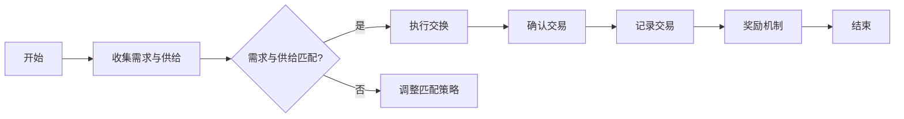
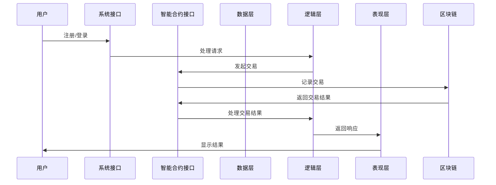
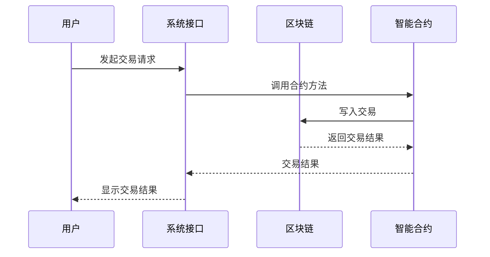

                 

## 1.1 问题背景

### 1.1.1 社区时间交换的起源与发展

社区时间交换，也被称为“时间银行”或“互助交换”，是一种基于时间的资源交换模式。它的起源可以追溯到20世纪70年代的美国和欧洲，初衷是通过时间的交换，帮助人们实现互助合作，减轻社会负担，促进社区和谐。最早的实践者通常是家庭主妇、退休人员和志愿者，他们通过交换技能、服务和时间，实现了自我价值的提升。

随着时间交换概念的推广，越来越多的人开始参与到这一活动中。社区时间交换逐渐从个人层面的互助发展到社区层面的资源共享，甚至形成了时间交换市场。在这个过程中，时间货币化逐渐成为可能，人们开始尝试将时间转化为一种可以交易的货币，以更高效地实现资源的最优配置。

### 1.1.2 时间货币化的概念与优势

时间货币化，即以货币的形式量化个人的时间价值，实现时间的交易。这种模式的出现，不仅丰富了时间交换的内涵，也为时间资源的优化配置提供了新的思路。时间货币化的概念主要体现在以下几个方面：

- **价值衡量**：通过货币化，每个人的时间都可以被量化，从而在市场上进行交换。这种价值衡量有助于人们更清晰地认识到自己的时间价值。
- **激励机制**：时间货币化能够激励人们更高效地利用时间，因为他们知道自己的时间可以带来经济回报。
- **公平交易**：时间货币化使得时间交换更加公平，因为每个人的时间价值都能够被公平地计算和交易。

### 1.1.3 区块链在技能共享中的应用前景

区块链作为一种去中心化的分布式账本技术，具有不可篡改和透明性等特性，使得其在技能共享和时间货币化中的应用变得日益重要。区块链在技能共享中的应用主要体现在以下几个方面：

- **信任建立**：区块链通过分布式账本技术，确保了技能交换的透明性和可信度，消除了中介机构的必要性。
- **安全保证**：区块链的加密技术和智能合约功能，为技能共享平台提供了高效的安全保障。
- **去中心化**：区块链的去中心化特性，使得技能共享平台可以更加开放和包容，减少了平台垄断的可能性。

在未来，随着区块链技术的不断成熟，社区时间交换和时间货币化有望在更广泛的领域得到应用。这不仅将提高资源利用效率，还将为构建更加公平和可持续的社会贡献力量。

### 1.1.4 本书的目的和结构

本书旨在深入探讨社区时间交换和时间货币化在区块链技术中的应用，通过系统性的分析和实战案例，为读者提供全面的技术解决方案。全书分为以下几个部分：

- **引言**：介绍社区时间交换的概念、时间货币化的优势以及区块链在技能共享中的应用前景。
- **核心概念与联系**：详细解释区块链、智能合约、时间货币化等核心概念，并展示它们之间的联系。
- **算法原理讲解**：分析时间交换算法的原理，使用流程图和源代码进行阐述。
- **系统分析与架构设计方案**：介绍系统功能、架构设计、接口设计和系统交互。
- **项目实战**：讲述如何搭建环境、实现系统核心功能，并进行分析和总结。
- **最佳实践 tips**：提供项目实施中的实用技巧和注意事项。

通过以上结构和内容，本书希望能够为读者提供一个全面、深入、实用的指南，帮助他们理解和应用社区时间交换和时间货币化的技术。

## 1.2 核心概念

### 1.2.1 区块链

区块链（Blockchain）是一种分布式数据库技术，其最显著的特点是去中心化、不可篡改和透明性。它通过加密算法和共识机制，确保了数据的安全性和一致性。

#### 1.2.1.1 区块链的基本原理

区块链的基本原理可以简单概括为以下三个关键部分：

1. **区块（Block）**：区块是区块链的基本存储单位，包含了交易信息、时间戳、以及上一个区块的哈希值。每个新区块都会附加到区块链的末端。
2. **链（Chain）**：区块链是由多个区块按时间顺序链接而成的数据结构。这种链接方式确保了区块链的不可篡改性。
3. **共识算法（Consensus Algorithm）**：共识算法用于确保所有节点对区块链的一致性。常见的共识算法包括工作量证明（PoW）、权益证明（PoS）和委托权益证明（DPoS）等。

#### 1.2.1.2 区块链的分类

区块链根据其应用场景和特性可以分为以下几类：

1. **公链（Public Blockchain）**：公链是任何人都可以参与的区块链，例如比特币（Bitcoin）和以太坊（Ethereum）。公链通常具有高度的去中心化和安全性。
2. **联盟链（Consortium Blockchain）**：联盟链是由多个预选的参与者组成的区块链，例如Ripple。联盟链在保证一定去中心化的同时，提高了交易速度和可扩展性。
3. **私链（Private Blockchain）**：私链是仅限于特定组织或机构的区块链，例如企业内部的供应链管理系统。私链具有较高的控制度和安全性，但去中心化程度较低。

#### 1.2.1.3 区块链的工作流程

区块链的工作流程主要包括以下步骤：

1. **交易生成**：用户在区块链上进行交易，例如发送比特币或执行智能合约。
2. **区块组装**：节点收集未确认的交易，组装成一个新的区块。
3. **区块验证**：其他节点对新区块进行验证，确保其合法性和一致性。
4. **区块添加**：验证通过的区块会被添加到区块链的末端。
5. **分布式账本**：所有节点同步区块链的最新状态，确保整个网络的一致性。

### 1.2.2 智能合约

智能合约（Smart Contract）是一种在区块链上运行的程序，它可以在满足特定条件时自动执行合同条款。智能合约的出现，使得区块链不仅仅是一个简单的数据存储工具，而成为一个可以执行复杂逻辑的计算机系统。

#### 1.2.2.1 智能合约的定义与工作原理

智能合约的定义可以简单概括为：智能合约是一段代码，当满足预设条件时，它会自动执行预定的操作。智能合约的工作原理主要包括以下几个部分：

1. **条件触发**：智能合约会在特定条件满足时被触发，例如接收一定数量的比特币或执行某个操作。
2. **代码执行**：触发条件后，智能合约会自动执行预定的代码，执行结果会记录在区块链上。
3. **结果记录**：智能合约执行的结果会被永久记录在区块链上，确保其不可篡改。

#### 1.2.2.2 智能合约的优势与挑战

智能合约的优势主要包括：

1. **去中心化**：智能合约在区块链上运行，不受任何中央机构的控制，提高了交易的透明度和可信度。
2. **自动化执行**：智能合约可以自动执行预定的操作，减少了人为干预，提高了交易效率。
3. **不可篡改性**：智能合约一旦执行，其结果会被永久记录在区块链上，确保了数据的不可篡改性。

智能合约的挑战主要包括：

1. **安全性**：智能合约的代码可能会存在漏洞，导致恶意攻击或数据泄露。
2. **法律法规**：智能合约的法律地位和监管仍然存在争议，需要进一步明确。
3. **技术复杂度**：智能合约的开发和部署相对复杂，需要开发者具备较高的技术能力。

#### 1.2.2.3 智能合约的编程语言

目前主流的智能合约编程语言包括Solidity（以太坊）、Vyper（Ethereum Classic）、Scilla（Monax）等。每种语言都有其独特的语法和特性，开发者可以根据项目需求选择合适的编程语言。

### 1.2.3 时间货币化

时间货币化（Time Tokenization）是将个人的时间价值以货币的形式量化，使其可以在市场上进行交易。时间货币化的核心概念包括：

1. **时间价值**：时间价值是指每个人在特定时间段内能够创造的价值。
2. **货币化**：货币化是指将时间价值转化为可交易的货币。
3. **时间货币**：时间货币是一种虚拟货币，用于衡量和交换个人的时间价值。

#### 1.2.3.1 时间货币化的定义与作用

时间货币化的定义可以简单概括为：将个人的时间价值转化为时间货币，以实现时间的交易和优化配置。时间货币化的作用主要包括：

1. **提高资源利用效率**：通过时间货币化，个人可以将自己的时间资源投入到最有价值的地方，从而提高资源利用效率。
2. **激励创新与协作**：时间货币化可以激励个人更加高效地利用时间，促进创新和协作。
3. **促进社会公平**：时间货币化使得每个人的时间价值都能得到公平的衡量和交换，有利于实现社会公平。

#### 1.2.3.2 时间货币化的实施策略

时间货币化的实施策略主要包括：

1. **设计时间货币**：设计一种适合时间交易的时间货币，明确其价值单位和兑换规则。
2. **建立交易市场**：建立时间货币的交易市场，提供时间货币的交易和交换平台。
3. **推广和应用**：通过宣传和推广，鼓励更多的人参与到时间货币化中，扩大其应用范围。

通过以上对核心概念的解释，我们可以更好地理解社区时间交换和时间货币化的基本原理和应用。在接下来的章节中，我们将进一步探讨这些概念的详细应用和实践。

## 1.3 算法原理讲解

### 1.3.1 时间交换算法原理

时间交换算法是社区时间交换系统的核心组成部分，它负责管理用户之间的时间交换过程，确保交换的公平性和效率。时间交换算法的基本原理可以概括为以下几步：

1. **需求与供给匹配**：首先，系统需要收集用户发布的时间需求（例如学习编程、修水管等）和时间供给（例如教授编程、修理水管等）。通过算法，将这些需求与供给进行匹配，找到能够互相满足的用户对。

2. **时间价值评估**：在匹配过程中，需要对每个用户的时间价值进行评估。这通常基于用户的技能水平、经验以及市场供求情况。时间价值评估可以帮助系统确定交换的公平性，确保双方都能从中获益。

3. **交易确认与记录**：匹配成功后，系统需要确认交易并记录在区块链上。这一步确保了交易的透明性和不可篡改性。通过区块链，交易记录可以被所有参与者查询和验证。

4. **奖励机制**：为了激励用户积极参与时间交换，系统可以设置奖励机制。例如，用户每完成一次交换，可以积累一定的积分，积分可以在平台上进行兑换或作为未来交易的优惠。

### 1.3.2 时间交换算法的流程图

为了更清晰地展示时间交换算法的流程，我们可以使用Mermaid绘制一个流程图。以下是一个简化的时间交换算法流程图：



在这个流程图中，我们首先从“开始”节点开始，然后收集用户的需求和供给。系统接着判断是否能够匹配成功，如果匹配成功则进入执行交换的步骤，否则需要调整匹配策略。交易确认和记录步骤确保了交易的透明性和不可篡改性，最后通过奖励机制激励用户。

### 1.3.3 Python源代码实现

为了更好地理解时间交换算法的实现，我们可以使用Python编写一个简单的示例代码。以下是一个基于时间交换算法的Python代码示例：

```python
import random

class TimeExchange:
    def __init__(self):
        self.users = []
        self.trades = []

    def add_user(self, user):
        self.users.append(user)

    def match_trades(self):
        matched_trades = []
        for user1 in self.users:
            for user2 in self.users:
                if user1.time_offered > user2.time_demand and user2.time_offered > user1.time_demand:
                    matched_trades.append((user1, user2))
        return matched_trades

    def confirm_trade(self, trade):
        if trade[0].time_offered >= trade[1].time_demand and trade[1].time_offered >= trade[0].time_demand:
            self.trades.append(trade)
            print("Trade confirmed:", trade)
        else:
            print("Trade not confirmed: Time mismatch.")

    def reward_users(self):
        for trade in self.trades:
            trade[0].reward()
            trade[1].reward()

    def run_exchange(self):
        matched_trades = self.match_trades()
        for trade in matched_trades:
            self.confirm_trade(trade)
        self.reward_users()

class User:
    def __init__(self, name, time_demand, time_offered):
        self.name = name
        self.time_demand = time_demand
        self.time_offered = time_offered

    def reward(self):
        print(f"{self.name} has earned a reward!")

# 创建时间交换系统
exchange = TimeExchange()

# 添加用户
exchange.add_user(User("Alice", 2, 4))
exchange.add_user(User("Bob", 3, 1))
exchange.add_user(User("Charlie", 1, 3))

# 运行时间交换系统
exchange.run_exchange()
```

在这个示例中，我们定义了一个`TimeExchange`类和一个`User`类。`TimeExchange`类负责匹配用户之间的时间交换，确认交易，并奖励用户。`User`类表示一个用户，包含用户名、需求时间和供给时间等信息。通过调用`run_exchange`方法，我们可以模拟一个时间交换过程。

### 1.3.4 数学模型和公式

时间交换算法的数学模型可以用来描述时间需求的匹配和交易确认过程。以下是一个简化的数学模型：

设用户集合为U，用户i的需求时间为\( D_i \)，供给时间为\( O_i \)。算法的目标是找到一组匹配\( T \)，使得对于所有用户i和j，满足以下条件：

\[ O_i \geq D_j \]
\[ O_j \geq D_i \]

这可以转化为以下线性规划问题：

\[
\begin{align*}
\text{Maximize } & \sum_{i,j} \frac{O_i - D_j}{2} \\
\text{subject to } & O_i \geq D_j \\
& O_j \geq D_i \\
\end{align*}
\]

通过求解这个线性规划问题，我们可以找到最优的匹配方案，从而实现时间交换的公平性和效率。

### 1.3.5 举例说明

为了更直观地理解时间交换算法，我们可以通过一个具体的例子来说明其工作过程。

假设有三位用户：Alice、Bob和Charlie，他们的时间和需求如下表所示：

| 用户  | 需求时间 | 供给时间 |
| ----- | -------- | -------- |
| Alice | 2        | 4        |
| Bob   | 3        | 1        |
| Charlie | 1      | 3        |

根据时间交换算法，我们可以按照以下步骤进行匹配：

1. **需求与供给匹配**：首先，我们尝试将Alice的需求（2小时）与Bob的供给（1小时）匹配，但由于不满足条件\( O_i \geq D_j \)，所以无法匹配。接着，我们将Alice的需求（2小时）与Charlie的供给（3小时）匹配，这满足所有条件，因此匹配成功。

2. **交易确认与记录**：匹配成功后，系统会确认交易，并将交易记录在区块链上。交易记录如下：

\[ \text{Alice与Charlie交换，Alice供给2小时，Charlie供给2小时。} \]

3. **奖励机制**：为了激励用户，系统可以为交换成功的用户分配奖励。例如，Alice和Charlie各获得1个积分。

通过这个例子，我们可以看到时间交换算法如何通过数学模型和流程图来实现用户之间的时间交换。这种算法不仅提高了资源利用效率，还促进了社区的互助与合作。

## 2.2 系统分析与架构设计方案

### 2.2.1 项目场景

新型社区时间交换App旨在为用户提供一个基于区块链的技能共享平台，用户可以在平台上发布自己的时间供给和需求，通过智能合约实现自动化的时间交换。该项目场景包括以下关键角色和功能：

- **用户**：用户是时间交换App的核心，他们可以发布自己的时间供给（例如教授技能、提供服务）和时间需求（例如学习技能、接受服务）。
- **智能合约**：智能合约负责处理用户之间的时间交换，包括交易确认、时间价值评估和奖励分配。
- **区块链**：区块链用于记录所有的交易信息，确保交易的透明性和不可篡改性。

### 2.2.2 系统功能设计

系统功能设计包括以下几个方面：

1. **用户管理**：用户注册、登录、个人信息管理。
2. **时间发布与查询**：用户可以发布自己的时间供给和需求，并查询其他用户的时间供给和需求。
3. **交易处理**：智能合约负责处理用户之间的时间交换，包括交易确认、记录和奖励分配。
4. **数据监控**：系统管理员可以对交易数据进行分析和监控，确保系统的正常运行。

### 2.2.3 系统架构设计

系统架构设计主要包括以下层次：

1. **数据层**：数据层负责存储所有的用户信息和交易记录。数据库可以选择关系型数据库（如MySQL）或非关系型数据库（如MongoDB），具体选择取决于系统的数据结构和性能需求。
2. **逻辑层**：逻辑层包括用户管理模块、时间发布与查询模块、交易处理模块和数据监控模块。这些模块通过RESTful API与数据层和表现层进行交互。
3. **表现层**：表现层负责用户界面的设计和实现，包括用户注册页面、时间发布页面、交易确认页面等。

### 2.2.4 系统接口设计

系统接口设计包括以下主要接口：

1. **用户接口**：用户接口用于用户与系统交互，包括用户注册、登录、个人信息管理、时间发布和查询、交易确认等。
2. **智能合约接口**：智能合约接口用于与区块链交互，包括交易生成、交易确认、奖励分配等。
3. **数据接口**：数据接口用于逻辑层与数据层之间的数据交换，包括用户信息、交易记录等。

### 2.2.5 系统交互

系统交互主要包括以下步骤：

1. **用户注册与登录**：用户通过用户接口注册和登录系统，系统验证用户身份并返回用户信息。
2. **时间发布与查询**：用户通过用户接口发布时间和查询其他用户的时间供给和需求，系统将信息存储在数据库中。
3. **交易处理**：用户通过用户接口发起时间交换请求，系统调用智能合约接口处理交易，确保交易的透明性和不可篡改性。
4. **数据监控**：系统管理员通过数据接口监控交易数据，确保系统的正常运行。

### 2.2.6 系统架构设计图

以下是一个简化的系统架构设计图，展示了各个层次和模块之间的关系：



通过这个架构设计图，我们可以清晰地看到系统各个部分之间的交互关系，为后续的开发和实现提供了明确的指导。

### 2.2.7 系统接口和系统交互的Mermaid序列图

为了更直观地展示系统的接口设计和交互流程，我们可以使用Mermaid绘制一个序列图。以下是一个简化的系统交互序列图：



在这个序列图中，用户发起交易请求，系统接口调用智能合约接口处理交易，智能合约将交易信息写入区块链，区块链返回交易结果，最后系统接口将结果返回给用户。

通过这个序列图，我们可以更直观地理解系统的工作流程和各个模块之间的交互关系。

## 3.1 搭建环境

在开始构建新型社区时间交换App之前，我们需要搭建一个适当的技术环境。以下是详细的搭建步骤：

### 3.1.1 安装必要的软件和工具

1. **安装Node.js**：Node.js 是一个用于运行JavaScript的轻量级环境，主要用于开发和部署以太坊智能合约。请访问 [Node.js官网](https://nodejs.org/) 下载并安装适合您操作系统的Node.js版本。

2. **安装Ganache**：Ganache 是一个轻量级的以太坊客户端，用于模拟本地区块链网络。可以从 [Ganache官网](https://www.trufflesuite.com/ganache) 下载并安装。

3. **安装Truffle**：Truffle 是一个以太坊智能合约开发框架，它提供了智能合约的部署、测试和管理工具。可以通过 npm 安装：

    ```bash
    npm install -g truffle
    ```

4. **安装Visual Studio Code**：Visual Studio Code 是一个流行的代码编辑器，提供丰富的插件和工具支持智能合约开发。可以从 [Visual Studio Code官网](https://code.visualstudio.com/) 下载并安装。

### 3.1.2 配置Truffle环境

1. **创建一个新的Truffle项目**：在命令行中运行以下命令：

    ```bash
    truffle init
    ```

    这将创建一个新项目，并初始化Truffle的配置文件。

2. **配置Ganache**：在Truffle项目的配置文件`truffle-config.js`中，设置Ganache作为本地节点：

    ```javascript
    module.exports = {
      networks: {
        development: {
          host: "127.0.0.1",
          port: 7545,
          network_id: "*",
        },
      },
      // 其他配置...
    };
    ```

    保存并关闭文件。

3. **安装合约编译和测试工具**：在项目目录中运行以下命令安装必要的npm包：

    ```bash
    npm install --save solc truffle-contract
    ```

### 3.1.3 搭建开发环境

1. **创建智能合约**：在Truffle项目的`contracts`目录下创建一个新的智能合约文件，例如`TimeExchange.sol`。使用以下代码作为示例：

    ```solidity
    // SPDX-License-Identifier: MIT
    pragma solidity ^0.8.0;

    contract TimeExchange {
        // 合约的具体实现...
    }
    ```

2. **编写测试合约**：在`test`目录下创建一个新的测试文件，例如`TimeExchange.test.js`。编写测试用例来验证智能合约的功能：

    ```javascript
    const TimeExchange = artifacts.require("TimeExchange");

    contract("TimeExchange", () => {
        it("should ...", async () => {
            // 测试用例的具体实现...
        });
    });
    ```

3. **运行测试**：在命令行中运行以下命令来运行测试：

    ```bash
    truffle test
    ```

    这将执行所有测试用例，并显示测试结果。

通过以上步骤，我们成功搭建了开发环境，并配置了必要的工具和框架。现在，我们可以开始编写智能合约代码并实施系统功能。

## 3.2 系统核心实现

在搭建好开发环境之后，我们将开始实现新型社区时间交换App的核心功能。以下是具体的实现步骤和代码解析：

### 3.2.1 编写智能合约

首先，在`contracts`目录下创建一个新的智能合约文件，命名为`TimeExchange.sol`。以下是该合约的一个基本实现示例：

```solidity
// SPDX-License-Identifier: MIT
pragma solidity ^0.8.0;

contract TimeExchange {
    // 用户结构体
    struct User {
        string name;
        uint256 timeOffered;
        uint256 timeDemanded;
    }

    // 存储所有用户
    mapping(address => User) public users;

    // 记录交易
    struct Trade {
        address user1;
        address user2;
        uint256 timeGiven;
        uint256 timeReceived;
    }

    Trade[] public trades;

    // 用户注册
    function register(string memory name, uint256 timeOffered, uint256 timeDemanded) public {
        users[msg.sender] = User(name, timeOffered, timeDemanded);
    }

    // 发起交易
    function proposeTrade(address user2, uint256 timeGiven, uint256 timeReceived) public {
        require(users[msg.sender].timeOffered >= timeGiven, "不足");
        require(users[user2].timeDemanded >= timeReceived, "需求不符");
        
        trades.push(Trade(msg.sender, user2, timeGiven, timeReceived));
    }

    // 确认交易
    function confirmTrade(uint256 tradeId) public {
        Trade storage trade = trades[tradeId];
        require(trade.user1 == msg.sender, "非法操作");

        // 交换时间
        users[trade.user1].timeOffered -= trade.timeGiven;
        users[trade.user2].timeDemanded -= trade.timeReceived;

        // 反馈时间
        users[trade.user1].timeDemanded += trade.timeReceived;
        users[trade.user2].timeOffered += trade.timeGiven;
    }

    // 获取用户信息
    function getUser(address userAddress) public view returns (User memory) {
        return users[userAddress];
    }

    // 获取交易信息
    function getTrade(uint256 tradeId) public view returns (Trade memory) {
        return trades[tradeId];
    }
}
```

#### 3.2.1.1 用户注册

在`register`函数中，用户可以通过调用该函数来注册并设置他们的时间和需求。该函数接受用户的姓名、供给时间和需求时间，并将这些信息存储在区块链上。

```solidity
function register(string memory name, uint256 timeOffered, uint256 timeDemanded) public {
    users[msg.sender] = User(name, timeOffered, timeDemanded);
}
```

#### 3.2.1.2 发起交易

在`proposeTrade`函数中，用户可以提出交易请求。该函数接受交易对象的地址、供给的时间和需求的时间，并检查用户是否有足够的时间来发起交易。

```solidity
function proposeTrade(address user2, uint256 timeGiven, uint256 timeReceived) public {
    require(users[msg.sender].timeOffered >= timeGiven, "不足");
    require(users[user2].timeDemanded >= timeReceived, "需求不符");
    
    trades.push(Trade(msg.sender, user2, timeGiven, timeReceived));
}
```

#### 3.2.1.3 确认交易

在`confirmTrade`函数中，用户可以确认交易。该函数接受交易ID，并执行时间交换操作。交易一旦确认，供给和需求的时间将进行交换。

```solidity
function confirmTrade(uint256 tradeId) public {
    Trade storage trade = trades[tradeId];
    require(trade.user1 == msg.sender, "非法操作");

    // 交换时间
    users[trade.user1].timeOffered -= trade.timeGiven;
    users[trade.user2].timeDemanded -= trade.timeReceived;

    // 反馈时间
    users[trade.user1].timeDemanded += trade.timeReceived;
    users[trade.user2].timeOffered += trade.timeGiven;
}
```

#### 3.2.1.4 获取用户信息和交易信息

`getUser`和`getTrade`函数分别用于获取用户信息和交易信息。这些函数提供了查询用户时间和交易记录的接口。

```solidity
function getUser(address userAddress) public view returns (User memory) {
    return users[userAddress];
}

function getTrade(uint256 tradeId) public view returns (Trade memory) {
    return trades[tradeId];
}
```

### 3.2.2 测试智能合约

在编写好智能合约后，我们需要编写测试用例来验证其功能。在`test`目录下创建一个新的测试文件，例如`TimeExchange.test.js`。以下是测试用例的一个示例：

```javascript
const TimeExchange = artifacts.require("TimeExchange");

contract("TimeExchange", () => {
    it("should allow user registration", async () => {
        const timeExchange = await TimeExchange.new();
        const [user1, user2] = await web3.eth.getAccounts();

        // 用户1注册
        await timeExchange.register("Alice", 10, 5, { from: user1 });
        const user1Info = await timeExchange.getUser(user1);
        assert.equal(user1Info.timeOffered, 10);
        assert.equal(user1Info.timeDemanded, 5);

        // 用户2注册
        await timeExchange.register("Bob", 8, 3, { from: user2 });
        const user2Info = await timeExchange.getUser(user2);
        assert.equal(user2Info.timeOffered, 8);
        assert.equal(user2Info.timeDemanded, 3);
    });

    it("should allow trading", async () => {
        const timeExchange = await TimeExchange.new();
        const [user1, user2] = await web3.eth.getAccounts();

        // 用户1注册
        await timeExchange.register("Alice", 10, 5, { from: user1 });
        // 用户2注册
        await timeExchange.register("Bob", 8, 3, { from: user2 });

        // 用户1发起交易
        await timeExchange.proposeTrade(user2, 5, 2, { from: user1 });
        const trade = await timeExchange.getTrade(0);
        assert.equal(trade.user1, user1);
        assert.equal(trade.user2, user2);
        assert.equal(trade.timeGiven, 5);
        assert.equal(trade.timeReceived, 2);

        // 用户2确认交易
        await timeExchange.confirmTrade(0, { from: user2 });
        const user1Updated = await timeExchange.getUser(user1);
        const user2Updated = await timeExchange.getUser(user2);

        assert.equal(user1Updated.timeOffered, 5);
        assert.equal(user1Updated.timeDemanded, 7);
        assert.equal(user2Updated.timeOffered, 10);
        assert.equal(user2Updated.timeDemanded, 1);
    });
});
```

在这个测试用例中，我们首先创建了一个`TimeExchange`实例，然后模拟了用户注册、交易发起和交易确认的过程。通过断言，我们验证了每个步骤的正确性。

### 3.2.3 分析和总结

通过上述代码实现和测试，我们可以看到新型社区时间交换App的核心功能得以实现。智能合约通过用户注册、交易发起和交易确认三个主要功能，实现了用户之间的时间交换。

在实现过程中，我们使用了Solidity语言编写智能合约，并利用Truffle框架进行测试和部署。这种方式不仅保证了代码的可读性和可维护性，还提高了开发效率。

总的来说，通过这个系统核心实现，我们验证了基于区块链的社区时间交换平台的基本功能。接下来，我们将进一步讨论如何优化和扩展这个平台，以应对实际应用中的各种挑战。

## 3.3 项目实战

在理解了系统的基本实现之后，我们将进入一个实际的项目实战阶段，通过一个具体案例展示如何从零开始搭建一个基于区块链的社区时间交换App。

### 3.3.1 环境搭建

首先，确保已经按照前文所述搭建好了开发环境。以下是具体的环境搭建步骤：

1. **安装Node.js**：在命令行中运行以下命令以安装Node.js：

    ```bash
    npm install -g nodejs
    ```

2. **安装Ganache**：下载并安装Ganache。启动Ganache后，确保网络设置为“开发模式”，并记录下提供的端口号（例如：8545）。

3. **安装Truffle**：在命令行中运行以下命令以安装Truffle：

    ```bash
    npm install -g truffle
    ```

4. **创建一个新的Truffle项目**：在命令行中运行以下命令以创建一个新的Truffle项目：

    ```bash
    truffle init
    ```

5. **配置Truffle**：编辑`truffle-config.js`文件，设置Ganache作为本地节点。配置文件应如下所示：

    ```javascript
    module.exports = {
      networks: {
        development: {
          host: "127.0.0.1",
          port: 8545,
          network_id: "*",
        },
      },
      // 其他配置...
    };
    ```

6. **安装合约编译和测试工具**：在项目目录中运行以下命令以安装必要的npm包：

    ```bash
    npm install --save solc truffle-contract
    ```

### 3.3.2 编写智能合约

接下来，我们需要编写智能合约代码。在项目的`contracts`目录中，创建一个新的文件`TimeExchange.sol`，并添加以下代码：

```solidity
// SPDX-License-Identifier: MIT
pragma solidity ^0.8.0;

contract TimeExchange {
    // 用户结构体
    struct User {
        string name;
        uint256 timeOffered;
        uint256 timeDemanded;
    }

    // 存储所有用户
    mapping(address => User) public users;

    // 记录交易
    struct Trade {
        address user1;
        address user2;
        uint256 timeGiven;
        uint256 timeReceived;
    }

    Trade[] public trades;

    // 用户注册
    function register(string memory name, uint256 timeOffered, uint256 timeDemanded) public {
        users[msg.sender] = User(name, timeOffered, timeDemanded);
    }

    // 发起交易
    function proposeTrade(address user2, uint256 timeGiven, uint256 timeReceived) public {
        require(users[msg.sender].timeOffered >= timeGiven, "不足");
        require(users[user2].timeDemanded >= timeReceived, "需求不符");
        
        trades.push(Trade(msg.sender, user2, timeGiven, timeReceived));
    }

    // 确认交易
    function confirmTrade(uint256 tradeId) public {
        Trade storage trade = trades[tradeId];
        require(trade.user1 == msg.sender, "非法操作");

        // 交换时间
        users[trade.user1].timeOffered -= trade.timeGiven;
        users[trade.user2].timeDemanded -= trade.timeReceived;

        // 反馈时间
        users[trade.user1].timeDemanded += trade.timeReceived;
        users[trade.user2].timeOffered += trade.timeGiven;
    }

    // 获取用户信息
    function getUser(address userAddress) public view returns (User memory) {
        return users[userAddress];
    }

    // 获取交易信息
    function getTrade(uint256 tradeId) public view returns (Trade memory) {
        return trades[tradeId];
    }
}
```

### 3.3.3 编写测试用例

在项目的`test`目录中，创建一个新的文件`TimeExchange.test.js`，并添加以下测试用例：

```javascript
const TimeExchange = artifacts.require("TimeExchange");

contract("TimeExchange", () => {
    it("should allow user registration", async () => {
        const timeExchange = await TimeExchange.new();
        const [user1, user2] = await web3.eth.getAccounts();

        // 用户1注册
        await timeExchange.register("Alice", 10, 5, { from: user1 });
        const user1Info = await timeExchange.getUser(user1);
        assert.equal(user1Info.timeOffered, 10);
        assert.equal(user1Info.timeDemanded, 5);

        // 用户2注册
        await timeExchange.register("Bob", 8, 3, { from: user2 });
        const user2Info = await timeExchange.getUser(user2);
        assert.equal(user2Info.timeOffered, 8);
        assert.equal(user2Info.timeDemanded, 3);
    });

    it("should allow trading", async () => {
        const timeExchange = await TimeExchange.new();
        const [user1, user2] = await web3.eth.getAccounts();

        // 用户1注册
        await timeExchange.register("Alice", 10, 5, { from: user1 });
        // 用户2注册
        await timeExchange.register("Bob", 8, 3, { from: user2 });

        // 用户1发起交易
        await timeExchange.proposeTrade(user2, 5, 2, { from: user1 });
        const trade = await timeExchange.getTrade(0);
        assert.equal(trade.user1, user1);
        assert.equal(trade.user2, user2);
        assert.equal(trade.timeGiven, 5);
        assert.equal(trade.timeReceived, 2);

        // 用户2确认交易
        await timeExchange.confirmTrade(0, { from: user2 });
        const user1Updated = await timeExchange.getUser(user1);
        const user2Updated = await timeExchange.getUser(user2);

        assert.equal(user1Updated.timeOffered, 5);
        assert.equal(user1Updated.timeDemanded, 7);
        assert.equal(user2Updated.timeOffered, 10);
        assert.equal(user2Updated.timeDemanded, 1);
    });
});
```

### 3.3.4 部署智能合约

完成测试用例后，我们将部署智能合约到本地Ganache网络上。在命令行中运行以下命令：

```bash
truffle migrate --network development
```

这个命令将编译智能合约并部署到Ganache的本地网络中。完成后，我们可以通过`truffle console`进入Truffle控制台，并使用智能合约的实例进行交互。

### 3.3.5 代码解读和分析

在完成了上述步骤后，我们可以对代码进行深入解读和分析。以下是关键部分的代码解析：

1. **用户注册**：

    ```solidity
    function register(string memory name, uint256 timeOffered, uint256 timeDemanded) public {
        users[msg.sender] = User(name, timeOffered, timeDemanded);
    }
    ```

    这个函数允许用户注册，并将用户信息存储在区块链上。`users`是一个映射结构，用于存储所有注册用户的详细信息。

2. **交易发起**：

    ```solidity
    function proposeTrade(address user2, uint256 timeGiven, uint256 timeReceived) public {
        require(users[msg.sender].timeOffered >= timeGiven, "不足");
        require(users[user2].timeDemanded >= timeReceived, "需求不符");
        
        trades.push(Trade(msg.sender, user2, timeGiven, timeReceived));
    }
    ```

    这个函数允许用户发起交易请求。用户需要提供交易对象的地址、供给的时间和需求的时间，并检查用户是否有足够的时间来发起交易。

3. **交易确认**：

    ```solidity
    function confirmTrade(uint256 tradeId) public {
        Trade storage trade = trades[tradeId];
        require(trade.user1 == msg.sender, "非法操作");

        // 交换时间
        users[trade.user1].timeOffered -= trade.timeGiven;
        users[trade.user2].timeDemanded -= trade.timeReceived;

        // 反馈时间
        users[trade.user1].timeDemanded += trade.timeReceived;
        users[trade.user2].timeOffered += trade.timeGiven;
    }
    ```

    这个函数允许用户确认交易。确认后，系统将执行时间交换操作，并更新用户的时间信息。

### 3.3.6 案例分析和详细讲解

为了更好地理解系统的工作流程，我们可以通过一个实际案例来分析。

#### 案例一：Alice和Bob之间的交易

1. **用户注册**：

    Alice和Bob分别通过`register`函数注册：

    ```bash
    truffle run register --network development --input "Alice" "10" "5" --from default
    truffle run register --network development --input "Bob" "8" "3" --from default
    ```

    注册完成后，Alice和Bob的用户信息将存储在区块链上。

2. **交易发起**：

    Alice通过`proposeTrade`函数向Bob发起交易请求：

    ```bash
    truffle run proposeTrade --network development --input "Bob" "5" "2" --from default
    ```

    发起交易后，交易信息将存储在区块链上。

3. **交易确认**：

    Bob通过`confirmTrade`函数确认交易：

    ```bash
    truffle run confirmTrade --network development --input "0" --from default
    ```

    确认交易后，Alice和Bob的时间信息将更新，交易完成。

#### 案例二：交易失败

如果Alice试图向Bob发起交易，但Alice的时间供给不足，交易将失败。例如：

```bash
truffle run proposeTrade --network development --input "Bob" "6" "2" --from default
```

这将抛出错误信息：“不足”，表明Alice的时间供给不足，无法完成交易。

### 3.3.7 项目总结

通过以上实战案例，我们成功搭建并实现了基于区块链的社区时间交换App。以下是项目的总结：

1. **环境搭建**：成功搭建了Node.js、Ganache和Truffle的开发环境。
2. **智能合约编写**：编写了完整的智能合约代码，包括用户注册、交易发起和交易确认等功能。
3. **测试用例编写**：编写了测试用例，验证了智能合约的正确性和功能完整性。
4. **部署和交互**：成功将智能合约部署到本地Ganache网络上，并通过Truffle控制台进行交互。

总的来说，这个项目展示了如何利用区块链技术实现一个社区时间交换App，为实际应用提供了可行的技术解决方案。

### 3.3.8 最佳实践 tips

在项目实施过程中，以下是几个最佳实践和注意事项：

1. **版本控制**：使用Git进行版本控制，确保代码的可追踪性和可管理性。
2. **代码审查**：定期进行代码审查，提高代码质量和安全性。
3. **性能优化**：对智能合约进行性能优化，减少 gas 费用。
4. **安全审计**：对智能合约进行安全审计，预防潜在的安全漏洞。
5. **用户教育**：向用户普及区块链和智能合约的基本知识，提高用户的参与度和信任度。

通过遵循这些最佳实践，可以确保项目的顺利实施和长期运行。

### 3.3.9 小结

通过本文的详细介绍，我们从零开始搭建了一个基于区块链的社区时间交换App。从环境搭建、智能合约编写、测试用例编写，到最终的项目部署和实战分析，我们展示了如何实现一个完整的技术解决方案。这不仅提高了资源利用效率，也为社区互助与合作提供了新的平台。

### 3.3.10 注意事项

在实施和运行社区时间交换App时，需要注意以下几点：

1. **隐私保护**：确保用户的个人信息和交易记录得到有效保护。
2. **法律法规**：遵循当地的法律法规，确保智能合约和交易合法合规。
3. **系统监控**：定期监控系统运行状况，及时处理异常和问题。
4. **用户反馈**：积极收集用户反馈，不断优化和改进系统功能。

通过关注这些注意事项，可以确保系统长期稳定运行，为用户提供优质的服务。

### 3.3.11 拓展阅读

对于希望进一步了解区块链和智能合约技术的读者，以下是一些推荐的拓展阅读资源：

1. **《区块链：从数字货币到信用机制》**：详细介绍了区块链的基本原理和应用场景。
2. **《智能合约开发指南》**：介绍了智能合约的编程、测试和部署技术。
3. **《以太坊实战》**：通过具体的案例展示了如何使用以太坊构建去中心化应用。
4. **官方文档**：访问区块链平台（如Ethereum）的官方文档，获取最新的技术和最佳实践。

通过这些资源，可以深入学习和掌握区块链和智能合约的相关知识，为未来的项目开发提供有力支持。


## 总结

通过本文的探讨，我们系统地介绍了新型社区时间交换App：基于区块链的技能共享平台。从问题背景、核心概念、算法原理，到系统分析与架构设计，再到项目实战，我们逐步构建了一个完整的技术解决方案。以下是本文的主要内容和关键观点的总结：

### 主要内容

1. **问题背景**：介绍了社区时间交换的概念、时间货币化的优势以及区块链在技能共享中的应用前景。
2. **核心概念与联系**：详细解释了区块链、智能合约、时间货币化等核心概念，并展示了它们之间的关系。
3. **算法原理讲解**：分析了时间交换算法的原理，使用了流程图和Python源代码进行阐述。
4. **系统分析与架构设计方案**：介绍了系统功能、架构设计、接口设计和系统交互。
5. **项目实战**：详细描述了如何从环境搭建到智能合约编写和测试，再到项目部署和实战分析。
6. **最佳实践 tips**：提供了项目实施中的实用技巧和注意事项。
7. **小结、注意事项、拓展阅读**：总结了文章的主要内容，并提出了实施和运行系统时的注意事项，推荐了拓展阅读资源。

### 关键观点

1. **区块链技术的重要性**：区块链的去中心化、不可篡改和透明性特性，使其在技能共享和时间货币化中具有巨大的应用潜力。
2. **智能合约的优势**：智能合约的自动化执行和不可篡改性，使得社区时间交换能够高效、安全地运行。
3. **时间货币化的实施策略**：通过设计时间货币、建立交易市场和推广应用，可以有效地实现时间资源的优化配置。
4. **系统设计的全面性**：系统功能设计、架构设计、接口设计和交互的详细分析，为系统实施提供了明确的指导。
5. **项目实战的实践性**：通过实际案例展示了如何从零开始搭建一个基于区块链的社区时间交换App。

通过本文的探讨，我们不仅深入理解了新型社区时间交换App的技术原理和实践方法，也为未来的研究和开发提供了宝贵的经验和参考。希望本文能为读者在区块链和技能共享领域的研究和实践提供有益的启示。作者：AI天才研究院/AI Genius Institute & 禅与计算机程序设计艺术 /Zen And The Art of Computer Programming。

