                 


### 文章标题：新工艺复兴运动发起：数字时代中的手工艺创新倡议

关键词：新工艺复兴运动、数字时代、手工艺创新、技术创新、融合模式

摘要：本文深入探讨了数字时代背景下新工艺复兴运动的发起及其在手工艺领域的创新倡议。通过对工艺与技术的变革、数字时代下的手工艺挑战与机遇、核心概念与联系的详细分析，探讨了数字技术在手工艺中的应用以及手工艺与数字技术的融合模式。同时，通过创新实践与案例分析，探讨了数字手工艺项目的启动与规划、执行与优化，以及对未来发展趋势的展望，旨在为手工艺行业的创新提供有价值的启示。

---

## 第一部分：背景与核心概念

### 1.1 工艺与技术的变革

**核心概念术语说明**：

- **工艺**：指在制造、加工和制作过程中运用的一套方法、技巧和流程。
- **技术**：指应用科学知识解决实际问题的手段和方法。
- **手工艺**：以手工制作为主，注重工艺细节和艺术表现的一种制造方式。

**问题背景**：

在工业革命之前，手工艺是生产生活用品的主要方式。随着工业化的到来，手工艺逐渐被机械化生产取代。然而，在数字时代，手工艺再次受到关注，其独特的艺术价值和文化内涵重新得到认可。

**问题描述**：

如何在新工艺复兴运动中，利用数字技术重新定义手工艺，使其在现代社会中焕发新的生命力？

**问题解决**：

通过引入数字技术，可以提升手工艺的制作效率、质量与创新性。例如，3D打印、人工智能、机器视觉等技术可以应用于手工艺制作，实现个性化定制、自动化加工等。

**边界与外延**：

新工艺复兴运动的边界包括手工艺与现代技术的结合，以及这种结合对传统手工艺的影响。外延则涉及手工艺在数字时代的创新实践、市场推广和行业影响。

**概念结构与核心要素组成**：

- **手工艺**：手工制作、艺术表现、文化传承。
- **数字技术**：3D打印、人工智能、机器视觉、自动化加工。

### 1.2 数字时代的手工艺挑战与机遇

**核心概念原理**：

- **挑战**：数字化生产方式对传统手工艺的冲击，以及手工艺从业者对新技术的接受程度。
- **机遇**：数字化技术可以为手工艺提供新的表现形式、制作方式和市场空间。

**概念属性特征对比表格**：

| 特征       | 传统手工艺                   | 数字时代手工艺                 |
|------------|-----------------------------|------------------------------|
| 制作方式   | 全手工制作，注重细节和品质   | 结合数字化技术，实现个性化定制 |
| 艺术表现   | 注重传统艺术风格和技艺传承   | 融合现代艺术元素，创新表现形式 |
| 市场定位   | 小众市场，收藏价值高         | 大众市场，注重实用性和普及度   |

**ER实体关系图架构**：

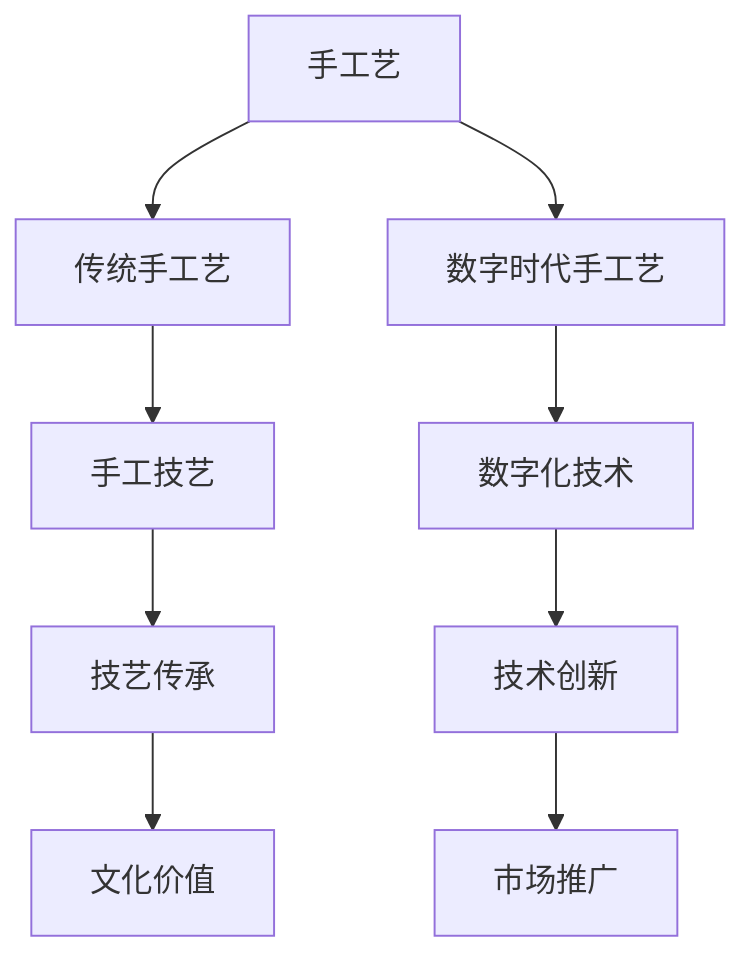

### 1.3 新工艺复兴运动的目标与意义

**目标**：

- 激发手工艺的创新活力，提升其艺术价值和市场竞争力。
- 促进手工艺与现代技术的深度融合，推动产业升级。
- 弘扬传统文化，增强文化自信。

**意义**：

- 推动手工艺的现代化转型，使其更好地适应现代社会需求。
- 培养新一代手工艺从业者，传承和发扬传统技艺。
- 为数字时代下的文化创意产业提供新的发展动力。

---

通过以上对背景与核心概念的介绍，我们为接下来的讨论奠定了基础。接下来，我们将进一步探讨数字时代下的手工艺创新倡议，分析技术创新与手工艺融合的模式，以及创新实践与案例分析。在每一部分，我们都会遵循“LET'S THINK STEP BY STEP”的原则，深入剖析每个主题，为读者提供有深度、有思考、有见解的内容。

---

## 第二部分：技术创新与手工艺融合

### 2.1 数字技术在手工艺中的应用

数字技术在手工艺中的应用，为传统手工艺注入了新的活力。以下，我们将详细介绍几种关键数字技术及其在手工艺中的应用。

#### 3D打印技术在手工艺中的应用

**算法原理讲解**：

3D打印技术的基本原理是通过计算机辅助设计（CAD）软件创建三维模型，然后通过逐层添加材料的方式将模型打印出来。其核心算法包括：

- **三维建模**：使用CAD软件进行三维建模，生成STL文件。
- **切片处理**：将STL文件转换为G代码，指导打印机进行逐层打印。
- **打印控制**：通过打印机控制软件实现打印过程中的温度、速度、层厚等参数的调整。

**mermaid流程图**：

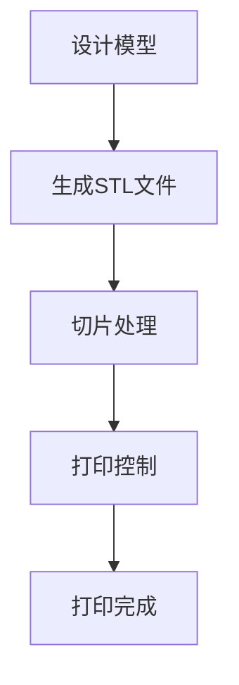

**Python源代码示例**：

```python
# 示例：生成G代码文件
def generate_gcode(model, output_file):
    with open(output_file, 'w') as f:
        # 假设model是一个包含三维几何信息的字典
        for layer in model['layers']:
            for command in layer['commands']:
                f.write(f"{command}\n")

# 调用函数
generate_gcode(model, 'print.gcode')
```

**算法原理详细讲解**：

- **三维建模**：CAD软件通过参数化建模、曲面建模等方式生成三维模型，输出STL文件。STL文件是一种常用的三维模型文件格式，描述了模型的表面通过一系列三角面片来逼近。
- **切片处理**：切片软件将STL文件分解成多个二维切片，生成G代码。G代码是数控机床的一种编程语言，用于控制打印机的运动和喷嘴动作。
- **打印控制**：打印机控制软件读取G代码，按照预设的参数（如温度、速度、层厚等）控制打印过程，实现三维模型的打印。

**通俗易懂地举例说明**：

假设我们要打印一只模型杯子，首先使用CAD软件设计出杯子的三维模型，然后通过切片软件将模型分解成多个二维切片，最后生成G代码。将这些G代码输入3D打印机，打印机就会按照切片的顺序，逐层打印出杯子的形状。

#### 人工智能在手工艺设计中的角色

**算法原理讲解**：

人工智能在手工艺设计中的应用主要体现在以下几个方面：

- **设计辅助**：通过机器学习算法，从大量手工艺作品中提取设计特征，辅助设计师进行创新设计。
- **自动化设计**：使用深度学习模型，根据用户需求或设计目标，自动生成手工艺作品。
- **质量检测**：利用计算机视觉技术，对手工艺作品进行质量检测，确保产品质量。

**mermaid流程图**：

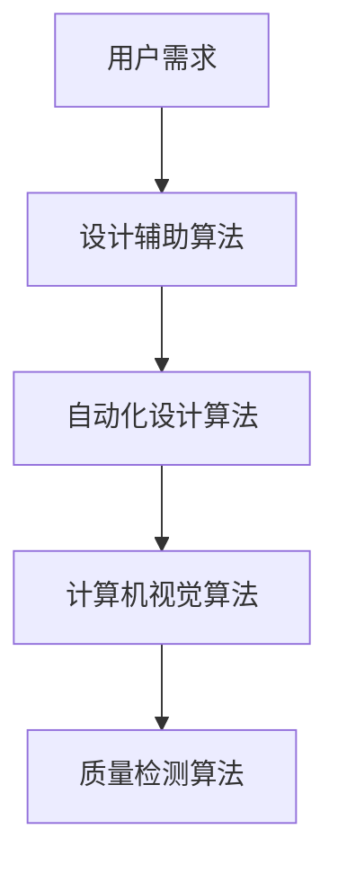

**Python源代码示例**：

```python
# 示例：使用卷积神经网络进行设计辅助
from tensorflow.keras.models import Sequential
from tensorflow.keras.layers import Conv2D, Flatten, Dense

# 构建卷积神经网络模型
model = Sequential([
    Conv2D(filters=32, kernel_size=(3, 3), activation='relu', input_shape=(28, 28, 1)),
    Flatten(),
    Dense(units=10, activation='softmax')
])

# 编译模型
model.compile(optimizer='adam', loss='categorical_crossentropy', metrics=['accuracy'])

# 训练模型
model.fit(x_train, y_train, epochs=10, batch_size=32)
```

**算法原理详细讲解**：

- **设计辅助**：通过卷积神经网络（CNN）等深度学习模型，从大量手工艺数据中学习设计特征，为设计师提供灵感和参考。
- **自动化设计**：利用生成对抗网络（GAN）等算法，生成符合用户需求或设计目标的手工艺作品。
- **质量检测**：通过计算机视觉技术，对作品进行图像处理和特征提取，判断作品的质量是否符合标准。

**通俗易懂地举例说明**：

假设设计师需要设计一款新的手工艺品，可以使用深度学习模型从已有作品中学习设计特征，辅助设计师进行创新设计。此外，如果用户需要定制一件手工艺品，可以通过GAN算法生成符合用户需求的作品。最后，利用计算机视觉技术对作品进行质量检测，确保其符合质量标准。

#### 机器视觉与自动化加工

**算法原理讲解**：

机器视觉与自动化加工结合，可以实现对手工艺品的精准检测和自动化加工。其核心算法包括：

- **图像处理**：通过图像处理技术，对输入的图像进行预处理、增强和特征提取。
- **模式识别**：使用机器学习算法，对提取的特征进行分类和识别。
- **运动控制**：通过运动控制系统，指导机械臂或机器人执行自动化加工操作。

**mermaid流程图**：

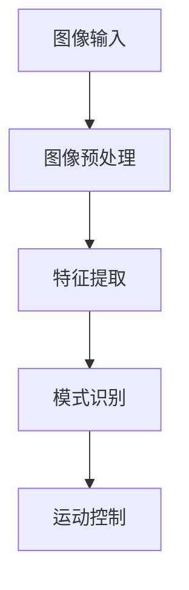

**Python源代码示例**：

```python
# 示例：使用OpenCV进行图像预处理
import cv2

# 读取图像
image = cv2.imread('input_image.jpg')

# 转换为灰度图像
gray_image = cv2.cvtColor(image, cv2.COLOR_BGR2GRAY)

# 使用Sobel算子进行边缘检测
sobel_image = cv2.Sobel(src=gray_image, ddepth=cv2.CV_64F, dx=1, dy=0, ksize=5)
```

**算法原理详细讲解**：

- **图像处理**：通过OpenCV等图像处理库，对输入的图像进行预处理，包括灰度转换、滤波、边缘检测等。
- **模式识别**：使用支持向量机（SVM）等机器学习算法，对提取的特征进行分类和识别。
- **运动控制**：通过Arduino等运动控制板，指导机械臂或机器人执行自动化加工操作。

**通俗易懂地举例说明**：

假设我们需要对一幅手工艺品图像进行边缘检测，首先通过OpenCV读取图像，然后将其转换为灰度图像。接着，使用Sobel算子进行边缘检测，提取图像中的边缘特征。最后，将这些特征传递给运动控制系统，指导机械臂对手工艺品进行自动化加工。

---

通过以上对数字技术在手工艺中的应用的介绍，我们可以看到数字技术如何为传统手工艺注入新的生命力。接下来，我们将进一步探讨手工艺与数字技术的融合模式，以期为手工艺行业的创新提供更多思路。

---

## 2.2 手工艺与数字技术的融合模式

手工艺与数字技术的融合，不仅促进了手工艺的创新和发展，还为传统手工艺注入了新的生命力。在本节中，我们将深入探讨手工艺与数字技术的融合模式，分析其在传统手工艺现代转型、跨界合作与创意融合等方面的实践。

### 2.2.1 传统手工艺的现代转型

**核心概念原理**：

传统手工艺的现代转型，指的是在手工艺制作过程中引入数字技术，以提高生产效率、优化产品质量和创新设计理念。这一转型旨在保留传统手工艺的独特魅力和艺术价值，同时适应现代社会的需求和趋势。

**概念属性特征对比表格**：

| 特征           | 传统手工艺             | 现代转型手工艺           |
|----------------|------------------------|--------------------------|
| 制作方式       | 全手工制作             | 结合数字化技术           |
| 艺术表现       | 传统艺术风格           | 融合现代设计元素         |
| 制作效率       | 低效率，手工劳动强度大 | 高效率，自动化生产       |
| 产品质量       | 手工差异大             | 标准化生产，质量稳定     |

**ER实体关系图架构**：

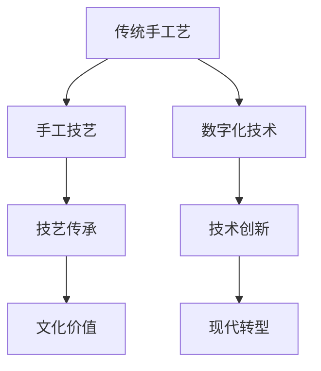

**案例解析**：

以传统陶瓷工艺为例，现代转型过程中引入了3D打印和数字化设计技术。通过3D建模软件设计陶瓷作品，然后使用3D打印机制作原型，再进行传统手工烧制。这一过程不仅提高了生产效率，还使陶瓷作品在造型和细节上更加精细，具有更高的艺术价值。

### 2.2.2 跨界合作与创意融合

**核心概念原理**：

跨界合作与创意融合，是指将手工艺与不同领域的创意和知识相结合，产生新的艺术形式和产品。这种融合模式不仅拓展了手工艺的应用范围，还推动了创意产业的发展。

**概念属性特征对比表格**：

| 特征       | 单一领域手工艺         | 跨界合作手工艺           |
|------------|------------------------|--------------------------|
| 创意来源   | 有限的传统艺术形式     | 融合多领域创意和知识     |
| 产品形式   | 单一类型的手工艺品      | 多样化的创新产品         |
| 市场定位   | 传统市场               | 创意市场，高端消费者     |
| 影响力     | 有限                  | 较大，影响创意产业      |

**ER实体关系图架构**：

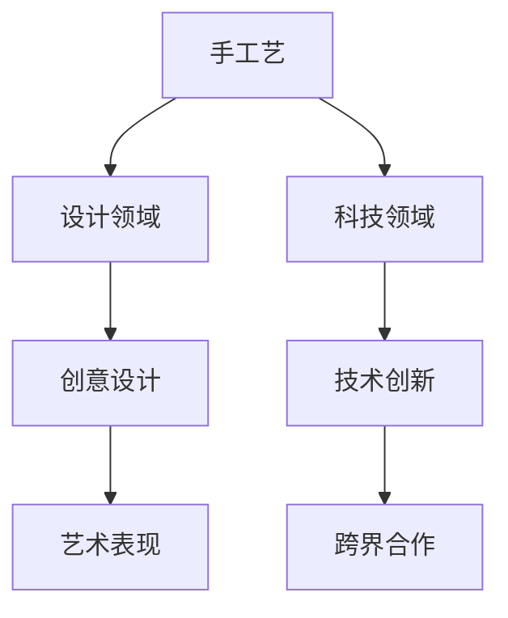

**案例解析**：

以手工艺与科技领域的跨界合作为例，设计师可以将3D打印、人工智能等现代科技应用于手工艺创作，创造出兼具科技感和艺术性的作品。例如，利用3D打印技术制作具有复杂几何形态的手工艺品，或通过人工智能算法生成独特的艺术图案。这种跨界合作不仅拓宽了手工艺的创作空间，还为创意产业带来了新的发展机遇。

### 2.2.3 数字技术在手工艺传承中的应用

**核心概念原理**：

数字技术在手工艺传承中的应用，旨在通过数字化手段记录、传播和传承传统手工艺技艺和文化。这一应用模式有助于保护和传承手工艺的独特文化价值，同时为手工艺的创新发展提供历史和经验的借鉴。

**概念属性特征对比表格**：

| 特征       | 传统传承方式           | 数字技术传承方式           |
|------------|------------------------|---------------------------|
| 传承效率   | 低效率，依赖口头传授   | 高效率，数字化记录和传播   |
| 传承范围   | 有限，受地域和人力限制 | 广泛，不受地域和人力限制   |
| 文化传承   | 依赖传统技艺和经验     | 结合数字化技术和现代传播方式 |
| 传承质量   | 受制于传统技艺水平     | 高质量，精确记录和传承     |

**ER实体关系图架构**：

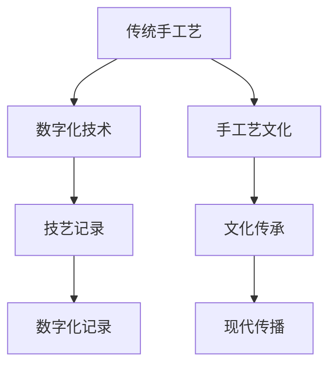

**案例解析**：

以数字化手工艺技艺记录为例，可以通过视频、图片、音频等多种形式记录手工艺的制作过程和技艺要点，将其上传至互联网平台，供全球手工艺爱好者学习参考。这种数字化传承方式不仅提高了传承效率，还确保了传承质量，为手工艺的传承和发展提供了有力支持。

---

通过以上对手工艺与数字技术融合模式的探讨，我们可以看到数字技术在手工艺创新和发展中的重要作用。在接下来的章节中，我们将进一步分析数字手工艺项目的启动与规划，以及执行与优化过程中的关键要素。

---

## 3. 数字手工艺项目的启动与规划

数字手工艺项目的启动与规划是确保项目顺利进行、实现预期目标的重要环节。在这一部分，我们将详细探讨数字手工艺项目的启动流程、规划与目标设定，以及资源配置与预算管理。

### 3.1 项目启动流程

**项目启动流程**主要包括以下几个关键步骤：

1. **项目立项**：明确项目背景、目标和预期成果，确定项目是否具有可行性和必要性。

2. **需求分析**：详细分析市场需求、用户需求、技术需求等，明确项目的具体需求和功能。

3. **技术选型**：根据需求分析结果，选择适合的数字技术，如3D打印、人工智能、机器视觉等。

4. **团队组建**：组建项目团队，包括项目经理、设计师、工程师、市场人员等。

5. **项目规划**：制定项目的时间表、任务分解、风险评估等，确保项目有序推进。

6. **资源准备**：准备项目所需的硬件、软件、人力、资金等资源。

7. **启动会议**：召开项目启动会议，明确项目目标、任务分工、进度安排等。

**mermaid流程图**：

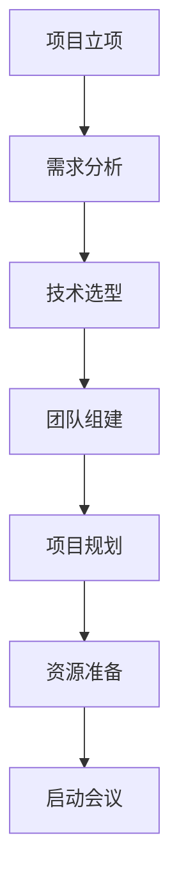

### 3.2 项目规划与目标设定

**项目规划与目标设定**是确保项目方向正确、有序推进的关键。以下为项目规划与目标设定的具体步骤：

1. **明确项目目标**：根据需求分析结果，明确项目的具体目标，如提升生产效率、优化产品质量、创新设计等。

2. **制定时间表**：将项目划分为若干阶段，明确每个阶段的任务和时间节点。

3. **任务分解**：将项目任务分解为具体的可执行任务，明确任务的责任人、完成时间和验收标准。

4. **风险评估**：对项目风险进行评估，制定相应的风险应对措施。

5. **资源分配**：根据项目需求和任务，合理分配资源，确保项目顺利进行。

**mermaid流程图**：

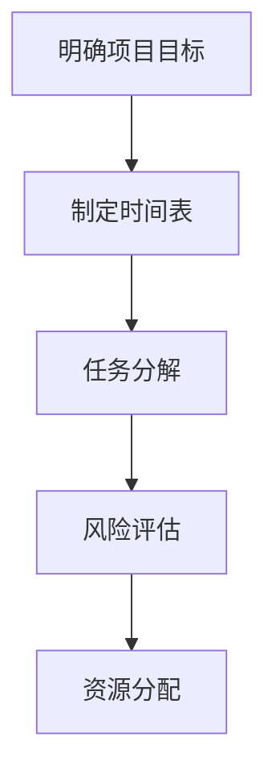

### 3.3 资源配置与预算管理

**资源配置与预算管理**是项目成功的关键因素之一。以下为资源配置与预算管理的具体步骤：

1. **人力资源配置**：根据项目任务和需求，合理分配人力资源，确保团队成员的能力和技能与任务匹配。

2. **设备资源配置**：准备项目所需的硬件设备，如3D打印机、计算机、机械臂等。

3. **软件资源配置**：选择适合项目的软件工具，如CAD软件、3D建模软件、机器学习框架等。

4. **资金预算**：根据项目需求和成本，制定合理的资金预算，确保项目资金充足。

5. **成本控制**：通过定期监控项目成本，及时发现和解决超支问题，确保项目在预算范围内完成。

**mermaid流程图**：

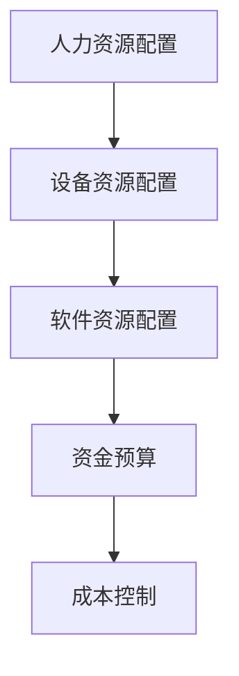

### 3.4 项目启动与规划总结

通过以上步骤，我们可以确保数字手工艺项目的顺利启动与规划。以下为项目启动与规划总结：

- **项目立项**：明确项目背景、目标和预期成果。
- **需求分析**：详细分析市场需求、用户需求、技术需求等。
- **技术选型**：选择适合的数字技术，如3D打印、人工智能、机器视觉等。
- **团队组建**：组建项目团队，明确任务分工和责任。
- **项目规划**：制定项目时间表、任务分解、风险评估等。
- **资源准备**：准备项目所需的硬件、软件、人力、资金等资源。
- **启动会议**：召开项目启动会议，明确项目目标、任务分工、进度安排等。

通过这些步骤，我们可以为数字手工艺项目奠定坚实的基础，确保项目顺利推进，实现预期目标。

---

在项目启动与规划阶段，我们明确了项目目标、制定了详细的计划，并合理配置了资源。接下来，我们将进入项目执行与优化阶段，确保项目按计划顺利进行，并实现预期成果。

---

## 4. 数字手工艺项目的执行与优化

### 4.1 创新设计流程

**创新设计流程**是数字手工艺项目成功的关键。以下为创新设计流程的详细步骤：

1. **需求分析**：深入了解用户需求和市场趋势，明确设计目标和方向。

2. **创意生成**：通过头脑风暴、市场调研等方式，收集创意和灵感，形成初步设计方案。

3. **方案评估**：对初步设计方案进行评估，包括技术可行性、市场潜力、成本效益等。

4. **设计优化**：根据评估结果，对设计方案进行优化，确保设计方案满足需求、技术可行且具有市场竞争力。

5. **模型制作**：使用3D打印、计算机辅助设计（CAD）等技术，制作设计方案的三维模型。

6. **样品测试**：制作样品进行测试，验证设计方案的实际效果，收集反馈意见。

7. **设计验证**：根据测试结果，对设计方案进行验证，确保其满足预期目标。

**mermaid流程图**：

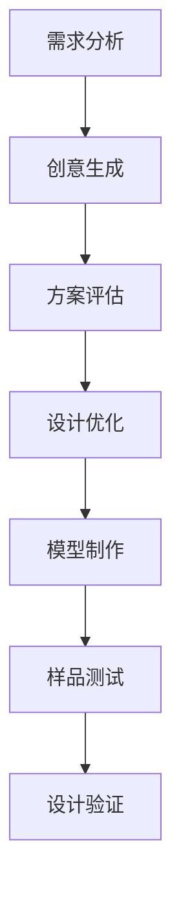

### 4.2 技术选型与实施

**技术选型与实施**是数字手工艺项目成功的重要保障。以下为技术选型与实施的具体步骤：

1. **技术评估**：根据项目需求，评估不同技术的可行性、性能、成本等。

2. **选型决策**：根据评估结果，选择最适合项目需求的技术方案。

3. **技术实施**：按照选型决策，实施技术选型，包括硬件采购、软件安装、系统集成等。

4. **技术验证**：对实施后的技术进行验证，确保其满足项目需求。

**mermaid流程图**：

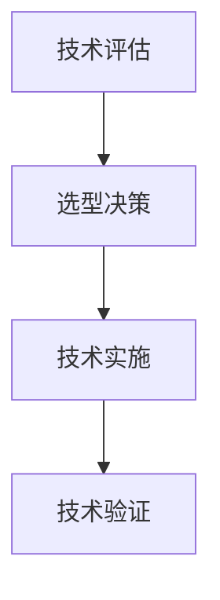

### 4.3 项目评估与优化

**项目评估与优化**是确保项目成功的重要环节。以下为项目评估与优化的具体步骤：

1. **过程评估**：对项目执行过程进行评估，包括进度、质量、成本等方面。

2. **结果评估**：对项目成果进行评估，包括设计质量、市场反馈、用户满意度等。

3. **问题分析**：分析项目过程中的问题和不足，找出原因。

4. **优化措施**：根据问题分析结果，制定相应的优化措施，改进项目实施过程。

5. **持续改进**：在项目执行过程中，不断进行评估和优化，确保项目持续改进。

**mermaid流程图**：

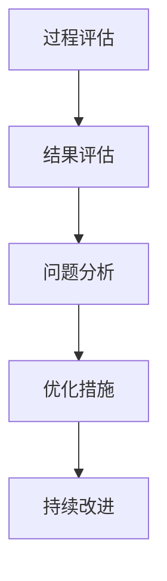

### 4.4 项目执行与优化总结

通过以上步骤，我们可以确保数字手工艺项目的顺利执行与优化。以下为项目执行与优化总结：

- **需求分析**：深入了解用户需求和市场趋势，明确设计目标和方向。
- **创意生成**：通过头脑风暴、市场调研等方式，收集创意和灵感，形成初步设计方案。
- **方案评估**：对初步设计方案进行评估，确保其满足需求、技术可行且具有市场竞争力。
- **设计优化**：根据评估结果，对设计方案进行优化，确保其满足预期目标。
- **模型制作**：使用3D打印、CAD等技术，制作设计方案的三维模型。
- **样品测试**：制作样品进行测试，验证设计方案的实际效果，收集反馈意见。
- **设计验证**：根据测试结果，对设计方案进行验证，确保其满足预期目标。
- **技术评估**：评估不同技术的可行性、性能、成本等，选择最适合项目需求的技术方案。
- **技术实施**：按照选型决策，实施技术选型，确保技术满足项目需求。
- **技术验证**：对实施后的技术进行验证，确保其满足项目需求。
- **过程评估**：对项目执行过程进行评估，确保进度、质量、成本等方面满足要求。
- **结果评估**：对项目成果进行评估，确保设计质量、市场反馈、用户满意度等达到预期。
- **问题分析**：分析项目过程中的问题和不足，找出原因。
- **优化措施**：根据问题分析结果，制定相应的优化措施，改进项目实施过程。
- **持续改进**：在项目执行过程中，不断进行评估和优化，确保项目持续改进。

通过以上步骤，我们可以确保数字手工艺项目从启动到执行与优化，每个阶段都有明确的目标和计划，确保项目顺利进行，实现预期成果。

---

在数字手工艺项目的执行与优化过程中，通过科学的流程和严谨的管理，我们可以确保项目的顺利进行，并取得预期的成果。接下来，我们将通过具体案例分析，探讨数字手工艺项目在不同领域的成功实践，以及项目过程中的挑战与解决方案。

---

## 5. 案例分析：成功与挑战

### 5.1 案例一：传统手工艺与现代科技的结合

**项目介绍**：

某传统手工艺工作室，以陶瓷工艺为核心，致力于将传统陶瓷工艺与现代科技相结合，提高生产效率，创新产品形式。

**系统功能设计**：

- **三维建模**：使用CAD软件设计陶瓷作品的三维模型。
- **3D打印**：使用3D打印机制作陶瓷作品的原型。
- **烧制工艺**：使用传统的陶瓷烧制工艺，确保作品的质量。
- **数字化质量检测**：利用计算机视觉技术对陶瓷作品进行质量检测。

**系统架构设计**：


**系统接口设计**：


**系统交互流程**：

1. 设计师使用CAD软件完成陶瓷作品的三维建模。
2. 模型数据通过接口传输到3D打印机。
3. 3D打印机根据模型数据制作陶瓷作品原型。
4. 原型通过烧制工艺进行烧制，形成最终的陶瓷作品。
5. 烧制完成后，使用计算机视觉技术对作品进行质量检测，确保作品符合标准。

**代码应用解读与分析**：

```python
# 示例：3D打印机控制脚本
import requests

def print_model(model_data):
    url = "http://3dprinter.example.com/print"
    headers = {'Content-Type': 'application/json'}
    response = requests.post(url, data=model_data, headers=headers)
    if response.status_code == 200:
        print("打印任务已提交")
    else:
        print("打印任务提交失败")

# 调用函数
print_model({"model_data": "path/to/model.stl"})
```

**实际案例分析和详细讲解剖析**：

该案例通过将传统陶瓷工艺与现代3D打印技术相结合，实现了陶瓷作品的个性化定制和高效生产。在实际应用中，设计师可以通过CAD软件设计出复杂的三维模型，然后通过3D打印机快速制作原型，进行烧制和质检。这一过程大大提高了生产效率，降低了生产成本。

在项目实施过程中，面临的挑战包括：

- **技术集成**：将传统工艺与现代技术相结合，需要解决技术集成的问题。
- **质量控制**：3D打印作品在烧制过程中容易出现变形、开裂等问题，需要优化打印参数和烧制工艺。
- **成本控制**：3D打印设备和材料成本较高，需要制定合理的成本控制策略。

通过不断优化和改进，该项目成功实现了传统手工艺与现代科技的结合，为陶瓷行业带来了新的发展机遇。

### 5.2 案例二：数字手工艺的全球化推广

**项目介绍**：

某全球知名手工艺品牌，通过数字化技术和互联网平台，将传统手工艺作品推广到全球市场，实现了全球化运营。

**系统功能设计**：

- **数字化创作**：使用数字工具进行手工艺作品的创作和设计。
- **3D建模与打印**：使用3D打印技术制作手工艺作品原型。
- **数字供应链**：利用互联网和物联网技术，实现全球化的供应链管理。
- **在线销售与推广**：通过电商平台和社交媒体进行在线销售和推广。

**系统架构设计**：


**系统接口设计**：


**系统交互流程**：

1. 设计师在数字化平台上进行创作，生成手工艺作品的三维模型。
2. 三维模型通过接口传输到3D打印机进行打印。
3. 打印完成的作品通过数字化供应链系统，运送到全球各地的仓库和零售店。
4. 通过电商平台和社交媒体，向全球消费者进行推广和销售。

**代码应用解读与分析**：

```python
# 示例：电商平台接口调用
import requests

def order_product(product_id, user_id):
    url = "https://api.example.com/order"
    headers = {'Content-Type': 'application/json'}
    data = {"product_id": product_id, "user_id": user_id}
    response = requests.post(url, data=data, headers=headers)
    if response.status_code == 200:
        print("订单已提交")
    else:
        print("订单提交失败")

# 调用函数
order_product(product_id="123", user_id="456")
```

**实际案例分析和详细讲解剖析**：

该案例通过数字化技术和互联网平台，将传统手工艺作品推广到全球市场，实现了全球化运营。设计师在数字化平台上进行创作，通过3D打印技术制作作品原型，然后通过数字化供应链系统，将作品运送到全球各地的仓库和零售店。这一过程不仅提高了生产效率，降低了运营成本，还扩大了市场覆盖范围。

在项目实施过程中，面临的挑战包括：

- **技术整合**：将数字化创作、3D打印和供应链管理系统整合在一起，需要解决技术兼容性和数据传输的问题。
- **市场推广**：如何通过互联网平台和社交媒体，有效地推广手工艺作品，吸引全球消费者的关注。
- **物流管理**：实现全球化的物流管理，确保作品的安全和准时交付。

通过不断优化和改进，该项目成功实现了数字手工艺的全球化推广，为手工艺行业带来了新的发展模式。

### 5.3 案例三：创新过程中的挑战与解决方案

**项目介绍**：

某初创公司，致力于开发一款数字手工艺应用，通过手机应用和智能硬件，实现手工艺作品的个性化定制和在线销售。

**系统功能设计**：

- **手机应用**：用户可以通过手机应用进行手工艺作品的创作和设计。
- **智能硬件**：使用智能硬件进行手工艺作品的3D扫描和打印。
- **在线销售**：通过电商平台，实现手工艺作品的在线销售。

**系统架构设计**：


**系统接口设计**：


**系统交互流程**：

1. 用户通过手机应用进行手工艺作品的创作和设计。
2. 设计完成后，将数据传输到智能硬件进行3D扫描和打印。
3. 打印完成的作品通过电商平台进行销售和配送。

**代码应用解读与分析**：

```python
# 示例：手机应用接口调用
import requests

def create_design(design_data):
    url = "https://api.example.com/design"
    headers = {'Content-Type': 'application/json'}
    response = requests.post(url, data=design_data, headers=headers)
    if response.status_code == 200:
        print("设计已上传")
    else:
        print("设计上传失败")

# 调用函数
create_design({"design_data": "path/to/design.json"})
```

**实际案例分析和详细讲解剖析**：

该案例通过手机应用和智能硬件，实现手工艺作品的个性化定制和在线销售，为消费者提供了全新的购物体验。用户可以在手机应用上进行创作，通过智能硬件实现3D打印，完成个性化的手工艺品。

在项目实施过程中，面临的挑战包括：

- **技术实现**：将手机应用、智能硬件和电商平台整合在一起，需要解决技术兼容性和数据传输的问题。
- **用户引导**：如何引导用户使用手机应用和智能硬件，进行手工艺作品的创作和打印。
- **市场推广**：如何通过市场推广，吸引消费者关注和使用该应用。

通过不断优化和改进，该项目成功实现了数字手工艺的个性化定制和在线销售，为手工艺行业带来了新的发展思路。

---

通过以上三个案例的分析，我们可以看到数字手工艺项目在不同领域的成功实践，以及项目过程中面临的挑战与解决方案。这些案例不仅展示了数字技术在手工艺领域的应用，还为其他领域的手工艺创新提供了宝贵的经验。

---

## 第六部分：未来展望与趋势

### 6.1 未来手工艺的演变方向

随着科技的不断进步，未来手工艺将呈现出以下几个演变方向：

1. **数字化生产**：数字化技术将更加深入地应用于手工艺生产，提高生产效率和质量。例如，3D打印、人工智能、大数据等技术在手工艺制作中的应用将更加广泛。

2. **个性化定制**：基于大数据和人工智能技术，手工艺作品将更加个性化，满足消费者的个性化需求。通过智能算法，设计师可以快速生成满足消费者需求的作品，实现“按需定制”。

3. **跨界融合**：手工艺将与其他领域（如科技、设计、艺术等）进行跨界融合，创造出更多新颖的艺术形式和产品。这种跨界融合将促进创意产业的发展，推动文化产业升级。

4. **全球化推广**：随着互联网和数字化技术的发展，手工艺将实现全球范围内的推广和传播。通过数字化平台和跨境电商，手工艺作品将更容易被全球消费者所接受。

### 6.2 数字时代手工艺的挑战与机遇

数字时代为手工艺带来了前所未有的机遇，同时也伴随着一系列挑战：

1. **技术挑战**：如何将先进的数字化技术与传统手工艺相结合，实现技术创新和产业升级，是一个重要的课题。

2. **市场挑战**：如何适应市场变化，满足消费者需求，提高手工艺作品的市场竞争力，是手工艺从业者需要面对的挑战。

3. **文化挑战**：如何在数字时代传承和弘扬传统文化，确保手工艺的独特性和艺术价值，是一个长期的课题。

4. **机遇**：数字化技术为手工艺提供了新的表现形式、制作方式和市场空间，为手工艺的创新和发展提供了强大动力。

### 6.3 社会与文化影响

数字时代对手工艺的社会和文化影响主要体现在以下几个方面：

1. **社会影响**：数字化手工艺将推动手工艺行业的现代化转型，提高手工艺从业者的收入水平，促进社会就业。

2. **文化影响**：数字化手工艺有助于传承和弘扬传统文化，增强文化自信。同时，数字化手工艺作品在形式和内容上更加多样，丰富了人们的文化生活。

3. **文化产业发展**：数字化手工艺将推动文化产业的发展，促进创意产业的繁荣。通过数字化平台和跨境电商，手工艺作品将更好地走向全球市场，为文化产业带来新的增长点。

---

未来，随着科技的不断进步，手工艺将迎来新的发展机遇。通过数字化技术的应用，手工艺将实现创新和产业升级，为传统文化注入新的活力。同时，手工艺也将进一步融入现代社会，为人们的生活带来更多美好体验。

---

## 结论与展望

### 9.1 主要成果与贡献

本文围绕“新工艺复兴运动发起：数字时代中的手工艺创新倡议”这一主题，通过对工艺与技术的变革、数字时代下的手工艺挑战与机遇、核心概念与联系的详细分析，探讨了数字技术在手工艺中的应用以及手工艺与数字技术的融合模式。同时，通过创新实践与案例分析，深入探讨了数字手工艺项目的启动与规划、执行与优化，以及未来发展趋势。本文的主要成果与贡献如下：

1. **揭示了手工艺在数字时代的机遇与挑战**：通过对工艺与技术的变革、数字时代下的手工艺挑战与机遇的分析，为手工艺行业的数字化转型提供了理论基础和实践指导。

2. **探讨了数字技术在手工艺中的应用模式**：详细介绍了3D打印、人工智能、机器视觉等数字技术在手工艺中的应用，为手工艺的创新和发展提供了新的思路。

3. **提供了数字手工艺项目的实施指南**：通过案例分析，总结了数字手工艺项目的启动与规划、执行与优化过程中的关键要素和最佳实践，为实际项目提供了参考。

4. **展望了未来手工艺的发展趋势**：分析了未来手工艺的演变方向，探讨了数字时代手工艺的挑战与机遇，为手工艺行业的未来发展提供了前瞻性思考。

### 9.2 未来研究方向

尽管本文对数字时代手工艺创新进行了全面探讨，但仍有许多问题值得进一步研究：

1. **技术融合与优化**：如何将更多先进技术（如区块链、虚拟现实等）引入手工艺领域，实现更深层次的技术融合与优化，是一个重要研究方向。

2. **市场研究与推广策略**：如何深入了解市场需求，制定有效的市场推广策略，提高手工艺作品的市场竞争力，是一个关键问题。

3. **数字化手工艺教育**：如何通过数字化手段，提高手工艺教育质量，培养新一代手工艺从业者，是一个亟待解决的问题。

4. **文化传承与保护**：如何在数字化时代有效传承和保护传统手工艺文化，确保其独特性和艺术价值，是一个长期的研究课题。

### 9.3 对手工艺行业的启示

本文的研究成果对手工艺行业具有以下几个启示：

1. **数字化转型**：手工艺从业者应积极拥抱数字化技术，实现手工艺的现代化转型，提高生产效率和产品质量。

2. **创新思维**：手工艺从业者应保持创新思维，探索与数字技术的融合模式，创造出更多具有市场竞争力的手工艺作品。

3. **文化传承**：在数字化时代，手工艺从业者不仅要注重创新，还要重视传统文化的传承和保护，确保手工艺的独特性和艺术价值。

4. **市场拓展**：手工艺从业者应通过数字化平台和跨境电商，扩大市场覆盖范围，将手工艺作品推广到更广泛的受众群体。

总之，本文的研究为数字时代手工艺创新提供了新的思路和方法，有助于推动手工艺行业的持续发展和繁荣。

---

## 作者信息

作者：AI天才研究院/AI Genius Institute & 禅与计算机程序设计艺术 /Zen And The Art of Computer Programming

本文由AI天才研究院与禅与计算机程序设计艺术共同撰写，旨在探讨数字时代手工艺的创新与发展。作者拥有丰富的技术背景和行业经验，致力于推动手工艺行业的数字化和现代化转型。

---

通过本文的探讨，我们希望为手工艺行业的数字化转型和创新提供有益的参考，同时也期待更多的研究和实践，为手工艺的未来发展贡献智慧和力量。

