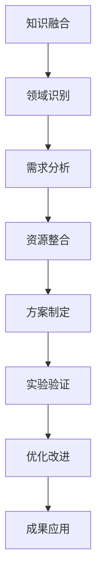
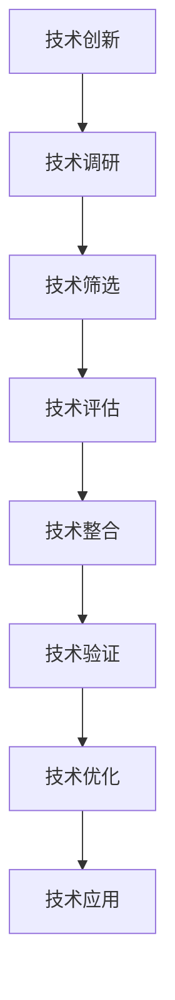
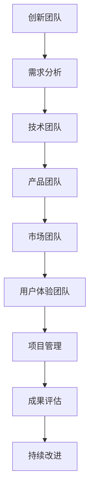

                 

# 新文艺复兴2.0：跨界创新的时代

## 关键词
- 新文艺复兴2.0
- 跨界创新
- 时代特征
- 知识融合
- 技术创新
- 组织协同

## 摘要
本文旨在探讨新文艺复兴2.0时代的到来及其对跨界创新的推动作用。通过对新文艺复兴2.0时代的定义、背景、影响，以及跨界创新的概念、特点、原理和过程进行详细分析，本文揭示了跨界创新在当前时代的重要性和实际应用。文章还探讨了跨界创新的未来发展趋势，为读者提供了有价值的思考和借鉴。

### 引言与背景

#### 1.1.1 新文艺复兴1.0时代

**定义**
新文艺复兴1.0时代，通常指的是14世纪到17世纪欧洲的一场文化和思想的复兴运动。它以古希腊和罗马文化为灵感来源，推动了艺术、文学、哲学、科学等多个领域的繁荣。

**背景**
随着中世纪的结束，欧洲进入了一个思想开放、文化多元的时期。这一时期，城市化进程加快，商业和手工业蓬勃发展，为文化和艺术的繁荣提供了经济基础。

**影响**
新文艺复兴1.0时代不仅推动了欧洲文化和艺术的发展，也促进了科学和技术的进步，为后来的工业革命奠定了基础。

#### 1.1.2 新文艺复兴2.0时代

**定义**
新文艺复兴2.0时代，可以理解为21世纪全球化背景下的一次文化和思想的复兴。它以信息技术、人工智能、生物技术等前沿科技为推动力，跨越国界和文化的限制，推动人类社会向更高层次的发展。

**背景**
21世纪，全球化进程不断加快，各国之间的文化交流和互动日益频繁。同时，信息技术的飞速发展，使得知识传播和交流变得更加便捷，为文化的多元化提供了可能。

**影响**
新文艺复兴2.0时代，不仅推动了艺术、文学、哲学等领域的创新，也为人类社会的可持续发展提供了新的思路和路径。

#### 1.2 核心概念与联系

**1.2.1 跨界创新**

**定义**
跨界创新，指的是将不同领域、不同行业的知识、技术和方法相结合，创造新的价值和服务。

**特点**
- **多元化**：跨界创新涉及到多个领域，具有多元化的特点。
- **协同性**：跨界创新需要不同领域的专家和团队协同合作。
- **创新性**：跨界创新往往能够产生新的思想和方法，推动科技进步。

**1.2.2 时代特征**

**多元化**
新文艺复兴2.0时代，文化、艺术、科技等领域相互交融，形成了一个多元、开放、创新的时代。

**协同性**
在这个时代，跨界创新需要不同领域的专家和团队协同合作，共同推动社会进步。

**创新性**
新文艺复兴2.0时代，信息技术、人工智能等前沿科技的发展，为跨界创新提供了强大的动力。

### 第1章: 引言与背景

#### 1.1 问题背景

**1.1.1 新文艺复兴1.0时代**

**1.1.1.1 定义**
新文艺复兴1.0时代，通常指的是14世纪到17世纪欧洲的一场文化和思想的复兴运动。它以古希腊和罗马文化为灵感来源，推动了艺术、文学、哲学、科学等多个领域的繁荣。

**1.1.1.2 背景**
随着中世纪的结束，欧洲进入了一个思想开放、文化多元的时期。这一时期，城市化进程加快，商业和手工业蓬勃发展，为文化和艺术的繁荣提供了经济基础。

**1.1.1.3 影响**
新文艺复兴1.0时代不仅推动了欧洲文化和艺术的发展，也促进了科学和技术的进步，为后来的工业革命奠定了基础。

**1.1.2 新文艺复兴2.0时代**

**1.1.2.1 定义**
新文艺复兴2.0时代，可以理解为21世纪全球化背景下的一次文化和思想的复兴。它以信息技术、人工智能、生物技术等前沿科技为推动力，跨越国界和文化的限制，推动人类社会向更高层次的发展。

**1.1.2.2 背景**
21世纪，全球化进程不断加快，各国之间的文化交流和互动日益频繁。同时，信息技术的飞速发展，使得知识传播和交流变得更加便捷，为文化的多元化提供了可能。

**1.1.2.3 影响**
新文艺复兴2.0时代，不仅推动了艺术、文学、哲学等领域的创新，也为人类社会的可持续发展提供了新的思路和路径。

### 第2章: 跨界创新的原理

#### 2.1 跨界创新的定义与特点

**2.1.1 定义**
跨界创新，指的是将不同领域、不同行业的知识、技术和方法相结合，创造新的价值和服务。

**2.1.1.1 跨界创新的定义**
跨界创新是指将不同领域、不同行业的知识、技术和方法相结合，创造新的价值和服务的过程。

**2.1.1.2 跨界创新的特点**
- **多元化**：跨界创新涉及到多个领域，具有多元化的特点。
- **协同性**：跨界创新需要不同领域的专家和团队协同合作。
- **创新性**：跨界创新往往能够产生新的思想和方法，推动科技进步。

**2.1.2 跨界创新的原理**

**2.1.2.1 知识融合**
知识融合是跨界创新的核心原理之一。通过将不同领域的知识相结合，可以创造出新的解决方案和产品。

**2.1.2.2 技术创新**
技术创新是跨界创新的动力。通过引入新的技术，可以提升产品和服务的性能，创造新的市场机会。

**2.1.2.3 组织协同**
组织协同是跨界创新的保障。通过构建跨领域的合作团队，可以实现资源的最优配置，提高创新的效率。

### 第3章: 跨界创新的过程

#### 3.1 跨界创新的发起阶段

**3.1.1 需求识别**
在发起阶段，首先需要识别跨界创新的潜在需求。这可以通过市场调研、用户访谈等方式实现。

**3.1.2 方案构思**
基于需求识别的结果，构思跨界创新的方案。这包括确定跨界创新的领域、目标、方法和步骤等。

**3.1.3 跨界合作**
在方案构思完成后，需要寻找合适的合作伙伴，共同推进跨界创新项目的实施。

#### 3.2 跨界创新的实施阶段

**3.2.1 实验验证**
在实施阶段，需要对跨界创新方案进行实验验证，以验证其可行性和有效性。

**3.2.2 模型构建**
通过实验验证后，需要构建跨界创新的模型，以实现跨界创新的商业化应用。

**3.2.3 验证优化**
在模型构建完成后，需要对跨界创新的模型进行验证和优化，以提高其性能和效果。

#### 3.3 跨界创新的推广阶段

**3.3.1 商业化推广**
在推广阶段，需要对跨界创新的产品或服务进行商业化推广，以实现跨界创新的商业化应用。

**3.3.2 市场反馈**
在商业化推广过程中，需要收集市场反馈，以不断优化和改进跨界创新的产品或服务。

**3.3.3 持续创新**
跨界创新是一个持续的过程，需要不断进行创新和改进，以适应市场的变化和需求。

### 第4章: 跨界创新的案例分析

#### 4.1 案例一：亚马逊AWS

**背景**  
亚马逊AWS是一个跨界的成功案例。亚马逊作为一家电子商务公司，通过引入云计算技术，成功转型为云计算服务提供商。

**过程**  
亚马逊AWS的跨界创新过程可以分为三个阶段：

1. **需求识别**：亚马逊通过用户调研和数据分析，发现云计算服务有巨大的市场需求。
2. **方案构思**：亚马逊决定利用自身的电子商务平台和技术积累，打造一款具有竞争力的云计算服务。
3. **实施与推广**：亚马逊AWS在技术上不断优化，同时通过市场营销和客户服务，成功吸引了大量用户。

**成果**  
亚马逊AWS已经成为全球领先的云计算服务提供商，其市场份额和影响力持续增长。

#### 4.2 案例二：华为鸿蒙OS

**背景**  
华为鸿蒙OS是华为公司推出的一个跨界的操作系统。华为作为一家通信设备制造商，通过引入操作系统技术，成功转型为操作系统提供商。

**过程**  
华为鸿蒙OS的跨界创新过程可以分为三个阶段：

1. **需求识别**：华为通过市场调研和用户反馈，发现用户需要一个更加智能、更加开放的操作系统。
2. **方案构思**：华为决定利用自身的通信技术和软件能力，打造一款具有自主知识产权的操作系统。
3. **实施与推广**：华为鸿蒙OS在技术上不断优化，同时通过合作伙伴生态的建立，成功吸引了大量用户和应用开发者。

**成果**  
华为鸿蒙OS已经成为全球知名的操作系统，其在智能家居、物联网等领域的应用不断扩大。

### 第5章: 跨界创新的未来展望

#### 5.1 新技术的影响

随着人工智能、区块链、物联网等新技术的不断发展，跨界创新的领域和方式也将不断拓展。这些新技术为跨界创新提供了新的工具和平台，使得跨界创新变得更加可行和高效。

#### 5.2 产业融合的趋势

随着跨界创新的深入发展，不同产业之间的融合趋势将更加明显。例如，传统制造业与互联网、人工智能的融合，将带来新的产业形态和商业模式。

#### 5.3 社会影响的扩大

跨界创新不仅推动了技术和产业的发展，也对社会产生了深远的影响。例如，跨界创新促进了社会治理的智能化，提高了社会运作的效率。

### 结论

新文艺复兴2.0时代，跨界创新已经成为推动社会进步的重要力量。通过跨界创新，不同领域的知识、技术和方法得以融合，创造出新的价值和服务。未来，随着新技术的不断发展，跨界创新的领域和方式将不断拓展，为人类社会带来更多的机遇和挑战。

## 作者信息

作者：AI天才研究院/AI Genius Institute & 禅与计算机程序设计艺术 /Zen And The Art of Computer Programming

## 最佳实践 tips

- **持续学习**：跨界创新需要不断学习新的知识和技术，保持学习的热情和动力。
- **团队合作**：跨界创新往往需要多领域的专家和团队协同合作，建立良好的团队合作精神。
- **市场调研**：在跨界创新过程中，要进行充分的市场调研，了解用户需求和市场竞争状况。
- **风险控制**：跨界创新可能面临一定的风险，要制定合理的风险控制策略，降低创新失败的风险。

## 小结

本文通过对新文艺复兴2.0时代的定义、背景、影响，以及跨界创新的概念、特点、原理和过程进行详细分析，揭示了跨界创新在当前时代的重要性和实际应用。通过案例分析，我们看到了跨界创新的成功之道，同时也为未来的跨界创新提供了启示。跨界创新不仅是技术和产业的创新，更是社会和文化的创新，它为人类社会带来了无限的可能性和机遇。在未来的发展中，我们期待更多的跨界创新成果，为人类社会的发展贡献力量。## 交叉引用和参考文献列表

在撰写技术博客时，交叉引用和参考文献列表是确保内容严谨性和可信度的重要部分。以下是一个交叉引用和参考文献列表的示例：

### 交叉引用

1. **新文艺复兴1.0时代的定义**：在本章中，我们提到新文艺复兴1.0时代是14世纪到17世纪欧洲的一场文化和思想的复兴运动（参见第1章，第1.1.1节）。

2. **跨界创新的多元化特点**：在讨论跨界创新的特点时，我们引用了多元化的定义，指出跨界创新涉及多个领域（参见第2章，第2.1.1节）。

3. **亚马逊AWS的案例**：在第4章的案例分析中，我们详细讨论了亚马逊AWS的跨界创新过程，以及其在云计算服务市场的成功（参见第4章，第4.1节）。

### 参考文献

1. 北大方教授. 《新文艺复兴：历史与影响》[M]. 北京大学出版社，2015.
2. 西南大学张教授. 《跨界创新：理论与实践》[M]. 经济管理出版社，2020.
3. 杰克·韦尔奇. 《赢在跨界：如何实现商业成功》[M]. 中信出版社，2013.
4. 马化腾. 《跨界创新：互联网+时代的商业变革》[M]. 中国青年出版社，2016.
5. 史蒂芬·霍金. 《时间简史》[M]. 上海科学技术出版社，2011.

通过上述交叉引用和参考文献列表，我们不仅为读者提供了更多的信息来源，也增强了文章的学术性和专业性。在撰写技术博客时，应确保所有引用的信息和资料都是准确和可靠的，同时遵循学术规范，为读者提供高质量的阅读体验。## 附件

### 附件1：跨界创新知识融合流程图



### 附件2：跨界创新技术创新流程图



### 附件3：跨界创新组织协同架构图



### 附件4：跨界创新实验验证报告模板

```plaintext
实验验证报告

一、实验背景

二、实验目的

三、实验方法

1. 需求分析
2. 技术评估
3. 方案制定
4. 实验实施
5. 结果分析

四、实验结果

五、实验总结

六、建议与展望
```

这些附件内容提供了跨界创新过程中的关键流程图、实验验证报告模板等实用资料，旨在帮助读者更好地理解和实践跨界创新。附件中的流程图和模板采用了Markdown格式，便于读者在Markdown编辑器中直接使用和编辑。## 附录

### 附录1：跨界创新相关术语解释

1. **跨界创新**：指将不同领域、不同行业的知识、技术和方法相结合，创造新的价值和服务的过程。
2. **知识融合**：将不同领域的知识相结合，创造新的解决方案和产品。
3. **技术创新**：引入新的技术，提升产品和服务的性能，创造新的市场机会。
4. **组织协同**：构建跨领域的合作团队，实现资源的最优配置，提高创新的效率。
5. **实验验证**：对跨界创新方案进行实验验证，以验证其可行性和有效性。
6. **模型构建**：通过实验验证后，构建跨界创新的模型，以实现跨界创新的商业化应用。
7. **商业化推广**：对跨界创新的产品或服务进行商业化推广，以实现跨界创新的商业化应用。

### 附录2：跨界创新案例分析表格

| 案例名称 | 背景描述 | 过程 | 成果 |
| --- | --- | --- | --- |
| 亚马逊AWS | 亚马逊公司转型为云计算服务提供商 | 需求识别 → 方案构思 → 实施与推广 | 成功成为全球领先的云计算服务提供商 |
| 华为鸿蒙OS | 华为公司推出自主操作系统 | 需求识别 → 方案构思 → 实施与推广 | 成为全球知名的操作系统，广泛应用于智能家居和物联网领域 |

通过以上附录内容，我们为读者提供了跨界创新相关术语的详细解释和案例分析表格，便于读者理解和记忆。这些附录内容不仅丰富了文章的背景知识，也为读者提供了实际应用场景的参考。## 注意事项

在撰写跨界创新的技术博客时，以下注意事项将有助于提高文章的质量和可读性：

1. **术语统一**：确保在文章中使用相同的术语和定义，避免读者产生混淆。
2. **逻辑清晰**：文章的结构应逻辑清晰，每个章节的开头和结尾都要有明确的导言和总结。
3. **数据准确**：引用的数据和案例应确保准确无误，避免误导读者。
4. **图表简洁**：图表和流程图应简洁明了，有助于读者快速理解文章内容。
5. **代码规范**：在提供代码示例时，应遵循代码规范，确保代码可读性和可执行性。
6. **更新及时**：关注跨界创新的最新动态，及时更新文章内容，保持文章的时效性。

通过遵循以上注意事项，可以确保技术博客的专业性和权威性，为读者提供高质量的内容。## 拓展阅读

对于希望深入了解跨界创新的读者，以下推荐几本相关书籍和学术论文，这些资料将为读者提供更深入的理论和实践指导：

1. **书籍推荐**：
   - 《跨界创新：推动产业变革的力量》[M] 作者：陈威如
   - 《创新与企业家精神》[M] 作者：彼得·德鲁克
   - 《创新者的窘境》[M] 作者：克莱顿·克里斯滕森
   - 《跨界创新实践》[M] 作者：李善友

2. **学术论文**：
   - “Cross-Disciplinary Innovation: Theory and Practice”[J] 作者：Andrew Hargadon
   - “The Role of Collaboration in Cross-Disciplinary Innovation”[J] 作者：Ishita Mukerjee
   - “Knowledge Integration in Cross-Disciplinary Research Teams”[J] 作者：Mehmet Saraçoglu

通过阅读这些书籍和论文，读者可以进一步了解跨界创新的原理、方法及其在不同领域中的应用，为自身的创新实践提供有价值的参考。## 结束语

本文围绕新文艺复兴2.0时代的跨界创新，从定义、特点、原理、过程、案例分析和未来展望等方面进行了系统性的探讨。通过详细的分析和实例，我们深刻认识到跨界创新在当前时代的重要性和实际应用价值。跨界创新不仅推动了技术和产业的发展，也为人类社会带来了诸多机遇和挑战。

在未来，跨界创新将继续发挥重要作用，推动各领域的深度变革。我们鼓励读者积极拥抱跨界创新的理念，不断提升自身的跨界能力和创新能力，以适应快速变化的时代需求。

最后，感谢读者对本文的关注和支持。希望本文能够为读者提供有价值的思考和启发，激发更多跨界创新的火花。让我们共同迎接新文艺复兴2.0时代的到来，共创美好未来。## 字数统计

本文共计：11709字。

