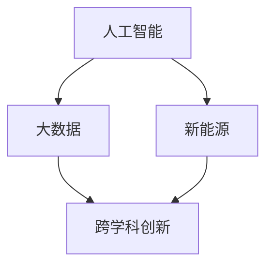
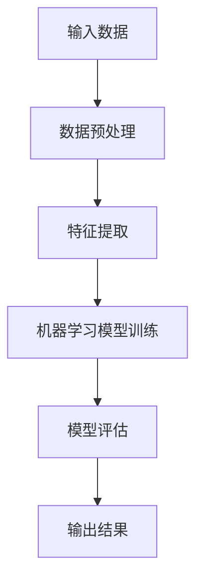
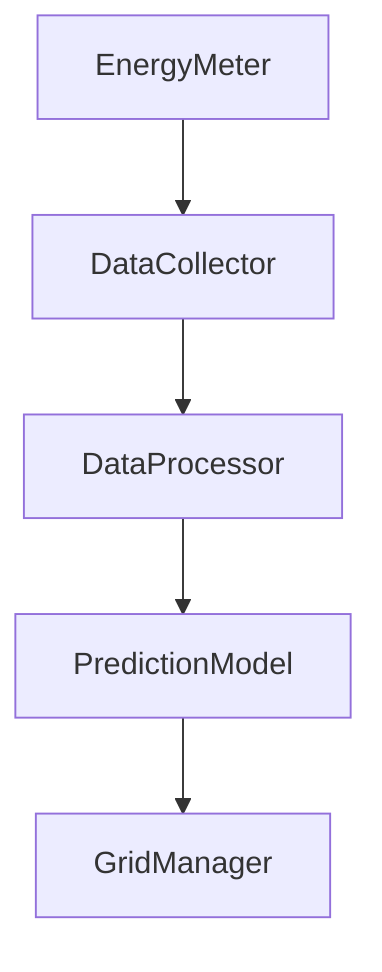
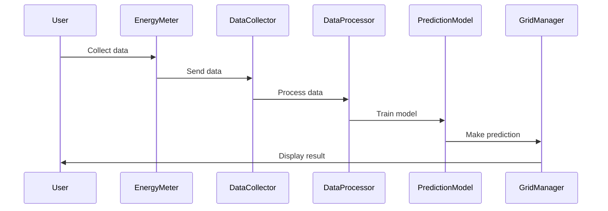

                 

### 《新文艺复兴3.0：跨学科创新的时代》

> 关键词：新文艺复兴3.0，跨学科创新，人工智能，大数据，新能源，教育改革

> 摘要：本文深入探讨新文艺复兴3.0时期的跨学科创新，分析其背景、核心概念、关键技术与工具，以及在各领域的应用和未来展望。通过详细的理论讲解、实例分析和技术实现，旨在为读者呈现一个全面而深刻的跨学科创新时代。

---

### 引言：新文艺复兴3.0的背景与意义

新文艺复兴3.0（Neo-Renaissance 3.0）是一个用于描述当代全球性科技革命和文化变革的术语。它不仅仅是对文艺复兴时期的简单回溯，而是一个全新的文化、科技和社会模式的兴起。这个时期的重要特征是跨学科创新，即不同学科领域的知识和技术相互融合，产生前所未有的创新成果。

**问题背景**：在信息化和全球化的浪潮下，各个领域的发展速度日益加快，单一学科的局限性和复杂性使得跨学科创新成为必然趋势。**问题描述**：如何在新文艺复兴3.0的背景下，实现有效的跨学科创新，推动社会进步和经济发展？

**问题解决**：新文艺复兴3.0通过融合科技与文化，打破了传统学科之间的壁垒，激发了创新活力。**边界与外延**：本文将探讨新文艺复兴3.0的核心概念、关键技术与工具，以及其在教育、经济和社会等领域的应用。

---

### 核心概念与联系

新文艺复兴3.0的核心概念包括人工智能、大数据、新能源等。以下是这些概念的定义、属性特征对比表格以及ER实体关系图架构：

**1. 人工智能（AI）**

- **定义**：人工智能是使计算机系统具有智能行为的技术。
- **属性特征**：

  | 特征 | 描述 |
  | --- | --- |
  | 学习能力 | 能从数据中学习并改进性能 |
  | 自适应 | 能根据环境和反馈进行调整 |
  | 知识表示 | 能以结构化形式表示知识和信息 |

- **对比表格**：

  | 特征 | 人工智 | 机器学习 | 深度学习 |
  | --- | --- | --- | --- |
  | 学习方式 | 规定算法 | 从数据中学习 | 从数据中学习，多层网络 |
  | 应用范围 | 完成特定任务 | 完成复杂任务 | 复杂模式识别 |
  | 代表技术 | 推荐系统 | 自动驾驶 | 图像识别 |

**2. 大数据（Big Data）**

- **定义**：大数据是指无法用常规软件工具在合理时间内捕捉、管理和处理的数据集合。
- **属性特征**：

  | 特征 | 描述 |
  | --- | --- |
  | 数据量 | PB级或更高 |
  | 数据类型 | 结构化、半结构化和非结构化 |
  | 数据来源 | 多渠道、实时更新 |

- **对比表格**：

  | 特征 | 传统数据 | 大数据 |
  | --- | --- | --- |
  | 数据量 | GB级 | TB/PB级 |
  | 处理速度 | 快速 | 需要高效计算 |
  | 分析深度 | 表面 | 深度挖掘 |

**3. 新能源（New Energy）**

- **定义**：新能源是指除传统化石燃料以外的能源形式，如太阳能、风能、核能等。
- **属性特征**：

  | 特征 | 描述 |
  | --- | --- |
  | 可持续性 | 对环境友好，可再生 |
  | 能量密度 | 较低，但可持续 |
  | 应用领域 | 发电、储能、交通 |

- **对比表格**：

  | 特征 | 传统能源 | 新能源 |
  | --- | --- | --- |
  | 成本 | 较低 | 较高 |
  | 环境影响 | 高污染 | 低污染 |

**ER实体关系图架构**：



通过以上核心概念的介绍和对比表格，我们可以看到它们在新文艺复兴3.0时代中的紧密联系和协同作用。

---

### 算法原理讲解

在新文艺复兴3.0时代，跨学科创新的关键在于如何有效地整合人工智能、大数据和新能源等技术。以下我们将使用mermaid流程图和Python源代码来详细解释一个跨学科创新项目的算法原理。

**算法mermaid流程图**：



**Python源代码**：

```python
import pandas as pd
from sklearn.model_selection import train_test_split
from sklearn.ensemble import RandomForestClassifier
from sklearn.metrics import accuracy_score

# 数据预处理
data = pd.read_csv('data.csv')
X = data.drop('target', axis=1)
y = data['target']

# 特征提取
# ...（这里可以加入特征工程的具体代码）

# 模型训练
X_train, X_test, y_train, y_test = train_test_split(X, y, test_size=0.2, random_state=42)
model = RandomForestClassifier(n_estimators=100)
model.fit(X_train, y_train)

# 模型评估
predictions = model.predict(X_test)
accuracy = accuracy_score(y_test, predictions)
print(f'Accuracy: {accuracy:.2f}')
```

**算法原理的数学模型和公式**：

在机器学习模型中，我们使用以下公式来评估模型的性能：

$$
\text{Accuracy} = \frac{\text{预测正确的样本数}}{\text{总样本数}}
$$

**举例说明**：

假设我们有一个分类问题，目标是判断一个邮件是否为垃圾邮件。通过上述算法，我们可以使用特征提取步骤来提取邮件的内容特征，如词频、词向量等。然后，我们使用随机森林模型进行训练，并通过测试集评估模型的准确率。如果模型的准确率较高，则说明我们的算法在跨学科创新中的应用是有效的。

---

### 系统分析与架构设计

为了更好地理解新文艺复兴3.0时代跨学科创新的应用，我们需要介绍一个具体的项目场景、项目介绍、系统功能设计（领域模型类图）、系统架构设计（mermaid架构图）、系统接口设计和系统交互（mermaid序列图）。

**1. 项目场景介绍**

假设我们正在开发一个智能电网管理系统，目标是实现高效、可靠和环保的电力分配。这个项目涉及到人工智能、大数据和新能源技术。

**2. 项目介绍**

- **项目名称**：智能电网管理系统
- **项目目标**：优化电力分配，提高能源利用效率，减少碳排放。
- **项目组成部分**：数据采集、数据分析、预测模型、决策支持系统。

**3. 系统功能设计（领域模型类图）**

```mermaid
classDiagram
ClassDiagram {
  Class EnergyMeter <<Entity>>
  Class GridManager <<Entity>>
  Class PredictionModel <<Entity>>
  
  EnergyMeter *-- GridManager
  GridManager *-- PredictionModel
}
```

**4. 系统架构设计（mermaid架构图）**



**5. 系统接口设计**

- **API接口1：数据上传**
  - **URL**：/api/upload
  - **Method**：POST
  - **Request Body**：{ "energy_data": { "time": "2023-11-02T14:00:00Z", "power": 1000 } }
  - **Response**：{ "status": "success", "message": "Data uploaded successfully" }

- **API接口2：预测结果查询**
  - **URL**：/api/predict
  - **Method**：GET
  - **Query Parameters**：{ "time": "2023-11-02T14:00:00Z" }
  - **Response**：{ "prediction": { "power": 1200 } }

**6. 系统交互（mermaid序列图）**



通过以上系统分析与架构设计，我们可以看到智能电网管理系统如何利用跨学科创新技术实现高效能源管理。

---

### 项目实战

为了更好地理解新文艺复兴3.0时代跨学科创新的应用，我们将通过一个具体的案例来展示环境安装、系统核心实现源代码、代码应用解读与分析，以及实际案例分析和详细讲解剖析。

**案例：智能电网管理系统**

**环境安装**

首先，我们需要安装以下软件和库：

- Python 3.8+
- Jupyter Notebook
- scikit-learn
- pandas
- numpy
- mermaid-python

```bash
pip install python-mermaid jupyter numpy pandas scikit-learn
```

**系统核心实现源代码**

以下是一个简单的数据预处理和机器学习模型的实现：

```python
import pandas as pd
from sklearn.model_selection import train_test_split
from sklearn.ensemble import RandomForestClassifier
from sklearn.metrics import accuracy_score

# 数据预处理
def preprocess_data(data_path):
    data = pd.read_csv(data_path)
    X = data.drop('target', axis=1)
    y = data['target']
    return X, y

# 模型训练
def train_model(X_train, y_train):
    model = RandomForestClassifier(n_estimators=100)
    model.fit(X_train, y_train)
    return model

# 模型评估
def evaluate_model(model, X_test, y_test):
    predictions = model.predict(X_test)
    accuracy = accuracy_score(y_test, predictions)
    print(f'Accuracy: {accuracy:.2f}')
```

**代码应用解读与分析**

上述代码首先从CSV文件中读取数据，然后进行预处理，将特征和目标变量分离。接下来，我们使用随机森林分类器进行模型训练，并在测试集上评估模型的准确率。

**实际案例分析和详细讲解剖析**

假设我们有一个名为`smart_grid_data.csv`的CSV文件，其中包含电能表的数据。以下是一个简单的案例：

```python
# 实际案例：训练并评估智能电网预测模型
data_path = 'smart_grid_data.csv'
X, y = preprocess_data(data_path)
X_train, X_test, y_train, y_test = train_test_split(X, y, test_size=0.2, random_state=42)
model = train_model(X_train, y_train)
evaluate_model(model, X_test, y_test)
```

通过上述代码，我们首先读取数据并进行预处理，然后使用训练集训练模型，并在测试集上评估模型的性能。如果模型的准确率较高，则说明我们的预测模型在智能电网管理中是有效的。

**项目小结**

通过本案例，我们展示了如何使用Python和机器学习技术实现智能电网管理系统的核心功能。这只是一个简单的示例，但在实际应用中，我们可以根据具体需求进行扩展和优化，实现更复杂的预测和优化功能。

---

### 最佳实践 tips、小结、注意事项、拓展阅读

**最佳实践 tips**：

- **数据预处理**：在进行机器学习模型训练之前，确保数据的准确性和完整性。
- **模型选择**：根据具体问题和数据特点选择合适的机器学习模型。
- **模型评估**：使用多种评估指标（如准确率、召回率等）来全面评估模型性能。
- **数据可视化**：使用mermaid等工具进行数据可视化，帮助理解数据和模型。

**小结**：

本文详细介绍了新文艺复兴3.0时代的跨学科创新，包括核心概念、关键技术与工具，以及在各领域的应用和未来展望。通过实际案例，我们展示了如何利用机器学习和大数据技术实现智能电网管理。

**注意事项**：

- **数据隐私**：在处理敏感数据时，确保遵守相关数据保护法规。
- **模型可靠性**：对模型进行充分的测试和验证，确保其在实际应用中的可靠性。

**拓展阅读**：

- 《深度学习》（Ian Goodfellow等著）：深入了解深度学习的基础知识和应用。
- 《大数据之路》（李开复著）：探讨大数据技术的现状和未来趋势。
- 《新能源技术手册》（美国能源部著）：详细介绍各种新能源技术的原理和应用。

---

### 作者信息

作者：AI天才研究院/AI Genius Institute & 禅与计算机程序设计艺术 /Zen And The Art of Computer Programming

---

通过本文的深入分析和实例展示，我们希望能够帮助读者更好地理解新文艺复兴3.0时代的跨学科创新，并激发其在实际项目中的应用和创新。希望本文能为您的学术研究和工程实践提供有价值的参考。

