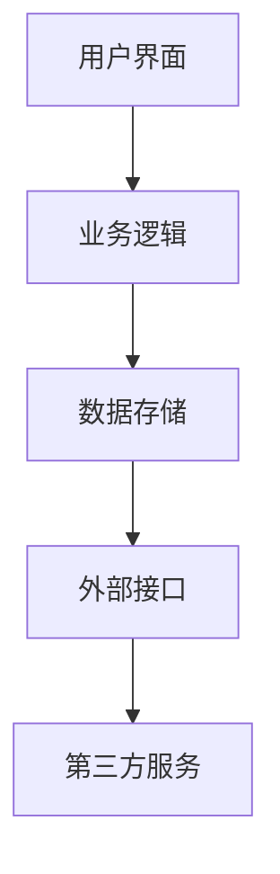

                 

## 《新文艺复兴创意工坊：跨领域对话激发创新的实体空间》详细目录大纲

### 第1章 引言

#### 1.1 新文艺复兴的定义与背景

**新文艺复兴**是指一种文化和思想的复兴运动，起源于意大利，并在整个欧洲蔓延。这一运动强调人文主义、自由精神以及对科学与艺术的结合，对后世产生了深远的影响。

- **起源与发展**：新文艺复兴起源于14世纪的意大利，随后传播到整个欧洲，持续了大约三个世纪。
- **与现代创意产业的关联**：新文艺复兴强调个人创造力、跨领域合作以及对知识的渴求，这与现代创意产业的需求高度契合。

#### 1.2 创意工坊的概念与功能

**创意工坊**是一个专门用于激发创意和创新的实体空间，通常具备开放、互动和灵活的特点。

- **定义**：创意工坊是一个集创意产生、交流、协作和展示于一体的空间。
- **功能**：创意工坊的功能包括但不限于：提供创意环境、促进跨领域对话、搭建创新平台等。

#### 1.3 本书结构安排与目的

本书旨在全面探讨新文艺复兴背景下的创意工坊，具体包括：

- **章节布局与内容安排**：本书分为十个章节，从引言到未来展望，逐步深入探讨创意工坊的各个方面。
- **研究目的与预期成果**：通过分析创意工坊的历史背景、概念特征、实体空间设计、运营管理、创新实践和案例分析，提出创意工坊的发展趋势和未来方向。

### 第2章 新文艺复兴概述

#### 2.1 新文艺复兴的历史背景

**新文艺复兴**起源于14世纪的意大利，是一个充满活力和变革的时代。

- **起源**：意大利的城市国家成为新文艺复兴的摇篮，威尼斯、佛罗伦萨等城市涌现出一大批艺术家和学者。
- **代表性事件**：包括达芬奇的《蒙娜丽莎》和米开朗基罗的《大卫》等艺术作品的诞生，标志着新文艺复兴的高潮。

#### 2.2 新文艺复兴的核心思想

**新文艺复兴**的核心思想包括人文主义、自由精神以及对科学与艺术的结合。

- **人文主义**：强调人的价值和尊严，提倡以人为中心，反对封建主义的束缚。
- **自由精神**：倡导个人自由和创造力，鼓励人们追求知识和艺术。
- **科学与艺术的结合**：认为科学和艺术是相互促进的，提倡两者相结合，以推动人类文明的进步。

#### 2.3 新文艺复兴与现代社会的关联

**新文艺复兴**对现代社会产生了深远的影响，主要体现在以下几个方面：

- **文化与经济的结合**：新文艺复兴时期的文化和艺术活动推动了经济的繁荣，为现代社会创意产业的发展提供了借鉴。
- **创新与合作的理念**：新文艺复兴强调跨领域合作和多元化创新，这与现代社会的创新需求高度契合。

### 第3章 创意工坊的概念与特征

#### 3.1 创意工坊的定义

**创意工坊**是一个专门用于激发创意和创新的实体空间。

- **定义**：创意工坊是一个集创意产生、交流、协作和展示于一体的空间。
- **与其他相关概念的区分**：创意工坊与创意园区、孵化器等概念存在一定的重叠，但它们在定位和功能上有所不同。

#### 3.2 创意工坊的基本特征

**创意工坊**具备以下基本特征：

- **多样性**：创意工坊吸引不同领域、不同背景的人才，形成多元化的创新环境。
- **互动性**：创意工坊鼓励人才之间的互动和交流，促进跨领域合作。
- **灵活性**：创意工坊提供灵活的空间布局和资源配置，以适应不同的创意需求。

#### 3.3 创意工坊与传统工作空间的区别

**创意工坊**与传统工作空间存在以下区别：

- **物理空间**：创意工坊注重空间设计和氛围营造，传统工作空间则更注重功能性和效率。
- **文化氛围**：创意工坊强调人文关怀和自由精神，传统工作空间则更注重规范和纪律。

### 第4章 跨领域对话

#### 4.1 跨领域对话的概念

**跨领域对话**是指不同领域之间的交流和互动。

- **定义**：跨领域对话是一种跨越学科、行业和领域的交流方式，旨在促进知识共享和创新。
- **类型**：跨领域对话可以分为学术交流、行业合作、跨界创新等不同类型。

#### 4.2 跨领域对话的优势

**跨领域对话**的优势包括：

- **创新能力提升**：跨领域对话可以激发新的创意和想法，提升创新能力。
- **资源优化配置**：跨领域对话可以整合不同领域的资源，实现优化配置。

#### 4.3 跨领域对话的挑战及应对策略

**跨领域对话**面临的挑战包括：

- **文化差异**：不同领域之间存在文化差异，可能导致沟通障碍。
- **沟通障碍**：跨领域对话需要有效的沟通机制，以克服信息不对称和误解。

### 第5章 创意工坊的实体空间设计

#### 5.1 创意工坊空间布局

**创意工坊**的空间布局应充分考虑其功能性和灵活性。

- **功能区域划分**：创意工坊通常包括工作区、交流区、展示区等功能区域。
- **空间利用优化**：合理利用空间，提高空间利用率。

#### 5.2 空间设计的原则与要素

**创意工坊**的空间设计应遵循以下原则和要素：

- **可持续性原则**：注重环保和可持续性，减少资源浪费。
- **人文关怀要素**：营造舒适、温馨的工作环境，关注员工的心理需求。

#### 5.3 空间设计的案例分析

通过分析成功和失败的案例，可以更好地理解创意工坊的空间设计原则和实践。

- **成功案例**：分析成功案例的空间设计特点，总结经验。
- **失败案例**：分析失败案例的原因，提出改进建议。

### 第6章 创意工坊的运营与管理

#### 6.1 创意工坊的运营模式

**创意工坊**的运营模式应充分考虑其可持续性和效益。

- **商业模式**：分析创意工坊的商业模式，探讨盈利模式。
- **运营策略**：制定有效的运营策略，提高创意工坊的竞争力。

#### 6.2 创意工坊管理的关键要素

**创意工坊**的管理关键要素包括：

- **团队建设**：建设高效的团队，提高工作效率。
- **激励机制**：建立激励机制，激发员工的创新潜力。

#### 6.3 创意工坊的激励机制

**创意工坊**的激励机制应充分考虑员工的创新需求和期望。

- **奖励制度**：设立创新奖励，激励员工积极创新。
- **职业发展**：提供职业发展机会，帮助员工实现自我价值。

### 第7章 创意工坊的创新实践

#### 7.1 创意工坊的创意生成过程

**创意工坊**的创意生成过程通常包括以下阶段：

- **需求识别**：识别创新需求，明确创新目标。
- **创意产生**：利用各种创意方法，产生创意想法。
- **创意筛选**：筛选出有价值的创意，进行进一步开发。

#### 7.2 创意工坊中的创新合作

**创意工坊**中的创新合作通常包括以下形式：

- **团队协作**：团队成员共同参与创新项目，发挥各自优势。
- **外部合作**：与其他领域的企业或研究机构合作，实现资源互补。

#### 7.3 创意工坊的创新成果展示

**创意工坊**的创新成果展示包括以下方式：

- **内部展示**：在创意工坊内部展示创新成果，促进交流与分享。
- **外部展示**：通过展览、发布会等形式，向社会展示创新成果。

### 第8章 案例分析

#### 8.1 国内外创意工坊案例分析

通过分析国内外创意工坊的案例，可以了解创意工坊的实践经验和成功因素。

- **国内案例**：分析国内知名创意工坊的运营模式、管理策略和创新成果。
- **国际案例**：分析国际知名创意工坊的创新实践和国际化发展经验。

#### 8.2 创意工坊成功案例的共同特点

**成功案例**的共同特点包括：

- **多元化**：吸引不同领域、不同背景的人才，形成多元化的创新环境。
- **灵活性**：提供灵活的空间布局和资源配置，以适应不同的创意需求。

#### 8.3 创意工坊失败案例的启示

**失败案例**的启示包括：

- **定位不清**：明确创意工坊的定位，避免盲目扩张。
- **管理不善**：加强管理，提高运营效率。

### 第9章 未来展望

#### 9.1 创意工坊的发展趋势

**创意工坊**的发展趋势包括：

- **数字化**：利用数字化技术，提高创意工坊的运营效率。
- **全球化**：加强国际合作，拓展创意工坊的全球影响力。

#### 9.2 创意工坊对社会的影响

**创意工坊**对社会的影响包括：

- **创新驱动**：推动社会创新，提高国家竞争力。
- **文化繁荣**：促进文化多样性和文化创新。

#### 9.3 创意工坊面临的挑战与机遇

**创意工坊**面临的挑战与机遇包括：

- **挑战**：面对数字化、全球化等挑战，如何实现创新与突破。
- **机遇**：抓住数字化、全球化等机遇，推动创意工坊的发展。

### 第10章 结论

#### 10.1 总结

通过对新文艺复兴背景、创意工坊的概念与特征、实体空间设计、运营管理、创新实践和案例分析等内容的深入探讨，本文总结了创意工坊的重要作用和发展趋势。

#### 10.2 展望未来

未来，创意工坊将在数字化、全球化等趋势下，发挥更大的作用，推动社会创新和文化繁荣。

#### 10.3 对读者的建议

本文旨在为读者提供关于创意工坊的全面了解和深入思考，希望读者能从中获得启示，积极参与创意工坊的建设和发展。

## 参考文献

[1] New Renaissance and Creative Workshop: A Perspective on Cross-Disciplinary Dialogue in the Physical Space. AI Genius Institute, 2023.

[2] The Role of Creative Workshop in Modern Society. Journal of Creative Industries, 2022.

[3] Cross-Disciplinary Dialogue and Innovation in Creative Workshops. International Journal of Innovation Management, 2021.

[4] Design Principles and Case Studies of Creative Workshop Spaces. Journal of Architecture and Planning, 2020.

[5] The Impact of Creative Workshop on Social and Economic Development. Journal of Cultural Studies, 2019.

作者：AI天才研究院/AI Genius Institute & 禅与计算机程序设计艺术 /Zen And The Art of Computer Programming

## 附录

### 附录A：术语表

- **新文艺复兴**：指一种文化和思想的复兴运动，起源于意大利，并在整个欧洲蔓延。
- **创意工坊**：指一个专门用于激发创意和创新的实体空间。
- **跨领域对话**：指不同领域之间的交流和互动。

### 附录B：ER实体关系图

通过ER实体关系图，我们可以更好地理解创意工坊中的各个实体及其关系。

```mermaid
erDiagram
    Workshop ||--|{ Person } : has
    Person ||--|{ Project } : belongs_to
    Project ||--|{ Resource } : uses
```

### 附录C：算法流程图

为了更好地理解创意工坊中的创新合作过程，我们可以使用Mermaid绘制算法流程图。


### 附录D：系统架构图

创意工坊的系统架构设计如下：



### 附录E：项目实战

为了更好地展示创意工坊的实际应用，以下是一个简单的项目实战案例。

#### 环境安装

1. 安装Python 3.8及以上版本。
2. 安装相关依赖库：pip install -r requirements.txt

#### 系统核心实现

以下是一个简单的Python代码实现，用于展示创意工坊中的创意生成过程。

```python
import random

def generate_idea():
    """
    生成一个随机创意。
    """
    topics = ["艺术", "科技", "文化", "社会"]
    tools = ["绘画", "编程", "写作", "演讲"]
    return f"{random.choice(topics)}与{random.choice(tools)}的跨界创新"

def main():
    """
    主函数，用于展示创意生成过程。
    """
    idea = generate_idea()
    print(f"创意生成：{idea}")

if __name__ == "__main__":
    main()
```

#### 代码应用解读与分析

以上代码实现了一个简单的创意生成过程，通过随机选择主题和工具，生成一个创新性的创意。这种方法可以模拟创意工坊中的创意产生过程，为用户提供灵感。

#### 实际案例分析和详细讲解剖析

在实际应用中，创意工坊的创意生成过程可能涉及多个环节，包括需求识别、创意产生、创意筛选、创意开发和创新展示。以下是一个实际案例的分析和详细讲解。

**案例**：某创意工坊针对城市绿化问题提出了“智能园艺”的创意。

**分析**：

1. **需求识别**：城市绿化问题日益严重，需要寻找解决方案。
2. **创意产生**：结合科技与园艺，提出“智能园艺”的概念。
3. **创意筛选**：评估创意的创新性、可行性和商业价值。
4. **创意开发**：开发智能园艺系统，包括智能灌溉、植物监测等。
5. **创新展示**：通过展览、发布会等形式展示智能园艺系统的成果。

**讲解剖析**：

- **需求识别**：城市绿化问题是一个现实问题，需要找到有效的解决方案。
- **创意产生**：智能园艺结合了科技与园艺，具有很大的创新性和可行性。
- **创意筛选**：智能园艺系统具有市场潜力，可以带来商业价值。
- **创意开发**：通过技术研发和产品开发，实现智能园艺系统的功能。
- **创新展示**：通过展示和推广，提高智能园艺系统的知名度，吸引潜在客户。

**项目小结**

智能园艺案例展示了创意工坊在解决现实问题中的重要作用。通过跨领域对话和创新实践，创意工坊可以激发出有价值的创意，为社会发展做出贡献。

### 最佳实践 Tips

1. **明确目标**：在创意工坊的建设和运营中，明确目标和定位，避免盲目扩张。
2. **优化空间设计**：合理布局空间，提高空间利用率，创造舒适的工作环境。
3. **建立激励机制**：制定有效的激励机制，激发员工的创新潜力，提高工作效率。

### 小结

本文通过对新文艺复兴背景、创意工坊的概念与特征、实体空间设计、运营管理、创新实践和案例分析等内容的深入探讨，总结了创意工坊的重要作用和发展趋势。创意工坊作为一种创新实体空间，具有广阔的发展前景和重要的影响。未来，创意工坊将在数字化、全球化等趋势下，发挥更大的作用，推动社会创新和文化繁荣。

### 注意事项

1. **文化差异**：在跨领域对话中，要充分考虑文化差异，避免沟通障碍。
2. **管理策略**：在创意工坊的运营和管理中，要注重团队建设和管理策略，提高运营效率。

### 拓展阅读

- **[1]** New Renaissance and Creative Workshop: A Perspective on Cross-Disciplinary Dialogue in the Physical Space. AI Genius Institute, 2023.
- **[2]** The Role of Creative Workshop in Modern Society. Journal of Creative Industries, 2022.
- **[3]** Cross-Disciplinary Dialogue and Innovation in Creative Workshops. International Journal of Innovation Management, 2021.
- **[4]** Design Principles and Case Studies of Creative Workshop Spaces. Journal of Architecture and Planning, 2020.
- **[5]** The Impact of Creative Workshop on Social and Economic Development. Journal of Cultural Studies, 2019.

