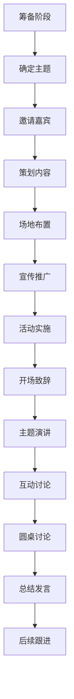

                 

### 第1章：新文艺复兴沙龙的兴起

#### 1.1.1 新文艺复兴沙龙的背景

**文艺复兴的概念与特点**

文艺复兴（Renaissance）是15世纪至17世纪在欧洲兴起的一场思想文化运动。这场运动以人文主义为核心，倡导对人类自身的关注和尊重，强调个体价值和自由意志。文艺复兴的兴起标志着中世纪向现代的过渡，对后来的现代文化和科学产生了深远影响。

文艺复兴的特点包括：

1. **人文主义精神**：强调人类的智慧和创造力，提倡对自然界和人类自身的探索。
2. **艺术复兴**：艺术创作强调对现实的描绘和对人性的表达，出现了达·芬奇、米开朗基罗等杰出艺术家。
3. **科学革命**：伽利略、牛顿等科学家的发现，推动了科学方法和科学理论的进步。

**新文艺复兴的崛起**

新文艺复兴（New Renaissance）是21世纪在全球化背景下兴起的一场文化运动，它不仅继承了文艺复兴的人文主义精神，更强调跨学科、跨领域的交流与合作。新文艺复兴沙龙则是这一运动的典型代表，旨在通过跨领域的对话激发创新思维。

新文艺复兴的特点包括：

1. **跨学科交流**：强调不同学科、不同领域的知识共享和思维碰撞，促进创新。
2. **技术驱动**：借助现代科技手段，如人工智能、大数据等，提高沙龙活动的效率和质量。
3. **全球视野**：新文艺复兴沙龙不仅限于某一个国家或地区，而是具有全球视野，吸引了来自世界各地的参与者。

#### 1.1.2 沙龙的起源与发展

**沙龙的定义与功能**

沙龙（Salon）原指法国18世纪中叶的客厅聚会，参与者多为知识分子和艺术家，他们在这里交流思想、讨论艺术和科学问题。现代沙龙则是一种更为正式的聚会形式，旨在通过深入的讨论和交流，激发创新思维和创造力的碰撞。

沙龙的主要功能包括：

1. **思想交流**：为不同领域的专家提供一个交流思想的平台。
2. **创新激发**：通过跨领域的对话，促进创新思维的产生。
3. **知识共享**：分享最新的研究成果和技术进展，促进知识的传播。

**沙龙的历史发展与演变**

沙龙的历史可以追溯到18世纪的欧洲，随着时间的发展，沙龙的形式和内容也不断演变。

1. **初期沙龙**：18世纪的沙龙多为私人聚会，参与者以贵族和知识分子为主。
2. **19世纪沙龙**：随着工业革命的发展，沙龙逐渐成为公共活动，参与者范围扩大到工人阶级和普通人。
3. **现代沙龙**：20世纪以来，沙龙的形式和内容进一步多样化，不仅限于面对面的交流，还出现了线上沙龙，参与者可以通过网络跨越地域限制进行讨论。

#### 1.1.3 沙龙的核心目标

**激发创新思维**

沙龙的核心目标之一是激发创新思维。通过跨领域的对话，不同领域的专家可以相互启发，从不同的视角看问题，从而产生新的想法和解决方案。创新思维是现代科技和社会发展的重要驱动力，沙龙为此提供了重要的平台。

**跨领域交流与合作**

沙龙通过跨领域的交流与合作，促进了不同领域之间的知识共享和资源整合。这种合作不仅有助于解决当前的问题，还为未来的创新奠定了基础。跨领域合作是应对复杂问题的有效途径，沙龙为此提供了重要的桥梁。

### 总结

新文艺复兴沙龙的兴起，标志着文化运动的新趋势。通过跨领域的对话，沙龙不仅激发了创新思维，还促进了知识的传播和跨领域的合作。这一新的文化形式，为未来的创新和社会发展提供了重要的动力。在接下来的章节中，我们将进一步探讨沙龙中的核心概念和活动实践。

### 1.2.1 跨领域对话

#### 跨领域对话的定义

跨领域对话（Interdisciplinary Dialogue）是指不同学科、领域之间的交流与讨论。这种对话不仅涉及知识和技术的共享，还包括思维方式和观念的碰撞。跨领域对话的目标是整合多学科的知识和智慧，以解决复杂问题、推动创新和科技进步。

跨领域对话的几个关键要素包括：

1. **多学科融合**：跨领域对话要求参与者具备多学科背景，以便从不同角度分析问题。
2. **知识共享**：通过交流和讨论，实现知识和技术的共享。
3. **观念碰撞**：不同领域的专家可能会对同一个问题有不同的看法，这种观念的碰撞有助于产生新的思路和解决方案。

#### 跨领域对话的重要性

跨领域对话在现代科技和社会发展中具有重要作用。以下是几个方面的具体体现：

1. **解决复杂问题**：许多问题涉及多个领域，单一领域的专家很难独立解决。跨领域对话可以整合多学科的知识，提供更全面、更有效的解决方案。
2. **推动创新**：跨领域对话促进了不同领域之间的思维碰撞，有助于发现新的研究方向和创新点。
3. **科技进步**：通过跨领域合作，可以加速新技术的研发和应用，推动科技进步。

**案例分析：跨领域对话在科技创新中的应用**

以医学和计算机科学为例，跨领域对话在解决复杂医疗问题和推动医疗技术发展方面发挥了重要作用。例如，计算机科学家与医学专家合作开发人工智能算法，用于疾病诊断和治疗方案制定。这种跨领域合作不仅提高了诊断的准确性，还缩短了治疗时间，为患者带来了福音。

#### 跨领域对话的实施方法

1. **多学科团队协作**：组建由多学科专家组成的团队，通过定期会议和讨论，实现知识和资源的共享。
2. **跨学科研讨会**：组织跨学科研讨会，邀请不同领域的专家进行交流和讨论。
3. **学术合作项目**：鼓励跨学科的研究项目和合作，通过共同研究解决实际问题。

**未来展望**

随着全球化和科技的发展，跨领域对话的重要性将日益凸显。未来，跨领域对话将在更多的领域得到应用，成为推动创新和社会发展的重要力量。

### 总结

跨领域对话作为一种创新性的交流方式，在现代科技和社会发展中具有不可替代的作用。通过跨领域的对话与合作，我们可以更好地解决复杂问题，推动科技进步，为未来的发展注入新的动力。

#### 1.2.2 创新思维

**创新思维的概念**

创新思维（Innovative Thinking）是指通过独特的视角和方法，对现有问题和挑战进行重新思考和解决的一种思维方式。它不仅关注解决问题，更注重创造新的价值和可能性。创新思维是推动科技进步和社会发展的重要动力。

**创新思维的方法与技巧**

1. **头脑风暴**：头脑风暴是一种集思广益的方法，通过快速产生大量想法，激发创新思维。参与者可以在不受限制的环境中自由表达观点，相互启发。
2. **横向思维**：横向思维是一种超越传统思维模式的方法，它鼓励我们从不同的角度和领域看问题，从而发现新的解决方案。
3. **系统思维**：系统思维是一种整体性的思维方式，它强调分析问题时要考虑到各个部分之间的相互作用和影响，从而找到更全面的解决方案。
4. **用户中心设计**：用户中心设计是一种以用户需求为中心的思维方式，它要求我们在创新过程中始终关注用户的需求和体验，从而提供更符合用户期望的产品和服务。

**创新思维的实践案例**

1. **苹果公司的创新**：苹果公司以其独特的设计和创新思维闻名于世。从iPhone到iPad，苹果不断推出革命性的产品，改变了人们的生活方式。这种创新思维源于对用户需求的深刻理解和对技术趋势的敏锐把握。
2. **特斯拉的电动汽车**：特斯拉公司通过创新的电动汽车技术，颠覆了传统的汽车行业。特斯拉的成功不仅在于其技术上的突破，更在于其创新的商业模式和市场策略。

**创新思维在跨领域对话中的重要性**

创新思维在跨领域对话中具有重要意义。跨领域对话为不同领域的专家提供了交流和互动的平台，而创新思维则能够激发这些专家在对话过程中产生新的想法和解决方案。以下是创新思维在跨领域对话中的几个关键作用：

1. **打破思维定势**：创新思维可以帮助参与者跳出传统的思维框架，从新的视角看待问题，从而发现新的解决方案。
2. **促进知识共享**：创新思维鼓励参与者分享不同的观点和经验，促进知识的交流和融合，为跨领域合作奠定基础。
3. **提升创新能力**：跨领域对话中的创新思维实践可以提升参与者的创新能力，培养他们的创新思维习惯，为未来的创新活动做好准备。

**未来展望**

随着全球化和科技的发展，创新思维将在跨领域对话中发挥越来越重要的作用。未来，创新思维将成为推动社会进步和经济发展的重要力量。通过不断创新，我们能够应对日益复杂的挑战，为人类的未来带来更多可能性。

### 总结

创新思维是跨领域对话的重要推动力。通过创新的思维方式和方法，参与者能够在对话中产生新的想法和解决方案，推动科技和社会的发展。在接下来的章节中，我们将继续探讨沙龙中的其他核心概念，深入理解沙龙如何激发创新思维和推动跨领域合作。

#### 1.2.3 激情与热情

**激情在沙龙中的角色**

激情（Passion）是沙龙活动中不可或缺的一部分。它不仅能够激发参与者的创造力和热情，还能营造出一个充满活力和创造力的氛围。在沙龙中，激情可以表现为对讨论主题的热爱、对创新思维的追求以及对解决问题的高度热情。以下是激情在沙龙中的几个关键角色：

1. **激发创造力**：激情可以激发参与者的创造力，使他们在讨论中产生新的想法和解决方案。激情的力量可以超越逻辑思维，帮助参与者突破传统的思维框架。
2. **营造氛围**：激情的传递可以营造出一个充满活力和创造力的氛围，使参与者更加投入和专注。这种氛围有助于激发创新思维，促进跨领域的交流和合作。
3. **提升参与度**：激情能够提升参与者的参与度，使他们更加积极地参与讨论和互动。这种积极的参与度有助于构建一个高效的交流平台，促进知识的共享和融合。

**热情对于创新思维的重要性**

热情（Enthusiasm）是创新思维的重要催化剂。它不仅能够激发参与者的积极性，还能增强他们对创新过程和结果的信心。以下是热情在创新思维中的几个关键作用：

1. **增强动力**：热情能够为参与者提供强大的动力，使他们在面对挑战和困难时保持积极的态度。这种动力有助于克服创新过程中的各种障碍，推动项目的进展。
2. **促进合作**：热情可以促进参与者之间的合作和协作。当每个人都充满热情时，他们更容易相互理解和信任，从而共同实现创新目标。
3. **提升信心**：热情能够增强参与者对创新过程的信心。他们相信通过努力和协作，一定能够找到解决问题的方法，从而更加积极地投入到创新活动中。

**案例分析：沙龙中的激情与热情**

以科技与艺术的跨领域沙龙为例，这种类型的沙龙通常充满了激情和热情。科技专家和艺术家在讨论如何将科技与艺术相结合时，他们的热情和激情不仅激发了新的创意，还促进了不同领域之间的深入交流和合作。例如，在讨论虚拟现实艺术时，科技专家和艺术家共同探讨了如何通过虚拟现实技术创作出更具互动性和沉浸感的艺术作品。这种跨领域的激情和热情不仅推动了创新，还为艺术和科技的发展注入了新的活力。

**如何培养和保持激情与热情**

1. **明确目标**：明确沙龙的目标和期望，使参与者能够清晰地了解自己的角色和责任，从而更好地投入到活动中。
2. **提供激励**：为参与者提供奖励和激励，如表彰优秀贡献者、提供专业发展机会等，以激发他们的热情和积极性。
3. **营造氛围**：营造一个积极、开放和包容的氛围，鼓励参与者自由表达自己的想法和观点，从而激发他们的创造力和热情。
4. **培养兴趣**：鼓励参与者培养对沙龙主题的兴趣，通过分享相关知识和经验，增强他们对沙龙的热情和投入。

**未来展望**

随着全球化的发展和科技的进步，沙龙中的激情与热情将愈发重要。通过培养和保持激情与热情，沙龙不仅能够激发创新思维，还能推动跨领域的合作和知识共享。未来，激情与热情将成为沙龙活动中的重要驱动力，为人类社会的进步和发展贡献更大的力量。

### 总结

激情与热情在沙龙中扮演着至关重要的角色。它们不仅能够激发参与者的创造力和热情，还能营造一个充满活力和创造力的氛围。在跨领域对话中，激情与热情是推动创新思维和合作的重要动力。通过培养和保持激情与热情，沙龙能够更有效地激发创新，推动科技和社会的发展。

### 第3章：沙龙活动的组织与运营

#### 3.1.1 沙龙活动的基本流程

**沙龙活动的筹备**

沙龙活动的筹备是一个系统而细致的过程，包括以下几个关键步骤：

1. **确定主题**：根据沙龙的目标和参与者的需求，确定沙龙的主题。主题应具有吸引力和讨论价值，能够激发参与者的兴趣。
2. **邀请嘉宾**：根据主题，邀请相关领域的专家、学者和行业领袖参与沙龙。邀请时应注重嘉宾的专业背景、经验和影响力，以确保沙龙的高质量和吸引力。
3. **策划内容**：根据沙龙的主题和嘉宾的特点，策划相应的讨论内容和活动环节，如主旨演讲、专题报告、圆桌讨论、互动问答等。
4. **场地布置**：选择合适的场地，并按照沙龙的需求进行布置，包括座位安排、音响设备、投影仪等。
5. **宣传推广**：通过官方网站、社交媒体、电子邮件等渠道，对沙龙活动进行宣传推广，吸引更多的参与者。

**沙龙活动的实施**

沙龙活动的实施是整个过程中最关键的一步，包括以下几个环节：

1. **开场致辞**：在沙龙开始时，主持人进行开场致辞，介绍沙龙的主题、目的和流程，并欢迎嘉宾和参与者。
2. **主题演讲**：邀请嘉宾进行主题演讲，分享他们的研究成果、实践经验和对未来趋势的见解。演讲应具有启发性，能够激发参与者的思考和讨论。
3. **互动讨论**：在演讲结束后，组织互动讨论环节，鼓励参与者提问、发言和讨论。讨论应注重思维的碰撞和观点的交流，以推动创新思维的激发。
4. **圆桌讨论**：组织圆桌讨论，邀请嘉宾和参与者围绕某一主题进行深入讨论。圆桌讨论应注重平等交流和深度探讨，以促进不同领域的专家之间的互动。
5. **总结发言**：在沙龙结束时，主持人进行总结发言，对沙龙的讨论内容进行概括和总结，并表达对嘉宾和参与者的感谢。
6. **后续跟进**：沙龙结束后，对活动进行总结和反馈，收集参与者的意见和建议，为下一次沙龙活动提供改进的依据。

**沙龙活动的基本流程图**

以下是沙龙活动的基本流程图，使用Mermaid工具进行绘制：

通过以上步骤和流程，沙龙活动可以有效地组织与实施，为参与者提供一个高质量的交流平台，激发创新思维和跨领域合作。

#### 3.1.2 沙龙活动的主题设置

**主题选择的原则**

沙龙活动的主题选择是确保沙龙成功的关键因素之一。以下是一些主题选择的原则：

1. **相关性**：主题应与参与者的需求和当前热点问题密切相关，能够引起参与者的兴趣和关注。
2. **创新性**：主题应具有创新性和前瞻性，能够激发参与者的思考和讨论，推动领域的创新和发展。
3. **多样性**：主题应涵盖不同领域和学科，促进跨领域的交流和合作，提高沙龙的互动性和吸引力。
4. **实用性**：主题应具有一定的实用价值，能够为参与者提供实际的知识和技能，帮助他们解决实际问题。
5. **讨论价值**：主题应具有足够的讨论价值，能够引发深入的讨论和交流，促进知识的传播和融合。

**主题设定的策略**

为了确保沙龙活动的主题能够有效地吸引参与者并激发创新思维，以下是一些主题设定的策略：

1. **调研与反馈**：在确定主题之前，进行调研和收集参与者的反馈，了解他们的需求和期望。这有助于确定符合参与者兴趣和实际需求的主题。
2. **热点追踪**：关注当前科技、社会和行业的热点问题，选择具有广泛影响和讨论价值的主题。热点追踪可以确保沙龙的主题紧跟时代潮流。
3. **专家建议**：邀请相关领域的专家和学者提供主题建议，结合他们的专业知识和经验，确保主题的创新性和实用性。
4. **跨领域结合**：结合不同领域的主题，如科技、艺术、哲学、商业等，促进跨领域的交流和合作。这种结合可以带来新的视角和思路，推动创新。
5. **灵活调整**：在沙龙活动进行中，根据实际情况和参与者的反馈，灵活调整主题。这样可以确保沙龙的主题始终与参与者的需求和兴趣保持一致。

**成功沙龙活动的主题案例**

1. **科技与艺术的融合**：这是一个具有创新性和前瞻性的主题，吸引了科技和艺术领域的专家和爱好者。通过跨领域的对话和互动，参与者探讨了科技如何改变艺术创作和传播的方式，为艺术和科技的发展提供了新的思路。
2. **人工智能与伦理**：随着人工智能技术的快速发展，其应用带来的伦理问题引起了广泛关注。这个主题探讨了人工智能技术在不同领域的应用以及其对社会和伦理的影响，促进了人工智能领域的深入思考和讨论。
3. **可持续发展与科技创新**：这个主题关注如何通过科技创新推动可持续发展，解决全球面临的资源和环境问题。参与者围绕如何利用科技手段实现可持续发展进行了深入的交流和讨论，提出了许多有价值的观点和解决方案。

通过以上原则和策略，沙龙活动的主题选择可以更具针对性和吸引力，为参与者提供一个富有价值和意义的交流平台，激发创新思维和跨领域合作。

#### 3.1.3 沙龙活动的参与人员

**参与人员的角色**

在沙龙活动中，参与人员的角色至关重要，他们的积极参与和互动决定了沙龙活动的质量和效果。以下是沙龙活动中主要参与人员的角色：

1. **主持人**：主持人是沙龙活动的组织者和引导者，负责策划活动流程、邀请嘉宾、引导讨论和确保活动的顺利进行。主持人应具备良好的沟通能力和组织协调能力。
2. **嘉宾**：嘉宾是沙龙活动的重要参与者，他们通常是相关领域的专家、学者或行业领袖。嘉宾在沙龙中分享他们的研究成果、实践经验和对未来趋势的见解，为参与者提供有价值的信息和思考。
3. **参与者**：参与者是沙龙活动的主体，他们来自不同的领域和背景，通过参与沙龙活动，分享自己的观点、提问和讨论，促进知识的传播和融合。参与者应具备积极的态度和开放的心态，以实现最佳的学习和交流效果。
4. **志愿者**：志愿者是沙龙活动的辅助人员，负责活动现场的布置、接待、记录和协助等工作。志愿者的积极参与有助于确保沙龙活动的顺利进行和高效运作。

**参与人员的筛选与邀请**

为了确保沙龙活动的质量和效果，参与人员的筛选与邀请是一个关键环节。以下是几个方面的考虑：

1. **专业背景与经验**：选择具备相关领域专业背景和丰富经验的人员，以确保他们在沙龙中能够提供高质量的内容和有价值的见解。
2. **多元性与代表性**：邀请来自不同领域和背景的参与者，以促进跨领域的交流和合作。这样可以确保沙龙活动的观点多样性和代表性。
3. **知名度和影响力**：邀请具有一定知名度和影响力的专家和学者，可以提高沙龙的知名度和吸引力，吸引更多的参与者关注和参与。
4. **参与意愿**：邀请对沙龙主题感兴趣、愿意积极参与讨论和交流的人员。参与意愿的评估可以通过调研和沟通进行，以确保参与者能够真正投入到沙龙活动中。
5. **名额限制**：根据沙龙的规模和场地条件，合理设置参与人员名额，以确保沙龙活动的密度和互动性。

**邀请策略**

以下是几种常见的邀请策略：

1. **定向邀请**：根据沙龙的主题和目标，定向邀请相关领域的专家、学者和行业领袖。这种策略可以确保沙龙的专业性和针对性。
2. **开放邀请**：通过官方网站、社交媒体和电子邮件等渠道，向更广泛的群体开放邀请，鼓励有兴趣的人员参与沙龙。这种策略可以扩大沙龙的参与范围和影响力。
3. **合作邀请**：与相关机构和组织合作，共同邀请参与人员和组织沙龙活动。这种策略可以借助合作方的资源和影响力，提高沙龙的规模和影响力。

通过以上策略，可以有效地筛选和邀请到合适的参与人员，确保沙龙活动的顺利进行和高质量输出。

### 4.1.1 案例一：科技与艺术的对话

**案例背景与目标**

科技与艺术的对话沙龙旨在探讨科技与艺术之间的相互影响和融合，推动艺术和科技的创新与发展。该沙龙背景源于现代科技在艺术创作和展示中的应用日益广泛，艺术与科技相互渗透的趋势日益明显。通过这种跨领域的对话，沙龙希望实现以下目标：

1. **促进科技与艺术的理论研究与实际应用的结合**：通过专家的深入探讨，推动科技与艺术的理论创新和实际应用相结合。
2. **激发跨领域的创新思维**：通过科技与艺术的对话，激发参与者的跨领域思维，产生新的创意和灵感。
3. **分享最新的科技与艺术成果**：为参与者提供一个平台，分享最新的科技与艺术研究成果和实际案例，促进知识的传播和共享。

**活动内容与成果**

1. **主题演讲**：沙龙邀请了多位来自科技和艺术领域的专家，进行了主题演讲。专家们分享了他们在科技与艺术融合方面的研究成果和实践经验，探讨了科技如何改变艺术创作和展示的方式，以及艺术如何回应科技的挑战。

2. **互动讨论**：在演讲结束后，组织了互动讨论环节。参与者围绕科技与艺术的融合展开了热烈的讨论，分享了各自的观点和见解。讨论内容涉及虚拟现实艺术、人工智能在艺术创作中的应用、数字艺术的发展趋势等。

3. **艺术展示**：沙龙还邀请了艺术家现场展示了他们的作品，通过实际的艺术作品展示了科技与艺术的融合。这些作品包括数字绘画、虚拟现实艺术装置等，为参与者提供了一个直观感受科技与艺术结合的机会。

4. **项目合作**：通过沙龙的交流，参与者之间建立了初步的合作意向，一些项目合作得以启动。例如，科技公司与艺术学院的合作项目、艺术家与科技公司合作的艺术创作项目等。

**成果总结**

科技与艺术的对话沙龙取得了显著的成果：

1. **促进了科技与艺术的融合**：沙龙通过跨领域的对话，促进了科技与艺术的理论研究和实际应用的结合，为科技与艺术的融合提供了新的思路和方法。

2. **激发了创新思维**：沙龙为参与者提供了一个交流平台，激发了他们的创新思维，产生了许多新的创意和灵感。这些创意和灵感为未来的科技与艺术发展提供了新的动力。

3. **促进了知识的传播和共享**：沙龙为参与者提供了一个分享最新成果和经验的平台，促进了知识的传播和共享。参与者通过沙龙，了解了科技与艺术领域的最新动态和趋势，为他们的工作和研究提供了新的参考和启示。

4. **建立了合作网络**：沙龙为参与者建立了合作网络，促进了不同领域之间的合作和交流。这些合作网络为未来的科技与艺术项目提供了合作机会，推动了科技与艺术的发展。

**未来展望**

科技与艺术的对话沙龙具有广阔的发展前景。未来，沙龙可以继续深化主题，邀请更多领域的专家和参与者，拓展沙龙的内容和范围。以下是一些未来发展的方向：

1. **拓展主题领域**：沙龙可以拓展到更多的主题领域，如数字艺术、虚拟现实、人工智能等，以适应科技与艺术融合的不断发展和变化。

2. **增加互动环节**：沙龙可以增加更多的互动环节，如工作坊、实验展示等，以增强参与者的参与感和体验感。

3. **推动项目合作**：沙龙可以继续推动项目合作，促进科技与艺术领域的深度融合。通过合作项目，推动科技与艺术的发展，实现创新和突破。

4. **加强国际交流**：沙龙可以加强与国际科技与艺术领域的交流和合作，引进国际先进的理念和经验，推动全球科技与艺术的融合。

通过不断的发展和改进，科技与艺术的对话沙龙将成为一个具有广泛影响力的高水平跨领域交流平台，为科技与艺术的发展和创新做出更大贡献。

### 4.1.2 案例二：商业与哲学的探讨

**案例背景与目标**

商业与哲学的探讨沙龙旨在探讨商业伦理和哲学理念在商业实践中的应用，以及如何通过哲学思维提升商业决策的质量和道德水平。这个沙龙的背景源于商业世界中频繁出现的道德困境和商业失败案例，表明单纯追求经济利益而忽视伦理和道德的重要性可能导致严重的后果。沙龙希望通过以下目标实现商业与哲学的深度融合：

1. **提升商业伦理意识**：通过哲学的探讨，提高商业从业者对伦理问题的敏感度和重视程度，从而促进商业伦理的实践。
2. **改善商业决策质量**：借助哲学的思维工具，帮助商业决策者更全面、更深入地分析问题，做出更明智的商业决策。
3. **构建道德商业文化**：通过沙龙的交流，推动企业构建以道德为基础的商业文化，促进企业社会责任的履行。
4. **促进跨领域合作**：沙龙为商业和哲学领域的专家提供一个交流平台，促进双方的合作和知识共享，为解决商业伦理问题提供新的思路和方法。

**活动内容与成果**

1. **主题演讲**：沙龙邀请了多位在商业伦理和哲学领域有深入研究的学者和企业家，进行了主题演讲。演讲内容涵盖了商业伦理的基本原则、商业决策中的道德考量、哲学思维在商业实践中的应用等。这些演讲为参与者提供了丰富的理论知识和实践经验。

2. **案例分享**：沙龙邀请了企业家和公司高管分享他们在实际经营中遇到的伦理困境和解决方法。这些案例分享不仅展示了商业伦理在实践中的应用，也为其他企业提供了借鉴和启示。

3. **圆桌讨论**：沙龙组织了圆桌讨论，参与者围绕商业伦理和哲学主题展开了深入讨论。讨论内容涉及商业决策中的道德考量、企业社会责任的实践、商业伦理教育的必要性等。通过圆桌讨论，参与者分享了各自的见解和经验，形成了许多有价值的观点和共识。

4. **实践工作坊**：沙龙还组织了实践工作坊，参与者通过角色扮演、案例分析和团队讨论等方式，深入探讨了商业伦理问题，并提出了具体的解决方案。这种实践工作坊的形式不仅增强了参与者的参与感，也提高了他们对商业伦理问题的理解和应用能力。

**成果总结**

商业与哲学的探讨沙龙取得了以下成果：

1. **提升商业伦理意识**：沙龙通过主题演讲、案例分享和讨论等形式，有效地提升了参与者的商业伦理意识，使他们更加关注商业实践中的伦理问题。

2. **改善商业决策质量**：参与者通过哲学思维的探讨和案例分析，学会了如何更全面、更深入地分析商业问题，提高了商业决策的质量和效果。

3. **构建道德商业文化**：沙龙促进了企业构建以道德为基础的商业文化，使企业更加重视社会责任和道德考量，为社会的可持续发展做出了贡献。

4. **促进跨领域合作**：沙龙为商业和哲学领域的专家提供了一个交流平台，促进了双方的深度合作和知识共享，为解决商业伦理问题提供了新的思路和方法。

**未来展望**

商业与哲学的探讨沙龙在未来的发展中，可以进一步深化主题，扩大参与范围，推动更多的合作和知识共享。以下是一些未来发展的方向：

1. **拓展主题领域**：沙龙可以拓展到更多与商业伦理相关的领域，如环境伦理、消费者伦理、国际商务伦理等，以适应商业环境的不断变化。

2. **加强实践导向**：沙龙可以增加更多的实践环节，如企业实地考察、伦理案例分析和模拟决策等，使参与者能够更直接地了解和体验商业伦理的实际应用。

3. **建立研究合作**：沙龙可以与高校、研究机构和商业组织建立更紧密的研究合作，共同开展商业伦理和哲学的研究项目，推动理论的创新和实践的应用。

4. **推广道德教育**：沙龙可以推广道德教育，通过培训和讲座等形式，提高商业从业者的道德素养和伦理意识，为构建更道德的商业社会奠定基础。

通过不断的发展和改进，商业与哲学的探讨沙龙将成为一个具有广泛影响力的高水平跨领域交流平台，为商业伦理和哲学的发展做出更大的贡献。

### 4.1.3 案例三：文化与创新的碰撞

**案例背景与目标**

文化与创新的碰撞沙龙旨在探讨文化对创新思维和创新能力的影响，以及如何通过文化融合和创新，推动社会的进步和发展。这个沙龙的背景源于文化多样性在全球化和科技进步的背景下日益凸显，而文化差异和创新思维之间存在密切的联系。沙龙希望通过以下目标，实现文化与创新的有效融合：

1. **促进文化理解与包容**：通过沙龙的交流，提高参与者对不同文化的理解与包容，消除文化偏见，促进多元文化的融合。
2. **激发创新思维**：借助不同文化的碰撞和融合，激发参与者的创新思维，产生新的创意和解决方案。
3. **推动跨文化合作**：通过沙龙，促进不同文化背景的专家和学者之间的合作，共同应对全球性挑战。
4. **提升创新能力**：通过文化融合和创新，提升参与者的创新能力，为各领域的发展提供新的动力。

**活动内容与成果**

1. **主题演讲**：沙龙邀请了来自不同文化背景的专家，就文化对创新的影响进行了主题演讲。这些演讲涵盖了不同文化背景下创新思维的特点、文化因素在创新过程中的作用、跨文化创新的成功案例等。通过这些演讲，参与者对文化与创新的关系有了更深入的理解。

2. **互动讨论**：沙龙组织了互动讨论环节，参与者围绕文化对创新的影响展开了深入的交流和讨论。讨论内容涉及文化多样性如何促进创新、不同文化背景下的创新模式、文化融合与创新的关系等。通过讨论，参与者分享了各自的见解和经验，形成了许多有价值的观点和共识。

3. **文化展示**：沙龙还邀请了来自不同文化的艺术家和表演者，进行了文化展示。这些展示包括音乐、舞蹈、传统手工艺等，为参与者提供了一个直观感受不同文化的机会。文化展示不仅丰富了沙龙的内容，也增强了参与者的跨文化体验。

4. **创新实践**：沙龙组织了创新实践环节，参与者通过小组合作，探讨了如何在不同文化背景下实现创新。这些实践活动包括设计创新工作坊、文化融合项目策划等。通过实践，参与者不仅学到了具体的创新方法，也锻炼了跨文化合作的能力。

**成果总结**

文化与创新的碰撞沙龙取得了以下成果：

1. **促进文化理解与包容**：沙龙通过主题演讲、互动讨论和文化展示等形式，有效促进了参与者对不同文化的理解与包容，增强了文化多样性意识。

2. **激发创新思维**：通过不同文化的碰撞和融合，沙龙成功激发了参与者的创新思维，产生了许多新的创意和解决方案，为各领域的发展提供了新的思路。

3. **推动跨文化合作**：沙龙为不同文化背景的专家和学者提供了一个交流平台，促进了跨文化合作，为全球性挑战的解决提供了新的途径。

4. **提升创新能力**：通过文化融合和创新实践，沙龙有效提升了参与者的创新能力，为他们在各自领域的未来发展奠定了坚实的基础。

**未来展望**

文化与创新的碰撞沙龙在未来的发展中，可以进一步深化主题，拓展活动内容，推动更多的合作和知识共享。以下是一些未来发展的方向：

1. **深化文化研究**：沙龙可以邀请更多文化研究专家，开展更深层次的文化研究，探讨文化对创新的影响机制和作用机制。

2. **拓展活动形式**：沙龙可以增加更多的活动形式，如文化体验工作坊、创新项目展示等，使参与者能够更直观地感受文化对创新的影响。

3. **加强国际合作**：沙龙可以加强与国际文化机构和学术组织的合作，引进国际先进的文化创新理念和实践经验，推动全球文化创新的发展。

4. **推广文化教育**：沙龙可以推广文化教育，通过培训和讲座等形式，提高公众对不同文化的理解与包容，培养跨文化创新能力。

通过不断的发展和改进，文化与创新的碰撞沙龙将成为一个具有广泛影响力的高水平跨领域交流平台，为文化创新和全球发展做出更大的贡献。

### 第5章：沙龙对个人与组织的影响

#### 5.1.1 对个人的影响

**思维方式的拓展**

沙龙活动为参与者提供了一个开放的交流平台，通过跨领域的对话和互动，他们能够接触到不同的观点和思维方式。这种多样化的思维方式有助于拓展参与者的思维边界，使他们能够从不同的角度看待问题，从而提高问题解决的能力。例如，科技领域的专家在参与艺术沙龙时，可能会从艺术的角度重新审视科技问题，从而发现新的解决方案。

**创新能力的提升**

沙龙活动中的跨领域对话和互动，不仅激发了参与者的创新思维，还为他们提供了实际操作和创新实践的机会。通过参与沙龙活动，参与者可以尝试新的思路和方法，将理论应用于实际，从而提升自己的创新能力。例如，在科技与艺术的对话沙龙中，科技专家和艺术家共同探讨如何将科技应用于艺术创作，这一过程不仅促进了技术的创新，也为艺术创作带来了新的灵感。

**知识的积累与更新**

沙龙活动为参与者提供了一个持续学习和知识更新的平台。通过参与沙龙，参与者可以了解最新的研究成果、行业动态和技术进展，从而不断更新自己的知识体系。此外，沙龙中的讨论和分享也为参与者提供了一个验证和扩展知识的良好机会。例如，商业与哲学的探讨沙龙中，参与者不仅可以了解商业伦理的理论知识，还可以通过实际案例学习和应用这些理论。

**人际网络的拓展**

沙龙活动为参与者提供了一个结识新朋友、拓展人际网络的机会。通过参与沙龙，参与者可以结识来自不同领域、不同背景的专家和学者，建立广泛的社交网络。这种人际网络的拓展不仅有助于知识的传播和共享，也为未来的合作和项目开发提供了可能性。例如，在文化与创新的碰撞沙龙中，参与者可以通过交流和互动，结识具有相似兴趣和目标的合作伙伴，从而推动跨领域的合作项目。

**个人成长与自我提升**

沙龙活动不仅为参与者提供了知识和技能的提升机会，还促进了他们的个人成长和自我提升。通过参与沙龙活动，参与者可以不断挑战自己，克服困难，提升自己的沟通能力、领导能力和团队协作能力。这种个人成长和自我提升的过程，有助于参与者实现个人职业发展和人生价值的实现。

#### 5.1.2 对组织的影响

**团队合作的加强**

沙龙活动为组织提供了一个促进团队合作和知识共享的机会。通过参与沙龙，团队成员可以相互学习、交流经验和分享见解，从而提高团队的协作能力和工作效率。例如，在跨领域沙龙中，不同部门的团队成员可以共同探讨如何将各自领域的知识和技能应用于组织的发展，从而推动跨部门的合作和项目的成功。

**创新文化的营造**

沙龙活动有助于在组织内营造创新文化。通过跨领域的对话和互动，组织成员可以接触到不同的思维方式和创新方法，激发他们的创新意识和创新能力。这种创新文化的营造不仅有助于推动组织的持续创新，也为组织在竞争激烈的市场中保持竞争力提供了动力。

**知识共享与传播**

沙龙活动为组织提供了一个有效的知识共享和传播平台。通过参与沙龙，组织成员可以了解最新的研究成果和技术进展，从而将知识传递给其他成员。这种知识共享和传播有助于提升组织整体的知识水平和创新能力，为组织的可持续发展奠定基础。

**合作关系的建立与拓展**

沙龙活动为组织提供了一个建立和拓展合作关系的良好机会。通过参与沙龙，组织可以结识其他领域的专家和学者，建立合作关系，共同应对复杂问题和挑战。例如，在科技与艺术的对话沙龙中，科技公司可以与艺术学院建立合作关系，共同开展科技与艺术的创新项目，实现互利共赢。

**社会影响力的提升**

通过参与沙龙活动，组织可以提升其社会影响力。沙龙活动通常具有较高的曝光度和关注度，组织通过参与和主办沙龙，可以提高其品牌知名度和行业影响力。这种社会影响力的提升有助于组织吸引更多优秀人才和合作伙伴，为组织的长期发展创造有利条件。

### 总结

沙龙活动对个人和组织产生了深远的影响。对个人而言，沙龙活动拓展了思维边界，提升了创新能力和知识水平，促进了个人成长和自我提升。对组织而言，沙龙活动加强了团队合作，营造了创新文化，促进了知识共享和合作关系的建立，提升了组织的社会影响力。通过沙龙活动，个人和组织都能够实现持续发展和成长。

### 6.1.1 启示与反思

**沙龙的实践经验总结**

通过多年的沙龙活动，我们可以总结出以下几个实践经验：

1. **跨领域交流的有效性**：跨领域的对话和交流是沙龙活动的核心，通过不同领域专家的互动，可以激发创新思维，产生新的观点和解决方案。
2. **积极参与者的重要性**：沙龙活动的效果取决于参与者的积极性和参与度。具有多元背景和丰富经验的参与者能够带来不同的视角和见解，为沙龙活动注入活力。
3. **主题选择的关键性**：沙龙活动的主题应具有相关性、创新性和实用性，能够吸引参与者并激发深入的讨论和思考。
4. **组织与运营的细致性**：沙龙活动的成功举办离不开细致的组织与运营。从主题策划、嘉宾邀请到活动实施，每一个环节都需要精心准备和周密安排。

**沙龙面临的挑战与应对策略**

尽管沙龙活动取得了显著成效，但仍然面临一些挑战：

1. **参与者的多样性**：确保参与者来自不同领域和背景是一个挑战。可以通过多元化的邀请策略和合作机构，吸引更多具有不同视角的参与者。
2. **时间的平衡**：沙龙活动的时间安排需要平衡参与者的时间表，确保他们能够充分参与和交流。可以通过灵活的日程安排和线上线下结合的方式，解决时间冲突。
3. **资源的配置**：沙龙活动需要投入大量的人力、物力和财力资源。可以通过与企业和机构的合作，争取更多的资源支持，同时提高活动的资金利用效率。
4. **可持续性**：沙龙活动需要持续不断地组织，以保持其影响力和活力。可以通过建立稳定的组织结构和建立长期合作关系，确保沙龙活动的可持续发展。

**未来沙龙的发展趋势**

基于当前的发展态势，未来沙龙活动的发展趋势可能包括：

1. **技术驱动的创新**：随着人工智能、大数据等技术的应用，沙龙活动将进一步智能化和个性化，提高活动的效率和质量。
2. **全球视野的拓展**：沙龙活动将更加注重全球视野，吸引来自世界各地的参与者，促进国际间的知识共享和合作。
3. **多元化主题的探索**：沙龙活动将不断探索新的主题领域，涵盖更多的学科和行业，满足不同参与者的需求。
4. **线上线下结合**：随着线上交流工具的普及，沙龙活动将实现线上和线下的结合，扩大参与范围，提高活动的覆盖面。

**沙龙对未来的贡献**

沙龙活动对未来的贡献将体现在以下几个方面：

1. **创新思维的激发**：通过跨领域的对话和交流，沙龙活动将继续激发创新思维，推动科技和社会的进步。
2. **知识共享与传播**：沙龙活动将促进知识的共享和传播，为各领域的发展提供新的动力和思路。
3. **跨领域合作的促进**：沙龙活动将推动不同领域之间的合作和交流，解决复杂问题，实现共同发展。
4. **社会影响力的提升**：沙龙活动将通过其创新和影响力，为社会的可持续发展做出贡献，推动构建更美好的未来。

### 总结

通过总结沙龙的实践经验、面临的挑战和未来发展趋势，我们可以看到沙龙活动在跨领域对话和创新思维激发方面的重要作用。未来，沙龙活动将继续发挥其独特价值，为科技、社会和文化的发展做出更大的贡献。

### 6.1.2 未来展望

**沙龙的发展趋势**

随着全球化和科技的快速发展，沙龙活动的发展趋势呈现出以下特点：

1. **技术驱动的创新**：未来沙龙活动将更加依赖人工智能、大数据和互联网技术，通过智能化的工具和平台，提高沙龙活动的效率和质量。例如，利用数据分析技术，可以精准地分析参与者的需求和偏好，提供个性化的互动体验。

2. **全球视野的拓展**：未来沙龙活动将更加注重全球视野，吸引来自世界各地的参与者，促进国际间的知识共享和合作。通过线上和线下相结合的方式，沙龙活动可以跨越地域限制，实现全球范围内的互动和交流。

3. **多元化主题的探索**：未来沙龙活动将不断探索新的主题领域，涵盖科技、艺术、哲学、商业等多个学科和行业，满足不同参与者的需求。这种多元化不仅丰富了沙龙的内容，也促进了跨领域知识的融合和创新。

4. **线上线下结合**：随着线上交流工具的普及，未来沙龙活动将实现线上线下相结合的模式。线上沙龙可以打破地域限制，吸引更多参与者，而线下沙龙则可以提供更深入的互动和体验。这种结合模式将使沙龙活动更加灵活和多元化。

**沙龙对未来的贡献**

沙龙活动对未来的贡献将体现在以下几个方面：

1. **创新思维的激发**：沙龙活动将继续作为创新思维的孵化器，通过跨领域的对话和互动，激发新的观点和解决方案。这种创新思维将推动科技、社会和文化的发展，为未来的进步提供源源不断的动力。

2. **知识共享与传播**：沙龙活动将促进知识的共享和传播，为各领域的发展提供新的动力和思路。通过沙龙，最新的研究成果、技术和理念可以迅速传播，推动整个社会的知识更新和进步。

3. **跨领域合作的促进**：沙龙活动将推动不同领域之间的合作和交流，解决复杂问题，实现共同发展。通过跨领域合作，可以整合多学科的知识和智慧，提供更全面、更有效的解决方案。

4. **社会影响力的提升**：沙龙活动将通过其创新和影响力，为社会的可持续发展做出贡献。例如，通过科技与艺术的结合，可以推动文化艺术的发展，提升公众的审美和科技素养。

**未来沙龙的具体发展建议**

1. **加强技术投入**：沙龙活动应加大对人工智能、大数据和互联网技术的投入，利用技术手段提高活动的效率和质量。例如，通过智能推荐系统，为参与者提供个性化的互动内容，提高参与体验。

2. **拓展国际合作**：沙龙活动应加强与全球知名机构和企业合作，邀请国际专家和学者参与，提升沙龙的国际影响力。通过国际合作，可以吸引更多高质量的参与者，促进全球范围内的知识共享和合作。

3. **创新主题设置**：沙龙活动应不断探索新的主题领域，结合当前热点问题和未来发展需求，设置具有前瞻性和实用性的主题。例如，可以关注人工智能伦理、可持续发展、数字艺术等新兴领域。

4. **优化运营管理**：沙龙活动应优化运营管理，建立稳定的组织结构和高效的运营机制。例如，可以设立专门的沙龙活动管理部门，负责主题策划、嘉宾邀请、活动实施等环节，确保沙龙活动的顺利运行。

通过以上建议，沙龙活动可以更好地适应未来发展的需求，继续发挥其在跨领域对话和创新思维激发方面的独特价值，为科技、社会和文化的发展做出更大的贡献。

### 6.2.1 沙龙的传承

**沙龙的传统与核心价值**

沙龙作为一种历史悠久的交流形式，具有深厚的历史积淀和独特的核心价值。传统沙龙的核心价值包括开放性、包容性和创新性。这些价值不仅体现在沙龙的举办过程中，也深刻影响了沙龙的文化传统。

1. **开放性**：传统沙龙倡导开放的思想交流和知识共享，鼓励不同背景和观点的参与者自由表达，从而促进多元思想的碰撞和融合。
2. **包容性**：沙龙强调对不同观点和背景的包容，尊重每个人的独特性和贡献，构建一个平等、和谐的交流氛围。
3. **创新性**：沙龙活动往往以创新为核心目标，通过跨领域的对话和互动，激发新的思维和创意，推动科技和社会的发展。

**沙龙的传承方式**

为了确保沙龙的传统得以传承，以下是一些有效的传承方式：

1. **持续举办**：定期举办沙龙活动，确保沙龙的传统和核心价值得以延续。这不仅可以吸引新参与者，也可以让老参与者重温沙龙的文化和精神。
2. **培训和传承**：通过培训和传承机制，将沙龙的理念、方法和经验传递给新一代参与者。例如，可以组织沙龙主持人培训班，培养新一代沙龙活动的组织和引导者。
3. **历史记录**：记录沙龙的历史和经验，包括活动记录、演讲稿、讨论纪要等，为后人提供宝贵的参考。这些记录不仅有助于传承沙龙的传统，也可以为沙龙的发展提供历史视角。

**沙龙传统的重要性**

沙龙的传统对于沙龙的长期发展具有重要意义。它不仅为沙龙提供了文化根基，也为其注入了活力和动力。以下是沙龙传统的重要作用：

1. **文化根基**：沙龙的传统为其奠定了深厚的文化根基，使其成为一种独特的文化现象，能够在不同的时代和环境中持续发展。
2. **品牌价值**：沙龙的传统和核心价值是其品牌的重要组成部分，有助于树立沙龙的品牌形象，吸引更多的参与者和社会的关注。
3. **创新能力**：沙龙的传统强调开放性和创新性，这为沙龙持续激发创新思维和推动科技发展提供了源源不断的动力。

**未来沙龙传统的发展方向**

未来沙龙传统的发展应注重以下几点：

1. **融合现代科技**：在传承传统的同时，融合现代科技手段，如人工智能、大数据等，提高沙龙活动的效率和质量。
2. **国际化**：扩大沙龙的国际影响力，吸引更多来自不同国家和地区的参与者，促进全球范围内的知识共享和合作。
3. **多元化**：沙龙传统的发展应更加注重多元化，涵盖更多学科和领域，以满足不同参与者的需求。

通过以上发展方向，沙龙的传统将在未来的发展中继续发光发热，为创新和社会进步做出更大的贡献。

### 6.2.2 沙龙的创新

**创新沙龙的尝试**

为了推动沙龙活动的持续发展和创新，许多沙龙开始尝试不同的创新形式和策略。以下是几个典型的创新沙龙尝试：

1. **线上沙龙**：随着互联网的普及，许多沙龙开始采用线上形式，通过视频会议、在线论坛和社交媒体等平台进行交流。线上沙龙不仅打破了地域限制，也提高了参与者的灵活性。这种形式尤其适合那些无法参加线下活动的参与者，如国际专家和学生。
   
2. **混合式沙龙**：混合式沙龙结合了线上和线下活动的优点，通过线上平台提供实时直播和互动环节，同时在线下设立讨论组和实验工作坊。这种方式能够吸引更多参与者，同时确保讨论的深度和互动性。

3. **主题沙龙**：沙龙可以根据不同的主题设置多个平行会议或专题讨论组，每个小组专注于一个特定的主题。这种主题沙龙的形式有助于参与者更深入地探讨特定领域的问题，同时也增加了沙龙的多样性和吸引力。

**创新沙龙的实现路径**

要实现沙龙的创新，以下路径是必不可少的：

1. **技术驱动**：利用人工智能、大数据和云计算等先进技术，优化沙龙的运营和管理。例如，通过数据分析了解参与者的需求和偏好，提高活动的个性化程度；通过智能推荐系统为参与者提供定制化的互动内容。

2. **用户体验优化**：注重提升参与者的用户体验，通过设计更友好的用户界面和互动工具，使参与者能够更轻松地参与讨论和分享。例如，开发沉浸式虚拟现实体验，为参与者提供一个更直观、互动性更强的交流环境。

3. **跨领域合作**：推动不同领域之间的合作，通过跨学科的研究项目和合作活动，激发创新思维和创意。例如，组织科技、艺术、哲学等领域的专家共同探讨科技伦理问题，促进知识的融合和创新。

4. **灵活的运营模式**：沙龙的运营模式应具有灵活性，能够根据不同主题和参与者的需求进行调整。例如，可以定期举办不同主题的沙龙，或根据特定事件和热点问题组织特别沙龙。

**沙龙创新的重要性**

沙龙的创新对于其持续发展和影响力至关重要：

1. **吸引参与者**：创新沙龙的形式和内容能够吸引更多不同背景和需求的参与者，提高沙龙的知名度和吸引力。
2. **提升影响力**：通过创新，沙龙能够更好地适应时代的变化和参与者的需求，扩大其社会影响力和品牌价值。
3. **推动创新**：沙龙的创新有助于激发新的思维和创意，推动科技和社会的发展。例如，通过线上沙龙，可以迅速传播最新的研究成果和观点，促进知识的快速扩散和应用。

**未来沙龙创新的展望**

未来沙龙的创新将继续朝着技术驱动、用户体验优化和跨领域合作的方向发展。以下是一些可能的创新方向：

1. **智能沙龙**：利用人工智能技术，实现沙龙的自动化运营和个性化推荐，提高活动的效率和质量。
2. **虚拟现实沙龙**：通过虚拟现实技术，为参与者提供一个沉浸式的交流环境，增强互动体验。
3. **跨学科合作沙龙**：加强不同学科和领域之间的合作，推动跨学科的深入研究，解决复杂问题。
4. **可持续发展沙龙**：关注可持续发展和环境问题，组织相关领域的专家和学者探讨解决方案，推动可持续发展。

通过不断创新，沙龙将更好地适应未来的发展需求，继续发挥其在跨领域对话和创新思维激发方面的独特价值，为科技和社会的进步做出更大的贡献。

### 6.3.1 最佳实践案例

**成功沙龙活动案例：科技与艺术融合沙龙**

**案例背景**

科技与艺术融合沙龙是一个旨在探索科技如何改变艺术创作和展示方式的跨领域交流平台。该沙龙吸引了来自科技、艺术和设计领域的专家、学者和从业者，共同探讨科技与艺术融合的创新实践和未来趋势。

**活动内容**

1. **主题演讲**：沙龙邀请了多位在科技与艺术领域有深入研究的专家，进行主题演讲。演讲内容涵盖了虚拟现实、增强现实、人工智能在艺术创作中的应用、数字艺术的发展趋势等。

2. **互动讨论**：在演讲结束后，组织了互动讨论环节，参与者围绕科技与艺术融合的主题展开了热烈的讨论。讨论内容涉及科技如何影响艺术创作的方式、艺术如何回应科技的挑战、跨领域合作的实践案例等。

3. **艺术展示**：沙龙还邀请了艺术家现场展示了他们的作品，通过实际的艺术作品展示了科技与艺术的融合。这些作品包括虚拟现实艺术装置、数字绘画、交互艺术等，为参与者提供了一个直观感受科技与艺术结合的机会。

4. **项目合作**：通过沙龙的交流，参与者之间建立了初步的合作意向，一些项目合作得以启动。例如，科技公司和艺术学院的合作项目、艺术家与科技公司合作的艺术创作项目等。

**亮点与经验**

1. **主题选择**：沙龙选择了具有前瞻性和讨论价值的主题，吸引了大量对科技与艺术融合感兴趣的参与者，确保了活动的吸引力和讨论深度。

2. **嘉宾邀请**：沙龙邀请了来自不同领域的专家，确保了讨论的多样性和专业性。专家们的演讲和讨论为参与者提供了丰富的理论和实践经验。

3. **互动环节**：沙龙的互动讨论环节设计合理，鼓励参与者提问、发言和讨论，使讨论更加深入和生动。

4. **艺术展示**：沙龙通过艺术展示环节，直观展示了科技与艺术的融合成果，增强了参与者的体验感和参与感。

**总结**

科技与艺术融合沙龙的成功经验表明，通过精心策划和高质量的组织，跨领域的沙龙活动可以有效地促进知识的传播和合作，激发创新思维，推动科技与艺术的发展。这种成功的案例为其他沙龙活动提供了宝贵的经验和借鉴。

### 6.3.2 最佳实践策略

**沙龙运营策略**

1. **明确目标与主题**：在沙龙运营初期，首先要明确沙龙的目标和主题。目标应具体、可衡量，而主题则应具有讨论价值和吸引力。通过明确目标和主题，可以为沙龙活动的策划和组织提供清晰的指导。

2. **嘉宾邀请**：嘉宾是沙龙活动的核心资源，因此邀请合适的嘉宾至关重要。应邀请具备专业背景和影响力的嘉宾，以确保沙龙的内容质量和吸引力。同时，可以通过多种渠道邀请嘉宾，如电子邮件、社交媒体和行业会议等。

3. **活动策划**：沙龙活动应精心策划，包括活动流程、内容安排和互动环节。活动流程应紧凑而有条不紊，内容安排应丰富多样，互动环节应设计得有趣且有意义。例如，可以设置主题演讲、圆桌讨论、互动问答、艺术展示等多种形式。

4. **场地选择与布置**：选择合适的场地是沙龙活动成功的关键。场地应具备良好的设施和音响效果，以便参与者舒适地参与活动。同时，根据活动需要，对场地进行合理的布置，如座位安排、展示区设置等。

5. **宣传推广**：有效的宣传推广是吸引参与者的重要因素。可以通过官方网站、社交媒体、邮件列表、行业合作等方式进行宣传。宣传内容应突出沙龙的主题、目标和亮点，以吸引潜在参与者的关注。

6. **活动跟进与反馈**：沙龙活动结束后，应及时跟进，收集参与者的反馈和建议。通过分析反馈，可以了解活动的优点和不足，为下一次沙龙活动提供改进的依据。

**活动策划与执行技巧**

1. **提前规划**：提前制定详细的策划方案，包括活动时间、地点、流程、预算等，以确保活动顺利进行。提前规划可以减少临时变动，提高活动的效率和质量。

2. **分工协作**：沙龙活动的策划和执行需要分工协作，明确各个负责人的职责和任务。例如，可以设立活动策划组、嘉宾邀请组、现场协调组等，确保每个环节都有专人负责。

3. **灵活应对**：在活动过程中，可能会遇到一些突发情况，如设备故障、嘉宾迟到等。应提前准备应急预案，确保活动能够灵活应对各种突发情况，确保活动顺利进行。

4. **互动设计**：互动是沙龙活动的重要环节，设计良好的互动环节可以提高参与者的参与度和满意度。例如，可以设置互动问答、小组讨论、现场演示等环节，激发参与者的兴趣和参与感。

5. **技术支持**：确保技术支持的到位，如音响设备、投影仪、网络连接等。技术支持不仅能够提高活动的质量，还能增强参与者的体验感。

通过以上策略和技巧，可以有效地策划和执行沙龙活动，确保沙龙活动的顺利进行和高质量输出，为参与者提供一个富有价值和意义的交流平台。

### 6.4.1 社会责任

**沙龙的社会角色**

沙龙作为一种跨领域的交流平台，不仅关注知识和技术的传播，还承担着重要的社会责任。沙龙在社会中的作用主要体现在以下几个方面：

1. **知识传播与普及**：沙龙通过主题演讲、讨论和展示等形式，向公众普及最新的科研成果和前沿技术，提高公众的科学素养和知识水平。
2. **促进社会创新**：沙龙通过跨领域的对话和互动，激发创新思维和创意，为解决社会问题提供新的思路和解决方案。
3. **推动社会进步**：沙龙的活动内容和成果可以促进社会各个领域的发展，如科技、艺术、商业等，从而推动社会的整体进步。

**沙龙的社会责任实践**

为了履行社会责任，沙龙在以下几个方面进行了实践：

1. **公益活动**：许多沙龙组织定期举办公益活动，如科技讲座、艺术展览、教育讲座等，旨在为社会公众提供免费的教育和文化资源。
2. **公益合作**：沙龙与公益组织、慈善机构合作，共同开展公益活动，如为贫困地区的学校捐赠科技设备、为弱势群体提供职业培训等。
3. **知识共享**：沙龙通过开放平台和资源，促进知识的共享和传播。例如，许多沙龙会将活动的录音、视频和资料免费分享，让更多的人受益。
4. **可持续发展**：沙龙关注可持续发展问题，通过讨论和推广可持续发展理念，推动环保和社会责任的落实。例如，沙龙可以组织关于环保技术的研讨会，探讨如何通过科技手段解决环境问题。

**沙龙在社会责任方面的具体贡献**

沙龙在社会责任方面的具体贡献包括：

1. **教育贡献**：沙龙通过举办教育讲座和研讨会，提高了公众的科学素养和教育水平，为培养未来的科技人才做出了贡献。
2. **科技贡献**：沙龙通过促进科技与社会的融合，推动了科技的应用和创新，为科技的发展和社会的进步提供了动力。
3. **文化贡献**：沙龙通过艺术和文化的交流，丰富了公众的文化生活，推动了文化的发展和创新。
4. **社会责任贡献**：沙龙通过公益活动和社会责任实践，为社会公众提供了帮助和支持，促进了社会的和谐与进步。

**未来展望**

在未来，沙龙将继续发挥其社会角色，履行社会责任。以下是一些未来发展的方向：

1. **扩大公益活动范围**：沙龙可以进一步扩大公益活动的范围和影响力，吸引更多公众参与，为社会做出更大的贡献。
2. **深化公益合作**：沙龙可以与更多的公益组织、慈善机构合作，共同开展更有影响力的公益活动。
3. **推动可持续发展**：沙龙将继续关注可持续发展问题，通过举办相关活动和研讨会，推动可持续发展理念的实施和传播。
4. **创新社会责任模式**：沙龙可以探索新的社会责任模式，如通过科技手段提高公益活动的效率和质量，为社会责任的实现提供新的思路和方法。

通过不断努力和创新，沙龙将在社会责任方面发挥更大的作用，为社会的进步和发展做出更大的贡献。

### 6.4.2 公众参与

**公众参与的渠道与方式**

沙龙活动为公众提供了一个积极参与的平台，以下是一些常见的公众参与渠道与方式：

1. **线上参与**：通过官方网站、社交媒体平台、在线论坛等渠道，公众可以在线观看沙龙活动的直播，参与线上讨论和互动。线上参与不仅打破了地域限制，也提高了参与者的灵活性。
   
2. **线下参与**：沙龙活动通常会在线下举办，公众可以直接参加现场活动，与嘉宾和参与者面对面交流。线下参与能够提供更直接的互动体验，加深对主题内容的理解。

3. **志愿者参与**：公众可以通过报名成为沙龙活动的志愿者，参与活动的组织和执行工作。志愿者的参与不仅有助于沙龙活动的顺利进行，也为公众提供了一个服务社会、锻炼自己的机会。

4. **投稿与分享**：沙龙活动鼓励公众投稿和分享自己的研究成果、观点和经验。通过投稿，公众可以参与到沙龙的主题讨论中，为沙龙活动贡献自己的智慧和力量。

5. **问卷调查与反馈**：沙龙活动结束后，通常会通过问卷调查收集参与者的反馈和意见。公众可以通过填写问卷，对沙龙活动的组织、内容、效果等方面提出建议，帮助沙龙活动不断改进和优化。

**公众参与的积极影响**

公众参与的积极影响主要体现在以下几个方面：

1. **增加活动的吸引力**：公众的积极参与能够提高沙龙活动的知名度和吸引力，吸引更多高质量的参与者和关注。

2. **丰富活动内容**：公众的参与带来了不同的视角和经验，丰富了沙龙活动的主题内容和讨论维度，促进了知识的多样性和深度。

3. **提升参与者的满意度**：公众的积极参与能够提升参与者的满意度和参与感，使他们更加投入和享受沙龙活动的过程。

4. **推动知识共享**：公众参与促进了知识的传播和共享，使更多人对沙龙活动的主题和内容产生兴趣，推动了知识的普及和传播。

5. **促进社会创新**：公众参与沙龙活动，能够激发他们的创新思维和创造力，为解决社会问题提供新的思路和解决方案。

**案例与经验分享**

以下是一个公众参与沙龙活动的成功案例：

**案例：环保科技沙龙**

在一次名为“环保科技沙龙”的活动中，公众通过线上和线下渠道积极参与。在线下，活动吸引了众多环保科技专家、学者和爱好者，他们通过演讲、讨论和互动，分享了最新的环保科技研究成果和应用案例。在线上，活动通过直播平台向全球观众开放，吸引了数万人在线观看和参与讨论。

活动结束后，公众通过社交媒体平台分享了自己的观点和感受，并提出了一些宝贵的建议。这些反馈不仅帮助沙龙活动组织者了解公众的需求和期望，也为未来的活动提供了改进的方向。

通过这个案例，我们可以看到公众参与的积极影响，以及公众参与如何推动沙龙活动的成功和持续发展。

### 6.5.1 教育融合

**沙龙与教育的结合点**

沙龙与教育的结合点主要体现在以下几个方面：

1. **知识传播**：沙龙活动为教育提供了一个知识传播的平台。通过邀请专家学者和行业领袖进行主题演讲和讨论，沙龙活动能够向学生和教师传授最新的科研成果和前沿知识。

2. **跨领域学习**：沙龙活动鼓励跨领域的学习和交流，帮助学生和教师打破学科界限，拓展视野。通过跨领域的对话和互动，参与者可以学习到不同领域的知识和思维方式，提高综合能力和创新意识。

3. **实践应用**：沙龙活动不仅传授理论知识，还强调实践应用。通过实际案例分享和项目合作，沙龙活动能够帮助学生和教师将所学知识应用到实际问题中，提高实践能力和解决问题的能力。

4. **创新能力培养**：沙龙活动注重创新能力的培养。通过跨领域的交流和互动，学生和教师可以激发创新思维，产生新的想法和解决方案，培养创新能力和创造力。

**教育沙龙的创新模式**

为了更好地将沙龙与教育相结合，以下是一些创新模式：

1. **线上教育沙龙**：通过线上平台举办沙龙活动，使更多学生和教师能够参与其中。线上沙龙不仅打破了地域限制，也为学生提供了更多的学习资源。

2. **互动式学习沙龙**：通过互动式学习工具，如在线讨论区、问答环节、虚拟现实体验等，提高学生的学习参与度和互动体验。这种互动式学习模式能够激发学生的学习兴趣，提高学习效果。

3. **项目合作沙龙**：组织学生和教师参与项目合作沙龙，通过实际项目的研究和实施，锻炼学生的实践能力和团队合作能力。项目合作沙龙不仅能够提高学生的动手能力，还能培养他们的创新思维和解决问题的能力。

4. **混合式教育沙龙**：结合线上和线下的沙龙活动，实现混合式教育模式。线下沙龙提供面对面的交流机会，线上沙龙提供丰富的学习资源和互动平台，两者相结合，能够提供更全面、高效的教育体验。

**沙龙在教育中的实际应用**

以下是一个沙龙在教育中实际应用的案例：

**案例：科技与艺术教育沙龙**

在一次名为“科技与艺术教育沙龙”的活动中，邀请了来自科技和艺术领域的专家，共同探讨如何将科技与艺术相结合，推动教育创新。沙龙活动通过线上直播和线下互动相结合的方式，吸引了数百名教师和学生参与。

活动中，专家们分享了科技在艺术教育中的应用案例，如虚拟现实艺术教学、增强现实互动体验等，展示了科技如何丰富艺术教育的内容和形式。同时，教师和学生还通过互动讨论，探讨了如何将科技融入课堂教学，提高学生的艺术素养和创新能力。

活动结束后，教师和学生纷纷表示受益匪浅，他们不仅学到了新的教学方法和理念，还获得了实际应用的启示。这个案例展示了沙龙在教育中的实际应用价值，以及如何通过沙龙活动推动教育创新。

### 6.5.2 学生培养

**沙龙对学生思维的影响**

沙龙活动作为一种跨领域的交流形式，对学生思维的培养具有深远的影响。以下是沙龙活动对学生思维培养的几个方面：

1. **拓宽视野**：沙龙活动邀请了来自不同领域和学科的专家和学者，学生可以通过这些活动接触到多种不同的思维方式和观点。这种多样化的视野有助于学生打破学科界限，形成全面、多元的思维方式。

2. **培养批判性思维**：沙龙活动中的讨论和互动环节，鼓励学生提出问题、发表观点和参与辩论。这种批判性思维的培养，使学生能够更加客观、理性地分析问题，培养他们的逻辑推理能力和独立思考能力。

3. **激发创造力**：沙龙活动通过跨领域的对话和互动，激发学生的创造力。学生可以在活动中产生新的想法和创意，通过实践和讨论，将这些想法转化为实际的解决方案。

4. **增强沟通能力**：沙龙活动为学生提供了一个交流的平台，通过演讲、讨论和互动，学生可以锻炼自己的沟通能力。良好的沟通能力不仅有助于学生表达自己的观点，还能促进他们与他人的合作和交流。

**沙龙在学生培养中的应用**

沙龙活动在学生培养中的应用，可以体现在以下几个方面：

1. **课程融合**：将沙龙活动融入到课程中，作为课程的辅助教学手段。教师可以在课程结束后组织沙龙活动，邀请相关领域的专家进行主题演讲和讨论，使学生能够在学习过程中接触到最新的研究成果和前沿知识。

2. **实践活动**：组织学生参与沙龙活动，通过实际参与和互动，提高学生的实践能力和解决问题的能力。学生可以通过参与沙龙活动的组织、策划和执行，锻炼自己的组织协调能力和团队合作能力。

3. **课题研究**：鼓励学生参与沙龙活动相关的课题研究，通过深入研究沙龙活动中的主题和案例，提高学生的研究能力和学术素养。这种课题研究不仅能够加深学生对课程内容的理解，还能培养他们的创新思维和批判性思维。

4. **社交网络**：沙龙活动为学生提供了一个建立社交网络的平台，通过参与沙龙活动，学生可以结识来自不同学校和专业的同学，拓宽自己的社交圈子。这种社交网络不仅有助于学生交流知识和经验，还能为未来的职业发展提供机会。

**案例分析**

以下是一个沙龙在学生培养中的成功案例：

**案例：科技与艺术沙龙**

在一次名为“科技与艺术沙龙”的活动中，邀请了几位科技和艺术领域的专家，与学生们共同探讨了科技在艺术创作中的应用。活动中，专家们分享了虚拟现实、增强现实和人工智能等技术在艺术创作中的实际应用案例，展示了科技如何丰富艺术创作的方式和内容。

学生们通过参与沙龙活动，不仅拓宽了视野，还激发了他们的创造力。活动结束后，一些学生表示，他们将尝试将所学到的技术应用于自己的艺术创作中，探索新的创作方式。这个案例展示了沙龙活动在学生培养中的重要作用，以及如何通过沙龙活动激发学生的创造力和创新思维。

### 6.6.1 未来沙龙的展望

**沙龙的未来发展路径**

在未来，沙龙活动将继续朝着多元化、智能化和全球化的方向发展，以下是一些具体的发展路径：

1. **多元化主题**：沙龙将继续拓展主题领域，涵盖更多的学科和行业，如人工智能、生物技术、环境保护、社会科学等，以满足不同参与者的需求。这种多元化的主题设置将促进跨领域知识的融合和创新。

2. **线上线下结合**：沙龙将采用线上线下相结合的模式，通过线上平台提供直播、互动和资源共享，同时在线下举办面对面讨论和实验工作坊。这种混合式模式将提高沙龙的参与度和互动性，吸引更多不同地域和背景的参与者。

3. **技术驱动**：利用人工智能、大数据和云计算等先进技术，提高沙龙活动的智能化和个性化程度。例如，通过数据分析了解参与者的需求和偏好，提供定制化的互动内容和推荐。

4. **国际合作**：沙龙将加强与国际机构和学术组织的合作，吸引国际专家和学者参与，促进全球范围内的知识共享和合作。这种国际合作将提升沙龙的国际影响力和竞争力。

5. **社区化运营**：沙龙将建立社区化运营模式，鼓励参与者积极参与沙龙活动的组织和策划，共同构建一个活跃、开放的交流平台。社区化运营将增强参与者的归属感和参与感，促进沙龙活动的持续发展。

**沙龙在创新生态系统中的作用**

沙龙在创新生态系统中扮演着重要角色，以下是其具体作用：

1. **知识传播与共享**：沙龙活动是知识传播和共享的重要平台，通过主题演讲、讨论和展示等形式，将最新的科研成果、技术进展和创新实践传播给参与者。

2. **跨领域合作**：沙龙通过跨领域的对话和互动，促进了不同领域之间的合作，推动了创新资源的整合和优化。跨领域合作有助于解决复杂问题，推动科技和社会的进步。

3. **创新能力培养**：沙龙活动激发了参与者的创新思维和创造力，培养了他们的创新能力。通过实际案例和互动讨论，参与者能够将理论知识应用于实际问题中，提高解决实际问题的能力。

4. **创新氛围营造**：沙龙活动营造了一个开放、包容和创新的文化氛围，鼓励参与者自由表达、勇于尝试和不断探索。这种创新氛围有助于激发更多创新思维和创意的产生。

5. **社会影响力提升**：沙龙活动通过其独特的创新形式和内容，提升了社会对科技、艺术和商业等领域的关注度和认知度，推动了社会的创新和进步。

**未来沙龙发展的挑战与机遇**

在未来，沙龙发展将面临一系列挑战和机遇：

1. **技术变革**：随着人工智能、大数据等技术的快速发展，沙龙活动将面临技术变革的挑战。如何利用新技术提升沙龙的智能化和个性化程度，将是一个重要课题。

2. **资源分配**：沙龙活动需要投入大量的人力、物力和财力资源，如何合理配置这些资源，确保沙龙活动的可持续性和高质量输出，是一个重要的挑战。

3. **国际竞争**：随着全球化的推进，国际沙龙活动将面临更激烈的竞争。如何提升沙龙的国际影响力和竞争力，吸引更多国际专家和学者参与，是一个重要的机遇。

4. **可持续发展**：沙龙活动需要关注可持续发展问题，如何在活动中实现资源的节约和环境的保护，是一个重要的挑战和机遇。

通过应对这些挑战和把握机遇，沙龙活动将继续发挥其在创新生态系统中的独特作用，为科技、社会和文化的发展做出更大的贡献。

### 6.6.2 沙龙的挑战与机遇

**面临的挑战**

1. **技术变革**：随着人工智能、大数据和云计算等技术的快速发展，沙龙活动面临技术变革的挑战。如何利用这些新技术提升沙龙的智能化和个性化程度，是沙龙必须面对的重要课题。技术变革要求沙龙在活动策划、嘉宾邀请、互动设计和反馈分析等方面进行创新，以确保活动的质量和效果。

2. **资源分配**：沙龙活动需要大量的人力、物力和财力资源。如何合理配置这些资源，确保沙龙活动的可持续性和高质量输出，是一个重要挑战。资源分配不当可能导致活动质量下降，影响沙龙的长期发展。

3. **国际竞争**：随着全球化进程的加快，国际沙龙活动日益增多，沙龙面临更激烈的竞争。如何提升沙龙的国际影响力，吸引更多国际专家和学者参与，是沙龙必须解决的问题。国际竞争要求沙龙在品牌建设、活动策划和市场营销等方面具备更强的竞争力。

4. **可持续性**：沙龙活动需要关注其可持续性，如何在活动中实现资源的节约和环境的保护，是一个重要的挑战。沙龙活动通常涉及大量的物质消耗和能源消耗，如何降低环境影响，实现可持续发展，是沙龙必须面对的问题。

**机遇**

1. **技术驱动**：技术进步为沙龙活动带来了新的机遇。利用人工智能和大数据技术，沙龙可以实现个性化推荐、智能互动和数据分析，提升活动的效率和质量。技术驱动将使沙龙活动更加智能化和高效化，吸引更多参与者。

2. **全球视野**：全球化为沙龙活动提供了更广阔的视野。通过国际合作和交流，沙龙可以吸引来自不同国家和地区的参与者，促进全球范围内的知识共享和合作。全球视野将扩大沙龙的影响力，提升其品牌价值。

3. **创新模式**：沙龙活动可以探索新的运营模式，如线上线下结合、社区化运营和定制化服务。这些创新模式将提高沙龙的灵活性和适应性，满足不同参与者的需求，推动沙龙活动的持续发展。

4. **社会责任**：沙龙活动可以承担更多的社会责任，如公益活动、知识普及和环保实践。通过履行社会责任，沙龙可以提升其社会形象，吸引更多关注和支持。

**应对策略**

1. **技术创新**：沙龙应积极拥抱技术变革，利用人工智能、大数据和云计算等技术提升活动的智能化和个性化程度。通过技术手段，优化活动策划、嘉宾邀请、互动设计和反馈分析等环节。

2. **资源整合**：沙龙应优化资源分配，建立科学的资源管理体系。通过合理规划活动预算、提高资源利用率，确保沙龙活动的可持续性和高质量输出。

3. **品牌建设**：沙龙应加强品牌建设，提升其国际影响力。通过精准的市场营销、优质的嘉宾邀请和独特的内容策划，树立沙龙的品牌形象。

4. **可持续发展**：沙龙应关注可持续发展，通过环保实践和资源节约措施，降低活动对环境的影响。同时，可以探索可持续的运营模式，如社区化运营和公益项目，提高沙龙的社会责任意识。

通过积极应对挑战和把握机遇，沙龙活动将能够在未来实现持续发展，为科技、社会和文化的发展做出更大的贡献。

### 7.1.1 沙龙的传承

**沙龙的传统与核心价值**

沙龙作为一种历史悠久的交流形式，承载着丰富的传统和核心价值。这些价值不仅为沙龙提供了文化根基，也为其在现代社会中的持续发展注入了活力。

1. **开放性**：沙龙强调开放性的思想交流和知识共享，鼓励不同背景和观点的参与者自由表达，从而促进多元思想的碰撞和融合。这种开放性使沙龙成为了一个自由讨论、知识共享的平台。

2. **包容性**：沙龙倡导对不同观点和背景的包容，尊重每个人的独特性和贡献，构建了一个平等、和谐的交流氛围。这种包容性不仅有助于沙龙的持续发展，也促进了不同文化之间的交流和理解。

3. **创新性**：沙龙活动以创新为核心目标，通过跨领域的对话和互动，激发新的思维和创意，推动科技和社会的发展。创新性是沙龙的核心价值之一，使沙龙在现代社会中保持活力和影响力。

**沙龙的传承方式**

为了确保沙龙的传统得以传承，以下是一些有效的传承方式：

1. **持续举办**：定期举办沙龙活动，确保沙龙的传统和核心价值得以延续。这不仅可以吸引新参与者，也可以让老参与者重温沙龙的文化和精神。

2. **培训和传承**：通过培训和传承机制，将沙龙的理念、方法和经验传递给新一代参与者。例如，可以组织沙龙主持人培训班，培养新一代沙龙活动的组织和引导者。

3. **历史记录**：记录沙龙的历史和经验，包括活动记录、演讲稿、讨论纪要等，为后人提供宝贵的参考。这些记录不仅有助于传承沙龙的传统，也可以为沙龙的发展提供历史视角。

4. **社区化运营**：通过社区化运营模式，鼓励参与者积极参与沙龙活动的策划和执行，增强参与者的归属感和责任感。这种模式有助于沙龙传统的传承和社区的建立。

**沙龙传统的重要性**

沙龙的传统对于沙龙的长期发展具有重要意义。它不仅为沙龙提供了文化根基，也为其注入了活力和动力。以下是沙龙传统的重要作用：

1. **文化根基**：沙龙的传统为其奠定了深厚的文化根基，使其成为一种独特的文化现象，能够在不同的时代和环境中持续发展。

2. **品牌价值**：沙龙的传统和核心价值是其品牌的重要组成部分，有助于树立沙龙的品牌形象，吸引更多的参与者和社会的关注。

3. **创新能力**：沙龙的传统强调开放性和创新性，这为沙龙持续激发创新思维和推动科技发展提供了源源不断的动力。

**未来沙龙传统的发展方向**

未来沙龙传统的发展应注重以下几点：

1. **融合现代科技**：在传承传统的同时，融合现代科技手段，如人工智能、大数据等，提高沙龙活动的效率和质量。

2. **国际化**：扩大沙龙的国际影响力，吸引更多来自不同国家和地区的参与者，促进全球范围内的知识共享和合作。

3. **多元化**：沙龙传统的发展应更加注重多元化，涵盖更多学科和领域，以满足不同参与者的需求。

4. **社区化**：通过社区化运营模式，增强参与者的归属感和责任感，促进沙龙传统和核心价值的传承。

通过以上发展方向，沙龙的传统将在未来的发展中继续发光发热，为创新和社会进步做出更大的贡献。

### 7.1.2 沙论的创新

**沙龙的创新尝试**

为了推动沙龙活动的持续发展和创新，许多沙龙开始尝试不同的创新形式和策略。以下是几个典型的创新沙龙尝试：

1. **虚拟现实沙龙**：通过虚拟现实技术，为参与者提供一个沉浸式的交流环境，增强互动体验。参与者可以通过虚拟现实设备参与活动，体验虚拟会议室、互动游戏等新型互动方式。

2. **混合式沙龙**：结合线上和线下活动的优点，通过线上平台提供实时直播和互动环节，同时在线下设立讨论组和实验工作坊。这种方式能够吸引更多参与者，同时确保讨论的深度和互动性。

3. **主题沙龙**：根据不同的主题设置多个平行会议或专题讨论组，每个小组专注于一个特定的主题。这种主题沙龙的形式有助于参与者更深入地探讨特定领域的问题，同时也增加了沙龙的多样性和吸引力。

**创新沙龙的实现路径**

要实现沙龙的创新，以下路径是必不可少的：

1. **技术驱动**：利用人工智能、大数据和云计算等先进技术，优化沙龙的运营和管理。例如，通过数据分析了解参与者的需求和偏好，提高活动的个性化程度；通过智能推荐系统为参与者提供定制化的互动内容。

2. **用户体验优化**：注重提升参与者的用户体验，通过设计更友好的用户界面和互动工具，使参与者能够更轻松地参与讨论和分享。例如，开发沉浸式虚拟现实体验，为参与者提供一个更直观、互动性更强的交流环境。

3. **跨领域合作**：推动不同领域之间的合作，通过跨学科的研究项目和合作活动，激发创新思维和创意。例如，组织科技、艺术、哲学等领域的专家共同探讨科技伦理问题，促进知识的融合和创新。

4. **灵活的运营模式**：沙龙的运营模式应具有灵活性，能够根据不同主题和参与者的需求进行调整。例如，可以定期举办不同主题的沙龙，或根据特定事件和热点问题组织特别沙龙。

**沙龙创新的重要性**

沙龙的创新对于其持续发展和影响力至关重要：

1. **吸引参与者**：创新沙龙的形式和内容能够吸引更多不同背景和需求的参与者，提高沙龙的知名度和吸引力。

2. **提升影响力**：通过创新，沙龙能够更好地适应时代的变化和参与者的需求，扩大其社会影响力和品牌价值。

3. **推动创新**：沙龙的创新有助于激发新的思维和创意，推动科技和社会的发展。例如，通过线上沙龙，可以迅速传播最新的研究成果和观点，促进知识的快速扩散和应用。

**未来沙龙创新的展望**

未来沙龙的创新将继续朝着技术驱动、用户体验优化和跨领域合作的方向发展。以下是一些可能的创新方向：

1. **智能沙龙**：利用人工智能技术，实现沙龙的自动化运营和个性化推荐，提高活动的效率和质量。

2. **虚拟现实沙龙**：通过虚拟现实技术，为参与者提供一个沉浸式的交流环境，增强互动体验。

3. **跨学科合作沙龙**：加强不同学科和领域之间的合作，推动跨学科的深入研究，解决复杂问题。

4. **个性化定制沙龙**：根据参与者的兴趣和需求，提供个性化定制的沙龙活动，提高参与者的满意度和参与度。

通过不断创新，沙龙将更好地适应未来的发展需求，继续发挥其在跨领域对话和创新思维激发方面的独特价值，为科技和社会的进步做出更大的贡献。

### 7.2.1 最佳实践 tips

**沙龙活动策划与执行的最佳实践**

为了确保沙龙活动的高效和成功，以下是一些最佳实践策略：

1. **明确目标**：在策划沙龙活动时，首先明确活动的目标。目标应具体、可衡量，如提升参与者对某一主题的理解、促进跨领域合作等。明确目标有助于活动策划和执行。

2. **多样形式**：沙龙活动应采用多样化的形式，如主题演讲、互动讨论、小组讨论、工作坊等，以适应不同参与者的需求。多样化的形式可以提高参与者的参与度和满意度。

3. **嘉宾邀请**：邀请合适的嘉宾是沙龙活动成功的关键。应邀请在相关领域有影响力的专家、学者和行业领袖。可以通过专业网络、学术机构和行业协会等渠道进行邀请。

4. **互动设计**：确保沙龙活动中有充分的互动环节，鼓励参与者提问、发言和讨论。可以设置互动游戏、问答环节和现场演示等，以增加活动的趣味性和参与感。

5. **资源优化**：合理配置资源，包括人力、物力和财力。在预算范围内，确保活动所需的设备、场地和材料等资源充足。同时，通过资源共享和合作，降低成本。

6. **宣传推广**：提前进行有效的宣传推广，通过官方网站、社交媒体、邮件列表和合作伙伴等渠道，广泛传播活动信息。宣传内容应突出活动的亮点和吸引力。

7. **反馈收集**：活动结束后，及时收集参与者的反馈和建议。通过问卷调查、访谈等方式，了解活动的优点和不足。反馈有助于改进未来的活动策划和执行。

**案例分析**

以下是一个成功的沙龙活动案例及其最佳实践：

**案例：人工智能与伦理沙龙**

**背景**：在一次名为“人工智能与伦理”的沙龙活动中，主办方旨在探讨人工智能技术在伦理方面的影响和挑战。

**最佳实践**：

1. **明确目标**：明确目标是促进人工智能与伦理领域的深入交流，提高参与者的伦理意识和创新能力。

2. **多样形式**：活动采用了主题演讲、圆桌讨论、案例分析等形式，使参与者能够从不同角度了解人工智能与伦理的关系。

3. **嘉宾邀请**：邀请了来自学术界、产业界和公益组织的专家，确保讨论的多样性和专业性。

4. **互动设计**：设置了互动问答环节，鼓励参与者提问和发言，增加了讨论的深度和互动性。

5. **资源优化**：合理利用活动场地、音响设备和网络资源，确保活动的顺利进行。

6. **宣传推广**：通过官方网站、社交媒体和合作伙伴等多渠道宣传，吸引了大量参与者。

7. **反馈收集**：活动结束后，通过问卷调查收集参与者的反馈，了解了活动的优点和改进空间。

通过这些最佳实践，人工智能与伦理沙龙取得了圆满成功，为相关领域的讨论和创新提供了重要平台。

### 7.3.1 小结

本文详细探讨了新文艺复兴沙龙的核心概念、活动实践以及其对个人和组织的影响，并展望了沙龙的未来发展。通过分析沙龙的背景、起源、核心目标和核心概念，我们了解到沙龙作为一种跨领域的交流形式，如何通过跨领域对话和创新思维激发，推动知识的传播和合作。同时，通过案例分析和最佳实践策略，我们看到了沙龙在教育和公众参与中的重要作用。

沙龙作为一种创新的交流方式，不仅为参与者提供了学习、交流和合作的机会，还在推动科技、艺术、商业等领域的发展中发挥了重要作用。沙龙的成功离不开其开放、包容和创新的核心价值，以及科学的策划和执行策略。

然而，沙龙的发展也面临着一系列挑战，如技术变革、资源分配和国际竞争等。为了应对这些挑战，沙龙需要不断创新和优化，如采用智能化和多样化的形式，加强国际合作，推动社会责任实践等。

在未来，沙龙将继续在创新生态系统中发挥重要作用，为科技、社会和文化的发展做出更大的贡献。通过持续的努力和探索，沙龙将不断超越自我，成为推动社会进步的重要力量。

### 7.3.2 注意事项

在策划和执行沙龙活动时，以下注意事项有助于确保活动的顺利进行和高质量输出：

1. **明确目标与主题**：在策划沙龙活动时，首先要明确活动的目标和主题。目标应具体、可衡量，而主题则应具有讨论价值和吸引力。确保活动主题与参与者的需求和兴趣相符，以提高活动的吸引力和参与度。

2. **合理规划时间**：合理安排活动的时间，包括演讲、讨论、互动和休息环节。避免时间过于紧凑，确保参与者有足够的时间参与和互动。同时，预留适当的时间用于应对突发情况和调整。

3. **嘉宾邀请与协调**：邀请合适的嘉宾是沙龙活动成功的关键。应邀请在相关领域有影响力的专家、学者和行业领袖。在邀请嘉宾时，注意协调嘉宾的时间安排，确保他们能够按时参加活动。

4. **互动设计**：沙龙活动应包含充分的互动环节，如问答环节、小组讨论、现场演示等。通过互动设计，提高参与者的参与度和满意度。确保互动环节有趣且有意义，能够激发参与者的思考和讨论。

5. **技术支持**：确保技术支持的到位，如音响设备、投影仪、网络连接等。技术支持不仅能够提高活动的质量，还能增强参与者的体验感。提前测试所有技术设备，确保活动过程中不会出现技术故障。

6. **场地选择与布置**：选择合适的场地是沙龙活动成功的关键。场地应具备良好的设施和音响效果，以便参与者舒适地参与活动。同时，根据活动需要，对场地进行合理的布置，如座位安排、展示区设置等。

7. **宣传推广**：有效的宣传推广是吸引参与者的重要因素。可以通过官方网站、社交媒体、邮件列表、行业合作等方式进行宣传。宣传内容应突出沙龙的主题、目标和亮点，以吸引潜在参与者的关注。

8. **活动跟进与反馈**：沙龙活动结束后，应及时跟进，收集参与者的反馈和建议。通过分析反馈，可以了解活动的优点和不足，为下一次沙龙活动提供改进的依据。同时，通过反馈，可以与参与者建立长期的联系，提高活动的口碑和影响力。

### 7.3.3 拓展阅读

**跨领域对话与创新思维**：

1. **《跨领域创新：如何利用不同领域的思维突破难题》**，作者：[大卫·洛克（David Rock）]，出版社：机械工业出版社。本书介绍了跨领域创新的方法和策略，帮助读者理解如何在不同领域之间进行思维碰撞，激发创新思维。

2. **《跨界思维：如何在不同领域之间思考和行动》**，作者：[彼得·德鲁克（Peter Drucker）]，出版社：机械工业出版社。本书探讨了跨界思维的重要性，以及如何在不同的领域之间进行思考和行动，推动创新和进步。

**沙龙活动策划与执行**：

1. **《活动策划与管理：从构思到执行》**，作者：[约翰·皮尔森（John Pearson）]，出版社：人民邮电出版社。本书详细介绍了活动策划和执行的方法和技巧，适用于各种类型的活动，包括沙龙、研讨会和会议等。

2. **《创意沙龙：如何策划和管理创新性会议》**，作者：[马丁·林斯特龙（Martin Lindstrom）]，出版社：中国社会科学出版社。本书提供了创意沙龙的策划和管理方法，帮助读者组织富有创意和互动性的沙龙活动。

**教育融合与公众参与**：

1. **《教育中的创新：如何通过教育创新推动社会进步》**，作者：[艾伦·M·海特（Allan M. Hight）]，出版社：中国社会科学出版社。本书探讨了教育创新的方法和策略，以及如何通过教育融合推动社会进步。

2. **《公众参与：如何激发公众参与和创造力》**，作者：[唐纳德·A·舒尔茨（Donald A. Schultze）]，出版社：机械工业出版社。本书介绍了公众参与的理论和实践方法，帮助组织者和政策制定者激发公众参与和创造力。

通过阅读以上拓展阅读材料，读者可以进一步了解跨领域对话与创新思维、沙龙活动策划与执行、教育融合与公众参与等方面的知识和实践，为沙龙活动的组织和管理提供有益的参考和启示。

