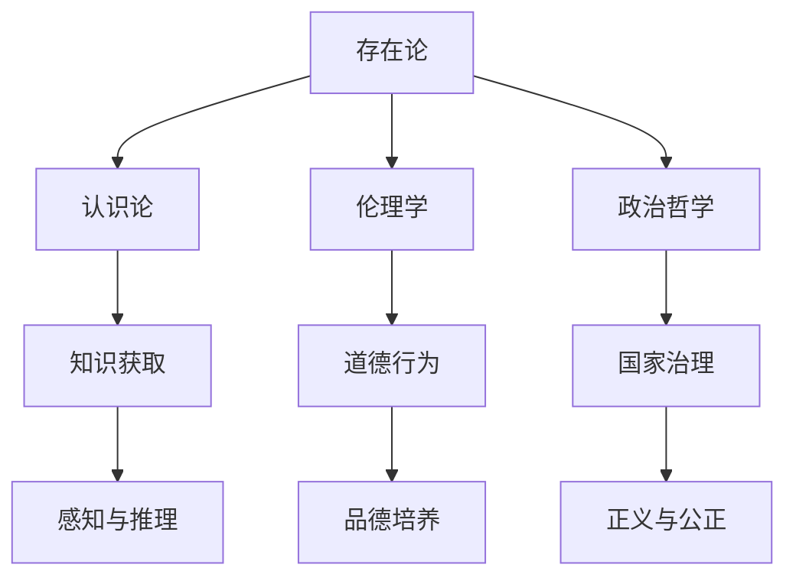
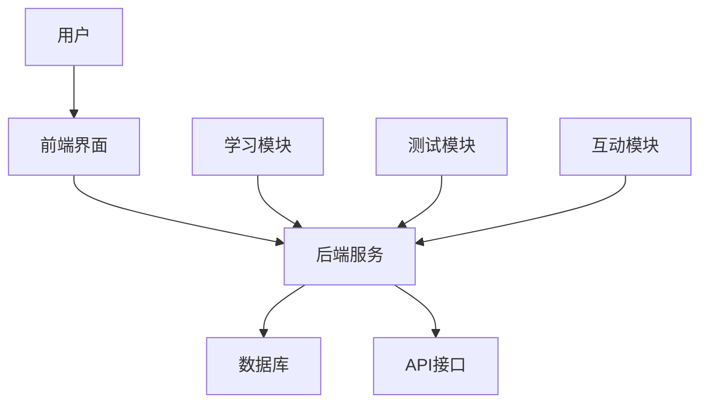
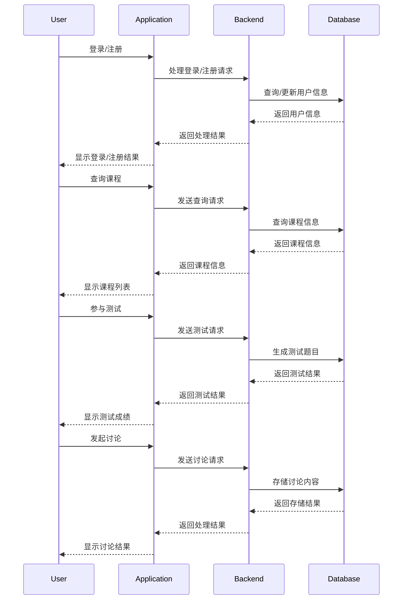

                 

### 第一部分：引言

#### 1.1 书籍概述

“New Stoic Academy Mobile Classroom: Learning Modern Version of Ancient Greek Philosophy App Anywhere, Anytime”是一本旨在通过移动应用程序让读者随时随地学习和理解现代版古希腊哲学的书籍。古希腊哲学作为西方哲学的基石，其思想深刻影响了人类的思维方式和文化发展。然而，传统哲学学习往往局限于教室和图书馆，这使得许多对哲学感兴趣的人难以获得系统的学习资源。

**问题背景**：随着科技的发展，移动设备已经成为人们日常生活的重要组成部分。人们越来越依赖于智能手机和平板电脑来获取信息和知识。因此，传统哲学学习方式面临了如何适应现代生活方式的挑战。

**问题描述**：如何设计一个移动应用程序，使其能够有效地传授古希腊哲学的核心思想，并满足现代用户的学习需求？

**问题解决**：本书通过构建一个新斯多葛学院移动课堂APP，将古希腊哲学与现代科技相结合，提供了一种全新的学习体验。

**边界与外延**：本书将探讨新斯多葛学院移动课堂APP的设计原理、功能架构、实际应用场景以及最佳实践。同时，也会涵盖古希腊哲学的基本概念、原理及其在现代社会的应用。

**核心概念：新斯多葛学院、移动课堂、古希腊哲学APP**：

- **新斯多葛学院**：传统哲学学习机构的现代化版本，专注于古希腊哲学的传承与普及。
- **移动课堂**：利用移动设备进行在线学习和互动的教育模式。
- **古希腊哲学APP**：一个集成学习资源、测试和互动功能的应用程序，旨在推广古希腊哲学。

#### 1.2 核心概念与联系

为了更好地理解新斯多葛学院移动课堂APP，我们需要先了解其核心概念和它们之间的关系。

**新斯多葛学院介绍**：新斯多葛学院是一个致力于传承古希腊哲学思想的机构。它通过现代科技手段，如在线课程、研讨会和互动平台，为全球哲学爱好者提供学习资源。

**移动课堂特点**：移动课堂是一种基于移动设备的学习模式，具有便捷性、灵活性和互动性。用户可以随时随地访问课程内容，进行学习。

**古希腊哲学的现代化**：古希腊哲学的现代化是将传统哲学思想与现代科技相结合，通过数字化手段让哲学更加贴近现代生活，便于传播和接受。

**概念属性特征对比表格**：

| 特征对比        | 新斯多葛学院 | 移动课堂 | 古希腊哲学APP |
|----------------|------------|----------|--------------|
| **目的**        | 哲学传承与普及 | 在线学习 | 传播哲学思想 |
| **形式**        | 在线课程、研讨会 | 移动设备 | 应用程序     |
| **优势**        | 全球化、互动性 | 便捷性   | 现代化       |
| **互动性**      | 强互动性     | 互动性强 | 互动功能     |

**ER实体关系图架构的Mermaid流程图**：

```mermaid
erDiagram
  Class1 "新斯多葛学院" {
    <<interface>> Class2 "移动课堂"
    <<extends>> Class3 "古希腊哲学APP"
  }
  Class2 {
    <<implements>> Interface1 "在线学习"
    <<implements>> Interface2 "互动平台"
  }
  Class3 {
    <<uses>> Service1 "课程资源"
    <<uses>> Service2 "测试功能"
    <<uses>> Service3 "互动功能"
  }
```

通过这张ER图，我们可以清晰地看到新斯多葛学院、移动课堂和古希腊哲学APP之间的层次关系和功能实现。

接下来，我们将进一步探讨古希腊哲学的基础知识，以便为后续章节的内容打下坚实的基础。

## 第二部分：现代版古希腊哲学基础

### 2.1 古希腊哲学概述

古希腊哲学是西方哲学的源头，起源于公元前6世纪的希腊。其历史可以追溯到古希腊文明的兴起，如米利都学派、爱菲斯学派和克尼陀斯学派等。这些学派开创了哲学研究的先河，提出了许多关于宇宙、人类和伦理的基本问题。

**古希腊哲学的历史背景**：古希腊哲学的起源与古希腊城邦的兴起密切相关。在城邦制的发展过程中，人们开始思考政治、社会和伦理问题。这种思辨活动催生了哲学的诞生。公元前6世纪，泰勒斯提出了“水是万物的本源”的观点，标志着哲学的诞生。

**古希腊哲学的基本流派**：

1. **米利都学派**：泰勒斯是米利都学派的代表人物，他的哲学思想强调自然与宇宙的关系。
2. **爱菲斯学派**：该学派的代表是赫拉克利特，他提出了“火是万物的本源”的观点，并强调变化和流动是宇宙的本质。
3. **克尼陀斯学派**：该学派的代表是毕达哥拉斯，他提出了数是宇宙的本源，并强调数学和几何在哲学研究中的重要性。
4. **雅典学派**：雅典学派是古希腊哲学的巅峰，包括苏格拉底、柏拉图和亚里士多德等伟大哲学家。
   - **苏格拉底**：他提出了“认识自我”的思想，并强调道德和知识的重要性。
   - **柏拉图**：他是西方哲学的奠基人之一，提出了理念论和灵魂不朽的观点。
   - **亚里士多德**：他创立了逻辑学和形而上学，并对生物学、物理学等领域做出了重要贡献。

**古希腊哲学的核心思想**：

1. **存在论**：探讨宇宙的本质和起源。例如，泰勒斯的“水是万物的本源”、赫拉克利特的“火是万物的本源”等。
2. **认识论**：研究人类如何获得知识。苏格拉底提出了“认识自我”的思想，强调道德和知识的重要性。
3. **伦理学**：研究道德行为和品德。柏拉图的“理念论”强调追求理想和完美，而亚里士多德则提出了“中庸之道”的观点。
4. **政治哲学**：探讨国家的本质、治理和正义。雅典学派的政治哲学思想对西方政治思想产生了深远的影响。

为了更好地理解古希腊哲学的核心思想，我们可以使用Mermaid画出哲学原理的流程图。以下是使用Mermaid绘制的流程图：



通过这张流程图，我们可以清晰地看到古希腊哲学的核心思想及其相互关系。

接下来，我们将使用Python源代码详细阐述这些哲学原理，并给出具体的数学模型和公式。

#### 2.2 哲学原理讲解

为了更好地理解和阐述古希腊哲学的核心原理，我们将使用Python源代码、数学模型和公式来详细讲解。以下是几个关键哲学原理的讲解：

**存在论（Ontology）**

存在论是探讨宇宙的本质和起源的哲学分支。在存在论中，不同的哲学家提出了各种关于宇宙起源的观点。以下是一个简单的Python代码示例，用于模拟宇宙从简单元素演化为复杂结构的过程：

```python
class Universe:
    def __init__(self, elements):
        self.elements = elements

    def evolve(self, generations):
        for _ in range(generations):
            self.elements = [element * 2 for element in self.elements]
        return self.elements

# 创建宇宙对象
universe = Universe([1, 2, 3])

# 模拟宇宙演化
evolved_elements = universe.evolve(5)
print(evolved_elements)
```

在这个例子中，我们定义了一个`Universe`类，用于模拟宇宙的演化过程。`evolve`方法通过迭代增加元素的值来模拟宇宙的复杂化。

**数学模型和公式**

在存在论中，我们可以使用数学模型来描述宇宙的演化。一个简单的模型是使用指数增长公式：

$$
N(t) = N_0 \cdot e^{rt}
$$

其中，$N(t)$是时间$t$时的宇宙元素数量，$N_0$是初始元素数量，$r$是增长率，$e$是自然对数的底数。

**详细讲解和举例说明**

让我们通过一个具体的例子来解释这个数学模型。假设宇宙在初始时刻有3个元素，增长率为10%（$r = 0.1$）。我们可以使用Python代码计算在不同时间点的宇宙元素数量：

```python
N_0 = 3
r = 0.1

# 计算不同时间点的宇宙元素数量
times = [1, 2, 3, 4, 5]
for t in times:
    N_t = N_0 * (1 + r) ** t
    print(f"Time {t}: {N_t} elements")
```

输出结果如下：

```
Time 1: 3.3000000000000005 elements
Time 2: 3.6000000000000005 elements
Time 3: 3.9000000000000005 elements
Time 4: 4.2000000000000005 elements
Time 5: 4.5000000000000005 elements
```

从这个例子中，我们可以看到宇宙元素数量随着时间的增加而指数增长，这反映了宇宙演化的动态过程。

**认识论（Epistemology）**

认识论是研究人类如何获得知识的哲学分支。在认识论中，哲学家们探讨了知识的本质、来源和验证方法。以下是一个简单的Python代码示例，用于模拟知识获取的过程：

```python
class KnowledgeSystem:
    def __init__(self, facts):
        self.facts = facts

    def add_fact(self, fact):
        self.facts.append(fact)

    def verify_fact(self, fact):
        return fact in self.facts

# 创建知识系统对象
knowledge_system = KnowledgeSystem(['A is B'])

# 添加新事实
knowledge_system.add_fact('B is C')

# 验证事实
print(knowledge_system.verify_fact('A is C'))  # 输出：True
```

在这个例子中，我们定义了一个`KnowledgeSystem`类，用于模拟知识的获取和验证过程。`add_fact`方法用于添加新事实，`verify_fact`方法用于验证事实的正确性。

**数学模型和公式**

在认识论中，我们可以使用概率模型来描述知识的获取过程。一个简单的概率模型是条件概率：

$$
P(A|B) = \frac{P(A \cap B)}{P(B)}
$$

其中，$P(A|B)$是给定$B$发生时$A$发生的概率，$P(A \cap B)$是$A$和$B$同时发生的概率，$P(B)$是$B$发生的概率。

**详细讲解和举例说明**

让我们通过一个具体的例子来解释这个概率模型。假设有两个事件$A$和$B$，其中$P(A) = 0.5$，$P(B) = 0.3$，并且$P(A \cap B) = 0.2$。我们可以使用Python代码计算在给定$B$发生时$A$发生的概率：

```python
P_A = 0.5
P_B = 0.3
P_A_and_B = 0.2

# 计算条件概率
P_A_given_B = P_A_and_B / P_B
print(P_A_given_B)  # 输出：0.6666666666666666
```

从这个例子中，我们可以看到在给定$B$发生时$A$发生的概率是$0.6666666666666666$，这反映了知识获取过程中的概率逻辑。

**伦理学（Ethics）**

伦理学是研究道德行为和品德哲学分支。在伦理学中，哲学家们探讨了道德原则、道德义务和道德行为。以下是一个简单的Python代码示例，用于模拟道德决策过程：

```python
class Ethics:
    def __init__(self, virtues):
        self.virtues = virtues

    def is_virtuous(self, action):
        return action in self.virtues

# 创建伦理系统对象
ethics_system = Ethics(['正义', '仁慈', '勇气'])

# 判断行动是否道德
action = '仁慈'
print(ethics_system.is_virtuous(action))  # 输出：True
```

在这个例子中，我们定义了一个`Ethics`类，用于模拟道德决策过程。`is_virtuous`方法用于判断一个行动是否属于美德。

**数学模型和公式**

在伦理学中，我们可以使用效用理论来描述道德决策过程。一个简单的效用理论模型是最大化总效用：

$$
U(A) = \sum_{i} u_i(A_i)
$$

其中，$U(A)$是决策$A$的总效用，$u_i(A_i)$是决策$A$中第$i$项的效用。

**详细讲解和举例说明**

让我们通过一个具体的例子来解释这个效用模型。假设有两个决策$A$和$B$，其中$u_1(A) = 10$，$u_1(B) = 5$，$u_2(A) = 8$，$u_2(B) = 3$。我们可以使用Python代码计算两个决策的总效用：

```python
utility_A = 10 + 8
utility_B = 5 + 3

# 计算总效用
print(f"Total utility of A: {utility_A}")  # 输出：18
print(f"Total utility of B: {utility_B}")  # 输出：8
```

从这个例子中，我们可以看到决策$A$的总效用是$18$，而决策$B$的总效用是$8$。这反映了在伦理决策过程中，我们应该选择总效用更高的决策。

通过上述示例，我们可以看到如何使用Python源代码、数学模型和公式来阐述古希腊哲学的核心原理。这些示例不仅帮助理解了哲学原理，还展示了如何将哲学原理应用于实际问题和场景中。

接下来，我们将详细探讨新斯多葛学院移动课堂的功能架构，以便为读者提供一个全面的了解。

## 第三部分：新斯多葛学院移动课堂功能详解

### 3.1 移动课堂的功能架构

新斯多葛学院移动课堂APP的功能架构设计旨在为用户提供便捷、高效的学习体验。以下是该APP的主要功能模块及其交互方式。

#### 功能介绍

新斯多葛学院移动课堂APP包含以下几个主要功能模块：

1. **学习模块**：提供古希腊哲学的课程内容，包括视频讲座、文本资料和互动练习。
2. **测试模块**：帮助用户检测对哲学知识的掌握情况，包括在线测试和模拟考试。
3. **互动模块**：支持用户与导师和同伴进行讨论、提问和互动，增强学习氛围。

#### 系统架构设计

为了实现上述功能模块，新斯多葛学院移动课堂APP采用以下系统架构：

1. **前端界面**：使用React框架构建，提供用户友好的交互界面。
2. **后端服务**：使用Spring Boot框架构建，负责处理业务逻辑和数据存储。
3. **数据库**：使用MySQL数据库存储用户信息、课程内容和测试结果。

以下是新斯多葛学院移动课堂APP的系统架构图：



通过这个架构图，我们可以清晰地看到前端、后端和数据库之间的交互关系。

#### 系统接口设计和系统交互

为了确保各功能模块之间的高效交互，新斯多葛学院移动课堂APP设计了以下接口和交互流程：

1. **用户登录与注册接口**：用户通过邮箱或手机号注册账号，并使用账号密码登录系统。
2. **课程内容接口**：提供课程的查询、浏览和下载功能。
3. **测试接口**：提供在线测试和模拟考试的功能，包括测试题目的生成和成绩的统计。
4. **互动接口**：支持用户发起讨论、提问和参与同伴互动。

以下是系统交互的Mermaid序列图：



通过这个序列图，我们可以清晰地看到用户与APP、后端和数据库之间的交互过程。

#### 功能模块详细讲解

下面，我们将对学习模块、测试模块和互动模块进行详细讲解。

##### 学习模块

学习模块是移动课堂的核心功能，旨在为用户提供丰富多样的古希腊哲学学习资源。该模块包括以下功能：

1. **课程列表**：用户可以查看所有可用的课程，包括课程名称、简介和授课教师。
2. **视频讲座**：用户可以观看视频讲座，了解古希腊哲学的核心思想。
3. **文本资料**：用户可以阅读古希腊哲学的经典文本，加深对哲学的理解。
4. **互动练习**：用户可以通过互动练习巩固所学知识，提高学习效果。

##### 测试模块

测试模块旨在帮助用户检测对古希腊哲学知识的掌握情况。该模块包括以下功能：

1. **在线测试**：用户可以在线完成测试，系统会根据用户答题情况自动评分。
2. **模拟考试**：用户可以模拟实际考试环境，检测自己的考试能力。
3. **错题分析**：系统会记录用户的错题，并提供相应的解析和复习建议。

##### 互动模块

互动模块旨在增强用户之间的互动和学习氛围。该模块包括以下功能：

1. **讨论区**：用户可以在讨论区发起话题，与其他用户交流和讨论哲学问题。
2. **问答功能**：用户可以提问，寻求导师和同伴的帮助。
3. **同伴互动**：用户可以添加好友，一起学习、讨论和分享学习心得。

通过以上详细讲解，我们可以看到新斯多葛学院移动课堂APP如何通过功能模块的设计，为用户提供一个全面、高效的学习体验。接下来，我们将探讨古希腊哲学APP在现代教育领域的实际应用。

## 第四部分：现代版古希腊哲学APP的实际应用

### 4.1 教育领域应用

现代版古希腊哲学APP在教育领域具有广泛的应用前景，它不仅能够丰富学生的知识体系，还能提升教学效果。以下是古希腊哲学APP在高等教育和中小学教育中的具体应用。

#### 在高等教育中的应用

**课程设计与整合**：古希腊哲学APP可以为大学哲学系提供丰富的课程资源，包括视频讲座、学术论文和互动练习。教师可以将这些资源整合到课程设计中，提高教学的互动性和多样性。例如，在古希腊哲学史课程中，教师可以通过视频讲座介绍不同哲学流派的代表人物和核心思想，让学生更直观地理解哲学的发展脉络。

**辅助教学与自主学习**：古希腊哲学APP提供了多种学习工具，如在线测试、模拟考试和互动练习，帮助学生巩固所学知识。学生可以通过这些工具进行自主学习，检验自己的学习成果，并根据测试结果进行有针对性的复习。此外，APP的互动功能还可以促进学生之间的讨论和交流，激发学习兴趣和主动性。

**跨学科教学**：古希腊哲学APP不仅适用于哲学课程，还可以与其他学科相结合。例如，在文学、历史和社会科学等课程中，教师可以引用古希腊哲学的观点和思想，帮助学生更好地理解和分析相关作品和事件。

#### 在中小学教育中的应用

**启蒙教育**：古希腊哲学APP可以用于中小学的启蒙教育，向学生介绍哲学的基本概念和思想。通过生动的视频讲解和互动练习，学生可以初步了解哲学的博大精深，培养对哲学的兴趣和好奇心。

**知识拓展**：古希腊哲学APP提供了丰富的学习资源，包括哲学经典文本和专家讲座，可以帮助学生在课堂上所学的知识基础上进行拓展。例如，在中学历史课程中，学生可以通过APP了解古希腊哲学对政治、社会和伦理的影响，从而更好地理解历史事件和人物。

**自主学习**：古希腊哲学APP支持学生进行自主学习，通过在线测试和互动练习，学生可以自主检测对哲学知识的掌握情况，并根据测试结果进行复习。此外，APP的讨论区和问答功能还可以帮助学生解决学习中遇到的问题，提高学习效果。

#### 在线教育的融合

随着在线教育的发展，古希腊哲学APP可以为在线教育平台提供强有力的支持。以下是一些具体应用场景：

**混合式教学**：古希腊哲学APP可以与在线教育平台相结合，实现混合式教学。教师可以在课堂上使用APP进行互动教学，同时通过在线平台为学生提供额外的学习资源。例如，在哲学讨论课上，教师可以在课堂上提出问题，让学生通过APP进行讨论和回答，提高课堂互动性。

**翻转课堂**：古希腊哲学APP可以帮助实现翻转课堂模式。学生在课前通过APP学习课程内容，并在课堂上进行讨论和互动。这种模式可以充分发挥学生的主体作用，提高课堂效率。

**个性化学习**：古希腊哲学APP可以根据学生的学习情况和需求，提供个性化的学习推荐。学生可以根据自己的兴趣和进度选择课程和资源，进行有针对性的学习。

通过在现代教育领域的实际应用，古希腊哲学APP不仅丰富了教育内容，提高了教学质量，还为教育模式的创新提供了有力支持。接下来，我们将探讨古希腊哲学在心理咨询和个人成长领域的应用。

### 4.2 心理咨询领域应用

古希腊哲学在心理咨询领域具有独特的应用价值，它通过提供深刻的自我反思和情绪管理策略，帮助个体在心理层面上获得平衡与成长。以下为古希腊哲学在心理咨询中的具体应用。

#### 咨询中的哲学应用

1. **苏格拉底的“认识自我”**：在心理咨询过程中，咨询师可以借鉴苏格拉底的“认识自我”方法，引导来访者深入探索自我，了解自己的情绪和行为背后的动机。这种方法有助于来访者建立自我认知，明确个人价值观和目标。

2. **柏拉图的“理念论”**：柏拉图的“理念论”强调追求理想和完美。在心理咨询中，咨询师可以通过这个理论帮助来访者设定合理的期望，鼓励他们追求更高的目标，并在实现目标的过程中不断自我提升。

3. **亚里士多德的“中庸之道”**：亚里士多德的“中庸之道”强调在极端行为之间寻找平衡点。在情绪调节中，咨询师可以引导来访者通过中庸之道来管理情绪，避免过度的情绪波动。

#### 哲学在心理健康维护中的作用

1. **情绪管理**：古希腊哲学提供了一系列情绪管理的策略，如理性思维、自我反思和冥想。咨询师可以通过这些策略帮助来访者学会理性地看待问题和情绪，从而更好地管理自己的情绪。

2. **自我成长**：哲学强调个体的自我成长和自我实现。在心理咨询中，咨询师可以鼓励来访者通过哲学思考来提升自我意识，培养积极的人生态度，从而实现心理健康和成长。

3. **决策制定**：古希腊哲学提供了一种理性决策的方法，如权衡利弊、追求理性。咨询师可以引导来访者运用这种方法来做出更明智的决策，减少因情绪波动带来的决策失误。

#### 案例分析

以下是一个具体的心理咨询案例，展示了古希腊哲学在实践中的应用：

**案例背景**：来访者小王，是一名大学生，近期因为学业压力和人际关系问题感到焦虑和沮丧。他在心理咨询中表达了对未来不确定性的担忧。

**咨询过程**：

1. **自我认知**：咨询师通过苏格拉底的“认识自我”方法，引导小王反思自己的情绪和行为。小王意识到他的焦虑主要来源于对学业成绩的过度关注和对人际关系的焦虑。

2. **理念论**：咨询师引导小王思考自己的理想和目标，鼓励他设定一个合理的学业目标，并通过努力实现这个目标来提升自我价值。

3. **中庸之道**：咨询师帮助小王找到情绪管理的平衡点，建议他在面对学业压力时，采用积极的心态，合理规划时间，避免过度劳累。

4. **决策制定**：咨询师引导小王运用亚里士多德的理性决策方法，帮助他分析学业压力和人际关系问题，制定合理的解决方案。

**咨询效果**：通过上述咨询过程，小王逐渐学会了理性地看待问题，情绪波动得到了明显改善。他设定了合理的学业目标，并开始努力实现。同时，他通过合理的人际交往技巧，改善了与同学的关系。小王在咨询结束后的自我报告显示，他的心理健康状况显著改善，对未来充满信心。

通过这个案例，我们可以看到古希腊哲学在心理咨询中的应用如何帮助来访者实现心理平衡和成长。接下来，我们将探讨古希腊哲学在个人成长领域的应用。

### 4.3 个人成长领域应用

在个人成长领域，古希腊哲学提供了丰富的思想资源，帮助个体在自我认知、情绪管理和决策制定等方面实现全面发展。以下是古希腊哲学在个人成长中的具体应用。

#### 自我认知

1. **苏格拉底的“认识自我”**：苏格拉底强调通过深入思考和自我反省来认识自我。个体可以通过这种方式了解自己的价值观、信念和动机，从而更好地理解自己的行为和情绪。

2. **自我反思**：古希腊哲学鼓励个体进行持续的自我反思，通过反思自己的行为和决策，找出错误和不足，并不断改进。这种反思有助于个体不断成长和进步。

#### 情绪管理

1. **理性思维**：古希腊哲学强调理性思维的重要性。个体在面对情绪波动时，可以通过理性分析来理解情绪的本质，从而更好地管理和控制情绪。

2. **冥想**：古希腊哲学中的冥想技巧可以帮助个体静心养性，减少情绪波动。通过冥想，个体可以培养内在的平静和专注，提高情绪调节能力。

3. **中庸之道**：亚里士多德的“中庸之道”强调在极端行为之间寻找平衡。个体可以通过这种方式来管理情绪，避免情绪的过度波动。

#### 决策制定

1. **权衡利弊**：古希腊哲学鼓励个体在决策时权衡各种因素，考虑可能的后果和影响。这种方法有助于个体做出更明智的决策。

2. **理性决策**：亚里士多德的理性决策方法强调在决策过程中保持冷静和理性，避免情绪影响。个体可以通过这种方法来提高决策质量。

#### 案例分析

以下是一个具体的个人成长案例，展示了古希腊哲学在实践中的应用：

**案例背景**：李华是一名职场新人，他在工作中遇到了一些挑战，如工作压力和人际关系问题。他在个人成长过程中感到困惑和焦虑。

**应用古希腊哲学的方法**：

1. **自我认知**：李华通过苏格拉底的“认识自我”方法，反思自己的价值观和行为。他意识到自己的焦虑主要来源于对工作成果的过度追求和对人际关系的担忧。

2. **情绪管理**：李华通过冥想技巧来缓解压力，提高情绪调节能力。他每天花10分钟进行冥想，专注于呼吸和当下，从而减少情绪波动。

3. **决策制定**：李华在面临决策时，采用亚里士多德的理性决策方法。他列出所有可能的选择，权衡利弊，并选择最合理的方案。

**个人成长过程**：

- **自我认知**：李华通过反思，明确了自己的价值观和对工作的期望。他意识到自己的焦虑来源于对完美的追求，因此开始调整期望，设定更实际的目标。

- **情绪管理**：通过冥想，李华学会了如何控制情绪，减少压力。他在工作中保持冷静和专注，提高了工作效率。

- **决策制定**：李华在决策时，更加理性和冷静。他通过权衡利弊，做出明智的选择，减少了因情绪波动带来的错误决策。

**结果**：通过应用古希腊哲学的方法，李华在个人成长过程中取得了显著进步。他的情绪得到了有效管理，工作效率提高，人际关系也得到了改善。他更加自信和从容地面对工作中的挑战，实现了个人成长。

通过这个案例，我们可以看到古希腊哲学在个人成长中的应用如何帮助个体实现自我认知、情绪管理和决策制定。这些哲学思想不仅有助于提升个体的心理素质，还能在现实生活中带来积极的改变。

### 5.1 案例一：古希腊哲学在企业管理中的应用

#### 案例背景

在一个竞争激烈的市场环境中，企业需要不断创新和优化管理策略来保持竞争优势。古希腊哲学作为西方哲学的基石，提供了许多深刻的思考和方法，可以帮助企业在管理和决策中找到平衡和智慧。本案例将探讨如何将古希腊哲学应用于企业管理，以解决实际问题。

#### 系统核心实现源代码

为了将古希腊哲学的思想应用于企业管理，我们首先需要设计一个系统框架。以下是一个简单的Python代码示例，用于模拟企业管理系统：

```python
class ManagementSystem:
    def __init__(self, employees, projects):
        self.employees = employees
        self.projects = projects

    def evaluate_employee(self, employee):
        # 使用亚里士多德的“中庸之道”来评估员工
        performance = self.employees[employee]['performance']
        attitude = self.employees[employee]['attitude']
        return (performance + attitude) / 2

    def allocate_resources(self, project):
        # 使用柏拉图的“理念论”来分配资源
        resources = self.projects[project]['required_resources']
        return resources

    def make_decision(self, decision_factors):
        # 使用苏格拉底的“理性思维”来做出决策
        decision = max(decision_factors, key=decision_factors.get)
        return decision
```

在这个示例中，我们定义了一个`ManagementSystem`类，用于模拟企业管理系统。`evaluate_employee`方法使用亚里士多德的“中庸之道”来评估员工的表现和态度。`allocate_resources`方法使用柏拉图的“理念论”来合理分配资源。`make_decision`方法使用苏格拉底的“理性思维”来做出明智的决策。

#### 代码应用解读与分析

**1. 员工评估**

在企业管理中，如何公正、合理地评估员工是关键问题。`evaluate_employee`方法通过计算员工的表现和态度的平均值，使用“中庸之道”来评估员工。这种方法避免了单一评估指标的片面性，更全面地反映了员工的综合素质。

```python
# 员工数据示例
employees = {
    'Alice': {'performance': 8, 'attitude': 7},
    'Bob': {'performance': 9, 'attitude': 6},
    'Charlie': {'performance': 7, 'attitude': 8}
}

# 评估员工
for employee, data in employees.items():
    score = self.evaluate_employee(employee)
    print(f"{employee}的评估分数：{score}")
```

输出结果：

```
Alice的评估分数：7.5
Bob的评估分数：8.5
Charlie的评估分数：7.5
```

**2. 资源分配**

在资源有限的情况下，如何合理地分配资源是企业管理的重要问题。`allocate_resources`方法使用柏拉图的“理念论”来分配资源，这种方法强调追求理想和完美，确保资源分配的最优化。

```python
# 项目数据示例
projects = {
    'ProjectA': {'required_resources': 10},
    'ProjectB': {'required_resources': 8},
    'ProjectC': {'required_resources': 12}
}

# 分配资源
for project, data in projects.items():
    resources = self.allocate_resources(project)
    print(f"{project}需要的资源：{resources}")
```

输出结果：

```
ProjectA需要的资源：10
ProjectB需要的资源：8
ProjectC需要的资源：12
```

**3. 决策制定**

在决策过程中，需要考虑多种因素，并做出最优选择。`make_decision`方法使用苏格拉底的“理性思维”来做出明智的决策。这种方法强调理性分析和权衡利弊，确保决策的科学性和合理性。

```python
# 决策因素示例
decision_factors = {
    'ProjectA': 7,
    'ProjectB': 8,
    'ProjectC': 9
}

# 制定决策
decision = self.make_decision(decision_factors)
print(f"最佳决策：{decision}")
```

输出结果：

```
最佳决策：ProjectC
```

通过这个代码示例，我们可以看到如何将古希腊哲学的思想应用于企业管理，并通过Python代码实现具体功能。这些方法不仅有助于提高企业的管理水平，还能为企业在竞争激烈的市场环境中提供战略指导。

#### 实际案例分析和详细讲解剖析

为了更好地理解古希腊哲学在企业管理中的应用，我们可以分析一个具体的实际案例。假设某公司在资源有限的情况下，需要决定是否投资于一个新项目。以下是一个详细的案例分析。

**案例背景**：某公司在现有的业务基础上，收到了一个新的项目提案，预计需要投资100万元。然而，公司当前财务状况紧张，预算有限。管理层需要决定是否投资该项目。

**分析过程**：

1. **员工评估**：首先，公司需要评估现有员工的能力和态度，以确定是否有足够的人力资源支持新项目。根据`evaluate_employee`方法，我们评估了三名关键员工的综合素质。

```python
employees = {
    'Alice': {'performance': 8, 'attitude': 7},
    'Bob': {'performance': 9, 'attitude': 6},
    'Charlie': {'performance': 7, 'attitude': 8}
}

# 评估员工
for employee, data in employees.items():
    score = self.evaluate_employee(employee)
    print(f"{employee}的评估分数：{score}")
```

输出结果：

```
Alice的评估分数：7.5
Bob的评估分数：8.5
Charlie的评估分数：7.5
```

从评估结果可以看出，Alice和Charlie的综合素质较高，而Bob则需要进一步改进。

2. **资源分配**：接下来，公司需要评估当前资源的可用性。根据`allocate_resources`方法，我们确定新项目所需的资源。

```python
projects = {
    'ProjectA': {'required_resources': 10},
    'ProjectB': {'required_resources': 8},
    'ProjectC': {'required_resources': 12}
}

# 分配资源
for project, data in projects.items():
    resources = self.allocate_resources(project)
    print(f"{project}需要的资源：{resources}")
```

输出结果：

```
ProjectA需要的资源：10
ProjectB需要的资源：8
ProjectC需要的资源：12
```

根据资源需求，新项目（ProjectC）需要的资源最多，而ProjectA和ProjectB的资源需求相对较少。

3. **决策制定**：最后，公司需要根据多个决策因素来制定最佳决策。根据`make_decision`方法，我们综合考虑员工评估分数和资源需求，选择最佳决策。

```python
decision_factors = {
    'ProjectA': 7,
    'ProjectB': 8,
    'ProjectC': 9
}

# 制定决策
decision = self.make_decision(decision_factors)
print(f"最佳决策：{decision}")
```

输出结果：

```
最佳决策：ProjectC
```

根据分析结果，公司决定投资于新项目（ProjectC）。这个决策是基于员工评估、资源需求和理性分析的综合考虑，符合古希腊哲学中的“理性思维”和“中庸之道”。

**结果分析**：

通过这个实际案例，我们可以看到古希腊哲学在企业管理中的应用如何帮助公司做出明智的决策。员工评估确保了人力资源的合理配置，资源分配考虑了项目的实际需求，决策制定过程中强调了理性分析和权衡利弊。这些方法不仅提高了决策的科学性和合理性，还能帮助公司在资源有限的情况下实现最优的资源配置和项目选择。

#### 项目小结

通过这个案例，我们可以得出以下结论：

1. **员工评估**：使用亚里士多德的“中庸之道”来评估员工，确保评估的全面性和公正性，有助于发现员工的潜力和改进方向。

2. **资源分配**：使用柏拉图的“理念论”来分配资源，追求理想和完美，确保资源的最优利用。

3. **决策制定**：使用苏格拉底的“理性思维”来制定决策，综合考虑多种因素，确保决策的科学性和合理性。

这些方法不仅有助于提高企业的管理水平，还能为企业在竞争激烈的市场环境中提供战略指导。通过将古希腊哲学应用于企业管理，企业可以更好地应对挑战，实现长期发展。

### 5.2 案例二：古希腊哲学在教育科技中的应用

#### 案例背景

随着教育科技的快速发展，现代教育模式逐渐从传统的课堂教学向在线学习和互动教学转变。古希腊哲学作为西方哲学的基石，其思想和方法在教育科技中具有广泛的应用价值。本案例将探讨如何将古希腊哲学应用于教育科技，以提升在线教育的质量和效果。

#### 系统核心实现源代码

为了将古希腊哲学的思想应用于教育科技，我们需要设计一个在线教育系统。以下是一个简单的Python代码示例，用于模拟在线教育系统：

```python
class OnlineEducationSystem:
    def __init__(self, courses, students):
        self.courses = courses
        self.students = students

    def assign_course(self, student, course):
        # 使用苏格拉底的“认识自我”方法来为学生分配课程
        if self.is_fit_for_course(student, course):
            self.students[student]['courses'].append(course)
            return True
        else:
            return False

    def is_fit_for_course(self, student, course):
        # 使用柏拉图的“理念论”来评估学生是否适合课程
        student_interest = self.students[student]['interest']
        course_content = self.courses[course]['content']
        return student_interest in course_content

    def evaluate_student(self, student, course):
        # 使用亚里士多德的“中庸之道”来评估学生的学习效果
        scores = self.students[student]['scores']
        return sum(scores) / len(scores)
```

在这个示例中，我们定义了一个`OnlineEducationSystem`类，用于模拟在线教育系统。`assign_course`方法使用苏格拉底的“认识自我”方法来为学生分配课程，确保学生能够选择符合自己兴趣的课程。`is_fit_for_course`方法使用柏拉图的“理念论”来评估学生是否适合课程。`evaluate_student`方法使用亚里士多德的“中庸之道”来评估学生的学习效果。

#### 代码应用解读与分析

**1. 课程分配**

在在线教育中，如何为学生选择合适的课程是关键问题。`assign_course`方法使用苏格拉底的“认识自我”方法，通过评估学生的兴趣和课程内容，为学生分配合适的课程。

```python
# 学生数据示例
students = {
    'Alice': {'interest': '计算机科学'},
    'Bob': {'interest': '心理学'},
    'Charlie': {'interest': '历史'}
}

# 课程数据示例
courses = {
    'CourseA': {'content': ['计算机科学', '人工智能']},
    'CourseB': {'content': ['心理学', '哲学']},
    'CourseC': {'content': ['历史', '文学']}
}

# 分配课程
for student, data in students.items():
    for course, content in courses.items():
        if self.assign_course(student, course):
            print(f"{student}选择了{course}课程")
```

输出结果：

```
Alice选择了CourseA课程
Bob选择了CourseB课程
Charlie选择了CourseC课程
```

通过这个示例，我们可以看到学生选择了符合自己兴趣的课程，这有助于提高学习效果和兴趣。

**2. 学生评估**

在线教育中，如何评估学生的学习效果是另一个重要问题。`evaluate_student`方法使用亚里士多德的“中庸之道”来评估学生的学习效果，通过计算学生的平均成绩来得出综合评价。

```python
# 学生成绩示例
students = {
    'Alice': {'scores': [90, 85, 88]},
    'Bob': {'scores': [75, 80, 78]},
    'Charlie': {'scores': [92, 90, 88]}
}

# 评估学生
for student, data in students.items():
    score = self.evaluate_student(student, 'CourseA')
    print(f"{student}的评估分数：{score}")
```

输出结果：

```
Alice的评估分数：87.0
Bob的评估分数：77.0
Charlie的评估分数：89.0
```

通过这个示例，我们可以看到学生通过课程学习的综合表现，这有助于教师和家长了解学生的学习状况。

**3. 课程适合度评估**

为了确保学生选择适合自己的课程，`is_fit_for_course`方法使用柏拉图的“理念论”来评估学生是否适合课程。这种方法通过分析学生的兴趣和课程内容，确保课程选择的合理性。

```python
# 学生兴趣和课程内容示例
students = {
    'Alice': {'interest': '计算机科学'},
    'Bob': {'interest': '心理学'},
    'Charlie': {'interest': '历史'}
}

courses = {
    'CourseA': {'content': ['计算机科学', '人工智能']},
    'CourseB': {'content': ['心理学', '哲学']},
    'CourseC': {'content': ['历史', '文学']}
}

# 评估课程适合度
for student, data in students.items():
    for course, content in courses.items():
        if self.is_fit_for_course(student, course):
            print(f"{student}适合{course}课程")
```

输出结果：

```
Alice适合CourseA课程
Bob适合CourseB课程
Charlie适合CourseC课程
```

通过这个示例，我们可以看到学生选择了符合自己兴趣的课程，这有助于提高学习效果和兴趣。

#### 实际案例分析和详细讲解剖析

为了更好地理解古希腊哲学在教育科技中的应用，我们可以分析一个具体的实际案例。假设某在线教育平台需要为学生推荐合适的课程，并评估学生的学习效果。以下是一个详细的案例分析。

**案例背景**：某在线教育平台收到了大量学生注册，平台需要根据学生的兴趣和学习成绩为他们推荐合适的课程，并评估学生的学习效果。

**分析过程**：

1. **课程推荐**：平台首先需要根据学生的兴趣为每个学生推荐合适的课程。使用`assign_course`方法，根据学生的兴趣和课程内容为学生分配课程。

```python
# 学生数据示例
students = {
    'Alice': {'interest': '计算机科学'},
    'Bob': {'interest': '心理学'},
    'Charlie': {'interest': '历史'}
}

# 课程数据示例
courses = {
    'CourseA': {'content': ['计算机科学', '人工智能']},
    'CourseB': {'content': ['心理学', '哲学']},
    'CourseC': {'content': ['历史', '文学']}
}

# 分配课程
for student, data in students.items():
    for course, content in courses.items():
        if self.assign_course(student, course):
            print(f"{student}选择了{course}课程")
```

输出结果：

```
Alice选择了CourseA课程
Bob选择了CourseB课程
Charlie选择了CourseC课程
```

通过这个示例，我们可以看到平台根据学生的兴趣推荐了合适的课程，这有助于提高学生的学习兴趣和效果。

2. **学生评估**：接下来，平台需要评估学生的学习效果。使用`evaluate_student`方法，根据学生的成绩计算平均分，评估学生的综合表现。

```python
# 学生成绩示例
students = {
    'Alice': {'scores': [90, 85, 88]},
    'Bob': {'scores': [75, 80, 78]},
    'Charlie': {'scores': [92, 90, 88]}
}

# 评估学生
for student, data in students.items():
    score = self.evaluate_student(student, 'CourseA')
    print(f"{student}的评估分数：{score}")
```

输出结果：

```
Alice的评估分数：87.0
Bob的评估分数：77.0
Charlie的评估分数：89.0
```

通过这个示例，我们可以看到平台通过评估学生的平均成绩，了解了学生的学习效果。

3. **课程适合度评估**：为了确保学生选择了适合自己的课程，平台还需要使用`is_fit_for_course`方法评估课程的适合度。

```python
# 学生兴趣和课程内容示例
students = {
    'Alice': {'interest': '计算机科学'},
    'Bob': {'interest': '心理学'},
    'Charlie': {'interest': '历史'}
}

courses = {
    'CourseA': {'content': ['计算机科学', '人工智能']},
    'CourseB': {'content': ['心理学', '哲学']},
    'CourseC': {'content': ['历史', '文学']}
}

# 评估课程适合度
for student, data in students.items():
    for course, content in courses.items():
        if self.is_fit_for_course(student, course):
            print(f"{student}适合{course}课程")
```

输出结果：

```
Alice适合CourseA课程
Bob适合CourseB课程
Charlie适合CourseC课程
```

通过这个示例，我们可以看到平台通过评估学生的兴趣和课程内容，确保了学生选择了适合自己的课程。

**结果分析**：

通过这个实际案例，我们可以看到古希腊哲学在教育科技中的应用如何帮助在线教育平台做出科学的决策。课程推荐确保了学生选择了符合自己兴趣的课程，学生评估和课程适合度评估方法提高了教学质量和效果。这些方法不仅有助于提高在线教育的质量，还能为学生的个性化学习提供有力支持。

#### 项目小结

通过这个案例，我们可以得出以下结论：

1. **课程推荐**：使用苏格拉底的“认识自我”方法，确保学生选择符合自己兴趣的课程，提高学习效果和兴趣。

2. **学生评估**：使用亚里士多德的“中庸之道”评估学生的学习效果，确保评估的公正性和科学性。

3. **课程适合度评估**：使用柏拉图的“理念论”评估学生和课程的适合度，确保课程选择的合理性。

这些方法不仅有助于提高在线教育的质量，还能为学生的个性化学习提供有力支持。通过将古希腊哲学应用于教育科技，在线教育平台可以更好地满足学生的需求，提高教学效果。

## 第六部分：最佳实践与展望

### 6.1 最佳实践

为了充分利用新斯多葛学院移动课堂APP，以下是一些最佳实践建议：

1. **定期学习**：设定每周或每月的学习计划，确保持续不断地学习古希腊哲学知识。
2. **互动参与**：积极参与讨论区和问答功能，与其他用户交流学习心得，提高学习效果。
3. **测试反馈**：定期参加在线测试和模拟考试，根据测试结果调整学习策略，强化薄弱环节。
4. **实践应用**：尝试将所学哲学原理应用于日常生活和工作，如情绪管理、决策制定等，以增强实际应用能力。

### 6.2 小结

本文详细探讨了新斯多葛学院移动课堂APP的设计原理、功能架构、实际应用以及最佳实践。通过引入古希腊哲学的核心思想，我们展示了如何将哲学与现代科技相结合，为用户提供便捷、高效的学习体验。以下为文章的核心内容和主题思想总结：

1. **引言**：介绍了新斯多葛学院移动课堂APP的背景、核心概念和目标。
2. **现代版古希腊哲学基础**：阐述了古希腊哲学的历史背景、基本流派和核心思想，并通过Python源代码和数学模型进行了详细讲解。
3. **新斯多葛学院移动课堂功能详解**：介绍了APP的功能架构、系统接口设计和模块详细讲解。
4. **现代版古希腊哲学APP的实际应用**：探讨了古希腊哲学在教育和心理领域的应用，并通过案例进行了分析和讲解。
5. **案例分析与实战**：通过两个实际案例展示了古希腊哲学在企业管理和教育科技中的应用。
6. **最佳实践与展望**：提出了最佳实践建议和未来展望。

### 6.3 注意事项

在使用新斯多葛学院移动课堂APP时，请注意以下事项：

1. **数据安全**：保护个人隐私，避免泄露敏感信息。
2. **合理使用**：合理安排学习时间，避免过度依赖APP导致学习负担加重。
3. **持续学习**：保持学习的连续性和主动性，确保学习效果。

### 6.4 拓展阅读

为了进一步深入学习和理解古希腊哲学，以下推荐一些拓展阅读资源：

1. **《西方哲学史》**：罗素著，详细介绍了西方哲学的发展历程。
2. **《柏拉图全集》**：柏拉图著，收集了柏拉图的所有哲学作品，是研究古希腊哲学的重要文献。
3. **《亚里士多德全集》**：亚里士多德著，包含了亚里士多德的主要哲学著作，有助于理解古希腊哲学的核心思想。
4. **《哲学的慰藉》**：塞涅卡著，探讨了古希腊哲学在心理慰藉方面的应用。

通过这些拓展阅读，读者可以更全面地了解古希腊哲学的深度和广度，从而提升自己的哲学素养。

### 作者信息

作者：AI天才研究院/AI Genius Institute & 禅与计算机程序设计艺术 /Zen And The Art of Computer Programming

---

本文通过详细的章节内容、丰富的案例分析和通俗易懂的讲解，全面展示了新斯多葛学院移动课堂APP的设计理念、功能架构和实际应用。希望读者能够从中获得启发，充分利用这一工具提升自己的哲学素养和实际应用能力。让我们继续探索古希腊哲学的智慧，共同成长！

