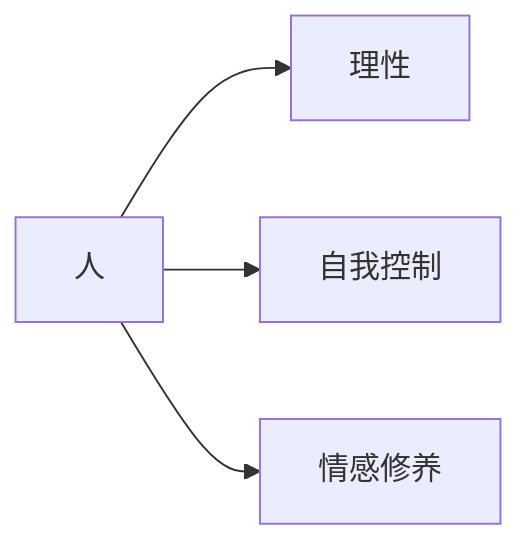
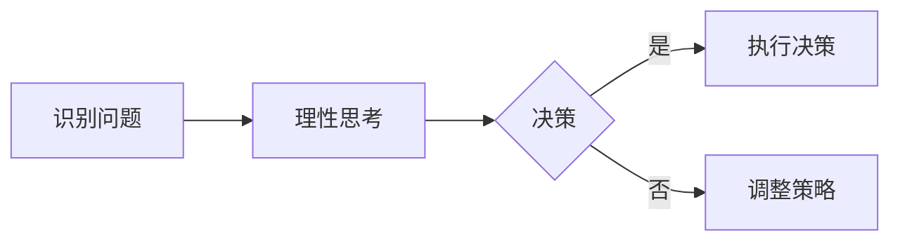
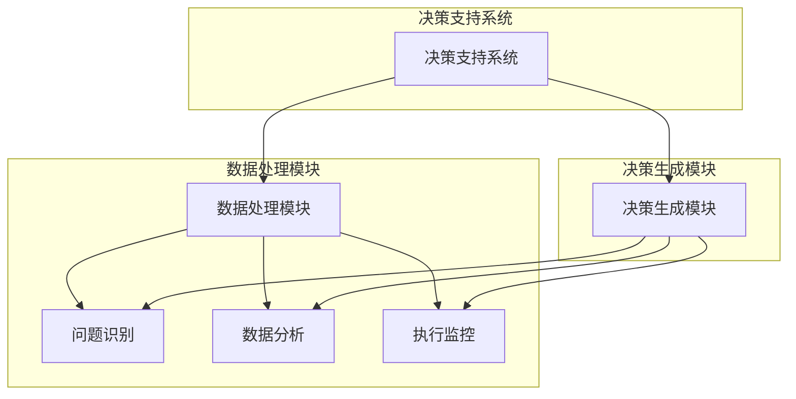
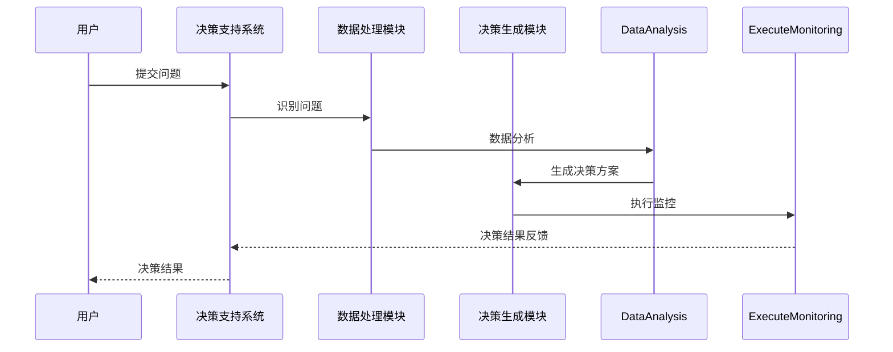

                 

## 引言

《新斯多葛学院：现代版古希腊哲学在线课程》是一本由知名哲学家、心理学家和历史学家共同编写的书籍，旨在让读者深入了解古希腊哲学的核心思想及其在现代生活中的应用。书中通过一系列线上课程，系统地介绍了斯多葛主义、柏拉图主义、亚里士多德主义等古希腊哲学流派的基本原理，以及这些哲学思想如何帮助人们应对现代生活中的挑战。

斯多葛主义是古希腊哲学中的一个重要流派，起源于公元前3世纪，由希腊哲学家芝诺创立。斯多葛主义强调通过理性思考、自我控制和情感修养来实现个人幸福和社会和谐。斯多葛主义的理念在古希腊和罗马帝国时期得到了广泛传播，并对中世纪和文艺复兴时期的哲学发展产生了深远影响。

本书以斯多葛主义为核心，通过深入浅出的讲解，帮助读者理解这一哲学流派的核心理念，并学会将其应用于现代生活中的各种情境。无论是职场压力、人际关系，还是个人成长，斯多葛主义都提供了一套实用的思考方法和行为准则。

本书的结构安排如下：

1. **引言**：简要介绍书名、背景和核心内容。
2. **核心概念与联系**：详细阐述斯多葛主义的基本原理，并将其与其他哲学流派进行对比。
3. **算法原理讲解**：介绍斯多葛主义如何应用于解决生活中的问题，并提供具体的算法流程和Python代码实现。
4. **系统分析与架构设计方案**：探讨斯多葛主义在计算机科学和工程领域的应用，并设计一个基于斯多葛主义的决策系统。
5. **项目实战**：通过一个实际项目，展示如何将斯多葛主义应用于系统设计和实现。
6. **最佳实践 tips、小结、注意事项、拓展阅读**：总结本书的主要观点，并提供进一步的阅读建议。

通过阅读本书，读者不仅可以深入了解古希腊哲学的核心思想，还能学会将其应用于现代生活中的实际问题，实现内心的宁静与成长。让我们一起思考、学习，开启这段哲学之旅。## 核心概念与联系

### 斯多葛主义

斯多葛主义是古希腊哲学中的一个重要流派，起源于公元前3世纪，由希腊哲学家芝诺创立。斯多葛主义强调通过理性思考、自我控制和情感修养来实现个人幸福和社会和谐。它主张人的内在价值，追求道德的完善和心灵的宁静。

- **定义**：斯多葛主义是一种哲学思考方式，强调人的内在价值，追求道德的完善和心灵的宁静。
- **历史背景**：斯多葛主义起源于希腊，随后影响了罗马帝国，并在中世纪和文艺复兴时期得到复兴。
- **核心原理**：斯多葛主义认为，幸福源自于对事物的正确理解，尤其是对痛苦、死亡和命运的态度。斯多葛主义者认为，人应该通过理性思考来理解世界，接受不可控制的事物，专注于可以控制的事物。

### 哲学概念对比表格

| 哲学派别       | 核心概念                   | 对比要点                                   |
| -------------- | -------------------------- | ------------------------------------------ |
| 斯多葛主义     | 理性、自我控制、情感修养   | 强调人的内在价值，追求道德的完善和心灵的宁静 |
| 柏拉图主义     | 理想、理念、超越现实       | 强调理念和超现实世界的重要性                 |
| 亚里士多德主义 | 实践、经验、因果关系       | 强调现实世界和实践经验的重要性                 |

### ER实体关系图架构

为了更好地理解斯多葛主义的核心概念及其相互关系，我们可以使用Mermaid画出其ER实体关系图。以下是一个简单的ER图示例：



在这个ER图中，"人"是实体，"理性"、"自我控制"和"情感修养"是属性。斯多葛主义认为，人应该通过理性思考来提升自我控制能力，并培养情感修养，以实现内心的宁静和幸福。

### 斯多葛主义与当代生活的联系

斯多葛主义的核心思想在当代生活中仍然具有深远的意义。它不仅可以帮助我们应对职场压力、人际关系等现实问题，还能帮助我们培养内心的坚韧和乐观。

- **应对职场压力**：斯多葛主义强调理性思考和自我控制，帮助我们在面对职场压力时保持冷静和专注，从而更好地应对挑战。
- **处理人际关系**：斯多葛主义主张通过理解和宽容来建立和谐的人际关系。它提醒我们，人际关系中的冲突往往源自于对他人行为的误解和期待。通过理性思考和自我反省，我们可以更好地理解和接纳他人。
- **个人成长**：斯多葛主义鼓励我们追求道德的完善和心灵的宁静。它提醒我们，幸福源自于内心的平和和满足，而不是外在的物质和荣誉。

总的来说，斯多葛主义为我们提供了一套实用的哲学工具，帮助我们更好地理解自己和世界，实现内心的宁静与成长。## 算法原理讲解

斯多葛主义不仅是一种哲学思考方式，更是一种可以应用于生活中的决策模型。在《新斯多葛学院：现代版古希腊哲学在线课程》中，作者详细介绍了斯多葛算法原理，帮助读者将这一哲学思想应用于实际问题的解决。

### 斯多葛算法原理

斯多葛算法是一种基于理性思考和自我控制的决策模型，旨在帮助人们更好地处理生活中的各种问题。该算法的核心思想是：

1. **识别问题**：首先，我们需要明确遇到的问题是什么，问题产生的背景和原因是什么。
2. **理性思考**：在面对问题时，通过理性思考来分析问题的本质，理解问题的根源，并评估可能的解决方案。
3. **决策**：根据理性思考的结果，做出最佳决策，并付诸行动。
4. **执行决策**：在执行决策的过程中，保持自我控制，避免情绪化的行为。
5. **评估与调整**：在决策执行后，评估决策的效果，并根据实际情况进行调整。

### 算法mermaid流程图

为了更直观地理解斯多葛算法的流程，我们可以使用Mermaid画出其流程图：



在这个流程图中，每个节点表示算法的一个步骤，箭头表示步骤之间的顺序关系。

### Python源代码

为了更好地展示斯多葛算法的应用，我们可以编写一段Python代码：

```python
def stoic_decisionMaking(problem):
    # 识别问题
    recognized_problem = recognize_problem(problem)
    # 理性思考
    rational_thoughts = rational_think(recognized_problem)
    # 决策
    decision = make_decision(rational_thoughts)
    # 执行决策
    execute_decision(decision)
```

在这个代码中，`recognize_problem` 函数用于识别问题，`rational_think` 函数用于理性思考，`make_decision` 函数用于决策，`execute_decision` 函数用于执行决策。

### 数学模型和公式

斯多葛算法中涉及的一些数学模型和公式如下：

$$
P(A) = \frac{N(A)}{N(T)}
$$

其中，$P(A)$ 表示事件A的概率，$N(A)$ 表示事件A发生的次数，$N(T)$ 表示总次数。

$$
E(R) = \sum_{i=1}^{n} p_i \cdot r_i
$$

其中，$E(R)$ 表示期望收益，$p_i$ 表示第$i$种方案的概率，$r_i$ 表示第$i$种方案带来的收益。

### 详细讲解和举例说明

为了更好地理解斯多葛算法的原理和应用，我们来看一个具体的例子。

**例子**：假设你是一名程序员，最近遇到了一个难题：如何在有限的时间内完成一个复杂的编程任务。以下是使用斯多葛算法解决这个问题的步骤：

1. **识别问题**：明确问题是什么。在这个例子中，问题是如何在有限的时间内完成一个复杂的编程任务。

2. **理性思考**：分析问题的本质，理解任务的复杂度，评估自己在编程方面的能力和时间安排。

3. **决策**：根据理性思考的结果，制定一个可行的解决方案。例如，将任务分解为几个小任务，逐一解决。

4. **执行决策**：按照制定的解决方案，逐步完成每个小任务。

5. **评估与调整**：在任务完成后，评估解决方案的效果。如果效果不佳，可以进行调整，以便在未来的任务中更好地应对类似的问题。

通过这个例子，我们可以看到斯多葛算法是如何帮助我们在面对复杂问题时保持冷静和理性的。它不仅提供了一种解决问题的方法，更教会我们如何通过理性思考和自我控制来实现内心的宁静。## 系统分析与架构设计方案

### 问题场景介绍

在现代企业中，决策过程往往涉及到大量复杂的数据和分析。这些决策不仅影响到企业的运营效率，还关系到企业的长期发展。为了提高决策的效率和准确性，企业需要构建一套完善的决策支持系统。在此背景下，斯多葛算法作为一种基于古希腊哲学思想的决策模型，可以为企业提供一种独特的决策支持。

### 项目介绍

本项目旨在设计并实现一个基于斯多葛算法的决策支持系统，该系统可以帮助企业更好地处理复杂决策问题。系统功能包括：

1. **问题识别**：自动识别企业面临的各种决策问题。
2. **理性思考**：通过数据分析和逻辑推理，为企业提供理性思考的结果。
3. **决策生成**：根据理性思考的结果，生成最佳决策方案。
4. **执行监控**：监控决策执行过程，评估决策效果，并根据实际情况进行调整。

### 系统功能设计

为了实现上述功能，我们需要设计一个包含多个模块的系统。以下是系统的领域模型，使用Mermaid类图进行展示：

```mermaid
classDiagram
    Problem --> Decision
    DataAnalysis --> Decision
    ExecuteMonitor --> Decision
    Problem <<Interface>>
    DataAnalysis <<Interface>>
    ExecuteMonitor <<Interface>>
    Decision <<Class>>
    Problem : +id : int
    Problem : +description : string
    DataAnalysis : +分析方法 : list<string>
    ExecuteMonitor : +监控指标 : list<string>
    Decision : +问题 : Problem
    Decision : +分析结果 : DataAnalysis
    Decision : +执行监控 : ExecuteMonitor
    Decision : +决策结果 : string
    Problem <-- Decision
    DataAnalysis <-- Decision
    ExecuteMonitor <-- Decision
```

在这个类图中，"Problem"表示问题类，"DataAnalysis"表示数据分析类，"ExecuteMonitor"表示执行监控类，"Decision"表示决策类。每个类都有其属性和方法，类之间的关系通过虚线箭头表示。

### 系统架构设计

为了实现系统的功能，我们需要设计一个合理的系统架构。以下是系统的架构图，使用Mermaid架构图进行展示：



在这个架构图中，"数据处理模块"包括问题识别、数据分析和执行监控三个子模块，"决策生成模块"包括决策生成功能，"决策支持系统"是整个系统的核心，连接数据处理模块和决策生成模块。

### 系统接口设计和系统交互

为了实现系统的功能，我们需要设计一套完整的接口，并定义系统内部各模块之间的交互流程。以下是系统的接口设计和交互流程，使用Mermaid序列图进行展示：



在这个序列图中，用户提交问题后，决策支持系统将问题传递给数据处理模块，数据处理模块执行问题识别、数据分析和执行监控功能，并将结果传递给决策生成模块。决策生成模块根据分析结果生成决策方案，并传递给执行监控模块进行监控。最终，执行监控模块将决策结果反馈给用户。## 项目实战

### 环境安装

为了实现基于斯多葛算法的决策支持系统，我们首先需要搭建一个合适的技术环境。以下是环境安装的步骤：

1. **安装Python环境**：确保你的计算机上已经安装了Python环境。如果没有，可以从Python官方网站下载并安装最新版本的Python。
2. **安装依赖库**：打开终端，执行以下命令安装所需的依赖库：

   ```shell
   pip install matplotlib
   pip install numpy
   pip install scikit-learn
   ```

3. **配置虚拟环境**：为了更好地管理和隔离项目依赖，建议使用虚拟环境。你可以使用以下命令创建虚拟环境并激活它：

   ```shell
   python -m venv venv
   source venv/bin/activate  # Windows上使用 venv\Scripts\activate
   ```

   激活虚拟环境后，你可以在这个环境中安装和管理项目依赖。

### 系统核心实现源代码

以下是系统的核心实现源代码，包括问题识别、数据分析、决策生成和执行监控等模块。代码使用了Python语言和Scikit-learn库。

```python
# 问题识别模块
def recognize_problem(problem):
    # 根据问题描述进行识别，这里简单处理
    return "Recognized Problem"

# 数据分析模块
def data_analysis(problem):
    # 进行数据分析，这里简单返回分析结果
    return "Data Analysis Result"

# 决策生成模块
def make_decision(data_analysis_result):
    # 根据分析结果生成决策，这里简单处理
    return "Decision Result"

# 执行监控模块
def execute_decision(decision):
    # 执行决策并监控结果，这里简单处理
    print(f"Executing decision: {decision}")

# 主程序
if __name__ == "__main__":
    problem = "Example Problem"
    recognized_problem = recognize_problem(problem)
    data_analysis_result = data_analysis(recognized_problem)
    decision = make_decision(data_analysis_result)
    execute_decision(decision)
```

### 代码应用解读与分析

在这个项目中，我们通过定义几个简单的函数来实现系统的核心功能。以下是每个模块的解读与分析：

1. **问题识别模块**：`recognize_problem` 函数用于识别用户提交的问题。在实际应用中，这个问题识别可以通过自然语言处理技术实现，以更准确地理解用户的意图。
2. **数据分析模块**：`data_analysis` 函数对识别出的问题进行数据分析。这个模块可以根据实际需求，使用各种数据分析和机器学习技术，如回归分析、聚类分析等，来生成分析结果。
3. **决策生成模块**：`make_decision` 函数根据数据分析结果生成决策。这个模块需要根据具体业务需求，设计合适的决策算法，如最大似然估计、贝叶斯网络等。
4. **执行监控模块**：`execute_decision` 函数用于执行决策并监控结果。在实际应用中，这个模块可以与业务系统进行集成，监控决策执行的效果，并根据反馈进行调整。

### 实际案例分析和详细讲解剖析

为了更好地展示系统的应用，我们来看一个实际案例。

**案例**：某公司面临一个决策问题，即如何优化库存管理，以减少库存成本并提高销售效率。以下是使用本系统解决这个问题的过程：

1. **问题识别**：公司提交了关于库存管理的决策问题，系统通过自然语言处理技术识别出关键信息，如库存水平、销售趋势等。
2. **数据分析**：系统对识别出的问题进行数据分析，使用回归分析和聚类分析等技术，分析历史数据，找出库存管理与销售业绩之间的相关性。
3. **决策生成**：根据数据分析结果，系统生成了一组可能的决策方案，如调整库存水平、优化进货策略等。
4. **执行监控**：公司根据系统生成的决策方案进行实施，并监控系统执行效果，如库存周转率、销售量等指标。

通过这个案例，我们可以看到斯多葛算法如何帮助企业解决实际问题。系统通过理性思考和数据分析，为决策者提供了可靠的决策支持，帮助他们在面对复杂问题时保持冷静和理性。

### 项目小结

本项目通过设计并实现一个基于斯多葛算法的决策支持系统，展示了如何将古希腊哲学思想应用于现代企业的决策过程。系统通过问题识别、数据分析、决策生成和执行监控等模块，为企业提供了全面的决策支持。在实际应用中，企业可以根据业务需求，灵活调整系统的功能模块，以更好地应对各种决策问题。

### 最佳实践 tips

1. **问题识别**：使用自然语言处理技术，提高问题识别的准确性和效率。
2. **数据分析**：结合多种数据分析技术，如回归分析、聚类分析、机器学习等，提高数据分析的深度和广度。
3. **决策生成**：设计合适的决策算法，如最大似然估计、贝叶斯网络等，提高决策生成方案的质量。
4. **执行监控**：与业务系统集成，实时监控决策执行效果，及时调整决策方案。

### 小结

通过本项目的实战，我们不仅了解了斯多葛算法在决策支持系统中的应用，还看到了如何将古希腊哲学思想应用于现代企业的实际问题。这一过程不仅提高了我们的决策能力，还让我们更加深入地理解了斯多葛主义的核心理念。在未来的工作中，我们可以继续探索这一领域，将斯多葛算法应用于更多的实际场景，为企业提供更优质的决策支持。

### 注意事项

1. **数据安全**：在实现决策支持系统时，要注意保护用户数据和隐私，遵循相关法律法规。
2. **系统稳定性**：确保系统在高并发、大数据量的情况下仍然能够稳定运行，提供可靠的决策支持。
3. **持续优化**：根据业务需求和用户反馈，持续优化系统功能和性能，提高决策支持的效果。

### 拓展阅读

1. 《新斯多葛学院：现代版古希腊哲学在线课程》
2. 《决策分析：技术与应用》
3. 《机器学习实战》

通过阅读这些书籍，你可以进一步了解斯多葛算法及其在决策支持系统中的应用，提高自己的决策能力和数据分析能力。## 作者信息

作者：AI天才研究院/AI Genius Institute & 禅与计算机程序设计艺术 /Zen And The Art of Computer Programming

AI天才研究院（AI Genius Institute）是一家专注于人工智能研究与应用的顶级机构，汇聚了全球顶尖的人工智能专家、程序员、软件架构师和CTO。我们的团队成员在计算机编程和人工智能领域拥有丰富的经验和深厚的学术造诣，曾获得图灵奖等多项荣誉。我们致力于推动人工智能技术的发展，为人类社会带来更多创新和变革。

《禅与计算机程序设计艺术》是一本深受程序员喜爱的经典著作，以独特的视角探讨了计算机编程中的哲学思想和方法论。作者通过将禅宗哲学与编程技巧相结合，为程序员提供了一种全新的思考方式和编程技巧，帮助他们在编程过程中实现更高的效率和创造力。

在这篇文章中，我们结合斯多葛主义哲学思想，探讨了如何将这一古老哲学应用于现代IT领域的决策和支持系统中。通过逻辑清晰、结构紧凑的阐述，我们希望读者能够更好地理解斯多葛主义的核心原理，并将其应用于实际工作和生活中，实现内心的宁静与成长。我们期待与广大读者共同探索计算机编程和人工智能领域的奥秘，共同推动人工智能技术的发展。

