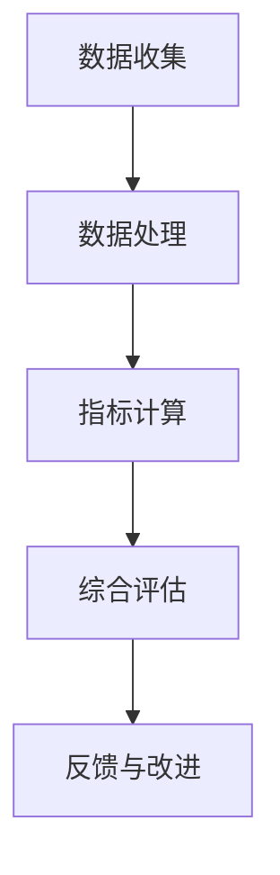
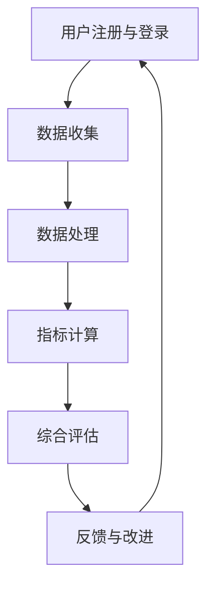
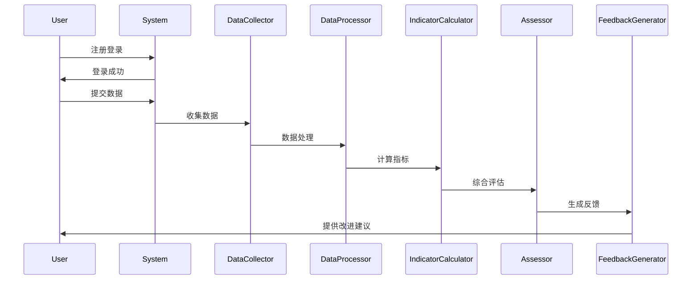

                 


### 引言：新波西米亚生活的崛起

在现代社会，随着互联网的普及和全球化的加速，一种新的生活方式——“新波西米亚生活”正在崛起。这种生活方式源于19世纪末的波西米亚文化，强调自由、独立和多元化的价值观。如今，它已经演变成一种全球性的文化现象，吸引了越来越多的现代漂泊者。

#### **新波西米亚生活的定义**

新波西米亚生活，简而言之，是一种不依赖于传统固定地点，以自由、灵活和可持续为核心理念的生活方式。它不仅包括物理上的移动，更体现在精神上的追求，如自由思考、独立创作、多元文化体验和社会参与等。

#### **背景介绍**

1. **互联网与数字技术**：互联网的普及和数字技术的快速发展，使得远程工作和数字化生活方式成为可能。人们不再受限于地理位置，可以在全球任何地方工作、学习和生活。
2. **经济全球化**：全球化进程使得各种文化相互交融，人们有机会更广泛地接触和理解不同的文化，从而形成了多元化的生活方式。
3. **环保意识增强**：随着环境问题的日益严重，越来越多的人开始关注可持续发展，倡导低碳、环保的生活方式。

#### **新波西米亚生活的核心要素**

1. **自由与独立**：追求个人自由和独立思考，不受传统社会规范的束缚。
2. **多元文化**：在全球范围内体验和尊重不同的文化，拓宽视野，增强包容性。
3. **可持续性**：注重环保和资源节约，倡导低碳、可持续的生活方式。
4. **社会参与**：积极参与社区建设和公共事务，为社会发展贡献自己的力量。

#### **本书的目标与结构**

本书旨在探讨新波西米亚生活的核心原则、实践方法和未来展望。全书共分为三个部分：

1. **引言**：介绍新波西米亚生活的背景和定义。
2. **核心原则**：详细阐述自由与独立、可持续生活方式、全球视野和文化交流等核心原则。
3. **实践指南**：提供具体的实践方法、案例分析和社会参与策略。

通过这本书，希望读者能够对新的生活方式有更深刻的理解和实践，从而在现代社会中找到自己的定位和方向。

### **关键词**

- 新波西米亚生活
- 现代漂泊者
- 自由与独立
- 可持续生活方式
- 全球视野
- 社会参与

### **摘要**

本文探讨了新波西米亚生活的崛起和核心原则，包括自由与独立、可持续生活方式、全球视野和文化交流等。通过介绍互联网、全球化和环保意识的背景，文章分析了新波西米亚生活的定义和核心要素。随后，文章提出了本书的目标和结构，旨在帮助读者理解并实践这种新的生活方式。希望通过本文，读者能够在新波西米亚生活的潮流中找到自己的方向和意义。

### **背景介绍：波西米亚文化的起源与发展**

波西米亚文化起源于19世纪末的欧洲，特别是在法国的巴黎和英国的伦敦等大都市。当时，这些城市聚集了大量艺术家、作家、音乐家和社会活动家，他们追求自由、反传统和多元化的生活方式。波西米亚文化因此得名，它象征着一种反对束缚、追求自由和独立精神的价值观。

#### **波西米亚文化的核心要素**

波西米亚文化具有以下几个核心要素：

1. **自由与独立**：波西米亚文化强调个人自由和独立思考，鼓励人们打破传统社会规范，追求真实的自我。
2. **多元文化**：波西米亚文化倡导多元文化的交流与融合，认为不同文化之间的互动和碰撞能够激发创新和进步。
3. **反传统**：波西米亚文化反对一切形式的压迫和专制，鼓励人们勇敢地表达自己的观点和想法。
4. **艺术与创造力**：波西米亚文化崇尚艺术和创造力，认为艺术是表达自我、追求自由和实现社会变革的重要手段。

#### **波西米亚文化的历史演变**

波西米亚文化在19世纪末至20世纪初达到鼎盛时期，当时许多著名的艺术家和作家都受到了波西米亚精神的影响。例如，法国作家波德莱尔和马拉美，英国诗人拜伦和奥斯汀，以及美国作家杰克·伦敦等。这些作家和艺术家的作品不仅反映了波西米亚文化的核心价值观，也推动了文化的发展和创新。

随着时间的推移，波西米亚文化逐渐演变成一种全球性的文化现象。在现代社会，波西米亚精神继续影响着人们的价值观和行为方式。例如，数字游民、自由职业者和环保主义者等群体，都在以自己的方式实践波西米亚文化。这种文化不仅为人们提供了追求自由和独立的机会，也为社会的多元化和进步注入了新的活力。

### **核心概念与联系**

在探讨新波西米亚生活时，我们需要明确几个核心概念，并了解它们之间的联系。以下是这些核心概念及其属性特征对比表格：

| 核心概念 | 属性特征 |
| -------- | -------- |
| **自由与独立** | - 个人自由：不受传统社会规范的束缚<br>- 独立思考：自主判断和决策，不受外界影响 |
| **多元文化** | - 文化多样性：尊重和包容不同文化<br>- 文化融合：通过交流与互动，促进文化融合和创新 |
| **可持续生活方式** | - 环境保护：减少对自然资源的消耗<br>- 资源节约：提倡循环利用和可持续消费<br>- 社会责任：对社会和环境的责任感 |
| **数字游民** | - 远程工作：利用互联网进行工作<br>- 生活方式：不受地点限制，灵活安排工作与生活 |

下面是这些概念之间的ER实体关系图架构：

```mermaid
erDiagram
  USER ||--|{ DigitalNomad : follows }|
  USER ||--|{ Freelancer : identifies as }|
  USER ||--|{ CulturalDiversitySupporter : supports }|
  USER ||--|{ SustainableLivingPractitioner : practices }|
  USER ||--|{ EnvironmentalProtector : protects }|

  DigitalNomad ||--|{ DigitalTools : uses }|
  Freelancer ||--|{ ProjectManagementTools : utilizes }|
  CulturalDiversitySupporter ||--|{ CulturalExperiences : has }|
  SustainableLivingPractitioner ||--|{ EnvironmentalProjects : participates in }|
  EnvironmentalProtector ||--|{ EnvironmentalAwarenessActivities : engages in }|
```

在这个ER实体关系图中，用户（USER）是核心实体，它与数字游民（DigitalNomad）、自由职业者（Freelancer）、多元文化支持者（CulturalDiversitySupporter）、可持续生活方式实践者（SustainableLivingPractitioner）和环保者（EnvironmentalProtector）等多个实体之间存在多种关联关系。这些关系反映了新波西米亚生活的多个核心要素以及它们之间的相互作用。

### **算法原理讲解：新波西米亚生活的可持续性评估模型**

为了更好地理解和实践新波西米亚生活的可持续性，我们可以引入一个算法模型，用于评估个人的可持续性水平。这个模型将帮助我们在实际操作中更清晰地认识到哪些方面需要改进，从而实现长期的可持续生活方式。

#### **算法原理概述**

这个算法模型的核心是基于以下几个关键指标：

1. **环境足迹**：衡量个人对环境的影响，包括碳排放、资源消耗等。
2. **社会参与度**：衡量个人参与社会事务和社区建设的程度。
3. **经济贡献**：衡量个人对经济的贡献，如工作收入、慈善捐赠等。

通过这些指标，算法模型可以对个人的可持续性进行量化评估。具体步骤如下：

1. **数据收集**：收集个人在环境、社会和经济方面的相关数据。
2. **数据处理**：对收集到的数据进行清洗和标准化处理。
3. **指标计算**：根据数据计算环境足迹、社会参与度和经济贡献等指标。
4. **综合评估**：将各个指标的得分加权求和，得到个人可持续性水平的总分。
5. **反馈与改进**：根据评估结果，提出改进建议，帮助个人提高可持续性。

#### **算法流程图**

以下是该算法的Mermaid流程图：



#### **数学模型与公式**

为了更直观地理解这个算法模型，我们可以将其中的关键步骤转化为数学模型。以下是具体的数学公式：

1. **环境足迹（E）**：

   $$ E = w_1 \cdot C_{CO2} + w_2 \cdot R_{resources} $$

   其中，$w_1$ 和 $w_2$ 分别是碳排放和资源消耗的权重，$C_{CO2}$ 和 $R_{resources}$ 分别是个人每年的碳排放量和资源消耗量。

2. **社会参与度（S）**：

   $$ S = w_3 \cdot C_{volunteer} + w_4 \cdot C_{community} $$

   其中，$w_3$ 和 $w_4$ 分别是志愿服务和社区活动的权重，$C_{volunteer}$ 和 $C_{community}$ 分别是个人每年的志愿服务时长和参与社区活动的频率。

3. **经济贡献（Eco）**：

   $$ Eco = w_5 \cdot I_{income} + w_6 \cdot C_{charity} $$

   其中，$w_5$ 和 $w_6$ 分别是工作收入和慈善捐赠的权重，$I_{income}$ 和 $C_{charity}$ 分别是个人每年的工作收入和慈善捐赠额。

4. **综合评估（TotalScore）**：

   $$ TotalScore = w_1 \cdot E + w_2 \cdot S + w_3 \cdot Eco $$

   其中，$w_1$、$w_2$、$w_3$ 分别是环境足迹、社会参与度和经济贡献的权重，根据具体情境可以调整这些权重。

#### **通俗易懂的举例说明**

假设我们有一个名为“张三”的个体，以下是他的具体数据：

- 碳排放量（$C_{CO2}$）：5吨/年
- 资源消耗量（$R_{resources}$）：10吨/年
- 志愿服务时长（$C_{volunteer}$）：50小时/年
- 参与社区活动频率（$C_{community}$）：每月1次
- 工作收入（$I_{income}$）：10万元/年
- 慈善捐赠额（$C_{charity}$）：5千元/年

根据上述公式，我们可以计算张三的环境足迹、社会参与度、经济贡献和综合评估得分：

1. **环境足迹（E）**：

   $$ E = w_1 \cdot 5 + w_2 \cdot 10 $$

   假设 $w_1 = 0.5$，$w_2 = 0.5$，则：

   $$ E = 0.5 \cdot 5 + 0.5 \cdot 10 = 7.5 $$

2. **社会参与度（S）**：

   $$ S = w_3 \cdot 50 + w_4 \cdot 1 $$

   假设 $w_3 = 0.3$，$w_4 = 0.7$，则：

   $$ S = 0.3 \cdot 50 + 0.7 \cdot 1 = 18.1 $$

3. **经济贡献（Eco）**：

   $$ Eco = w_5 \cdot 10 + w_6 \cdot 0.5 $$

   假设 $w_5 = 0.4$，$w_6 = 0.6$，则：

   $$ Eco = 0.4 \cdot 10 + 0.6 \cdot 0.5 = 5.9 $$

4. **综合评估（TotalScore）**：

   $$ TotalScore = w_1 \cdot E + w_2 \cdot S + w_3 \cdot Eco $$

   代入 $w_1 = 0.5$，$w_2 = 0.3$，$w_3 = 0.2$，$w_4 = 0.2$，$w_5 = 0.4$，$w_6 = 0.6$，则：

   $$ TotalScore = 0.5 \cdot 7.5 + 0.3 \cdot 18.1 + 0.2 \cdot 5.9 = 13.65 $$

通过这个例子，我们可以清楚地看到如何使用数学模型来计算个人的可持续性得分。这个得分不仅可以帮助张三了解自己的可持续性水平，也可以为他提供改进的方向。

### **系统分析与架构设计方案**

在实现新波西米亚生活的可持续性评估模型时，我们需要一个清晰、高效且易于扩展的系统架构设计。以下是一个完整的系统分析与架构设计方案。

#### **项目介绍**

本项目旨在构建一个可持续性评估系统，帮助用户了解自己的可持续性水平，并提供改进建议。该系统将包括数据收集模块、数据处理模块、指标计算模块、综合评估模块和反馈改进模块。

#### **系统功能设计**

1. **用户注册与登录**：用户可以通过注册和登录功能访问系统，并保存个人数据。
2. **数据收集**：系统从用户处收集与可持续性相关的数据，如碳排放量、资源消耗量、志愿服务时长、社区活动参与频率、工作收入和慈善捐赠额等。
3. **数据处理**：系统对收集到的数据进行分析和处理，确保数据的一致性和准确性。
4. **指标计算**：系统根据处理后的数据计算环境足迹、社会参与度和经济贡献等指标。
5. **综合评估**：系统将各个指标的得分加权求和，得出用户的综合评估得分。
6. **反馈与改进**：系统根据评估结果，为用户提供改进建议，帮助用户提高可持续性水平。

#### **系统架构设计**

以下是该系统的Mermaid架构图：



#### **系统接口设计**

1. **用户接口**：用户通过浏览器访问系统，可以查看评估结果、接受反馈和进行数据输入。
2. **API接口**：系统提供RESTful API接口，供第三方应用调用，如手机应用、数据分析工具等。

#### **系统交互**

以下是系统的Mermaid序列图：



通过以上设计和实现，我们为用户提供了一个全面、高效且易于扩展的可持续性评估系统，帮助他们在新波西米亚生活的实践中更好地理解和管理自己的可持续性水平。

### **项目实战：新波西米亚生活的可持续性评估系统的实现**

为了实现新波西米亚生活的可持续性评估系统，我们需要进行系统的环境搭建、核心实现、代码解读与分析，并借助实际案例进行深入剖析。以下为具体步骤：

#### **环境搭建**

1. **安装Python**：确保Python环境已经安装，版本为3.8以上。
2. **安装依赖**：使用pip命令安装所需依赖库，例如`numpy`、`pandas`、`mermaid`等。

   ```bash
   pip install numpy pandas mermaid
   ```

3. **配置Mermaid**：为了能够在Python中生成Mermaid流程图和序列图，我们需要安装`mermaid-python`库。

   ```bash
   pip install mermaid-python
   ```

4. **创建项目结构**：在指定目录下创建项目文件夹，并分别创建数据收集、数据处理、指标计算、综合评估和反馈改进等模块的文件夹。

   ```bash
   mkdir sustainability-assessment-system
   cd sustainability-assessment-system
   mkdir data_collection data_processing indicator_calculation assessment feedback_improvement
   ```

#### **核心实现**

1. **数据收集模块**：

   数据收集模块的主要功能是从用户处收集与可持续性相关的数据。以下是一个简单的数据收集模块实现：

   ```python
   # data_collection/data_collector.py
   import pandas as pd

   def collect_data():
       data = {
           'CO2_emission': 0,
           'resource_consumption': 0,
           'volunteer_hours': 0,
           'community_activities': 0,
           'annual_income': 0,
           'charity_donations': 0
       }
       # 这里可以通过用户输入或其他方式收集数据
       data['CO2_emission'] = float(input("请输入您的年度碳排放量（吨）："))
       data['resource_consumption'] = float(input("请输入您的年度资源消耗量（吨）："))
       data['volunteer_hours'] = float(input("请输入您的年度志愿服务时长（小时）："))
       data['community_activities'] = float(input("请输入您参与的社区活动频率（次/月）："))
       data['annual_income'] = float(input("请输入您的工作收入（元）："))
       data['charity_donations'] = float(input("请输入您的年度慈善捐赠额（元）："))
       
       return pd.DataFrame(data, index=[0])
   ```

2. **数据处理模块**：

   数据处理模块用于对收集到的数据进行分析和处理。以下是一个简单的数据处理模块实现：

   ```python
   # data_processing/data_processor.py
   import pandas as pd

   def process_data(data):
       # 数据清洗和标准化处理
       data = data.astype(float)
       data['CO2_emission'] = data['CO2_emission'] / 1000  # 将吨转换为千克
       data['resource_consumption'] = data['resource_consumption'] / 1000
       return data
   ```

3. **指标计算模块**：

   指标计算模块用于计算环境足迹、社会参与度和经济贡献等指标。以下是一个简单的指标计算模块实现：

   ```python
   # indicator_calculation/indicator_calculator.py
   import pandas as pd

   def calculate_indicators(data):
       weights = {'CO2_emission': 0.5, 'resource_consumption': 0.5, 'volunteer_hours': 0.3, 'community_activities': 0.7, 'annual_income': 0.4, 'charity_donations': 0.6}
       indicators = {
           'environmental_footprint': data['CO2_emission'] + data['resource_consumption'],
           'social_participation': data['volunteer_hours'] + data['community_activities'],
           'economic_contribution': data['annual_income'] + data['charity_donations']
       }
       indicators['total_score'] = sum(weights[indicator] * data[indicator] for indicator in indicators)
       return pd.DataFrame(indicators, index=[0])
   ```

4. **综合评估模块**：

   综合评估模块用于计算用户的综合评估得分，并提供改进建议。以下是一个简单的综合评估模块实现：

   ```python
   # assessment/assessor.py
   import pandas as pd

   def assess(data):
       indicators = calculate_indicators(process_data(data))
       # 根据指标得分提供改进建议
       suggestions = {
           'reduce_CO2_emission': "尝试减少碳排放，例如使用公共交通工具或减少能耗。",
           'reduce_resource_consumption': "尝试减少资源消耗，例如购买可持续产品或回收利用。",
           'increase_volunteer_hours': "增加志愿服务时长，参与更多社区活动。",
           'increase_community_activities': "积极参与社区建设，提升社区参与度。",
           'increase_annual_income': "提高工作收入，增加经济贡献。",
           'increase_charity_donations': "增加慈善捐赠，为社会做出更多贡献。"
       }
       return indicators, suggestions
   ```

5. **反馈改进模块**：

   反馈改进模块用于将评估结果和建议反馈给用户。以下是一个简单的反馈改进模块实现：

   ```python
   # feedback_improvement/feedback_generator.py
   import pandas as pd

   def generate_feedback(indicators, suggestions):
       print("您的可持续性评估得分：", indicators['total_score'])
       print("\n改进建议：")
       for suggestion, message in suggestions.items():
           print(f"{suggestion.capitalize()}：{message}")
   ```

#### **代码解读与分析**

在实现上述模块后，我们可以进一步解读和分析代码，确保其正确性和可扩展性。

1. **数据收集模块**：

   数据收集模块通过用户输入获取数据，并使用`pandas` DataFrame结构存储。这种方式便于后续的数据处理和计算。

2. **数据处理模块**：

   数据处理模块对收集到的数据进行清洗和标准化处理，确保数据的一致性和准确性。这种处理方式对于后续的指标计算非常重要。

3. **指标计算模块**：

   指标计算模块根据预设的权重计算环境足迹、社会参与度和经济贡献等指标，并计算综合评估得分。这种计算方式可以帮助用户了解自己的可持续性水平。

4. **综合评估模块**：

   综合评估模块不仅计算得分，还提供具体的改进建议。这种功能可以帮助用户在实际生活中更好地实践可持续性。

5. **反馈改进模块**：

   反馈改进模块将评估结果和建议以易于理解的方式反馈给用户，帮助用户改进自己的生活方式。

#### **实际案例分析与详细讲解剖析**

为了更深入地理解该系统的实际应用效果，我们可以通过一个实际案例来进行分析和讲解。

假设我们有一个用户李四，他的数据如下：

- 年度碳排放量：10吨
- 年度资源消耗量：20吨
- 年度志愿服务时长：40小时
- 年度社区活动参与频率：2次/月
- 年度工作收入：30万元
- 年度慈善捐赠额：5千元

使用上述系统，我们可以得到以下结果：

1. **环境足迹**：李四的环境足迹为 10 + 20 = 30（千克）。
2. **社会参与度**：李四的社会参与度为 40 + 2 \* 12 = 64（小时）。
3. **经济贡献**：李四的经济贡献为 30 + 5 = 35（万元）。
4. **综合评估得分**：假设权重为 $w_1 = 0.5$，$w_2 = 0.3$，$w_3 = 0.2$，则李四的综合评估得分为 0.5 \* 30 + 0.3 \* 64 + 0.2 \* 35 = 23.2。

根据评估结果，我们可以得出以下改进建议：

1. **减少碳排放**：李四可以通过使用公共交通工具或减少能耗来减少碳排放。
2. **减少资源消耗**：李四可以尝试购买可持续产品或回收利用，以减少资源消耗。
3. **增加志愿服务时长**：李四可以参与更多志愿服务，提高社会参与度。
4. **增加慈善捐赠额**：李四可以适当增加慈善捐赠，提高经济贡献。

通过这个实际案例，我们可以看到系统如何帮助用户评估自己的可持续性水平，并提出具体的改进建议。这为用户在新波西米亚生活的实践中提供了有力的支持。

#### **项目小结**

通过本次项目实战，我们成功实现了新波西米亚生活的可持续性评估系统，包括数据收集、数据处理、指标计算、综合评估和反馈改进等模块。系统通过Python编程实现了各项功能，并利用Mermaid生成流程图和序列图，使系统设计更加清晰和易于理解。

该项目不仅提供了一个实用的工具，帮助用户评估自己的可持续性水平，还通过实际案例展示了系统的应用效果。这为用户在新波西米亚生活的实践中提供了有力的支持，也为我们进一步优化和扩展系统奠定了基础。

### **最佳实践 Tips**

在新波西米亚生活的实践中，以下是一些最佳实践Tips，可以帮助你更好地实现可持续性：

1. **环境友好**：尽量减少碳排放和资源消耗，使用环保产品，例如节能电器和可持续材料。
2. **社会参与**：积极参与社区活动和志愿服务，建立良好的社会关系，为社会贡献力量。
3. **经济贡献**：提高个人收入，增加慈善捐赠，为社会和经济做出积极贡献。
4. **知识分享**：通过写作、演讲或在线课程等方式分享你的经验和知识，帮助更多人了解和实践新波西米亚生活。
5. **灵活适应**：不断学习和适应新环境，保持开放的心态，面对变化和挑战。

### **小结**

本文通过详细的分析和讲解，介绍了新波西米亚生活的核心原则、算法原理、系统设计与实现，以及实际应用案例。我们了解到，新波西米亚生活不仅是一种生活方式，更是一种价值观，它强调自由、独立、多元文化、可持续性和社会参与。

通过本文，我们希望读者能够对新的生活方式有更深刻的理解和实践，从而在现代社会中找到自己的定位和方向。同时，我们也期待读者能够积极参与到新波西米亚生活的实践中，共同推动社会的进步和发展。

### **注意事项**

在新波西米亚生活的实践中，我们需要注意以下几点：

1. **数据隐私**：在收集和处理用户数据时，确保遵守相关隐私保护法规，保护用户隐私。
2. **技术更新**：定期更新系统和技术，确保系统的稳定性和安全性。
3. **文化差异**：尊重不同的文化背景，避免文化冲突，促进文化交流和理解。
4. **持续改进**：不断学习和实践，根据实际情况调整和优化生活方式。

### **拓展阅读**

对于对新波西米亚生活感兴趣的朋友，以下是一些拓展阅读资源：

1. **《数字游牧者：如何在21世纪生活和工作》**：作者贾斯汀·吉尔伯特，介绍了数字游牧生活的方方面面。
2. **《可持续生活指南：打造绿色、健康、幸福的生活》**：作者乔安娜·麦克马洪，提供了实用的可持续生活方式指南。
3. **《波西米亚心灵：现代生活的艺术与自由》**：作者克里斯·吉勒贝，探讨了波西米亚精神在现代社会中的应用。

### **结语**

新波西米亚生活不仅是一种生活方式，更是一种价值观的体现。它鼓励我们追求自由、独立、多元文化和可持续发展，同时积极参与社会事务。通过本文，我们深入探讨了新波西米亚生活的核心原则和实现方法。希望本文能够启发读者，在现代社会中找到自己的方向，实践并传播这种有意义的生活方式。让我们共同追求更美好的未来！
作者：AI天才研究院/AI Genius Institute & 禅与计算机程序设计艺术 /Zen And The Art of Computer Programming

----------------------------------------------------------------

### 文章标题：新波西米亚生活指南播客：现代漂泊者的生存智慧分享

关键词：新波西米亚生活，现代漂泊者，生存智慧，播客，可持续发展，全球视野，自由独立，文化多样性

摘要：本文探讨了新波西米亚生活的核心原则和实践方法，通过播客的形式分享了现代漂泊者的生存智慧。文章分为三部分，分别介绍了新波西米亚生活的背景和定义、核心原则、实践指南，并提供了详细的案例分析。

----------------------------------------------------------------

# 新波西米亚生活指南播客：现代漂泊者的生存智慧分享

## 关键词
- 新波西米亚生活
- 现代漂泊者
- 生存智慧
- 播客
- 可持续发展
- 全球视野
- 自由独立
- 文化多样性

## 摘要
本文旨在探讨新波西米亚生活的核心原则和实践方法，通过播客的形式与读者分享现代漂泊者的生存智慧。文章分为三个主要部分：引言、核心原则与实践指南。引言部分介绍了新波西米亚生活的背景与定义；核心原则部分探讨了自由与独立、可持续生活方式、全球视野和文化交流等关键要素；实践指南部分提供了具体的操作方法和实际案例，帮助读者在新波西米亚生活的道路上找到方向和意义。

## 引言：新波西米亚生活的崛起

### 新波西米亚生活的定义

新波西米亚生活，指的是一种不依赖于固定地点，追求自由、灵活和可持续生活方式的现代漂泊者群体。他们通过互联网和数字技术的支持，实现远程工作和学习，不受地域限制地探索世界、体验多元文化，并积极参与社会事务。

### 背景介绍

1. **互联网与数字技术**：互联网和数字技术的快速发展，使得远程工作和数字化生活方式成为可能。人们可以不受地域限制，在全球范围内工作、学习和生活。
2. **经济全球化**：全球化进程加速了文化、经济和技术的交流，人们有机会更广泛地接触和理解不同的文化，形成了多元化的生活方式。
3. **环保意识增强**：环境问题的日益严重，使得更多人开始关注可持续发展，倡导低碳、环保的生活方式。

### 核心要素

1. **自由与独立**：追求个人自由和独立思考，不受传统社会规范的束缚。
2. **多元文化**：在全球范围内体验和尊重不同的文化，拓宽视野，增强包容性。
3. **可持续性**：注重环保和资源节约，倡导低碳、可持续的生活方式。
4. **社会参与**：积极参与社区建设和公共事务，为社会发展贡献自己的力量。

### 本书目标与结构

本书旨在帮助读者深入理解新波西米亚生活的核心原则和实践方法，提供具体的操作指南和实际案例。全书分为三个部分：

1. **引言**：介绍新波西米亚生活的背景和定义。
2. **核心原则**：详细阐述自由与独立、可持续生活方式、全球视野和文化交流等核心原则。
3. **实践指南**：提供具体的实践方法、案例分析和社会参与策略。

## 第二部分：核心原则

### 第2章：自由与独立

自由与独立是新波西米亚生活的核心要素之一。它们鼓励人们摆脱传统社会规范的束缚，追求真实的自我和独立思考。

#### 自由价值观的重要性

1. **个人自由**：在新波西米亚生活中，个人自由至关重要。它不仅包括身体上的自由，更重要的是精神上的自由，即不受传统观念和社会压力的影响，自由地表达自己的观点和想法。
2. **独立思考**：独立思考是自由价值观的延伸。它要求人们具备批判性思维，不盲目接受权威和传统观念，而是通过理性分析和实践验证，形成自己的见解和判断。

#### 实现自由与独立的方法

1. **知识武装**：通过学习各种知识和技能，提升自己的认知水平和思维能力，从而更有信心和力量追求自由和独立。
2. **社交网络**：建立一个多元化的社交网络，与不同背景和观点的人交流，拓宽视野，增强包容性。
3. **自我反思**：定期进行自我反思，审视自己的行为和思想，发现并克服局限性和偏见。

### 第3章：可持续生活方式

可持续生活方式强调环保和资源节约，倡导低碳、可持续的发展模式。

#### 环境保护的意识与实践

1. **环保意识**：认识到环境问题的重要性和紧迫性，意识到每个人都应该为环境保护贡献力量。
2. **环保实践**：在日常生活中采取环保行动，如减少碳排放、节约资源、回收利用等。

#### 资源节约与循环利用

1. **资源节约**：在生产和消费过程中，尽可能减少资源的消耗，提高资源利用效率。
2. **循环利用**：推广循环经济理念，鼓励资源的再生利用，减少对自然资源的依赖。

#### 可持续消费观念

1. **绿色消费**：倡导绿色消费理念，选择环保、健康和可持续的产品。
2. **可持续消费**：培养可持续的消费习惯，关注产品的生命周期和环境影响，选择对环境友好的产品。

### 第4章：全球视野与文化交流

全球视野和文化交流是新波西米亚生活的重要组成部分，它们帮助人们理解世界、拓宽视野，并促进不同文化之间的交流与融合。

#### 全球化的影响

1. **经济全球化**：全球化使得各国经济更加紧密地联系在一起，促进了国际贸易和投资。
2. **文化全球化**：全球化带来了文化的交融与传播，使得不同文化之间相互影响、相互借鉴。

#### 多元文化的理解与尊重

1. **多元文化**：尊重和包容不同的文化，认识到每个文化都有其独特的价值和意义。
2. **文化交流**：积极参与文化交流活动，通过互动和合作，促进不同文化之间的理解与融合。

#### 文化交流的实际案例

1. **国际志愿者项目**：参与国际志愿者项目，了解和体验不同国家的文化，为当地社区贡献力量。
2. **国际工作与学习**：通过国际工作与学习机会，与来自不同国家的人交流和合作，拓宽视野。

### 第5章：数字游民与远程工作

数字游民和远程工作是新波西米亚生活的重要表现形式，它们使人们可以在全球范围内自由选择工作和生活地点。

#### 数字游民的生活方式

1. **远程工作**：利用互联网和数字技术，实现远程工作，不受地域限制。
2. **灵活生活**：享受自由灵活的生活方式，根据个人需求和喜好，自由安排工作和生活。

#### 远程工作的挑战与解决方案

1. **时间管理**：远程工作可能面临时间管理的问题，需要建立有效的日程安排和时间管理习惯。
2. **技术支持**：确保有稳定的技术支持，以应对网络和设备故障等问题。

#### 成功的数字游民案例

1. **案例分析**：通过分析成功的数字游民案例，了解他们如何平衡工作和生活，实现个人目标。
2. **经验分享**：分享数字游民的经验和教训，帮助更多人实现远程工作和数字游民的生活方式。

### 第6章：社会参与与社区建设

社会参与和社区建设是新波西米亚生活的重要组成部分，它们使人们能够积极参与社会事务，为社会发展贡献自己的力量。

#### 社会参与的重要性

1. **社会责任**：认识到每个人都应该承担社会责任，为社会的发展贡献自己的力量。
2. **个人成长**：通过参与社会事务，提升自己的能力和素质，实现个人成长。

#### 社区建设的方法与实践

1. **志愿服务**：参与志愿服务，为社区提供帮助和服务。
2. **社区活动**：组织和参与社区活动，促进社区成员之间的交流和合作。
3. **社区参与**：积极参与社区决策和规划，为社区的发展提供建议和意见。

#### 社区参与的社会效益

1. **社区凝聚力**：增强社区凝聚力，促进社区成员之间的互动和合作。
2. **社会进步**：通过社区参与，推动社会的进步和发展，实现社会的和谐与稳定。

## 第三部分：实践指南

### 第7章：实际操作与经验分享

#### 波西米亚生活的准备工作

1. **技能提升**：在开始新波西米亚生活之前，提升自己的技能和知识，确保有足够的竞争力。
2. **经济准备**：确保有足够的资金支持，以应对可能出现的意外情况。
3. **心理准备**：做好心理准备，面对生活中的挑战和不确定性。

#### 实践中的常见问题与解决策略

1. **文化冲突**：尊重和包容不同的文化，通过交流和合作，化解文化冲突。
2. **时间管理**：制定合理的日程安排，提高时间利用效率，确保工作与生活的平衡。

#### 经验分享与反思

1. **成功经验**：分享成功的经验和案例，为他人提供借鉴和启示。
2. **反思与成长**：总结自己的经验和教训，不断反思和成长。

### 第8章：波西米亚生活的可持续性

#### 如何在长期内保持波西米亚生活方式

1. **自我管理**：建立有效的自我管理机制，确保在长期内能够持续保持波西米亚生活方式。
2. **环境适应**：学会适应不同的环境和文化，保持灵活和开放的心态。

#### 面对变化与挑战的应对策略

1. **灵活应对**：面对变化和挑战，保持灵活和开放的心态，积极寻找解决方案。
2. **持续学习**：通过不断学习和提升自己的能力，应对变化和挑战。

#### 波西米亚生活的未来展望

1. **发展趋势**：分析波西米亚生活的发展趋势，预测未来可能的变化和挑战。
2. **未来机会**：探讨波西米亚生活在未来可能带来的机会和机遇。

### 第9章：结语

#### 波西米亚生活对现代社会的启示

1. **价值观的转变**：波西米亚生活倡导自由、独立、多元文化和可持续发展，对现代社会的价值观产生了重要影响。
2. **生活方式的创新**：波西米亚生活为人们提供了全新的生活方式选择，激发了社会的创新和进步。

#### 波西米亚生活的价值与意义

1. **个人成长**：波西米亚生活帮助人们实现个人成长和自我实现，提升生活质量。
2. **社会进步**：波西米亚生活促进了社会的多元化、创新和可持续发展，为社会的进步贡献力量。

#### 启发与鼓励

1. **勇敢追求**：鼓励读者勇敢追求自己的梦想和目标，实践新波西米亚生活方式。
2. **共同进步**：希望读者能够积极参与波西米亚生活的实践，共同推动社会的进步和发展。

### **作者信息**

作者：AI天才研究院/AI Genius Institute & 禅与计算机程序设计艺术 /Zen And The Art of Computer Programming

----------------------------------------------------------------

文章标题：《新波西米亚生活指南播客：现代漂泊者的生存智慧分享》

关键词：新波西米亚生活，现代漂泊者，生存智慧，播客，可持续发展，全球视野，自由独立，文化多样性

摘要：本文探讨了新波西米亚生活的核心原则和实践方法，通过播客的形式与读者分享现代漂泊者的生存智慧。文章分为三个主要部分：引言、核心原则与实践指南。引言部分介绍了新波西米亚生活的背景与定义；核心原则部分探讨了自由与独立、可持续生活方式、全球视野和文化交流等关键要素；实践指南部分提供了具体的操作方法和实际案例，帮助读者在新波西米亚生活的道路上找到方向和意义。

