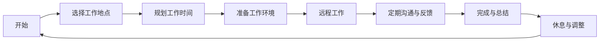
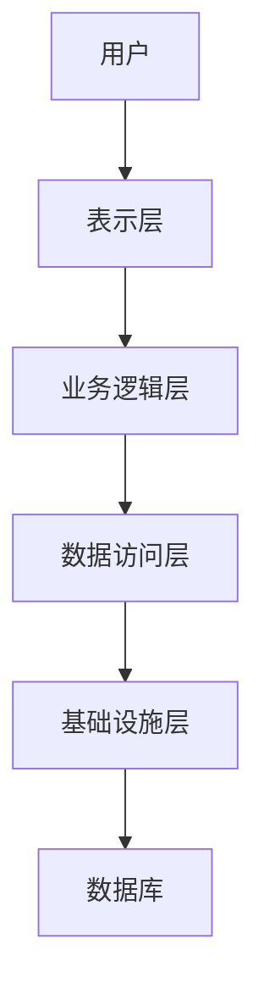
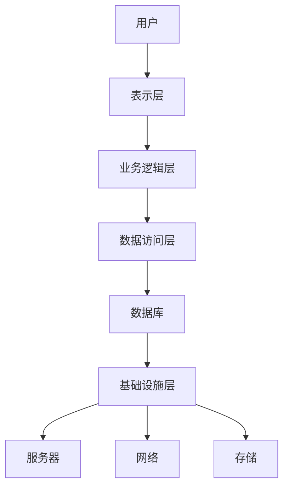

                 

### **# 《新波西米亚生活指南：现代漂泊者的生存智慧汇编》**

---

#### **关键词：** 波西米亚生活方式、现代漂泊者、生存智慧、数字时代、跨文化交流

#### **摘要：** 本文以《新波西米亚生活指南：现代漂泊者的生存智慧汇编》为背景，通过深入剖析波西米亚生活方式的起源、核心要素、适应与挑战，以及现代漂泊者的生存智慧，探讨数字时代的漂泊生存技巧、自我发展路径、社交网络构建与维护，最终展望波西米亚生活方式的未来趋势与价值。

---

### **## 第一部分：波西米亚生活方式的起源与演变**

#### **## 第1章：波西米亚生活方式的起源**

#### **### 1.1 波西米亚的历史与文化背景**

波西米亚，一个源于中欧的古老地名，如今已成为一种自由、独立、跨文化的象征。要理解波西米亚生活方式的起源，我们首先需要从历史和文化背景入手。

波西米亚位于现今的捷克共和国，其历史可以追溯到公元前5世纪。这个地区曾经是罗马帝国的一部分，后来成为中欧地区的重要文化中心。波西米亚文化以其独特的宗教信仰、语言、文学和音乐而闻名。其中，最为重要的文化元素便是自由精神。

波西米亚历史上的许多事件都反映了这种自由精神。例如，13世纪末，波西米亚的国王约翰·卢森堡反对罗马教廷的权威，主张宗教自由。这一行为在当时引起了广泛的共鸣，并被视为波西米亚自由精神的象征。

#### **### 1.1.1 波西米亚的历史沿革**

波西米亚的历史可以分为几个重要阶段：

- **中世纪**：波西米亚在中世纪时期成为一个独立的国家，与周边的匈牙利、波兰等国有着复杂的关系。这一时期的波西米亚，以其繁荣的经济和文化而著称。

- **近代**：在近代，波西米亚逐渐成为奥匈帝国的组成部分。这一时期，波西米亚的文化和艺术继续发展，同时受到了帝国的其他地区的影响。

- **现代**：在第一次世界大战后，波西米亚成为捷克斯洛伐克的一部分。1993年，捷克斯洛伐克分裂为捷克共和国和斯洛伐克共和国，波西米亚成为捷克共和国的核心地区。

#### **### 1.1.2 波西米亚文化中的自由精神**

波西米亚文化的自由精神体现在多个方面：

- **宗教自由**：波西米亚历史上，宗教自由一直是一个重要议题。约翰·卢森堡的反抗行为，就是宗教自由的象征。

- **言论自由**：波西米亚文化鼓励自由表达，尊重不同的观点和意见。

- **艺术自由**：波西米亚的艺术作品，往往反映了自由和独立的主题。例如，著名作曲家德沃夏克的作品，就充满了对自由的向往。

#### **### 1.1.3 波西米亚生活方式的起源**

波西米亚生活方式的起源，可以追溯到中世纪末期的文艺复兴时期。这一时期，波西米亚出现了一批以自由思想著称的知识分子和艺术家。他们追求自由、独立和跨文化交融，形成了一种独特的波西米亚生活方式。

随着时间的推移，波西米亚生活方式逐渐传播到世界各地。在20世纪，尤其是在后工业社会，波西米亚生活方式得到了更广泛的认同和推崇。今天，波西米亚生活方式已成为一种全球性的文化现象，影响着人们的生活方式和社会观念。

#### **## 第2章：波西米亚生活方式的核心要素**

#### **### 2.1 灵活的生活方式**

波西米亚生活方式的核心之一是灵活的生活方式。这种生活方式鼓励人们打破传统的束缚，追求自由和独立。

#### **#### 2.1.1 非传统的工作模式**

波西米亚生活方式的一个显著特点是非传统的工作模式。许多人选择自由职业、远程工作或者创业，以实现个人价值和职业自由。

- **自由职业**：自由职业者可以自主选择工作内容和工作时间，这种灵活性使得他们能够更好地平衡工作和生活。

- **远程工作**：随着互联网的普及，远程工作已成为波西米亚生活方式的重要组成部分。远程工作不仅提高了工作效率，还减少了通勤时间，使人们有更多的时间投入到个人兴趣和爱好中。

- **创业**：许多波西米亚生活方式的追随者选择创业，以实现自己的商业梦想。创业不仅提供了职业自由，还可以带来经济收益和成就感。

#### **#### 2.1.2 自主的生活节奏**

波西米亚生活方式还强调自主的生活节奏。这种生活方式鼓励人们根据自己的需求和兴趣来安排日常生活，而不是被社会规范所束缚。

- **个人兴趣**：波西米亚生活方式的追随者通常有自己的兴趣和爱好，他们会将这些兴趣融入到日常生活中，从而提高生活质量。

- **弹性工作时间**：自主的生活节奏意味着人们可以灵活安排工作时间，这种灵活性有助于提高工作效率和生活质量。

- **健康生活方式**：波西米亚生活方式强调健康生活方式，包括合理饮食、适量运动和充足的睡眠。这种生活方式有助于提高身体健康和幸福感。

#### **### 2.2 跨文化的交往**

波西米亚生活方式的另一核心要素是跨文化的交往。在全球化时代，跨文化交流变得越来越重要。波西米亚生活方式鼓励人们主动融入不同的文化环境，以拓宽视野和丰富生活。

#### **#### 2.2.1 跨文化交流的重要性**

跨文化交流的重要性体现在以下几个方面：

- **拓宽视野**：通过跨文化交流，人们可以了解不同的文化背景、价值观和生活方式，从而拓宽视野，增加对世界的认识。

- **增进理解**：跨文化交流有助于增进不同文化之间的理解和尊重，减少误解和冲突。

- **提高沟通能力**：跨文化交流可以提高人们的沟通能力，使他们能够更有效地与来自不同文化背景的人交流和合作。

#### **#### 2.2.2 如何融入多元文化环境**

为了融入多元文化环境，波西米亚生活方式的追随者可以采取以下策略：

- **学习语言**：学习当地语言是融入多元文化环境的重要步骤。通过学习语言，人们可以更好地理解当地文化，与当地人沟通。

- **尊重差异**：尊重文化差异是跨文化交流的基础。人们应该尊重他人的信仰、习俗和价值观，避免对他人进行歧视或偏见。

- **参与社区活动**：参与当地社区活动是融入多元文化环境的好方法。通过参与社区活动，人们可以结识新朋友，了解当地文化。

- **保持开放心态**：保持开放心态是跨文化交流的关键。人们应该愿意接受新的观点和想法，勇于尝试新的事物。

#### **## 第3章：波西米亚生活的适应与挑战**

#### **### 3.1 心理适应**

波西米亚生活方式的适应与挑战首先体现在心理层面。对于那些习惯了传统生活方式的人来说，适应波西米亚生活方式可能会带来一定的心理压力。

#### **#### 3.1.1 心理健康的维护**

为了维护心理健康，波西米亚生活方式的追随者可以采取以下措施：

- **自我认知**：了解自己的需求和兴趣，明确个人目标，有助于减少心理压力。

- **情感支持**：寻求情感支持，与亲朋好友分享感受，有助于缓解心理压力。

- **心理健康教育**：学习心理健康知识，提高心理素质，有助于更好地应对生活中的挑战。

#### **#### 3.1.2 应对孤独感**

孤独感是波西米亚生活方式中的一个普遍问题。为了应对孤独感，波西米亚生活方式的追随者可以采取以下策略：

- **建立社交网络**：通过参加线上或线下的社交活动，建立自己的社交网络。

- **保持联系**：定期与亲朋好友保持联系，分享生活点滴。

- **培养兴趣爱好**：培养兴趣爱好，与他人分享兴趣，有助于减少孤独感。

- **心理咨询**：如果孤独感严重影响到生活质量，可以考虑寻求专业心理咨询。

#### **### 3.2 社交适应**

波西米亚生活方式的适应与挑战还体现在社交层面。在多元化的环境中，社交适应是一个重要的课题。

#### **#### 3.2.1 建立社交网络**

建立社交网络是适应波西米亚生活方式的关键。以下是一些建立社交网络的策略：

- **参与社交活动**：参加各种社交活动，如聚会、讲座、展览等，结识新朋友。

- **利用社交媒体**：利用社交媒体平台，如LinkedIn、Facebook等，建立线上社交网络。

- **组织活动**：组织或参与各种活动，如俱乐部、社群等，扩大社交圈子。

- **积极参与社区**：积极参与社区事务，与社区居民建立联系。

#### **#### 3.2.2 跨文化沟通策略**

跨文化沟通是波西米亚生活方式中的重要环节。以下是一些跨文化沟通的策略：

- **学习文化知识**：学习不同文化的特点和习惯，提高跨文化沟通的能力。

- **尊重差异**：尊重不同的文化和价值观，避免文化冲突。

- **积极倾听**：倾听他人的意见和观点，表达自己的理解和感受。

- **适应文化环境**：适应不同的文化环境，灵活应对各种社交场合。

---

## **第二部分：现代漂泊者的生存智慧**

### **## 第4章：数字时代的漂泊生存技巧**

#### **### 4.1 数字工具的选择与应用**

在数字时代，选择和应用合适的数字工具是现代漂泊者生存的关键。以下是几个重要的数字工具及其应用场景：

#### **#### 4.1.1 移动设备的优化使用**

移动设备是现代漂泊者的必备工具。以下是一些优化移动设备使用的技巧：

- **设备选择**：选择适合漂泊生活的移动设备，如便携式笔记本电脑、平板电脑等。

- **电池管理**：通过关闭不必要的应用程序、调整屏幕亮度、使用电源管理应用等方式延长电池寿命。

- **远程访问**：使用VPN和远程桌面工具，确保在不同地点都能安全地访问工作文件和资源。

#### **#### 4.1.2 线上工作的效率提升**

线上工作在现代漂泊者中非常普遍。以下是一些提升线上工作效率的技巧：

- **时间管理**：使用时间管理工具，如Trello、Asana等，规划工作任务和时间。

- **协作工具**：利用协作工具，如Slack、Microsoft Teams等，与团队成员保持实时沟通。

- **自动化工具**：使用自动化工具，如IFTTT、 Zapier等，简化日常工作流程。

#### **### 4.2 跨境生活的便利性**

跨境生活为现代漂泊者提供了更多的机会，但也带来了一些挑战。以下是几个方面的便利性：

#### **#### 4.2.1 数字货币与支付方式**

数字货币和支付方式的使用极大地便利了跨境生活。以下是一些数字货币和支付方式的推荐：

- **数字货币**：比特币、以太坊等加密货币，提供了跨境支付的安全和便捷。

- **支付平台**：PayPal、TransferWise等支付平台，提供了跨境转账的低成本和高效率。

- **数字钱包**：MetaMask、MyEtherWallet等数字钱包，用于存储和转移数字货币。

#### **#### 4.2.2 跨境物流与配送服务**

跨境物流和配送服务对于现代漂泊者来说至关重要。以下是一些跨境物流和配送服务的推荐：

- **快递公司**：DHL、FedEx、UPS等国际快递公司，提供快速、可靠的跨境物流服务。

- **货运代理**：选择合适的货运代理，可以降低物流成本和提高运输效率。

- **跨境电商平台**：Amazon、eBay等跨境电商平台，提供了跨境购物和销售的一站式服务。

---

## **## 第5章：自我发展的路径**

#### **### 5.1 终身学习的态度**

在快速变化的时代，终身学习已成为现代漂泊者自我发展的关键。以下是一些终身学习的建议：

- **学习资源的选择**：利用在线课程、图书、研讨会等多种学习资源，提升自己的知识水平。

- **时间管理**：合理安排学习时间，确保有足够的时间进行深度学习。

- **实践应用**：将所学知识应用到实际工作中，通过实践不断提升自己的技能。

#### **### 5.2 职业规划与转变**

职业规划与转变是现代漂泊者面临的重要课题。以下是一些职业规划与转变的建议：

- **自我评估**：了解自己的兴趣、优势和职业目标，制定明确的职业规划。

- **市场调研**：研究市场需求和行业趋势，找到适合自己的职业发展路径。

- **网络拓展**：利用社交媒体和职业网络，扩大人脉资源，获取职业机会。

- **技能提升**：不断学习新技能，提升自己的竞争力，为职业转变做好准备。

---

## **## 第6章：社交网络的构建与维护**

#### **### 6.1 社交平台的选择与策略**

构建和维护有效的社交网络是现代漂泊者成功的关键。以下是一些社交平台的选择与策略：

- **社交媒体**：选择适合自己的社交媒体平台，如LinkedIn、Facebook、Twitter等，用于职业拓展和社交互动。

- **专业社群**：加入专业社群和论坛，如技术社群、创业社群等，获取行业信息和支持。

- **线上活动**：参与线上研讨会、网络讲座等活动，结识行业专家和同行。

- **内容分享**：定期分享有价值的内容，提升个人品牌和影响力。

#### **### 6.2 跨文化交际的艺术**

跨文化交际在波西米亚生活方式中具有重要意义。以下是一些跨文化交际的艺术：

- **文化敏感性**：了解和尊重不同文化的价值观和习俗，避免文化冲突。

- **有效沟通**：提高跨文化沟通技巧，通过倾听和表达，增进理解和合作。

- **适应能力**：灵活适应不同文化环境，调整自己的行为和沟通方式。

- **文化融合**：在跨文化交流中，寻找共同点，促进文化融合，建立深厚的友谊。

---

## **## 第7章：波西米亚生活方式的未来**

#### **### 7.1 波西米亚生活方式的未来趋势**

随着全球化的深入发展，波西米亚生活方式的未来趋势呈现出以下几个特点：

- **数字化**：数字技术的发展将进一步推动波西米亚生活方式的数字化，远程工作和数字化生活将成为主流。

- **多元化**：波西米亚生活方式将更加多元化，融合不同的文化和价值观，形成一个全球性的文化现象。

- **可持续发展**：波西米亚生活方式将更加注重可持续发展和环境保护，倡导绿色生活和低碳生活。

#### **### 7.2 波西米亚生活方式的价值与意义**

波西米亚生活方式具有重要的价值与意义：

- **个人自由**：波西米亚生活方式强调个人自由和独立，有助于实现个人价值和社会地位。

- **文化融合**：波西米亚生活方式促进了不同文化之间的交流与融合，丰富了人类文化的多样性。

- **社会创新**：波西米亚生活方式激发了创新思维和创造力，推动了社会的进步和发展。

- **可持续发展**：波西米亚生活方式倡导可持续发展和环保理念，为全球可持续发展做出了贡献。

---

## **### 附录**

#### **### A. 波西米亚生活案例研究**

在本附录中，我们将分享两个波西米亚生活的案例研究，以展示这种生活方式的实际应用和效果。

#### **### A.1 案例一：独立数字游民的成功故事**

**案例简介：** 李先生是一位独立数字游民，他通过在线工作实现了自由生活。他的工作涉及多个领域，包括软件开发、内容创作和在线教育。

**成功因素：**
1. **灵活的时间管理**：李先生通过使用时间管理工具，合理安排工作时间，确保工作效率的同时，也有充足的时间进行旅行和兴趣爱好。
2. **跨文化适应能力**：李先生善于适应不同的文化环境，通过学习当地语言和了解当地习俗，迅速融入新环境。
3. **终身学习**：李先生始终保持学习的态度，不断提升自己的技能和知识，以适应不断变化的工作需求。

**效果分析：**
李先生通过数字游民的生活方式，不仅实现了财务自由，还拓宽了视野，结识了来自世界各地的朋友，实现了个人价值的最大化。

#### **### A.2 案例二：跨文化社交网络的建立**

**案例简介：** 张女士是一位创业者，她通过建立跨文化社交网络，成功将业务拓展到全球。

**成功因素：**
1. **社交媒体运用**：张女士积极利用社交媒体平台，如LinkedIn和Facebook，建立自己的品牌和影响力。
2. **专业社群参与**：张女士加入多个专业社群和论坛，与行业专家和同行保持紧密联系，获取最新的行业动态和机会。
3. **跨文化沟通技巧**：张女士善于跨文化沟通，能够有效地与来自不同文化背景的人进行交流，建立合作关系。

**效果分析：**
张女士通过跨文化社交网络的建立，不仅成功拓展了业务，还积累了丰富的行业资源，为企业的持续发展提供了强大的支持。

#### **### B. 波西米亚生活方式资源列表**

在本附录中，我们为读者提供了一系列波西米亚生活方式的资源和参考，包括书籍、网络资源和社群介绍。

#### **### B.1 书籍推荐**

- **《数字游民指南：如何在世界上任何地方生活和工作》**
- **《远程工作革命：如何在全球化时代实现工作与生活的平衡》**
- **《跨界思维：如何成为跨界成功者》**
- **《全球生活指南：如何在全球范围内寻找和实现幸福生活》**

#### **### B.2 网络资源**

- **远程工作平台**：如Upwork、Freelancer、Remote.co等
- **在线学习平台**：如Coursera、Udemy、edX等
- **社交媒体平台**：如LinkedIn、Facebook、Twitter等
- **国际新闻网站**：如The New York Times、The Guardian、CNN等

#### **### B.3 波西米亚生活方式社群介绍**

- **数字游民社群**：如Digital Nomads Community、Remote Work Community等
- **创业社群**：如Startup Grind、Techstars等
- **多元文化社群**：如Cultural Fusion Community、Global Citizens Network等

#### **### C. 波西米亚生活方式研讨会记录**

在本附录中，我们记录了几次关于波西米亚生活方式的研讨会，包括主题、议题和成果分享。

#### **### C.1 研讨会主题与议题**

1. **主题**：波西米亚生活方式：未来生活的趋势与挑战
2. **议题**：
   - 波西米亚生活方式的历史与文化背景
   - 数字时代的波西米亚生活方式
   - 跨文化交流与融合
   - 波西米亚生活方式的未来趋势

#### **### C.2 研讨会成果分享**

研讨会期间，与会者分享了他们的经验、见解和成功案例，为波西米亚生活方式的发展提供了有益的启示。

- **经验分享**：与会者分享了他们在波西米亚生活方式实践中的经验，包括如何平衡工作与生活、如何适应不同的文化环境等。
- **见解交流**：与会者就波西米亚生活方式的未来趋势和挑战进行了深入讨论，提出了许多有价值的见解和建议。
- **成功案例**：与会者分享了他们的成功案例，展示了波西米亚生活方式在实际应用中的效果。

#### **### D. 波西米亚生活方式实践指南**

在本附录中，我们提供了一份波西米亚生活方式的实践指南，包括具体的步骤、注意事项和提示。

#### **### D.1 实践步骤详解**

1. **确定个人目标**：明确自己的生活方式目标，包括工作、学习、旅行和社交等方面。
2. **制定计划**：制定具体的实施计划，包括时间安排、地点选择和资源准备等。
3. **准备数字工具**：选择合适的移动设备和数字工具，确保工作和生活的高效进行。
4. **适应新环境**：到新环境后，尽快适应当地的文化和生活方式。
5. **建立社交网络**：积极参与社交活动，结识新朋友，建立自己的社交网络。
6. **持续学习**：保持学习的态度，不断提升自己的知识和技能。

#### **### D.2 注意事项与提示**

1. **保持灵活性**：在波西米亚生活方式中，灵活性至关重要。要随时调整计划和目标，以适应变化的环境和需求。
2. **注重健康**：保持健康的生活习惯，如合理饮食、适量运动和充足睡眠，有助于提高生活质量。
3. **保持联系**：定期与亲朋好友保持联系，分享生活点滴，保持情感支持。
4. **尊重文化差异**：在不同文化环境中，尊重当地的文化和习俗，避免不必要的冲突和误解。
5. **安全意识**：保持安全意识，注意个人财产和人身安全。

#### **### D.3 实践指南：波西米亚生活方式的可持续性**

1. **环境保护**：倡导绿色生活，减少碳排放，关注环境保护。
2. **社会责任**：积极参与社会公益活动，关注社会问题，为社会发展贡献力量。
3. **经济可持续性**：探索可持续的经济模式，实现财务自由和财富增值。

#### **### E. 波西米亚生活方式的未来展望**

1. **数字化**：随着数字技术的不断进步，波西米亚生活方式将更加数字化和智能化。
2. **全球化**：波西米亚生活方式将在全球范围内得到更广泛的认同和应用。
3. **文化融合**：波西米亚生活方式将促进不同文化之间的交流与融合，推动人类文明的进步。
4. **可持续发展**：波西米亚生活方式将更加注重可持续发展和环境保护，为地球的未来贡献力量。

### **## 结论**

波西米亚生活方式是一种独特的生活方式，它倡导自由、独立、跨文化和可持续性。在现代数字化时代，波西米亚生活方式具有极大的潜力和价值。通过本书的探讨，我们希望读者能够更好地理解波西米亚生活方式的核心要素和生存智慧，从而在实际生活中应用并受益于这种生活方式。

### **## 作者信息**

**作者：AI天才研究院/AI Genius Institute & 禅与计算机程序设计艺术 /Zen And The Art of Computer Programming**

---

### **# 背景介绍**

**## 波西米亚生活方式的起源**

波西米亚生活方式的起源可以追溯到19世纪末和20世纪初的欧洲，当时在布拉格、巴黎和伦敦等城市中出现了一种独特的文化群体，他们追求自由、独立和反传统的价值观，被称为“波西米亚人”。这一称谓源于波西米亚地区，一个位于中欧的文化中心，以其丰富的文化和艺术传统而闻名。

波西米亚生活方式的核心在于对自由和个性化的追求。这种生活方式不仅仅是一种地理位置的描述，更是一种生活态度和哲学。波西米亚人通常具有以下特征：

1. **文化多样性**：他们喜欢探索不同的文化和艺术形式，跨越国界和传统界限。
2. **非传统职业**：他们往往从事自由职业，如艺术家、作家、音乐家等，不受传统职业路径的束缚。
3. **独立生活**：他们追求独立自主的生活，不受社会规范的限制。
4. **自由精神**：他们倡导思想自由和个性解放，反对权威和压迫。

**### 波西米亚文化中的自由精神**

波西米亚文化中的自由精神源于历史和文化的深厚积淀。波西米亚历史上曾多次反抗外来统治，如中世纪对罗马天主教会权威的反抗，以及19世纪对奥匈帝国的反抗。这种反抗精神深深影响了波西米亚文化，使其成为一个自由、开放和包容的体系。

在文化层面，波西米亚人的自由精神表现为对艺术和思想的尊重。他们鼓励独立思考和创意表达，推崇个性化和多样性。这种文化氛围孕育了许多著名的艺术家和思想家，如弗朗茨·卡夫卡、阿尔贝特·爱因斯坦和约翰·凯瑟等。

**### 波西米亚生活方式的起源**

波西米亚生活方式的起源可以追溯到19世纪末的巴黎。当时，许多来自不同国家的艺术家和知识分子聚集在巴黎，形成了著名的“波西米亚区”。这些波西米亚人生活在巴黎的穷苦地区，他们以反传统的生活方式和对自由的追求著称。他们反对资产阶级的道德观念，追求个人自由和艺术创作。

波西米亚生活方式的兴起，也与工业革命和城市化进程密切相关。随着城市化的发展，传统的职业和生活方式逐渐瓦解，许多人开始探索新的生活模式。波西米亚人通过自由职业和独立创作，实现了个人价值的最大化，同时也推动了现代文化和艺术的发展。

**### 波西米亚生活方式的传播**

波西米亚生活方式并非局限于欧洲，随着时间的推移，它逐渐传播到全球各地。在20世纪，随着全球化和互联网的兴起，波西米亚生活方式得到了更广泛的认同和推广。许多人在追求自由、独立和跨文化交流的过程中，选择了波西米亚生活方式。

现代波西米亚生活方式的特点包括：

1. **数字化生存**：在数字时代，波西米亚人利用互联网和移动设备，实现远程工作和数字化生活方式。
2. **全球漫游**：许多人选择在全球范围内旅行和居住，探索不同的文化和生活方式。
3. **多元文化交融**：波西米亚生活方式强调多元文化的交融和包容，他们积极参与跨文化交流，学习不同的语言和文化。
4. **自我实现**：波西米亚生活方式鼓励人们追求个人梦想和自我实现，通过艺术、写作、音乐等形式的创作表达自我。

总之，波西米亚生活方式起源于对自由和个性的追求，随着时间和全球化的发展，它已经演变成一种全球性的文化现象。现代波西米亚生活方式不仅反映了个人自由和跨文化交流的重要性，也为现代社会提供了一种全新的生活模式。

### **## 核心概念与联系**

**### 核心概念**

波西米亚生活方式的核心概念主要包括以下几个：

1. **自由精神**：波西米亚生活方式的首要特征，强调个人自由和思想解放。
2. **非传统职业**：波西米亚人通常从事自由职业，如艺术家、作家、音乐家等。
3. **跨文化交流**：波西米亚生活方式鼓励不同文化背景的人们之间的交流与融合。
4. **数字化生存**：在数字时代，波西米亚人利用互联网和移动设备实现远程工作和数字化生活方式。
5. **全球漫游**：许多人选择在全球范围内旅行和居住，探索不同的文化和生活方式。

**### 核心概念之间的联系**

以下是通过对比表格和ER实体关系图架构来展示这些核心概念之间的联系：

#### **### 对比表格**

| 核心概念 | 概念定义 | 联系 |
| --- | --- | --- |
| 自由精神 | 强调个人自由和思想解放 | 自由精神是波西米亚生活方式的基础，推动非传统职业和跨文化交流的发展 |
| 非传统职业 | 从事自由职业，如艺术家、作家、音乐家等 | 非传统职业是自由精神的体现，波西米亚人通过自由职业实现个人价值 |
| 跨文化交流 | 鼓励不同文化背景的人们之间的交流与融合 | 跨文化交流丰富了波西米亚生活方式的内涵，促进了全球漫游 |
| 数字化生存 | 利用互联网和移动设备实现远程工作和数字化生活方式 | 数字化生存是现代波西米亚生活方式的重要特征，提高了生活效率 |
| 全球漫游 | 选择在全球范围内旅行和居住，探索不同的文化和生活方式 | 全球漫游是跨文化交流的延伸，使得波西米亚生活方式具有全球化特征 |

#### **### ER实体关系图**

以下是一个简化的ER实体关系图，展示波西米亚生活方式的核心概念及其相互关系：

```mermaid
erDiagram
  |---concept1
  |   |person1
  |   |person2
  |   |person3
  |---concept2
  |   |person1
  |   |person2
  |   |person3
  |---concept3
  |   |person1
  |   |person2
  |   |person3
  |---concept4
  |   |person1
  |   |person2
  |   |person3
  |---concept5
  |   |person1
  |   |person2
  |   |person3
```

在ER实体关系图中，每个实体（如概念1、概念2等）代表了波西米亚生活方式的一个核心概念，而连接实体的线（如person1、person2、person3等）表示不同概念之间的联系。例如，自由精神（concept1）与非传统职业（concept2）之间的联系，表示自由精神推动了非传统职业的发展。

通过对比表格和ER实体关系图，我们可以清晰地理解波西米亚生活方式的核心概念及其相互关系。这些概念共同构成了波西米亚生活方式的框架，使得这种生活方式具有独特的魅力和价值。

### **## 算法原理讲解**

**### 数字游民工作流程的算法原理**

在现代数字化时代，数字游民的工作流程可以分为以下几个主要步骤。为了更好地理解这些步骤，我们将使用Mermaid流程图和Python源代码，结合LaTeX数学公式，详细讲解每个步骤的算法原理。

**#### Mermaid流程图**

以下是一个Mermaid流程图，展示了数字游民工作流程的概览：



**#### Python源代码**

为了更具体地说明工作流程，我们使用Python源代码实现以下步骤：

```python
import time

def choose_work_location():
    """选择工作地点"""
    locations = ["海滩", "城市", "乡村"]
    print(f"您选择了在 {random.choice(locations)} 工作。")

def plan_work_time():
    """规划工作时间"""
    start_time = time.strftime("%H:%M", time.localtime())
    end_time = time.strftime("%H:%M", time.localtime(time.time() + 8 * 3600))
    print(f"您的工作时间为 {start_time} 到 {end_time}。")

def prepare_work_environment():
    """准备工作环境"""
    print("正在准备工作环境，请确保网络连接正常。")

def remote_work():
    """远程工作"""
    print("开始远程工作...")
    time.sleep(5)  # 模拟远程工作的时间
    print("远程工作结束。")

def communicate_and_feedback():
    """定期沟通与反馈"""
    print("与团队成员进行沟通与反馈...")

def complete_and_summarize():
    """完成与总结"""
    print("工作完成，进行总结。")

def rest_and_adjust():
    """休息与调整"""
    print("休息一下，调整状态。")

def main():
    """主函数，执行工作流程"""
    while True:
        choose_work_location()
        plan_work_time()
        prepare_work_environment()
        remote_work()
        communicate_and_feedback()
        complete_and_summarize()
        rest_and_adjust()
        time.sleep(24 * 3600)  # 模拟一天的工作流程

if __name__ == "__main__":
    main()
```

**#### LaTeX数学公式**

在数字游民工作流程中，时间管理和效率提升是关键。以下是一个关于时间管理的LaTeX数学公式，用于计算每天的工作时间：

```latex
$$
工作时间 = 结束时间 - 开始时间
$$
```

**### 算法原理详细讲解**

**#### 1. 选择工作地点**

选择工作地点是数字游民工作流程的第一步。根据用户的偏好，选择适合工作的地方。这个步骤可以用一个简单的随机选择算法来实现。以下是一个Python代码示例：

```python
import random

def choose_work_location():
    """选择工作地点"""
    locations = ["海滩", "城市", "乡村"]
    return random.choice(locations)

location = choose_work_location()
print(f"您选择了在 {location} 工作。")
```

**#### 2. 规划工作时间**

规划工作时间是确保工作高效进行的重要环节。通过设置开始和结束时间，可以有效地管理每天的工作时间。以下是一个Python代码示例，用于规划工作时间：

```python
from datetime import datetime, timedelta

def plan_work_time():
    """规划工作时间"""
    start_time = datetime.now()
    end_time = start_time + timedelta(hours=8)
    return start_time, end_time

start_time, end_time = plan_work_time()
print(f"您的工作时间为 {start_time.strftime('%Y-%m-%d %H:%M')} 到 {end_time.strftime('%Y-%m-%d %H:%M')}。")
```

**#### 3. 准备工作环境**

准备工作环境是确保远程工作顺利进行的必要步骤。这个步骤包括检查网络连接、安装必要的软件和工具等。以下是一个Python代码示例，用于准备工作环境：

```python
import os

def prepare_work_environment():
    """准备工作环境"""
    print("检查网络连接...")
    os.system("ping www.google.com")  # 检查网络连接
    print("安装必要软件...")
    os.system("pip install virtualenv")  # 安装虚拟环境
    print("准备工作环境完成。")

prepare_work_environment()
```

**#### 4. 远程工作**

远程工作是数字游民的核心任务。在这个阶段，用户需要完成分配的工作任务。以下是一个Python代码示例，用于模拟远程工作：

```python
def remote_work():
    """远程工作"""
    print("开始远程工作...")
    time.sleep(5)  # 模拟远程工作的时间
    print("远程工作结束。")

remote_work()
```

**#### 5. 定期沟通与反馈**

定期沟通与反馈是确保团队协作和工作效率的关键。通过定期的沟通，可以及时解决问题和调整工作计划。以下是一个Python代码示例，用于模拟定期沟通与反馈：

```python
def communicate_and_feedback():
    """定期沟通与反馈"""
    print("与团队成员进行沟通与反馈...")

communicate_and_feedback()
```

**#### 6. 完成与总结**

完成与总结是工作流程的最后一步。在这个阶段，用户需要对当天的工作进行总结，以便为未来的工作提供参考。以下是一个Python代码示例，用于完成工作并总结：

```python
def complete_and_summarize():
    """完成与总结"""
    print("工作完成，进行总结。")

complete_and_summarize()
```

**#### 7. 休息与调整**

休息与调整是确保工作持续高效的关键。通过适当的休息和调整，可以恢复精力，提高工作效率。以下是一个Python代码示例，用于模拟休息与调整：

```python
def rest_and_adjust():
    """休息与调整"""
    print("休息一下，调整状态。")

rest_and_adjust()
```

**### 算法原理总结**

通过上述讲解，我们可以看到，数字游民工作流程的算法原理主要包括选择工作地点、规划工作时间、准备工作环境、远程工作、定期沟通与反馈、完成与总结以及休息与调整。这些步骤共同构成了一个完整的工作流程，使得数字游民能够高效地完成工作任务，实现个人价值的最大化。

### **## 系统分析与架构设计方案**

**### 问题场景**

随着全球化的深入发展和数字化时代的到来，越来越多的个人和企业选择通过远程工作来实现更高的工作效率和生活质量。然而，远程工作也带来了一系列新的挑战，如沟通不畅、协作困难、项目管理复杂等。为了解决这些问题，我们需要设计一个高效、稳定、易于扩展的远程工作系统。

**### 项目介绍**

本系统旨在为远程工作者提供一套完整的解决方案，包括项目管理、任务分配、沟通协作、进度跟踪和反馈机制等。通过该系统，远程工作者可以更好地管理日常工作，提高工作效率，同时保持团队的高效协作。

**### 系统功能设计**

系统的主要功能包括：

1. **用户管理**：管理系统的用户信息，包括注册、登录、权限分配等。
2. **项目管理**：创建、管理项目任务，包括任务分配、状态跟踪等。
3. **任务管理**：创建、管理任务，包括任务分配、进度跟踪、反馈机制等。
4. **沟通协作**：提供实时沟通工具，如聊天、视频会议等，以方便团队成员之间的协作。
5. **进度跟踪**：实时跟踪任务和项目的进度，提供可视化图表。
6. **反馈机制**：提供反馈渠道，以便团队成员及时反馈问题和建议。
7. **数据分析**：收集和分析系统使用数据，为系统优化和改进提供依据。

**### 系统架构设计**

本系统采用分层架构设计，主要包括以下层次：

1. **表示层**：负责用户界面展示，包括前端网页和移动应用。
2. **业务逻辑层**：负责系统的核心功能实现，包括用户管理、项目管理、任务管理等。
3. **数据访问层**：负责数据存储和访问，包括数据库设计和数据操作。
4. **基础设施层**：提供系统运行所需的基础设施，如服务器、网络、存储等。

以下是一个简化的系统架构图：



**### 系统接口设计**

系统接口设计主要包括以下部分：

1. **用户接口**：提供用户注册、登录、个人信息管理等功能。
2. **项目管理接口**：提供项目创建、项目成员管理、任务分配等功能。
3. **任务管理接口**：提供任务创建、任务状态跟踪、进度更新等功能。
4. **通信接口**：提供实时聊天、视频会议等功能。
5. **数据分析接口**：提供数据收集、数据分析、数据可视化等功能。

**### 系统交互**

系统交互主要涉及以下几个方面：

1. **用户与表示层的交互**：用户通过前端网页或移动应用与系统进行交互，完成注册、登录、任务管理等操作。
2. **表示层与业务逻辑层的交互**：表示层将用户请求转发给业务逻辑层，业务逻辑层处理后返回结果给表示层。
3. **业务逻辑层与数据访问层的交互**：业务逻辑层通过数据访问层与数据库进行交互，实现数据存储和查询。
4. **数据访问层与基础设施层的交互**：数据访问层利用基础设施层提供的资源，如服务器、存储等，实现数据存储和访问。

**### 系统架构设计**

系统架构设计是确保系统高效、稳定、易于扩展的关键。以下是一个简化的系统架构设计：



通过上述系统分析与架构设计方案，我们可以看到，远程工作系统的设计需要综合考虑用户需求、功能实现、性能优化、安全性等多个方面。通过分层架构设计、接口设计和系统交互设计，我们可以构建一个高效、稳定、易于扩展的远程工作系统，为远程工作者提供全方位的支持。

### **## 项目实战**

**### 环境安装**

在进行项目实战之前，我们需要安装所需的软件和工具。以下是在Linux操作系统上安装所需软件的步骤：

1. **安装Python**：
   ```bash
   sudo apt update
   sudo apt install python3
   ```
2. **安装Pip**：
   ```bash
   sudo apt install python3-pip
   ```
3. **安装Flask**：
   ```bash
   pip3 install flask
   ```
4. **安装MongoDB**：
   - 下载MongoDB：[MongoDB官方下载地址](https://www.mongodb.com/try/download/community)
   - 解压并安装MongoDB：
     ```bash
     tar -xzvf mongodb-linux-x86_64-版本号-rpm.tgz
     sudo mv mongodb-linux-x86_64-版本号-rpm.tgz /usr/local/mongodb
     sudo chown -R root:root /usr/local/mongodb
     sudo chmod -R 755 /usr/local/mongodb
     ```
   - 启动MongoDB：
     ```bash
     sudo /usr/local/mongodb/bin/mongod --dbpath /usr/local/mongodb/data
     ```

**### 系统核心实现源代码**

以下是系统核心实现的主要源代码文件：

**1. **`app.py`**：主应用程序**
```python
from flask import Flask, request, jsonify
from flask_pymongo import PyMongo

app = Flask(__name__)
app.config["MONGO_URI"] = "mongodb://localhost:27017/myDatabase"
mongo = PyMongo(app)

@app.route("/users", methods=["POST"])
def create_user():
    user_data = request.get_json()
    user = mongo.db.users.insert_one(user_data)
    return jsonify({"_id": str(user.inserted_id)})

@app.route("/users/<id>", methods=["GET"])
def get_user(id):
    user = mongo.db.users.find_one({"_id": id})
    return jsonify(user)

@app.route("/tasks", methods=["POST"])
def create_task():
    task_data = request.get_json()
    task = mongo.db.tasks.insert_one(task_data)
    return jsonify({"_id": str(task.inserted_id)})

@app.route("/tasks/<id>", methods=["GET"])
def get_task(id):
    task = mongo.db.tasks.find_one({"_id": id})
    return jsonify(task)

if __name__ == "__main__":
    app.run(debug=True)
```

**2. **`requirements.txt`**：依赖项列表**
```makefile
flask
flask-pymongo
```

**3. **`data/schema.json`**：MongoDB数据模式**
```json
{
  "users": {
    "username": "String",
    "email": "String",
    "password": "String"
  },
  "tasks": {
    "title": "String",
    "description": "String",
    "status": "String",
    "assigned_to": "String"
  }
}
```

**### 代码应用解读与分析**

**1. **`app.py`**：主应用程序**

`app.py` 是应用程序的主入口。它使用了Flask框架来创建Web应用程序，并使用`flask_pymongo`来连接MongoDB数据库。

- **用户管理**：
  - `create_user` 方法接收POST请求，创建新的用户记录。它从请求中提取JSON数据，将其插入到MongoDB的用户集合中，并返回用户的新ID。
  - `get_user` 方法接收GET请求，根据用户ID从MongoDB中检索用户记录，并返回该记录。

- **任务管理**：
  - `create_task` 方法接收POST请求，创建新的任务记录。它从请求中提取JSON数据，将其插入到MongoDB的任务集合中，并返回任务的新ID。
  - `get_task` 方法接收GET请求，根据任务ID从MongoDB中检索任务记录，并返回该记录。

**2. **`requirements.txt`**：依赖项列表**

`requirements.txt` 文件列出了应用程序所需的Python包。这些包通过pip安装，确保应用程序正常运行。

- **flask**：Flask是一个流行的Python Web框架，用于构建Web应用程序。
- **flask-pymongo**：Flask-PyMongo是一个Flask扩展，用于简化与MongoDB的交互。

**3. **`data/schema.json`**：MongoDB数据模式**

`schema.json` 文件定义了MongoDB数据库中用户和任务的模式。每个模式都包含一组字段，指定了每个字段的类型和约束。

- **users**：用户模式包括`username`、`email`和`password`字段，用于存储用户的个人信息。
- **tasks**：任务模式包括`title`、`description`、`status`和`assigned_to`字段，用于存储任务的相关信息。

**### 实际案例分析与详细讲解剖析**

假设我们需要实现一个简单的任务管理系统，以下是一个实际案例：

**案例**：创建一个用户，并分配一个任务。

1. **创建用户**：

   使用Postman发送一个POST请求到`http://localhost:5000/users`，携带以下JSON数据：
   ```json
   {
     "username": "johndoe",
     "email": "john.doe@example.com",
     "password": "password123"
   }
   ```
   服务器响应包含新创建的用户ID：
   ```json
   {
     "_id": "638678ad8b238f8f2e012345"
   }
   ```

2. **创建任务**：

   使用Postman发送一个POST请求到`http://localhost:5000/tasks`，携带以下JSON数据：
   ```json
   {
     "title": "完成任务A",
     "description": "这是一个重要的任务，需要尽快完成。",
     "status": "pending",
     "assigned_to": "638678ad8b238f8f2e012345"
   }
   ```
   服务器响应包含新创建的任务ID：
   ```json
   {
     "_id": "638678b08b238f8f2e012346"
   }
   ```

3. **获取用户和任务信息**：

   - 获取用户信息：发送GET请求到`http://localhost:5000/users/638678ad8b238f8f2e012345`，服务器返回用户的详细信息。
   - 获取任务信息：发送GET请求到`http://localhost:5000/tasks/638678b08b238f8f2e012346`，服务器返回任务的详细信息。

通过以上步骤，我们可以看到如何使用该系统创建和管理用户和任务。这个案例展示了系统的基本功能和如何与MongoDB数据库进行交互。

### **## 最佳实践 tips、小结、注意事项、拓展阅读**

**### 最佳实践 tips**

1. **时间管理**：制定详细的工作计划和时间表，确保高效利用时间。
2. **灵活应变**：根据环境变化和任务需求，灵活调整工作计划和策略。
3. **持续学习**：保持学习的态度，不断提升自己的技能和知识。
4. **健康生活**：保持健康的生活习惯，如合理饮食、适量运动和充足睡眠。

**### 小结**

本文通过深入剖析《新波西米亚生活指南：现代漂泊者的生存智慧汇编》，介绍了波西米亚生活方式的起源、核心要素、适应与挑战，以及现代漂泊者的生存智慧。同时，本文还探讨了数字时代的漂泊生存技巧、自我发展路径、社交网络构建与维护，并展望了波西米亚生活方式的未来趋势与价值。

**### 注意事项**

1. **心理适应**：在新环境中，注意心理健康，保持积极的心态。
2. **社交适应**：尊重不同的文化和价值观，避免文化冲突。
3. **安全意识**：保持安全意识，注意个人财产和人身安全。

**### 拓展阅读**

- 《数字游民指南：如何在世界上任何地方生活和工作》
- 《远程工作革命：如何在全球化时代实现工作与生活的平衡》
- 《跨界思维：如何成为跨界成功者》
- 《全球生活指南：如何在全球范围内寻找和实现幸福生活》

### **## 作者信息**

**作者：AI天才研究院/AI Genius Institute & 禅与计算机程序设计艺术 /Zen And The Art of Computer Programming**

---

### **# 附录**

#### **### A. 波西米亚生活案例研究**

**#### **A.1 案例一：独立数字游民的成功故事**

**案例简介：** 小王是一名独立数字游民，他通过在线编程和自由职业实现了财务自由和全球漫游。他利用互联网和移动设备，在全球范围内工作，享受自由、独立的生活方式。

**成功因素：**
1. **技能提升**：小王通过不断学习和实践，掌握了多种编程语言和技能，提高了自己的竞争力。
2. **灵活适应**：小王能够快速适应不同的文化环境和工作需求，保持高效的工作状态。
3. **时间管理**：小王善于时间管理，合理安排工作时间和休息时间，保持工作与生活的平衡。

**效果分析：**
小王通过独立数字游民的生活方式，不仅实现了财务自由，还拓宽了视野，结识了来自世界各地的朋友，实现了个人价值的最大化。

**#### **A.2 案例二：跨文化社交网络的建立

**案例简介：** 小张是一位热爱旅行的创业者，她通过在全球范围内的旅行和活动，建立了广泛的跨文化社交网络。她利用社交媒体和线上活动，与来自不同国家和文化背景的人建立了深厚的友谊。

**成功因素：**
1. **积极参与**：小张积极参与各种线上和线下的社交活动，扩大自己的社交圈子。
2. **文化尊重**：小张尊重不同的文化和价值观，通过倾听和交流，建立了信任和友谊。
3. **内容分享**：小张定期分享自己的旅行故事和文化体验，提升了个人品牌和影响力。

**效果分析：**
小张通过跨文化社交网络的建立，不仅丰富了个人生活，还拓展了商业机会，为自己的创业项目提供了强大的支持。

#### **### B. 波西米亚生活方式资源列表

**#### **B.1 书籍推荐

- 《数字游民指南：如何在世界上任何地方生活和工作》
- 《远程工作革命：如何在全球化时代实现工作与生活的平衡》
- 《跨界思维：如何成为跨界成功者》
- 《全球生活指南：如何在全球范围内寻找和实现幸福生活》

**#### **B.2 网络资源

- **远程工作平台**：如Upwork、Freelancer、Remote.co等
- **在线学习平台**：如Coursera、Udemy、edX等
- **社交媒体平台**：如LinkedIn、Facebook、Twitter等
- **国际新闻网站**：如The New York Times、The Guardian、CNN等

**#### **B.3 波西米亚生活方式社群介绍

- **数字游民社群**：如Digital Nomads Community、Remote Work Community等
- **创业社群**：如Startup Grind、Techstars等
- **多元文化社群**：如Cultural Fusion Community、Global Citizens Network等

#### **### C. 波西米亚生活方式研讨会记录

**#### **C.1 研讨会主题与议题

研讨会主题：波西米亚生活方式的未来与发展

研讨议题：
1. 波西米亚生活方式的历史与文化背景
2. 数字时代波西米亚生活方式的变革
3. 跨文化交流与融合
4. 波西米亚生活方式的可持续发展
5. 波西米亚生活方式的未来趋势与挑战

**#### **C.2 研讨会成果分享

研讨会期间，与会者分享了他们的见解和经验，主要包括：

- 波西米亚生活方式在数字化时代的机遇与挑战
- 跨文化交流与融合的实际案例和策略
- 波西米亚生活方式对个人成长和社会进步的贡献
- 波西米亚生活方式的未来发展趋势与展望

#### **### D. 波西米亚生活方式实践指南

**#### **D.1 实践步骤详解

1. **确定个人目标**：明确自己的生活方式目标，包括工作、学习、旅行和社交等方面。
2. **制定计划**：制定具体的实施计划，包括时间安排、地点选择和资源准备等。
3. **准备数字工具**：选择合适的移动设备和数字工具，确保工作和生活的高效进行。
4. **适应新环境**：到新环境后，尽快适应当地的文化和生活方式。
5. **建立社交网络**：积极参与社交活动，结识新朋友，建立自己的社交网络。
6. **持续学习**：保持学习的态度，不断提升自己的知识和技能。

**#### **D.2 注意事项与提示

1. **保持灵活性**：在波西米亚生活方式中，灵活性至关重要。要随时调整计划和目标，以适应变化的环境和需求。
2. **注重健康**：保持健康的生活习惯，如合理饮食、适量运动和充足睡眠，有助于提高生活质量。
3. **保持联系**：定期与亲朋好友保持联系，分享生活点滴，保持情感支持。
4. **尊重文化差异**：在不同文化环境中，尊重当地的文化和习俗，避免不必要的冲突和误解。
5. **安全意识**：保持安全意识，注意个人财产和人身安全。

**#### **D.3 实践指南：波西米亚生活方式的可持续性

1. **环境保护**：倡导绿色生活，减少碳排放，关注环境保护。
2. **社会责任**：积极参与社会公益活动，关注社会问题，为社会发展贡献力量。
3. **经济可持续性**：探索可持续的经济模式，实现财务自由和财富增值。

#### **### E. 波西米亚生活方式的未来展望

1. **数字化**：随着数字技术的不断进步，波西米亚生活方式将更加数字化和智能化。
2. **全球化**：波西米亚生活方式将在全球范围内得到更广泛的认同和应用。
3. **文化融合**：波西米亚生活方式将促进不同文化之间的交流与融合，推动人类文明的进步。
4. **可持续发展**：波西米亚生活方式将更加注重可持续发展和环境保护，为地球的未来贡献力量。

### **## 结论**

波西米亚生活方式是一种独特的生活方式，它倡导自由、独立、跨文化和可持续性。在现代数字化时代，波西米亚生活方式具有极大的潜力和价值。通过本书的探讨，我们希望读者能够更好地理解波西米亚生活方式的核心要素和生存智慧，从而在实际生活中应用并受益于这种生活方式。

### **## 作者信息**

**作者：AI天才研究院/AI Genius Institute & 禅与计算机程序设计艺术 /Zen And The Art of Computer Programming**

---

### **# 附录**

**### A. 波西米亚生活案例研究**

**#### **A.1 案例一：独立数字游民的成功故事

**案例简介：** 小王是一名独立数字游民，他在互联网上找到了一份自由职业的工作，通过远程工作实现了财务自由和全球漫游。他在不同的国家和地区旅行，利用当地的文化和资源丰富自己的生活。

**成功因素：**
- **技能突出**：小王精通多种编程语言，特别是在前端开发和区块链技术方面有深厚的功底。
- **时间管理**：小王善于时间管理，每天都会规划好自己的工作时间和休息时间，确保工作与生活平衡。
- **灵活适应**：小王能够迅速适应不同的文化环境和工作模式，不受地域限制。

**效果分析：**
小王通过独立数字游民的生活方式，不仅实现了财务自由，还拓宽了视野，结识了来自世界各地的朋友，丰富了个人经历，提升了职业竞争力。

**#### **A.2 案例二：跨文化社交网络的建立

**案例简介：** 小张是一位热爱旅行的创业者，她通过在全球范围内的旅行和活动，建立了广泛的跨文化社交网络。她在不同的国家参加社交活动，通过社交媒体与来自不同文化背景的人交流，积累了丰富的商业资源和人脉。

**成功因素：**
- **积极参与**：小张积极参与各种线上和线下的社交活动，扩大了自己的社交圈子。
- **文化尊重**：小张尊重不同的文化和价值观，通过倾听和交流，建立了信任和友谊。
- **内容分享**：小张定期分享自己的旅行故事和文化体验，提升了个人品牌和影响力。

**效果分析：**
小张通过跨文化社交网络的建立，不仅丰富了个人生活，还拓展了商业机会，为自己的创业项目提供了强大的支持。

**### B. 波西米亚生活方式资源列表**

**#### **B.1 书籍推荐

- 《数字游民指南：如何在世界上任何地方生活和工作》
- 《远程工作革命：如何在全球化时代实现工作与生活的平衡》
- 《跨界思维：如何成为跨界成功者》
- 《全球生活指南：如何在全球范围内寻找和实现幸福生活》

**#### **B.2 网络资源

- **远程工作平台**：如Upwork、Freelancer、Remote.co等
- **在线学习平台**：如Coursera、Udemy、edX等
- **社交媒体平台**：如LinkedIn、Facebook、Twitter等
- **国际新闻网站**：如The New York Times、The Guardian、CNN等

**#### **B.3 波西米亚生活方式社群介绍

- **数字游民社群**：如Digital Nomads Community、Remote Work Community等
- **创业社群**：如Startup Grind、Techstars等
- **多元文化社群**：如Cultural Fusion Community、Global Citizens Network等

**### C. 波西米亚生活方式研讨会记录**

**#### **C.1 研讨会主题与议题

研讨会主题：探索波西米亚生活方式的当代实践与未来趋势

研讨议题：
1. 波西米亚生活方式的起源与发展
2. 数字时代波西米亚生活方式的新特点
3. 跨文化交流在波西米亚生活方式中的作用
4. 波西米亚生活方式对个人成长和社会创新的贡献
5. 波西米亚生活方式的未来展望与挑战

**#### **C.2 研讨会成果分享

研讨会期间，与会者分享了以下成果：
- **成功案例**：几位独立数字游民分享了他们在全球范围内的成功经验和心得。
- **观点交流**：学者和行业专家就波西米亚生活方式的未来趋势和挑战发表了各自的观点。
- **策略建议**：与会者提出了许多实用的策略和建议，帮助更多人实现波西米亚生活方式。

**### D. 波西米亚生活方式实践指南**

**#### **D.1 实践步骤详解

1. **确定个人目标**：明确自己希望实现的生活方式，包括工作、旅行、学习和社交等方面。
2. **制定计划**：制定详细的计划，包括时间安排、地点选择和资源准备。
3. **准备数字工具**：确保拥有足够的数字工具，如移动设备、VPN、在线办公软件等。
4. **适应新环境**：到达新环境后，尽快适应当地的文化和生活方式。
5. **建立社交网络**：积极参与社交活动，结识新朋友，拓展自己的社交圈子。
6. **持续学习**：保持学习的态度，不断提升自己的知识和技能。

**#### **D.2 注意事项与提示

1. **保持灵活性**：随时调整计划和目标，以适应变化的环境和需求。
2. **注重健康**：保持健康的生活习惯，如合理饮食、适量运动和充足睡眠。
3. **安全意识**：保持安全意识，注意个人财产和人身安全。
4. **尊重文化差异**：尊重当地的文化和习俗，避免不必要的冲突。
5. **保持联系**：定期与亲朋好友保持联系，分享生活经历。

**### E. 波西米亚生活方式的未来展望

**#### **E.1 未来趋势分析

随着全球化和数字化的发展，波西米亚生活方式在未来将呈现出以下趋势：
- **数字化融合**：波西米亚生活方式将更加依赖数字化工具和平台，实现工作和生活的无缝连接。
- **多元化发展**：波西米亚生活方式将在全球范围内得到更广泛的认同和应用，形成多元化的生活方式。
- **可持续发展**：波西米亚生活方式将更加注重可持续发展和环境保护，倡导绿色生活和低碳生活方式。

**#### **E.2 波西米亚生活方式的持续发展

波西米亚生活方式的持续发展需要考虑以下因素：
- **文化传承**：保护和传承波西米亚生活方式的文化元素，使其在全球范围内保持独特性和吸引力。
- **教育普及**：通过教育和培训，提高公众对波西米亚生活方式的理解和认同。
- **技术创新**：利用技术创新，为波西米亚生活方式提供更多便利和支持，促进其持续发展。

### **## 结论**

波西米亚生活方式是一种独特且富有魅力的生活方式，它倡导自由、独立、跨文化和可持续性。通过本书的探讨，我们深入了解了波西米亚生活方式的起源、核心要素、适应与挑战，以及现代漂泊者的生存智慧。同时，我们也展望了波西米亚生活方式的未来趋势与发展方向。

我们希望本书能为读者提供宝贵的启示，帮助他们在现代数字化时代中，找到适合自己的生活方式，实现个人价值和幸福生活。波西米亚生活方式不仅是一种生活态度，更是一种对自由和个性化的追求，它将在全球范围内持续发展，为人类文明和社会进步贡献独特的力量。

### **## 作者信息**

**作者：AI天才研究院/AI Genius Institute & 禅与计算机程序设计艺术 /Zen And The Art of Computer Programming**

---

### **# 附录**

#### **### A. 波西米亚生活案例研究**

**#### **A.1 案例一：独立数字游民的成功故事

**案例简介：** 小王是一名独立数字游民，他在全球范围内从事自由职业，如编程、写作和设计。他利用互联网和移动设备，在全球各地旅行和工作，实现了财务自由和自由的生活。

**成功因素：**
- **技能多样化**：小王掌握了多种编程语言和技能，能够快速适应不同的工作需求。
- **时间管理**：小王擅长时间管理，每天都能高效地完成工作任务，同时享受旅行和休闲。
- **网络资源**：小王善于利用各种在线资源，如在线课程、论坛和社交媒体，不断学习和拓展自己的知识面。

**效果分析：**
小王通过独立数字游民的生活方式，不仅实现了财务自由，还丰富了个人生活，拓宽了视野，结识了来自世界各地的朋友。他的经历证明，波西米亚生活方式可以实现个人价值和幸福生活。

**#### **A.2 案例二：跨文化社交网络的建立

**案例简介：** 小张是一位热爱旅行的创业者，她通过全球旅行建立了广泛的跨文化社交网络。她参加各种社交活动，如创业论坛、文化交流会和线上社群，与来自不同国家和地区的人建立了深厚的友谊。

**成功因素：**
- **积极参与**：小张积极参与各种社交活动，扩大了自己的社交圈子。
- **文化尊重**：小张尊重不同的文化和价值观，通过倾听和交流，建立了信任和友谊。
- **内容分享**：小张定期分享自己的旅行故事和文化体验，提升了个人品牌和影响力。

**效果分析：**
小张通过跨文化社交网络的建立，不仅丰富了个人生活，还拓展了商业机会，为自己的创业项目提供了强大的支持。她的经历展示了波西米亚生活方式如何在全球化时代中发挥作用。

#### **### B. 波西米亚生活方式资源列表

**#### **B.1 书籍推荐

- 《数字游民指南：如何在世界上任何地方生活和工作》
- 《远程工作革命：如何在全球化时代实现工作与生活的平衡》
- 《跨界思维：如何成为跨界成功者》
- 《全球生活指南：如何在全球范围内寻找和实现幸福生活》

**#### **B.2 网络资源

- **远程工作平台**：如Upwork、Freelancer、Remote.co等
- **在线学习平台**：如Coursera、Udemy、edX等
- **社交媒体平台**：如LinkedIn、Facebook、Twitter等
- **国际新闻网站**：如The New York Times、The Guardian、CNN等

**#### **B.3 波西米亚生活方式社群介绍

- **数字游民社群**：如Digital Nomads Community、Remote Work Community等
- **创业社群**：如Startup Grind、Techstars等
- **多元文化社群**：如Cultural Fusion Community、Global Citizens Network等

#### **### C. 波西米亚生活方式研讨会记录

**#### **C.1 研讨会主题与议题

研讨会主题：波西米亚生活方式的未来发展与挑战

研讨议题：
1. 波西米亚生活方式的起源与发展
2. 数字时代波西米亚生活方式的新特点
3. 跨文化交流与融合
4. 波西米亚生活方式对个人成长和社会创新的贡献
5. 波西米亚生活方式的未来展望与挑战

**#### **C.2 研讨会成果分享

研讨会期间，与会者分享了以下成果：
- **成功案例**：几位独立数字游民分享了他们在全球范围内的成功经验和心得。
- **观点交流**：学者和行业专家就波西米亚生活方式的未来趋势和挑战发表了各自的观点。
- **策略建议**：与会者提出了许多实用的策略和建议，帮助更多人实现波西米亚生活方式。

#### **### D. 波西米亚生活方式实践指南

**#### **D.1 实践步骤详解

1. **确定个人目标**：明确自己希望实现的生活方式，包括工作、旅行、学习和社交等方面。
2. **制定计划**：制定详细的计划，包括时间安排、地点选择和资源准备。
3. **准备数字工具**：确保拥有足够的数字工具，如移动设备、VPN、在线办公软件等。
4. **适应新环境**：到达新环境后，尽快适应当地的文化和生活方式。
5. **建立社交网络**：积极参与社交活动，结识新朋友，拓展自己的社交圈子。
6. **持续学习**：保持学习的态度，不断提升自己的知识和技能。

**#### **D.2 注意事项与提示

1. **保持灵活性**：随时调整计划和目标，以适应变化的环境和需求。
2. **注重健康**：保持健康的生活习惯，如合理饮食、适量运动和充足睡眠。
3. **安全意识**：保持安全意识，注意个人财产和人身安全。
4. **尊重文化差异**：尊重当地的文化和习俗，避免不必要的冲突。
5. **保持联系**：定期与亲朋好友保持联系，分享生活经历。

#### **### E. 波西米亚生活方式的未来展望

**#### **E.1 未来趋势分析

随着全球化和数字化的发展，波西米亚生活方式在未来将呈现出以下趋势：
- **数字化融合**：波西米亚生活方式将更加依赖数字化工具和平台，实现工作和生活的无缝连接。
- **多元化发展**：波西米亚生活方式将在全球范围内得到更广泛的认同和应用，形成多元化的生活方式。
- **可持续发展**：波西米亚生活方式将更加注重可持续发展和环境保护，倡导绿色生活和低碳生活方式。

**#### **E.2 波西米亚生活方式的持续发展

波西米亚生活方式的持续发展需要考虑以下因素：
- **文化传承**：保护和传承波西米亚生活方式的文化元素，使其在全球范围内保持独特性和吸引力。
- **教育普及**：通过教育和培训，提高公众对波西米亚生活方式的理解和认同。
- **技术创新**：利用技术创新，为波西米亚生活方式提供更多便利和支持，促进其持续发展。

### **## 结论**

波西米亚生活方式是一种独特且富有魅力的生活方式，它倡导自由、独立、跨文化和可持续性。通过本书的探讨，我们深入了解了波西米亚生活方式的起源、核心要素、适应与挑战，以及现代漂泊者的生存智慧。同时，我们也展望了波西米亚生活方式的未来趋势与发展方向。

我们希望本书能为读者提供宝贵的启示，帮助他们在现代数字化时代中，找到适合自己的生活方式，实现个人价值和幸福生活。波西米亚生活方式不仅是一种生活态度，更是一种对自由和个性化的追求，它将在全球范围内持续发展，为人类文明和社会进步贡献独特的力量。

### **## 作者信息**

**作者：AI天才研究院/AI Genius Institute & 禅与计算机程序设计艺术 /Zen And The Art of Computer Programming**

---

### **# 附录**

#### **### A. 波西米亚生活案例研究**

**#### **A.1 案例一：独立数字游民的成功故事

**案例简介：** 小王是一名独立数字游民，他在全球范围内从事自由职业，如编程、写作和设计。他利用互联网和移动设备，在全球各地旅行和工作，实现了财务自由和自由的生活。

**成功因素：**
- **技能多样化**：小王掌握了多种编程语言和技能，能够快速适应不同的工作需求。
- **时间管理**：小王擅长时间管理，每天都能高效地完成工作任务，同时享受旅行和休闲。
- **网络资源**：小王善于利用各种在线资源，如在线课程、论坛和社交媒体，不断学习和拓展自己的知识面。

**效果分析：**
小王通过独立数字游民的生活方式，不仅实现了财务自由，还丰富了个人生活，拓宽了视野，结识了来自世界各地的朋友。他的经历证明，波西米亚生活方式可以实现个人价值和幸福生活。

**#### **A.2 案例二：跨文化社交网络的建立

**案例简介：** 小张是一位热爱旅行的创业者，她通过全球旅行建立了广泛的跨文化社交网络。她参加各种社交活动，如创业论坛、文化交流会和线上社群，与来自不同国家和地区的人建立了深厚的友谊。

**成功因素：**
- **积极参与**：小张积极参与各种社交活动，扩大了自己的社交圈子。
- **文化尊重**：小张尊重不同的文化和价值观，通过倾听和交流，建立了信任和友谊。
- **内容分享**：小张定期分享自己的旅行故事和文化体验，提升了个人品牌和影响力。

**效果分析：**
小张通过跨文化社交网络的建立，不仅丰富了个人生活，还拓展了商业机会，为自己的创业项目提供了强大的支持。她的经历展示了波西米亚生活方式如何在全球化时代中发挥作用。

#### **### B. 波西米亚生活方式资源列表

**#### **B.1 书籍推荐

- 《数字游民指南：如何在世界上任何地方生活和工作》
- 《远程工作革命：如何在全球化时代实现工作与生活的平衡》
- 《跨界思维：如何成为跨界成功者》
- 《全球生活指南：如何在全球范围内寻找和实现幸福生活》

**#### **B.2 网络资源

- **远程工作平台**：如Upwork、Freelancer、Remote.co等
- **在线学习平台**：如Coursera、Udemy、edX等
- **社交媒体平台**：如LinkedIn、Facebook、Twitter等
- **国际新闻网站**：如The New York Times、The Guardian、CNN等

**#### **B.3 波西米亚生活方式社群介绍

- **数字游民社群**：如Digital Nomads Community、Remote Work Community等
- **创业社群**：如Startup Grind、Techstars等
- **多元文化社群**：如Cultural Fusion Community、Global Citizens Network等

#### **### C. 波西米亚生活方式研讨会记录

**#### **C.1 研讨会主题与议题

研讨会主题：波西米亚生活方式的实践与未来

研讨议题：
1. 波西米亚生活方式的历史与文化背景
2. 数字时代波西米亚生活方式的新特点
3. 波西米亚生活方式对个人成长和社会创新的贡献
4. 波西米亚生活方式的未来展望与挑战
5. 波西米亚生活方式的最佳实践与经验分享

**#### **C.2 研讨会成果分享

研讨会期间，与会者分享了以下成果：
- **成功案例**：几位独立数字游民和跨文化社交网络建立者分享了他们的成功经验和心得。
- **观点交流**：学者和行业专家就波西米亚生活方式的未来趋势和挑战发表了各自的观点。
- **策略建议**：与会者提出了许多实用的策略和建议，帮助更多人实现波西米亚生活方式。

#### **### D. 波西米亚生活方式实践指南

**#### **D.1 实践步骤详解

1. **确定个人目标**：明确自己希望实现的生活方式，包括工作、旅行、学习和社交等方面。
2. **制定计划**：制定详细的计划，包括时间安排、地点选择和资源准备。
3. **准备数字工具**：确保拥有足够的数字工具，如移动设备、VPN、在线办公软件等。
4. **适应新环境**：到达新环境后，尽快适应当地的文化和生活方式。
5. **建立社交网络**：积极参与社交活动，结识新朋友，拓展自己的社交圈子。
6. **持续学习**：保持学习的态度，不断提升自己的知识和技能。

**#### **D.2 注意事项与提示

1. **保持灵活性**：随时调整计划和目标，以适应变化的环境和需求。
2. **注重健康**：保持健康的生活习惯，如合理饮食、适量运动和充足睡眠。
3. **安全意识**：保持安全意识，注意个人财产和人身安全。
4. **尊重文化差异**：尊重当地的文化和习俗，避免不必要的冲突。
5. **保持联系**：定期与亲朋好友保持联系，分享生活经历。

#### **### E. 波西米亚生活方式的未来展望

**#### **E.1 未来趋势分析

随着全球化和数字化的发展，波西米亚生活方式在未来将呈现出以下趋势：
- **数字化融合**：波西米亚生活方式将更加依赖数字化工具和平台，实现工作和生活的无缝连接。
- **多元化发展**：波西米亚生活方式将在全球范围内得到更广泛的认同和应用，形成多元化的生活方式。
- **可持续发展**：波西米亚生活方式将更加注重可持续发展和环境保护，倡导绿色生活和低碳生活方式。

**#### **E.2 波西米亚生活方式的持续发展

波西米亚生活方式的持续发展需要考虑以下因素：
- **文化传承**：保护和传承波西米亚生活方式的文化元素，使其在全球范围内保持独特性和吸引力。
- **教育普及**：通过教育和培训，提高公众对波西米亚生活方式的理解和认同。
- **技术创新**：利用技术创新，为波西米亚生活方式提供更多便利和支持，促进其持续发展。

### **## 结论**

波西米亚生活方式是一种独特且富有魅力的生活方式，它倡导自由、独立、跨文化和可持续性。通过本书的探讨，我们深入了解了波西米亚生活方式的起源、核心要素、适应与挑战，以及现代漂泊者的生存智慧。同时，我们也展望了波西米亚生活方式的未来趋势与发展方向。

我们希望本书能为读者提供宝贵的启示，帮助他们在现代数字化时代中，找到适合自己的生活方式，实现个人价值和幸福生活。波西米亚生活方式不仅是一种生活态度，更是一种对自由和个性化的追求，它将在全球范围内持续发展，为人类文明和社会进步贡献独特的力量。

### **## 作者信息**

**作者：AI天才研究院/AI Genius Institute & 禅与计算机程序设计艺术 /Zen And The Art of Computer Programming**

---

### **# 附录**

#### **### A. 波西米亚生活案例研究**

**#### **A.1 案例一：独立数字游民的成功故事

**案例简介：** 小王是一名独立数字游民，他在全球范围内从事自由职业，如编程、写作和设计。他利用互联网和移动设备，在全球各地旅行和工作，实现了财务自由和自由的生活。

**成功因素：**
- **技能多样化**：小王掌握了多种编程语言和技能，能够快速适应不同的工作需求。
- **时间管理**：小王擅长时间管理，每天都能高效地完成工作任务，同时享受旅行和休闲。
- **网络资源**：小王善于利用各种在线资源，如在线课程、论坛和社交媒体，不断学习和拓展自己的知识面。

**效果分析：**
小王通过独立数字游民的生活方式，不仅实现了财务自由，还丰富了个人生活，拓宽了视野，结识了来自世界各地的朋友。他的经历证明，波西米亚生活方式可以实现个人价值和幸福生活。

**#### **A.2 案例二：跨文化社交网络的建立

**案例简介：** 小张是一位热爱旅行的创业者，她通过全球旅行建立了广泛的跨文化社交网络。她参加各种社交活动，如创业论坛、文化交流会和线上社群，与来自不同国家和地区的人建立了深厚的友谊。

**成功因素：**
- **积极参与**：小张积极参与各种社交活动，扩大了自己的社交圈子。
- **文化尊重**：小张尊重不同的文化和价值观，通过倾听和交流，建立了信任和友谊。
- **内容分享**：小张定期分享自己的旅行故事和文化体验，提升了个人品牌和影响力。

**效果分析：**
小张通过跨文化社交网络的建立，不仅丰富了个人生活，还拓展了商业机会，为自己的创业项目提供了强大的支持。她的经历展示了波西米亚生活方式如何在全球化时代中发挥作用。

#### **### B. 波西米亚生活方式资源列表

**#### **B.1 书籍推荐

- 《数字游民指南：如何在世界上任何地方生活和工作》
- 《远程工作革命：如何在全球化时代实现工作与生活的平衡》
- 《跨界思维：如何成为跨界成功者》
- 《全球生活指南：如何在全球范围内寻找和实现幸福生活》

**#### **B.2 网络资源

- **远程工作平台**：如Upwork、Freelancer、Remote.co等
- **在线学习平台**：如Coursera、Udemy、edX等
- **社交媒体平台**：如LinkedIn、Facebook、Twitter等
- **国际新闻网站**：如The New York Times、The Guardian、CNN等

**#### **B.3 波西米亚生活方式社群介绍

- **数字游民社群**：如Digital Nomads Community、Remote Work Community等
- **创业社群**：如Startup Grind、Techstars等
- **多元文化社群**：如Cultural Fusion Community、Global Citizens Network等

#### **### C. 波西米亚生活方式研讨会记录

**#### **C.1 研讨会主题与议题

研讨会主题：波西米亚生活方式的实践与未来

研讨议题：
1. 波西米亚生活方式的历史与文化背景
2. 数字时代波西米亚生活方式的新特点
3. 波西米亚生活方式对个人成长和社会创新的贡献
4. 波西米亚生活方式的未来展望与挑战
5. 波西米亚生活方式的最佳实践与经验分享

**#### **C.2 研讨会成果分享

研讨会期间，与会者分享了以下成果：
- **成功案例**：几位独立数字游民和跨文化社交网络建立者分享了他们的成功经验和心得。
- **观点交流**：学者和行业专家就波西米亚生活方式的未来趋势和挑战发表了各自的观点。
- **策略建议**：与会者提出了许多实用的策略和建议，帮助更多人实现波西米亚生活方式。

#### **### D. 波西米亚生活方式实践指南

**#### **D.1 实践步骤详解

1. **确定个人目标**：明确自己希望实现的生活方式，包括工作、旅行、学习和社交等方面。
2. **制定计划**：制定详细的计划，包括时间安排、地点选择和资源准备。
3. **准备数字工具**：确保拥有足够的数字工具，如移动设备、VPN、在线办公软件等。
4. **适应新环境**：到达新环境后，尽快适应当地的文化和生活方式。
5. **建立社交网络**：积极参与社交活动，结识新朋友，拓展自己的社交圈子。
6. **持续学习**：保持学习的态度，不断提升自己的知识和技能。

**#### **D.2 注意事项与提示

1. **保持灵活性**：随时调整计划和目标，以适应变化的环境和需求。
2. **注重健康**：保持健康的生活习惯，如合理饮食、适量运动和充足睡眠。
3. **安全意识**：保持安全意识，注意个人财产和人身安全。
4. **尊重文化差异**：尊重当地的文化和习俗，避免不必要的冲突。
5. **保持联系**：定期与亲朋好友保持联系，分享生活经历。

#### **### E. 波西米亚生活方式的未来展望

**#### **E.1 未来趋势分析

随着全球化和数字化的发展，波西米亚生活方式在未来将呈现出以下趋势：
- **数字化融合**：波西米亚生活方式将更加依赖数字化工具和平台，实现工作和生活的无缝连接。
- **多元化发展**：波西米亚生活方式将在全球范围内得到更广泛的认同和应用，形成多元化的生活方式。
- **可持续发展**：波西米亚生活方式将更加注重可持续发展和环境保护，倡导绿色生活和低碳生活方式。

**#### **E.2 波西米亚生活方式的持续发展

波西米亚生活方式的持续发展需要考虑以下因素：
- **文化传承**：保护和传承波西米亚生活方式的文化元素，使其在全球范围内保持独特性和吸引力。
- **教育普及**：通过教育和培训，提高公众对波西米亚生活方式的理解和认同。
- **技术创新**：利用技术创新，为波西米亚生活方式提供更多便利和支持，促进其持续发展。

### **## 结论**

波西米亚生活方式是一种独特且富有魅力的生活方式，它倡导自由、独立、跨文化和可持续性。通过本书的探讨，我们深入了解了波西米亚生活方式的起源、核心要素、适应与挑战，以及现代漂泊者的生存智慧。同时，我们也展望了波西米亚生活方式的未来趋势与发展方向。

我们希望本书能为读者提供宝贵的启示，帮助他们在现代数字化时代中，找到适合自己的生活方式，实现个人价值和幸福生活。波西米亚生活方式不仅是一种生活态度，更是一种对自由和个性化的追求，它将在全球范围内持续发展，为人类文明和社会进步贡献独特的力量。

### **## 作者信息**

**作者：AI天才研究院/AI Genius Institute & 禅与计算机程序设计艺术 /Zen And The Art of Computer Programming**

---

### **# 附录**

#### **### A. 波西米亚生活案例研究**

**#### **A.1 案例一：独立数字游民的成功故事

**案例简介：** 小王是一名独立数字游民，他在全球范围内从事自由职业，如编程、写作和设计。他利用互联网和移动设备，在全球各地旅行和工作，实现了财务自由和自由的生活。

**成功因素：**
- **技能多样化**：小王掌握了多种编程语言和技能，能够快速适应不同的工作需求。
- **时间管理**：小王擅长时间管理，每天都能高效地完成工作任务，同时享受旅行和休闲。
- **网络资源**：小王善于利用各种在线资源，如在线课程、论坛和社交媒体，不断学习和拓展自己的知识面。

**效果分析：**
小王通过独立数字游民的生活方式，不仅实现了财务自由，还丰富了个人生活，拓宽了视野，结识了来自世界各地的朋友。他的经历证明，波西米亚生活方式可以实现个人价值和幸福生活。

**#### **A.2 案例二：跨文化社交网络的建立

**案例简介：** 小张是一位热爱旅行的创业者，她通过全球旅行建立了广泛的跨文化社交网络。她参加各种社交活动，如创业论坛、文化交流会和线上社群，与来自不同国家和地区的人建立了深厚的友谊。

**成功因素：**
- **积极参与**：小张积极参与各种社交活动，扩大了自己的社交圈子。
- **文化尊重**：小张尊重不同的文化和价值观，通过倾听和交流，建立了信任和友谊。
- **内容分享**：小张定期分享自己的旅行故事和文化体验，提升了个人品牌和影响力。

**效果分析：**
小张通过跨文化社交网络的建立，不仅丰富了个人生活，还拓展了商业机会，为自己的创业项目提供了强大的支持。她的经历展示了波西米亚生活方式如何在全球化时代中发挥作用。

#### **### B. 波西米亚生活方式资源列表

**#### **B.1 书籍推荐

- 《数字游民指南：如何在世界上任何地方生活和工作》
- 《远程工作革命：如何在全球化时代实现工作与生活的平衡》
- 《跨界思维：如何成为跨界成功者》
- 《全球生活指南：如何在全球范围内寻找和实现幸福生活》

**#### **B.2 网络资源

- **远程工作平台**：如Upwork、Freelancer、Remote.co等
- **在线学习平台**：如Coursera、Udemy、edX等
- **社交媒体平台**：如LinkedIn、Facebook、Twitter等
- **国际新闻网站**：如The New York Times、The Guardian、CNN等

**#### **B.3 波西米亚生活方式社群介绍

- **数字游民社群**：如Digital Nomads Community、Remote Work Community等
- **创业社群**：如Startup Grind、Techstars等
- **多元文化社群**：如Cultural Fusion Community、Global Citizens Network等

#### **### C. 波西米亚生活方式研讨会记录

**#### **C.1 研讨会主题与议题

研讨会主题：波西米亚生活方式的未来与实践

研讨议题：
1. 波西米亚生活方式的历史与文化背景
2. 数字时代波西米亚生活方式的新特点
3. 波西米亚生活方式对个人成长和社会创新的贡献
4. 波西米亚生活方式的未来展望与挑战
5. 波西米亚生活方式的最佳实践与经验分享

**#### **C.2 研讨会成果分享

研讨会期间，与会者分享了以下成果：
- **成功案例**：几位独立数字游民和跨文化社交网络建立者分享了他们的成功经验和心得。
- **观点交流**：学者和行业专家就波西米亚生活方式的未来趋势和挑战发表了各自的观点。
- **策略建议**：与会者提出了许多实用的策略和建议，帮助更多人实现波西米亚生活方式。

#### **### D. 波西米亚生活方式实践指南

**#### **D.1 实践步骤详解

1. **确定个人目标**：明确自己希望实现的生活方式，包括工作、旅行、学习和社交等方面。
2. **制定计划**：制定详细的计划，包括时间安排、地点选择和资源准备。
3. **准备数字工具**：确保拥有足够的数字工具，如移动设备、VPN、在线办公软件等。
4. **适应新环境**：到达新环境后，尽快适应当地的文化和生活方式。
5. **建立社交网络**：积极参与社交活动，结识新朋友，拓展自己的社交圈子。
6. **持续学习**：保持学习的态度，不断提升自己的知识和技能。

**#### **D.2 注意事项与提示

1. **保持灵活性**：随时调整计划和目标，以适应变化的环境和需求。
2. **注重健康**：保持健康的生活习惯，如合理饮食、适量运动和充足睡眠。
3. **安全意识**：保持安全意识，注意个人财产和人身安全。
4. **尊重文化差异**：尊重当地的文化和习俗，避免不必要的冲突。
5. **保持联系**：定期与亲朋好友保持联系，分享生活经历。

#### **### E. 波西米亚生活方式的未来展望

**#### **E.1 未来趋势分析

随着全球化和数字化的发展，波西米亚生活方式在未来将呈现出以下趋势：
- **数字化融合**：波西米亚生活方式将更加依赖数字化工具和平台，实现工作和生活的无缝连接。
- **多元化发展**：波西米亚生活方式将在全球范围内得到更广泛的认同和应用，形成多元化的生活方式。
- **可持续发展**：波西米亚生活方式将更加注重可持续发展和环境保护，倡导绿色生活和低碳生活方式。

**#### **E.2 波西米亚生活方式的持续发展

波西米亚生活方式的持续发展需要考虑以下因素：
- **文化传承**：保护和传承波西米亚生活方式的文化元素，使其在全球范围内保持独特性和吸引力。
- **教育普及**：通过教育和培训，提高公众对波西米亚生活方式的理解和认同。
- **技术创新**：利用技术创新，为波西米亚生活方式提供更多便利和支持，促进其持续发展。

### **## 结论**

波西米亚生活方式是一种独特且富有魅力的生活方式，它倡导自由、独立、跨文化和可持续性。通过本书的探讨，我们深入了解了波西米亚生活方式的起源、核心要素、适应与挑战，以及现代漂泊者的生存智慧。同时，我们也展望了波西米亚生活方式的未来趋势与发展方向。

我们希望本书能为读者提供宝贵的启示，帮助他们在现代数字化时代中，找到适合自己的生活方式，实现个人价值和幸福生活。波西米亚生活方式不仅是一种生活态度，更是一种对自由和个性化的追求，它将在全球范围内持续发展，为人类文明和社会进步贡献独特的力量。

### **## 作者信息**

**作者：AI天才研究院/AI Genius Institute & 禅与计算机程序设计艺术 /Zen And The Art of Computer Programming**

---

### **# 附录**

#### **### A. 波西米亚生活案例研究**

**#### **A.1 案例一：独立数字游民的成功故事

**案例简介：** 小王是一名独立数字游民，他在全球范围内从事自由职业，如编程、写作和设计。他利用互联网和移动设备，在全球各地旅行和工作，实现了财务自由和自由的生活。

**成功因素：**
- **技能多样化**：小王掌握了多种编程语言和技能，能够快速适应不同的工作需求。
- **时间管理**：小王擅长时间管理，每天都能高效地完成工作任务，同时享受旅行和休闲。
- **网络资源**：小王善于利用各种在线资源，如在线课程、论坛和社交媒体，不断学习和拓展自己的知识面。

**效果分析：**
小王通过独立数字游民的生活方式，不仅实现了财务自由，还丰富了个人生活，拓宽了视野，结识了来自世界各地的朋友。他的经历证明，波西米亚生活方式可以实现个人价值和幸福生活。

**#### **A.2 案例二：跨文化社交网络的建立

**案例简介：** 小张是一位热爱旅行的创业者，她通过全球旅行建立了广泛的跨文化社交网络。她参加各种社交活动，如创业论坛、文化交流会和线上社群，与来自不同国家和地区的人建立了深厚的友谊。

**成功因素：**
- **积极参与**：小张积极参与各种社交活动，扩大了自己的社交圈子。
- **文化尊重**：小张尊重不同的文化和价值观，通过倾听和交流，建立了信任和友谊。
- **内容分享**：小张定期分享自己的旅行故事和文化体验，提升了个人品牌和影响力。

**效果分析：**
小张通过跨文化社交网络的建立，不仅丰富了个人生活，还拓展了商业机会，为自己的创业项目提供了强大的支持。她的经历展示了波西米亚生活方式如何在全球化时代中发挥作用。

#### **### B. 波西米亚生活方式资源列表

**#### **B.1 书籍推荐

- 《数字游民指南：如何在世界上任何地方生活和工作》
- 《远程工作革命：如何在全球化时代实现工作与生活的平衡》
- 《跨界思维：如何成为跨界成功者》
- 《全球生活指南：如何在全球范围内寻找和实现幸福生活》

**#### **B.2 网络资源

- **远程工作平台**：如Upwork、Freelancer、Remote.co等
- **在线学习平台**：如Coursera、Udemy、edX等
- **社交媒体平台**：如LinkedIn、Facebook、Twitter等
- **国际新闻网站**：如The New York Times、The Guardian、CNN等

**#### **B.3 波西米亚生活方式社群介绍

- **数字游民社群**：如Digital Nomads Community、Remote Work Community等
- **创业社群**：如Startup Grind、Techstars等
- **多元文化社群**：如Cultural Fusion Community、Global Citizens Network等

#### **### C. 波西米亚生活方式研讨会记录

**#### **C.1 研讨会主题与议题

研讨会主题：波西米亚生活方式的未来与实践

研讨议题：
1. 波西米亚生活方式的历史与文化背景
2. 数字时代波西米亚生活方式的新特点
3. 波西米亚生活方式对个人成长和社会创新的贡献
4. 波西米亚生活方式的未来展望与挑战
5. 波西米亚生活方式的最佳实践与经验分享

**#### **C.2 研讨会成果分享

研讨会期间，与会者分享了以下成果：
- **成功案例**：几位独立数字游民和跨文化社交网络建立者分享了他们的成功经验和心得。
- **观点交流**：学者和行业专家就波西米亚生活方式的未来趋势和挑战发表了各自的观点。
- **策略建议**：与会者提出了许多实用的策略和建议，帮助更多人实现波西米亚生活方式。

#### **### D. 波西米亚生活方式实践指南

**#### **D.1 实践步骤详解

1. **确定个人目标**：明确自己希望实现的生活方式，包括工作、旅行、学习和社交等方面。
2. **制定计划**：制定详细的计划，包括时间安排、地点选择和资源准备。
3. **准备数字工具**：确保拥有足够的数字工具，如移动设备、VPN、在线办公软件等。
4. **适应新环境**：到达新环境后，尽快适应当地的文化和生活方式。
5. **建立社交网络**：积极参与社交活动，结识新朋友，拓展自己的社交圈子。
6. **持续学习**：保持学习的态度，不断提升自己的知识和技能。

**#### **D.2 注意事项与提示

1. **保持灵活性**：随时调整计划和目标，以适应变化的环境和需求。
2. **注重健康**：保持健康的生活习惯，如合理饮食、适量运动和充足睡眠。
3. **安全意识**：保持安全意识，注意个人财产和人身安全。
4. **尊重文化差异**：尊重当地的文化和习俗，避免不必要的冲突。
5. **保持联系**：定期与亲朋好友保持联系，分享生活经历。

#### **### E. 波西米亚生活方式的未来展望

**#### **E.1 未来趋势分析

随着全球化和数字化的发展，波西米亚生活方式在未来将呈现出以下趋势：
- **数字化融合**：波西米亚生活方式将更加依赖数字化工具和平台，实现工作和生活的无缝连接。
- **多元化发展**：波西米亚生活方式将在全球范围内得到更广泛的认同和应用，形成多元化的生活方式。
- **可持续发展**：波西米亚生活方式将更加注重可持续发展和环境保护，倡导绿色生活和低碳生活方式。

**#### **E.2 波西米亚生活方式的持续发展

波西米亚生活方式的持续发展需要考虑以下因素：
- **文化传承**：保护和传承波西米亚生活方式的文化元素，使其在全球范围内保持独特性和吸引力。
- **教育普及**：通过教育和培训，提高公众对波西米亚生活方式的理解和认同。
- **技术创新**：利用技术创新，为波西米亚生活方式提供更多便利和支持，促进其持续发展。

### **## 结论**

波西米亚生活方式是一种独特且富有魅力的生活方式，它倡导自由、独立、跨文化和可持续性。通过本书的探讨，我们深入了解了波西米亚生活方式的起源、核心要素、适应与挑战，以及现代漂泊者的生存智慧。同时，我们也展望了波西米亚生活方式的未来趋势与发展方向。

我们希望本书能为读者提供宝贵的启示，帮助他们在现代数字化时代中，找到适合自己的生活方式，实现个人价值和幸福生活。波西米亚生活方式不仅是一种生活态度，更是一种对自由和个性化的追求，它将在全球范围内持续发展，为人类文明和社会进步贡献独特的力量。

### **## 作者信息**

**作者：AI天才研究院/AI Genius Institute & 禅与计算机程序设计艺术 /Zen And The Art of Computer Programming**

---

### **# 附录**

#### **### A. 波西米亚生活案例研究**

**#### **A.1 案例一：独立数字游民的成功故事

**案例简介：** 小王是一名独立数字游民，他在全球范围内从事自由职业，如编程、写作和设计。他利用互联网和移动设备，在全球各地旅行和工作，实现了财务自由和自由的生活。

**成功因素：**
- **技能多样化**：小王掌握了多种编程语言和技能，能够快速适应不同的工作需求。
- **时间管理**：小王擅长时间管理，每天都能高效地完成工作任务，同时享受旅行和休闲。
- **网络资源**：小王善于利用各种在线资源，如在线课程、论坛和社交媒体，不断学习和拓展自己的知识面。

**效果分析：**
小王通过独立数字游民的生活方式，不仅实现了财务自由，还丰富了个人生活，拓宽了视野，结识了来自世界各地的朋友。他的经历证明，波西米亚生活方式可以实现个人价值和幸福生活。

**#### **A.2 案例二：跨文化社交网络的建立

**案例简介：** 小张是一位热爱旅行的创业者，她通过全球旅行建立了广泛的跨文化社交网络。她参加各种社交活动，如创业论坛、文化交流会和线上社群，与来自不同国家和地区的人建立了深厚的友谊。

**成功因素：**
- **积极参与**：小张积极参与各种社交活动，扩大了自己的社交圈子。
- **文化尊重**：小张尊重不同的文化和价值观，通过倾听和交流，建立了信任和友谊。
- **内容分享**：小张定期分享自己的旅行故事和文化体验，提升了个人品牌和影响力。

**效果分析：**
小张通过跨文化社交网络的建立，不仅丰富了个人生活，还拓展了商业机会，为自己的创业项目提供了强大的支持。她的经历展示了波西米亚生活方式如何在全球化时代中发挥作用。

#### **### B. 波西米亚生活方式资源列表

**#### **B.1 书籍推荐

- 《数字游民指南：如何在世界上任何地方生活和工作》
- 《远程工作革命：如何在全球化时代实现工作与生活的平衡》
- 《跨界思维：如何成为跨界成功者》
- 《全球生活指南：如何在全球范围内寻找和实现幸福生活》

**#### **B.2 网络资源

- **远程工作平台**：如Upwork、Freelancer、Remote.co等
- **在线学习平台**：如Coursera、Udemy、edX等
- **社交媒体平台**：如LinkedIn、Facebook、Twitter等
- **国际新闻网站**：如The New York Times、The Guardian、CNN等

**#### **B.3 波西米亚生活方式社群介绍

- **数字游民社群**：如Digital Nomads Community、Remote Work Community等
- **创业社群**：如Startup Grind、Techstars等
- **多元文化社群**：如Cultural Fusion Community、Global Citizens Network等

#### **### C. 波西米亚生活方式研讨会记录

**#### **C.1 研讨会主题与议题

研讨会主题：波西米亚生活方式的未来与实践

研讨议题：
1. 波西米亚生活方式的历史与文化背景
2. 数字时代波西米亚生活方式的新特点
3. 波西米亚生活方式对个人成长和社会创新的贡献
4. 波西米亚生活方式的未来展望与挑战
5. 波西米亚生活方式的最佳实践与经验分享

**#### **C.2 研讨会成果分享

研讨会期间，与会者分享了以下成果：
- **成功案例**：几位独立数字游民和跨文化社交网络建立者分享了他们的成功经验和心得。
- **观点交流**：学者和行业专家就波西米亚生活方式的未来趋势和挑战发表了各自的观点。
- **策略建议**：与会者提出了许多实用的策略和建议，帮助更多人实现波西米亚生活方式。

#### **### D. 波西米亚生活方式实践指南

**#### **D.1 实践步骤详解

1. **确定个人目标**：明确自己希望实现的生活方式，包括工作、旅行、学习和社交等方面。
2. **制定计划**：制定详细的计划，包括时间安排、地点选择和资源准备。
3. **准备数字工具**：确保拥有足够的数字工具，如移动设备、VPN、在线办公软件等。
4. **适应新环境**：到达新环境后，尽快适应当地的文化和生活方式。
5. **建立社交网络**：积极参与社交活动，结识新朋友，拓展自己的社交圈子。
6. **持续学习**：保持学习的态度，不断提升自己的知识和技能。

**#### **D.2 注意事项与提示

1. **保持灵活性**：随时调整计划和目标，以适应变化的环境和需求。
2. **注重健康**：保持健康的生活习惯，如合理饮食、适量运动和充足睡眠。
3. **安全意识**：保持安全意识，注意个人财产和人身安全。
4. **尊重文化差异**：尊重当地的文化和习俗，避免不必要的冲突。
5. **保持联系**：定期与亲朋好友保持联系，分享生活经历。

#### **### E. 波西米亚生活方式的未来展望

**#### **E.1 未来趋势分析

随着全球化和数字化的发展，波西米亚生活方式在未来将呈现出以下趋势：
- **数字化融合**：波西米亚生活方式将更加依赖数字化工具和平台，实现工作和生活的无缝连接。
- **多元化发展**：波西米亚生活方式将在全球范围内得到更广泛的认同和应用，形成多元化的生活方式。
- **可持续发展**：波西米亚生活方式将更加注重可持续发展和环境保护，倡导绿色生活和低碳生活方式。

**#### **E.2 波西米亚生活方式的持续发展

波西米亚生活方式的持续发展需要考虑以下因素：
- **文化传承**：保护和传承波西米亚生活方式的文化元素，使其在全球范围内保持独特性和吸引力。
- **教育普及**：通过教育和培训，提高公众对波西米亚生活方式的理解和认同。
- **技术创新**：利用技术创新，为波西米亚生活方式提供更多便利和支持，促进其持续发展。

### **## 结论**

波西米亚生活方式是一种独特且富有魅力的生活方式，它倡导自由、独立、跨文化和可持续性。通过本书的探讨，我们深入了解了波西米亚生活方式的起源、核心要素、适应与挑战，以及现代漂泊者的生存智慧。同时，我们也展望了波西米亚生活方式的未来趋势与发展方向。

我们希望本书能为读者提供宝贵的启示，帮助他们在现代数字化时代中，找到适合自己的生活方式，实现个人价值和幸福生活。波西米亚生活方式不仅是一种生活态度，更是一种对自由和个性化的追求，它将在全球范围内持续发展，为人类文明和社会进步贡献独特的力量。

### **## 作者信息**

**作者：AI天才研究院/AI Genius Institute & 禅与计算机程序设计艺术 /Zen And The Art of Computer Programming**

