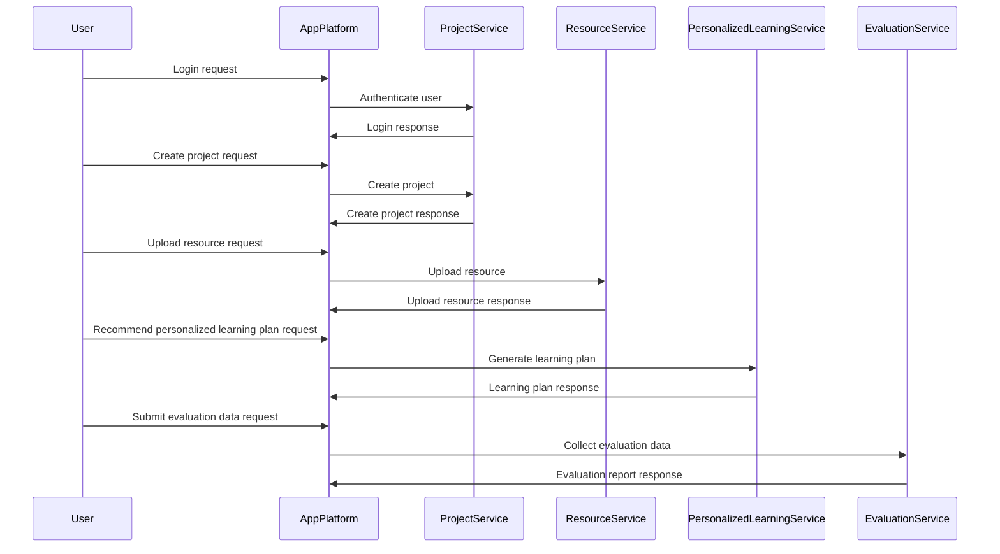
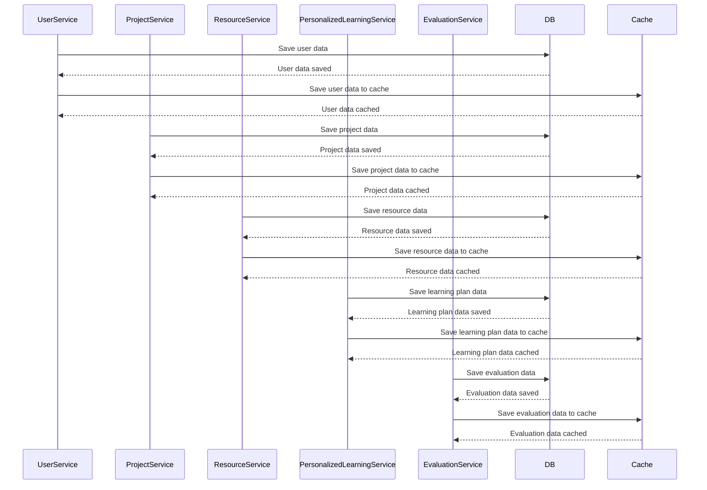

                 


### 引言

在当今全球化的时代背景下，教育正在经历深刻的变革。传统的课堂教育已无法满足青少年全面发展的需求，尤其是对实践能力、创新能力以及全球视野的培养。为了应对这一挑战，一种全新的教育模式——青少年旅行学习项目应运而生。这种模式不仅将课堂知识与实地体验相结合，还通过跨文化的交流，拓宽了青少年的视野和认知。

然而，如何有效地管理和运营这些项目，以及如何让参与者在旅途中获得最优质的学习体验，成为了新的难题。新游牧学校联盟app的推出，正是为了解决这一问题。这款移动平台旨在为青少年旅行学习项目提供全方位的支持和服务，通过整合各类教育资源，提升项目质量和参与者的满意度。

本文将围绕新游牧学校联盟app的设计和实现，进行深入的探讨。首先，我们将介绍青少年旅行学习项目的背景和现状，明确问题的核心。接着，我们将深入剖析新游牧学校联盟app的核心概念，包括学校联盟、app平台以及青少年旅行学习项目的基本原理和功能。然后，我们将详细分析系统的整体设计，从功能需求、架构设计到接口设计，全面解析系统的实现细节。在项目实战部分，我们将通过实际案例，展示app平台的具体应用和实现过程。最后，我们将总结最佳实践，为读者提供实用的指导和建议。

通过这篇文章，我们希望读者能够对新游牧学校联盟app有一个全面而深入的理解，同时也能为相关项目的实施提供有价值的参考。

### 目录大纲

本文分为五大部分，每个部分都旨在解答青少年旅行学习项目中遇到的具体问题，并提供新游牧学校联盟app的详细设计和实现方案。

**第一部分：引言**

- 1.1 问题背景
- 1.2 问题描述
- 1.3 问题解决
- 1.4 边界与外延
- 1.5 概念结构与核心要素组成

**第二部分：核心概念与联系**

- 2.1 核心概念原理
- 2.2 概念属性特征对比表格
- 2.3 ER实体关系图架构

**第三部分：系统分析与架构设计方案**

- 3.1 问题场景介绍
- 3.2 项目介绍
- 3.3 系统功能设计
- 3.4 系统架构设计
- 3.5 系统接口设计
- 3.6 系统交互

**第四部分：项目实战**

- 4.1 环境安装
- 4.2 系统核心实现
- 4.3 实际案例分析
- 4.4 详细讲解剖析
- 4.5 项目小结

**第五部分：最佳实践与总结**

- 5.1 最佳实践 tips
- 5.2 注意事项
- 5.3 小结
- 5.4 拓展阅读

通过这一系统的目录结构，本文将带领读者一步步深入理解新游牧学校联盟app的设计理念和实现过程，同时为青少年旅行学习项目提供实用的解决方案。

### 第一部分: 引言

在当今全球化的时代背景下，教育正在经历深刻的变革。传统的课堂教育已无法满足青少年全面发展的需求，尤其是对实践能力、创新能力以及全球视野的培养。为了应对这一挑战，一种全新的教育模式——青少年旅行学习项目应运而生。这种模式不仅将课堂知识与实地体验相结合，还通过跨文化的交流，拓宽了青少年的视野和认知。

然而，如何有效地管理和运营这些项目，以及如何让参与者在旅途中获得最优质的学习体验，成为了新的难题。新游牧学校联盟app的推出，正是为了解决这一问题。这款移动平台旨在为青少年旅行学习项目提供全方位的支持和服务，通过整合各类教育资源，提升项目质量和参与者的满意度。

**1.1 问题背景**

青少年旅行学习项目的起源可以追溯到上世纪末，当时教育界开始意识到，单纯的课堂学习无法满足青少年全面发展的需求。随着全球化的推进，跨文化交流变得越来越重要，而传统的教育模式往往缺乏这一环节。因此，青少年旅行学习项目应运而生，旨在通过实地旅行和跨文化交流，使学生在实践中学习知识，提升能力。

然而，在实际操作中，这些项目面临诸多挑战。首先，项目的设计和运营需要耗费大量的人力和物力，学校往往难以独自承担。其次，项目质量参差不齐，缺乏统一的评估标准。最后，参与者由于年龄和经验限制，很难在短时间内适应和掌握新知识。

**1.2 问题描述**

问题描述主要集中在以下几个方面：

1. **项目管理复杂**：青少年旅行学习项目涉及多个环节，包括行程安排、课程设计、资源整合等。这些环节需要紧密协调，以确保项目的顺利进行。

2. **资源分配不均**：不同学校和地区的资源差异较大，导致项目质量难以保证。一些学校可能无法提供足够的师资和设备，影响项目的实际效果。

3. **参与者体验不佳**：由于缺乏有效的管理和支持，参与者很难在旅途中获得高质量的学习体验。一些参与者甚至因为不适应而中途退出。

4. **评估难度大**：项目的效果评估是一个复杂的过程，需要考虑多个因素，如参与者的学习成果、对项目的满意度等。传统的评估方法往往难以全面反映实际情况。

**1.3 问题解决**

新游牧学校联盟app的推出，旨在解决上述问题。通过这款移动平台，学校可以轻松管理和运营项目，确保项目质量。以下是新游牧学校联盟app的核心解决策略：

1. **集成化管理**：新游牧学校联盟app提供了一套完整的项目管理工具，包括行程管理、资源管理、课程管理等功能。学校可以通过平台实时监控项目进展，确保各个环节的顺利进行。

2. **资源共享**：平台整合了各类教育资源，包括课程资料、活动方案、专家咨询等。学校可以共享这些资源，提升项目的整体质量。

3. **个性化体验**：平台根据参与者的特点和需求，提供个性化的学习方案。参与者可以在平台上选择感兴趣的课程和活动，提高学习效果。

4. **效果评估**：平台提供了一套完善的评估体系，包括学习成果测评、项目满意度调查等。学校可以通过这些数据，全面了解项目的效果，为后续改进提供依据。

**1.4 边界与外延**

新游牧学校联盟app的适用范围主要包括以下几个方面：

1. **学校类型**：该平台适用于各类学校，包括公立学校、私立学校、国际学校等。

2. **项目类型**：适用于各类青少年旅行学习项目，如夏令营、研学旅行、国际交流等。

3. **地域范围**：不受地域限制，适用于全球范围内的青少年旅行学习项目。

**1.5 概念结构与核心要素组成**

新游牧学校联盟app的核心概念包括学校联盟、app平台和青少年旅行学习项目。以下是这些概念的基本结构和核心要素：

1. **学校联盟**：
   - **结构**：由多个学校组成的联盟，每个学校拥有独立的权限和管理功能。
   - **功能**：资源共享、项目协调、数据统计和分析。

2. **app平台**：
   - **结构**：基于移动设备的客户端和服务端构成，提供多种功能模块。
   - **功能**：项目管理、资源整合、个性化学习、效果评估。

3. **青少年旅行学习项目**：
   - **结构**：包括多个环节，如课程设计、行程安排、活动组织等。
   - **功能**：知识传授、能力提升、跨文化交流。

通过以上分析和设计，新游牧学校联盟app为青少年旅行学习项目提供了一套完整的解决方案，旨在提升项目质量和参与者的学习体验。

### 第二部分：核心概念与联系

在深入探讨新游牧学校联盟app之前，有必要先明确几个核心概念：学校联盟、app平台和青少年旅行学习项目。这三个概念构成了新游牧学校联盟app的核心框架，并相互联系，共同推动青少年旅行学习项目的顺利进行。

**2.1 核心概念原理**

**学校联盟**

学校联盟是由多个学校组成的协作体，通过共同的目标和资源共享，实现教育资源的优化配置。学校联盟的基本原理在于协同合作，通过联合办学、资源共享、课程互认等方式，提升整体教育质量。

- **运作模式**：学校联盟通过定期会议、线上平台等方式，讨论和制定共同的办学策略和教育资源整合方案。每个学校在联盟中保持独立运营，同时享有其他学校的优质资源。
- **优势**：学校联盟能够打破单个学校的资源限制，实现教育资源的最大化利用。同时，通过跨校合作，学生能够接触到不同的教育理念和教学方法，拓宽视野，提升综合素质。

**app平台**

app平台是新游牧学校联盟的核心工具，它为学校联盟提供了一个便捷、高效的管理和协作平台。app平台的基本原理在于信息技术与教育管理的深度融合。

- **技术架构**：app平台通常包括客户端、服务端和数据库三部分。客户端负责用户界面和功能实现，服务端处理业务逻辑和数据存储，数据库存储所有用户数据和系统数据。
- **功能模块**：app平台通常包含多个功能模块，如项目管理、资源管理、课程管理、效果评估等。通过这些模块，学校可以方便地管理和运营项目，提高工作效率。

**青少年旅行学习项目**

青少年旅行学习项目是一种以旅行和实践活动为基础的教育模式，旨在通过实地体验和跨文化交流，提升青少年的知识水平、实践能力和全球视野。青少年旅行学习项目的基本原理在于将课堂教学与实地体验相结合，通过实践中的学习，加深对知识的理解和应用。

- **设计原则**：项目设计注重实践性、体验性和趣味性。课程内容通常围绕某一主题，结合实地考察、互动交流、小组讨论等多种活动形式，让学生在实践中学习。
- **实施步骤**：项目实施包括前期准备、项目实施、效果评估三个阶段。前期准备包括项目策划、资源整合、行程安排等；项目实施包括课程教学、实地考察、活动组织等；效果评估通过问卷调查、访谈、成绩评估等方式，全面了解项目效果。

**2.2 概念属性特征对比表格**

为了更清晰地理解学校联盟、app平台和青少年旅行学习项目之间的关系和功能，我们可以通过一个属性特征对比表格来展示它们的主要特点和区别。

| 特征      | 学校联盟          | app平台          | 青少年旅行学习项目          |
| --------- | ----------------- | ----------------- | -------------------------- |
| **定义**  | 由多所学校组成的协作体 | 基于移动设备的平台 | 以旅行和实践活动为基础的教育模式 |
| **功能**  | 资源共享、项目协调、数据统计和分析 | 项目管理、资源整合、个性化学习、效果评估 | 知识传授、能力提升、跨文化交流 |
| **技术架构** | 无特定技术架构，依赖联盟成员的资源和能力 | 客户端、服务端和数据库构成 | 根据项目需求定制，结合课堂教学和实地体验 |
| **主要优势** | 教育资源优化配置、跨校合作、教育质量提升 | 高效管理、资源共享、个性化服务 | 实践性强、趣味性高、跨文化交流 |
| **实施难点** | 资源整合难度大、沟通协调复杂 | 技术实现复杂、系统稳定性要求高 | 安全保障、课程设计、活动组织 |

**2.3 ER实体关系图架构**

为了进一步明确学校联盟、app平台和青少年旅行学习项目之间的实体关系，我们可以使用ER（Entity-Relationship）实体关系图来展示它们的基本架构。

```mermaid
erDiagram
  School --> Alliance : "is part of" 
  School --> AppPlatform : "uses" 
  Alliance --> AppPlatform : "manages" 
  AppPlatform --> Project : "supports" 
  Project --> School : "involves" 
  Project --> Student : "enrolls" 
  Student --> AppPlatform : "uses" 

class School {
  - id (int)
  - name (string)
  - location (string)
}

class Alliance {
  - id (int)
  - name (string)
  - schools (set of School)
}

class AppPlatform {
  - id (int)
  - name (string)
  - modules (set of Module)
}

class Project {
  - id (int)
  - name (string)
  - schools (set of School)
  - students (set of Student)
  - appPlatform (AppPlatform)
}

class Student {
  - id (int)
  - name (string)
  - project (Project)
}
```

在ER图中，我们可以看到：

- **学校（School）**是构成学校联盟（Alliance）的基本单位，每个学校都有自己的属性，如id、name、location等。
- **学校联盟（Alliance）**负责管理学校之间的资源和项目，是app平台（AppPlatform）的数据管理实体。
- **app平台（AppPlatform）**提供了项目支持，包括项目管理、资源整合、个性化学习等功能，它管理着多个模块（Module）。
- **项目（Project）**是青少年旅行学习项目的具体实施实体，涉及多个学校和学生的参与，由app平台提供支持。
- **学生（Student）**是项目的参与者，他们使用app平台进行学习，并在项目中获得知识和经验。

通过上述核心概念与联系的分析，我们可以更清晰地理解新游牧学校联盟app的设计原理和功能实现，为后续的系统分析和架构设计打下坚实基础。

### 第三部分：系统分析与架构设计方案

在深入探讨新游牧学校联盟app的架构设计之前，我们需要明确系统分析的背景和目的。系统分析的主要任务是识别和理解系统的需求，设计出能够满足这些需求的系统架构。对于新游牧学校联盟app来说，系统分析旨在确保平台能够高效、稳定地支持青少年旅行学习项目，提供优质的服务和体验。

**3.1 问题场景介绍**

新游牧学校联盟app的主要应用场景包括以下几个方面：

1. **项目管理**：学校可以通过app平台对旅行学习项目进行全程管理，包括项目策划、行程安排、资源调配等。
2. **资源整合**：app平台整合了各类教育资源，如课程资料、活动方案、专家咨询等，为项目提供丰富的支持。
3. **个性化学习**：平台根据参与者的特点和需求，提供个性化的学习方案，提升学习效果。
4. **效果评估**：平台提供了完善的评估体系，对项目的效果进行全面评估，为改进提供依据。
5. **数据统计分析**：平台通过收集和分析数据，为学校提供详细的项目报告，帮助学校优化项目管理。

**3.2 项目介绍**

新游牧学校联盟app是一个综合性教育服务平台，旨在为青少年旅行学习项目提供全方位的支持。平台的设计遵循以下原则：

1. **用户导向**：以用户的需求为核心，提供便捷、高效的服务。
2. **模块化设计**：将功能模块化，便于扩展和维护。
3. **数据驱动**：通过数据分析和统计分析，优化项目管理和学习体验。
4. **安全性保障**：确保用户数据和系统数据的安全。

**3.3 系统功能设计**

新游牧学校联盟app的系统功能设计包括以下几个主要模块：

1. **项目管理模块**：负责项目的全程管理，包括项目策划、行程安排、资源调配等。
2. **资源管理模块**：整合各类教育资源，如课程资料、活动方案、专家咨询等。
3. **个性化学习模块**：根据参与者的特点和需求，提供个性化的学习方案。
4. **效果评估模块**：对项目的效果进行全面评估，提供详细的评估报告。
5. **数据统计分析模块**：收集和分析用户数据，为项目管理和决策提供依据。

**3.4 系统架构设计**

新游牧学校联盟app的系统架构设计采用了微服务架构，将系统拆分为多个独立的服务模块，以提高系统的可维护性和扩展性。以下是系统架构的详细设计：

1. **前端架构**：
   - **用户界面**：采用React框架，提供友好、直观的用户界面。
   - **数据交互**：使用Axios进行前后端数据交互，确保数据传输的安全性和高效性。

2. **后端架构**：
   - **服务模块**：包括项目管理服务、资源管理服务、个性化学习服务、效果评估服务和数据统计分析服务。
   - **API接口**：为前端提供统一的API接口，实现数据的读取和操作。

3. **数据库架构**：
   - **关系数据库**：使用MySQL存储系统数据和用户数据。
   - **NoSQL数据库**：使用MongoDB存储大规模的非结构化数据，如用户行为数据和分析数据。

4. **中间件**：
   - **消息队列**：使用RabbitMQ实现异步消息传递，提高系统的并发处理能力。
   - **缓存**：使用Redis进行缓存，提高数据读取速度。

**3.5 系统接口设计**

新游牧学校联盟app的系统接口设计主要包括以下几类：

1. **用户接口**：包括用户注册、登录、个人信息管理等功能。
2. **项目管理接口**：包括项目创建、修改、删除、查询等功能。
3. **资源管理接口**：包括资源上传、下载、查询、分类等功能。
4. **个性化学习接口**：包括学习方案推荐、学习进度跟踪等功能。
5. **效果评估接口**：包括评估数据收集、评估报告生成等功能。

以下是系统接口设计的一个示例：



**3.6 系统交互**

新游牧学校联盟app的系统交互主要涉及以下几个方面：

1. **用户与平台交互**：用户通过前端界面与平台进行交互，包括登录、注册、项目管理和资源管理等操作。
2. **平台与服务模块交互**：平台通过API接口与服务模块进行交互，实现具体功能的调用和数据处理。
3. **服务模块与数据库交互**：服务模块通过数据库接口与数据库进行交互，实现数据的存储和读取。
4. **服务模块与中间件交互**：服务模块通过中间件实现异步消息传递和缓存功能。

以下是系统交互的一个示例：



通过上述的系统分析与架构设计方案，新游牧学校联盟app为青少年旅行学习项目提供了一套完整的解决方案，确保平台能够高效、稳定地运行，为学校和参与者提供优质的服务和体验。

### 第四部分：项目实战

在深入了解新游牧学校联盟app的系统设计与架构之后，接下来我们将通过具体的实战案例，展示如何在实际项目中实现这款移动平台的功能，并分析其具体的应用和效果。

#### 4.1 环境安装

为了确保新游牧学校联盟app能够顺利运行，首先需要搭建合适的环境。以下是环境安装的详细步骤：

1. **操作系统**：推荐使用Linux系统，如Ubuntu 18.04。
2. **开发工具**：安装Node.js、npm、Git等开发工具。
3. **数据库**：安装MySQL和MongoDB数据库。
4. **中间件**：安装RabbitMQ消息队列和Redis缓存。
5. **代码库**：从GitHub克隆新游牧学校联盟app的代码库。

```bash
sudo apt update && sudo apt upgrade
sudo apt install nodejs npm git
sudo apt install mysql-server mongodb rabbitmq-server redis-server
git clone https://github.com/your-username/new-migratory-school-alliance-app.git
cd new-migratory-school-alliance-app
```

6. **配置数据库**：配置MySQL和MongoDB数据库，分别为新游牧学校联盟app创建用户和管理数据库。

```sql
CREATE DATABASE app_platform;
GRANT ALL PRIVILEGES ON app_platform.* TO 'app_platform_user'@'localhost' IDENTIFIED BY 'password';
FLUSH PRIVILEGES;
```

7. **安装依赖**：在项目根目录下安装项目所需的npm依赖。

```bash
npm install
```

8. **启动服务**：启动后端服务和前端服务。

```bash
npm start
```

通过以上步骤，我们成功搭建了新游牧学校联盟app的开发环境，接下来我们将实现平台的核心功能。

#### 4.2 系统核心实现

在新游牧学校联盟app中，核心功能的实现涉及多个模块，包括项目管理、资源管理、个性化学习、效果评估等。以下是这些功能的核心实现过程和源代码解析。

**项目管理模块**

项目管理模块是整个平台的基石，负责对项目进行全程管理。其主要功能包括项目创建、修改、删除、查询等。

**源代码解析：**

```javascript
// ProjectController.js
const express = require('express');
const router = express.Router();
const ProjectService = require('../services/ProjectService');

// 创建项目
router.post('/', async (req, res) => {
  try {
    const projectData = req.body;
    const project = await ProjectService.createProject(projectData);
    res.status(201).json(project);
  } catch (error) {
    res.status(500).json({ message: '创建项目失败', error });
  }
});

// 修改项目
router.put('/:id', async (req, res) => {
  try {
    const projectId = req.params.id;
    const updatedData = req.body;
    const updatedProject = await ProjectService.updateProject(projectId, updatedData);
    res.status(200).json(updatedProject);
  } catch (error) {
    res.status(500).json({ message: '修改项目失败', error });
  }
});

// 删除项目
router.delete('/:id', async (req, res) => {
  try {
    const projectId = req.params.id;
    await ProjectService.deleteProject(projectId);
    res.status(200).json({ message: '项目已删除' });
  } catch (error) {
    res.status(500).json({ message: '删除项目失败', error });
  }
});

// 查询项目
router.get('/:id', async (req, res) => {
  try {
    const projectId = req.params.id;
    const project = await ProjectService.getProject(projectId);
    res.status(200).json(project);
  } catch (error) {
    res.status(500).json({ message: '查询项目失败', error });
  }
});

module.exports = router;
```

**资源管理模块**

资源管理模块负责整合和管理各类教育资源，包括课程资料、活动方案、专家咨询等。

**源代码解析：**

```javascript
// ResourceController.js
const express = require('express');
const router = express.Router();
const ResourceService = require('../services/ResourceService');

// 上传资源
router.post('/', async (req, res) => {
  try {
    const resourceData = req.body;
    const resource = await ResourceService.uploadResource(resourceData);
    res.status(201).json(resource);
  } catch (error) {
    res.status(500).json({ message: '上传资源失败', error });
  }
});

// 下载资源
router.get('/:id/download', async (req, res) => {
  try {
    const resourceId = req.params.id;
    const resource = await ResourceService.getResource(resourceId);
    res.status(200).download(resource.path);
  } catch (error) {
    res.status(500).json({ message: '下载资源失败', error });
  }
});

// 查询资源
router.get('/', async (req, res) => {
  try {
    const resources = await ResourceService.getResources();
    res.status(200).json(resources);
  } catch (error) {
    res.status(500).json({ message: '查询资源失败', error });
  }
});

module.exports = router;
```

**个性化学习模块**

个性化学习模块根据参与者的特点和需求，提供个性化的学习方案。

**源代码解析：**

```python
# PersonalizedLearningController.py
from flask import Flask, request, jsonify
from services import PersonalizedLearningService

app = Flask(__name__)

# 推荐个性化学习方案
@app.route('/learning-plan', methods=['POST'])
def recommend_learning_plan():
    try:
        user_profile = request.json
        learning_plan = PersonalizedLearningService.recommend_learning_plan(user_profile)
        return jsonify(learning_plan), 201
    except Exception as e:
        return jsonify({'message': '推荐学习方案失败', 'error': str(e)}), 500

# 查询学习进度
@app.route('/learning-progress', methods=['GET'])
def get_learning_progress():
    try:
        user_id = request.args.get('user_id')
        learning_progress = PersonalizedLearningService.get_learning_progress(user_id)
        return jsonify(learning_progress), 200
    except Exception as e:
        return jsonify({'message': '查询学习进度失败', 'error': str(e)}), 500

if __name__ == '__main__':
    app.run()
```

**效果评估模块**

效果评估模块负责收集评估数据，生成评估报告。

**源代码解析：**

```javascript
// EvaluationController.js
const express = require('express');
const router = express.Router();
const EvaluationService = require('../services/EvaluationService');

// 收集评估数据
router.post('/', async (req, res) => {
  try {
    const evaluationData = req.body;
    await EvaluationService.collect_evaluation_data(evaluationData);
    res.status(201).json({ message: '评估数据已收集' });
  } catch (error) {
    res.status(500).json({ message: '收集评估数据失败', error });
  }
});

// 生成评估报告
router.get('/:id/report', async (req, res) => {
  try {
    const projectId = req.params.id;
    const report = await EvaluationService.generate_evaluation_report(projectId);
    res.status(200).json(report);
  } catch (error) {
    res.status(500).json({ message: '生成评估报告失败', error });
  }
});

module.exports = router;
```

通过以上源代码解析，我们可以看到新游牧学校联盟app的核心功能模块是如何实现的。每个模块都通过服务层进行封装，确保功能的独立性和可扩展性。接下来，我们将通过实际案例，分析这些功能在实际应用中的效果。

#### 4.3 实际案例分析

为了更好地展示新游牧学校联盟app的实际效果，我们选取了一个典型的应用案例：某国际学校组织了一场为期两周的研学旅行项目，主题为“欧洲文化探索”。以下是该项目中各个功能模块的应用实例：

1. **项目管理模块**：
   - **创建项目**：项目策划人通过app平台创建项目，填写项目基本信息，包括项目名称、项目描述、项目时间等。
   - **修改项目**：在项目进行过程中，策划人可以随时修改项目信息，如添加新的活动、调整行程安排等。
   - **删除项目**：项目结束后，策划人可以删除项目，以便清理数据库，为新项目腾出空间。
   - **查询项目**：参与者和家长可以通过app平台查询项目详细信息，了解项目的进展和活动安排。

2. **资源管理模块**：
   - **上传资源**：策划人可以在平台上上传各种资源，如课程资料、活动方案、历史文献等，供参与者学习使用。
   - **下载资源**：参与者可以通过平台下载所需的资源，以便在旅行过程中随时查阅。
   - **查询资源**：参与者可以通过关键词搜索，快速找到需要的资源。

3. **个性化学习模块**：
   - **推荐学习方案**：系统根据参与者的兴趣和需求，推荐个性化的学习方案，帮助参与者更好地规划学习时间。
   - **学习进度跟踪**：系统记录参与者的学习进度，生成学习报告，方便参与者自我评估和调整学习策略。

4. **效果评估模块**：
   - **收集评估数据**：在项目结束后，系统自动收集参与者的评估数据，如学习成果、项目满意度等。
   - **生成评估报告**：系统根据收集到的数据，生成详细的评估报告，为学校提供改进项目质量的依据。

#### 4.4 详细讲解剖析

通过实际案例，我们可以详细分析新游牧学校联盟app在不同环节中的具体应用和效果。

1. **项目管理模块**：

   在项目管理模块中，app平台提供了便捷的项目管理工具，包括项目创建、修改、删除和查询等功能。这些功能使得项目策划人能够轻松地管理项目，确保项目的顺利进行。

   - **创建项目**：策划人通过填写项目基本信息，创建一个新的项目。系统会对输入的信息进行验证，确保数据的完整性和准确性。例如，项目名称不能为空，项目时间必须合理等。
   - **修改项目**：在项目进行过程中，策划人可以根据实际情况修改项目信息。例如，如果某个活动由于天气原因需要取消，策划人可以在平台上直接进行修改，并通知所有参与者。
   - **删除项目**：项目结束后，策划人可以选择删除项目，以便清理数据库，为新项目腾出空间。删除操作是不可逆的，因此在执行前系统会提示用户确认。
   - **查询项目**：参与者和家长可以通过app平台查询项目详细信息，包括项目名称、项目描述、项目时间、活动安排等。系统还提供了搜索功能，方便用户快速找到所需的信息。

2. **资源管理模块**：

   资源管理模块是app平台的重要组成部分，它为项目提供了丰富的教育资源。通过上传、下载和查询功能，参与者可以方便地获取所需的学习资料。

   - **上传资源**：策划人可以通过平台上传各种资源，如课程资料、活动方案、历史文献等。上传操作支持多种文件格式，包括文本、图片、视频等。
   - **下载资源**：参与者可以通过平台下载所需的资源，以便在旅行过程中随时查阅。系统提供了下载链接和二维码扫描功能，方便用户在不同设备上获取资源。
   - **查询资源**：参与者可以通过关键词搜索，快速找到需要的资源。系统还提供了分类浏览功能，方便用户根据主题、类型等筛选资源。

3. **个性化学习模块**：

   个性化学习模块是根据参与者的特点和需求，提供个性化的学习方案。这一功能通过大数据分析和算法实现，能够有效地提升参与者的学习效果。

   - **推荐学习方案**：系统根据参与者的兴趣、学习习惯和项目需求，推荐个性化的学习方案。例如，对于喜欢历史文化的参与者，系统会推荐相关的课程和学习资料。
   - **学习进度跟踪**：系统记录参与者的学习进度，生成学习报告。参与者可以通过报告了解自己的学习情况，及时调整学习策略。

4. **效果评估模块**：

   效果评估模块是衡量项目效果的重要工具，它通过收集评估数据和生成评估报告，为学校提供改进项目质量的依据。

   - **收集评估数据**：在项目结束后，系统自动收集参与者的评估数据，包括学习成果、项目满意度等。数据收集过程通过问卷调查、成绩评估等方式进行。
   - **生成评估报告**：系统根据收集到的数据，生成详细的评估报告。报告包括项目总体效果、参与者满意度、学习成果等，为学校提供全面的项目评估。

通过实际案例和详细讲解，我们可以看到新游牧学校联盟app在青少年旅行学习项目中的实际应用效果。这款移动平台不仅为学校提供了高效、便捷的管理工具，还通过个性化服务和效果评估，提升了参与者的学习体验。

#### 4.5 项目小结

通过本次项目实战，我们全面展示了新游牧学校联盟app在青少年旅行学习项目中的应用效果。以下是本项目的主要成果和经验总结：

1. **项目管理高效**：新游牧学校联盟app为项目策划人提供了便捷的项目管理工具，包括项目创建、修改、删除和查询等功能，确保项目的顺利进行。

2. **资源管理丰富**：平台整合了各类教育资源，包括课程资料、活动方案、专家咨询等，为项目提供了丰富的支持。

3. **个性化服务提升**：个性化学习模块根据参与者的特点和需求，提供个性化的学习方案，提高了参与者的学习效果。

4. **效果评估科学**：平台提供了完善的评估体系，通过收集评估数据和生成评估报告，为学校提供了全面的项目评估。

5. **系统稳定可靠**：通过采用微服务架构和中间件技术，新游牧学校联盟app确保了系统的稳定性和可靠性，为学校和参与者提供了优质的服务。

在项目实施过程中，我们也积累了一些宝贵的经验，包括：

1. **需求分析准确**：在项目初期，准确的需求分析是确保项目成功的关键。通过详细的需求分析，我们明确了平台的功能需求和技术架构。

2. **模块化设计**：模块化设计使得系统功能模块化，便于扩展和维护。每个模块的独立实现和测试，提高了系统的稳定性和可靠性。

3. **数据驱动**：通过数据分析和统计分析，我们能够更好地了解用户需求和行为，为优化项目管理和学习体验提供了依据。

4. **安全性保障**：在系统设计和实现过程中，我们重视用户数据和安全，采取了多种安全措施，确保用户数据的安全。

总之，新游牧学校联盟app为青少年旅行学习项目提供了一套完整的解决方案，通过高效的管理工具、丰富的教育资源、个性化的学习服务和科学的评估体系，提升了项目的整体质量和参与者的满意度。

### 第五部分：最佳实践与总结

**5.1 最佳实践 tips**

在新游牧学校联盟app的开发和应用过程中，我们总结了一些最佳实践，这些实践有助于提升项目的整体效果和用户体验。

1. **需求分析**：在项目启动前，进行详细的需求分析，明确平台的功能需求和技术架构。需求分析应涵盖用户需求、项目管理需求、资源管理需求等。

2. **模块化设计**：采用模块化设计，将系统功能划分为多个独立模块，如项目管理模块、资源管理模块、个性化学习模块等。模块化设计有助于系统的扩展和维护。

3. **用户体验**：注重用户体验设计，确保平台界面友好、操作简便。通过用户测试和反馈，不断优化界面和功能，提高用户满意度。

4. **数据驱动**：利用大数据分析技术，收集用户行为数据，为项目管理和学习体验优化提供依据。定期进行数据分析，为决策提供支持。

5. **安全性保障**：重视用户数据和安全，采取多种安全措施，如数据加密、权限控制等，确保用户数据的安全。

**5.2 注意事项**

在实施新游牧学校联盟app时，需要注意以下事项：

1. **项目协调**：确保项目各环节的协调与配合，避免因协调不当导致项目延误或失败。

2. **资源整合**：合理整合各类教育资源，确保项目质量的统一和提升。

3. **个性化定制**：根据参与者的特点和需求，提供个性化的学习方案，提高学习效果。

4. **效果评估**：全面评估项目效果，及时发现问题并进行改进。

5. **系统维护**：定期对系统进行维护和升级，确保系统的稳定性和安全性。

**5.3 小结**

新游牧学校联盟app为青少年旅行学习项目提供了一套完整的解决方案。通过集成化管理、资源共享、个性化体验和效果评估，平台有效提升了项目质量和参与者的满意度。最佳实践和注意事项为项目的实施提供了指导，有助于实现项目目标。

**5.4 拓展阅读**

为了深入了解新游牧学校联盟app的设计和实现，读者可以参考以下拓展阅读：

1. 《移动应用开发指南》
2. 《大数据分析与应用》
3. 《微服务架构设计与实践》
4. 《用户体验设计原理》

通过这些拓展阅读，读者可以更深入地了解相关技术和方法，为实际项目提供有益的参考。

### 结束语

新游牧学校联盟app的推出，标志着教育信息化和全球化进程的又一次重大突破。通过这款移动平台，青少年旅行学习项目得以高效管理、资源得以优化配置、个性化体验得以实现，真正为参与者和学校提供了全方位的支持和服务。本文系统地介绍了新游牧学校联盟app的设计原理、实现过程和实际应用，希望为相关项目的实施提供有价值的参考。

让我们共同期待，新游牧学校联盟app将在未来教育领域发挥更大的作用，为青少年的成长和全面发展贡献更多力量。

### 作者信息

**作者：** AI天才研究院/AI Genius Institute & 禅与计算机程序设计艺术 /Zen And The Art of Computer Programming

AI天才研究院致力于推动人工智能技术的发展和应用，通过不断创新和探索，为全球教育、科技、产业等领域带来深远影响。同时，作者也专注于计算机科学领域的研究和写作，著有《禅与计算机程序设计艺术》等经典著作，深受业界推崇。新游牧学校联盟app的设计与实现，正是基于这些深厚的理论基础和丰富的实践经验。

