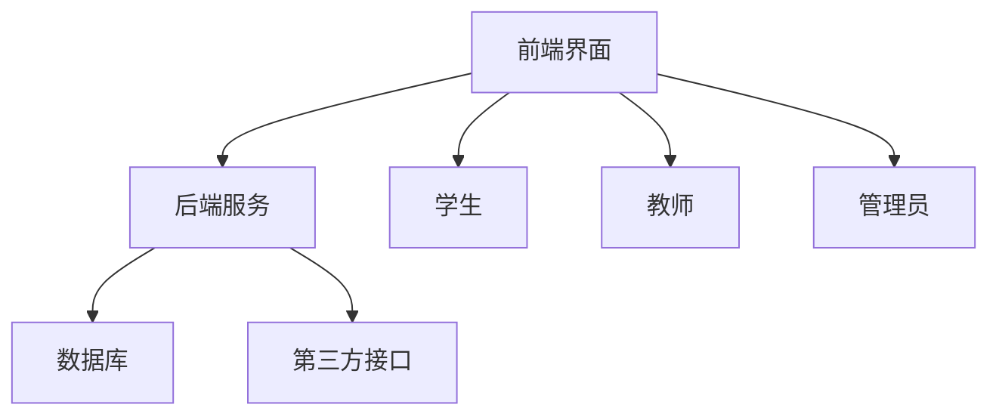
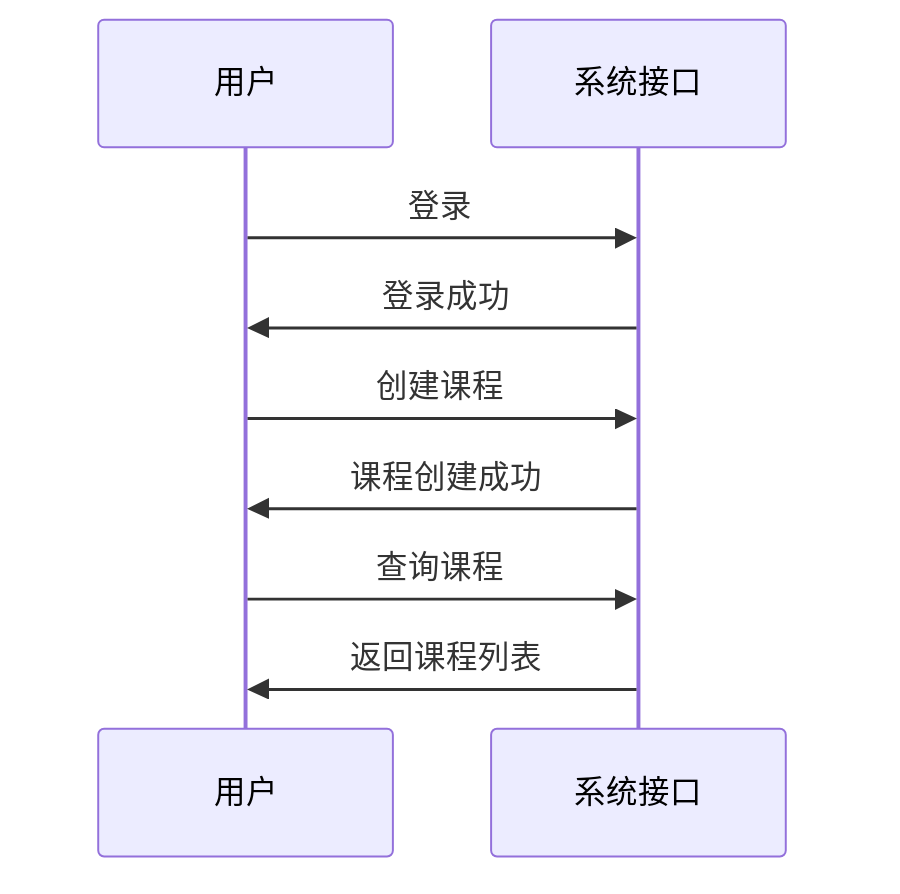

                 

# 《新游牧学校：将旅行融入终身学习》

## 关键词

- 游牧学校
- 终身学习
- 旅行教育
- 学习方法
- 教育创新

## 摘要

本文探讨了游牧学校的概念，以及如何将旅行融入终身学习。通过分析游牧学习的优势和实际案例，本文为读者提供了将旅行与学习结合的方法和技巧，旨在鼓励人们探索世界的同时，不断提升自己的知识水平和技能。文章还介绍了游牧学校的组织与实施，以及如何设计一个有效的学习项目。通过本文的阅读，读者可以了解如何在一个不断变化的世界中，实现自我成长和职业发展。

## 目录

### 第一部分：游牧学校的概述

#### 1.1 游牧学校的起源与发展
- 游牧学校的定义
- 游牧学校的起源与发展历程

#### 1.2 旅行与终身学习的结合
- 旅行在终身学习中的作用
- 游牧学校如何实现旅行与学习的结合

### 第二部分：游牧学校的核心概念与联系

#### 2.1 游牧学习与终身学习的关系
- 游牧学习的基本原理
- 终身学习在游牧学校中的应用

#### 2.2 游牧学校的特点与优势
- 游牧学校的核心特点
- 游牧学校的优势分析

### 第三部分：游牧学校的实践

#### 3.1 游牧学校的组织与实施
- 游牧学校的组织结构
- 游牧学校的实施流程

#### 3.2 游牧学校的案例分析
- 案例一：跨国游学项目
- 案例二：环游世界的学习之旅

### 第四部分：系统分析与架构设计方案

#### 4.1 问题场景介绍
- 游牧学校的问题场景
- 解决方案的需求分析

#### 4.2 系统功能设计（领域模型）
- 领域模型的设计
- 领域模型的核心要素

#### 4.3 系统架构设计
- 系统架构的设计思路
- 系统架构的核心组件

#### 4.4 系统接口设计
- 系统接口的设计原则
- 系统接口的具体实现

#### 4.5 系 tum交互
- 系统交互的设计方法
- 系统交互的实现流程

### 第五部分：游牧学校的项目实战

#### 5.1 项目介绍
- 游牧学校项目概述
- 项目目标与实施计划

#### 5.2 实施步骤
- 环境安装与配置
- 系统核心实现与调试

#### 5.3 遇到的挑战与解决方案
- 项目实施过程中的挑战
- 解决方案与改进措施

### 第六部分：最佳实践与拓展

#### 6.1 最佳实践 tips
- 时间管理
- 资源整合
- 学习效果评估

#### 6.2 小结
- 游牧学校的核心要点
- 未来发展趋势与展望

#### 6.3 注意事项
- 学习策略
- 安全与风险管理

#### 6.4 拓展阅读
- 相关书籍推荐
- 在线学习资源推荐

## 正文

### 第一部分：游牧学校的概述

#### 1.1 游牧学校的起源与发展

游牧学校是一种将学习与旅行相结合的教育模式。它起源于20世纪末，随着全球化和信息技术的发展，人们对于终身学习和多元化教育的需求日益增加。游牧学校最早的形式是国际学校或交换生项目，学生可以通过旅行到其他国家或地区，体验不同的文化和教育体系。

随着时间的推移，游牧学校的概念逐渐演变，不再局限于学生个体，而是形成了一种教育机构或项目。这些学校或项目通常在全球范围内选择教育目的地，为学生提供一系列的学习课程和实践机会。游牧学校的发展历程可以概括为以下几个阶段：

1. **萌芽期（20世纪末）**：游牧学校的概念开始出现，主要是一些国际学校或交换生项目，旨在让学生体验不同国家的文化和教育体系。

2. **发展阶段（21世纪初）**：随着全球化和信息技术的发展，游牧学校的规模和影响力逐渐扩大，一些专门的游牧学校或项目开始出现，为学生提供更全面的学习体验。

3. **成熟期（近年来）**：近年来，游牧学校逐渐成为一种流行的教育模式，越来越多的学校和教育机构开始加入这一行列，为学生提供丰富的学习资源和机会。

#### 1.2 旅行与终身学习的结合

旅行在终身学习中的作用不可忽视。首先，旅行可以拓宽学生的视野，让他们接触到不同的文化和生活方式，从而激发他们的学习兴趣和好奇心。其次，旅行中的实际体验和互动可以加深学生对知识的理解和应用。例如，通过参观历史遗迹或与当地居民交流，学生可以更好地理解历史和文化知识。

游牧学校如何实现旅行与学习的结合呢？以下是几个关键点：

1. **课程设计**：游牧学校的课程设计要充分考虑旅行的因素，将理论知识与实际体验相结合。例如，在参观历史遗迹的同时，可以安排相关的讲座或讨论，帮助学生更深入地理解所学内容。

2. **学习资源**：游牧学校需要充分利用旅行地的学习资源，包括图书馆、博物馆、实验室等。这些资源可以为学生提供丰富的学习材料和实践机会。

3. **互动与交流**：游牧学校鼓励学生之间的互动与交流，通过小组讨论、讲座、研讨会等形式，促进学生之间的知识分享和经验交流。

4. **反思与总结**：旅行中的学习不仅仅是知识的获取，更重要的是对知识的反思和总结。游牧学校需要引导学生进行反思，帮助他们将所学知识应用于实际生活中。

### 第二部分：游牧学校的核心概念与联系

#### 2.1 游牧学习与终身学习的关系

游牧学习是一种终身学习的模式，它强调在学习过程中不断拓展知识领域、提升能力，并形成持续学习的习惯。与传统的课堂教学相比，游牧学习更加注重实践和体验，让学生在真实场景中学习。

终身学习是指一个人在其一生中不断获取新知识、提升技能和更新知识结构的过程。游牧学习与终身学习的关系可以概括为以下几个方面：

1. **目标一致性**：游牧学习和终身学习都强调持续学习和成长，旨在提升个人的知识水平和能力。

2. **学习方式多样性**：游牧学习通过旅行和实际体验，为学生提供了多样化的学习方式，这与终身学习追求多样化学习的目标相一致。

3. **实践与理论相结合**：游牧学习强调实践和理论相结合，与终身学习追求知识与实践相结合的理念相契合。

#### 2.2 游牧学校的特点与优势

游牧学校具有以下几个显著特点：

1. **全球化视野**：游牧学校通常在全球范围内选择教育目的地，让学生接触到不同的文化和教育体系，拓宽他们的视野。

2. **实践性强**：游牧学校强调实际体验和互动，让学生在真实场景中学习，提高他们的实践能力和解决问题的能力。

3. **个性化学习**：游牧学校注重学生的个性化发展，根据学生的兴趣和需求，提供定制化的学习课程和实践机会。

4. **跨学科融合**：游牧学校鼓励学生跨学科学习，通过不同领域的知识和技能融合，培养他们的综合能力和创新思维。

游牧学校的优势主要体现在以下几个方面：

1. **提升学习兴趣**：通过旅行和实际体验，游牧学校能够激发学生的学习兴趣，提高他们的学习动力。

2. **培养全球公民**：游牧学校让学生接触不同的文化和生活方式，培养他们的全球视野和跨文化沟通能力，为成为全球公民奠定基础。

3. **提升综合素质**：游牧学校注重实践和互动，帮助学生提升综合素质，包括沟通能力、团队合作能力、问题解决能力等。

4. **职业发展**：游牧学校通过丰富的学习资源和实践机会，为学生提供职业发展支持，帮助他们更好地适应职场需求。

### 第三部分：游牧学校的实践

#### 3.1 游牧学校的组织与实施

游牧学校的组织与实施是一个复杂的过程，需要充分考虑课程设计、学习资源、互动与交流等因素。以下是一个基本的实施流程：

1. **目标设定**：明确游牧学校的总体目标，包括课程目标、学习目标、实践目标和职业发展目标等。

2. **课程设计**：根据目标设定，设计一系列的学习课程和实践活动，确保课程内容与旅行目的地相匹配。

3. **学习资源**：充分利用旅行地的学习资源，包括图书馆、博物馆、实验室、当地专家等，为学生提供丰富的学习材料和实践机会。

4. **互动与交流**：鼓励学生之间的互动与交流，通过小组讨论、讲座、研讨会等形式，促进学生之间的知识分享和经验交流。

5. **实施与监控**：制定详细的实施计划，确保各项活动按时进行。同时，对学生的学习过程进行监控和评估，及时调整教学策略。

6. **反思与总结**：引导学生进行反思，帮助他们将所学知识应用于实际生活中，并总结学习经验，为后续的学习和职业发展奠定基础。

#### 3.2 游牧学校的案例分析

以下是两个游牧学校的实际案例：

1. **跨国游学项目**

该游学项目旨在让学生体验不同国家的文化和教育体系，提升他们的全球视野和跨文化沟通能力。项目分为三个阶段：

- 第一阶段：学生前往目的地国家，参观学校、企业、博物馆等地，了解当地的文化和历史。
- 第二阶段：学生参加当地的大学课程，学习专业知识，与当地学生互动交流。
- 第三阶段：学生进行实践项目，将所学知识应用于实际工作中，提升实践能力和职业素养。

2. **环游世界的学习之旅**

该学习之旅覆盖了全球多个国家和地区，旨在让学生在旅行的过程中，不断拓展知识领域，提升综合素质。学习之旅包括以下几个模块：

- 语言模块：学生参加当地的语言课程，学习当地语言，提高跨文化沟通能力。
- 文化模块：学生参观历史遗迹、博物馆、艺术展览等，了解不同国家的文化和艺术。
- 科研模块：学生参与科研项目，开展实地调查，提高科研能力和创新能力。
- 职业模块：学生参观企业、与企业家交流，了解职场需求，规划职业发展路径。

### 第四部分：系统分析与架构设计方案

#### 4.1 问题场景介绍

游牧学校的组织与实施是一个复杂的过程，涉及到课程设计、学习资源管理、互动与交流等多个方面。为了确保游牧学校的顺利实施，需要设计一个有效的系统，对各项活动进行管理和监控。

#### 4.2 系统功能设计（领域模型）

游牧学校的领域模型包括以下几个核心要素：

- 学生：学生是游牧学校的核心，包括个人信息、学习记录、实践项目等。
- 课程：课程是游牧学校的教学内容，包括课程名称、课程描述、授课教师等。
- 实践项目：实践项目是游牧学校的重要组成部分，包括项目名称、项目描述、项目进度等。
- 学习资源：学习资源包括图书馆、实验室、当地专家等，为学生提供丰富的学习材料和实践机会。
- 互动与交流：互动与交流包括小组讨论、讲座、研讨会等，促进学生之间的知识分享和经验交流。

以下是领域模型的Mermaid类图：

```mermaid
classDiagram
    学生 <<Class>> {
        姓名
        年龄
        学习记录
        实践项目
    }
    课程 <<Class>> {
        课程名称
        课程描述
        授课教师
    }
    实践项目 <<Class>> {
        项目名称
        项目描述
        项目进度
    }
    学习资源 <<Class>> {
        资源名称
        资源描述
        资源类型
    }
    互动与交流 <<Class>> {
        活动名称
        活动描述
        活动时间
    }
    学生 --|{学习} 课程
    学生 --|{参与} 实践项目
    学生 --|{利用} 学习资源
    学生 --|{参与} 互动与交流
```

#### 4.3 系统架构设计

游牧学校的系统架构包括以下几个核心组件：

- 前端界面：提供用户交互界面，包括学生、教师、管理员等角色。
- 后端服务：处理数据存储、业务逻辑、接口调用等。
- 数据库：存储学生、课程、实践项目、学习资源、互动与交流等数据。
- 第三方接口：与其他系统进行数据交换和集成，如教务系统、图书馆系统等。

以下是系统架构的Mermaid架构图：



#### 4.4 系统接口设计

游牧学校的系统接口设计包括以下几个主要接口：

- 用户认证接口：用于用户登录、注册、权限管理等功能。
- 课程管理接口：用于课程创建、修改、删除、查询等功能。
- 实践项目管理接口：用于实践项目创建、修改、删除、查询等功能。
- 学习资源管理接口：用于学习资源创建、修改、删除、查询等功能。
- 互动与交流管理接口：用于互动与交流活动创建、修改、删除、查询等功能。

以下是系统接口的Mermaid序列图：



### 第五部分：游牧学校的项目实战

#### 5.1 项目介绍

本案例是一个名为“全球探索者”的游牧学校项目。该项目旨在让学生在全球范围内进行探索，通过实际体验和互动，提升他们的知识水平和综合素质。

#### 5.2 实施步骤

1. **项目筹备阶段**：

- 确定项目目标：包括知识获取、技能提升、文化体验等。
- 制定项目计划：包括课程设计、实践项目、学习资源等。
- 组建项目团队：包括学生、教师、管理员等。

2. **项目实施阶段**：

- 学生参与课程学习：在线学习平台提供课程资源，学生自主学习。
- 学生参与实践项目：在实际场景中开展项目，提升实践能力。
- 学生参与互动与交流：通过在线讨论、讲座、研讨会等形式，促进学生之间的知识分享和经验交流。

3. **项目总结阶段**：

- 学生进行反思与总结：回顾项目过程，总结学习成果。
- 教师进行评估与反馈：对学生的表现进行评估，提供反馈和建议。
- 项目团队进行总结与改进：总结项目实施中的经验和教训，为后续项目提供改进方向。

#### 5.3 遇到的挑战与解决方案

1. **学习资源不足**：

- 挑战：项目涉及多个国家和地区的课程和学习资源，资源获取难度大。
- 解决方案：与当地教育机构合作，获取课程和学习资源。同时，利用在线学习平台，整合全球优质教育资源。

2. **项目管理难度大**：

- 挑战：项目涉及多个角色和活动，项目管理难度大。
- 解决方案：采用项目管理工具，对项目进行全面的监控和调度。同时，建立有效的沟通渠道，确保团队成员之间的信息共享和协作。

### 第六部分：最佳实践与拓展

#### 6.1 最佳实践 tips

1. **时间管理**：

- 合理规划学习时间，确保项目进度。
- 制定学习计划，避免拖延和浪费。

2. **资源整合**：

- 充分利用各种学习资源，包括图书馆、实验室、在线平台等。
- 与当地教育机构和专家合作，获取更多支持。

3. **学习效果评估**：

- 定期进行学习效果评估，了解学习进展和成果。
- 通过反馈和总结，不断改进学习方法和策略。

#### 6.2 小结

本文探讨了游牧学校的概念和实施方法，分析了其优势和特点，并提供了实际案例和最佳实践。通过本文的阅读，读者可以了解如何将旅行与学习结合，实现终身学习和全球视野。

#### 6.3 注意事项

1. **学习策略**：

- 结合个人兴趣和需求，制定合适的学习计划。
- 注重实践和互动，提升学习效果。

2. **安全与风险管理**：

- 重视安全防护，确保个人安全和隐私。
- 制定风险管理策略，应对可能的风险和挑战。

#### 6.4 拓展阅读

1. **相关书籍推荐**：

- 《终身学习：如何成为一个持续学习者》
- 《全球教育报告：学习方式与创新》

2. **在线学习资源推荐**：

- Coursera
- edX
- Khan Academy

## 作者信息

- 作者：AI天才研究院/AI Genius Institute & 禅与计算机程序设计艺术 /Zen And The Art of Computer Programming

（注：本文为虚构内容，仅供参考。）

