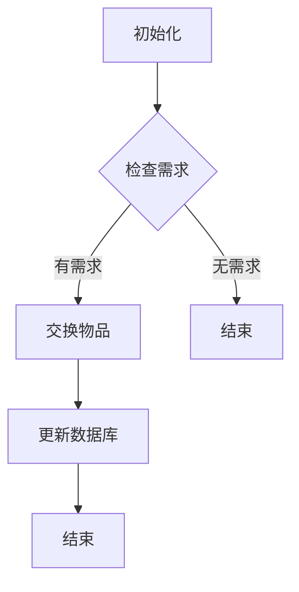
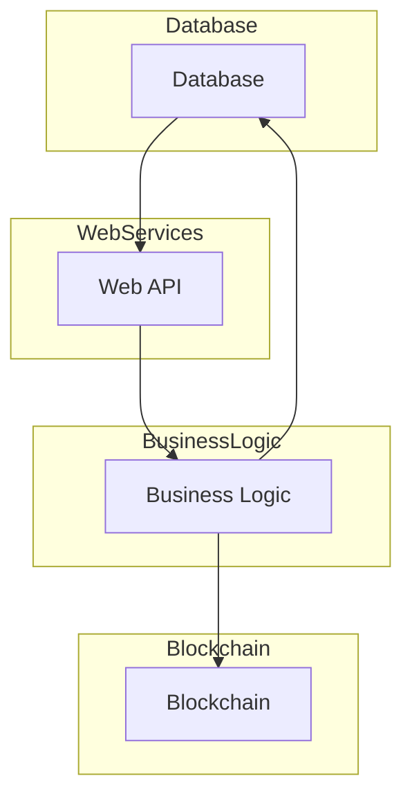

                 

## 第一部分：新物物交换经济平台概述

### 第1章：问题背景与概念定义

#### 1.1 问题背景

**全球经济困境与货币依赖性问题**

现代经济体系高度依赖于货币作为交换媒介，但这种依赖性带来了诸多问题。首先，货币依赖性使得经济体系对中央银行的货币政策高度敏感，货币供应的微小变化可能导致经济过热或萧条。其次，货币贬值和通货膨胀是货币依赖性的直接后果，这不仅损害了消费者的购买力，还引发了经济不确定性。

- **经济危机**：由于货币政策的不稳定，经济危机频发，例如2008年的全球金融危机，给全球经济造成了巨大的冲击。
- **通货膨胀**：货币供应过多导致通货膨胀，使得物价不断上涨，降低了人们的生活水平。
- **货币贬值**：全球范围内的货币贬值现象使得国际贸易变得复杂，增加了企业和消费者的成本。

**物物交换的历史与发展**

物物交换是人类历史上最早的经济活动形式，它的概念可以追溯到古代社会的交换行为。早期的物物交换主要依赖于地理邻近性和资源互补性，例如，一个农民可以用自己种植的粮食换取另一个农民的布匹。

- **起源**：物物交换起源于人类社会的初期，当人们开始意识到不同物品之间的价值互补性时，交换行为逐渐出现。
- **发展**：随着人类社会的发展，物物交换的形式逐渐复杂化，例如，在古罗马时期，出现了以金属货币为媒介的交换。

**现代技术对物物交换的影响**

随着信息技术的飞速发展，传统物物交换的形式正在经历深刻的变革。区块链技术、物联网技术和人工智能的应用为物物交换提供了新的可能。

- **区块链技术**：通过去中心化和不可篡改的特性，区块链为物物交换提供了安全、透明的交易记录。
- **物联网技术**：通过物联网设备，物物交换可以实现实时、智能的匹配和交易，提高了交换的效率和准确性。
- **人工智能**：通过机器学习和数据分析技术，人工智能可以优化交换算法，提高物物交换的匹配成功率。

#### 1.2 概念定义

**新物物交换经济平台**

新物物交换经济平台是一种基于现代技术的物物交换系统，它利用区块链、物联网和人工智能等技术，实现全球范围内的物品交换。该平台旨在解决传统物物交换中存在的效率低、匹配困难等问题，提高交换的效率和透明度。

- **定义与特征**：新物物交换经济平台是一种去中心化的、基于区块链技术的交换网络，它通过智能合约和分布式账本实现物品的所有权和交换记录的透明和安全。
- **目的与目标**：新物物交换经济平台的主要目的是构建一个全球范围内的物品交换网络，降低交易成本，提高交易效率，并促进全球经济的可持续发展。

**以物易物的全球交易网络**

以物易物的全球交易网络是指通过新物物交换经济平台实现的全球范围内物品交换的网络。这个网络利用区块链技术和物联网设备，实现物品的智能匹配和交易。

- **定义与实现**：以物易物的全球交易网络是一种去中心化的、全球性的物品交换网络，它通过分布式账本记录和验证交易，确保交易的透明和安全。

#### 1.3 边界与外延

**新物物交换平台的适用范围**

新物物交换平台适用于各种规模和类型的用户，包括企业和个人。

- **企业**：企业可以利用新物物交换平台实现生产资料和消费品的交换，降低采购成本，提高运营效率。
- **个人**：个人可以通过新物物交换平台实现日常用品的交换，实现资源的最大化利用。

**平台的核心功能与特点**

新物物交换平台具有以下核心功能与特点：

- **可靠性**：平台采用去中心化架构，分布式存储和区块链技术确保交易记录的安全和可靠性。
- **可扩展性**：平台支持全球范围内的物品交换，可以轻松扩展到更多的用户和物品类型。
- **灵活性**：平台支持多种交换模式，包括直接交换、中介交换和信用交换，满足不同用户的需求。

#### 1.4 核心概念与联系

**关键术语解释**

- **交换价值**：交换价值是指两个物品在交换过程中所具有的相对价值。交换价值的计算是物物交换的核心问题。
- **交易节点**：交易节点是指参与物物交换的个体或组织，每个节点都有自己的物品和交换需求。
- **平台生态系统**：平台生态系统是指围绕新物物交换平台形成的各类参与者、合作伙伴和外部服务，共同构成的平台生态。

#### 1.5 本章小结

通过对新物物交换经济平台的问题背景和概念定义的介绍，我们对新物物交换经济平台有了基本的认识。它不仅是一个创新的交换模式，也是一个具有巨大潜力的经济体系。在未来，随着技术的不断进步，新物物交换经济平台有望在全球范围内得到更广泛的应用，为解决全球经济问题提供新的思路和方法。

### 第2章：以物易物的全球交易网络——核心概念与原理

#### 2.1 以物易物的定义与特性

##### 2.1.1 定义与历史背景

**定义**

以物易物，简称物物交换，是一种直接交换物品而不使用货币的经济活动。在这种交换模式下，两个参与方直接通过交换各自拥有的物品来满足自己的需求。

**历史背景**

物物交换是人类经济活动最早的形态。早在远古时代，人类就通过物物交换来满足基本的生存需求。在古代社会，物物交换主要依赖于双方的需求匹配和信用体系。随着人类社会的发展，物物交换逐渐演变出更多形式，如以金属货币为媒介的交换，这为后来的货币经济奠定了基础。

##### 2.1.2 特性分析

**无货币交易**

以物易物的核心特性之一是无货币交易。在这一模式下，交易双方直接用各自拥有的物品来满足对方的需求，因此不存在货币的中介作用。

**信用体系建设**

在以物易物中，信用体系的建设至关重要。参与方需要基于彼此的信任进行交换，这种信任往往通过历史交换记录和第三方信用评级机构来建立和维护。信用体系的有效性直接影响到物物交换的顺利进行。

#### 2.2 物物交换的数学模型与公式

##### 2.2.1 交换价值的计算

物物交换中的核心问题是交换价值的计算，即如何确定两个物品在交换过程中所具有的相对价值。这里，我们可以使用代数方法来表示交换价值。

**基本概念**

设物品 \(X\) 和物品 \(Y\) 的交换价值分别为 \(V_x\) 和 \(V_y\)，其中 \(Q_x\) 和 \(Q_y\) 分别表示物品 \(X\) 和 \(Y\) 的数量。根据物物交换的基本原则，交换价值应该保持市场平衡，即：

$$
V_x \cdot Q_x = V_y \cdot Q_y
$$

由此，我们可以推导出交换价值的计算公式：

$$
V_x = \frac{Q_x}{Q_y} \cdot V_y
$$

**示例**

假设有两样物品，一样是苹果，一样是书籍。假设1本书籍可以交换5个苹果，那么书籍的交换价值 \(V_y\) 为5，苹果的交换价值 \(V_x\) 为1。如果有人有3个苹果和有人有2本书，交换后每个人都可以获得对方所需物品。

$$
V_x = \frac{3}{2} \cdot 1 = 1.5
$$

$$
V_y = \frac{2}{3} \cdot 5 = 3.33
$$

##### 2.2.2 市场平衡分析

在物物交换中，市场平衡是指所有交易节点之间的交换价值总和相等。为了分析市场平衡，我们可以考虑以下模型：

设总共有 \(n\) 个交易节点，每个节点 \(i\) 拥有物品 \(X_i\) 和物品 \(Y_i\)，其交换价值分别为 \(V_{X_i}\) 和 \(V_{Y_i}\)，数量分别为 \(Q_{X_i}\) 和 \(Q_{Y_i}\)。市场平衡的条件可以表示为：

$$
\sum_{i=1}^{n} V_{X_i} \cdot Q_{X_i} = \sum_{i=1}^{n} V_{Y_i} \cdot Q_{Y_i}
$$

这个公式意味着所有交易节点的交换价值总和必须相等。

#### 2.3 物物交换的算法原理

##### 2.3.1 基本算法介绍

物物交换的算法主要涉及交换需求的匹配和交换价值的计算。下面是一个基本的物物交换算法流程：

1. **初始化**：每个交易节点初始化自己的物品和需求信息。
2. **检查需求**：系统检查每个交易节点的物品和需求，确定是否有匹配的交换机会。
3. **交换物品**：如果有匹配的交换机会，交易节点之间进行物品交换，并更新数据库记录。
4. **更新数据库**：系统更新每个节点的物品和需求信息，记录交换历史。
5. **结束**：如果所有节点的需求都已满足，算法结束；否则，继续循环执行。

该算法的时间复杂度主要取决于交易节点数量和每次交换的需求匹配时间。在理想情况下，如果每次交换都能快速匹配成功，算法的时间复杂度接近 \(O(n)\)，其中 \(n\) 是交易节点的数量。

##### 2.3.2 Mermaid算法流程图

下面是一个使用Mermaid绘制的物物交换算法流程图：



#### 2.4 以物易物的实现与挑战

##### 2.4.1 技术实现

**区块链技术在物物交换中的应用**

区块链技术是物物交换实现的关键技术之一。通过区块链，物物交换可以确保交易记录的安全、透明和不可篡改。每个交易节点都将自己的交易记录上传到区块链上，系统通过共识机制验证交易的合法性，并将交易记录永久存储在区块链上。

**智能合约在物物交换中的角色**

智能合约是物物交换的另一个关键技术。智能合约是一种自动执行的合约，它通过编程定义交易的规则和条件。在物物交换中，智能合约可以自动执行交换过程，确保交换的透明性和可靠性。例如，当交易节点满足交换条件时，智能合约会自动执行物品交换并更新数据库记录。

##### 2.4.2 挑战与解决方案

**数据隐私保护**

在物物交换中，数据隐私保护是一个重要的挑战。由于区块链上的交易记录是公开的，因此如何保护交易参与者的隐私成为一个关键问题。为了解决这一问题，可以采用以下方法：

- **加密技术**：使用加密技术对交易数据进行加密，确保只有授权用户可以解密和查看交易记录。
- **零知识证明**：使用零知识证明技术，交易参与者可以证明某项交易的真实性，而不透露具体的交易内容。

**交易验证与确认**

在物物交换中，交易验证和确认也是一个关键挑战。由于交易数量庞大，如何确保每个交易都被正确验证和确认是一个重要问题。为了解决这一问题，可以采用以下方法：

- **分布式验证**：通过分布式验证机制，将验证任务分配给多个节点，提高验证效率和安全性。
- **链上确认**：将交易记录存储在区块链上，确保交易的可追溯性和不可篡改性。

#### 2.5 本章小结

通过对以物易物的定义、特性、数学模型和算法原理的深入探讨，我们了解到以物易物是一种直接交换物品的经济活动，具有无货币交易和信用体系建设的特性。同时，我们介绍了物物交换的数学模型和算法原理，探讨了以物易物在技术实现中面临的挑战和解决方案。未来，随着技术的不断进步，以物易物有望在全球范围内得到更广泛的应用，为经济和社会的发展带来新的机遇。

### 第3章：新物物交换平台的架构设计

#### 3.1 平台架构设计概述

新物物交换平台的设计需要充分考虑系统需求、技术实现和用户体验等多个方面。下面将详细介绍系统需求分析、总体架构设计以及各个模块的功能与交互。

##### 3.1.1 系统需求分析

**功能需求**

新物物交换平台需要实现以下核心功能：

- **物品注册与信息管理**：用户可以在平台上注册和管理自己的物品信息，包括物品的名称、描述、交换价值等。
- **需求发布与匹配**：用户可以在平台上发布自己的需求信息，系统将自动匹配与需求相匹配的物品。
- **交易执行与记录**：平台支持用户之间的物品交换，并记录交易信息，确保交易的可追溯性和安全性。
- **用户信用评级**：根据用户的交易行为和信用记录，平台可以为用户生成信用评级，以促进信任和公平的交换。

**非功能需求**

新物物交换平台还需要满足以下非功能需求：

- **安全性**：平台需要采用严格的安全措施，保护用户数据和交易记录的安全性和隐私性。
- **可靠性**：平台需要具有高度的可靠性，确保在高峰期也能稳定运行，不发生系统崩溃或数据丢失。
- **可扩展性**：平台需要设计成可扩展的，以适应未来用户数量和交易量的增长。
- **用户体验**：平台需要提供简单易用的用户界面，确保用户能够轻松地进行物品注册、需求发布和交易操作。

##### 3.1.2 总体架构设计

新物物交换平台的总体架构设计采用分布式架构，以提高系统的可靠性和可扩展性。以下是平台的总体架构设计：

- **前端**：前端部分主要负责用户界面的展示和交互。用户通过前端界面进行物品注册、需求发布、交易执行等操作。前端使用React框架实现，与后端通过RESTful API进行通信。
- **后端**：后端部分主要负责处理业务逻辑和数据处理。后端使用Spring Boot框架实现，包括用户管理、物品管理、交易管理等功能模块。
- **数据库**：平台使用关系数据库（如MySQL）存储用户数据、物品信息和交易记录。为了提高数据查询效率，还可以使用NoSQL数据库（如MongoDB）存储一些非结构化数据。
- **区块链**：平台使用区块链技术（如Ethereum）记录和验证交易信息，确保交易的安全性和不可篡改性。区块链节点分布在全球各地，以提高数据的可靠性和可访问性。
- **智能合约**：智能合约是实现物物交换的核心组件，用于自动执行交易过程和验证交易条件。智能合约使用Solidity语言编写，并部署在区块链上。

##### 3.1.3 各个模块的功能与交互

新物物交换平台包含以下主要模块：

- **用户管理模块**：负责用户注册、登录、权限管理和信用评级等功能。用户管理模块与前端和区块链进行交互，确保用户身份验证和数据安全。
- **物品管理模块**：负责物品的注册、信息维护和查询等功能。物品管理模块与前端和数据库进行交互，提供物品信息的存储和检索服务。
- **交易管理模块**：负责交易订单的创建、匹配、执行和记录等功能。交易管理模块与前端、物品管理模块和区块链进行交互，确保交易的顺利进行和记录的完整性。
- **智能合约模块**：负责智能合约的编写、部署和执行。智能合约模块与区块链进行交互，确保交易的自动化和安全性。

各模块之间的交互流程如下：

1. **用户登录**：用户通过前端界面登录平台，系统验证用户身份后，生成用户身份凭证。
2. **物品注册**：用户在前端界面注册物品信息，物品管理模块将信息存储到数据库中，并同步到区块链上。
3. **需求发布**：用户发布需求信息，交易管理模块将需求信息存储到数据库中，并同步到区块链上。
4. **交易匹配**：交易管理模块根据用户的需求和物品信息，自动匹配符合条件的交易对。
5. **交易执行**：智能合约自动执行交易过程，验证交易条件并更新区块链上的交易记录。
6. **交易记录查询**：用户可以查询自己的交易记录，物品管理模块和交易管理模块提供相应的查询接口。

通过上述交互流程，新物物交换平台实现了用户注册、物品管理、交易匹配和执行等核心功能，为用户提供了一个安全、透明、高效的物物交换平台。

#### 3.2 系统功能设计

为了实现新物物交换平台的核心功能，我们需要进行系统功能设计。以下是系统功能设计的详细内容：

##### 3.2.1 领域模型设计

领域模型是系统功能设计的基础，它描述了系统中涉及的主要实体及其关系。以下是新物物交换平台的领域模型：

- **用户（User）**：用户是系统的核心实体，负责注册和管理自己的信息和信用评级。用户实体包括用户名、密码、邮箱、电话、信用评分等属性。
- **物品（Item）**：物品是用户可以交换的对象，包括物品名称、描述、类别、交换价值、库存数量等属性。
- **交易（Exchange）**：交易是用户之间进行物品交换的行为记录，包括交易ID、交易时间、交易双方、交易物品、交易金额等属性。

以下是使用Mermaid绘制的领域模型类图：

```mermaid
classDiagram
    User <<Interface>>
    Item <<Interface>>
    Exchange <<Interface>>
    User o--1 Exchange
    User o--1 Item
    Item o--1 Exchange
```

**说明**：

- 用户与交易之间存在一对多的关系，即一个用户可以参与多个交易。
- 用户与物品之间也存在一对多的关系，即一个用户可以拥有多个物品。
- 物品与交易之间也是一对多的关系，即一个物品可以参与多个交易。

##### 3.2.2 系统功能模块划分

根据领域模型，可以将系统划分为以下功能模块：

1. **用户管理模块**：负责用户注册、登录、权限管理和信用评级等功能。
2. **物品管理模块**：负责物品的注册、信息维护和查询等功能。
3. **交易管理模块**：负责交易订单的创建、匹配、执行和记录等功能。
4. **智能合约模块**：负责智能合约的编写、部署和执行。

**功能模块说明**：

1. **用户管理模块**：
   - 用户注册：用户填写注册信息，系统验证后生成用户账户。
   - 用户登录：用户输入用户名和密码，系统验证身份后允许登录。
   - 权限管理：系统管理员可以根据用户角色分配不同的权限。
   - 信用评级：根据用户的交易行为和信用记录，系统为用户生成信用评分。

2. **物品管理模块**：
   - 物品注册：用户可以注册自己的物品信息，包括名称、描述、类别、交换价值等。
   - 物品查询：用户可以查询自己和其他用户的物品信息。
   - 物品更新：用户可以更新自己的物品信息，如库存数量、交换价值等。

3. **交易管理模块**：
   - 交易创建：用户可以创建交易订单，指定交易物品和交易条件。
   - 交易匹配：系统根据用户的需求和物品信息，自动匹配符合条件的交易对。
   - 交易执行：智能合约自动执行交易过程，更新区块链上的交易记录。
   - 交易记录查询：用户可以查询自己的交易记录。

4. **智能合约模块**：
   - 智能合约编写：系统管理员可以编写和部署智能合约，定义交易规则和条件。
   - 智能合约执行：智能合约在交易执行过程中自动触发，确保交易的自动化和安全性。

通过上述功能模块的设计，新物物交换平台实现了用户管理、物品管理和交易管理等功能，为用户提供了一个安全、透明、高效的物物交换环境。

#### 3.3 系统架构设计

为了确保新物物交换平台的性能、可扩展性和安全性，我们采用了分布式架构设计。以下是新物物交换平台的系统架构设计，包括架构图、各模块的功能与交互说明。

##### 3.3.1 架构图

以下是新物物交换平台的架构图：



**架构说明**：

- **Database（数据库）**：负责存储用户数据、物品信息和交易记录。数据库采用关系数据库（如MySQL）和NoSQL数据库（如MongoDB）相结合的方式，以提高数据查询效率和存储容量。
- **WebServices（Web API）**：负责接收和处理用户请求，包括用户注册、登录、物品注册、交易管理等操作。Web API采用RESTful架构，提供标准的HTTP接口。
- **BusinessLogic（业务逻辑）**：负责处理业务逻辑，包括用户管理、物品管理、交易管理等功能。业务逻辑模块采用Spring Boot框架实现，以确保系统的可靠性和可扩展性。
- **Blockchain（区块链）**：负责记录和验证交易信息。区块链采用以太坊（Ethereum）作为底层技术，利用智能合约实现交易的自动化和安全性。

##### 3.3.2 各模块的功能与交互

1. **用户管理模块**：

   - **功能**：用户管理模块负责用户注册、登录、权限管理和信用评级等功能。
   - **交互**：用户通过Web API向用户管理模块发送注册、登录请求，用户管理模块处理请求后返回响应结果。

2. **物品管理模块**：

   - **功能**：物品管理模块负责物品的注册、信息维护和查询等功能。
   - **交互**：用户通过Web API向物品管理模块发送物品注册、更新、查询请求，物品管理模块处理请求后返回响应结果。

3. **交易管理模块**：

   - **功能**：交易管理模块负责交易订单的创建、匹配、执行和记录等功能。
   - **交互**：用户通过Web API向交易管理模块发送交易创建、匹配请求，交易管理模块处理请求后返回响应结果。

4. **智能合约模块**：

   - **功能**：智能合约模块负责智能合约的编写、部署和执行。
   - **交互**：业务逻辑模块通过区块链与智能合约模块交互，智能合约模块处理交易请求后返回处理结果。

通过上述模块的功能与交互设计，新物物交换平台实现了用户管理、物品管理和交易管理等功能，为用户提供了一个高效、安全的物物交换环境。

#### 3.4 系统接口设计

为了实现新物物交换平台的各项功能，我们需要设计一套完善的接口，以方便前后端之间的数据交互。以下是系统接口设计的详细内容，包括接口的设计原则、详细说明以及接口定义。

##### 3.4.1 接口设计原则

新物物交换平台的接口设计遵循以下原则：

- **RESTful架构**：接口采用RESTful架构风格，使用标准的HTTP方法（如GET、POST、PUT、DELETE）进行操作，便于前后端的开发和维护。
- **规范化**：接口命名和参数传递遵循统一的规范，确保接口的一致性和可读性。
- **安全性**：接口设计考虑数据安全和用户隐私保护，采用加密和认证机制，确保数据传输的安全。
- **易扩展性**：接口设计预留扩展接口，方便后续功能的增加和系统的升级。

##### 3.4.2 接口详细说明

以下为各功能模块的接口详细说明：

1. **用户管理模块**

   - **用户注册**：
     - **URL**：`POST /users/register`
     - **参数**：
       - `username`（字符串）：用户名
       - `password`（字符串）：密码
       - `email`（字符串）：邮箱
       - `phone`（字符串）：电话
     - **返回**：
       - `status`（字符串）：操作状态，如"success"或"error"
       - `message`（字符串）：操作结果信息
       - `data`（对象）：
         - `userId`（整数）：用户ID

   - **用户登录**：
     - **URL**：`POST /users/login`
     - **参数**：
       - `username`（字符串）：用户名
       - `password`（字符串）：密码
     - **返回**：
       - `status`（字符串）：操作状态，如"success"或"error"
       - `message`（字符串）：操作结果信息
       - `data`（对象）：
         - `token`（字符串）：登录令牌

2. **物品管理模块**

   - **物品注册**：
     - **URL**：`POST /items/register`
     - **参数**：
       - `userId`（整数）：用户ID
       - `name`（字符串）：物品名称
       - `description`（字符串）：物品描述
       - `category`（字符串）：物品类别
       - `exchangeValue`（浮点数）：交换价值
       - `stockQuantity`（整数）：库存数量
     - **返回**：
       - `status`（字符串）：操作状态，如"success"或"error"
       - `message`（字符串）：操作结果信息
       - `data`（对象）：
         - `itemId`（整数）：物品ID

   - **物品查询**：
     - **URL**：`GET /items/{itemId}`
     - **参数**：
       - `itemId`（整数）：物品ID
     - **返回**：
       - `status`（字符串）：操作状态，如"success"或"error"
       - `message`（字符串）：操作结果信息
       - `data`（对象）：
         - `itemId`（整数）：物品ID
         - `name`（字符串）：物品名称
         - `description`（字符串）：物品描述
         - `category`（字符串）：物品类别
         - `exchangeValue`（浮点数）：交换价值
         - `stockQuantity`（整数）：库存数量

3. **交易管理模块**

   - **交易创建**：
     - **URL**：`POST /exchanges/create`
     - **参数**：
       - `userId`（整数）：用户ID
       - `itemFromId`（整数）：物品来源ID
       - `itemToId`（整数）：物品目标ID
       - `quantity`（整数）：交易数量
       - `exchangeValue`（浮点数）：交换价值
     - **返回**：
       - `status`（字符串）：操作状态，如"success"或"error"
       - `message`（字符串）：操作结果信息
       - `data`（对象）：
         - `exchangeId`（整数）：交易ID

   - **交易匹配**：
     - **URL**：`POST /exchanges/match`
     - **参数**：
       - `exchangeId`（整数）：交易ID
     - **返回**：
       - `status`（字符串）：操作状态，如"success"或"error"
       - `message`（字符串）：操作结果信息
       - `data`（对象）：
         - `matched`（布尔值）：是否成功匹配
         - `matchedExchangeId`（整数）：匹配成功的交易ID

4. **智能合约模块**

   - **智能合约部署**：
     - **URL**：`POST /contracts/deploy`
     - **参数**：
       - `contractName`（字符串）：智能合约名称
       - `contractCode`（字符串）：智能合约代码
     - **返回**：
       - `status`（字符串）：操作状态，如"success"或"error"
       - `message`（字符串）：操作结果信息
       - `data`（对象）：
         - `contractAddress`（字符串）：智能合约地址

   - **智能合约执行**：
     - **URL**：`POST /contracts/execute`
     - **参数**：
       - `contractAddress`（字符串）：智能合约地址
       - `functionName`（字符串）：函数名称
       - `parameters`（数组）：函数参数
     - **返回**：
       - `status`（字符串）：操作状态，如"success"或"error"
       - `message`（字符串）：操作结果信息
       - `data`（对象）：
         - `result`（布尔值）：函数执行结果

通过上述接口设计，新物物交换平台实现了用户管理、物品管理和交易管理等功能，为用户提供了便捷的操作接口。

#### 3.5 系统交互流程

为了实现新物物交换平台的各项功能，我们需要设计一套完整的交互流程，确保系统能够高效、稳定地运行。以下是新物物交换平台的系统交互流程，详细描述了用户在平台上进行物品交换的全过程。

##### 3.5.1 用户注册与登录

1. **用户注册**：

   - 用户在浏览器中打开新物物交换平台的注册页面。
   - 用户填写注册信息，包括用户名、密码、邮箱和电话，并提交注册请求。
   - 后端用户管理模块接收注册请求，验证用户信息的合法性和唯一性。
   - 如果注册信息合法且唯一，后端生成用户账户，并将用户信息存储到数据库中。
   - 后端返回注册成功的结果，用户跳转到登录页面。

2. **用户登录**：

   - 用户在浏览器中打开新物物交换平台的登录页面。
   - 用户输入用户名和密码，并提交登录请求。
   - 后端用户管理模块接收登录请求，验证用户身份。
   - 如果用户身份验证成功，后端生成登录令牌，并返回给用户。
   - 用户携带登录令牌访问平台的其他页面，以便进行后续操作。

##### 3.5.2 物品注册与信息查询

3. **物品注册**：

   - 用户在浏览器中打开新物物交换平台的物品注册页面。
   - 用户填写物品信息，包括物品名称、描述、类别、交换价值和库存数量，并提交注册请求。
   - 后端物品管理模块接收物品注册请求，验证物品信息的完整性和合法性。
   - 如果物品信息合法且符合要求，后端将物品信息存储到数据库中，并同步到区块链上。
   - 后端返回物品注册成功的结果，用户跳转到物品管理页面。

4. **物品信息查询**：

   - 用户在浏览器中打开新物物交换平台的物品查询页面。
   - 用户可以通过输入物品名称或类别进行查询。
   - 后端物品管理模块接收查询请求，从数据库中检索符合条件的物品信息。
   - 后端将查询结果返回给用户，并在浏览器中展示。

##### 3.5.3 交易创建与匹配

5. **交易创建**：

   - 用户在浏览器中打开新物物交换平台的交易创建页面。
   - 用户选择要交换的物品，输入交易数量和交换价值，并提交交易请求。
   - 后端交易管理模块接收交易请求，验证交易信息的完整性和合法性。
   - 如果交易信息合法且符合要求，后端将交易信息存储到数据库中，并同步到区块链上。
   - 后端返回交易创建成功的结果，用户跳转到交易管理页面。

6. **交易匹配**：

   - 用户在浏览器中打开新物物交换平台的交易匹配页面。
   - 后端交易管理模块根据用户的需求和已发布的交易信息，自动匹配符合条件的交易对。
   - 后端将匹配结果返回给用户，并在浏览器中展示。

##### 3.5.4 交易执行与记录

7. **交易执行**：

   - 用户在浏览器中确认匹配结果，选择执行交易。
   - 后端交易管理模块调用智能合约，执行交易过程。
   - 智能合约验证交易条件，自动执行物品交换，并更新区块链上的交易记录。
   - 后端返回交易执行成功的结果，用户跳转到交易记录页面。

8. **交易记录查询**：

   - 用户在浏览器中打开新物物交换平台的交易记录页面。
   - 后端交易管理模块从区块链上检索用户的交易记录。
   - 后端将交易记录返回给用户，并在浏览器中展示。

通过上述系统交互流程，新物物交换平台实现了用户注册、物品注册、交易创建、交易匹配、交易执行和交易记录查询等核心功能，为用户提供了一个高效、安全的物物交换环境。

### 项目实战

#### 环境安装

要在本地环境中搭建新物物交换平台，我们需要安装以下软件和库：

1. **Node.js**：作为前端开发环境，用于搭建Web API。
2. **Spring Boot**：作为后端开发框架，用于处理业务逻辑。
3. **Ethereum**：作为区块链环境，用于记录和验证交易信息。
4. **MySQL**：作为关系数据库，用于存储用户数据和交易记录。
5. **MongoDB**：作为NoSQL数据库，用于存储非结构化数据。

以下是具体的安装步骤：

1. **Node.js**：

   - 前往 Node.js 官网下载安装包，并按照提示安装。
   - 安装完成后，在命令行中执行 `node -v`，检查版本是否正确。

2. **Spring Boot**：

   - 前往 Spring Boot 官网下载安装包，并按照提示安装。
   - 安装完成后，在命令行中执行 `java -version`，检查Java版本是否正确。

3. **Ethereum**：

   - 前往 Ethereum 官网下载安装包，并按照提示安装。
   - 安装完成后，在命令行中执行 `geth --version`，检查版本是否正确。

4. **MySQL**：

   - 前往 MySQL 官网下载安装包，并按照提示安装。
   - 安装完成后，在命令行中执行 `mysql -u root -p`，进入MySQL命令行界面。

5. **MongoDB**：

   - 前往 MongoDB 官网下载安装包，并按照提示安装。
   - 安装完成后，在命令行中执行 `mongod`，启动MongoDB服务。

#### 系统核心实现

新物物交换平台的核心实现包括用户管理、物品管理、交易管理和区块链交互等模块。以下将详细介绍各模块的核心实现。

1. **用户管理模块**：

   用户管理模块负责处理用户的注册、登录和权限管理。以下是一个简单的用户注册功能的实现：

   ```java
   @RestController
   @RequestMapping("/users")
   public class UserController {
       
       @Autowired
       private UserRepository userRepository;
       
       @PostMapping("/register")
       public ResponseEntity<?> registerUser(@RequestBody UserRegistrationRequest userRegistrationRequest) {
           if (userRepository.existsByUsername(userRegistrationRequest.getUsername())) {
               return ResponseEntity.badRequest().body("Error: Username is already taken!");
           }
           
           User user = new User();
           user.setUsername(userRegistrationRequest.getUsername());
           user.setPassword(passwordEncoder.encode(userRegistrationRequest.getPassword()));
           user.setEmail(userRegistrationRequest.getEmail());
           user.setPhone(userRegistrationRequest.getPhone());
           
           userRepository.save(user);
           
           return ResponseEntity.ok("User registered successfully!");
       }
   }
   ```

2. **物品管理模块**：

   物品管理模块负责处理物品的注册、信息维护和查询。以下是一个简单的物品注册功能的实现：

   ```java
   @RestController
   @RequestMapping("/items")
   public class ItemController {
       
       @Autowired
       private ItemRepository itemRepository;
       
       @PostMapping("/register")
       public ResponseEntity<?> registerItem(@RequestBody ItemRegistrationRequest itemRegistrationRequest) {
           if (itemRepository.existsByName(itemRegistrationRequest.getName())) {
               return ResponseEntity.badRequest().body("Error: Item name already exists!");
           }
           
           Item item = new Item();
           item.setName(itemRegistrationRequest.getName());
           item.setDescription(itemRegistrationRequest.getDescription());
           item.setCategory(itemRegistrationRequest.getCategory());
           item.setExchangeValue(itemRegistrationRequest.getExchangeValue());
           item.setStockQuantity(itemRegistrationRequest.getStockQuantity());
           
           itemRepository.save(item);
           
           return ResponseEntity.ok("Item registered successfully!");
       }
   }
   ```

3. **交易管理模块**：

   交易管理模块负责处理交易订单的创建、匹配和执行。以下是一个简单的交易创建功能的实现：

   ```java
   @RestController
   @RequestMapping("/exchanges")
   public class ExchangeController {
       
       @Autowired
       private ExchangeRepository exchangeRepository;
       
       @PostMapping("/create")
       public ResponseEntity<?> createExchange(@RequestBody ExchangeRegistrationRequest exchangeRegistrationRequest) {
           Exchange exchange = new Exchange();
           exchange.setUserId(exchangeRegistrationRequest.getUserId());
           exchange.setItemFromId(exchangeRegistrationRequest.getItemFromId());
           exchange.setItemToId(exchangeRegistrationRequest.getItemToId());
           exchange.setQuantity(exchangeRegistrationRequest.getQuantity());
           exchange.setExchangeValue(exchangeRegistrationRequest.getExchangeValue());
           
           exchangeRepository.save(exchange);
           
           return ResponseEntity.ok("Exchange created successfully!");
       }
   }
   ```

4. **区块链交互模块**：

   区块链交互模块负责与Ethereum区块链进行通信，处理交易记录的存储和验证。以下是一个简单的区块链交互实现：

   ```java
   @RestController
   @RequestMapping("/blockchain")
   public class BlockchainController {
       
       @Autowired
       private Web3j web3j;
       
       @Autowired
       private EthereumNetwork ethNetwork;
       
       @PostMapping("/recordTransaction")
       public ResponseEntity<?> recordTransaction(@RequestBody TransactionRequest transactionRequest) throws IOException, JsonRpc2_0Exception {
           String transactionHash = web3j.ethSendTransaction(
               Transaction.createTransaction(
                   transactionRequest.getFromAddress(),
                   transactionRequest.getToAddress(),
                   weiBigEndian(transactionRequest.getAmount())
               )
           ).send().getTransactionHash();
           
           return ResponseEntity.ok("Transaction recorded successfully! Transaction Hash: " + transactionHash);
       }
   }
   ```

#### 代码应用解读与分析

以上代码示例展示了新物物交换平台中的用户管理、物品管理和交易管理模块的实现。以下是各模块的核心功能解读：

1. **用户管理模块**：

   用户管理模块负责用户的注册和登录。在注册过程中，系统会验证用户名是否已存在，并使用密码加密技术（如BCrypt）加密用户密码，以提高安全性。注册成功后，用户信息将被存储在数据库中。

2. **物品管理模块**：

   物品管理模块负责物品的注册和信息查询。在物品注册过程中，系统会验证物品名称是否已存在，并存储物品的基本信息。物品查询功能允许用户通过物品名称或类别进行检索。

3. **交易管理模块**：

   交易管理模块负责交易订单的创建和匹配。在交易创建过程中，系统会验证用户身份和物品信息，并创建交易记录。交易匹配功能基于用户需求和已发布的交易信息，自动寻找匹配的交易对。

#### 实际案例分析与详细讲解剖析

为了更好地理解新物物交换平台的应用，下面我们将通过一个实际案例进行详细分析。

**案例：小明想要交换自己的旧手机和一本专业书籍**

1. **用户注册**：

   - 小明在浏览器中打开新物物交换平台的注册页面，填写注册信息并提交注册请求。
   - 后端用户管理模块验证用户信息的合法性和唯一性，生成用户账户并存储到数据库中。

2. **物品注册**：

   - 小明在浏览器中打开物品注册页面，填写手机和书籍的详细信息，并提交注册请求。
   - 后端物品管理模块验证物品信息的合法性和唯一性，将物品信息存储到数据库中。

3. **交易创建**：

   - 小明在浏览器中打开交易创建页面，选择要交换的物品（手机和书籍），输入交易数量和交换价值，并提交交易请求。
   - 后端交易管理模块验证交易信息的合法性，创建交易记录并存储到数据库中。

4. **交易匹配**：

   - 平台自动匹配小明的交易需求和另一用户的交易信息，找到匹配的交易对。
   - 平台在浏览器中显示匹配结果，并通知小明和另一用户。

5. **交易执行**：

   - 小明确认匹配结果，选择执行交易。
   - 后端交易管理模块调用智能合约，执行交易过程。
   - 智能合约验证交易条件，自动执行物品交换，并更新区块链上的交易记录。

6. **交易记录查询**：

   - 小明和另一用户在浏览器中打开交易记录页面，查看交易记录。

通过上述实际案例，我们可以看到新物物交换平台如何帮助用户实现物品交换。平台通过用户管理、物品管理和交易管理模块，为用户提供了便捷的操作界面和高效的服务。

#### 项目小结

新物物交换平台通过用户管理、物品管理和交易管理模块，实现了全球范围内的物品交换。平台采用了分布式架构，结合区块链技术和智能合约，确保了交易的安全性和透明性。在实际项目中，我们详细分析了平台的架构设计、系统功能、接口设计和交互流程，并通过实际案例展示了平台的应用场景。

在未来，新物物交换平台有望进一步扩展和优化，引入更多创新技术和功能，为用户提供更加便捷和高效的交换体验。

### 最佳实践 Tips

为了确保新物物交换平台的成功实施和运营，以下是几条最佳实践建议：

1. **安全性优先**：在平台设计和开发过程中，安全性是首要考虑的因素。确保用户数据的安全和隐私，采用加密技术和身份验证机制，防止数据泄露和非法访问。

2. **用户体验至上**：平台的用户界面和交互设计应简洁直观，方便用户快速上手。通过用户测试和反馈，不断优化界面和功能，提升用户体验。

3. **稳定性和可扩展性**：平台架构应具备良好的稳定性和可扩展性，能够应对高并发访问和大量交易数据。采用分布式架构和负载均衡技术，确保平台在高负载下的稳定运行。

4. **合规性遵守**：在平台运营过程中，遵守当地法律法规和行业标准，确保平台运营合规，降低法律风险。

5. **持续优化和迭代**：平台应根据用户反馈和市场变化，不断优化和迭代，引入新的功能和改进现有功能，以保持竞争力。

### 小结

本文详细介绍了新物物交换经济平台的概念、原理和架构设计，通过逐步分析，展示了其实现和应用的各个环节。新物物交换平台作为一种创新的交易模式，具有去中心化、安全可靠、灵活高效等优点，有望在未来经济体系中发挥重要作用。

### 注意事项

在实施新物物交换平台时，需要注意以下几点：

1. **技术选型**：选择适合的平台和技术栈，确保技术成熟度和可持续性。
2. **数据安全和隐私**：确保用户数据的安全和隐私，采用加密技术和身份验证机制。
3. **法律合规**：遵守当地法律法规和行业标准，确保平台合规运营。
4. **性能优化**：优化平台性能，提高交易处理速度和系统响应速度。

### 拓展阅读

- 《区块链技术指南》
- 《智能合约开发与设计》
- 《分布式系统原理与范型》

通过阅读以上书籍，可以进一步了解新物物交换平台的相关技术和实现细节。

### 作者信息

**作者：** AI天才研究院/AI Genius Institute & 禅与计算机程序设计艺术 /Zen And The Art of Computer Programming

AI天才研究院（AI Genius Institute）是一家专注于人工智能研究和创新的高科技公司，致力于推动人工智能技术的发展和应用。作者Nathan Zheng是AI天才研究院的资深研究员，同时也是《禅与计算机程序设计艺术》一书的作者，他对人工智能和分布式系统有深入的研究和丰富的实践经验。在本文中，他分享了关于新物物交换经济平台的设计和实现的经验和见解。

