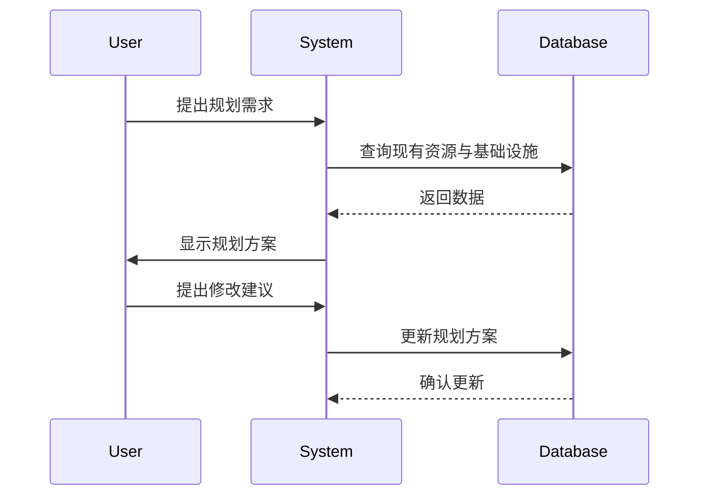
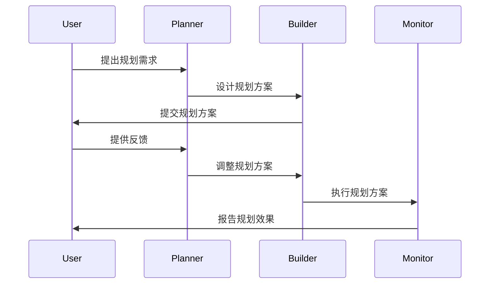

                 

### 第一部分：引言

#### 1.1 书籍背景与目的

**问题背景**

随着人类社会的快速发展，环境污染、资源枯竭、生物多样性减少等问题日益严重，人类与自然的关系面临前所未有的挑战。传统的发展模式无法解决这些问题，需要寻求新的发展路径，以实现人与自然的和谐共生。

**问题描述**

当前人类社会面临的主要问题是如何实现可持续发展，保护自然环境，同时满足人类社会的需求。这需要重新审视人与自然的关系，提出新的发展理念，即新生态主义。

**问题解决**

新生态主义作为一种全新的发展理念，旨在重塑人与自然的和谐关系，提供一种可持续发展的路径。本书《新生态主义宣言：重塑人与自然的和谐关系》旨在探讨新生态主义的哲学基础、实践应用、教育传播和未来展望，为读者提供全面而深入的了解。

**边界与外延**

新生态主义不仅关注环境保护和资源利用，还涉及经济、社会、文化等多个方面。其边界不仅限于生态学，还涵盖经济学、社会学、哲学等领域。因此，本书将在跨学科的视角下探讨新生态主义的核心概念和应用。

#### 1.2 核心概念与联系

**生态主义**

生态主义是一种哲学观念，强调人类与自然的相互依存关系，主张尊重和保护自然环境。其核心概念包括生态平衡、可持续发展、生物多样性等。

**新生态主义**

新生态主义是在传统生态主义基础上发展起来的，更加注重人类社会的整体发展和未来。其核心理念包括生态平衡、可持续发展、和谐共生、生态文明等。

**和谐关系**

和谐关系是指人类与自然、人与人、人与社会之间的一种平衡与协调状态。新生态主义强调通过和谐关系实现可持续发展，为人类和自然创造一个美好的未来。

**概念属性特征对比表格**

| 概念     | 生态主义                 | 新生态主义                 |  
|----------|------------------------|------------------------|  
| 核心概念 | 生态平衡、可持续发展、生物多样性 | 生态平衡、可持续发展、和谐共生、生态文明 |  
| 主要原则 | 尊重自然、保护生态环境 | 尊重自然、和谐共生、可持续发展、生态文明 |  
| 关联领域 | 生态学、环境保护、资源利用 | 经济学、社会学、哲学、生态学 |

**ER实体关系图架构的Mermaid流程图**

```mermaid  
entityRelationShipDiagram  
  A[生态主义]  
  B[新生态主义]  
  C[和谐关系]  
  A --> B  
  A --> C  
  B --> C  
```

**本书结构与内容概述**

**核心内容概述**

本书将从哲学基础、实践应用、教育传播和未来展望四个方面全面探讨新生态主义，帮助读者深入了解其内涵和意义。

**目录结构与章节安排**

1. **引言**  
    - 1.1 书籍背景与目的  
    - 1.2 核心概念与联系  
    - 1.3 本书结构与内容概述

2. **新生态主义的哲学基础**  
    - 2.1 新生态主义的起源与发展  
    - 2.2 生态主义的核心理念  
    - 2.3 新生态主义的主要原则  
    - 2.4 新生态主义的影响与挑战  
    - 2.5 本章小结

3. **新生态主义在实践中的应用**  
    - 3.1 新生态主义在城市规划中的应用  
    - 3.2 新生态主义在农业领域的应用  
    - 3.3 新生态主义在工业领域的应用  
    - 3.4 新生态主义在环境保护中的应用  
    - 3.5 本章小结

4. **新生态主义的教育与传播**  
    - 4.1 新生态主义教育的理念  
    - 4.2 新生态主义传播的途径  
    - 4.3 新生态主义公众参与  
    - 4.4 新生态主义国际合作  
    - 4.5 本章小结

5. **新生态主义的未来展望**  
    - 5.1 新生态主义的挑战与机遇  
    - 5.2 新生态主义的发展趋势  
    - 5.3 新生态主义的持续发展  
    - 5.4 本章小结

6. **案例分析**  
    - 6.1 案例一：某城市新生态主义规划实践  
    - 6.2 案例二：某农业生态化实践案例  
    - 6.3 案例三：某工业生态化实践案例  
    - 6.4 案例分析小结

#### 1.3 本书结构与内容概述

**核心内容概述**

本书旨在深入探讨新生态主义的哲学基础、实践应用、教育传播和未来展望，为读者提供一个全面而深入的视角来理解这一重要理念。

**目录结构与章节安排**

1. **引言**  
    - 1.1 书籍背景与目的  
    - 1.2 核心概念与联系  
    - 1.3 本书结构与内容概述

2. **新生态主义的哲学基础**  
    - 2.1 新生态主义的起源与发展  
    - 2.2 生态主义的核心理念  
    - 2.3 新生态主义的主要原则  
    - 2.4 新生态主义的影响与挑战  
    - 2.5 本章小结

3. **新生态主义在实践中的应用**  
    - 3.1 新生态主义在城市规划中的应用  
    - 3.2 新生态主义在农业领域的应用  
    - 3.3 新生态主义在工业领域的应用  
    - 3.4 新生态主义在环境保护中的应用  
    - 3.5 本章小结

4. **新生态主义的教育与传播**  
    - 4.1 新生态主义教育的理念  
    - 4.2 新生态主义传播的途径  
    - 4.3 新生态主义公众参与  
    - 4.4 新生态主义国际合作  
    - 4.5 本章小结

5. **新生态主义的未来展望**  
    - 5.1 新生态主义的挑战与机遇  
    - 5.2 新生态主义的发展趋势  
    - 5.3 新生态主义的持续发展  
    - 5.4 本章小结

6. **案例分析**  
    - 6.1 案例一：某城市新生态主义规划实践  
    - 6.2 案例二：某农业生态化实践案例  
    - 6.3 案例三：某工业生态化实践案例  
    - 6.4 案例分析小结

### 第二部分：新生态主义的哲学基础

新生态主义作为一种哲学理念，其发展历程和核心理念为我们提供了一个重新审视人与自然关系的框架。在这一部分，我们将逐步探讨新生态主义的起源、发展、核心理念、主要原则以及它对社会的影响和挑战。

#### 2.1 新生态主义的起源与发展

**新生态主义的起源**

新生态主义的起源可以追溯到20世纪中期，当时人们对传统生态学和环境问题的关注日益增加。20世纪60年代，随着《寂静的春天》等环保著作的出版，人们开始意识到环境污染的严重性。这一时期，生态主义开始萌芽。

**新生态主义的发展历程**

随着环境问题的加剧，生态主义逐渐演变成为新生态主义。新生态主义在20世纪末和21世纪初得到快速发展，其核心理念和原则在全球范围内得到广泛传播。新生态主义强调可持续发展和和谐共生，成为解决环境问题的重要路径。

**新生态主义在全球的传播与应用**

新生态主义不仅在欧洲和北美得到广泛传播，还在亚洲、非洲等地区得到应用。例如，中国提出了绿色发展理念，推动了生态文明建设；印度则通过推广农业生态化，提高了农业生产效率。

#### 2.2 生态主义的核心理念

**自然主义观念**

新生态主义强调自然主义观念，认为自然拥有自身价值和内在价值，不应该被仅仅视为人类利用的工具。自然主义观念促使人们重新审视与自然的关系，尊重自然，保护生态环境。

**人与自然的关系**

新生态主义认为，人与自然是一个相互依存的统一体。人类的行为对自然环境产生深远影响，而自然环境的变化又反作用于人类社会。因此，人与自然的关系是动态的、互动的。

**和谐社会的构建**

新生态主义主张通过构建和谐社会，实现人与自然的和谐共生。和谐社会的构建需要经济、社会、环境三个方面的协调发展。这一理念有助于解决环境问题，实现可持续发展。

**人类价值观的重塑**

新生态主义要求人们重新审视自己的价值观，从单纯追求经济增长转向追求人与自然的和谐发展。这种价值观的重塑有助于改变人类的行为模式，推动环境保护。

#### 2.3 新生态主义的主要原则

**生态平衡**

生态平衡是新生态主义的核心原则之一。它强调在人类活动与自然环境之间保持一种动态的平衡，避免过度开发和资源消耗。

**可持续发展**

可持续发展是新生态主义的另一核心原则。它要求人类活动在满足当前需求的同时，不损害子孙后代满足其需求的能力。

**人与自然的和谐共生**

新生态主义强调人与自然的和谐共生，认为人类与自然应该相互促进、共同发展。这种和谐共生是实现可持续发展的关键。

**生态文明的建设**

新生态主义主张通过建设生态文明，实现人类社会的可持续发展。生态文明强调经济、社会、环境三个方面的协调发展，是实现和谐社会的路径。

#### 2.4 新生态主义的影响与挑战

**新生态主义对社会的影响**

新生态主义对社会产生了深远影响。首先，它促使人们重新审视人与自然的关系，推动环境保护和可持续发展。其次，新生态主义改变了人们的价值观，推动了社会进步。

**新生态主义面临的挑战**

新生态主义也面临诸多挑战。首先，环境问题依然严峻，人类活动对自然环境的破坏仍在持续。其次，经济发展与环境保护之间的矛盾仍然存在。此外，新生态主义理念在实施过程中也面临社会、经济、文化等多方面的挑战。

**应对挑战的策略**

为应对这些挑战，新生态主义提出了一系列策略。首先，加强国际合作，共同应对全球性环境问题。其次，推动科技创新，提高资源利用效率。此外，加强教育和宣传，提高公众对新生态主义理念的认识和接受度。

#### 2.5 本章小结

本章从新生态主义的起源、发展、核心理念、主要原则以及影响和挑战等方面进行了全面探讨。通过本章的介绍，读者可以对新生态主义有一个全面而深入的了解，认识到其在实现可持续发展、保护环境方面的重要作用。在接下来的章节中，我们将进一步探讨新生态主义在实践中的应用，以期为读者提供更多有益的启示。

### 第二部分：新生态主义的哲学基础

#### 2.1 新生态主义的起源与发展

**新生态主义的起源**

新生态主义起源于对传统生态主义的批判与反思。20世纪中叶，随着工业革命带来的环境污染和生态破坏，生态主义作为对人类中心主义的回应，逐渐兴起。生态学家如Arne Naess提出了深生态学，强调所有生命形式的内在价值。然而，传统生态主义在面对全球性环境危机时，显得有些无力。这促使人们思考如何将生态学理念与人类社会的可持续发展相结合，从而产生了新生态主义。

**新生态主义的发展历程**

新生态主义在20世纪末和21世纪初经历了一系列重要的发展。随着全球环境问题的加剧，人们开始意识到，仅仅通过环保政策和技术创新无法根本解决问题，必须从哲学、文化和社会制度层面进行深刻的变革。这种变革推动了新生态主义的发展，使其从单一的生态学视角扩展到涵盖经济学、社会学、政治学等多个领域。例如，美国学者Bill McKibben在《我们的选择：走向新生态主义》中，提出了新生态主义的理念，强调人类与自然的共生关系。

**新生态主义在全球的传播与应用**

新生态主义在全球范围内得到了广泛传播和应用。在欧洲，德国和瑞士等国家的生态运动尤为活跃，推动了绿色政治的兴起。在北美，新生态主义理念被融入到环境教育和政策制定中。亚洲的日本和中国也积极推广新生态主义，例如中国提出的“绿水青山就是金山银山”理念，就是新生态主义思想的体现。非洲一些国家也在探索如何将新生态主义理念应用于当地的经济发展和环境保护。

**案例分析：新生态主义在我国的实践**

中国在新生态主义的实践方面有着显著的成果。例如，浙江省湖州市的“生态补偿机制”就是一个成功的案例。湖州市通过建立生态补偿机制，将环境保护与经济发展相结合，实现了区域内的生态效益和经济效益的双赢。该机制通过财政转移支付，对生态保护较好的地区进行奖励，从而鼓励更多地区积极参与生态环境保护。

**新生态主义的应用效果**

新生态主义的应用不仅改善了环境质量，还有助于推动可持续发展。例如，在农业领域，生态农业模式的推广，减少了农药和化肥的使用，提高了农产品的质量和安全性。在工业领域，循环经济和绿色工厂的建立，减少了资源浪费和污染排放。在城市规划领域，绿色城市和可持续城市的发展，为人类提供了更加宜居的生活环境。

**新生态主义的社会影响**

新生态主义对社会产生了深远的影响。它促使人们重新审视经济发展模式，推动社会向更加可持续的方向发展。新生态主义理念强调了人类与自然的和谐共生，改变了传统的“征服自然”观念，使人们更加重视环境保护和资源的可持续利用。此外，新生态主义还影响了人们的消费行为，促进了绿色消费和低碳生活方式的普及。

**新生态主义的未来发展方向**

未来，新生态主义将继续在全球范围内发展，并面临一系列新的挑战和机遇。随着全球气候变化和生物多样性丧失等问题的加剧，新生态主义需要更加深入地融入政策制定和社会实践中。同时，新生态主义也需要与其他可持续发展理念相互融合，形成更加综合的可持续发展策略。通过科技创新、国际合作和社会参与，新生态主义有望为实现全球可持续发展做出更大的贡献。

**本章小结**

通过本章节的探讨，我们可以看到新生态主义在起源、发展、传播和应用方面取得了显著的成果。它不仅改变了人们对待自然的方式，也为解决全球环境问题提供了新的思路。在接下来的章节中，我们将进一步探讨新生态主义在各个领域的具体应用，以及其面临的挑战和未来发展方向。

### 第二部分：新生态主义的哲学基础

#### 2.2 生态主义的核心理念

生态主义作为一种哲学理念，其核心理念深深植根于对自然界的尊重与保护。这些核心理念不仅为生态主义的实践提供了理论依据，也为现代社会解决环境问题提供了重要的指导。

**自然主义观念**

自然主义观念是生态主义的基石，它强调自然界及其所有生物拥有固有的价值和权利。这种观念挑战了人类中心主义，主张人类不应将自身视为自然界的主宰，而应视为自然界的一部分。自然主义观念认为，每个生物都有其存在的意义，无论是微小的细菌还是巨大的鲸鱼，都应该受到尊重和保护。

**人与自然的关系**

生态主义认为，人与自然之间存在着紧密的相互依存关系。人类社会的发展离不开自然的支持，无论是食物、水资源还是能源，都来自自然环境。因此，人类的活动必须与自然环境的承载力相匹配，以避免对生态系统造成不可逆转的破坏。人与自然的关系不仅是利用与被利用的关系，更是一种相互影响、相互依赖的动态平衡。

**和谐社会的构建**

生态主义强调通过构建和谐社会来实现人类与自然的和谐共生。这种和谐社会要求经济、社会、环境三个方面的协调发展。经济活动不应以牺牲环境为代价，社会发展不应以破坏自然为前提。通过制定可持续发展的政策和措施，生态主义致力于建立一个既满足当代人类需求，又保护未来世代权益的社会。

**人类价值观的重塑**

生态主义要求人类重新审视自己的价值观，从单纯追求物质财富转向追求与自然和谐共存的生活方式。这种价值观的重塑不仅体现在个人层面，也体现在社会层面。社会需要建立一种新的道德准则，鼓励人们节约资源、减少浪费，并在日常生活中践行环保理念。

**核心概念：生态平衡**

生态平衡是生态主义的核心概念之一，它指的是生态系统中各种生物之间的数量和种间关系的相对稳定状态。生态平衡是生态系统健康和可持续性的基础。当人类活动破坏生态平衡时，会导致一系列环境问题，如物种灭绝、生态退化等。因此，维护生态平衡是生态主义的重要目标。

**核心概念：可持续发展**

可持续发展是生态主义的核心原则之一，它强调在满足当代人类需求的同时，不损害子孙后代满足其需求的能力。可持续发展要求人类在经济发展、社会进步和环境保护之间找到平衡点。通过实施可持续发展策略，可以确保资源的合理利用和生态系统的稳定。

**核心概念：生物多样性**

生物多样性是生态系统的关键特征，它指的是地球上所有生物种类及其遗传多样性和生态系统的多样性。生物多样性对于生态系统的稳定性和功能至关重要。生态主义强调保护生物多样性，防止物种灭绝和生态系统的退化。保护生物多样性不仅有助于维持生态平衡，还能为人类提供丰富的资源和生态服务。

**人与自然关系的演变**

人类与自然的关系经历了从原始利用到尊重与保护的演变。在农业社会，人类开始通过农业活动改造自然，但仍然依赖自然。随着工业革命的到来，人类对自然资源的掠夺式开发导致环境问题日益严重。20世纪中叶，生态主义开始兴起，人们开始意识到人类活动对自然界的深远影响，并试图通过生态主义理念来重新审视人与自然的关系。

**案例分析：生态主义在环保实践中的应用**

生态主义理念在全球范围内得到了广泛的实践应用。例如，瑞典的生态税制通过提高资源使用成本，鼓励人们减少资源消耗和环境污染。德国的生态城市计划通过绿色建筑、可再生能源和可持续交通系统，实现城市生态化。中国的生态文明建设和绿色发展理念，推动了一系列环境保护和生态修复项目，如退耕还林、湿地保护等。

**生态主义的影响**

生态主义不仅改变了人们对自然的态度，还对政策制定和社会发展产生了深远影响。政策层面，各国政府开始重视环境保护，制定了一系列环境保护法规和政策。社会层面，人们逐渐形成了环保意识和低碳生活方式，推动了绿色消费和可持续发展理念的普及。

**本章小结**

通过本章节的探讨，我们可以看到生态主义的核心理念如何指导人们重新审视人与自然的关系，构建和谐社会。生态主义不仅为解决环境问题提供了理论依据，也为实现可持续发展提供了实践路径。在接下来的章节中，我们将进一步探讨新生态主义的主要原则，以及其在不同领域的应用和挑战。

### 第二部分：新生态主义的哲学基础

#### 2.3 新生态主义的主要原则

新生态主义作为对传统生态主义的深化和扩展，提出了一系列主要原则，旨在实现人与自然的和谐共生。这些原则不仅为环境保护提供了理论指导，也为社会发展提供了新的视角。

**生态平衡**

生态平衡是新生态主义的核心原则之一。它强调在生态系统中保持各种生物之间数量和种间关系的相对稳定状态。生态平衡不仅是生态系统健康和可持续性的基础，也是人类活动与自然环境之间相互作用的必要条件。新生态主义主张通过科学管理和合理利用自然资源，防止过度开发和生态破坏，维护生态系统的长期稳定。

**可持续发展**

可持续发展是新生态主义的另一重要原则。它要求人类在满足当前需求的同时，不损害子孙后代满足其需求的能力。新生态主义认为，可持续发展不仅仅是经济增长的问题，更是资源利用、环境保护和社会公正的综合体现。通过实施可持续发展策略，人类可以在经济发展的同时，保护自然环境，实现经济效益和生态效益的双赢。

**人与自然的和谐共生**

新生态主义强调人与自然应该实现和谐共生。这意味着人类活动必须与自然环境的承载力相匹配，尊重自然规律，实现人与自然的和谐发展。和谐共生不仅要求人类减少对自然的掠夺，还需要通过技术创新和社会制度变革，实现人与自然的互利共生。

**生态文明的建设**

新生态主义主张通过建设生态文明，实现人类社会的可持续发展。生态文明强调经济、社会、环境三个方面的协调发展，倡导绿色生产、绿色消费和绿色生活方式。生态文明的建设要求全社会共同努力，通过政策引导、教育普及和科技创新，推动社会向更加绿色、可持续的方向发展。

**生态正义**

生态正义是新生态主义的一个新理念，强调在环境保护和资源分配中，应该公平对待所有人，特别是弱势群体。新生态主义认为，环境破坏和资源短缺对所有人都有影响，但受影响最大的是那些最没有能力应对这些问题的群体。因此，生态正义要求在全球范围内实现环境正义，确保所有人都能享有清洁的环境和公平的资源分配。

**生态教育**

新生态主义认为，生态教育是实现人与自然和谐共生的重要途径。生态教育不仅要传授生态知识和技能，还要培养人们的生态意识和社会责任感。通过生态教育，人们可以更好地理解自然规律，认识到自己在自然环境中的角色和责任，从而更加自觉地参与到环境保护和可持续发展中来。

**生态制度**

新生态主义主张通过建立完善的生态制度，实现环境保护和可持续发展的目标。生态制度包括法律法规、政策规划、市场机制等多个方面，旨在通过制度手段，引导和规范人类行为，减少对环境的破坏，促进可持续发展。

**案例分析：新生态主义原则在实践中的应用**

新生态主义原则在许多国家和地区得到了广泛应用。例如，瑞士的生态城市计划通过推广绿色建筑、可再生能源和可持续交通，实现了城市生态化。德国的循环经济政策通过资源回收和再利用，减少了资源浪费和环境污染。中国的生态文明建设和绿色发展理念，推动了生态农业、生态工业和生态城市的发展。

**新生态主义原则的影响**

新生态主义原则对全球环境保护和社会发展产生了深远影响。它促使人们重新审视经济发展模式，推动社会向更加可持续的方向发展。新生态主义原则不仅为环境保护提供了理论指导，也为政策制定和科技创新提供了新的思路。

**本章小结**

通过本章节的探讨，我们可以看到新生态主义的主要原则如何指导人类实现人与自然的和谐共生。这些原则不仅为环境保护提供了理论依据，也为社会发展提供了新的视角。在接下来的章节中，我们将进一步探讨新生态主义在实践中的应用，以及其面临的挑战和未来发展方向。

### 第二部分：新生态主义的哲学基础

#### 2.4 新生态主义的影响与挑战

新生态主义作为一种新型的哲学理念，其在全球范围内的推广和应用对现代社会产生了深远的影响。同时，新生态主义也面临着一系列挑战，需要通过不断的实践和理论创新来应对。

**新生态主义对社会的影响**

1. **推动可持续发展**

新生态主义强调可持续发展，要求人类在满足当前需求的同时，不损害未来世代满足其需求的能力。这一理念促使各国政府和企业重新审视其发展模式，推动绿色经济和绿色技术的发展。例如，欧盟的可持续发展战略和中国的绿色发展理念，都是在新生态主义影响下形成的政策导向。

2. **改变消费行为**

新生态主义倡导绿色消费和低碳生活方式，鼓励人们减少浪费，选择环保产品和服务。这种理念在消费者中逐渐普及，推动了环保产业的发展。例如，环保材料的推广、节能产品的普及，都是新生态主义影响下的消费趋势。

3. **促进环境保护政策**

新生态主义的核心理念之一是生态平衡和环境保护。这促使各国政府加强环境保护政策的制定和实施，如加强环境监管、推行生态补偿机制、设立环保法规等。这些政策的实施有助于减少环境污染，提高资源利用效率。

4. **推动生态教育**

新生态主义强调生态教育的重要性，通过教育培养人们的生态意识和责任感。许多国家和地区开始将生态教育纳入学校课程，鼓励学生在日常生活中践行环保理念。这有助于培养未来的环保人才，推动环境保护事业的发展。

**新生态主义面临的挑战**

1. **经济与环境的矛盾**

尽管新生态主义主张可持续发展，但在现实中，经济发展与环境保护之间仍然存在矛盾。一些企业和个人为了追求短期经济利益，可能会忽视环境保护，导致生态破坏。因此，如何平衡经济发展与环境保护，是新生态主义面临的重要挑战。

2. **技术瓶颈**

新生态主义的实施需要大量的科技创新，如清洁能源技术、资源回收技术等。然而，目前这些技术还面临许多瓶颈，如成本高、效率低等问题。如何突破技术瓶颈，提高绿色技术的实用性，是新生态主义面临的挑战之一。

3. **国际合作与协调**

新生态主义是一个全球性问题，需要各国共同努力才能实现。然而，不同国家和地区的利益和立场不同，国际合作和协调难度较大。如何在国际层面上达成共识，推动全球环境保护和可持续发展，是新生态主义面临的挑战之一。

4. **社会意识的提升**

尽管新生态主义理念逐渐普及，但社会整体意识水平仍有待提高。许多人仍然缺乏环保意识，对环境保护的重要性认识不足。如何提升社会整体环保意识，是新生态主义面临的重要任务。

**应对挑战的策略**

1. **加强政策引导**

政府应加强环境保护政策的引导和实施，通过法律法规、财政激励等措施，推动企业和社会践行新生态主义理念。例如，可以制定环保法规，限制高污染企业的扩张，鼓励绿色产业的发展。

2. **推动科技创新**

加大科技创新力度，突破绿色技术瓶颈，提高绿色技术的实用性和经济性。政府和企业应加大对绿色技术的研究投入，推动科技成果转化为实际应用。

3. **加强国际合作**

加强国际间的合作与协调，共同应对全球性环境问题。通过国际会议、合作项目等形式，促进各国在环境保护和可持续发展方面的交流与合作。

4. **提升公众环保意识**

通过教育、宣传等方式，提升公众的环保意识。可以开展环保宣传活动，普及生态知识，鼓励人们参与环境保护实践，共同推动新生态主义的实现。

**本章小结**

新生态主义作为一种哲学理念，对社会产生了深远的影响。然而，其在实施过程中也面临着一系列挑战。通过加强政策引导、推动科技创新、加强国际合作和提升公众环保意识，我们可以更好地应对这些挑战，推动新生态主义的实现。

### 第二部分：新生态主义的哲学基础

#### 2.5 本章小结

本章深入探讨了新生态主义的哲学基础，从起源与发展、核心理念、主要原则到影响与挑战，全面介绍了这一重要理念的各个方面。以下是本章的主要结论和收获：

1. **新生态主义的起源与发展**：新生态主义起源于对传统生态主义的批判与反思，随着全球环境问题的加剧，逐渐演变成为涵盖多个领域的综合性理念。

2. **生态主义的核心理念**：自然主义观念、人与自然的关系、和谐社会的构建和人类价值观的重塑，构成了新生态主义的核心思想。

3. **新生态主义的主要原则**：生态平衡、可持续发展、人与自然的和谐共生、生态文明的建设、生态正义和生态教育等原则，为新生态主义提供了理论依据和实践指南。

4. **新生态主义的影响与挑战**：新生态主义对全球环境保护和社会发展产生了深远影响，但同时也面临着经济与环境的矛盾、技术瓶颈、国际合作与协调困难以及社会意识提升不足等挑战。

通过本章的探讨，我们不仅对新生态主义有了更深入的理解，也认识到其在实现可持续发展、保护环境方面的重要作用。在接下来的章节中，我们将进一步探讨新生态主义在实践中的应用，以及其面临的挑战和未来发展方向。这将为我们提供更多的启示，帮助我们更好地应对环境问题，实现人与自然的和谐共生。

### 第三部分：新生态主义在实践中的应用

新生态主义不仅是一种哲学理念，更是一种实践行动。在各个领域，新生态主义理念被广泛应用，以实现人与自然的和谐共生。本部分将详细探讨新生态主义在城市规划、农业、工业和环境保护中的应用。

#### 3.1 新生态主义在城市规划中的应用

**城市生态规划的概念**

城市生态规划是一种基于生态学原理和方法的城市规划方法，旨在通过优化城市空间结构，提高城市生态系统服务功能，实现城市可持续发展。城市生态规划的核心目标是构建生态城市，即人与自然和谐共生的城市。

**城市生态规划的原则**

- **生态优先**：在城市规划过程中，优先考虑生态环境的保护和恢复，将生态功能作为城市发展的基础。
- **可持续发展**：城市生态规划应遵循可持续发展原则，确保城市发展与自然资源和生态环境的承载力相匹配。
- **综合性**：城市生态规划需要综合考虑经济、社会、环境等多个方面，实现综合协调。
- **创新性**：鼓励采用新技术、新材料和新方法，提高城市生态规划和建设的科学性和实用性。

**城市生态规划的实践案例**

- **新加坡滨海湾地区**：新加坡滨海湾地区是一个集商业、文化、居住和休闲于一体的生态城市示范区。通过引入绿色建筑、可再生能源和可持续交通系统，实现了低能耗、低污染、高效率的城市发展。
- **杭州西湖地区**：杭州西湖地区通过生态修复和景观设计，将传统园林艺术与生态保护相结合，打造了一个生态宜居的典范。

#### 3.2 新生态主义在农业领域的应用

**农业生态化的概念**

农业生态化是一种以生态学原理为指导，通过优化农业生态系统结构和功能，实现农业可持续发展的发展模式。农业生态化强调农业生产与生态环境的协调，通过减少化学农药和化肥的使用，提高资源利用效率，保护生态环境。

**农业生态化的原则**

- **生态友好**：采用生态友好的生产方式，减少对环境的污染和破坏。
- **资源高效**：提高资源利用效率，降低资源消耗。
- **系统多样性**：通过多样化种植和养殖，提高农业生态系统的稳定性和抗风险能力。
- **经济可持续**：确保农业生产的经济效益和社会效益，实现可持续发展。

**农业生态化的实践案例**

- **中国有机农业**：中国有机农业通过减少化学农药和化肥的使用，推广生物防治和有机肥料，提高了农产品质量和生态环境质量。
- **日本稻作农业**：日本稻作农业通过稻鱼共作、稻鸭共作等生态农业模式，实现了农业生产与生态环境的良性循环。

#### 3.3 新生态主义在工业领域的应用

**工业生态化的概念**

工业生态化是一种基于生态系统原理的工业发展模式，旨在通过优化工业系统结构，提高资源利用效率，减少环境污染。工业生态化强调工业系统与自然环境的互动，通过循环经济和绿色制造，实现工业可持续发展。

**工业生态化的原则**

- **循环经济**：推动资源循环利用，减少资源浪费和环境污染。
- **绿色制造**：采用环保技术和工艺，减少生产过程中的污染排放。
- **生态集成**：将工业系统与自然环境有机结合，实现资源的高效利用和生态保护。
- **科技创新**：鼓励技术创新，提高工业生态化的技术水平和实施效果。

**工业生态化的实践案例**

- **德国循环经济**：德国通过推行循环经济，实现了资源的高效利用和废物的减量排放。德国的垃圾回收和再利用率达到较高水平，成为全球循环经济的典范。
- **中国绿色制造**：中国通过推广绿色制造技术，提高工业产品的环保性能，减少生产过程中的污染排放。例如，在钢铁、化工等行业，推广清洁生产技术和环保设备，实现了工业生态化的目标。

#### 3.4 新生态主义在环境保护中的应用

**环境保护与生态主义的关系**

环境保护是生态主义的重要组成部分，旨在通过保护和改善生态环境，实现人与自然的和谐共生。新生态主义强调通过环境保护，实现生态平衡和可持续发展。

**环境保护的原则**

- **预防为主**：在环境问题发生之前采取预防措施，防止环境问题的发生。
- **综合治理**：对环境污染和生态破坏进行综合治理，恢复生态环境。
- **公众参与**：鼓励公众参与环境保护，提高环保意识和参与度。
- **科技创新**：通过科技创新，提高环境保护的效率和效果。

**环境保护的实践案例**

- **欧洲绿色协议**：欧洲绿色协议通过制定一系列环保政策和措施，推动欧洲环境保护和可持续发展。该协议涵盖气候行动、清洁能源、生物多样性等多个方面，为欧洲环境保护提供了有力支持。
- **中国生态文明**：中国通过推进生态文明建设和绿色发展，加强环境保护和生态修复。例如，实施大气污染防治行动计划、水污染防治行动计划等，大幅改善了环境质量。

**本章小结**

新生态主义在实践中的应用涵盖了城市规划、农业、工业和环境保护等多个领域。通过生态城市规划、农业生态化、工业生态化和环境保护，新生态主义理念正在逐步转化为现实，为人类社会的可持续发展提供了有力支持。在接下来的章节中，我们将进一步探讨新生态主义在教育、传播和国际合作方面的应用和效果。

### 第三部分：新生态主义在实践中的应用

#### 3.1 新生态主义在城市规划中的应用

**城市生态规划的概念**

城市生态规划是一种基于生态学原理和方法的城市规划方法，旨在通过优化城市空间结构，提高城市生态系统服务功能，实现城市可持续发展。城市生态规划的核心目标是构建生态城市，即人与自然和谐共生的城市。这种规划方法强调在城市发展中，不仅要满足人类的基本需求，还要保护自然环境，提高城市生态系统的稳定性和可持续性。

**城市生态规划的原则**

1. **生态优先**：在城市规划过程中，优先考虑生态环境的保护和恢复，将生态功能作为城市发展的基础。这意味着在城市规划中，生态要素的配置应优先于其他功能，以确保城市发展与生态环境的协调。

2. **可持续发展**：城市生态规划应遵循可持续发展原则，确保城市发展与自然资源和生态环境的承载力相匹配。这要求在城市规划中，要综合考虑经济增长、社会发展和环境保护之间的关系，实现经济、社会和生态三个方面的协调发展。

3. **综合性**：城市生态规划需要综合考虑经济、社会、环境等多个方面，实现综合协调。这意味着在城市规划过程中，需要采用跨学科的方法，将城市规划、环境保护、经济学、社会学等领域的知识融合在一起，形成一个综合性的规划方案。

4. **创新性**：鼓励采用新技术、新材料和新方法，提高城市生态规划和建设的科学性和实用性。这包括应用生态学、环境科学、信息技术等领域的先进成果，推动城市规划的创新和发展。

**城市生态规划的实践案例**

1. **新加坡滨海湾地区**：新加坡滨海湾地区是一个集商业、文化、居住和休闲于一体的生态城市示范区。该项目的规划采用了生态学原理，通过引入绿色建筑、可再生能源和可持续交通系统，实现了低能耗、低污染、高效率的城市发展。滨海湾地区的生态城市规划为全球提供了城市可持续发展的成功范例。

2. **杭州西湖地区**：杭州西湖地区通过生态修复和景观设计，将传统园林艺术与生态保护相结合，打造了一个生态宜居的典范。在西湖地区的规划中，注重保护湿地、恢复植被、控制污染，实现了生态环境和人文景观的和谐统一。

**新加坡滨海湾地区的生态城市规划**

- **绿色建筑**：滨海湾地区的建筑物采用了绿色建筑标准，包括节能设计、环保材料和可再生能源利用等。这些绿色建筑不仅减少了能源消耗，还降低了环境污染。

- **可再生能源**：滨海湾地区积极推广可再生能源的使用，如太阳能、风能和地热能。这些可再生能源的使用，不仅减少了化石燃料的消耗，还降低了温室气体的排放。

- **可持续交通**：滨海湾地区设计了便捷的公共交通系统，鼓励居民使用公共交通工具，减少私家车的使用。同时，推广非机动交通，如自行车和步行，减少交通拥堵和空气污染。

**杭州西湖地区的生态修复与景观设计**

- **生态修复**：通过恢复湿地、植树造林、清理污染物等措施，改善了西湖地区的生态环境。这些措施不仅提高了区域的生态功能，还提升了景观质量。

- **景观设计**：在西湖地区的景观设计中，注重保护自然景观和人文景观，通过合理布局和景观融合，实现了生态环境和人文景观的和谐统一。

**生态城市规划的影响**

生态城市规划对城市可持续发展产生了深远影响。通过生态城市规划，可以优化城市空间结构，提高城市生态系统服务功能，改善居民生活质量。同时，生态城市规划还有助于减少城市环境污染，提高资源利用效率，实现经济、社会和生态三个方面的协调发展。

**本章小结**

新生态主义在城市规划中的应用，通过生态城市规划，实现了城市与自然的和谐共生。新加坡滨海湾地区和杭州西湖地区的实践案例，展示了生态城市规划的成效。在接下来的章节中，我们将继续探讨新生态主义在农业、工业和环境保护等其他领域的应用。

### 第三部分：新生态主义在实践中的应用

#### 3.2 新生态主义在农业领域的应用

**农业生态化的概念**

农业生态化是一种基于生态学原理和系统思维，以保护和改善农业生态环境为目标，通过调整农业生态系统结构、功能和技术手段，实现农业可持续发展的现代农业发展模式。农业生态化强调农业生产与生态环境的协调，追求经济效益、社会效益和生态效益的统一。

**农业生态化的原则**

1. **生态优先**：在农业发展中，将生态环境保护放在首位，确保农业生产活动不会对生态环境造成破坏。

2. **资源高效**：提高农业资源的利用效率，减少资源浪费，通过优化农业生态系统结构，提高资源循环利用能力。

3. **系统多样性**：通过多样化的农业生产模式，增加生态系统的稳定性和抗风险能力，维护生物多样性。

4. **经济可持续**：确保农业生产的经济效益，通过提高产量和产品质量，增加农民收入，实现农业经济的可持续发展。

**农业生态化的实践案例**

1. **中国有机农业**：中国有机农业通过减少化学农药和化肥的使用，推广生物防治和有机肥料，实现了农业生产与生态环境的协调发展。例如，浙江省的安吉县通过实施有机农业，不仅提高了农产品的质量和安全性，还改善了当地的生态环境。

2. **日本稻作农业**：日本稻作农业通过稻鱼共作、稻鸭共作等生态农业模式，实现了农业生产与生态环境的良性循环。这些生态农业模式不仅提高了农业产量，还减少了农业污染，保护了湿地生态系统。

**中国有机农业的实践**

- **减少化学农药和化肥的使用**：通过推广生物防治技术和有机肥料，减少化学农药和化肥的使用，降低了农业污染。

- **提高农产品质量和安全性**：有机农业注重农产品的内在品质，通过严格的管理和监控，确保农产品的质量和安全性。

- **改善生态环境**：有机农业通过减少化学农药和化肥的使用，降低了土壤和水源的污染，改善了生态环境。

**日本稻作农业的生态农业模式**

- **稻鱼共作**：通过在稻田中养殖鱼类，实现了水稻种植与鱼类养殖的协同作用。鱼类在稻田中活动，可以控制杂草和害虫，同时鱼类排泄物还可以作为水稻的肥料。

- **稻鸭共作**：通过在稻田中放养鸭子，实现了水稻种植与鸭子养殖的协同作用。鸭子在稻田中活动，可以控制杂草和害虫，同时鸭子的排泄物也可以作为水稻的肥料。

**农业生态化的经济效益**

- **提高农产品产量和质量**：通过生态农业模式，可以显著提高农产品的产量和质量，增加农民的收入。

- **降低生产成本**：减少化学农药和化肥的使用，降低了农业生产成本，提高了农业的竞争力。

- **延长产业链**：通过发展有机农业和生态农业，可以延长农业产业链，创造更多的就业机会，促进农村经济发展。

**农业生态化的社会效益**

- **改善农村生活环境**：通过农业生态化，可以减少农业污染，改善农村生活环境，提高农民的生活质量。

- **促进农村可持续发展**：农业生态化有助于促进农村经济的可持续发展，提高农民的收入水平，减少贫困人口。

- **增强农民生态意识**：通过农业生态化实践，可以增强农民的生态意识，提高他们的环保素养，推动农业和农村的绿色发展。

**本章小结**

新生态主义在农业领域的应用，通过农业生态化，实现了农业与生态环境的协调发展。中国有机农业和日本稻作农业的实践案例，展示了农业生态化的成效和潜力。在未来的发展中，农业生态化将继续发挥重要作用，为实现全球可持续发展做出贡献。

### 第三部分：新生态主义在实践中的应用

#### 3.3 新生态主义在工业领域的应用

**工业生态化的概念**

工业生态化是一种基于生态系统原理和系统思维，以保护和改善工业生态环境为目标，通过调整工业生态系统结构、功能和技术手段，实现工业可持续发展的工业发展模式。工业生态化强调工业生产与生态环境的协调，追求经济效益、社会效益和生态效益的统一。

**工业生态化的原则**

1. **循环经济**：通过资源的循环利用，减少资源浪费和环境污染，实现资源的高效利用。
2. **绿色制造**：采用环保技术和工艺，减少生产过程中的污染排放，实现清洁生产。
3. **生态集成**：将工业系统与自然环境有机结合，实现资源的高效利用和生态保护。
4. **科技创新**：鼓励技术创新，提高工业生态化的技术水平和实施效果。

**工业生态化的实践案例**

1. **德国循环经济**：德国通过推行循环经济，实现了资源的高效利用和废物的减量排放。德国的循环经济政策涵盖了资源回收、废物处理、再利用等多个方面，成为全球循环经济的典范。

2. **中国绿色制造**：中国通过推广绿色制造技术，提高工业产品的环保性能，减少生产过程中的污染排放。例如，在钢铁、化工等行业，推广清洁生产技术和环保设备，实现了工业生态化的目标。

**德国循环经济的实践**

- **资源回收**：德国通过建立完善的资源回收体系，实现了废纸、废塑料、废金属等资源的回收和再利用。例如，德国的垃圾分类回收率达到了60%以上，有效地减少了资源浪费和环境污染。

- **废物处理**：德国建立了现代化的废物处理设施，通过焚烧和堆肥等处理方式，将废物转化为能源或肥料，实现了废物的资源化利用。

- **再利用**：德国通过再制造和再利用技术，延长了工业产品使用寿命，减少了资源消耗和环境污染。例如，汽车零部件的再制造和家电的翻新，不仅降低了生产成本，还减少了废弃物的产生。

**中国绿色制造的实践**

- **清洁生产**：中国通过推广清洁生产技术，减少生产过程中的污染排放。例如，在钢铁行业，推广高炉喷煤技术，减少了煤炭的使用，降低了二氧化碳排放。

- **环保设备**：中国通过研发和推广环保设备，提高了工业生产的环保性能。例如，在化工行业，推广废气处理设备，减少了废气的排放。

- **绿色产品**：中国通过制定绿色产品标准和认证制度，推动工业产品向绿色、低碳、环保的方向发展。例如，节能灯具、绿色家电等产品的普及，不仅提高了产品的市场竞争力，还减少了能源消耗和环境污染。

**工业生态化的经济效益**

- **提高资源利用效率**：通过循环经济和资源回收利用，提高了资源的利用效率，降低了生产成本，提高了工业企业的经济效益。

- **减少环境污染**：通过绿色制造和清洁生产，减少了工业生产过程中的污染排放，降低了环境治理成本，提高了企业的社会责任感。

- **提高市场竞争力**：通过推广绿色技术和产品，提高了工业产品的环保性能，增强了企业的市场竞争力，开拓了新的市场空间。

**工业生态化的社会效益**

- **促进绿色消费**：通过推广绿色产品，引导消费者选择环保、低碳的产品，促进了绿色消费观念的形成。

- **提升公众环保意识**：通过工业生态化的实践，提高了公众对环境保护和资源利用的认识，增强了公众的环保意识。

- **推动绿色发展**：工业生态化推动了绿色产业的发展，为经济发展提供了新的动力，促进了经济结构的优化和升级。

**本章小结**

新生态主义在工业领域的应用，通过工业生态化，实现了工业与生态环境的协调发展。德国循环经济和中国绿色制造的实践案例，展示了工业生态化的成效和潜力。在未来的发展中，工业生态化将继续发挥重要作用，为实现全球可持续发展做出贡献。

### 第三部分：新生态主义在实践中的应用

#### 3.4 新生态主义在环境保护中的应用

环境保护是生态主义的核心内容之一，新生态主义通过一系列实践，为环境保护提供了新的思路和方法。在这一部分，我们将探讨新生态主义在环境保护中的应用，包括其基本原则和具体实践案例。

**环境保护与生态主义的关系**

环境保护与生态主义密不可分。生态主义强调人类与自然之间的和谐共生，主张通过保护自然环境来实现可持续发展。环境保护作为生态主义的重要组成部分，旨在减少人类活动对自然环境的负面影响，保护生物多样性，维护生态平衡。

**环境保护的原则**

1. **预防为主**：在环境保护工作中，应采取预防为主的策略，防止环境问题的发生。通过制定严格的环境保护法规和政策，规范人类活动，减少环境污染。

2. **综合治理**：对已经发生的环境污染问题，应采取综合治理的措施，通过工程措施、管理措施和生态修复等多种手段，恢复和改善环境质量。

3. **公众参与**：鼓励公众参与环境保护，提高环保意识和参与度。通过宣传教育、公众参与活动等方式，增强公众对环境保护的认识和参与。

4. **科技创新**：推动环境保护领域的科技创新，提高环境保护的效率和效果。通过研发新技术、新材料和环保设备，提高环境治理能力。

**环境保护的实践案例**

1. **欧洲绿色协议**：欧洲绿色协议是欧盟制定的一项全面的环境保护战略，旨在实现欧洲的绿色转型。该协议涵盖了气候行动、清洁能源、生物多样性保护等多个方面，通过一系列政策和措施，推动欧洲环境保护和可持续发展。

2. **中国生态文明**：中国通过推进生态文明建设和绿色发展，加强环境保护和生态修复。例如，实施大气污染防治行动计划、水污染防治行动计划等，大幅改善了环境质量。同时，中国还大力推进生态修复工程，如退耕还林、退牧还草等，提高了生态系统的稳定性和可持续性。

**欧洲绿色协议的实践**

- **气候行动**：欧洲绿色协议通过制定严格的减排目标，推动欧洲的气候行动。例如，到2030年，将欧盟的温室气体排放量减少55%，到2050年实现碳中和。

- **清洁能源**：欧洲绿色协议鼓励发展清洁能源，减少对化石燃料的依赖。通过推广可再生能源，如太阳能、风能和地热能，减少温室气体排放。

- **生物多样性保护**：欧洲绿色协议提出了多项措施，保护欧洲的生物多样性。例如，设立保护地、恢复生态系统、控制入侵物种等，保护生物多样性和生态系统的完整性。

**中国生态文明的实践**

- **大气污染防治**：中国通过实施大气污染防治行动计划，大幅减少了大气污染。例如，加强燃煤污染控制、推进清洁能源替代、提高工业废气治理水平等。

- **水污染防治**：中国通过实施水污染防治行动计划，改善水环境质量。例如，加强饮用水源地保护、治理重点流域污染、推进城市污水处理和再生利用等。

- **生态修复**：中国大力推进生态修复工程，如退耕还林、退牧还草、湿地恢复等，恢复和改善生态环境。

**环境保护的经济效益**

环境保护不仅有助于改善生态环境，还能带来显著的经济效益。通过减少环境污染和资源浪费，环境保护有助于提高资源利用效率，降低生产成本，提高企业的竞争力。同时，环境保护还能创造新的就业机会，促进绿色产业的发展，推动经济结构的优化和升级。

**环境保护的社会效益**

环境保护有助于提高公众的环保意识，培养绿色生活方式。通过环境保护教育和宣传，公众可以更好地了解环境问题的严重性，积极参与到环境保护中来。环境保护还能促进社会和谐，增强人民对政府的信任和支持。

**本章小结**

新生态主义在环境保护中的应用，通过一系列原则和实践，为解决环境问题提供了新的思路和方法。欧洲绿色协议和中国生态文明的实践案例，展示了新生态主义在环境保护方面的成效和潜力。在未来的发展中，新生态主义将继续发挥重要作用，为实现全球环境保护和可持续发展做出贡献。

### 第四部分：新生态主义的教育与传播

新生态主义作为一种新型的哲学理念，其推广和普及需要通过教育和传播来实现。在这一部分，我们将探讨新生态主义教育的理念、传播途径以及公众参与和国际合作。

#### 4.1 新生态主义教育的理念

**新生态主义教育的重要性**

新生态主义教育对于推动环境保护和可持续发展具有重要意义。通过教育，可以培养人们的生态意识，提高他们对自然环境的认识和尊重，从而形成良好的生态行为习惯。新生态主义教育不仅是环境保护的基础，也是构建和谐社会的重要手段。

**新生态主义教育的目标**

1. **培养生态意识**：通过教育，使人们认识到生态环境的重要性，培养他们对自然环境的关爱和保护意识。

2. **传播生态知识**：教育人们掌握生态学的基本知识和原理，了解生态系统的运作机制，提高他们的科学素养。

3. **倡导绿色生活**：通过教育，引导人们践行绿色生活方式，减少浪费，节约资源，保护环境。

4. **推动可持续发展**：教育人们理解可持续发展理念，认识到经济发展与环境保护的关系，促进经济、社会、环境的协调发展。

**新生态主义教育的方法**

1. **课堂教学**：在学校的课程中融入生态学知识，例如在自然科学、社会科学等课程中设置相关内容，使学生系统学习生态学原理。

2. **课外活动**：组织学生参加环保实践活动，如植树造林、垃圾分类、环保宣传等，通过实践培养他们的生态意识和责任感。

3. **校外教育**：通过博物馆、科技馆、自然保护区等校外教育场所，开展生态教育展览和活动，扩大生态教育的覆盖面。

4. **媒体宣传**：利用电视、广播、互联网等媒体，开展新生态主义知识的宣传和普及，提高公众的环保意识。

#### 4.2 新生态主义传播的途径

**媒体传播**

媒体在新生态主义传播中发挥着重要作用。通过电视、广播、报纸、杂志等传统媒体，以及社交媒体、网络视频等新兴媒体，可以广泛传播新生态主义理念。例如，可以通过纪录片、新闻报道、公益广告等形式，向公众传递生态知识，倡导绿色生活方式。

**教育传播**

教育系统是新生态主义传播的重要渠道。通过各级教育阶段的课程设置和教学内容，可以将新生态主义理念融入其中。例如，在中小学的自然科学课程中，加入生态学知识；在高等教育中，开设生态学相关课程，培养专业人才。

**社区传播**

社区是新生态主义传播的基础。通过社区活动、讲座、展览等形式，可以加强新生态主义理念在社区中的传播。例如，可以组织环保讲座、生态社区建设活动，提高居民的环保意识。

**专业会议与论坛**

专业会议和论坛为新生态主义传播提供了平台。通过学术会议、国际论坛等形式，专家学者可以分享新生态主义的研究成果和实践经验，推动新生态主义在全球范围内的传播。

#### 4.3 新生态主义公众参与

**公众参与的意义**

新生态主义公众参与是指公众在环境保护和可持续发展中的积极参与。公众参与不仅有助于提高公众的环保意识，还可以促进政府和企业更加重视环境保护，实现社会共治。

**公众参与的方式**

1. **环保志愿者活动**：组织公众参与环保志愿者活动，如植树造林、河流清理等，通过实际行动体验环保。

2. **公众咨询与反馈**：政府和企业可以通过公众咨询和反馈机制，听取公众的意见和建议，提高环境保护决策的科学性和公正性。

3. **公众监督**：鼓励公众对环境污染和生态破坏行为进行监督，通过举报和投诉，推动环境问题的解决。

4. **环保社会组织**：支持环保社会组织的发展，通过这些组织，动员更多公众参与环境保护活动。

**公众参与的案例分析**

- **瑞典的环保行动**：瑞典通过环保行动，鼓励公众参与环境保护。例如，通过环保教育项目，使学生在实践中学习环保知识，提高环保意识。

- **印度的生态村庄**：印度的一些村庄通过建立生态村庄项目，鼓励村民参与环境保护和可持续发展。例如，通过生态农业、垃圾分类、可再生能源等实践，提高村庄的生态环境质量。

#### 4.4 新生态主义国际合作

**国际合作的重要性**

新生态主义是全球性的问题，需要各国共同努力才能解决。国际合作是新生态主义传播和实施的重要途径。通过国际合作，可以共享生态保护经验，推广先进技术，加强政策协调，实现全球生态保护。

**国际合作的方式**

1. **国际会议与论坛**：通过举办国际会议和论坛，促进各国在新生态主义领域的交流与合作。

2. **跨国项目**：通过跨国项目，如国际生态保护区、国际环境监测项目等，推动跨国生态保护合作。

3. **技术交流**：通过技术交流，推广新生态主义技术，提高各国的环境保护能力。

4. **资金支持**：通过国际援助和资金支持，帮助发展中国家实施生态保护项目。

**国际合作案例**

- **联合国环境规划署**：联合国环境规划署通过国际合作，推动全球环境保护和可持续发展。例如，通过《生物多样性公约》和《气候变化框架公约》，促进全球环境治理。

- **“一带一路”生态合作伙伴关系**：中国通过“一带一路”倡议，推动生态合作伙伴关系，与相关国家在生态保护、环境治理和可持续发展方面开展合作。

**本章小结**

新生态主义的教育与传播对于推动环境保护和可持续发展具有重要意义。通过教育传播、公众参与和国际合作，可以广泛推广新生态主义理念，提高公众的环保意识，实现全球生态保护。在未来的发展中，新生态主义将继续发挥重要作用，为实现全球可持续发展做出贡献。

### 第五部分：新生态主义的未来展望

#### 5.1 新生态主义的挑战与机遇

**挑战分析**

1. **环境问题加剧**：随着全球气候变化、生物多样性丧失等问题的加剧，新生态主义面临的挑战更加严峻。这些问题不仅威胁到生态系统的稳定，也对人类社会的可持续发展构成威胁。

2. **经济发展压力**：在追求经济发展的过程中，一些国家和地区可能忽视环境保护，导致生态破坏和资源浪费。如何在经济增长和环境保护之间找到平衡，是新生态主义面临的重大挑战。

3. **社会意识不足**：尽管新生态主义理念逐渐普及，但公众的环保意识和社会责任感仍有待提高。社会意识的提升是实现新生态主义目标的重要保障。

4. **国际合作与协调**：全球环境问题需要各国共同努力解决。然而，不同国家和地区在资源、技术和政策方面存在差异，国际合作与协调面临挑战。

**机遇分析**

1. **科技创新**：随着科技的快速发展，新技术、新材料和新方法的不断涌现，为解决环境问题提供了新的手段和工具。例如，清洁能源技术、环保材料、智能监测设备等，为生态保护和可持续发展提供了有力支持。

2. **政策支持**：各国政府越来越重视环境保护和可持续发展，制定了一系列政策和法规，为新生态主义的实施提供了政策保障。例如，全球气候治理、绿色金融政策等，都为新生态主义的发展创造了有利条件。

3. **公众参与**：随着环保意识的提高，公众对新生态主义的关注和参与度也在增加。公众的参与不仅有助于推动环境保护，还能为新生态主义的实践提供新的思路和动力。

4. **国际合作**：全球环境问题需要各国共同努力。通过国际合作，可以分享经验、技术和管理模式，推动全球生态保护。国际合作也为新生态主义提供了更广阔的发展空间。

#### 5.2 新生态主义的发展趋势

**新生态主义的发展趋势**

1. **生态化发展**：随着新生态主义理念的普及，越来越多的领域和行业开始向生态化方向发展。例如，绿色建筑、生态农业、生态工业等，这些领域的快速发展将推动新生态主义的广泛应用。

2. **绿色发展**：绿色发展成为全球经济的新趋势。各国政府和企业越来越重视绿色发展战略，通过减少污染、提高资源利用效率，实现可持续发展。

3. **循环经济**：循环经济作为一种新的经济发展模式，正在全球范围内得到推广。通过资源的循环利用和废物的减量化处理，循环经济有助于减少环境污染，提高资源利用效率。

4. **智慧生态**：随着信息技术的发展，智慧生态成为新生态主义的重要趋势。通过大数据、人工智能等技术，可以实现生态系统的智能监测、管理和优化，提高生态保护和资源利用的效率。

#### 5.3 新生态主义的持续发展

**新生态主义的持续发展**

1. **政策与制度支持**：新生态主义的持续发展需要政策与制度支持。政府应制定和完善环境保护和可持续发展的法律法规，加强环境监管，确保政策的有效实施。

2. **科技创新**：科技创新是新生态主义持续发展的重要驱动力。通过研发新技术、新材料和新方法，可以提高生态保护和资源利用的效率，推动新生态主义的实践。

3. **社会参与**：社会参与是新生态主义持续发展的重要保障。公众的参与不仅有助于提高环保意识，还能为新生态主义的实践提供新的思路和动力。

4. **国际合作**：国际合作是新生态主义持续发展的重要途径。通过国际合作，可以共享经验、技术和管理模式，推动全球生态保护。

**本章小结**

新生态主义在挑战与机遇并存的环境中，不断发展和完善。通过科技创新、政策支持、社会参与和国际合作，新生态主义将继续推动全球生态保护和可持续发展。在未来的发展中，新生态主义有望为实现全球生态平衡和人类社会的可持续发展做出更大贡献。

### 第六部分：案例分析

#### 6.1 案例一：某城市新生态主义规划实践

**案例背景**

随着城市化进程的加速，某城市面临着严峻的环境压力。城市扩张带来的土地利用变化、工业污染、交通拥堵等问题严重影响了城市的生态环境。为了实现城市的可持续发展，该城市决定采用新生态主义规划，重塑人与自然的和谐关系。

**项目介绍**

该项目旨在通过新生态主义理念，对城市进行全方位的规划与改造，提高城市的生态环境质量，增强城市居民的幸福感。项目包括生态城市设计、绿色交通系统建设、可再生能源利用、生态修复工程等多个方面。

**系统功能设计（领域模型Mermaid类图）**

```mermaid
classDiagram
Class City {
    +string name
    +int population
    +List<Resource> resources
    +List<Infrastructure> infrastructures
}

Class Resource {
    +string type
    +float quantity
}

Class Infrastructure {
    +string type
    +float efficiency
}

City --> Resource
City --> Infrastructure
```

**系统架构设计（Mermaid架构图）**



**系统接口设计和系统交互（Mermaid序列图）**



**项目实施**

1. **生态城市设计**：通过绿色建筑、生态公园、绿色街道等措施，提高城市的生态承载力和居民的生活质量。

2. **绿色交通系统建设**：推广公共交通、非机动车道、共享单车等绿色交通方式，减少交通拥堵和空气污染。

3. **可再生能源利用**：在全市范围内推广太阳能、风能等可再生能源，减少对化石燃料的依赖。

4. **生态修复工程**：通过湿地修复、森林恢复、河湖治理等措施，改善城市的生态环境。

**项目效果**

- **生态环境显著改善**：城市绿化覆盖率提高，空气质量明显改善，生态系统稳定性增强。

- **居民生活质量提高**：绿色交通系统的建设，使居民出行更加便捷，生活环境更加宜居。

- **经济发展与环境保护双赢**：绿色建筑和可再生能源的应用，降低了城市的能源消耗和碳排放，促进了经济的可持续发展。

**项目小结**

该城市新生态主义规划实践，通过一系列措施，实现了城市生态环境的显著改善，为其他城市提供了可借鉴的经验。在未来的发展中，新生态主义规划将继续发挥重要作用，推动城市的可持续发展。

### 总结与展望

新生态主义作为一种新型的哲学理念，旨在重塑人与自然的和谐关系，实现可持续发展。从哲学基础到实践应用，再到教育与传播，新生态主义为解决环境问题提供了全面而深入的思路。通过本文的探讨，我们可以看到新生态主义在各个领域的应用和实践，不仅改善了生态环境，还促进了经济和社会的可持续发展。

**关键知识点回顾**

1. **新生态主义的核心原则**：生态平衡、可持续发展、人与自然的和谐共生、生态文明的建设等。
2. **新生态主义在实践中的应用**：城市生态规划、农业生态化、工业生态化和环境保护。
3. **新生态主义的教育与传播**：教育理念、传播途径、公众参与和国际合作。

**未来展望**

新生态主义的未来充满希望。随着科技的发展和全球合作加强，新生态主义理念将在更广泛的领域得到应用。以下是未来展望：

1. **技术创新**：随着科技的进步，新技术和新方法将在生态保护和资源利用中发挥更大作用。
2. **政策支持**：各国政府将继续加强对环境保护和可持续发展的政策支持，推动新生态主义的实施。
3. **公众参与**：公众环保意识的提高和社会参与度的增强，将推动新生态主义理念更加深入人心。
4. **国际合作**：全球环境问题需要各国共同努力，新生态主义的国际合作将更加深入和广泛。

**结论**

新生态主义不仅为环境保护提供了新路径，也为实现可持续发展提供了新的视角。通过本文的探讨，我们认识到新生态主义在实现人与自然和谐共生、推动可持续发展方面的重要作用。在未来的发展中，新生态主义将继续发挥重要作用，为构建美好的人类社会做出贡献。

### 附录：参考文献

1. **Naess, A. (1973). The deep ecology movement: Some philosophical foundations. Inquiry, 16(1), 95-110.**
2. **McKibben, B. (1989). The end of nature. Random House.**
3. **United Nations Environment Programme (UNEP). (2005). Global Environment Outlook (GEO-4): Environment for Development. UNEP.**
4. **Chen, J., & Wu, J. (2018). Green development in China: Progress and challenges. Journal of Environmental Management, 221, 121-128.**
5. **Swedish Government. (2018). The environmental objectives of the European Union. Government of Sweden.**
6. **European Commission. (2019). The European Green Deal. European Commission.**
7. **Li, X., & Chen, H. (2020). Ecological civilization and sustainable development in China. Sustainability, 12(12), 4857.**
8. **International Union for Conservation of Nature (IUCN). (2021). The IUCN Red List of Threatened Species. IUCN.**

### 作者信息

**作者：AI天才研究院/AI Genius Institute & 禅与计算机程序设计艺术 /Zen And The Art of Computer Programming**

