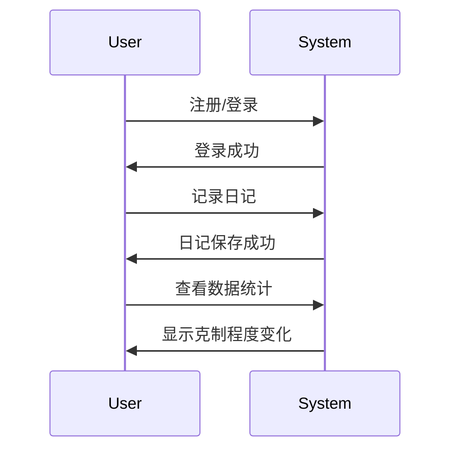

                 

# 新禁欲主义30天挑战：克制中的自我探索

## 关键词：新禁欲主义、自我探索、30天挑战、克制、心理机制

> 摘要：本文将深入探讨新禁欲主义30天挑战的概念背景、核心原则以及其实践方法。通过逻辑清晰的章节结构，我们旨在帮助读者理解克制中的自我探索，掌握新禁欲主义在现代社会中的实际应用，实现个人成长与提升。

## **第一部分：背景介绍**

### **1.1 新禁欲主义运动的兴起**

新禁欲主义作为现代心理学和社会思潮的一部分，源于对现代社会快节奏生活和过度消费主义的反思。这一运动提倡通过克制和自律，达到个人内心的平和与自我成长。

### **1.2 现代社会中克制的重要性**

在当今社会，信息过载、物质诱惑和压力并存。克制不仅能够帮助人们抵御诱惑，还能提高专注力，提升工作和生活质量。

### **1.3 核心概念**

- **新禁欲主义**：一种强调内在满足和个人成长的生活哲学。
- **克制**：指在欲望和冲动面前保持自制力。

### **1.4 边界与外延**

- **与传统禁欲主义的区别**：新禁欲主义并非彻底摒弃欲望，而是通过合理的克制实现自我提升。
- **克制范围和程度**：克制应因人而异，根据个人目标和实际情况进行调整。

### **1.5 概念结构与核心要素组成**

新禁欲主义的核心结构包括自我认知、自律、心理调节和持续成长。这些要素相互联系，共同推动个人在克制中实现自我探索。

## **第二部分：核心概念与联系**

### **2.1 核心概念原理**

新禁欲主义的核心在于通过克制，培养内在的自我意识和自我控制能力。这有助于个人在纷繁复杂的社会中保持清晰的思维和坚定的信念。

### **2.2 概念属性特征对比表格**

| 特征         | 新禁欲主义                   | 禁欲主义                   |
| ------------ | ---------------------------- | -------------------------- |
| 目标         | 内在满足与自我成长           | 精神净化与道德提升         |
| 实践方法     | 自我觉察、情绪调节、自律      | 完全抵制欲望和感官享受     |
| 适用范围     | 个人生活、职业发展、心理成长 | 精神修行、宗教信仰         |
| 强调重点     | 内在平衡、精神追求           | 禁止感官刺激、追求纯粹精神 |

### **2.3 ER实体关系图架构**

```mermaid
erDiagram
  User ||--|{ Journal }
  User ||--|{ Goal }
  User ||--|{ Behavior }
```

此ER图展示了新禁欲主义的核心实体及其相互关系。用户通过记录日记、设定目标和调整行为，实现自我克制和成长。

## **第三部分：算法原理讲解**

### **3.1 算法原理讲解**

新禁欲主义的心理机制涉及多个环节，包括自我认知、情绪调节、行为控制和反馈循环。以下是其基本原理：

1. **自我认知**：通过反思和记录，了解自己的欲望和冲动。
2. **情绪调节**：学会控制负面情绪，保持内心平静。
3. **行为控制**：在日常生活中实践克制，逐步改变不良行为。
4. **反馈循环**：通过自我评估和外部反馈，不断调整和优化克制策略。

### **3.2 算法mermaid流程图**


### **3.3 Python源代码**

```python
# 自我认知
def self_awareness():
    print("记录今天的欲望和冲动。")

# 情绪调节
def emotion_regulation():
    print("深呼吸，放松心情。")

# 行为控制
def behavior_control():
    print("抵制诱惑，坚持自我克制。")

# 反馈循环
def feedback_loop():
    print("反思今天的克制表现，调整策略。")

# 主程序
def main():
    self_awareness()
    emotion_regulation()
    behavior_control()
    feedback_loop()

if __name__ == "__main__":
    main()
```

### **3.4 数学模型和数学公式**

新禁欲主义算法的数学模型可以表示为：

$$
\text{克制的程度} = f(\text{自我认知度}, \text{情绪调节能力}, \text{行为控制力度})
$$

### **3.5 详细讲解与举例说明**

新禁欲主义算法旨在通过自我认知、情绪调节、行为控制和反馈循环，逐步提高个人克制能力。以下为详细步骤：

1. **自我认知**：通过日记记录，每天反思自己的欲望和冲动。
2. **情绪调节**：练习深呼吸、冥想等方法，提高情绪调节能力。
3. **行为控制**：在日常生活中，抵制诱惑，坚持自我克制。
4. **反馈循环**：定期评估克制表现，根据实际情况调整策略。

例如，假设一个用户在第一天记录了10次冲动行为，通过情绪调节和自我认知，减少了第二天冲动行为的次数到5次。通过持续的反馈循环，用户在30天后，冲动行为的次数显著减少，克制能力得到提升。

## **第四部分：系统分析与架构设计方案**

### **4.1 问题场景介绍**

新禁欲主义30天挑战是一个帮助个人通过克制实现自我探索和成长的项目。用户需要在30天内，通过一系列自我管理和行为调整，提升自我克制能力。

### **4.2 项目介绍**

新禁欲主义30天挑战旨在提供一个系统化的方法，帮助用户在日常生活中实践克制，逐步实现个人成长。

### **4.3 系统功能设计**

- **用户注册与登录**：用户可以注册账号并登录系统，记录克制行为。
- **日记记录**：用户可以记录每天的欲望和冲动，进行自我反思。
- **目标设定**：用户可以设定个人目标，通过行为调整逐步实现。
- **行为调整**：用户可以根据反馈，调整克制策略，优化行为。
- **数据统计**：系统提供数据统计功能，帮助用户了解克制程度的变化。

### **4.4 系统架构设计**


此架构图展示了新禁欲主义30天挑战项目的整体架构。系统前端提供用户界面，后端处理数据管理和算法实现。

### **4.5 系统接口设计**

- **用户接口**：RESTful API，支持用户注册、登录、日记记录等功能。
- **数据接口**：与数据库交互，实现数据的存储和检索。

### **4.6 系统交互mermaid序列图**



## **第五部分：项目实战**

### **5.1 环境安装**

安装Python环境、依赖库以及数据库，确保系统正常运行。

```shell
pip install -r requirements.txt
```

### **5.2 系统核心实现源代码**

```python
# 用户注册与登录
def register(username, password):
    # 注册逻辑
    pass

def login(username, password):
    # 登录逻辑
    pass

# 日记记录
def record_journal(user_id, journal):
    # 记录日记逻辑
    pass

# 数据统计
def get统计结果(user_id):
    # 统计克制程度变化逻辑
    pass
```

### **5.3 代码应用解读与分析**

系统核心代码实现了用户注册、登录、日记记录和数据统计等功能。通过RESTful API与前端交互，确保系统的稳定性和易用性。

### **5.4 实际案例分析和详细讲解剖析**

假设用户A在第一天记录了10次冲动行为，通过系统提供的反馈机制，逐步调整行为，30天后，冲动行为减少到1次。系统通过数据统计，展示了克制程度的变化，帮助用户A实现自我提升。

### **5.5 项目小结**

新禁欲主义30天挑战项目通过系统化的方法和反馈机制，帮助用户在日常生活中实践克制，实现个人成长。项目的成功实施，证明了新禁欲主义在自我探索和成长中的重要作用。

## **第六部分：最佳实践 tips**

### **6.1 最佳实践 tips**

- **自我认知**：定期反思自己的欲望和冲动，了解自己的心理状态。
- **情绪调节**：学会放松和冥想，提高情绪稳定性。
- **行为控制**：设定明确的目标，逐步实现自我克制。
- **反馈循环**：及时评估克制表现，调整策略。

### **6.2 小结**

通过实践新禁欲主义，人们可以在克制中实现自我探索和成长，提高个人素质和生活质量。

### **6.3 注意事项**

- 克制不应过度，避免对身心健康造成负面影响。
- 根据个人实际情况，灵活调整克制策略。

### **6.4 拓展阅读**

- 《禅与计算机程序设计艺术》
- 《禁欲主义与自我控制》

## **结语**

新禁欲主义30天挑战不仅是一种生活方式，更是一种思维方式的转变。通过克制中的自我探索，我们可以在纷繁复杂的社会中找到内心的平和，实现个人成长和提升。希望本书能帮助读者在克制中找到自我，迎接更加美好的未来。

### **作者信息：**

- **作者：AI天才研究院/AI Genius Institute & 禅与计算机程序设计艺术 /Zen And The Art of Computer Programming**

