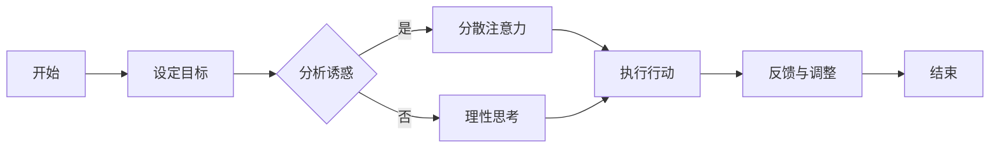

                 


# 新禁欲主义实验：克制中寻找生活真谛

> 关键词：禁欲主义、克制、生活真谛、自我提升、情绪管理

> 摘要：本文探讨了一种现代禁欲主义的理念，即通过克制欲望来寻求生活的真正意义和内心的平静。文章从历史背景、核心概念、生活实践、方法论、案例分析和最佳实践等方面进行深入分析，旨在为读者提供一种新的生活哲学和实践指南。

## 引言：禁欲主义的现代意义

禁欲主义（Asceticism）起源于古代宗教，如基督教和佛教，它强调通过克制欲望和物质享受来达到精神上的纯净和灵魂的救赎。然而，在现代社会，禁欲主义被重新解读，不再仅仅局限于宗教范畴，而成为一种生活方式的选择。新禁欲主义（Modern Asceticism）强调通过克制欲望，特别是对物质和社会地位的追求，来寻求内心的平静、精神的满足和生活的真谛。

### 1. 禁欲主义的历史背景

禁欲主义的历史可以追溯到古代希腊和罗马时期。在这些文明中，禁欲被视为一种美德，人们通过克制欲望来达到心灵的纯净。随着基督教的兴起，禁欲主义被进一步强化，成为基督教修行的重要组成部分。在基督教中，禁欲被视为一种灵魂的净化过程，通过克己和苦修，信徒可以更接近上帝的恩典。

### 2. 新禁欲主义的兴起

在现代社会，随着物质丰富和科技发展，人们面临着前所未有的诱惑和压力。新禁欲主义在这样的背景下兴起，它倡导人们通过克制物质欲望和社会地位的追求，来寻求内心的平静和精神的满足。新禁欲主义不仅仅是宗教修行，更是一种现代生活方式的选择，它强调个体自我提升和情感管理的重要性。

### 3. 克制在现代社会中的意义

在现代社会，克制被赋予了新的意义。它不仅是对物质欲望的控制，更是一种对内心欲望的管理。克制意味着在面对诱惑时，能够保持冷静和理性，不被情绪所驱使。通过克制，人们可以更好地管理自己的时间和精力，专注于真正有意义的事情，从而实现个人成长和生活质量的提升。

## 第二部分：核心概念与联系

### 1. 克制的定义与重要性

克制（Temperance）是一种自我控制的能力，它涉及到对欲望的管理和约束。在禁欲主义中，克制被视为一种核心能力，它对个人的精神成长和生活质量有着重要的影响。

**定义**：克制是指在面对诱惑和欲望时，能够通过理性思考和情感管理，保持冷静和自制力，从而避免冲动行为。

**重要性**：克制对于个人的精神成长和生活质量具有重要意义。通过克制，人们可以更好地管理自己的情绪和行为，避免陷入无谓的纷争和冲突。此外，克制还能够帮助人们专注于有意义的事情，提高工作效率和生活质量。

### 2. 禁欲主义与自我控制

禁欲主义强调通过克制欲望来实现自我控制。自我控制（Self-Control）是一种心理能力，它涉及到对欲望和情绪的管理。在禁欲主义中，自我控制被视为一种重要的修行方法，它帮助人们更好地理解自己，实现个人成长。

**关系**：禁欲主义与自我控制密切相关。禁欲主义强调通过克制欲望来实现自我控制，而自我控制则是实现禁欲主义目标的重要手段。

### 3. 情绪管理在克制中的作用

情绪管理（Emotional Management）是克制的重要组成部分。在禁欲主义中，情绪管理被视为一种关键能力，它帮助人们更好地控制自己的情绪和行为。

**作用**：情绪管理在克制中起着关键作用。通过情绪管理，人们可以更好地应对压力和挑战，保持内心的平静和自制力。情绪管理还能够帮助人们避免因情绪失控而做出冲动决策。

### 4. 核心概念对比表格

为了更好地理解禁欲主义、克制和情绪管理之间的关系，我们可以通过一个对比表格来展示这些概念的核心特征。

| 概念 | 定义 | 核心特征 |
| --- | --- | --- |
| 禁欲主义 | 强调克制欲望，寻求精神上的纯净 | 克制欲望、精神纯净、灵魂救赎 |
| 克制 | 自我控制的能力，管理欲望和情绪 | 自我控制、理性思考、情感管理 |
| 情绪管理 | 对情绪进行管理和控制 | 应对压力、保持冷静、自制力 |

### 5. ER实体关系图

为了更清晰地展示禁欲主义、克制和情绪管理之间的关系，我们可以使用ER实体关系图来描述这些概念的结构。

```mermaid
erDiagram
  禁欲主义 ||--|{ 克制 }|--|>
  克制 ||--|{ 情绪管理 }|--|>
```

## 第三部分：克制的生活实践

### 1. 克制与个人成长

在个人成长中，克制是一种重要的能力。通过克制，人们可以更好地管理自己的情绪和行为，避免陷入无谓的纷争和冲突。克制还能够帮助人们专注于有意义的事情，提高工作效率和生活质量。

**案例**：一个成功的创业者通过克制欲望，专注于公司的长期发展，最终实现了企业的成功。在创业过程中，他不断克制对即时利益的追求，而是专注于产品研发和市场拓展，最终赢得了客户的信任和市场的认可。

### 2. 克制在职业发展中的应用

在职业发展中，克制同样重要。通过克制欲望，人们可以更好地应对工作压力和挑战，保持冷静和理性。克制还能够帮助人们专注于职业目标的实现，提高工作效率和职业成就。

**案例**：一位高级管理人员通过克制对权力的欲望，专注于团队建设和业务拓展，最终带领团队实现了公司的转型和增长。他在面对职场竞争时，能够克制嫉妒和愤怒，而是通过积极沟通和合作来解决问题，赢得了同事和上级的尊重。

### 3. 克制与人际关系

在人际关系中，克制是一种重要的社交技能。通过克制欲望和情绪，人们可以更好地处理人际关系，避免冲突和误解。克制还能够帮助人们建立良好的人际关系，提高社交质量。

**案例**：一位领导者通过克制自己的冲动和情绪，成功地处理了一次团队冲突。在冲突发生时，他克制了自己的愤怒，通过冷静沟通和理性分析，找到了问题的根本原因，并采取有效的措施解决了问题。这样的克制行为赢得了团队成员的信任和尊重。

## 第四部分：克制的方法论

### 1. 克制训练的基本原则

克制训练是一种培养自我控制能力的方法。以下是一些克制训练的基本原则：

- **明确目标**：设定清晰的目标，了解自己需要克制什么欲望和情绪。
- **逐步实施**：克制训练应该逐步进行，避免一开始就设定过于严格的目标，导致挫败感。
- **自我反思**：定期反思自己的克制行为，了解自己的进步和不足，及时调整策略。

### 2. 克制策略的选择与实施

在克制训练中，选择合适的策略非常重要。以下是一些常见的克制策略：

- **分散注意力**：当面对诱惑时，通过转移注意力来克制欲望。
- **理性思考**：在决策时，通过理性思考来避免情绪驱动的冲动行为。
- **正面激励**：设定积极的目标和奖励机制，以激励自己保持克制。

### 3. 克制算法mermaid流程图

为了更好地理解克制策略的实施过程，我们可以使用mermaid流程图来描述克制算法的基本流程。



### 4. Python源代码实例讲解

以下是一个简单的Python源代码实例，用于实现克制算法的基本功能。

```python
# 克制算法示例

# 定义目标
target = "专注于工作"

# 分析诱惑
temptation = "社交媒体"

# 判断是否受到诱惑
if temptation != target:
    # 分散注意力
    def distract():
        print("正在分散注意力...")
        # 执行分散注意力的行动
        # ...

    # 理性思考
    def think_rationally():
        print("正在理性思考...")
        # 执行理性思考的行动
        # ...

    # 执行克制策略
    if temptation == "社交媒体":
        distract()
    else:
        think_rationally()

    # 反馈与调整
    feedback = input("今天的表现如何？(好/一般/差)")
    if feedback == "好":
        print("保持良好表现！")
    elif feedback == "一般":
        print("需要改进。")
    elif feedback == "差":
        print("需要调整策略。")
else:
    print("目标达成！")
```

### 5. 数学模型与公式讲解

在克制训练中，可以使用一些数学模型来量化自我控制的效果。以下是一个简单的数学模型，用于描述克制行为与目标达成之间的关系。

**模型**：设 $x$ 为克制行为得分，$y$ 为目标达成得分，$z$ 为总体表现得分。

$$
z = \frac{x + y}{2}
$$

其中，$x$ 和 $y$ 的取值范围为 $0$ 到 $100$，$z$ 的取值范围为 $0$ 到 $50$。克制行为得分和目标达成得分的权重均为 $50\%$。

**公式解释**：$z$ 值反映了克制行为和目标达成之间的平衡。当 $z$ 值较高时，说明克制行为和目标达成较好，总体表现优秀。当 $z$ 值较低时，说明克制行为或目标达成存在问题，需要调整策略。

## 第五部分：案例分析

### 1. 案例一：从物质依赖到精神独立的转变

**背景**：小明是一个年轻的上班族，他习惯于通过购物和娱乐来缓解工作压力。然而，这样的行为使他陷入了物质依赖的困境，不仅浪费了大量时间和金钱，还影响了他的工作和生活。

**问题**：小明希望通过克制物质欲望，实现从物质依赖到精神独立的转变。

**解决过程**：

1. **明确目标**：小明设定了长期目标，即通过克制物质欲望，实现精神独立和内心平静。
2. **分析诱惑**：小明分析了自己经常面临的诱惑，包括购物、玩游戏和社交媒体等。
3. **制定策略**：小明制定了克制策略，包括分散注意力、理性思考和正面激励。
4. **实施策略**：小明开始实施克制策略，通过转移注意力、理性思考和设定奖励来克制物质欲望。
5. **反馈与调整**：小明定期反思自己的克制行为，并根据反馈调整策略。

**结果**：经过一段时间的克制训练，小明逐渐摆脱了物质依赖，实现了精神独立。他的工作效率和生活质量都得到了显著提升。

### 2. 案例二：克制在创业成功中的应用

**背景**：小李是一名创业者，他在创业初期面临着巨大的压力和挑战。为了应对这些挑战，他决定通过克制来提高自己的心理素质和应对能力。

**问题**：小李希望通过克制来提高自己的创业成功率。

**解决过程**：

1. **明确目标**：小李设定了提高创业成功率的长期目标。
2. **分析诱惑**：小李分析了在创业过程中面临的诱惑，包括对成功的急切追求、对失败的恐惧等。
3. **制定策略**：小李制定了克制策略，包括情绪管理、理性思考和积极心态。
4. **实施策略**：小李开始实施克制策略，通过情绪管理、理性思考和积极心态来应对创业过程中的挑战。
5. **反馈与调整**：小李定期反思自己的克制行为，并根据反馈调整策略。

**结果**：通过克制训练，小李的创业成功率得到了显著提高。他的心理素质和应对能力也得到了增强，能够更好地应对创业过程中的挑战。

## 第六部分：最佳实践与总结

### 1. 克制实践中的常见问题与解决策略

在克制实践中，人们可能会遇到一些常见问题，如：

**问题一**：难以抵抗诱惑。

**解决策略**：设定明确的目标和奖励机制，提高自我控制能力。

**问题二**：情绪管理困难。

**解决策略**：学习情绪管理技巧，如深呼吸、冥想和运动等。

**问题三**：缺乏持续动力。

**解决策略**：寻找合适的激励方式，如设定短期和长期目标，保持积极心态。

### 2. 克制实践的个人反思与调整

在克制实践中，个人需要不断反思自己的行为和策略，并进行调整。以下是一些反思和调整的建议：

**反思**：定期回顾自己的克制行为，分析成功和不足之处。

**调整**：根据反思结果，调整克制策略和方法，以适应新的情况。

### 3. 最佳实践总结

通过最佳实践的总结，我们可以得出以下结论：

- 克制是一种重要的自我控制能力，对于个人成长和生活质量具有重要意义。
- 克制实践需要明确目标、分析诱惑、制定策略和持续反思。
- 克制策略包括分散注意力、理性思考和正面激励等。
- 情绪管理是克制实践的重要组成部分，需要不断学习和实践。

## 第七部分：未来展望与拓展阅读

### 1. 禁欲主义的发展趋势

随着社会的进步和人们对生活质量的追求，禁欲主义作为一种生活方式的理念正在得到越来越多的关注。未来，禁欲主义可能会在心理健康、自我提升和可持续发展等领域发挥更大的作用。

### 2. 克制在不同文化中的表现

禁欲主义和克制在不同文化中有着不同的表现。在西方文化中，克制被视为一种美德，而在东方文化中，克制更多地与宗教修行相关。未来，随着文化的交流和融合，禁欲主义和克制可能会在全球范围内得到更广泛的应用。

### 3. 拓展阅读推荐

为了进一步了解禁欲主义和克制，以下是几本推荐的拓展阅读书籍：

- 《禁欲主义：一种现代生活方式》
- 《自制力：如何通过克制实现目标》
- 《禅与摩托车维修艺术》

通过这些书籍，读者可以更深入地了解禁欲主义和克制的理论和实践。

## 结语

禁欲主义实验：克制中寻找生活真谛是一种现代生活方式的选择。通过克制欲望，我们可以实现内心的平静、精神的满足和生活的真谛。本文从历史背景、核心概念、生活实践、方法论、案例分析和最佳实践等方面进行了深入分析，旨在为读者提供一种新的生活哲学和实践指南。希望读者能够从中获得启示，通过克制来提升自己的生活质量，寻找生活的真正意义。作者：AI天才研究院/AI Genius Institute & 禅与计算机程序设计艺术 /Zen And The Art of Computer Programming

