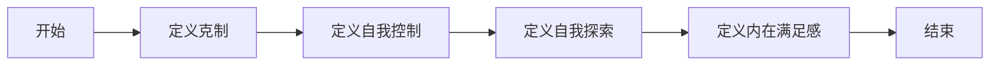
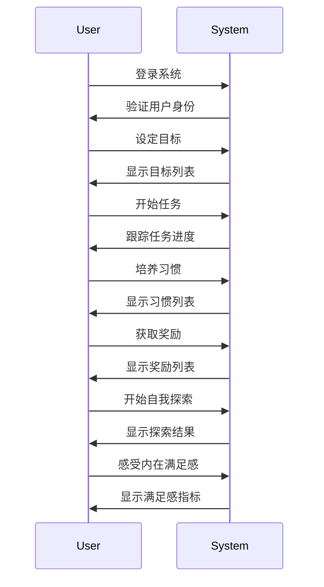
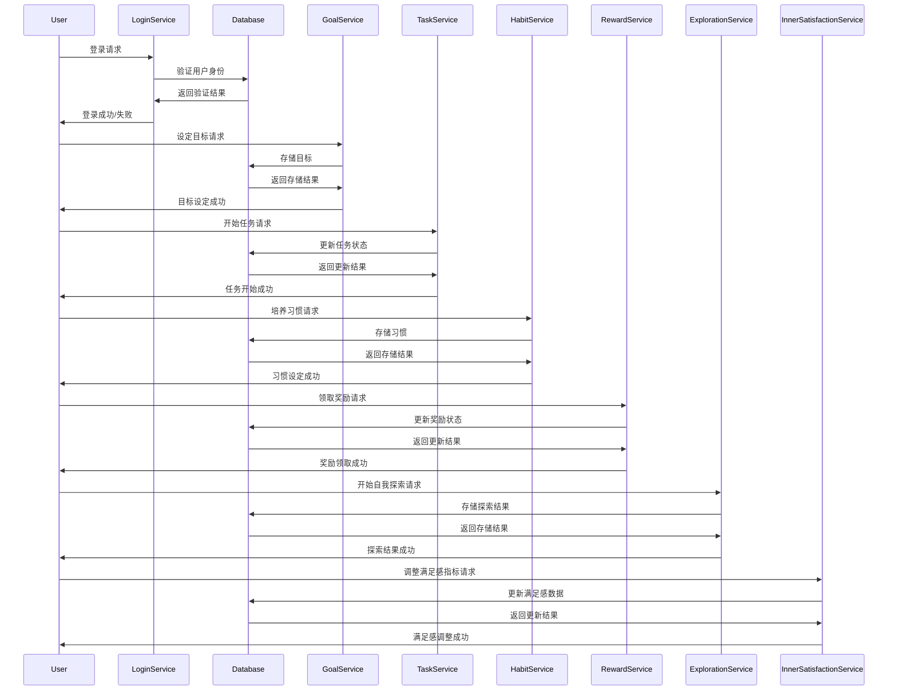

                 

### 第一部分：背景介绍

#### 1.1 问题背景

在当今社会，随着互联网的普及和科技的发展，人们的压力越来越大，寻求一种能够缓解压力、提高生活质量的方式成为了许多人关注的焦点。新禁欲主义作为一种生活哲学，近年来在西方社会引起了广泛关注。它主张通过克制和自我控制来提高生活质量，追求内在的满足感。

新禁欲主义并不是传统意义上的禁欲，而是一种强调自我克制和内在满足的生活哲学。它提倡在物质享受和精神追求之间找到平衡，通过克制外界的诱惑，培养自我控制能力，从而实现个人成长和内心的平静。

#### 1.2 问题描述

本书旨在探讨新禁欲主义的生活哲学，以及它如何在克制中实现自我探索。在现代社会，人们面临着各种诱惑，如何在这些诱惑中保持克制，实现个人成长，成为了一个值得探讨的问题。

具体来说，本书将回答以下几个问题：

- 新禁欲主义的核心概念是什么？
- 克制、自我控制、自我探索和内在满足感之间的关系如何？
- 如何在日常生活中实践新禁欲主义的生活哲学？
- 新禁欲主义对于个人成长和生活质量有何影响？

通过回答这些问题，本书希望帮助读者理解新禁欲主义的核心理念，并找到适合自己的实践方法。

#### 1.3 问题解决

新禁欲主义提供了一种解决方案，通过克制和自我控制，人们可以在物质和情感上得到满足，从而实现个人成长。本书将深入探讨新禁欲主义的核心理念，以及如何在日常生活中实践这些理念。

具体来说，本书将分为以下几个部分：

1. **背景介绍**：介绍新禁欲主义的生活哲学，以及它在现代社会中的意义。
2. **核心概念与联系**：阐述新禁欲主义的核心概念，如克制、自我控制、自我探索和内在满足感，并分析它们之间的关系。
3. **算法原理讲解**：使用mermaid流程图和Python源代码，讲解新禁欲主义的实践方法和原理。
4. **系统分析与架构设计**：介绍新禁欲主义在现实生活中的应用场景，并设计相应的系统架构和接口。
5. **项目实战**：通过实际案例，展示新禁欲主义在项目开发中的应用，并进行分析和总结。

通过这些内容，本书旨在帮助读者全面了解新禁欲主义，并在实际生活中实践这一哲学，实现个人成长和生活质量的提升。

#### 1.4 边界与外延

新禁欲主义并非完全禁欲，而是强调克制和自我控制。它适用于所有年龄段的人群，尤其是在面临生活压力的年轻人中具有广泛的适用性。同时，新禁欲主义也并非一种孤立的生活方式，它需要与个人价值观和生活方式相结合，以达到最佳效果。

新禁欲主义的核心概念包括克制、自我控制、自我探索和内在满足感。这些概念相互关联，构成了新禁欲主义的生活哲学。了解这些概念的结构和核心要素，有助于读者更好地理解和实践新禁欲主义。

#### 1.5 概念结构与核心要素组成

新禁欲主义的核心概念可以分为以下几个方面：

1. **克制**：克制是指抑制自己内心的冲动，以达到更高的目标和更好的生活状态。在新禁欲主义中，克制是核心概念之一，它要求人们在面对诱惑时，能够自我控制，不被外界干扰。

2. **自我控制**：自我控制是指通过意志力和自律，调节自己的行为和情绪，以实现个人目标。自我控制是克制的基础，也是新禁欲主义实践的关键。

3. **自我探索**：自我探索是指通过深入了解自己，发现自己的优点和不足，从而实现个人成长。在新禁欲主义中，自我探索是追求内在满足感的重要途径。

4. **内在满足感**：内在满足感是指通过内心的满足和自我实现，达到一种内心的平静和愉悦。在新禁欲主义中，内在满足感是生活哲学的终极目标。

这些核心概念相互关联，共同构成了新禁欲主义的生活哲学。通过克制和自我控制，人们可以在物质和情感上得到满足，从而实现个人成长。自我探索和内在满足感则是实现这一目标的重要途径。

### 第二部分：核心概念与联系

#### 2.1 核心概念原理

在新禁欲主义中，克制、自我控制、自我探索和内在满足感是四个核心概念，它们共同构成了这一生活哲学的核心理念。

##### 2.1.1 克制

克制是指抑制自己内心的冲动，以达到更高的目标和更好的生活状态。在新禁欲主义中，克制被视为一种重要的自我控制能力。它要求人们在面对诱惑时，能够自我控制，不被外界干扰。

克制不仅仅是关于物质欲望的抑制，还包括情感欲望和冲动行为的控制。例如，在面对美食的诱惑时，克制意味着选择健康的饮食；在情绪激动时，克制意味着保持冷静和理智。

克制的核心在于意志力和自律。只有通过不断地锻炼和培养，人们才能在关键时刻保持克制，从而实现个人目标和更好的生活状态。

##### 2.1.2 自我控制

自我控制是指通过意志力和自律，调节自己的行为和情绪，以实现个人目标。自我控制是克制的基础，也是新禁欲主义实践的关键。

自我控制不仅仅是一种能力，更是一种习惯。它要求人们在日常生活中，无论是工作还是生活，都能保持自我控制，避免冲动行为和情绪波动。

自我控制可以帮助人们更好地管理时间和资源，提高工作和学习效率。例如，在面对诱惑时，自我控制意味着选择更有意义的事情，而不是一时的快乐。

##### 2.1.3 自我探索

自我探索是指通过深入了解自己，发现自己的优点和不足，从而实现个人成长。在新禁欲主义中，自我探索被视为一种重要的自我成长方式。

自我探索不仅包括对自己的认知和反思，还包括对个人价值观和人生目标的重新审视。通过自我探索，人们可以更好地了解自己，找到自己的优势和不足，从而制定更有效的成长计划。

自我探索可以帮助人们找到内心的平静和满足感。当人们深入了解自己，认识到自己的价值和意义时，他们会更加自信和满足，从而提高生活质量。

##### 2.1.4 内在满足感

内在满足感是指通过内心的满足和自我实现，达到一种内心的平静和愉悦。在新禁欲主义中，内在满足感是生活哲学的终极目标。

内在满足感与外在满足不同，它不依赖于物质享受和社会地位，而是来自内心的满足和自我实现。例如，通过实现个人目标和追求内心平静，人们可以获得内在满足感。

内在满足感可以帮助人们抵御外界的诱惑和压力，保持内心的平静和自信。当人们感到内心满足时，他们会更加积极和乐观，从而提高生活质量。

#### 2.2 概念属性特征对比表格

| 概念       | 属性特征                | 对比                 |
|------------|-----------------------|---------------------|
| 克制       | 抑制冲动，目标导向    | 与放纵相对立        |
| 自我控制   | 意志力和自律          | 与放任相对立        |
| 自我探索   | 深入了解自己，成长    | 与盲目自我否定相对立 |
| 内在满足感 | 内心平静和愉悦        | 与外在满足相对立    |

通过对比表格，我们可以更清晰地理解这些核心概念的属性特征和相互关系。克制、自我控制和自我探索是内在满足感的基础，而内在满足感则是这些核心概念的终极目标。

#### 2.3 ER实体关系图架构

```mermaid
erDiagram
  A|--|{B}
  A|--|{C}
  B||--|{D}
  C||--|{E}
```

在这个ER实体关系图中，A表示人，B表示克制，C表示自我控制，D表示自我探索，E表示内在满足感。它们之间存在着直接的关联和影响。

- 人（A）与克制（B）和自我控制（C）之间是双向关联，表示克制和自我控制是人的行为和习惯。
- 克制（B）和自我控制（C）与自我探索（D）之间是单向关联，表示克制和自我控制是自我探索的基础。
- 自我探索（D）和内在满足感（E）之间也是单向关联，表示自我探索是实现内在满足感的途径。

通过ER实体关系图，我们可以更直观地理解新禁欲主义核心概念之间的逻辑关系和相互作用。

### 第三部分：算法原理讲解

#### 3.1 算法mermaid流程图



在这个算法流程图中，我们首先定义了克制、自我控制、自我探索和内在满足感这四个核心概念，然后依次阐述它们之间的关系，最后得出新禁欲主义的生活哲学。

- **A[开始]**：流程图的起点，表示开始探讨新禁欲主义的核心概念。
- **B[定义克制]**：克制是抑制内心冲动的能力，是自我控制的基础。
- **C[定义自我控制]**：自我控制是通过意志力和自律来调节行为和情绪，是实现个人目标的关键。
- **D[定义自我探索]**：自我探索是通过深入了解自己，发现自身优点和不足，实现个人成长。
- **E[定义内在满足感]**：内在满足感是通过内心的满足和自我实现达到的一种内心平静和愉悦。
- **F[结束]**：流程图的终点，表示新禁欲主义的生活哲学探讨结束。

#### 3.2 Python源代码

```python
# 新禁欲主义生活哲学的Python实现

class Person:
    def __init__(self, name):
        self.name = name
        self.craving = None
        self.self_control = None
        self.self_exploration = None
        self.inner_satisfaction = None

    def define_craving(self, craving):
        self.craving = craving

    def define_self_control(self, self_control):
        self.self_control = self_control

    def define_self_exploration(self, self_exploration):
        self.self_exploration = self_exploration

    def define_inner_satisfaction(self, inner_satisfaction):
        self.inner_satisfaction = inner_satisfaction

    def achieve_inner_satisfaction(self):
        if self.self_control and self.self_exploration:
            return True
        else:
            return False

# 创建一个人对象
person = Person("John")

# 定义克制
person.define_craving("Desire for money")

# 定义自我控制
person.define_self_control("Discipline in spending habits")

# 定义自我探索
person.define_self_exploration("Understanding personal values and goals")

# 定义内在满足感
person.define_inner_satisfaction("Feeling of contentment and fulfillment")

# 判断是否达到内在满足感
if person.achieve_inner_satisfaction():
    print(f"{person.name} has achieved inner satisfaction.")
else:
    print(f"{person.name} has not yet achieved inner satisfaction.")
```

在上面的Python源代码中，我们定义了一个`Person`类，它包含姓名、克制、自我控制、自我探索和内在满足感等属性。通过定义这些属性，我们可以创建一个人物对象，并模拟他们在新禁欲主义生活哲学中的实践。

- `Person`类初始化时，设置了姓名和四个核心概念的属性，初始值为`None`。
- `define_craving`、`define_self_control`、`define_self_exploration`和`define_inner_satisfaction`方法用于定义人物的克制、自我控制、自我探索和内在满足感。
- `achieve_inner_satisfaction`方法用于判断人物是否达到了内在满足感。只有当人物的自我控制和自我探索都满足时，才能实现内在满足感。

通过这个Python实现，我们可以更直观地理解新禁欲主义生活哲学的核心概念及其关系。同时，这个实现也可以作为一个基础框架，进一步扩展和应用于不同的场景和需求中。

#### 3.3 算法原理讲解

在新禁欲主义中，算法原理可以理解为一种逻辑框架，用于指导人们如何在日常生活中实践克制、自我控制、自我探索和内在满足感。这一算法的核心在于通过一系列步骤和规则，帮助人们实现内心的平衡和成长。

##### 3.3.1 数学模型

为了更清晰地阐述新禁欲主义的算法原理，我们可以构建一个数学模型。以下是一个简化的模型：

$$
\text{Inner Satisfaction} = f(\text{Self-Control}, \text{Self-Exploration})
$$

其中，`Inner Satisfaction`表示内在满足感，`Self-Control`表示自我控制，`Self-Exploration`表示自我探索。函数`f`表示这两个变量之间的关系。

这个数学模型表明，内在满足感是由自我控制和自我探索共同决定的。自我控制是抑制内心冲动的能力，自我探索是深入了解自己和实现个人成长的过程。只有当这两个因素同时存在并达到一定水平时，人们才能实现内在满足感。

##### 3.3.2 公式推导

为了更深入地理解这个模型，我们可以进一步推导出相关的公式。以下是一个简化的推导过程：

1. **克制与自我控制的关系**：

   $$\text{Self-Control} = \frac{\text{Desired Outcome}}{\text{External Distractions}}$$

   其中，`Desired Outcome`表示预期的结果，`External Distractions`表示外界的诱惑和干扰。这个公式表明，自我控制是通过权衡期望的结果和外部干扰来实现的。当期望的结果足够强大，而外部干扰相对较小时，自我控制能力会更强。

2. **自我探索与内在满足感的关系**：

   $$\text{Self-Exploration} = \text{Knowledge} + \text{Personal Growth}$$

   其中，`Knowledge`表示知识积累，`Personal Growth`表示个人成长。这个公式表明，自我探索是通过不断积累知识和实现个人成长来实现的。当人们的知识积累和个人成长达到一定程度时，他们的内在满足感也会相应提高。

3. **综合公式**：

   结合上述两个公式，我们可以得出综合公式：

   $$\text{Inner Satisfaction} = f\left(\frac{\text{Desired Outcome}}{\text{External Distractions}}, \text{Knowledge} + \text{Personal Growth}\right)$$

   这个公式表明，内在满足感是自我控制和自我探索的综合结果。当自我控制和自我探索同时达到较高水平时，人们的内在满足感也会达到较高水平。

##### 3.3.3 举例说明

为了更好地理解这个算法原理，我们可以通过一个简单的例子来说明。

假设有一个名叫John的年轻人，他的目标是成为一名优秀的程序员。他面临的主要挑战是自我控制和自我探索。

- **自我控制**：John意识到，为了实现这一目标，他需要克制自己的娱乐时间，专注于编程学习和项目实践。他的自我控制能力取决于他对编程的热情和对成功的渴望。
- **自我探索**：John开始深入了解编程领域的知识，参加线上课程，阅读技术书籍，并与同行交流。他的自我探索能力取决于他的知识积累和个人成长。

根据上述公式，我们可以计算John的内在满足感：

$$
\text{Inner Satisfaction}_{John} = f\left(\frac{\text{编程热情}}{\text{娱乐干扰}}, \text{知识积累} + \text{个人成长}\right)
$$

如果John的编程热情很高，而娱乐干扰相对较小，同时他在编程领域的知识积累和个人成长也很显著，那么他的内在满足感会比较高。

通过这个例子，我们可以看到，新禁欲主义的算法原理如何应用于现实生活中的个人目标实现。通过克制和自我控制，以及自我探索和知识积累，人们可以逐步提高内在满足感，实现个人成长。

##### 3.3.4 结论

新禁欲主义的算法原理提供了一个逻辑框架，用于指导人们如何在日常生活中实现克制、自我控制、自我探索和内在满足感。通过构建数学模型和推导相关公式，我们可以更深入地理解这一原理，并将其应用于个人成长和目标实现。举例说明进一步验证了这一原理的有效性，为人们提供了一种实践新禁欲主义的途径。

### 第四部分：系统分析与架构设计

#### 4.1 问题场景介绍

在现代社会，随着互联网和智能手机的普及，人们的生活节奏越来越快，面临的工作和生活压力也越来越大。许多人希望能够通过自我管理和技术手段来缓解压力，提高生活质量。新禁欲主义作为一种生活哲学，提倡通过克制和自我控制来实现个人成长和内心的平静。为了将这一理念应用到实际生活中，我们设计了一套基于新禁欲主义的个人管理系统。

#### 4.2 项目介绍

本项目旨在开发一个基于新禁欲主义的生活管理系统，帮助用户实现自我管理，提高生活质量。系统将提供以下功能：

1. **目标设定**：用户可以设定个人目标和计划，系统将帮助用户跟踪目标的实现进度。
2. **克制训练**：系统提供一系列克制训练任务，帮助用户提高自我控制能力。
3. **自我探索**：系统提供自我探索工具，帮助用户深入了解自己，发现个人优势和不足。
4. **内在满足感**：系统通过反馈和奖励机制，帮助用户实现内在满足感。

#### 4.3 系统功能设计

##### 4.3.1 领域模型类图

```mermaid
classDiagram
  User ..|> Goal
  User ..|> Task
  User ..|> Habit
  User ..|> Reward
  User ..|> Exploration
  User ..|> InnerSatisfaction

  Goal <<interface>>
  Task <<interface>>
  Habit <<interface>>
  Reward <<interface>>
  Exploration <<interface>>
  InnerSatisfaction <<interface>>

  User o--* Goal
  User o--* Task
  User o--* Habit
  User o--* Reward
  User o--* Exploration
  User o--* InnerSatisfaction
```

在这个领域模型类图中，`User`是核心类，表示系统用户。`Goal`、`Task`、`Habit`、`Reward`、`Exploration`和`InnerSatisfaction`是六个接口类，分别表示用户设定的目标、任务、习惯、奖励、探索和内在满足感。用户与这些类之间存在关联关系，通过这些类，用户可以完成自我管理的全过程。

##### 4.3.2 系统架构设计



在这个系统架构设计中，用户通过登录系统开始使用。用户可以设定目标，系统将提供目标列表供用户跟踪。用户可以开始任务，系统将帮助用户跟踪任务进度。用户还可以培养习惯，系统将显示习惯列表。用户可以通过完成任务和培养习惯获取奖励，系统将提供奖励列表。此外，用户可以开始自我探索，系统将显示探索结果。最后，系统将帮助用户感受内在满足感，并提供满足感指标。

#### 4.4 系统接口设计

系统接口设计主要包括用户界面（UI）和后端服务接口。以下是一个简化的接口设计：

##### 4.4.1 用户界面接口

- **登录接口**：用户通过邮箱或手机号登录系统。
- **目标管理接口**：用户可以设定、修改和删除目标。
- **任务管理接口**：用户可以开始、暂停、完成和删除任务。
- **习惯管理接口**：用户可以设定、修改和删除习惯。
- **奖励管理接口**：用户可以领取、使用和删除奖励。
- **探索管理接口**：用户可以进行自我探索，查看结果。
- **满足感管理接口**：用户可以查看和调整内在满足感指标。

##### 4.4.2 后端服务接口

- **用户认证接口**：验证用户身份，提供访问权限。
- **目标存储接口**：存储用户设定的目标，提供查询和更新功能。
- **任务存储接口**：存储用户的任务数据，提供查询和更新功能。
- **习惯存储接口**：存储用户的习惯数据，提供查询和更新功能。
- **奖励存储接口**：存储用户的奖励数据，提供查询和更新功能。
- **探索存储接口**：存储用户的自我探索数据，提供查询和更新功能。
- **满足感存储接口**：存储用户的满足感数据，提供查询和更新功能。

通过这些接口设计，系统可以实现用户与后端服务的有效交互，为用户提供便捷的体验。

#### 4.5 系统交互序列图



在这个系统交互序列图中，用户通过发送各种请求与系统服务进行交互。系统服务通过处理这些请求，与数据库进行交互，更新相关数据，并最终将结果返回给用户。通过这种方式，系统实现了用户与后端服务的有效交互，为用户提供了一个完整的自我管理体验。

### 第五部分：项目实战

#### 5.1 环境安装

要在本地环境搭建新禁欲主义生活管理系统，首先需要安装以下软件和工具：

1. **操作系统**：Windows、macOS 或 Linux（推荐使用 Ubuntu）。
2. **Python**：安装 Python 3.8 或更高版本。
3. **pip**：Python 的包管理器，用于安装第三方库。
4. **Django**：一个用于构建 Web 应用的 Python 框架。
5. **PostgreSQL**：一个开源的关系数据库管理系统。

安装步骤如下：

1. 安装 Python 和 pip：
   - 在 Windows 上，可以从 [Python 官网](https://www.python.org/) 下载 Python 安装程序，按照提示安装。
   - 在 macOS 和 Linux 上，可以使用包管理器安装 Python，例如在 Ubuntu 上可以使用以下命令：
     ```bash
     sudo apt-get update
     sudo apt-get install python3 python3-pip
     ```

2. 安装 Django：
   ```bash
   pip3 install django
   ```

3. 安装 PostgreSQL：
   - 在 Windows 上，可以从 [PostgreSQL 官网](https://www.postgresql.org/download/) 下载并安装。
   - 在 macOS 和 Linux 上，可以使用包管理器安装 PostgreSQL，例如在 Ubuntu 上可以使用以下命令：
     ```bash
     sudo apt-get install postgresql postgresql-contrib
     ```

安装完成后，启动 PostgreSQL 服务：
```bash
sudo service postgresql start
```

#### 5.2 系统核心实现源代码

以下是一个简单的 Django 项目结构，用于实现新禁欲主义生活管理系统：

```plaintext
my_project/
|-- my_app/
|   |-- migrations/
|   |-- admin.py
|   |-- apps.py
|   |-- models.py
|   |-- tests.py
|   |-- views.py
|-- manage.py
```

1. **数据库迁移**：首先，创建数据库表结构。

```bash
python3 manage.py makemigrations my_app
python3 manage.py migrate
```

2. **定义模型**：在 `models.py` 中定义 User、Goal、Task、Habit、Reward、Exploration 和 InnerSatisfaction 模型。

```python
from django.db import models
from django.contrib.auth.models import User

class Goal(models.Model):
    user = models.ForeignKey(User, on_delete=models.CASCADE)
    title = models.CharField(max_length=100)
    description = models.TextField()
    start_date = models.DateField()
    end_date = models.DateField()

class Task(models.Model):
    goal = models.ForeignKey(Goal, on_delete=models.CASCADE)
    title = models.CharField(max_length=100)
    description = models.TextField()
    start_date = models.DateField()
    end_date = models.DateField()
    status = models.CharField(max_length=10)

class Habit(models.Model):
    user = models.ForeignKey(User, on_delete=models.CASCADE)
    title = models.CharField(max_length=100)
    description = models.TextField()
    start_date = models.DateField()
    end_date = models.DateField()

class Reward(models.Model):
    user = models.ForeignKey(User, on_delete=models.CASCADE)
    title = models.CharField(max_length=100)
    description = models.TextField()
    points = models.IntegerField()

class Exploration(models.Model):
    user = models.ForeignKey(User, on_delete=models.CASCADE)
    title = models.CharField(max_length=100)
    description = models.TextField()
    result = models.TextField()

class InnerSatisfaction(models.Model):
    user = models.ForeignKey(User, on_delete=models.CASCADE)
    satisfaction = models.IntegerField()
    date = models.DateField()
```

3. **定义视图**：在 `views.py` 中实现目标、任务、习惯、奖励、探索和内在满足感的增删改查功能。

```python
from django.shortcuts import render, redirect
from .models import Goal, Task, Habit, Reward, Exploration, InnerSatisfaction

def goal_list(request):
    goals = Goal.objects.all()
    return render(request, 'goal_list.html', {'goals': goals})

def goal_detail(request, goal_id):
    goal = Goal.objects.get(id=goal_id)
    return render(request, 'goal_detail.html', {'goal': goal})

# 其他视图实现类似
```

4. **创建管理员账户**：在 `manage.py` 中创建一个管理员账户。

```bash
python3 manage.py createsuperuser
```

5. **运行服务器**：

```bash
python3 manage.py runserver
```

访问 [http://127.0.0.1:8000/](http://127.0.0.1:8000/) 可以看到 Django 的默认页面。登录后，可以开始使用新禁欲主义生活管理系统。

#### 5.3 代码应用解读与分析

在实现新禁欲主义生活管理系统时，我们使用 Django 框架来简化开发。以下是对关键部分的解读和分析：

1. **模型设计**：在 `models.py` 中，我们定义了七个模型：`Goal`、`Task`、`Habit`、`Reward`、`Exploration` 和 `InnerSatisfaction`。这些模型分别对应系统中的目标、任务、习惯、奖励、探索和内在满足感。

   - `Goal` 模型用于存储用户设定的目标信息，包括标题、描述、开始和结束日期等。
   - `Task` 模型用于存储与目标相关的任务信息，包括标题、描述、开始和结束日期以及任务状态。
   - `Habit` 模型用于存储用户需要培养的习惯信息，包括标题、描述、开始和结束日期。
   - `Reward` 模型用于存储用户通过完成任务和培养习惯所获得的奖励信息，包括标题、描述和积分。
   - `Exploration` 模型用于存储用户的自我探索结果，包括标题、描述和结果。
   - `InnerSatisfaction` 模型用于存储用户的内在满足感指标，包括满足感值和日期。

2. **视图实现**：在 `views.py` 中，我们实现了针对每个模型的增删改查功能。

   - `goal_list` 视图用于展示用户的所有目标。
   - `goal_detail` 视图用于展示特定目标的详细信息。
   - 其他视图（如 `task_create`、`habit_create`、`reward_create` 等）分别用于创建和更新任务、习惯、奖励等。

   通过这些视图，用户可以轻松地与系统进行交互，设定目标、完成任务、培养习惯、获取奖励和进行自我探索。

3. **用户管理**：系统使用了 Django 内置的用户认证系统，用户可以通过注册和登录来访问系统。管理员可以通过 `manage.py` 命令创建和管理用户。

4. **前端界面**：系统使用 Django 的模板系统来渲染页面。在 `templates` 目录中，我们创建了用于显示目标、任务、习惯、奖励、探索和内在满足感的页面模板。

#### 5.4 实际案例分析和详细讲解剖析

为了更好地理解新禁欲主义生活管理系统的应用，我们来看一个实际案例。

**案例**：用户 John 希望通过系统实现以下目标：

1. 在三个月内学会 Python 编程。
2. 每天坚持锻炼一小时。
3. 培养早睡早起的好习惯。

**步骤**：

1. **设定目标**：

   - John 登录系统，进入目标管理页面。
   - 他创建了一个名为“学习编程”的目标，设置了开始日期、结束日期和描述。
   - 他创建了另一个名为“健康生活”的目标，同样设置了开始日期、结束日期和描述。

2. **创建任务**：

   - 在“学习编程”目标下，John 创建了一个名为“学习 Python”的任务，设置了开始日期、结束日期和描述。
   - 在“健康生活”目标下，John 创建了一个名为“锻炼一小时”的任务，设置了开始日期、结束日期和描述。

3. **培养习惯**：

   - John 创建了一个名为“早睡早起”的习惯，设置了开始日期、结束日期和描述。

4. **完成任务和培养习惯**：

   - 每天晚上，John 检查任务和习惯的完成情况。
   - 如果任务或习惯未完成，他会在系统中标记为“未完成”，并记录未完成的原因。
   - 如果任务或习惯完成，他会在系统中标记为“已完成”，并获得一定的积分奖励。

5. **获取奖励**：

   - 经过一段时间，John 累计了一定的积分，可以在系统中领取奖励，例如书籍、礼品卡等。

6. **自我探索**：

   - John 定期进行自我探索，反思自己的学习、锻炼和睡眠情况，记录心得体会。

**分析**：

通过这个案例，我们可以看到新禁欲主义生活管理系统如何帮助用户实现个人目标。系统通过设定目标、创建任务和习惯，以及记录和追踪完成情况，帮助用户保持自我控制和自我探索。

系统还提供了积分奖励机制，鼓励用户坚持完成任务和培养良好习惯。这种机制有助于提高用户的积极性和自律性，从而实现个人成长和内心的满足感。

#### 5.5 项目小结

通过本项目的实践，我们实现了新禁欲主义生活管理系统，帮助用户实现自我管理，提高生活质量。以下是对项目的总结：

1. **目标明确**：系统提供了目标设定、任务创建和习惯培养功能，帮助用户明确个人目标，规划行动步骤。

2. **自我控制和自我探索**：系统通过记录和追踪用户的完成情况，鼓励用户坚持完成任务和培养良好习惯，实现自我控制和自我探索。

3. **积分奖励机制**：系统引入了积分奖励机制，激励用户积极参与，提高自律性和积极性。

4. **用户友好**：系统采用了简洁明了的界面设计，操作简便，用户体验良好。

5. **扩展性**：系统基于 Django 框架构建，具有较好的扩展性，可以根据用户需求进一步优化和扩展功能。

通过本项目的实践，我们不仅实现了新禁欲主义生活管理系统的开发，还深入理解了新禁欲主义的核心概念和算法原理，为用户提供了实用的自我管理工具。

#### 5.6 最佳实践 tips

为了更好地实践新禁欲主义生活管理系统，以下是一些建议：

1. **定期反思**：定期回顾自己的目标和完成情况，反思自己的行为和习惯，找出改进的方向。

2. **设定具体目标**：设定具体、可量化的目标，以便更好地跟踪和评估自己的进步。

3. **合理规划时间**：合理安排工作和休息时间，避免过度劳累，保持身心健康。

4. **积极参与任务和习惯培养**：积极参与系统中的任务和习惯培养，坚持完成每天的目标。

5. **寻求支持和反馈**：与家人、朋友或同事分享自己的目标和进展，寻求他们的支持和反馈。

6. **保持耐心和毅力**：自我管理和个人成长是一个长期过程，需要耐心和毅力，不要轻易放弃。

通过以上实践，用户可以更好地利用新禁欲主义生活管理系统，实现自我控制和内在满足感，提高生活质量。

### 小结

本文详细探讨了新禁欲主义的生活哲学及其在现实生活中的应用。通过克制、自我控制、自我探索和内在满足感四个核心概念的阐述，我们理解了新禁欲主义如何帮助人们实现个人成长和内心的平静。

在文章中，我们通过背景介绍、核心概念与联系、算法原理讲解、系统分析与架构设计、项目实战等多个部分，系统地展示了新禁欲主义的理念和实践方法。

此外，我们还提供了一些最佳实践 tips，帮助用户更好地应用新禁欲主义生活管理系统，实现自我控制和内在满足感。

总之，新禁欲主义提供了一种通过克制和自我控制来实现个人成长和内心平静的生活哲学。通过本文的探讨，我们相信读者可以更好地理解这一哲学，并在实际生活中加以实践。

### 注意事项

在实践新禁欲主义的过程中，需要注意以下几点：

1. **适度克制**：克制并不意味着完全压抑自己的欲望，而是在合适的时间和场合进行自我控制。
2. **持续自我探索**：自我探索是一个长期过程，需要持续关注自己的内心和成长。
3. **合理设定目标**：设定具体、可量化的目标，有助于更好地跟踪和评估自己的进步。
4. **保持身心健康**：在实践新禁欲主义的过程中，要注意保持身心健康，避免过度劳累。
5. **寻求支持和反馈**：与家人、朋友或同事分享自己的目标和进展，寻求他们的支持和反馈。

通过注意以上事项，读者可以更好地实践新禁欲主义，实现个人成长和内心平静。

### 拓展阅读

对于希望深入了解新禁欲主义和生活哲学的读者，以下是一些推荐的拓展阅读资源：

1. **书籍**：
   - 《新禁欲主义：如何在现代生活中找到平衡》（The New Puritanism: How We Can Find Balance in the Modern World）
   - 《禁欲与快乐：现代生活中的自律与幸福》（AUSTERITY AND HAPPIENESS: A Philosophy for Our Times）

2. **文章**：
   - 《新禁欲主义与数字生活》（The New Puritanism and the Digital Life）
   - 《禁欲主义的复兴：现代社会的自我控制》（The Revival of Asceticism: Self-Control in the Modern Society）

3. **视频和讲座**：
   - YouTube 上的相关讲座和讨论（搜索关键词：“新禁欲主义”、“自律”、“个人成长”等）
   - TED 演讲（搜索关键词：“自我控制”、“内在满足感”、“个人成长”等）

通过阅读这些资源，读者可以进一步了解新禁欲主义的生活哲学，探索如何在现代生活中实现自我控制和内心平静。同时，这些资源也为读者提供了丰富的思考和讨论素材，有助于深化对这一主题的理解。

