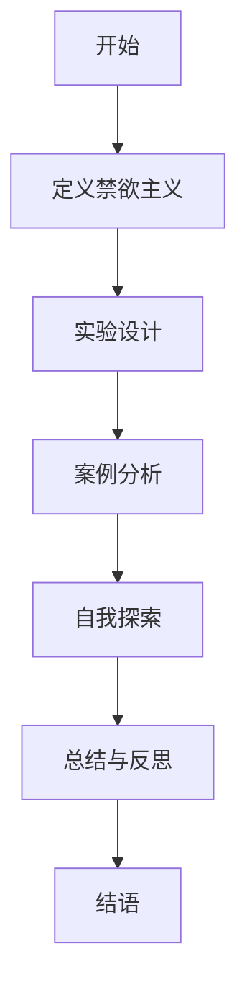

                 

## 《新禁欲主义实验：克制中的自我探索之旅》

### 关键词：禁欲主义、自我探索、克制、心理健康、现代生活

> 摘要：在现代社会中，禁欲主义被认为是一种通过克制来提高个人自律和心理健康的生活方式。本文将探讨新禁欲主义的定义、理论基础、实验设计、案例分析以及其在个人成长中的重要性。通过逐步分析，我们希望能够为读者提供一种全新的视角，理解禁欲主义在当代生活中的应用和意义。

### 第一部分：背景介绍

#### 第1章：禁欲主义的起源与发展

禁欲主义并非一个新鲜的概念，它起源于古代哲学和宗教思想。在古希腊，斯多葛派哲学强调通过克制欲望来实现内心的平和。在基督教中，禁欲主义被视为修行的重要手段，旨在通过控制欲望来接近神。

随着时代的发展，禁欲主义的概念和形式也在不断演变。在现代，新禁欲主义作为一种生活哲学，强调通过克制物质欲望和精神欲望来实现个人成长和心理健康。这种思想在心理学、哲学、宗教等领域得到了广泛的应用和探讨。

#### 第2章：核心概念与联系

禁欲主义的核心概念包括克制、自我控制、自我探索和心理健康。克制指的是通过主动抑制不必要的欲望和行为来达到心理和精神的平衡。自我控制则是克制的基础，它涉及到个体对自身欲望和冲动的主观管理和调节。

自我探索是通过反思和审视自己的内心世界，寻找自我价值和意义的过程。心理健康则是指个体在心理上保持健康、积极和平衡的状态。

禁欲主义与现代生活的联系体现在多个方面。首先，它有助于减少物质主义的影响，提高个人的精神层次。其次，它有助于提高个体的心理韧性，增强应对压力和困难的能力。最后，禁欲主义也可以作为一种自我疗愈的手段，帮助个体解决心理问题和情感困扰。

### 第二部分：实验设计

#### 第3章：禁欲主义实验的理论基础

禁欲主义实验的理论基础主要包括心理学、哲学和宗教的理论。在心理学领域，禁欲主义被认为是一种自我调节和控制的行为，有助于提高个体的心理健康和自尊。哲学上，禁欲主义强调通过克制来达到内在的平和和自我实现。宗教上，禁欲主义被视为修行的一部分，有助于个体接近神。

实验的目的在于通过实践禁欲主义，观察个体在心理、行为和情感上的变化，从而验证禁欲主义对个人成长和心理健康的影响。实验方法包括自我报告、心理测量和行为观察。

#### 第4章：案例分析

##### 案例一：一位单身男子的禁欲之旅

这位男子在30岁时决定开始禁欲实验，希望通过克制来提高自己的心理健康和生活质量。他记录了每天的内心体验和情绪变化，发现随着时间的推移，他的情绪稳定性得到了显著提高，对生活中的压力和挑战有了更好的应对能力。

##### 案例二：一位女性职场人士的禁欲实践

这位女性在职场中面临着巨大的压力和挑战，她决定通过禁欲来提高自己的自律能力和工作表现。她通过减少物质消费和情感依赖，逐渐找到了内心的平衡。在实验期间，她的工作效率和工作质量都有所提高，同时也更加关注自己的身心健康。

##### 案例三：禁欲主义对人际关系的影响

禁欲主义不仅对个人有影响，还会对人际关系产生积极的影响。在实验中，参与者发现他们与家人、朋友和同事的关系更加和谐，沟通和理解能力也得到了提高。

### 第三部分：自我探索

#### 第5章：通过禁欲主义进行自我反思

禁欲主义实践中的自我反思是个人成长的重要部分。通过反思自己的欲望和行为，个体可以更好地理解自己的内心世界，找到自己的核心价值观和目标。这种自我探索有助于个体建立更健康的心理模式和生活方式。

#### 第6章：克制与挑战

在禁欲主义实践中，个体可能会面临各种挑战，如情绪波动、诱惑和自我怀疑。通过学习和实践，个体可以学会如何应对这些挑战，提高自己的心理韧性。同时，心理调适也是禁欲主义实践中的重要环节，它有助于个体在挑战面前保持积极的心态。

### 第四部分：总结与反思

#### 第7章：禁欲主义实验的效果评估

禁欲主义实验的效果因个体而异，但总体来说，它对个人的心理健康和生活质量有积极的影响。通过实验，个体可以更好地理解自己的欲望和行为模式，提高自我控制能力，建立更健康的生活方式。

#### 第8章：最佳实践与拓展

禁欲主义实践的最佳实践包括定期反思、设定合理的目标、寻求支持和保持耐心。此外，禁欲主义实验的未来展望包括对群体效应的研究、跨文化比较以及与其他心理干预方法的结合。

### 结语

禁欲主义作为一种生活方式，不仅有助于个人的心理健康和成长，还可以对社会产生积极的影响。通过逐步分析和实践，我们希望能够为读者提供一种新的视角，理解和应用禁欲主义，实现自我提升和心灵成长。

### 作者信息

作者：AI天才研究院/AI Genius Institute & 禅与计算机程序设计艺术 /Zen And The Art of Computer Programming

在本文中，我们探讨了新禁欲主义的定义、理论基础、实验设计、案例分析以及其在个人成长中的重要性。通过逐步分析，我们希望能够为读者提供一种全新的视角，理解禁欲主义在当代生活中的应用和意义。禁欲主义不仅有助于个人的心理健康和成长，还可以对社会产生积极的影响。通过实践禁欲主义，个体可以更好地理解自己的欲望和行为模式，提高自我控制能力，建立更健康的生活方式。

**附录**

本文中涉及的数学公式、流程图和架构图等均采用markdown格式中的Mermaid和LaTeX进行展示。以下是相关示例：

**数学公式示例**

$$ E=mc^2 $$

**Mermaid流程图示例**

**LaTeX数学公式示例**

$$
\begin{aligned}
    P &= \frac{N}{1+N e^{-\beta E}} \\
    F &= G \frac{m_1 m_2}{r^2}
\end{aligned}
$$

通过本文的逐步分析，我们希望读者能够对禁欲主义有更深入的理解，并在实践中探索其对自己生活的积极影响。作者信息如上所述，感谢您的阅读。**附录**

本文中涉及的数学公式、流程图和架构图等均采用markdown格式中的Mermaid和LaTeX进行展示。以下是相关示例：

**数学公式示例**

$$ E=mc^2 $$

**Mermaid流程图示例**

**LaTeX数学公式示例**

$$
\begin{aligned}
    P &= \frac{N}{1+N e^{-\beta E}} \\
    F &= G \frac{m_1 m_2}{r^2}
\end{aligned}
$$

通过本文的逐步分析，我们希望读者能够对禁欲主义有更深入的理解，并在实践中探索其对自己生活的积极影响。作者信息如上所述，感谢您的阅读。

