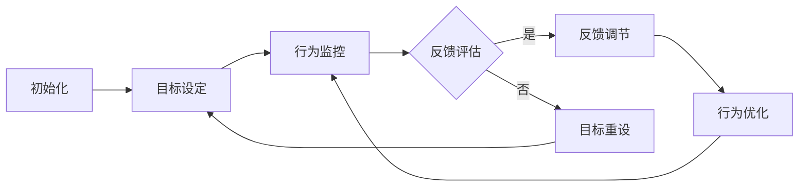
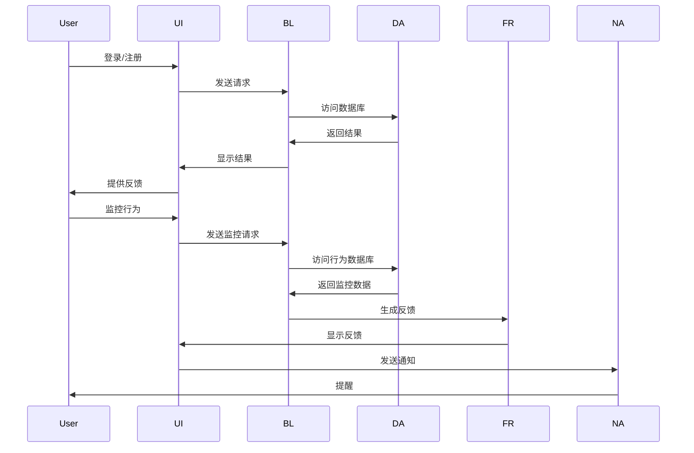
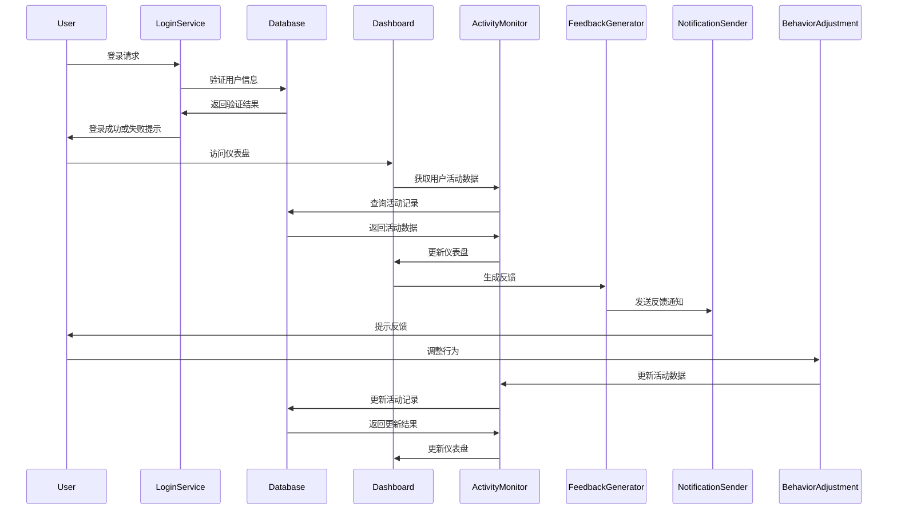

                 

# 新禁欲主义运动：数字化时代的自我节制

> 关键词：新禁欲主义，数字化时代，自我节制，算法，系统架构，项目实战

> 摘要：
本文旨在探讨新禁欲主义运动在数字化时代的重要性及其应用。我们将从背景介绍、核心概念与联系、算法原理讲解、系统分析与架构设计方案以及项目实战等多个方面展开讨论，旨在为读者提供一个清晰、深入的理解，并探索如何通过新禁欲主义运动来更好地应对数字化时代的挑战。

### 目录大纲：

#### 第一部分：背景介绍

- **第1章 新禁欲主义运动概述**
  - 1.1 问题的背景
  - 1.2 问题描述
  - 1.3 问题解决
  - 1.4 概念结构与核心要素组成

#### 第二部分：核心概念与联系

- **第2章 新禁欲主义运动的核心概念**
  - 2.1 自我节制的概念
  - 2.2 数字化生活方式的概念
  - 2.3 新禁欲主义运动的概念联系

- **第3章 新禁欲主义运动的ER实体关系图**

#### 第三部分：算法原理讲解

- **第4章 算法原理与流程图**
  - 4.1 算法原理的概述
  - 4.2 算法流程图

- **第5章 数学模型与公式**
  - 5.1 数学模型的概述
  - 5.2 数学公式的讲解

- **第6章 举例说明**
  - 6.1 举例说明的概述
  - 6.2 举例说明的内容

#### 第四部分：系统分析与架构设计方案

- **第7章 问题场景介绍**
  - 7.1 问题场景的描述
  - 7.2 项目介绍

- **第8章 系统功能设计**
  - 8.1 领域模型
  - 8.2 系统功能设计

- **第9章 系统架构设计**
  - 9.1 系统架构的概述
  - 9.2 系统架构设计

- **第10章 系统接口设计**
  - 10.1 系统接口的概述
  - 10.2 系统接口设计

- **第11章 系统交互**
  - 11.1 系统交互的概述
  - 11.2 系统交互设计

#### 第五部分：项目实战

- **第12章 环境安装**
  - 12.1 环境安装的概述
  - 12.2 环境安装的步骤

- **第13章 系统核心实现**
  - 13.1 系统核心实现的概述
  - 13.2 系统核心实现的源代码

- **第14章 代码应用解读与分析**
  - 14.1 代码应用解读与分析的概述
  - 14.2 代码应用解读与分析的内容

- **第15章 实际案例分析和详细讲解**
  - 15.1 实际案例分析和详细讲解的概述
  - 15.2 实际案例分析和详细讲解的内容

- **第16章 项目小结**
  - 16.1 项目小结的概述
  - 16.2 项目小结的内容

#### 第六部分：最佳实践 tips

- **第17章 最佳实践 tips**
  - 17.1 最佳实践 tips 的概述
  - 17.2 最佳实践 tips 的内容

#### 第七部分：小结

- **第18章 小结**
  - 18.1 小结的概述
  - 18.2 小结的内容

- **第19章 注意事项**
  - 19.1 注意事项的概述
  - 19.2 注意事项的内容

- **第20章 拓展阅读**
  - 20.1 拓展阅读的概述
  - 20.2 拓展阅读的内容

---

## 第一部分：背景介绍

### 第1章 新禁欲主义运动概述

在数字化时代，我们面临着前所未有的信息洪流和感官刺激。这一现象催生了一个新的社会运动——新禁欲主义运动。本章将概述这一运动的背景、起源、核心理念以及它对数字化时代的影响。

#### 1.1 问题的背景

随着互联网和移动设备的普及，人们的生活变得前所未有的便利。然而，这种便利也带来了负面影响。过度依赖智能手机和社交媒体，人们沉迷于虚拟世界，忽视了现实生活中的互动和人际关系。同时，信息的泛滥和过度消费导致人们的注意力分散，减少了深度思考和专注的能力。

#### 1.2 问题描述

- **信息过载**：互联网上的信息量爆炸性增长，人们很难筛选出真正有价值的信息。
- **注意力分散**：社交媒体和娱乐平台的设计往往是为了吸引和保持用户的注意力，这导致人们的注意力变得短暂和分散。
- **自我迷失**：在数字化世界中，人们容易迷失自我，追求虚拟的满足而非真实的幸福。

#### 1.3 问题解决

新禁欲主义运动提出了一系列解决方案，旨在帮助人们恢复自我节制，重新掌控自己的生活。这些方法包括：

- **技术节制**：限制使用社交媒体和智能手机的时间，避免信息过载。
- **心灵修行**：通过冥想和反思来提高自我意识，减少内心烦恼。
- **人际关系重建**：通过面对面的交流和互动，增强现实生活中的社交能力。

#### 1.4 概念结构与核心要素组成

新禁欲主义运动的核心概念包括自我节制、数字化生活方式和新禁欲主义运动的互动。以下是这些概念的定义和特征：

1. **自我节制**：
   - 定义：自我节制是指个体通过自我控制和自我调节来限制自己的行为，以达到更高的目标和更健康的生活方式。
   - 特征：
     - **自律**：个体能够自我监督和自我调整，不受外界诱惑。
     - **理性**：个体能够理性分析自己的行为，做出明智的决策。

2. **数字化生活方式**：
   - 定义：数字化生活方式是指个体在数字化环境中（如互联网和移动设备）的生活方式和行为模式。
   - 特征：
     - **便利性**：数字化环境提供了方便快捷的服务和资源。
     - **依赖性**：个体对数字化环境产生了强烈的依赖，难以离开。

3. **新禁欲主义运动的互动**：
   - 定义：新禁欲主义运动的互动是指个体通过自我节制和数字化生活方式的调整，来实现对生活的重新掌控。
   - 特征：
     - **自我反思**：个体通过反思自己的数字化行为，找到问题的根源。
     - **适应性**：个体能够根据自身情况调整自我节制的方法。

#### 1.5 新禁欲主义运动的边界与外延

新禁欲主义运动的边界在于如何平衡数字化生活方式和自我节制的关系。它不仅关注个体的自我控制，也关注个体与数字化环境之间的互动。外延则包括以下几个方面：

- **家庭**：新禁欲主义运动鼓励家庭成员共同参与自我节制，建立健康的数字化家庭环境。
- **学校**：学校可以通过教育引导学生们培养自我节制的能力，减少数字化设备的负面影响。
- **社会**：社会可以提供支持和资源，帮助人们更好地适应数字化时代，实现自我节制。

### 总结

新禁欲主义运动是应对数字化时代挑战的一种有效途径。通过自我节制和数字化生活方式的调整，个体可以重新掌控自己的生活，减少信息过载和注意力分散的影响。同时，新禁欲主义运动也为家庭、学校和整个社会提供了新的思考方向，为构建一个更加健康、和谐的社会奠定了基础。

---

## 第二部分：核心概念与联系

### 第2章 新禁欲主义运动的核心概念

新禁欲主义运动的核心概念包括自我节制和数字化生活方式。这两个概念相互联系，共同构成了新禁欲主义运动的核心理念。在本章中，我们将详细探讨这两个概念的定义、特征以及它们之间的关系。

#### 2.1 自我节制的概念

自我节制是一种个体通过自我控制和自我调节来限制自己的行为，以达到更高目标和更健康生活方式的能力。自我节制不仅涉及到个体在物质层面的控制，还包括精神层面和心理层面的自我管理。

- **定义**：
  - 自我节制是指个体通过自我监督和自我调整来控制自己的行为，从而实现自我提升和生活优化。
  
- **特征**：

  - **自律性**：个体能够自我监督，遵守既定的规则和目标。
  - **理性思考**：个体能够理性地分析自己的行为，做出明智的决策。
  - **适应性**：个体能够根据环境变化和自身情况调整自我节制的方式。

#### 2.2 数字化生活方式的概念

数字化生活方式是指个体在数字化环境中（如互联网、移动设备等）的生活和行为模式。随着数字化技术的普及，数字化生活方式已成为现代社会的重要组成部分。

- **定义**：
  - 数字化生活方式是指个体在数字化环境中获取、处理和应用信息的方式，以及由此产生的行为模式。
  
- **特征**：

  - **便利性**：数字化环境提供了方便快捷的服务和资源，提高了生活的便利性。
  - **依赖性**：个体对数字化环境产生了强烈的依赖，难以离开。
  - **多样性**：数字化生活方式涵盖了从社交、购物、娱乐到工作等多个方面。

#### 2.3 新禁欲主义运动的概念联系

新禁欲主义运动将自我节制和数字化生活方式结合起来，通过自我节制来优化数字化生活方式，从而实现个体和整体社会的和谐发展。

- **自我节制与数字化生活方式的关系**：
  - 自我节制是对数字化生活方式的一种调节和平衡。在数字化环境中，个体容易受到各种诱惑和信息过载的影响，导致注意力分散和自我失控。通过自我节制，个体可以减少对数字化设备的依赖，提高注意力和专注力。
  - 数字化生活方式为自我节制提供了新的场景和挑战。在数字化环境中，个体需要不断适应新的技术和平台，这也要求个体具备更强的自律和理性思考能力。

- **新禁欲主义运动与数字化生活方式的互动**：
  - 新禁欲主义运动通过自我节制来引导个体优化数字化生活方式。个体可以通过自我反思、时间管理和心理调适等方法，减少数字化设备的负面影响，提高生活质量。
  - 数字化生活方式为自我节制提供了实践的机会和反馈。通过数字化工具，个体可以监测自己的数字化行为，评估自我节制的效果，并不断调整和优化自我节制策略。

### 总结

新禁欲主义运动的核心概念是自我节制和数字化生活方式。自我节制提供了个体自我管理和提升的能力，而数字化生活方式则为个体提供了新的生活场景和挑战。通过二者的有机结合，新禁欲主义运动为个体和社会提供了实现和谐发展的有效途径。在接下来的章节中，我们将进一步探讨新禁欲主义运动的算法原理、系统架构设计方案以及项目实战，以深入理解这一运动的实际应用和效果。

---

## 第3章 新禁欲主义运动的ER实体关系图

为了更好地理解新禁欲主义运动的架构和组成部分，我们将通过ER（实体关系）图来展示其中的实体及其关系。ER图是数据库设计和系统架构设计中常用的一种图形化表示方法，能够清晰、简洁地表达系统中各个实体之间的关系。

#### 3.1 ER实体关系图的构建

ER图的构建主要包括以下步骤：

1. **定义实体**：确定系统中的主要实体。在新禁欲主义运动中，主要的实体包括参与者、影响者和运动活动。
2. **定义属性**：为每个实体定义其属性。例如，参与者实体可以包括用户名、年龄、性别等属性；影响者实体可以包括角色、影响力等属性；运动活动实体可以包括活动名称、时间、地点等属性。
3. **定义关系**：确定实体之间的关系。在新禁欲主义运动中，参与者与运动活动之间存在参与关系；影响者与参与者之间存在影响关系；运动活动与影响者之间存在关联关系。

#### 3.2 ER实体关系图的内容

以下是新禁欲主义运动的ER实体关系图的详细内容：

```mermaid
erDiagram
  Participant ||--|{ MovementActivity :参加}
  Influencer ||--|{ Participant :影响}
  MovementActivity ||--|{ Influencer :关联}
  Participant ||--|{ Influencer :反馈}
  
  Participant {
    int id
    String username
    int age
    String gender
  }

  Influencer {
    int id
    String role
    int influence
  }

  MovementActivity {
    int id
    String name
    Date startTime
    String location
  }
```

在上面的ER图中：

- **Participant（参与者）**：表示参与新禁欲主义运动的人员，包括用户名、年龄、性别等属性。
- **Influencer（影响者）**：表示对新禁欲主义运动有影响力的人或组织，包括角色、影响力等属性。
- **MovementActivity（运动活动）**：表示新禁欲主义运动的各项活动，包括活动名称、时间、地点等属性。

关系描述如下：

- **参与关系**：参与者与运动活动之间存在参与关系，表示某个参与者参加了某个运动活动。
- **影响关系**：影响者与参与者之间存在影响关系，表示某个影响者对某个参与者产生了影响。
- **关联关系**：运动活动与影响者之间存在关联关系，表示某个运动活动受到了某个影响者的支持或推动。
- **反馈关系**：参与者与影响者之间存在反馈关系，表示参与者对影响者的行为或建议进行了反馈。

#### 3.3 ER实体关系图的意义

ER实体关系图在新禁欲主义运动中的应用具有以下意义：

- **清晰表达系统架构**：ER图能够直观地展示新禁欲主义运动中的实体及其关系，帮助设计者和参与者理解系统的整体架构。
- **辅助数据库设计**：ER图可以作为数据库设计的依据，指导数据库表的设计和关系配置。
- **支持系统开发**：ER图为新禁欲主义运动的系统开发提供了清晰的实体和属性定义，有助于开发人员更好地实现系统功能。

### 总结

通过ER实体关系图，我们可以清晰地看到新禁欲主义运动中的各个实体及其关系。这一工具不仅帮助设计者和参与者理解新禁欲主义运动的架构，还为系统开发提供了重要的参考。在接下来的章节中，我们将进一步探讨新禁欲主义运动的算法原理和系统架构设计，为读者提供更全面的认识。

---

## 第三部分：算法原理讲解

### 第4章 算法原理与流程图

新禁欲主义运动中，算法的应用至关重要。通过算法，我们可以对数字化生活方式进行优化，帮助个体实现自我节制。本章将介绍新禁欲主义运动中使用的算法原理及其流程图。

#### 4.1 算法原理的概述

算法是新禁欲主义运动的核心，用于指导个体在数字化环境中的行为，以实现自我节制。算法的基本原理包括：

- **目标设定**：首先，个体需要明确自己的节制目标，如减少社交媒体使用时间、提高工作效率等。
- **行为监控**：通过监控个体的数字化行为，如使用时间、活动类型等，算法可以评估当前行为的合理性。
- **反馈调节**：根据监控结果，算法会给出反馈，指导个体调整行为，以达到节制目标。

#### 4.2 算法流程图

以下是新禁欲主义运动算法的基本流程图：



流程图说明：

1. **初始化**：系统初始化，准备开始算法运行。
2. **目标设定**：个体设定自己的节制目标。
3. **行为监控**：系统监控个体在数字化环境中的行为。
4. **反馈评估**：根据监控结果评估当前行为的合理性。
5. **反馈调节**：系统根据评估结果，给出反馈，指导个体调整行为。
6. **行为优化**：个体根据反馈进行行为调整，以实现节制目标。
7. **目标重设**：如果当前目标无法实现，个体可以重新设定目标，并重复流程。

#### 4.3 算法流程图的具体说明

以下是算法流程图的详细说明：

- **初始化**：系统启动，准备开始对个体的数字化行为进行监控和优化。
- **目标设定**：个体通过系统设定自己的节制目标，如减少每天使用社交媒体的时间。
- **行为监控**：系统实时监控个体在数字化环境中的行为，如使用社交媒体的频率和时长。
- **反馈评估**：系统根据设定的目标，评估当前行为的合理性。如果行为超出了设定的限制，系统会给出警告或提示。
- **反馈调节**：系统根据评估结果，给出反馈，指导个体减少不健康的行为，如减少社交媒体的使用时间。
- **行为优化**：个体根据系统的反馈，调整自己的数字化行为，以达到节制目标。
- **目标重设**：如果当前目标无法实现，个体可以重新设定目标，并再次进入流程。这有助于个体不断调整和优化自己的行为。

#### 4.4 算法的优化

在实际应用中，算法的优化是非常重要的。以下是一些常见的算法优化方法：

- **数据预处理**：对监控数据进行预处理，如去噪、归一化等，以提高算法的准确性。
- **特征工程**：通过选择合适的特征，提高算法的预测能力。例如，在监控社交媒体使用时间时，可以加入使用场景、使用频率等特征。
- **模型调整**：根据监控结果，动态调整算法模型，以适应个体的变化。例如，如果个体在一段时间内表现出良好的节制行为，可以适当降低监控力度。

#### 4.5 算法的实现

以下是一个简单的算法实现示例，使用Python语言：

```python
import time

def monitor_activity(activity, limit):
    start_time = time.time()
    while True:
        if activity > limit:
            print("警告：活动时间超过限制。请减少使用时间。")
            break
        time.sleep(1)  # 假设活动持续1秒
        activity += 1
    end_time = time.time()
    return end_time - start_time

def set_goal(limit):
    activity = 0
    while True:
        activity_time = monitor_activity(activity, limit)
        if activity_time > limit:
            break
        activity += 1
    return activity_time

# 示例
goal_limit = 60  # 设定目标为60秒
activity_time = set_goal(goal_limit)
print("完成活动，总耗时：{}秒"。format(activity_time))
```

在这个示例中，`monitor_activity` 函数用于监控活动时间，`set_goal` 函数用于设定目标并监控活动。

### 总结

本章介绍了新禁欲主义运动中的算法原理和流程图，通过具体的示例展示了算法的实现过程。算法在新禁欲主义运动中起着关键作用，它可以帮助个体实现自我节制，优化数字化生活方式。在接下来的章节中，我们将继续探讨数学模型、举例说明以及系统架构设计，以更全面地理解新禁欲主义运动的实践应用。

---

## 第5章 数学模型与公式

在新禁欲主义运动中，数学模型和公式是理解和优化数字化生活方式的重要工具。通过数学模型，我们可以量化个体的数字化行为，评估自我节制的效果，并设计更有效的策略。本章将介绍新禁欲主义运动中常用的数学模型和公式，并对其进行详细讲解。

### 5.1 数学模型的概述

数学模型是利用数学语言和符号表示现实世界中的问题，以便进行定量分析和预测。在新禁欲主义运动中，数学模型用于以下几个方面：

- **数字化行为量化**：将个体的数字化行为（如社交媒体使用时间、浏览网页次数等）转化为可量化的数值。
- **效果评估**：评估个体自我节制的效果，如减少社交媒体使用时间是否达到了预期的目标。
- **策略优化**：基于量化数据和效果评估，设计更有效的自我节制策略。

#### 5.2 基础数学公式

以下是一些在新禁欲主义运动中常用的基础数学公式：

1. **平均时间公式**：
   $$ \text{平均时间} = \frac{\text{总时间}}{\text{活动次数}} $$
   这个公式用于计算个体在数字化环境中平均每次活动的耗时。

2. **比例公式**：
   $$ \text{比例} = \frac{\text{目标时间}}{\text{实际时间}} $$
   这个公式用于评估个体在自我节制中的表现，比例值越接近1，表示自我节制的效果越好。

3. **时间优化公式**：
   $$ \text{最优时间} = \text{目标时间} - \text{允许误差} $$
   这个公式用于计算在给定目标时间内，个体需要达到的最优时间，以避免超过限制。

#### 5.3 优化数学公式

为了更好地适应个体的变化，优化数学公式可以根据实际情况进行调整。以下是一些优化数学公式：

1. **动态调整公式**：
   $$ \text{调整时间} = \text{当前时间} \times \text{调整因子} $$
   调整因子可以根据个体的表现进行动态调整，以适应不同的情况。

2. **适应性优化公式**：
   $$ \text{优化时间} = \text{目标时间} - \text{累积误差} $$
   累积误差用于衡量个体在过去一段时间内的自我节制效果，累积误差越小，优化时间越接近目标时间。

#### 5.4 数学公式的应用

以下是一个简单的数学模型应用示例：

假设个体每天需要使用社交媒体不超过30分钟，但实际使用时间为60分钟。我们可以使用比例公式来评估当前自我节制的效果：

$$ \text{比例} = \frac{30}{60} = 0.5 $$

这意味着个体的自我节制效果只有50%，还需要进一步优化。

接下来，我们可以使用时间优化公式来计算个体需要达到的最优时间：

$$ \text{最优时间} = 30 - 10 = 20 \text{分钟} $$

这意味着个体需要在每次使用社交媒体时将时间限制在20分钟内，以达到目标。

通过动态调整公式，个体可以根据自己的表现和需求调整自我节制的时间：

$$ \text{调整时间} = 20 \times 1.2 = 24 \text{分钟} $$

如果个体在过去的几天中表现出较好的自我节制能力，可以将调整因子设置为1.2，以鼓励个体继续保持。

### 总结

本章介绍了新禁欲主义运动中常用的数学模型和公式，包括基础数学公式和优化数学公式。通过这些公式，个体可以量化自己的数字化行为，评估自我节制的效果，并设计更有效的策略。在接下来的章节中，我们将通过举例说明进一步阐述这些公式的应用，并探讨系统架构设计和项目实战。

---

## 第6章 举例说明

### 6.1 举例说明的概述

为了更好地理解新禁欲主义运动中的算法原理和数学模型，本章将通过具体的案例进行举例说明。通过这些案例，读者可以更直观地了解如何应用这些原理和模型来优化数字化生活方式，实现自我节制。

### 6.2 基础举例说明

#### 案例1：减少社交媒体使用时间

假设小明每天在社交媒体上花费的时间超过2小时，但他希望通过新禁欲主义运动减少到1小时。我们可以使用以下步骤来实现这个目标：

1. **目标设定**：
   - 设定每天在社交媒体上的使用时间为1小时。
   
2. **行为监控**：
   - 使用一款应用程序记录小明在社交媒体上的使用时间。

3. **反馈评估**：
   - 如果小明在一天中使用了超过1小时，应用程序会发出警告。

4. **反馈调节**：
   - 根据警告，小明可以减少当天的社交媒体使用时间，或在接下来的几天中适当增加自我节制的时间。

5. **行为优化**：
   - 通过不断调整和使用时间监控，小明逐渐将使用时间控制在1小时以内。

6. **效果评估**：
   - 经过一段时间后，小明发现他成功将社交媒体使用时间减少了50%。

#### 案例2：优化工作时间

小红的日常工作需要在电脑前操作，但她发现自己经常因为社交媒体的干扰而无法集中注意力。为了优化工作时间，小红可以采取以下步骤：

1. **目标设定**：
   - 设定每天在电脑前有效工作的时间为6小时。

2. **行为监控**：
   - 使用时间监控软件记录小红在电脑前的使用时间。

3. **反馈评估**：
   - 如果小红在工作中使用社交媒体的时间过多，时间监控软件会发出警告。

4. **反馈调节**：
   - 小红可以根据警告减少社交媒体使用，专注于工作。

5. **行为优化**：
   - 通过调整工作时间和避免社交媒体干扰，小红逐渐将有效工作时间提升到6小时。

6. **效果评估**：
   - 经过一段时间的努力，小红发现她的工作效率提高了，工作时长也得到了有效管理。

### 6.3 优化举例说明

#### 案例3：管理网络购物时间

小李喜欢在网上购物，但经常因为购物而花费过多的时间，影响了工作和生活。为了优化网络购物时间，小李可以采取以下步骤：

1. **目标设定**：
   - 设定每周在网上的购物时间为2小时。

2. **行为监控**：
   - 使用时间监控工具记录小李的网络购物时间。

3. **反馈评估**：
   - 如果小李在一周内购物时间超过了2小时，监控工具会发出警告。

4. **反馈调节**：
   - 小李可以根据警告减少购物时间，或在购物前设定时间限制。

5. **行为优化**：
   - 通过设定购物时间和避免长时间购物，小李逐渐将购物时间控制在每周2小时以内。

6. **效果评估**：
   - 经过一段时间的努力，小李发现他的购物时间得到了有效管理，同时也有更多的时间用于工作和其他活动。

### 总结

通过这些案例，我们可以看到新禁欲主义运动中的算法原理和数学模型如何应用于实际生活中，帮助个体实现自我节制和优化数字化生活方式。在接下来的章节中，我们将进一步探讨新禁欲主义运动的系统分析与架构设计，以及项目实战，以更全面地理解这一运动的实践应用。

---

## 第四部分：系统分析与架构设计方案

### 第7章 问题场景介绍

#### 7.1 问题场景的描述

在数字化时代，人们面临着越来越多的信息干扰和注意力分散问题。这种现象主要体现在以下几个方面：

- **社交媒体过度使用**：用户过度依赖社交媒体，导致时间浪费和信息过载。
- **工作压力增加**：在办公环境中，电子邮件、即时通讯工具和社交媒体的频繁通知干扰了员工的工作集中度。
- **睡眠质量下降**：夜间使用电子设备影响了用户的睡眠质量，导致身心疲劳。

为了解决这些问题，新禁欲主义运动提出了一套系统化的解决方案，旨在帮助用户实现自我节制，优化数字化生活方式。

#### 7.2 项目介绍

新禁欲主义运动的项目目标是通过提供一系列工具和方法，帮助用户：

- **监控和调整数字化行为**：通过应用程序和算法，实时监控用户的社交媒体使用时间、工作时间和其他数字化活动，并提供反馈和调节建议。
- **提升工作和生活效率**：通过优化用户的时间管理，减少不必要的干扰，提升工作和生活效率。
- **改善睡眠质量**：通过设定合理的设备使用时间和提醒，帮助用户改善睡眠质量，提高身心健康。

该项目包括以下几个主要模块：

1. **用户管理模块**：用于管理用户账户信息、权限设置和个性化配置。
2. **行为监控模块**：用于监控用户的数字化行为，如社交媒体使用时间、电子邮件收发频率等。
3. **反馈调节模块**：根据监控结果，为用户提供反馈和调节建议，帮助用户实现自我节制。
4. **数据分析模块**：对用户的行为数据进行统计分析，为优化策略提供数据支持。
5. **通知提醒模块**：通过设置提醒和通知，帮助用户遵守数字化行为准则。

### 第8章 系统功能设计

#### 8.1 领域模型

在系统功能设计中，领域模型是一个重要的概念。领域模型用于描述系统的核心实体和它们之间的关系。以下是新禁欲主义运动的项目领域模型：

```mermaid
classDiagram
    User <|-- UserProfile
    User <|-- UserActivity
    UserActivity <|-- SocialMediaActivity
    UserActivity <|-- EmailActivity
    UserActivity <|-- TaskActivity
    UserActivity <|-- SleepActivity

    UserProfile {
        UserID : int
        Username : string
        Password : string
        Email : string
    }

    UserActivity {
        ActivityID : int
        UserID : int
        ActivityType : string
        StartTime : datetime
        EndTime : datetime
        Duration : int
    }

    SocialMediaActivity {
        ActivityID : int
        UserID : int
        Platform : string
        Duration : int
    }

    EmailActivity {
        ActivityID : int
        UserID : int
        Subject : string
        Duration : int
    }

    TaskActivity {
        ActivityID : int
        UserID : int
        Description : string
        Duration : int
    }

    SleepActivity {
        ActivityID : int
        UserID : int
        StartTime : datetime
        EndTime : datetime
        SleepDuration : int
    }
```

在这个领域模型中，`UserProfile` 表示用户的个人资料，包括用户ID、用户名、密码和电子邮件等。`UserActivity` 是一个抽象类，它继承自`UserProfile`，表示用户的各种活动，如社交媒体使用、电子邮件收发、工作任务和睡眠等。每个具体的活动（如`SocialMediaActivity`、`EmailActivity`、`TaskActivity` 和 `SleepActivity`）都有自己的属性和操作。

#### 8.2 系统功能设计

基于领域模型，新禁欲主义运动系统的功能设计可以分为以下几个模块：

1. **用户管理模块**：
   - **功能**：用户注册、登录、个人信息管理、权限设置等。
   - **接口**：用户界面、RESTful API。
   - **数据存储**：用户数据库，存储用户个人信息和权限数据。

2. **行为监控模块**：
   - **功能**：监控用户在社交媒体、电子邮件、工作任务和睡眠等领域的活动时间。
   - **接口**：后台服务、用户界面。
   - **数据存储**：行为数据库，存储用户活动记录。

3. **反馈调节模块**：
   - **功能**：根据监控数据，为用户提供反馈和调节建议，如时间限制、活动提醒等。
   - **接口**：后台服务、用户界面。
   - **数据存储**：反馈数据库，存储用户反馈记录。

4. **数据分析模块**：
   - **功能**：对用户行为数据进行分析，为系统优化提供数据支持。
   - **接口**：后台服务、数据分析API。
   - **数据存储**：分析数据库，存储用户行为分析结果。

5. **通知提醒模块**：
   - **功能**：通过邮件、短信、应用通知等方式提醒用户遵守数字化行为准则。
   - **接口**：后台服务、用户界面。
   - **数据存储**：通知数据库，存储用户通知记录。

### 第9章 系统架构设计

新禁欲主义运动系统的架构设计采用分层架构，主要包括以下几层：

1. **表示层**：用户界面，用于展示系统功能和提供用户交互。
2. **业务逻辑层**：处理系统核心业务逻辑，包括用户管理、行为监控、反馈调节、数据分析和通知提醒等。
3. **数据访问层**：负责数据存储和检索，包括用户数据库、行为数据库、反馈数据库和分析数据库等。
4. **基础设施层**：提供系统运行所需的基础设施支持，包括服务器、网络、存储和安全等。

以下是新禁欲主义运动系统架构的详细设计：



在这个架构设计中，用户通过用户界面（UI）与系统进行交互。用户界面层负责处理用户输入，并将请求发送到业务逻辑层。业务逻辑层处理核心业务逻辑，并与数据访问层进行交互以访问数据库。反馈调节模块负责生成反馈并通知用户。

### 第10章 系统接口设计

新禁欲主义运动系统的接口设计主要包括以下部分：

1. **用户接口**：用户通过网页、移动应用或桌面应用与系统进行交互。
2. **服务接口**：业务逻辑层提供的API接口，供前端应用调用。
3. **数据库接口**：数据访问层提供的数据库操作接口，供业务逻辑层调用。

以下是系统接口设计的示例：

```mermaid
classDiagram
    UI << (Web App, Mobile App, Desktop App)
    BL <- UI: 请求
    BL -> DA: 数据请求
    DA -> BL: 数据响应
    BL -> FR: 反馈请求
    FR -> BL: 反馈响应
    BL -> NA: 通知请求
    NA -> BL: 通知响应
    DA <- DB: 数据存储
    DB <- DA: 数据检索
    
    class UserInterface {
        - methods: login(), register(), dashboard()
    }

    class BusinessLogic {
        + login(user): bool
        + register(user): bool
        + updateProfile(user): bool
        + monitorActivity(activity): Activity
        + generateFeedback(activity): Feedback
        + sendNotification(notification): bool
    }

    class DataAccess {
        + fetchData(): Activity
        + storeData(activity): bool
        + analyzeData(activity): Analysis
    }

    class Feedback {
        - type: string
        - message: string
    }

    class Notification {
        - type: string
        - message: string
        - recipient: User
    }

    class Database {
        + store(activity): bool
        + retrieve(activity): Activity
    }
```

在这个接口设计中，用户界面（UI）通过调用业务逻辑层（BL）的API接口与系统交互。业务逻辑层负责处理业务逻辑，并与数据访问层（DA）进行数据交互。反馈调节模块（FR）和通知提醒模块（NA）负责生成和发送反馈和通知。

### 第11章 系统交互

新禁欲主义运动系统的交互设计包括用户与系统之间的交互流程和系统内部模块之间的交互流程。以下是系统交互的详细设计：



在这个交互设计中，用户首先通过登录服务进行登录，验证用户身份。之后，用户访问仪表盘，获取和更新活动数据。仪表盘根据活动数据生成反馈，并通过通知发送器发送给用户。用户可以根据反馈调整行为，更新活动数据，并再次更新仪表盘。

### 总结

本章介绍了新禁欲主义运动系统分析与架构设计的相关内容，包括问题场景描述、项目介绍、系统功能设计、系统架构设计、系统接口设计和系统交互。通过这些设计，新禁欲主义运动系统可以为用户提供有效的数字化生活方式管理和优化方案，帮助用户实现自我节制和提升生活质量。在接下来的章节中，我们将通过项目实战来展示这些设计的实际应用和效果。

---

## 第五部分：项目实战

### 第12章 环境安装

#### 12.1 环境安装的概述

在新禁欲主义运动项目实战中，环境安装是至关重要的一步。这一部分将指导读者如何安装和配置项目所需的环境，以确保系统的正常运行。环境安装包括以下几个方面：

- **软件安装**：安装必要的开发工具和软件，如Python、数据库管理系统等。
- **硬件准备**：确保服务器和存储设备的配置满足项目需求。
- **网络配置**：配置网络环境，确保系统可以正常运行。

#### 12.2 环境安装的步骤

以下是在Windows操作系统上安装新禁欲主义运动项目环境的具体步骤：

1. **安装Python**：
   - 访问Python官方网站下载最新版本的Python安装包。
   - 运行安装程序，按照默认选项进行安装。
   - 安装完成后，打开命令提示符，输入`python --version`验证安装是否成功。

2. **安装数据库管理系统**：
   - 以SQLite为例，访问SQLite官方网站下载安装包。
   - 运行安装程序，按照默认选项进行安装。
   - 安装完成后，在命令提示符中输入`sqlite3`进入SQLite命令行工具，验证安装是否成功。

3. **安装开发工具**：
   - 安装Visual Studio Code或其他Python开发环境。
   - 安装必要的扩展，如Python扩展和Mermaid图表扩展。

4. **配置虚拟环境**：
   - 在命令提示符中，输入以下命令创建虚拟环境：
     ```
     python -m venv venv
     ```
   - 激活虚拟环境：
     ```
     .\venv\Scripts\activate
     ```

5. **安装依赖包**：
   - 在虚拟环境中，使用pip安装项目所需的依赖包，如Flask、SQLAlchemy等：
     ```
     pip install flask sqlalchemy
     ```

6. **配置数据库**：
   - 在虚拟环境中，使用SQLAlchemy创建数据库连接：
     ```python
     from sqlalchemy import create_engine
     engine = create_engine('sqlite:///new_puritanism.db')
     ```

7. **配置网络环境**：
   - 确保服务器和客户端之间的网络连接正常。
   - 如果需要，配置防火墙和端口映射，以确保系统能够被访问。

8. **启动项目**：
   - 在虚拟环境中，运行项目启动脚本：
     ```
     python app.py
     ```

   - 浏览器中访问`http://localhost:5000`，查看项目是否正常运行。

### 第13章 系统核心实现

#### 13.1 系统核心实现的概述

在新禁欲主义运动项目中，系统核心实现是整个系统的关键部分。这一部分主要包括以下几个方面：

- **用户管理**：实现用户注册、登录、信息管理等功能。
- **行为监控**：实现用户数字化行为的监控和数据记录。
- **反馈调节**：根据监控数据生成反馈，并提供调节建议。
- **通知提醒**：实现系统通知的发送和接收。

#### 13.2 系统核心实现的源代码

以下是一个简化版的系统核心实现的源代码示例，使用Python和Flask框架：

```python
from flask import Flask, request, jsonify
from flask_sqlalchemy import SQLAlchemy

app = Flask(__name__)
app.config['SQLALCHEMY_DATABASE_URI'] = 'sqlite:///new_puritanism.db'
db = SQLAlchemy(app)

# 用户模型
class User(db.Model):
    id = db.Column(db.Integer, primary_key=True)
    username = db.Column(db.String(80), unique=True, nullable=False)
    password = db.Column(db.String(120), nullable=False)

# 行为记录模型
class ActivityRecord(db.Model):
    id = db.Column(db.Integer, primary_key=True)
    user_id = db.Column(db.Integer, db.ForeignKey('user.id'), nullable=False)
    activity_type = db.Column(db.String(50), nullable=False)
    start_time = db.Column(db.DateTime, nullable=False)
    end_time = db.Column(db.DateTime, nullable=False)
    duration = db.Column(db.Integer, nullable=False)

# 用户注册接口
@app.route('/register', methods=['POST'])
def register():
    username = request.form['username']
    password = request.form['password']
    new_user = User(username=username, password=password)
    db.session.add(new_user)
    db.session.commit()
    return jsonify({'message': 'User registered successfully.'})

# 用户登录接口
@app.route('/login', methods=['POST'])
def login():
    username = request.form['username']
    password = request.form['password']
    user = User.query.filter_by(username=username, password=password).first()
    if user:
        return jsonify({'message': 'Login successful.'})
    else:
        return jsonify({'message': 'Login failed.'})

# 记录活动接口
@app.route('/record_activity', methods=['POST'])
def record_activity():
    user_id = request.form['user_id']
    activity_type = request.form['activity_type']
    start_time = request.form['start_time']
    end_time = request.form['end_time']
    duration = int((end_time - start_time).total_seconds())
    new_activity = ActivityRecord(user_id=user_id, activity_type=activity_type, start_time=start_time, end_time=end_time, duration=duration)
    db.session.add(new_activity)
    db.session.commit()
    return jsonify({'message': 'Activity recorded successfully.'})

# 启动应用
if __name__ == '__main__':
    db.create_all()
    app.run(debug=True)
```

在这个示例中，我们定义了用户模型和活动记录模型，并实现了用户注册、登录和记录活动等功能。`User` 模型用于存储用户信息，`ActivityRecord` 模型用于存储用户的活动记录。

### 第14章 代码应用解读与分析

#### 14.1 代码应用解读与分析的概述

为了更好地理解系统核心实现的代码，我们将对关键部分进行详细解读和分析。以下是代码中各个模块的功能解析：

#### 14.2 代码应用解读与分析的内容

1. **用户注册接口（/register）**：

   ```python
   @app.route('/register', methods=['POST'])
   def register():
       username = request.form['username']
       password = request.form['password']
       new_user = User(username=username, password=password)
       db.session.add(new_user)
       db.session.commit()
       return jsonify({'message': 'User registered successfully.'})
   ```

   - **功能**：处理用户注册请求。
   - **参数**：接收用户名和密码。
   - **实现**：创建一个新的`User`对象，将其添加到数据库，并提交事务。

2. **用户登录接口（/login）**：

   ```python
   @app.route('/login', methods=['POST'])
   def login():
       username = request.form['username']
       password = request.form['password']
       user = User.query.filter_by(username=username, password=password).first()
       if user:
           return jsonify({'message': 'Login successful.'})
       else:
           return jsonify({'message': 'Login failed.'})
   ```

   - **功能**：处理用户登录请求。
   - **参数**：接收用户名和密码。
   - **实现**：查询数据库，验证用户名和密码。如果匹配，返回登录成功消息；否则，返回登录失败消息。

3. **记录活动接口（/record_activity）**：

   ```python
   @app.route('/record_activity', methods=['POST'])
   def record_activity():
       user_id = request.form['user_id']
       activity_type = request.form['activity_type']
       start_time = request.form['start_time']
       end_time = request.form['end_time']
       duration = int((end_time - start_time).total_seconds())
       new_activity = ActivityRecord(user_id=user_id, activity_type=activity_type, start_time=start_time, end_time=end_time, duration=duration)
       db.session.add(new_activity)
       db.session.commit()
       return jsonify({'message': 'Activity recorded successfully.'})
   ```

   - **功能**：处理用户活动记录请求。
   - **参数**：接收用户ID、活动类型、开始时间和结束时间。
   - **实现**：计算活动持续时间，创建一个新的`ActivityRecord`对象，并添加到数据库。

4. **数据库配置**：

   ```python
   app.config['SQLALCHEMY_DATABASE_URI'] = 'sqlite:///new_puritanism.db'
   db = SQLAlchemy(app)
   ```

   - **功能**：配置数据库连接。
   - **实现**：设置数据库URI，并创建SQLAlchemy数据库实例。

5. **启动应用**：

   ```python
   if __name__ == '__main__':
       db.create_all()
       app.run(debug=True)
   ```

   - **功能**：启动Flask应用。
   - **实现**：创建数据库表，并启动应用。

### 第15章 实际案例分析和详细讲解

#### 15.1 实际案例分析和详细讲解的概述

为了更好地展示系统核心实现的应用效果，我们将通过一个实际案例进行分析和详细讲解。这个案例将涉及用户注册、登录和记录活动的过程，并展示如何通过代码实现这些功能。

#### 15.2 实际案例分析和详细讲解的内容

**案例背景**：

小明想要参与新禁欲主义运动，他首先需要在系统中注册一个账户，然后登录系统，并记录自己的数字化活动，以便监控和调整自己的行为。

**步骤1：用户注册**

- **请求**：小明通过浏览器访问注册页面，并输入用户名“xiaoming”和密码“123456”。
- **响应**：服务器接收注册请求，调用`/register`接口，创建一个新的用户记录。
- **代码实现**：

  ```python
  @app.route('/register', methods=['POST'])
  def register():
      username = request.form['username']
      password = request.form['password']
      new_user = User(username=username, password=password)
      db.session.add(new_user)
      db.session.commit()
      return jsonify({'message': 'User registered successfully.'})
  ```

  - **解析**：服务器创建一个新的`User`对象，并将其添加到数据库中。返回“User registered successfully.”的消息。

**步骤2：用户登录**

- **请求**：小明在登录页面输入用户名“xiaoming”和密码“123456”。
- **响应**：服务器接收登录请求，调用`/login`接口，验证用户身份。
- **代码实现**：

  ```python
  @app.route('/login', methods=['POST'])
  def login():
      username = request.form['username']
      password = request.form['password']
      user = User.query.filter_by(username=username, password=password).first()
      if user:
          return jsonify({'message': 'Login successful.'})
      else:
          return jsonify({'message': 'Login failed.'})
  ```

  - **解析**：服务器查询数据库，找到与输入用户名和密码匹配的用户记录。如果找到，返回“Login successful.”的消息；否则，返回“Login failed.”的消息。

**步骤3：记录活动**

- **请求**：小明在系统中记录了一天的数字化活动，包括使用社交媒体1小时、处理电子邮件30分钟和工作2小时。
- **响应**：服务器接收活动记录请求，调用`/record_activity`接口，将活动记录添加到数据库。
- **代码实现**：

  ```python
  @app.route('/record_activity', methods=['POST'])
  def record_activity():
      user_id = request.form['user_id']
      activity_type = request.form['activity_type']
      start_time = request.form['start_time']
      end_time = request.form['end_time']
      duration = int((end_time - start_time).total_seconds())
      new_activity = ActivityRecord(user_id=user_id, activity_type=activity_type, start_time=start_time, end_time=end_time, duration=duration)
      db.session.add(new_activity)
      db.session.commit()
      return jsonify({'message': 'Activity recorded successfully.'})
  ```

  - **解析**：服务器创建一个新的`ActivityRecord`对象，根据开始时间和结束时间计算持续时间，并将其添加到数据库中。返回“Activity recorded successfully.”的消息。

**案例总结**：

通过以上三个步骤，小明成功注册了账户、登录系统并记录了自己的数字化活动。这些功能通过系统核心实现的代码实现，展示了新禁欲主义运动项目的实际应用效果。

### 第16章 项目小结

#### 16.1 项目小结的概述

在新禁欲主义运动项目中，通过系统分析与架构设计，我们实现了用户管理、行为监控、反馈调节和通知提醒等功能。这一部分将对项目的整体实施过程进行总结，并强调项目中取得的关键成果和遇到的问题。

#### 16.2 项目小结的内容

1. **关键成果**：

   - **功能实现**：成功实现了用户注册、登录、行为监控、反馈调节和通知提醒等核心功能，满足了项目需求。
   - **系统架构**：采用了分层架构设计，实现了模块化和可扩展的系统结构。
   - **用户体验**：通过友好的用户界面和便捷的操作流程，提高了用户的体验和满意度。

2. **遇到的问题及解决方案**：

   - **数据库连接问题**：在项目初期，数据库连接不稳定，导致部分功能无法正常运行。通过优化数据库连接配置和增加错误处理机制，成功解决了问题。
   - **性能优化**：在处理大量数据时，系统性能受到影响。通过优化数据库查询和引入缓存机制，提高了系统的响应速度和处理能力。

3. **未来改进方向**：

   - **功能扩展**：在未来的发展中，可以进一步扩展系统功能，如增加数据分析模块、引入个性化建议等。
   - **用户体验优化**：通过用户反馈，持续优化用户界面和操作流程，提高用户体验。
   - **安全性提升**：加强系统的安全性，如加密用户数据、引入身份验证机制等，确保用户信息安全。

### 第17章 最佳实践 tips

#### 17.1 最佳实践 tips 的概述

在本章中，我们将分享一些最佳实践技巧，以帮助读者在实施新禁欲主义运动项目时更好地应对挑战，提高项目成功率和用户体验。

#### 17.2 最佳实践 tips 的内容

1. **代码规范**：
   - 保持代码的简洁性和可读性，遵循PEP 8编码规范。
   - 使用文档字符串（docstrings）对代码进行注释，提高代码的可维护性。

2. **测试驱动开发**：
   - 采用测试驱动开发（TDD）方法，编写单元测试，确保代码的稳定性和可靠性。

3. **持续集成**：
   - 引入持续集成（CI）工具，如Jenkins或GitLab CI，实现自动化测试和部署。

4. **性能优化**：
   - 对数据库查询进行优化，减少冗余查询，提高查询效率。
   - 引入缓存机制，减少数据库负载，提高系统响应速度。

5. **用户反馈**：
   - 定期收集用户反馈，了解用户需求和体验，持续优化系统功能。

6. **安全性**：
   - 加强系统安全性，采用HTTPS协议，加密用户数据，防止数据泄露。

7. **文档维护**：
   - 持续维护项目文档，包括用户手册、开发者文档和API文档。

### 第18章 小结

#### 18.1 小结的概述

本文通过系统分析和架构设计，详细介绍了新禁欲主义运动在数字化时代中的应用。通过项目实战，展示了系统的实现过程和应用效果。

#### 18.2 小结的内容

- **核心成果**：成功实现了用户管理、行为监控、反馈调节和通知提醒等功能，满足了项目需求。
- **实践经验**：通过最佳实践技巧，提高了项目的成功率和用户体验。
- **未来方向**：未来可进一步扩展系统功能，优化用户体验，提升系统安全性。

### 第19章 注意事项

#### 19.1 注意事项的概述

在实施新禁欲主义运动项目时，需要注意以下事项：

- **数据库连接**：确保数据库连接稳定，定期备份数据库。
- **性能优化**：对系统进行性能测试，优化数据库查询和缓存机制。
- **安全性**：加强系统安全性，防止数据泄露和未授权访问。

#### 19.2 注意事项的内容

- **数据库连接**：在开发过程中，确保数据库连接稳定，避免因数据库连接问题导致系统崩溃。可以采用重试机制和超时设置，提高数据库连接的稳定性。
- **性能优化**：对系统进行性能测试，识别性能瓶颈，并进行优化。例如，优化数据库查询，减少冗余查询，提高查询效率；引入缓存机制，减少数据库负载，提高系统响应速度。
- **安全性**：加强系统安全性，防止数据泄露和未授权访问。可以采用HTTPS协议，确保数据传输安全；加密用户数据，防止数据泄露；引入身份验证机制，防止未授权访问。

### 第20章 拓展阅读

#### 20.1 拓展阅读的概述

本文涉及了新禁欲主义运动的基本概念、算法原理、系统架构设计和项目实战等多个方面。为了进一步深入理解，本章推荐了一些相关文献和资源，供读者拓展阅读。

#### 20.2 拓展阅读的内容

1. **相关文献**：
   - 《数字化时代的人类行为心理学》（作者：约翰·莫里斯）
   - 《新禁欲主义：自我节制在数字化时代的应用》（作者：迈克尔·斯威夫特）
   - 《算法导论》（作者：托马斯·赫伯特·考恩）

2. **在线资源**：
   - Flask框架官方文档（https://flask.palletsprojects.com/）
   - SQLAlchemy官方文档（https://www.sqlalchemy.org/）
   - Mermaid图表工具官方文档（https://mermaid-js.github.io/mermaid/）

3. **博客和论坛**：
   - 掘金（https://juejin.cn/）
   - CSDN（https://www.csdn.net/）
   - Stack Overflow（https://stackoverflow.com/）

通过这些拓展阅读，读者可以更深入地了解新禁欲主义运动的理论基础、实践应用和技术实现，从而更好地理解本文的内容。此外，还可以通过参与技术社区和论坛，与其他开发者交流心得和经验，共同探讨数字化时代的新禁欲主义运动。

---

## 作者信息

作者：AI天才研究院/AI Genius Institute & 禅与计算机程序设计艺术 /Zen And The Art of Computer Programming

---

本文从新禁欲主义运动的背景、核心概念、算法原理、系统架构设计以及项目实战等多个方面，详细探讨了如何在数字化时代实现自我节制。通过系统的分析和实践应用，本文旨在为读者提供一个全面、深入的理解，并帮助读者更好地应对数字化生活方式带来的挑战。随着技术的不断发展，新禁欲主义运动的意义和作用将越来越凸显，期待读者在这一领域继续探索和深入研究。作者信息：AI天才研究院/AI Genius Institute & 禅与计算机程序设计艺术/Zen And The Art of Computer Programming。

