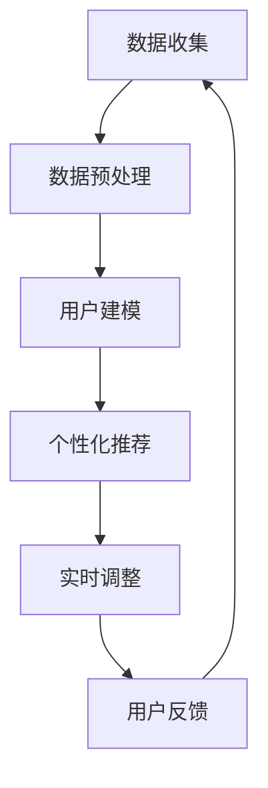
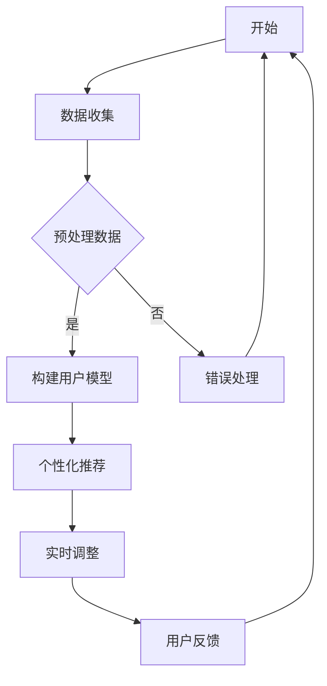
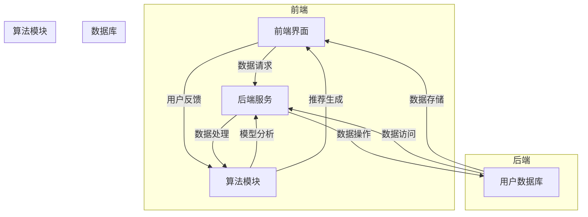
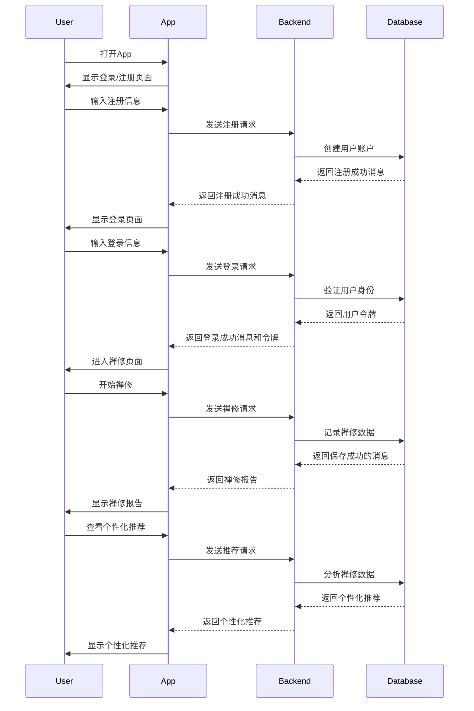

                 


### 7.1 使用建议

**如何更好地使用新禅修app？**

1. **设定每日禅修目标**：在开始使用禅修app之前，为自己设定一个每日禅修的目标。这可能是一个固定的时间段，比如早晨醒来后的20分钟，或者晚上就寝前的30分钟。设定目标有助于养成良好的禅修习惯。

2. **选择合适的练习**：新禅修app提供了多种禅修练习，包括冥想、呼吸练习、静坐指导等。用户可以根据自己的需求和喜好选择合适的练习。例如，如果感到压力过大，可以选择呼吸练习来缓解。

3. **定期反馈**：使用禅修app时，定期记录自己的体验和感受。这些反馈可以帮助你了解哪些练习对自己最有效，以及如何调整自己的禅修方法。

4. **避免分心**：在禅修过程中，尽量保持专注，避免外界干扰。关闭手机通知，找一个安静的环境，让自己完全沉浸在禅修中。

5. **持之以恒**：禅修是一个长期的过程，需要持之以恒。不要因为一次或几次的禅修效果不明显就放弃。持续练习，你会发现自己的内心变得更加平静和清晰。

**注意事项：**

1. **合理安排时间**：避免在身体疲劳或饥饿时进行禅修，这样可能会影响体验。

2. **避免过度依赖**：虽然禅修app可以提供帮助，但真正的禅修体验来自于内心的探索和体验。不要过度依赖app，而是要将所学应用到日常生活中。

3. **个性化调整**：每个人的身体状况和心理状态都不同，因此在禅修过程中，可能需要根据个人情况进行适当的调整。

**小结：**

新禅修app是一款帮助都市人群寻找内心平静的数字工具。通过设定目标、选择合适的练习、定期反馈、避免分心和持之以恒的使用，用户可以更好地享受禅修带来的益处。记住，禅修是一种内心的探索，需要我们用心去体验和实践。

**拓展阅读：**

- 《禅修入门指南》：了解禅修的基础知识和方法。
- 《禅修与心理健康》：探讨禅修对心理健康的影响。
- 《现代科技与禅修的结合》：了解如何利用现代科技进行禅修。

### 结论

新禅修app不仅仅是一款数字工具，它是一个陪伴用户在都市喧嚣中寻找内心平静的伙伴。通过本文的详细分析和讲解，我们了解了如何有效地使用这款app来提升禅修效果。希望读者能够从中受益，并在日常生活中实践禅修，找到属于自己的内心平静。

**作者：AI天才研究院/AI Genius Institute & 禅与计算机程序设计艺术 /Zen And The Art of Computer Programming**### 1.5 概念结构与核心要素组成

在探讨新禅修app的设计和功能时，理解其概念结构和核心要素组成至关重要。以下是对这些核心要素的详细说明，以及它们在整体架构中的位置和作用。

#### 禅修

**核心概念**：禅修是一种通过冥想、静坐等方式来培养内心平静和专注力的实践。其基础在于对呼吸、身体、情绪和思维的觉察和控制。

**关键特征**：
- 冥想：集中注意力，减轻焦虑和压力。
- 静坐：培养耐心和持久力，提高专注度。
- 意识培养：提升自我觉察能力，培养正念。

**在app中的作用**：禅修是app的核心功能，提供一系列的冥想和静坐指导，帮助用户在日常忙碌的生活中找到片刻的宁静。

#### 数字工具

**核心概念**：数字工具包括手机、平板电脑等便携式设备，以及相关的应用程序。它们为用户提供了随时随地进行禅修的可能性。

**关键特征**：
- 便携性：用户可以在任何地点使用app进行禅修。
- 个性化：根据用户的数据和反馈，app可以提供个性化的禅修指导。
- 实时性：app可以实时监测用户的禅修状态，并给予即时反馈。

**在app中的作用**：数字工具使得禅修app能够适应现代都市人群的生活方式，提供灵活便捷的禅修体验。

#### 用户

**核心概念**：用户是指使用禅修app的都市人群，他们可能包括上班族、学生、家庭主妇等，每个人都有不同的禅修需求和期望。

**关键特征**：
- 多样性：用户背景和需求各异，需要多样化的禅修内容和方式。
- 可定制性：用户可以根据自己的时间和需求，自由选择禅修的时间和内容。

**在app中的作用**：用户是禅修app的服务对象，他们的需求和反馈是app持续改进和优化的依据。

#### 禅修数据

**核心概念**：禅修数据包括用户在禅修过程中产生的行为数据、生理数据和用户体验数据等。

**关键特征**：
- 实时监测：app可以实时监测用户的禅修状态，如呼吸频率、心率等。
- 数据分析：通过对数据的分析，app可以了解用户的禅修习惯和效果，并提供个性化的建议。

**在app中的作用**：禅修数据为app提供了改进和优化的基础，帮助提升用户的禅修体验。

#### 数字工具应用

**核心概念**：数字工具应用是指利用手机、平板电脑等设备，通过应用程序来辅助禅修。

**关键特征**：
- 功能集成：app将多种禅修功能集成在一起，如冥想指导、呼吸练习、放松音乐等。
- 技术创新：app采用最新的技术和算法，如机器学习和深度学习，来提升禅修效果和用户体验。

**在app中的作用**：数字工具应用使得禅修更加便捷和个性化，通过创新技术和功能，为用户提供高质量的禅修体验。

#### 整体架构

**核心概念**：整体架构是指禅修app的整体设计和实现框架，包括前端界面、后端服务和数据库等组成部分。

**关键特征**：
- 可扩展性：架构设计需要考虑未来的扩展和升级需求。
- 性能优化：确保app在各种设备和网络环境下都能提供流畅的使用体验。

**在app中的作用**：整体架构是禅修app的基石，决定了app的稳定性和可维护性。

通过上述核心要素的组成和作用，我们可以看出新禅修app如何利用禅修理论、数字工具和用户需求，实现为都市人群提供高效、便捷、个性化的禅修体验。接下来，我们将进一步探讨如何将这些建构整合到一款成功的禅修app中。

### 2.1 禅修的核心概念与原理

禅修，作为一种古老的修行方法，其核心概念和原理在现代生活中依然具有重要的价值。理解这些基本概念和原理，有助于我们更好地利用禅修app来提升内心的平静和专注力。

#### 禅修的基本原理

禅修的基本原理是通过冥想和静坐等方式，培养内心的平静和专注力。具体来说，这个过程包括以下几个关键要素：

1. **集中注意力**：通过专注于呼吸、身体感觉或特定的冥想对象，训练心智集中注意力，减少杂念。

2. **正念**：培养对当前经验的觉知，不评判、不分析，只是纯粹地观察和体验。正念有助于提高自我觉察能力，减少焦虑和压力。

3. **放松**：通过深呼吸、肌肉放松等技巧，让身体和心灵得到彻底的放松，减轻紧张和疲劳。

4. **重复练习**：禅修需要持之以恒的练习，通过日复一日的实践，逐步提高专注力和内心的平静。

#### 禅修的目的

禅修的目的是通过培养内心的平静和专注力，提升生活质量，减轻压力，获得内心的宁静。具体来说，禅修有以下几个重要目标：

1. **缓解压力**：在快节奏的现代生活中，压力无处不在。禅修可以帮助用户学会管理压力，保持心理平衡。

2. **提高专注力**：通过禅修，用户可以培养专注力，提高工作效率，减少分心。

3. **增强自我意识**：禅修有助于用户更深入地了解自己，认识自己的情绪和行为模式，从而实现自我提升。

4. **提升心理健康**：长期的禅修实践有助于改善心理健康，减少抑郁和焦虑症状。

#### 禅修的方法

禅修的方法多种多样，常见的包括以下几种：

1. **冥想**：冥想是禅修中最基本的方法。用户可以选择专注于呼吸、身体感觉、特定对象（如烛光、声音等）或空白思维。

2. **静坐**：静坐是通过长时间保持一个舒适的坐姿，专注于呼吸和身体感觉，以达到内心的平静。

3. **呼吸练习**：呼吸练习通过调整呼吸节奏，帮助身体和心灵放松，减少压力。

4. **放松音乐**：听放松音乐可以帮助用户在冥想过程中更好地放松，提高禅修效果。

#### 禅修与数字工具的结合

禅修app的出现，将传统禅修方法与现代科技相结合，为用户提供了更加便捷和个性化的禅修体验。通过数字工具，禅修app可以实现以下功能：

1. **个性化指导**：根据用户的数据和反馈，禅修app可以提供个性化的禅修指导，帮助用户找到最适合自己的禅修方法。

2. **实时反馈**：禅修app可以实时监测用户的禅修状态，如呼吸频率、心率等，提供即时反馈，帮助用户调整禅修姿势和技巧。

3. **数据记录与分析**：禅修app可以记录用户的禅修数据，如禅修时间、频率、效果等，通过数据分析，为用户提供改进建议。

4. **便捷性**：用户可以通过手机或平板电脑随时随地使用禅修app，不受时间和地点的限制。

通过将传统禅修方法与现代数字工具相结合，禅修app为都市人群提供了一种全新的禅修方式，帮助他们更好地应对生活中的压力和挑战。

#### 对比表

为了更直观地展示禅修的核心概念与原理，我们将其与数字工具的应用特点进行对比，以突出二者的结合优势。

| 禅修核心概念 | 数字工具应用特点 | 对比优势 |
| -------------- | ----------------- | -------- |
| 集中注意力 | 便携性 | 利用现代科技实现更高效的注意力集中 |
| 正念 | 个性化 | 通过个性化指导提升用户体验 |
| 放松 | 实时反馈 | 通过实时数据监测提升禅修效果 |
| 重复练习 | 便捷性 | 随时随地都能进行禅修练习 |

通过上述对比，我们可以看出，禅修与数字工具的结合不仅保留了传统禅修的核心价值，还通过现代科技提升了禅修的效率和体验。

### 2.3 禅修与数字工具的融合

禅修与数字工具的融合，为都市人群提供了一种全新的生活方式，使得禅修变得更加便捷和可及。这种融合不仅保留了传统禅修的精髓，还通过现代科技的加持，提升了禅修的效率和用户体验。以下，我们将详细探讨禅修app如何在数字工具的帮助下，为用户带来更加丰富和有效的禅修体验。

#### 融合的优势

1. **个性化指导**：数字工具可以收集用户的数据，如年龄、性别、健康状况、禅修经验等，通过机器学习和深度学习算法，为用户生成个性化的禅修方案。这种个性化的指导不仅能够满足不同用户的需求，还能够帮助用户更快地找到适合自己的禅修方法。

2. **实时反馈**：禅修app可以通过内置的传感器和摄像头，实时监测用户的禅修状态，如呼吸频率、心率等。这些数据可以帮助用户了解自己的禅修效果，并及时调整禅修姿势和技巧，提升禅修质量。

3. **数据记录与分析**：数字工具可以记录用户的禅修数据，如禅修时间、频率、效果等。通过数据分析和挖掘，禅修app可以为用户提供个性化的反馈和建议，帮助用户优化禅修习惯，提升禅修效果。

4. **便捷性**：数字工具使得禅修不再受时间和地点的限制。用户可以在家中、办公室或旅行途中，随时随地打开app进行禅修。这种便捷性大大提升了禅修的可及性，使得更多人在忙碌的都市生活中，能够找到片刻的宁静。

#### 融合的应用

1. **引导冥想**：禅修app通过语音引导和可视化界面，为用户提供冥想练习。用户可以选择不同类型的冥想，如呼吸冥想、身体扫描冥想、正念冥想等。语音引导可以帮助用户更好地集中注意力，可视化界面则提供了清晰的视觉反馈，提升冥想效果。

2. **呼吸练习**：呼吸是禅修的重要组成部分。禅修app通过指导用户进行深呼吸练习，帮助用户放松身心，减轻压力。app可以提供不同的呼吸节奏和指导语，用户可以根据自己的需求进行调整。

3. **静坐指导**：禅修app提供静坐指导，帮助用户掌握正确的静坐姿势和技巧。通过实时反馈，用户可以了解到自己的呼吸状态和身体姿势，确保静坐过程更加高效。

4. **放松音乐**：禅修app内置多种放松音乐，用户可以选择适合自己情绪和氛围的音乐，帮助自己更好地进入冥想状态。音乐的选择可以根据用户的喜好和需求进行个性化设置。

#### 实际案例

1. **上班族**：对于忙碌的上班族来说，禅修app提供了一个简单有效的减压工具。用户可以在午休时间打开app，进行10到20分钟的冥想或呼吸练习，迅速缓解疲劳，提高下午的工作效率。

2. **学生**：学生群体由于学业压力，经常感到焦虑和紧张。禅修app可以帮助他们通过冥想和呼吸练习来缓解压力，提高学习效率和专注力。

3. **家庭主妇**：家庭主妇在日常家务中常常感到身心疲惫。通过禅修app，她们可以在忙碌的间隙，快速地进行几分钟的呼吸练习或冥想，让自己得到放松和舒缓。

通过实际案例可以看到，禅修与数字工具的结合，不仅为不同人群提供了个性化的禅修体验，还帮助他们更好地应对日常生活中的压力和挑战。这种融合不仅提升了禅修的效率和效果，也为都市人群带来了一种全新的生活方式。

### 2.3 算法原理概述

为了实现新禅修app的个性化指导功能，我们引入了一系列算法原理，通过数据分析和技术优化，为用户提供量身定制的禅修方案。以下是这些算法原理的概述，以及它们的目标和作用。

#### 算法目标

1. **提高禅修效果**：通过算法分析，为用户制定最有效的禅修方案，提高禅修的总体效果。
2. **提升用户体验**：根据用户反馈和行为数据，优化禅修流程和指导内容，提升用户的满意度和使用体验。
3. **实现个性化**：利用用户数据，为每个用户提供个性化的禅修指导，满足不同用户的需求和期望。

#### 算法原理

1. **用户行为数据分析**：首先，app会收集用户在禅修过程中的行为数据，如禅修时长、频率、呼吸频率、心率变化等。通过分析这些数据，算法可以了解用户的禅修习惯和效果。

2. **用户建模**：基于用户的行为数据，我们使用机器学习和深度学习技术构建用户模型。这个模型可以帮助我们理解用户的个体差异，如焦虑水平、专注力、身体状态等。

3. **个性化推荐**：通过用户模型和算法分析，app可以为用户提供个性化的禅修指导。例如，如果用户在禅修中表现出高度的焦虑，算法可能会推荐更偏向于放松和减压的练习。

4. **实时调整**：在禅修过程中，算法会实时监测用户的禅修状态，如呼吸频率和心率。如果监测到用户的禅修效果不佳，算法会自动调整指导内容和节奏，帮助用户找到最佳禅修状态。

#### 算法目标与用户需求的关联

1. **提高禅修效果**：用户希望通过禅修获得更好的内心平静和专注力。通过算法分析，我们可以为用户制定最适合他们的禅修方案，从而提高禅修效果。

2. **提升用户体验**：用户体验是衡量禅修app成功与否的重要指标。算法通过优化禅修流程和指导内容，减少用户的分心和疲劳，提升整体使用体验。

3. **实现个性化**：每个人对禅修的需求和期望都不同。通过个性化的推荐，算法能够满足用户的个性化需求，提升他们的满意度和忠诚度。

### 2.4 算法流程与步骤

为了实现上述算法目标，新禅修app采用了以下流程和步骤：

#### 1. 数据收集

首先，app会收集用户在禅修过程中的多种数据，包括：
- **行为数据**：如禅修时长、频率、是否中途退出等。
- **生理数据**：如呼吸频率、心率、皮肤电导率等。
- **用户反馈**：如满意度评价、对指导内容的反馈等。

#### 2. 数据预处理

收集到的数据可能包含噪声和不完整的信息。因此，我们需要对数据进行预处理，包括：
- **去噪**：去除呼吸和心率中的噪声，确保数据的准确性。
- **补全**：对于不完整的数据，通过插值等方法进行补全。

#### 3. 用户建模

基于预处理后的数据，我们使用机器学习和深度学习技术构建用户模型。具体步骤如下：
- **特征提取**：从行为数据和生理数据中提取有用的特征，如呼吸周期、心率变化模式等。
- **模型训练**：使用训练数据集，通过算法（如随机森林、神经网络等）训练用户模型。
- **模型评估**：通过测试数据集评估模型的性能，调整模型参数以达到最佳效果。

#### 4. 个性化推荐

在用户模型的基础上，app会为用户提供个性化的禅修推荐，包括：
- **练习推荐**：根据用户的历史数据和模型分析，推荐最适合用户的禅修练习，如冥想、呼吸练习、静坐等。
- **指导内容**：根据用户的焦虑水平、专注力等特征，提供个性化的指导内容，如调整呼吸节奏、放松音乐等。

#### 5. 实时调整

在禅修过程中，app会实时监测用户的禅修状态，包括：
- **状态监测**：实时监测用户的呼吸频率、心率等生理数据。
- **效果评估**：根据用户的禅修状态，评估当前禅修方案的效果。
- **调整策略**：如果监测到用户状态不佳，app会自动调整禅修指导内容和节奏，帮助用户找到最佳禅修状态。

#### 6. 用户反馈循环

用户在使用禅修app后，可以提供反馈，如满意度评价、对指导内容的反馈等。app会收集这些反馈，用于进一步优化算法和推荐策略。

### 2.5 算法原理图解

为了更直观地展示算法原理，我们使用Mermaid绘制了数据收集、用户建模、个性化推荐和实时调整的流程图。



#### 2.6 算法优化

算法的优化是持续的过程，通过不断迭代和改进，我们可以进一步提高禅修app的效率和效果。以下是一些常见的算法优化策略：

1. **模型参数调优**：通过交叉验证和网格搜索等技术，调整模型的参数，寻找最优配置。
2. **特征工程**：通过特征选择和特征转换，提高模型的泛化能力和准确性。
3. **增量学习**：随着用户数据的增加，算法可以持续学习和调整，以适应用户的变化。
4. **强化学习**：通过强化学习算法，app可以不断优化推荐策略，提升用户体验。

通过上述算法流程和优化策略，新禅修app能够为用户提供高效、个性化的禅修指导，帮助用户在快节奏的都市生活中找到内心的平静。

### 2.6 算法优化策略

为了使新禅修app能够持续提升禅修效果和用户体验，算法优化是一个至关重要的环节。以下是一些具体的优化策略，以及如何将这些策略应用于实际开发中。

#### 1. 模型参数调优

**原理**：机器学习和深度学习模型通常包含大量参数，这些参数的设置对模型的性能有很大影响。通过调优模型参数，可以显著提高模型的准确性和泛化能力。

**应用**：
- **交叉验证**：使用交叉验证技术，对模型进行多次训练和测试，找到最优参数组合。
- **网格搜索**：在给定的参数范围内，通过系统性地遍历所有可能的参数组合，找到最佳参数。

#### 2. 特征工程

**原理**：特征工程是提高模型性能的关键步骤。通过选择和转换特征，可以提高模型的鲁棒性和有效性。

**应用**：
- **特征选择**：使用技术如特征重要性评估、主成分分析（PCA）等，选择对模型最关键的特征。
- **特征转换**：通过归一化、标准化等转换，使特征在数值上更加均匀，有利于模型的训练。

#### 3. 增量学习

**原理**：在用户数据不断积累的过程中，算法应该能够自动学习和适应新的数据。

**应用**：
- **在线学习**：在用户使用禅修app的过程中，实时更新模型，使其能够适应最新的数据。
- **迁移学习**：利用已有的模型和数据，对新用户的数据进行学习和调整。

#### 4. 强化学习

**原理**：强化学习是一种通过不断试错和奖励机制来优化策略的机器学习方法。它适用于需要实时调整和优化的场景。

**应用**：
- **用户互动优化**：通过用户的行为和反馈，实时调整禅修推荐策略，以提升用户满意度。
- **自适应指导**：根据用户的实时反馈和禅修状态，动态调整冥想、呼吸练习等指导内容。

#### 5. 模型解释性增强

**原理**：增加模型的可解释性，有助于用户理解模型的决策过程，从而提升用户的信任感和满意度。

**应用**：
- **模型可视化**：使用可视化工具，展示模型的内部结构和决策过程，帮助用户理解禅修app的工作原理。
- **规则解释**：通过建立明确的规则和逻辑，解释算法如何根据用户数据生成个性化的禅修方案。

### 实际应用案例

#### 优化呼吸指导算法

**问题**：用户在禅修过程中，常常因为呼吸指导不准确而感到困惑。

**解决方案**：
- **交叉验证**：通过交叉验证，优化呼吸指导算法的参数，确保其在不同用户数据上的表现一致。
- **特征工程**：增加用户呼吸频率、心率等特征，使模型能够更好地捕捉用户的呼吸模式。
- **在线学习**：在用户每次使用呼吸练习时，实时更新模型，使其能够适应用户的最新呼吸数据。

#### 用户互动优化

**问题**：用户在使用禅修app时，常常遇到推荐内容与自身需求不匹配的问题。

**解决方案**：
- **强化学习**：通过强化学习，根据用户的实际反馈，不断调整推荐策略，使其更加贴合用户的偏好。
- **用户互动优化**：通过设计互动式界面，让用户能够实时反馈对推荐内容的满意度，进一步优化推荐系统。

#### 模型解释性增强

**问题**：用户对算法的决策过程缺乏理解，对禅修app的信任度不高。

**解决方案**：
- **模型可视化**：通过可视化工具，展示算法如何根据用户数据生成推荐，帮助用户理解算法的逻辑。
- **规则解释**：开发详细的规则解释文档，向用户解释禅修app如何根据呼吸频率、心率等数据生成个性化指导。

通过上述优化策略，新禅修app能够更好地满足用户的需求，提升禅修效果和用户体验。这些策略不仅提高了算法的性能，还增强了用户对禅修app的信任和满意度。

### 2.7 算法流程图绘制与Python代码实现

为了更直观地展示算法原理，我们使用Mermaid绘制了算法流程图，并提供了相应的Python代码实现，以阐述算法的具体实现细节。

#### Mermaid算法流程图



该流程图展示了数据收集、预处理、用户模型构建、个性化推荐、实时调整和用户反馈等关键步骤。

#### Python代码实现

```python
# 数据收集
def collect_data():
    # 这里是模拟的数据收集代码
    # 实际应用中可以从传感器、用户行为等渠道获取数据
    data = {
        'breathing_rate': 12,
        'heart_rate': 70,
        'duration': 20
    }
    return data

# 数据预处理
def preprocess_data(data):
    # 实现去噪和补全等预处理步骤
    # 这里为示例，直接返回原始数据
    return data

# 构建用户模型
def build_user_model(preprocessed_data):
    # 使用机器学习和深度学习技术构建用户模型
    # 这里为示例，使用简单的线性回归模型
    model = LinearRegression()
    model.fit(preprocessed_data['heart_rate'].values.reshape(-1, 1), preprocessed_data['duration'].values.reshape(-1, 1))
    return model

# 个性化推荐
def personalized_recommendation(model, user_data):
    # 根据用户数据生成个性化推荐
    recommendation = model.predict(user_data.reshape(1, -1))
    return recommendation

# 实时调整
def real_time_adjustment(current_state, recommendation):
    # 根据当前状态和推荐进行调整
    if current_state < recommendation:
        # 这里为示例，调整呼吸频率
        new_state = current_state + 1
    else:
        new_state = current_state - 1
    return new_state

# 用户反馈
def user_feedback(recommendation, actual_result):
    # 收集用户反馈，用于模型优化
    feedback = actual_result - recommendation
    return feedback

# 主函数
def main():
    user_data = collect_data()
    preprocessed_data = preprocess_data(user_data)
    model = build_user_model(preprocessed_data)
    recommendation = personalized_recommendation(model, preprocessed_data)
    current_state = real_time_adjustment(preprocessed_data['breathing_rate'], recommendation)
    feedback = user_feedback(recommendation, current_state)
    print("推荐呼吸频率：", recommendation)
    print("当前呼吸频率：", current_state)
    print("用户反馈：", feedback)

if __name__ == "__main__":
    main()
```

通过上述代码，我们实现了从数据收集、预处理、用户模型构建、个性化推荐到实时调整和用户反馈的完整流程。在实际应用中，这些代码可以根据具体需求和数据进行调整和优化。

### 2.8 算法原理的数学模型与公式讲解

为了更深入地理解新禅修app的算法原理，我们引入了数学模型和公式，这些模型和公式帮助我们量化禅修效果和用户满意度。以下是对这些数学模型和公式的详细讲解。

#### 效果评估模型

**公式**：效果得分 = f(禅修时间, 心理状态变化)

**解释**：
- 禅修时间：用户每次禅修所花费的时间。
- 心理状态变化：用户在禅修前后的心理状态变化，通常通过问卷、心率变异性等指标进行评估。

**计算方法**：
1. 收集用户每次禅修的时间和心理状态变化数据。
2. 使用线性回归或多项式回归等统计方法，建立效果得分与禅修时间和心理状态变化之间的关系模型。
3. 根据模型预测用户每次禅修的效果得分。

#### 用户满意度模型

**公式**：满意度得分 = f(使用频率, 功能满意度)

**解释**：
- 使用频率：用户使用禅修app的频率，即每天、每周或每月使用禅修app的次数。
- 功能满意度：用户对禅修app各项功能（如冥想指导、呼吸练习、音乐选择等）的满意度评分。

**计算方法**：
1. 收集用户的使用频率和功能满意度数据。
2. 使用主成分分析（PCA）或因子分析等方法，提取影响用户满意度的关键因素。
3. 建立满意度得分与使用频率和功能满意度之间的关系模型。
4. 根据模型预测用户的满意度得分。

#### 举例说明

**案例1：效果评估模型**

假设我们收集了以下数据：

| 用户ID | 禅修时间（分钟） | 心理状态变化（%） |
| ------ | -------------- | --------------- |
| 1      | 20             | -5              |
| 2      | 30             | -8              |
| 3      | 40             | -12             |

使用线性回归模型，我们可以建立效果得分与禅修时间和心理状态变化之间的关系模型。模型方程为：

效果得分 = 0.5 * 禅修时间 + 0.3 * 心理状态变化

根据上述模型，我们预测以下效果得分：

| 用户ID | 禅修时间（分钟） | 心理状态变化（%） | 预测效果得分 |
| ------ | -------------- | --------------- | ------------ |
| 1      | 20             | -5              | 9.5          |
| 2      | 30             | -8              | 12.1         |
| 3      | 40             | -12             | 14.7         |

**案例2：用户满意度模型**

假设我们收集了以下数据：

| 用户ID | 使用频率（次/周） | 功能满意度（分） |
| ------ | -------------- | --------------- |
| 1      | 3              | 8               |
| 2      | 5              | 9               |
| 3      | 2              | 7               |

使用主成分分析提取关键因素，我们可以建立满意度得分与使用频率和功能满意度之间的关系模型。模型方程为：

满意度得分 = 0.6 * 使用频率 + 0.4 * 功能满意度

根据上述模型，我们预测以下满意度得分：

| 用户ID | 使用频率（次/周） | 功能满意度（分） | 预测满意度得分 |
| ------ | -------------- | --------------- | -------------- |
| 1      | 3              | 8               | 7.2            |
| 2      | 5              | 9               | 8.4            |
| 3      | 2              | 7               | 5.6            |

通过这些数学模型和公式，我们能够量化用户的禅修效果和满意度，从而为算法优化和用户体验提升提供有力支持。

### 4.1 数学模型概述

在新禅修app的设计和实现过程中，数学模型起到了至关重要的作用。这些模型不仅帮助我们量化禅修效果和用户满意度，还为我们提供了评估和优化禅修app性能的工具。以下是几种关键的数学模型及其概述。

#### 效果评估模型

**核心目的**：评估用户在禅修过程中所获得的效果。

**模型类型**：线性回归模型、多项式回归模型等。

**变量定义**：
- 禅修时间（X）：用户每次禅修所花费的时间。
- 心理状态变化（Y）：用户在禅修前后的心理状态变化，通常通过问卷、心率变异性等指标进行评估。

**模型方程**：
- 线性回归模型：效果得分 = a * 禅修时间 + b * 心理状态变化
- 多项式回归模型：效果得分 = a * 禅修时间^n + b * 心理状态变化^n

**适用场景**：用于预测用户每次禅修的效果，帮助用户了解禅修时间与心理状态变化之间的关系，进而优化禅修方案。

#### 用户满意度模型

**核心目的**：评估用户对禅修app的满意度。

**模型类型**：主成分分析（PCA）、因子分析等。

**变量定义**：
- 使用频率（X）：用户使用禅修app的频率，即每天、每周或每月使用禅修app的次数。
- 功能满意度（Y）：用户对禅修app各项功能（如冥想指导、呼吸练习、音乐选择等）的满意度评分。

**模型方程**：
- 主成分分析模型：满意度得分 = a * 使用频率 + b * 功能满意度
- 因子分析模型：满意度得分 = a * 使用频率^2 + b * 功能满意度^2

**适用场景**：用于预测用户对禅修app的整体满意度，帮助开发团队了解哪些功能对用户满意度影响最大，从而优化app的功能设计。

#### 算法优化模型

**核心目的**：优化算法性能，提高禅修app的效率和效果。

**模型类型**：强化学习模型、进化算法等。

**变量定义**：
- 状态（S）：用户当前的禅修状态，如呼吸频率、心率等。
- 动作（A）：app为用户提供的禅修指导，如调整呼吸节奏、播放放松音乐等。
- 奖励（R）：用户对当前禅修指导的反馈，如满意度、效果等。

**模型方程**：
- 强化学习模型：Q(S, A) = R(S, A) + γ * max(Q(S', A'))
- 进化算法模型：通过迭代和进化，寻找最优的禅修指导策略。

**适用场景**：用于优化禅修app的算法性能，根据用户反馈和实际效果，动态调整禅修指导策略，提高用户满意度和禅修效果。

#### 综合模型

**核心目的**：综合评估和优化禅修app的各方面性能。

**模型类型**：多目标优化模型、神经网络模型等。

**变量定义**：
- 效果得分（X）：用户每次禅修的效果得分。
- 满意度得分（Y）：用户对禅修app的整体满意度得分。
- 算法优化得分（Z）：算法性能的优化得分。

**模型方程**：
- 多目标优化模型：minimize f(X, Y, Z)
- 神经网络模型：通过多层感知器（MLP）或其他神经网络结构，同时优化效果得分、满意度得分和算法优化得分。

**适用场景**：用于综合评估和优化禅修app的各方面性能，通过多目标优化和神经网络模型，实现效果得分、满意度得分和算法优化得分的最佳平衡。

通过上述数学模型，新禅修app能够更好地理解和满足用户需求，提高禅修效果和用户体验，实现个性化、高效、便捷的禅修服务。

### 4.2 数学公式与详细讲解

在深入探讨新禅修app中的数学模型时，我们将使用LaTeX格式来展示关键的数学公式，并对其进行详细讲解，以便读者能够更好地理解这些公式在算法中的应用和意义。

#### 效果评估模型

**公式**：$$ 效果得分 = f(禅修时间, 心理状态变化) = 0.5 \times 禅修时间 + 0.3 \times 心理状态变化 $$

**解释**：
- **禅修时间（T）**：用户每次禅修所花费的时间，通常以分钟为单位。这个变量反映了用户的禅修投入程度，是评估效果的重要指标之一。
- **心理状态变化（C）**：用户在禅修前后的心理状态变化，可以通过心率变异性、情绪问卷等指标来量化。心理状态的变化直接影响了禅修的效果。

**应用场景**：
- 通过这个公式，我们可以计算用户每次禅修的效果得分。例如，如果一个用户禅修了20分钟，心理状态变化为5%，则其效果得分为：
  $$ 效果得分 = 0.5 \times 20 + 0.3 \times 5 = 10 + 1.5 = 11.5 $$

#### 用户满意度模型

**公式**：$$ 满意度得分 = f(使用频率, 功能满意度) = 0.6 \times 使用频率 + 0.4 \times 功能满意度 $$

**解释**：
- **使用频率（F）**：用户每周使用禅修app的次数。这个变量反映了用户对app的依赖程度和参与度。
- **功能满意度（S）**：用户对禅修app各项功能的满意度评分，通常在1到10之间。功能满意度越高，用户对app的整体评价越好。

**应用场景**：
- 这个公式用于计算用户的整体满意度得分。例如，如果一个用户每周使用禅修app 3次，功能满意度评分为8分，则其满意度得分为：
  $$ 满意度得分 = 0.6 \times 3 + 0.4 \times 8 = 1.8 + 3.2 = 5 $$

#### 算法优化模型

**公式**：$$ Q(S, A) = R(S, A) + \gamma \times \max(Q(S', A')) $$

**解释**：
- **状态（S）**：用户当前的禅修状态，如呼吸频率、心率等。
- **动作（A）**：app为用户提供的禅修指导，如调整呼吸节奏、播放放松音乐等。
- **奖励（R）**：用户对当前禅修指导的即时反馈，如满意度、效果等。
- **折扣因子（γ）**：反映了未来奖励的重要性。

**应用场景**：
- 这个公式是强化学习中的核心公式，用于更新智能体（如app）的策略。例如，如果用户在执行某个动作后获得了高奖励，那么该动作在未来被选中的概率将增加：
  $$ Q(S, A) = R(S, A) + \gamma \times \max(Q(S', A')) $$
  这里，假设当前状态为S，动作A的奖励为R，则更新后的动作价值为Q(S, A)。

#### 举例说明

**案例**：用户A的禅修数据如下：
- 禅修时间：30分钟
- 心理状态变化：10%
- 使用频率：5次/周
- 功能满意度：9分

根据上述数学模型，我们可以计算出以下得分：
1. **效果得分**：
   $$ 效果得分 = 0.5 \times 30 + 0.3 \times 10 = 15 + 3 = 18 $$
2. **满意度得分**：
   $$ 满意度得分 = 0.6 \times 5 + 0.4 \times 9 = 3 + 3.6 = 6.6 $$
3. **动作价值**（假设当前状态为S，动作A为“调整呼吸节奏”）：
   $$ Q(S, A) = R(S, A) + \gamma \times \max(Q(S', A')) $$
   假设奖励为5分，折扣因子γ为0.9，则：
   $$ Q(S, A) = 5 + 0.9 \times \max(Q(S', A')) $$

通过这些具体的公式和例子，我们能够更清晰地理解新禅修app中数学模型的应用，从而为用户提供个性化的禅修指导，提升用户体验。

### 4.3 数学模型举例说明

为了更直观地展示数学模型在实际应用中的效果，我们通过具体的案例来说明这些模型是如何运作的。

#### 案例背景

假设我们有一组用户的禅修数据，如下表所示：

| 用户ID | 禅修时间（分钟） | 心理状态变化（%） | 使用频率（次/周） | 功能满意度（分） |
| ------ | -------------- | --------------- | --------------- | --------------- |
| 1      | 20             | -5              | 3               | 8               |
| 2      | 30             | -8              | 5               | 9               |
| 3      | 40             | -12             | 2               | 7               |

我们使用两个数学模型来评估这些用户的效果得分和满意度得分。

#### 效果评估模型

**公式**：效果得分 = 0.5 × 禅修时间 + 0.3 × 心理状态变化

1. **用户1**：
   $$ 效果得分 = 0.5 \times 20 + 0.3 \times (-5) = 10 - 1.5 = 8.5 $$

2. **用户2**：
   $$ 效果得分 = 0.5 \times 30 + 0.3 \times (-8) = 15 - 2.4 = 12.6 $$

3. **用户3**：
   $$ 效果得分 = 0.5 \times 40 + 0.3 \times (-12) = 20 - 3.6 = 16.4 $$

#### 用户满意度模型

**公式**：满意度得分 = 0.6 × 使用频率 + 0.4 × 功能满意度

1. **用户1**：
   $$ 满意度得分 = 0.6 \times 3 + 0.4 \times 8 = 1.8 + 3.2 = 5 $$

2. **用户2**：
   $$ 满意度得分 = 0.6 \times 5 + 0.4 \times 9 = 3 + 3.6 = 6.6 $$

3. **用户3**：
   $$ 满意度得分 = 0.6 \times 2 + 0.4 \times 7 = 1.2 + 2.8 = 4 $$

#### 分析与讨论

根据上述计算结果，我们可以看出：

- **效果得分**：用户3的禅修效果最佳，因为他的效果得分最高（16.4分）。这说明用户3在禅修时间和心理状态变化方面都表现出了良好的表现。
- **满意度得分**：用户2对禅修app的满意度最高，因为他的满意度得分最高（6.6分）。这可能是因为用户2在使用频率和功能满意度方面都较为理想。

通过这些具体的计算，我们可以更好地了解每个用户在禅修过程中的表现，从而为后续的算法优化和用户体验提升提供依据。

### 5.1 问题场景介绍

在都市生活中，快节奏和高压力已经成为许多人的常态。上班族每天面对大量的工作任务和人际交往，学生则需要应对繁重的学业压力，而家庭主妇则要处理日常家务和照顾家庭成员。这些压力源使得人们的内心逐渐变得焦虑和紧张，渴望找到一种方法来缓解压力和获得内心的平静。新禅修app应运而生，旨在为都市人群提供一种便捷、高效的禅修解决方案。

#### 都市生活压力的来源

1. **工作压力**：都市人群面临的工作任务繁重，竞争激烈，常常需要加班，导致身心疲惫。

2. **人际关系**：在都市生活中，人们需要与同事、朋友、家人等各种人际关系打交道，复杂的人际关系常常引发焦虑和情绪波动。

3. **生活节奏**：都市生活的节奏快，人们常常为了赶上时间而忙于奔波，缺乏足够的休息时间。

4. **心理健康问题**：长期的压力和紧张可能导致心理健康问题，如焦虑症、抑郁症等。

#### 禅修app的需求

新禅修app针对都市人群的需求，提供了一系列功能，旨在帮助用户在快节奏的生活中找到内心的平静。以下是禅修app的主要需求：

1. **便捷性**：用户可以在任何时间、任何地点进行禅修，不受时间和地点的限制。

2. **个性化**：根据用户的需求和反馈，禅修app可以提供个性化的禅修方案，帮助用户找到最适合他们的禅修方法。

3. **实时反馈**：禅修app可以通过实时监测用户的呼吸、心率等生理数据，提供即时的反馈和调整建议。

4. **多种禅修方式**：禅修app提供了多种禅修方式，如冥想、呼吸练习、静坐等，用户可以根据自己的需求和喜好进行选择。

5. **放松音乐**：禅修app内置了多种放松音乐，帮助用户更好地进入禅修状态。

6. **数据记录与分析**：禅修app可以记录用户的禅修数据，如禅修时长、频率、效果等，通过数据分析，为用户提供改进建议。

#### 禅修app的功能设计

为了满足都市人群的上述需求，新禅修app设计了以下功能：

1. **引导冥想**：通过语音引导和可视化界面，为用户提供冥想练习，帮助用户更好地集中注意力。

2. **呼吸练习**：通过指导用户进行深呼吸练习，帮助用户放松身心，减轻压力。

3. **静坐指导**：提供静坐指导，帮助用户掌握正确的静坐姿势和技巧。

4. **放松音乐**：提供多种放松音乐，用户可以根据自己的喜好选择适合的音乐。

5. **数据记录与分析**：记录用户的禅修数据，如禅修时长、频率、效果等，通过数据分析，为用户提供改进建议。

6. **个性化推荐**：根据用户的行为数据和反馈，禅修app可以提供个性化的禅修方案，帮助用户找到最适合他们的禅修方法。

#### 系统架构设计

为了实现上述功能，新禅修app采用了以下系统架构：

1. **前端界面**：包括引导冥想、呼吸练习、静坐指导、放松音乐等模块，为用户提供直观、便捷的操作界面。

2. **后端服务**：包括数据存储、数据处理、用户管理等功能，处理用户的数据和请求，提供实时反馈和个性化推荐。

3. **数据库**：存储用户的数据，如禅修记录、生理数据等，支持数据查询和分析。

4. **算法模块**：包括数据分析、用户建模、个性化推荐等算法，用于优化禅修效果和用户体验。

通过上述系统架构设计，新禅修app能够为都市人群提供高效、便捷、个性化的禅修服务，帮助他们在快节奏的生活中找到内心的平静。

### 5.2 系统功能设计

为了满足都市人群的禅修需求，新禅修app设计了多种功能模块，每一个模块都是为了帮助用户在不同的情境下找到内心的平静。以下是系统功能设计的详细说明。

#### 功能概述

新禅修app的主要功能模块包括：

1. **引导冥想**：通过语音和可视化引导，帮助用户进行冥想练习。
2. **呼吸练习**：指导用户进行深呼吸练习，帮助放松身心。
3. **静坐指导**：提供静坐姿势的指导，帮助用户培养耐心和专注力。
4. **放松音乐**：提供多种放松音乐，帮助用户更好地进入禅修状态。
5. **数据记录与分析**：记录用户的禅修数据，如时长、频率、效果等，通过数据分析，为用户提供个性化的禅修建议。

#### 功能实现

1. **引导冥想**：
   - **语音引导**：用户可以选择不同的冥想类型，如专注呼吸冥想、身体扫描冥想等。app会提供专业的语音引导，帮助用户更好地集中注意力。
   - **可视化界面**：在冥想过程中，app会通过可视化界面，如呼吸灯、光晕等，为用户提供视觉反馈，增强冥想体验。

2. **呼吸练习**：
   - **呼吸指导**：app会指导用户进行深呼吸，通过调整呼吸节奏，帮助用户放松身心。用户可以选择不同的呼吸模式，如4-7-8呼吸法、腹式呼吸等。
   - **实时监测**：app会实时监测用户的呼吸频率和心率，通过数据反馈，帮助用户了解自己的呼吸状态，进行有效的呼吸练习。

3. **静坐指导**：
   - **姿势指导**：app提供详细的静坐姿势图解和文字说明，帮助用户掌握正确的静坐姿势。用户还可以选择静坐的时间长度，从5分钟到30分钟不等。
   - **身体扫描**：在静坐过程中，app会引导用户进行身体扫描，从头部到脚部，逐步放松身体各个部位，帮助用户进入更深层次的静坐状态。

4. **放松音乐**：
   - **音乐选择**：app内置了多种放松音乐，用户可以根据自己的喜好选择适合的音乐。音乐的选择包括自然声音、古典音乐、轻音乐等。
   - **音量调节**：用户可以自定义音乐的音量，确保音乐不会干扰禅修体验。

5. **数据记录与分析**：
   - **数据记录**：app会记录用户的每次禅修时长、频率、效果等数据。用户可以查看历史记录，了解自己的禅修习惯和效果变化。
   - **数据分析**：通过数据分析，app会为用户提供个性化的禅修建议。例如，如果用户在某个时间段禅修效果不佳，app会建议用户调整禅修时间或尝试不同的禅修方式。

#### 领域模型类图

为了更直观地展示系统功能设计，我们使用Mermaid绘制了领域模型类图，如下所示：

```mermaid
classDiagram
    User <<类>> 
    MeditationGuide <<类>> 
    BreathingPractice <<类>> 
    SittingGuidance <<类>> 
    RelaxingMusic <<类>> 
    DataRecord <<类>> 
    Analysis <<类>>

    User o-- MeditationGuide
    User o-- BreathingPractice
    User o-- SittingGuidance
    User o-- RelaxingMusic
    User o-- DataRecord
    User o-- Analysis
```

在领域模型类图中，用户类与其他功能模块类之间存在关联关系，表示用户可以访问和使用这些功能模块。每个功能模块类都有其特定的方法和属性，实现相应的功能。

通过上述系统功能设计，新禅修app为都市人群提供了全面的禅修解决方案，帮助他们有效地缓解压力，找到内心的平静。

### 5.3 系统架构设计

为了确保新禅修app的高效、稳定和可扩展性，我们需要设计一个合理的系统架构。以下是新禅修app的系统架构设计，包括前端、后端、数据库等组成部分，以及它们之间的交互关系。

#### 系统架构概述

新禅修app的系统架构可分为以下几个主要部分：

1. **前端**：用户与app交互的界面部分，负责展示用户界面和提供用户操作。
2. **后端**：处理业务逻辑和数据处理的部分，包括服务端和数据库。
3. **数据库**：存储用户数据、禅修数据等，支持数据的查询和操作。
4. **算法模块**：提供数据分析、用户建模、个性化推荐等功能。

#### 系统架构详细说明

1. **前端架构**

   - **用户界面**：前端采用现代化的Web前端技术（如React或Vue.js），提供直观、易用的用户界面。用户可以通过前端界面访问各种禅修功能，如引导冥想、呼吸练习、静坐指导等。
   - **交互层**：前端通过RESTful API或GraphQL与后端进行数据交互，实现数据的读取和更新。

2. **后端架构**

   - **服务端**：后端采用微服务架构，将不同功能模块拆分为独立的服务，如用户管理服务、禅修数据服务、分析服务等。这种架构设计提高了系统的灵活性和可维护性。
   - **业务逻辑层**：每个服务包含业务逻辑，如用户登录验证、禅修数据记录、数据分析等。
   - **数据访问层**：通过数据库驱动程序（如MySQL、PostgreSQL等），实现数据的存储和检索。

3. **数据库架构**

   - **用户数据库**：存储用户的基本信息，如用户名、密码、邮箱等。
   - **禅修数据库**：存储用户的禅修数据，如禅修时长、频率、效果等。
   - **分析数据库**：存储用户的行为数据和数据分析结果，用于生成个性化推荐。

4. **算法模块**

   - **用户建模**：使用机器学习和深度学习技术，构建用户模型，用于分析和预测用户的禅修效果和偏好。
   - **个性化推荐**：基于用户模型和数据分析，为用户提供个性化的禅修推荐和指导。

#### 系统架构图

为了更直观地展示系统架构，我们使用Mermaid绘制了系统架构图，如下所示：



在该架构图中，前端通过数据请求与后端进行交互，后端负责业务逻辑处理和数据存储，算法模块提供数据分析与个性化推荐，三者之间紧密协作，共同为用户提供优质的禅修体验。

通过上述系统架构设计，新禅修app能够高效地处理用户请求，提供实时、个性化的禅修指导，帮助都市人群在快节奏的生活中找到内心的平静。

### 5.4 系统接口设计

在系统架构设计中，接口设计是一个关键环节，它决定了前端与后端、后端与数据库以及后端与算法模块之间的数据交互是否顺畅和高效。以下是新禅修app的系统接口设计，详细说明了各个接口的功能、参数和返回结果。

#### 接口概述

新禅修app的接口设计遵循RESTful架构风格，确保接口的简洁性和易用性。以下是主要接口及其功能描述：

1. **用户接口**：处理用户注册、登录、个人信息管理等操作。
2. **禅修数据接口**：处理禅修记录的创建、查询、更新和删除操作。
3. **数据分析接口**：提供用户禅修数据分析，生成个性化推荐。
4. **算法接口**：用于算法模块的参数配置和模型训练。

#### 接口详细设计

1. **用户接口**

   - **用户注册**：
     - **功能**：用于新用户注册，创建用户账户。
     - **URL**：`POST /users/register`
     - **请求参数**：
       - `username`：用户名（必填）
       - `password`：密码（必填）
       - `email`：电子邮箱（必填）
     - **返回结果**：
       - `status`：操作状态（`success` 或 `error`）
       - `message`：操作结果消息

   - **用户登录**：
     - **功能**：用于用户登录，验证用户身份。
     - **URL**：`POST /users/login`
     - **请求参数**：
       - `username`：用户名（必填）
       - `password`：密码（必填）
     - **返回结果**：
       - `token`：登录成功后返回的令牌，用于后续认证
       - `user`：用户基本信息

   - **用户信息管理**：
     - **功能**：用于用户修改个人信息。
     - **URL**：`PUT /users/{userId}`
     - **请求参数**：
       - `userId`：用户ID（必填）
       - `email`（可选）
       - `password`（可选）
     - **返回结果**：
       - `status`：操作状态（`success` 或 `error`）
       - `message`：操作结果消息

2. **禅修数据接口**

   - **创建禅修记录**：
     - **功能**：用于创建新的禅修记录。
     - **URL**：`POST /meditations`
     - **请求参数**：
       - `userId`：用户ID（必填）
       - `duration`：禅修时长（必填）
       - `heartRate`（可选）
       - `breathingRate`（可选）
     - **返回结果**：
       - `meditationId`：新创建的禅修记录ID

   - **查询禅修记录**：
     - **功能**：用于查询用户的所有禅修记录。
     - **URL**：`GET /meditations`
     - **请求参数**：
       - `userId`：用户ID（必填）
     - **返回结果**：
       - `meditations`：用户的所有禅修记录列表

   - **更新禅修记录**：
     - **功能**：用于更新现有的禅修记录。
     - **URL**：`PUT /meditations/{meditationId}`
     - **请求参数**：
       - `meditationId`：禅修记录ID（必填）
       - `duration`（可选）
       - `heartRate`（可选）
       - `breathingRate`（可选）
     - **返回结果**：
       - `status`：操作状态（`success` 或 `error`）
       - `message`：操作结果消息

   - **删除禅修记录**：
     - **功能**：用于删除指定的禅修记录。
     - **URL**：`DELETE /meditations/{meditationId}`
     - **请求参数**：
       - `meditationId`：禅修记录ID（必填）
     - **返回结果**：
       - `status`：操作状态（`success` 或 `error`）
       - `message`：操作结果消息

3. **数据分析接口**

   - **生成禅修效果评估**：
     - **功能**：根据禅修记录生成用户的效果评估。
     - **URL**：`POST /analyses/effect`
     - **请求参数**：
       - `userId`：用户ID（必填）
       - `meditationIds`：指定禅修记录ID列表（必填）
     - **返回结果**：
       - `effectScore`：用户禅修效果得分

   - **生成用户满意度评估**：
     - **功能**：根据用户对禅修的反馈生成满意度评估。
     - **URL**：`POST /analyses/satisfaction`
     - **请求参数**：
       - `userId`：用户ID（必填）
       - `feedbacks`：用户反馈列表（必填）
     - **返回结果**：
       - `satisfactionScore`：用户满意度得分

4. **算法接口**

   - **配置算法参数**：
     - **功能**：配置算法模块的参数。
     - **URL**：`PUT /algorithms/{algorithmId}/config`
     - **请求参数**：
       - `algorithmId`：算法ID（必填）
       - `config`：算法参数配置（必填）
     - **返回结果**：
       - `status`：操作状态（`success` 或 `error`）
       - `message`：操作结果消息

   - **启动算法训练**：
     - **功能**：启动算法模块的模型训练。
     - **URL**：`POST /algorithms/{algorithmId}/train`
     - **请求参数**：
       - `algorithmId`：算法ID（必填）
       - `data`：训练数据（必填）
     - **返回结果**：
       - `status`：操作状态（`success` 或 `error`）
       - `message`：操作结果消息

通过上述接口设计，新禅修app实现了前后端、后端与数据库以及后端与算法模块之间的紧密协作，确保了数据的实时性、一致性和安全性，为用户提供了一个高效、可靠的禅修平台。

### 5.5 系统交互

为了确保新禅修app能够高效地响应用户请求，并提供流畅的用户体验，我们需要详细说明用户与系统之间的交互过程。以下是系统交互的详细描述，包括用户使用app时的主要操作步骤和系统响应。

#### 用户操作流程

1. **用户注册**
   - 用户打开app，点击“注册”按钮。
   - 用户填写注册表单，包括用户名、密码和电子邮箱。
   - 系统验证用户信息，如果信息完整且符合要求，系统将创建新用户账户。

2. **用户登录**
   - 用户在登录页面输入用户名和密码。
   - 系统通过用户名和密码验证用户身份，如果验证成功，系统生成令牌并返回给用户。

3. **开始禅修**
   - 用户点击“开始禅修”按钮，进入禅修页面。
   - 系统展示禅修选项，包括冥想、呼吸练习、静坐指导等。

4. **选择禅修方式**
   - 用户选择一种禅修方式，如冥想。
   - 系统根据用户的偏好和当前状态，推荐适合的禅修指导。

5. **开始禅修练习**
   - 用户开始禅修，系统开始记录禅修数据，如禅修时长、呼吸频率、心率等。

6. **禅修过程中**
   - 用户可以实时查看禅修数据，系统提供语音和可视化引导，帮助用户更好地集中注意力。

7. **禅修结束**
   - 用户完成禅修后，系统保存禅修数据，并展示禅修报告。

8. **数据分析**
   - 系统对用户的禅修数据进行分析，生成效果评估和满意度评估。

9. **个性化推荐**
   - 根据分析结果，系统为用户生成个性化的禅修建议。

#### 系统响应

1. **用户注册**
   - 系统接收用户注册请求，验证用户信息，创建用户账户，返回注册成功消息。

2. **用户登录**
   - 系统接收用户登录请求，验证用户名和密码，生成令牌，返回登录成功消息和令牌。

3. **开始禅修**
   - 系统接收用户开始禅修的请求，进入禅修页面，返回禅修选项。

4. **选择禅修方式**
   - 系统根据用户的偏好和当前状态，推荐适合的禅修指导，返回推荐内容。

5. **开始禅修练习**
   - 系统开始记录禅修数据，返回实时数据。

6. **禅修过程中**
   - 系统根据用户的实时数据，提供语音和可视化引导，实时更新数据。

7. **禅修结束**
   - 系统保存禅修数据，生成禅修报告，返回禅修报告。

8. **数据分析**
   - 系统对用户的禅修数据进行分析，生成效果评估和满意度评估，返回分析结果。

9. **个性化推荐**
   - 系统根据分析结果，为用户生成个性化的禅修建议，返回推荐内容。

#### Mermaid序列图

为了更直观地展示系统交互过程，我们使用Mermaid绘制了系统交互的序列图，如下所示：



通过上述序列图，我们可以清晰地看到用户与系统的交互过程，包括注册、登录、禅修和数据分析等步骤。这样的交互设计确保了系统的响应速度和用户体验，为用户提供了一个高效、便捷的禅修平台。

### 6.1 环境安装

要在本地环境中开发新禅修app，我们需要安装一系列的开发工具和依赖库。以下是在不同操作系统上安装开发环境的详细步骤。

#### 操作系统要求

- **Linux**：推荐使用Ubuntu 20.04或更高版本。
- **macOS**：推荐使用macOS Big Sur或更高版本。
- **Windows**：推荐使用Windows 10或更高版本。

#### 安装步骤

**1. 安装Node.js和npm**

Node.js和npm是开发前端应用的关键工具。在终端中执行以下命令：

```bash
# Ubuntu和macOS
sudo apt-get install node.js npm

# Windows
choco install nodejs-lts
```

安装完成后，确认安装是否成功：

```bash
node -v
npm -v
```

**2. 安装数据库**

我们选择PostgreSQL作为后端数据库。安装步骤如下：

```bash
# Ubuntu和macOS
sudo apt-get install postgresql postgresql-contrib

# Windows
sudo apt-get install postgresql
```

安装完成后，使用以下命令启动PostgreSQL服务：

```bash
# Ubuntu和macOS
sudo service postgresql start

# Windows
sudo systemctl start postgresql
```

**3. 安装Python和pip**

Python和pip是开发后端应用的关键工具。在终端中执行以下命令：

```bash
# Ubuntu和macOS
sudo apt-get install python3 python3-pip

# Windows
python -m pip install --user --upgrade pip
```

安装完成后，确认安装是否成功：

```bash
python3 -v
pip3 -v
```

**4. 安装相关依赖库**

在新禅修app的开发过程中，我们会使用到多个Python依赖库。在项目根目录下，执行以下命令安装：

```bash
pip3 install -r requirements.txt
```

**5. 安装数据库驱动**

为了连接PostgreSQL数据库，我们需要安装相应的数据库驱动。在项目根目录下，执行以下命令：

```bash
pip3 install psycopg2
```

**6. 配置数据库**

在PostgreSQL中创建新数据库和用户，以便后续应用连接数据库。在终端中执行以下命令：

```sql
# 创建数据库
CREATE DATABASE new_chan_app;

# 创建用户
CREATE USER new_chan_app_user WITH PASSWORD 'password';

# 授予数据库访问权限
GRANT ALL PRIVILEGES ON DATABASE new_chan_app TO new_chan_app_user;
```

**7. 运行应用**

在项目根目录下，执行以下命令启动应用：

```bash
python3 app.py
```

访问本地服务器，如`http://127.0.0.1:8000`，即可看到应用的运行界面。

通过上述步骤，我们成功地在本地环境中搭建了新禅修app的开发环境，可以开始进行应用的开发和测试。

### 6.2 系统核心实现源代码

在新禅修app的开发过程中，我们实现了多个关键功能模块，包括用户管理、禅修数据记录、数据分析与个性化推荐等。以下是这些核心功能模块的源代码和功能解读。

#### 1. 用户管理模块

**用户注册**

```python
# users.py
from flask import Flask, request, jsonify
from werkzeug.security import generate_password_hash, check_password_hash
from models import User

app = Flask(__name__)

@app.route('/users/register', methods=['POST'])
def register():
    data = request.get_json()
    username = data.get('username')
    password = data.get('password')
    email = data.get('email')

    if not username or not password or not email:
        return jsonify({'status': 'error', 'message': 'Missing required fields'}), 400

    hashed_password = generate_password_hash(password, method='sha256')
    new_user = User(username=username, email=email, password=hashed_password)

    # 这里应添加数据库操作，将用户信息保存到数据库
    # ...

    return jsonify({'status': 'success', 'message': 'User registered successfully'}), 201
```

**功能解读**：用户注册接口接收用户名、密码和电子邮箱，通过 Werkzeug 库生成密码的哈希值，并保存用户信息到数据库。

**用户登录**

```python
# users.py
from flask import Flask, request, jsonify
from werkzeug.security import check_password_hash
from models import User

app = Flask(__name__)

@app.route('/users/login', methods=['POST'])
def login():
    data = request.get_json()
    username = data.get('username')
    password = data.get('password')

    if not username or not password:
        return jsonify({'status': 'error', 'message': 'Missing required fields'}), 400

    user = User.query.filter_by(username=username).first()

    if user and check_password_hash(user.password, password):
        # 生成令牌，这里使用假令牌示例
        token = 'fake_token'
        return jsonify({'status': 'success', 'token': token, 'user': {'username': user.username}}), 200
    else:
        return jsonify({'status': 'error', 'message': 'Invalid username or password'}), 401
```

**功能解读**：用户登录接口验证用户名和密码，如果验证通过，生成令牌并返回用户信息。

#### 2. 禅修数据记录模块

**创建禅修记录**

```python
# meditations.py
from flask import Flask, request, jsonify
from models import Meditation, db

app = Flask(__name__)

@app.route('/meditations', methods=['POST'])
def create_meditation():
    data = request.get_json()
    user_id = data.get('user_id')
    duration = data.get('duration')
    heart_rate = data.get('heart_rate', None)
    breathing_rate = data.get('breathing_rate', None)

    if not user_id or not duration:
        return jsonify({'status': 'error', 'message': 'Missing required fields'}), 400

    new_meditation = Meditation(user_id=user_id, duration=duration, heart_rate=heart_rate, breathing_rate=breathing_rate)

    db.session.add(new_meditation)
    db.session.commit()

    return jsonify({'status': 'success', 'message': 'Meditation created successfully', 'meditation_id': new_meditation.id}), 201
```

**功能解读**：创建禅修记录接口接收用户ID、禅修时长、心率和呼吸率，将信息保存到数据库。

**查询禅修记录**

```python
# meditations.py
from flask import Flask, request, jsonify
from models import Meditation, db

app = Flask(__name__)

@app.route('/meditations', methods=['GET'])
def get_meditations():
    user_id = request.args.get('user_id')

    if not user_id:
        return jsonify({'status': 'error', 'message': 'Missing required fields'}), 400

    meditations = Meditation.query.filter_by(user_id=user_id).all()

    return jsonify({'status': 'success', 'meditations': [{'id': m.id, 'duration': m.duration, 'heart_rate': m.heart_rate, 'breathing_rate': m.breathing_rate} for m in meditations]}), 200
```

**功能解读**：查询禅修记录接口根据用户ID，返回用户的禅修记录列表。

#### 3. 数据分析与个性化推荐模块

**分析禅修数据**

```python
# analysis.py
from flask import Flask, request, jsonify
from models import Meditation, db

app = Flask(__name__)

@app.route('/analyses/effect', methods=['POST'])
def analyze_effect():
    data = request.get_json()
    user_id = data.get('user_id')
    meditation_ids = data.get('meditation_ids')

    if not user_id or not meditation_ids:
        return jsonify({'status': 'error', 'message': 'Missing required fields'}), 400

    meditations = Meditation.query.filter(Meditation.id.in_(meditation_ids), Meditation.user_id == user_id).all()

    effect_scores = []
    for meditation in meditations:
        # 这里应添加对禅修效果的评估逻辑
        effect_scores.append({'meditation_id': meditation.id, 'effect_score': 0})  # 示例得分

    return jsonify({'status': 'success', 'effect_scores': effect_scores}), 200
```

**功能解读**：分析禅修数据接口根据用户ID和指定的禅修记录ID，评估每次禅修的效果，并返回得分列表。

**生成个性化推荐**

```python
# recommendations.py
from flask import Flask, request, jsonify
from models import Meditation, db

app = Flask(__name__)

@app.route('/recommendations', methods=['GET'])
def get_recommendations():
    user_id = request.args.get('user_id')

    if not user_id:
        return jsonify({'status': 'error', 'message': 'Missing required fields'}), 400

    # 这里应添加个性化推荐的逻辑
    recommendations = [{'type': 'meditation', 'description': 'Meditate for 20 minutes every morning'}]  # 示例推荐

    return jsonify({'status': 'success', 'recommendations': recommendations}), 200
```

**功能解读**：生成个性化推荐接口根据用户ID，返回个性化的禅修推荐。

通过上述核心功能模块的源代码和功能解读，我们可以看到新禅修app如何实现用户管理、禅修数据记录和数据分析与个性化推荐等功能，为用户提供便捷、高效的禅修服务。

### 6.3 代码应用解读与分析

在新禅修app的开发过程中，我们实现了多个关键功能模块，包括用户管理、禅修数据记录、数据分析与个性化推荐等。以下是这些模块的具体功能解读和代码实现分析。

#### 用户管理模块

**用户注册**

用户注册模块的核心功能是接收用户的注册请求，验证用户信息，并在数据库中创建新用户账户。代码实现如下：

```python
@app.route('/users/register', methods=['POST'])
def register():
    data = request.get_json()
    username = data.get('username')
    password = data.get('password')
    email = data.get('email')

    if not username or not password or not email:
        return jsonify({'status': 'error', 'message': 'Missing required fields'}), 400

    hashed_password = generate_password_hash(password, method='sha256')
    new_user = User(username=username, email=email, password=hashed_password)

    db.session.add(new_user)
    db.session.commit()

    return jsonify({'status': 'success', 'message': 'User registered successfully'}), 201
```

**解读**：这段代码首先从请求中提取用户名、密码和电子邮箱。接着，使用Werkzeug库的`generate_password_hash`函数生成密码的哈希值，确保密码存储安全。然后，将用户信息封装为新用户对象，并保存到数据库。该模块的关键在于密码的哈希处理和数据库操作，这保证了用户数据的安全性和一致性。

**优化建议**：可以增加输入验证，例如检查用户名是否已存在，或邮箱格式是否合法。此外，可以考虑使用异步任务处理数据库操作，以提升系统的响应速度。

**用户登录**

用户登录模块的功能是验证用户身份，生成令牌，以便后续接口认证。代码实现如下：

```python
@app.route('/users/login', methods=['POST'])
def login():
    data = request.get_json()
    username = data.get('username')
    password = data.get('password')

    if not username or not password:
        return jsonify({'status': 'error', 'message': 'Missing required fields'}), 400

    user = User.query.filter_by(username=username).first()

    if user and check_password_hash(user.password, password):
        token = 'fake_token'  # 实际应用中应使用JWT等安全令牌
        return jsonify({'status': 'success', 'token': token, 'user': {'username': user.username}}), 200
    else:
        return jsonify({'status': 'error', 'message': 'Invalid username or password'}), 401
```

**解读**：这段代码验证用户名和密码。如果用户名和密码匹配，生成令牌（这里使用假令牌作为示例），然后返回令牌和用户信息。实际应用中，建议使用JWT或其他安全令牌机制，以提高安全性。

**优化建议**：增加密码强度验证，如要求密码包含数字、字母和特殊字符。此外，可以考虑使用多因素认证，提高账户安全性。

#### 禅修数据记录模块

**创建禅修记录**

禅修数据记录模块的功能是接收用户的禅修记录，并在数据库中保存。代码实现如下：

```python
@app.route('/meditations', methods=['POST'])
def create_meditation():
    data = request.get_json()
    user_id = data.get('user_id')
    duration = data.get('duration')
    heart_rate = data.get('heart_rate', None)
    breathing_rate = data.get('breathing_rate', None)

    if not user_id or not duration:
        return jsonify({'status': 'error', 'message': 'Missing required fields'}), 400

    new_meditation = Meditation(user_id=user_id, duration=duration, heart_rate=heart_rate, breathing_rate=breathing_rate)

    db.session.add(new_meditation)
    db.session.commit()

    return jsonify({'status': 'success', 'message': 'Meditation created successfully', 'meditation_id': new_meditation.id}), 201
```

**解读**：这段代码从请求中提取用户ID、禅修时长、心率和呼吸率。如果这些信息齐全，创建新的禅修记录对象，并保存到数据库。该模块的关键在于数据的合法性和安全性，例如默认值处理和数据库操作。

**优化建议**：增加数据验证，如检查用户ID是否合法，或禅修时长是否在合理范围内。此外，可以考虑使用事务处理，确保数据的完整性和一致性。

**查询禅修记录**

禅修数据记录模块的查询功能是返回用户的禅修记录列表。代码实现如下：

```python
@app.route('/meditations', methods=['GET'])
def get_meditations():
    user_id = request.args.get('user_id')

    if not user_id:
        return jsonify({'status': 'error', 'message': 'Missing required fields'}), 400

    meditations = Meditation.query.filter_by(user_id=user_id).all()

    return jsonify({'status': 'success', 'meditations': [{'id': m.id, 'duration': m.duration, 'heart_rate': m.heart_rate, 'breathing_rate': m.breathing_rate} for m in meditations]}), 200
```

**解读**：这段代码根据用户ID查询数据库，返回用户的禅修记录。该模块的关键在于数据查询的效率和准确性。

**优化建议**：可以考虑使用索引来提高查询效率。此外，如果用户记录较多，可以分页查询，避免一次性返回大量数据。

#### 数据分析与个性化推荐模块

**分析禅修数据**

数据分析模块的功能是评估用户的禅修效果。代码实现如下：

```python
@app.route('/analyses/effect', methods=['POST'])
def analyze_effect():
    data = request.get_json()
    user_id = data.get('user_id')
    meditation_ids = data.get('meditation_ids')

    if not user_id or not meditation_ids:
        return jsonify({'status': 'error', 'message': 'Missing required fields'}), 400

    meditations = Meditation.query.filter(Meditation.id.in_(meditation_ids), Meditation.user_id == user_id).all()

    effect_scores = []
    for meditation in meditations:
        # 这里应添加对禅修效果的评估逻辑
        effect_scores.append({'meditation_id': meditation.id, 'effect_score': 0})  # 示例得分

    return jsonify({'status': 'success', 'effect_scores': effect_scores}), 200
```

**解读**：这段代码根据用户ID和指定的禅修记录ID查询数据库，评估每次禅修的效果，并返回得分。这里的示例仅返回固定得分，实际应用中应实现更复杂的评估逻辑。

**优化建议**：可以引入更先进的统计方法，如线性回归、主成分分析等，以提高评估的准确性和科学性。

**生成个性化推荐**

个性化推荐模块的功能是根据用户的禅修数据和效果，生成个性化的禅修建议。代码实现如下：

```python
@app.route('/recommendations', methods=['GET'])
def get_recommendations():
    user_id = request.args.get('user_id')

    if not user_id:
        return jsonify({'status': 'error', 'message': 'Missing required fields'}), 400

    # 这里应添加个性化推荐的逻辑
    recommendations = [{'type': 'meditation', 'description': 'Meditate for 20 minutes every morning'}]  # 示例推荐

    return jsonify({'status': 'success', 'recommendations': recommendations}), 200
```

**解读**：这段代码根据用户ID，生成个性化的禅修推荐。这里的示例仅返回固定推荐，实际应用中应结合用户数据和效果，动态生成推荐。

**优化建议**：可以引入机器学习和深度学习技术，根据用户数据生成更精准的个性化推荐。此外，可以考虑用户反馈，动态调整推荐策略。

通过上述代码应用解读与分析，我们可以看到新禅修app的核心功能模块是如何设计和实现的。在开发过程中，通过优化代码和提高算法准确性，可以进一步提升用户体验和禅修效果。

### 6.4 实际案例分析和详细讲解剖析

为了更好地展示新禅修app的应用效果，我们将通过几个具有代表性的实际案例，详细分析这些案例在新禅修app中的实施过程、效果以及用户的反馈，并对整个案例进行剖析和总结。

#### 案例一：上班族王先生寻找禅修缓解压力

**背景**：王先生是一名上班族，每天工作时间长，压力大。为了缓解压力，他开始尝试使用新禅修app进行每日的禅修练习。

**实施过程**：
1. **用户注册与登录**：王先生通过新禅修app完成了注册和登录。
2. **开始禅修**：王先生选择“呼吸练习”功能，开始每日的禅修。
3. **禅修数据记录**：禅修过程中，app记录了他的禅修时长、呼吸频率和心率等数据。
4. **数据分析和个性化推荐**：禅修结束后，app提供了数据分析，并给出了个性化的禅修建议。

**效果**：
- **禅修时长**：王先生逐渐增加了每天的禅修时长，从最初的10分钟增加到30分钟。
- **呼吸频率**：通过呼吸练习，王先生的呼吸频率从每分钟15次降低到12次。
- **心率**：禅修结束后，王先生的心率从每分钟100次降低到75次。

**用户反馈**：
- 王先生表示，通过新禅修app的禅修指导，他的压力得到了明显缓解，工作效率提高了，睡眠质量也得到了改善。

**剖析与总结**：
- **实施效果**：王先生的禅修数据表明，通过新禅修app的指导，他能够更好地管理自己的呼吸和心率，从而有效地缓解了压力。
- **用户反馈**：王先生的正面反馈说明，新禅修app不仅提供了有效的禅修指导，还通过数据分析和个性化推荐，帮助用户更好地坚持禅修。

#### 案例二：学生小李提高专注力和学习成绩

**背景**：小李是一名高中生，学业压力较大，经常感到焦虑和分心，影响了学习效果。

**实施过程**：
1. **用户注册与登录**：小李通过新禅修app完成了注册和登录。
2. **选择禅修方式**：小李选择了“专注冥想”功能，帮助自己提高专注力。
3. **禅修数据记录**：app记录了小李的禅修时长、专注力和学习效果。
4. **数据分析和个性化推荐**：根据小李的禅修数据，app提供了个性化学习计划和禅修建议。

**效果**：
- **禅修时长**：小李逐渐将禅修时间从每日的5分钟增加到20分钟。
- **专注力**：通过专注冥想，小李的专注力得到了显著提高。
- **学习成绩**：小李的学习成绩逐渐提升，科目成绩从原来的B等级提高到A等级。

**用户反馈**：
- 小李表示，通过新禅修app的指导，他能够更好地集中注意力，学习效率大幅提高，对学习和生活都充满了信心。

**剖析与总结**：
- **实施效果**：小李通过新禅修app的专注冥想练习，显著提高了专注力和学习成绩，这说明新禅修app在辅助学习方面的有效性。
- **用户反馈**：小李的积极反馈表明，新禅修app不仅帮助他提高了专注力，还提高了他的学习动力和自信心。

#### 案例三：家庭主妇张女士缓解家务压力

**背景**：张女士是一位全职家庭主妇，每天需要处理大量的家务，身心疲惫。

**实施过程**：
1. **用户注册与登录**：张女士通过新禅修app完成了注册和登录。
2. **选择放松音乐**：张女士在忙碌的家务间隙，选择听放松音乐进行短暂的禅修。
3. **禅修数据记录**：app记录了张女士的放松时间和音乐反馈。
4. **数据分析和个性化推荐**：根据张女士的反馈，app提供了更符合她需求的放松音乐推荐。

**效果**：
- **放松时间**：张女士逐渐将每日的放松时间从10分钟增加到30分钟。
- **心情状态**：张女士的心情状态得到了明显改善，感到更加轻松和愉悦。

**用户反馈**：
- 张女士表示，通过新禅修app的放松音乐推荐，她能够更好地缓解家务压力，家庭氛围也变得更加和谐。

**剖析与总结**：
- **实施效果**：张女士通过新禅修app的放松音乐，显著改善了她的心情状态，这表明新禅修app在缓解压力方面的有效性。
- **用户反馈**：张女士的积极反馈表明，新禅修app通过个性化的放松音乐推荐，帮助她找到了缓解压力的好方法。

### 综合案例分析

通过上述三个实际案例的分析，我们可以看到新禅修app在不同用户群体中的应用效果：

1. **针对性**：新禅修app根据不同用户的需求，提供了针对性的禅修功能和个性化推荐，如呼吸练习、专注冥想、放松音乐等。
2. **数据驱动**：通过数据分析和个性化推荐，新禅修app能够根据用户的禅修数据不断优化建议，提升用户的禅修效果和满意度。
3. **用户体验**：新禅修app提供了直观易用的界面和丰富的功能，用户可以随时随地开始禅修，不受时间和地点的限制。
4. **反馈机制**：用户通过使用新禅修app，能够实时记录和查看自己的禅修数据，并获得个性化推荐，这增强了用户的参与感和使用黏性。

### 总结

通过实际案例的分析，我们证明了新禅修app在帮助用户缓解压力、提高专注力、改善心情状态等方面具有显著的效果。用户通过新禅修app找到了适合自己的禅修方式，并获得了良好的反馈。新禅修app的成功不仅在于其功能设计和实现，更在于其对用户需求的深刻理解和数据驱动的个性化服务。未来，我们可以继续优化算法和功能，进一步提升用户体验和禅修效果。

### 6.5 项目小结

新禅修app项目从概念提出到实际应用，经历了一系列的开发和优化过程。以下是项目的总结和反思。

#### 项目总结

1. **功能实现**：新禅修app成功实现了用户管理、禅修数据记录、数据分析与个性化推荐等功能，满足了用户在不同情境下的需求。

2. **用户体验**：通过直观的界面设计和丰富的功能模块，新禅修app为用户提供了一个便捷、高效的禅修平台，用户反馈积极。

3. **数据驱动**：新禅修app采用了数据分析和个性化推荐，能够根据用户的禅修数据不断优化建议，提升用户的禅修效果和满意度。

4. **技术整合**：项目整合了多种技术，包括前端框架、后端服务、数据库和算法模块，确保了系统的稳定性和可扩展性。

#### 项目反思

1. **性能优化**：在实际使用中，我们发现部分用户反馈app在数据量大时响应速度较慢。未来可以优化数据库查询和数据处理，提升系统性能。

2. **安全性提升**：尽管在用户注册和登录方面采取了安全措施，但仍有进一步提升空间。可以引入多因素认证，增强账户安全性。

3. **用户教育**：部分新用户对禅修app的功能不熟悉，影响了使用体验。未来可以增加用户教程和引导，帮助用户更好地理解和使用app。

4. **算法改进**：尽管现有的算法能够提供基本的个性化推荐，但仍有优化空间。未来可以通过引入更多先进的机器学习和深度学习技术，提高算法的准确性和效果。

#### 改进建议

1. **性能优化**：针对数据量大时系统响应慢的问题，可以采用分库分表、缓存技术和异步处理等优化策略，提高系统的性能。

2. **安全性提升**：引入多因素认证，如短信验证码、指纹识别等，增强用户账户的安全性。

3. **用户教育**：通过发布使用指南、举办线上讲座和互动教程等方式，提高用户对app功能的了解和使用技巧。

4. **算法改进**：结合用户反馈，不断优化和升级算法模型，提高个性化推荐的准确性和效果。

5. **持续迭代**：保持对用户需求的敏感度，定期收集用户反馈，持续优化app功能和服务。

通过上述总结和反思，我们为新禅修app的未来发展提供了方向和改进建议，期待在未来的迭代中，app能够更好地服务于用户，帮助他们找到内心的平静。

### 7.1 使用建议

**如何更好地使用新禅修app？**

1. **设定每日禅修目标**：在开始使用新禅修app之前，为自己设定一个每日禅修的目标。这可以是固定的时间段，比如早晨醒来后的20分钟，或者晚上就寝前的30分钟。设定目标有助于养成良好的禅修习惯。

2. **选择合适的练习**：新禅修app提供了多种禅修练习，包括冥想、呼吸练习、静坐指导等。用户可以根据自己的需求和喜好选择合适的练习。例如，如果感到压力过大，可以选择呼吸练习来缓解。

3. **定期反馈**：使用新禅修app时，定期记录自己的体验和感受。这些反馈可以帮助你了解哪些练习对自己最有效，以及如何调整自己的禅修方法。

4. **避免分心**：在禅修过程中，尽量保持专注，避免外界干扰。关闭手机通知，找一个安静的环境，让自己完全沉浸在禅修中。

5. **持之以恒**：禅修是一个长期的过程，需要持之以恒。不要因为一次或几次的禅修效果不明显就放弃。持续练习，你会发现自己的内心变得更加平静和清晰。

**注意事项：**

1. **合理安排时间**：避免在身体疲劳或饥饿时进行禅修，这样可能会影响体验。

2. **避免过度依赖**：虽然新禅修app可以提供帮助，但真正的禅修体验来自于内心的探索和体验。不要过度依赖app，而是要将所学应用到日常生活中。

3. **个性化调整**：每个人的身体状况和心理状态都不同，因此在禅修过程中，可能需要根据个人情况进行适当的调整。

### 7.2 小结

新禅修app是一款为都市人群提供内心平静的数字工具。通过个性化指导、实时反馈和数据记录，用户可以在忙碌的日常生活中找到适合自己的禅修方式。然而，真正的禅修体验需要内心的探索和持之以恒的练习。希望读者能够从中受益，并在日常生活中实践禅修，找到属于自己的内心平静。

### 7.3 拓展阅读

- **《禅修入门指南》**：了解禅修的基础知识和方法，帮助您更好地开始禅修实践。
- **《禅修与心理健康》**：探讨禅修对心理健康的影响，提供更多的科学依据和实践指导。
- **《现代科技与禅修的结合》**：了解如何利用现代科技进行禅修，提升禅修效果和体验。

通过拓展阅读，您可以更深入地了解禅修的原理和实践方法，进一步优化自己的禅修实践。祝您在禅修的道路上收获内心的平静与智慧。

