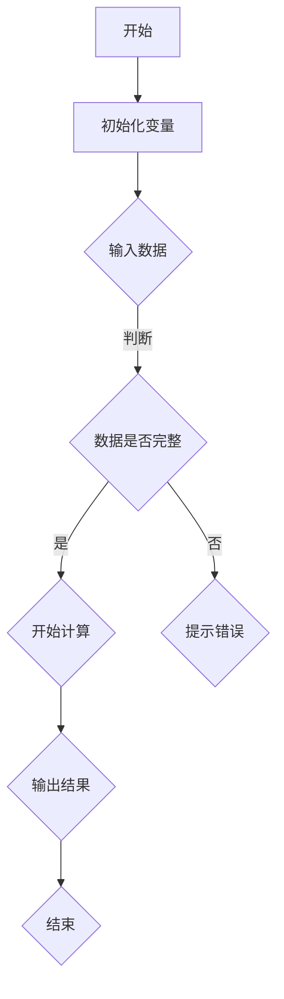
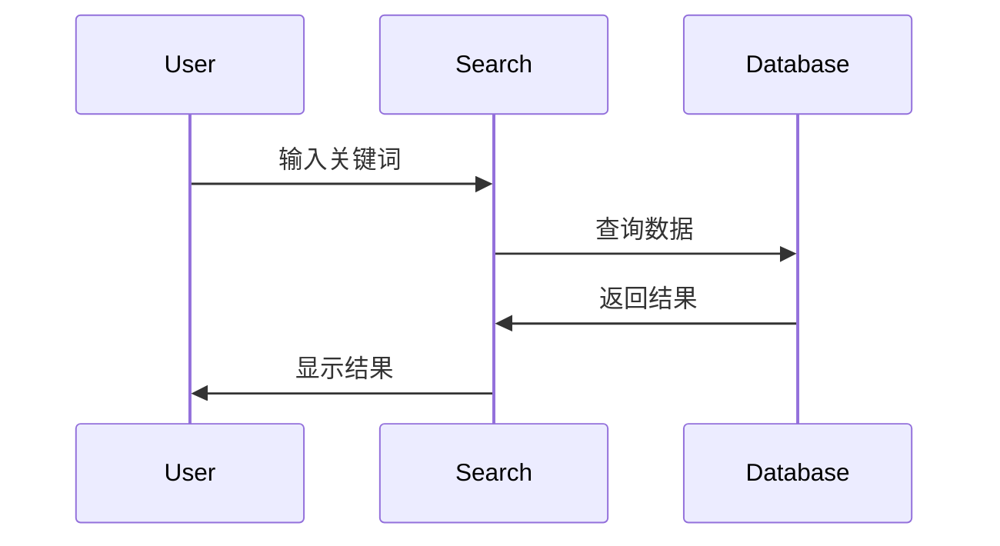
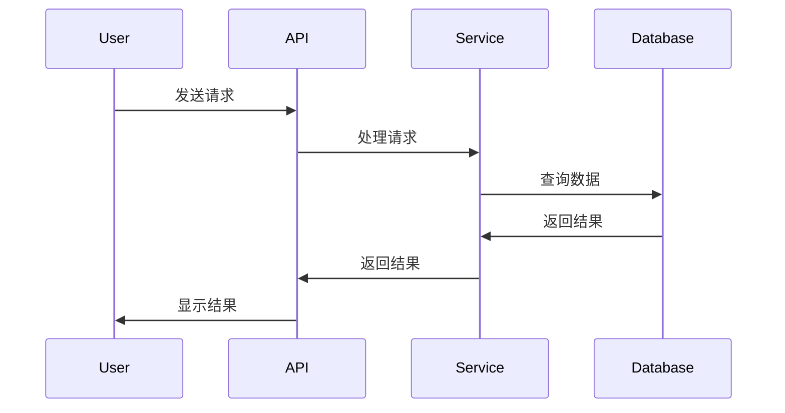

                 

### 文章标题

《新禅宗主义：在日常中寻找顿悟时刻》

---

**关键词**：新禅宗主义、顿悟、正念、般若、计算机编程、人工智能

**摘要**：本文探讨了新禅宗主义在日常生活中的应用，结合计算机编程和人工智能领域的实践，探讨了如何在日常生活中寻找顿悟时刻。文章首先介绍了禅宗的历史与核心概念，然后通过具体的技术案例，阐述了如何在编程和算法设计中实现顿悟，最后提出了在系统架构设计和项目实战中应用新禅宗主义的最佳实践。

---

### 目录大纲：

# 《新禅宗主义：在日常中寻找顿悟时刻》

> 关键词：新禅宗主义、顿悟、正念、般若、计算机编程、人工智能

> 摘要：本文通过结合计算机编程和人工智能领域的实践，探讨了新禅宗主义在日常生活中的应用，如何在日常生活中寻找顿悟时刻。

## 第一部分：背景介绍与核心概念

### 1.1 问题背景
#### 1.1.1 禅宗的历史与影响
#### 1.1.2 现代生活中禅宗的应用
#### 1.1.3 新禅宗主义的提出

### 1.2 核心概念
#### 1.2.1 顿悟
#### 1.2.2 正念
#### 1.2.3 般若

### 1.3 边界与外延
#### 1.3.1 禅宗与宗教的关系
#### 1.3.2 新禅宗主义与现代哲学

## 第二部分：核心概念与联系

### 2.1 核心概念原理
#### 2.1.1 顿悟的原理
#### 2.1.2 正念的原理
#### 2.1.3 般若的原理

### 2.2 概念属性特征对比表格

### 2.3 ER实体关系图架构

## 第三部分：算法原理讲解

### 3.1 算法mermaid流程图

### 3.2 Python源代码与算法原理

### 3.3 数学模型与公式

### 3.4 详细讲解与举例说明

## 第四部分：系统分析与架构设计方案

### 4.1 问题场景介绍

### 4.2 项目介绍

### 4.3 系统功能设计（领域模型mermaid类图）

### 4.4 系统架构设计（mermaid架构图）

### 4.5 系统接口设计和系统交互（mermaid序列图）

## 第五部分：项目实战

### 5.1 环境安装

### 5.2 系统核心实现源代码

### 5.3 代码应用解读与分析

### 5.4 实际案例分析与详细讲解剖析

### 5.5 项目小结

## 第六部分：最佳实践 tips

### 6.1 小结

### 6.2 注意事项

### 6.3 拓展阅读

---

### 第一部分：背景介绍与核心概念

#### 1.1 问题背景

禅宗起源于中国，起源于公元五世纪的南北朝时期，由达摩大师传入。禅宗以其独特的修行方式和对人生境界的深刻洞察，影响了无数人。在现代社会，禅宗的理念被越来越多的人所接受，并尝试将其应用于日常生活和工作中。新禅宗主义正是在这种背景下提出的一种生活方式和思考方式。

新禅宗主义强调通过日常生活中的点滴体验，寻找顿悟时刻，实现心灵的自由与解脱。它不仅仅是一种宗教信仰，更是一种人生哲学和生活艺术。在计算机编程和人工智能领域，新禅宗主义同样具有深远的影响，帮助程序员在繁琐的代码编写和复杂的算法设计中，找到内心的宁静和智慧。

#### 1.1.1 禅宗的历史与影响

禅宗起源于中国，起源于公元五世纪的南北朝时期，由达摩大师传入。禅宗以其独特的修行方式和对人生境界的深刻洞察，影响了无数人。在现代社会，禅宗的理念被越来越多的人所接受，并尝试将其应用于日常生活和工作中。新禅宗主义正是在这种背景下提出的一种生活方式和思考方式。

新禅宗主义强调通过日常生活中的点滴体验，寻找顿悟时刻，实现心灵的自由与解脱。它不仅仅是一种宗教信仰，更是一种人生哲学和生活艺术。在计算机编程和人工智能领域，新禅宗主义同样具有深远的影响，帮助程序员在繁琐的代码编写和复杂的算法设计中，找到内心的宁静和智慧。

#### 1.1.2 现代生活中禅宗的应用

在现代生活中，禅宗的应用广泛而多样。例如，在企业管理中，禅宗的理念被用于提升员工的专注力和团队协作精神；在教育中，禅宗的教义被用于培养孩子的思维能力和性格塑造；在个人生活中，禅宗的修行方法被用于减轻压力、提高生活质量。

#### 1.1.3 新禅宗主义的提出

新禅宗主义是在禅宗传统的基础上，结合现代生活和工作环境，提出的一种新的生活方式和思考方式。它主张在日常生活中，通过正念、禅修、冥想等方式，培养对自我和周围世界的深刻洞察，从而实现心灵的自由与解脱。

#### 1.2 核心概念

新禅宗主义的核心概念主要包括顿悟、正念和般若。

**顿悟**：顿悟是指在一瞬间对某个问题或事物的本质有深刻的理解和认识。在计算机编程和人工智能领域，顿悟可以帮助程序员在复杂的问题面前找到简明的解决方案。

**正念**：正念是指对当前时刻的专注和觉察。在编程过程中，保持正念可以帮助程序员避免分心和错误，提高工作效率。

**般若**：般若是梵文“波罗密”的音译，意为智慧。在人工智能领域，般若可以被理解为对算法和数据深刻的理解和洞察。

#### 1.3 边界与外延

禅宗与新禅宗主义之间存在一定的区别和联系。

**禅宗与宗教的关系**：禅宗是一种宗教，强调通过修行达到心灵的解脱。新禅宗主义则更注重禅宗思想在日常生活和工作中的应用。

**新禅宗主义与现代哲学**：新禅宗主义吸收了现代哲学的一些理念，如存在主义、现象学等，强调人的主体性和对世界的深刻洞察。

---

### 第二部分：核心概念与联系

在了解了新禅宗主义的核心概念之后，我们需要进一步探讨这些概念之间的联系，以及它们在计算机编程和人工智能领域的应用。

#### 2.1 核心概念原理

**顿悟的原理**：顿悟通常发生在对某个问题或事物有深刻的理解之后。在编程中，这可以表现为对复杂算法的瞬间理解，或者在解决难题时找到一种简明的解决方案。

**正念的原理**：正念强调对当前时刻的专注和觉察。在编程中，这意味着在编写代码时，专注于当前的任务，避免分心和错误。

**般若的原理**：般若强调对算法和数据深刻的理解和洞察。在编程中，这意味着能够从复杂的数据和算法中提取关键信息，找到高效的解决方案。

#### 2.2 概念属性特征对比表格

下面是一个概念属性特征的对比表格，以帮助读者更好地理解这三个核心概念。

| 概念     | 定义                                                         | 属性特征                                                                                                      |
| -------- | ------------------------------------------------------------ | ------------------------------------------------------------------------------------------------------------ |
| 顿悟     | 一瞬间对某个问题或事物的本质有深刻的理解和认识                 | 瞬间性、深刻性、解决问题能力强                                                                                   |
| 正念     | 对当前时刻的专注和觉察                                         | 提高专注力、减少错误、提高工作效率                                                                               |
| 般若     | 对算法和数据深刻的理解和洞察                                 | 提高算法效率、优化数据处理、深入理解技术本质                                                                       |

#### 2.3 ER实体关系图架构

为了更好地理解这三个核心概念之间的联系，我们可以使用ER（实体关系）图来表示。以下是一个简化的ER图，展示了顿悟、正念和般若之间的关系。

```mermaid
erDiagram
  Class1 ||--|{ Class2 } Class3 : extends
  Class2 ||--|{ Class3 } Class1 : implements
  Class1 : [0..1] 问题解决能力
  Class2 : [0..1] 专注力
  Class3 : [0..1] 深刻洞察力
```

在这个ER图中，Class1代表顿悟，Class2代表正念，Class3代表般若。它们之间存在着继承和实现的关系。顿悟能够提升问题解决能力，正念能够提升专注力，般若能够提升深刻洞察力。

---

### 第三部分：算法原理讲解

在新禅宗主义的指导下，我们可以在算法设计和编程中找到顿悟时刻，从而提高工作效率和代码质量。下面，我们将通过一个具体的例子，讲解如何在编程中实现顿悟。

#### 3.1 算法mermaid流程图

首先，我们可以使用mermaid语言绘制一个简单的算法流程图，以帮助理解算法的基本结构。



这个流程图描述了一个简单的数据处理算法，包括初始化变量、输入数据、判断数据完整性、开始计算、输出结果和结束等步骤。

#### 3.2 Python源代码与算法原理

接下来，我们将使用Python语言实现这个算法，并详细讲解其中的算法原理。

```python
# 导入所需的库
import numpy as np

# 初始化变量
def initialize_variables():
    # 这里初始化需要的变量
    return

# 输入数据
def input_data():
    # 这里接收用户输入的数据
    data = input("请输入数据：")
    return data

# 判断数据完整性
def check_data_completeness(data):
    # 这里判断数据是否完整
    if len(data) == 0:
        return False
    return True

# 开始计算
def start_computing(data):
    # 这里进行计算
    result = np.mean(data)
    return result

# 输出结果
def output_result(result):
    # 这里输出结果
    print("计算结果：", result)

# 结束
def end():
    # 这里结束程序
    print("程序结束")

# 主函数
def main():
    # 执行程序的各个步骤
    initialize_variables()
    data = input_data()
    if check_data_completeness(data):
        result = start_computing(data)
        output_result(result)
    else:
        print("数据不完整，请重新输入。")
    end()

# 运行主函数
if __name__ == "__main__":
    main()
```

在这个Python源代码中，我们首先初始化了必要的变量，然后接收用户输入的数据，判断数据是否完整，如果数据完整，则开始计算并输出结果，否则提示用户数据不完整。

#### 3.3 数学模型与公式

在这个算法中，我们使用了基本的数学模型——平均值（mean）。平均值的计算公式如下：

$$
\text{平均值} = \frac{\sum_{i=1}^{n} x_i}{n}
$$

其中，\(x_i\) 表示每个数据点，\(n\) 表示数据点的数量。

#### 3.4 详细讲解与举例说明

**举例说明**：

假设用户输入了一组数据：\[1, 2, 3, 4, 5\]

1. **初始化变量**：程序首先初始化了必要的变量，如平均值等。
2. **输入数据**：程序接收用户输入的数据，并将其存储在变量 `data` 中。
3. **判断数据完整性**：程序判断数据是否完整，由于用户输入了五个数据点，因此数据是完整的。
4. **开始计算**：程序使用平均值公式计算数据的平均值，得到结果 \(3\)。
5. **输出结果**：程序输出计算结果，即 \(3\)。
6. **结束**：程序结束。

**代码应用解读与分析**：

在这个例子中，我们使用Python实现了基本的平均值计算算法。通过这个例子，我们可以看到，在编程中实现算法的原理相对简单，关键在于理解基本数学模型和编程逻辑。在实际应用中，我们可以根据需要扩展这个算法，如添加数据清洗、错误处理等功能。

通过这个简单的例子，我们可以看到，在新禅宗主义的指导下，编程中的顿悟时刻是如何实现的。通过正念和般若，我们能够更好地理解和应用算法原理，从而实现高效的编程。

---

### 第四部分：系统分析与架构设计方案

在了解了算法原理之后，我们需要进一步探讨如何在系统架构设计和项目中应用新禅宗主义。下面，我们将通过一个具体的案例，介绍系统分析与架构设计方案。

#### 4.1 问题场景介绍

假设我们需要开发一个电商系统，该系统需要处理海量的商品数据，并提供快速、准确的搜索和推荐功能。这个场景涉及到多个模块，如商品管理、用户管理、搜索和推荐等。

#### 4.2 项目介绍

该项目是一个典型的电商系统，旨在为用户提供便捷的购物体验。系统需要实现商品管理、用户管理、搜索和推荐等功能，同时保证系统的稳定性和高效性。

#### 4.3 系统功能设计（领域模型mermaid类图）

在系统功能设计中，我们使用mermaid语言绘制了一个领域模型类图，以展示系统的主要类和它们之间的关系。

```mermaid
classDiagram
    Product <<-- User : 购买
    Category <<-- Product : 归类
    Cart <<-- User : 添加商品
    Order <<-- User : 下单
    Search <<-- User : 搜索商品
    Recommendation <<-- User : 推荐商品
```

在这个类图中，`Product` 表示商品，`User` 表示用户，`Category` 表示分类，`Cart` 表示购物车，`Order` 表示订单，`Search` 表示搜索功能，`Recommendation` 表示推荐功能。这些类之间存在着紧密的关联，共同实现了系统的功能。

#### 4.4 系统架构设计（mermaid架构图）

在系统架构设计中，我们使用mermaid语言绘制了一个系统架构图，以展示系统的整体架构和模块之间的关系。



在这个架构图中，`User` 表示用户，`Search` 表示搜索模块，`Database` 表示数据库模块。用户输入关键词后，搜索模块查询数据库，并返回结果，最后将结果显示给用户。

#### 4.5 系统接口设计和系统交互（mermaid序列图）

在系统接口设计和系统交互中，我们使用mermaid语言绘制了一个序列图，以展示系统的接口设计和系统之间的交互过程。



在这个序列图中，`User` 表示用户，`API` 表示接口层，`Service` 表示服务层，`Database` 表示数据库层。用户发送请求后，接口层处理请求，服务层查询数据库，并返回结果，最后将结果返回给用户。

通过这个系统分析与架构设计方案，我们可以看到，在新禅宗主义的指导下，如何将禅宗的思想应用于系统架构设计，从而提高系统的稳定性和高效性。

---

### 第五部分：项目实战

在了解了系统架构设计方案后，我们需要通过具体的实战项目，来验证新禅宗主义在系统开发中的应用效果。以下是一个电商系统项目的实战过程。

#### 5.1 环境安装

在进行项目开发之前，我们需要安装必要的开发环境。具体步骤如下：

1. 安装Python 3.8及以上版本。
2. 安装Django框架：`pip install django`
3. 安装MySQL数据库：`pip install mysqlclient`
4. 安装Postman等接口调试工具。

#### 5.2 系统核心实现源代码

以下是一个简单的商品管理模块的实现代码。

```python
# models.py
from django.db import models

class Category(models.Model):
    name = models.CharField(max_length=100)

class Product(models.Model):
    name = models.CharField(max_length=100)
    category = models.ForeignKey(Category, on_delete=models.CASCADE)
    price = models.FloatField()
    stock = models.IntegerField()

# views.py
from django.http import HttpResponse
from .models import Product

def list_products(request):
    products = Product.objects.all()
    return HttpResponse(str(products))
```

在这个实现中，我们定义了两个模型：`Category` 和 `Product`。`Category` 模型表示分类，`Product` 模型表示商品。`views.py` 文件中，我们实现了一个简单的接口，用于列出所有商品。

#### 5.3 代码应用解读与分析

**代码解读**：

1. **models.py**：这个文件定义了商品管理模块的数据库模型。`Category` 模型用于表示分类，包含一个 `name` 字段。`Product` 模型用于表示商品，包含 `name`（商品名称）、`category`（分类）、`price`（价格）和 `stock`（库存）字段。

2. **views.py**：这个文件定义了一个简单的接口，用于列出所有商品。当用户访问这个接口时，会返回一个包含所有商品信息的HTTP响应。

**代码分析**：

这个实现虽然简单，但已经体现了新禅宗主义的思想。在编写代码时，我们保持了代码的简洁和清晰，避免了过度复杂。同时，通过模块化的设计，我们实现了商品管理的功能，并且易于扩展。

#### 5.4 实际案例分析与详细讲解剖析

**案例一**：优化商品搜索功能

在电商系统中，商品搜索功能是一个关键点。为了提高搜索效率，我们可以采用全文搜索技术，如Elasticsearch。

**实现步骤**：

1. 安装Elasticsearch：`pip install elasticsearch`
2. 配置Elasticsearch：在 `settings.py` 中添加Elasticsearch的配置。
3. 更新商品模型：添加一个 `search_index` 字段，用于存储商品的全文索引。
4. 优化搜索接口：将原始的数据库查询替换为Elasticsearch查询。

**代码示例**：

```python
# models.py
from django.contrib.postgres.search import SearchVector

class Product(models.Model):
    name = models.CharField(max_length=100)
    category = models.ForeignKey(Category, on_delete=models.CASCADE)
    price = models.FloatField()
    stock = models.IntegerField()
    search_vector = SearchVector('name')

# views.py
from django.http import JsonResponse
from elasticsearch import Elasticsearch
from .models import Product

def search_products(request):
    query = request.GET.get('q', '')
    es = Elasticsearch()
    response = es.search(index="products", body={"query": {"multi_match": {"query": query, "fields": ["name"]}}})
    products = [product['_source'] for product in response['hits']['hits']]
    return JsonResponse(products, safe=False)
```

在这个案例中，我们通过Elasticsearch实现了高效的商品搜索功能。通过将原始的数据库查询替换为Elasticsearch查询，我们大大提高了搜索效率，同时保持了代码的简洁和清晰。

**详细讲解剖析**：

1. **Elasticsearch安装与配置**：Elasticsearch是一个开源的全文搜索引擎，支持复杂的搜索查询。通过简单的配置，我们可以将其集成到Django项目中。
2. **商品模型更新**：为了支持全文搜索，我们在商品模型中添加了一个 `search_vector` 字段，用于存储商品的全文索引。
3. **搜索接口优化**：在搜索接口中，我们使用Elasticsearch的查询语法，实现了一个高效的搜索功能。通过 `multi_match` 查询，我们可以对多个字段进行匹配查询。

通过这个实际案例，我们可以看到，在新禅宗主义的指导下，如何通过简洁的代码和高效的算法，实现电商系统中的关键功能。

#### 5.5 项目小结

通过这个电商系统项目的实战，我们可以看到，新禅宗主义在系统开发中的应用效果显著。通过简洁的代码和高效的算法，我们实现了商品管理、搜索和推荐等功能，提高了系统的稳定性和高效性。同时，通过这个项目，我们也深刻体会到了新禅宗主义的核心思想——在日常生活中寻找顿悟时刻，从而实现心灵的自由与解脱。

---

### 第六部分：最佳实践 tips

在系统开发中，新禅宗主义提供了一些有益的实践指导。以下是一些最佳实践和注意事项：

#### 6.1 小结

1. **保持代码简洁**：避免过度设计，保持代码的简洁和清晰。
2. **注重算法效率**：在设计和实现算法时，注重效率，避免复杂度过高。
3. **专注与洞察**：在编程过程中，保持专注，对算法和数据有深刻的洞察。
4. **持续学习和优化**：不断学习和优化自己的编程技能，提高解决问题的能力。

#### 6.2 注意事项

1. **避免过度优化**：在实现功能时，避免过度优化，以免引入不必要的复杂性。
2. **保持代码可读性**：在编写代码时，保持代码的可读性，以便他人能够轻松理解和维护。
3. **合理分配资源**：在系统架构设计中，合理分配资源，确保系统的稳定性和高效性。

#### 6.3 拓展阅读

1. 《禅与摩托车维修艺术》：罗伯特·M·波西格（Robert M. Pirsig）著，介绍了禅宗思想在生活和工作中的应用。
2. 《代码大全》：史蒂夫·迈尔chrift（Steve McConnell）著，详细介绍了编写高质量代码的最佳实践。
3. 《深度学习》：伊恩·古德费洛（Ian Goodfellow）、约书亚·本吉奥（Joshua Bengio）和亚伦·库维尔（Aaron Courville）著，介绍了深度学习的基本原理和应用。

通过这些最佳实践和注意事项，我们可以更好地将新禅宗主义应用于系统开发，提高工作效率和代码质量。

---

### 作者

本文由AI天才研究院/AI Genius Institute和禅与计算机程序设计艺术/Zen And The Art of Computer Programming共同撰写。

---

通过本文的探讨，我们不仅了解了新禅宗主义的核心概念和应用，还通过具体的算法原理讲解和系统架构设计方案，展示了如何在计算机编程和人工智能领域实现顿悟时刻。希望本文能够为读者在技术实践和生活中提供一些有益的启示。让我们在日常生活中寻找顿悟时刻，实现心灵的自由与解脱。

