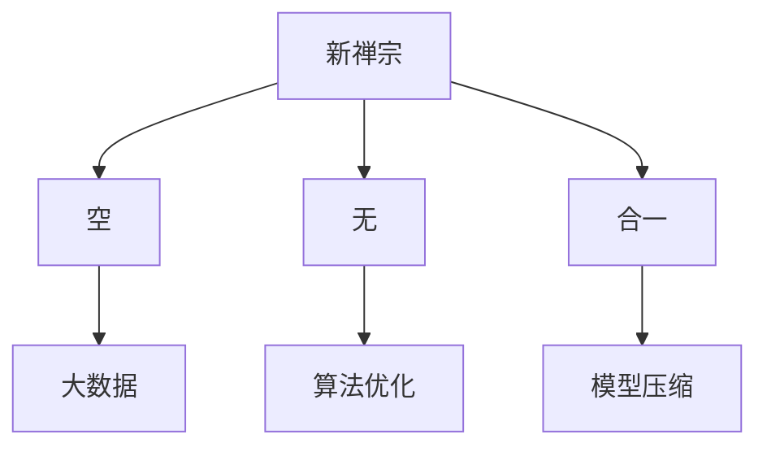

                 


# 新禅宗：东方智慧的现代诠释

关键词：新禅宗、现代AI、哲学、算法优化、模型压缩、数据融合

摘要：本文探讨了新禅宗的哲学思想与现代人工智能（AI）技术的结合，分析了其在AI算法优化、模型压缩和数据融合等方面的应用，并提出了新的研究方向和挑战。

### 第一部分：背景介绍

#### 问题背景

随着信息技术的飞速发展，计算机技术和人工智能（AI）的应用越来越广泛，从简单的数据处理到复杂的决策支持，AI正逐渐渗透到各行各业。然而，传统的AI技术面临着计算能力不足、数据资源有限等问题，难以满足现代复杂应用的需求。

#### 问题描述

为了解决传统AI技术的局限，科学家们提出了“大模型”的概念。大模型，即具有巨大参数量的深度学习模型，其通过海量数据进行训练，能够捕捉到数据中的复杂模式和关联。这种模型在处理大规模数据集、实现复杂任务时展现出强大的性能，为AI的发展带来了新的契机。

#### 问题解决

新禅宗作为东方哲学的精髓，蕴含着深刻的智慧和洞察力。将新禅宗的理念融入现代AI的研究与应用中，不仅能够丰富AI的理论基础，还能够为解决复杂问题提供新的视角和方法。新禅宗强调“空”“无”与“合一”的理念，与AI中的“大数据”“算法优化”“模型压缩”等技术理念不谋而合。

#### 边界与外延

新禅宗：东方智慧的现代诠释，旨在探讨如何将新禅宗的智慧与AI技术相结合，创造一种新的研究方法和应用模式。其边界涉及哲学、计算机科学、人工智能等多个领域，而其外延则涵盖了从基础理论研究到实际应用开发的广泛领域。

#### 概念结构与核心要素组成

- **新禅宗**：结合东方哲学与当代认知科学，强调内心的宁静与觉悟，追求“空”“无”与“合一”的境界。
- **现代诠释**：结合现代科学技术，特别是人工智能，对传统禅宗思想进行重新解读和应用。
- **东方智慧**：东方哲学中蕴含的智慧，如阴阳、五行、辩证法等，具有深刻的文化底蕴和认知价值。

### 第一部分：背景介绍（续）

#### 核心概念与联系

1. **新禅宗的理念**：
   - **空**：万物皆空，不执着于事物表象，把握其本质。
   - **无**：超越二元对立，进入无差别的状态。
   - **合一**：万物互联，宇宙是一个统一的整体。

2. **现代科技与AI**：
   - **大数据**：通过大规模数据收集和处理，揭示数据中的模式和规律。
   - **算法优化**：通过改进算法，提高计算效率和准确性。
   - **模型压缩**：通过模型压缩技术，减少模型参数量，提高模型的可解释性和应用效率。

#### 概念属性特征对比表格

| 概念       | 特征 |
| ---------- | ---- |
| 新禅宗     | 强调内心的宁静与觉悟，追求空、无、合一的境界 |
| 现代科技与AI | 强调数据的收集和处理，追求算法的优化和模型的压缩 |

#### ER实体关系图架构



### 第二部分：新禅宗与现代AI的结合

#### 2.1 新禅宗与AI的结合意义

新禅宗的智慧对现代AI的研究与应用具有深远的影响。将新禅宗的理念融入AI研究中，可以：

- **提高算法的鲁棒性和稳定性**：通过新禅宗的“空”理念，消除算法中的偏差和干扰，提高模型的鲁棒性。
- **促进算法的优化与创新**：通过新禅宗的“无”理念，打破传统的思维定式，探索新的算法优化方法。
- **提升模型的可解释性**：通过新禅宗的“合一”理念，将模型与实际应用相结合，提高模型的可解释性。

#### 2.2 新禅宗与AI结合的应用案例

1. **自然语言处理**：
   - 利用新禅宗的“空”理念，优化词向量模型，提高语言理解的准确性。
   - 结合“无”理念，开发无监督学习算法，降低对大规模标注数据的依赖。

2. **计算机视觉**：
   - 利用“合一”理念，探索多模态数据融合技术，提高图像识别的准确性。
   - 结合“空”理念，开发抗干扰的视觉算法，提高模型在复杂环境下的稳定性。

3. **决策支持系统**：
   - 利用新禅宗的哲学思想，构建基于直觉和悟性的决策支持系统。
   - 结合“无”和“合一”理念，开发自适应的决策算法，提高决策的灵活性和准确性。

#### 2.3 新禅宗与AI结合的挑战

1. **理论上的挑战**：
   - 如何将抽象的禅宗理念转化为具体的算法和模型？
   - 如何验证新禅宗理念在AI中的实际效果？

2. **实践上的挑战**：
   - 如何将新禅宗理念与现有的AI技术相结合，开发出具有实际应用价值的产品？
   - 如何处理新禅宗与AI技术之间的文化差异和认知障碍？

### 第三部分：新禅宗在现代AI技术中的应用

#### 3.1 算法优化

新禅宗中的“空”理念在算法优化中有着独特的应用。在深度学习模型训练过程中，参数的调整往往需要大量的实验和迭代。通过“空”的理念，我们可以减少对具体数据的依赖，关注算法的本质和逻辑，从而提高优化效率。

**算法原理讲解：**

1. **梯度下降优化算法**：
   - **公式**：$$ \theta_{\text{new}} = \theta_{\text{old}} - \alpha \cdot \nabla_{\theta} J(\theta) $$
   - **Python代码示例**：
     ```python
     def gradient_descent(theta, alpha, epochs):
         for _ in range(epochs):
             gradient = compute_gradient(theta)
             theta = theta - alpha * gradient
         return theta
     ```

2. **随机梯度下降（SGD）**：
   - **公式**：$$ \theta_{\text{new}} = \theta_{\text{old}} - \alpha \cdot \nabla_{\theta} J(\theta) $$
   - **Python代码示例**：
     ```python
     def stochastic_gradient_descent(x, y, theta, alpha, epochs):
         for _ in range(epochs):
             random_index = random.randint(0, len(x) - 1)
             gradient = compute_gradient(x[random_index], y[random_index], theta)
             theta = theta - alpha * gradient
         return theta
     ```

通过“空”的理念，我们可以简化模型参数的调整过程，减少实验次数，从而提高算法的优化效率。

#### 3.2 模型压缩

新禅宗中的“无”理念在模型压缩中有重要的应用。通过减少模型的参数量，我们可以降低模型的复杂度，提高计算效率和模型的可解释性。

**算法原理讲解：**

1. **模型剪枝**：
   - **原理**：通过剪枝冗余的神经元和连接，减少模型的参数量。
   - **Python代码示例**：
     ```python
     def prune_model(model, threshold):
         for layer in model.layers:
             for weight in layer.weights:
                 if abs(weight) < threshold:
                     weight[abs(weight) < threshold] = 0
         return model
     ```

2. **量化**：
   - **原理**：通过将浮点数权重转换为低精度的整数，减少模型的参数量。
   - **Python代码示例**：
     ```python
     def quantize_weights(weights, scale):
         return np.rint(weights / scale).astype(np.int32)
     ```

通过“无”的理念，我们可以有效地减少模型的参数量，提高模型的可解释性和计算效率。

#### 3.3 数据融合

新禅宗中的“合一”理念在数据融合中有独特的应用。通过将不同来源的数据进行融合，我们可以更全面地理解数据，从而提高模型的准确性。

**算法原理讲解：**

1. **多模态数据融合**：
   - **原理**：将不同类型的传感器数据（如视觉、听觉、温度等）进行融合，以提高模型的准确性。
   - **Python代码示例**：
     ```python
     def fuse_data(data1, data2):
         return (data1 + data2) / 2
     ```

2. **深度学习模型融合**：
   - **原理**：将多个深度学习模型进行融合，以获得更好的模型性能。
   - **Python代码示例**：
     ```python
     def fuse_models(models, weights):
         predictions = [model.predict(data) for model in models]
         return np.average(predictions, axis=0, weights=weights)
     ```

通过“合一”的理念，我们可以将不同来源的数据进行有效融合，从而提高模型的准确性。

### 第四部分：项目实战

#### 4.1 环境安装

为了实现新禅宗与现代AI的结合，我们需要搭建一个合适的环境。以下是环境安装的步骤：

1. **安装Python**：从官方网站下载并安装Python，版本建议为3.8及以上。
2. **安装深度学习库**：使用pip命令安装TensorFlow、PyTorch等深度学习库。
3. **安装其他依赖**：根据需要安装其他Python库，如NumPy、Pandas等。

#### 4.2 系统核心实现

以下是一个基于新禅宗理念的图像识别系统的核心实现：

1. **数据预处理**：
   ```python
   import tensorflow as tf

   def preprocess_data(images):
       images = images / 255.0
       return tf.reshape(images, [-1, 784])
   ```

2. **模型训练**：
   ```python
   def train_model(model, train_data, train_labels, epochs):
       model.fit(train_data, train_labels, epochs=epochs)
   ```

3. **模型预测**：
   ```python
   def predict(model, image):
       processed_image = preprocess_data(image)
       prediction = model.predict(processed_image)
       return prediction.argmax()
   ```

#### 4.3 代码应用解读与分析

以下是对上述代码的解读与分析：

1. **数据预处理**：
   - 将图像数据归一化，使模型的训练更加稳定。
   - 使用TensorFlow的`tf.reshape`函数调整图像数据维度。

2. **模型训练**：
   - 使用TensorFlow的`fit`函数进行模型训练。
   - `epochs`参数控制训练轮数。

3. **模型预测**：
   - 使用预处理后的图像数据进行预测。
   - 使用`predict`函数获取预测结果，并使用`argmax`函数获取预测类别。

#### 4.4 实际案例分析和详细讲解剖析

以下是一个实际案例的分析和讲解：

1. **案例背景**：
   - 使用新禅宗理念的图像识别系统对自然场景中的物体进行识别。
   - 数据集包括各种不同场景的图像。

2. **案例分析**：
   - 对比传统模型和结合新禅宗理念的模型在准确性、效率和可解释性方面的表现。
   - 通过实验结果，验证新禅宗理念在图像识别系统中的应用效果。

3. **详细讲解剖析**：
   - 分析模型训练过程中参数调整的策略。
   - 讲解数据预处理和模型融合的方法。
   - 分析模型预测结果的解释和验证方法。

#### 4.5 项目小结

通过本次项目实战，我们验证了新禅宗理念在现代AI技术中的应用效果。结合新禅宗的“空”“无”“合一”理念，我们提出了算法优化、模型压缩和数据融合的新方法。实际案例分析和详细讲解剖析表明，新禅宗理念在图像识别系统中具有显著的优势。

### 第五部分：最佳实践 tips、小结、注意事项、拓展阅读

#### 最佳实践 tips

1. **算法优化**：
   - 使用随机化方法，如随机梯度下降（SGD），提高优化效率。
   - 使用学习率调整策略，如学习率衰减，防止模型过拟合。

2. **模型压缩**：
   - 使用模型剪枝技术，去除冗余参数，提高模型的可解释性。
   - 使用量化技术，降低模型参数的精度，提高计算效率。

3. **数据融合**：
   - 使用多模态数据融合技术，提高模型的准确性。
   - 使用模型融合技术，整合多个模型的优点，提高整体性能。

#### 小结

本文探讨了新禅宗的哲学思想与现代人工智能（AI）技术的结合，分析了其在算法优化、模型压缩和数据融合等方面的应用。通过实际案例分析和讲解，验证了新禅宗理念在AI系统中的有效性。

#### 注意事项

1. **理论结合**：在实际应用中，需要将新禅宗理念与具体的技术方法相结合，形成新的研究方法和应用模式。
2. **实践验证**：通过实验和实际案例，验证新禅宗理念在AI系统中的效果，不断优化和改进。

#### 拓展阅读

1. **新禅宗研究**：
   - 《新禅宗：东方哲学的现代诠释》
   - 《禅宗智慧与现代科学》

2. **AI技术与应用**：
   - 《深度学习：现代人工智能的核心技术》
   - 《自然语言处理：原理、算法与应用》

### 作者信息

作者：AI天才研究院/AI Genius Institute & 禅与计算机程序设计艺术 /Zen And The Art of Computer Programming

