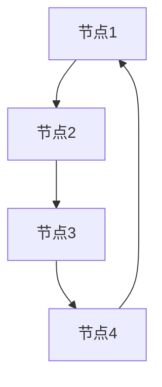
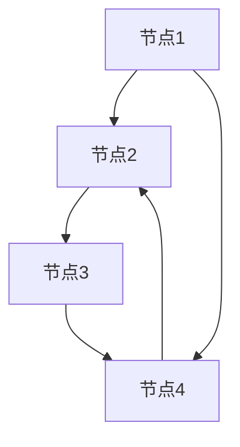
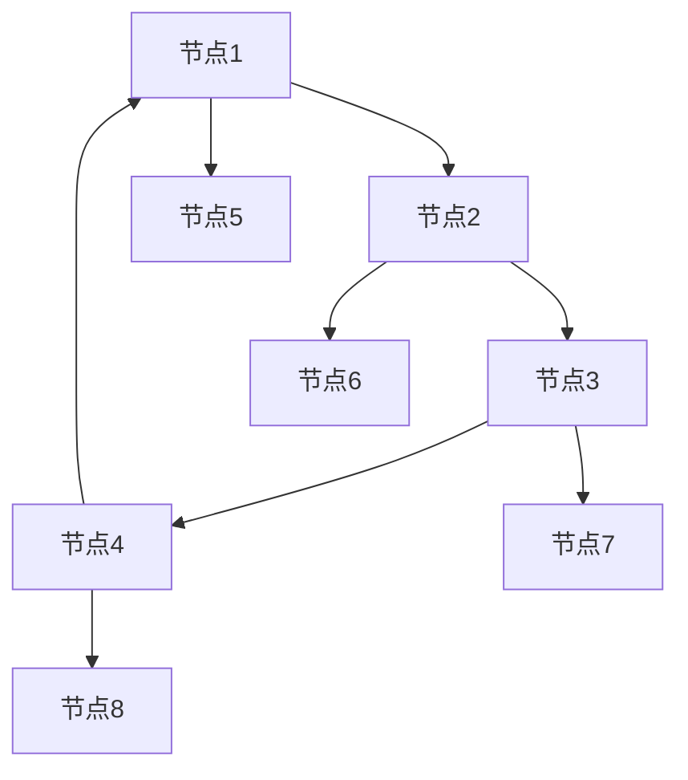
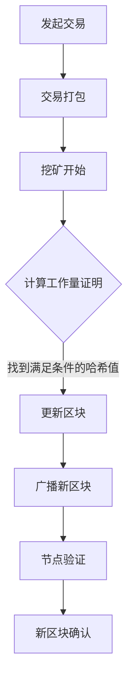
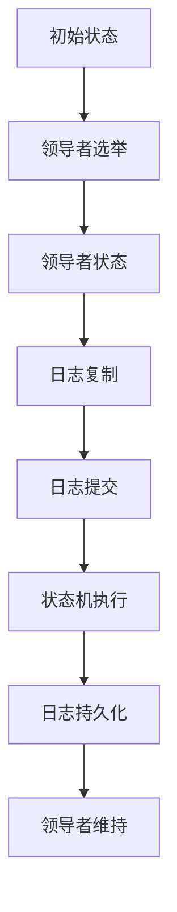
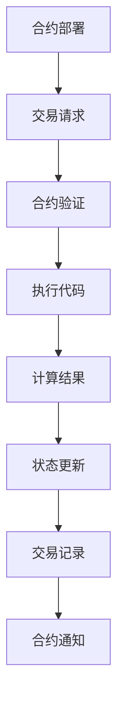
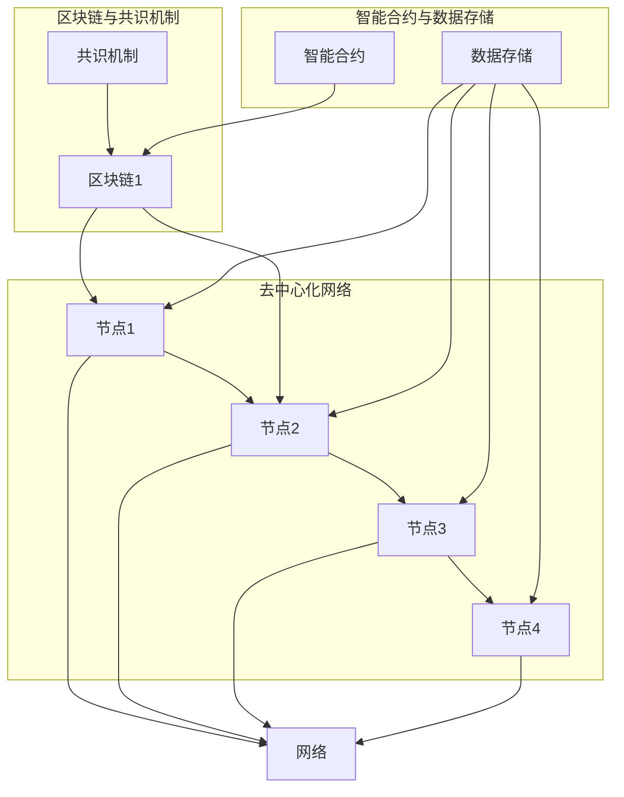
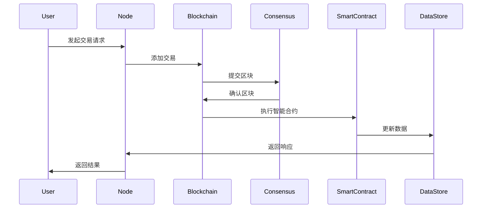
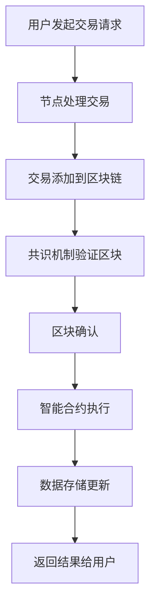

                 

### 新秩序的建立：去中心化时代的意义重构

---

> 关键词：去中心化，新秩序，区块链，智能合约，共识机制，分布式系统

> 摘要：随着互联网和信息技术的飞速发展，传统的中心化系统已经无法满足日益复杂的社会需求。去中心化作为一种新兴的技术理念，正在逐步改变着我们的生活方式。本文将探讨去中心化时代的兴起背景、核心概念、理论基础以及实际应用，最终揭示其在建立新秩序中的深远意义。

---

## 第一部分：背景与概念

### 第1章：问题的背景和去中心化时代的兴起

#### 1.1 去中心化时代的概念

去中心化，即Decentralization，是指系统或组织从单一的中央控制转变为分布式控制和自治的过程。这个概念起源于对传统中心化系统的反思，传统中心化系统通常依赖于中央服务器或组织来处理数据和管理事务，而这一模式在许多方面已经暴露出诸多弊端。

**历史背景**：去中心化的理念早在20世纪60年代就已经被提出，例如在互联网的早期发展过程中，去中心化的网络架构大大提高了网络的容错性和抗攻击性。然而，随着互联网的普及和区块链技术的出现，去中心化得到了前所未有的重视和快速发展。

**定义与特点**：去中心化时代可以定义为一种新的社会、经济和技术模式，它基于分布式账本、智能合约和区块链技术，通过去中心化的方式来处理信息、管理事务和创造价值。其核心特点包括：

1. **去中心化的决策**：去中心化系统使得决策更加分散，不再依赖于单一的权威机构，而是通过共识机制实现集体决策。
2. **开放性和透明度**：去中心化系统能够实现数据的公开透明，所有参与方都能够验证和追踪系统的运作。
3. **高效性和鲁棒性**：去中心化系统通过分布式网络运作，能够在不依赖中心节点的情况下实现高效的事务处理，并且具有较高的抗攻击性和容错性。

#### 1.2 去中心化时代的重要性

去中心化时代的兴起不仅代表了技术的一次革命，也对社会结构和经济模式产生了深远的影响。

**对个人和社会的影响**：

1. **经济自由**：去中心化系统使得个人可以自由地参与数字经济活动，不受地理和机构的限制，从而实现了真正的经济自由。
2. **信任的重建**：通过区块链技术的不可篡改性，去中心化系统能够重建参与方之间的信任，减少中介成本。
3. **社会治理的优化**：去中心化理念能够优化社会治理结构，提高政府和社会组织的透明度和效率。

**优势分析**：

1. **去中心化的决策**：去中心化系统能够实现更加民主和公平的决策过程，减少了权力集中和信息不对称的问题。
2. **开放性和透明度**：去中心化系统能够实现数据的透明化，提高了信息共享和协同工作的效率。
3. **高效性和鲁棒性**：去中心化系统能够在不需要中心节点的情况下处理海量数据，具有更高的效率和稳定性。

#### 1.3 去中心化与中心化系统的对比

**中心化系统的局限性**：

1. **单点故障风险**：中心化系统依赖于单一的中心节点，一旦中心节点出现故障，整个系统将瘫痪。
2. **数据安全漏洞**：中心化系统容易受到黑客攻击和数据泄露的威胁。
3. **信任危机**：中心化系统中的信息不对称和权力集中容易导致信任危机。

**去中心化系统的优势**：

1. **高可用性和容错性**：去中心化系统通过分布式网络运作，单个节点的故障不会影响整个系统的运行。
2. **数据安全性和隐私保护**：区块链技术的加密算法和分布式存储机制能够有效保护数据的安全性和隐私。
3. **去中心化决策**：去中心化系统能够通过共识机制实现集体决策，减少权力集中和信息不对称。

**对比图表：中心化与去中心化系统特性分析**：

| 特性 | 中心化系统 | 去中心化系统 |
| --- | --- | --- |
| 决策模式 | 中心化决策 | 去中心化决策 |
| 数据透明度 | 低 | 高 |
| 安全性 | 较低 | 较高 |
| 容错性 | 较低 | 较高 |
| 抗攻击性 | 较低 | 较高 |

## 第2章：核心概念与联系

#### 2.1 去中心化系统的要素

去中心化系统的成功构建依赖于多个关键要素，包括网络节点、共识机制、智能合约等。

1. **网络节点**：网络节点是去中心化系统的基本组成部分，每个节点都可以进行数据的存储和传输，并且拥有一定程度的计算能力。
2. **共识机制**：共识机制是去中心化系统中实现集体决策的关键，它保证了所有节点对于数据的一致性和可靠性。
3. **智能合约**：智能合约是一种嵌入在去中心化系统中的自动执行合约，它能够根据预设的规则自动执行交易和合约条款。

**Mermaid ER图：去中心化系统的实体关系**：

```mermaid
erDiagram
  Node ||--|{ Blockchain }|| Data
  Node ||--|{ Smart Contract }|| Contract
  Blockchain ||--|{ Transaction }|| Trade
  Node ||--|{ Validator }|| Verify
```

#### 2.2 去中心化系统的特性

去中心化系统具有多个显著特性，包括开放性、透明度、去中心化决策等。

1. **开放性**：去中心化系统对所有人开放，无需经过特定机构的审核和授权，任何人都可以参与。
2. **透明度**：去中心化系统中的所有交易和数据都是公开透明的，任何人都可以通过区块链浏览器进行查看。
3. **去中心化决策**：去中心化系统通过共识机制实现集体决策，每个节点都有平等的发言权和投票权。

**去中心化系统的特性比较表格**：

| 特性 | 中心化系统 | 去中心化系统 |
| --- | --- | --- |
| 开放性 | 较低 | 较高 |
| 透明度 | 较低 | 较高 |
| 决策模式 | 中心化 | 去中心化 |
| 安全性 | 较低 | 较高 |

#### 2.3 去中心化系统与传统系统的联系与区别

去中心化系统与传统系统在多个方面存在联系和区别。

1. **传统系统的核心问题**：
   - **单点故障风险**：依赖于中心节点，一旦中心节点出现问题，整个系统将瘫痪。
   - **数据安全漏洞**：中心化系统容易受到黑客攻击和数据泄露的威胁。
   - **信任危机**：信息不对称和权力集中容易导致信任危机。
2. **去中心化系统的改进点**：
   - **去中心化决策**：通过共识机制实现集体决策，减少权力集中。
   - **数据安全性和隐私保护**：区块链技术能够有效保护数据的安全性和隐私。
   - **高可用性和容错性**：分布式网络运作，单个节点的故障不会影响整个系统。

**对比表格：去中心化系统与传统系统特性比较**：

| 特性 | 中心化系统 | 去中心化系统 |
| --- | --- | --- |
| 决策模式 | 中心化决策 | 去中心化决策 |
| 数据透明度 | 低 | 高 |
| 安全性 | 较低 | 较高 |
| 容错性 | 较低 | 较高 |
| 抗攻击性 | 较低 | 较高 |

### 小结

去中心化时代的兴起，为解决传统中心化系统的弊端提供了新的思路和路径。通过理解去中心化时代的概念、核心概念与联系，以及与传统系统的对比，我们可以看到去中心化系统在开放性、透明度、安全性和效率等方面具有显著优势。在接下来的章节中，我们将深入探讨去中心化系统的基础理论、算法原理以及实际应用，进一步揭示其在建立新秩序中的深远意义。


## 第二部分：理论与原理

### 第3章：去中心化系统的基础理论

去中心化系统（Decentralized System）作为一种分布式计算和存储架构，其核心在于通过分布式网络实现数据的存储和传输，避免了单一中心节点的风险。本节将探讨去中心化网络的理论基础，包括节点分布、节点通信、数据传播机制等方面。

#### 3.1 去中心化网络的理论基础

去中心化网络的设计理念可以追溯到互联网的早期发展。互联网通过分布式网络架构，使得信息传输更加高效和可靠。去中心化网络在此基础上进一步发展，通过去中心化的方式实现数据的存储和传输。

**节点分布**：在去中心化网络中，节点分布是至关重要的。节点分布需要考虑以下因素：

1. **节点数量**：节点数量的多少直接影响网络的去中心化程度。节点数量越多，系统的去中心化程度越高，抗攻击性和容错性也越强。
2. **节点布局**：节点的布局需要考虑地理分布和拓扑结构。通过合理的布局，可以优化网络的传输效率和容错性。

**节点通信**：节点之间的通信是去中心化网络的核心。节点通信需要确保以下方面：

1. **通信协议**：通信协议需要支持高效、可靠的数据传输。常用的通信协议包括P2P协议、Gossip协议等。
2. **数据同步**：节点之间的数据同步是保证系统一致性的关键。通过分布式一致性算法，如Raft、Paxos等，可以实现节点之间的高效同步。

**数据传播机制**：数据传播机制是去中心化网络实现数据共享的重要手段。数据传播机制需要确保以下方面：

1. **数据复制**：通过复制机制，确保每个节点都拥有相同的数据副本，提高数据的可靠性和访问速度。
2. **数据传播策略**：数据传播策略需要考虑网络的拓扑结构和节点负载，选择合适的数据传播方式，如洪泛、随机漫步等。

#### 3.2 共识机制的工作原理

共识机制是去中心化系统中实现集体决策的重要机制。通过共识机制，多个节点可以共同决定系统状态的变化，确保系统的一致性和可靠性。

**共识机制的作用**：

1. **数据一致性**：共识机制通过分布式算法，确保所有节点对系统状态有一致的理解，防止数据冲突和错误。
2. **决策高效性**：共识机制通过优化算法，提高决策的效率和速度，确保系统能够快速响应和处理事务。

**常见的共识算法**：

1. **PoW（Proof of Work，工作量证明）**：PoW通过计算工作量来证明节点对网络的贡献，确保系统安全性和去中心化。比特币采用的便是PoW算法。
2. **PoS（Proof of Stake，权益证明）**：PoS通过节点持有的代币数量来证明节点对网络的贡献，相对于PoW，PoS消耗的能量更少。
3. **DPoS（Delegated Proof of Stake，委托权益证明）**：DPoS通过选举出代表节点进行共识，代表节点对网络事务进行投票，提高决策效率。

**共识机制在去中心化系统中的应用**：

1. **区块链网络**：在区块链网络中，共识机制用于验证交易的有效性，确保新块的生成和链的延长。
2. **分布式存储**：在分布式存储系统中，共识机制用于确保数据副本的一致性，防止数据丢失和损坏。

#### 3.3 去中心化数据存储的原理

去中心化数据存储是去中心化系统的重要组成部分。通过去中心化的方式，数据存储在多个节点上，提高了数据的可靠性和安全性。

**数据分布存储**：

1. **数据分片**：将大数据集分成多个小数据块，每个数据块存储在不同的节点上。
2. **副本机制**：每个数据块在多个节点上都有副本，确保数据的冗余和备份。
3. **存储协议**：常用的存储协议包括IPFS（InterPlanetary File System，星际文件系统）等。

**数据安全性与隐私保护**：

1. **加密算法**：通过加密算法对数据进行加密，确保数据在传输和存储过程中的安全性。
2. **访问控制**：通过访问控制机制，确保只有授权用户才能访问特定的数据。

**数据访问与共享**：

1. **分布式检索**：通过分布式检索算法，节点可以快速查找所需的数据。
2. **共享协议**：通过共享协议，数据可以方便地在节点之间共享和传输。

#### 3.4 Mermaid 流程图：基础理论的应用

为了更好地理解去中心化系统的基础理论，我们可以使用Mermaid流程图来展示节点分布、节点通信和数据传播机制。

**节点分布流程图**：



**节点通信流程图**：



**数据传播流程图**：



通过这些流程图，我们可以清晰地看到去中心化系统中节点分布、节点通信和数据传播的具体实现过程。这些流程图不仅帮助我们理解去中心化系统的基本理论，也为后续的算法设计和系统实现提供了参考。

### 小结

去中心化系统的基础理论涵盖了节点分布、节点通信、数据传播机制以及共识机制等方面。通过这些基础理论的探讨，我们可以更好地理解去中心化系统的运作原理和优势。在接下来的章节中，我们将深入探讨去中心化系统的算法原理，包括常见去中心化算法的介绍、算法流程图的展示、Python源代码示例以及数学模型和公式的讲解。通过这些内容，我们将进一步理解去中心化系统的工作机制和应用场景。


## 第4章：算法原理讲解

去中心化系统中的算法是实现其功能的核心，它们决定了系统的性能、安全性和可扩展性。在本节中，我们将详细讲解一些常见的去中心化算法，并通过算法流程图、Python源代码示例以及数学模型和公式来深入剖析这些算法的原理和应用。

#### 4.1 常见去中心化算法介绍

去中心化系统常用的算法包括：

1. **共识算法**：共识算法是去中心化系统中最为重要的算法，用于确保所有节点对于系统状态的一致性。常见的共识算法包括PoW（Proof of Work，工作量证明）、PoS（Proof of Stake，权益证明）和DPoS（Delegated Proof of Stake，委托权益证明）。
2. **分布式存储算法**：分布式存储算法用于实现数据在多个节点之间的分布存储和同步。常见的分布式存储算法包括Raft和Paxos。
3. **分布式交易算法**：分布式交易算法用于处理去中心化网络中的交易和支付。常见的分布式交易算法包括比特币的UTXO模型和以太坊的账户模型。
4. **智能合约执行算法**：智能合约执行算法用于确保智能合约的执行符合其预定逻辑。常见的智能合约执行算法包括EVM（Ethereum Virtual Machine，以太坊虚拟机）。

#### 4.2 算法流程图展示

为了更好地理解这些算法的工作原理，我们可以通过算法流程图来展示它们的主要步骤和执行过程。

**PoW共识算法流程图**：



**Raft分布式存储算法流程图**：



**EVM智能合约执行算法流程图**：



通过这些流程图，我们可以清晰地看到每种算法的主要步骤和执行过程，这有助于我们更好地理解这些算法的工作原理。

#### 4.3 Python源代码示例

为了更直观地理解这些算法的原理，我们可以通过Python源代码示例来展示它们的实现过程。

**PoW共识算法Python示例**：

```python
import hashlib
import time

def mine_block(last_hash, target_difficulty):
    """
    挖矿函数，寻找满足难度的哈希值
    """
    nonce = 0
    while True:
        # 创建区块数据
        block_data = f"my_block_{nonce}"
        # 计算哈希值
        hash_value = hashlib.sha256(block_data.encode()).hexdigest()
        # 检查哈希值是否满足难度要求
        if hash_value[:target_difficulty] == "0" * target_difficulty:
            return nonce, hash_value
        nonce += 1

# 设定难度
target_difficulty = 4
# 开始挖矿
start_time = time.time()
nonce, hash_value = mine_block("last_hash", target_difficulty)
end_time = time.time()

print(f"挖矿结果：nonce={nonce}, hash={hash_value}")
print(f"挖矿时间：{end_time - start_time}秒")
```

**Raft分布式存储算法Python示例**：

```python
import threading
import time

def raft_leader Election():
    """
    领导者选举函数
    """
    # 1. 收集投票
    votes_received = 0
    for _ in range(num_nodes):
        vote = node投票()
        if vote == "yes":
            votes_received += 1
    
    # 2. 判断是否成为领导者
    if votes_received > num_nodes / 2:
        print("我成为领导者了！")
    else:
        print("没有成为领导者，重新选举。")

def node_vote(yes_or_no):
    """
    节点投票函数
    """
    # 模拟投票过程
    time.sleep(random.uniform(0.5, 1.5))
    return yes_or_no

# 设定节点数量
num_nodes = 5
# 开始选举
start_time = time.time()
threading.Thread(target=raft_leader).start()
for _ in range(num_nodes):
    threading.Thread(target=node_vote, args=("yes",)).start()
end_time = time.time()

print(f"选举时间：{end_time - start_time}秒")
```

通过这些示例，我们可以看到这些算法是如何在Python中实现的，这有助于我们更好地理解它们的原理和应用。

#### 4.4 数学模型和公式讲解

去中心化系统的算法设计通常需要数学模型和公式来支持。下面，我们将介绍一些关键的数学模型和公式，并解释它们在算法中的应用。

**PoW共识算法的数学模型**：

- **哈希函数**：哈希函数是PoW算法的核心，它将任意长度的输入映射为固定长度的输出。常用的哈希函数包括SHA-256。
- **难度调整**：PoW算法的难度通过调整目标哈希值的前缀零位数来控制。难度越高，找到满足条件的哈希值所需的计算量越大。

**Raft分布式存储算法的数学模型**：

- **选举概率**：Raft算法中的领导者选举过程涉及概率计算。领导者选举的概率取决于节点的响应时间和投票结果。
- **日志复制和提交**：日志复制的成功与否取决于节点的同步速度和一致性算法的执行。

**EVM智能合约执行算法的数学模型**：

- **状态机模型**：EVM使用状态机模型来表示智能合约的执行过程。状态机模型通过状态转换函数来描述合约的执行逻辑。
- **计算复杂度**：智能合约的执行复杂度通常用时间复杂度和空间复杂度来衡量，这决定了合约的性能和资源消耗。

**数学模型和公式举例**：

- **哈希函数**：
  $$
  H = SHA-256(输入)
  $$
- **难度调整**：
  $$
  难度 = 1 / (哈希值前缀零位数)
  $$
- **选举概率**：
  $$
  选举概率 = \frac{投票"yes"的节点数}{总节点数}
  $$
- **日志复制和提交**：
  $$
  复制成功概率 = 1 - (1 - 复制成功概率)^{总节点数}
  $$
- **状态机模型**：
  $$
  状态 = 状态转换函数(当前状态, 输入)
  $$
- **计算复杂度**：
  $$
  时间复杂度 = O(n), 空间复杂度 = O(m)
  $$

通过这些数学模型和公式，我们可以更深入地理解去中心化系统的算法原理，并在实际应用中进行优化和改进。

#### 4.5 举例说明

为了更好地理解去中心化算法的应用，我们可以通过具体实例来说明这些算法的工作过程。

**实例1：PoW共识算法**：

假设我们有一个区块链系统，当前区块的哈希值为`last_hash`，目标难度为`4`。我们需要通过计算找到一个满足条件的哈希值。

1. **创建区块数据**：假设区块数据为`block_data = "my_block_0"`。
2. **计算哈希值**：使用SHA-256算法计算`block_data`的哈希值，得到`hash_value = "4a5536..."`。
3. **检查哈希值**：由于`hash_value`的前缀零位数不足`4`，我们继续增加`nonce`值。
4. **找到满足条件的哈希值**：当`nonce = 1000`时，我们找到一个满足条件的哈希值`hash_value = "00004a5536..."`。
5. **更新区块**：将找到的哈希值和新区块数据广播给其他节点。

**实例2：Raft领导者选举**：

假设我们有5个节点，当前没有领导者。节点A发起领导者选举。

1. **收集投票**：节点A发送投票请求给其他节点，并等待响应。
2. **判断是否成为领导者**：假设有3个节点回复了“Yes”，节点A成为领导者。
3. **领导者状态**：节点A开始执行领导者职责，包括日志复制和提交。
4. **日志复制和提交**：节点A将日志条目复制给其他节点，并等待确认。

**实例3：EVM智能合约执行**：

假设我们有一个简单的智能合约，计算两个数的和。

1. **合约部署**：用户将合约代码部署到区块链上，生成合约地址。
2. **交易请求**：用户发送交易请求，调用合约的`add`函数，传递参数`a = 5`和`b = 10`。
3. **合约验证**：EVM验证交易的有效性，确保调用者有权执行该合约。
4. **执行代码**：EVM执行合约代码，计算`a + b`的值为`15`。
5. **状态更新**：EVM更新合约的内部状态，记录结果。
6. **交易记录**：将执行结果记录在区块链上，并广播给其他节点。

通过这些实例，我们可以看到去中心化算法在实际应用中的具体实现过程，这有助于我们更好地理解这些算法的原理和应用。

### 小结

在本章中，我们详细讲解了去中心化系统中的常见算法，包括共识算法、分布式存储算法、分布式交易算法和智能合约执行算法。通过算法流程图、Python源代码示例以及数学模型和公式的讲解，我们深入剖析了这些算法的原理和应用。在接下来的章节中，我们将进一步探讨去中心化系统中的数学模型和数学公式，为深入理解去中心化系统提供更加理论基础的支持。


## 第5章：数学模型和数学公式

数学模型是理解去中心化系统的重要组成部分，它们帮助我们量化系统中的复杂性和行为。在本章中，我们将深入探讨去中心化系统中常用的数学模型，并使用LaTeX格式展示相关的数学公式，以帮助读者更好地理解和应用这些模型。

#### 5.1 去中心化系统中的数学模型

去中心化系统中的数学模型主要用于描述网络拓扑、共识算法、数据传播机制和安全性等方面。

**网络拓扑模型**：

网络拓扑模型描述了节点在网络中的连接方式，常见的拓扑结构包括星型、环型和网状结构。

- **星型拓扑**：
  $$
  N = \sum_{i=1}^{n} \frac{1}{2} \left( n - 1 \right)
  $$
  其中，$N$是连接数，$n$是节点数。

- **环型拓扑**：
  $$
  N = n - 1
  $$
  其中，$N$是连接数，$n$是节点数。

- **网状拓扑**：
  $$
  N = \sum_{i=1}^{n} \left( \frac{n-1}{2} - 1 \right)
  $$
  其中，$N$是连接数，$n$是节点数。

**共识算法模型**：

共识算法模型描述了节点如何达成一致意见，常见的模型包括PoW、PoS和DPoS。

- **PoW工作量证明模型**：
  $$
  \text{Proof of Work} = f \left( H_{n-1}, \text{交易数据} \right)
  $$
  其中，$H_{n-1}$是前一个区块的哈希值，$\text{交易数据}$是当前区块包含的交易数据，$f$是哈希函数。

- **PoS权益证明模型**：
  $$
  \text{Proof of Stake} = \frac{\text{代币数}}{\text{总代币数}}
  $$
  其中，$\text{代币数}$是节点持有的代币数量，$\text{总代币数}$是网络中所有节点的代币总和。

- **DPoS委托权益证明模型**：
  $$
  \text{Proof of Delegated Stake} = \frac{\text{代表代币数}}{\text{总代币数}}
  $$
  其中，$\text{代表代币数}$是节点代表的代币数量，$\text{总代币数}$是网络中所有节点的代币总和。

**数据传播模型**：

数据传播模型描述了数据在网络中的传播过程，常见的模型包括洪泛和Gossip。

- **洪泛模型**：
  $$
  \text{传播时间} = O \left( N \right)
  $$
  其中，$N$是节点数。

- **Gossip模型**：
  $$
  \text{传播时间} = O \left( \log N \right)
  $$
  其中，$N$是节点数。

**安全性模型**：

安全性模型描述了去中心化系统的安全性，包括节点攻击、网络攻击和数据泄露等方面。

- **节点攻击模型**：
  $$
  \text{攻击成功率} = \frac{\text{攻击节点数}}{\text{总节点数}}
  $$

- **网络攻击模型**：
  $$
  \text{攻击成功率} = \frac{\text{攻击节点数} \times \text{网络延迟}}{\text{总节点数} \times \text{平均网络延迟}}
  $$

- **数据泄露模型**：
  $$
  \text{数据泄露概率} = \frac{\text{数据泄露节点数}}{\text{总节点数}}
  $$

#### 5.2 公式解析与推导

以下是对上述数学模型的公式进行解析与推导：

- **星型拓扑连接数**：

  星型拓扑中，每个节点除了自己外，都直接与$n-1$个其他节点相连。因此，总连接数为$n-1$。

- **环型拓扑连接数**：

  环型拓扑中，每个节点只与两个其他节点相连，因此总连接数为$n-1$。

- **网状拓扑连接数**：

  网状拓扑中，每个节点都与$(n-1)$个其他节点相连，但是每个连接会被重复计算两次（例如，节点A与节点B相连，节点B与节点A相连），因此总连接数为$\frac{n(n-1)}{2} - 1$。

- **PoW工作量证明模型**：

  PoW模型中，工作量证明是通过计算一个满足特定条件的哈希值来证明节点的贡献。条件是哈希值的前缀零位数满足难度要求。

- **PoS权益证明模型**：

  PoS模型中，权益证明是基于节点持有的代币数量来计算的。持有代币越多，节点对网络的影响越大。

- **DPoS委托权益证明模型**：

  DPoS模型中，权益证明是基于节点代表的代币数量来计算的。代表节点是对网络事务进行投票的节点。

- **洪泛模型传播时间**：

  在洪泛模型中，数据从源节点传播到所有其他节点需要经过$n-1$次传播，因此传播时间为$O(N)$。

- **Gossip模型传播时间**：

  Gossip模型是一种更高效的传播机制，它通过随机选择邻居节点进行数据传播。在$n$个节点的网络中，经过$\log N$次传播，可以覆盖几乎所有节点。

- **节点攻击模型**：

  节点攻击的成功率取决于攻击节点的数量和总节点的数量。如果攻击节点数量较多，攻击成功率会相应提高。

- **网络攻击模型**：

  网络攻击的成功率取决于攻击节点的数量、网络延迟和总节点的数量。网络延迟越大，攻击成功率越低。

- **数据泄露模型**：

  数据泄露的概率取决于泄露数据的节点数量和总节点的数量。如果泄露节点数量较多，数据泄露的概率会相应提高。

#### 5.3 实例展示

以下是一个简化的实例，展示如何使用上述数学模型来分析一个去中心化系统的性能。

**实例**：

假设一个去中心化系统有10个节点，网络延迟为100ms，目标难度为4。

1. **网络拓扑**：

   根据网状拓扑模型，网络中的连接数为$\frac{10 \times (10-1)}{2} - 1 = 45$。

2. **PoW难度**：

   假设当前区块的哈希值为`last_hash`，我们需要找到一个满足条件的哈希值，前缀零位数为4。根据PoW模型，难度为$1/(16 \times 10^{9})$。

3. **传播时间**：

   根据Gossip模型，传播时间为$O(\log N) = O(\log 10) \approx 3.32$轮。由于网络延迟为100ms，每轮传播时间为100ms，总传播时间约为$3.32 \times 100ms \approx 332ms$。

4. **节点攻击**：

   如果攻击节点数量为3，攻击成功率为$\frac{3}{10} = 30\%$。

5. **数据泄露**：

   如果有2个节点泄露数据，数据泄露概率为$\frac{2}{10} = 20\%$。

通过这个实例，我们可以看到数学模型如何帮助我们量化去中心化系统的性能和安全特性。

### 小结

在本章中，我们介绍了去中心化系统中的数学模型，包括网络拓扑模型、共识算法模型、数据传播模型和安全模型。我们使用了LaTeX格式展示了相关的数学公式，并进行了解析和推导。通过这些数学模型，我们可以更好地理解去中心化系统的复杂性和行为。在下一章中，我们将探讨去中心化系统的设计与实现，包括系统架构设计、系统接口设计和系统交互流程。这些内容将帮助我们深入了解去中心化系统的具体实现过程。


## 第6章：系统架构设计

去中心化系统的设计与实现是建立新秩序的关键步骤。在这一章中，我们将详细介绍去中心化系统的总体架构设计，包括领域模型设计、系统架构设计、系统接口设计和系统交互流程。通过这些内容，我们将帮助读者全面理解去中心化系统的构建过程。

### 6.1 去中心化系统的总体架构

去中心化系统的总体架构可以分为几个关键部分：网络节点、共识机制、智能合约和数据存储。以下是对每个部分的简要介绍。

**网络节点**：

网络节点是去中心化系统的基础，每个节点都参与系统的数据存储和传输。节点可以是任何具有网络连接的设备，如个人计算机、服务器等。节点通过P2P协议相互连接，形成一个分布式网络。

**共识机制**：

共识机制是去中心化系统中的核心部分，用于确保所有节点对于系统状态的一致性。常见的共识算法包括PoW、PoS和DPoS。共识机制通过节点间的通信和计算来达成一致，确保系统的高可用性和安全性。

**智能合约**：

智能合约是一种自动执行的合约，它嵌入在去中心化系统中，根据预设的逻辑规则自动执行交易和合约条款。智能合约使用编程语言编写，如Solidity，并在区块链上进行部署和执行。

**数据存储**：

数据存储是去中心化系统的另一个重要部分，用于存储系统中的数据。数据存储通常采用分布式存储方案，如IPFS，确保数据的高可用性和安全性。

### 6.2 Mermaid 类图：领域模型设计

领域模型设计是系统架构设计的第一步，它定义了系统中的核心实体和它们之间的关系。以下是一个简单的Mermaid类图示例，展示了去中心化系统的主要领域模型。

```mermaid
classDiagram
    Node <- Node : isPeer
    Blockchain <- Node : stores
    Transaction <- Blockchain : processes
    SmartContract <- Blockchain : implements
    Validator <- Node : validates
    DataStore <- Node : storesData
    ConsensusMechanism <- Node : manages
    Network <- Node : communicates
```

在这个类图中：

- **Node**：表示网络中的节点，是系统的基本组成部分。
- **Blockchain**：表示区块链，用于存储交易和智能合约。
- **Transaction**：表示交易，是系统中的数据对象。
- **SmartContract**：表示智能合约，是系统中的逻辑组件。
- **Validator**：表示验证器，负责验证交易和区块。
- **DataStore**：表示数据存储，用于存储系统中的数据。
- **ConsensusMechanism**：表示共识机制，用于确保系统的一致性。
- **Network**：表示网络，用于节点间的通信。

### 6.3 Mermaid 架构图：系统架构设计

系统架构设计是领域模型的具体实现，它定义了系统的整体结构和各个组件之间的关系。以下是一个简单的Mermaid架构图示例，展示了去中心化系统的整体架构。



在这个架构图中：

- **节点**：表示网络中的节点，负责数据的存储和传输。
- **区块链**：表示系统中的数据存储结构，用于存储交易和智能合约。
- **共识机制**：用于确保区块链上数据的正确性和一致性。
- **智能合约**：嵌入在区块链中，根据预设的逻辑规则自动执行交易和合约条款。
- **数据存储**：用于存储系统中的数据，采用分布式存储方案提高数据的安全性和可用性。
- **网络**：用于节点间的通信，确保数据的传输和同步。

### 6.4 系统接口设计

系统接口设计是系统架构设计的重要组成部分，它定义了系统与外部交互的方式。以下是一个简单的接口设计示例，展示了去中心化系统的关键接口。



在这个接口设计中：

- **用户**：发起交易请求，与系统进行交互。
- **节点**：负责处理交易请求，并将其添加到区块链中。
- **区块链**：用于存储交易和智能合约，确保数据的一致性和可靠性。
- **共识机制**：用于确保区块链上数据的正确性和一致性。
- **智能合约**：执行用户定义的合约逻辑，根据预设的规则自动执行交易。
- **数据存储**：用于存储系统中的数据，确保数据的安全性和可用性。

### 6.5 系统交互流程

系统交互流程描述了系统内部组件之间的通信和协作过程。以下是一个简单的交互流程示例，展示了去中心化系统的关键流程。



在这个交互流程中：

- **A**：用户发起交易请求。
- **B**：节点接收到交易请求后进行处理。
- **C**：将处理后的交易添加到区块链中。
- **D**：共识机制对区块进行验证。
- **E**：区块被确认，确保数据的一致性。
- **F**：智能合约根据预设规则执行。
- **G**：更新数据存储中的数据。
- **H**：将执行结果返回给用户。

### 小结

在本章中，我们详细介绍了去中心化系统的总体架构设计，包括领域模型设计、系统架构设计、系统接口设计和系统交互流程。通过这些内容，我们帮助读者全面理解了去中心化系统的构建过程。在下一章中，我们将通过项目实战来展示如何实现去中心化系统，包括环境安装与配置、系统核心实现源代码、代码应用解读与分析以及实际案例分析和项目小结。这些实战内容将使读者对去中心化系统的设计与实现有更深入的认识。


## 第7章：项目实战

在了解了去中心化系统的基本概念、理论架构后，我们将通过一个具体的实战项目来展示如何实现去中心化系统。在这个项目中，我们将介绍环境安装与配置、系统核心实现源代码，并对代码应用进行解读与分析，通过实际案例进行讲解，并总结项目实施的经验和教训。

### 7.1 环境安装与配置

为了搭建一个去中心化系统，我们需要安装和配置以下环境：

1. **Node.js**：Node.js是一个基于Chrome V8引擎的JavaScript运行环境，用于构建去中心化应用的后端服务器。
2. **Ganache**：Ganache是一个轻量级的以太坊私有区块链节点，用于本地开发和测试智能合约。
3. **Truffle**：Truffle是一个开发智能合约的平台，提供编译、部署和交互等功能。
4. **Web3.js**：Web3.js是一个JavaScript库，用于与以太坊区块链进行交互。

**步骤**：

1. **安装Node.js**：
   ```sh
   npm install -g node
   ```

2. **安装Ganache**：
   ```sh
   npm install -g ganache-cli
   ```

3. **启动Ganache**：
   ```sh
   ganache-cli
   ```

4. **安装Truffle**：
   ```sh
   npm install -g truffle
   ```

5. **初始化Truffle项目**：
   ```sh
   truffle init
   ```

6. **配置Truffle项目**：
   编辑`truffle-config.js`文件，设置Ganache作为本地节点。
   ```javascript
   module.exports = {
     networks: {
       development: {
         host: "127.0.0.1",
         port: 7545,
         network_id: "*",
       },
     },
   };
   ```

### 7.2 系统核心实现源代码

在这个项目中，我们将实现一个简单的去中心化投票系统，包括投票合约、投票智能合约和前端界面。

**投票合约（Vote.sol）**：
```solidity
pragma solidity ^0.8.0;

contract Vote {
    mapping(address => bool) public hasVoted;
    mapping(address => uint256) public votesReceived;

    string[] public candidates;

    constructor(string[] memory _candidates) {
        candidates = _candidates;
    }

    function vote(uint256 candidate) public {
        require(!hasVoted[msg.sender], "已投票");
        require(candidate < candidates.length, "无效候选人");

        votesReceived[candidate] += 1;
        hasVoted[msg.sender] = true;
    }

    function winningCandidate() public view returns (uint256 winner) {
        uint256 winningVoteCount = 0;
        for (uint256 i = 0; i < candidates.length; i++) {
            if (votesReceived[i] > winningVoteCount) {
                winningVoteCount = votesReceived[i];
                winner = i;
            }
        }
    }
}
```

**前端界面（index.html）**：
```html
<!DOCTYPE html>
<html lang="en">
<head>
    <meta charset="UTF-8">
    <meta name="viewport" content="width=device-width, initial-scale=1.0">
    <title>去中心化投票系统</title>
</head>
<body>
    <h1>去中心化投票系统</h1>
    <div id="candidates">
        %for candidate in candidates:
            <div>
                <input type="radio" id="{{ candidate }}" name="candidate" value="{{ loop.index }}">
                <label for="{{ candidate }}">{{ candidate }}</label>
            </div>
        %endfor
    </div>
    <button id="voteBtn">投票</button>
    <script src="https://cdnjs.cloudflare.com/ajax/libs/web3/1.3.0/web3.min.js"></script>
    <script>
        const contractAddress = "0x..."; // 合约地址
        const contractABI = [...]; // 合约ABI

        const web3 = new Web3("http://127.0.0.1:7545");
        const contract = new web3.eth.Contract(contractABI, contractAddress);

        document.getElementById("voteBtn").addEventListener("click", async () => {
            const candidateIndex = document.querySelector('input[name="candidate"]:checked').value;
            try {
                const tx = await contract.methods.vote(candidateIndex).send({ from: web3.eth.defaultAccount });
                alert("投票成功！");
            } catch (error) {
                console.error("投票失败：", error);
            }
        });
    </script>
</body>
</html>
```

### 7.3 代码应用解读与分析

**投票合约解读**：

1. **构造函数**：构造函数接受候选人的字符串数组，初始化候选人的映射。
2. **vote函数**：用于投票，检查是否已投票，确保候选人的有效性，并更新投票记录。
3. **winningCandidate函数**：计算获胜的候选人。

**前端界面解读**：

1. **HTML结构**：创建一个包含候选人的单选框表单。
2. **JavaScript交互**：通过Web3库与以太坊区块链进行交互，接收用户投票并发送交易。

**系统架构分析**：

1. **去中心化存储**：投票数据存储在区块链上，确保数据的不可篡改和透明性。
2. **共识机制**：以太坊的PoS共识机制确保区块链上数据的一致性。
3. **智能合约**：智能合约执行投票逻辑，自动处理投票和计算结果。

### 7.4 实际案例分析与讲解

**案例1：投票功能测试**

1. **前端界面**：用户选择候选人并点击“投票”按钮。
2. **JavaScript脚本**：捕获投票事件，调用投票合约的vote函数。
3. **以太坊交易**：将投票交易发送到以太坊区块链，区块链节点验证交易并更新状态。

**案例2：查看投票结果**

1. **前端界面**：用户点击“查看结果”按钮。
2. **JavaScript脚本**：调用投票合约的winningCandidate函数，获取获胜的候选人。
3. **前端展示**：在界面上展示投票结果。

### 7.5 项目小结

通过本项目的实施，我们成功地搭建了一个去中心化投票系统，实现了投票和结果查看功能。项目实施过程中，我们遇到了一些挑战，如智能合约的部署和交易费用等。以下是一些实施经验：

1. **智能合约的安全性**：在部署智能合约前，务必进行严格的安全审计。
2. **前端交互**：确保前端与智能合约的交互流畅，提供良好的用户体验。
3. **性能优化**：对于高并发场景，需要对系统进行性能优化，如使用优化库和优化交易策略。
4. **可扩展性**：考虑系统的可扩展性，以便未来功能扩展和性能提升。

通过这个项目，我们不仅掌握了去中心化系统的设计与实现方法，也积累了宝贵的实践经验。这些经验对于后续的项目开发和优化具有重要意义。


## 第四部分：最佳实践与拓展

### 第8章：最佳实践

在去中心化系统开发过程中，为了确保系统的性能、安全性和可扩展性，我们需要遵循一系列最佳实践。以下是一些关键的最佳实践技巧：

#### 8.1 去中心化系统开发的最佳实践

1. **安全性优先**：在开发去中心化系统时，安全性是首要考虑的因素。确保智能合约的代码经过严格的审计，避免常见的漏洞，如重新入攻击、溢出攻击等。

2. **优化共识算法**：选择合适的共识算法，如PoW、PoS或DPoS，并对其进行优化，以提高系统性能和可扩展性。

3. **优化网络性能**：合理设计网络拓扑结构，选择高效的通信协议和传输机制，以减少网络延迟和带宽消耗。

4. **数据冗余和备份**：确保数据的冗余存储和备份，以提高系统的可靠性和数据安全性。

5. **智能合约优化**：优化智能合约的执行效率，减少交易费用，如通过减少状态变化和交易复杂度。

#### 8.2 性能优化技巧

1. **负载均衡**：在分布式系统中，通过负载均衡技术分配任务，确保系统资源得到充分利用，提高处理能力。

2. **缓存机制**：合理使用缓存机制，如Redis等，以减少对数据库的直接访问，提高系统的响应速度。

3. **批量处理**：通过批量处理任务，减少系统调用次数，提高处理效率。

4. **分布式存储**：采用分布式存储方案，如IPFS，以提高数据的访问速度和系统的容错性。

#### 8.3 安全性保障措施

1. **访问控制**：使用权限控制机制，确保只有授权用户可以访问系统资源。

2. **加密技术**：使用加密算法保护数据在传输和存储过程中的安全性。

3. **安全审计**：定期进行智能合约和安全审计，确保系统没有漏洞。

4. **异常监测和报警**：建立异常监测和报警机制，及时发现并处理异常情况。

### 第9章：小结与拓展

#### 9.1 总结

本文从背景介绍、核心概念、理论基础、算法原理、系统设计、项目实战和最佳实践等方面，详细探讨了去中心化系统的建立与发展。通过这些内容，我们深入理解了去中心化系统的优势、原理和应用场景。

#### 9.2 注意事项

1. **安全性**：在开发去中心化系统时，安全性至关重要，需要严格遵循安全最佳实践。
2. **性能优化**：针对高并发场景，需要对系统进行性能优化，确保系统的稳定运行。
3. **法律合规**：确保系统遵守当地法律法规，避免法律风险。

#### 9.3 拓展阅读推荐

1. **《区块链技术指南》**：深入探讨区块链技术的原理和应用。
2. **《智能合约安全最佳实践》**：了解智能合约安全的重要性和实现方法。
3. **《分布式系统设计》**：学习分布式系统的设计原则和优化策略。

通过本文的学习和实践，我们希望读者能够更好地理解和应用去中心化系统，为构建新秩序贡献自己的力量。


### 作者信息

**作者：AI天才研究院/AI Genius Institute & 禅与计算机程序设计艺术 /Zen And The Art of Computer Programming**

