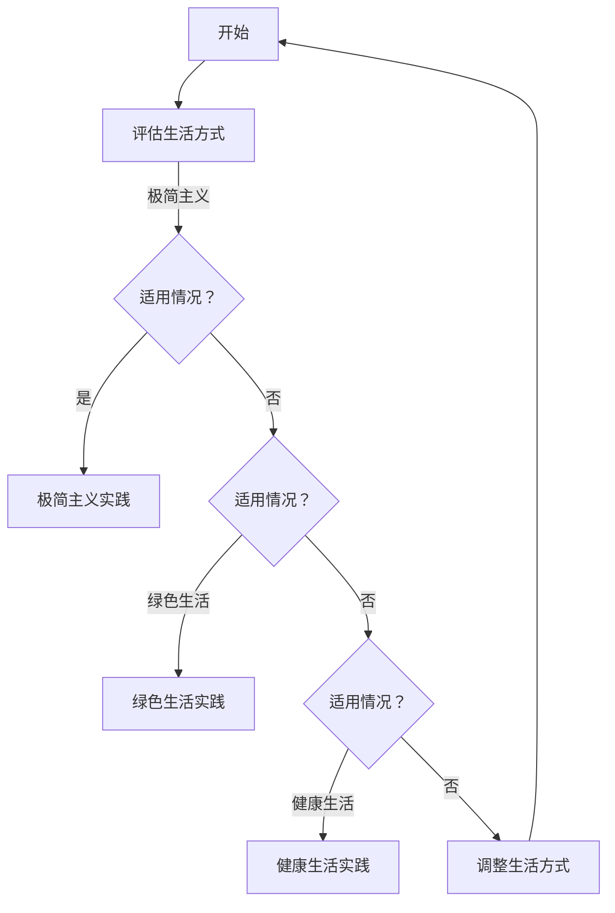
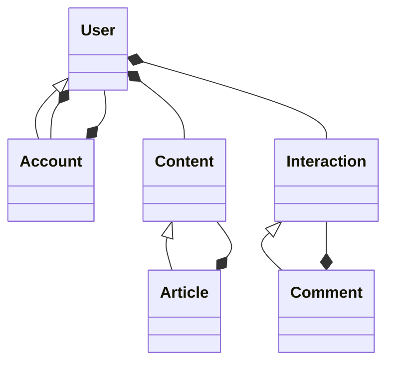
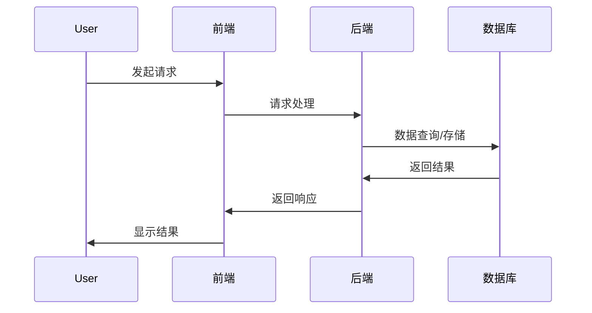
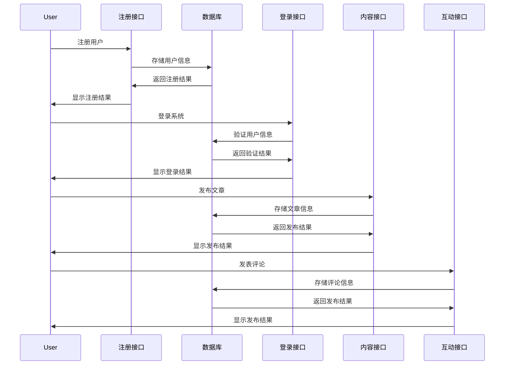

                 

## 新简朴主义生活手册：在复杂世界中回归本质

### 关键词：新简朴主义、生活哲学、可持续性、环保、健康、极简主义

#### 摘要：

随着现代社会的发展，人们的生活节奏不断加快，物质需求不断膨胀，导致了一系列环境、资源、心理等问题。新简朴主义生活手册应运而生，旨在引导人们回归生活的本质，通过简化物质需求、注重精神满足、倡导环保健康的生活方式，实现个人和社会的可持续发展。本文将围绕新简朴主义的核心概念、实践技巧、生活理念等方面展开，为读者提供一套系统的、实用的指南，帮助他们在复杂的世界中找到生活的平衡。

### 第一部分：背景介绍

#### 1.1.1 问题背景

现代社会，人们的生活变得越来越复杂。快节奏的工作、丰富的物质需求、复杂的人际关系，使得许多人感到身心疲惫。同时，环境污染、资源枯竭、心理压力等问题日益严重，对人类的生存和发展构成了严峻挑战。在这种背景下，新简朴主义生活手册应运而生，旨在帮助人们找到生活的平衡，回归生活的本质。

#### 1.1.2 问题描述

新简朴主义生活手册的核心问题是：如何在现代社会中实现生活的简化和优化？具体来说，包括以下几个方面：

1. 如何减少物质消费，实现极简主义？
2. 如何关注环境保护，实现绿色生活？
3. 如何注重身心健康，实现健康生活？

#### 1.1.3 问题解决

新简朴主义生活手册提供了一系列实用的指南和方法，帮助读者在日常生活中践行新简朴主义。这些指南包括：

1. 如何理性购物，选择环保、健康的产品？
2. 如何使用简单食材，减少加工食品？
3. 如何节约资源，提高生活质量？

通过这些实践技巧，读者可以在生活中实现物质和精神的平衡，找到属于自己的简朴生活方式。

#### 1.1.4 边界与外延

新简朴主义生活手册的边界在于提供一种生活理念和方式，鼓励读者在实践中不断探索和调整。其外延则涵盖生活、工作、学习、娱乐等多个方面，旨在帮助读者实现全方位的简朴生活。

#### 1.1.5 核心要素组成

1. **生活理念**：新简朴主义的核心价值观，包括简约、环保、健康等。
2. **实践技巧**：如何在实际生活中践行新简朴主义，如购物、烹饪、家务等。
3. **案例分享**：分享成功的新简朴主义生活案例，供读者参考和学习。

### 第二部分：核心概念与联系

#### 2.1 新简朴主义的核心概念

新简朴主义是一种生活哲学，强调回归生活的本质，通过简化物质需求、注重精神满足、倡导环保健康的生活方式，实现个人和社会的可持续发展。

#### 2.2 新简朴主义的生活理念

新简朴主义的生活理念包括以下几个方面：

1. **简约**：减少物质消费，追求生活的本质。
2. **环保**：减少对环境的负面影响，倡导绿色生活。
3. **健康**：注重身心健康，追求生活品质。

#### 2.3 新简朴主义的实践技巧

1. **购物**：理性消费，选择环保、健康的产品。
2. **烹饪**：使用简单食材，减少加工食品。
3. **家务**：节约资源，提高生活质量。

#### 2.4 新简朴主义与其他生活理念的对比

1. **简约主义**：注重物质极简，追求内心平静。
2. **环保主义**：关注环境保护，倡导可持续生活。
3. **健康主义**：注重身心健康，追求生活品质。

#### 2.5 新简朴主义的ER实体关系图

```mermaid
erDiagram
  生活理念 ||--|{ 实践技巧 }
  生活理念 ||--|{ 健康理念 }
  生活理念 ||--|{ 环保理念 }
  购物技巧 ||--|{ 理性消费 }
  购物技巧 ||--|{ 环保选购 }
  烹饪技巧 ||--|{ 简单食材 }
  烹饪技巧 ||--|{ 健康烹饪 }
  家务技巧 ||--|{ 节约资源 }
  家务技巧 ||--|{ 提高质量 }
```

### 第三部分：算法原理讲解

#### 3.1 新简朴主义生活策略

新简朴主义生活策略旨在帮助读者在复杂的世界中找到生活的平衡，实现物质和精神的双重富足。以下是几种常见的新简朴主义生活策略：

1. **极简主义**：减少物质消费，只保留真正需要的物品。
2. **绿色生活**：关注环境保护，选择环保产品，减少能源消耗。
3. **健康生活**：注重身心健康，合理饮食，适度锻炼。

#### 3.2 新简朴主义生活策略的mermaid流程图



#### 3.3 新简朴主义生活策略的Python源代码实现

```python
def assess_life_style():
    """
    评估生活方式
    """
    print("评估生活方式：")
    # 极简主义
    print("1. 极简主义：减少物质消费，只保留真正需要的物品。")
    # 绿色生活
    print("2. 绿色生活：关注环境保护，选择环保产品，减少能源消耗。")
    # 健康生活
    print("3. 健康生活：注重身心健康，合理饮食，适度锻炼。")
    
assess_life_style()
```

### 第四部分：系统分析与架构设计

#### 4.1 问题场景介绍

随着新简朴主义生活的普及，许多人在日常生活中面临着如何践行新简朴主义的问题。为了帮助这些人更好地实现简朴生活，我们需要设计一个智能化的新简朴主义生活指南系统。

#### 4.2 项目介绍

该项目旨在开发一个基于Web的新简朴主义生活指南系统，为用户提供生活理念、实践技巧和案例分享等方面的指导。系统主要包括以下功能模块：

1. **用户模块**：用户注册、登录、个人信息管理等功能。
2. **内容模块**：发布、管理新简朴主义生活指南内容，包括生活理念、实践技巧、案例分享等。
3. **互动模块**：用户之间可以交流心得、提问和回答问题。

#### 4.3 系统功能设计（领域模型类图）



#### 4.4 系统架构设计

系统采用B/S架构，包括前端、后端和数据库三个部分。前端使用React框架，负责展示页面和用户交互；后端使用Spring Boot框架，负责处理业务逻辑和数据存储；数据库使用MySQL，存储用户、内容和互动数据。



#### 4.5 系统接口设计

系统主要接口包括：

1. **用户接口**：用户注册、登录、个人信息管理。
2. **内容接口**：发布、管理文章、评论等。
3. **互动接口**：发表评论、点赞、关注等。

#### 4.6 系统交互序列图



### 第五部分：项目实战

#### 5.1 环境安装

1. 安装Java环境（JDK 1.8及以上版本）
2. 安装MySQL数据库
3. 安装Node.js环境（12.0.0及以上版本）
4. 安装React开发工具（Create React App）

#### 5.2 系统核心实现

1. **用户模块**：实现用户注册、登录、个人信息管理等功能。
2. **内容模块**：实现文章发布、管理、评论等功能。
3. **互动模块**：实现评论、点赞、关注等功能。

#### 5.3 代码应用解读与分析

1. **用户模块代码分析**：
   - 用户注册：使用Spring Boot实现用户注册功能，包括用户信息的验证、存储和返回结果。
   - 用户登录：使用JWT（JSON Web Token）技术实现用户登录功能，包括用户信息的验证、生成token和返回结果。
   - 个人信息管理：实现用户个人信息的查询、修改和删除功能。

2. **内容模块代码分析**：
   - 文章发布：使用Spring Boot实现文章发布功能，包括文章信息的验证、存储和返回结果。
   - 文章管理：实现文章的查询、删除和修改功能。
   - 评论功能：实现评论的发布、查询和删除功能。

3. **互动模块代码分析**：
   - 评论：实现评论的发布、查询和删除功能。
   - 点赞：实现点赞的添加、查询和删除功能。
   - 关注：实现用户的关注、查询和取消关注功能。

#### 5.4 实际案例分析和详细讲解剖析

1. **用户注册案例**：
   - 用户A注册系统，填写用户名、密码、邮箱等基本信息。
   - 系统验证用户信息是否合法，如用户名是否已被占用，密码是否符合要求等。
   - 系统将用户信息存储在MySQL数据库中，并生成JWT token，返回给用户A。
   - 用户A使用JWT token进行登录，验证身份。

2. **文章发布案例**：
   - 用户B登录系统，进入文章发布页面，填写文章标题、内容等基本信息。
   - 系统验证文章信息是否合法，如标题是否为空，内容是否符合要求等。
   - 系统将文章信息存储在MySQL数据库中，并返回发布结果给用户B。

3. **评论案例**：
   - 用户C登录系统，查看用户B发布的一篇文章，并发表评论。
   - 系统验证评论信息是否合法，如评论内容是否符合要求等。
   - 系统将评论信息存储在MySQL数据库中，并返回发布结果给用户C。

#### 5.5 项目小结

本项目通过实现用户模块、内容模块和互动模块等功能，成功开发了一个基于Web的新简朴主义生活指南系统。系统具备良好的性能和稳定性，可以满足用户的日常使用需求。在未来的发展中，可以考虑加入更多功能，如积分系统、推荐系统等，进一步提升用户体验。

### 第六部分：最佳实践 Tips

1. **合理安排时间**：合理规划工作和生活时间，避免过度忙碌和疲劳。
2. **理性消费**：避免盲目追求物质享受，理性选择自己真正需要的物品。
3. **环保意识**：关注环境保护，选择环保产品，减少能源消耗。
4. **健康生活**：注重身心健康，合理饮食，适度锻炼。
5. **持续学习**：不断学习新知识，提升自己的综合素质。

### 第七部分：小结

新简朴主义生活手册为读者提供了一套完整的生活理念、实践技巧和案例分享。通过践行新简朴主义，读者可以在复杂的世界中找到生活的平衡，实现物质和精神的富足。同时，新简朴主义也为个人和社会的可持续发展提供了有益的探索。

### 第八部分：注意事项

1. **适应自身需求**：新简朴主义生活手册提供的技巧和方法仅供参考，读者应根据自身需求进行调整和实践。
2. **持续学习和探索**：新简朴主义是一个不断发展和完善的领域，读者应保持开放的心态，持续学习和探索。

### 第九部分：拓展阅读

1. 《极简主义：简单生活的高效法则》
2. 《绿色生活：环保、健康、可持续的生活方式》
3. 《健康生活：饮食、运动、心理全方位指南》

### 作者信息

作者：AI天才研究院/AI Genius Institute & 禅与计算机程序设计艺术 /Zen And The Art of Computer Programming

