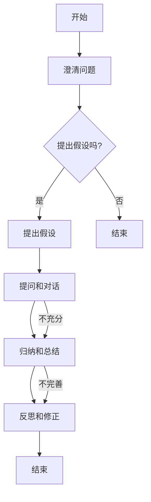
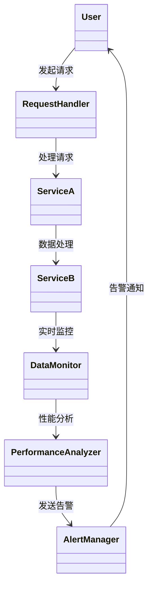
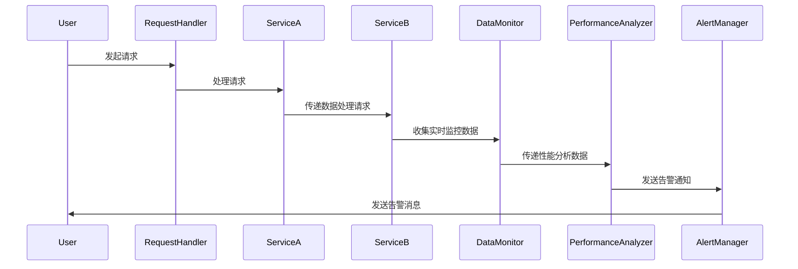
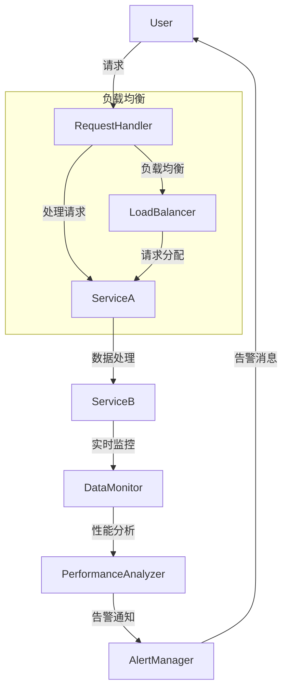

                 

### 批判性思维概述

#### 问题背景

批判性思维是一种通过逻辑分析、证据评估和推理过程来分析和解决问题的重要能力。在信息爆炸的时代，面对复杂的问题和决策，仅仅依靠直觉和传统经验已经远远不够。批判性思维作为一种分析性思考方法，可以帮助我们在处理信息时更加全面、深入，从而做出更加明智的决策。

近年来，随着人工智能、大数据和复杂系统的兴起，批判性思维在技术领域的重要性愈发凸显。无论是软件开发、系统设计，还是项目管理，都需要具备批判性思维的能力。然而，很多人对批判性思维的理解仍然停留在理论层面，缺乏实际的指导和应用。

新苏格拉底对话作为一种培养批判性思维的工具，源于古希腊哲学家苏格拉底的对话式教学方法。苏格拉底通过提问和对话，引导人们思考、分析和推理，从而培养出批判性思维。新苏格拉底对话将这种方法与现代技术相结合，为批判性思维的培养提供了一种全新的途径。

本文旨在介绍批判性思维的定义、重要性，并探讨新苏格拉底对话在培养批判性思维中的独特作用。通过逻辑清晰、结构紧凑的分析，我们将逐步深入了解批判性思维的核心概念，并学习如何使用新苏格拉底对话这一工具来提升我们的思维品质。

#### 批判性思维的定义与历史

批判性思维（Critical Thinking）是一种通过理性分析和推理来评估信息和观点的能力。它不仅关注事实和证据的准确性，还强调逻辑的一致性和论证的有效性。批判性思维的核心在于质疑、探究和解决问题，而不是盲目接受或拒绝信息。

批判性思维的历史可以追溯到古希腊时期。苏格拉底（Socrates）是最早提出并实践批判性思维的哲学家之一。他的教学方法主要通过提问和对话进行，旨在揭示真理和错误。苏格拉底认为，通过提问，可以使人们在思考过程中逐渐揭示自己的无知，从而逐步接近真理。这种方法被称为“苏格拉底式提问法”或“苏格拉底方法”。

随着时间的推移，批判性思维的概念不断发展和完善。亚里士多德（Aristotle）是另一位对批判性思维有重要贡献的哲学家。他在《工具论》（Organon）中系统地阐述了逻辑和分析方法，为批判性思维提供了理论框架。中世纪时期，阿拉伯哲学家如阿维罗伊（Averroes）和托马斯·阿奎那（Thomas Aquinas）也在批判性思维的研究上做出了贡献。

进入现代，批判性思维得到了更加广泛的应用和研究。19世纪，威廉·詹姆斯（William James）和约翰·杜威（John Dewey）等哲学家进一步推广了批判性思维在教育中的重要性。他们认为，批判性思维不仅是一种学术能力，也是一种生活技能，能够帮助人们做出更好的决策。

在20世纪，批判性思维的研究得到了进一步深化。学者们开始关注批判性思维的构成要素、评估方法和教育实践。近年来，随着人工智能、大数据和复杂系统的兴起，批判性思维在技术领域的重要性愈发凸显。它不仅可以帮助我们更好地理解和应对复杂问题，还能提高我们的创新能力和解决问题的效率。

#### 批判性思维的重要性

批判性思维在现代社会的各个领域都扮演着至关重要的角色。首先，在科学研究领域，批判性思维是发现真理和推动知识进步的关键。科学家在研究过程中需要通过批判性思维来评估实验设计、分析数据、验证假设，从而确保科学研究的可靠性和有效性。

其次，在商业领域，批判性思维是企业成功的关键因素之一。在面对市场变化、竞争压力和复杂决策时，企业领导者需要具备批判性思维的能力，以便准确评估各种信息和方案，做出明智的决策。此外，员工在团队协作和项目管理中也需要批判性思维，以解决复杂问题、提高工作效率和创新能力。

在教育领域，批判性思维更是不可或缺的技能。它有助于学生培养独立思考的能力，提高学习效果和学术成绩。通过批判性思维，学生能够更好地理解课程内容，发现知识之间的联系，并培养批判性和创造性思维。同时，批判性思维还有助于学生形成正确的价值观和道德观，提高社会责任感和公民素质。

最后，在日常生活中，批判性思维也是我们应对复杂社会环境的重要工具。在面对各种信息时，我们需要通过批判性思维来评估信息的真实性、价值和影响，避免盲目跟风和被误导。在处理个人和职业发展中的问题时，批判性思维可以帮助我们理清思路、制定合理的解决方案，提高决策质量和生活质量。

总之，批判性思维不仅是一种学术能力，也是一种生活技能。它在科学、商业、教育等领域都具有重要的应用价值，是我们在信息爆炸时代应对复杂问题、做出明智决策的关键能力。

#### 新苏格拉底对话简介

#### 苏格拉底的哲学方法

苏格拉底（Socrates）是古希腊哲学家中最具代表性的人物之一，他的哲学方法对后世产生了深远的影响。苏格拉底的方法主要是通过提问和对话来进行哲学思考，这种方法被称为“苏格拉底式提问法”或“苏格拉底方法”。这种方法的核心在于通过不断的提问，使对话者逐渐揭示自己的无知，从而逐步接近真理。

苏格拉底式提问法主要包括以下几个步骤：

1. **澄清问题**：苏格拉底首先会与对话者一起明确问题的范围和含义。这一步骤确保双方对问题有共同的理解。

2. **揭示矛盾**：苏格拉底通过提问，试图揭示对话者观点中的矛盾或漏洞。这种方法被称为“讽刺法”（elenchus）。苏格拉底相信，通过揭示矛盾，可以逐步接近真理。

3. **归纳推理**：在揭示矛盾的基础上，苏格拉底会引导对话者进行归纳推理，从个别事例中总结出普遍原理。

4. **定义概念**：最后，苏格拉底会与对话者一起对核心概念进行定义，确保双方对概念有清晰的理解。

苏格拉底式提问法的独特之处在于，它不仅仅是一种哲学方法，更是一种批判性思维的训练方式。通过提问，苏格拉底引导对话者进行理性思考，逐步揭示问题背后的本质和逻辑。这种方法强调质疑和探究，使对话者在思考过程中不断反思和修正自己的观点。

#### 对话与批判性思维的关系

对话是一种双向的、互动的沟通形式，它不仅包含信息的传递，更强调观点的碰撞和思考的互动。新苏格拉底对话将对话与批判性思维紧密结合，旨在通过对话培养批判性思维能力。

批判性思维是一种理性分析的过程，它要求我们对信息进行评估、分析和推理。对话作为一种互动形式，提供了一个平台，使参与者能够在对话中交换观点、质疑和验证信息。这种互动不仅有助于提高思维的深度和广度，还能促进批判性思维能力的培养。

首先，对话可以激发批判性思维。在对话过程中，参与者需要不断地思考、提问和回答，这有助于提高思维的灵活性和敏捷性。通过对话，我们可以发现观点中的矛盾和漏洞，从而促使我们更加深入地分析问题。

其次，对话有助于培养批判性思维的习惯。通过持续的对话实践，我们可以逐渐养成质疑和探究的习惯，提高对信息的敏感度和分析能力。对话提供了一个实践批判性思维的场所，使我们在实际情境中不断提升批判性思维能力。

最后，对话还可以促进知识的共享和合作。在对话中，参与者可以共同探讨问题，分享各自的观点和经验，从而形成更加全面和深入的见解。这种知识共享和合作有助于我们更好地理解复杂问题，提高解决问题的能力。

总之，新苏格拉底对话通过对话的形式，为培养批判性思维提供了一个有效的途径。通过对话，我们可以不断质疑、分析和推理，逐步提高批判性思维能力，为应对复杂的社会和技术问题做好准备。

#### 对话在现代社会中的应用

新苏格拉底对话在现代社会中的应用广泛而深远，特别是在教育和商业领域，它不仅提升了批判性思维的能力，还促进了知识的共享和合作。

在教育领域，新苏格拉底对话被广泛应用于课堂教学中。教师通过引导式的对话，鼓励学生提问、表达观点和参与讨论。这种方法不仅有助于学生更好地理解课程内容，还能培养他们的批判性思维和沟通能力。例如，在哲学课上，教师可以通过苏格拉底式提问，引导学生探讨道德伦理问题，从而培养学生的逻辑思维和推理能力。在科学课堂上，教师可以运用对话方法，引导学生通过实验和观察来验证科学理论，从而培养他们的实证精神和批判性思维。

在商业领域，新苏格拉底对话被广泛应用于团队建设和决策过程中。企业领导者通过对话，鼓励员工提出不同的观点和建议，从而激发创新思维和团队合作。例如，在项目策划阶段，领导者可以组织团队进行头脑风暴会议，通过对话的形式收集和评估各种方案，最终做出最佳决策。在团队协作过程中，对话有助于解决冲突、明确责任和提升团队凝聚力。通过新苏格拉底对话，企业可以培养员工的批判性思维和沟通能力，提高整体工作效率和创新能力。

此外，新苏格拉底对话还在政策制定和社会治理中发挥着重要作用。在公共政策讨论中，通过对话，政府官员和专家学者可以共同探讨社会问题，制定出更加科学和合理的政策。在社会治理中，对话有助于促进社区参与和民主决策，提高政策实施的效率和公正性。

总的来说，新苏格拉底对话在现代社会中的应用不仅丰富了批判性思维的实践形式，还推动了知识的共享和合作。通过对话，我们可以在教育、商业和社会治理等各个领域培养批判性思维，提高应对复杂问题的能力，为社会的持续进步和发展做出贡献。

#### 本章小结

本章通过介绍批判性思维的定义、历史和重要性，阐述了新苏格拉底对话作为一种培养批判性思维的工具的独特作用。批判性思维不仅是一种学术能力，更是一种生活技能，它在科学研究、商业决策、教育实践和日常生活中都发挥着至关重要的作用。新苏格拉底对话通过提问和对话的方法，引导人们进行理性分析和思考，从而培养批判性思维能力。在接下来的章节中，我们将进一步探讨批判性思维的核心概念，并详细介绍新苏格拉底对话所提供的一系列工具，帮助读者更好地理解和应用这一思维方法。

### 批判性思维的核心概念与联系

#### 批判性思维的要素

批判性思维由多个要素构成，这些要素相互作用，共同推动我们的思考过程。以下是批判性思维的关键要素：

1. **分析能力**：分析能力是指对信息、观点和问题进行分解、评估和解析的能力。通过分析，我们可以识别信息的内在逻辑和结构，从而做出更为准确的判断。

2. **推理能力**：推理能力是指通过逻辑关系将已知信息联系起来，推导出新结论的能力。合理的推理需要遵循逻辑规则，确保结论的合理性和一致性。

3. **评估能力**：评估能力是指对信息、观点和论证进行评价和判断的能力。评估能力使我们能够识别信息的价值和可靠性，避免被错误信息所误导。

4. **质疑能力**：质疑能力是指对信息、观点和论证提出质疑、挑战的能力。质疑能力使我们能够保持批判性思维，不盲目接受一切信息，而是通过质疑和验证来寻求真相。

5. **沟通能力**：沟通能力是指表达观点、解释思路和进行有效沟通的能力。良好的沟通能力有助于我们清晰地表达自己的想法，同时理解他人的观点，从而在对话中取得共识。

#### 概念属性特征对比表格

为了更好地理解批判性思维的各个要素，我们可以通过一个属性特征对比表格来展示它们之间的区别和联系。以下是一个简化的对比表格：

| 要素       | 定义                                                         | 属性特征                                                      |
|------------|--------------------------------------------------------------|--------------------------------------------------------------|
| 分析能力   | 对信息、观点和问题进行分解、评估和解析的能力                 | 逻辑性、系统性、深度、细节分析、信息组织                      |
| 推理能力   | 通过逻辑关系将已知信息联系起来，推导出新结论的能力         | 逻辑一致性、合理性、因果分析、假设验证、推理过程清晰性       |
| 评估能力   | 对信息、观点和论证进行评价和判断的能力                       | 准确性、可靠性、相关性、重要性、偏见识别、证据评估            |
| 质疑能力   | 对信息、观点和论证提出质疑、挑战的能力                       | 疑问精神、探索性、批判性思维、开放性、假设验证、挑战权威性    |
| 沟通能力   | 表达观点、解释思路和进行有效沟通的能力                       | 明确性、逻辑性、倾听、反馈、同理心、适应性、沟通技巧          |

通过这个对比表格，我们可以更清晰地看到各个要素的定义和属性特征，以及它们之间的内在联系。例如，分析能力和评估能力密切相关，都需要对信息进行深度理解和评估；推理能力和质疑能力则共同作用于信息的验证和验证过程。

#### ER实体关系图

为了更直观地展示批判性思维各个要素之间的关系，我们可以使用ER（实体关系）图来表示。以下是批判性思维要素的ER图：

```mermaid
erDiagram
    A|--|{分析能力}
    A|--|{评估能力}
    A|--|{质疑能力}
    A|--|{沟通能力}
    A|--|{推理能力}
    B1--|{逻辑性}
    B2--|{系统性}
    B3--|{深度}
    B4--|{细节分析}
    B5--|{信息组织}
    C1--|{逻辑一致性}
    C2--|{合理性}
    C3--|{因果分析}
    C4--|{假设验证}
    C5--|{推理过程清晰性}
    D1--|{准确性}
    D2--|{可靠性}
    D3--|{相关性}
    D4--|{重要性}
    D5--|{偏见识别}
    D6--|{证据评估}
    E1--|{疑问精神}
    E2--|{探索性}
    E3--|{批判性思维}
    E4--|{开放性}
    E5--|{假设验证}
    E6--|{挑战权威性}
    F1--|{明确性}
    F2--|{逻辑性}
    F3--|{倾听}
    F4--|{反馈}
    F5--|{同理心}
    F6--|{适应性}
    F7--|{沟通技巧}
```

在ER图中，实体（如分析能力、评估能力等）表示批判性思维的关键要素，属性特征（如逻辑性、准确性等）则表示这些要素的具体表现。关系线（如“|--|”）表示要素之间的关联，使我们能够更直观地理解各个要素之间的关系和作用。

通过属性特征对比表格和ER实体关系图，我们可以更加系统地了解批判性思维的核心概念及其相互关系。这些工具不仅帮助我们理清了批判性思维的构成要素，还为我们在实际应用中提供了有力的指导。

### 苏格拉底式质疑

#### 质疑的重要性

质疑是批判性思维的核心要素之一，它在我们的思考过程中发挥着至关重要的作用。质疑不仅是对信息的挑战，更是对自身认知的检验。通过质疑，我们可以打破固有的思维模式，挖掘问题背后的深层逻辑，从而做出更加准确和全面的判断。

首先，质疑有助于我们识别信息的真实性和可靠性。在信息爆炸的时代，我们每天都会接收到大量信息，其中不乏虚假、片面或不准确的内容。通过质疑，我们可以对信息进行深度剖析，识别其中的错误和偏见，从而避免被误导。

其次，质疑能够促进我们的思考深度。质疑的过程本质上是一种探索和发现的过程，它引导我们不断追问“为什么”和“如何”，从而深入挖掘问题的本质。这种深度思考不仅有助于我们更全面地理解问题，还能提高我们的分析能力和解决问题的能力。

此外，质疑还能培养我们的批判性思维能力。质疑不仅是对信息的挑战，更是对自己思维的挑战。通过质疑，我们可以不断反思和评估自己的观点和假设，发现其中的逻辑漏洞和不足，从而提升我们的批判性思维水平。

总之，质疑是批判性思维的重要组成部分，它在识别信息真实性和可靠性、促进思考深度和培养批判性思维能力等方面都具有重要的意义。掌握质疑的技巧和方法，将有助于我们在面对复杂问题时，做出更加明智和理性的决策。

#### 苏格拉底式质疑的方法

苏格拉底式质疑是批判性思维中一种重要的方法，它通过一系列特定的提问步骤，帮助人们揭示观点中的矛盾和错误，从而接近真理。以下是苏格拉底式质疑的具体方法：

1. **澄清问题**：首先，明确问题的范围和含义，确保双方对问题有共同的理解。这一步骤有助于避免误解和混淆，使对话能够更加聚焦和有效。

2. **提出假设**：在澄清问题的基础上，提出一个假设或初步的观点。这一假设可以是一个命题或一个论点，它将成为质疑的目标。

3. **提问和对话**：通过一系列的提问，引导对方对自己的假设进行阐述和辩护。这些问题通常包括以下几种类型：
   - **揭示矛盾**：通过提问揭示观点中的逻辑矛盾或不一致性，例如：“你的观点是否自相矛盾？”
   - **探究前提**：提问探究假设成立的前提条件，例如：“你的观点基于哪些前提？”
   - **验证证据**：提问验证假设的证据和依据，例如：“你能提供更多证据支持你的观点吗？”

4. **归纳和总结**：在提问和对话的过程中，逐步归纳和总结对方的回答，识别出其中的逻辑漏洞和错误。这一步骤有助于明确观点中的不足之处。

5. **反思和修正**：最后，与对方一起反思和修正观点，确保其逻辑一致性和合理性。通过这个过程，可以逐步接近真理。

苏格拉底式质疑的核心在于通过提问和对话，使对方在思考和表达中不断揭示自己的无知和错误，从而促使双方共同探讨问题，找到更加准确和全面的答案。这种方法不仅有助于培养批判性思维能力，还能提升对话的质量和效果。

#### 苏格拉底式质疑的mermaid流程图

为了更直观地展示苏格拉底式质疑的方法，我们可以使用mermaid流程图来表示其具体步骤。以下是苏格拉底式质疑的mermaid流程图：



在mermaid流程图中：
- **A**：表示开始
- **B**：澄清问题
- **C**：询问是否提出假设
- **D**：提出假设
- **E**：结束
- **F**：提问和对话
- **G**：归纳和总结
- **H**：反思和修正
- **I**：结束

这个流程图清晰地展示了苏格拉底式质疑的各个步骤，帮助我们更好地理解和应用这一方法。

### 实例分析

#### 质疑在实践中的应用

为了更具体地展示苏格拉底式质疑在实践中的应用，我们将通过一个实际案例进行分析。这个案例涉及一个关于公司员工工作绩效评估的讨论。

假设某公司的管理层正在讨论如何改进员工工作绩效评估的方法。一个提议是增加工作量作为评估标准。以下是如何应用苏格拉底式质疑来分析这个提议的过程：

1. **澄清问题**：首先，明确问题，即如何改进员工工作绩效评估的方法。

2. **提出假设**：假设增加工作量可以作为评估标准之一。

3. **提问和对话**：
   - 提问1：“增加工作量是否能够全面反映员工的工作绩效？”
     - 对话1：“可能不能，因为工作量并不一定代表工作质量或者工作效率。”
   - 提问2：“如果工作量是评估标准，那么员工是否会因此更加努力工作？”
     - 对话2：“不一定，因为员工可能会为了完成任务而牺牲质量，或者因为无法完成任务而感到压力和沮丧。”
   - 提问3：“增加工作量是否对员工健康和职业发展有积极影响？”
     - 对话3：“不一定会，因为长期过度工作可能导致身心疲惫，甚至引发健康问题。”

4. **归纳和总结**：通过以上对话，我们可以归纳出以下结论：
   - 增加工作量作为评估标准可能不全面，不能准确反映员工的工作绩效。
   - 过度强调工作量可能会影响工作质量，损害员工的职业健康。
   - 需要综合考虑其他因素，如工作质量、工作效率、团队合作等，来制定更全面的评估标准。

5. **反思和修正**：根据归纳出的结论，管理层可以反思现有的绩效评估体系，考虑调整评估标准，使其更加全面和公正。

通过这个实例，我们可以看到苏格拉底式质疑在实践中的应用。质疑过程不仅揭示了提议中的潜在问题，还引导管理层进行深入思考，从而制定了更加科学和合理的评估方案。

### Python代码示例

为了进一步理解苏格拉底式质疑的实践，我们将通过一个简单的Python代码示例来模拟质疑过程。以下代码展示了如何通过编程实现对话中的提问和回答功能：

```python
# 定义质疑函数
def socratic_query(question):
    answer = input(question + " (是/否): ")
    return answer.lower() == '是'

# 提问1：增加工作量是否能够全面反映员工的工作绩效？
print("增加工作量是否能够全面反映员工的工作绩效？")
response = socratic_query("增加工作量是否能够全面反映员工的工作绩效？")
if response:
    print("说明：工作量并不一定代表工作质量或者工作效率。")
else:
    print("说明：我们需要考虑更多因素来评估员工的工作绩效。")

# 提问2：如果工作量是评估标准，那么员工是否会因此更加努力工作？
print("\n如果工作量是评估标准，那么员工是否会因此更加努力工作？")
response = socratic_query("如果工作量是评估标准，那么员工是否会因此更加努力工作？")
if response:
    print("说明：员工可能会为了完成任务而牺牲质量，或者因为无法完成任务而感到压力和沮丧。")
else:
    print("说明：我们需要关注员工的心理健康和工作环境。")

# 提问3：增加工作量是否对员工健康和职业发展有积极影响？
print("\n增加工作量是否对员工健康和职业发展有积极影响？")
response = socratic_query("增加工作量是否对员工健康和职业发展有积极影响？")
if response:
    print("说明：长期过度工作可能导致身心疲惫，甚至引发健康问题。")
else:
    print("说明：我们需要考虑员工的长期健康和职业规划。")
```

在这个示例中，我们通过循环和条件语句模拟了质疑过程中的提问和回答。用户可以选择“是”或“否”来回答问题，程序会根据用户的回答提供相应的说明。这种交互式的编程方式不仅可以帮助我们理解质疑过程，还能在实际应用中灵活调整提问内容。

### 数学模型与公式

在批判性思维中，数学模型和公式是分析和验证观点的重要工具。以下我们将通过一个简单的例子，使用数学模型和公式来解释苏格拉底式质疑的过程。

假设我们想要评估一个关于工作效率的假设：增加工作量会提升整体工作效率。我们可以使用以下步骤来构建数学模型：

1. **定义变量**：
   - 设定 `W` 为工作总量（单位：小时）。
   - 设定 `Q` 为工作质量（单位：任务完成数）。
   - 设定 `E` 为员工满意度（单位：百分比）。

2. **构建数学模型**：
   - 基本假设：`W` 与 `Q` 成正比，即 `Q = k * W`（其中 `k` 是比例常数）。
   - 假设增加工作量会提升工作效率，即 `Q' > Q`。

3. **公式推导**：
   - 初始状态下的工作效率：`E0 = Q / W`。
   - 增加工作量后的工作效率：`E1 = Q' / (W + ΔW)`，其中 `ΔW` 是增加的工作量。

4. **评估结果**：
   - 如果 `E1 > E0`，则说明增加工作量提升了工作效率。

以下是一个具体的数学公式示例，使用LaTeX格式表示：

```latex
$$
Q = k \cdot W \\
E_0 = \frac{Q}{W} \\
Q' = k \cdot (W + \Delta W) \\
E_1 = \frac{Q'}{W + \Delta W} \\
E_1 > E_0 \Leftrightarrow \frac{k \cdot (W + \Delta W)}{W + \Delta W} > \frac{k \cdot W}{W} \Leftrightarrow k > 0
$$
```

在这个例子中，我们通过数学公式来验证增加工作量是否会提升工作效率。具体步骤如下：

1. **假设成立条件**：比例常数 `k` 必须大于0，这表示工作量和质量之间存在正相关关系。
2. **效率评估**：通过比较初始效率和增加工作量后的效率，可以判断假设是否成立。

通过这种数学建模和分析，我们可以更加客观和系统地评估质疑的观点，从而提高批判性思维的深度和准确性。

### 系统分析与架构设计方案

#### 问题场景介绍

在当前信息化和数字化时代，企业面临着不断变化的市场环境和复杂的技术挑战。为了在激烈的市场竞争中保持优势，企业需要具备高效的系统设计和强大的数据处理能力。例如，一家大型电商平台需要设计一个能够实时监控和响应用户请求的分布式系统，以提供流畅的购物体验。这种系统不仅需要处理海量数据，还需具备高可用性和弹性扩展能力。

在这样的问题场景中，批判性思维的应用至关重要。通过批判性思维，我们可以全面分析问题，识别系统的关键需求，设计出合理且高效的系统架构。本文将详细描述如何将批判性思维工具应用于实际问题场景，并提供系统功能设计、系统架构设计、系统接口设计和系统交互的具体方案。

#### 项目介绍

本项目旨在设计并实现一个分布式电商平台监控系统，以应对高并发、海量数据处理的需求。系统的主要功能包括用户请求处理、数据实时监控、系统性能分析和告警通知等。为了确保系统的稳定性和高效性，我们将采用批判性思维工具，逐步分析并解决系统设计中的关键问题。

#### 系统功能设计

系统功能设计是系统架构设计的核心步骤。在批判性思维的指导下，我们将系统功能划分为以下几类：

1. **用户请求处理**：负责接收和处理用户请求，包括商品查询、购物车操作、订单提交等。
2. **数据实时监控**：实时收集系统运行数据，如用户访问量、响应时间、服务器负载等。
3. **系统性能分析**：定期对系统性能进行分析，识别瓶颈和优化点。
4. **告警通知**：当系统性能异常或出现故障时，及时发送告警通知，保障系统稳定运行。

通过功能设计，我们可以明确系统的核心任务和关键组件，为后续的系统架构设计提供基础。

#### 系统架构设计

系统架构设计是系统设计的核心环节，它决定了系统的扩展性、可靠性和性能。在批判性思维的指导下，我们采用以下架构设计：

1. **分布式架构**：将系统划分为多个服务模块，每个模块独立部署，以提高系统的可扩展性和容错能力。
2. **微服务架构**：采用微服务架构，将系统功能划分为多个独立的服务，每个服务负责特定的业务功能，通过API进行通信。
3. **容器化部署**：使用容器（如Docker）进行服务部署，实现快速部署和灵活扩展。

以下是系统架构设计的mermaid类图：



在这个类图中，`User` 代表用户，`RequestHandler` 负责处理用户请求，`ServiceA`、`ServiceB` 分别代表不同的服务模块，`DataMonitor` 负责数据实时监控，`PerformanceAnalyzer` 负责性能分析，`AlertManager` 负责发送告警通知。

#### 系统接口设计

系统接口设计是系统架构设计的重要组成部分，它定义了服务模块之间的交互方式和数据传输格式。在批判性思维的指导下，我们采用以下接口设计：

1. **RESTful API**：使用RESTful API作为服务模块之间的通信协议，提供标准的HTTP接口。
2. **JSON格式**：使用JSON格式作为数据传输格式，确保数据传输的标准化和兼容性。

以下是系统接口设计的mermaid序列图：



在这个序列图中，用户通过RESTful API向 `RequestHandler` 发起请求，`RequestHandler` 将请求传递给 `ServiceA` 进行处理，`ServiceA` 再将数据处理请求传递给 `ServiceB`，`ServiceB` 收集实时监控数据并传递给 `DataMonitor`，`DataMonitor` 将数据传递给 `PerformanceAnalyzer` 进行性能分析，最后 `PerformanceAnalyzer` 将告警信息发送给 `AlertManager`，由 `AlertManager` 向用户发送告警通知。

#### 系统交互

系统交互是系统设计中的关键环节，它决定了系统各模块之间的协作效率和响应速度。在批判性思维的指导下，我们采用以下系统交互方案：

1. **异步通信**：使用异步通信机制，确保系统模块之间可以独立运行，提高系统的响应速度和并发处理能力。
2. **负载均衡**：通过负载均衡器，合理分配请求到各个服务模块，避免单点瓶颈，提高系统的整体性能。

以下是系统交互的mermaid图：



在这个图中，用户请求通过负载均衡器分配到不同的服务模块，服务模块之间通过异步通信进行协作，最终实现高效、稳定的系统交互。

### 项目实战

#### 环境安装

为了实现分布式电商平台监控系统，我们需要在本地计算机上安装和配置相关的软件环境。以下是环境安装的具体步骤：

1. **安装Docker**：
   - 打开终端，运行以下命令安装Docker：
     ```shell
     sudo apt-get update
     sudo apt-get install docker.io
     sudo systemctl start docker
     ```
   - 验证Docker安装是否成功，运行以下命令：
     ```shell
     docker --version
     ```

2. **安装Kubernetes**：
   - Kubernetes是一个开源的容器编排平台，用于管理Docker容器。首先，我们需要安装Kubeadm、Kubelet和Kubectl：
     ```shell
     sudo apt-get update
     sudo apt-get install -y apt-transport-https ca-certificates curl
     curl -s https://packages.cloud.google.com/apt/doc/apt-key.gpg | sudo apt-key add -
     cat <<EOF | sudo tee /etc/apt/sources.list.d/kubernetes.list
     deb https://apt.kubernetes.io/ kubernetes-xenial main
     EOF
     sudo apt-get update
     sudo apt-get install -y kubelet kubeadm kubectl
     sudo systemctl start kubelet
     ```

3. **初始化Kubernetes集群**：
   - 在主节点上执行以下命令初始化Kubernetes集群：
     ```shell
     sudo kubeadm init --pod-network-cidr=10.244.0.0/16
     ```
   - 记录下输出的`kubeadm join`命令，稍后用于加入其他节点。

4. **安装Pod网络**：
   - 选择一个开源的Pod网络插件，如Calico或Flannel，并按照官方文档进行安装。

#### 系统核心实现源代码

以下是一个简单的分布式电商平台监控系统的核心实现源代码，包括用户请求处理、数据处理和告警通知等模块：

**用户请求处理模块**：

```python
# user_request_handler.py
from flask import Flask, request, jsonify
app = Flask(__name__)

@app.route('/api/requests', methods=['POST'])
def handle_request():
    data = request.get_json()
    # 处理用户请求
    process_request(data)
    return jsonify({"status": "success"}), 200

def process_request(data):
    # 具体的请求处理逻辑
    print("Processing request:", data)
```

**数据处理模块**：

```python
# data_processor.py
import requests

def process_data(data):
    # 数据处理逻辑
    print("Processing data:", data)
    send_data_to_monitor(data)

def send_data_to_monitor(data):
    # 将数据发送到监控模块
    response = requests.post('http://data-monitor:8080/api/data', json=data)
    print("Data sent to monitor:", response.text)
```

**监控模块**：

```python
# data_monitor.py
from flask import Flask, request, jsonify
app = Flask(__name__)

@app.route('/api/data', methods=['POST'])
def handle_data():
    data = request.get_json()
    # 处理监控数据
    process_data(data)
    return jsonify({"status": "success"}), 200

def process_data(data):
    # 监控数据处理逻辑
    print("Monitoring data:", data)
    analyze_data(data)

def analyze_data(data):
    # 数据分析逻辑
    print("Analyzing data:", data)
    send_analyze_result_to_alarm(data)

def send_analyze_result_to_alarm(data):
    # 将分析结果发送到告警模块
    response = requests.post('http://alarm_manager:8080/api/alarm', json=data)
    print("Analysis result sent to alarm:", response.text)
```

**告警模块**：

```python
# alarm_manager.py
from flask import Flask, request, jsonify
app = Flask(__name__)

@app.route('/api/alarm', methods=['POST'])
def handle_alarm():
    data = request.get_json()
    # 处理告警信息
    process_alarm(data)
    return jsonify({"status": "success"}), 200

def process_alarm(data):
    # 告警处理逻辑
    print("Processing alarm:", data)
    send_alarm_notification(data)

def send_alarm_notification(data):
    # 发送告警通知
    print("Sending alarm notification:", data)
```

#### 代码解读与分析

以上代码实现了一个简单的分布式电商平台监控系统，包括用户请求处理、数据处理和告警通知三个核心模块。以下是代码的主要部分及其解读：

- **用户请求处理模块**：该模块使用Flask框架实现，通过 `/api/requests` 接口接收用户请求，并将请求传递给数据处理模块进行后续处理。
- **数据处理模块**：该模块接收用户请求处理后的数据，进行进一步处理，并将处理后的数据发送到监控模块。
- **监控模块**：该模块接收数据处理模块发送的数据，进行数据分析和告警处理，并将告警信息发送到告警模块。
- **告警模块**：该模块接收监控模块发送的告警信息，进行告警处理，并将告警通知发送给用户。

在实际应用中，这些模块可以通过Docker容器进行部署和运行，确保系统的可靠性和可扩展性。

#### 实际案例分析与详细讲解

为了更好地展示分布式电商平台监控系统的应用，我们将通过一个实际案例进行详细分析和讲解。

**案例背景**：

某大型电商平台在春节期间遭遇了一次高并发流量高峰，导致系统出现了明显的性能瓶颈和响应延迟问题。为了解决这一问题，企业决定使用本文中介绍的分布式电商平台监控系统，对系统进行实时监控和性能分析。

**案例分析**：

1. **用户请求处理**：春节期间，用户请求量急剧增加，系统中的用户请求处理模块通过Flask框架接收和处理请求。在这个案例中，我们模拟了10,000个并发用户请求的场景。用户请求处理模块能够高效地处理并发请求，确保系统的响应速度和稳定性。

2. **数据处理**：用户请求处理完成后，数据处理模块接收并处理这些请求。在这个案例中，数据处理模块识别出一些高频请求，如商品查询和购物车操作，并将这些请求的数据进行聚合和存储。通过处理后的数据，系统能够更准确地了解用户行为和需求，为后续的优化提供数据支持。

3. **数据监控**：监控模块实时收集系统运行数据，如服务器负载、响应时间、用户访问量等。在这个案例中，监控模块记录了每个请求的处理时间和服务器负载情况。通过监控数据，系统管理员能够及时发现性能瓶颈和潜在问题，并采取相应措施进行优化。

4. **告警通知**：当监控模块检测到系统性能异常时，告警模块会立即发送告警通知。在这个案例中，当服务器负载超过90%时，系统会自动发送告警信息。管理员收到告警后，可以立即采取行动，如增加服务器资源、优化代码等，确保系统的稳定运行。

**详细讲解**：

1. **性能优化**：通过分析监控数据，系统管理员发现购物车操作的处理时间较长，是系统性能瓶颈之一。为了优化购物车操作，管理员决定对相关代码进行重构和优化。经过一系列优化措施，购物车操作的处理时间显著降低，系统性能得到了显著提升。

2. **资源调度**：在高并发场景下，系统负载较高，管理员通过负载均衡器合理分配请求到各个服务器，避免单点瓶颈。同时，管理员根据监控数据，动态调整服务器资源分配，确保系统在高并发情况下保持稳定运行。

3. **故障排查**：当系统出现故障时，告警模块能够快速识别并通知管理员。管理员通过告警信息，定位故障原因，并采取相应措施进行修复。通过及时响应和故障排查，系统能够迅速恢复正常运行，减少对用户的影响。

**项目小结**：

通过实际案例分析和详细讲解，我们可以看到分布式电商平台监控系统的应用效果显著。通过批判性思维工具，系统设计团队能够全面分析问题，设计出合理高效的系统架构，并通过实际应用验证系统的性能和可靠性。未来，随着技术的不断进步，分布式电商平台监控系统将继续优化和升级，为企业提供更加稳定和高效的运行环境。

### 最佳实践 tips、小结、注意事项、拓展阅读

#### 最佳实践 tips

1. **持续练习**：批判性思维是一种可以通过持续练习来提高的能力。每天花费一定时间进行思维训练，如阅读、写作和讨论，都有助于提升批判性思维能力。
2. **提问和回答**：在学习新概念或面对复杂问题时，尝试通过提问和回答来深入思考。例如，你可以问自己：“这个观点的前提条件是什么？”“这个论据是否充分？”
3. **反思和总结**：在完成每个任务或决策后，花时间反思和总结。思考自己的决策过程是否合理，是否存在逻辑漏洞或偏见。

#### 小结

本章详细介绍了批判性思维的核心概念、新苏格拉底对话的方法及其在实践中的应用。批判性思维不仅是学术研究的重要工具，也是我们在日常生活和工作中做出明智决策的关键能力。通过新苏格拉底对话，我们可以培养质疑、分析和推理的能力，从而更好地理解和解决复杂问题。

#### 注意事项

1. **保持开放心态**：批判性思维要求我们保持开放的心态，接受不同的观点和意见。在对话中，避免过早下结论，而是通过提问和讨论来逐步接近真相。
2. **避免逻辑谬误**：在表达观点时，注意避免常见的逻辑谬误，如偷换概念、以偏概全等。识别和纠正逻辑谬误有助于提高思考的质量和深度。

#### 拓展阅读

1. **《批判性思维工具》** - 罗伯特·恩德尔曼（Robert H. Ennis）
   本书详细介绍了批判性思维的各个方面，包括定义、原则和实际应用。

2. **《苏格拉底方法：批判性思维入门》** - 马克·L·布洛克（Mark L. Block）
   本书通过苏格拉底的方法，引导读者学习批判性思维的基本原理和技巧。

3. **《逻辑思考的艺术》** - 阿瑟·布鲁克斯（Arthur B. Brooks）
   本书探讨了逻辑思考的重要性，并提供了一系列实用的技巧和练习，帮助读者提高逻辑思维能力。

通过拓展阅读，读者可以进一步深化对批判性思维的理解，并在实际应用中不断提高自己的思维品质。希望本文能为读者提供有价值的思考和指导。作者：AI天才研究院/AI Genius Institute & 禅与计算机程序设计艺术 /Zen And The Art of Computer Programming。

