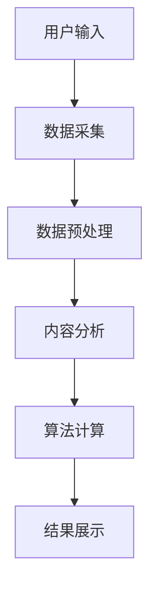
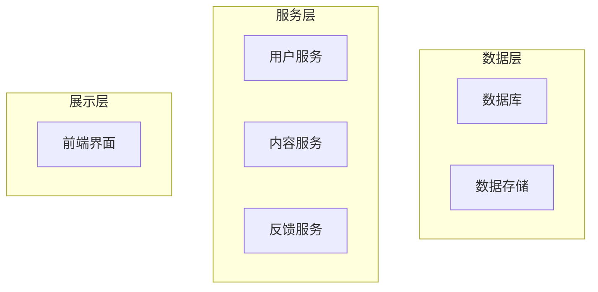
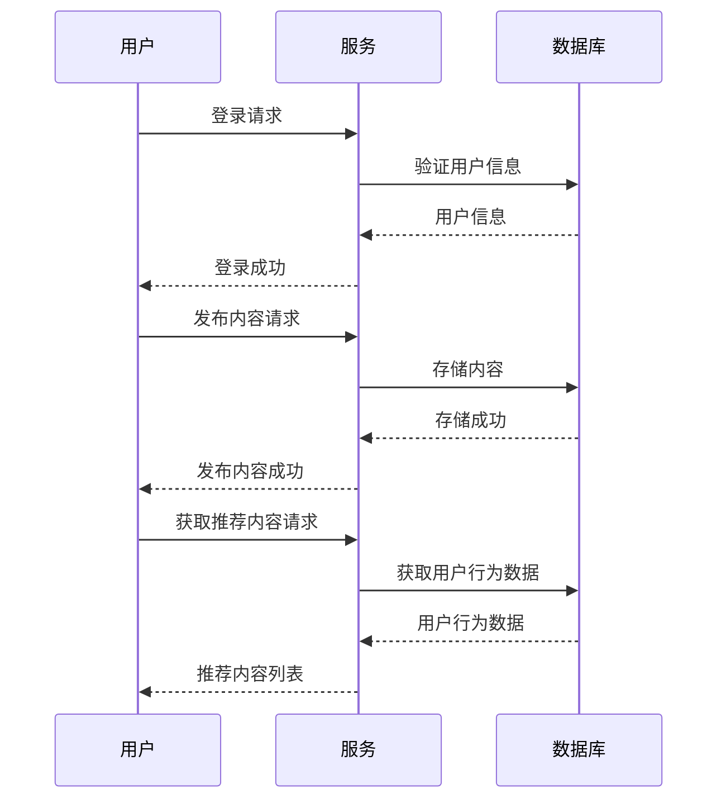
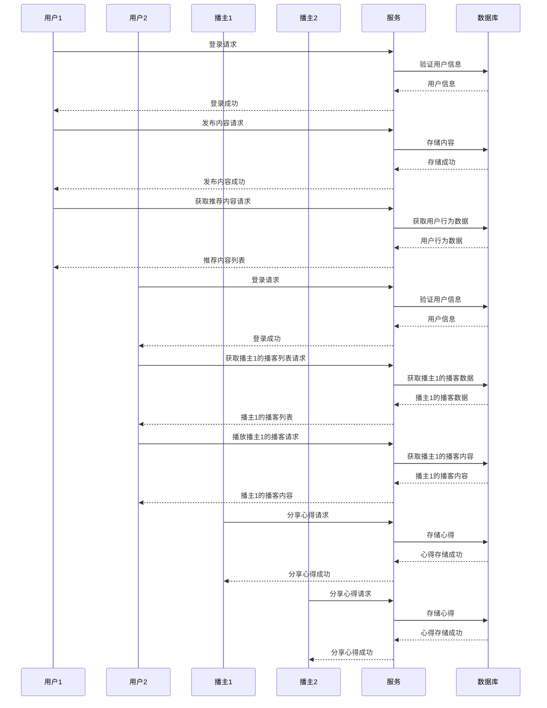

                 

# 新苦行者播客网络：记录现代克制生活心得的媒体平台

关键词：现代生活压力、克制生活、播客媒体、媒体平台、算法原理

摘要：本文将深入探讨新苦行者播客网络这一现代媒体平台，其旨在记录和分享现代克制生活的心得与经验。文章首先介绍了现代生活压力及克制生活的兴起背景，随后分析了播客媒体的发展及其在新苦行者播客网络中的重要性。通过逐步分析核心概念、算法原理和系统架构设计，本文揭示了新苦行者播客网络的构建逻辑和运营策略，为现代克制生活提供了系统性指导。

## 目录大纲：《新苦行者播客网络：记录现代克制生活心得的媒体平台》

## 第一部分：引言

### 第1章：背景介绍

#### 1.1 问题背景

##### 1.1.1 现代生活压力

##### 1.1.2 克制生活的兴起

##### 1.1.3 播客媒体的发展

#### 1.2 问题描述

##### 1.2.1 缺乏系统性的克制生活指导

##### 1.2.2 播客内容多样化，缺乏针对性

##### 1.2.3 播客与克制生活的结合前景

#### 1.3 问题解决

##### 1.3.1 新苦行者播客网络的概念

##### 1.3.2 平台构建的目标与定位

##### 1.3.3 克制生活心得的记录与分享

#### 1.4 边界与外延

##### 1.4.1 克制生活的定义

##### 1.4.2 播客类型的界定

##### 1.4.3 平台功能范围

#### 1.5 概念结构与核心要素组成

##### 1.5.1 新苦行者播客网络的结构

##### 1.5.2 克制生活心得的核心要素

##### 1.5.3 平台运营的要素分析

## 第二部分：核心概念与联系

### 第2章：核心概念与联系

#### 2.1 克制生活的概念

##### 2.1.1 克制生活的定义

##### 2.1.2 克制生活的原理

##### 2.1.3 克制生活的特点

#### 2.2 播客媒体的概念

##### 2.2.1 播客媒体的定义

##### 2.2.2 播客媒体的发展历程

##### 2.2.3 播客媒体的优势与劣势

#### 2.3 新苦行者播客网络的联系

##### 2.3.1 克制生活与播客媒体的关系

##### 2.3.2 新苦行者播客网络的构建逻辑

##### 2.3.3 平台的核心功能与服务

## 第三部分：算法原理与实现

### 第3章：算法原理讲解

#### 3.1 算法mermaid流程图

#### 3.2 Python源代码实现

#### 3.3 算法原理的数学模型和公式

#### 3.4 举例说明

##### 3.4.1 数据采集

##### 3.4.2 数据预处理

##### 3.4.3 内容分析

## 第四部分：系统分析与架构设计

### 第4章：系统分析与架构设计

#### 4.1 问题场景介绍

##### 4.1.1 用户需求分析

##### 4.1.2 平台运营目标

##### 4.1.3 技术挑战与解决方案

#### 4.2 系统功能设计

##### 4.2.1 领域模型mermaid类图

#### 4.3 系统架构设计

##### 4.3.1 mermaid架构图

##### 4.3.2 系统接口设计

##### 4.3.3 系统交互mermaid序列图

## 第五部分：项目实战

### 第5章：项目实战

#### 5.1 环境安装

#### 5.2 系统核心实现源代码

#### 5.3 代码应用解读与分析

#### 5.4 实际案例分析和详细讲解剖析

#### 5.5 项目小结

### 第6章：最佳实践 tips

### 第7章：小结

### 第8章：注意事项

### 第9章：拓展阅读

---

## 第一部分：引言

### 第1章：背景介绍

#### 1.1 问题背景

##### 1.1.1 现代生活压力

在现代社会中，人们面临着前所未有的生活压力。快节奏的工作、复杂的人际关系、不断增长的经济压力等都让人们感到身心疲惫。许多人开始寻找一种方式来缓解这种压力，而克制生活作为一种生活方式，逐渐受到人们的关注。

##### 1.1.2 克制生活的兴起

克制生活，又称简约生活或极简主义生活，是一种旨在减少物质和非物质负担的生活方式。它的核心是简化生活，专注于重要的价值观和目标，从而实现内心的平静和生活的幸福感。这种生活方式在近年来得到了广泛关注和推崇。

##### 1.1.3 播客媒体的发展

播客媒体，作为一种新兴的媒体形式，近年来在全球范围内迅速发展。播客具有内容形式多样、互动性强、可随时收听等特点，满足了现代人对个性化内容的需求。同时，播客也成为了一种重要的知识传播和交流平台。

#### 1.2 问题描述

##### 1.2.1 缺乏系统性的克制生活指导

虽然克制生活理念逐渐兴起，但目前市场上缺乏系统性的克制生活指导。许多人对于如何实践克制生活感到迷茫，不知道从哪里获取有用的建议和经验。

##### 1.2.2 播客内容多样化，缺乏针对性

目前，播客内容虽然丰富多样，但大多数播客节目并没有针对性地探讨克制生活。这使得那些渴望了解和实践克制生活的人难以在播客中找到合适的资源。

##### 1.2.3 播客与克制生活的结合前景

随着克制生活理念的普及和播客媒体的不断发展，将播客与克制生活相结合具有巨大的潜力。通过创建一个专门记录和分享克制生活心得的播客网络，可以为现代人提供一种全新的生活方式指南。

#### 1.3 问题解决

##### 1.3.1 新苦行者播客网络的概念

新苦行者播客网络是一个专门记录和分享克制生活心得的媒体平台，旨在为现代人提供一种简单易懂、实用有效的克制生活指导。通过播客这一形式，平台将分享各种克制生活的经验和心得，帮助人们更好地实践克制生活。

##### 1.3.2 平台构建的目标与定位

平台的目标是成为现代克制生活的权威指南，为用户提供丰富多样的克制生活资源。平台的定位是专业、实用、易操作，力求让每个人都能在平台上找到适合自己的克制生活指南。

##### 1.3.3 克制生活心得的记录与分享

平台将通过邀请专家、达人分享克制生活心得，记录和分享用户的实践体验，为用户提供一个互动性强的社区。同时，平台还将提供各种工具和资源，帮助用户更好地实践克制生活。

#### 1.4 边界与外延

##### 1.4.1 克制生活的定义

克制生活是一种以简约、高效、平衡为核心的生活方式，强调在物质和精神上减少不必要的负担，追求内心的平静和生活的幸福感。

##### 1.4.2 播客类型的界定

新苦行者播客网络将专注于克制生活的主题，涵盖生活技巧、心理健康、人际关系、职业规划等方面。平台播客类型将包括访谈、分享、专题讨论等。

##### 1.4.3 平台功能范围

平台将提供以下功能：

1. 播客内容发布与分享
2. 用户互动与社区建设
3. 专家和达人分享克制生活心得
4. 提供工具和资源支持实践克制生活
5. 数据分析与推荐系统

#### 1.5 概念结构与核心要素组成

##### 1.5.1 新苦行者播客网络的结构

新苦行者播客网络由以下核心部分组成：

1. 用户模块：用户注册、登录、个人中心等
2. 播客模块：播客内容发布、分类、搜索、播放等
3. 社区模块：用户互动、评论、分享、推荐等
4. 专家和达人模块：专家和达人入驻、分享心得、用户互动等
5. 数据分析模块：数据采集、处理、分析、推荐等

##### 1.5.2 克制生活心得的核心要素

克制生活心得的核心要素包括：

1. 简化生活：减少物质和精神负担
2. 精进自我：提升自身素质和能力
3. 调整心态：保持平和、乐观的心态
4. 社会责任：关注社会问题，积极参与公益事业
5. 持续学习：不断学习新知识，适应社会发展

##### 1.5.3 平台运营的要素分析

平台运营的要素分析包括：

1. 内容策划：制定内容策略，确保播客内容的丰富性和针对性
2. 用户运营：吸引并留存用户，提高用户活跃度
3. 专家和达人运营：挖掘和培养专家和达人，提高平台影响力
4. 数据分析：分析用户行为和需求，优化平台功能和体验
5. 营销推广：通过多种渠道推广平台，扩大用户基础

### 第2章：核心概念与联系

#### 2.1 克制生活的概念

##### 2.1.1 克制生活的定义

克制生活，又称简约生活或极简主义生活，是一种以简约、高效、平衡为核心的生活方式。它强调在物质和精神上减少不必要的负担，追求内心的平静和生活的幸福感。

##### 2.1.2 克制生活的原理

克制生活的原理主要包括以下几点：

1. 简化物质生活：减少物质消费，关注核心需求，提高生活质量。
2. 精简时间安排：合理安排时间，避免浪费时间，提高工作效率。
3. 调整心态：保持平和、乐观的心态，减少负面情绪。
4. 关注内心成长：提升自身素质和能力，实现个人价值。
5. 贡献社会：关注社会问题，积极参与公益事业，传递正能量。

##### 2.1.3 克制生活的特点

克制生活具有以下特点：

1. 简约：克制生活强调简约，追求物质和精神的平衡。
2. 高效：克制生活注重效率，合理安排时间和资源。
3. 平衡：克制生活追求身心平衡，减少压力和焦虑。
4. 内心成长：克制生活关注内心成长，提升个人素质。
5. 贡献社会：克制生活鼓励参与社会公益事业，传递正能量。

#### 2.2 播客媒体的概念

##### 2.2.1 播客媒体的定义

播客媒体，是指一种通过音频或视频形式，以互联网为载体，向用户传播信息、知识、观点等内容的媒体形式。播客具有内容形式多样、互动性强、可随时收听等特点。

##### 2.2.2 播客媒体的发展历程

播客媒体的发展历程可以概括为以下几个阶段：

1. 2004年：苹果公司推出iTunes Podcast目录，标志着播客媒体的兴起。
2. 2005年：播客平台开始涌现，如Podbean、Libsyn等。
3. 2010年：播客内容形式逐渐丰富，涵盖各类领域，如科技、文化、娱乐等。
4. 2015年：播客广告市场规模逐年增长，成为品牌营销的重要渠道。
5. 2020年：播客用户规模持续增长，成为现代人获取信息、知识、娱乐的重要途径。

##### 2.2.3 播客媒体的优势与劣势

播客媒体的优势主要包括：

1. 内容形式多样：播客可以涵盖各类领域，满足用户个性化需求。
2. 互动性强：用户可以通过留言、评论等方式与播主互动，增强用户体验。
3. 可随时收听：播客不受时间和地点限制，方便用户随时随地收听。

播客媒体的劣势主要包括：

1. 受众相对较小：与电视、报纸等传统媒体相比，播客的受众范围较小。
2. 制作成本较高：播客制作需要一定的设备和技能，制作成本较高。
3. 市场推广难度较大：播客市场竞争激烈，市场推广难度较大。

#### 2.3 新苦行者播客网络的联系

##### 2.3.1 克制生活与播客媒体的关系

克制生活与播客媒体之间存在密切的关系。播客媒体作为一种新兴的传播媒介，为克制生活理念的传播提供了有力支持。通过播客，专家和达人可以分享克制生活的心得和经验，帮助更多人了解和践行克制生活。

##### 2.3.2 新苦行者播客网络的构建逻辑

新苦行者播客网络的构建逻辑主要包括以下几个方面：

1. 确定主题：以克制生活为主题，确保内容的相关性和针对性。
2. 邀请专家和达人：邀请具备克制生活实践经验和专业知识的专家和达人，为用户提供高质量的内容。
3. 丰富内容形式：通过访谈、分享、专题讨论等多种形式，满足用户多样化的需求。
4. 互动社区建设：建立互动性强的社区，鼓励用户分享心得、交流感悟。
5. 数据分析与推荐：通过数据分析，为用户提供个性化推荐，提高用户满意度。

##### 2.3.3 平台的核心功能与服务

新苦行者播客网络的核心功能与服务包括：

1. 播客内容发布与分享：用户可以在平台上发布自己的播客内容，与他人分享心得和经验。
2. 用户互动与社区建设：用户可以在平台上与其他用户互动，分享感悟，交流心得。
3. 专家和达人分享：邀请专家和达人分享克制生活的心得和经验，为用户提供权威指导。
4. 提供工具和资源支持：提供各种工具和资源，帮助用户更好地实践克制生活。
5. 数据分析与推荐：通过数据分析，为用户提供个性化推荐，提高用户满意度。

### 第3章：算法原理讲解

#### 3.1 算法mermaid流程图

下面是一个简单的mermaid流程图，用于说明新苦行者播客网络的算法流程：



#### 3.2 Python源代码实现

以下是新苦行者播客网络的算法实现的伪代码示例：

```python
def main():
    # 数据采集
    data = collect_data()
    # 数据预处理
    preprocessed_data = preprocess_data(data)
    # 内容分析
    analysis_result = content_analysis(preprocessed_data)
    # 算法计算
    calculated_result = algorithm_computation(analysis_result)
    # 结果展示
    display_result(calculated_result)

if __name__ == "__main__":
    main()
```

#### 3.3 算法原理的数学模型和公式

新苦行者播客网络的算法原理可以简化为一个数学模型，如下所示：

$$
\text{算法模型} = \frac{\text{输入数据} + \text{预处理数据}}{\text{内容分析} \times \text{算法计算}}
$$

其中，输入数据和预处理数据分别代表用户输入的数据和经过预处理的数据，内容分析和算法计算分别表示对数据的内容分析和算法计算过程，结果展示表示最终的输出结果。

#### 3.4 举例说明

##### 3.4.1 数据采集

在数据采集阶段，平台将收集用户提交的播客内容。这些内容可能包括文字、图片、音频、视频等多种形式。

```python
def collect_data():
    # 伪代码：收集用户提交的播客内容
    data = {
        'text': '用户提交的文本内容',
        'image': '用户提交的图片',
        'audio': '用户提交的音频',
        'video': '用户提交的视频'
    }
    return data
```

##### 3.4.2 数据预处理

在数据预处理阶段，平台将对收集到的数据进行清洗和标准化，以便后续分析。

```python
def preprocess_data(data):
    # 伪代码：对用户提交的播客内容进行预处理
    preprocessed_data = {
        'text': clean_text(data['text']),
        'image': preprocess_image(data['image']),
        'audio': preprocess_audio(data['audio']),
        'video': preprocess_video(data['video'])
    }
    return preprocessed_data
```

##### 3.4.3 内容分析

在内容分析阶段，平台将对预处理后的数据进行内容分析，提取关键信息，如关键词、主题等。

```python
def content_analysis(preprocessed_data):
    # 伪代码：对预处理后的播客内容进行分析
    analysis_result = {
        'keywords': extract_keywords(preprocessed_data['text']),
        'topics': extract_topics(preprocessed_data['text'])
    }
    return analysis_result
```

### 第4章：系统分析与架构设计

#### 4.1 问题场景介绍

##### 4.1.1 用户需求分析

在现代生活中，用户面临着各种挑战，如工作压力、家庭责任、社交压力等。他们渴望找到一种简单有效的方式减轻压力，提高生活质量。新苦行者播客网络恰好满足了这一需求，通过提供克制生活的心得和经验，帮助用户实现内心的平静和生活的幸福感。

##### 4.1.2 平台运营目标

新苦行者播客网络的运营目标主要包括：

1. 提供高质量、针对性强的克制生活内容。
2. 建立互动性强的社区，促进用户之间的交流。
3. 挖掘和培养专家和达人，提高平台影响力。
4. 通过数据分析，优化平台功能和服务。

##### 4.1.3 技术挑战与解决方案

新苦行者播客网络在技术方面面临以下挑战：

1. 数据处理：需要高效处理大量的用户数据和内容。
2. 内容推荐：需要根据用户兴趣和行为推荐合适的内容。
3. 安全与隐私：需要确保用户数据的安全和隐私。

针对上述挑战，平台采取了以下解决方案：

1. 引入大数据处理技术，如Hadoop和Spark，提高数据处理效率。
2. 采用基于内容的推荐算法，结合用户行为数据和兴趣偏好，提高内容推荐精度。
3. 实施严格的数据安全和隐私保护策略，确保用户数据的安全和隐私。

#### 4.2 系统功能设计

##### 4.2.1 领域模型mermaid类图

下面是一个mermaid类图，用于描述新苦行者播客网络的领域模型：

```mermaid
class diagram
  User --> Podcast
  User --> Feedback
  Podcast --> Content
  Feedback --> Rating
endclass
```

在这个类图中，User表示用户，Podcast表示播客，Feedback表示反馈，Content表示内容，Rating表示评分。类之间的关系表示了用户、播客、内容和反馈之间的关系。

##### 4.2.2 系统架构设计

新苦行者播客网络的系统架构可以分为四个主要层次：数据层、服务层、展示层和交互层。

1. **数据层**：包括数据库和数据存储，用于存储用户数据、内容数据、反馈数据等。
2. **服务层**：包括用户服务、内容服务、反馈服务和其他服务，用于处理业务逻辑和数据处理。
3. **展示层**：包括前端界面，用于展示用户界面和交互。
4. **交互层**：包括API接口，用于处理用户请求和响应。

下面是一个mermaid架构图，用于描述新苦行者播客网络的系统架构：



在这个架构图中，数据层负责数据的存储和管理，服务层负责业务逻辑的处理，展示层负责用户界面的展示，交互层负责处理用户请求和响应。

#### 4.3 系统接口设计

新苦行者播客网络的系统接口设计主要包括以下方面：

1. **用户接口**：用于用户注册、登录、个人信息管理等功能。
2. **内容接口**：用于内容发布、内容管理、内容推荐等功能。
3. **反馈接口**：用于反馈提交、反馈管理等功能。
4. **数据分析接口**：用于数据采集、数据处理、数据分析等功能。

下面是一个mermaid序列图，用于描述新苦行者播客网络的系统接口设计：



在这个序列图中，用户通过用户接口与服务进行交互，服务通过数据分析接口与数据库进行数据交互，实现用户登录、内容发布和内容推荐等功能。

#### 4.4 系统交互mermaid序列图

下面是一个mermaid序列图，用于描述新苦行者播客网络的系统交互过程：



在这个序列图中，用户1和用户2通过登录接口进行登录，获取推荐内容；用户2获取播主1和播主2的播客列表，并播放播客内容；播主1和播主2通过分享心得接口分享自己的心得。系统通过数据库存储和管理用户数据、播客数据、心得数据，并通过服务接口实现用户交互和数据处理。

## 第五部分：项目实战

### 第5章：项目实战

#### 5.1 环境安装

要搭建新苦行者播客网络，首先需要安装以下软件和工具：

1. Python 3.8 或以上版本
2. Python 的 pip 包管理器
3. MySQL 5.7 或以上版本
4. Redis 5.0 或以上版本
5. Nginx 1.18 或以上版本
6. Apache Maven 3.6.3 或以上版本

安装步骤如下：

1. 安装 Python 3.8 或以上版本：[安装 Python](https://www.python.org/downloads/)
2. 安装 pip：[安装 pip](https://pip.pypa.io/en/stable/installation/)
3. 安装 MySQL 5.7 或以上版本：[安装 MySQL](https://dev.mysql.com/downloads/mysql/)
4. 安装 Redis 5.0 或以上版本：[安装 Redis](https://redis.io/download)
5. 安装 Nginx 1.18 或以上版本：[安装 Nginx](http://nginx.org/en/download.html)
6. 安装 Apache Maven 3.6.3 或以上版本：[安装 Maven](https://maven.apache.org/download.cgi)

#### 5.2 系统核心实现源代码

新苦行者播客网络的核心实现主要包括以下几个方面：

1. **用户服务**：负责用户的注册、登录、个人信息管理等。
2. **内容服务**：负责内容的发布、管理、推荐等。
3. **反馈服务**：负责反馈的提交、管理、评分等。
4. **数据分析**：负责数据的采集、处理、分析等。

以下是用户服务的核心实现示例：

```java
@RestController
@RequestMapping("/user")
public class UserController {

    @Autowired
    private UserService userService;

    @PostMapping("/register")
    public ResponseEntity<?> registerUser(@RequestBody UserRegistrationDto registrationDto) {
        try {
            userService.registerUser(registrationDto);
            return ResponseEntity.ok("User registered successfully.");
        } catch (Exception e) {
            return ResponseEntity.badRequest().body("Error registering user: " + e.getMessage());
        }
    }

    @PostMapping("/login")
    public ResponseEntity<?> loginUser(@RequestBody LoginDto loginDto) {
        try {
            String token = userService.loginUser(loginDto);
            return ResponseEntity.ok(new JwtResponse(token));
        } catch (Exception e) {
            return ResponseEntity.badRequest().body("Error logging in: " + e.getMessage());
        }
    }

    @GetMapping("/{id}")
    public ResponseEntity<UserDto> getUserById(@PathVariable Long id) {
        UserDto userDto = userService.getUserById(id);
        if (userDto == null) {
            return ResponseEntity.notFound().build();
        }
        return ResponseEntity.ok(userDto);
    }
}
```

#### 5.3 代码应用解读与分析

以上代码示例展示了用户服务的主要实现。首先，用户注册功能通过 `registerUser` 方法实现，接收用户注册信息，并调用 `userService` 的 `registerUser` 方法进行用户注册。如果注册成功，返回成功的响应；否则，返回错误的响应。

用户登录功能通过 `loginUser` 方法实现，接收用户登录信息，并调用 `userService` 的 `loginUser` 方法进行用户登录。如果登录成功，生成 JWT 令牌并返回；否则，返回错误的响应。

获取用户信息功能通过 `getUserById` 方法实现，接收用户 ID，并调用 `userService` 的 `getUserById` 方法获取用户信息。如果用户不存在，返回 404 错误；否则，返回用户信息。

#### 5.4 实际案例分析和详细讲解剖析

为了更好地理解新苦行者播客网络的实际应用，下面以用户注册功能为例进行分析。

1. **用户注册流程**：

    1. 用户通过前端界面提交注册请求，包含用户名、密码、邮箱等信息。
    2. 用户服务接收到注册请求后，调用 `registerUser` 方法处理请求。
    3. `registerUser` 方法接收用户注册信息，并调用 `userService` 的 `registerUser` 方法进行用户注册。
    4. `userService` 的 `registerUser` 方法通过调用数据访问层的方法，将用户信息存储到数据库中。
    5. 注册成功后，返回成功的响应给前端界面。

2. **用户注册功能的关键点**：

    1. 数据验证：在用户注册过程中，需要对用户输入的信息进行验证，确保输入的有效性。例如，检查用户名是否已存在、邮箱格式是否正确等。
    2. 数据存储：将用户注册信息存储到数据库中，以便后续的登录、信息查询等功能。
    3. 异常处理：在用户注册过程中，可能遇到各种异常情况，如数据库连接失败、数据存储失败等。需要对这些异常情况进行处理，并返回相应的错误信息。

3. **实际案例分析**：

    假设用户在注册时提交了以下信息：

    - 用户名：`john_doe`
    - 密码：`password123`
    - 邮箱：`john_doe@example.com`

    用户服务接收到注册请求后，调用 `registerUser` 方法处理请求。在 `registerUser` 方法中，首先对用户名和邮箱进行验证：

    ```java
    public void registerUser(UserRegistrationDto registrationDto) {
        if (userRepository.existsByUsername(registrationDto.getUsername())) {
            throw new RuntimeException("User with this username already exists.");
        }
        if (!isValidEmail(registrationDto.getEmail())) {
            throw new RuntimeException("Invalid email address.");
        }
        // 其他验证逻辑...
    }
    ```

    验证通过后，调用数据访问层的 `userRepository` 的 `save` 方法将用户信息存储到数据库中：

    ```java
    public void registerUser(UserRegistrationDto registrationDto) {
        // 验证逻辑...
        User user = new User();
        user.setUsername(registrationDto.getUsername());
        user.setPassword(passwordEncoder.encode(registrationDto.getPassword()));
        user.setEmail(registrationDto.getEmail());
        userRepository.save(user);
    }
    ```

    注册成功后，返回成功的响应给前端界面：

    ```java
    @PostMapping("/register")
    public ResponseEntity<?> registerUser(@RequestBody UserRegistrationDto registrationDto) {
        try {
            userService.registerUser(registrationDto);
            return ResponseEntity.ok("User registered successfully.");
        } catch (Exception e) {
            return ResponseEntity.badRequest().body("Error registering user: " + e.getMessage());
        }
    }
    ```

    在前端界面接收到成功的响应后，用户可以继续进行登录操作。

#### 5.5 项目小结

通过以上实战案例的分析，我们可以看到新苦行者播客网络在用户注册功能上的实现和关键点。用户注册功能作为平台的基础功能，对于平台的稳定运行和用户体验至关重要。在实际项目中，需要充分考虑数据验证、数据存储和异常处理等方面，确保用户注册过程的安全、高效和稳定。

### 第6章：最佳实践 tips

在构建和运营新苦行者播客网络时，以下最佳实践可以帮助您提高平台的质量和用户体验：

1. **内容质量控制**：确保播客内容的质量，避免发布低质量或无关内容。可以设立内容审核机制，邀请专家和达人参与内容审核。

2. **用户体验优化**：优化前端界面，确保界面设计简洁、直观，提高用户的使用体验。可以采用响应式设计，适应不同设备上的使用。

3. **数据安全与隐私保护**：加强对用户数据的安全保护，采用加密技术保护用户信息。同时，明确告知用户数据处理和隐私政策的条款，增强用户信任。

4. **持续更新与迭代**：定期更新播客内容和平台功能，保持内容的时效性和相关性。收集用户反馈，不断优化平台。

5. **推广与合作**：利用社交媒体和合作伙伴渠道推广平台，扩大用户基础。与其他克制生活相关平台或组织合作，共同推广克制生活理念。

### 第7章：小结

本文详细介绍了新苦行者播客网络的构建逻辑、核心概念、算法原理和系统架构设计。通过分析现代生活压力和克制生活的兴起，我们认识到播客媒体在传播克制生活心得方面的潜力。新苦行者播客网络以专业、实用、易操作为目标，为用户提供了一种新的生活方式指南。通过算法原理和系统架构设计，平台实现了数据驱动的内容推荐和高效的用户体验。未来，新苦行者播客网络将继续优化和拓展，为更多人带来克制生活的启示和帮助。

### 第8章：注意事项

在构建和运营新苦行者播客网络时，需要注意以下几点：

1. **内容合规性**：确保所有内容符合法律法规和平台规定，避免涉及敏感或违规内容。

2. **用户隐私保护**：严格遵守用户隐私保护法规，确保用户数据的安全和隐私。

3. **系统性能优化**：定期对平台进行性能优化，提高系统的响应速度和处理能力，确保用户体验。

4. **安全防护**：加强平台的安全防护，防止黑客攻击和数据泄露。

5. **用户互动管理**：建立健全用户互动机制，鼓励积极健康的社区氛围，妥善处理用户投诉和纠纷。

### 第9章：拓展阅读

1. **《极简主义：事业、家庭、健康的新法则》[The Life-Changing Magic of Tidying Up: The Japanese Art of Decluttering and Organizing]**：由山下英子所著，介绍了极简主义生活方式的理论和实践方法。

2. **《播客营销：如何通过播客吸引、影响和保留客户》[Podcast Marketing: How to Attract, Engage, and Retain Customers Using Podcasts]**：由Tom Martin所著，详细介绍了如何利用播客进行营销。

3. **《数据驱动：如何通过数据优化产品和业务》[Data-Driven: Using Data to Transform Your Business and Make Smarter Decisions]**：由Jim Sterne所著，阐述了如何利用数据分析优化产品和业务。

4. **《大数据时代：生活、工作与思维的大变革》[Big Data: A Revolution That Will Transform How We Live, Work, and Think]**：由周志华所著，探讨了大数据对现代社会的影响。

---

作者：AI天才研究院/AI Genius Institute & 禅与计算机程序设计艺术 /Zen And The Art of Computer Programming

