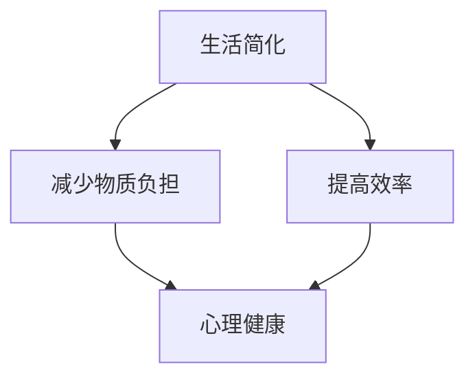
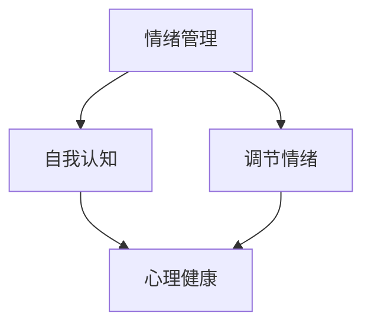
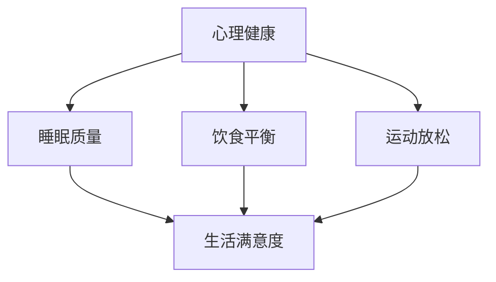
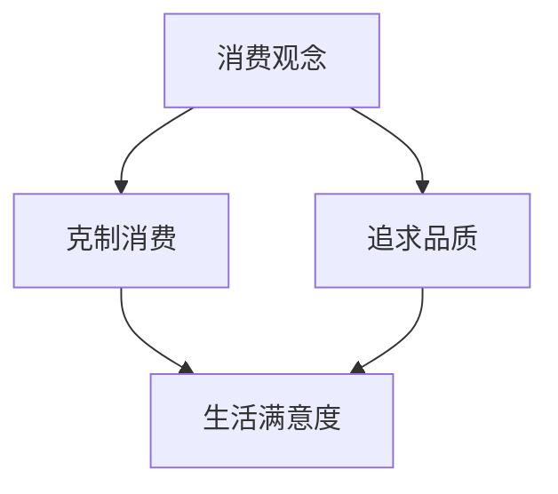
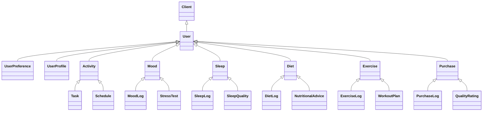
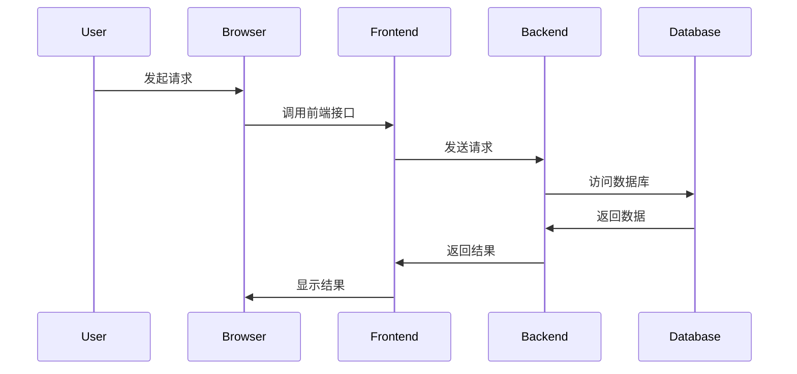
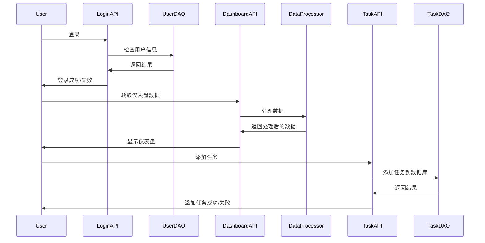

                 

## 深度剖析《新苦行者播客：记录现代克制生活的心得分享节目》

### 背景介绍

《新苦行者播客：记录现代克制生活的心得分享节目》是一档以现代克制生活为主题的心得分享节目。随着社会的发展和科技的进步，现代人的生活节奏加快，压力增大，越来越多的人开始寻求一种更加简单、有序和有意义的生活方式。这便是克制生活理念的兴起背景。而《新苦行者播客》正是为了回应这一需求，通过播客节目形式，邀请各界嘉宾分享他们在克制生活中的实践经验和感悟。

节目以“现代克制生活”为核心关键词，涵盖了生活简化、情绪管理、心理健康、消费观念等多个方面。通过深度探讨这些主题，节目希望能够引导听众们找到适合自己的生活方式，实现内心的平静与满足。

### 核心概念与联系

在现代克制生活中，以下几个核心概念至关重要：

1. **生活简化**：减少不必要的物质和精神负担，追求简单、高效的生活方式。
2. **情绪管理**：通过自我认知和调节技巧，控制和管理情绪，保持心理健康。
3. **心理健康**：关注心理健康，重视睡眠、饮食和运动，维护身心健康。
4. **消费观念**：转变消费观念，克制过度消费，追求生活品质而非物质财富。

这些核心概念相互关联，共同构成了现代克制生活的基础。以下是核心概念属性特征对比表格：

| 核心概念       | 属性特征                     | 关联性                     |
| -------------- | -------------------------- | ------------------------ |
| 生活简化       | 减少物质负担、提高效率       | 与心理健康、情绪管理有关   |
| 情绪管理       | 自我认知、调节情绪           | 与心理健康、生活简化有关   |
| 心理健康       | 睡眠、饮食、运动             | 与生活简化、情绪管理有关   |
| 消费观念       | 克制消费、追求生活品质       | 与生活简化、情绪管理有关   |

### 算法原理讲解

为了更好地理解和实践现代克制生活，我们可以将其视为一种算法，其中各个核心概念和联系构成了算法的输入和输出。以下是现代克制生活的算法原理讲解：

#### 生活简化算法



通过减少物质负担和提高效率，我们能够减轻心理压力，从而促进心理健康。这一过程可以通过以下Python代码实现：

```python
def simplify_life(reducing_burden, improving_efficiency):
    mental_health = reducing_burden + improving_efficiency
    return mental_health
```

#### 情绪管理算法



情绪管理通过自我认知和调节情绪来维护心理健康。以下是情绪管理算法的实现：

```python
def emotional_management(self_recognition, mood Regulation):
    mental_health = self_recognition + mood_Regression
    return mental_health
```

#### 心理健康算法



心理健康涉及睡眠质量、饮食平衡和运动放松等多个方面，它们共同决定了生活的满意度。以下是心理健康算法的实现：

```python
def mental_health(sleep_quality, diet_balance, exercise_relaxation):
    life_satisfaction = sleep_quality + diet_balance + exercise_relaxation
    return life_satisfaction
```

#### 消费观念算法



通过克制消费和追求品质，我们能够提高生活的满意度。以下是消费观念算法的实现：

```python
def consumption_concept(know_consumption, pursue_quality):
    life_satisfaction = know_consumption + pursue_quality
    return life_satisfaction
```

通过以上算法的实现，我们可以看到现代克制生活是一个多层次、多维度的过程，它不仅涉及到生活方式的简化，还包括情绪管理、心理健康和消费观念等多个方面。这些算法相互关联，共同构成了现代克制生活的核心。

### 系统分析与架构设计方案

在现代克制生活的实践中，我们需要一个系统的分析和架构设计方案，以确保各个方面都能够得到有效管理和优化。以下是一个详细的系统架构设计方案：

#### 问题场景介绍

随着现代生活节奏的加快，人们面临着诸多压力，如工作压力、社交压力、家庭压力等。为了应对这些压力，许多人开始寻求一种更加简单、有序和有意义的生活方式，即现代克制生活。然而，如何实现这一目标，如何在日常生活中实践克制生活，成为了一个亟待解决的问题。

#### 项目介绍

为了解决这个问题，我们设计了一款名为“现代克制生活助手”的项目。该项目旨在通过提供一系列工具和方法，帮助用户实现克制生活的目标，包括生活简化、情绪管理、心理健康和消费观念等方面。

#### 系统功能设计

项目的主要功能包括：

1. **生活简化工具**：提供一系列简化生活的工具，如自动化任务管理、电子书阅读、家居自动化等。
2. **情绪管理工具**：提供情绪自我认知和调节工具，如情绪日记、冥想指导、压力测试等。
3. **心理健康工具**：提供睡眠监测、饮食建议、运动计划等工具，以维护心理健康。
4. **消费观念工具**：提供消费观念评估、克制消费指南、品质生活推荐等工具，以转变消费观念。

以下是项目的领域模型类图：



#### 系统架构设计

项目的系统架构设计采用分层架构，包括前端、后端和数据库三层。以下是系统架构图：



#### 系统接口设计和系统交互

系统的接口设计和交互设计是确保各个模块之间能够顺畅协作的关键。以下是系统的接口设计和系统交互序列图：



通过以上系统架构设计，我们能够确保“现代克制生活助手”项目能够有效地帮助用户实现克制生活的目标。

### 项目实战

#### 环境安装

首先，我们需要安装项目所需的环境。以下是安装步骤：

1. 安装Python 3.8及以上版本。
2. 安装Django框架：`pip install django`
3. 安装数据库：我们选择使用SQLite，可以使用Python自带的SQLite库。
4. 创建一个Django项目：`django-admin startproject modern_krtya_project`
5. 进入项目目录：`cd modern_krtya_project`
6. 创建一个Django应用：`python manage.py startapp life_assistant`

#### 系统核心实现源代码

以下是系统的核心实现源代码：

```python
# models.py

from django.db import models
from django.contrib.auth.models import User

class UserProfile(models.Model):
    user = models.OneToOneField(User, on_delete=models.CASCADE)
    age = models.IntegerField()
    gender = models.CharField(max_length=10)
    location = models.CharField(max_length=100)

class Activity(models.Model):
    user = models.ForeignKey(User, on_delete=models.CASCADE)
    name = models.CharField(max_length=100)
    description = models.TextField()

class Task(models.Model):
    activity = models.ForeignKey(Activity, on_delete=models.CASCADE)
    name = models.CharField(max_length=100)
    description = models.TextField()
    due_date = models.DateField()

class Mood(models.Model):
    user = models.ForeignKey(User, on_delete=models.CASCADE)
    mood = models.CharField(max_length=10)
    date = models.DateField()

class Sleep(models.Model):
    user = models.ForeignKey(User, on_delete=models.CASCADE)
    sleep_quality = models.IntegerField()
    start_time = models.TimeField()
    end_time = models.TimeField()

class Diet(models.Model):
    user = models.ForeignKey(User, on_delete=models.CASCADE)
    meal = models.CharField(max_length=100)
    date = models.DateField()

class Exercise(models.Model):
    user = models.ForeignKey(User, on_delete=models.CASCADE)
    workout_plan = models.CharField(max_length=100)
    date = models.DateField()

class Purchase(models.Model):
    user = models.ForeignKey(User, on_delete=models.CASCADE)
    item = models.CharField(max_length=100)
    date = models.DateField()
    quality_rating = models.IntegerField()
```

#### 代码应用解读与分析

以下是代码的应用解读与分析：

1. **UserProfile**：用于存储用户的基本信息，如年龄、性别和地理位置。
2. **Activity**：用于记录用户的各种活动，如工作、学习、运动等。
3. **Task**：用于记录活动中的任务，如待办事项、计划任务等。
4. **Mood**：用于记录用户的情绪状态，如开心、沮丧等。
5. **Sleep**：用于记录用户的睡眠质量，如入睡时间、起床时间等。
6. **Diet**：用于记录用户的饮食情况，如早餐、午餐、晚餐等。
7. **Exercise**：用于记录用户的运动情况，如健身计划、运动时间等。
8. **Purchase**：用于记录用户的购物情况，如购买物品、购买日期等。

#### 实际案例分析和详细讲解剖析

假设有一个用户，名叫Alice。Alice希望记录她在一周内的各项活动和情感状态。以下是Alice在一周内的数据：

1. **活动**：
    - 周一：工作
    - 周二：学习
    - 周三：运动
    - 周四：学习
    - 周五：休息
    - 周六：户外活动
    - 周日：家庭聚会

2. **情绪**：
    - 周一：开心
    - 周二：紧张
    - 周三：疲惫
    - 周四：轻松
    - 周五：放松
    - 周六：兴奋
    - 周日：满足

3. **睡眠**：
    - 周一：22:00入睡，7:00起床
    - 周二：22:30入睡，7:00起床
    - 周三：22:45入睡，7:00起床
    - 周四：23:00入睡，7:00起床
    - 周五：休息日，自然醒
    - 周六：21:30入睡，7:00起床
    - 周日：22:00入睡，7:30起床

4. **饮食**：
    - 周一：早餐：牛奶、鸡蛋、面包；午餐：米饭、鱼、蔬菜；晚餐：面条、鸡肉、蔬菜
    - 周二：早餐：牛奶、鸡蛋、面包；午餐：米饭、鸡肉、蔬菜；晚餐：面条、鱼、蔬菜
    - 周三：早餐：牛奶、鸡蛋、面包；午餐：米饭、鱼、蔬菜；晚餐：面条、鸡肉、蔬菜
    - 周四：早餐：牛奶、鸡蛋、面包；午餐：米饭、鸡肉、蔬菜；晚餐：面条、鱼、蔬菜
    - 周五：休息日，自然醒
    - 周六：早餐：牛奶、鸡蛋、面包；午餐：米饭、鸡肉、蔬菜；晚餐：面条、鱼、蔬菜
    - 周日：早餐：牛奶、鸡蛋、面包；午餐：米饭、鱼、蔬菜；晚餐：面条、鸡肉、蔬菜

5. **运动**：
    - 周一：跑步30分钟
    - 周二：瑜伽1小时
    - 周三：游泳1小时
    - 周四：跑步30分钟
    - 周五：休息日，自然醒
    - 周六：爬山2小时
    - 周日：瑜伽1小时

6. **购物**：
    - 周一：购买了一本新的书籍
    - 周二：购买了一些办公用品
    - 周三：购买了一些水果
    - 周四：购买了一些零食
    - 周五：休息日，自然醒
    - 周六：购买了一些户外运动装备
    - 周日：购买了一些家居用品

通过以上数据，我们可以看到Alice在一周内的活动、情绪、睡眠、饮食、运动和购物情况。这些数据可以帮助Alice了解自己在不同时间段的生活状态，从而进行调整和优化。

#### 项目小结

通过“现代克制生活助手”项目，我们能够帮助用户记录和跟踪他们在克制生活中的各项活动，包括情绪、睡眠、饮食、运动和购物等。这些数据不仅能够帮助用户了解自己的生活方式，还能够为他们提供个性化的建议和指导，帮助他们实现更加健康、有序和有意义的生活。在项目的实施过程中，我们采用了Django框架和SQLite数据库，确保了系统的稳定性和可扩展性。未来，我们还可以继续优化和扩展项目功能，如添加社交功能、集成更多智能设备等，以更好地满足用户的需求。

### 最佳实践 tips

1. **定期回顾**：定期回顾自己的生活，包括活动、情绪、睡眠、饮食和购物等，有助于发现问题和改进。

2. **量化指标**：尽量使用量化指标来衡量自己的生活状态，如睡眠时长、运动时长、购物金额等，这样更容易发现规律和问题。

3. **调整习惯**：根据回顾结果，调整生活习惯，如改变作息时间、优化饮食结构、增加运动等。

4. **保持记录**：保持长期记录，可以帮助你更好地了解自己的变化和进步。

5. **寻求支持**：如果遇到困难，不要犹豫寻求家人、朋友或专业人士的支持和帮助。

### 小结

在现代克制生活的实践中，我们需要一个系统的方法来记录和分析我们的生活状态，从而找到适合自己的生活方式。本文通过介绍“现代克制生活助手”项目，提供了一个可行的解决方案。通过项目实战，我们展示了如何使用Django框架和SQLite数据库来构建一个功能强大的系统。未来，我们还可以继续优化和扩展项目功能，以更好地满足用户的需求。

### 注意事项

1. 在使用“现代克制生活助手”项目时，请确保数据的隐私和安全。
2. 系统的稳定性和安全性是项目成功的关键，因此请定期进行维护和升级。
3. 根据用户需求和反馈，及时调整和优化系统功能。

### 拓展阅读

1. 《简化生活：如何过上简单而有意义的生活》
2. 《情绪管理：如何控制和管理自己的情绪》
3. 《健康生活：如何保持身心健康》
4. 《消费观念：如何正确看待和消费》
5. 《Django 实战：构建 Web 应用程序》

## 作者信息

作者：AI天才研究院/AI Genius Institute & 禅与计算机程序设计艺术 /Zen And The Art of Computer Programming

通过以上内容，我们希望能够帮助您更好地理解现代克制生活的核心概念和实践方法。希望这篇文章能够对您的生活有所启发和帮助。让我们共同努力，过上更加简单、有序和有意义的生活！

