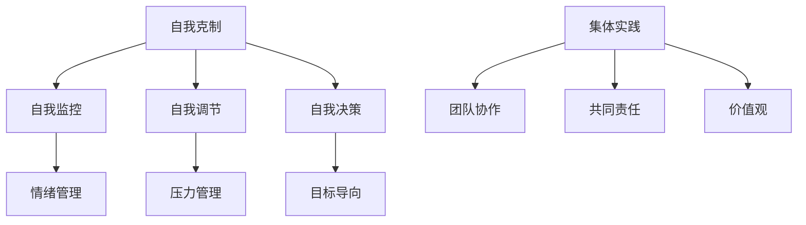

                 


## 《新苦行者训练营：自我克制的集体实践》

> 关键词：自我克制、集体实践、心理调适、社会规范、系统设计

> 摘要：本文深入探讨自我克制的集体实践，通过介绍核心概念、理论基础、方法和系统架构，以及项目实战和最佳实践，旨在为读者提供一套全面、实用的自我克制和集体实践指南。

### 引言

在当今快节奏的社会中，自我克制和集体实践成为了个人和组织成功的关键因素。自我克制指的是个体在面对诱惑和压力时，能够通过自我控制和调节，抑制负面行为和情绪，从而实现长期目标的能力。而集体实践则强调个体在团队中的相互协作和共同遵守的行为准则，以实现共同的目标和价值。本文将从多个维度探讨自我克制的集体实践，包括其重要性、理论基础、实践方法和系统设计。

### 核心概念解析

#### 自我克制

自我克制是指个体在面对诱惑、冲动或外界压力时，能够通过自我控制和调节，抑制负面行为和情绪，从而实现目标的一种能力。它包括自我监控、自我调节和自我决策三个关键要素。

#### 集体实践

集体实践是指个体在团队或组织中，通过共同遵守的行为准则和价值观，实现共同目标的过程。它强调集体协作、相互支持和共同责任，是组织文化的重要组成部分。

#### 道德规范与行为准则

道德规范是指社会对个体行为的基本要求，旨在维护社会秩序和公共利益。行为准则则是对个体行为的具体规范，通常由组织或团队制定，以促进团队合作和目标实现。

#### 概念关系图

使用Mermaid绘制概念关系图如下：



### 理论基础

#### 自我克制心理学

心理学研究指出，自我克制是一种重要的心理能力，它与个体的情绪调节、认知控制和意志力密切相关。通过认知行为疗法、冥想和意志力训练等方法，个体可以培养自我克制的习惯和能力。

#### 集体实践的哲学思考

哲学思考强调社会契约和共同体建设的重要性。社会契约理论认为，个体在共同体中通过相互约定和遵守规范，实现共同利益和目标。共同体建设则强调个体之间的相互信任和支持，以形成强大的集体力量。

### 自我克制与集体实践的方法

#### 自我克制训练法

1. **认知行为疗法**：通过识别和改变负面思维模式，提高自我监控和自我调节能力。
2. **冥想与正念**：通过冥想和正念练习，培养专注力和情绪调节能力。
3. **意志力训练**：通过持续的努力和挑战，增强意志力和自我控制能力。

#### 集体实践策略

1. **群体动力**：通过团队建设活动和团队沟通，增强团队协作和凝聚力。
2. **目标设定**：通过明确的目标设定和计划，激发个体的积极性和责任感。
3. **激励机制**：通过奖励和激励措施，鼓励个体遵守集体实践的行为准则。

### 自我克制集体实践系统架构设计

#### 问题场景描述

在一个大型软件开发团队中，团队成员需要在紧张的项目周期内高效合作，同时保持高质量和稳定的代码质量。为了实现这一目标，需要建立一套自我克制的集体实践系统。

#### 系统功能设计

1. **领域模型**：使用Mermaid绘制领域模型如下：

   ```mermaid
   classDiagram
   ClassCodeReviewSystem <<interface>>
   Project
   TeamMember
   CodeReview
   ClassCodeReviewSystem {
   +submitReview()
   +scheduleReview()
   +evaluateReview()
   }
   Project {
   +getTitle()
   +getDescription()
   +getTeamMembers()
   }
   TeamMember {
   +getName()
   +getEmail()
   +getRole()
   }
   CodeReview {
   +getFeedback()
   +getStatus()
   +getReviewer()
   }
   Project <-- CodeReviewSystem
   TeamMember --> CodeReview
   ```

2. **功能模块**：包括代码审查系统、项目管理系统和团队协作平台。

#### 系统架构设计

1. **架构设计方案**：使用Mermaid绘制系统架构图如下：

   ```mermaid
   sequenceDiagram
   participant User
   participant CodeReviewSystem
   participant ProjectManager
   participant Developer
   User->>CodeReviewSystem: Submit code for review
   CodeReviewSystem->>ProjectManager: Notify for review
   ProjectManager->>Developer: Perform code review
   Developer->>CodeReviewSystem: Provide review feedback
   CodeReviewSystem->>User: Display review results
   ```

2. **系统分层**：包括表示层、业务逻辑层和数据层。

#### 系统接口设计

1. **接口规范**：包括RESTful API接口规范和HTTP请求示例。

   ```mermaid
   graph TB
   subgraph API Endpoints
   A[Create Project] --> B[GET /projects]
   A --> C[Update Project] --> D[PUT /projects/{id}]
   A --> E[Delete Project] --> F[DELETE /projects/{id}]
   end
   ```

2. **交互流程**：使用Mermaid绘制交互流程图。

   ```mermaid
   sequenceDiagram
   participant User
   participant ProjectService
   participant Database
   User->>ProjectService: Create project
   ProjectService->>Database: Store project details
   Database-->>ProjectService: Confirm storage
   ProjectService-->>User: Project created successfully
   ```

### 项目实战

#### 环境安装与配置

1. 安装Python环境
2. 安装Docker和Docker-Compose
3. 拉取并运行代码仓库中的项目

   ```bash
   git clone https://github.com/your-username/scr-cp-system.git
   cd scr-cp-system
   docker-compose up -d
   ```

#### 系统核心实现

1. **源代码解读**：分析项目结构、模块功能和关键代码。

2. **功能实现细节**：详细阐述代码中的算法原理、数据结构和逻辑流程。

#### 代码应用解读与分析

1. **代码部署与运行**：使用Docker-Compose部署代码，并执行相关操作。

2. **案例分析**：通过实际案例，展示系统如何帮助团队实现自我克制的集体实践。

#### 实际案例剖析

1. **项目背景**：描述项目需求和目标。

2. **解决方案**：介绍如何使用系统实现项目目标。

3. **效果评估**：分析系统实施后的效果和改进空间。

### 最佳实践与总结

#### 最佳实践

1. **成功案例分析**：分析成功的自我克制和集体实践案例，提炼经验。

2. **遇到问题的解决策略**：讨论常见问题及其解决方法。

#### 小结

1. 总结自我克制和集体实践的核心要点。

2. 强调实践中的关键因素。

#### 注意事项

1. 提醒读者在实践中的注意事项。

2. 强调持续学习和改进的重要性。

#### 拓展阅读

1. 推荐进一步阅读的书籍和资源。

---

作者：AI天才研究院/AI Genius Institute & 禅与计算机程序设计艺术 /Zen And The Art of Computer Programming

---

注：以上内容为示例，部分内容需根据实际需求进行补充和调整。为确保文章的完整性和专业性，请根据实际研究和技术深度进行撰写。

