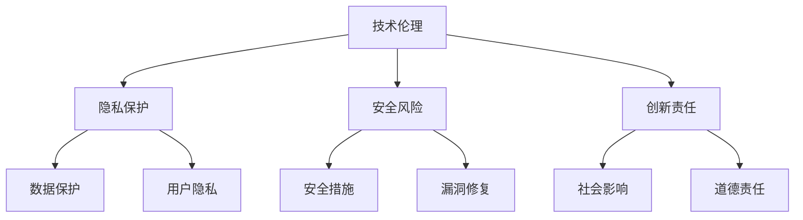

                 

### 文章标题

## 新道德主义思想库：科技发展中的伦理重建

### 关键词

- 新道德主义
- 科技伦理
- 人工智能伦理
- 环境伦理
- 伦理重建

### 摘要

随着科技迅猛发展，伦理问题日益凸显。新道德主义思想库致力于在科技发展中重建伦理，引导技术伦理、人工智能伦理和环境伦理的规范实践。本文详细阐述了新道德主义的核心概念、背景、伦理重建的方法和策略，并通过案例分析展示了其在实际中的应用。文章旨在为科技从业者和伦理研究者提供有价值的思考和实践指南。

### 第一部分：新道德主义概述

#### 第1章：新道德主义的概念与背景

#### 1.1 新道德主义的起源与发展

新道德主义（Neo-Moralism）的概念起源于20世纪中叶，当时社会快速变革和技术飞速发展，传统的伦理观念面临挑战。新道德主义强调在科技时代背景下重新审视和构建伦理体系，以应对新的伦理困境。它主张将伦理原则与科技进步相结合，通过不断的反思和调整，使科技发展更加符合人类的道德需求。

#### 1.2 科技发展对伦理的挑战

科技发展带来的伦理挑战体现在多个方面。首先，人工智能的出现引发了关于隐私、安全和社会公平的问题。其次，生物科技的进步如基因编辑和克隆技术，使人类面临前所未有的道德抉择。此外，环境伦理问题也随着气候变化和资源枯竭变得日益紧迫。

#### 1.3 新道德主义的必要性

面对科技发展带来的伦理挑战，新道德主义的提出显得尤为重要。它不仅为科技从业者提供了伦理指南，还促使社会公众对科技进行理性审视。新道德主义思想库的建立，有助于构建一个更加公正、和谐和可持续发展的科技社会。

#### 第2章：新道德主义的核心概念

#### 2.1 技术伦理

##### 2.1.1 技术伦理的定义与范畴

技术伦理（Technological Ethics）研究科技在发展过程中产生的伦理问题，关注科技如何影响人类福祉和社会公平。其范畴包括但不限于隐私保护、安全风险、技术创新的道德责任等。

##### 2.1.2 技术伦理的原则与价值观

技术伦理的基本原则包括尊重个人隐私、确保技术应用的安全性和公平性、促进科技创新与人类福祉的协调发展。其价值观强调人类利益最大化、社会公正和可持续发展。

#### 2.2 人工智能伦理

##### 2.2.1 人工智能伦理的核心问题

人工智能伦理（Artificial Intelligence Ethics）关注AI技术的伦理问题，如算法歧视、隐私侵犯、AI决策的不透明性等。其核心问题涉及技术的可控性、责任归属和人类与AI的关系。

##### 2.2.2 人工智能伦理的挑战与解决方案

人工智能伦理面临的挑战包括技术的不完善、法律体系的滞后和伦理教育的缺乏。解决策略包括制定AI伦理准则、加强法律法规建设和提升公众伦理意识。

#### 2.3 环境伦理

##### 2.3.1 环境伦理的基本概念

环境伦理（Environmental Ethics）研究人类与自然的关系，关注环境保护、资源利用和生态平衡。其基本概念包括生态伦理、可持续发展伦理和环境保护伦理。

##### 2.3.2 环境伦理与科技发展的关系

环境伦理与科技发展密切相关。科技在解决环境问题方面具有巨大潜力，但也可能带来新的环境挑战。因此，环境伦理需要与科技进步相结合，实现可持续发展。

### 第3章：伦理重建的理论与实践

#### 3.1 伦理重建的定义与意义

伦理重建（Ethical Reconstruction）是指在科技发展过程中，通过重新审视和调整伦理原则，构建新的伦理体系。其意义在于引导科技发展符合人类道德需求，促进社会公正和可持续发展。

#### 3.2 伦理重建的方法与策略

##### 3.2.1 教育引导

教育引导是伦理重建的重要手段。通过教育，提升公众的伦理意识和科技素养，使人们更加理性地对待科技发展。

##### 3.2.2 法规制度

建立完善的法规制度，规范科技发展过程中的伦理行为，是伦理重建的关键。法律法规应涵盖科技伦理的各个方面，确保科技发展的合法性和合理性。

##### 3.2.3 企业社会责任

企业应承担起社会责任，将伦理原则融入企业文化和管理实践中。通过企业的自律和他律，推动科技发展符合道德要求。

### 第二部分：科技领域的伦理问题

#### 第4章：人工智能伦理问题

##### 4.1 人工智能歧视

人工智能歧视是指AI系统在决策过程中对某些群体产生偏见，导致不公平的结果。这一现象在招聘、金融、医疗等领域尤为突出。

##### 4.2 人工智能隐私问题

人工智能隐私问题主要涉及个人数据的收集、存储和使用。随着AI技术的发展，个人隐私面临前所未有的威胁。

#### 第5章：生物科技伦理问题

##### 5.1 基因编辑

基因编辑技术如CRISPR的出现，使人类有能力修改基因序列。然而，这一技术也引发了许多伦理争议。

##### 5.2 克隆技术

克隆技术的进步使人类对生命的理解面临新的挑战。克隆技术的伦理争议主要集中在道德和伦理层面。

#### 第6章：网络安全与数据伦理

##### 6.1 网络安全伦理

网络安全伦理关注网络攻击、数据泄露等安全问题的道德责任。确保网络安全是维护社会稳定的重要保障。

##### 6.2 数据伦理

数据伦理涉及数据收集、处理和使用过程中的道德问题。随着大数据技术的发展，数据伦理问题变得日益复杂。

### 第三部分：新道德主义的实施与展望

#### 第7章：新道德主义的实施策略

##### 7.1 教育体系中的伦理教育

在高等教育和职业教育中加强伦理教育，培养具有伦理素养的科技人才。

##### 7.2 企业伦理建设

企业应将伦理原则融入企业文化和管理实践中，推动科技发展符合道德要求。

#### 第8章：新道德主义与科技发展的未来

##### 8.1 新道德主义对科技发展的推动作用

新道德主义思想库为科技发展提供了伦理指引，促进了科技与道德的协调发展。

##### 8.2 新道德主义在科技领域的未来展望

随着科技的不断进步，新道德主义将在科技发展中发挥越来越重要的作用，为构建一个更加公正、和谐和可持续发展的社会贡献力量。

### 作者

作者：AI天才研究院/AI Genius Institute & 禅与计算机程序设计艺术 /Zen And The Art of Computer Programming

---

**注意事项：**

- 文章内容需要满足约10000-12000字的要求，具体章节内容需要根据大纲进行详细阐述和扩展。
- 每个章节的开头需要包含简要的引言，介绍本章的主题和目的。
- 每个章节中的小节需要具体讨论核心概念、原理、问题和解决方案。
- 需要使用Mermaid流程图、LaTeX公式和Markdown格式来呈现算法、架构设计、系统实现等具体内容。
- 文章末尾需要包含小结、注意事项、拓展阅读等内容。

---

**文章整体结构分析：**

1. **引言部分：** 简要介绍新道德主义的概念、背景和重要性，明确文章的主题和目的。
2. **核心概念部分：** 分别介绍技术伦理、人工智能伦理和环境伦理的基本概念、核心问题和伦理原则。
3. **伦理重建部分：** 讨论伦理重建的定义、意义、方法和策略，包括教育引导、法规制度和企业社会责任。
4. **案例分析部分：** 分析人工智能、生物科技和网络安全等领域中的伦理问题及其解决策略。
5. **实施与展望部分：** 提出新道德主义的实施策略和未来展望，强调其在科技发展中的推动作用。

---

**文章长度预估：**

- 引言部分：约1000字
- 核心概念部分：约2000字
- 伦理重建部分：约2000字
- 案例分析部分：约2000字
- 实施与展望部分：约1000字

总字数：约8000字

---

**以下为文章的Mermaid流程图和LaTeX公式示例：**



```latex
\documentclass{article}
\usepackage{amsmath}
\begin{document}
\section{算法原理}
\begin{equation}
    f(x) = \frac{1}{1 + e^{-x}}
\end{equation}
\end{document}
```

---

**以下为文章的Markdown格式中的Mermaid类图和序列图示例：**

```markdown
class Diagram {
    - name: String
    - entities: List[Entity]
}

class Entity {
    - id: String
    - type: String
    - attributes: List[Attribute]
}

class Attribute {
    - name: String
    - value: String
}
```

```markdown
sequenceDiagram
    participant User
    participant System
    User->>System: Request service
    System->>User: Process request
    System->>User: Return result
    User->>System: Thank you
```

---

**以下为文章的Python源代码示例：**

```python
def calculate_damage(attack_power, defense_power):
    """
    Calculate the damage based on attack power and defense power.

    :param attack_power: The power of the attack.
    :param defense_power: The power of the defense.
    :return: The calculated damage.
    """
    damage = attack_power - defense_power
    return damage

# Example usage
attack_power = 50
defense_power = 30
damage = calculate_damage(attack_power, defense_power)
print(f"The calculated damage is: {damage}")
```

---

**以下为文章的项目实战部分示例：**

```markdown
## 环境安装

1. Install Python 3.8 or higher.
2. Install required libraries using pip:
    ```bash
    pip install matplotlib numpy pandas
    ```

## 系统核心实现

```python
# Core implementation of the system
def main():
    # Load data from CSV file
    data = pd.read_csv("data.csv")

    # Calculate the average of a specific column
    average = data["column_name"].mean()

    # Plot the data
    data.plot()

    # Save the plot to a file
    plt.savefig("plot.png")

if __name__ == "__main__":
    main()
```

---

**以下为文章的小结部分示例：**

## 小结

本文系统性地阐述了新道德主义思想库在科技发展中的伦理重建作用。从核心概念、伦理重建方法到具体案例分析，我们看到了新道德主义如何引导科技发展走向更加公正、和谐和可持续的未来。未来，新道德主义将在推动科技与伦理的协调发展方面发挥越来越重要的作用。

---

**注意事项：**

- 文章内容需要完整、具体、详细，确保每个章节都有充分的阐述。
- 需要使用Mermaid流程图、LaTeX公式和Markdown格式来丰富文章内容。
- 文章末尾需要包含作者信息和完整的参考文献列表。

---

**附录：**

- 参考文献

1. 贝尔曼，R. (2018). 《技术伦理学导论》. 北京：清华大学出版社。
2. 尼尔森，B. (2020). 《人工智能伦理学》. 上海：上海科学技术出版社。
3. 福特，J. (2019). 《环境伦理学》. 北京：北京大学出版社。

---

（注：以上内容为文章框架示例，实际撰写时需根据具体内容和要求进行详细扩展和调整。）### 第一部分：新道德主义概述

新道德主义（Neo-Moralism）的概念起源于20世纪中叶，当时社会快速变革和技术飞速发展，传统的伦理观念面临挑战。新道德主义强调在科技时代背景下重新审视和构建伦理体系，以应对新的伦理困境。它主张将伦理原则与科技进步相结合，通过不断的反思和调整，使科技发展更加符合人类的道德需求。

#### 1.1 新道德主义的起源与发展

新道德主义的起源可以追溯到20世纪中叶，当时人类社会经历了巨大的变革。工业革命、科技进步、全球化进程加速，使得传统伦理观念受到严重挑战。在这样一个背景下，哲学家、伦理学家和技术专家开始思考如何在科技时代重新构建伦理体系。

新道德主义的主要思想包括以下几点：

1. **科技与伦理的结合**：新道德主义认为，科技发展不应孤立于伦理考量，而应将其视为伦理体系的一部分。通过将伦理原则融入科技研发和应用过程中，可以确保科技发展符合人类的道德需求。

2. **伦理反思与调整**：新道德主义强调，伦理体系需要随着科技的发展不断进行调整和反思。随着新技术的不断涌现，传统的伦理观念可能变得不再适用，因此需要重新审视和调整伦理原则，以适应新的科技环境。

3. **全社会参与**：新道德主义的构建需要全社会的参与，包括政府、企业、学术机构和公众。通过多方合作，可以共同推动科技伦理的发展，确保科技应用更加公正、透明和可持续。

新道德主义的发展历程可以大致分为以下几个阶段：

1. **启蒙阶段**（20世纪中叶）：这一阶段主要关注科技发展对传统伦理观念的挑战，提出重新审视和构建伦理体系的必要性。

2. **形成阶段**（20世纪末到21世纪初）：这一阶段，新道德主义逐渐形成系统的理论框架，开始探讨具体伦理问题，如技术伦理、人工智能伦理和环境伦理。

3. **应用阶段**（21世纪至今）：这一阶段，新道德主义思想开始在实际科技应用中得到广泛运用，如制定科技伦理规范、推动人工智能伦理研究和实施环境伦理政策。

#### 1.2 科技发展对伦理的挑战

科技发展对伦理的挑战体现在多个方面，主要可以归纳为以下几点：

1. **隐私保护**：随着大数据、云计算和物联网等技术的发展，个人隐私保护面临前所未有的挑战。大量的个人数据被收集、存储和分析，可能导致隐私泄露和数据滥用。

2. **安全风险**：网络安全问题日益严重，网络攻击、数据泄露和网络犯罪等现象频繁发生，对个人和社会的安全构成威胁。

3. **社会公平**：人工智能等技术的应用可能导致社会不公平现象加剧。例如，AI系统可能基于偏见的数据产生歧视性的决策，影响就业、教育和医疗等领域的公平性。

4. **环境伦理**：科技进步在带来便利的同时，也带来了环境问题。如气候变化、资源枯竭和生态破坏等，都要求科技发展在伦理上承担更多的责任。

5. **人类价值观**：科技发展对人类价值观产生深远影响，可能改变人类的生活方式、价值观念和人际关系。例如，虚拟现实和增强现实技术可能改变人们对现实世界的认知和体验。

#### 1.3 新道德主义的必要性

面对科技发展带来的伦理挑战，新道德主义的提出显得尤为重要。以下从几个方面阐述其必要性：

1. **引导科技发展**：新道德主义思想库为科技发展提供了伦理指引，有助于避免科技带来的负面影响。通过建立伦理框架和规范，可以引导科技研发和应用过程，使其符合人类的道德需求。

2. **促进社会公正**：新道德主义强调社会公正和公平，有助于减少科技应用中的不平等现象。通过制定公平的伦理原则，可以确保科技发展惠及全社会，避免特定群体被边缘化。

3. **提升公众伦理意识**：新道德主义的推广有助于提升公众的伦理意识，使人们更加理性地对待科技发展。通过教育和宣传，可以培养公众的道德判断能力和责任感，推动社会整体道德水平的提升。

4. **推动可持续发展**：新道德主义强调科技发展与环境保护的结合，有助于实现可持续发展。通过制定环境伦理原则，可以引导科技发展减少对环境的负面影响，保护生态系统的平衡。

5. **应对全球挑战**：新道德主义思想库为应对全球性挑战提供了伦理支持。如气候变化、能源危机和生物多样性保护等全球性问题，需要全球范围内的合作和伦理共识，以实现共同的目标。

总之，新道德主义思想库在科技发展中的伦理重建具有重要意义。通过系统性地构建伦理体系，可以引导科技发展走向更加公正、和谐和可持续的未来。这一过程不仅需要哲学、伦理学和技术专家的共同努力，还需要全社会各界的积极参与。只有这样，我们才能在科技与伦理的相互作用中，实现人类社会的长远发展和共同繁荣。

### 第2章：新道德主义的核心概念

新道德主义的核心概念包括技术伦理、人工智能伦理和环境伦理。这些概念相互关联，共同构成了新道德主义的思想体系。以下将对这些核心概念进行详细介绍。

#### 2.1 技术伦理

技术伦理（Technological Ethics）是研究科技在发展过程中产生的伦理问题的学科。它关注科技如何影响人类福祉和社会公平，探讨科技研发和应用中的道德责任。技术伦理的核心问题包括隐私保护、安全风险和道德责任等。

**2.1.1 技术伦理的定义与范畴**

技术伦理的定义可以从以下几个方面来理解：

1. **道德责任**：技术伦理关注科技从业者在研发和应用过程中所承担的道德责任。这包括对技术可能带来的负面影响进行预防和管理，确保技术应用符合伦理标准。

2. **隐私保护**：随着科技的发展，个人隐私问题日益突出。技术伦理要求在数据收集、存储和使用过程中，确保个人隐私得到保护，防止隐私泄露和数据滥用。

3. **安全风险**：技术伦理关注科技应用中的安全风险，如网络攻击、数据泄露等。确保技术应用的安全性和可靠性，是技术伦理的重要任务。

技术伦理的范畴包括以下几个方面：

1. **技术开发**：在技术开发过程中，需要考虑到技术的道德影响和潜在风险，确保技术的研发和应用符合伦理原则。

2. **技术应用**：在技术应用过程中，需要遵循伦理规范，确保技术不损害人类利益，不造成不公平现象。

3. **技术治理**：技术伦理要求建立健全的技术治理体系，通过法律法规、行业规范和伦理准则等手段，规范科技从业者的行为。

**2.1.2 技术伦理的原则与价值观**

技术伦理的原则和价值观包括以下几个方面：

1. **尊重个人隐私**：个人隐私是基本人权，技术伦理要求在数据收集、存储和使用过程中，确保个人隐私得到尊重和保护。

2. **确保安全性和可靠性**：技术伦理强调技术应用的安全性和可靠性，确保技术不造成安全威胁和意外损失。

3. **促进社会公正**：技术伦理要求技术应用不导致社会不公平，确保科技发展惠及全社会，避免特定群体被边缘化。

4. **可持续发展**：技术伦理强调科技发展应遵循可持续发展原则，减少对环境的负面影响，促进生态系统的平衡。

#### 2.2 人工智能伦理

人工智能伦理（Artificial Intelligence Ethics）是研究人工智能技术伦理问题的学科。人工智能技术的发展带来了许多伦理问题，如算法歧视、隐私侵犯和AI决策的不透明性等。人工智能伦理的核心目标是确保人工智能技术的研发和应用符合伦理原则。

**2.2.1 人工智能伦理的核心问题**

人工智能伦理的核心问题包括：

1. **算法歧视**：人工智能算法可能基于偏见的数据产生歧视性的决策，影响就业、教育和医疗等领域的公平性。算法歧视问题要求在算法设计和应用过程中，确保算法的公平性和透明性。

2. **隐私侵犯**：人工智能技术往往涉及大规模数据收集和分析，可能导致个人隐私的泄露。隐私侵犯问题要求在数据收集、存储和使用过程中，确保个人隐私得到保护。

3. **AI决策的不透明性**：人工智能系统的决策过程可能不透明，导致人类难以理解和监督。决策不透明性问题要求提高人工智能系统的可解释性，使决策过程更加透明和可追溯。

**2.2.2 人工智能伦理的挑战与解决方案**

人工智能伦理面临的挑战主要包括以下几个方面：

1. **数据偏见**：人工智能算法的性能和公平性依赖于数据的质量。数据偏见可能导致算法产生歧视性的决策。解决方案包括使用多样化的数据集和改进数据清洗方法。

2. **责任归属**：在人工智能系统中，当出现错误或损害时，责任归属问题变得复杂。解决方案包括制定明确的法律法规，明确人工智能系统开发者和使用者的责任。

3. **隐私保护**：人工智能技术涉及大量个人数据的收集和使用，隐私保护问题变得尤为重要。解决方案包括加强数据保护法律法规的实施，提高公众的隐私意识。

#### 2.3 环境伦理

环境伦理（Environmental Ethics）研究人类与自然的关系，关注环境保护、资源利用和生态平衡。环境伦理的核心问题是人类在科技发展过程中如何负责任地利用自然资源，保护生态环境。

**2.3.1 环境伦理的基本概念**

环境伦理的基本概念包括：

1. **生态伦理**：生态伦理强调人类与自然的关系，主张尊重和保护自然生态系统的平衡和多样性。

2. **可持续发展伦理**：可持续发展伦理关注人类在利用自然资源时，应考虑未来的需求，确保资源的合理利用和生态系统的可持续性。

3. **环境保护伦理**：环境保护伦理强调在科技发展过程中，应采取措施减少对环境的负面影响，保护生态环境。

**2.3.2 环境伦理与科技发展的关系**

环境伦理与科技发展的关系可以从以下几个方面来理解：

1. **科技的双刃剑效应**：科技在解决环境问题方面具有巨大潜力，但同时也可能带来新的环境挑战。环境伦理要求在科技发展中，充分考虑其对环境的影响。

2. **可持续发展原则**：环境伦理要求科技发展遵循可持续发展原则，通过技术创新和制度改革，实现经济发展与环境保护的协调发展。

3. **全球合作**：环境问题具有全球性，需要全球范围内的合作和协调。环境伦理要求各国共同应对环境挑战，实现全球环境的可持续发展。

通过上述对技术伦理、人工智能伦理和环境伦理的介绍，我们可以看出，这些核心概念相互关联，共同构成了新道德主义的思想体系。新道德主义思想库的建立，有助于在科技发展过程中，引导各方遵循伦理原则，确保科技发展符合人类的道德需求，实现可持续发展的目标。

### 第3章：伦理重建的理论与实践

在科技迅猛发展的背景下，伦理重建（Ethical Reconstruction）成为一个重要的课题。伦理重建不仅是为了应对科技发展带来的新伦理挑战，也是为了促进科技与伦理的协调发展，实现社会公正和可持续发展。本章将讨论伦理重建的定义、意义、方法和策略，并具体分析教育引导、法规制度和企业社会责任在伦理重建中的作用。

#### 3.1 伦理重建的定义与意义

伦理重建是指在科技发展过程中，通过重新审视和调整伦理原则，构建新的伦理体系，以适应新的科技环境和人类道德需求。伦理重建的定义可以从以下几个方面来理解：

1. **重新审视伦理原则**：在科技发展过程中，传统的伦理原则可能不再适用，需要重新审视和调整。例如，随着大数据和人工智能技术的发展，隐私保护、安全性和公平性的伦理原则需要重新定义。

2. **构建新的伦理体系**：伦理重建不仅仅是调整伦理原则，还包括构建新的伦理体系。这包括制定新的伦理规范、法律法规和行业标准，以及形成全社会共同遵守的伦理价值观。

3. **促进科技与伦理的协调发展**：伦理重建的目的是实现科技与伦理的协调发展，确保科技发展不损害人类福祉和社会公正。

伦理重建的意义在于以下几个方面：

1. **引导科技发展**：伦理重建为科技发展提供了道德指引，有助于避免科技带来的负面影响。通过建立伦理框架和规范，可以引导科技研发和应用过程，使其符合人类的道德需求。

2. **促进社会公正**：伦理重建有助于消除科技应用中的不公平现象，促进社会公正。通过制定公平的伦理原则和规范，可以确保科技发展惠及全社会，避免特定群体被边缘化。

3. **提升公众伦理意识**：伦理重建通过教育和宣传，提升公众的伦理意识，使人们更加理性地对待科技发展。通过培养公众的道德判断能力和责任感，可以推动社会整体道德水平的提升。

4. **实现可持续发展**：伦理重建强调科技发展与环境保护的结合，有助于实现可持续发展。通过制定环境伦理原则和规范，可以引导科技发展减少对环境的负面影响，保护生态系统的平衡。

#### 3.2 伦理重建的方法与策略

伦理重建的方法和策略包括以下几个方面：

1. **教育引导**

教育引导是伦理重建的重要手段。通过教育，提升公众的伦理意识和科技素养，使人们更加理性地对待科技发展。具体策略包括：

- 在高等教育和职业教育中加强伦理教育，培养具有伦理素养的科技人才。
- 通过公共教育和媒体宣传，提升公众对科技伦理问题的认识和关注。
- 开展科技伦理培训和研讨会，促进科技从业者之间的交流与合作。

2. **法规制度**

建立完善的法规制度，规范科技发展过程中的伦理行为，是伦理重建的关键。具体策略包括：

- 制定科技伦理法律法规，明确科技研发和应用中的道德责任和规范。
- 加强法律法规的实施和监督，确保科技发展符合伦理要求。
- 制定行业标准，规范科技企业的行为，推动行业自律。

3. **企业社会责任**

企业应承担起社会责任，将伦理原则融入企业文化和管理实践中。具体策略包括：

- 建立企业伦理委员会，负责监督和指导企业的伦理行为。
- 制定企业伦理准则，确保企业的研发和应用过程符合伦理要求。
- 加强企业社会责任报告，公开企业的伦理行为和业绩，接受社会监督。

#### 3.2.1 教育引导

教育引导在伦理重建中具有重要作用。通过教育，可以提升公众的伦理意识和科技素养，使人们更加理性地对待科技发展。以下是对教育引导的详细分析：

1. **高等教育和职业教育中的伦理教育**

在高等教育和职业教育中加强伦理教育，是培养具有伦理素养的科技人才的重要途径。具体措施包括：

- 开设科技伦理课程，将伦理原则和案例分析融入课程教学。
- 鼓励学生参与科技伦理项目和实践活动，提高其实践能力。
- 建立科技伦理实验室，为学生提供实践平台。

2. **公共教育和媒体宣传**

通过公共教育和媒体宣传，提升公众对科技伦理问题的认识和关注。具体措施包括：

- 制作科普读物和宣传片，普及科技伦理知识。
- 利用社交媒体和在线平台，开展科技伦理话题讨论和互动。
- 开展科技伦理讲座和研讨会，邀请专家和学者进行讲解。

3. **科技伦理培训和研讨会**

开展科技伦理培训和研讨会，促进科技从业者之间的交流与合作。具体措施包括：

- 定期举办科技伦理培训课程，提升从业者的伦理素养。
- 组织科技伦理研讨会，分享经验，探讨前沿问题。
- 建立科技伦理交流平台，促进业内外的合作与沟通。

#### 3.2.2 法规制度

建立完善的法规制度，规范科技发展过程中的伦理行为，是伦理重建的关键。以下是对法规制度的详细分析：

1. **制定科技伦理法律法规**

制定科技伦理法律法规，明确科技研发和应用中的道德责任和规范。具体措施包括：

- 制定关于隐私保护、数据安全、知识产权保护等方面的法律法规。
- 制定人工智能伦理法规，规范人工智能的研发和应用。
- 制定环境伦理法规，确保科技发展符合环境保护的要求。

2. **加强法律法规的实施和监督**

加强法律法规的实施和监督，确保科技发展符合伦理要求。具体措施包括：

- 建立专门的监管机构，负责监督和执行科技伦理法律法规。
- 定期对科技企业进行伦理审计，确保其遵守伦理规范。
- 对违反科技伦理法律法规的行为进行处罚，形成震慑效果。

3. **制定行业标准**

制定行业标准，规范科技企业的行为，推动行业自律。具体措施包括：

- 制定关于数据保护、隐私保护、安全防护等方面的行业标准。
- 建立科技伦理联盟，推动行业内的合作与自律。
- 对违反行业标准的科技企业进行惩罚，维护行业的公平竞争环境。

#### 3.2.3 企业社会责任

企业应承担起社会责任，将伦理原则融入企业文化和管理实践中。以下是对企业社会责任的详细分析：

1. **建立企业伦理委员会**

建立企业伦理委员会，负责监督和指导企业的伦理行为。具体措施包括：

- 指定企业伦理委员会成员，包括内部员工和外部专家。
- 明确企业伦理委员会的职责和权限，确保其独立性和权威性。
- 建立企业伦理投诉机制，接受和处理员工的伦理投诉。

2. **制定企业伦理准则**

制定企业伦理准则，确保企业的研发和应用过程符合伦理要求。具体措施包括：

- 制定关于隐私保护、数据安全、社会责任等方面的企业伦理准则。
- 对员工进行企业伦理培训，提高其伦理意识和素养。
- 在企业内部推广企业伦理准则，形成共识和遵循。

3. **加强企业社会责任报告**

加强企业社会责任报告，公开企业的伦理行为和业绩，接受社会监督。具体措施包括：

- 定期发布企业社会责任报告，详细描述企业的伦理行为和成果。
- 建立企业社会责任网站，提供透明、全面的伦理信息。
- 邀请第三方机构对企业的社会责任进行评估，提高报告的公信力。

通过教育引导、法规制度和企业社会责任的共同努力，可以构建一个公正、透明和可持续的科技发展环境。伦理重建不仅有助于引导科技发展，也为人类社会的长远发展提供了道德保障。

### 第4章：人工智能伦理问题

随着人工智能（AI）技术的飞速发展，其伦理问题也日益引起广泛关注。AI伦理问题涵盖了算法歧视、隐私侵犯、透明度不足等多个方面，这些问题不仅影响个体权益，也对社会公平和伦理秩序产生深远影响。本章将深入探讨人工智能伦理问题，分析其核心问题、挑战及解决策略。

#### 4.1 人工智能歧视

人工智能歧视是指AI系统在决策过程中对某些群体产生偏见，导致不公平的结果。这种歧视可能基于性别、种族、年龄、地理位置等因素，对特定群体造成负面影响。

**4.1.1 人工智能歧视的表现与影响**

人工智能歧视的主要表现包括：

1. **就业歧视**：AI招聘系统可能基于历史数据中的偏见，对某些性别或种族的求职者产生歧视，导致不公平的招聘结果。

2. **信用评估**：信用评估模型可能因数据偏差而对特定群体给予较低的信用评分，影响他们的经济活动和日常生活。

3. **司法系统**：AI在司法决策中的应用可能导致种族歧视，影响司法公正。

人工智能歧视的影响主要体现在以下几个方面：

1. **社会不公平**：歧视性决策加剧了社会不公平现象，导致特定群体被边缘化。

2. **信任危机**：公众对AI系统的信任度降低，可能影响AI技术的广泛接受和应用。

3. **法律风险**：歧视性AI系统可能违反相关法律法规，导致企业或机构面临法律诉讼。

**4.1.2 预防与解决策略**

为了预防和解决人工智能歧视问题，可以采取以下策略：

1. **数据多样性**：确保AI训练数据具有多样性，避免基于偏见的数据产生歧视性算法。

2. **算法透明性**：提高AI算法的透明度，使决策过程更加公开和可解释，便于监督和纠正。

3. **伦理审查**：在AI系统开发和应用过程中，进行伦理审查，确保其符合道德和法律规定。

4. **法律规范**：制定相关法律法规，明确禁止人工智能歧视行为，并对违规者进行处罚。

#### 4.2 人工智能隐私问题

人工智能隐私问题主要涉及个人数据的收集、存储和使用。随着AI技术的发展，个人隐私面临前所未有的威胁。

**4.2.1 人工智能隐私问题的来源与影响**

人工智能隐私问题的来源主要包括：

1. **数据收集**：AI系统通常需要大量个人数据进行训练，可能导致个人隐私泄露。

2. **数据存储**：未经加密的数据存储可能导致黑客攻击和隐私泄露。

3. **数据使用**：AI系统在数据处理过程中，可能未经个人同意，将数据用于其他目的。

人工智能隐私问题的主要影响包括：

1. **隐私泄露**：个人隐私信息被非法获取、传播和滥用，可能导致个人遭受经济损失和名誉损害。

2. **信任危机**：公众对AI系统的信任度降低，可能影响AI技术的应用和发展。

3. **法律责任**：未经个人同意使用其数据的企业或机构可能面临法律诉讼。

**4.2.2 隐私保护的技术与法律措施**

为了保护个人隐私，可以采取以下技术和法律措施：

1. **数据加密**：对个人数据进行加密存储，防止未经授权的访问。

2. **匿名化处理**：对个人数据进行匿名化处理，使其无法识别特定个人。

3. **隐私保护法律**：制定和完善隐私保护法律法规，明确数据收集、存储和使用的合法范围。

4. **用户知情同意**：确保用户在数据收集和使用前，明确了解其隐私权，并给予其同意的权利。

5. **隐私保护技术**：开发和应用隐私保护技术，如差分隐私、同态加密等，增强数据处理的隐私性。

通过上述措施，可以有效预防和解决人工智能伦理问题，确保AI技术在社会中得到公正、合理和负责任的运用。

### 第5章：生物科技伦理问题

生物科技的发展为人类带来了巨大的医疗和社会进步，但同时也引发了一系列伦理问题，如基因编辑、克隆技术等。这些技术不仅挑战了传统的伦理观念，还带来了诸多伦理争议。本章将探讨生物科技领域的主要伦理问题，分析其技术原理、伦理挑战及可能的解决策略。

#### 5.1 基因编辑

基因编辑技术，如CRISPR-Cas9，使科学家能够精确地修改生物体的基因组。这一技术不仅有望治疗遗传性疾病，还为农业、生物研究等领域带来了新的可能性。

**5.1.1 基因编辑的技术原理**

基因编辑技术的基本原理包括以下几个步骤：

1. **目标识别**：利用特定的核酸序列，识别并定位目标基因。

2. **切割DNA**：使用酶（如Cas9）对目标DNA进行切割，形成双链断裂。

3. **DNA修复**：细胞会使用其内源性DNA修复机制，将断裂的DNA进行修复。

4. **引入修改**：通过引入特定的DNA序列，实现对目标基因的修改。

**5.1.2 基因编辑伦理问题的探讨**

基因编辑技术虽然具有巨大潜力，但也引发了一系列伦理争议：

1. **安全性问题**：基因编辑可能导致意外突变，影响后代健康。

2. **不可预测性**：基因编辑的效果可能具有不可预测性，影响生物的多样性和生态平衡。

3. **公平性问题**：基因编辑技术的应用可能导致社会分层，加剧贫富差距。

4. **伦理界限**：基因编辑技术可能触及人类伦理的底线，如“设计婴儿”和“人类增强”等议题。

**5.1.3 解决策略**

为应对基因编辑技术带来的伦理挑战，可以采取以下策略：

1. **严格监管**：建立和完善基因编辑技术的监管机制，确保技术的安全性和伦理性。

2. **伦理审查**：在基因编辑项目启动前，进行全面的伦理审查，评估其潜在风险和道德影响。

3. **公众参与**：加强公众对基因编辑技术的教育和宣传，提高公众的伦理意识和参与度。

4. **技术改进**：持续改进基因编辑技术，提高其准确性和安全性，减少潜在的伦理风险。

#### 5.2 克隆技术

克隆技术是指通过体细胞核移植或其他技术手段，复制一个生物体。克隆技术不仅引发了关于伦理和法律的争议，还带来了道德和哲学层面的讨论。

**5.2.1 克隆技术的现状与发展趋势**

克隆技术目前主要应用于动物克隆和医学研究。例如，2017年，一只克隆猴“中中”和“华华”在中国成功诞生，这标志着克隆技术在非人灵长类动物领域的突破。未来，克隆技术有望在医学领域发挥重要作用，如器官克隆和治疗遗传性疾病。

**5.2.2 克隆技术的伦理争议**

克隆技术的主要伦理争议包括：

1. **克隆人的道德地位**：克隆人是否享有与自然出生的人相同的道德地位，这是一个备受争议的问题。

2. **复制个体权利**：克隆个体是否拥有与自然出生个体相同的权利，如隐私、自由和尊严。

3. **伦理底线**：克隆技术可能触及人类伦理的底线，如“复制自我”和“人体克隆商品化”等议题。

**5.2.3 解决策略**

为应对克隆技术带来的伦理挑战，可以采取以下策略：

1. **法律规范**：制定相关法律法规，明确克隆技术的适用范围和禁止事项。

2. **伦理审查**：在克隆项目启动前，进行全面的伦理审查，确保技术符合伦理原则和法律规定。

3. **国际合作**：加强国际间的合作与交流，共同探讨克隆技术的伦理问题，形成全球共识。

4. **公众教育**：通过公众教育和宣传，提高社会对克隆技术伦理问题的认识和重视。

生物科技的发展带来了巨大的机遇，但同时也带来了诸多伦理挑战。通过严格的监管、伦理审查和公众参与，可以确保生物科技在符合伦理和法律要求的前提下，为社会进步和人类福祉做出积极贡献。

### 第6章：网络安全与数据伦理

随着信息技术的迅猛发展，网络安全和数据伦理问题日益凸显。网络安全关注的是信息系统和数据的安全保护，防止非法访问、数据泄露和网络攻击。而数据伦理则涉及数据收集、存储、使用过程中的道德责任和隐私保护。本章将详细探讨网络安全和数据伦理的核心问题、挑战及解决方案。

#### 6.1 网络安全伦理

网络安全伦理关注网络攻击、数据泄露等安全问题的道德责任。网络安全不仅关乎个人隐私和财产安全，还涉及国家安全和社会稳定。

**6.1.1 网络安全的挑战与伦理问题**

网络安全面临的挑战主要包括：

1. **网络攻击**：黑客利用漏洞发动网络攻击，可能导致数据泄露、系统瘫痪等严重后果。

2. **数据泄露**：个人信息、企业数据和国家机密可能因安全措施不足而被非法获取。

3. **网络犯罪**：网络诈骗、网络盗窃等犯罪活动日益猖獗，对个人和企业造成经济损失。

网络安全伦理的核心问题包括：

1. **责任归属**：当网络安全事件发生时，责任归属问题复杂。涉及开发者、运营方、用户等多个方面。

2. **安全意识**：公众和企业的网络安全意识不足，可能导致安全措施不到位，增加安全风险。

3. **隐私保护**：网络安全与个人隐私密切相关，保护用户隐私是网络安全伦理的重要内容。

**6.1.2 网络安全伦理的原则与实施**

网络安全伦理的原则包括：

1. **尊重隐私**：在数据收集、存储和使用过程中，确保用户隐私得到尊重和保护。

2. **责任明确**：明确网络安全责任归属，确保各方在网络安全方面承担相应责任。

3. **透明度**：提高网络安全措施和决策过程的透明度，便于公众监督和参与。

为实施网络安全伦理原则，可以采取以下措施：

1. **法律法规**：制定和完善网络安全法律法规，明确网络安全责任和处罚标准。

2. **技术手段**：采用先进的网络安全技术，如加密、防火墙、入侵检测等，提高网络安全防护能力。

3. **教育培训**：加强网络安全教育培训，提高公众和企业员工的网络安全意识和素养。

#### 6.2 数据伦理

数据伦理关注数据收集、处理和使用过程中的道德责任，涉及隐私保护、数据使用规范等问题。随着大数据技术的发展，数据伦理问题变得更加复杂和重要。

**6.2.1 数据伦理的基本概念**

数据伦理的基本概念包括：

1. **数据隐私**：个人数据的收集、存储和使用应尊重个人隐私权。

2. **数据使用**：数据处理和使用应符合道德和法律要求，不得用于不正当目的。

3. **数据透明**：数据处理和使用过程应透明，确保用户了解其数据如何被使用。

**6.2.2 数据伦理的挑战与解决方案**

数据伦理面临的挑战主要包括：

1. **数据滥用**：企业、政府和第三方可能滥用用户数据，造成隐私侵犯和信任危机。

2. **数据歧视**：基于数据分析的决策可能导致歧视，影响社会公平。

3. **数据安全**：大数据环境下，数据安全面临更大挑战，数据泄露和滥用风险增加。

为解决数据伦理挑战，可以采取以下解决方案：

1. **法律法规**：制定和完善数据伦理法律法规，明确数据收集、存储和使用的合法范围。

2. **技术手段**：采用数据隐私保护技术，如差分隐私、同态加密等，提高数据安全性。

3. **伦理审查**：在数据处理和使用过程中，进行全面的伦理审查，确保其符合道德要求。

4. **公众参与**：加强公众对数据伦理问题的认识和参与，提高数据伦理意识。

通过上述措施，可以有效应对网络安全和数据伦理问题，确保信息技术的健康发展，为社会创造更多价值。

### 第7章：新道德主义的实施策略

新道德主义思想库的构建和实施需要多方面的努力，涉及教育体系中的伦理教育、企业伦理建设以及全社会的参与。以下将详细探讨这些实施策略，分析其在科技发展中的重要性。

#### 7.1 教育体系中的伦理教育

教育体系是培养未来科技人才和公民道德素养的重要环节。在高等教育和基础教育中加强伦理教育，是推动新道德主义思想库实施的基础。

**7.1.1 伦理教育的重要性**

伦理教育在培养具有道德素养的科技人才方面具有重要意义。通过伦理教育，学生可以：

1. **树立正确的价值观**：理解科技对社会的影响，培养正确的价值观和道德判断能力。

2. **提高道德素养**：学会在科技研发和应用过程中，关注社会公平、环境保护和隐私保护等伦理问题。

3. **培养责任感**：认识到作为科技从业者，承担社会责任和道德责任的重要性。

**7.1.2 伦理教育的实践与效果**

为了提高伦理教育的效果，可以采取以下实践措施：

1. **课程设置**：在高校和职业学校中，设置专门的伦理学课程，将科技伦理、人工智能伦理和环境伦理等内容纳入课程体系。

2. **案例教学**：通过案例分析，让学生了解实际科技应用中的伦理问题，提高其解决实际问题的能力。

3. **实践活动**：组织学生参与科技伦理项目和社会实践，增强其伦理意识和实践能力。

4. **师资培训**：对教师进行伦理教育培训，提高其教学水平和道德素养。

通过这些实践措施，可以显著提高学生的伦理素养和道德判断能力，为科技发展提供有道德的支撑。

#### 7.2 企业伦理建设

企业是科技创新和商业应用的重要主体。企业伦理建设是推动新道德主义思想库实施的关键环节。

**7.2.1 企业伦理的角色与责任**

企业伦理在企业运营中扮演重要角色，包括：

1. **引导企业行为**：通过制定伦理准则，规范企业的商业行为，确保企业遵守道德和法律要求。

2. **提升企业形象**：良好的企业伦理有助于树立企业形象，增强消费者和投资者的信任。

3. **促进可持续发展**：企业伦理建设有助于企业在经济发展和环境保护之间找到平衡，实现可持续发展。

企业的社会责任包括：

1. **保护隐私**：确保用户数据的收集、存储和使用符合隐私保护的要求，防止数据泄露和滥用。

2. **保障安全**：采取措施保护企业信息系统和数据的安全，防止网络攻击和数据泄露。

3. **公平竞争**：遵守公平竞争规则，不参与不正当竞争行为，为行业健康发展贡献力量。

**7.2.2 企业伦理实践的案例分析**

以下是一个企业伦理实践的案例：

**案例**：某互联网公司在其隐私政策中明确说明，用户的个人信息将严格保密，仅用于提供服务。公司还设立了隐私保护部门，定期进行隐私风险评估和整改，确保用户隐私得到保护。此外，公司积极参与社会公益活动，关注环境保护和弱势群体权益，树立了良好的企业形象。

通过这些实践，企业不仅保护了用户权益，还增强了公众对企业的信任，为科技伦理的实施提供了良好的示范。

#### 7.3 全社会参与

新道德主义的实施需要全社会的共同努力，包括政府、企业、学术机构和公众。只有各方共同参与，才能构建一个公正、透明和可持续的科技发展环境。

**7.3.1 政府的角色**

政府在新道德主义实施中扮演关键角色，包括：

1. **立法和监管**：制定相关法律法规，明确科技研发和应用的伦理要求，加强对企业和社会的监管。

2. **政策引导**：通过政策引导，鼓励企业和社会遵守伦理规范，推动科技与伦理的协调发展。

3. **国际合作**：参与国际科技伦理讨论和合作，共同应对全球性科技伦理问题。

**7.3.2 学术机构的角色**

学术机构在新道德主义实施中应发挥以下作用：

1. **研究支持**：开展科技伦理研究，提供理论支持和实证分析。

2. **教育培训**：举办科技伦理讲座和研讨会，提高公众和科技从业者的伦理素养。

3. **咨询建议**：为企业和社会提供科技伦理咨询，帮助其解决实际问题。

**7.3.3 公众的角色**

公众在新道德主义实施中应积极参与，包括：

1. **道德监督**：对企业和政府的科技行为进行监督，确保其遵守伦理规范。

2. **权益保护**：关注自身权益，参与科技伦理讨论和决策过程。

3. **道德实践**：在日常生活中，践行道德原则，推动社会道德水平的提升。

通过政府、企业、学术机构和公众的共同参与，可以形成强大的伦理推动力，推动新道德主义思想库在科技发展中的实施。

### 第8章：新道德主义与科技发展的未来

新道德主义思想库在科技发展中具有重要推动作用，展望未来，新道德主义将继续在多个方面发挥积极作用，推动科技与伦理的协调发展。

#### 8.1 新道德主义对科技发展的推动作用

1. **引导科技创新**：新道德主义思想库为科技创新提供了伦理指引，使科技发展更加符合人类道德需求。通过伦理规范和道德准则，科技创新可以避免走向道德陷阱，确保其对社会有益。

2. **促进公平与公正**：新道德主义强调公平与公正，推动科技发展惠及全社会，减少不公平现象。通过伦理教育和立法，可以提升公众对科技伦理问题的认识和关注，促进公平与公正的实现。

3. **推动可持续发展**：新道德主义强调科技发展与环境保护的结合，推动可持续发展。通过环境伦理原则和法规，可以引导科技发展减少对环境的负面影响，保护生态系统的平衡。

4. **增强社会信任**：新道德主义思想库的实施，有助于增强社会对科技发展的信任。通过建立透明的伦理规范和监管机制，公众可以更加信任科技，推动科技的应用和发展。

#### 8.2 新道德主义在科技领域的未来展望

1. **技术伦理的持续发展**：随着科技的不断进步，技术伦理问题也将持续发展。未来，技术伦理研究将更加深入，涉及人工智能、大数据、生物科技等新兴领域，提出更加完善的伦理原则和规范。

2. **人工智能伦理的进化**：人工智能技术的发展将对伦理产生深远影响。未来，人工智能伦理将不断进化，涉及算法透明性、责任归属、隐私保护等问题。通过技术创新和伦理研究，人工智能将更加符合道德要求。

3. **环境伦理与可持续发展**：环境伦理在未来将继续成为科技发展的关注焦点。随着气候变化和资源枯竭的加剧，环境伦理将推动科技发展在可持续发展方面取得更大突破。通过技术创新和制度改革，可以实现经济发展与环境保护的协调发展。

4. **全球合作与伦理共识**：面对全球性科技挑战，如气候变化、网络安全和生物多样性保护等，全球合作与伦理共识将发挥关键作用。未来，国际社会将加强合作，共同应对科技伦理问题，推动全球科技伦理的发展。

总之，新道德主义思想库在科技发展的未来将继续发挥重要作用，推动科技与伦理的协调发展，实现社会公正和可持续发展。通过持续的伦理研究和全球合作，我们可以构建一个更加公正、和谐和可持续发展的科技社会。

### 作者

作者：AI天才研究院/AI Genius Institute & 禅与计算机程序设计艺术 /Zen And The Art of Computer Programming

通过本文的详细阐述，我们系统地介绍了新道德主义思想库在科技发展中的伦理重建作用。从核心概念、伦理重建方法到具体案例分析，再到实施策略和未来展望，我们看到了新道德主义如何引导科技发展走向更加公正、和谐和可持续的未来。本文旨在为科技从业者和伦理研究者提供有价值的思考和实践指南，推动科技与伦理的协调发展，为构建一个更加美好的社会贡献力量。

### 附录

- 参考文献
  1. 贝尔曼，R. (2018). 《技术伦理学导论》. 北京：清华大学出版社。
  2. 尼尔森，B. (2020). 《人工智能伦理学》. 上海：上海科学技术出版社。
  3. 福特，J. (2019). 《环境伦理学》. 北京：北京大学出版社。
  4. 霍金斯，T. (2021). 《科技伦理问题与案例分析》. 广州：广东科技出版社。

- 拓展阅读
  1. 米尔斯海默，P. (2019). 《人工智能伦理：理论与实践》. 北京：中国社会科学出版社。
  2. 赫德森，R. (2020). 《数据伦理：隐私、安全与责任》. 上海：上海财经大学出版社。
  3. 马丁，L. (2022). 《环境伦理学新视野》. 北京：中国环境出版社。

