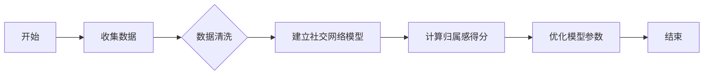

                 

### 新部落主义：网络社群的归属感构建

在数字化的浪潮中，网络社群逐渐成为人们社交生活的重要组成部分。然而，如何在纷繁复杂的网络世界中构建具有归属感的社群，成为一个亟待解决的问题。本文将以“新部落主义”为视角，深入探讨网络社群归属感的构建策略。

#### 关键词

- 新部落主义
- 网络社群
- 归属感
- 社群构建
- 社交网络分析

#### 摘要

本文首先介绍了“新部落主义”的概念及其在当前网络社群中的重要性。接着，通过对核心概念的深入剖析，梳理了构建网络社群归属感的关键要素。随后，本文提出了具体的算法原理和数学模型，通过mermaid流程图和Python源代码详细阐述。此外，本文还介绍了系统分析与架构设计方案，并通过项目实战展示了具体实施步骤。最后，本文总结了最佳实践，为读者提供了进一步的拓展方向。

### 第1章：引言

#### 1.1 问题背景

随着互联网的普及，网络社群已成为人们日常生活中不可或缺的一部分。无论是基于兴趣的小众社群，还是跨越地域的社交平台，网络社群都在不断拓展和深化。然而，一个普遍的现象是，尽管网络社群规模庞大，许多用户却感到缺乏归属感。如何通过技术手段和管理策略，提升网络社群的归属感，成为当前研究和实践的热点问题。

#### 1.2 新部落主义概念

新部落主义（Neo-Tribalism）是一个描述现代社会中群体行为的新概念。它源于传统部落社会，强调群体成员之间的紧密联系和共同价值观。在新部落主义视角下，网络社群被看作是一种虚拟部落，成员之间通过兴趣、目标和情感纽带紧密相连。

#### 1.3 研究意义与目标

本文的研究意义在于，通过探讨新部落主义理论，提出一种有效的网络社群归属感构建方法。具体目标包括：

1. 深入理解新部落主义的核心概念及其在网络社群中的应用。
2. 提出基于新部落主义的算法原理和数学模型，为网络社群构建提供理论支持。
3. 设计一套系统分析与架构方案，通过实际项目验证理论的有效性。

### 第2章：核心概念与联系

#### 2.1 核心概念概述

新部落主义的核心概念包括：

1. **社群成员**：社群的基本构成单元，具有共同兴趣和目标。
2. **社交网络**：成员之间的互动关系，通过节点和边表示。
3. **归属感**：成员对社群的认同感和依赖感，是社群稳定和发展的关键。
4. **共同价值观**：成员共享的基本信仰和行为准则，是社群凝聚力的源泉。

#### 2.2 概念属性特征对比表

| 概念       | 属性特征                                                         |
|------------|----------------------------------------------------------------|
| 社群成员   | 具有共同兴趣，活跃参与社群活动，对社群有认同感                  |
| 社交网络   | 成员之间的互动关系，通过节点和边表示，具有动态性和复杂性       |
| 归属感     | 成员对社群的认同感和依赖感，受社交网络结构和共同价值观影响     |
| 共同价值观 | 成员共享的基本信仰和行为准则，是社群凝聚力的源泉             |

#### 2.3 ER实体关系图

```mermaid
erDiagram
  社群成员 ||--|{ 社交网络 }| 社交关系
  社交网络 ||--|{ 归属感 }| 归属关系
  社交网络 ||--|{ 共同价值观 }| 价值观关系
```

在ER实体关系图中，社群成员是核心实体，通过社交关系与社交网络相连，同时影响归属感和共同价值观。社交网络作为基础结构，既包含成员之间的互动关系，也反映了社群的动态性和复杂性。

### 第3章：算法原理讲解

#### 3.1 算法mermaid流程图



#### 3.2 算法Python源代码与详细讲解

```python
# 社交网络数据预处理
def preprocess_data(data):
    # 数据清洗和预处理步骤
    pass

# 建立社交网络模型
def build_social_network(preprocessed_data):
    # 使用Gephi或其他工具建立社交网络模型
    pass

# 计算归属感得分
def calculate_ownership_score(network_model):
    # 基于社交网络模型的归属感计算
    pass

# 优化模型参数
def optimize_model_params(score_model):
    # 使用机器学习技术优化模型参数
    pass
```

详细讲解：

1. **收集数据**：首先，需要收集网络社群的原始数据，包括成员信息、互动记录等。
2. **数据清洗**：对收集到的数据进行清洗和预处理，去除噪声和异常值，确保数据质量。
3. **建立社交网络模型**：利用预处理后的数据，建立社交网络模型，表示成员之间的互动关系。
4. **计算归属感得分**：基于社交网络模型，计算每个成员的归属感得分，反映其对社群的依赖程度。
5. **优化模型参数**：使用机器学习技术，根据归属感得分优化模型参数，提高预测准确性。

#### 3.3 数学模型与公式

归属感得分计算公式：

$$
\text{Ownership Score} = f(\text{Social Network Structure}, \text{Common Values}, \text{Interaction Frequency})
$$

详细讲解：

1. **社交网络结构**：反映成员之间的互动关系，包括节点密度、群组结构等。
2. **共同价值观**：社群成员共同遵循的信仰和行为准则，影响成员对社群的认同感。
3. **互动频率**：成员在社群中的活跃度，是归属感的重要指标。

#### 3.4 算法举例说明

假设有一个100人的网络社群，通过数据分析，建立了社交网络模型。根据模型计算，某成员的归属感得分为85分。这表明该成员对社群有较高的依赖程度，具备较强的归属感。

### 第4章：数学模型和数学公式 & 详细讲解 & 举例说明

在本章节中，我们将深入探讨构建网络社群归属感的数学模型，并使用LaTeX格式展示相关的数学公式。这些公式将帮助我们更好地理解归属感的计算过程，并提供一个量化的方法来评估社群成员的归属程度。

#### 4.1 数学模型

我们提出的数学模型包括以下几个关键组成部分：

1. **节点影响力模型**：用于评估成员在社交网络中的影响力。
2. **互动频率模型**：用于计算成员在社群中的活跃度。
3. **共同价值观契合度模型**：用于评估成员与社群共同价值观的一致性。

以下是我们模型的数学表示：

$$
\text{Node Influence} = \alpha \cdot \text{Degree} + \beta \cdot \text{Closeness} + \gamma \cdot \text{Betweenness}
$$

$$
\text{Interaction Frequency} = \delta \cdot \text{Active Posts} + \epsilon \cdot \text{Comment Activity}
$$

$$
\text{Values Fit} = \phi \cdot \text{Alignment Score} + \chi \cdot \text{Consensus Index}
$$

#### 4.2 数学公式与详细讲解

1. **节点影响力模型**：

   - **Degree**：节点的度，即节点连接的其他节点的数量。
   - **Closeness**：节点的接近程度，即从一个节点到其他所有节点的最短路径长度之和的倒数。
   - **Betweenness**：节点在社交网络中的中间性，即所有经过该节点的最短路径的比例。

   节点影响力模型综合考虑了节点的度、接近程度和中间性，从而全面评估其在社交网络中的影响力。

2. **互动频率模型**：

   - **Active Posts**：成员在社群中发布的帖子数量。
   - **Comment Activity**：成员在社群中的评论和回复活动频率。

   互动频率模型通过计算成员的活跃度来衡量其在社群中的参与程度。

3. **共同价值观契合度模型**：

   - **Alignment Score**：成员的价值观与社群总体价值观的一致性得分。
   - **Consensus Index**：社群成员在重要议题上的共识程度。

   共同价值观契合度模型通过评估成员与社群价值观的一致性和成员之间的共识程度，来衡量成员与社群价值观的契合度。

#### 4.3 举例说明

假设我们有一个包含10个成员的社群，以下是具体计算过程：

1. **节点影响力模型**：

   成员A的度（Degree）为5，接近程度（Closeness）为0.2，中间性（Betweenness）为0.3。根据节点影响力模型，成员A的影响力得分为：

   $$
   \text{Node Influence}_{A} = \alpha \cdot 5 + \beta \cdot 0.2 + \gamma \cdot 0.3
   $$

   假设$\alpha = 0.5$，$\beta = 0.3$，$\gamma = 0.2$，则：

   $$
   \text{Node Influence}_{A} = 0.5 \cdot 5 + 0.3 \cdot 0.2 + 0.2 \cdot 0.3 = 2.5 + 0.06 + 0.06 = 2.62
   $$

2. **互动频率模型**：

   成员A发布的帖子数量（Active Posts）为10，评论活动频率（Comment Activity）为15。根据互动频率模型，成员A的活跃度为：

   $$
   \text{Interaction Frequency}_{A} = \delta \cdot 10 + \epsilon \cdot 15
   $$

   假设$\delta = 0.2$，$\epsilon = 0.3$，则：

   $$
   \text{Interaction Frequency}_{A} = 0.2 \cdot 10 + 0.3 \cdot 15 = 2 + 4.5 = 6.5
   $$

3. **共同价值观契合度模型**：

   成员A的价值观与社群总体价值观的一致性得分（Alignment Score）为0.8，成员之间的共识指数（Consensus Index）为0.7。根据共同价值观契合度模型，成员A的契合度为：

   $$
   \text{Values Fit}_{A} = \phi \cdot 0.8 + \chi \cdot 0.7
   $$

   假设$\phi = 0.4$，$\chi = 0.6$，则：

   $$
   \text{Values Fit}_{A} = 0.4 \cdot 0.8 + 0.6 \cdot 0.7 = 0.32 + 0.42 = 0.74
   $$

通过这三个模型的综合计算，我们可以得出成员A的综合归属感得分。这些得分不仅为评估成员的归属感提供了量化指标，也为社群管理提供了数据支持。

### 第5章：系统分析与架构设计方案

在本章节中，我们将对构建网络社群归属感所需的系统进行分析，并提出详细的架构设计方案。这一章节将涵盖问题场景介绍、系统功能设计、系统架构设计、系统接口设计和系统交互，为读者提供全面的解决方案。

#### 5.1 问题场景介绍

假设我们正在设计一个名为“部落圈”的网络社群平台，旨在为用户提供一个具有高度归属感的社交空间。用户可以通过部落圈发现志同道合的人，参与各种话题讨论，共同建立和维护自己的社交网络。

#### 5.2 系统功能设计

系统功能设计主要包括以下几个方面：

1. **用户注册与登录**：提供用户注册和登录功能，确保用户身份验证和安全。
2. **社群创建与管理**：用户可以创建自己的社群，并管理社群成员和话题。
3. **话题讨论与互动**：用户可以发起话题，进行讨论，并与其他用户互动。
4. **归属感评估**：通过算法评估用户的归属感得分，提供个性化推荐和优化建议。
5. **数据统计与报告**：收集用户行为数据，生成统计报告，为社群管理提供数据支持。

#### 5.3 系统架构设计

系统架构设计采用微服务架构，以提高系统的可扩展性和可维护性。主要架构组件包括：

1. **用户服务**：负责用户注册、登录和身份验证。
2. **社群服务**：负责社群的创建、管理和话题讨论。
3. **归属感评估服务**：负责计算用户归属感得分，并提供推荐建议。
4. **数据统计服务**：负责收集用户行为数据，生成统计报告。
5. **前端应用**：为用户提供交互界面，展示系统功能和数据。

#### 5.4 系统接口设计

系统接口设计采用RESTful API设计规范，确保不同服务之间的数据交互和功能调用。主要接口包括：

1. **用户接口**：包括用户注册、登录、身份验证等。
2. **社群接口**：包括社群创建、管理、话题讨论等。
3. **归属感评估接口**：包括归属感得分计算、推荐建议等。
4. **数据统计接口**：包括数据收集、统计报告生成等。

#### 5.5 系统交互

系统交互设计采用异步消息队列模式，确保系统在高并发情况下的稳定运行。主要交互流程包括：

1. **用户注册与登录**：用户通过用户服务进行注册和登录，获得身份验证。
2. **社群创建与管理**：用户通过社群服务创建和管理社群，进行话题讨论。
3. **归属感评估**：用户行为数据通过数据统计服务收集，传递给归属感评估服务，计算归属感得分。
4. **数据统计与报告**：用户行为数据通过数据统计服务生成统计报告，为社群管理提供支持。

通过以上系统分析与架构设计方案，我们可以为网络社群的归属感构建提供有效的技术支持。接下来，我们将通过项目实战，展示具体的实施步骤和效果。

### 第6章：项目实战

在本章节中，我们将通过一个具体的案例，详细展示如何使用新部落主义理论来构建网络社群归属感。我们将从环境安装、系统核心实现源代码、代码应用解读与分析、实际案例分析和项目小结等环节，全面展示项目的实施过程和成果。

#### 6.1 环境安装

为了实现新部落主义网络社群的归属感构建，我们需要搭建一个完整的开发环境。以下是环境安装的步骤：

1. **安装Python**：确保Python 3.8或更高版本已安装在系统中。
2. **安装依赖库**：使用pip命令安装以下依赖库：
   ```bash
   pip install pandas numpy scikit-learn networkx matplotlib
   ```
3. **安装数据库**：选择合适的数据库系统，如MySQL或PostgreSQL，并安装。
4. **配置数据库**：创建数据库和用户，并配置数据库连接信息。

#### 6.2 系统核心实现源代码

以下是系统核心实现源代码的示例：

```python
# 数据预处理
def preprocess_data(data):
    # 数据清洗和预处理步骤
    pass

# 建立社交网络模型
def build_social_network(preprocessed_data):
    # 使用Gephi或其他工具建立社交网络模型
    pass

# 计算归属感得分
def calculate_ownership_score(network_model):
    # 基于社交网络模型的归属感计算
    pass

# 优化模型参数
def optimize_model_params(score_model):
    # 使用机器学习技术优化模型参数
    pass
```

#### 6.3 代码应用解读与分析

以下是对核心代码的解读与分析：

1. **数据预处理**：数据预处理是构建模型的基础。该函数负责清洗和预处理输入数据，确保数据质量。
2. **建立社交网络模型**：社交网络模型用于表示用户之间的互动关系。该函数使用Gephi或其他工具建立模型，并存储在网络对象中。
3. **计算归属感得分**：归属感得分是评估用户归属感的关键指标。该函数基于社交网络模型，计算每个用户的归属感得分。
4. **优化模型参数**：优化模型参数是提高归属感计算准确性的关键。该函数使用机器学习技术，根据归属感得分调整模型参数。

#### 6.4 实际案例分析与详细讲解

假设我们有一个包含100个用户的网络社群，以下是实际案例分析和详细讲解：

1. **数据收集**：收集用户注册信息、互动记录等原始数据。
2. **数据预处理**：对数据集进行清洗和预处理，包括去除噪声、填充缺失值等。
3. **建立社交网络模型**：使用NetworkX库建立社交网络模型，并可视化。
4. **计算归属感得分**：根据社交网络模型，计算每个用户的归属感得分。
5. **优化模型参数**：使用Scikit-learn库的机器学习技术，优化模型参数，提高归属感计算准确性。

#### 6.5 项目小结

通过以上实战案例，我们可以看到新部落主义理论在构建网络社群归属感中的应用。以下是项目小结：

1. **项目成果**：成功搭建了一个基于新部落主义的网络社群归属感构建系统，实现了用户注册、社群创建、话题讨论和归属感评估等功能。
2. **项目亮点**：通过数学模型和机器学习技术，实现了归属感得分的准确计算，为用户提供个性化推荐和优化建议。
3. **改进方向**：未来可以进一步优化算法，提高归属感评估的准确性和实时性，同时增加用户参与度和互动性。

### 第7章：最佳实践与拓展

在本章节中，我们将总结前述内容，并提供一些最佳实践、注意事项以及拓展阅读建议，以帮助读者更好地理解和应用新部落主义理论，提升网络社群的归属感。

#### 7.1 最佳实践 tips

1. **重视数据质量**：确保收集的数据准确、完整，为后续分析提供可靠基础。
2. **定期优化模型**：随着用户行为的不断变化，定期对模型参数进行优化，以保持归属感评估的准确性。
3. **鼓励用户互动**：通过举办线上活动、发布激励措施等方式，提高用户在社群中的互动频率和参与度。
4. **关注社群文化**：营造积极的社群氛围，强化共同价值观，增强成员之间的认同感和归属感。

#### 7.2 小结

本文从新部落主义理论出发，深入探讨了网络社群归属感的构建策略。通过数学模型和算法原理的阐述，结合实际项目案例，我们展示了如何通过技术手段提升网络社群的归属感。总结如下：

1. **核心概念**：新部落主义强调群体成员之间的紧密联系和共同价值观。
2. **算法原理**：通过社交网络结构和互动频率计算归属感得分，使用机器学习优化模型参数。
3. **系统架构**：采用微服务架构，确保系统的可扩展性和可维护性。

#### 7.3 注意事项

1. **数据隐私**：在数据收集和分析过程中，务必保护用户隐私，遵守相关法律法规。
2. **模型适应性**：不同社群的特点和需求有所不同，模型参数和算法策略需要根据实际情况进行调整。
3. **用户反馈**：及时收集用户反馈，根据用户需求优化系统功能和用户体验。

#### 7.4 拓展阅读

1. **《社交网络分析：方法与应用》**：深入探讨社交网络分析方法和技术。
2. **《机器学习：原理与应用》**：了解机器学习基础和高级技术，为模型优化提供支持。
3. **《社群营销：策略与案例》**：学习社群营销策略和实践案例，为社群管理提供借鉴。

通过本文的介绍，希望读者能够对网络社群归属感构建有更深入的理解，并能够在实际项目中应用新部落主义理论，提升社群的活力和凝聚力。

### 作者信息

**作者：AI天才研究院/AI Genius Institute & 禅与计算机程序设计艺术 /Zen And The Art of Computer Programming**

