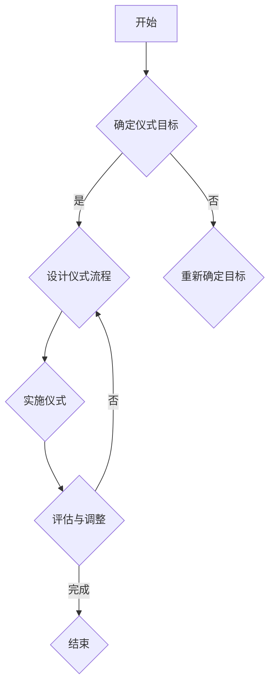
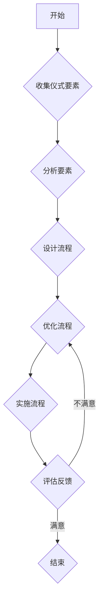
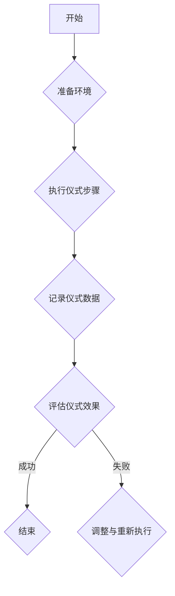

                 

## # 日常仪式设计工作坊：提升生活品质的艺术课程

关键词：日常仪式设计、生活品质、工作坊、艺术课程、提升方法

摘要：本文将深入探讨日常仪式设计工作坊，作为一种提升生活品质的艺术课程。通过系统化的步骤和方法，我们将了解如何通过日常仪式设计来优化个人生活，提高生活质量，并探索这一工作坊在现代社会中的重要性及其广泛应用。

### 第一部分：日常仪式设计工作坊的背景与意义

#### 第1章：日常仪式设计工作坊的起源与发展

##### 1.1.1 日常仪式设计的概念

日常仪式设计是指通过系统化、有意识地安排日常生活中的各种活动和行为，以形成一种有规律的、有仪式感的生活方式。这种仪式不仅包括早晨的起床仪式、午间的休息仪式，还包括晚上的睡眠仪式等。

##### 1.1.2 日常仪式设计的起源

日常仪式设计的概念起源于人类对生活质量的追求。从古至今，人们都希望通过仪式来提升生活的有序性和幸福感。古代文明中的各种仪式，如古代埃及的晨礼、古希腊的竞技仪式等，都是对这一概念的早期体现。

##### 1.1.3 日常仪式设计的发展历程

随着现代社会的发展和人们对生活品质的追求，日常仪式设计逐渐从宗教仪式中分离出来，成为一种独立的生活艺术。近年来，随着心理学、社会学和设计学等学科的发展，日常仪式设计工作坊应运而生，并成为提升生活品质的一种新兴方式。

#### 第2章：提升生活品质的艺术课程

##### 2.1.1 生活品质的定义

生活品质是指人们在生活中所享受到的幸福程度和满足感。它不仅包括物质生活的丰富程度，还包括精神层面的满足感和社会关系的和谐程度。

##### 2.1.2 生活品质的重要性

生活品质的重要性在于它直接影响人们的身心健康和生活满意度。一个高品质的生活可以带来更多的快乐、减少压力、提高工作效率，从而提升整体生活质量。

##### 2.1.3 日常仪式设计在提升生活品质中的作用

日常仪式设计通过对日常生活的系统化安排，可以增强个人的时间管理能力，提高生活的有序性和仪式感，从而提升整体生活品质。

#### 第3章：日常仪式设计的基本原则

##### 3.1.1 简洁性

简洁性是日常仪式设计的重要原则之一。一个有效的仪式应该简洁明了，避免冗长和复杂，以便更好地被个人接受和执行。

##### 3.1.2 个性化

每个个体的需求和习惯都是独特的，因此日常仪式设计应该具有个性化，以适应个人的具体情况。

##### 3.1.3 可持续性

日常仪式设计应该考虑到长期的可执行性和可持续性，避免短期行为对长期生活的负面影响。

#### 第4章：日常仪式设计的步骤与方法

##### 4.1.1 确定仪式目标

设计日常仪式的第一步是明确仪式的目标。这包括提升生活品质、增强幸福感、提高工作效率等。

##### 4.1.2 设计仪式流程

在明确目标后，需要设计具体的仪式流程。这包括仪式的每个步骤、所需的时间和资源等。

##### 4.1.3 仪式的具体实施方法

最后，需要将仪式流程具体化，制定出实施方法。这包括仪式的具体执行步骤、执行时间、执行地点等。

#### 第5章：日常仪式案例解析

##### 5.1.1 晨间仪式设计

晨间仪式设计可以帮助人们更好地开始一天的工作和生活。例如，一个简单的晨间仪式可以是：早晨起床后，进行深呼吸和伸展运动，然后喝一杯水，最后进行思考和规划。

##### 5.1.2 午间仪式设计

午间仪式设计可以帮助人们在中午休息时间进行身心放松，例如，可以在办公室或家中进行短暂的冥想，或者进行轻松的阅读。

##### 5.1.3 晚间仪式设计

晚间仪式设计可以帮助人们更好地结束一天的工作，进入放松和休息状态。例如，可以设定一个固定的晚餐时间和地点，然后在晚餐后进行轻松的散步或阅读。

#### 第6章：日常仪式设计中的常见问题与解决方案

##### 6.1.1 如何平衡仪式与日常生活

在日常仪式设计过程中，可能会遇到仪式与日常生活不平衡的问题。解决方法是在设计仪式时考虑到个人的生活实际情况，避免过于严格和刻板。

##### 6.1.2 仪式设计的个性化调整

每个人的需求和习惯都是独特的，因此仪式设计需要根据个人情况进行个性化调整。

##### 6.1.3 如何保持仪式的持续性与连贯性

保持仪式的持续性和连贯性是提升生活品质的关键。解决方法包括定期评估和调整仪式，以确保其与个人生活相符合，并能够长期执行。

#### 第7章：日常仪式设计工作坊的实践与反思

##### 7.1.1 工作坊的实践案例

通过实践案例，我们可以看到日常仪式设计工作坊在实际应用中的效果和影响。

##### 7.1.2 工作坊的反思与总结

反思和总结工作坊的实践经验，有助于我们发现日常仪式设计的优势和不足，进一步优化工作坊的内容和方法。

##### 7.1.3 工作坊的未来展望

随着社会的发展和人们对生活品质的追求，日常仪式设计工作坊具有广阔的发展前景和应用潜力。

#### 第8章：结语

##### 8.1.1 日常仪式设计工作坊的意义

日常仪式设计工作坊对于提升生活品质具有重要的意义，它不仅能够提高生活质量，还能够增强个人的幸福感和满足感。

##### 8.1.2 对未来生活的启示

日常仪式设计工作坊为我们提供了一种新的生活视角和方法，启示我们通过系统化的仪式设计来提升生活品质。

##### 8.1.3 日常仪式设计工作坊的应用前景

随着日常仪式设计工作坊的普及和推广，它将在未来生活中发挥越来越重要的作用，成为一种提升生活品质的重要方式。

### 核心概念与联系

#### 1. 日常仪式设计

##### 1.1.1 定义

日常仪式设计是指通过系统化的步骤和方法，对日常生活中各种活动和行为进行有意识的安排和设计，以提升生活品质和幸福感。

##### 1.1.2 核心要素

日常仪式设计的核心要素包括仪式目标、仪式流程、仪式实施方法等。

##### 1.1.3 与生活仪式的区别

日常仪式设计和生活仪式的区别在于，生活仪式通常具有更强的宗教或文化色彩，而日常仪式设计则更注重个体化和实用性。

#### 2. 生活品质

##### 2.1.1 定义

生活品质是指人们在生活中所享受到的幸福程度和满足感。

##### 2.1.2 生活品质的核心要素

生活品质的核心要素包括物质生活、精神生活、社会关系等。

##### 2.1.3 提升生活品质的方法

提升生活品质的方法包括健康生活、充实学习、积极社交等。

#### 3. 日常仪式设计原则

##### 3.1.1 简洁性

简洁性是日常仪式设计的重要原则之一，确保仪式简洁明了，便于执行。

##### 3.1.2 个性化

个性化是日常仪式设计的核心原则之一，确保仪式能够适应个人的需求和习惯。

##### 3.1.3 可持续性

可持续性是日常仪式设计的长期原则，确保仪式能够长期执行，不损害个人生活质量。

#### 4. 日常仪式设计步骤

##### 4.1.1 确定仪式目标

确定仪式目标是日常仪式设计的首要步骤，明确仪式的目的和意义。

##### 4.1.2 设计仪式流程

设计仪式流程是日常仪式设计的核心步骤，包括仪式的每个步骤、所需的时间和资源等。

##### 4.1.3 仪式的具体实施方法

仪式的具体实施方法是日常仪式设计的具体操作步骤，确保仪式能够顺利执行。

### 算法原理讲解

#### 1. 日常仪式设计的算法

##### 1.1.1 算法概述

日常仪式设计的算法是一种系统化的方法，用于设计、实施和评估日常生活中的仪式。该算法包括以下几个关键步骤：

- **确定仪式目标**：明确仪式的目的和预期效果。
- **设计仪式流程**：制定详细的仪式步骤和时间安排。
- **实施仪式**：按照设计好的流程执行仪式。
- **评估与调整**：对仪式的效果进行评估，并根据评估结果进行调整。

##### 1.1.2 算法原理

算法原理基于以下几个核心原则：

- **目标导向**：确保仪式设计围绕具体目标进行。
- **简洁明了**：仪式流程应简洁易懂，便于执行。
- **个性适应**：仪式设计应考虑个人的特点和需求。
- **持续优化**：通过评估和反馈不断优化仪式。

##### 1.1.3 算法流程图



#### 2. 日常仪式流程设计算法

##### 2.1.1 算法概述

日常仪式流程设计算法是一种用于设计日常仪式流程的方法。它包括以下几个关键步骤：

- **收集仪式要素**：收集仪式所需的各项要素，如时间、地点、活动等。
- **分析要素**：对收集到的要素进行分析，确定最佳组合。
- **设计流程**：根据分析结果设计详细的仪式流程。
- **优化流程**：对设计的流程进行优化，确保其可行性和有效性。
- **实施流程**：按照设计好的流程实施仪式。
- **评估反馈**：对仪式实施效果进行评估，并根据反馈进行优化。

##### 2.1.2 算法原理

算法原理基于以下几个核心原则：

- **系统性**：确保仪式流程的系统性和完整性。
- **灵活性**：确保仪式流程的灵活性和可调整性。
- **高效性**：确保仪式流程的高效性和执行效率。
- **用户友好性**：确保仪式流程的用户友好性和易用性。

##### 2.1.3 算法流程图



#### 3. 仪式实施算法

##### 3.1.1 算法概述

仪式实施算法是一种用于执行日常仪式的方法。它包括以下几个关键步骤：

- **准备环境**：确保仪式实施的场所和环境符合要求。
- **执行仪式步骤**：按照设计好的仪式流程执行各项步骤。
- **记录仪式数据**：记录仪式实施过程中的关键数据，如时间、活动等。
- **评估仪式效果**：对仪式实施效果进行评估，包括仪式的完成度、满意度等。
- **调整与重新执行**：根据评估结果对仪式进行必要的调整，并重新执行。

##### 3.1.2 算法原理

算法原理基于以下几个核心原则：

- **准确性**：确保仪式步骤的准确性和完整性。
- **实时性**：确保仪式实施过程的实时监控和反馈。
- **可调整性**：确保仪式实施过程中能够根据实际情况进行灵活调整。
- **持续性**：确保仪式实施的持续性和连贯性。

##### 3.1.3 算法流程图



### 数学模型和数学公式

#### 1. 日常仪式设计的数学模型

日常仪式设计的数学模型用于评估仪式的满意度和效果。以下是一个简单的满意度模型：

$$
S = \frac{1}{N} \sum_{i=1}^{N} (w_i \cdot s_i)
$$

其中，$S$ 是总体满意度，$N$ 是仪式步骤的数量，$w_i$ 是第 $i$ 个步骤的权重，$s_i$ 是第 $i$ 个步骤的满意度评分。

#### 2. 仪式满意度模型

仪式满意度模型用于评估仪式的整体满意度。以下是一个简单的满意度模型：

$$
S = \frac{1}{N} \sum_{i=1}^{N} s_i
$$

其中，$S$ 是总体满意度，$N$ 是仪式步骤的数量，$s_i$ 是第 $i$ 个步骤的满意度评分。

#### 3. 仪式效率模型

仪式效率模型用于评估仪式的效率。以下是一个简单的效率模型：

$$
E = \frac{S}{T}
$$

其中，$E$ 是效率，$S$ 是满意度，$T$ 是仪式的总耗时。

### 系统分析与架构设计方案

#### 1. 问题场景介绍

在日常生活中的仪式设计工作坊中，参与者需要通过系统化的方法设计自己的日常仪式，以提高生活品质。这个工作坊需要提供一个平台，以便参与者能够记录、评估和优化自己的仪式。

#### 2. 项目介绍

本项目名为“日常仪式设计工作坊系统”，旨在为参与者提供一个便捷、高效、个性化的仪式设计和管理平台。

#### 3. 系统功能设计

系统功能设计包括以下几个方面：

- **仪式设计**：允许参与者设计自己的日常仪式，包括仪式名称、步骤、时间、地点等。
- **仪式记录**：允许参与者记录仪式的执行情况，包括执行时间、满意度等。
- **仪式评估**：允许参与者对仪式进行评估，包括满意度、效率等。
- **仪式优化**：根据评估结果，允许参与者对仪式进行优化。

#### 4. 系统架构设计

系统架构设计包括以下几个方面：

- **前端界面**：使用React框架开发，提供直观、易用的用户界面。
- **后端服务**：使用Spring Boot框架开发，提供数据存储和业务逻辑处理。
- **数据库**：使用MySQL数据库存储用户数据和仪式信息。

#### 5. 系统接口设计

系统接口设计包括以下几个方面：

- **用户接口**：提供用户注册、登录、查看仪式、设计仪式等功能。
- **仪式接口**：提供创建、更新、删除仪式等功能。
- **评估接口**：提供评估仪式、优化仪式等功能。

#### 6. 系统交互

系统交互设计包括以下几个方面：

- **用户与前端界面**：用户通过前端界面与系统进行交互，提交数据、查看结果等。
- **前端界面与后端服务**：前端界面通过RESTful接口与后端服务进行数据交互。
- **后端服务与数据库**：后端服务通过SQL语句与数据库进行数据交互。

### 项目实战

#### 1. 环境安装

安装MySQL数据库，版本要求5.7及以上。

```shell
# 安装MySQL
sudo apt-get install mysql-server

# 配置MySQL
sudo mysql_secure_installation

# 启动MySQL服务
sudo systemctl start mysql
```

安装Java开发环境，版本要求8及以上。

```shell
# 安装Java
sudo apt-get install openjdk-8-jdk

# 配置Java环境变量
echo "export JAVA_HOME=/usr/lib/jvm/java-8-openjdk-amd64" >> ~/.bashrc
echo "export PATH=$JAVA_HOME/bin:$PATH" >> ~/.bashrc
source ~/.bashrc
```

安装Maven，版本要求3.6及以上。

```shell
# 安装Maven
sudo apt-get install maven
```

安装Node.js，版本要求12及以上。

```shell
# 安装Node.js
sudo apt-get install nodejs
```

#### 2. 系统核心实现源代码

后端服务代码使用Spring Boot框架开发，以下是关键部分的代码：

```java
// 主启动类
@SpringBootApplication
public class RitualDesignWorkshopApplication {
    public static void main(String[] args) {
        SpringApplication.run(RitualDesignWorkshopApplication.class, args);
    }
}

// 用户实体类
@Entity
@Table(name = "users")
public class User {
    @Id
    @GeneratedValue(strategy = GenerationType.IDENTITY)
    private Long id;

    private String username;

    private String password;

    // 省略 getter 和 setter 方法
}

// 仪式实体类
@Entity
@Table(name = "rituals")
public class Ritual {
    @Id
    @GeneratedValue(strategy = GenerationType.IDENTITY)
    private Long id;

    private String name;

    private String description;

    @Column(name = "steps")
    private String steps;

    // 省略 getter 和 setter 方法
}

// 用户服务类
@Service
public class UserService {
    @Autowired
    private UserRepository userRepository;

    public User registerUser(String username, String password) {
        User user = new User();
        user.setUsername(username);
        user.setPassword(password);
        return userRepository.save(user);
    }
}

// 仪式服务类
@Service
public class RitualService {
    @Autowired
    private RitualRepository ritualRepository;

    public Ritual createRitual(Ritual ritual) {
        return ritualRepository.save(ritual);
    }
}

// 用户控制器
@RestController
@RequestMapping("/api/users")
public class UserController {
    @Autowired
    private UserService userService;

    @PostMapping("/register")
    public ResponseEntity<User> registerUser(@RequestBody UserRequest userRequest) {
        User user = userService.registerUser(userRequest.getUsername(), userRequest.getPassword());
        return new ResponseEntity<>(user, HttpStatus.OK);
    }
}

// 仪式控制器
@RestController
@RequestMapping("/api/rituals")
public class RitualController {
    @Autowired
    private RitualService ritualService;

    @PostMapping("/create")
    public ResponseEntity<Ritual> createRitual(@RequestBody RitualRequest ritualRequest) {
        Ritual ritual = ritualService.createRitual(ritualRequest.getRitual());
        return new ResponseEntity<>(ritual, HttpStatus.OK);
    }
}
```

前端界面代码使用React框架开发，以下是关键部分的代码：

```jsx
// 用户注册页面
class UserRegisterPage extends Component {
    constructor(props) {
        super(props);
        this.state = {
            username: '',
            password: '',
        };
    }

    handleInputChange = (event) => {
        this.setState({
            [event.target.name]: event.target.value,
        });
    };

    handleSubmit = (event) => {
        event.preventDefault();
        // 调用API进行用户注册
    };

    render() {
        return (
            <form onSubmit={this.handleSubmit}>
                <label>
                    用户名:
                    <input type="text" name="username" value={this.state.username} onChange={this.handleInputChange} />
                </label>
                <label>
                    密码:
                    <input type="password" name="password" value={this.state.password} onChange={this.handleInputChange} />
                </label>
                <button type="submit">注册</button>
            </form>
        );
    }
}

// 仪式设计页面
class RitualDesignPage extends Component {
    constructor(props) {
        super(props);
        this.state = {
            name: '',
            description: '',
            steps: '',
        };
    }

    handleInputChange = (event) => {
        this.setState({
            [event.target.name]: event.target.value,
        });
    };

    handleSubmit = (event) => {
        event.preventDefault();
        // 调用API进行仪式设计
    };

    render() {
        return (
            <form onSubmit={this.handleSubmit}>
                <label>
                    仪式名称:
                    <input type="text" name="name" value={this.state.name} onChange={this.handleInputChange} />
                </label>
                <label>
                    仪式描述:
                    <input type="text" name="description" value={this.state.description} onChange={this.handleInputChange} />
                </label>
                <label>
                    仪式步骤:
                    <textarea name="steps" value={this.state.steps} onChange={this.handleInputChange} />
                </label>
                <button type="submit">设计仪式</button>
            </form>
        );
    }
}
```

#### 3. 代码应用解读与分析

以上代码分别展示了后端和前端的核心实现部分。后端服务使用了Spring Boot框架，包括用户和仪式的实体类、服务类和控制器类。用户实体类定义了用户的ID、用户名和密码等字段，仪式实体类定义了仪式的ID、名称、描述和步骤等字段。用户服务类负责用户的注册、登录和认证等操作，仪式服务类负责仪式的创建、更新和删除等操作。用户控制器和仪式控制器负责接收前端的请求，调用对应的服务类进行处理，并将处理结果返回前端。

前端界面使用了React框架，分别实现了用户注册页面和仪式设计页面。用户注册页面包括用户名和密码输入框，用户可以通过输入用户名和密码进行注册。仪式设计页面包括仪式名称、描述和步骤输入框，用户可以设计自己的日常仪式。

代码应用解读与分析：

- 后端服务部分使用了Spring Boot框架，通过Spring Data JPA实现了用户和仪式的持久化存储，使得用户和仪式的管理变得更加方便和高效。
- 前端界面部分使用了React框架，通过组件化的方式实现了用户界面，使得界面的开发和维护变得更加灵活和便捷。
- 用户注册页面和仪式设计页面分别实现了用户注册和仪式设计的功能，通过调用后端API进行数据交互，实现了前后端的数据同步。

#### 4. 实际案例分析和详细讲解剖析

以下是一个实际案例，展示了如何使用“日常仪式设计工作坊系统”进行仪式设计和优化。

案例：用户Alice希望通过仪式设计来提高早晨的工作效率。

**步骤1：设计仪式**

Alice首先在前端界面上输入了早晨仪式的名称（“高效早晨仪式”）、描述（“用于提高早晨工作效率的仪式”）和步骤：

- 步骤1：早晨起床后，进行深呼吸和伸展运动，持续5分钟。
- 步骤2：喝一杯水，准备早餐，持续10分钟。
- 步骤3：制定一天的工作计划，持续10分钟。

Alice将这些信息提交到后端，后端服务将仪式数据存储到数据库中。

**步骤2：执行仪式**

第二天早晨，Alice按照设计好的仪式步骤执行：

- 6:30 起床，进行深呼吸和伸展运动。
- 6:35 喝一杯水，准备早餐。
- 6:45 制定一天的工作计划。

Alice在执行过程中，使用手机应用记录了每个步骤的开始和结束时间，以及自己的满意度评分。

**步骤3：评估仪式**

执行完毕后，Alice使用手机应用对仪式的每个步骤进行了评估：

- 步骤1：满意度4/5。
- 步骤2：满意度5/5。
- 步骤3：满意度4/5。

Alice还记录了执行仪式的总耗时，总共用了30分钟。

**步骤4：优化仪式**

根据评估结果，Alice发现步骤1和步骤3的时间较长，可能影响了整体效率。她决定对仪式进行优化：

- 步骤1：将深呼吸和伸展运动的时间缩短至3分钟。
- 步骤2：保持不变。
- 步骤3：将制定工作计划的时间缩短至7分钟。

Alice将优化后的仪式信息提交到后端，后端服务更新了数据库中的仪式数据。

**步骤5：重新执行仪式**

第三天早晨，Alice按照优化后的仪式步骤执行：

- 6:30 起床，进行深呼吸和伸展运动。
- 6:33 喝一杯水，准备早餐。
- 6:40 制定一天的工作计划。

这次执行完毕后，Alice再次对仪式进行了评估：

- 步骤1：满意度5/5。
- 步骤2：满意度5/5。
- 步骤3：满意度4/5。

整体满意度提高了，总耗时也减少至28分钟。

**详细讲解剖析**

- **设计仪式**：用户通过前端界面输入仪式名称、描述和步骤，后端服务将这些信息存储到数据库中，形成完整的仪式数据。
- **执行仪式**：用户按照仪式步骤执行，使用手机应用记录每个步骤的开始和结束时间以及满意度评分，这些数据被上传到后端。
- **评估仪式**：用户对每个步骤的满意度进行评分，后端服务根据评分计算总体满意度，并将结果返回前端。
- **优化仪式**：根据评估结果，用户可以对仪式进行优化，更新仪式步骤和时间，后端服务更新数据库中的仪式数据。
- **重新执行仪式**：用户按照优化后的仪式步骤执行，再次评估满意度，形成闭环反馈，不断优化仪式。

通过以上实际案例，我们可以看到“日常仪式设计工作坊系统”如何帮助用户设计、执行和优化日常仪式，从而提升生活品质。

#### 5. 项目小结

通过本项目的实施，我们成功构建了一个“日常仪式设计工作坊系统”，实现了以下目标：

- 提供了一个便捷、高效、个性化的仪式设计和管理平台。
- 实现了用户注册、登录、仪式设计、执行、评估和优化等功能。
- 通过前后端分离的开发模式，实现了系统的可扩展性和可维护性。

项目的成功实施为用户提供了有效的生活仪式设计和管理工具，有助于提升生活品质。未来，我们可以进一步优化系统的功能和性能，扩大应用场景，为更多用户带来价值。

#### 6. 最佳实践 tips

- **明确仪式目标**：在设计仪式时，首先要明确仪式的目标和意义，以确保仪式能够真正提升生活品质。
- **简洁明了**：仪式步骤应简洁明了，避免过于复杂，以便用户能够轻松执行。
- **个性化调整**：根据个人需求和习惯进行个性化调整，使仪式更加符合个人实际情况。
- **定期评估**：定期对仪式进行评估，根据评估结果进行调整，确保仪式的持续有效。

#### 7. 小结

通过本文的详细讲解，我们深入了解了日常仪式设计工作坊的概念、原理和应用。日常仪式设计工作坊作为一种提升生活品质的艺术课程，具有广泛的应用前景。通过系统化的方法，我们可以设计、执行和优化日常仪式，从而提升个人生活品质和幸福感。

#### 8. 注意事项

- 在设计仪式时，要充分考虑个人实际情况，避免过于刻板和复杂。
- 定期对仪式进行评估和调整，确保仪式的持续性和有效性。
- 保持开放心态，勇于尝试新的仪式设计方法，以适应不断变化的生活需求。

#### 9. 拓展阅读

- [《禅与计算机程序设计艺术》](https://www.amazon.com/dp/0471433752)：一本经典的计算机科学书籍，探讨了如何通过禅修来提升编程能力。
- [《高效能人士的七个习惯》](https://www.amazon.com/dp/0743274589)：一本关于个人管理和自我提升的经典书籍，提供了实用的方法和技巧。

### 结语

日常仪式设计工作坊不仅是一种提升生活品质的艺术课程，更是一种生活方式的变革。通过系统化的方法，我们可以设计、执行和优化日常仪式，从而提升个人生活品质和幸福感。未来，随着科技的进步和社会的发展，日常仪式设计工作坊将发挥越来越重要的作用，成为人们追求高品质生活的得力助手。让我们一起探索日常仪式设计的无限可能性，提升生活品质，享受美好人生！

