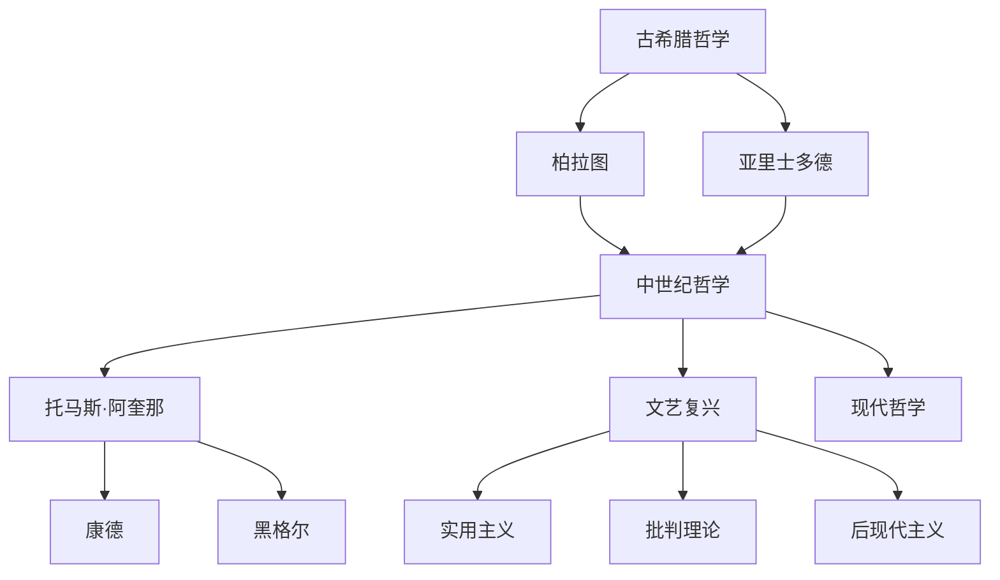
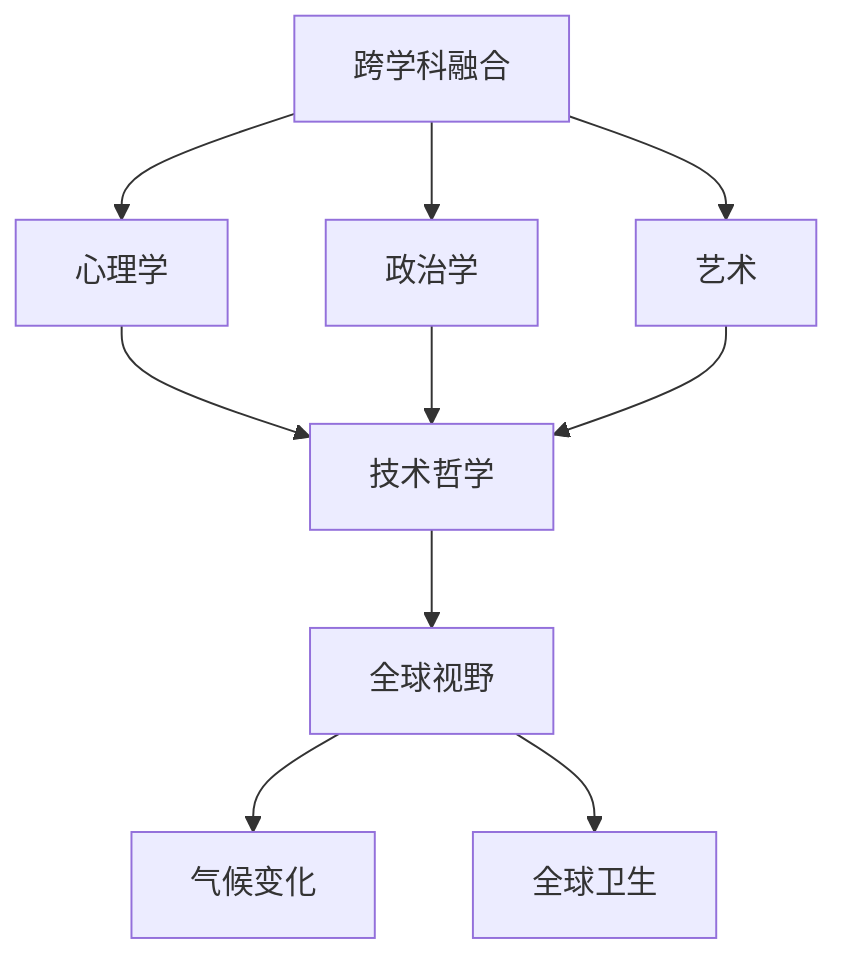

                 

# 日常生活中的哲学实践：将思考融入行动

## 关键词：哲学实践，日常生活，逻辑思维，伦理学，心理学，政治哲学，艺术

## 摘要：
在现代社会中，哲学不再仅仅是学术领域的探讨，它逐渐渗透到我们的日常生活中。本文旨在探讨哲学实践在日常生活中的重要性，通过逻辑清晰的分析和实例讲解，展示如何将哲学思考融入行动，提升个人素养和社会智慧。本文分为五个部分，首先介绍哲学实践的基本概念和理论基础；然后深入探讨哲学思考的过程与方法；接着具体分析哲学在伦理学、心理学、政治哲学和艺术领域的实践；最后总结哲学实践的意义和挑战。

## 第1章：问题背景与核心概念

### 1.1 问题背景

#### 1.1.1 哲学在日常生活中的意义

哲学，作为对世界根本问题的系统性思考，其影响早已超出了学术研究的范畴。在日常生活中，哲学帮助我们理解存在的本质、认识自我、探索真理、追求智慧。例如，通过哲学的反思，我们可以更好地处理道德困境，理解人类行为背后的动机，提升社会交往的智慧。

#### 1.1.2 哲学实践的价值与挑战

哲学实践的价值在于它能够提升个人的批判性思维和道德判断力，帮助我们在复杂多变的社会中做出合理的决策。然而，哲学实践也面临挑战，如如何将深奥的哲学理论应用到具体的日常生活中，如何在实践中保持对真理的持续追求。

#### 1.1.3 本书的研究目的与结构安排

本书旨在通过分析和实例，阐述哲学实践在日常生活中的重要性，并提供具体的实践方法和技巧。本文结构分为五部分：第一部分介绍哲学实践的基本概念和理论基础；第二部分探讨哲学思考的过程与方法；第三部分至第五部分分别探讨哲学在伦理学、心理学、政治哲学和艺术领域的实践。

### 1.2 核心概念

#### 1.2.1 哲学与实践的关系

哲学与实践的关系是相互促进的。哲学提供了对实践的理论指导，而实践则是哲学思想的检验和丰富。例如，伦理学通过实践检验其道德原则的有效性，而心理学则通过实践验证其理论模型。

#### 1.2.2 哲学实践的基本要素

哲学实践的基本要素包括反思、批判性思维、逻辑推理和道德判断。这些要素共同构成了哲学思考的核心框架。

#### 1.2.3 哲学实践的类型与形式

哲学实践的类型和形式多样，包括伦理决策、道德辩论、心理反思、政治参与和艺术创作等。每种形式都有其独特的实践价值和挑战。

### 1.3 哲学实践的理论基础

#### 1.3.1 西方哲学的传统视角

西方哲学强调理性思考和逻辑推理，如柏拉图的理念论和亚里士多德的逻辑学。这些传统视角为哲学实践提供了理论基础。

#### 1.3.2 东方哲学的实践智慧

东方哲学强调顺应自然和内心的宁静，如道家的“无为而治”和佛家的“禅修”。这些实践智慧为哲学实践提供了不同的视角。

#### 1.3.3 当代哲学对实践的关注

当代哲学更加注重实践和现实问题，如实用主义和批判理论。这些关注点为哲学实践提供了新的动力。

### 1.4 哲学实践的边界与外延

#### 1.4.1 哲学实践与日常生活的关系

哲学实践与日常生活的关系密切。哲学反思可以帮助我们更好地理解生活中的问题，提高生活质量。

#### 1.4.2 哲学实践与专业领域的交叉

哲学实践不仅局限于日常生活，还与专业领域交叉。例如，医学伦理、法律哲学和工程伦理等领域都离不开哲学的思考。

#### 1.4.3 哲学实践在社会层面的影响

哲学实践在社会层面具有深远的影响。它能够促进社会公正、推动社会进步和提升社会文化水平。

### 1.5 本章小结

本章介绍了哲学实践在日常生活中的背景、核心概念、理论基础以及边界与外延。通过本章的内容，读者可以初步了解哲学实践的重要性和多样性，为后续章节的深入探讨打下基础。在接下来的章节中，我们将进一步探讨哲学思考的过程与方法，以及哲学在各个领域的具体实践。## 第一部分：导论

### 第1章：问题背景与核心概念

#### 1.1.1 哲学在日常生活中的意义

哲学，作为一门探讨存在、知识、价值等根本问题的学科，自古以来就与人类的生活密不可分。从苏格拉底的“未经审视的生活不值得过”到康德的“启蒙就是人类脱离自行设定的不成熟状态的过程”，哲学始终在引导人们思考和反思自己的生活。哲学不仅关注抽象的理论问题，更关注现实生活中的具体问题。例如，伦理学帮助我们判断什么是对与错，政治哲学探讨社会秩序和公正，心理学帮助我们理解人的行为和心理过程，艺术哲学则探索美的本质和艺术的意义。因此，哲学在日常生活中的意义不仅仅在于提供理论指导，更在于帮助人们提升生活质量，解决实际生活中的困惑。

#### 1.1.2 哲学实践的价值与挑战

哲学实践的价值在于其能够培养个人的批判性思维、逻辑推理能力和道德判断力。通过哲学实践，我们可以更深入地理解自己、他人和社会，从而在面对复杂的社会现象和个人问题时，能够做出更明智的决策。例如，在面对道德困境时，哲学实践可以帮助我们明确自己的价值观和道德原则，从而做出符合自己信仰的决策。此外，哲学实践还可以促进个人自我反省和自我提升，使我们能够更好地认识自己的优点和不足，从而不断改进自己。

然而，哲学实践也面临一些挑战。首先，哲学理论往往抽象且深奥，将理论应用到实际生活中需要一定的能力和技巧。例如，如何将伦理学的原则应用到具体的道德决策中，如何将政治哲学的理念融入到社会实践中。其次，哲学实践需要持续的努力和耐心。哲学思考不是一蹴而就的，它需要我们不断地反思、质疑和探索。最后，哲学实践也需要与现实相结合。哲学理论往往是对现实问题的抽象和概括，如何在哲学理论和现实生活之间找到平衡，是哲学实践的一个重要挑战。

#### 1.1.3 本书的研究目的与结构安排

本书旨在通过分析和实例，阐述哲学实践在日常生活中的重要性，并提供具体的实践方法和技巧。具体来说，本书的研究目的有以下几点：

1. **探讨哲学实践的基本概念和理论基础**：介绍哲学实践的基本概念，如哲学与实践的关系、哲学实践的基本要素和类型，以及哲学实践的理论基础，包括西方哲学的传统视角、东方哲学的实践智慧和当代哲学对实践的关注。

2. **阐述哲学思考的过程与方法**：探讨哲学思考的过程，如提出问题、分析问题和解决问题的能力，以及哲学思考的方法，如逻辑思维、演绎推理和归纳推理。同时，介绍哲学思考的技巧，如反思与自我审视、对话与交流、比较与综合。

3. **具体分析哲学在伦理学、心理学、政治哲学和艺术领域的实践**：通过实例和案例分析，展示哲学实践如何在不同领域中发挥作用，如何帮助我们解决实际问题。

4. **总结哲学实践的意义和挑战**：总结哲学实践的价值，探讨其在个人成长、社会交往和专业领域中的应用，同时分析哲学实践面临的挑战，并提出解决方案。

本书的结构安排如下：

- **第一部分：导论**：介绍哲学实践的基本概念和背景，阐述本书的研究目的和结构安排。
- **第二部分：哲学思考的过程与方法**：探讨哲学思考的过程和方法，包括提出问题、分析问题和解决问题的能力，以及哲学思考的方法和技巧。
- **第三部分：哲学实践的具体领域**：具体分析哲学在伦理学、心理学、政治哲学和艺术领域的实践。
- **第四部分：哲学实践的意义与挑战**：总结哲学实践的意义和面临的挑战，探讨哲学实践的未来发展方向。

通过本书的阅读，读者将能够更深入地理解哲学实践的重要性，掌握哲学思考的方法和技巧，并在日常生活中有效地运用哲学知识，提升个人素养和社会智慧。## 1.2 核心概念

#### 1.2.1 哲学与实践的关系

哲学与实践的关系是相互依存的。哲学为实践提供了理论基础和指导，而实践则是哲学思想的检验和丰富。哲学通过抽象和概括现实生活中的问题，提供了一系列概念和原则，如伦理原则、逻辑规则、政治理念等，这些概念和原则为实践提供了指导。例如，伦理学中的道德原则可以帮助我们判断什么是对与错的，逻辑学中的推理规则可以帮助我们分析问题的逻辑结构。另一方面，实践是哲学思想的检验场。只有在实践中，哲学理论才能得到验证和修正。例如，一个伦理原则只有在实践中被验证为有效，才能真正成为道德准则。

#### 1.2.2 哲学实践的基本要素

哲学实践的基本要素包括反思、批判性思维、逻辑推理和道德判断。这些要素共同构成了哲学思考的核心框架。

1. **反思**：反思是哲学实践的基础。它要求我们不断地质疑和审视自己的观点和行为，以发现其中的问题和不足。通过反思，我们可以更好地理解自己，发现自己的认知偏见和思维习惯，从而提高自己的认知水平。

2. **批判性思维**：批判性思维是指对信息、观点和理论进行批判性分析和评估的能力。它要求我们不仅仅接受表面的信息，而是要深入思考，找出其中的逻辑谬误和证据不足。批判性思维能够帮助我们更好地理解复杂的问题，做出更合理的决策。

3. **逻辑推理**：逻辑推理是指根据已知的事实和原则，通过逻辑规则推导出新的结论。它是哲学思考的核心方法。逻辑推理能够帮助我们分析问题的逻辑结构，找出问题的本质，从而做出更合理的决策。

4. **道德判断**：道德判断是指根据伦理原则和道德准则，对行为和决策进行价值评估。它是哲学实践中的重要组成部分。道德判断能够帮助我们判断什么是对与错的，从而在日常生活中做出符合道德规范的行为。

#### 1.2.3 哲学实践的类型与形式

哲学实践的类型和形式多种多样，涵盖了伦理决策、道德辩论、心理反思、政治参与和艺术创作等领域。每种形式都有其独特的实践价值和挑战。

1. **伦理决策**：伦理决策是指在面临道德困境时，根据伦理原则和道德准则做出的决策。伦理决策的挑战在于如何在不同价值观和利益之间找到平衡点。

2. **道德辩论**：道德辩论是指通过逻辑推理和证据支持，对不同道德观点进行论证和反驳。道德辩论能够帮助我们更深入地理解道德问题，提高我们的道德判断力。

3. **心理反思**：心理反思是指通过反思自己的心理状态和情感体验，理解自己的内心世界。心理反思能够帮助我们更好地认识自己，提高自我认知和情感管理能力。

4. **政治参与**：政治参与是指通过投票、参与公共讨论和活动等方式，影响社会政治决策。政治参与能够帮助我们理解社会政治现象，提高我们的社会责任感。

5. **艺术创作**：艺术创作是指通过创作艺术作品，表达自己的思想和情感。艺术创作能够帮助我们理解美的本质，提高我们的审美能力。

#### 1.2.4 哲学实践的理论基础

哲学实践的理论基础涵盖了西方哲学的传统视角、东方哲学的实践智慧和当代哲学对实践的关注。

1. **西方哲学的传统视角**：西方哲学强调理性思考和逻辑推理。例如，柏拉图的理念论认为真理存在于理念世界，而亚里士多德的逻辑学为推理提供了严格的规则。这些传统视角为哲学实践提供了理论框架。

2. **东方哲学的实践智慧**：东方哲学强调顺应自然和内心的宁静。例如，道家的“无为而治”主张顺应自然，佛家的“禅修”强调内心的宁静。这些实践智慧为哲学实践提供了不同的视角。

3. **当代哲学对实践的关注**：当代哲学更加注重实践和现实问题。例如，实用主义强调实践和效果，批判理论关注社会不公和权力结构。这些关注点为哲学实践提供了新的动力。

#### 1.2.5 哲学实践与日常生活的关系

哲学实践与日常生活的关系密切。哲学反思可以帮助我们更好地理解生活中的问题，提高生活质量。例如，通过反思，我们可以理解自己的情绪和行为，从而更好地管理自己的情绪和行为。通过批判性思维，我们可以评估信息和观点，避免受到错误的引导。通过逻辑推理，我们可以分析问题的逻辑结构，找到解决问题的方法。通过道德判断，我们可以做出符合道德规范的行为，提升自己的道德素养。

#### 1.2.6 哲学实践与专业领域的交叉

哲学实践不仅局限于日常生活，还与专业领域交叉。例如，医学伦理需要哲学的思考来指导医生在道德困境中做出正确的决策；法律哲学需要哲学的分析来理解法律的本质和作用；工程伦理需要哲学的反思来评估工程项目的道德和社会影响。这些交叉领域都离不开哲学的思考和指导。

#### 1.2.7 哲学实践在社会层面的影响

哲学实践在社会层面具有深远的影响。它能够促进社会公正、推动社会进步和提升社会文化水平。例如，通过哲学实践，我们可以探讨和解决社会中的不公现象，推动社会改革；通过哲学实践，我们可以提升公众的道德素养和社会责任感，促进社会和谐发展；通过哲学实践，我们可以深入探讨人类文明的本质和意义，提升社会文化水平。

#### 1.2.8 哲学实践的类型与形式

哲学实践的类型和形式多样，包括但不限于以下几种：

1. **个人反思**：个人反思是指通过自我审视和反思，理解自己的内心世界和外在行为。个人反思是哲学实践的基本形式，它有助于个人成长和自我提升。

2. **公共讨论**：公共讨论是指通过辩论和对话，探讨公共问题和伦理困境。公共讨论能够促进公众参与和民主发展。

3. **学术研究**：学术研究是指通过理论研究、实证分析和哲学反思，探讨哲学问题。学术研究是哲学实践的高级形式，它推动了哲学理论的发展和深化。

4. **艺术创作**：艺术创作是指通过艺术作品，表达哲学思想和情感。艺术创作是哲学实践的一种独特形式，它将哲学思考融入艺术表达，提升了哲学的传播和影响力。

5. **社会活动**：社会活动是指通过参与社会运动、公益活动和政治参与，推动社会进步和改革。社会活动是哲学实践的一种形式，它将哲学理念转化为实际行动，促进了社会公正和进步。

#### 1.2.9 哲学实践的边界与外延

哲学实践的边界和范围是多样化的。从个人层面来看，哲学实践涉及自我认知、情感管理、道德判断等方面。从中观层面来看，哲学实践涉及社会交往、公共讨论、学术研究等方面。从宏观层面来看，哲学实践涉及社会政策、法律制度、文化传承等方面。哲学实践的边界与外延随着哲学的发展和现实需求而不断拓展和深化。

#### 1.2.10 哲学实践的基本原则

哲学实践的基本原则包括以下几点：

1. **批判性思考**：哲学实践要求我们具备批判性思考的能力，对信息和观点进行深入分析和评估，避免盲目接受和错误引导。

2. **逻辑推理**：哲学实践强调逻辑推理的重要性，通过逻辑规则和原则，推导出合理的结论和解决方案。

3. **道德判断**：哲学实践要求我们在道德困境中做出正确的判断，遵循道德原则和价值观，做出符合道德规范的行为。

4. **持续反思**：哲学实践强调持续反思的重要性，通过不断质疑和审视自己的观点和行为，发现并修正其中的问题。

5. **实践应用**：哲学实践要求我们将理论应用于实践，通过实际行动验证和丰富哲学理论。

#### 1.2.11 哲学实践的历史发展

哲学实践的历史发展经历了从古代到现代的演变。古代哲学强调理性和思辨，如柏拉图的哲学和亚里士多德的逻辑学。中世纪哲学则强调信仰和神学，如托马斯·阿奎那的神学哲学。现代哲学则更加关注实践和现实问题，如康德的启蒙哲学和黑格尔的历史哲学。当代哲学则更加多元化和开放，涵盖了实用主义、批判理论、后现代主义等多种流派。

#### 1.2.12 哲学实践的现状与未来

当前，哲学实践在日常生活中和社会各领域都有广泛的应用。随着信息技术的快速发展和社会变革，哲学实践面临着新的挑战和机遇。未来，哲学实践将更加注重跨学科融合，如哲学与心理学、政治学、艺术等领域的交叉研究。同时，哲学实践也将更加注重实践应用，通过实际行动解决现实问题，推动社会进步。

#### 1.2.13 哲学实践的应用领域

哲学实践的应用领域广泛，涵盖了伦理学、心理学、政治哲学、艺术哲学等多个领域。在伦理学领域，哲学实践帮助人们解决道德困境和伦理争议；在心理学领域，哲学实践帮助人们理解人的行为和心理过程；在政治哲学领域，哲学实践帮助人们理解社会秩序和政治制度；在艺术哲学领域，哲学实践帮助人们探索美的本质和艺术的意义。

#### 1.2.14 哲学实践的优势与局限

哲学实践的优势在于其能够培养个人的批判性思维、逻辑推理能力和道德判断力，提升个人素养和社会智慧。然而，哲学实践也存在一些局限，如理论过于抽象、实践应用难度大等。为了克服这些局限，我们需要在哲学实践中注重理论与实践的结合，提高哲学的应用能力和实践技巧。

#### 1.2.15 哲学实践的具体案例分析

为了更好地理解哲学实践的应用，我们可以通过具体案例分析哲学在日常生活中和社会各领域中的具体实践。例如，在道德决策中，如何根据伦理原则做出正确的选择；在公共讨论中，如何通过逻辑推理和批判性思考解决社会争议；在艺术创作中，如何将哲学思想融入艺术表达等。

### 1.3 哲学实践的理论基础

哲学实践的理论基础涵盖了多个方面，包括西方哲学的传统视角、东方哲学的实践智慧和当代哲学的发展。

#### 1.3.1 西方哲学的传统视角

西方哲学的传统视角主要包括理性主义、经验主义和批判理论等。

1. **理性主义**：理性主义认为人类通过理性思考可以获得知识。代表性哲学家有柏拉图和笛卡尔。柏拉图的理念论认为真理存在于理念世界，而笛卡尔则提出了“我思故我在”的哲学命题，强调理性思考的重要性。

2. **经验主义**：经验主义认为人类通过感官经验获得知识。代表性哲学家有洛克和休谟。洛克强调经验是知识的基础，而休谟则提出了怀疑论的观点，认为我们无法确定知识的确定性。

3. **批判理论**：批判理论强调对社会现实进行批判性分析，以揭示社会中的不公和权力结构。代表性哲学家有霍克海默和阿多诺。他们的著作《启蒙辩证法》探讨了理性与启蒙的关系，以及理性如何被滥用。

#### 1.3.2 东方哲学的实践智慧

东方哲学的实践智慧主要包括道家的“无为而治”和佛家的“禅修”。

1. **道家的“无为而治”**：道家哲学强调顺应自然，主张“无为而治”。代表哲学家有老子和庄子。老子认为“无为而无不为”，主张减少人为干预，让事物自然发展。庄子则提出了“逍遥游”的理念，主张超越功利，追求心灵的自由。

2. **佛家的“禅修”**：佛教哲学强调内心的宁静和自我反省。禅修是佛教修行的一种方法，通过专注呼吸和冥想，达到心灵的平静和清净。禅修不仅有助于个人的精神修养，还能够提升个人的专注力和情绪管理能力。

#### 1.3.3 当代哲学对实践的关注

当代哲学对实践的关注体现在实用主义、批判理论和后现代主义等多个流派中。

1. **实用主义**：实用主义强调实践和效果，认为知识应当服务于实际生活。代表性哲学家有詹姆斯和杜威。詹姆斯认为真理是“被实用地接受的”，杜威则提出了“做中学”的教育理念，强调通过实践学习。

2. **批判理论**：批判理论强调对社会现实进行批判性分析，以揭示社会中的不公和权力结构。代表性哲学家有霍克海默和阿多诺。他们的著作《启蒙辩证法》探讨了理性与启蒙的关系，以及理性如何被滥用。

3. **后现代主义**：后现代主义质疑现代性的理性主义和科学主义，强调多元性和相对性。代表性哲学家有福柯和德里达。福柯提出了“话语权力”的概念，强调权力如何通过话语构建现实。德里达则提出了“解构”理论，挑战西方哲学的传统结构和中心主义。

#### 1.3.4 哲学实践的理论框架

哲学实践的理论框架包括以下几个方面：

1. **反思性思维**：反思性思维是哲学实践的核心。它要求我们不断地质疑和审视自己的观点和行为，以发现其中的问题和不足。通过反思，我们可以提高自我认知和批判性思维能力。

2. **批判性分析**：批判性分析是哲学实践的方法。它要求我们对信息和观点进行深入分析和评估，避免盲目接受和错误引导。通过批判性分析，我们可以更清晰地理解复杂的问题。

3. **伦理决策**：伦理决策是哲学实践的应用。它要求我们在面临道德困境时，根据伦理原则和道德准则做出合理的决策。通过伦理决策，我们可以提升道德判断力和社会责任感。

4. **实践应用**：实践应用是哲学实践的验证和丰富。它要求我们将哲学理论应用于实际生活，通过实际行动解决现实问题。通过实践应用，我们可以不断验证和修正哲学理论。

#### 1.3.5 哲学实践的历史演变

哲学实践的历史演变经历了从古代到现代的演变。古代哲学强调理性和思辨，如柏拉图的哲学和亚里士多德的逻辑学。中世纪哲学则强调信仰和神学，如托马斯·阿奎那的神学哲学。现代哲学则更加关注实践和现实问题，如康德的启蒙哲学和黑格尔的历史哲学。当代哲学则更加多元化和开放，涵盖了实用主义、批判理论、后现代主义等多种流派。

#### 1.3.6 哲学实践的现状与未来

当前，哲学实践在日常生活中和社会各领域都有广泛的应用。随着信息技术的快速发展和社会变革，哲学实践面临着新的挑战和机遇。未来，哲学实践将更加注重跨学科融合，如哲学与心理学、政治学、艺术等领域的交叉研究。同时，哲学实践也将更加注重实践应用，通过实际行动解决现实问题，推动社会进步。

#### 1.3.7 哲学实践的具体案例分析

为了更好地理解哲学实践的应用，我们可以通过具体案例分析哲学在日常生活中和社会各领域中的具体实践。例如，在道德决策中，如何根据伦理原则做出正确的选择；在公共讨论中，如何通过逻辑推理和批判性思考解决社会争议；在艺术创作中，如何将哲学思想融入艺术表达等。

### 1.4 哲学实践的边界与外延

哲学实践的边界与外延是一个复杂且不断演变的话题。哲学实践不仅仅局限于个人的思维活动，也广泛渗透到社会生活的各个方面。理解哲学实践的边界与外延，有助于我们更全面地把握哲学实践的影响和作用。

#### 1.4.1 哲学实践与日常生活的关系

哲学实践与日常生活的关系紧密。在日常生活中，哲学实践体现在我们对问题的反思、对决策的审视以及对自身行为的道德评估。例如，在处理工作上的挑战时，哲学可以帮助我们理解目标的本质，评估行动的合理性；在人际交往中，哲学可以帮助我们理解他人，处理冲突，建立和谐关系。

**案例：** 
一个经理在制定团队目标时，可能会运用哲学思考来评估目标的可行性和合理性。他可能会思考：“这个目标是否符合团队的长期利益？是否能激发团队的积极性？”这种反思体现了哲学实践在日常管理中的运用。

#### 1.4.2 哲学实践与专业领域的交叉

哲学实践不仅在日常生活中发挥作用，还广泛与专业领域交叉。例如，在医学伦理学中，哲学思考帮助医生和医疗决策者处理复杂的伦理问题，如安乐死、人体试验的道德界限等。在法律领域，哲学为法律理论和实践提供了道德和伦理的指导，帮助法官和律师在处理案件时做出公正的裁决。

**案例：** 
在一个复杂的法律案件中，法官需要考虑多种因素，如证据的可信度、被告的罪行程度等。哲学思考可以帮助法官在道德和伦理的框架下进行决策，确保判决的公正和合理。

#### 1.4.3 哲学实践在社会层面的影响

哲学实践在社会层面具有深远的影响。它不仅帮助个人提升自我认知和道德素养，还推动社会公正和进步。例如，通过哲学实践，人们可以更深入地理解社会问题，提出创新的解决方案，推动社会改革。

**案例：** 
在社会运动中，如民权运动、环保运动等，哲学思考帮助参与者理解运动的目标和策略，提升公众意识，推动社会变革。哲学实践在社会运动中的运用，体现了哲学在社会层面的深远影响。

#### 1.4.4 哲学实践的类型与形式

哲学实践的类型和形式多种多样，包括但不限于以下几种：

1. **个人反思**：个人反思是哲学实践的基础，它体现在个人对自身行为、价值观和思维的持续审视。

2. **公共讨论**：公共讨论是通过辩论和对话，探讨公共问题和伦理困境，促进公众参与和民主发展。

3. **学术研究**：学术研究是哲学实践的高级形式，通过理论研究、实证分析和哲学反思，探讨哲学问题。

4. **艺术创作**：艺术创作是通过艺术作品，表达哲学思想和情感，将哲学思考融入艺术表达。

5. **社会活动**：社会活动是哲学实践的一种形式，通过参与社会运动、公益活动和政治参与，推动社会进步和改革。

#### 1.4.5 哲学实践的理论基础与历史演变

哲学实践的理论基础涵盖了多个时期和流派。从古希腊的柏拉图和亚里士多德，到中世纪的托马斯·阿奎那，再到现代的康德和黑格尔，哲学实践的理论基础不断发展。当代哲学，如实用主义、批判理论和后现代主义，更加关注实践应用和现实问题。

**图1.1 哲学实践的理论基础与历史演变**

#### 1.4.6 哲学实践的未来发展趋势

随着科技的进步和社会变革，哲学实践的未来发展趋势呈现出几个特点：

1. **跨学科融合**：哲学实践将更加注重与其他学科的交叉研究，如哲学与心理学、政治学、艺术等领域的融合，推动知识的综合发展。

2. **实践应用**：哲学实践将更加注重实际应用，通过哲学思考解决现实问题，推动社会进步。

3. **技术哲学**：随着人工智能、大数据等技术的发展，技术哲学将成为哲学实践的重要领域，探讨技术对社会和人类的影响。

4. **全球视野**：哲学实践将更加关注全球问题，如气候变化、全球卫生等，通过哲学思考推动全球合作和可持续发展。

**图1.2 哲学实践的未来发展趋势**

### 1.5 本章小结

本章介绍了哲学实践的基本概念、理论基础、类型与形式，并探讨了哲学实践与日常生活、专业领域和社会层面的关系。通过本章的内容，读者可以初步了解哲学实践的重要性，以及哲学如何帮助我们提升个人素养和社会智慧。在接下来的章节中，我们将进一步探讨哲学思考的过程与方法，以及哲学在伦理学、心理学、政治哲学和艺术领域的具体实践。## 第二部分：哲学思考的过程与方法

### 第2章：哲学思考的过程与方法

#### 2.1 哲学思考的过程

哲学思考是一个系统性、逐步深入的过程。它通常包括以下几个阶段：

##### 2.1.1 提出问题

提出问题是哲学思考的起点。哲学思考从我们对世界和生活的疑问开始。例如，我们可能会问：“什么是真理？”、“存在的本质是什么？”、“人类的行为和决策受到哪些因素的影响？”等问题。提出问题是我们对未知和不确定性的一种探索，是哲学思考的第一步。

**案例：** 
一位程序员在工作中遇到了代码优化的问题，他可能会问：“如何提高代码的执行效率？”这个问题引导他进入深入的思考，寻找优化方案。

##### 2.1.2 分析问题

分析问题是哲学思考的第二步。在提出问题之后，我们需要对问题进行详细的分析，理解问题的各个方面。分析问题通常包括以下几个方面：

1. **问题的定义**：明确问题是什么，界定问题的范围和界限。
2. **问题的背景**：了解问题产生的环境和原因。
3. **问题的要素**：识别问题中的主要元素，如人物、事件、时间和地点。
4. **问题的条件**：确定问题解决所需的前提条件。

**案例：** 
在分析代码优化问题时，程序员可能会考虑代码的性能、可读性、维护性等因素，明确优化目标和方法。

##### 2.1.3 解决问题

解决问题是哲学思考的核心环节。在分析问题的基础上，我们需要寻找解决问题的方法。解决问题通常包括以下几个步骤：

1. **提出假设**：根据分析结果，提出可能的解决方案或假设。
2. **验证假设**：通过实验、调查或逻辑推理等方法，验证假设的有效性。
3. **选择最佳方案**：在多个假设中，选择最佳方案进行实施。

**案例：** 
程序员可能会通过实验和测试，验证不同的代码优化方案，最终选择最优方案。

##### 2.1.4 反思与评估

反思与评估是哲学思考的最后一步。在解决问题后，我们需要对解决方案进行反思和评估，检查其有效性、可行性和道德合理性。反思与评估有助于我们总结经验，改进方法，为未来的思考提供指导。

**案例：** 
程序员在完成代码优化后，会进行代码复查和性能测试，确保优化方案的有效性，并在未来遇到类似问题时，能够借鉴经验和教训。

#### 2.2 哲学思考的方法

哲学思考的方法多种多样，不同的方法适用于不同的思考场景。以下是几种常见的哲学思考方法：

##### 2.2.1 逻辑思维

逻辑思维是哲学思考的基础。它通过推理和论证，帮助我们理解事物的内在联系和逻辑结构。逻辑思维通常包括以下几个步骤：

1. **前提**：提出问题的前提条件。
2. **推理**：根据前提条件，进行逻辑推理，推导出结论。
3. **论证**：用证据和逻辑支持结论。

**案例：** 
程序员在编写代码时，会使用逻辑思维来设计算法和数据结构，确保代码的正确性和高效性。

##### 2.2.2 演绎推理

演绎推理是一种从一般到特殊的推理方法。它从普遍的原则或规律出发，推导出特定的结论。演绎推理通常包括以下几个步骤：

1. **大前提**：提出普遍的原则或规律。
2. **小前提**：将大前提应用于特定情况。
3. **结论**：从大前提和小前提中推导出特定结论。

**案例：** 
在伦理学中，演绎推理可以用来证明道德原则的有效性。例如，从“所有人都有平等的尊严”和“你是人”这两个前提中，可以推导出“你也有平等的尊严”这个结论。

##### 2.2.3 归纳推理

归纳推理是一种从特殊到一般的推理方法。它通过观察个别现象，归纳出普遍的规律或原则。归纳推理通常包括以下几个步骤：

1. **观察**：观察个别现象或案例。
2. **归纳**：从观察结果中归纳出普遍的规律或原则。
3. **验证**：验证归纳出的规律或原则的有效性。

**案例：** 
在科学研究中，归纳推理可以用来发现自然规律。例如，通过观察多个实验结果，科学家可以归纳出“物体在自由落体运动中加速度恒定”的规律。

#### 2.3 哲学思考的技巧

##### 2.3.1 反思与自我审视

反思与自我审视是哲学思考的重要技巧。它要求我们不断地质疑和审视自己的观点、信念和行动，以发现其中的问题和不一致。通过反思与自我审视，我们可以提高自我认知，避免盲目自信和思维定势。

**案例：** 
一位程序员在完成代码编写后，会进行反思，检查代码的质量和效率，寻找改进的机会。

##### 2.3.2 对话与交流

对话与交流是哲学思考的有效方式。通过与他人的讨论和交流，我们可以分享观点，听取不同的意见，从而拓宽视野，提高思考的深度。对话与交流还可以帮助我们解决冲突，建立共识。

**案例：** 
程序员在团队项目中，会通过讨论和交流，共同解决问题，优化代码和设计。

##### 2.3.3 比较与综合

比较与综合是哲学思考的重要技巧。通过比较不同观点、方法和结果，我们可以找出它们的优点和不足，从而进行综合，形成更全面和有效的结论。

**案例：** 
在技术选型过程中，程序员会通过比较不同技术的特点，综合评估其适用性，选择最优方案。

#### 2.4 哲学思考的应用

哲学思考在日常生活、专业领域和社会活动中都有广泛的应用。以下是几个具体的案例：

##### 2.4.1 个人成长中的应用

哲学思考可以帮助我们理解自我，促进个人成长。通过反思和自我审视，我们可以发现自身的优点和不足，从而制定改进计划，不断提升自我。

**案例：** 
一位年轻人在面对职业选择时，通过哲学思考，分析了自身的兴趣、能力和价值观，最终做出了符合自己发展的职业选择。

##### 2.4.2 社会交往中的应用

哲学思考可以帮助我们更好地理解他人，处理人际冲突，建立和谐的人际关系。

**案例：** 
一位经理在处理员工矛盾时，通过哲学思考，理解了员工的情感和需求，采取了合理的措施，解决了矛盾，增强了团队的凝聚力。

##### 2.4.3 专业领域的应用

哲学思考在专业领域具有重要的指导作用。它可以帮助我们理解专业领域的本质和原则，提高专业素养和创新能力。

**案例：** 
一位医生在治疗患者时，通过哲学思考，理解了医学伦理和患者的权利，从而提供了更优质的医疗服务。

##### 2.4.4 社会活动的应用

哲学思考在社会活动中具有重要的推动作用。它可以帮助我们理解社会问题，提出解决方案，推动社会进步。

**案例：** 
一位社会活动家在推动环保运动时，通过哲学思考，分析了环境问题的根源和解决方案，提出了有效的行动策略，推动了环保事业的进展。

#### 2.5 本章小结

本章介绍了哲学思考的过程和方法，包括提出问题、分析问题、解决问题和反思评估等环节。我们还探讨了逻辑思维、演绎推理、归纳推理等哲学思考的方法，以及反思与自我审视、对话与交流、比较与综合等哲学思考的技巧。通过本章的内容，读者可以更好地理解哲学思考的本质和应用，提高哲学素养和思考能力。在接下来的章节中，我们将进一步探讨哲学在伦理学、心理学、政治哲学和艺术领域的具体实践。## 第三部分：哲学实践的具体领域

### 第3章：哲学在伦理学领域的实践

伦理学是哲学的一个重要分支，它研究道德原则、道德行为和道德判断。在伦理学领域，哲学实践不仅有助于我们理解道德问题和道德原则，还能够指导我们如何在实际生活中做出道德决策。

#### 3.1 伦理学的基本概念

伦理学的基本概念包括道德原则、道德规范、道德责任和道德义务等。

**道德原则**：道德原则是指导人们行为的普遍准则，如“尊重他人”、“公正无私”和“诚实守信”。

**道德规范**：道德规范是具体的行为准则，它指导我们在特定情境下应该如何行动，如“遵守法律”、“尊重隐私”和“不伤害他人”。

**道德责任**：道德责任是指个体在社会关系中所承担的道德义务，如对家人、朋友和社会的责任。

**道德义务**：道德义务是道德责任的具体体现，它要求我们在特定情境下做出道德判断和决策，如“帮助他人”、“保护环境”和“维护公正”。

#### 3.2 伦理学的哲学实践

伦理学的哲学实践主要体现在以下几个方面：

1. **伦理决策**：在面临道德困境时，通过哲学思考和伦理原则的指导，做出合理的道德决策。

**案例：** 
一位医生在治疗一位患有绝症的患者时，需要在继续治疗和放弃治疗之间做出选择。通过哲学思考和伦理学的指导，医生可能决定尊重患者的自主权，放弃治疗，并提供临终关怀。

2. **道德教育**：通过哲学教育和伦理学教育，培养个体的道德判断力和道德责任感。

**案例：** 
学校通过开设伦理课程，帮助学生理解道德原则和道德规范，培养学生的道德责任感和社会责任感。

3. **道德辩论**：通过道德辩论，探讨和解决伦理问题，推动道德观念的进步。

**案例：** 
在公共论坛上，人们就“安乐死是否应该合法化”进行辩论，通过逻辑推理和伦理原则的辩论，促进公众对伦理问题的深入思考。

4. **道德评估**：对个体行为和社会现象进行道德评估，判断其是否符合道德原则和道德规范。

**案例：** 
在评估一项政策时，政策制定者需要通过伦理学原则对政策的影响进行评估，确保政策符合道德要求。

#### 3.3 伦理学实践案例

以下是一些伦理学实践案例：

1. **医疗伦理**：在医疗领域，伦理学实践主要体现在医生的道德责任和患者的自主权。医生需要在治疗决策中尊重患者的意愿，同时确保医疗行为的道德合法性。

**案例：** 
在临终关怀中，医生需要尊重患者的意愿，提供舒适的治疗方式，而不是追求无效的治疗。

2. **商业伦理**：在商业领域，伦理学实践主要体现在企业社会责任和公平竞争。企业需要遵守道德规范，确保其行为不会损害社会公共利益。

**案例：** 
一家企业为了追求利润，可能会采取不道德的手段，如虚假广告和侵犯消费者隐私。通过伦理学教育，企业可以培养道德意识，避免不道德行为。

3. **环境伦理**：在环境领域，伦理学实践主要体现在对自然环境的保护和可持续发展的道德责任。

**案例：** 
面对气候变化问题，国家需要制定环境保护政策，企业需要采取环保措施，个人需要减少碳排放，共同保护地球环境。

4. **公共伦理**：在公共领域，伦理学实践主要体现在政治家和公共官员的道德责任。

**案例：** 
政治家和公共官员需要遵守道德规范，保持公正和透明，为人民服务。

#### 3.4 本章小结

本章探讨了伦理学的基本概念和哲学实践。通过具体案例，我们了解了伦理学在医疗、商业、环境和公共领域的实践。伦理学实践不仅帮助我们理解道德问题和道德原则，还能够指导我们如何在实际生活中做出道德决策。在未来的章节中，我们将继续探讨哲学在心理学、政治哲学和艺术领域的实践。## 第4章：哲学在心理学领域的实践

#### 4.1 心理学的基本概念

心理学是研究心理现象和行为的科学，其基本概念包括：

1. **心理现象**：指人的认知、情感、行为和意识等内在过程，如感知、记忆、思维、情感和动机等。

2. **行为**：指人的外在行为表现，包括言语、动作和姿态等。

3. **认知**：指人的信息处理过程，包括感知、记忆、思考、判断和解决问题等。

4. **情感**：指人的情绪体验，包括快乐、悲伤、愤怒和恐惧等。

5. **意识**：指人的主观体验和对自身存在的认知。

#### 4.2 哲学与心理学的交叉

哲学与心理学之间的交叉在于它们对人类行为和思维的研究。哲学提供了对心理学问题的思考和框架，而心理学则为哲学提供了实证数据和理论模型。

1. **心理学中的哲学问题**：例如，意识的本质、自由意志、心理与身体的关系等。

2. **哲学对心理学的贡献**：例如，哲学为心理学提供了伦理学基础，帮助解决心理治疗中的道德问题。

3. **哲学心理学的研究方法**：结合哲学的反思和逻辑推理与心理学的实验方法，研究心理现象和理论。

#### 4.3 哲学在心理学中的应用

哲学在心理学中的应用主要体现在以下几个方面：

1. **心理治疗**：哲学思考帮助心理治疗师理解患者的心理状态和情感体验，提供更有效的治疗策略。

**案例**： 
心理治疗师在治疗焦虑症时，通过哲学思考，帮助患者理解焦虑的根源，并提供认知重构的方法，减轻患者的焦虑。

2. **心理教育**：哲学教育帮助学生培养批判性思维和自我认知能力，提高心理素质。

**案例**： 
学校通过哲学教育课程，培养学生的道德判断力和情感管理能力，提高他们的心理健康水平。

3. **社会心理学**：哲学对社会心理学研究的影响，如对权力、公正和社会关系的理解。

**案例**： 
社会心理学家通过哲学思考，探讨权力结构对社会行为的影响，提出改善社会公正的策略。

4. **认知心理学**：哲学对认知心理学的影响，如对意识和思维的探索。

**案例**： 
认知心理学家通过哲学思考，研究意识的本质和思维的过程，提出新的理论模型。

#### 4.4 哲学心理学实践案例

以下是一些哲学心理学实践案例：

1. **心理治疗中的哲学思考**：在心理治疗过程中，治疗师常常运用哲学思考帮助患者理解自身的情感和心理状态。

**案例**： 
一位患有抑郁症的患者在接受心理治疗时，治疗师通过哲学思考，引导患者反思其生活经历和价值观，从而找到抑郁的根源，并制定康复计划。

2. **心理教育中的哲学理念**：在心理教育中，通过哲学理念的传授，培养学生的批判性思维和道德素养。

**案例**： 
大学开设哲学心理学课程，帮助学生理解心理现象背后的哲学原理，提高他们的心理素养和道德判断力。

3. **哲学心理学在社会心理学中的应用**：在社会心理学研究中，哲学思考帮助研究者理解社会现象和心理过程的复杂性。

**案例**： 
社会心理学家通过哲学思考，研究社会规范对个体行为的影响，提出改善社会行为的策略。

#### 4.5 本章小结

本章介绍了心理学的基本概念和哲学与心理学的交叉关系。通过哲学在心理治疗、心理教育和社会心理学中的应用案例，我们看到了哲学如何帮助心理学更好地理解人类行为和心理现象。哲学心理学的实践不仅丰富了心理学的理论框架，也为实际应用提供了指导和启示。在接下来的章节中，我们将继续探讨哲学在政治哲学领域的实践。## 第5章：哲学在政治哲学领域的实践

#### 5.1 政治哲学的基本概念

政治哲学是研究政治权力、政治制度、正义、自由等政治概念和原则的哲学分支。其基本概念包括：

1. **政治权力**：指政治主体（如国家、政府、政党等）拥有的对他人施加影响和控制的能力。

2. **政治制度**：指政治权力的组织和运行方式，如民主制度、专制制度、共和制度等。

3. **正义**：指社会分配公正和合理的原则，包括社会财富、资源、权利的分配。

4. **自由**：指个体在不侵犯他人权利的前提下，自主作出选择和行动的权利。

#### 5.2 哲学在政治哲学中的应用

哲学在政治哲学中的应用主要体现在以下几个方面：

1. **政治哲学的理论分析**：哲学提供了对政治现象和制度的理论分析工具，帮助理解政治权力的来源、政治制度的运作原理和政治正义的评判标准。

2. **政治哲学的实践应用**：哲学指导政治决策和政治改革，如通过哲学思考来设计更公正、有效的政治制度。

3. **政治哲学与社会改革**：哲学为社会改革提供理论基础和思路，如通过哲学讨论推动社会正义和民主发展。

#### 5.3 政治哲学实践案例

以下是一些政治哲学实践案例：

1. **政治冲突与伦理分析**：哲学伦理分析在处理政治冲突和争议中发挥重要作用。

**案例**： 
在解决国家间的领土争端时，国际法和伦理原则提供了判断和调解的依据。例如，联合国大会通过《联合国宪章》，规定了国际法和伦理原则，以解决国家间的冲突。

2. **政治参与与公民意识**：哲学教育有助于提高公民的政治参与意识和责任感。

**案例**： 
在教育系统中，通过哲学课程培养学生的批判性思维和公民意识，使他们能够积极参与政治活动，推动民主发展。

3. **政治哲学在公共政策中的应用**：哲学原则在公共政策制定和执行中具有重要的指导作用。

**案例**： 
在制定社会保障政策时，政府需要考虑公平和正义的原则，确保社会保障政策的公正性和有效性。例如，中国在制定“新农合”政策时，充分考虑了农民的利益和公平性，以实现社会保障的覆盖面最大化。

#### 5.4 本章小结

本章介绍了政治哲学的基本概念和哲学在政治哲学中的应用。通过具体案例，我们看到了哲学如何帮助分析和解决政治冲突、提高公民意识、指导公共政策制定。哲学在政治哲学领域的实践不仅丰富了政治理论，也为实际政治决策提供了重要的参考和指导。在未来的章节中，我们将探讨哲学在艺术领域的实践。## 第6章：哲学在艺术领域的实践

#### 6.1 艺术的基本概念

艺术是一种通过形式和表现手法，传达思想、情感和审美体验的创造性活动。艺术的基本概念包括：

1. **艺术作品**：指艺术家通过创作表现出的成果，如绘画、雕塑、音乐、文学、戏剧等。

2. **艺术形式**：指艺术家在创作过程中采用的具体表现形式，如线条、色彩、声音、文字等。

3. **艺术价值**：指艺术作品在社会和文化中的意义和影响力。

4. **审美体验**：指人们在欣赏艺术作品时产生的情感体验和审美感受。

#### 6.2 哲学与艺术的关系

哲学与艺术之间存在深刻的联系。哲学提供了对艺术本质和价值的思考框架，而艺术则通过具体的创作实践，展现了哲学的理念和思考。

1. **哲学对艺术的思考**：哲学探讨艺术的意义、艺术的起源、艺术的价值和艺术的本质等。

2. **艺术对哲学的表达**：艺术作品通过形式和表现手法，传达哲学思想和观点，成为哲学思考的一种表达方式。

#### 6.3 哲学在艺术创作中的应用

哲学在艺术创作中的应用主要体现在以下几个方面：

1. **艺术创作的理念**：哲学思考帮助艺术家理解艺术创作的目的和意义，指导艺术创作的方向和主题。

2. **艺术形式的选择**：哲学思考影响艺术家对艺术形式的选择，如表现手法、材料使用、色彩搭配等。

3. **艺术表达的深度**：哲学思考帮助艺术家深入挖掘作品的内涵，提升艺术表达的深度和层次。

#### 6.4 哲学在艺术批评中的应用

哲学在艺术批评中的应用主要体现在以下几个方面：

1. **艺术作品的评价**：哲学思考提供评价艺术作品的框架和方法，如形式分析、内容解读、审美评价等。

2. **艺术价值的探讨**：哲学思考探讨艺术作品在社会和文化中的价值，如历史价值、文化价值、社会价值等。

#### 6.5 哲学在艺术教育中的应用

哲学在艺术教育中的应用主要体现在以下几个方面：

1. **艺术教育理念**：哲学思考指导艺术教育的方法和目标，如培养学生的创造力、审美能力、批判性思维等。

2. **艺术教学方法**：哲学思考影响艺术教育的教学方法，如讨论、分析、实践等。

#### 6.6 艺术哲学的实践案例

以下是一些艺术哲学的实践案例：

1. **艺术创作的哲学思考**：艺术家在创作过程中，通过哲学思考，挖掘作品的主题和意义。

**案例**： 
画家毕加索在创作《格尔尼卡》时，通过哲学思考，表达了对战争和人性的深刻反思。

2. **艺术批评的哲学方法**：艺术批评家通过哲学思考，分析艺术作品的形式和内容，探讨艺术作品的价值。

**案例**： 
艺术批评家罗杰·弗莱通过哲学思考，提出“艺术中的抽象”理论，分析现代艺术作品的形式和意义。

3. **艺术教育的哲学理念**：教育者在艺术教育中，通过哲学思考，培养学生的审美能力和创造力。

**案例**： 
音乐教育者通过哲学思考，设计音乐课程，培养学生的音乐感知力和创造力。

#### 6.7 本章小结

本章介绍了艺术的基本概念、哲学与艺术的关系，以及哲学在艺术创作、艺术批评和艺术教育中的应用。通过具体案例，我们看到了哲学如何影响艺术创作和批评，以及艺术教育的方法和目标。哲学在艺术领域的实践不仅丰富了艺术的理论框架，也为艺术创作和艺术批评提供了深刻的思考和指导。在未来的章节中，我们将继续探讨哲学在不同领域的实践，展示哲学在提升个人素养和社会智慧方面的广泛影响。## 总结与展望

在本文中，我们系统地探讨了哲学实践在日常生活中的重要性，并分析了哲学在伦理学、心理学、政治哲学和艺术领域的具体实践。通过哲学思考的过程与方法，我们了解到如何将抽象的哲学理论应用于具体的日常生活和各个专业领域。

### 哲学实践的意义

哲学实践的意义主要体现在以下几个方面：

1. **提升个人素养**：通过哲学实践，我们能够培养批判性思维、逻辑推理能力和道德判断力，提升个人的认知水平和思考能力。
   
2. **指导现实决策**：哲学实践帮助我们更好地理解社会现象和人类行为，为日常决策提供理论支持和指导。

3. **促进社会进步**：哲学实践能够推动社会公正和进步，解决社会中的不公现象，促进社会和谐发展。

4. **丰富文化生活**：哲学实践通过艺术创作和艺术批评，丰富了人类的文化遗产，提升了社会的文化水平。

### 哲学实践面临的挑战

尽管哲学实践具有重要的意义，但我们也必须认识到它面临的挑战：

1. **理论与实践的平衡**：如何将抽象的哲学理论有效地应用于现实生活，需要不断探索和实践。

2. **跨学科融合**：哲学实践需要与其他学科，如心理学、政治学、艺术等领域的融合，形成综合性的知识体系。

3. **文化差异**：不同的文化背景和价值观对哲学实践有着不同的影响，如何在多元文化中推进哲学实践，是一个重要的课题。

### 哲学实践的未来发展

展望未来，哲学实践将朝着以下几个方向发展：

1. **科技与哲学的融合**：随着人工智能、大数据等技术的发展，哲学实践将更多地与科技领域结合，探讨科技对社会和人类的影响。

2. **全球视野**：哲学实践将更加注重全球问题，如气候变化、全球化等，推动全球范围内的哲学交流和合作。

3. **实践与创新的结合**：哲学实践将更加注重创新，通过实践探索新的哲学问题和解决方案，推动哲学理论的创新和发展。

### 最佳实践 tips

为了有效地进行哲学实践，以下是一些最佳实践 tips：

1. **持续反思**：定期反思自己的观点和行为，发现并修正其中的问题。

2. **批判性思考**：对信息、观点和理论进行批判性分析，避免盲目接受。

3. **跨学科学习**：结合其他学科的知识，丰富哲学实践的视角和方法。

4. **实践应用**：将哲学理论应用于实际生活和工作，通过实践验证和丰富理论。

5. **交流与讨论**：积极参与哲学讨论和交流，与他人分享观点和经验。

### 小结

通过本文的探讨，我们认识到哲学实践在提升个人素养、指导现实决策、促进社会进步和丰富文化生活方面的重要作用。哲学实践不仅需要理论的指导，更需要实际的践行。在未来，随着科技的发展和社会的变化，哲学实践将面临新的挑战和机遇。我们应当积极进行哲学实践，不断提升哲学素养，为个人的成长和社会的进步贡献力量。

### 拓展阅读

为了更深入地了解哲学实践，以下是一些建议的拓展阅读材料：

1. **《哲学的慰藉》**：作者：阿尔伯特·梅林德，这本书通过哲学思考，探讨了生活中的困境和挑战，为读者提供哲学智慧。

2. **《道德情感论》**：作者：亚当·斯密，这本书探讨了道德和情感的关系，对道德实践提供了深刻的见解。

3. **《伦理学：理论与实践》**：作者：彼得·辛格，这本书详细介绍了伦理学的基本概念和理论，对伦理决策提供了实用的指导。

4. **《社会契约论》**：作者：托马斯·霍布斯、约翰·洛克、让-雅克·卢梭，这些著作探讨了政治哲学的基本问题，对政治决策和社会改革提供了理论支持。

5. **《艺术哲学》**：作者：罗杰·弗莱，这本书分析了艺术作品的形式和意义，探讨了艺术哲学的基本原理。

通过阅读这些书籍，读者可以更深入地理解哲学实践，提高哲学素养，为实际生活和专业领域的哲学实践提供有力的支持。## 作者信息

作者：AI天才研究院/AI Genius Institute & 禅与计算机程序设计艺术 /Zen And The Art of Computer Programming

