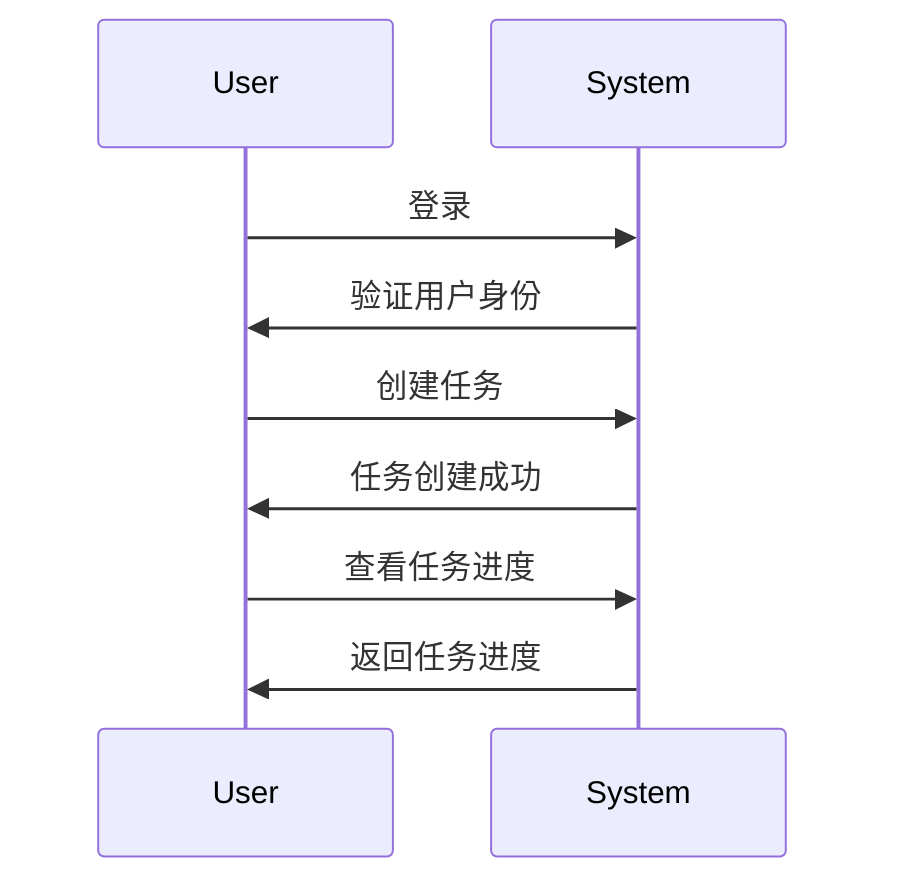

                 


# 时间管理：有限生命中的效率与意义

## 关键词
- 时间管理
- 效率
- 优先级设定
- 时间分配
- 算法原理
- 系统设计
- 项目实战

## 摘要
本文将深入探讨时间管理在有限生命中的重要性。通过定义核心概念、分析算法原理、设计系统架构和进行项目实战，本文旨在帮助读者建立科学的时间管理体系，提升个人和职业效率。我们将逐步思考，以通俗易懂的方式阐述时间管理的关键要素和实践方法。

## 第1章 背景介绍

### 1.1 时间管理的重要性

在快节奏的现代社会中，时间管理显得尤为重要。人们面临着众多任务和责任，如何高效利用时间成为了一大挑战。有效的时间管理不仅可以提高工作效率，还能减轻压力，提升生活质量。

### 1.2 问题描述

时间管理的主要挑战包括：

- 多任务处理：如何在有限的时间内处理多个任务？
- 优先级设定：如何确定哪些任务更为紧急和重要？
- 时间分配：如何合理分配工作与休息时间？

### 1.3 问题解决

解决时间管理问题需要以下几个步骤：

- 定义目标和优先级
- 制定时间规划
- 实施并跟踪时间管理策略

### 1.4 边界与外延

时间管理不仅涉及个人领域，还涵盖职业发展。本文将结合这两个方面，提供全面的时间管理指南。

## 第2章 核心概念与联系

### 2.1 时间规划

时间规划是时间管理的基础。它涉及设定目标、划分时间块和制定计划。通过时间规划，我们可以更有效地利用时间，提高工作效率。

### 2.2 优先级设定

优先级设定是时间管理的核心。通过分析任务的紧急性和重要性，我们可以确定哪些任务应该优先处理。常用的方法包括：

- 急迫性与重要性矩阵
- 优先级排序方法

### 2.3 时间分配

时间分配需要平衡工作与休息时间，确保身心健康。此外，还需要评估时间效率与效果，以不断优化时间管理策略。

## 第3章 算法原理讲解

### 3.1 时间管理算法

时间管理算法主要包括甘特图和待办事项清单。这些算法可以帮助我们可视化任务进度，合理安排时间。

### 3.2 甘特图原理

甘特图是一种直观的时间管理工具，用于展示任务的时间安排和进度。它包括以下几个要素：

- 任务名称
- 起始时间
- 结束时间
- 进度条

### 3.3 待办事项清单原理

待办事项清单是一种简单有效的任务管理工具，用于记录和跟踪任务。它通常包括以下内容：

- 任务名称
- 完成日期
- 负责人
- 进度状态

### 3.4 算法实现

我们可以使用Python来实现时间管理算法，例如：

```python
# 甘特图实现示例
from plotly import graph_objects as go

tasks = [
    {'name': '任务1', 'start': '2023-01-01', 'end': '2023-01-05'},
    {'name': '任务2', 'start': '2023-01-06', 'end': '2023-01-10'}
]

fig = go.Figure()

for task in tasks:
    fig.add_trace(go.Bar(
        x=[task['start'], task['end']],
        y=[task['name']],
        width=[task['end'] - task['start']],
        orientation='h',
        marker_color='blue'
    ))

fig.update_layout(
    title={'text': '甘特图示例'},
    xaxis_title='时间',
    yaxis_title='任务名称'
)

fig.show()
```

### 3.5 数学模型与公式讲解

时间管理中的数学模型和公式主要用于计算任务完成时间和资源分配。例如，我们可以使用以下公式来计算任务的预计完成时间：

$$
ET = (O + 4M + P) / 6
$$

其中，ET表示预计完成时间，O表示最乐观时间，M表示最可能时间，P表示最悲观时间。

### 3.6 举例说明

假设我们有两个任务，任务1的乐观时间为2天，最可能时间为3天，最悲观时间为4天；任务2的乐观时间为1天，最可能时间为2天，最悲观时间为3天。根据上述公式，我们可以计算出这两个任务的预计完成时间分别为：

$$
ET_1 = (2 + 4 \times 3 + 4) / 6 = 3.33 \text{天}
$$

$$
ET_2 = (1 + 4 \times 2 + 3) / 6 = 2.33 \text{天}
$$

## 第4章 系统分析与架构设计方案

### 4.1 项目场景介绍

假设我们正在开发一个项目管理系统，需要实现时间管理功能。该系统将帮助项目经理和团队成员有效地安排任务和资源。

### 4.2 系统功能设计

系统功能设计包括：

- 任务创建与分配
- 任务进度跟踪
- 时间规划与优化
- 报告生成与展示

### 4.3 系统架构设计

系统架构设计包括：

- 前端：使用React框架实现用户界面
- 后端：使用Spring Boot框架实现业务逻辑
- 数据库：使用MySQL存储任务数据

### 4.4 系统接口设计

系统接口设计包括：

- 用户认证接口
- 任务管理接口
- 报告查询接口

### 4.5 系统交互序列图

系统交互序列图如下：



## 第5章 项目实战

### 5.1 环境安装与设置

在本节中，我们将介绍如何安装和配置所需的开发环境，包括Python、MySQL和React等。

### 5.2 系统核心实现源代码

在本节中，我们将展示系统核心功能的实现源代码，包括任务创建、任务进度跟踪和时间规划等。

### 5.3 代码应用解读与分析

在本节中，我们将详细解读和分析系统核心代码，解释其实现原理和关键步骤。

### 5.4 实际案例分析与讲解

在本节中，我们将通过实际案例来展示系统在实际项目中的应用，并进行详细分析。

## 第6章 最佳实践 tips

在本节中，我们将提供一些最佳实践技巧，以帮助读者更好地管理时间，提高工作效率。

### 6.1 时间管理技巧

- 设定明确的目标和优先级
- 使用时间块进行任务划分
- 学会拒绝无关紧要的任务

### 6.2 提高效率的方法

- 利用工具进行任务管理
- 学会分解任务
- 坚持定期复盘

## 第7章 小结

在本节中，我们将总结本文的主要观点，并提醒读者注意的事项。

### 7.1 本书要点回顾

- 时间管理的重要性
- 核心概念与联系
- 算法原理讲解
- 系统分析与架构设计方案
- 项目实战
- 最佳实践 tips

### 7.2 注意事项

- 时间管理并非一蹴而就，需要长期坚持和实践
- 根据个人情况和需求调整时间管理策略
- 定期评估和优化时间管理效果

### 7.3 拓展阅读

- 《深度工作：如何有效利用每一点脑力》
- 《高效能人士的七个习惯》
- 《时间管理：如何管理你的时间和生活》

## 作者信息

作者：AI天才研究院/AI Genius Institute & 禅与计算机程序设计艺术 /Zen And The Art of Computer Programming

通过以上结构化的文章大纲，我们可以看到每个章节都涵盖了核心内容，从背景介绍到实际案例，再到最佳实践和注意事项，都进行了详细的规划和设计。接下来，我们将根据这个大纲逐步撰写详细的文章内容。

