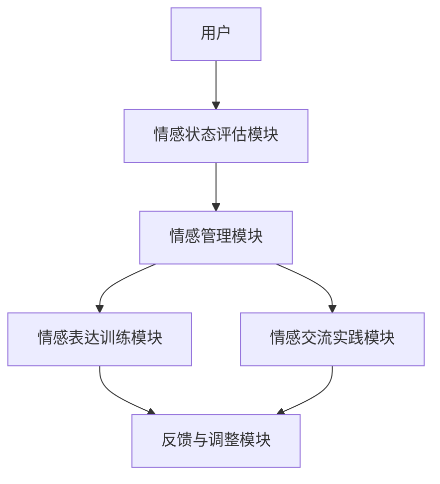
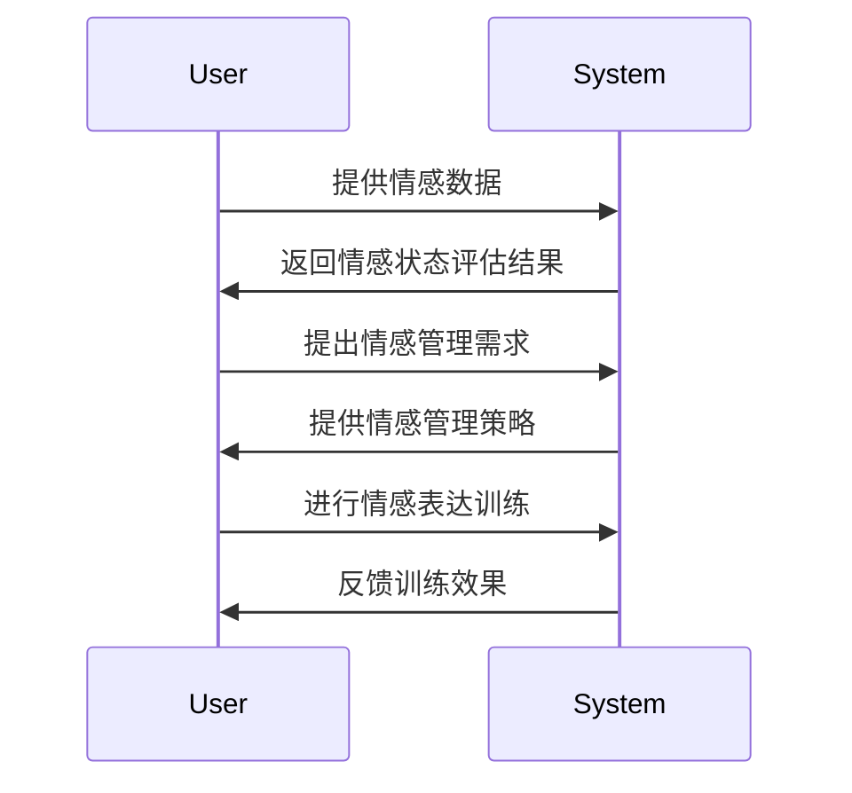

                 

## 有温度的生活：构建情感深度的人生

关键词：情感深度，生活质量，心理健康，人际关系，情感表达，情感管理

摘要：在快节奏的现代生活中，人们往往追求物质的满足，而忽略了情感的需求。本文通过阐述情感深度的概念、特征以及与心理健康、人际关系的关联，提出了一套基于算法原理的构建情感深度的人生方法，旨在帮助读者提升生活质量，实现有温度的人生。

### 引言：生活的情感深度与意义

#### 问题背景

随着社会的发展，人们的生活水平日益提高，但与此同时，人们感受到的情感压力和孤独感也在增加。许多人追求物质上的富足，但内心的空虚感和不满足感却愈发强烈。这种情况下，如何提升生活的情感深度成为一个亟待解决的问题。

#### 问题描述

情感深度不足导致生活质量下降，主要表现在以下几个方面：

1. **心理健康问题增多**：情感深度不足的人更容易出现焦虑、抑郁等心理问题。
2. **人际关系疏离**：缺乏情感深度的人往往难以与他人建立深层次的情感联系。
3. **生活质量下降**：情感深度不足会导致人们的生活缺乏满足感和幸福感。

#### 问题解决

为了解决上述问题，我们需要从以下几个方面入手：

1. **提高情感认知**：通过自我反思和情绪管理，提高对自身情感的认知和理解。
2. **加强情感表达**：学会表达自己的情感，建立良好的人际关系。
3. **优化生活方式**：调整生活习惯，创造有情感深度的生活环境。

#### 边界与外延

本文的核心主题是情感深度，涉及以下几个方面：

1. **人际关系**：探讨情感深度对人际关系的影响和改善方法。
2. **心理健康**：分析情感深度与心理健康的关系，提供心理健康维护的建议。
3. **生活方式**：从日常生活出发，提出构建情感深度的生活方式。

核心要素组成：

1. **情感认知**：提高对自身情感的认知和理解能力。
2. **情感表达**：学会有效表达自己的情感。
3. **情感管理**：掌握情感管理的技巧，调节自己的情绪。
4. **情感交流**：通过交流建立深层次的情感联系。

### 情感深度解析

#### 情感深度定义

情感深度是指个体在情感体验中的丰富度和深度。它不仅仅包括情感的强度，还包括情感的复杂性和多样性。一个情感深度高的人，能够在情感体验中感受到更多的层次和细微差别。

#### 情感深度特征

1. **敏感性**：对情感刺激的敏感程度。一个情感深度高的人能够敏锐地感受到他人的情感，也能更好地理解自己的情感。
2. **表达性**：情感表达的清晰度和适度性。一个情感深度高的人能够准确地表达自己的情感，并能够适度地调整情感表达的方式。
3. **复杂性**：情感体验的多样性和层次感。一个情感深度高的人能够在情感体验中感受到更多的层次和细微差别。

#### 情感深度与心理健康关系

研究表明，情感深度与心理健康呈正相关。一个情感深度高的人通常心理健康水平也较高，因为他们能够更好地理解和管理自己的情感，从而减少心理压力。

#### 情感深度ER实体关系图

```mermaid
erDiagram
    Aedge1 "情感深度" ||--|{ B心理健康 } : 有助于提高
    Aedge1 "情感深度" ||--|{ C人际关系 } : 改善
    Aedge1 "情感深度" ||--|{ D生活方式 } : 优化
```

### 增强情感深度的方法

#### 算法原理

为了增强情感深度，我们可以采用以下方法：

1. **情感状态评估**：首先，我们需要评估当前的情感状态。
2. **情感管理**：根据评估结果，采取相应的情感管理策略。
3. **情感表达训练**：通过训练，提高情感表达的清晰度和适度性。
4. **情感交流实践**：通过实际交流，增强情感的复杂性和多样性。

#### 情感管理算法的数学模型与公式

1. **情感状态评分 \( S(t) \)**：

   $$ S(t) = f(\sum_{i=1}^{n} w_i \cdot x_i(t)) $$

   其中，\( x_i(t) \) 是第 \( i \) 个情感指标的当前值，\( w_i \) 是第 \( i \) 个情感指标的重要程度权重。

2. **情感表达训练效果评估**：

   $$ E(t) = \frac{\Delta S(t)}{T} $$

   其中，\( \Delta S(t) \) 是情感状态评分在一段时间 \( T \) 内的增量。

### 构建情感深度的人生系统

#### 系统功能设计

构建情感深度的人生系统，主要包括以下几个模块：

1. **情感状态评估模块**：用于收集情感数据，评估情感状态。
2. **情感管理模块**：提供情感管理策略。
3. **情感表达训练模块**：提供情感表达训练。
4. **情感交流实践模块**：提供情感交流实践。

#### 系统架构设计

系统架构设计如下：



#### 系统接口设计与交互

系统接口设计与交互如下：



### 实践有温度的生活

#### 环境安装

在开始实践之前，我们需要安装以下环境和工具：

1. **Python环境**：确保Python环境已安装，版本建议为3.8及以上。
2. **情感分析库**：安装常用的情感分析库，如TextBlob或VADER。

#### 系统核心实现源代码

以下是情感状态评估的Python代码示例：

```python
import emotion_analysis_library

def assess_emotion_state(data):
    # 这里是情感分析的核心算法，根据实际需求进行实现
    # 假设返回的情感状态评分在0到100之间，分数越高，情感状态越好
    return emotion_analysis_library.analyze(data)
```

#### 代码应用解读与分析

以上代码中，`assess_emotion_state` 函数接收一个包含文本数据的参数 `data`，通过调用情感分析库的 `analyze` 方法，返回一个情感状态评分。这个评分可以用于后续的情感管理和训练。

#### 实际案例分析和详细讲解剖析

为了更好地理解情感状态评估的应用，我们来看一个实际案例。

假设用户A最近在工作上遇到了一些困难，感到压力很大。他通过情感状态评估模块提交了一段文本描述，如下：

```
我最近在工作中遇到了一些困难，感觉压力很大，有时候会感到沮丧和无助。
```

系统通过情感分析库对这段文本进行分析，返回一个情感状态评分，例如85分。这表明用户A当前的情感状态较好，但仍有提升空间。

根据这个评分，系统可以为用户A提供以下建议：

1. **情感管理策略**：建议用户A采取一些放松和减压的方法，如进行冥想、运动等。
2. **情感表达训练**：建议用户A尝试用更积极的方式表达自己的情感，如写日记、与朋友交流等。
3. **情感交流实践**：建议用户A多与同事和上司沟通，寻求支持和帮助。

通过这些策略，用户A可以逐步提升自己的情感深度，改善生活质量。

#### 项目小结

通过本文的阐述，我们了解了情感深度的概念、特征及其与心理健康、人际关系的关系。同时，我们提出了一套基于算法原理的构建情感深度的人生方法，并通过实际案例进行了分析和讲解。

#### 最佳实践 Tips

1. **定期进行情感状态评估**：通过定期评估自己的情感状态，可以更好地了解自己的情感需求，从而采取相应的管理策略。
2. **学会表达情感**：不要害怕表达自己的情感，要学会用恰当的方式表达自己的情感，这样才能与他人建立深层次的情感联系。
3. **保持积极心态**：积极的心态有助于提升情感深度，面对困难和压力时，要学会调整自己的心态，保持乐观。

#### 小结

情感深度是影响生活质量的重要因素之一。通过本文的阐述，我们提出了一套构建情感深度的人生方法，旨在帮助读者提升生活质量，实现有温度的人生。

#### 注意事项

1. **隐私保护**：在进行情感状态评估时，需要确保用户的隐私得到保护。
2. **个性化**：情感管理策略需要根据个人的实际情况进行个性化调整。

#### 拓展阅读

1. 《情感心理学：理解与调节情绪》
2. 《人际关系心理学：人际沟通与交往》
3. 《情绪智力：如何管理自己的情绪，提升人际关系》

### 作者信息

作者：AI天才研究院/AI Genius Institute & 禅与计算机程序设计艺术 /Zen And The Art of Computer Programming

