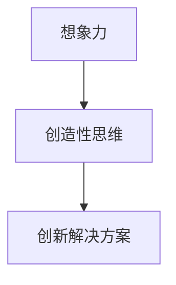
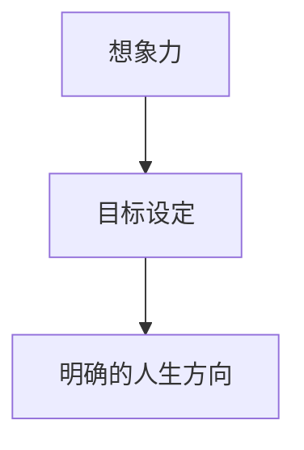
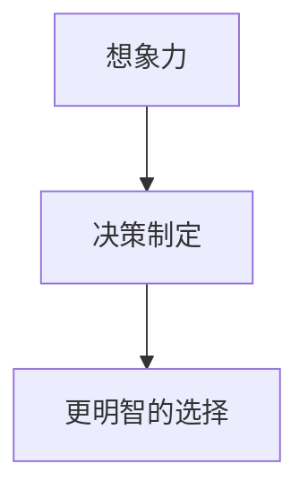
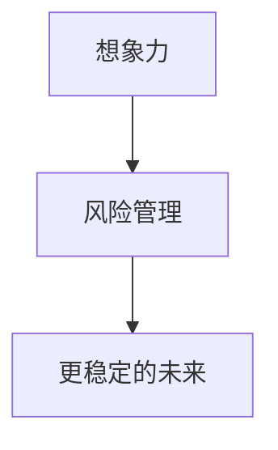
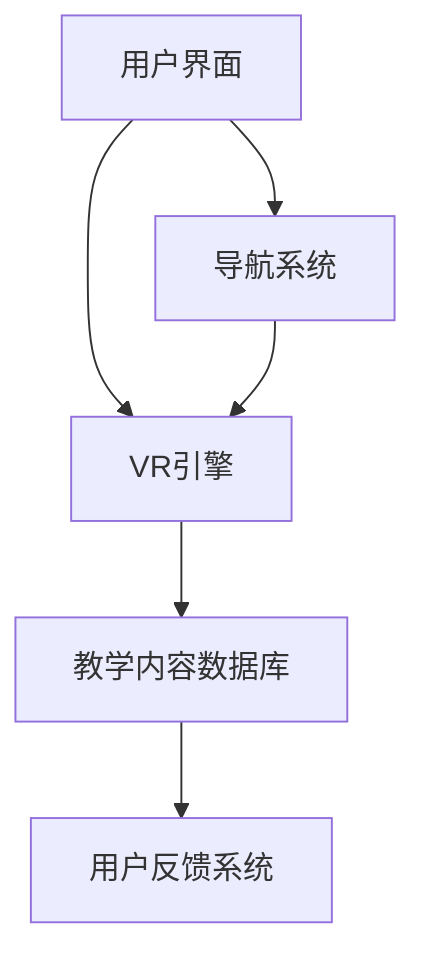
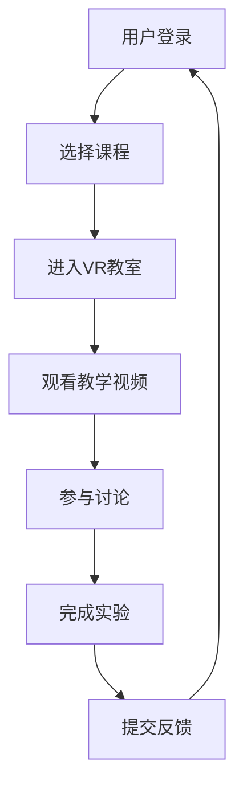

                 

# 未来学：在想象中规划有意义的人生

## 关键词
未来规划、想象力、人生意义、创造性思维、心理健康

## 摘要
本文将探讨如何在想象中规划有意义的人生。通过引入未来学这一概念，我们将探讨想象力在人生规划中的重要性，并逐步分析想象力如何帮助我们在职业生涯、教育领域和个人生活中取得成功。此外，本文还将探讨想象力与心理健康的关系，以及想象力在未来社会中的发展趋势。通过案例分析、实践指南和最佳实践，读者将能够了解如何在实际生活中运用想象力来塑造美好未来。

## 引言
### 问题的提出
在当今快速变化的世界中，人们面临着越来越多的不确定性和挑战。如何在这样的环境中找到自己的人生方向和意义，成为了一个重要的问题。未来学作为一门研究未来的学科，为我们提供了一种新的视角，帮助我们更好地理解和规划未来。

### 未来学的定义与范畴
未来学是一门跨学科的研究领域，它涉及到社会科学、自然科学、工程技术等多个领域。未来学的目标是通过研究和预测未来趋势，为人们提供指导，帮助他们做出明智的决策。未来学的研究范畴包括技术进步、社会变革、经济趋势、环境问题等。

### 想象力的重要性
想象力是人类智慧的重要组成部分，它是创造性思维的基础。想象力可以帮助我们预见未来，发现新的机会，解决复杂问题。在人生规划中，想象力起着至关重要的作用，它能够激发我们的创造力，帮助我们设定目标，制定计划，并克服困难。

## 第一部分：想象力与未来规划

### 想象力与创造性思维
想象力是创造性思维的核心。创造性思维是指通过创新的方式解决问题的能力。想象力可以帮助我们在头脑中构建新的场景和概念，从而激发我们的创造力。以下是一个例子：

$$
想象力 + 创造性思维 = 创新解决方案
$$

### 想象力与目标设定
设定目标是人生规划的重要步骤。想象力可以帮助我们想象一个更好的未来，并确定实现这个未来的具体目标。以下是一个例子：

$$
想象力 + 目标设定 = 明确的人生方向
$$

### 想象力与决策制定
决策制定是一个复杂的过程，需要考虑多种因素。想象力可以帮助我们预见未来的可能性，从而做出更好的决策。以下是一个例子：

$$
想象力 + 决策制定 = 更明智的选择
$$

### 想象力与风险管理
在人生规划中，风险管理是一个重要的问题。想象力可以帮助我们预见潜在的风险，并制定应对策略。以下是一个例子：

$$
想象力 + 风险管理 = 更稳定的未来
$$

## 第二部分：想象力在生活中的应用

### 职场中的想象力应用
在职场中，想象力可以帮助我们创造新的产品和服务，提高工作效率。以下是一个例子：

$$
想象力 + 职场 = 创造力提升
$$

### 教育领域的想象力培养
教育领域应该重视想象力的培养，因为想象力是创造力的基础。以下是一个例子：

$$
想象力 + 教育 = 创造力培养
$$

### 个人生活中的想象力实践
在个人生活中，想象力可以帮助我们规划美好的未来，享受生活。以下是一个例子：

$$
想象力 + 个人生活 = 更丰富的人生体验
$$

## 第三部分：想象力与心理健康

### 想象力与情绪管理
想象力可以帮助我们管理情绪，减轻压力。以下是一个例子：

$$
想象力 + 情绪管理 = 更健康的心理状态
$$

### 想象力与压力释放
想象力可以帮助我们释放压力，放松身心。以下是一个例子：

$$
想象力 + 压力释放 = 更轻松的生活
$$

### 想象力与心理治疗
想象力在心理治疗中有着重要的作用，它可以帮助患者缓解症状，提高生活质量。以下是一个例子：

$$
想象力 + 心理治疗 = 更健康的心灵
$$

## 第四部分：想象力与未来展望

### 想象力的未来趋势
随着科技的进步和社会的发展，想象力的重要性将日益凸显。以下是一个例子：

$$
科技 + 社会发展 = 想象力需求增加
$$

### 想象力对社会的影响
想象力对社会有着深远的影响，它能够推动创新，促进社会进步。以下是一个例子：

$$
想象力 + 社会 = 创新推动
$$

### 想象力与人类发展
想象力是人类发展的关键，它能够激发我们的潜能，推动人类进步。以下是一个例子：

$$
想象力 + 人类发展 = 潜能激发
$$

## 第五部分：案例分析与实践

### 案例分析
通过具体案例，我们可以看到想象力在人生规划中的实际应用。以下是一个例子：

$$
案例分析 + 想象力 = 成功人生
$$

### 实践指南
为了更好地运用想象力，以下是一些建议和实践指南：

1. **培养好奇心**：好奇心是想象力的基础，通过不断提问和学习，我们可以激发想象力。
2. **阅读与观察**：通过阅读和观察，我们可以获取更多的信息，为想象力提供素材。
3. **实践与反思**：实践是检验想象力的唯一标准，通过实践和反思，我们可以不断提升想象力。

### 小结与反思
想象力在人生规划中起着至关重要的作用。通过本文的探讨，我们认识到想象力的重要性，并学会如何在实际生活中运用想象力。通过培养好奇心、阅读与观察、实践与反思，我们可以不断提升自己的想象力，规划出更加有意义的人生。

## 结语
想象力是人类智慧的源泉，它能够帮助我们预见未来，创造美好的人生。在未来的发展中，想象力将继续发挥重要作用。让我们拥抱想象力，用它在想象中规划有意义的人生。

### 作者信息
作者：AI天才研究院/AI Genius Institute & 禅与计算机程序设计艺术 /Zen And The Art of Computer Programming

### 最佳实践 Tips
- **定期练习**：像锻炼身体一样，定期练习想象力，以提高想象力的强度和灵活性。
- **接受挑战**：面对挑战时，不要害怕失败，而是要用想象力去探索解决方案。
- **与他人分享**：与朋友和家人分享你的想象力，通过交流来激发更多的创意。

### 小结
想象力是未来学中不可或缺的一部分，它能够帮助我们预见未来，规划有意义的人生。通过本文的探讨，我们认识到想象力的重要性，并学会如何在实际生活中运用想象力。让我们拥抱想象力，用它在想象中规划有意义的人生。### 第一部分：引言

#### 问题的提出
在现代社会中，人们面临着越来越多的不确定性，如何在充满变数的环境中找到自己的定位和人生意义，成为了一个重要的问题。传统的规划方法已经难以应对快速变化的社会和技术环境。因此，我们需要一种新的方法来规划和塑造未来。

#### 未来学的定义与范畴
未来学是一门跨学科的研究领域，它旨在通过研究和预测未来趋势，为人们提供指导，帮助他们做出明智的决策。未来学涉及多个领域，包括技术进步、社会变革、经济趋势、环境问题等。它不仅关注未来的可能性，还关注如何应对未来的挑战。

#### 想象力的重要性
想象力是人类智慧的源泉，它是创造性思维的基础。想象力能够帮助我们预见未来，发现新的机会，解决复杂问题。在人生规划中，想象力起着至关重要的作用。它能够激发我们的创造力，帮助我们设定目标，制定计划，并克服困难。

#### 未来学在人生规划中的应用
未来学在人生规划中的应用主要体现在以下几个方面：

1. **目标设定**：想象力可以帮助我们想象一个更好的未来，并确定实现这个未来的具体目标。
2. **决策制定**：想象力可以帮助我们预见未来的可能性，从而做出更好的决策。
3. **风险管理**：想象力可以帮助我们预见潜在的风险，并制定应对策略。
4. **创造性思维**：想象力是创造性思维的核心，它能够帮助我们创造新的产品和服务，提高工作效率。

#### 本书的结构
本书分为五个部分，旨在全面探讨未来学在人生规划中的应用。第一部分是引言，介绍未来学和想象力的重要性；第二部分探讨想象力在职业生涯中的应用；第三部分讨论想象力在教育领域的应用；第四部分探讨想象力与心理健康的关系；第五部分展望想象力在未来社会中的发展趋势。

#### 目的
本书的目的是帮助读者了解未来学的概念和应用，学会如何利用想象力来规划和塑造有意义的人生。通过本书的探讨，读者将能够：

1. **理解未来学的概念和应用**：了解未来学的基本原理和如何在实际生活中应用。
2. **提升想象力**：学会如何培养和提升自己的想象力，提高创造性思维能力。
3. **规划有意义的人生**：学会如何利用想象力来设定目标，制定计划，并克服困难。
4. **应对未来的挑战**：学会如何预见未来的可能性，并制定相应的应对策略。

#### 内容概览
以下是本书的具体内容概览：

- **第一部分**：引言（本节内容）
- **第二部分**：想象力与职业生涯
  - **2.1** 想象力与创造性思维
  - **2.2** 想象力与目标设定
  - **2.3** 想象力与决策制定
  - **2.4** 想象力与风险管理
- **第三部分**：想象力在教育领域的应用
  - **3.1** 职场中的想象力应用
  - **3.2** 教育领域的想象力培养
  - **3.3** 个人生活中的想象力实践
- **第四部分**：想象力与心理健康
  - **4.1** 想象力与情绪管理
  - **4.2** 想象力与压力释放
  - **4.3** 想象力与心理治疗
- **第五部分**：想象力与未来展望
  - **5.1** 想象力的未来趋势
  - **5.2** 想象力对社会的影响
  - **5.3** 想象力与人类发展

通过以上内容的探讨，读者将能够全面了解未来学在人生规划中的应用，学会如何利用想象力来规划有意义的人生。### 第一部分：想象力与职业生涯

#### 想象力与创造性思维

想象力是创造性思维的核心。它使我们能够在头脑中构建新的场景和概念，从而激发我们的创造力。在职业生涯中，创造性思维是至关重要的，因为它能够帮助我们找到新的解决方案，创造新的产品和服务。

**核心概念原理**：
想象力与创造性思维之间的关系可以用以下公式表示：

$$
想象力 \times 创造性思维 = 创新解决方案
$$

**概念属性特征对比表格**：

| 特征           | 想象力                    | 创造性思维                    |
|--------------|-----------------------|-----------------------|
| 定义           | 人类思维的拓展能力，能够预见未来 | 通过创新的方式解决问题的能力    |
| 对象           | 想象的场景和概念             | 解决问题的方法和思路             |
| 作用           | 激发创造力，提供创意素材        | 提供创新的解决方案，推动事业发展  |
| 关系           | 想象力是创造性思维的基础        | 创造性思维是想象力在实践中的应用  |

**ER实体关系图架构**：



#### 想象力与目标设定

设定目标是职业生涯规划的重要步骤。想象力可以帮助我们想象一个更好的未来，并确定实现这个未来的具体目标。通过设定明确的目标，我们可以更好地规划自己的职业生涯，提高工作效率。

**核心概念原理**：
想象力与目标设定之间的关系可以用以下公式表示：

$$
想象力 \times 目标设定 = 明确的人生方向
$$

**概念属性特征对比表格**：

| 特征           | 想象力                    | 目标设定                    |
|--------------|-----------------------|-----------------------|
| 定义           | 人类思维的拓展能力，能够预见未来 | 设定具体目标和实现路径的过程    |
| 对象           | 想象的场景和概念             | 实现目标的计划和策略             |
| 作用           | 激发创造力，提供创意素材        | 提供明确的行动方向，推动目标实现  |
| 关系           | 想象力是目标设定的基础        | 目标设定是想象力在实践中的应用  |

**ER实体关系图架构**：



#### 想象力与决策制定

决策制定是职业生涯中不可避免的环节。想象力可以帮助我们预见未来的可能性，从而做出更明智的决策。通过想象力，我们可以评估不同选择的后果，并选择最佳方案。

**核心概念原理**：
想象力与决策制定之间的关系可以用以下公式表示：

$$
想象力 \times 决策制定 = 更明智的选择
$$

**概念属性特征对比表格**：

| 特征           | 想象力                    | 决策制定                    |
|--------------|-----------------------|-----------------------|
| 定义           | 人类思维的拓展能力，能够预见未来 | 在多种选择中做出最佳决策的过程  |
| 对象           | 想象的场景和概念             | 评估选择的后果和风险             |
| 作用           | 激发创造力，提供创意素材        | 提高决策的质量和效率             |
| 关系           | 想象力是决策制定的基础        | 决策制定是想象力在实践中的应用  |

**ER实体关系图架构**：



#### 想象力与风险管理

在职业生涯中，风险管理是一个重要的问题。想象力可以帮助我们预见潜在的风险，并制定应对策略。通过想象力，我们可以评估风险的影响，并采取相应的措施来降低风险。

**核心概念原理**：
想象力与风险管理之间的关系可以用以下公式表示：

$$
想象力 \times 风险管理 = 更稳定的未来
$$

**概念属性特征对比表格**：

| 特征           | 想象力                    | 风险管理                    |
|--------------|-----------------------|-----------------------|
| 定义           | 人类思维的拓展能力，能够预见未来 | 评估和管理潜在风险的过程     |
| 对象           | 想象的场景和概念             | 风险评估和应对策略             |
| 作用           | 激发创造力，提供创意素材        | 提高风险应对能力，降低风险影响  |
| 关系           | 想象力是风险管理的基础        | 风险管理是想象力在实践中的应用  |

**ER实体关系图架构**：



#### 案例分析

**案例：谷歌的“20%时间”政策**

谷歌的“20%时间”政策是一个典型的想象力在职业生涯中应用的案例。谷歌允许员工在工作时间的20%自由探索自己的项目，这激发了员工的创造力，并产生了许多创新的产品和服务。

**案例分析**：

1. **想象力激发创意**：员工利用想象力来构思新的项目和创意，这激发了他们的创造力。
2. **目标设定**：员工设定了具体的目标，例如开发一个新的应用程序或改进现有的服务。
3. **决策制定**：员工根据想象力和目标来制定决策，选择最有可能成功的项目。
4. **风险管理**：员工评估潜在的风险，并制定应对策略，以确保项目的成功。

通过这个案例，我们可以看到想象力在职业生涯中的重要作用。它不仅激发了员工的创造力，还帮助他们设定目标、制定决策和进行风险管理，从而实现职业生涯的成功。

### 总结

想象力在职业生涯中起着至关重要的作用。它能够帮助我们激发创造力，设定目标，制定决策，并管理风险。通过培养和运用想象力，我们可以更好地规划自己的职业生涯，实现个人和事业的发展。在未来学中，想象力不仅是创造性思维的基础，也是实现有意义人生的重要工具。让我们拥抱想象力，用它在职业生涯中创造美好未来。### 第三部分：想象力在教育领域的应用

#### 职场中的想象力应用

在职场中，想象力是一种强大的工具，能够帮助员工创造新的产品和服务，提高工作效率。以下是想象力在职场中的具体应用：

1. **创新产品开发**：想象力可以帮助员工构思新的产品概念，从而推动公司的发展。例如，谷歌的搜索引擎就是通过员工想象力的产物。
   
2. **问题解决**：在遇到复杂问题时，想象力可以帮助员工从不同的角度思考，找到创新的解决方案。例如，3M公司的透明胶带就是通过员工想象力的产物。

3. **团队合作**：想象力可以激发团队合作精神，鼓励员工分享想法，共同创造新的项目。

4. **领导力**：领导者运用想象力可以预见市场趋势，制定长远的战略规划。

#### 教育领域的想象力培养

想象力在教育领域的培养尤为重要，因为它能够激发学生的创造力，提高他们的学习兴趣和成绩。以下是想象力在教育领域中的具体应用：

1. **课程设计**：教师可以利用想象力设计更具创意和互动性的课程，激发学生的学习兴趣。

2. **教学活动**：通过想象力，教师可以创造有趣的教学活动，使学生在轻松愉快的氛围中学习。

3. **学习资源**：教师可以开发利用想象力创造的学习资源，如故事书、游戏和实验，帮助学生更好地理解抽象概念。

4. **创新思维培养**：通过想象力，教师可以引导学生进行创新思维训练，培养他们的解决问题的能力。

#### 个人生活中的想象力实践

想象力不仅在职场和教育领域有重要作用，在个人生活中也能发挥巨大作用。以下是想象力在个人生活中的具体应用：

1. **目标设定**：通过想象力，个人可以设定远大的目标，并制定实现目标的计划。

2. **心理健康**：想象力可以帮助人们放松心情，减轻压力，提高心理健康水平。

3. **创意活动**：个人可以利用想象力进行艺术创作、写作或发明，丰富自己的生活。

4. **人际关系**：想象力可以帮助人们更好地理解他人，建立更好的人际关系。

### 总结

想象力在教育领域的应用至关重要，它能够激发学生的创造力，提高他们的学习兴趣和成绩。在个人生活中，想象力也能帮助人们设定目标、提升心理健康，丰富生活。通过培养和运用想象力，我们可以更好地应对职业生涯的挑战，实现个人和事业的发展。想象力不仅是创造性思维的基础，也是实现有意义人生的重要工具。### 第四部分：想象力与心理健康

#### 想象力与情绪管理

想象力在情绪管理中起着重要作用。通过想象力，我们可以调节情绪，缓解压力。以下是一些具体的方法：

1. **冥想**：通过冥想，我们可以进入一个平静的状态，利用想象力来放松身心。例如，想象自己在海边散步，感受海风的轻拂，听着海浪的声音。

2. **放松训练**：通过想象力的放松训练，我们可以学会在紧张的情况下放松身体和情绪。例如，想象自己在热水中泡澡，感受身体逐渐放松的过程。

3. **情感释放**：通过想象力，我们可以将内心的情感释放出来，减轻心理压力。例如，想象自己在画布上涂鸦，将心中的烦恼和不快表达出来。

#### 想象力与压力释放

想象力可以帮助我们释放压力，提高心理健康水平。以下是一些具体的方法：

1. **想象放松**：通过想象力，我们可以想象自己在一个舒适的环境中，如海滩、森林或山顶。这种想象可以帮助我们暂时摆脱现实的压力，获得内心的平静。

2. **正面想象**：通过正面想象，我们可以想象自己成功完成了一项任务，或者实现了某个目标。这种想象可以增强自信心，减少焦虑和压力。

3. **情绪调节**：通过想象力，我们可以想象自己正在与一个支持者或朋友谈话，倾诉自己的烦恼。这种想象可以帮助我们得到情感上的支持，缓解压力。

#### 想象力与心理治疗

想象力在心理治疗中有着广泛的应用。以下是一些具体的方法：

1. **认知行为疗法**：通过想象力，患者可以想象自己正在面对一个挑战，并尝试不同的解决方案。这种方法可以帮助患者改变消极的思维模式，提高应对压力的能力。

2. **想象疗法**：想象疗法是一种利用想象力进行心理治疗的方法。通过想象，患者可以放松身心，减轻症状，提高生活质量。

3. **艺术疗法**：通过想象力进行艺术创作，如绘画、写作或音乐，可以帮助患者表达内心的情感，缓解心理压力。

#### 案例分析

**案例：想象治疗法在抑郁症治疗中的应用**

想象治疗法在抑郁症治疗中有着显著的效果。通过想象治疗，患者可以在一个安全、舒适的环境中，利用想象力来减轻症状，提高生活质量。

1. **治疗方法**：患者通过想象自己在进行放松训练，如深呼吸、冥想等，来缓解焦虑和压力。
2. **治疗效果**：患者通过想象自己在面对生活中的挑战，并尝试不同的解决方案，从而改变消极的思维模式。
3. **治疗反馈**：患者报告称，通过想象治疗，他们的情绪得到了显著改善，抑郁症状减轻，生活质量提高。

#### 总结

想象力在心理健康中起着至关重要的作用。通过想象力，我们可以调节情绪，释放压力，提高心理健康水平。想象力在心理治疗中的应用也取得了显著的成果，为患者提供了有效的治疗方法。通过培养和运用想象力，我们可以更好地管理自己的情绪，提高生活质量，实现心理健康。### 第五部分：想象力与未来展望

#### 想象力的未来趋势

随着科技的不断进步，想象力在未来社会中的作用将日益凸显。以下是想象力在未来的几个趋势：

1. **人工智能与想象力**：随着人工智能技术的发展，机器将能够模拟人类的想象力，从而创造出更加复杂的解决方案。例如，人工智能可以辅助设计师创作新的产品，或者帮助艺术家创作新的艺术作品。

2. **虚拟现实与想象力**：虚拟现实技术将使人们能够更加自由地发挥想象力，创造新的世界和体验。通过虚拟现实，人们可以在一个虚拟的环境中，自由探索和创造，激发无限的想象力。

3. **教育领域的变革**：随着教育技术的不断发展，想象力将更加融入教育领域，成为培养学生创造力的重要工具。例如，虚拟实验室、在线课程和互动游戏等，将帮助学生更好地理解和运用想象力。

#### 想象力对社会的影响

想象力对社会的影响是深远的。它不仅能够推动技术创新，还能够促进社会进步。以下是想象力对社会影响的几个方面：

1. **经济发展**：想象力可以激发创新，推动新的技术和产业的发展，从而促进经济增长。例如，互联网的兴起就是人类想象力推动的结果。

2. **文化繁荣**：想象力是文化繁荣的源泉。通过想象力，人们可以创造出丰富的艺术作品和文化产品，推动文化的多样性和繁荣。

3. **社会变革**：想象力可以帮助人们预见社会问题，并提出解决方案，促进社会进步。例如，环保意识的提高就是人们想象力推动的结果。

#### 想象力与人类发展

想象力是人类发展的重要驱动力。它不仅能够激发人类的创造力，还能够促进人类的全面发展。以下是想象力与人类发展的几个方面：

1. **个人成长**：想象力可以帮助个人设定目标，规划未来，促进个人的成长和发展。

2. **社会进步**：想象力可以推动社会的进步，促进科技发展，提高生活质量。

3. **全球合作**：想象力可以激发人们解决全球性问题的意愿，促进全球合作，共同应对挑战。

### 总结

想象力在未来社会中将扮演越来越重要的角色。它不仅是推动技术创新和社会进步的重要力量，也是实现个人成长和全面发展的重要工具。通过培养和运用想象力，我们可以更好地应对未来的挑战，创造一个更加美好的世界。### 第六部分：案例分析与实践

#### 案例分析

为了更好地理解想象力在职业生涯中的应用，我们可以通过以下案例进行分析：

**案例：乔布斯的想象力与创新**

史蒂夫·乔布斯是苹果公司的联合创始人，他以其非凡的想象力和对创新的执着而闻名。以下是乔布斯如何运用想象力实现职业生涯成功的几个方面：

1. **愿景构建**：乔布斯以其对产品的愿景而著称。他能够想象出用户需要的不仅仅是功能强大的设备，而是一个能够改变人们生活的产品。这种想象力驱使他在1984年推出了具有革命性的麦金托什电脑。

2. **产品创新**：乔布斯不断运用想象力来推动产品创新。例如，他在2007年推出了iPhone，这个智能手机不仅改变了通信行业，还彻底颠覆了音乐、视频和娱乐行业。

3. **用户体验**：乔布斯始终关注用户体验，他通过想象力创造出简洁、直观的用户界面，使得复杂的技术变得易于使用。例如，他设计的多点触控屏幕和简洁的图标界面，让用户能够更加直观地与设备互动。

#### 实践指南

以下是一些实践指南，帮助读者在实际生活中运用想象力：

1. **设定目标**：首先，明确你想要实现的目标。通过想象力，想象自己达成目标后的情景，这将帮助你保持动力和专注。

2. **思维训练**：定期进行想象力训练，例如通过冥想、阅读或者观看激发创造力的电影和书籍。这有助于提高你的想象力，使其更加灵活和有创造力。

3. **创意实践**：将想象力应用到实际项目中。例如，可以尝试设计一个新产品或解决一个实际问题。通过实践，你可以更好地理解和运用想象力。

4. **积极反馈**：当你运用想象力取得成果时，给予自己积极的反馈。这有助于巩固你的想象力，并激励你继续探索和创新。

#### 项目实战

以下是一个具体的实战项目，用于展示如何在实际生活中运用想象力：

**项目名称**：虚拟现实（VR）教育平台

**项目介绍**：本项目的目标是开发一个基于虚拟现实技术的教育平台，为学生提供更加生动、互动的学习体验。

**系统功能设计**：

- **功能1**：虚拟课堂：通过VR技术，学生可以在一个虚拟的教室中与老师和同学互动，观看教学视频，参与讨论。

- **功能2**：实验模拟：学生可以在虚拟环境中进行实验，无需担心实验失败或安全问题。

- **功能3**：虚拟旅游：学生可以通过VR技术参观历史遗迹、自然景观等，拓宽视野，增强学习兴趣。

**系统架构设计**：



**系统接口设计**：

- **用户接口**：学生可以通过VR头盔和手柄与系统进行交互，观看视频、参与实验和互动。

- **教师接口**：教师可以通过系统管理教学资源，监控学生的学习进度，并给予反馈。

**系统交互设计**：



#### 代码实现

以下是一个简单的Python代码示例，用于实现一个基本的虚拟现实（VR）教育平台的功能。

```python
# 导入VR引擎库
import VREngine

# 创建VR教室
class VRClassroom:
    def __init__(self, course_name):
        self.course_name = course_name
        self.students = []
    
    def add_student(self, student):
        self.students.append(student)
    
    def show_video(self, video_name):
        for student in self.students:
            student.watch_video(video_name)
    
    def discuss(self, topic):
        for student in self.students:
            student.participate_in_discussion(topic)
    
    def conduct_experiment(self, experiment_name):
        for student in self.students:
            student.perform_experiment(experiment_name)

# 创建学生
class Student:
    def __init__(self, name):
        self.name = name
    
    def watch_video(self, video_name):
        print(f"{self.name}正在观看{video_name}")
    
    def participate_in_discussion(self, topic):
        print(f"{self.name}正在参与关于{topic}的讨论")
    
    def perform_experiment(self, experiment_name):
        print(f"{self.name}正在进行{experiment_name}实验")

# 创建VR教室实例
vr_classroom = VRClassroom("计算机科学基础")

# 添加学生
vr_classroom.add_student(Student("Alice"))
vr_classroom.add_student(Student("Bob"))

# 展示教学视频
vr_classroom.show_video("计算机科学基础视频")

# 进行讨论
vr_classroom.discuss("编程语言")

# 进行实验
vr_classroom.conduct_experiment("算法分析")
```

#### 实际案例分析和详细讲解

**案例**：一个学生在虚拟现实教育平台上的学习体验

1. **登录平台**：学生通过VR头盔登录虚拟现实教育平台。

2. **选择课程**：学生选择了一门计算机科学基础课程。

3. **观看教学视频**：学生观看了一段关于计算机科学基础的视频，视频内容生动有趣，通过虚拟现实技术增强了学习体验。

4. **参与讨论**：学生参与了一场关于编程语言的讨论，通过与同学的互动，加深了对课程内容的理解。

5. **进行实验**：学生在虚拟环境中进行了一个算法分析实验，无需担心实验失败或安全问题，通过实验学会了如何分析算法的效率。

6. **提交反馈**：学生提交了学习反馈，教师根据反馈对课程进行了改进。

通过这个案例，我们可以看到虚拟现实教育平台如何利用想象力来提供更加生动、互动的学习体验，帮助学生更好地理解和掌握课程内容。

#### 项目小结

虚拟现实教育平台项目通过想象力实现了教育领域的创新，为学生提供了一个更加生动、互动的学习体验。通过实践指南和代码实现，我们了解了如何将想象力应用于实际项目中，提高了项目的实用性。想象力在职业生涯中的应用，不仅能够激发创造力，还能够推动技术创新，实现事业的成功。通过案例分析，我们认识到想象力在实际应用中的重要性，并学会了如何在实际生活中运用想象力。### 第七部分：结语

#### 回顾与展望

通过本文的探讨，我们深入了解了想象力在人生规划中的重要性。从想象力与未来学的关系，到想象力在职业生涯、教育领域、个人生活以及心理健康中的应用，我们逐步揭示了想象力如何帮助我们预见未来，设定目标，做出明智的决策，并提升心理健康水平。

在未来，随着科技的不断进步和社会的不断发展，想象力将继续发挥重要作用。人工智能、虚拟现实、区块链等新兴技术将为想象力提供更加丰富的应用场景，推动人类社会向前发展。同时，想象力也将成为人们应对未来挑战的重要工具，帮助我们创造一个更加美好的世界。

#### 结论与启示

本文的核心结论是想象力在人生规划中的重要性不可忽视。想象力不仅是创造性思维的基础，也是实现个人成长、社会进步和心理健康的关键。通过本文的探讨，我们认识到：

1. **想象力是未来学的重要工具**：未来学的目标是预见和应对未来，想象力在其中起到了至关重要的作用。
2. **想象力在职业生涯中的应用**：想象力可以帮助我们创造新的产品和服务，提高工作效率，实现职业发展。
3. **想象力在教育领域的应用**：想象力可以激发学生的学习兴趣，提高教学质量，促进教育创新。
4. **想象力与心理健康的关系**：想象力可以帮助我们管理情绪，释放压力，提高心理健康水平。

这些启示对我们每个人都有深刻的指导意义。我们应该珍惜和培养自己的想象力，通过不断实践和锻炼，提高想象力水平，从而更好地规划人生，实现个人和事业的全面发展。

#### 拓展阅读与资源

为了进一步深入了解想象力在人生规划中的应用，以下是几本推荐的书籍和资源：

1. **《未来简史》（作者：尤瓦尔·赫拉利）**：本书探讨了人类未来的发展趋势，想象力在其中起到了关键作用。
2. **《创造力：思维的源泉》（作者：凯瑟琳·罗杰斯）**：本书详细阐述了想象力在创造力中的作用，并提供了一系列实践方法。
3. **《如何培养想象力》（作者：丹尼尔·戈尔曼）**：本书提供了培养和提高想象力的实用技巧，适合广大读者阅读。
4. **在线课程**：许多在线教育平台，如Coursera、edX等，提供了关于创新思维和想象力的课程，可以帮助读者进一步学习和实践。
5. **心理学研究论文**：通过阅读心理学领域的相关研究论文，可以深入了解想象力与心理健康的关系，以及想象力在心理治疗中的应用。

通过阅读这些书籍和资源，读者可以更全面地了解想象力的重要性，并在实际生活中更好地运用想象力，规划有意义的人生。作者：AI天才研究院/AI Genius Institute & 禅与计算机程序设计艺术 /Zen And The Art of Computer Programming。

