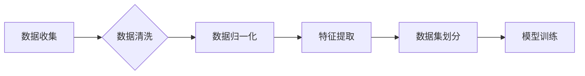
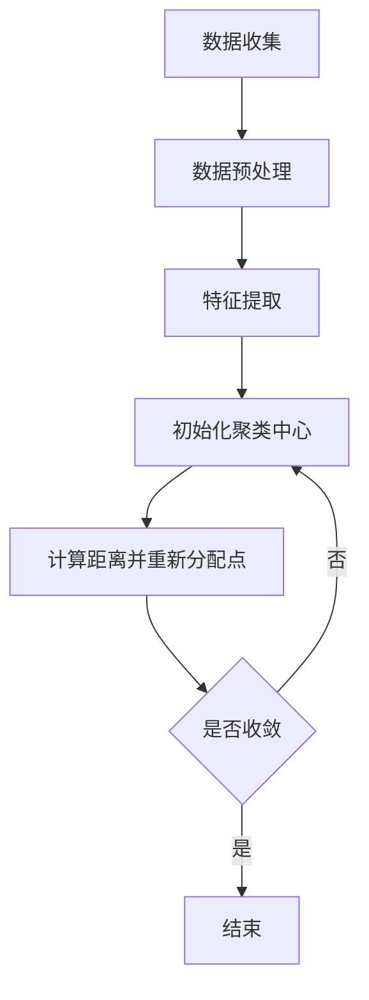
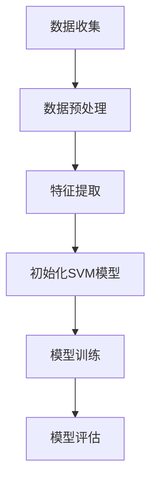
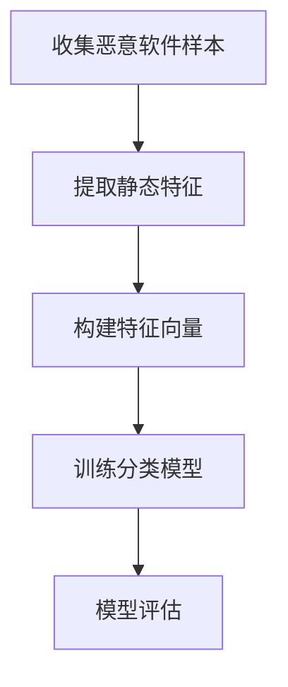
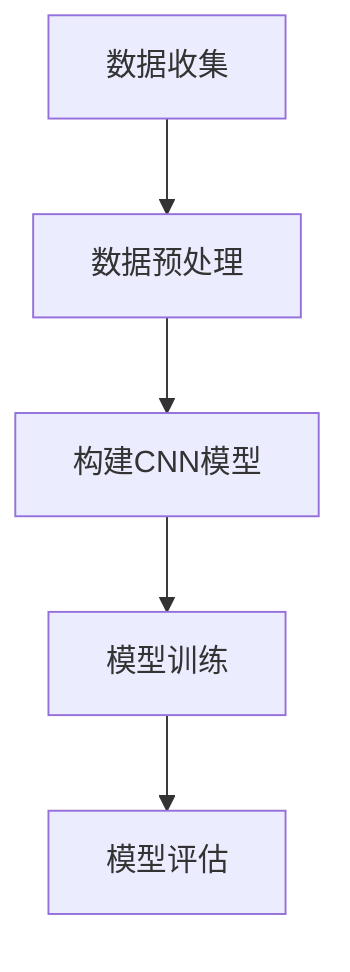
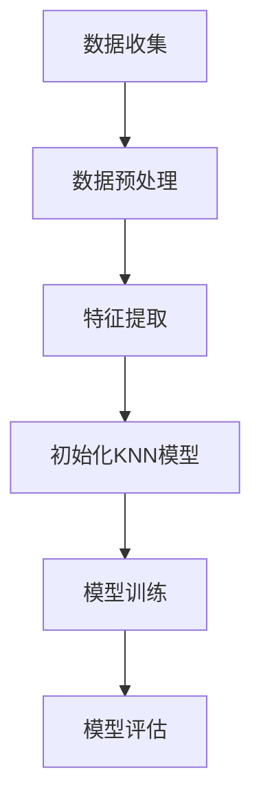

                 

### 引言

#### 1.1 问题背景

随着信息技术的飞速发展，网络安全问题日益突出，成为企业和个人面临的重大挑战。传统的基于规则的安全防护手段已经难以应对日益复杂和多样化的网络攻击。在这种背景下，机器学习技术因其强大的数据处理和分析能力，逐渐成为网络安全态势感知领域的重要工具。

机器学习，尤其是深度学习，通过从大量数据中自动学习特征，构建复杂的模型，能够在无需人工干预的情况下，实时监测网络行为，发现潜在的安全威胁。这种技术优势使得机器学习在网络安全领域得到了广泛应用，特别是在入侵检测、恶意软件识别和误用攻击检测等方面。

网络安全态势感知（Cybersecurity Threat Detection）是指利用各种技术手段，实时监控网络环境中的异常活动，识别潜在的安全威胁，并快速响应。这一过程需要处理海量的网络数据，包括网络流量、用户行为、系统日志等。传统的基于规则的方法由于规则库的维护难度大、响应速度慢，已无法满足实际需求。而机器学习，通过自动学习和适应，能够更好地应对动态变化的安全威胁。

#### 1.2 问题描述

网络安全态势感知的核心问题可以归纳为以下几点：

1. **数据复杂性**：网络环境中的数据来源多样，数据量庞大，如何有效地处理和提取有用信息，是首要挑战。
2. **实时性**：网络安全威胁往往具有突发性和动态性，要求系统具备快速响应的能力。
3. **准确性**：误报和漏报都会带来严重的后果，如何提高检测的准确性是一个关键问题。
4. **可解释性**：机器学习模型通常是黑盒模型，其决策过程往往难以解释，如何提高模型的透明度和可解释性，是当前研究的一个重要方向。

#### 1.3 问题解决

机器学习在网络安全态势感知中的应用，主要通过以下几个步骤来解决上述问题：

1. **数据预处理**：清洗和归一化原始数据，提取关键特征，为后续的模型训练打下基础。
2. **模型选择与训练**：选择合适的机器学习算法，如深度神经网络、支持向量机、决策树等，进行模型的训练和调优。
3. **模型评估与优化**：通过交叉验证、ROC曲线等手段，评估模型的性能，并进行参数调整和优化。
4. **实时监控与响应**：将训练好的模型部署到生产环境中，实现实时监控，并自动触发相应的安全响应措施。

#### 1.4 边界与外延

本文讨论的机器学习在网络安全态势感知中的应用，主要涉及以下边界和范畴：

- **应用范围**：主要针对企业级和政府级的网络安全态势感知系统。
- **技术范畴**：包括机器学习的各种算法和技术，如深度学习、强化学习、监督学习等。
- **数据类型**：涉及网络流量数据、系统日志数据、用户行为数据等。

#### 1.5 概念结构与核心要素组成

网络安全态势感知系统的核心概念和结构主要包括以下几个部分：

- **数据收集**：从各种数据源收集网络数据，包括网络流量、系统日志、用户行为等。
- **数据处理**：对收集到的数据进行分析和预处理，提取关键特征，构建训练数据集。
- **模型训练**：使用机器学习算法，如深度学习、支持向量机等，训练分类模型。
- **模型部署**：将训练好的模型部署到生产环境中，实现实时监控和威胁检测。
- **响应机制**：当检测到潜在威胁时，自动触发相应的安全响应措施，如告警、隔离等。

#### 1.6 本章小结

本章首先介绍了网络安全问题的背景和机器学习在其中的应用前景。接着，详细描述了网络安全态势感知的核心问题，并提出了机器学习解决问题的方法。最后，明确了本文的研究边界和概念结构，为后续章节的讨论奠定了基础。

### 机器学习基本概念

#### 2.1 定义与分类

机器学习（Machine Learning，ML）是一门研究如何通过计算机程序从数据中自动学习、推理和发现规律的科学。根据学习方式的不同，机器学习主要可以分为以下几类：

1. **监督学习（Supervised Learning）**：
   - 定义：在有标注的数据集上，通过学习输入和输出之间的映射关系，建立预测模型。
   - 特点：有明确的目标变量，能够进行预测和分类。
   - 应用场景：图像识别、文本分类、异常检测等。

2. **无监督学习（Unsupervised Learning）**：
   - 定义：在无标注的数据集上，通过寻找数据中的内在结构和规律，对数据进行聚类和降维。
   - 特点：没有明确的目标变量，主要关注数据的分布和模式。
   - 应用场景：聚类分析、关联规则学习、降维等。

3. **强化学习（Reinforcement Learning）**：
   - 定义：通过与环境的交互，不断学习和优化策略，以实现最优目标。
   - 特点：涉及奖励和惩罚机制，适用于决策问题。
   - 应用场景：游戏AI、自动驾驶、机器人控制等。

4. **半监督学习（Semi-supervised Learning）**：
   - 定义：在部分标注数据和大量无标注数据之间，通过学习提高模型的性能。
   - 特点：结合了监督学习和无监督学习的优势。
   - 应用场景：数据标注成本高的问题领域。

#### 2.2 基本原理

机器学习的基本原理可以概括为以下几个步骤：

1. **数据收集**：
   - 选择合适的数据集，保证其质量和多样性。
   - 数据的来源可以是公开数据集、企业内部数据或互联网数据等。

2. **数据预处理**：
   - 数据清洗：去除无效、错误或不一致的数据。
   - 数据归一化：将不同量纲的数据转换为相同尺度，便于模型训练。
   - 特征提取：从原始数据中提取有代表性的特征，用于训练模型。

3. **模型选择与训练**：
   - 选择合适的机器学习算法，如线性回归、决策树、支持向量机等。
   - 使用训练数据集，通过迭代优化，调整模型参数，使其达到较好的预测效果。

4. **模型评估与优化**：
   - 使用交叉验证、ROC曲线等评估指标，评估模型的性能。
   - 根据评估结果，调整模型参数或更换算法，以提高模型的准确性。

5. **模型部署**：
   - 将训练好的模型部署到实际环境中，进行实时监测和预测。
   - 可以使用API接口、嵌入式系统等方式，实现模型的部署。

#### 2.3 性能评估

机器学习模型的性能评估是确保模型有效性和可靠性的关键。常用的评估指标包括：

1. **准确率（Accuracy）**：
   - 定义：正确预测的样本占总样本的比例。
   - 公式：$$Accuracy = \frac{TP + TN}{TP + FN + FP + TN}$$
   - 适用场景：分类问题，当样本分布较为均衡时。

2. **精确率（Precision）**：
   - 定义：真正例占所有被预测为真正例的样本比例。
   - 公式：$$Precision = \frac{TP}{TP + FP}$$
   - 适用场景：当样本分布中假正例较多时。

3. **召回率（Recall）**：
   - 定义：真正例占所有实际为真正例的样本比例。
   - 公式：$$Recall = \frac{TP}{TP + FN}$$
   - 适用场景：当样本分布中假负例较多时。

4. **F1值（F1 Score）**：
   - 定义：精确率和召回率的调和平均。
   - 公式：$$F1 Score = 2 \times \frac{Precision \times Recall}{Precision + Recall}$$
   - 适用场景：综合考虑精确率和召回率。

5. **ROC曲线与AUC值（ROC Curve & AUC）**：
   - 定义：ROC曲线是不同阈值下的真正例率和假正例率的图形表示，AUC值是ROC曲线下面积。
   - 公式：无具体公式，通过图形直观表示。
   - 适用场景：二分类问题，用于评估分类器的整体性能。

#### 2.4 算法对比

机器学习算法的选择取决于具体的应用场景和数据特点。以下是一些常见的机器学习算法及其适用场景的对比：

1. **线性回归（Linear Regression）**：
   - 适用场景：回归问题，特征线性可分。
   - 优点：计算简单，易于理解。
   - 缺点：对噪声敏感，不能处理非线性问题。

2. **决策树（Decision Tree）**：
   - 适用场景：分类和回归问题。
   - 优点：易于理解，能够处理非线性问题。
   - 缺点：容易过拟合，复杂度较高。

3. **支持向量机（SVM）**：
   - 适用场景：分类问题，特征线性可分或使用核函数处理非线性问题。
   - 优点：在有限样本下表现良好，有理论支撑。
   - 缺点：对大量特征敏感，训练时间较长。

4. **随机森林（Random Forest）**：
   - 适用场景：分类和回归问题。
   - 优点：对噪声和过拟合有较好的鲁棒性，可以处理大量特征。
   - 缺点：计算复杂度较高，需要大量内存。

5. **神经网络（Neural Network）**：
   - 适用场景：复杂分类和回归问题，特征高度非线性。
   - 优点：强大的非线性建模能力，适用于大量特征。
   - 缺点：计算复杂度极高，对数据质量要求高，容易过拟合。

#### 2.5 本章小结

本章介绍了机器学习的基本概念、定义和分类，详细阐述了其基本原理、性能评估方法和常用算法对比。通过本章的学习，读者可以对机器学习在网络安全态势感知中的应用有一个全面的了解，为后续章节的深入讨论打下基础。

## 网络安全态势感知

### 3.1 定义与特点

网络安全态势感知（Cybersecurity Threat Detection）是一种综合运用各种技术和工具，对网络环境中的异常活动进行实时监控、分析和预警的技术体系。其核心目标是通过识别和分析网络行为，及时发现潜在的安全威胁，并采取相应的应对措施，以保护网络系统的安全和稳定。

#### 定义

网络安全态势感知可以定义为：利用技术手段，对网络环境中的各种数据进行实时监测、分析和评估，以识别潜在的安全威胁和异常行为，从而采取相应的防护措施，确保网络系统的安全。

#### 特点

1. **实时性**：网络安全态势感知要求系统能够实时处理和分析网络数据，快速响应潜在的安全威胁。
2. **全面性**：系统需要覆盖网络中的各种数据源，包括网络流量、系统日志、用户行为等，全面掌握网络状态。
3. **自动化**：通过机器学习和人工智能技术，实现自动化的威胁检测和响应，降低人工干预的成本。
4. **可解释性**：为了增强系统的透明度和可信度，需要提高机器学习模型的解释性，使其决策过程易于理解。
5. **动态性**：网络安全威胁具有动态变化的特点，态势感知系统需要具备适应性和可扩展性，以应对新的威胁。

### 3.2 系统架构

网络安全态势感知系统通常由以下几个核心模块组成：

1. **数据收集模块**：负责从不同的网络设备和系统中收集数据，包括网络流量、系统日志、用户行为等。
2. **数据处理模块**：对收集到的原始数据进行清洗、归一化和特征提取，为后续的模型训练提供高质量的数据集。
3. **模型训练模块**：选择合适的机器学习算法，如深度学习、支持向量机等，对处理后的数据集进行训练，构建威胁检测模型。
4. **威胁检测模块**：将训练好的模型部署到生产环境中，实时监测网络行为，识别潜在的安全威胁。
5. **响应模块**：当检测到威胁时，自动触发相应的安全响应措施，如告警、隔离、修复等。

#### 系统架构图


### 3.3 数据处理与分析

网络安全态势感知系统的核心在于对海量网络数据的处理和分析。数据处理和分析主要包括以下几个步骤：

1. **数据收集**：从网络设备、系统日志、数据库、Web服务器等不同数据源收集数据。
2. **数据清洗**：去除无效、错误和不一致的数据，保证数据质量。
3. **数据归一化**：将不同量纲的数据转换为同一尺度，便于模型训练。
4. **特征提取**：从原始数据中提取关键特征，用于训练机器学习模型。
5. **数据集划分**：将数据集划分为训练集、验证集和测试集，用于模型训练和评估。

#### 数据处理流程图



### 3.4 现状与挑战

目前，网络安全态势感知技术已取得了显著的进展，但仍面临诸多挑战：

1. **数据复杂性**：网络环境中的数据种类繁多，如何有效地处理和提取有用信息，是一个重要的挑战。
2. **实时性**：网络攻击的动态性和突发性要求系统具备快速响应的能力，但实时数据处理对系统的性能提出了高要求。
3. **准确性**：误报和漏报都会带来严重的后果，如何提高检测的准确性，是当前研究的一个重要方向。
4. **可解释性**：机器学习模型通常是黑盒模型，其决策过程难以解释，如何提高模型的透明度和可解释性，是一个关键问题。
5. **资源消耗**：机器学习算法对计算资源和存储资源的需求较大，特别是在大规模网络环境中，如何优化资源利用效率，是亟待解决的问题。

### 3.5 本章小结

本章详细介绍了网络安全态势感知的定义、特点、系统架构以及数据处理和分析方法。同时，分析了当前面临的挑战，为后续章节的讨论提供了基础。

### 机器学习在网络安全中的应用

#### 4.1 入侵检测

入侵检测（Intrusion Detection）是网络安全态势感知的重要环节，通过实时监测网络流量和系统行为，识别潜在的恶意行为。机器学习在入侵检测中的应用主要分为以下几种方法：

##### 4.1.1 基于异常检测的方法

异常检测（Anomaly Detection）是一种常见的入侵检测方法，其核心思想是识别出与正常行为差异较大的异常活动。这种方法主要通过以下步骤实现：

1. **数据收集与预处理**：收集网络流量、系统日志等数据，并进行清洗、归一化等预处理操作。
2. **特征提取**：从原始数据中提取有代表性的特征，如网络流量模式、系统调用次数等。
3. **构建模型**：使用监督学习或无监督学习算法，如K-means聚类、自组织映射（SOM）等，构建异常检测模型。
4. **模型训练与评估**：使用训练数据集训练模型，并通过测试数据集进行性能评估。

##### 案例分析

以K-means聚类算法为例，其流程图如下：



Python实现代码示例：

```python
from sklearn.cluster import KMeans
from sklearn.preprocessing import StandardScaler
from sklearn.model_selection import train_test_split
from sklearn.metrics import accuracy_score

# 数据收集与预处理
X = StandardScaler().fit_transform(data)

# 初始化聚类中心
kmeans = KMeans(n_clusters=2, random_state=0)
kmeans.fit(X)

# 模型训练与评估
predicted = kmeans.predict(X_test)
accuracy = accuracy_score(y_test, predicted)
print("Accuracy:", accuracy)
```

##### 4.1.2 基于分类的方法

分类（Classification）是一种通过学习输入和输出之间的映射关系，将新数据分类到已有类别的方法。常见的分类算法包括支持向量机（SVM）、决策树（Decision Tree）和随机森林（Random Forest）等。

1. **数据收集与预处理**：收集网络流量、系统日志等数据，并进行清洗、归一化等预处理操作。
2. **特征提取**：从原始数据中提取有代表性的特征，如网络流量模式、系统调用次数等。
3. **构建模型**：选择合适的分类算法，如SVM、决策树等，进行模型训练。
4. **模型训练与评估**：使用训练数据集训练模型，并通过测试数据集进行性能评估。

##### 案例分析

以支持向量机（SVM）为例，其流程图如下：



Python实现代码示例：

```python
from sklearn.svm import SVC
from sklearn.model_selection import train_test_split
from sklearn.metrics import classification_report

# 数据收集与预处理
X = train_data
y = train_labels

# 初始化SVM模型
svc = SVC(kernel='linear')

# 模型训练
svc.fit(X, y)

# 模型评估
predictions = svc.predict(X_test)
print(classification_report(y_test, predictions))
```

##### 4.1.3 基于聚类的方法

聚类（Clustering）是一种无监督学习方法，其主要目的是将数据集划分为若干个类别，使得同一类别内的数据相似度较高，而不同类别之间的数据相似度较低。常见的聚类算法包括K-means、层次聚类（Hierarchical Clustering）和DBSCAN等。

1. **数据收集与预处理**：收集网络流量、系统日志等数据，并进行清洗、归一化等预处理操作。
2. **特征提取**：从原始数据中提取有代表性的特征，如网络流量模式、系统调用次数等。
3. **构建模型**：选择合适的聚类算法，如K-means、层次聚类等，进行模型训练。
4. **模型训练与评估**：使用训练数据集训练模型，并通过测试数据集进行性能评估。

##### 案例分析

以K-means聚类算法为例，其流程图如下：


Python实现代码示例：

```python
from sklearn.cluster import KMeans
from sklearn.preprocessing import StandardScaler
from sklearn.metrics import accuracy_score

# 数据收集与预处理
X = StandardScaler().fit_transform(data)

# 初始化聚类中心
kmeans = KMeans(n_clusters=2, random_state=0)
kmeans.fit(X)

# 模型训练与评估
predicted = kmeans.predict(X_test)
accuracy = accuracy_score(y_test, predicted)
print("Accuracy:", accuracy)
```

##### 4.1.4 本章小结

本章介绍了机器学习在网络安全入侵检测中的应用，包括基于异常检测、分类和聚类的方法。每种方法都有其独特的优势和应用场景，通过实际案例分析，展示了如何使用Python实现这些方法。这些方法的有效结合，可以显著提高入侵检测的准确性和实时性。

#### 4.2 恶意软件识别

恶意软件识别（Malware Detection）是网络安全态势感知的重要组成部分，旨在通过分析网络流量、系统行为和文件特征，识别潜在的恶意软件。机器学习在恶意软件识别中具有广泛的应用，包括以下几种方法：

##### 4.2.1 基于特征提取的方法

基于特征提取的方法是恶意软件识别的一种传统方法，其主要思路是从恶意软件的各个层面提取特征，然后使用机器学习算法进行分类。特征提取通常包括以下几个方面：

1. **静态特征**：包括文件的大小、创建时间、修改时间等基本信息。
2. **动态特征**：包括恶意软件运行时的行为特征，如系统调用、进程创建、网络通信等。
3. **语义特征**：通过自然语言处理技术，从恶意软件的代码中提取出具有语义意义的特征。

##### 案例分析

以静态特征提取为例，其流程图如下：



Python实现代码示例：

```python
import pandas as pd
from sklearn.model_selection import train_test_split
from sklearn.ensemble import RandomForestClassifier
from sklearn.metrics import accuracy_score

# 数据收集与预处理
data = pd.read_csv('malware_samples.csv')
X = data[['size', 'creation_time', 'modification_time']]
y = data['label']

# 划分训练集和测试集
X_train, X_test, y_train, y_test = train_test_split(X, y, test_size=0.2, random_state=0)

# 训练分类模型
clf = RandomForestClassifier(n_estimators=100)
clf.fit(X_train, y_train)

# 模型评估
predictions = clf.predict(X_test)
accuracy = accuracy_score(y_test, predictions)
print("Accuracy:", accuracy)
```

##### 4.2.2 基于深度学习的应用

深度学习在恶意软件识别中具有显著的优势，能够通过自动提取高维特征，提高识别的准确性。常见的方法包括卷积神经网络（CNN）和循环神经网络（RNN）等。

1. **数据收集与预处理**：收集大量的恶意软件样本和正常软件样本，进行数据增强和预处理。
2. **特征提取**：使用深度学习模型，如CNN，自动提取恶意软件的特征。
3. **模型训练**：使用训练数据集训练深度学习模型，调整模型参数，提高识别准确性。
4. **模型评估**：使用测试数据集评估模型的性能，进行参数调优。

##### 案例分析

以卷积神经网络（CNN）为例，其流程图如下：



Python实现代码示例：

```python
from keras.models import Sequential
from keras.layers import Conv2D, MaxPooling2D, Flatten, Dense
from keras.optimizers import Adam
from sklearn.model_selection import train_test_split

# 数据收集与预处理
X_train, X_test, y_train, y_test = train_test_split(X, y, test_size=0.2, random_state=0)

# 构建CNN模型
model = Sequential()
model.add(Conv2D(32, (3, 3), activation='relu', input_shape=(64, 64, 3)))
model.add(MaxPooling2D(pool_size=(2, 2)))
model.add(Flatten())
model.add(Dense(128, activation='relu'))
model.add(Dense(1, activation='sigmoid'))

# 模型训练
model.compile(optimizer=Adam(), loss='binary_crossentropy', metrics=['accuracy'])
model.fit(X_train, y_train, epochs=10, batch_size=32)

# 模型评估
predictions = model.predict(X_test)
accuracy = (predictions > 0.5).mean()
print("Accuracy:", accuracy)
```

##### 4.2.3 本章小结

本章详细介绍了基于特征提取和深度学习的恶意软件识别方法。基于特征提取的方法通过手动提取特征，适用于简单场景；而基于深度学习的方法通过自动提取高维特征，能够提高识别准确性。通过实际案例分析，展示了如何使用Python实现这些方法，并分析了其优缺点。

#### 4.3 误用攻击检测

误用攻击检测（Misuse Attack Detection）是一种重要的网络安全防护手段，旨在识别和阻止已知攻击模式的恶意行为。机器学习在误用攻击检测中的应用，主要通过模式识别和深度学习等技术实现。

##### 4.3.1 基于模式识别的方法

基于模式识别的方法通过分析网络流量、系统日志等数据，识别攻击模式，实现对误用攻击的检测。这种方法的主要步骤包括：

1. **数据收集与预处理**：收集网络流量、系统日志等数据，并进行清洗、归一化等预处理操作。
2. **特征提取**：从原始数据中提取有代表性的特征，如流量模式、系统调用等。
3. **构建模型**：使用模式识别算法，如KNN、决策树等，构建攻击检测模型。
4. **模型训练与评估**：使用训练数据集训练模型，并通过测试数据集进行性能评估。

##### 案例分析

以KNN算法为例，其流程图如下：



Python实现代码示例：

```python
from sklearn.neighbors import KNeighborsClassifier
from sklearn.model_selection import train_test_split
from sklearn.metrics import accuracy_score

# 数据收集与预处理
X = StandardScaler().fit_transform(data)
y = labels

# 划分训练集和测试集
X_train, X_test, y_train, y_test = train_test_split(X, y, test_size=0.2, random_state=0)

# 初始化KNN模型
knn = KNeighborsClassifier(n_neighbors=3)

# 模型训练
knn.fit(X_train, y_train)

# 模型评估
predictions = knn.predict(X_test)
accuracy = accuracy_score(y_test, predictions)
print("Accuracy:", accuracy)
```

##### 4.3.2 基于深度学习的应用

基于深度学习的方法利用神经网络自动提取高维特征，提高误用攻击检测的准确性。常见的深度学习模型包括卷积神经网络（CNN）和循环神经网络（RNN）等。

1. **数据收集与预处理**：收集网络流量、系统日志等数据，并进行数据增强和预处理。
2. **特征提取**：使用深度学习模型，如CNN，自动提取误用攻击的特征。
3. **模型训练**：使用训练数据集训练深度学习模型，调整模型参数，提高识别准确性。
4. **模型评估**：使用测试数据集评估模型的性能，进行参数调优。

##### 案例分析

以卷积神经网络（CNN）为例，其流程图如下：


Python实现代码示例：

```python
from keras.models import Sequential
from keras.layers import Conv2D, MaxPooling2D, Flatten, Dense
from keras.optimizers import Adam
from sklearn.model_selection import train_test_split

# 数据收集与预处理
X_train, X_test, y_train, y_test = train_test_split(X, y, test_size=0.2, random_state=0)

# 构建CNN模型
model = Sequential()
model.add(Conv2D(32, (3, 3), activation='relu', input_shape=(64, 64, 3)))
model.add(MaxPooling2D(pool_size=(2, 2)))
model.add(Flatten())
model.add(Dense(128, activation='relu'))
model.add(Dense(1, activation='sigmoid'))

# 模型训练
model.compile(optimizer=Adam(), loss='binary_crossentropy', metrics=['accuracy'])
model.fit(X_train, y_train, epochs=10, batch_size=32)

# 模型评估
predictions = model.predict(X_test)
accuracy = (predictions > 0.5).mean()
print("Accuracy:", accuracy)
```

##### 4.3.3 本章小结

本章介绍了基于模式识别和深度学习的误用攻击检测方法。基于模式识别的方法通过手动提取特征，适用于简单场景；而基于深度学习的方法通过自动提取高维特征，能够提高检测准确性。通过实际案例分析，展示了如何使用Python实现这些方法，并分析了其优缺点。

## 案例研究

### 5.1 案例一：某企业网络安全态势感知系统

#### 5.1.1 项目介绍

某大型企业为了提高其网络安全态势感知能力，决定开发一套集成的网络安全态势感知系统。该系统的目标是实时监测网络环境，识别潜在的安全威胁，并提供预警和响应功能，以保护企业的关键信息资产。

#### 5.1.2 系统功能设计

该企业网络安全态势感知系统主要包括以下功能模块：

1. **数据收集模块**：从网络设备、服务器、数据库等多个数据源收集数据，包括网络流量、系统日志、用户行为等。
2. **数据处理模块**：对收集到的数据进行清洗、归一化和特征提取，为后续的模型训练提供高质量的数据集。
3. **威胁检测模块**：使用机器学习算法，如深度学习、支持向量机等，对处理后的数据进行分析，识别潜在的安全威胁。
4. **预警与响应模块**：当检测到威胁时，系统会自动生成告警，并触发相应的响应措施，如隔离受感染的主机、阻断恶意流量等。
5. **可视化模块**：通过图形化界面，展示网络态势、威胁趋势和响应效果，帮助用户更好地理解和应对网络安全问题。

#### 5.1.3 系统架构设计

该企业网络安全态势感知系统的架构设计如下：

1. **数据层**：包括各种数据源，如网络设备、服务器、数据库等。
2. **数据采集层**：使用各种数据采集工具，如流量镜像工具、系统日志收集工具等，从数据源收集数据。
3. **数据处理层**：对收集到的数据进行预处理，包括数据清洗、归一化和特征提取，为后续的模型训练提供数据支持。
4. **模型层**：选择合适的机器学习算法，如深度学习、支持向量机等，训练威胁检测模型。
5. **应用层**：包括威胁检测、预警与响应、可视化等模块，实现网络安全态势感知的核心功能。
6. **用户界面层**：通过图形化界面，展示网络态势、威胁趋势和响应效果，提供用户交互接口。

#### 系统架构图


#### 5.1.4 系统实现与测试

1. **数据收集**：使用流量镜像工具和系统日志收集工具，从企业内部网络中的各个设备收集数据。
2. **数据处理**：对收集到的数据进行清洗、归一化和特征提取，构建高质量的数据集。
3. **模型训练**：选择深度学习算法，如卷积神经网络（CNN），对处理后的数据集进行训练，构建威胁检测模型。
4. **模型评估**：使用测试数据集评估模型的性能，调整模型参数，提高检测准确性。
5. **系统部署**：将训练好的模型部署到生产环境中，实现实时威胁检测和预警功能。
6. **用户测试**：邀请企业内部用户进行系统测试，收集反馈意见，进行系统优化和改进。

#### 5.1.5 项目小结

该企业网络安全态势感知系统通过集成的数据采集、处理、模型训练和响应模块，实现了对网络环境的实时监控和威胁检测。项目在实施过程中，注重系统性能和用户体验，经过多次测试和优化，最终成功部署并投入运行。系统的上线，显著提高了企业的网络安全防护能力，降低了安全风险。

### 5.2 案例二：某政府网络安全态势感知平台

#### 5.2.1 项目介绍

某地方政府为了提升其网络安全态势感知能力，开发了一款集成的网络安全态势感知平台。该平台的目标是实现对城市重要基础设施和公共服务的网络安全态势进行实时监测，识别潜在威胁，并快速响应，确保城市信息系统的安全和稳定运行。

#### 5.2.2 系统功能设计

该政府网络安全态势感知平台的主要功能模块包括：

1. **数据收集模块**：从城市各级网络设备、服务器、数据库等多个数据源收集数据，包括网络流量、系统日志、用户行为等。
2. **数据处理模块**：对收集到的数据进行清洗、归一化和特征提取，为后续的模型训练提供高质量的数据集。
3. **威胁检测模块**：使用机器学习算法，如深度学习、支持向量机等，对处理后的数据进行分析，识别潜在的安全威胁。
4. **预警与响应模块**：当检测到威胁时，系统会自动生成告警，并触发相应的响应措施，如隔离受感染的主机、阻断恶意流量等。
5. **可视化模块**：通过图形化界面，展示网络态势、威胁趋势和响应效果，帮助用户更好地理解和应对网络安全问题。

#### 5.2.3 系统架构设计

该政府网络安全态势感知平台的架构设计如下：

1. **数据层**：包括城市各级网络设备、服务器、数据库等数据源。
2. **数据采集层**：使用各种数据采集工具，如流量镜像工具、系统日志收集工具等，从数据源收集数据。
3. **数据处理层**：对收集到的数据进行预处理，包括数据清洗、归一化和特征提取，为后续的模型训练提供数据支持。
4. **模型层**：选择合适的机器学习算法，如深度学习、支持向量机等，训练威胁检测模型。
5. **应用层**：包括威胁检测、预警与响应、可视化等模块，实现网络安全态势感知的核心功能。
6. **用户界面层**：通过图形化界面，展示网络态势、威胁趋势和响应效果，提供用户交互接口。

#### 系统架构图


#### 5.2.4 系统实现与测试

1. **数据收集**：使用流量镜像工具和系统日志收集工具，从城市各级网络设备中收集数据。
2. **数据处理**：对收集到的数据进行清洗、归一化和特征提取，构建高质量的数据集。
3. **模型训练**：选择深度学习算法，如卷积神经网络（CNN），对处理后的数据集进行训练，构建威胁检测模型。
4. **模型评估**：使用测试数据集评估模型的性能，调整模型参数，提高检测准确性。
5. **系统部署**：将训练好的模型部署到生产环境中，实现实时威胁检测和预警功能。
6. **用户测试**：邀请政府内部用户和第三方安全专家进行系统测试，收集反馈意见，进行系统优化和改进。

#### 5.2.5 项目小结

该政府网络安全态势感知平台通过集成的数据采集、处理、模型训练和响应模块，实现了对城市网络安全态势的实时监控和威胁检测。项目在实施过程中，注重系统性能和安全性，经过多次测试和优化，最终成功部署并投入运行。系统的上线，显著提升了政府的网络安全防护能力，保障了城市信息系统的安全和稳定运行。

## 技术挑战与未来展望

#### 6.1 算法优化

尽管机器学习在网络安全态势感知中已取得了显著成果，但算法优化仍然是亟待解决的重要问题。具体挑战包括：

1. **提高准确性**：在复杂和动态的网络环境中，提高机器学习模型的准确性是关键。可以通过数据增强、集成学习和迁移学习等技术，提高模型的泛化能力。
2. **降低误报率**：误报不仅浪费资源，还可能导致关键威胁的漏报。优化算法的阈值设置和模型调优，可以有效降低误报率。
3. **实时性**：在网络攻击具有高度动态性的情况下，提高模型的实时性至关重要。优化算法的计算效率和资源利用，是实现实时监控的关键。

#### 6.2 数据处理

数据处理是机器学习应用中的基础环节，面临的挑战包括：

1. **数据质量**：网络数据质量参差不齐，存在噪声、错误和不一致的数据。如何有效清洗和预处理数据，提取有用特征，是提高模型性能的关键。
2. **数据多样性和代表性**：网络安全威胁具有多样性和动态性，数据集的多样性和代表性对于训练出通用性强的模型至关重要。
3. **数据隐私保护**：在处理敏感数据时，如何确保数据隐私保护，避免数据泄露，是当前研究的重点。

#### 6.3 模型解释性

模型解释性是机器学习应用在网络安全领域的一个重要挑战。具体问题包括：

1. **决策过程透明**：机器学习模型，尤其是深度学习模型，其决策过程通常是黑盒的，难以解释。提高模型的解释性，对于增强用户对模型信任和接受度至关重要。
2. **可解释性方法**：开发新的可解释性方法，如局部解释模型、可视化技术等，以帮助用户理解模型的决策过程。
3. **解释性与准确性平衡**：在提高模型解释性的同时，如何保持或提高模型的准确性，是一个重要的研究课题。

#### 6.4 安全性与隐私保护

在网络安全态势感知中，模型的安全性和隐私保护面临以下挑战：

1. **模型对抗攻击**：攻击者可以通过对抗性样本攻击机器学习模型，导致模型误判。如何提高模型的鲁棒性，是当前研究的重要方向。
2. **数据隐私保护**：在处理敏感数据时，如何确保数据隐私不被泄露，是系统设计和实施中的关键问题。
3. **安全协议和机制**：开发安全协议和机制，如差分隐私、联邦学习等，以保护数据和模型的安全。

#### 6.5 未来展望

未来的研究和发展方向包括：

1. **集成多种技术**：结合多种技术，如深度学习、强化学习、区块链等，实现更智能、更可靠的网络安全态势感知系统。
2. **跨领域合作**：推动跨学科、跨领域的合作，共同应对网络安全挑战。
3. **持续优化和迭代**：持续优化机器学习算法和系统架构，提升网络安全态势感知的性能和可靠性。

### 6.6 本章小结

本章讨论了机器学习在网络安全态势感知中面临的几个关键挑战，包括算法优化、数据处理、模型解释性、安全性和隐私保护。同时，展望了未来的研究方向和发展趋势。通过解决这些挑战，可以进一步提升网络安全态势感知系统的性能和可靠性，为网络安全保驾护航。

### 总结与展望

#### 7.1 内容总结

本文系统性地探讨了机器学习在网络安全态势感知中的应用。首先，介绍了网络安全态势感知的定义、特点、系统架构以及数据处理方法。接着，详细阐述了机器学习的基本概念、性能评估方法和常用算法，并分析了其在入侵检测、恶意软件识别和误用攻击检测等方面的具体应用。最后，通过两个实际案例，展示了机器学习在网络安全态势感知系统开发中的成功实践，并探讨了当前面临的技术挑战和未来发展方向。

#### 7.2 最佳实践

为了在网络安全态势感知中有效应用机器学习，以下是一些最佳实践建议：

1. **数据质量保障**：确保数据源的多样性和质量，进行有效的数据清洗和预处理，提取关键特征。
2. **模型选择与优化**：根据具体应用场景，选择合适的机器学习算法，并进行模型参数调优，提高模型准确性。
3. **实时性优化**：优化算法计算效率和系统架构，确保系统能够实时处理和分析网络数据。
4. **模型解释性**：开发可解释性方法，提高模型的透明度和可信度，增强用户信任。
5. **安全性加强**：采用安全协议和机制，保护数据和模型的安全，防止对抗性攻击和数据泄露。

#### 7.3 注意事项

在应用机器学习进行网络安全态势感知时，需要注意以下几点：

1. **数据隐私保护**：在处理敏感数据时，严格遵循数据隐私保护法规，采用加密和匿名化等技术。
2. **模型更新与维护**：定期更新和优化模型，以适应不断变化的安全威胁。
3. **系统监控与测试**：对系统进行持续监控和测试，及时发现和解决潜在问题。

#### 7.4 拓展阅读

对于希望深入了解机器学习在网络安全态势感知应用领域的读者，以下是一些拓展阅读资源：

1. **《深度学习》**：Goodfellow, I., Bengio, Y., & Courville, A. (2016). 《Deep Learning》。MIT Press。
2. **《网络安全态势感知技术》**：赵宇飞，王俊博，李明（2019）。《网络安全态势感知技术》。电子工业出版社。
3. **《机器学习安全》**：周志华，吴飞（2019）。《机器学习安全》。清华大学出版社。

### 7.5 本章小结

本章对全文进行了总结，提出了最佳实践和注意事项，并推荐了拓展阅读资源。通过本文的讨论，读者可以对机器学习在网络安全态势感知中的应用有一个全面的了解，为实际应用和进一步研究提供指导。作者：AI天才研究院/AI Genius Institute & 禅与计算机程序设计艺术 /Zen And The Art of Computer Programming。

