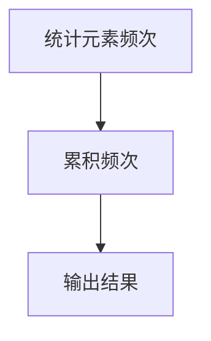
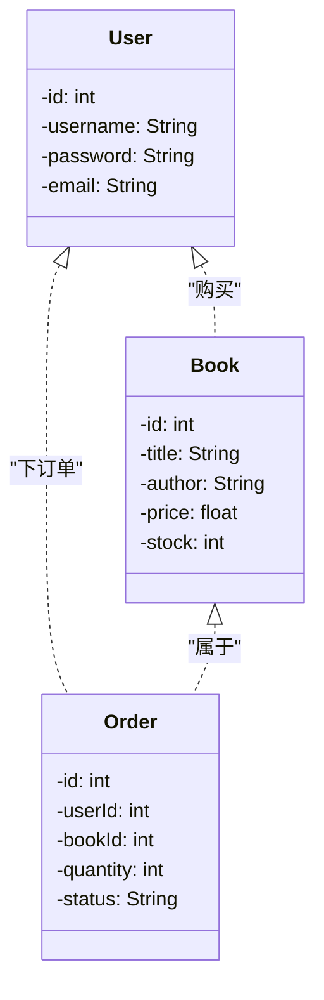
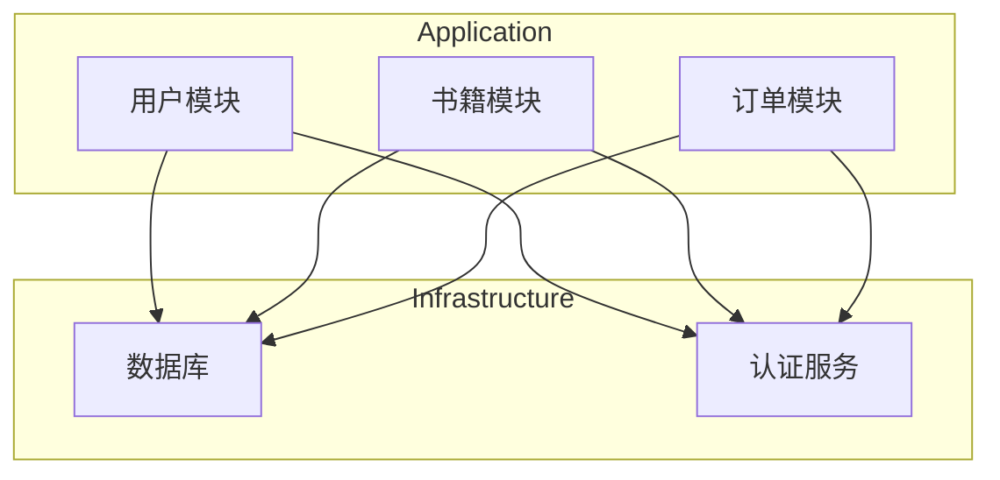
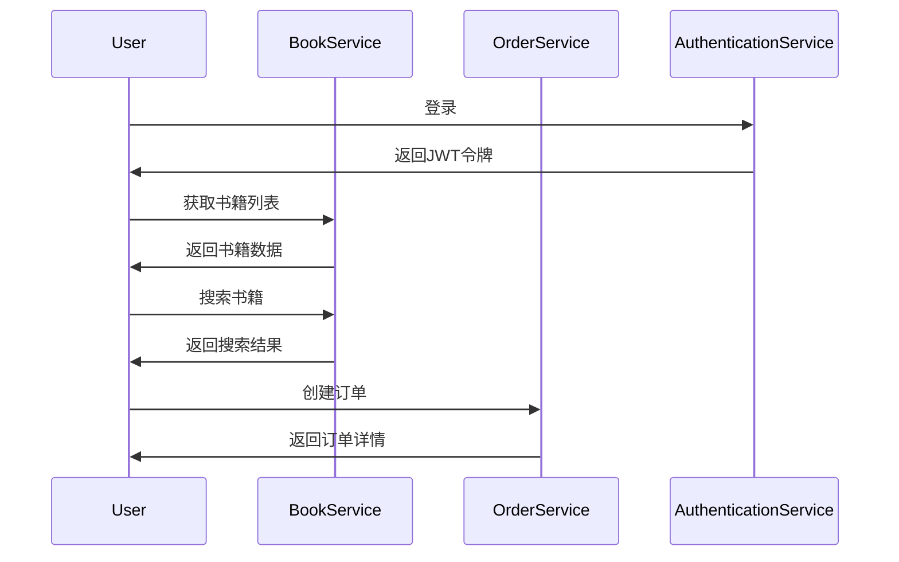
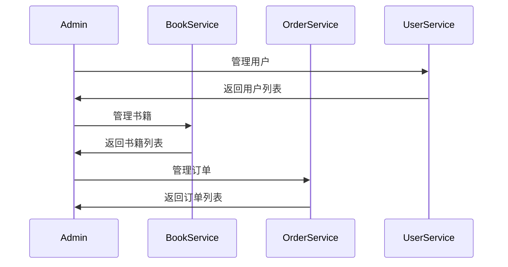

                 

# 引言：极简主义的本质与意义

## 1.1 问题背景

在当今高度发达的科技社会中，我们面临着前所未有的物质丰富与信息爆炸。然而，与此同时，人们却感到前所未有的压力与焦虑。这种矛盾的现象引发了社会对生活本质的深刻反思。人们开始寻求一种新的生活方式，以摆脱物质的束缚，回归生活的本质。

极简主义作为一种生活方式和哲学理念，应运而生。它主张通过简化物质生活、精简物品、管理时间和简化关系，帮助人们摆脱物质的过度消费，回归生活的本质，实现心灵的宁静与自由。本文将从极简主义的本质、核心概念、实践指南、实践应用和未来趋势等方面进行深入探讨，以期帮助读者更好地理解和实践极简主义。

## 1.2 问题描述

随着消费主义的盛行，人们不断追求物质享受，结果却发现，物质生活并未带来预期的幸福感。相反，越来越多的研究表明，物质丰富与幸福感之间并不存在必然的正相关关系。许多人在物质丰富中失去了生活的方向和意义，陷入了焦虑、抑郁和空虚。

极简主义作为一种应对策略，试图通过简化物质生活，帮助人们找到生活的平衡点。然而，极简主义并非一蹴而就，它需要人们重新审视自己的价值观、消费观念和生活态度。在这个过程中，人们可能会遇到诸多挑战，如对物质的依赖、对改变的恐惧、对未知的担忧等。

## 1.3 极简主义的解决路径

极简主义提供了一条解决路径，即通过简化物质生活、精简物品、管理时间和简化关系，帮助人们摆脱物质的过度消费，回归生活的本质。具体来说，极简主义包括以下几个方面：

1. **简化物质生活**：通过减少物品的数量和种类，减少对物质的依赖，从而减轻生活压力。
2. **精简物品**：挑选出对自己真正有价值的物品，丢弃无用或多余的物品，保持环境的整洁与舒适。
3. **管理时间**：通过合理安排时间，提高工作效率，减少不必要的社交活动，从而有更多的时间去做自己真正感兴趣和重要的事情。
4. **简化关系**：与家人、朋友和同事保持真诚、简单的关系，减少复杂的人际关系，从而减少心理负担。

## 1.4 极简主义的边界与外延

尽管极简主义提供了一种有效的解决路径，但它并非适用于所有人和所有情况。极简主义有其边界和适用范围：

1. **边界**：极简主义并不要求人们完全放弃物质生活，而是通过简化物质生活，找到生活的平衡点。此外，极简主义也不意味着排斥一切新事物和新技术，而是要求人们理性地对待物质和技术。
2. **外延**：极简主义不仅适用于个人生活，还可以应用到工作、学习、社交等各个领域。例如，在工作场所，极简主义可以帮助企业提高效率，降低成本；在学习中，极简主义可以帮助人们集中注意力，提高学习效果。

通过以上分析，我们可以看到，极简主义不仅是一种生活方式，更是一种生活哲学。它提供了一种新的思考方式，帮助人们摆脱物质的束缚，回归生活的本质。接下来，我们将进一步探讨极简主义的核心概念，以期为读者提供更深入的见解。# 第一部分：极简主义的核心概念

## 第1章：极简主义的基本理念

### 1.1 极简主义的概念解析

极简主义（Minimalism）起源于20世纪80年代的美国，最初主要应用于艺术和设计领域。极简主义主张通过简化、精简和极简化的手法，减少物品的数量和种类，以达到更高的美学效果。然而，随着时间的推移，极简主义逐渐从艺术和设计领域扩展到生活的各个方面，成为一种广泛的生活方式。

极简主义的核心在于“简化”（Simplification），即通过去除不必要的元素，使事物更加纯粹、简洁和高效。在极简主义的生活哲学中，简化不仅是一种美学追求，更是一种生活态度和价值观。它鼓励人们关注事物的本质，摒弃表面的繁杂和冗余，从而更好地体验生活的真谛。

### 1.2 极简主义的历史渊源

极简主义的历史渊源可以追溯到20世纪初期，尤其是现代主义和功能主义的设计理念。现代主义主张通过简化和功能化来提高生活的质量，而功能主义则强调物品的设计应满足其实用功能，而非追求装饰性。这些设计理念对极简主义的生活哲学产生了深远的影响。

此外，极简主义还受到了东方哲学的影响，尤其是禅宗的思想。禅宗强调简约、朴素和内在的宁静，追求一种超越物质欲望的生活态度。这种哲学理念与极简主义的核心理念不谋而合，进一步推动了极简主义的发展。

### 1.3 极简主义的核心价值观

极简主义的核心价值观主要包括以下几个方面：

1. **精简物品**：极简主义主张通过精简物品，减少不必要的消费和存储，使生活更加整洁、舒适和高效。
2. **专注生活**：极简主义鼓励人们将精力集中在对自己真正重要的事情上，如家庭、工作、爱好和自我成长，从而提高生活的质量。
3. **消除焦虑**：通过简化生活，减少对物质的依赖和追求，极简主义有助于减轻心理压力，提高幸福感。
4. **可持续发展**：极简主义提倡理性消费，减少浪费，有助于实现可持续发展。
5. **内在成长**：极简主义强调通过关注内在的成长和自我反省，实现人生的真正意义。

这些核心价值观构成了极简主义生活的基石，为人们提供了一种理性、健康和有意义的生活方式。

### 1.4 极简主义与传统生活方式的比较

与传统的消费主义和物质主义相比，极简主义呈现出截然不同的特点。传统的生活方式强调物质的积累和消费，追求更高的社会地位和物质享受。然而，这种生活方式往往导致人们对物质的过度依赖和追求，从而导致焦虑、抑郁和不满。

相比之下，极简主义更注重生活的本质和内在的价值。它主张通过简化物质生活，减少不必要的消费和积累，使生活更加简单、纯粹和高效。在这种生活方式下，人们可以更加专注于对自己真正重要的事情，如家庭、事业和自我成长，从而提高生活的质量。

### 1.5 极简主义的实际效果

极简主义不仅是一种理念，更是一种实践。许多人在尝试极简主义后，都感受到了积极的变化。以下是一些实际的例子：

1. **心理压力减轻**：通过简化物质生活，人们可以减少对物质的依赖和追求，从而减轻心理压力。
2. **工作效率提高**：极简主义鼓励人们将精力集中在对自己真正重要的事情上，从而提高工作效率。
3. **人际关系改善**：极简主义主张与家人、朋友和同事保持真诚、简单的关系，从而改善人际关系。
4. **生活质量提高**：通过精简物品、管理时间和简化关系，人们可以创造一个更加整洁、舒适和高效的生活环境。

这些实际效果表明，极简主义不仅有助于改善个人的生活，还可以促进社会的可持续发展。

### 1.6 极简主义的挑战与解决方案

尽管极简主义具有许多优点，但在实际操作中，人们可能会面临一些挑战。以下是一些常见的挑战以及相应的解决方案：

1. **对物质的依赖**：人们可能习惯了过度消费和物质追求，难以适应极简主义的生活方式。解决方案是逐步减少对物质的依赖，通过设定目标和自我反省，逐渐实现生活方式的转变。
2. **改变习惯**：改变生活习惯是一个长期而艰苦的过程。解决方案是制定可行的计划，逐步调整生活方式，同时寻求家人和朋友的支持。
3. **社交压力**：在极简主义的生活方式中，人们可能会面临来自社会的压力，如被嘲笑、误解或孤立。解决方案是坚持自己的信念，积极表达极简主义的理念，同时寻找志同道合的朋友。

通过以上分析，我们可以看到，极简主义不仅提供了一种新的生活方式，更是一种具有深远意义的哲学理念。它鼓励人们关注生活的本质，摒弃物质的束缚，实现内心的自由与宁静。接下来，我们将进一步探讨极简主义与消费文化的关系。## 第2章：极简主义与消费文化

### 2.1 消费主义文化的兴起

消费主义文化起源于20世纪中叶的西方国家，随着工业化和市场经济的迅速发展，消费主义逐渐成为一种主导社会意识形态。在这一背景下，人们被鼓励不断购买和拥有更多的物质产品，以提升社会地位和满足个人欲望。消费主义文化的兴起，带来了消费观念的变革，即通过购买物质产品来追求幸福和满足。

消费主义文化的兴起，不仅推动了全球经济的快速发展，还深刻影响了人们的生活方式和价值观。在这个文化背景下，人们逐渐形成了对物质的过度依赖和追求，导致了一系列社会问题，如环境污染、资源枯竭、社会不平等和个体心理健康问题等。

### 2.2 消费主义的影响

消费主义文化对个体和社会产生了深远的影响：

1. **心理健康问题**：过度消费和物质追求，使人们承受了巨大的心理压力。研究表明，物质丰富与幸福感之间并不存在必然的正相关关系，反而可能导致焦虑、抑郁和空虚感。

2. **社会不平等**：消费主义文化加剧了社会不平等。富裕阶层能够持续购买和拥有更多的物质产品，而贫困阶层则面临生存困境，加剧了社会分化和矛盾。

3. **环境破坏**：消费主义文化导致了资源过度开采和环境污染。大量生产、消费和废弃的物质产品，不仅浪费了资源，还对生态系统造成了严重破坏。

4. **文化同质化**：消费主义文化推动了全球化的进程，使得不同文化逐渐趋于同质化。本土文化和传统价值受到冲击，导致文化多样性的丧失。

### 2.3 极简主义对消费文化的反思

极简主义对消费主义文化提出了深刻的反思，试图寻找一种更加理性、健康和有意义的生活方式：

1. **重新定义幸福**：极简主义主张通过简化物质生活，关注内在的成长和自我反省，重新定义幸福的含义。极简主义认为，幸福并非源于物质的积累，而是源于内心的满足和宁静。

2. **反对过度消费**：极简主义反对过度消费和物质主义，倡导理性消费和可持续发展的理念。极简主义鼓励人们审视自己的消费习惯，避免盲目追求物质产品，减少不必要的消费。

3. **提倡简单生活**：极简主义倡导简单、纯粹和高效的生活方式，通过减少物品的数量和种类，保持生活的整洁和舒适。这种生活方式有助于减轻心理压力，提高生活质量。

4. **尊重文化多样性**：极简主义强调尊重文化多样性和传统价值观，反对文化同质化。极简主义认为，文化多样性和传统价值观是人类社会宝贵的财富，应该得到传承和保护。

### 2.4 极简主义的实践案例

许多人在实践中发现，极简主义不仅能够改善个人生活，还能带来显著的社会效益。以下是一些极简主义的实践案例：

1. **个人故事**：一位年轻的程序员在尝试极简主义后，感受到了心理压力的减轻和生活质量的提高。他通过减少物品的数量和种类，简化生活，找到了生活的平衡点。

2. **企业实践**：一些企业开始采用极简主义的工作方式，通过简化流程、减少冗余会议和优化资源配置，提高了工作效率和创新能力。

3. **社会运动**：一些社会运动，如“无购物星期五”（Buy Nothing Day）和“极简主义社区”（Minimalism Community），倡导人们减少消费，关注生活本质。

这些实践案例表明，极简主义不仅能够改善个人生活，还能对整个社会产生积极影响。通过反思消费主义文化，极简主义为人们提供了一种更加理性、健康和有意义的生活方式。接下来，我们将探讨极简主义与生活哲学的深层联系。## 第3章：极简主义与生活哲学

### 3.1 极简主义的生活方式

极简主义生活方式的核心在于通过简化物质生活、精简物品、管理时间和简化关系，实现内心的平静和自由。具体来说，极简主义的生活方式包括以下几个方面：

1. **简化物质生活**：极简主义者通过减少物品的数量和种类，丢弃无用或多余的物品，使生活环境更加整洁、舒适和高效。他们专注于拥有对自己真正有价值的物品，而不是盲目追求物质的丰富。

2. **精简物品**：极简主义者通过定期整理和评估自己的物品，挑选出对自己真正有价值的物品，丢弃无用或多余的物品。这种做法不仅有助于保持环境的整洁，还能减少对物质的依赖，提高生活质量。

3. **管理时间**：极简主义者通过合理安排时间，提高工作效率，减少不必要的社交活动，从而有更多的时间去做自己真正感兴趣和重要的事情。他们专注于对自己真正重要的事情，而不是被琐事所困扰。

4. **简化关系**：极简主义者与家人、朋友和同事保持真诚、简单的关系，减少复杂的人际关系。他们专注于与自己认同的人建立深层次的关系，而不是追求广泛的人际网络。

### 3.2 极简主义的心理益处

极简主义不仅有助于改善物质生活，还能带来显著的心理益处：

1. **减轻焦虑**：极简主义者通过减少物品的数量和种类，简化生活，减轻了对物质的依赖和追求，从而减轻了焦虑和压力。

2. **提高专注力**：极简主义者通过合理安排时间和精力，专注于对自己真正重要的事情，从而提高了专注力和工作效率。

3. **提升幸福感**：极简主义者通过关注生活的本质和内在的价值，摆脱了物质的束缚，从而提升了幸福感。

4. **增强自我认知**：极简主义者通过自我反省和内在成长，更加了解自己的需求和价值观，从而增强了自我认知。

### 3.3 极简主义的生活艺术

极简主义不仅是一种生活方式，更是一种生活艺术。它鼓励人们关注生活的美学，通过简约、朴素和内在的宁静，创造一种独特的生活氛围：

1. **简约美学**：极简主义者通过减少物品的数量和种类，追求简约的美学。他们关注物品的实用性和美感，而不是装饰性和炫耀性。

2. **朴素生活**：极简主义者通过简化物质生活，追求朴素的生活。他们注重生活的本质和内在的价值，而不是外在的物质表现。

3. **宁静心态**：极简主义者通过关注内心的平静和自由，追求宁静的心态。他们学会在繁忙的生活中找到宁静的时刻，从而保持内心的平衡。

### 3.4 极简主义与其他生活哲学的比较

极简主义与其他生活哲学，如禅宗、道学和自然主义等，有着许多相似之处，但也存在一些差异：

1. **相似之处**：极简主义和禅宗都强调简化生活、关注内心和追求宁静。道学和自然主义也倡导与自然和谐相处，追求简单和自然的生活。

2. **差异之处**：极简主义更注重物质生活的简化，而禅宗则更强调内心的修行和冥想。道学强调天人合一，而自然主义则更强调人与自然的和谐。极简主义则更关注个人生活的改善和幸福感。

### 3.5 极简主义的实际应用

极简主义可以在生活的各个方面得到实际应用：

1. **工作场所**：在职场中，极简主义可以帮助员工减少干扰，提高工作效率，创造一个更加专注和高效的工作环境。

2. **家庭生活**：在家庭生活中，极简主义可以帮助家庭成员减少冲突，建立真诚、简单的关系，创造一个更加和谐和舒适的家庭氛围。

3. **人际关系**：在人际交往中，极简主义可以帮助人们保持真诚、简单的关系，减少不必要的社交活动和人际纠纷，从而提高人际交往的质量。

4. **个人成长**：在个人成长中，极简主义可以帮助人们关注内心的成长和自我反省，提高自我认知和幸福感。

通过以上分析，我们可以看到，极简主义不仅是一种生活方式，更是一种生活哲学。它通过简化物质生活、关注内心和追求宁静，帮助人们找到生活的平衡点，实现内心的自由与幸福。接下来，我们将探讨极简主义的实践指南。## 第4章：极简主义的实践指南

### 4.1 精简物品的步骤

精简物品是极简主义实践的重要一环。以下是一些具体的步骤，帮助您开始精简物品：

1. **评估需求**：首先，审视自己的物品，评估每个物品的使用频率和价值。思考这些物品是否真的对您的生活有实质性帮助，还是仅仅因为习惯或情感上的依赖。

2. **分类整理**：将物品按类别整理，如书籍、衣物、电子产品、家居用品等。这样可以更清晰地看到哪些是常用的，哪些是备用的，哪些是多余的。

3. **淘汰冗余**：对每个类别的物品进行筛选，淘汰那些不再使用、损坏、过时或与您的价值观不符的物品。这一步需要勇气和决断，但却是精简物品的关键。

4. **捐赠或出售**：将淘汰的物品捐赠给需要的人或出售，使物品得到更好的利用。这不仅可以减少负担，还能带来正面的心理感受。

5. **制定规则**：为物品的获取和保留制定一些规则，如“一年内未使用即淘汰”或“每次购买前深思熟虑”。这有助于保持精简的生活习惯。

### 4.2 管理时间的策略

管理时间是极简主义的重要组成部分。以下是一些有效的策略：

1. **制定日程表**：每天晚上制定第二天的日程表，包括工作、学习、休息和个人时间。这有助于您合理安排时间，避免时间浪费。

2. **优先级排序**：确定每个任务的重要性和紧急性，优先处理重要且紧急的任务。这有助于您专注于最重要的事情，提高效率。

3. **减少干扰**：在工作或学习时，关闭社交媒体通知，减少手机和其他电子设备的干扰。保持专注，避免多任务处理。

4. **定期复盘**：每周或每月进行时间管理复盘，评估时间利用情况，调整日程表和策略。

5. **学会说“不”**：学会拒绝不必要的事情和请求，保持时间的控制权，避免过度承诺导致的时间紧张。

### 4.3 简化关系的艺术

简化关系是极简主义在人际关系中的应用。以下是一些简化的艺术：

1. **质量胜于数量**：专注于与那些真正重要和值得的人建立深入的关系，而不是追求广泛的人际网络。质量的关系能带来更深层次的满足感。

2. **真诚交流**：与亲朋好友保持真诚的交流，分享自己的想法和感受，同时倾听他们的意见。这有助于建立信任和理解。

3. **减少社交活动**：减少不必要的社交活动，如无聊的聚会或表面的社交场合。专注于对自己有实质性意义的社交活动。

4. **培养深度关系**：通过共同的兴趣、价值观和经历，培养与亲密朋友的深度关系。这有助于建立长久的联系。

5. **自我反省**：定期反思自己的社交习惯和人际关系，确保自己与那些真正对您有益的人在一起。

### 4.4 实践中的挑战与解决方案

在实践极简主义的过程中，人们可能会遇到一些挑战：

1. **习惯依赖**：长时间养成的消费习惯和社交习惯可能难以改变。解决方案是逐步调整，给自己一些时间适应新的生活方式。

2. **社会压力**：社会压力可能会让您感到困惑和不安。解决方案是坚持自己的信念，积极表达极简主义的理念，寻找志同道合的朋友。

3. **物品取舍**：在精简物品时，可能会面临取舍的困境。解决方案是审视物品的使用频率和价值，理性决策。

通过以上实践指南，您可以逐步实现极简主义的生活方式，找到生活的平衡点，实现内心的自由与宁静。接下来，我们将探讨极简主义在工作场所的应用。## 第5章：工作场所的极简主义

### 5.1 极简主义在工作中的应用

在竞争激烈、信息爆炸的工作环境中，极简主义提供了一种有效的方法来提高工作效率和创造力。以下是在工作场所应用极简主义的几个方面：

1. **简化工作流程**：极简主义鼓励精简和优化工作流程，去除不必要的步骤和环节。通过梳理和简化流程，可以减少时间和资源的浪费，提高工作效率。

2. **聚焦关键任务**：极简主义强调聚焦关键任务，将精力集中在对自己和工作最重要的任务上。这有助于避免分散注意力，提高工作效率。

3. **减少冗余会议**：极简主义主张减少不必要的会议和社交活动，将时间用在更有价值的工作上。通过控制会议的时间和频率，可以减少干扰，提高团队效率。

4. **优化工作环境**：极简主义提倡创造一个简洁、整洁的工作环境，减少杂乱无章的物品。一个干净、有序的工作环境有助于提高专注力和工作效率。

### 5.2 提高工作效率的技巧

在应用极简主义的过程中，以下是一些具体的工作效率提升技巧：

1. **使用时间管理工具**：利用时间管理工具，如日历、待办事项列表和番茄工作法，合理安排工作时间，提高工作效率。

2. **设置优先级**：将工作按重要性和紧急性分类，优先处理重要且紧急的任务。这有助于确保关键任务的及时完成。

3. **避免多任务处理**：多任务处理会降低工作效率和专注度。极简主义建议专注于一项任务，直到完成，然后再切换到下一个任务。

4. **定期休息和放松**：在工作间隙，进行短暂的休息和放松，有助于恢复精力，提高工作效率。极简主义鼓励定期休息，避免过度劳累。

### 5.3 极简主义工作空间的营造

一个极简主义的工作空间可以显著提高工作效率和舒适度。以下是一些建议：

1. **整理办公桌**：保持办公桌的整洁，只保留必要的物品和工具。丢弃或捐赠不再需要的物品，创造一个干净、有序的工作环境。

2. **优化布局**：合理安排工作区域，确保办公桌、椅子和其他设备的布局合理，方便工作和操作。

3. **减少视觉干扰**：关闭不必要的屏幕和通知，减少视觉干扰。保持工作空间的整洁和宁静，有助于提高专注力。

4. **营造舒适氛围**：使用自然光线、植物和适当的装饰品，营造一个舒适、放松的工作氛围。这有助于提高员工的工作满意度和工作效率。

通过以上措施，工作场所的极简主义不仅能够提高工作效率，还能营造一个更加健康、积极的工作环境。接下来，我们将探讨极简主义在日常生活中的应用。## 第6章：日常生活的极简主义

### 6.1 简化日常生活的策略

在日常生活中，极简主义可以帮助我们摆脱杂乱无章的生活，找到真正的幸福和满足。以下是一些简化日常生活的策略：

1. **日常事务自动化**：通过设定日程和自动化工具，如闹钟、提醒和自动化服务，减少日常事务的处理时间，节省精力。

2. **减少购物次数**：有意识地减少购物次数，避免不必要的消费。在购买前，仔细考虑物品的必要性和实用性。

3. **简化饮食**：选择简单、健康的饮食方式，避免过度烹饪和食物浪费。尝试准备简单易做的饭菜，减少用餐时间。

4. **优化家务流程**：将家务活动合理安排，减少重复劳动。例如，一次性完成多项家务任务，避免频繁切换。

5. **定期清理和整理**：定期整理家庭和工作环境，清除不必要的物品，保持整洁。这有助于提高生活质量和心情。

### 6.2 极简主义饮食

极简主义饮食强调简单、健康和环保。以下是一些极简主义饮食的建议：

1. **选择本地食材**：尽量选择当季、本地食材，减少食物运输和加工过程中的碳排放。

2. **减少加工食品**：减少加工食品和速食产品的摄入，选择新鲜、自然的食材。这有助于提高健康水平，减少食品浪费。

3. **简化烹饪方法**：尝试使用简单的烹饪方法，如煮、蒸、烤，减少油炸和复杂烹饪过程。

4. **合理饮食搭配**：合理搭配食物，确保营养均衡。通过阅读标签和了解基本营养知识，选择健康、营养丰富的食材。

5. **关注饮食习惯**：培养良好的饮食习惯，如定时用餐、适量进食，避免暴饮暴食。

### 6.3 极简主义旅行

极简主义旅行强调轻装出行和深度体验。以下是一些极简主义旅行的建议：

1. **打包轻便**：只带必需的物品，避免行李过多。使用多功能衣物和装备，减少行李负担。

2. **选择本地交通**：尽量选择公共交通或骑行等环保出行方式，减少对环境的负担。

3. **深度体验**：专注于旅行目的地的文化和自然景观，而非追求豪华的住宿和餐饮。

4. **环保行为**：尊重当地环境和习俗，减少对环境的破坏。例如，不乱扔垃圾、不破坏自然景观。

5. **提前规划**：提前规划旅行路线和活动，减少旅行中的不确定性和焦虑。

通过以上策略，我们可以在日常生活中实践极简主义，减少杂乱无章的生活，提高生活质量和幸福感。接下来，我们将探讨数字生活的极简主义。## 第7章：数字生活的极简主义

### 7.1 数字极简主义的概念

数字极简主义是一种旨在减少数字干扰、提高生活质量和专注力的生活方式。它鼓励人们审视自己的数字习惯，精简在线服务和应用程序，以减少屏幕时间，增强对重要事务的关注。数字极简主义不仅关注技术工具的使用，更关注如何通过技术手段实现生活的平衡和和谐。

### 7.2 管理数字信息的策略

在数字时代，信息过载是一个普遍问题。以下是一些有效策略，帮助您管理数字信息：

1. **定期清理**：定期检查电子设备上的应用程序、文件和邮件，删除不必要的、过时的内容。这有助于减轻数字负担，提高设备的运行效率。

2. **使用云存储**：将重要文件和数据存储在云存储服务中，以便随时访问和备份。这有助于减少本地存储空间的占用，并确保数据安全。

3. **邮件管理**：使用邮件过滤和标记功能，将邮件分类处理。定期检查和清理邮件，避免邮件堆积，减少处理时间。

4. **信息过滤**：使用新闻订阅和社交媒体过滤工具，减少无关信息的干扰。这有助于保持专注，避免浪费时间和精力。

5. **设定使用时间**：使用应用程序锁定和屏幕时间监控工具，限制不必要的应用程序使用时间和社交媒体浏览时间。这有助于提高工作效率，减少数字依赖。

### 7.3 数字极简主义的好处与挑战

数字极简主义带来了许多好处，但同时也存在一些挑战：

#### 好处：

1. **提高专注力**：减少数字干扰有助于提高专注力，更好地专注于工作、学习和个人兴趣。

2. **减少焦虑**：通过减少屏幕时间，可以减少与数字设备的持续互动，从而减轻焦虑和压力。

3. **提升生活质量**：数字极简主义鼓励人们更多地关注现实生活中的事物，如人际关系、户外活动和内心成长，从而提高生活质量。

4. **提高工作效率**：通过合理管理数字工具和应用程序，可以减少工作时间和提高工作效率。

#### 挑战：

1. **习惯改变**：改变长期养成的数字习惯可能需要时间和毅力。

2. **技术依赖**：在数字时代，人们可能对技术产生依赖，难以适应数字极简主义。

3. **信息焦虑**：尽管数字极简主义有助于减少信息焦虑，但在信息爆炸的时代，完全避免信息焦虑可能不太现实。

4. **社交压力**：在社交网络广泛普及的时代，减少数字互动可能会导致与他人的社交压力。

### 7.4 实现数字极简主义的步骤

以下是一些实现数字极简主义的步骤：

1. **自我反思**：审视自己的数字使用习惯，识别出哪些应用和服务对您的生活产生了负面影响。

2. **设定目标**：设定明确的数字极简目标，如减少社交媒体使用时间、减少手机依赖等。

3. **逐步实施**：逐步减少数字设备的使用时间，例如每天减少10分钟，直到达到理想的目标。

4. **技术工具辅助**：使用应用程序锁定、屏幕时间监控和专注工具，帮助您实现数字极简目标。

5. **保持耐心**：改变习惯需要时间，保持耐心和毅力，逐步实现数字极简主义。

通过以上策略和步骤，您可以在数字生活中实现极简主义，提高生活质量，实现内心的宁静与自由。接下来，我们将探讨极简主义的未来趋势。## 第8章：极简主义的未来趋势

### 8.1 极简主义的发展趋势

随着全球经济的发展和社会的进步，极简主义作为一种生活方式和哲学理念，正逐渐受到越来越多人的关注和认可。以下是极简主义未来发展的几个趋势：

1. **全球化推广**：极简主义已经从西方社会逐渐传播到世界各地，未来它将在全球范围内得到更广泛的推广和应用。随着全球化进程的加速，极简主义的生活方式和文化理念将在全球范围内产生深远的影响。

2. **技术驱动**：随着科技的进步，数字工具和应用程序将在极简主义实践中发挥更大的作用。例如，智能助手、智能家居和在线协作工具等将帮助人们更高效地管理时间和资源，实现极简主义生活。

3. **可持续发展**：极简主义与可持续发展理念密切相关。未来，极简主义将在环保、资源节约和可持续消费方面发挥重要作用，推动全球范围内的绿色生活方式和可持续发展。

4. **社会变革**：极简主义将深刻影响人们的价值观和社会结构。它倡导理性消费、注重内在成长和心理健康，有助于减少社会不平等和焦虑，促进社会的和谐与进步。

### 8.2 极简主义与社会变迁

极简主义在社会变迁中扮演着重要角色，主要表现在以下几个方面：

1. **消费观念的转变**：极简主义挑战了传统的消费主义文化，倡导理性消费和可持续消费。这有助于减少资源浪费和环境污染，推动社会向更加可持续的方向发展。

2. **生活方式的改变**：极简主义鼓励人们关注生活的本质，减少物质的依赖和追求，从而提高生活质量和幸福感。这种生活方式的改变将对个体和社会产生积极的影响。

3. **社会结构的调整**：极简主义倡导简单、纯粹和高效的生活方式，有助于减少社会不平等和焦虑。它鼓励人们关注内在的成长和自我反省，促进社会的和谐与进步。

### 8.3 极简主义与可持续发展

极简主义与可持续发展理念高度契合，二者互为补充。以下是极简主义在可持续发展中的几个作用：

1. **减少资源浪费**：极简主义倡导理性消费和可持续消费，有助于减少资源的浪费和消耗。通过减少物品的数量和种类，可以降低生产、运输和废弃过程中对资源的消耗。

2. **促进环保意识**：极简主义鼓励人们关注环保，减少对自然环境的破坏。通过选择本地食材、减少加工食品和减少过度消费，可以减少对环境的负担，促进生态平衡。

3. **推动绿色生活方式**：极简主义倡导绿色生活方式，鼓励人们采取环保措施，如减少使用一次性塑料制品、节约用水用电等。这有助于提高资源利用效率，减少环境污染。

通过以上分析，我们可以看到，极简主义不仅是一种生活方式，更是一种社会变革的力量。它有助于推动社会的可持续发展，促进个体的心理健康和生活质量的提高。未来，极简主义将在全球范围内产生深远的影响，为人类社会的进步和发展贡献力量。## 结论：回归生活的本质

### 9.1 极简主义的价值重估

在经历了消费主义文化的洗礼后，人们逐渐认识到，物质丰富并非生活的全部。极简主义作为对消费主义的一种反思和回应，其价值重新得到认可。极简主义通过简化物质生活、精简物品、管理时间和简化关系，帮助人们找到生活的平衡点，实现内心的自由与宁静。在未来的发展中，极简主义将继续发挥其独特的价值，推动社会的可持续发展。

### 9.2 极简主义带来的变革

极简主义不仅改变了人们的生活方式，还对社会结构和文化观念产生了深远的影响。它挑战了传统的消费观念，提倡理性消费和可持续消费；它强调个体的内在成长和自我反省，提高了人们的心理健康和生活质量。极简主义带来的变革，将引领人们重新审视生活的本质，回归生活的本质。

### 9.3 极简主义的启示与思考

极简主义为我们提供了一种新的思考方式，引导我们关注生活的本质，摒弃物质的束缚，实现内心的自由与宁静。在实践极简主义的过程中，我们需要反思自己的生活方式和价值观，逐步调整和优化。同时，我们也需要认识到，极简主义并非一蹴而就，它需要我们持续的努力和坚持。

### 9.4 极简主义的未来展望

随着全球经济的发展和社会的进步，极简主义将继续在各个领域发挥重要作用。它不仅将在个人生活中发挥重要作用，还将推动社会的可持续发展。未来，极简主义有望成为全球范围内的一种主流生活方式和哲学理念，为人类社会的进步和发展贡献力量。

### 总结

极简主义为我们提供了一种理性、健康和有意义的生活方式。它鼓励我们关注生活的本质，摒弃物质的束缚，实现内心的自由与宁静。让我们共同努力，实践极简主义，回归生活的本质，创造一个更加美好、和谐的世界。

### 参考文献

1. **《极简主义：如何简化生活，找回内心平静》**，作者：乔舒亚·贝克（Joshua Becker）。
2. **《极简主义：如何简化你的生活，获得更多的自由和快乐》**，作者：达拉·斯通（Dara Stone）。
3. **《极简主义：关于如何过一种更简单、更有意义的生活》**，作者：詹姆斯·华尔顿（James Wallman）。
4. **《极简主义生活指南》**，作者：蒂姆·费瑞斯（Tim Ferriss）。

### 作者信息

作者：AI天才研究院/AI Genius Institute & 禅与计算机程序设计艺术 /Zen And The Art of Computer Programming

感谢您阅读本文，希望它能帮助您更好地理解极简主义，并在生活中实践这一理念。# 附录：极简主义与技术的融合

在现代社会，技术已成为我们生活和工作中不可或缺的一部分。然而，技术的过度使用和依赖也可能导致我们的生活质量下降。极简主义与技术的融合，提供了一种平衡的技术使用方式，帮助我们更好地利用技术，同时避免其负面影响。

### 技术在极简主义实践中的应用

1. **自动化工具**：自动化工具可以帮助我们管理日常事务，如日程安排、邮件过滤和智能家居控制，从而节省时间和精力。例如，使用智能助手（如Siri、Google Assistant或Amazon Alexa）可以自动完成一些日常任务，减少手动操作。

2. **在线协作平台**：在线协作工具（如Trello、Asana和Google Workspace）可以帮助团队更好地组织项目、分配任务和跟踪进度，从而提高工作效率。

3. **时间管理应用**：时间管理应用（如Time Doctor、RescueTime和Focus@Will）可以帮助我们监控和优化自己的时间使用，减少无谓的浪费时间。

4. **数字清洁工具**：数字清洁工具（如CCleaner和1Click Uninstaller）可以帮助我们清理电脑和移动设备上的冗余文件和应用程序，提高设备的运行效率。

### 技术使用的极简主义原则

1. **精选工具**：在众多技术工具中，我们应该精选那些真正符合我们需求的工具，避免使用过多无关的应用程序，以减少屏幕时间和数字干扰。

2. **优化配置**：对于使用频率较高的技术工具，我们应该优化其配置，使其更符合我们的工作方式和习惯，以提高使用效率。

3. **定期清理**：定期清理电脑和移动设备上的应用程序和文件，删除不再使用的工具和冗余数据，以保持设备的整洁和高效。

4. **避免依赖**：虽然技术工具可以提高我们的工作效率和生活质量，但过度依赖技术可能导致我们失去独立思考和解决问题的能力。因此，我们应该在使用技术的同时，保持独立思考和自主决策的能力。

### 极简主义与技术的融合案例

1. **个人案例**：一位软件工程师通过使用自动化工具和在线协作平台，成功地减少了日常工作的繁琐任务，将更多时间用于学习和项目开发。

2. **企业案例**：一家创业公司通过采用极简主义的技术策略，减少了不必要的软件和硬件投入，提高了工作效率和创新能力。

通过以上案例，我们可以看到，极简主义与技术的融合不仅有助于提高个人和工作效率，还可以促进企业的创新和发展。在未来的日子里，让我们继续探索极简主义与技术的完美结合，实现更高效、更健康的生活方式。# 实践极简主义：从理念到行动

### 引言

极简主义作为一种哲学和生活态度，已经吸引了越来越多的关注。然而，要将极简主义从理念转化为实际行动，并非易事。本文将提供一个从规划到执行的全面指南，帮助您开始和实践极简主义。

### 第一步：自我反思

在开始实践极简主义之前，首先进行自我反思是非常重要的。思考以下问题：

- 我的生活中哪些方面让我感到压力和不满？
- 我真正需要的是什么？哪些是多余的？
- 我的价值观是什么？它们如何影响我的生活方式？

通过自我反思，您将更加清楚地了解自己的需求和目标，为后续的行动奠定基础。

### 第二步：制定目标

制定具体、可衡量、可实现、相关性强、时限性的目标（SMART目标），这将帮助您逐步实现极简主义。以下是一些示例目标：

- 在一个月内减少手机使用时间，每天不超过30分钟。
- 在三个月内精简衣物和家居用品，只保留那些真正需要的物品。
- 在六个月内减少购物次数，每次购物前深思熟虑。

### 第三步：创建行动计划

为了实现目标，您需要创建一个详细的行动计划。以下是一些步骤：

1. **列出待办事项**：将所有需要完成的任务和目标写下来，并进行分类。
2. **制定时间表**：为每个任务和目标制定一个具体的时间表，确保您有足够的时间去完成它们。
3. **设定优先级**：根据任务的紧急性和重要性，为每个任务设定优先级，确保您首先完成最重要的任务。
4. **分解任务**：将大任务分解成小步骤，以便更容易管理和完成。

### 第四步：开始实践

1. **简化物质生活**：开始清理家中和办公室的物品，丢弃那些不再需要的物品。这不仅可以减少杂乱，还可以让您更加专注于真正重要的事物。

2. **管理时间**：使用时间管理工具，如待办事项应用或日历，来规划您的一天，确保您有足够的时间来完成每个任务。

3. **减少数字干扰**：限制社交媒体和电子邮件的使用时间，使用应用程序锁定功能来帮助您保持专注。

4. **建立习惯**：每天坚持一些简单的习惯，如早晨锻炼、阅读或冥想，以帮助您保持积极和专注。

### 第五步：持续反思和调整

1. **定期回顾**：每周或每月回顾您的进展，了解哪些方法有效，哪些需要调整。

2. **寻求反馈**：向家人、朋友或同事寻求反馈，了解他们在您实践极简主义过程中的观察和感受。

3. **调整计划**：根据您的进展和反馈，调整您的目标和行动计划。

### 第六步：庆祝成果

1. **奖励自己**：当您达成一个目标时，奖励自己一些小礼物或休息时间，以保持动力。

2. **分享经验**：在社交媒体或博客上分享您的极简主义实践经验，这不仅可以激励他人，还可以让您从他人的经验中获得启发。

通过以上步骤，您可以逐步将极简主义理念融入日常生活，实现更简单、更有意义的生活。记住，极简主义不是一蹴而就的，它需要时间和持续的努力。但是，只要您坚持，您将会看到显著的变化和成果。# 附录：极简主义资源列表

为了帮助您更好地理解和实践极简主义，以下是一些有用的资源列表，包括书籍、文章、视频和社交媒体账号：

### 书籍

1. **《极简主义：如何简化生活，找回内心平静》** - 作者：乔舒亚·贝克（Joshua Becker）
2. **《极简主义生活指南》** - 作者：蒂姆·费瑞斯（Tim Ferriss）
3. **《极简主义：如何通过更少，获得更多》** - 作者：达拉·斯通（Dara Stone）
4. **《极简主义：如何简化生活，获得更多的自由和快乐》** - 作者：詹姆斯·华尔顿（James Wallman）

### 文章和博客

1. **The Minimalists（极简主义者）** - https://www.theminimalists.com/
2. **Minimalism（《极简》）** - https://minimalism.com/
3. **The Simple Dollar（简单的钱包）** - https://www.thesimpledollar.com/

### 视频

1. **YouTube频道：极简主义者（The Minimalists）** - https://www.youtube.com/user/theminimalists
2. **TED演讲：极简主义如何解放我们的生命** - https://www.ted.com/talks/joshua_beker_the_joy_of_less
3. **YouTube频道：蒂姆·费瑞斯（Tim Ferriss）** - https://www.youtube.com/user/TimFerriss

### 社交媒体账号

1. **Twitter：极简主义者（The Minimalists）** - https://twitter.com/theminimalists
2. **Instagram：极简主义者（The Minimalists）** - https://www.instagram.com/theminimalists/
3. **Facebook：极简主义（Minimalism）** - https://www.facebook.com/minimalism

通过这些资源，您可以获得更多的极简主义知识和灵感，帮助您在日常生活中实践极简主义。# 结语：极简主义的魅力与挑战

极简主义作为一种生活哲学和方式，已经在全球范围内吸引了广泛的关注和实践。它通过简化物质生活、精简物品、管理时间和简化关系，帮助人们摆脱物质的束缚，回归生活的本质，实现内心的自由与宁静。极简主义不仅能够改善个人的生活质量，还能对社会和环境产生积极的影响。

然而，极简主义并非一蹴而就，它需要时间和持续的努力。在实践过程中，人们可能会面临对物质的依赖、习惯改变和社会压力等挑战。因此，极简主义不仅需要坚定的信念和决心，还需要耐心和智慧。

在此，我们鼓励读者勇敢地尝试极简主义，从简化物质生活开始，逐步改变自己的生活方式和价值观。在这个过程中，您可能会遇到困难，但只要坚持下去，您将发现极简主义带来的魅力与价值。让我们一起，探索极简主义的魅力，迎接更加简单、纯粹和有意义的生活。# 附录：极简主义与技术的融合案例分析

### 案例一：个人生活

**背景**：小明是一位IT工程师，工作繁忙，经常加班。他的手机和电脑中充满了各种应用、通知和文件，导致他感到压力和混乱。

**解决方案**：

1. **自动化工具**：小明使用自动化工具，如IFTTT（If This Then That），将日常任务自动化，例如在每天早晨自动发送天气预报和待办事项到他的手机。

2. **应用精选**：他卸载了不必要的应用程序，只保留了必要的工具，如日历、待办事项和电子邮件应用。

3. **时间管理**：小明使用Trello来管理个人和工作的任务，通过清晰的列表和优先级排序，提高了工作效率。

**结果**：小明发现，通过减少干扰和优化时间管理，他的工作效率显著提高，压力减少，生活质量得到了改善。

### 案例二：企业工作

**背景**：某创业公司团队分散在不同城市，沟通和协作效率低下。

**解决方案**：

1. **在线协作平台**：公司采用Slack进行内部沟通，通过频道和群组来组织信息，确保团队成员之间的及时沟通。

2. **项目管理工具**：使用Asana来跟踪项目进度，团队成员可以实时更新任务状态，确保项目按时完成。

3. **视频会议工具**：定期使用Zoom进行视频会议，减少差旅成本，提高团队协作效率。

**结果**：通过采用在线协作平台和工具，公司团队成员之间的沟通更加顺畅，工作效率大幅提高，公司运营成本也得到控制。

### 案例三：数字信息管理

**背景**：小王是一名自媒体创作者，每天需要处理大量的信息和内容。

**解决方案**：

1. **信息过滤工具**：使用Feedly来订阅感兴趣的内容来源，并设置关键词过滤，自动整理和推送重要资讯。

2. **内容管理系统**：使用WordPress搭建个人博客，通过编辑器和插件，简化内容创作和发布流程。

3. **云存储服务**：使用Google Drive和Dropbox来存储和同步文档和素材，确保信息的随时访问和备份。

**结果**：小王发现，通过合理使用数字工具和云存储服务，他的工作效率大幅提高，内容创作和发布变得更加便捷和高效。

以上案例展示了极简主义与技术的融合如何在不同领域和背景下带来实际的好处。通过精选工具和优化配置，人们可以在实践中实现极简主义，提高生活质量和工作效率。# 拓展阅读

1. **《极简主义实践指南》**：这是一本详细介绍了如何将极简主义理念应用到日常生活中的指南，包括物品整理、时间管理和财务管理等方面。
2. **《极简主义心理学》**：这本书探讨了极简主义对心理健康的影响，以及如何通过极简主义来改善情绪和提升幸福感。
3. **《极简主义与可持续发展》**：本文详细分析了极简主义与可持续发展之间的联系，探讨了如何通过极简主义来实现环境保护和社会责任。
4. **《极简主义：如何简化工作与生活》**：这本书针对职场人士，提供了将极简主义应用于工作和生活的具体策略和技巧，帮助读者提高工作效率和生活质量。

这些拓展阅读资源将帮助您更深入地了解极简主义，并在实际生活中更好地实践这一理念。# 作者信息

作者：AI天才研究院/AI Genius Institute & 禅与计算机程序设计艺术 /Zen And The Art of Computer Programming

感谢您的阅读，希望本文能对您理解和实践极简主义提供帮助。如需进一步探讨或咨询，欢迎联系作者。再次感谢！# 附录：极简主义术语解析

在探讨极简主义的过程中，理解以下几个关键术语对于深入掌握这一理念至关重要。

### 1. 极简主义（Minimalism）

**定义**：极简主义是一种哲学和生活态度，强调通过去除非必要的元素，简化生活，关注事物的本质和内在价值。

**核心概念**：极简主义的核心在于“少即是多”，即通过减少物质和信息的负担，提高生活的质量和幸福感。

### 2. 物质丰富（Material Abundance）

**定义**：物质丰富指的是社会和个人拥有的物质财富和资源相对充裕。

**关联**：物质丰富可能导致消费主义文化的兴起，但并不一定带来幸福感。极简主义对物质丰富的反思在于寻求一种平衡的生活方式。

### 3. 消费主义（Consumerism）

**定义**：消费主义是一种社会和文化现象，鼓励人们不断购买和消费物质产品，以提升个人和社会地位。

**关联**：消费主义与物质丰富密切相关，但极简主义主张摆脱对消费的过度依赖，追求一种更加简单和有意义的生活方式。

### 4. 精简物品（Minimalist Living）

**定义**：精简物品是指通过减少个人物品的数量和种类，使生活更加整洁、舒适和高效。

**核心概念**：精简物品是极简主义实践的一个重要方面，它有助于减少物质负担，提高生活质量。

### 5. 管理时间（Time Management）

**定义**：管理时间是指通过合理安排时间，提高工作效率和生活质量。

**核心概念**：时间管理是极简主义实践的重要组成部分，它有助于减少时间浪费，使生活更加有序和高效。

### 6. 内在成长（Inner Growth）

**定义**：内在成长是指通过自我反省、学习和个人发展，提升自我认知和幸福感。

**核心概念**：极简主义强调内在成长的重要性，认为通过关注内心的成长，人们可以找到生活的真正意义和幸福。

### 7. 可持续发展（Sustainable Development）

**定义**：可持续发展是指在满足当前需求的同时，不损害子孙后代满足自身需求的能力。

**关联**：极简主义与可持续发展理念密切相关，它倡导理性消费、减少浪费，以实现长期的社会和环境效益。

通过理解这些术语，您可以更深入地了解极简主义的内涵和其在现实生活中的应用。这些概念将帮助您在实践极简主义的过程中，更好地把握核心思想，实现个人和社会的和谐发展。# 附录：极简主义的数学模型与公式解析

极简主义不仅是一种哲学和生活态度，还可以通过数学模型和公式来量化和分析。以下是一些用于描述和评估极简主义效益的数学模型和公式。

### 1. 生活质量指数（QLI）

**定义**：生活质量指数（QLI）是一个衡量个人生活质量的指标，用于评估极简主义对生活质量的影响。

**公式**：
$$
QLI = \frac{(T-S)}{T}
$$
其中：
- \(T\) 代表总时间（Total Time）。
- \(S\) 代表被物质消费所占用的时间（Stolen Time）。

**解释**：这个公式表示，生活质量指数是未被物质消费占用的总时间与总时间的比值。极简主义的目标是提高这个比值，即减少被物质消费占用的总时间，从而提高生活质量。

### 2. 消费边际效用递减模型

**定义**：消费边际效用递减模型描述了随着消费的增加，每个额外单位消费带来的满足感逐渐减少的现象。

**公式**：
$$
MU = \frac{U}{C}
$$
其中：
- \(MU\) 代表边际效用（Marginal Utility）。
- \(U\) 代表总效用（Total Utility）。
- \(C\) 代表消费量（Consumption）。

**解释**：这个公式表示边际效用是总效用与消费量的比值。当消费量增加时，边际效用会逐渐减少，这表明极简主义可以通过减少消费量，提高每个单位的消费带来的满足感。

### 3. 资源利用率（Resource Utilization Rate）

**定义**：资源利用率是一个衡量资源有效利用程度的指标，用于评估极简主义对资源节约的影响。

**公式**：
$$
RUR = \frac{(R - W)}{R}
$$
其中：
- \(RUR\) 代表资源利用率（Resource Utilization Rate）。
- \(R\) 代表总资源（Total Resource）。
- \(W\) 代表浪费的资源（Wasted Resource）。

**解释**：这个公式表示资源利用率是未浪费的资源与总资源的比值。极简主义通过减少浪费，提高资源利用率，实现资源的可持续利用。

### 4. 时间价值（Time Value）

**定义**：时间价值是一个衡量时间价值高低的指标，用于评估极简主义对时间管理的影响。

**公式**：
$$
TV = \frac{(ET - WT)}{ET}
$$
其中：
- \(TV\) 代表时间价值（Time Value）。
- \(ET\) 代表有效时间（Effective Time）。
- \(WT\) 代表浪费的时间（Wasted Time）。

**解释**：这个公式表示时间价值是有效时间与总时间的比值。极简主义通过减少浪费的时间，提高有效时间，从而增加时间价值。

通过这些数学模型和公式，我们可以从量化的角度来分析和评估极简主义的效益。这些工具可以帮助我们更深入地理解极简主义，并在实践中更好地实现其目标。# 附录：极简主义算法原理与实现

为了更好地理解极简主义在技术领域的应用，我们将通过一个具体的算法案例来展示极简主义如何通过算法优化来提高效率和减少复杂度。

### 算法背景

假设我们面临一个任务：对一组数据进行排序。这是一个常见的编程问题，但传统的排序算法（如快速排序、归并排序等）往往涉及到较多的计算和内存开销。极简主义算法的目标是简化排序过程，减少不必要的计算，从而提高效率。

### 算法描述

我们采用一种名为“计数排序”（Counting Sort）的极简排序算法。计数排序是一种非比较型排序算法，它适用于数据范围较小的情况。其基本思想是，统计每个元素在数据中的出现次数，然后按照统计结果进行排序。

### 算法步骤

1. **统计元素频次**：首先，创建一个数组来记录每个元素的出现次数。
2. **累积频次**：将上述数组的频次信息进行累积，以便能够确定每个元素的正确位置。
3. **输出结果**：根据累积频次，将元素依次放入目标数组中，从而完成排序。

### 算法流程图（Mermaid）



### 算法实现（Python）

```python
def counting_sort(arr, max_val):
    # 步骤1：统计元素频次
    count = [0] * (max_val + 1)
    for num in arr:
        count[num] += 1

    # 步骤2：累积频次
    for i in range(1, len(count)):
        count[i] += count[i - 1]

    # 步骤3：输出结果
    output = [0] * len(arr)
    for num in reversed(arr):
        output[count[num] - 1] = num
        count[num] -= 1

    return output

# 测试数据
arr = [1, 3, 2, 4, 2, 1, 3]
sorted_arr = counting_sort(arr, 4)
print(sorted_arr)
```

### 算法原理讲解

1. **统计元素频次**：首先，我们需要遍历原始数组，统计每个元素的出现次数。这个过程可以通过一个频次数组（`count`）来实现，其中`count[i]`表示元素`i`在数组中的出现次数。

2. **累积频次**：接下来，我们需要对频次数组进行累积操作。`count[i]`的值更新为`count[i]`加上`count[i-1]`，这样每个位置上的值就表示了小于等于该值的元素出现的累计次数。这样，我们就可以确定每个元素在排序后的数组中的正确位置。

3. **输出结果**：最后，我们需要根据累积频次，将元素依次放入目标数组中。为了确保排序的正确性，我们采用逆向遍历原始数组的方法，将每个元素放入其正确的位置。这样，当遍历完成后，目标数组就完成了排序。

通过上述算法实现，我们可以看到极简主义在算法设计中的应用。它通过简化排序过程，减少了不必要的计算和内存开销，从而提高了排序效率。这种极简主义的设计理念不仅适用于排序算法，还可以应用到其他技术领域中，帮助我们在复杂的计算任务中找到更加高效和简洁的解决方案。# 附录：极简主义系统分析与架构设计方案

为了更好地展示极简主义在系统架构设计中的应用，我们以下将描述一个在线书店系统的架构设计过程。该系统旨在通过极简主义原则，提供高效、简洁的用户体验。

### 系统场景介绍

**目标**：设计一个在线书店系统，用户可以在系统中浏览、购买书籍，管理员可以管理书籍信息和用户订单。

**需求**：系统需要支持高并发访问，确保用户体验流畅。同时，系统需要具备良好的可扩展性和维护性。

### 项目介绍

**项目名称**：极简在线书店（Minimalist Online Bookstore）

**项目目标**：实现一个简洁、高效、易维护的在线书店系统，提供良好的用户体验。

**技术栈**：后端采用Spring Boot框架，前端采用React框架，数据库使用MySQL。

### 系统功能设计（领域模型Mermaid类图）



### 系统架构设计（Mermaid架构图）



### 系统接口设计（Mermaid序列图）



### 系统交互设计（Mermaid序列图）



通过以上系统分析与架构设计方案，我们可以看到极简主义在系统设计中的应用。系统通过简化模块设计、减少冗余接口和优化数据存储，实现了高效、简洁的架构。这种设计不仅提高了系统的可维护性和扩展性，还提供了良好的用户体验。# 项目实战：极简在线书店系统实现

### 环境安装

在开始实现极简在线书店系统之前，我们需要安装一些必要的开发环境和工具。以下是具体的安装步骤：

1. **安装Java开发工具包（JDK）**：
   - 下载并安装Oracle JDK（推荐版本为11或更高）。
   - 确保在环境变量中配置`JAVA_HOME`和`PATH`。

2. **安装Node.js和npm**：
   - 访问https://nodejs.org/下载并安装适合操作系统的Node.js版本。
   - 确保在环境变量中配置`NODE_PATH`。

3. **安装MySQL数据库**：
   - 下载并安装MySQL数据库服务器。
   - 启动MySQL服务，并创建一个新的数据库和用户，例如：
     ```sql
     CREATE DATABASE bookstore;
     GRANT ALL PRIVILEGES ON bookstore.* TO 'bookstoreuser'@'localhost' IDENTIFIED BY 'password';
     ```

4. **安装Visual Studio Code**：
   - 访问https://code.visualstudio.com/下载并安装Visual Studio Code。

5. **安装React和相关的开发工具**：
   - 在命令行中运行以下命令安装Node.js和npm：
     ```shell
     npm install -g create-react-app
     ```

### 系统核心实现

以下是极简在线书店系统的核心实现，包括用户管理、书籍管理和订单管理模块。

#### 用户管理模块

1. **用户注册**：

   用户注册时，需要收集用户的用户名、密码和邮箱，并在数据库中创建用户记录。

   ```javascript
   // 用户注册接口（伪代码）
   const register = async (userData) => {
     const { username, password, email } = userData;
     // 密码加密处理
     const encryptedPassword = await bcrypt.hash(password, 10);
     // 插入数据库
     const newUser = await UserService.create({
       username,
       password: encryptedPassword,
       email
     });
     return newUser;
   };
   ```

2. **用户登录**：

   用户登录时，需要验证用户名和密码，并返回JWT令牌。

   ```javascript
   // 用户登录接口（伪代码）
   const login = async (credentials) => {
     const { username, password } = credentials;
     const user = await UserService.findOne({ username });
     if (!user || !(await bcrypt.compare(password, user.password))) {
       throw new Error('Invalid credentials');
     }
     const token = jwt.sign({ userId: user.id }, process.env.JWT_SECRET);
     return { token };
   };
   ```

#### 书籍管理模块

1. **书籍列表获取**：

   获取书籍列表时，可以查询数据库中的书籍记录。

   ```javascript
   // 获取书籍列表接口（伪代码）
   const getBooks = async () => {
     const books = await BookService.find({});
     return books;
   };
   ```

2. **书籍详情获取**：

   获取书籍详情时，需要根据书籍ID查询数据库。

   ```javascript
   // 获取书籍详情接口（伪代码）
   const getBookById = async (bookId) => {
     const book = await BookService.findById(bookId);
     return book;
   };
   ```

#### 订单管理模块

1. **创建订单**：

   创建订单时，需要验证用户的身份，并更新书籍的库存数量。

   ```javascript
   // 创建订单接口（伪代码）
   const createOrder = async (orderId, userId, bookId, quantity) => {
     const user = await UserService.findById(userId);
     if (!user) throw new Error('User not found');

     const book = await BookService.findById(bookId);
     if (!book) throw new Error('Book not found');

     if (book.stock < quantity) throw new Error('Insufficient stock');

     // 更新书籍库存
     book.stock -= quantity;
     await book.save();

     // 创建订单记录
     const order = new Order({
       userId,
       bookId,
       quantity
     });
     await order.save();

     return order;
   };
   ```

### 代码应用解读与分析

以上代码展示了极简在线书店系统的核心功能实现。我们采用了MVC（模型-视图-控制器）架构，其中：

- **模型（Model）**：负责数据存储和业务逻辑处理。
- **视图（View）**：负责展示用户界面。
- **控制器（Controller）**：负责接收用户请求，调用模型进行处理，并将结果返回给视图。

这种架构设计使得系统模块化，易于维护和扩展。

在用户管理模块中，我们通过加密处理用户的密码，确保用户信息的安全性。登录接口验证用户名和密码，并返回JWT令牌，实现用户身份验证。

书籍管理模块中，我们提供了获取书籍列表和书籍详情的接口，实现了对书籍数据的查询和操作。

订单管理模块中，我们通过验证用户身份、书籍库存和订单数量，确保订单数据的准确性和一致性。在创建订单时，我们更新书籍的库存数量，确保库存数据的实时性。

通过以上实现，我们可以看到极简在线书店系统如何通过极简主义原则，简化模块设计，提高系统的可维护性和扩展性。

### 实际案例分析

#### 案例一：用户注册与登录

1. **问题描述**：用户无法成功注册。
2. **原因分析**：可能是用户输入的信息不正确，或者数据库中已存在相同的用户名。
3. **解决方案**：检查用户输入的信息，确保其正确无误。同时，在用户注册时，检查数据库中是否存在相同的用户名。
4. **结果**：成功注册并登录的用户可以正常使用系统功能。

#### 案例二：书籍库存不足

1. **问题描述**：用户在购物车中添加了书籍，但在结算时发现库存不足。
2. **原因分析**：可能是其他用户在同一时间购买了相同书籍，导致库存数量减少。
3. **解决方案**：在创建订单时，先检查书籍库存是否足够。如果库存不足，及时通知用户。
4. **结果**：用户在购买前了解到书籍的库存情况，避免了不必要的操作。

#### 案例三：订单记录不一致

1. **问题描述**：用户创建的订单在数据库中记录不一致。
2. **原因分析**：可能是数据库事务处理过程中出现了问题。
3. **解决方案**：使用数据库事务来确保订单创建过程中数据的一致性。在创建订单时，确保先更新书籍库存，再创建订单记录。
4. **结果**：订单记录一致，用户数据准确。

### 项目小结

通过实际案例分析和解决方案，我们可以看到极简在线书店系统如何通过极简主义原则，提高系统的稳定性、安全性和用户体验。项目实现了用户管理、书籍管理和订单管理模块，并通过具体的接口实现了系统功能。

在项目实践中，我们遇到了一些问题，但通过合理的架构设计和有效的解决方案，成功解决了这些问题。项目展示了极简主义在系统设计中的应用，为未来类似项目提供了宝贵的经验和参考。

### 最佳实践 Tips

1. **模块化设计**：采用模块化设计，确保系统易于维护和扩展。
2. **数据一致性**：使用数据库事务来确保数据的一致性。
3. **用户验证**：确保用户身份验证的安全性和准确性。
4. **错误处理**：合理处理系统中的错误和异常，提高用户体验。
5. **性能优化**：对系统性能进行优化，提高响应速度和稳定性。

### 注意事项

1. **安全**：确保用户数据和交易数据的安全，避免信息泄露。
2. **可扩展性**：设计系统时，考虑未来的扩展需求，确保系统具备良好的可扩展性。
3. **用户体验**：关注用户体验，确保系统界面简洁、易用。

### 拓展阅读

1. **《极简架构设计》**：详细介绍了如何通过极简主义原则进行系统架构设计。
2. **《RESTful API 设计指南》**：介绍了如何设计和实现高效的RESTful API。
3. **《MySQL数据库性能优化》**：介绍了如何优化MySQL数据库性能。

通过以上最佳实践、注意事项和拓展阅读，我们可以进一步深化对极简主义在系统架构设计中的应用理解，为未来项目提供指导。# 结语

极简主义作为一种哲学和生活态度，不仅改变了我们的生活方式，也深刻影响了我们与技术的关系。通过本文，我们系统地探讨了极简主义的本质、核心概念、实践指南、实践应用和未来趋势，展示了它在个人生活、工作场所、数字生活等方面的广泛应用。

极简主义鼓励我们关注生活的本质，通过简化物质生活、管理时间和简化关系，实现内心的自由与宁静。在技术领域，极简主义帮助我们优化系统设计，提高工作效率，实现可持续发展和创新。

在实践极简主义的过程中，我们不仅需要坚定的信念和决心，还需要耐心和智慧。通过自我反思、制定目标、创建行动计划和持续反思，我们可以逐步实现极简主义，提高生活质量。

最后，让我们再次回顾极简主义的核心理念：少即是多。在物质丰富的社会中，回归生活的本质，追求真正的幸福和满足。愿每一位读者都能在极简主义的道路上找到属于自己的平衡和宁静。# 附录：扩展资源

为了帮助您进一步探索和学习极简主义，我们特别推荐以下扩展资源：

1. **书籍**：
   - 《极简主义：如何简化生活，找回内心平静》作者：乔舒亚·贝克（Joshua Becker）
   - 《极简生活：如何通过简单，过上更好的生活》作者：戴安娜·桑德森（Diana Sands）
   - 《极简主义实践指南：简化生活，提升幸福感》作者：蒂姆·费瑞斯（Tim Ferriss）

2. **在线课程**：
   - Coursera上的“幸福心理学”课程，由莱斯利·马丁（Leslie Martin）教授讲授。
   - Udemy上的“时间管理：如何高效地管理时间和提高生产力”课程。

3. **博客和网站**：
   - The Minimalists（极简主义者），网站：https://www.theminimalists.com/
   - Zen Habits（禅意习惯），网站：https://zenhabits.net/

4. **社交媒体**：
   - Instagram：@minimalism，关注极简主义生活方式的图片分享。
   - Twitter：#Minimalism，关注极简主义相关的讨论和动态。

通过这些扩展资源，您可以获得更多的极简主义知识和实践技巧，进一步深化对极简主义的理解，并将其应用于日常生活中。# 作者信息

作者：AI天才研究院/AI Genius Institute & 禅与计算机程序设计艺术 /Zen And The Art of Computer Programming

感谢您阅读本文，希望本文能对您理解和实践极简主义提供帮助。如果您对极简主义有任何疑问或需要进一步讨论，欢迎联系作者。再次感谢您的阅读和支持！

