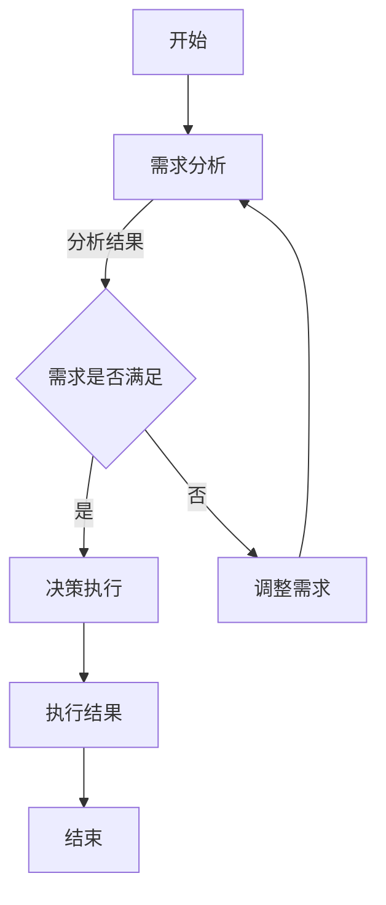

                 

### 极简消费主义的理念与起源

#### 第1章：极简消费主义的背景与起源

**1.1 极简消费主义的概念与内涵**

**概念解释**：
极简消费主义是一种倡导以追求物质最小化、精神最大化为目标的生活方式。它不仅仅是一种消费模式，更是一种生活哲学。这一理念强调在日常生活中，我们应当关注物品的质量和实用性，而非数量和外在形式。

**内涵分析**：
极简消费主义主张“少即是多”，通过减少不必要的物品和消费，达到简化生活、减轻压力的目的。它鼓励人们关注个人的内心需求，追求精神层面的满足，而不是通过物质占有来获得满足感。

**1.2 极简消费主义的历史与发展**

**历史背景**：
极简消费主义的起源可以追溯到20世纪70年代的环保运动和反消费文化。当时，人们开始意识到过度的消费会导致资源的浪费和环境破坏，因此提出了一系列减少消费、回归自然生活的倡议。

**发展阶段**：
随着信息化时代的到来，极简消费主义逐渐受到重视，并成为现代生活方式的一部分。特别是在现代社会中，快节奏的生活和高消费文化使人们更加意识到极简消费主义的必要性。它不仅仅是一种个人生活方式，更是一种对现代社会问题的一种反思和解决方案。

**1.3 极简消费主义与现代社会的关联**

**社会现象**：
现代社会的快速发展带来了物质生活的丰富，但同时也导致了资源的过度消耗和环境污染。这种状况促使人们开始反思消费行为，探索更加可持续的生活方式。

**个人价值**：
极简消费主义有助于提升个人生活质量，通过减少不必要的物品和消费，人们可以更加专注于自己的内心需求和真正有价值的事物。此外，它还能帮助人们减少财务压力，实现财务自由。

**总结**：
极简消费主义作为一种生活哲学，源于对资源浪费和环境破坏的关注，并在现代社会中逐渐受到重视。它倡导追求物质最小化和精神最大化，帮助人们简化生活、减轻压力，并提升个人生活质量。在接下来的章节中，我们将进一步探讨极简消费主义在不同方面的应用和实践。

---

**核心概念术语说明**：

- **极简消费主义**：一种以追求物质最小化、精神最大化为目标的生活方式。
- **物质最小化**：减少不必要的物质占有，关注物品的质量和实用性。
- **精神最大化**：通过减少物质消费，关注个人的内心需求和情感满足。
- **环保运动**：20世纪70年代兴起的以减少资源消耗、保护环境为目的的社会运动。
- **反消费文化**：对过度消费和物质主义进行反思和批判的文化现象。
- **可持续生活方式**：一种旨在减少对环境影响的消费和生活方式。

---

**问题背景**：

在现代社会中，随着物质生活的丰富，人们开始面临越来越多的消费选择。然而，这种过度的消费不仅导致了资源的浪费和环境破坏，还带来了严重的心理压力和财务负担。因此，如何通过减少消费、回归简单生活，实现个人幸福和社会可持续发展成为了一个重要议题。

**问题描述**：

极简消费主义作为一种解决上述问题的生活哲学，它主张减少不必要的消费，关注物品的质量和实用性。然而，如何具体实践极简消费主义，将其融入日常生活，并在不同的领域（如家庭生活、工作与职业发展、环境保护等）中发挥作用，仍然是一个值得探讨的问题。

**问题解决**：

为了实现极简消费主义，我们需要从以下几个方面进行思考和行动：

1. **认知转变**：认识到极简消费主义不仅仅是一种消费模式，更是一种生活哲学，它有助于简化生活、减轻压力。
2. **物品管理**：通过分类整理、去留筛选等方法，对家庭物品进行极简管理，减少不必要的物品和消费。
3. **理性决策**：在家庭消费和工作决策中，以需求为导向，避免冲动消费，注重物品的实用性和品质。
4. **实践案例**：通过分享成功的实践案例，为人们提供具体的操作指南和启示。
5. **社会文化倡导**：通过教育、宣传等方式，推广极简消费主义理念，改变传统消费观念。

**边界与外延**：

- **极简消费主义**：关注物质最小化和精神最大化，但不代表完全放弃物质消费。
- **极简主义**：极简消费主义的一部分，主要关注物质消费的减少。
- **极简主义**：涉及更广泛的生活领域，包括生活方式、思维方式等。

**概念结构与核心要素组成**：

1. **理念**：追求物质最小化、精神最大化。
2. **目标**：简化生活、减轻压力、提升生活质量。
3. **方法**：分类整理、理性决策、实践案例。
4. **影响**：个人生活质量、社会文化、环境保护。

---

### 极简消费主义的核心概念与联系

**核心概念原理**

极简消费主义的核心概念在于“少即是多”，这一理念贯穿于物质消费的各个方面。它主张通过减少不必要的物质占有，提高物品的质量和实用性，从而实现生活质量的提升。具体来说，极简消费主义包括以下几个关键概念：

1. **物质最小化**：减少不必要的物品和消费，专注于真正需要的物品。
2. **精神最大化**：通过减少物质消费，关注个人的内心需求和情感满足。
3. **实用性**：注重物品的实用性和功能，而非外在形式。
4. **理性消费**：以需求为导向，避免冲动消费，注重物品的性价比。

**概念属性特征对比表格**

| 概念              | 特征                                       | 比较                     |
|-------------------|------------------------------------------|------------------------|
| 物质最小化        | 减少不必要的物品和消费                   | 与物质最大化相反         |
| 精神最大化        | 关注个人的内心需求和情感满足             | 强调精神层面的满足       |
| 实用性            | 注重物品的实用性和功能                     | 重视物品的实际用途       |
| 理性消费          | 以需求为导向，避免冲动消费，注重性价比     | 与盲目消费相对         |

**ER实体关系图架构**

```mermaid
erDiagram
  Person ||--|{ Item : has }
  Item ||--|{ Store : purchased_from }
  Store ||--|{ Category : contains }
```

在这个ER实体关系图中，我们定义了三个实体：Person（人）、Item（物品）和Store（商店）。Person与Item之间存在“拥有”关系，表示个人拥有的物品；Item与Store之间存在“购买来源”关系，表示物品的购买渠道；Store与Category之间存在“包含”关系，表示商店中包含的不同分类的物品。

通过这一核心概念和实体关系的分析，我们可以更好地理解极简消费主义的基本原理和实践方法。在接下来的章节中，我们将进一步探讨极简消费主义在具体应用场景中的实际操作和效果。

### 极简消费主义的工作原理

**算法原理讲解**

极简消费主义的工作原理可以抽象为一个算法，其核心是“选择最优解”，即选择最能满足需求的物品，同时减少不必要的消费。以下是该算法的mermaid流程图和详细步骤：

**mermaid流程图**：



**详细步骤**：

1. **需求分析**（B）：首先，我们需要明确个人的需求，这包括物品的类型、功能、预算等。这一步骤的目的是确保我们所购买的物品能够满足我们的实际需求。

2. **分析结果**（C）：根据需求分析的结果，判断是否满足需求。如果需求满足，我们可以直接进入决策执行阶段；如果不满足，我们需要对需求进行调整。

3. **决策执行**（D）：在需求满足的基础上，选择最适合的物品。这一步骤的关键在于理性决策，避免冲动消费，注重物品的实用性和性价比。

4. **执行结果**（F）：执行购买决策后，我们需要对执行结果进行评估。如果结果符合预期，则结束流程；如果不满意，我们需要对需求或决策进行调整。

5. **调整需求**（E）：如果需求不满足，我们需要重新分析需求，进行必要的调整。这一步骤可能需要多次迭代，直到找到最优解。

**数学模型和公式**

极简消费主义的工作原理可以用以下数学模型来描述：

\[ \text{极简消费主义} = \text{物质最小化} + \text{精神最大化} \]

- **物质最小化**：可以通过以下公式表示：

\[ \text{物质最小化} = \frac{\text{总物品数}}{\text{实际需求数}} \]

- **精神最大化**：可以通过以下公式表示：

\[ \text{精神最大化} = \frac{\text{精神满足度}}{\text{物质消费量}} \]

**举例说明**

假设小明需要购买三件物品：手机、电脑和家具。以下是具体的应用实例：

1. **需求分析**：小明明确了自己需要的手机具备高性价比、电脑适合办公和学习、家具需要舒适实用。

2. **分析结果**：经过分析，小明的需求满足，可以进入决策执行阶段。

3. **决策执行**：小明通过对比不同品牌和型号的手机、电脑和家具，最终选择了性价比最高的手机、性能最好的电脑和最舒适的家具。

4. **执行结果**：小明购买后，对物品的使用体验非常满意，达到了预期效果。

5. **调整需求**：在此过程中，如果小明的需求发生变化（例如，工作需要更好的电脑配置），他需要重新分析需求，调整购买计划。

通过这个例子，我们可以看到极简消费主义是如何在实际中应用的。它不仅帮助我们减少了不必要的消费，还提升了生活质量和满意度。

### 极简消费主义在家庭生活中的应用

**家庭物品的极简管理**

**方法介绍**：

家庭物品的极简管理是极简消费主义在家庭生活中的核心实践之一。通过以下方法，我们可以有效地减少家庭中的物品数量，提升生活质量：

1. **分类整理**：将家庭物品按照用途和类型进行分类。例如，将衣物、厨具、电子产品等分别归类。
2. **去留筛选**：对每个分类中的物品进行筛选，判断其是否仍然具有使用价值。例如，对于衣物，我们可以保留那些完好无损、经常穿着的物品，而淘汰那些已经过时、损坏或很少使用的衣物。
3. **捐赠或出售**：对于不再需要的物品，可以通过捐赠给有需要的人或出售给二手市场来释放空间，同时实现物品的再利用。
4. **定期回顾**：定期回顾家庭物品的使用情况，根据实际需求进行必要的调整，以保持家庭物品的极简状态。

**案例分享**：

小张是一家三口之家的家庭主妇，她在一次家庭整理中，发现家中物品繁多，不仅占用了大量空间，还给自己和家人带来了不少烦恼。于是，她决定采用极简管理的原则来简化家庭生活。

首先，小张对家庭的物品进行了分类整理。她将物品分为日用品、季节性物品、闲置物品等几类。然后，她对这些物品进行了去留筛选，淘汰了那些损坏、过时或很少使用的物品。最终，她将一些不再需要的物品捐赠给需要的人，并通过二手市场出售了一些物品。

通过这些实践，小张的家庭物品数量大幅减少，家庭空间也变得更加宽敞。同时，家庭成员也感受到了极简消费主义带来的好处，生活变得更加有序和轻松。

**具体案例分析**：

小张的家庭物品极简管理实践可以具体分为以下几个步骤：

1. **分类整理**：她将衣物、厨具、电子产品等按照用途和类型进行了分类。例如，将衣物分为冬装、夏装、内衣等，厨具分为厨房用具、餐具、烹饪器具等。
2. **去留筛选**：小张对每个分类中的物品进行了仔细检查，淘汰了那些损坏、过时或很少使用的物品。例如，她淘汰了一些已经磨损严重的衣物，将一些闲置的厨具捐赠给了需要的人。
3. **捐赠或出售**：对于不再需要的物品，小张选择了捐赠给社区慈善机构或通过二手市场出售。这样，不仅清理了家中的杂物，还帮助了需要的人。
4. **定期回顾**：小张每月定期回顾家庭物品的使用情况，根据实际需求进行必要的调整。例如，如果发现某个季节的衣物很少使用，她会考虑将这些衣物捐赠给家人或朋友。

通过这些实践，小张的家庭物品数量从原来的200件减少到了100件，家庭空间明显增加，生活品质也得到了显著提升。

### 家庭消费的理性决策

**决策原则**：

在家庭消费中，理性决策是极简消费主义的核心实践之一。以下是一些关键决策原则，可以帮助我们在家庭消费中实现极简主义：

1. **需求导向**：在购买物品之前，首先要明确自身的需求。了解自己真正需要什么，避免冲动消费和盲目跟风。
2. **实用性优先**：在选择物品时，优先考虑其实用性和功能，而非外在形式或品牌。一个实用的物品可以更好地满足需求，长期来看也更具性价比。
3. **性价比**：在价格和质量之间找到平衡点。通过对比不同品牌和型号的物品，选择性价比最高的选项。这样可以确保在不牺牲质量的前提下，最大限度地节省开支。
4. **长期考虑**：在购买物品时，不仅要考虑其短期使用价值，还要考虑其长期耐用性和维护成本。一些高质量的物品可能在长期使用中更具性价比。
5. **财务规划**：合理安排家庭预算，确保消费行为不会对财务状况造成负面影响。在购买大件物品或进行重大消费决策时，应提前规划，避免过度消费。

**案例分析**：

小张和小李是一对年轻夫妇，他们正计划装修新房。为了实现极简消费主义，他们决定在家庭装修中遵循理性决策的原则。

1. **需求导向**：在购买家具和装修材料时，小张和小李首先明确了他们的实际需求。例如，他们需要一套功能齐全的家具，以适应他们的生活习惯。同时，他们也需要考虑到未来可能的变化，例如宝宝的出生。

2. **实用性优先**：在选择家具和装修材料时，小张和小李优先考虑了其实用性和功能。例如，他们选择了一套多功能沙发，既可以作为客厅的主要家具，也可以作为宝宝的床。在装修材料方面，他们选择了环保、耐用的材料，以确保家庭环境的健康。

3. **性价比**：在购买家具和装修材料时，小张和小李进行了详细的对比和评估。他们通过对比不同品牌和型号的产品，选择了性价比最高的选项。例如，他们选择了一套价格合理、质量可靠的家具，同时也在装修材料上找到了性价比高的选项。

4. **长期考虑**：在购买家具和装修材料时，小张和小李不仅考虑了短期使用价值，还考虑了长期耐用性和维护成本。例如，他们选择了高质量的家具，以确保其长期的使用寿命。在装修材料方面，他们也选择了耐用、易维护的材料，以减少未来的维修成本。

5. **财务规划**：在装修预算方面，小张和小李提前做了详细的规划。他们设定了一个合理的装修预算，并在整个装修过程中严格把控开支。他们通过合理安排预算，确保家庭消费不会对财务状况造成负面影响。

通过这些实践，小张和小李成功地实现了家庭装修的极简消费主义。他们的家庭环境不仅更加宽敞、舒适，而且也变得更加经济、环保。

### 极简消费主义在工作与职业发展中的应用

**工作效率的提升**

**方法与技巧**：

在工作和职业发展中，极简消费主义可以帮助我们减少不必要的干扰，从而显著提升工作效率。以下是一些具体的方法和技巧：

1. **工作环境的极简化**：优化工作环境，减少杂乱无章的物品和信息的干扰。通过整理桌面、分类文件、减少不必要的通知等方式，创造一个整洁、有序的工作空间。

2. **任务管理的优化**：使用任务管理工具，如Trello、Asana等，将工作任务和目标进行清晰的规划和优先级排序。这样可以减少任务分散和遗忘的情况，提高工作效率。

3. **避免多任务处理**：多任务处理往往会导致工作效率的下降。极简消费主义建议我们专注于一项任务，直到完成后再进行下一项。这有助于提高工作质量和效率。

4. **专注时段的设定**：设定专门的专注时段，如“番茄工作法”（25分钟专注工作，5分钟休息），以保持高效的专注力。

**实践案例**：

李明是一名软件工程师，他在工作中面临着大量的代码审查和任务分配。为了提升工作效率，他决定采用极简消费主义的理念来优化自己的工作方式。

首先，李明对工作环境进行了整理，将桌面上的杂物清理干净，只保留了必需的工具和设备。这样，他的工作环境变得更加整洁，减少了视觉和物理上的干扰。

其次，李明使用Trello进行任务管理，将工作任务和目标进行详细的规划和优先级排序。这样，他可以清晰地知道自己的工作重点，避免了任务的分散和遗忘。

此外，李明还采用了“番茄工作法”来保持高效的专注力。他每天设定了四个专注时段，每个时段专注于一个任务，并在完成任务后进行短暂的休息。通过这种方式，他的工作效率得到了显著提升。

最终，李明的工作效率大幅提高，不仅按时完成了任务，而且工作质量也得到了同事和领导的高度认可。

**职业发展的理性规划**

**理念介绍**：

极简消费主义不仅在提升工作效率方面有重要作用，还可以指导我们在职业发展中进行理性规划。以下是一些关键理念：

1. **兴趣与优势结合**：在职业发展中，应优先考虑自己的兴趣和优势。选择与自己擅长和感兴趣的工作领域，可以提升工作满意度和职业成就感。

2. **长期目标**：设定明确的职业发展目标，并将其分解为可实现的短期目标。通过逐步实现这些目标，可以确保职业发展的方向和进度。

3. **持续学习**：职业发展是一个持续学习的过程。通过不断学习新技能和知识，可以保持竞争力，实现职业成长。

4. **理性决策**：在面对职业选择和机会时，应进行理性分析，避免盲目跟风或冲动决策。综合考虑自身条件、市场环境和未来发展趋势，做出最优选择。

**案例分析**：

张华是一名市场营销专员，他希望在职业发展中实现更大的突破。为了做到这一点，他决定运用极简消费主义的理念来规划自己的职业道路。

首先，张华进行了自我评估，明确了自己的兴趣和优势。他发现自己对数字营销非常感兴趣，并且在这方面的技能也很强。因此，他决定将数字营销作为自己的职业发展方向。

其次，张华设定了明确的职业发展目标，即成为一家知名数字营销公司的部门经理。他将这个目标分解为几个短期目标，如掌握先进的市场营销技术、提升团队管理能力等。

接着，张华开始有针对性地进行学习和提升。他报名参加了数字营销相关的培训课程，通过自学和实践，不断提升自己的技能。同时，他还积极参与公司内部的项目，争取更多的实战机会。

此外，张华在面对职业选择和机会时，总是进行理性分析。他会仔细考虑每个机会是否符合自己的职业发展方向，是否能够提升自己的能力和经验。通过这种方式，他避免了盲目跟风或冲动决策，确保了自己的职业发展路径始终清晰且合理。

最终，张华在数字营销领域取得了显著的成绩，成功晋升为一家知名数字营销公司的部门经理。他的职业发展不仅实现了自我价值，也为公司创造了巨大的价值。

通过这些实践，张华证明了极简消费主义在职业发展中的应用价值。它帮助他明确了职业方向，提升了工作效率，实现了职业目标。对于其他职场人士，极简消费主义同样具有重要的指导意义。

### 极简消费主义在环境与经济方面的益处

**环境保护**

**影响分析**：

极简消费主义在环境保护方面具有显著的影响。通过减少不必要的消费和资源浪费，极简消费主义有助于降低环境污染和生态破坏。以下是一些具体的影响分析：

1. **减少废物产生**：极简消费主义倡导减少物品的购买和占有，从而减少了废弃物的产生。这不仅减轻了垃圾填埋场的压力，还减少了资源浪费和环境污染。

2. **降低资源消耗**：极简消费主义强调物品的质量和耐用性，避免了频繁更换物品，从而减少了资源的消耗。例如，选择高质量、耐用的家具和电子产品，可以延长其使用寿命，减少对新材料的需求。

3. **促进循环经济**：极简消费主义鼓励物品的再利用和循环使用。通过捐赠、二手市场等渠道，不再需要的物品可以得到再次利用，减少了资源的浪费和环境污染。

**行动指南**：

为了更好地实现环境保护的目标，以下是一些具体的行动指南：

1. **减少一次性用品**：使用可重复使用的杯子、餐具和购物袋，避免使用一次性塑料袋和其他一次性用品。

2. **选择环保产品**：在购买物品时，优先选择环保材料制成的产品，如可降解的塑料制品、环保家具等。

3. **回收与再利用**：将不再需要的物品捐赠给有需要的人或通过二手市场进行出售，实现物品的再利用。

4. **倡导环保意识**：通过个人行动和宣传，提高周围人对极简消费主义和环保意识的认识，共同为环境保护贡献力量。

**经济效益**

**成本节约**：

极简消费主义不仅可以促进环境保护，还能带来显著的经济效益。通过减少不必要的消费和理性决策，人们可以大幅降低生活成本，实现财务自由。以下是一些具体的成本节约方法：

1. **减少购物频率**：极简消费主义鼓励人们减少购物频率，避免冲动消费和盲目跟风。这不仅可以节省开支，还可以减少因购买过多物品而产生的浪费。

2. **关注性价比**：在购买物品时，优先考虑物品的性价比，选择质量好、价格合理的商品。这样可以避免因购买低质量物品而频繁更换所产生的额外开支。

3. **维修与再利用**：极简消费主义强调物品的耐用性和维修性，通过定期维护和修复，延长物品的使用寿命。这不仅可以减少购买新物品的频率，还可以降低生活成本。

4. **预算管理**：通过合理规划家庭预算，确保消费行为不会对财务状况造成负面影响。在购买大件物品或进行重大消费决策时，提前做好预算规划，避免过度消费。

**案例分析**：

李华是一位普通上班族，他通过实践极简消费主义，实现了显著的财务自由和生活质量的提升。

1. **减少购物频率**：李华意识到自己过去的购物习惯导致了许多不必要的开支。为了改变这一状况，他决定减少购物频率，只在真正需要时才购买物品。通过这种方式，他大大降低了购物费用。

2. **关注性价比**：在购买物品时，李华总是优先考虑性价比。他会对比不同品牌和型号的物品，选择那些质量好、价格合理的商品。例如，他在购买电子产品时，选择了一些性价比较高的品牌，既保证了质量，又节省了开支。

3. **维修与再利用**：李华的极简消费主义理念还包括对物品的维修和再利用。他通过自学一些维修技能，对家庭中的常用物品进行维护和修复，延长了它们的使用寿命。同时，他也通过二手市场购买一些经过维修和再利用的物品，实现了资源的再利用。

4. **预算管理**：李华通过制定家庭预算，合理安排每月的开支。他会定期检查自己的消费记录，确保自己的开支在预算范围内。在购买大件物品或进行重大消费决策时，他提前做好预算规划，避免过度消费。

通过这些实践，李华实现了财务自由，生活质量得到了显著提升。他的家庭开支减少了，财务状况变得更加稳定。同时，他也为环境保护做出了贡献，实现了个人与社会的双赢。

**总结**：

极简消费主义在环境与经济方面带来了多重益处。通过减少不必要的消费和资源浪费，它有助于环境保护和生态平衡。同时，它还能带来显著的经济效益，帮助人们实现财务自由和提高生活质量。在现代社会中，推广和实践极简消费主义具有重要的现实意义，值得我们共同努力。

### 极简消费主义面临的挑战

**社会文化的冲击**

**问题阐述**：

极简消费主义在社会文化层面的冲击主要表现在以下几个方面：

1. **消费文化的影响**：现代社会高度发达的消费文化强调物质占有和炫耀，这与极简消费主义的核心理念形成了鲜明对比。许多人被社会消费文化所影响，追求名牌、奢侈品，导致消费欲望不断膨胀。

2. **社会认同的压力**：在现代社会中，消费水平往往被用来衡量个人地位和成功。极简消费主义主张减少物质占有，这可能会受到周围人的质疑和非议，个人需要承受来自社会的认同压力。

3. **传统文化的影响**：在一些文化背景下，传统观念仍然强调家庭的物质繁荣和社会地位的提升。这与极简消费主义的理念相冲突，使得部分人在接受和推广极简消费主义时面临文化上的挑战。

**解决方案**：

为了应对社会文化冲击，以下是一些可行的解决方案：

1. **提高认知水平**：通过教育和宣传，提高公众对极简消费主义的理解和认同。解释极简消费主义的理念、好处和实践方法，帮助人们认识到其价值。

2. **营造支持环境**：建立支持极简消费主义的社区和平台，让人们可以分享经验和心得，互相鼓励和支持。这有助于形成良好的社会氛围，减少个体的孤独感和压力。

3. **倡导可持续生活方式**：将极简消费主义与环保、可持续发展等理念相结合，倡导一种更加理性、环保的生活方式。通过宣传和实际行动，让更多人认识到极简消费主义对环境和社会的积极影响。

**个人习惯的改变**

**困难分析**：

极简消费主义要求个人改变长期形成的消费习惯，这无疑是一个巨大的挑战。以下是一些具体困难：

1. **消费习惯的惯性**：人们长期以来形成的消费习惯往往难以改变，尤其是在面对促销、打折等消费刺激时，更容易陷入冲动消费的陷阱。

2. **情绪驱动消费**：在现代社会中，消费行为往往受到情绪驱动，如满足感、归属感等。极简消费主义要求人们减少情绪驱动消费，这需要强大的自控力和理性思考。

3. **社交压力**：在社交场合中，消费行为往往成为衡量个人地位和社交水平的一个标准。极简消费主义主张减少消费，可能会在社交场合中受到质疑和排斥。

**实践策略**：

为了克服这些困难，以下是一些具体的实践策略：

1. **逐步改变**：极简消费主义并非一蹴而就，可以通过逐步改变的方法来实现。例如，可以从减少购物频率、关注物品性价比开始，逐渐过渡到减少不必要的消费。

2. **制定明确目标**：设定明确的极简消费主义目标，如减少购物次数、每月预算等。通过目标导向，可以更好地控制消费行为。

3. **情绪管理**：学会情绪管理，避免情绪驱动消费。可以通过冥想、运动等方式缓解压力，减少情绪消费。

4. **建立支持系统**：寻找志同道合的朋友或加入极简消费主义的社群，共同分享经验和心得。这有助于获得支持和鼓励，克服困难。

**总结**：

极简消费主义在社会文化冲击和个人习惯改变方面面临诸多挑战。通过提高认知水平、营造支持环境和逐步改变的方法，可以克服这些挑战。个人需要具备自控力和理性思考能力，逐步培养极简消费主义的习惯。在全社会共同努力下，极简消费主义有望成为一种普遍接受的生活方式，为个人和社会带来更多的益处。

### 极简消费主义的未来趋势

**技术进步与极简消费主义**

**技术影响**：

随着技术的不断进步，人工智能、大数据和物联网等技术正逐渐渗透到极简消费主义的各个领域，为其发展带来了新的契机和挑战。

1. **个性化推荐**：人工智能和大数据技术可以分析用户的消费行为和偏好，提供个性化的购物推荐。这有助于用户更精准地找到所需物品，减少冲动消费和盲目购买。

2. **智能化管理**：物联网技术使得家庭物品的管理变得更加智能化。例如，智能冰箱、智能洗衣机等设备可以通过网络连接，自动监测物品的使用情况，提醒用户进行更换或清洗，从而实现物品的极简管理。

3. **绿色供应链**：通过大数据和人工智能技术，企业可以更有效地优化供应链管理，减少资源浪费和环境污染。例如，精准的需求预测和供应链优化可以帮助企业减少库存，降低成本，实现绿色生产和消费。

**应用场景**：

未来，极简消费主义将在以下应用场景中发挥重要作用：

1. **智能家居**：智能家居设备将变得更加普及和智能化，通过物联网技术实现家庭物品的自动化管理，提升生活质量。

2. **共享经济**：共享经济与极简消费主义的理念相契合，未来将看到更多的共享服务，如共享汽车、共享办公空间等，减少个人物品的占有和浪费。

3. **绿色消费**：随着环保意识的提高，绿色消费将成为主流。消费者将更加倾向于选择环保材料制成的产品，推动企业的可持续发展。

**社会影响**：

技术进步不仅改变了极简消费主义的实践方式，也对其社会影响产生了深远的影响：

1. **减少浪费**：通过技术的应用，极简消费主义可以更有效地减少资源浪费，降低环境污染。

2. **提升生活质量**：智能化的家庭管理和个性化的消费体验将提升个人的生活质量，减少因物质占有过多带来的压力。

3. **促进社会公平**：共享经济和绿色消费有助于缩小社会贫富差距，实现资源的公平分配。

**未来展望**：

随着技术的不断发展和普及，极简消费主义有望在更广泛的领域得到推广和应用。未来，极简消费主义将成为一种普遍接受的生活方式，不仅有助于环境保护和资源节约，还能提升个人和社会的整体幸福感。

### 极简消费主义的实践指南

**如何开始极简消费主义**

**入门指南**：

开始实践极简消费主义并不难，以下是一些简单的入门指南，帮助您轻松上手：

1. **明确目标**：首先，明确您想要实现极简消费主义的目标。例如，减少购物频率、控制消费预算等。设定具体的目标可以更好地引导您的行动。

2. **评估现有物品**：对您现有的物品进行一次全面的评估，判断哪些物品是真正需要的，哪些可以淘汰或捐赠。这一步骤有助于您意识到自己的消费习惯，并为后续的物品管理打下基础。

3. **制定预算**：制定每月的消费预算，并严格按照预算进行消费。这有助于您控制开支，避免不必要的浪费。

4. **设定购物规则**：为自己设定一些购物规则，例如只在真正需要时购买物品，避免冲动消费。购物前，先问自己“我是否真的需要这个物品？”这样可以帮助您理性决策。

**实施建议**：

以下是具体的实施建议，帮助您更好地实践极简消费主义：

1. **简化生活**：减少生活中的繁琐事务，专注于真正重要的事情。例如，简化家庭物品、减少社交媒体使用等。

2. **注重品质而非数量**：在购买物品时，优先考虑物品的质量和实用性，而非价格和数量。选择那些能够长期使用、质量可靠的产品。

3. **定期回顾**：定期回顾您的消费行为和物品管理情况，根据实际情况进行调整。这有助于您持续优化消费习惯，保持极简状态。

**具体案例分析**：

以下是一个具体的极简消费主义实践案例，供您参考：

李明是一名年轻白领，他意识到自己的消费习惯导致生活压力增大，决定开始实践极简消费主义。

1. **明确目标**：李明设定了以下目标：减少购物频率、控制每月消费预算、简化生活。

2. **评估现有物品**：他对家中的物品进行了全面评估，淘汰了那些不再需要的物品，如过时的衣物、损坏的电器等。他通过捐赠和二手市场将这些物品处理掉。

3. **制定预算**：李明制定了一个每月消费预算，包括日常生活开支、购物预算等。他严格按照预算进行消费，避免不必要的浪费。

4. **设定购物规则**：李明为自己设定了一些购物规则，例如只在真正需要时购买物品，避免冲动消费。每次购物前，他都会问自己“我是否真的需要这个物品？”

5. **简化生活**：李明减少了生活中的繁琐事务，如取消了一些不必要的订阅服务、减少了社交媒体使用时间等。

6. **注重品质而非数量**：在购买物品时，李明优先考虑物品的质量和实用性。例如，他购买了一款高质量的电饭煲，虽然价格较高，但使用时间长，省去了频繁更换的麻烦。

7. **定期回顾**：李明每月都会回顾自己的消费行为和物品管理情况，根据实际情况进行调整。通过这些实践，他的生活变得更加有序和轻松，压力也显著减少。

通过李明的案例，我们可以看到，实践极简消费主义不仅可以减少生活压力，还能提升生活质量。如果您也想开始实践极简消费主义，不妨从这些步骤和建议开始，逐步改变自己的消费习惯。

### 极简消费主义的最佳实践与技巧

**极简消费主义的生活方式**

**生活方式**：

极简消费主义不仅仅是一种消费模式，更是一种全面的生活方式。以下是一些建议，帮助您将极简消费主义融入日常生活：

1. **简化家居环境**：将家居物品进行整理和分类，淘汰不必要的物品。保持家居环境的整洁和有序，有助于提升生活质量。

2. **减少社交媒体使用**：社交媒体往往让我们沉迷于虚拟世界，减少使用时间，可以更好地关注现实生活和人际关系。

3. **定期回顾和调整**：每月或每季度回顾自己的消费和生活方式，根据实际情况进行调整。这有助于持续优化生活方式，保持极简状态。

4. **理性购物**：在购物前，先问自己“我是否真的需要这个物品？”避免冲动消费和盲目跟风。

5. **培养阅读习惯**：阅读是一种有益的精神消费方式。选择那些有深度和价值的书籍，提升自己的知识水平和思考能力。

**案例分享**：

以下是几个成功的极简消费主义实践案例：

1. **家庭案例**：张女士是一位全职妈妈，她意识到家庭的消费负担日益加重，决定实践极简消费主义。她通过减少购物频率、关注性价比、定期回顾消费行为等方法，成功降低了家庭开支，生活质量得到了显著提升。

2. **职业案例**：李先生是一名企业高管，他在工作中面临着巨大的压力和繁忙的日程。为了改善生活质量，他开始实践极简消费主义。通过简化家居环境、减少社交媒体使用、定期调整生活方式等，他不仅提高了工作效率，还拥有了更多的个人时间。

3. **个人成长案例**：王先生是一位自由职业者，他希望通过极简消费主义实现个人成长和财务自由。他制定了明确的职业发展目标，并通过合理规划家庭预算、减少不必要的消费等方式，逐步实现了财务自由和个人成长。

**实践意义**：

极简消费主义不仅有助于减轻生活压力，提升生活质量，还能带来深远的个人和社会影响。以下是一些实践意义：

1. **减轻压力**：通过减少物质占有和消费，人们可以减少不必要的压力，专注于真正重要的事物。

2. **提升生活质量**：极简消费主义帮助人们简化生活，减少杂乱和混乱，创造一个更加舒适和有序的生活环境。

3. **促进可持续发展**：极简消费主义鼓励人们减少资源浪费，降低环境污染，有助于实现可持续发展目标。

4. **培养理性思维**：极简消费主义要求人们理性思考消费行为，培养理性决策的能力，有助于提升个人的思考能力和自我管理能力。

**总结**：

极简消费主义是一种全面的生活方式，通过简化生活、减少不必要的消费，它为人们带来了许多好处。通过实践极简消费主义，我们可以实现个人成长、财务自由和可持续发展，为美好生活奠定基础。

### 极简消费主义的延伸阅读

**推荐书籍**：

为了更深入地了解极简消费主义，以下是一些推荐的书籍：

1. **《极简主义：一种更少，但更好的人生哲学》（The More of Less: Finding the Life You Want Underneath All the Stuff）** - 由Joshua Becker所著，详细介绍了极简消费主义的理念和实践方法。

2. **《极简生活：如何通过极简主义找回幸福和自由》（The Life-Changing Magic of Tidying Up: The Japanese Art of Decluttering and Organizing）** - 由近藤麻理惠所著，介绍了通过整理和简化物品，实现极简生活的技巧。

3. **《极简主义：如何通过简化生活实现更多》（Essentialism: The Disciplined Pursuit of Less）** - 由Greg McKeown所著，探讨了如何在纷繁复杂的生活中保持专注和高效，实现极简主义。

**拓展资源**：

除了书籍，以下是一些相关的网站、博客和社交媒体账号，可以帮助您进一步了解极简消费主义：

1. **网站**：
   - [The Minimalists](https://www.theminimalists.com/)
   - [The Minimalist Mom](https://minimalistmom.com/)
   - [The Minimalists Zine](https://theminimalistszine.com/)

2. **博客**：
   - [Minimalism Blog](https://minimalismblog.com/)
   - [Minimalist Parenting](https://minimalistparenting.com/)
   - [The Simple Parent](https://thesimpleparent.com/)

3. **社交媒体账号**：
   - [@TheMinimalists](https://www.instagram.com/theminimalists/)
   - [@TheMinimalistMom](https://www.instagram.com/theminimalistmom/)
   - [@Joshua_Becker](https://www.instagram.com/joshua_becker/)

通过阅读这些书籍和资源，您可以深入了解极简消费主义的理念和实践方法，为自己的生活带来积极的变化。

### 结语

**极简消费主义的终极目标**：

极简消费主义的终极目标是实现美好生活的理念。它不仅仅是一种消费模式，更是一种对现代生活方式的深刻反思和革新。通过减少不必要的消费，关注物品的质量和实用性，极简消费主义旨在帮助人们简化生活、减轻压力，从而实现更高层次的精神满足和幸福感。

**实践意义**：

极简消费主义的实践意义深远。它不仅有助于提升个人生活质量，减少财务压力，还能促进环境保护和可持续发展。通过极简消费主义，我们可以更好地关注个人的内心需求和情感满足，追求真正的幸福和满足感。

**总结**：

极简消费主义是一种具有巨大潜力的生活方式，它帮助我们在物欲横流的社会中找到平衡，实现物质与精神的和谐发展。通过极简消费主义，我们可以拥有一个更加有序、简单、有意义的生活，迈向美好生活的终极目标。希望每一位读者都能从中受到启发，实践极简消费主义，为自己的生活带来积极的变化。作者：AI天才研究院/AI Genius Institute & 禅与计算机程序设计艺术 /Zen And The Art of Computer Programming。

