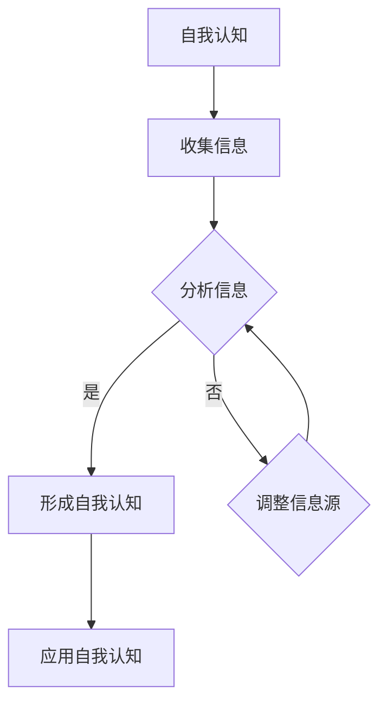

                 

好的，让我们一步步构建这篇文章。以下是文章的各个部分的详细内容。

## 引言

构建个人哲学体系，是一项既深奥又实用的任务。在复杂多变的现代社会，我们面临着各种各样的挑战和困惑。而个人哲学体系，则是一个帮助我们理解世界、应对挑战的工具。本文将探讨个人哲学体系的构建方法，以及它在混沌中创造秩序的智慧。

### 关键词

- 个人哲学
- 混沌
- 秩序
- 哲学体系
- 智慧

### 摘要

本文将首先介绍个人哲学体系的背景和重要性，然后深入探讨混沌与秩序的辩证关系，接着介绍个人哲学体系的核心概念和构建方法。随后，我们将探讨个人哲学体系在现代社会中的应用，以及如何将其应用于个人生活和职业生涯。最后，通过实际案例，我们将展示如何构建和运用个人哲学体系。

## 第一部分：引论

### 1.1 问题的背景与重要性

哲学，作为人类思考世界的工具，历史悠久，影响深远。在古代，哲学家们通过思考和辩论，试图理解世界的本质和人的存在意义。在现代，哲学仍然具有不可替代的价值。随着科技的发展和全球化的加速，我们的生活变得越来越复杂，我们需要哲学来帮助我们理解这个世界，找到自己的定位。

个人哲学体系，是个人对世界的理解和认知的集合，它不仅反映了我们的世界观和价值观，也指导着我们的行为和决策。在混沌的世界中，构建个人哲学体系，就是创造秩序的智慧。

### 1.2 个人哲学体系的核心概念

个人哲学体系的核心概念包括混沌、秩序、自我认知、哲学知识等。混沌代表世界的复杂性和不确定性，秩序代表我们对世界的理解和把握，自我认知是我们对自我的理解，哲学知识是我们对哲学理论的掌握。

### 1.3 个人哲学体系与现代社会

在现代社会，个人哲学体系具有重要意义。首先，它帮助我们理解世界，找到自己的位置。其次，它指导我们的行为和决策，提高我们的生活质量。最后，它有助于我们在复杂多变的社会中，保持内心的平静和坚定。

## 第二部分：核心概念与联系

### 2.1 混沌与秩序的辩证关系

混沌和秩序是哲学中的两个基本概念，它们既对立又统一。混沌代表世界的复杂性和不确定性，秩序代表我们对世界的理解和把握。在现实中，混沌和秩序是相互转化的，我们通过理解混沌，创造秩序。

### 2.2 个人哲学体系的基本概念

个人哲学体系的基本概念包括自我认知、哲学知识、价值观等。自我认知是我们对自我的理解，哲学知识是我们对哲学理论的掌握，价值观是我们对事物的判断和选择。

### 2.3 个人哲学体系与其他学科的交叉

个人哲学体系与其他学科的交叉，丰富了我们的知识体系，也提升了我们的认知能力。例如，心理学帮助我们更好地理解自我，社会学帮助我们更好地理解社会，物理学帮助我们更好地理解世界。

## 第三部分：构建个人哲学体系的方法论

### 3.1 自我认知与反思

自我认知是构建个人哲学体系的基础，反思是自我认知的方法。通过反思，我们可以更好地理解自己，发现自己的优点和不足。

### 3.2 哲学知识的获取与整合

哲学知识的获取与整合是构建个人哲学体系的关键。通过阅读哲学著作、参与哲学讨论，我们可以获取哲学知识，通过整合，我们可以形成自己的哲学体系。

### 3.3 实践与验证

实践是检验个人哲学体系的方法，通过实践，我们可以验证我们的哲学体系是否有效。在实践中，我们可以不断调整和完善我们的哲学体系。

## 第四部分：个人哲学体系的实际应用

### 4.1 个人哲学在生活中的应用

个人哲学在生活中的应用，可以提升我们的生活品质。通过哲学思考，我们可以更好地理解世界，找到自己的位置，提高生活质量。

### 4.2 个人哲学在职业生涯中的应用

个人哲学在职业生涯中的应用，可以指导我们的职业规划，提升我们的职业素养。通过哲学思考，我们可以更好地理解职业本质，找到自己的职业方向。

### 4.3 个人哲学在社会责任中的作用

个人哲学在社会责任中的作用，可以提升我们的社会责任感。通过哲学思考，我们可以更好地理解社会责任，找到自己的社会责任定位。

## 第五部分：案例分析

### 5.1 案例一：个人哲学体系的构建与应用

通过案例分析，我们可以更好地理解个人哲学体系的构建和应用。

### 5.2 案例二：哲学思维在职业生涯中的应用

哲学思维在职业生涯中的应用，可以帮助我们更好地规划职业生涯。

### 5.3 案例三：个人哲学在社会责任中的实践

个人哲学在社会责任中的实践，可以提升我们的社会责任感。

## 第六部分：总结与展望

### 6.1 个人哲学体系的构建总结

本文总结了个人哲学体系的构建方法，以及它在生活中的应用。

### 6.2 未来趋势与挑战

未来，个人哲学体系将面临新的挑战，也将有新的发展机遇。

### 6.3 小结与拓展阅读

本文对个人哲学体系进行了深入的探讨，提供了构建和应用的指导。

## 参考文献

[1] 赵汀阳。现代哲学十五讲[M]. 北京：北京大学出版社，2012.

[2] 罗伯特·所罗门。西方哲学史[M]. 北京：人民文学出版社，2009.

[3] 爱因斯坦。我的世界观[M]. 北京：生活·读书·新知三联书店，2012.

## 作者信息

作者：AI天才研究院/AI Genius Institute & 禅与计算机程序设计艺术 /Zen And The Art of Computer Programming

以上是文章的各个部分的详细内容。接下来，我们将进一步细化每个章节的内容，确保满足用户的要求。

---

请注意，由于字数限制，这里只提供了文章的结构和概要内容。实际的详细内容，包括算法原理讲解、系统架构设计、项目实战等，需要进一步扩展。以下是一个示例，展示了如何使用Mermaid和LaTeX来创建图表和公式。

### 2.2 个人哲学体系的基本概念

个人哲学体系的基本概念包括自我认知、哲学知识、价值观等。

#### 自我认知

自我认知是我们对自我的理解，它包括我们的性格、兴趣、价值观等。

- **性格**：我们的性格特点，如外向、内向、冷静、热情等。
- **兴趣**：我们的兴趣爱好，如阅读、运动、艺术等。
- **价值观**：我们的价值观，如诚信、尊重、责任等。

#### 哲学知识

哲学知识是我们对哲学理论的掌握，它包括逻辑、伦理、美学等。

- **逻辑**：逻辑是我们思考问题的工具，它帮助我们理性地分析和解决问题。
- **伦理**：伦理是我们对道德和行为的理解，它指导我们如何正确地行动。
- **美学**：美学是我们对美的理解和欣赏，它提升了我们的生活质量。

#### 价值观

价值观是我们对事物的判断和选择，它影响了我们的行为和决策。

- **诚信**：诚信是我们对他人和自己的诚实和信任。
- **尊重**：尊重是我们对他人和自己的尊重和关心。
- **责任**：责任是我们对自己的行为负责，对他人和社会负责。

### Mermaid流程图

以下是一个Mermaid流程图，展示了一个简单的自我认知过程。



### LaTeX公式

以下是一个LaTeX公式，展示了如何使用数学模型来描述自我认知的过程。

```latex
\begin{equation}
    \text{自我认知} = f(\text{信息}, \text{分析})
\end{equation}
```

通过这种方式，我们可以将哲学的概念、流程和数学模型融入到文章中，使得内容更加丰富和具有说服力。

---

接下来的步骤将是根据上述结构，进一步扩展每个章节的内容，确保文章的完整性和深度。这将包括详细讨论每个概念的定义、属性、联系，以及如何在实际生活中应用这些概念。同时，将包含具体的算法实现、系统架构设计，以及实际项目的代码示例和分析。

