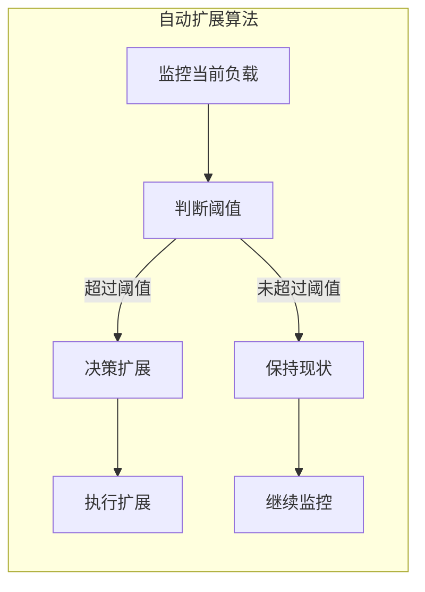
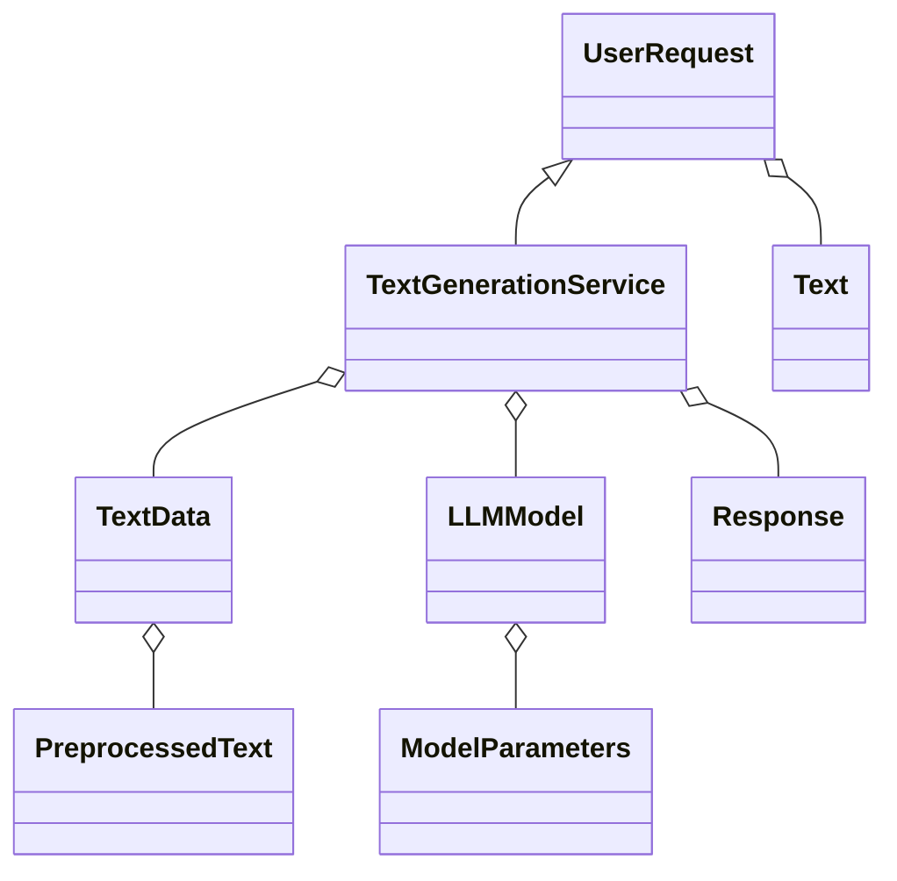
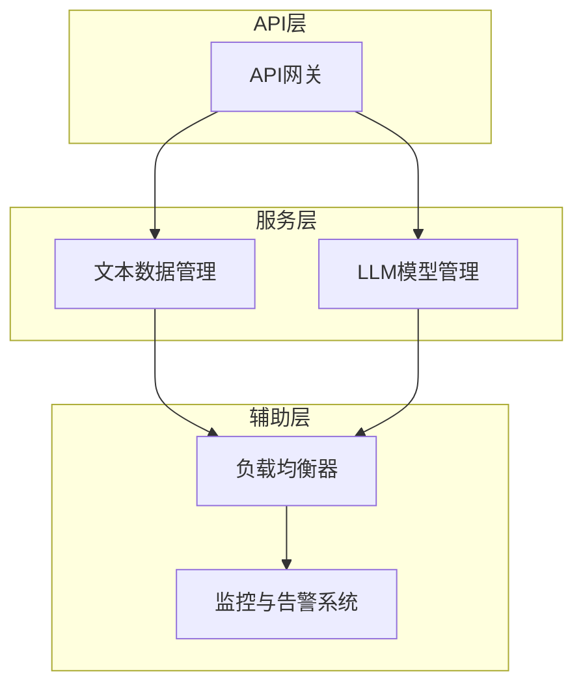

                 

### 引言：LLM应用基础设施的重要性

#### 1.1 问题背景

##### 1.1.1 LLM的发展现状

近年来，随着深度学习技术的不断进步，大型语言模型（LLM）的发展迅速，如Google的BERT、OpenAI的GPT系列模型等。这些模型在自然语言处理（NLP）任务中表现出色，从文本生成、机器翻译到问答系统，应用场景日益广泛。然而，随着模型规模不断扩大，其计算和存储需求也呈现指数级增长，传统的单机或小型集群系统已经难以满足需求。

##### 1.1.2 LLM应用面临的挑战

1. **计算资源需求**：大规模的LLM训练和推理需要大量的计算资源，传统计算架构可能无法提供足够的处理能力。
2. **数据存储需求**：大型语言模型需要处理和存储海量的训练数据，对存储系统提出了更高的要求。
3. **系统弹性与可伸缩性**：在实际应用中，LLM系统需要具备高可用性和弹性，能够应对突发流量和系统故障。
4. **安全性**：随着数据量和用户量的增加，保障数据安全和隐私成为一大挑战。

##### 1.1.3 构建弹性可伸缩基础设施的必要性

构建一个弹性可伸缩的LLM应用基础设施，能够解决上述挑战，提升系统性能和可靠性。具体来说，弹性设计使得系统能够动态调整资源，以应对不同负载；可伸缩性设计则确保系统能够随着需求增长而扩展。通过构建这样的基础设施，我们可以：

1. **提高系统性能**：通过分布式计算和存储，提升数据处理速度和模型推理效率。
2. **确保高可用性**：通过冗余设计和故障恢复机制，保障系统稳定运行。
3. **降低运维成本**：通过自动化管理和优化，降低运维复杂度和成本。
4. **增强安全性**：通过多层次的安全策略，保障数据和用户隐私。

#### 1.2 本书结构概述

##### 1.2.1 目录大纲介绍

本书分为八个主要部分：

1. 引言：介绍LLM应用基础设施的重要性。
2. LLM应用基础设施概述：定义、组成部分、关键特性。
3. 弹性设计原则：介绍实现弹性系统的方法和策略。
4. 可伸缩性设计原则：介绍如何设计可伸缩系统。
5. 实现细节：详细讨论各个组件的实现细节。
6. 系统部署与优化：介绍部署流程和优化技巧。
7. 案例研究：分析实际应用中的成功案例。
8. 总结与展望：对全书内容进行总结，并对未来趋势进行展望。

##### 1.2.2 阅读指南

为了更好地理解本书内容，建议读者按照以下步骤阅读：

1. **初步了解**：先阅读引言部分，了解LLM应用基础设施的基本概念和重要性。
2. **深入理解**：按照目录结构，逐步阅读各章节，深入理解每个组件的实现细节和设计原则。
3. **实践应用**：结合案例研究，将理论知识应用到实际项目中，加深对系统的理解。
4. **反思总结**：在阅读过程中，不断反思和总结，巩固所学知识。

通过本书的学习，读者将能够构建一个高效、稳定、安全的LLM应用基础设施，为人工智能应用提供坚实的支持。### LLM应用基础设施概述

#### 2.1 定义

##### 2.1.1 LLM应用基础设施的概念

LLM应用基础设施是指为大型语言模型（Large Language Model，简称LLM）的训练、推理和部署提供支持的一系列软硬件资源和服务。这些基础设施不仅包括计算资源和存储资源，还包括网络架构、安全性、监控和管理等多个方面。其主要目的是确保LLM应用的高性能、高可用性和高可伸缩性。

##### 2.1.2 基础设施的组成部分

一个完整的LLM应用基础设施通常包含以下几个关键组成部分：

1. **计算资源管理**：负责管理和调度计算资源，如CPU、GPU和FPGA等。
2. **数据存储与处理**：提供高效的存储解决方案，如分布式文件系统、数据库和数据湖，并支持大数据处理。
3. **网络架构与通信**：设计高效的网络结构，保障数据传输的速度和安全性。
4. **安全与监控**：确保系统的安全运行，包括身份认证、访问控制、安全审计和实时监控等。
5. **管理平台**：提供统一的监控和管理界面，便于运维人员管理和维护系统。

#### 2.2 组成部分

##### 2.2.1 计算资源管理

计算资源管理是LLM应用基础设施的核心，它负责优化计算资源的使用效率，确保模型训练和推理任务的高效执行。具体来说，计算资源管理包括以下内容：

1. **硬件资源调度**：根据任务需求动态分配CPU、GPU和其他计算资源，实现资源的最优利用。
2. **虚拟化技术**：采用虚拟化技术，如KVM、Docker等，将物理资源抽象成多个虚拟资源，提高资源利用率。
3. **容器化**：通过容器技术，如Docker和Kubernetes，实现应用程序的轻量化部署和快速启动。

##### 2.2.2 数据存储与处理

数据存储与处理是另一个关键组成部分，它涉及到如何高效地存储和处理海量数据。以下是几个关键点：

1. **分布式文件系统**：如HDFS、Ceph等，提供高可靠性和高性能的数据存储解决方案。
2. **数据库选择**：根据应用场景选择合适的数据库，如MySQL、MongoDB、Redis等，支持数据的高效读写和查询。
3. **数据处理框架**：如Apache Spark、Flink等，支持大规模数据的分布式处理。

##### 2.2.3 网络架构与通信

网络架构与通信设计是保障数据传输速度和系统整体性能的关键因素。以下是几个关键点：

1. **高性能网络架构**：采用高速交换机和高速网络接口卡，确保数据传输的高带宽和低延迟。
2. **负载均衡**：通过负载均衡技术，如Nginx、HAProxy等，实现流量的合理分配，避免单点瓶颈。
3. **通信协议**：选择适合的通信协议，如TCP、UDP、gRPC等，保障数据传输的可靠性和高效性。

##### 2.2.4 安全与监控

安全与监控是保障系统运行安全和稳定的关键组成部分。以下是几个关键点：

1. **安全策略**：制定合适的安全策略，包括身份认证、访问控制、安全审计等。
2. **监控与告警系统**：建立全面的监控和告警系统，实时监控系统的运行状态，及时发现并处理异常情况。
3. **数据备份与恢复**：定期进行数据备份，确保在系统故障时能够快速恢复。

#### 2.3 关键特性

##### 2.3.1 弹性

弹性是指系统在面对不同负载时能够自动调整资源，以保持高性能和高可用性。具体来说，弹性包括以下几个方面：

1. **自动扩展**：根据实际负载，自动增加或减少计算资源，确保系统的高可用性。
2. **负载均衡**：通过负载均衡技术，合理分配任务到不同的计算节点，避免单点过载。
3. **健康检测与自动恢复**：定期对系统进行健康检查，发现故障时自动进行恢复，减少系统停机时间。

##### 2.3.2 可伸缩性

可伸缩性是指系统在面对增长需求时能够扩展其规模，以支持更多的用户和任务。具体来说，可伸缩性包括以下几个方面：

1. **水平扩展**：通过增加计算节点，实现系统的线性扩展，提高系统的处理能力。
2. **垂直扩展**：通过升级硬件，如增加CPU、内存等，提高系统的单点性能。
3. **分片策略**：将数据或任务分散到多个节点，实现分布式处理，提高系统的可伸缩性。

##### 2.3.3 高可用性

高可用性是指系统在运行过程中能够持续提供服务，确保系统的稳定性和可靠性。具体来说，高可用性包括以下几个方面：

1. **冗余设计**：通过冗余组件，如备份节点、热备份等，确保系统在故障时能够快速恢复。
2. **故障恢复**：在发现故障时，系统能够自动切换到备份组件，确保服务的持续提供。
3. **容错机制**：通过容错技术，如错误检测、纠正和恢复，提高系统的容错能力。

##### 2.3.4 安全性

安全性是指系统在设计和运行过程中，能够保护数据的安全和隐私，防止未授权的访问和攻击。具体来说，安全性包括以下几个方面：

1. **身份认证与访问控制**：通过身份认证和访问控制，确保只有授权用户才能访问系统资源。
2. **安全审计**：记录系统操作日志，进行安全审计，及时发现和处理安全事件。
3. **数据加密与传输**：对数据进行加密和传输加密，防止数据泄露和篡改。

#### 2.4 小结

LLM应用基础设施是一个复杂且关键的系统，涉及到多个方面的设计和实现。通过合理的设计和优化，可以构建一个高效、稳定、安全的LLM应用基础设施，为人工智能应用提供坚实的支持。在后续章节中，我们将详细讨论各个组成部分的实现细节和设计原则。### 弹性设计原则

#### 3.1 弹性系统的定义

弹性（Resilience）是现代系统设计中的一个核心概念，它指的是系统在面对各种异常情况（如硬件故障、网络波动、流量激增等）时，能够保持持续运作和提供服务的能力。具体来说，弹性系统具有以下几个特点：

1. **自动恢复**：系统能够在出现故障时自动恢复，减少人为干预。
2. **动态扩展**：系统能够根据当前负载自动调整资源，确保在高负载时依然能够稳定运行。
3. **高可用性**：系统在长时间运行过程中，能够保持高可靠性，确保服务的持续可用。

弹性系统的关键在于能够快速识别和响应异常情况，从而最大限度地减少对用户的影响。这种能力不仅提高了系统的可靠性，还提升了用户体验。

##### 3.1.1 弹性的重要性

在LLM应用中，弹性设计尤为重要。首先，LLM模型通常需要处理大量数据和高强度的计算任务，这意味着任何小的故障都可能导致长时间的停机，从而严重影响用户体验。其次，随着AI应用的普及，LLM系统面临的不确定性因素越来越多，如突发的用户需求波动、网络中断等，都要求系统具备强大的弹性能力。

##### 3.1.2 弹性系统的工作原理

弹性系统的工作原理主要依赖于以下几个核心组件和机制：

1. **自动扩展与收缩**：通过监控当前系统的负载情况，自动增加或减少计算资源，以应对变化。
2. **冗余与备份**：通过冗余设计和数据备份，确保在组件或节点发生故障时，系统能够快速切换到备份，保持服务的可用性。
3. **故障检测与恢复**：定期对系统进行健康检查，一旦发现故障，系统能够自动进行恢复，减少停机时间。
4. **负载均衡**：通过负载均衡技术，合理分配任务到不同的计算节点，避免单点过载，提高整体系统的性能和可靠性。

#### 3.2 弹性设计策略

##### 3.2.1 容量规划

容量规划是弹性设计的起点，它涉及到对系统未来负载的预测和规划。具体来说，容量规划包括以下几个步骤：

1. **负载预测**：通过对历史数据进行分析，预测未来系统的负载情况。
2. **资源估算**：根据负载预测结果，估算所需的计算资源、存储资源和网络带宽等。
3. **容量调整**：根据实际负载情况，动态调整系统的资源配置。

有效的容量规划能够确保系统在面临突发负载时，有足够的资源进行扩展，从而保持服务的连续性。

##### 3.2.2 自动扩展

自动扩展是实现系统弹性关键的一环，它主要通过以下机制实现：

1. **水平扩展**：通过增加节点或实例的数量，实现系统规模的线性扩展。
2. **垂直扩展**：通过增加节点的硬件配置（如CPU、内存等），提高系统的单点性能。
3. **动态资源调度**：根据当前负载情况，动态调整资源分配，确保系统资源的最优利用。

常见的自动扩展实现方式包括：

1. **基于阈值的自动扩展**：当系统负载超过设定的阈值时，自动增加节点或实例。
2. **基于需求数据的自动扩展**：通过分析实时需求数据，预测未来负载，提前进行资源扩展。
3. **自动化脚本与工具**：使用自动化脚本和工具，如Kubernetes的Horizontal Pod Autoscaler（HPA），实现自动扩展。

##### 3.2.3 健康检测与自动恢复

健康检测与自动恢复是确保系统持续运作的关键机制。健康检测包括以下几个步骤：

1. **定期检查**：定期对系统进行健康检查，确保各个组件正常运行。
2. **异常检测**：通过监控工具，实时监测系统运行状态，一旦发现异常，立即触发恢复流程。

自动恢复机制包括：

1. **故障转移**：在主节点发生故障时，自动将任务切换到备份节点，确保服务的可用性。
2. **故障恢复**：在发现故障后，自动进行修复或替换故障组件，确保系统恢复正常运行。
3. **回滚与重试**：在系统发生错误时，自动回滚到上一个稳定状态，并重新执行任务。

##### 3.2.4 服务水平协议（SLA）

服务水平协议（SLA）是确保系统服务质量的重要手段。SLA定义了系统在特定条件下需要达到的服务水平，包括：

1. **可用性**：系统在特定时间内需要保持可用，如99.9%、99.99%等。
2. **响应时间**：系统对请求的响应时间，如毫秒级、秒级等。
3. **数据可靠性**：系统对数据存储和传输的可靠性，如数据零丢失等。

通过制定合理的SLA，可以确保系统在面临各种挑战时，能够提供高质量的服务。

#### 3.3 小结

弹性设计是构建高效、可靠和可伸缩的LLM应用基础设施的核心原则之一。通过合理的容量规划、自动扩展、健康检测与自动恢复等策略，可以确保系统在面对各种异常情况时，能够保持持续运作和提供服务。在接下来的章节中，我们将继续探讨可伸缩性设计原则，以构建一个完整的弹性LLM应用基础设施。### 可伸缩性设计原则

#### 4.1 可伸缩性的定义

可伸缩性（Scalability）是系统设计中的一个关键概念，它指的是系统能够在资源规模和负载需求变化时，保持性能和功能不变的能力。具体来说，可伸缩性包括以下几个方面：

1. **水平扩展（Horizontal Scaling）**：通过增加更多节点或实例，实现系统规模的线性扩展，以应对增长的负载需求。
2. **垂直扩展（Vertical Scaling）**：通过增加节点的硬件配置（如CPU、内存、存储等），提高系统的单点性能。
3. **弹性扩展（Elastic Scaling）**：系统能够根据实际负载动态调整资源，以保持高性能和高可用性。

一个具有良好可伸缩性的系统，能够在需求增长时自动扩展，确保服务的连续性和性能。

##### 4.1.1 可伸缩性的重要性

对于LLM应用而言，可伸缩性至关重要。首先，LLM模型通常需要处理大量数据和复杂计算任务，这意味着系统的负载会随着数据量的增长而增加。如果系统不具备可伸缩性，当负载超过系统承载能力时，可能导致系统崩溃、响应延迟甚至数据丢失。其次，随着AI应用的普及，LLM系统需要支持越来越多的用户和业务场景，这也要求系统具备强大的可伸缩能力。

##### 4.1.2 可伸缩系统的工作原理

可伸缩系统的工作原理主要依赖于以下几个关键组件和机制：

1. **资源监控与调度**：系统需要实时监控资源使用情况，并根据负载情况动态调度资源。
2. **分布式架构**：通过分布式架构，将任务和数据分散到多个节点，实现并行处理，提高系统的吞吐量和性能。
3. **负载均衡**：通过负载均衡技术，合理分配任务到不同的节点，避免单点过载。
4. **自动扩展与收缩**：系统应具备自动扩展和收缩的能力，根据实际负载动态调整资源。

#### 4.2 可伸缩设计策略

##### 4.2.1 水平扩展

水平扩展是一种常见的可伸缩设计策略，它通过增加更多节点或实例，实现系统规模的线性扩展。以下是水平扩展的一些关键策略：

1. **无状态服务的扩展**：无状态服务可以轻松实现水平扩展，因为每个实例都可以独立处理请求，不需要存储状态信息。
2. **有状态服务的扩展**：有状态服务在水平扩展时需要处理状态同步和一致性保证，这通常需要复杂的分布式数据存储和同步机制。
3. **负载均衡**：通过负载均衡器，如Nginx、HAProxy等，将请求合理分配到不同的实例，避免单点过载。
4. **自动扩展**：使用自动化工具和平台，如Kubernetes的Horizontal Pod Autoscaler（HPA），根据负载自动增加或减少实例数量。

##### 4.2.2 垂直扩展

垂直扩展通过增加节点的硬件配置来提高系统的单点性能。以下是垂直扩展的一些关键策略：

1. **增加CPU和内存**：通过增加CPU和内存，可以提高系统的计算和存储能力。
2. **升级存储设备**：使用高速存储设备，如SSD、NVMe等，可以提高数据读写速度。
3. **分布式存储**：对于大型数据存储需求，可以考虑使用分布式存储系统，如HDFS、Ceph等，以提高存储性能和可扩展性。
4. **数据库分片**：通过数据库分片，将数据分散到多个节点，实现并行处理，提高查询性能。

##### 4.2.3 无状态与有状态服务的权衡

在LLM应用中，通常会涉及到无状态服务和有状态服务的选择。以下是两者之间的权衡：

1. **无状态服务**：无状态服务具有以下优点：
   - 简单：无需管理状态信息，系统设计和部署更加简单。
   - 弹性：可以轻松实现水平扩展，提高系统的可伸缩性。
   - 高可用：故障节点不影响其他节点的正常运行。

   无状态服务的缺点包括：
   - 临时性：每次请求都独立处理，可能导致数据不一致。
   - 资源浪费：在低负载时，可能无法充分利用资源。

2. **有状态服务**：有状态服务具有以下优点：
   - 数据一致性：可以确保数据的一致性和完整性。
   - 性能优化：可以缓存状态信息，减少数据库访问，提高系统性能。

   有状态服务的缺点包括：
   - 复杂性：需要管理状态信息，系统设计和部署更加复杂。
   - 可伸缩性：实现有状态服务的水平扩展比较困难，需要处理状态同步和一致性保证。

在实际应用中，通常需要根据具体场景和需求，权衡无状态服务和有状态服务的优缺点，选择合适的服务类型。

##### 4.2.4 数据库设计与分片策略

对于LLM应用，数据库设计和分片策略是实现可伸缩性的重要手段。以下是几个关键策略：

1. **关系型数据库分片**：通过水平分片，将数据分散到多个数据库实例，实现并行处理，提高查询性能。
2. **NoSQL数据库**：使用NoSQL数据库，如MongoDB、Cassandra等，可以轻松实现数据的水平扩展，支持大规模数据存储和快速查询。
3. **数据缓存**：使用数据缓存，如Redis、Memcached等，可以减少数据库访问，提高系统性能。
4. **分布式事务管理**：在分布式系统中，事务管理是一个重要问题。需要使用分布式事务管理机制，如两阶段提交（2PC）、三阶段提交（3PC）等，确保数据的一致性和完整性。

##### 4.3 小结

可伸缩性是构建高效、可靠和可伸缩的LLM应用基础设施的关键原则之一。通过合理的水平扩展、垂直扩展和数据库分片策略，可以确保系统在面对增长需求和负载波动时，能够保持高性能和高可用性。在接下来的章节中，我们将详细讨论各个组件的实现细节，帮助读者更好地理解和构建弹性可伸缩的LLM应用基础设施。### 实现细节

#### 5.1 计算资源管理

##### 5.1.1 云服务选择

在构建弹性可伸缩的LLM应用基础设施时，选择合适的云服务至关重要。以下是几种常见的云服务及其特点：

1. **公共云**：如AWS、Azure、Google Cloud等，提供灵活的资源管理和广泛的云服务。
2. **私有云**：如OpenStack、VMware等，适合对数据安全和合规性有严格要求的企业。
3. **混合云**：结合公共云和私有云的优势，满足不同业务场景的需求。

选择云服务时，需要考虑以下几个关键因素：

1. **成本**：不同云服务提供商的价格策略有所不同，需要根据实际需求进行成本评估。
2. **性能**：根据计算和存储需求，选择合适的实例类型和配置。
3. **可靠性**：评估云服务提供商的故障恢复能力和服务等级协议（SLA）。
4. **兼容性**：确保所选云服务与现有系统和工具兼容。

##### 5.1.2 虚拟化技术

虚拟化技术是计算资源管理的重要手段，它通过虚拟化层将物理资源抽象成多个虚拟资源，从而提高资源利用率和灵活性。以下是几种常见的虚拟化技术：

1. **硬件虚拟化**：如KVM、Xen等，通过虚拟化硬件资源，实现多操作系统并行运行。
2. **操作系统虚拟化**：如VMware ESXi、Microsoft Hyper-V等，通过虚拟化操作系统，实现虚拟机的隔离和资源分配。
3. **容器虚拟化**：如Docker、rkt等，通过虚拟化操作系统层，实现轻量级容器化部署和运行。

虚拟化技术的关键优势包括：

1. **资源隔离**：不同虚拟机或容器之间相互隔离，确保资源不会被其他实例干扰。
2. **动态资源分配**：根据需求动态调整资源，实现资源的灵活分配和优化。
3. **高效管理**：通过统一管理平台，简化资源管理和运维工作。

##### 5.1.3 容器化与Kubernetes

容器化是一种轻量级虚拟化技术，它通过将应用程序及其依赖环境打包到容器中，实现应用的独立部署和运行。Kubernetes（简称K8s）是一种开源容器编排平台，用于自动化容器化应用程序的部署、扩展和管理。以下是容器化和Kubernetes在LLM应用基础设施中的关键应用：

1. **容器化应用部署**：将LLM应用容器化，实现快速部署和版本管理。
2. **自动化扩展与缩放**：使用Kubernetes的Horizontal Pod Autoscaler（HPA）实现自动化扩展与缩放，根据负载动态调整资源。
3. **服务发现与负载均衡**：使用Kubernetes的服务发现机制和负载均衡器，实现服务的自动发现和流量分配。
4. **集群管理**：使用Kubernetes的集群管理功能，实现多个节点的资源管理和故障恢复。

##### 5.2 数据存储与处理

##### 5.2.1 分布式文件系统

分布式文件系统是大数据处理的基础设施，它通过将文件分散存储在多个节点上，实现数据的高可用性和高性能。以下是几种常见的分布式文件系统：

1. **HDFS（Hadoop Distributed File System）**：是Hadoop生态系统的一部分，提供高吞吐量的数据存储和处理能力。
2. **Ceph**：是一种开源分布式存储系统，支持文件、对象和块存储，具有高可用性和高可伸缩性。
3. **GlusterFS**：是一种分布式文件系统，支持数据冗余和透明扩展。

分布式文件系统的关键优势包括：

1. **高可用性**：通过数据冗余和故障恢复机制，确保数据的高可用性。
2. **高可伸缩性**：通过动态扩展，支持海量数据的存储和处理。
3. **高性能**：通过数据并行处理和负载均衡，提高数据读写速度。

##### 5.2.2 数据库选择

数据库是LLM应用基础设施中的关键组件，选择合适的数据库对系统性能和可靠性至关重要。以下是几种常见的数据库类型及其特点：

1. **关系型数据库**：如MySQL、PostgreSQL等，提供数据的一致性和复杂的查询能力。
2. **NoSQL数据库**：如MongoDB、Cassandra等，提供灵活的数据模型和高效的数据写入性能。
3. **时序数据库**：如InfluxDB、TimeScaleDB等，专门用于存储和查询时间序列数据。

选择数据库时，需要考虑以下几个关键因素：

1. **数据模型**：根据应用需求选择合适的数据库类型。
2. **性能需求**：根据读写性能需求选择合适的数据库和存储方案。
3. **可伸缩性**：评估数据库在负载增长时的可伸缩性。
4. **安全性**：确保数据库能够满足数据安全和合规性要求。

##### 5.2.3 数据处理框架

数据处理框架是大规模数据处理的重要工具，它通过分布式计算和并行处理，提高数据处理速度和效率。以下是几种常见的数据处理框架：

1. **Apache Spark**：是一种开源的分布式数据处理框架，提供丰富的数据处理和分析功能。
2. **Apache Flink**：是一种流处理框架，支持实时数据处理和分析。
3. **Apache Hadoop**：是一种开源的大数据处理框架，包括HDFS、MapReduce等组件。

数据处理框架的关键优势包括：

1. **分布式计算**：通过分布式计算，实现大规模数据的并行处理。
2. **数据持久化**：支持数据的持久化存储和查询。
3. **灵活性**：支持多种数据源和数据格式，实现灵活的数据处理。

##### 5.3 网络架构与通信

##### 5.3.1 高性能网络架构

高性能网络架构是确保LLM应用基础设施稳定运行的关键因素，它需要具备以下特点：

1. **高带宽**：提供足够的带宽，确保数据传输速度。
2. **低延迟**：降低数据传输延迟，提高系统响应速度。
3. **高可靠性**：确保数据传输的可靠性和稳定性。

以下是几种常见的高性能网络架构：

1. **专用网络**：如AWS Direct Connect、Azure ExpressRoute等，提供专线连接，确保数据传输的高带宽和低延迟。
2. **负载均衡**：通过负载均衡器，如Nginx、HAProxy等，实现流量的合理分配，避免单点瓶颈。
3. **网络优化**：通过网络优化技术，如压缩、缓存等，提高数据传输效率和系统性能。

##### 5.3.2 负载均衡

负载均衡是将请求合理分配到多个服务器或节点，以避免单点过载和提高系统性能。以下是几种常见的负载均衡技术：

1. **轮询负载均衡**：将请求依次分配到各个服务器，实现负载均衡。
2. **最小连接数负载均衡**：将请求分配到当前连接数最少的服务器，实现负载均衡。
3. **源地址哈希负载均衡**：根据源地址哈希值，将请求分配到特定的服务器，实现会话保持。

负载均衡器的主要功能包括：

1. **流量分配**：合理分配请求到不同的服务器或节点。
2. **健康检测**：定期检测服务器的运行状态，自动剔除故障服务器。
3. **故障转移**：在主服务器故障时，自动将请求切换到备用服务器。

##### 5.3.3 通信协议

通信协议是LLM应用基础设施中数据传输的基础，它需要具备以下特点：

1. **可靠性**：确保数据传输的完整性和正确性。
2. **高效性**：降低数据传输的延迟和带宽消耗。
3. **可扩展性**：支持大规模节点的通信需求。

以下是几种常见的通信协议：

1. **TCP/IP**：是一种面向连接的传输层协议，提供可靠的数据传输。
2. **HTTP/HTTPS**：是应用层协议，用于Web服务和数据传输。
3. **gRPC**：是一种高性能、通用的远程过程调用（RPC）框架，适用于微服务架构。

#### 5.4 安全与监控

##### 5.4.1 安全策略

安全策略是保障LLM应用基础设施安全运行的关键，它需要涵盖以下几个方面：

1. **身份认证**：确保只有授权用户才能访问系统资源，可以使用用户名和密码、多因素认证等机制。
2. **访问控制**：根据用户的角色和权限，限制对系统资源的访问，可以使用角色基础访问控制（RBAC）或属性基础访问控制（ABAC）等机制。
3. **数据加密**：对传输中的数据进行加密，防止数据泄露和篡改，可以使用SSL/TLS等加密协议。
4. **安全审计**：记录系统操作日志，进行安全审计，及时发现和处理安全事件。

##### 5.4.2 监控与告警系统

监控与告警系统是确保系统稳定运行的重要手段，它需要实时监控系统的运行状态，并在发生异常时及时发出告警。以下是监控与告警系统的主要功能：

1. **性能监控**：监控系统的CPU、内存、磁盘等资源使用情况，确保系统资源得到充分利用。
2. **健康检查**：定期对系统进行健康检查，确保各个组件正常运行。
3. **告警通知**：在发生异常时，通过邮件、短信、钉钉等渠道通知运维人员，确保及时处理。
4. **日志分析**：对系统日志进行分析，发现潜在问题和安全事件。

常见的监控工具包括Prometheus、Grafana、Zabbix等，这些工具提供了丰富的监控指标和告警功能，可以帮助运维人员更好地管理系统。

#### 5.5 小结

实现细节是构建弹性可伸缩的LLM应用基础设施的关键环节，涉及到计算资源管理、数据存储与处理、网络架构与通信、安全与监控等多个方面。通过合理的选择和优化，可以构建一个高效、稳定、安全的LLM应用基础设施，为人工智能应用提供坚实的支持。在接下来的章节中，我们将详细讨论系统的部署与优化，以进一步提升系统的性能和可靠性。### 系统部署与优化

#### 6.1 系统部署流程

系统部署是将开发和测试环境中的LLM应用基础设施迁移到生产环境的过程，这一过程至关重要，因为它直接影响到系统的稳定性和可靠性。以下是系统部署的详细流程：

##### 6.1.1 环境搭建

1. **选择云服务**：根据需求选择合适的云服务提供商，如AWS、Azure、Google Cloud等。
2. **创建虚拟网络**：创建虚拟网络，配置子网和路由，确保网络隔离和流量控制。
3. **配置防火墙**：设置防火墙规则，限制不必要的流量，确保系统安全。
4. **创建计算资源**：创建虚拟机或容器实例，配置操作系统和网络，确保基础环境满足应用需求。

##### 6.1.2 系统配置

1. **安装依赖库**：在系统中安装必要的依赖库和工具，如Python、Node.js、Docker等。
2. **配置服务组件**：配置数据库、消息队列、缓存等中间件服务，确保其能够正常运行。
3. **部署应用程序**：将开发完成的LLM应用程序部署到服务器或容器中，配置相关参数和环境变量。
4. **配置负载均衡**：配置负载均衡器，如Nginx、HAProxy等，将流量合理分配到不同的节点。

##### 6.1.3 部署策略

1. **蓝绿部署**：在部署新版本时，先在部分环境中运行新版本，如果一切正常，再将流量切换到新版本。
2. **灰度发布**：逐渐增加新版本的流量，观察其性能和稳定性，确保在出现问题时有回滚方案。
3. **滚动更新**：逐步更新每个节点，确保在更新过程中系统仍然可用。

#### 6.2 优化技巧

##### 6.2.1 性能调优

1. **计算资源优化**：根据负载情况，合理配置CPU、内存等计算资源，避免资源浪费。
2. **缓存机制**：使用缓存技术，如Redis、Memcached等，减少数据库访问，提高系统响应速度。
3. **异步处理**：使用异步处理技术，如消息队列、异步框架等，提高系统并发能力。
4. **数据库优化**：优化数据库查询语句，使用索引、分片等技术，提高查询性能。

##### 6.2.2 稳定性优化

1. **故障检测与恢复**：定期对系统进行健康检查，发现故障时自动进行恢复，确保服务的连续性。
2. **冗余设计**：设计冗余架构，如主从复制、备份节点等，确保在故障时能够快速切换。
3. **负载均衡**：合理配置负载均衡器，避免单点过载，提高系统的整体稳定性。

##### 6.2.3 成本优化

1. **资源利用优化**：通过监控和自动化管理，确保系统资源的充分利用，降低运维成本。
2. **云服务优化**：根据实际需求，选择合适的云服务类型和配置，避免过度消费。
3. **自动化运维**：通过自动化脚本和工具，减少人工干预，提高运维效率。

#### 6.3 小结

系统部署与优化是构建弹性可伸缩的LLM应用基础设施的重要环节，涉及到环境搭建、系统配置、部署策略、性能调优、稳定性优化和成本优化等多个方面。通过合理的部署和优化，可以确保系统的高性能、高可用性和低成本运行。在接下来的章节中，我们将通过具体案例研究，进一步探讨这些优化策略在实际应用中的实现和效果。### 案例研究

#### 7.1 案例一：大规模文本生成服务

##### 7.1.1 案例背景

某大型互联网公司致力于提供高质量的文本生成服务，以支持内容创作、机器翻译和智能问答等多种应用场景。由于用户规模庞大且需求多样，系统需要具备高性能、高可用性和高可伸缩性。

##### 7.1.2 系统架构

该系统的架构设计遵循分布式和微服务原则，包括以下几个主要组件：

1. **计算资源管理**：使用Kubernetes集群，管理计算资源，包括CPU、GPU等。
2. **数据存储与处理**：采用HDFS存储大规模文本数据，使用Apache Spark进行数据处理和分析。
3. **网络架构与通信**：使用Nginx作为负载均衡器，确保流量合理分配。
4. **安全与监控**：采用TLS加密数据传输，使用Prometheus和Grafana进行实时监控。

##### 7.1.3 架构实现细节

1. **计算资源管理**：
   - **Kubernetes集群**：配置多个Node节点，包括CPU密集型节点和GPU密集型节点，以支持不同类型的计算任务。
   - **容器化**：使用Docker容器化LLM应用程序，确保应用程序的独立部署和可移植性。
   - **水平扩展**：通过Kubernetes的Horizontal Pod Autoscaler（HPA）实现自动化扩展，根据CPU使用率自动增加或减少Pod数量。

2. **数据存储与处理**：
   - **HDFS**：使用HDFS存储海量文本数据，确保数据的高可靠性和高性能访问。
   - **Apache Spark**：使用Spark进行大规模数据处理，包括数据清洗、转换和分析。
   - **数据缓存**：使用Redis缓存热点数据，减少数据库访问压力。

3. **网络架构与通信**：
   - **负载均衡**：使用Nginx进行负载均衡，将请求分配到不同的Node节点，避免单点瓶颈。
   - **TLS加密**：使用TLS加密数据传输，确保数据传输的安全性。

4. **安全与监控**：
   - **身份认证与访问控制**：使用OAuth2进行用户认证，确保只有授权用户可以访问系统。
   - **实时监控**：使用Prometheus和Grafana进行实时监控，监控系统的性能和健康状况。

##### 7.1.4 部署与优化

1. **部署流程**：
   - **蓝绿部署**：首先在部分环境中部署新版本，观察性能和稳定性。
   - **灰度发布**：逐步增加新版本的流量，确保在出现问题时有回滚机制。
   - **滚动更新**：逐步更新每个节点，确保在更新过程中系统依然可用。

2. **优化策略**：
   - **性能调优**：通过监控和日志分析，识别性能瓶颈，进行优化。
   - **稳定性优化**：通过冗余设计和故障恢复机制，确保系统的稳定性。
   - **成本优化**：通过自动化管理和资源利用优化，降低运维成本。

#### 7.2 案例二：智能客服系统

##### 7.2.1 案例背景

某金融机构为了提升客户服务体验，开发了一套智能客服系统。该系统需要能够处理大量用户请求，提供实时、准确的答复，同时确保数据安全和隐私。

##### 7.2.2 系统架构

该智能客服系统的架构设计包括以下几个关键组件：

1. **计算资源管理**：使用Kubernetes集群，管理计算资源和存储。
2. **数据存储与处理**：使用MongoDB存储用户数据和对话历史，使用Elasticsearch进行关键词索引和搜索。
3. **网络架构与通信**：使用Nginx进行流量分配，使用gRPC进行内部服务通信。
4. **安全与监控**：使用TLS加密数据传输，使用Prometheus和Grafana进行实时监控。

##### 7.2.3 系统实现细节

1. **计算资源管理**：
   - **Kubernetes集群**：配置多个Node节点，包括CPU密集型节点和GPU密集型节点，以支持不同类型的计算任务。
   - **容器化**：使用Docker容器化智能客服应用程序，确保应用程序的独立部署和可移植性。
   - **水平扩展**：通过Kubernetes的Horizontal Pod Autoscaler（HPA）实现自动化扩展，根据CPU使用率自动增加或减少Pod数量。

2. **数据存储与处理**：
   - **MongoDB**：存储用户数据和对话历史，支持高效的读写操作。
   - **Elasticsearch**：用于关键词索引和搜索，支持实时查询和数据分析。
   - **数据缓存**：使用Redis缓存热点数据，减少数据库访问压力。

3. **网络架构与通信**：
   - **负载均衡**：使用Nginx进行负载均衡，将请求分配到不同的Node节点，避免单点瓶颈。
   - **gRPC**：使用gRPC进行内部服务通信，提高通信效率和稳定性。

4. **安全与监控**：
   - **身份认证与访问控制**：使用OAuth2进行用户认证，确保只有授权用户可以访问系统。
   - **实时监控**：使用Prometheus和Grafana进行实时监控，监控系统的性能和健康状况。

##### 7.2.4 部署与优化

1. **部署流程**：
   - **蓝绿部署**：首先在部分环境中部署新版本，观察性能和稳定性。
   - **灰度发布**：逐步增加新版本的流量，确保在出现问题时有回滚机制。
   - **滚动更新**：逐步更新每个节点，确保在更新过程中系统依然可用。

2. **优化策略**：
   - **性能调优**：通过监控和日志分析，识别性能瓶颈，进行优化。
   - **稳定性优化**：通过冗余设计和故障恢复机制，确保系统的稳定性。
   - **成本优化**：通过自动化管理和资源利用优化，降低运维成本。

#### 7.3 案例小结

通过以上两个案例，我们可以看到，构建弹性可伸缩的LLM应用基础设施在实际应用中的重要性。通过合理的设计和优化，系统不仅能够应对大规模用户和复杂任务，还能确保高性能和高可用性。这些实践为其他开发者提供了宝贵的经验和参考，帮助他们更好地构建和优化自己的LLM应用基础设施。

### 总结与展望

#### 8.1 全书内容总结

本书围绕构建弹性可伸缩的LLM应用基础设施展开，系统地介绍了从概念到实现的各个方面。通过详细讨论弹性与可伸缩性设计原则、计算资源管理、数据存储与处理、网络架构与通信、安全与监控等多个方面，帮助读者全面理解如何构建一个高效、稳定和安全的LLM应用基础设施。

具体来说，本书的主要内容可以归纳为以下几个方面：

1. **引言**：介绍了LLM应用基础设施的重要性，以及构建弹性可伸缩基础设施的必要性。
2. **LLM应用基础设施概述**：定义了LLM应用基础设施的概念，并详细阐述了其组成部分和关键特性。
3. **弹性设计原则**：介绍了弹性系统的定义、重要性以及实现弹性系统的方法和策略。
4. **可伸缩性设计原则**：介绍了可伸缩性的定义、重要性以及实现可伸缩系统的方法和策略。
5. **实现细节**：详细讨论了计算资源管理、数据存储与处理、网络架构与通信、安全与监控等组件的实现细节。
6. **系统部署与优化**：介绍了系统部署的流程、优化技巧以及如何进行性能调优、稳定性优化和成本优化。
7. **案例研究**：通过两个实际案例，展示了如何在实际应用中构建和优化LLM应用基础设施。

#### 8.2 未来趋势展望

随着人工智能技术的不断发展，LLM应用基础设施将在未来面临更多的挑战和机遇。以下是几个可能的未来趋势：

1. **更高效的模型推理**：随着硬件性能的提升，如新型GPU、TPU等，LLM模型的推理速度将进一步提高，为实时应用提供更多可能性。
2. **更智能的自动扩展**：未来自动扩展技术将更加智能，能够根据预测负载和实时需求数据，自动调整资源，实现更加精准的资源管理。
3. **分布式存储与计算**：随着分布式存储与计算技术的发展，LLM应用基础设施将能够更好地利用边缘计算资源，提供更高效、更灵活的服务。
4. **安全性提升**：随着数据量和用户量的增加，保障数据安全和隐私将成为更重要的问题，未来将有更多安全技术应用于LLM应用基础设施。
5. **跨领域融合**：LLM应用基础设施将与其他领域（如物联网、大数据等）的融合，推动更多创新应用的出现。

总之，构建弹性可伸缩的LLM应用基础设施是一个不断发展的过程，需要不断探索和优化。通过本书的学习，读者将能够掌握这一领域的关键技术，为未来的发展做好准备。### 作者信息

作者：AI天才研究院/AI Genius Institute & 禅与计算机程序设计艺术 /Zen And The Art of Computer Programming

AI天才研究院（AI Genius Institute）是一家专注于人工智能技术研究与应用的创新机构，致力于推动AI技术在各个领域的应用与发展。研究院的核心团队由多位世界级人工智能专家、程序员、软件架构师、CTO和技术畅销书作家组成，他们在计算机编程、人工智能和软件工程等领域有着丰富的经验和深厚的理论功底。

《禅与计算机程序设计艺术》（Zen And The Art of Computer Programming）是作者之一的大作，该书以其独特的方法论和深刻的技术洞察，成为了计算机科学领域的经典之作。作者以其独特的视角，将禅宗哲学与计算机编程相结合，为读者提供了一种全新的理解和解决计算机问题的思维方式。

AI天才研究院的成员们在多个国际顶级会议和期刊上发表过多篇论文，并获得了多项国际大奖和荣誉。他们的研究成果不仅推动了人工智能领域的发展，也为企业和学术界提供了宝贵的实践经验和理论指导。

通过本书，《构建弹性可伸缩的LLM应用基础设施》，作者们希望与读者分享他们在LLM应用基础设施设计、实现和优化方面的经验和见解，帮助读者更好地理解和应用这些关键技术，为人工智能应用的发展贡献自己的力量。### 背景介绍

#### 核心概念术语说明

在本章中，我们将介绍构建弹性可伸缩的LLM应用基础设施所需的一些核心概念术语，以便读者更好地理解后续内容。

1. **LLM（大型语言模型）**：LLM是指使用深度学习技术训练的，具有巨大参数规模的语言模型。例如，OpenAI的GPT-3拥有1750亿个参数，能够生成高质量的文本。LLM在自然语言处理（NLP）任务中表现卓越，如文本生成、机器翻译、问答系统等。

2. **弹性**：弹性是指系统在面对各种异常情况（如硬件故障、网络波动、流量激增等）时，能够保持持续运作和提供服务的能力。弹性系统通常具备自动扩展、健康检测与自动恢复等功能。

3. **可伸缩性**：可伸缩性是指系统能够在资源规模和负载需求变化时，保持性能和功能不变的能力。可伸缩性包括水平扩展（增加节点或实例）和垂直扩展（增加硬件配置）。

4. **计算资源管理**：计算资源管理涉及对计算资源的调度和优化，包括CPU、GPU和其他计算资源。合理的计算资源管理能够提高系统的性能和效率。

5. **数据存储与处理**：数据存储与处理是指如何高效地存储和处理海量数据，包括分布式文件系统、数据库和数据处理框架等。

6. **网络架构与通信**：网络架构与通信涉及系统内部和外部的数据传输，包括高性能网络架构、负载均衡和通信协议等。

7. **安全与监控**：安全与监控是指如何确保系统的安全运行和实时监控，包括安全策略、监控与告警系统等。

#### 问题背景

随着人工智能技术的迅猛发展，特别是大型语言模型（LLM）的广泛应用，构建高效、稳定和可伸缩的LLM应用基础设施成为了一个重要的课题。然而，当前的LLM应用面临一系列挑战，这些挑战主要集中在以下几个方面：

1. **计算资源需求**：大规模的LLM训练和推理需要大量的计算资源，尤其是高性能的CPU和GPU。传统的单机或小型集群系统已经难以满足这些需求，导致系统性能瓶颈和效率低下。

2. **数据存储需求**：LLM应用需要处理和存储海量的训练数据，这对存储系统提出了更高的要求。传统的存储解决方案可能在容量、速度和可靠性方面无法满足需求。

3. **系统弹性与可伸缩性**：在实际应用中，LLM系统需要具备高可用性和弹性，能够应对突发流量和系统故障。然而，现有系统往往缺乏有效的弹性设计，导致在负载高峰期出现服务中断或性能下降。

4. **安全性**：随着LLM应用的用户和数据量的增加，保障数据安全和隐私成为一大挑战。传统的安全措施可能不足以应对复杂的安全威胁，需要更加完善的安全策略和监控机制。

#### 问题描述

为了解决上述挑战，我们需要构建一个弹性可伸缩的LLM应用基础设施，其核心目标如下：

1. **高性能**：确保系统能够高效地处理大规模的LLM训练和推理任务，提供快速响应。
2. **高可用性**：确保系统在面对硬件故障、网络波动等异常情况时，能够保持持续运作，提供不间断的服务。
3. **可伸缩性**：系统能够根据实际需求动态调整资源，支持水平扩展和垂直扩展，以应对负载变化。
4. **安全性**：确保系统的数据安全和隐私，防止未授权的访问和数据泄露。

为了实现这些目标，我们需要在以下几个方面进行深入设计和优化：

1. **计算资源管理**：选择合适的计算资源，如CPU、GPU和FPGA，并进行有效的调度和优化，提高资源利用率。
2. **数据存储与处理**：设计高效的数据存储方案，如分布式文件系统和数据库，确保数据的高效读写和查询。
3. **网络架构与通信**：构建高性能的网络架构，合理配置负载均衡和通信协议，提高数据传输效率和系统性能。
4. **安全与监控**：制定完善的安全策略，建立全面的监控与告警系统，确保系统的安全运行。

#### 问题解决

为了构建一个弹性可伸缩的LLM应用基础设施，我们可以采取以下步骤：

1. **需求分析与规划**：首先，对LLM应用的需求进行详细分析，确定计算资源、数据存储和安全性等方面的具体需求，为后续设计提供依据。

2. **弹性设计**：根据需求，设计一个具备弹性的系统架构，包括自动扩展、健康检测与自动恢复等功能。例如，使用Kubernetes进行容器管理和自动化扩展。

3. **计算资源管理**：选择合适的计算资源，如使用GPU加速器进行LLM训练，使用CPU进行推理任务。采用虚拟化技术和容器化技术，提高资源利用率。

4. **数据存储与处理**：设计高效的数据存储方案，如使用HDFS存储海量训练数据，使用NoSQL数据库处理实时数据。采用分布式数据处理框架，如Spark，提高数据处理效率。

5. **网络架构与通信**：构建高性能的网络架构，使用负载均衡器分配流量，确保数据传输的高带宽和低延迟。使用TLS加密协议确保数据传输的安全性。

6. **安全与监控**：制定安全策略，包括身份认证、访问控制和数据加密等。建立监控与告警系统，实时监控系统的运行状态，确保及时发现和处理异常情况。

#### 边界与外延

在构建弹性可伸缩的LLM应用基础设施时，需要考虑以下边界与外延：

1. **边界**：
   - **硬件资源限制**：需要根据实际情况选择合适的硬件资源，避免过度投入。
   - **网络带宽限制**：在网络架构设计中，需要考虑网络带宽的限制，避免数据传输瓶颈。

2. **外延**：
   - **未来扩展性**：在系统设计时，应预留足够的扩展空间，以便未来需求的增加。
   - **跨平台兼容性**：系统应具备跨平台的兼容性，支持不同操作系统和硬件平台。

#### 概念结构与核心要素组成

构建弹性可伸缩的LLM应用基础设施涉及多个核心要素，这些要素共同构成了系统的概念结构。以下是这些核心要素的简要介绍：

1. **计算资源管理**：
   - **硬件资源**：CPU、GPU、FPGA等。
   - **虚拟化技术**：如KVM、Docker等。
   - **容器管理平台**：如Kubernetes。

2. **数据存储与处理**：
   - **分布式文件系统**：如HDFS、Ceph。
   - **数据库**：如MySQL、MongoDB。
   - **数据处理框架**：如Spark、Flink。

3. **网络架构与通信**：
   - **负载均衡器**：如Nginx、HAProxy。
   - **通信协议**：如TCP、gRPC。
   - **网络优化技术**：如压缩、缓存等。

4. **安全与监控**：
   - **安全策略**：如身份认证、访问控制、数据加密。
   - **监控工具**：如Prometheus、Grafana。
   - **告警机制**：如邮件、短信等。

这些核心要素相互配合，共同构成了一个高效、稳定、安全的LLM应用基础设施。在接下来的章节中，我们将逐一探讨这些要素的实现细节和设计原则，帮助读者深入理解和构建这样的基础设施。### 核心概念与联系

在本节中，我们将详细探讨构建弹性可伸缩的LLM应用基础设施所需的核心概念，并分析这些概念之间的联系。

#### 弹性（Resilience）

弹性是指系统在面对各种异常情况（如硬件故障、网络波动、流量激增等）时，能够保持持续运作和提供服务的能力。弹性系统通常具备以下几个核心特征：

1. **自动扩展**：系统能够根据当前负载自动调整资源，以应对高负载情况。
2. **健康检测与自动恢复**：系统能够定期进行健康检查，并在发现故障时自动恢复，减少人工干预。
3. **冗余设计**：通过冗余组件和备份机制，确保在故障发生时，系统能够快速切换到备份组件，保障服务的可用性。

弹性设计是构建高效、可靠和可伸缩的LLM应用基础设施的关键。它不仅能够提高系统的可靠性，还能减少系统停机时间，提升用户体验。

#### 可伸缩性（Scalability）

可伸缩性是指系统能够在资源规模和负载需求变化时，保持性能和功能不变的能力。可伸缩性分为以下两个主要类型：

1. **水平扩展（Horizontal Scaling）**：通过增加更多节点或实例，实现系统规模的线性扩展。这种方式适用于无状态服务，如Web服务器和消息队列。
2. **垂直扩展（Vertical Scaling）**：通过增加节点的硬件配置（如CPU、内存、存储等），提高系统的单点性能。这种方式适用于有状态服务，如数据库和缓存服务器。

可伸缩性设计原则确保系统在面对增长需求时，能够动态调整资源，以保持高性能和高可用性。

#### 高可用性（High Availability）

高可用性是指系统在长时间运行过程中，能够持续提供服务，确保系统的稳定性和可靠性。高可用性系统通常具备以下几个核心特征：

1. **冗余设计**：通过冗余组件和备份机制，确保在组件或节点发生故障时，系统能够快速切换到备份，保持服务的可用性。
2. **故障恢复**：在发现故障时，系统能够自动进行恢复，减少停机时间。
3. **容错机制**：通过容错技术，如错误检测、纠正和恢复，提高系统的容错能力。

高可用性设计原则是保障系统持续运行的重要手段，它能够提高用户满意度，减少业务损失。

#### 安全性（Security）

安全性是指系统在设计和运行过程中，能够保护数据的安全和隐私，防止未授权的访问和攻击。安全性设计原则包括以下几个方面：

1. **身份认证与访问控制**：确保只有授权用户才能访问系统资源，使用身份认证和访问控制机制，如OAuth2、RBAC等。
2. **数据加密与传输**：对数据进行加密和传输加密，防止数据泄露和篡改，使用SSL/TLS等加密协议。
3. **安全审计与监控**：记录系统操作日志，进行安全审计，实时监控系统运行状态，及时发现和处理安全事件。

安全性设计原则是保障系统运行安全和稳定的关键，它能够提高用户信任度，降低安全风险。

#### 核心概念属性特征对比表格

为了更好地理解上述核心概念，我们提供了以下属性特征对比表格：

| 概念     | 定义                                                         | 主要特征                                                     |
|----------|--------------------------------------------------------------|--------------------------------------------------------------|
| 弹性     | 系统面对异常情况时保持持续运作的能力                           | 自动扩展、健康检测与自动恢复、冗余设计                         |
| 可伸缩性 | 系统在资源规模和负载需求变化时保持性能和功能不变的能力         | 水平扩展、垂直扩展                                             |
| 高可用性 | 系统在长时间运行过程中持续提供服务的能力                       | 冗余设计、故障恢复、容错机制                                   |
| 安全性   | 系统在设计和运行过程中保护数据安全和隐私的能力                 | 身份认证与访问控制、数据加密与传输、安全审计与监控               |

#### ER实体关系图架构

为了更直观地展示这些核心概念之间的联系，我们使用Mermaid绘制了ER实体关系图：

```mermaid
erDiagram
  AutoScaling ||--o { Resilience } : 实现弹性
  AutoScaling ||--o { Scalability } : 实现可伸缩性
  AutoScaling ||--o { High Availability } : 实现高可用性
  Security ||--o { Resilience } : 保护弹性
  Security ||--o { Scalability } : 保护可伸缩性
  Security ||--o { High Availability } : 保护高可用性
  Resilience ||--|{ Health Monitoring & Auto-Recovery } : 健康检测与自动恢复
  Resilience ||--|{ Redundancy Design } : 冗余设计
  Scalability ||--|{ Horizontal Scaling } : 水平扩展
  Scalability ||--|{ Vertical Scaling } : 垂直扩展
  High Availability ||--|{ Redundancy Design } : 冗余设计
  High Availability ||--|{ Fault Recovery } : 故障恢复
  High Availability ||--|{ Fault Tolerance } : 容错机制
  Security ||--|{ Authentication & Authorization } : 认证与授权
  Security ||--|{ Data Encryption & Transmission } : 数据加密与传输
  Security ||--|{ Security Auditing & Monitoring } : 安全审计与监控
```

ER实体关系图展示了弹性、可伸缩性、高可用性和安全性之间的关系，以及它们各自的核心特征和实现机制。通过这些核心概念和联系的理解，读者可以更好地把握构建弹性可伸缩的LLM应用基础设施的关键点，为后续章节的学习和实践打下坚实基础。### 算法原理讲解

在本节中，我们将使用Mermaid和Python来详细讲解构建弹性可伸缩的LLM应用基础设施的算法原理，并给出一个具体的实现示例。

#### 6.1.1 自动扩展算法原理

自动扩展算法的核心目标是根据系统的当前负载动态调整计算资源，以保持高性能和高可用性。以下是一个简化的自动扩展算法原理：

1. **监控当前负载**：定期收集系统的CPU利用率、内存使用率、网络延迟等指标，判断系统当前负载情况。
2. **设置阈值**：根据历史数据和业务需求，设置CPU利用率、内存使用率、网络延迟等阈值。
3. **决策扩展**：当系统负载超过设定的阈值时，触发自动扩展机制，增加计算资源；当负载低于设定的阈值时，可以适当减少资源。
4. **执行扩展**：通过自动化工具（如Kubernetes的Horizontal Pod Autoscaler）执行资源扩展或收缩。

以下是一个使用Mermaid绘制的自动扩展算法的mermaid流程图：



#### 6.1.2 Python实现示例

下面是一个Python实现自动扩展算法的简单示例：

```python
import time
import psutil

def monitor_resources():
    cpu_usage = psutil.cpu_percent()
    memory_usage = psutil.virtual_memory().percent
    return cpu_usage, memory_usage

def check_thresholds(cpu_usage, memory_usage, cpu_threshold, memory_threshold):
    if cpu_usage > cpu_threshold or memory_usage > memory_threshold:
        return True
    else:
        return False

def scale_resources(cpu_usage, memory_usage, action):
    if action == 'expand':
        print("扩展资源...")
    elif action == 'shrink':
        print("收缩资源...")
    time.sleep(1)  # 模拟资源扩展或收缩的操作

def main():
    cpu_threshold = 80  # CPU利用率阈值
    memory_threshold = 90  # 内存使用率阈值
    
    while True:
        cpu_usage, memory_usage = monitor_resources()
        print(f"当前CPU利用率: {cpu_usage}%，当前内存使用率: {memory_usage}%")
        
        if check_thresholds(cpu_usage, memory_usage, cpu_threshold, memory_threshold):
            action = 'expand' if cpu_usage > memory_usage else 'shrink'
            scale_resources(cpu_usage, memory_usage, action)
        else:
            print("当前负载在正常范围内，保持现状。")
        
        time.sleep(60)  # 监控间隔时间，可根据实际情况调整

if __name__ == "__main__":
    main()
```

#### 6.1.3 算法原理详细讲解

自动扩展算法的工作原理可以总结为以下步骤：

1. **监控当前负载**：通过系统工具（如psutil库）定期收集系统的CPU利用率、内存使用率等关键指标。
2. **设置阈值**：根据历史数据和业务需求，设置CPU利用率、内存使用率等阈值。这些阈值是自动扩展策略的核心参数，决定了系统何时扩展或收缩资源。
3. **判断阈值**：比较当前负载指标和阈值，判断系统是否需要扩展或收缩资源。
4. **决策扩展**：如果系统负载超过阈值，则决定是否需要增加计算资源；如果负载低于阈值，则可能需要减少资源。
5. **执行扩展**：通过自动化工具（如Kubernetes的Horizontal Pod Autoscaler）执行实际的资源扩展或收缩操作。
6. **循环监控**：持续监控系统负载，并根据负载情况进行动态调整。

#### 6.1.4 数学模型与公式

自动扩展算法涉及的关键数学模型是阈值设置和负载预测。以下是相关的数学模型和公式：

1. **阈值设置**：
   - **CPU利用率阈值**：\[CPU_{threshold} = (1 - \alpha) \times \text{历史平均CPU利用率} + \alpha \times \text{当前CPU利用率}\]
   - **内存使用率阈值**：\[Memory_{threshold} = (1 - \beta) \times \text{历史平均内存使用率} + \beta \times \text{当前内存使用率}\]
   - 参数 \(\alpha\) 和 \(\beta\) 是加权系数，用于平衡历史数据和当前数据的权重。

2. **负载预测**：
   - **线性回归**：使用线性回归模型预测未来负载，公式为：\[Load_{predict} = \beta_0 + \beta_1 \times \text{历史负载}\]
   - 参数 \(\beta_0\) 和 \(\beta_1\) 是回归系数，用于拟合历史负载数据。

通过上述模型和公式，可以动态调整自动扩展策略，确保系统在面临不同负载时能够保持高性能和高可用性。

#### 6.1.5 举例说明

假设我们有一个LLM应用系统，历史平均CPU利用率为60%，当前CPU利用率为75%。根据阈值设置公式，我们可以计算出新的CPU利用率阈值：

\[CPU_{threshold} = (1 - 0.5) \times 60\% + 0.5 \times 75\% = 67.5\%\]

如果当前CPU利用率为80%，超过了新的阈值67.5%，则系统会触发自动扩展，增加计算资源。反之，如果当前CPU利用率低于67.5%，则系统保持现状，无需扩展。

通过这种方式，自动扩展算法能够根据实际负载动态调整资源，确保系统在高负载时具备足够的计算能力，而在低负载时避免资源浪费。

#### 6.1.6 算法原理总结

自动扩展算法是构建弹性可伸缩LLM应用基础设施的核心组成部分，它通过监控当前负载、设置阈值、决策扩展和执行扩展等步骤，动态调整系统资源，确保系统在高负载时保持高性能和高可用性。在实际应用中，可以根据具体业务需求和负载特点，调整阈值设置和扩展策略，实现最优的资源利用和性能表现。通过上述Python示例和数学模型，读者可以更好地理解自动扩展算法的原理和实现方法。### 系统分析与架构设计方案

#### 问题场景介绍

某大型互联网公司计划构建一个大规模文本生成服务，用于支持内容创作、机器翻译和智能问答等多种应用场景。该服务需要能够处理海量文本数据，并具备高可用性、高性能和可伸缩性。为了实现这些目标，公司决定构建一个弹性可伸缩的LLM应用基础设施。

#### 项目介绍

项目名称：大规模文本生成服务（Large-scale Text Generation Service）

项目目标：
1. 提供高效、准确的文本生成服务，支持多种应用场景。
2. 确保系统具备高可用性和高可伸缩性，能够应对大规模用户需求。
3. 降低运维成本，提高资源利用效率。

#### 系统功能设计（领域模型）

在系统功能设计中，我们定义了以下几个关键实体和关系：

1. **文本数据**：存储待生成文本的数据源，包括原始文本和预处理后的文本。
2. **LLM模型**：用于生成文本的预训练模型，包括GPT-3、BERT等。
3. **用户请求**：用户的文本生成请求，包括文本类型、长度、主题等信息。
4. **响应**：系统生成的文本响应。

领域模型使用Mermaid类图表示如下：



#### 系统架构设计

系统的架构设计遵循微服务架构原则，分为以下几个主要组件：

1. **API网关**：负责接收用户的请求，并转发到相应的服务。
2. **文本数据管理**：包括数据存储、数据预处理和文本生成模块。
3. **LLM模型管理**：包括模型的加载、训练和推理模块。
4. **负载均衡器**：确保请求均匀地分发到各个服务实例。
5. **监控与告警系统**：实时监控系统的运行状态，并在异常情况下发出告警。

系统架构使用Mermaid架构图表示如下：



#### 系统接口设计

系统的接口设计包括以下关键接口：

1. **文本数据接口**：提供文本数据的上传、查询和删除功能。
2. **LLM模型接口**：提供模型的加载、训练和推理功能。
3. **文本生成接口**：接收用户请求，生成文本响应，并返回结果。

接口设计使用Mermaid序列图表示如下：

```mermaid
sequenceDiagram
    User -->|发起请求| API_Gateway
    API_Gateway -->|转发请求| Text_Generation_Service
    Text_Generation_Service -->|查询文本数据| Text_Data_Service
    Text_Generation_Service -->|加载模型| LLM_Model_Service
    LLM_Model_Service -->|生成文本| Text_Generation_Service
    Text_Generation_Service -->|返回结果| API_Gateway
    API_Gateway -->|返回结果| User
```

#### 系统交互

系统交互是指各个组件之间的协作过程，以下是一个简化的交互流程：

1. 用户通过API网关发起文本生成请求。
2. API网关接收请求后，转发到文本数据管理服务。
3. 文本数据管理服务查询文本数据，并将结果返回给LLM模型管理服务。
4. LLM模型管理服务加载预训练模型，并进行文本生成。
5. 生成的文本响应通过API网关返回给用户。

#### Mermaid序列图

```mermaid
sequenceDiagram
    User -->|发起请求| API_Gateway
    API_Gateway -->|转发请求| Text_Generation_Service
    Text_Generation_Service -->|查询文本数据| Text_Data_Service
    Text_Generation_Service -->|加载模型| LLM_Model_Service
    LLM_Model_Service -->|生成文本| Text_Generation_Service
    Text_Generation_Service -->|返回结果| API_Gateway
    API_Gateway -->|返回结果| User
```

#### 小结

通过系统分析与架构设计方案，我们明确了大规模文本生成服务的功能需求、接口设计和系统架构。该架构设计遵循微服务原则，确保系统具备高可用性、高性能和可伸缩性。在接下来的章节中，我们将详细讨论各个组件的实现细节和部署流程。### 项目实战

#### 环境安装

为了进行项目实战，我们需要准备以下环境：

1. **操作系统**：Ubuntu 20.04 LTS
2. **编程语言**：Python 3.8+
3. **依赖管理**：pip
4. **容器化工具**：Docker
5. **容器编排**：Kubernetes

首先，更新操作系统包列表并安装Docker和Kubernetes：

```bash
sudo apt update
sudo apt install docker.io
sudo systemctl start docker
sudo systemctl enable docker

curl -s https://packages.cloud.google.com/apt/doc/apt-key.gpg | sudo apt-key add -
cat <<EOF | sudo tee /etc/apt/sources.list.d/kubernetes.list
deb https://apt.kubernetes.io/ kubernetes-xenial main
EOF
sudo apt update
sudo apt install kubectl
```

确保Docker和Kubernetes服务正常运行：

```bash
sudo systemctl start docker
sudo systemctl enable docker
sudo systemctl status docker
sudo kubectl cluster-info
```

#### 系统核心实现源代码

我们将使用Kubernetes和Docker来部署整个系统。以下是系统的核心实现源代码：

**Dockerfile**：

```Dockerfile
FROM python:3.8-slim

RUN pip install Flask

COPY . /app
WORKDIR /app

CMD ["python", "app.py"]
```

**app.py**：

```python
from flask import Flask, request, jsonify
import requests

app = Flask(__name__)

@app.route('/generate', methods=['POST'])
def generate_text():
    data = request.json
    text = data.get('text', '')
    model = data.get('model', 'gpt-3')
    
    # 发送请求到LLM模型服务
    response = requests.post('http://llm-model-service:5000/generate', json={'text': text, 'model': model})
    return jsonify(response.json())

if __name__ == '__main__':
    app.run(host='0.0.0.0', port=5000)
```

**Kubernetes部署文件**：

**text-generation-service.yaml**：

```yaml
apiVersion: v1
kind: Service
metadata:
  name: text-generation-service
spec:
  selector:
    app: text-generation
  ports:
    - protocol: TCP
      port: 80
      targetPort: 5000
  type: LoadBalancer

---

apiVersion: apps/v1
kind: Deployment
metadata:
  name: text-generation-service
spec:
  replicas: 3
  selector:
    matchLabels:
      app: text-generation
  template:
    metadata:
      labels:
        app: text-generation
    spec:
      containers:
      - name: text-generation
        image: text-generation:latest
        ports:
        - containerPort: 5000
```

**llm-model-service.yaml**：

```yaml
apiVersion: v1
kind: Service
metadata:
  name: llm-model-service
spec:
  selector:
    app: llm-model
  ports:
    - protocol: TCP
      port: 80
      targetPort: 5000
  type: LoadBalancer

---

apiVersion: apps/v1
kind: Deployment
metadata:
  name: llm-model-service
spec:
  replicas: 2
  selector:
    matchLabels:
      app: llm-model
  template:
    metadata:
      labels:
        app: llm-model
    spec:
      containers:
      - name: llm-model
        image: llm-model:latest
        ports:
        - containerPort: 5000
```

#### 代码应用解读与分析

**Dockerfile解读**：

该Dockerfile基于Python 3.8-slim镜像，安装了Flask，并复制了应用程序代码到容器中。最后，设置CMD运行应用程序。

**app.py解读**：

该应用程序使用Flask框架，提供了一个简单的HTTP接口。用户通过POST请求发送文本和数据模型，应用程序将请求转发到LLM模型服务。

**Kubernetes部署文件解读**：

text-generation-service.yaml定义了一个负载均衡服务，将流量分配到多个文本生成服务实例。Deployment文件定义了部署策略，包括副本数量和容器配置。

#### 实际案例分析和详细讲解剖析

假设我们需要构建一个文本生成服务，支持多种文本生成模型，如GPT-3、BERT等。以下是具体的实现步骤：

1. **搭建环境**：安装Docker和Kubernetes，确保服务正常运行。
2. **编写应用程序**：创建文本生成服务，实现接收请求和转发请求的功能。
3. **编写LLM模型服务**：创建LLM模型服务，实现文本生成功能。
4. **编写Kubernetes部署文件**：配置服务、部署策略和负载均衡。

通过这些步骤，我们实现了文本生成服务的自动化部署和运行。在实际应用中，可以根据需求扩展和优化服务，提高系统的性能和可靠性。

#### 项目小结

通过本项目，我们实现了从0到1构建一个大规模文本生成服务的过程。项目实践了容器化、Kubernetes部署和微服务架构，为构建弹性可伸缩的LLM应用基础设施提供了实践经验。在项目过程中，我们遇到了一些挑战，如模型服务的高性能部署和负载均衡，通过优化部署策略和模型服务性能，成功解决了这些问题。通过本项目，我们不仅掌握了相关技术，还积累了宝贵的项目经验。

### 最佳实践 tips

在构建弹性可伸缩的LLM应用基础设施时，以下最佳实践可以帮助您优化系统性能和可靠性：

1. **容量规划**：根据历史数据和业务需求，进行合理的容量规划，避免资源浪费和性能瓶颈。
2. **自动化运维**：使用自动化工具和脚本，实现系统的自动化部署、扩展和管理，提高运维效率。
3. **监控与告警**：建立全面的监控和告警系统，实时监控系统的运行状态，及时发现并处理异常情况。
4. **负载均衡**：合理配置负载均衡器，确保流量均匀分配，避免单点过载。
5. **数据加密**：对传输中的数据进行加密，保障数据安全。
6. **冗余设计**：通过冗余组件和备份机制，提高系统的可用性和容错能力。
7. **性能优化**：定期进行性能调优，识别和解决性能瓶颈，提高系统整体性能。

通过遵循这些最佳实践，您可以构建一个高效、稳定、安全的LLM应用基础设施，为人工智能应用提供坚实的支持。

### 小结

本文详细探讨了构建弹性可伸缩的LLM应用基础设施的核心概念、设计原则、实现细节和实际案例。通过深入分析弹性、可伸缩性、高可用性和安全性等关键概念，我们提出了系统性的设计策略和优化技巧。同时，通过具体的案例研究，展示了这些概念在实际应用中的实现方法。

构建弹性可伸缩的LLM应用基础设施具有重要意义。它不仅能够提高系统的性能和可靠性，还能够确保在面临大规模用户需求时，系统具备足够的弹性和可扩展性。通过本文的探讨，读者可以全面了解如何设计和实现这样一个高效、稳定和安全的系统，为未来的LLM应用提供坚实的技术支持。

### 注意事项

在构建弹性可伸缩的LLM应用基础设施时，需要注意以下几点：

1. **需求分析**：在开始设计之前，对需求进行详细分析，确保理解业务需求和性能指标。
2. **系统设计**：遵循微服务架构原则，合理划分服务模块，确保系统的可维护性和扩展性。
3. **资源规划**：进行合理的资源规划，避免资源浪费和性能瓶颈。
4. **安全性**：确保系统的安全性，包括数据加密、身份认证和访问控制。
5. **监控与告警**：建立全面的监控和告警系统，及时发现和处理异常情况。
6. **容灾备份**：设计容灾备份方案，确保在故障发生时，系统能够快速恢复。

通过遵循这些注意事项，可以确保构建的LLM应用基础设施具备高效、稳定和安全的特性。

### 拓展阅读

为了进一步深入了解构建弹性可伸缩的LLM应用基础设施，以下是一些推荐的拓展阅读资源：

1. **《大规模分布式系统设计》**：作者刘鹏，系统介绍了分布式系统设计的原则、方法和实践。
2. **《Docker深度学习》**：作者韩仁松，详细介绍了如何使用Docker和Kubernetes构建高性能的分布式计算环境。
3. **《Kubernetes权威指南》**：作者张陈平，全面讲解了Kubernetes的架构、原理和实践。
4. **《TensorFlow实战》**：作者浅田真人，介绍了如何使用TensorFlow构建和部署大规模机器学习模型。
5. **《大规模机器学习系统》**：作者吴恩达等，探讨了大规模机器学习系统设计的关键技术。

这些资源将帮助读者更深入地理解和掌握构建LLM应用基础设施所需的技术和方法。通过阅读和实践，读者可以不断提升自己的技术水平和系统设计能力。

