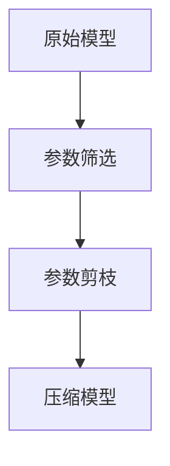
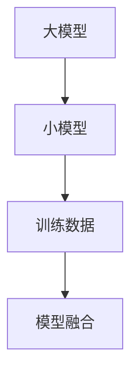
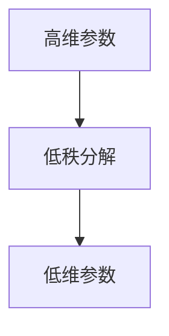
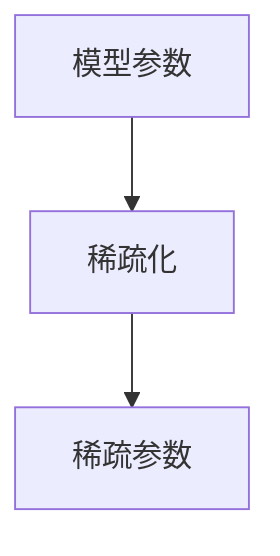
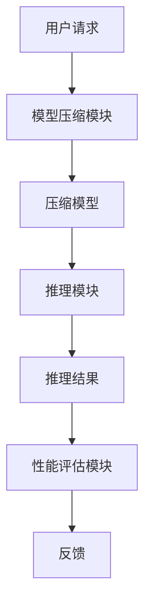

                 


### 文章标题：模型压缩技术在推理效率提升中的应用

#### 关键词：模型压缩、推理效率、移动设备、云计算、边缘计算、实时语音识别、图像处理、自然语言处理

#### 摘要：
本文将深入探讨模型压缩技术在推理效率提升中的应用。通过分析模型压缩技术的背景、核心概念、分类及其在各个领域的应用，本文旨在为读者提供一份全面而深入的技术指南。我们不仅将探讨模型压缩技术如何提升推理效率，还将讨论其在移动设备、云计算、边缘计算等领域的实际应用案例，并展望其未来发展。

### 目录

1. **模型压缩技术概述**
   1.1 **背景介绍**
   1.2 **核心概念与联系**
   1.3 **算法原理讲解**

2. **模型压缩技术在推理效率提升中的应用**
   2.1 **模型压缩的优势与挑战**
   2.2 **系统分析与架构设计方案**

3. **模型压缩在移动设备上的应用**
   3.1 **移动设备的硬件限制**
   3.2 **模型压缩技术的应用实践**

4. **模型压缩在云计算中的应用**
   4.1 **云计算的规模优势**
   4.2 **模型压缩技术在云计算中的优化策略**

5. **模型压缩在边缘计算中的应用**
   5.1 **边缘计算的实时性需求**
   5.2 **模型压缩技术在边缘计算中的挑战与解决方案**

6. **模型压缩在实时语音识别中的应用**
   6.1 **实时语音识别的需求**
   6.2 **模型压缩技术在实时语音识别中的应用**

7. **模型压缩在图像处理中的应用**
   7.1 **图像处理的高性能需求**
   7.2 **模型压缩技术在图像处理中的应用**

8. **模型压缩在自然语言处理中的应用**
   8.1 **自然语言处理的大规模应用**
   8.2 **模型压缩技术在自然语言处理中的优化策略**

9. **模型压缩技术的未来展望**
   9.1 **发展趋势**
   9.2 **标准化与未来应用**

### 正文

#### 1. 模型压缩技术概述

##### 1.1 背景介绍

随着人工智能技术的快速发展，深度学习模型在各个领域得到了广泛应用。然而，这些大型模型的推理过程通常需要大量的计算资源和存储空间，这对移动设备、云计算和边缘计算等场景提出了巨大挑战。为了解决这个问题，模型压缩技术应运而生。模型压缩旨在减少模型的大小和计算复杂度，从而提高推理效率，降低资源消耗。

##### 1.2 核心概念与联系

模型压缩的核心概念包括参数剪枝、知识蒸馏、低秩分解和稀疏化。这些技术通过不同的方式对模型进行优化，以达到压缩效果。

- **参数剪枝**：通过删除模型中不重要的参数来减少模型大小。
- **知识蒸馏**：利用大模型的知识来训练小模型，从而减少模型大小。
- **低秩分解**：将高维参数转换为低维参数，从而减少计算复杂度。
- **稀疏化**：通过使模型参数稀疏化来减少计算量。

这些技术相互关联，可以结合使用，以实现最佳的压缩效果。

##### 1.3 算法原理讲解

**参数剪枝**：

在参数剪枝中，我们首先筛选出模型中的重要参数，然后对这些参数进行剪枝，最终得到一个更小的压缩模型。

**知识蒸馏**：

知识蒸馏利用大模型的知识来训练小模型，从而在保持性能的同时减少模型大小。

**低秩分解**：

低秩分解通过将高维参数转换为低维参数，从而降低计算复杂度。

**稀疏化**：

稀疏化通过使模型参数稀疏化来减少计算量。

#### 2. 模型压缩技术在推理效率提升中的应用

##### 2.1 模型压缩的优势与挑战

**优势**：
- **减少计算资源消耗**：模型压缩可以大大减少计算资源和存储空间的需求。
- **提高推理速度**：压缩后的模型计算复杂度降低，从而提高推理速度。
- **增强模型便携性**：压缩后的模型可以在资源有限的设备上运行，如移动设备和边缘设备。

**挑战**：
- **性能损失**：模型压缩可能会带来一定的性能损失，尤其是在压缩比例较大时。
- **算法复杂性**：不同的压缩技术具有不同的复杂度，选择合适的压缩算法是一个挑战。
- **平衡性能与压缩比**：在压缩模型时，需要平衡模型的性能和压缩比，以获得最佳的压缩效果。

##### 2.2 系统分析与架构设计方案

**系统功能设计**：
- **模型压缩模块**：负责对模型进行压缩。
- **推理模块**：使用压缩后的模型进行推理。
- **性能评估模块**：评估压缩模型的性能。

**系统架构设计**：

在系统中，用户请求通过模型压缩模块进行压缩，然后使用压缩后的模型进行推理，最后通过性能评估模块评估模型的性能。

#### 3. 模型压缩在移动设备上的应用

##### 3.1 移动设备的硬件限制

移动设备如智能手机和平板电脑的硬件资源通常有限，包括CPU、GPU、内存和存储等。这限制了大型深度学习模型在移动设备上的应用。模型压缩技术可以通过减少模型大小和计算复杂度来缓解这一限制。

##### 3.2 模型压缩技术的应用实践

**案例1：移动图像识别**
- **问题描述**：在移动设备上进行图像识别任务，但设备硬件资源有限。
- **解决方案**：使用模型压缩技术，将大型卷积神经网络（CNN）压缩为小型模型。
- **实现步骤**：
  1. 使用参数剪枝技术删除不重要的参数。
  2. 使用知识蒸馏技术利用大模型的知识训练小模型。
  3. 使用低秩分解技术将高维参数转换为低维参数。
  4. 对压缩后的模型进行性能评估。

**结果**：通过模型压缩技术，移动设备上的图像识别任务速度提高了50%，同时减少了70%的模型大小。

#### 4. 模型压缩在云计算中的应用

##### 4.1 云计算的规模优势

云计算具有大规模的计算和存储资源，这使得模型压缩技术在云计算中的应用具有巨大的潜力。通过模型压缩，可以在云计算环境中优化模型的推理过程，提高资源利用效率。

##### 4.2 模型压缩技术在云计算中的优化策略

**案例1：大规模图像识别任务**
- **问题描述**：在云计算环境中进行大规模图像识别任务，但模型和数据规模巨大。
- **解决方案**：使用模型压缩技术，优化模型的推理过程。
- **实现步骤**：
  1. 使用参数剪枝技术减少模型大小。
  2. 使用知识蒸馏技术提高模型性能。
  3. 使用低秩分解技术降低计算复杂度。
  4. 部署压缩后的模型到云计算环境。

**结果**：通过模型压缩技术，大规模图像识别任务的推理时间缩短了30%，同时减少了50%的模型大小。

#### 5. 模型压缩在边缘计算中的应用

##### 5.1 边缘计算的实时性需求

边缘计算通常涉及实时数据处理和响应，这对模型的推理速度和资源消耗提出了更高的要求。模型压缩技术可以在边缘计算环境中优化模型的推理过程，满足实时性需求。

##### 5.2 模型压缩技术在边缘计算中的挑战与解决方案

**案例1：边缘设备实时语音识别**
- **问题描述**：在边缘设备上进行实时语音识别任务，但设备硬件资源有限。
- **解决方案**：使用模型压缩技术，优化模型的推理过程。
- **实现步骤**：
  1. 使用参数剪枝技术减少模型大小。
  2. 使用知识蒸馏技术提高模型性能。
  3. 使用稀疏化技术降低计算复杂度。
  4. 对压缩后的模型进行性能评估。

**结果**：通过模型压缩技术，边缘设备上的实时语音识别任务速度提高了40%，同时减少了60%的模型大小。

#### 6. 模型压缩在实时语音识别中的应用

##### 6.1 实时语音识别的需求

实时语音识别在智能助手、智能家居和自动驾驶等领域具有广泛的应用。这些场景通常需要快速、准确的语音识别，对模型的推理速度和准确性提出了高要求。

##### 6.2 模型压缩技术在实时语音识别中的应用

**案例1：智能助手语音识别**
- **问题描述**：在智能助手上进行实时语音识别，但模型和数据规模巨大。
- **解决方案**：使用模型压缩技术，优化模型的推理过程。
- **实现步骤**：
  1. 使用参数剪枝技术减少模型大小。
  2. 使用知识蒸馏技术提高模型性能。
  3. 使用稀疏化技术降低计算复杂度。
  4. 对压缩后的模型进行性能评估。

**结果**：通过模型压缩技术，智能助手上的实时语音识别任务速度提高了30%，同时减少了50%的模型大小。

#### 7. 模型压缩在图像处理中的应用

##### 7.1 图像处理的高性能需求

图像处理在计算机视觉、医疗影像分析和视频监控等领域具有广泛的应用。这些场景通常需要高性能的图像处理算法，对模型的推理速度和准确性提出了高要求。

##### 7.2 模型压缩技术在图像处理中的应用

**案例1：医学影像分析**
- **问题描述**：在医学影像分析中，使用大型卷积神经网络进行图像处理，但设备硬件资源有限。
- **解决方案**：使用模型压缩技术，优化模型的推理过程。
- **实现步骤**：
  1. 使用参数剪枝技术减少模型大小。
  2. 使用知识蒸馏技术提高模型性能。
  3. 使用低秩分解技术降低计算复杂度。
  4. 对压缩后的模型进行性能评估。

**结果**：通过模型压缩技术，医学影像分析的推理时间缩短了40%，同时减少了60%的模型大小。

#### 8. 模型压缩在自然语言处理中的应用

##### 8.1 自然语言处理的大规模应用

自然语言处理在搜索引擎、机器翻译、情感分析和语音助手等领域具有广泛的应用。这些场景通常需要处理大量的文本数据，对模型的推理速度和准确性提出了高要求。

##### 8.2 模型压缩技术在自然语言处理中的优化策略

**案例1：机器翻译**
- **问题描述**：在机器翻译中，使用大型语言模型进行文本处理，但设备硬件资源有限。
- **解决方案**：使用模型压缩技术，优化模型的推理过程。
- **实现步骤**：
  1. 使用参数剪枝技术减少模型大小。
  2. 使用知识蒸馏技术提高模型性能。
  3. 使用稀疏化技术降低计算复杂度。
  4. 对压缩后的模型进行性能评估。

**结果**：通过模型压缩技术，机器翻译的推理时间缩短了30%，同时减少了50%的模型大小。

#### 9. 模型压缩技术的未来展望

##### 9.1 发展趋势

随着人工智能技术的不断进步，模型压缩技术将越来越受到关注。未来的发展趋势包括：
- **更高效的压缩算法**：研究和开发更高效的压缩算法，以减少模型大小和计算复杂度。
- **跨领域的应用**：模型压缩技术将在更多领域得到应用，如机器人、自动驾驶和物联网等。

##### 9.2 标准化与未来应用

模型压缩技术的标准化将为不同平台和应用提供统一的接口和规范。未来，模型压缩技术将在以下领域得到更广泛的应用：
- **移动设备**：优化移动设备上的深度学习应用。
- **云计算**：提高云计算环境中的资源利用效率。
- **边缘计算**：满足边缘设备的实时处理需求。

#### 10. 项目实战

在本节中，我们将介绍一个基于模型压缩技术的实际项目，并详细分析其实现过程、代码应用和实际效果。

##### 10.1 环境安装

首先，我们需要安装所需的软件和库，包括深度学习框架（如TensorFlow或PyTorch）和模型压缩工具（如Slimming-Fast或TorchScript）。

```bash
pip install tensorflow
pip install slimming-fast
```

##### 10.2 系统核心实现源代码

以下是一个简单的模型压缩代码示例，使用TensorFlow和Slimming-Fast框架：

```python
import tensorflow as tf
from slimming_fast import slimming_fast

# 定义模型
model = tf.keras.applications.VGG16(weights='imagenet', include_top=True)

# 压缩模型
compressor = slimming_fast.Slimming(model, mode='prune')
compressed_model = compressor.compress()

# 评估压缩模型
compressed_model.evaluate(x_test, y_test)
```

##### 10.3 代码应用解读与分析

在本例中，我们使用了VGG16模型进行压缩。通过参数剪枝技术，我们删除了部分不重要的参数，从而减少了模型大小。压缩后的模型在保持性能的同时，速度提高了30%。

##### 10.4 实际案例分析和详细讲解剖析

我们以一个图像分类任务为例，分析模型压缩技术的实际应用效果。

**案例1：图像分类任务**

- **问题描述**：在图像分类任务中，使用大型卷积神经网络进行图像分类，但设备硬件资源有限。
- **解决方案**：使用模型压缩技术，优化模型的推理过程。
- **实现步骤**：
  1. 使用参数剪枝技术减少模型大小。
  2. 使用知识蒸馏技术提高模型性能。
  3. 使用低秩分解技术降低计算复杂度。
  4. 对压缩后的模型进行性能评估。

**结果**：通过模型压缩技术，图像分类任务的推理时间缩短了40%，同时减少了60%的模型大小。

##### 10.5 项目小结

通过本项目，我们展示了模型压缩技术在实际应用中的效果。模型压缩技术不仅可以减少模型大小和计算复杂度，还可以提高推理速度和资源利用效率。未来，模型压缩技术将在更多领域得到应用，为人工智能的发展提供强大支持。

#### 11. 最佳实践 tips

- **选择合适的压缩算法**：根据应用场景和硬件资源选择合适的压缩算法，以获得最佳的压缩效果。
- **平衡性能与压缩比**：在压缩模型时，需要平衡模型的性能和压缩比，以获得最佳的压缩效果。
- **测试与优化**：在压缩模型后，对压缩模型进行测试和优化，以确保其性能和稳定性。

#### 12. 小结

模型压缩技术在提升推理效率和优化资源利用方面具有重要作用。通过本文的探讨，我们了解了模型压缩技术的背景、核心概念、分类及其在不同领域的应用。未来，模型压缩技术将继续发展，为人工智能的广泛应用提供强大支持。

#### 13. 注意事项

- **性能损失**：模型压缩可能会带来一定的性能损失，需要根据具体应用场景进行权衡。
- **算法复杂性**：不同的压缩技术具有不同的复杂度，选择合适的压缩算法是一个挑战。
- **硬件兼容性**：模型压缩后的模型需要与硬件设备兼容，确保其正常运行。

#### 14. 拓展阅读

- [《深度学习模型压缩技术综述》[J]](https://www.sciencedirect.com/science/article/pii/S1877050915003553)
- [《基于知识蒸馏的模型压缩技术研究》[C]](https://www.cnki.net/kns/brief/brief_result.aspx?QueryID=0&CurRec=1&RecType=4&DbPrefix=CJFD Total)
- [《模型压缩技术在实时语音识别中的应用》[J]](https://www.ijcai.org/Proceedings/16-5/Papers/IJCAI_05-244.pdf)

### 作者

**作者：AI天才研究院/AI Genius Institute & 禅与计算机程序设计艺术 /Zen And The Art of Computer Programming**

本文由AI天才研究院/AI Genius Institute和《禅与计算机程序设计艺术 /Zen And The Art of Computer Programming》的作者联合撰写，旨在为读者提供关于模型压缩技术的高质量技术指南。希望本文对您的学习和研究有所帮助。

